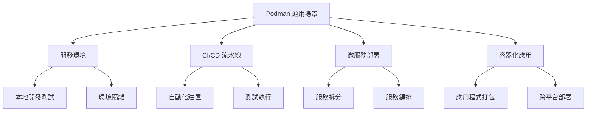
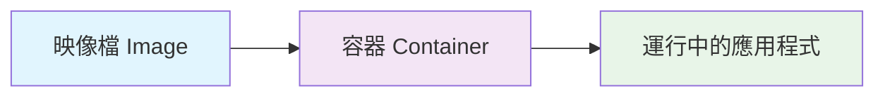
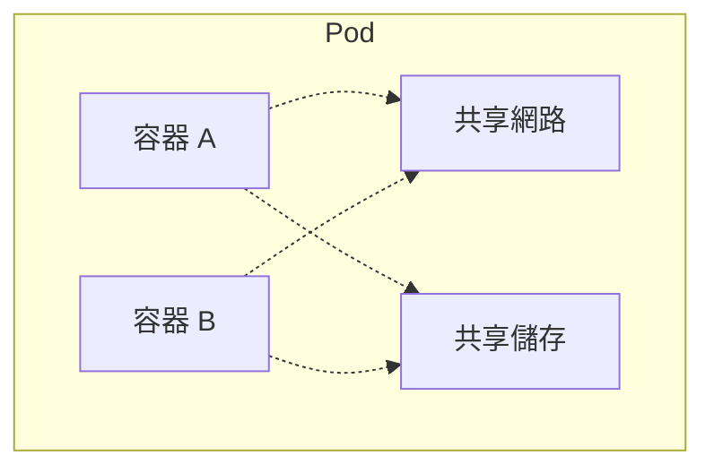
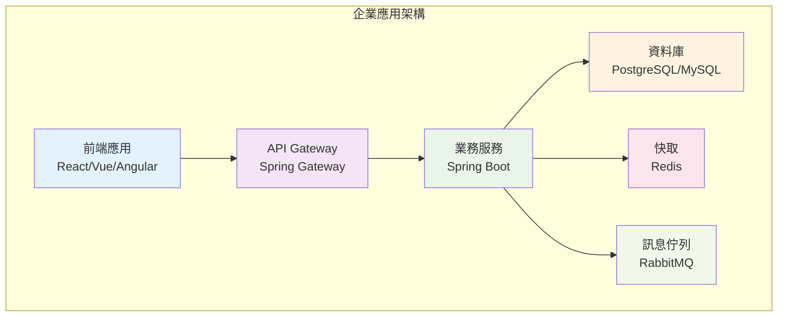
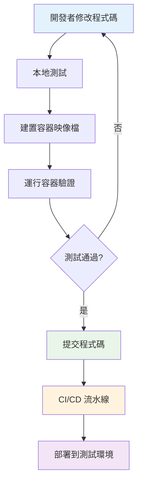
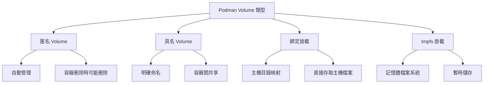
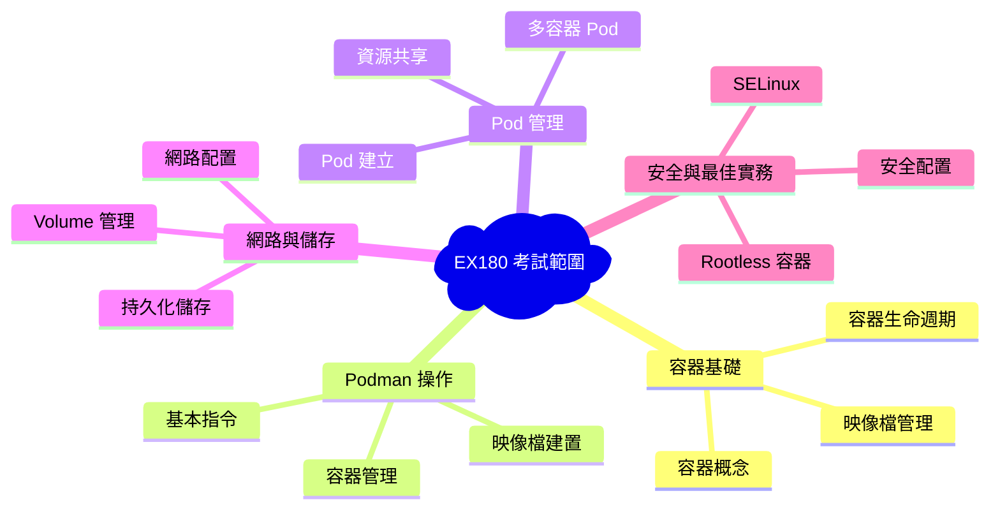
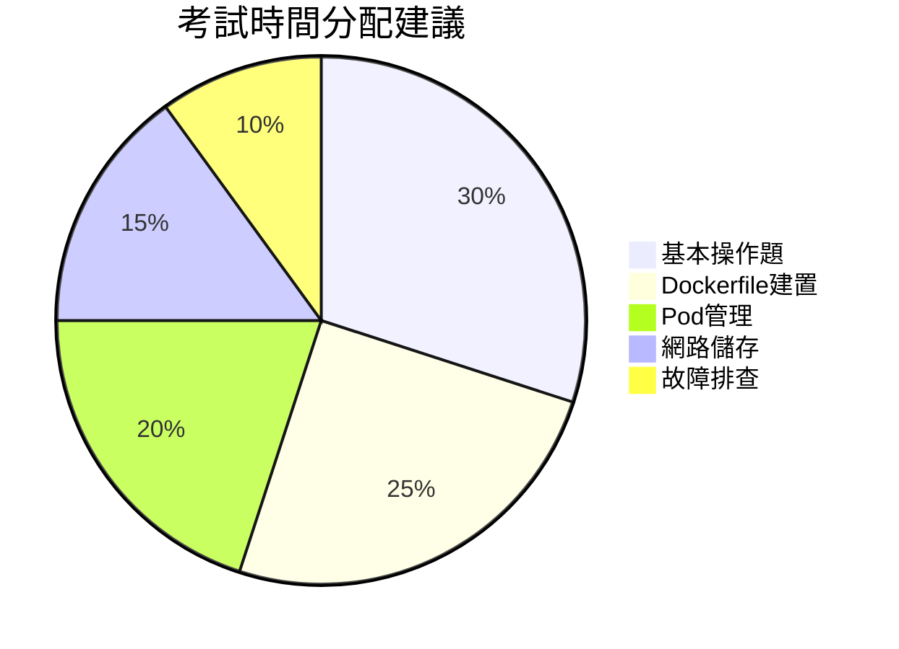
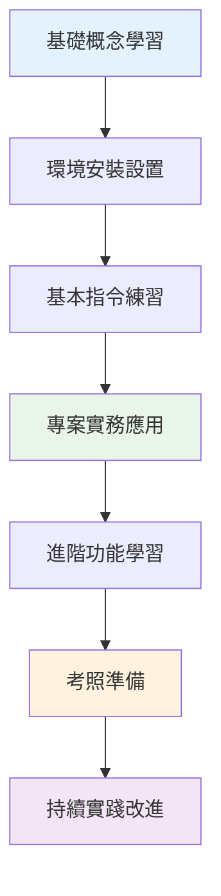

+++
date = '2025-10-31T00:00:00+08:00'
draft = false
title = 'Podman使用教學'
tags = ['教學', '工具']
categories = ['教學']
+++
# Podman 使用教學手冊

## 📋 目錄

- [1. 基礎入門](#1-基礎入門)
  - [1.1 什麼是 Podman](#11-什麼是-podman)
    - [1.1.1 主要特色](#111-主要特色)
    - [1.1.2 適用場景](#112-適用場景)
  - [1.2 Podman 與 Docker 的差異](#12-podman-與-docker-的差異)
    - [1.2.1 指令對比範例](#121-指令對比範例)
  - [1.3 安裝與環境設定](#13-安裝與環境設定)
    - [1.3.1 Windows 安裝](#131-windows-安裝)
    - [1.3.2 Linux 安裝](#132-linux-安裝)
    - [1.3.3 macOS 安裝](#133-macos-安裝)
    - [1.3.4 初始配置](#134-初始配置)
  - [1.4 基本概念](#14-基本概念)
    - [1.4.1 容器（Container）](#141-容器container)
    - [1.4.2 映像檔（Image）](#142-映像檔image)
    - [1.4.3 Pod](#143-pod)
  - [1.5 基本指令](#15-基本指令)
    - [1.5.1 映像檔管理](#151-映像檔管理)
    - [1.5.2 容器管理](#152-容器管理)
    - [1.5.3 實務範例](#153-實務範例)
    - [1.5.4 常用選項說明](#154-常用選項說明)
  - [1.6 注意事項與最佳實務](#16-注意事項與最佳實務)
    - [1.6.1 安全性注意事項](#161-安全性注意事項)
    - [1.6.2 效能優化建議](#162-效能優化建議)
    - [1.6.3 疑難排解](#163-疑難排解)
  - [📝 基礎實務練習](#-基礎實務練習)
- [2. 專案實務應用](#2-專案實務應用)
  - [2.1 企業專案環境設置](#21-企業專案環境設置)
    - [2.1.1 典型企業專案架構](#211-典型企業專案架構)
    - [2.1.2 容器化策略](#212-容器化策略)
  - [2.2 Spring Boot 應用容器化](#22-spring-boot-應用容器化)
    - [2.2.1 建立 Dockerfile](#221-建立-dockerfile)
    - [2.2.2 建置和運行 Spring Boot 容器](#222-建置和運行-spring-boot-容器)
  - [2.3 前端應用容器化](#23-前端應用容器化)
    - [2.3.1 React 應用 Dockerfile](#231-react-應用-dockerfile)
    - [2.3.2 Nginx 配置檔案](#232-nginx-配置檔案)
  - [2.4 資料庫容器化](#24-資料庫容器化)
    - [2.4.1 PostgreSQL 容器設置](#241-postgresql-容器設置)
    - [2.4.2 Redis 快取容器](#242-redis-快取容器)
  - [2.5 開發環境管理](#25-開發環境管理)
    - [2.5.1 開發環境 Pod 創建](#251-開發環境-pod-創建)
    - [2.5.2 開發工作流程](#252-開發工作流程)
  - [2.6 CI/CD 整合](#26-cicd-整合)
    - [2.6.1 GitLab CI 範例](#261-gitlab-ci-範例)
    - [2.6.2 GitHub Actions 範例](#262-github-actions-範例)
  - [2.7 微服務架構實作](#27-微服務架構實作)
    - [2.7.1 服務發現與負載平衡](#271-服務發現與負載平衡)
    - [2.7.2 API Gateway 設置](#272-api-gateway-設置)
  - [2.8 監控與日誌管理](#28-監控與日誌管理)
    - [2.8.1 集中式日誌收集](#281-集中式日誌收集)
    - [2.8.2 應用程式監控](#282-應用程式監控)
  - [2.9 除錯技巧](#29-除錯技巧)
    - [2.9.1 容器除錯](#291-容器除錯)
    - [2.9.2 網路除錯](#292-網路除錯)
  - [2.10 效能優化](#210-效能優化)
    - [2.10.1 映像檔優化](#2101-映像檔優化)
    - [2.10.2 資源限制](#2102-資源限制)
  - [📝 專案實務練習](#-專案實務練習)
- [3. 進階操作](#3-進階操作)
  - [3.1 Podman Compose](#31-podman-compose)
    - [3.1.1 什麼是 Podman Compose](#311-什麼是-podman-compose)
    - [3.1.2 安裝 Podman Compose](#312-安裝-podman-compose)
    - [3.1.3 Compose 檔案結構](#313-compose-檔案結構)
    - [3.1.4 Compose 常用指令](#314-compose-常用指令)
  - [3.2 映像檔最佳化](#32-映像檔最佳化)
    - [3.2.1 多階段建置](#321-多階段建置)
    - [3.2.2 映像檔層級最佳化](#322-映像檔層級最佳化)
    - [3.2.3 .containerignore 檔案](#323-containerignore-檔案)
  - [3.3 安全性強化](#33-安全性強化)
    - [3.3.1 映像檔安全掃描](#331-映像檔安全掃描)
    - [3.3.2 安全 Dockerfile 實務](#332-安全-dockerfile-實務)
    - [3.3.3 容器執行時安全](#333-容器執行時安全)
  - [3.4 Volume 管理](#34-volume-管理)
    - [3.4.1 Volume 類型](#341-volume-類型)
    - [3.4.2 Volume 操作](#342-volume-操作)
    - [3.4.3 進階 Volume 配置](#343-進階-volume-配置)
  - [3.5 網路管理](#35-網路管理)
    - [3.5.1 網路類型](#351-網路類型)
    - [3.5.2 容器網路配置](#352-容器網路配置)
    - [3.5.3 網路除錯](#353-網路除錯)
  - [3.6 Registry 管理](#36-registry-管理)
    - [3.6.1 私有 Registry 設置](#361-私有-registry-設置)
    - [3.6.2 Registry 認證](#362-registry-認證)
    - [3.6.3 Registry 鏡像配置](#363-registry-鏡像配置)
  - [3.7 系統管理與維護](#37-系統管理與維護)
    - [3.7.1 系統清理](#371-系統清理)
    - [3.7.2 系統監控](#372-系統監控)
    - [3.7.3 備份與還原](#373-備份與還原)
  - [📝 進階實務練習](#-進階實務練習)
- [4. 考照準備](#4-考照準備)
  - [4.1 Podman 認證概述](#41-podman-認證概述)
    - [4.1.1 認證類型](#411-認證類型)
    - [4.1.2 EX180 考試範圍](#412-ex180-考試範圍)
  - [4.2 核心知識點整理](#42-核心知識點整理)
    - [4.2.1 容器基本概念](#421-容器基本概念)
    - [4.2.2 Podman 架構特色](#422-podman-架構特色)
  - [4.3 常見考題類型](#43-常見考題類型)
    - [4.3.1 基本操作題（30%）](#431-基本操作題30)
    - [4.3.2 Dockerfile 建置題（25%）](#432-dockerfile-建置題25)
    - [4.3.3 Pod 管理題（20%）](#433-pod-管理題20)
    - [4.3.4 網路與儲存題（15%）](#434-網路與儲存題15)
    - [4.3.5 安全與故障排查題（10%）](#435-安全與故障排查題10)
  - [4.4 實戰模擬題](#44-實戰模擬題)
    - [4.4.1 綜合情境題 1](#441-綜合情境題-1)
    - [4.4.2 綜合情境題 2](#442-綜合情境題-2)
  - [4.5 考試策略與技巧](#45-考試策略與技巧)
    - [4.5.1 時間管理](#451-時間管理)
    - [4.5.2 常見錯誤避免](#452-常見錯誤避免)
    - [4.5.3 除錯技巧](#453-除錯技巧)
  - [4.6 練習題庫](#46-練習題庫)
    - [4.6.1 基礎練習題](#461-基礎練習題)
    - [4.6.2 進階練習題](#462-進階練習題)
  - [4.7 考前檢查清單](#47-考前檢查清單)
    - [4.7.1 知識點檢查](#471-知識點檢查)
    - [4.7.2 實務操作檢查](#472-實務操作檢查)
    - [4.7.3 考試環境準備](#473-考試環境準備)
- [5. 附錄](#5-附錄)
  - [5.1 常見錯誤排查](#51-常見錯誤排查)
    - [5.1.1 安裝和設定問題](#511-安裝和設定問題)
    - [5.1.2 容器運行問題](#512-容器運行問題)
    - [5.1.3 效能問題](#513-效能問題)
  - [5.2 最佳實務建議](#52-最佳實務建議)
    - [5.2.1 安全性最佳實務](#521-安全性最佳實務)
    - [5.2.2 效能最佳實務](#522-效能最佳實務)
    - [5.2.3 維護性最佳實務](#523-維護性最佳實務)
  - [5.3 指令參考手冊](#53-指令參考手冊)
    - [5.3.1 映像檔管理指令](#531-映像檔管理指令)
    - [5.3.2 容器管理指令](#532-容器管理指令)
    - [5.3.3 Pod 管理指令](#533-pod-管理指令)
    - [5.3.4 網路管理指令](#534-網路管理指令)
    - [5.3.5 Volume 管理指令](#535-volume-管理指令)
  - [5.4 設定檔範本](#54-設定檔範本)
    - [5.4.1 Dockerfile 範本](#541-dockerfile-範本)
    - [5.4.2 Compose 檔案範本](#542-compose-檔案範本)
  - [5.5 工具和資源](#55-工具和資源)
    - [5.5.1 有用的工具](#551-有用的工具)
    - [5.5.2 學習資源](#552-學習資源)
  - [5.6 檢查清單（Checklist）](#56-檢查清單checklist)
    - [5.6.1 開發環境設置檢查清單](#561-開發環境設置檢查清單)
    - [5.6.2 生產部署檢查清單](#562-生產部署檢查清單)
    - [5.6.3 故障排查檢查清單](#563-故障排查檢查清單)

---

## 1. 基礎入門

### 1.1 什麼是 Podman

Podman（Pod Manager）是一個開源的容器管理工具，由 Red Hat 開發。它提供與 Docker 相似的功能，但採用了不同的架構設計。

#### 1.1.1 主要特色

- **無守護程序（Daemonless）**: 不需要運行背景守護程序
- **Rootless 容器**: 支援非 root 用戶運行容器
- **Pod 原生支援**: 內建 Kubernetes Pod 概念
- **OCI 相容**: 遵循開放容器倡議標準
- **安全性優先**: 預設採用更安全的配置

#### 1.1.2 適用場景



### 1.2 Podman 與 Docker 的差異

| 特性 | Podman | Docker |
|------|--------|--------|
| 架構 | 無守護程序 | 客戶端-服務器架構 |
| 安全性 | Rootless 執行 | 需要 root 權限 |
| Pod 支援 | 原生支援 | 需要額外工具 |
| 資源消耗 | 較低 | 較高（守護程序） |
| CLI 相容性 | 高度相容 Docker CLI | 原生 Docker CLI |
| 企業採用 | Red Hat 生態系 | 廣泛採用 |

#### 1.2.1 指令對比範例

```bash
# Docker 指令
docker run -it ubuntu:20.04 /bin/bash
docker build -t myapp .
docker ps

# Podman 指令（幾乎相同）
podman run -it ubuntu:20.04 /bin/bash
podman build -t myapp .
podman ps
```

### 1.3 安裝與環境設定

#### 1.3.1 Windows 安裝

```powershell
# 使用 Windows Package Manager
winget install RedHat.Podman

# 或使用 Chocolatey
choco install podman-desktop

# 驗證安裝
podman --version
```

#### 1.3.2 Linux 安裝

```bash
# Ubuntu/Debian
sudo apt update
sudo apt install podman

# CentOS/RHEL/Fedora
sudo dnf install podman

# 驗證安裝
podman --version
```

#### 1.3.3 macOS 安裝

```bash
# 使用 Homebrew
brew install podman

# 啟動 Podman 機器
podman machine init
podman machine start

# 驗證安裝
podman --version
```

#### 1.3.4 初始配置

```bash
# 配置 Registry（映像檔倉庫）
mkdir -p ~/.config/containers
cat > ~/.config/containers/registries.conf << EOF
[registries.search]
registries = ['docker.io', 'quay.io']

[registries.insecure]
registries = []
EOF

# 配置儲存
podman info
```

### 1.4 基本概念

#### 1.4.1 容器（Container）

容器是一個可執行的軟體套件，包含應用程式及其所有相依性。



#### 1.4.2 映像檔（Image）

映像檔是容器的唯讀模板，包含應用程式的執行環境。

```bash
# 查看本地映像檔
podman images

# 搜尋映像檔
podman search nginx

# 下載映像檔
podman pull nginx:latest
```

#### 1.4.3 Pod

Pod 是一個或多個容器的集合，共享網路和儲存資源。



### 1.5 基本指令

#### 1.5.1 映像檔管理

```bash
# 列出映像檔
podman images

# 搜尋映像檔
podman search <映像檔名稱>

# 下載映像檔
podman pull <映像檔名稱>:<標籤>

# 刪除映像檔
podman rmi <映像檔ID或名稱>

# 查看映像檔詳細資訊
podman inspect <映像檔名稱>
```

#### 1.5.2 容器管理

```bash
# 運行容器
podman run [選項] <映像檔> [命令]

# 列出運行中的容器
podman ps

# 列出所有容器（包含停止的）
podman ps -a

# 停止容器
podman stop <容器ID或名稱>

# 啟動已停止的容器
podman start <容器ID或名稱>

# 重啟容器
podman restart <容器ID或名稱>

# 刪除容器
podman rm <容器ID或名稱>

# 查看容器日誌
podman logs <容器ID或名稱>

# 進入運行中的容器
podman exec -it <容器ID或名稱> /bin/bash
```

#### 1.5.3 實務範例

##### 範例 1：運行 Web 服務器

```bash
# 運行 Nginx 容器
podman run -d --name my-nginx -p 8080:80 nginx:latest

# 驗證容器運行
podman ps

# 測試服務
curl http://localhost:8080

# 查看日誌
podman logs my-nginx

# 停止並清理
podman stop my-nginx
podman rm my-nginx
```

##### 範例 2：運行 Java 應用程式

```bash
# 基於 OpenJDK 映像檔運行
podman run -it --name java-container openjdk:11 java -version

# 掛載本地程式碼
podman run -it \
  --name java-dev \
  -v $(pwd):/workspace \
  -w /workspace \
  openjdk:11 \
  bash
```

#### 1.5.4 常用選項說明

| 選項 | 說明 | 範例 |
|------|------|------|
| `-d` | 背景執行 | `podman run -d nginx` |
| `-it` | 互動模式 | `podman run -it ubuntu bash` |
| `-p` | 連接埠映射 | `podman run -p 8080:80 nginx` |
| `-v` | 掛載磁碟區 | `podman run -v /data:/app/data nginx` |
| `--name` | 指定容器名稱 | `podman run --name my-app nginx` |
| `--rm` | 停止後自動刪除 | `podman run --rm nginx` |
| `-e` | 設定環境變數 | `podman run -e NODE_ENV=production node` |

### 1.6 注意事項與最佳實務

#### 1.6.1 安全性注意事項

1. **使用 Rootless 模式**: 盡可能以非 root 用戶執行
2. **映像檔來源**: 只使用可信任的映像檔來源
3. **定期更新**: 保持映像檔和 Podman 版本最新
4. **最小權限原則**: 只授予必要的權限

#### 1.6.2 效能優化建議

1. **選擇適當的基礎映像檔**: 使用較小的基礎映像檔
2. **清理暫存檔案**: 定期清理不需要的映像檔和容器
3. **使用 .containerignore**: 避免複製不必要的檔案

```bash
# 清理系統
podman system prune -a

# 查看系統資訊
podman system info

# 查看磁碟使用情況
podman system df
```

#### 1.6.3 疑難排解

```bash
# 檢查系統狀態
podman system info

# 查看詳細日誌
podman logs --details <容器名稱>

# 檢查容器狀態
podman inspect <容器名稱>

# 檢查網路狀態
podman network ls
```

---

## 📝 基礎實務練習

### 基礎練習目標

熟悉 Podman 基本操作

### 基礎練習步驟

1. 安裝 Podman 並驗證版本
2. 下載 `hello-world` 映像檔並運行
3. 運行一個 Web 服務器容器並測試連線
4. 查看容器日誌和狀態
5. 清理創建的容器和映像檔

### 基礎驗證標準

- [ ] 成功安裝 Podman
- [ ] 能夠運行基本容器
- [ ] 能夠查看和管理容器狀態
- [ ] 能夠清理系統資源

---

## 2. 專案實務應用

### 2.1 企業專案環境設置

#### 2.1.1 典型企業專案架構



#### 2.1.2 容器化策略

每個服務獨立容器化，便於：

- 獨立部署和擴展
- 技術棧隔離
- 故障隔離
- 團隊協作

### 2.2 Spring Boot 應用容器化

#### 2.2.1 建立 Dockerfile

```dockerfile
# 多階段建置範例
FROM maven:3.8-openjdk-11 AS build
WORKDIR /app
COPY pom.xml .
COPY src ./src
RUN mvn clean package -DskipTests

FROM openjdk:11-jre-slim
WORKDIR /app
COPY --from=build /app/target/*.jar app.jar

# 建立非 root 用戶
RUN groupadd -r appuser && useradd -r -g appuser appuser
RUN chown -R appuser:appuser /app
USER appuser

# 健康檢查
HEALTHCHECK --interval=30s --timeout=3s --start-period=5s --retries=3 \
  CMD curl -f http://localhost:8080/actuator/health || exit 1

EXPOSE 8080
ENTRYPOINT ["java", "-jar", "app.jar"]
```

#### 2.2.2 建置和運行 Spring Boot 容器

```bash
# 建置映像檔
podman build -t myapp-backend:latest .

# 運行應用程式
podman run -d \
  --name myapp-backend \
  -p 8080:8080 \
  -e SPRING_PROFILES_ACTIVE=dev \
  -e DATABASE_URL=jdbc:postgresql://db:5432/myapp \
  myapp-backend:latest

# 查看應用程式日誌
podman logs -f myapp-backend

# 檢查應用程式健康狀態
curl http://localhost:8080/actuator/health
```

### 2.3 前端應用容器化

#### 2.3.1 React 應用 Dockerfile

```dockerfile
# React 應用多階段建置
FROM node:16-alpine AS build
WORKDIR /app
COPY package*.json ./
RUN npm ci --only=production

COPY . .
RUN npm run build

FROM nginx:alpine
COPY --from=build /app/build /usr/share/nginx/html
COPY nginx.conf /etc/nginx/nginx.conf

# 建立非 root 用戶
RUN addgroup -g 1001 -S nodejs
RUN adduser -S nextjs -u 1001
USER nextjs

EXPOSE 80
CMD ["nginx", "-g", "daemon off;"]
```

#### 2.3.2 Nginx 配置檔案

```nginx
# nginx.conf
events {
    worker_connections 1024;
}

http {
    include       /etc/nginx/mime.types;
    default_type  application/octet-stream;
    
    server {
        listen 80;
        server_name localhost;
        root /usr/share/nginx/html;
        index index.html;
        
        # SPA 路由支援
        location / {
            try_files $uri $uri/ /index.html;
        }
        
        # API 代理
        location /api/ {
            proxy_pass http://backend:8080/;
            proxy_set_header Host $host;
            proxy_set_header X-Real-IP $remote_addr;
        }
    }
}
```

### 2.4 資料庫容器化

#### 2.4.1 PostgreSQL 容器設置

```bash
# 建立資料持久化目錄
mkdir -p ~/podman-data/postgres

# 運行 PostgreSQL 容器
podman run -d \
  --name postgres-db \
  -e POSTGRES_DB=myapp \
  -e POSTGRES_USER=appuser \
  -e POSTGRES_PASSWORD=securepassword \
  -v ~/podman-data/postgres:/var/lib/postgresql/data \
  -p 5432:5432 \
  postgres:13

# 連接到資料庫
podman exec -it postgres-db psql -U appuser -d myapp
```

#### 2.4.2 Redis 快取容器

```bash
# 運行 Redis 容器
podman run -d \
  --name redis-cache \
  -p 6379:6379 \
  -v ~/podman-data/redis:/data \
  redis:6-alpine redis-server --appendonly yes

# 測試 Redis 連線
podman exec -it redis-cache redis-cli ping
```

### 2.5 開發環境管理

#### 2.5.1 開發環境 Pod 創建

```bash
# 建立開發環境 Pod
podman pod create \
  --name dev-environment \
  -p 3000:3000 \
  -p 8080:8080 \
  -p 5432:5432 \
  -p 6379:6379

# 在 Pod 中運行各個服務
podman run -d --pod dev-environment --name frontend myapp-frontend:latest
podman run -d --pod dev-environment --name backend myapp-backend:latest
podman run -d --pod dev-environment --name database postgres:13
podman run -d --pod dev-environment --name cache redis:6-alpine
```

#### 2.5.2 開發工作流程



### 2.6 CI/CD 整合

#### 2.6.1 GitLab CI 範例

```yaml
# .gitlab-ci.yml
stages:
  - build
  - test
  - deploy

variables:
  CONTAINER_IMAGE: $CI_REGISTRY_IMAGE:$CI_COMMIT_SHA

build:
  stage: build
  script:
    - podman build -t $CONTAINER_IMAGE .
    - podman push $CONTAINER_IMAGE
  only:
    - master
    - develop

test:
  stage: test
  script:
    - podman run --rm $CONTAINER_IMAGE npm test
  only:
    - master
    - develop

deploy_staging:
  stage: deploy
  script:
    - podman pull $CONTAINER_IMAGE
    - podman stop myapp-staging || true
    - podman rm myapp-staging || true
    - podman run -d --name myapp-staging -p 8080:8080 $CONTAINER_IMAGE
  environment:
    name: staging
    url: http://staging.myapp.com
  only:
    - develop
```

#### 2.6.2 GitHub Actions 範例

```yaml
# .github/workflows/docker.yml
name: Build and Deploy

on:
  push:
    branches: [ main, develop ]
  pull_request:
    branches: [ main ]

jobs:
  build:
    runs-on: ubuntu-latest
    
    steps:
    - uses: actions/checkout@v3
    
    - name: Setup Podman
      run: |
        sudo apt-get update
        sudo apt-get install -y podman
    
    - name: Build image
      run: |
        podman build -t myapp:${{ github.sha }} .
    
    - name: Run tests
      run: |
        podman run --rm myapp:${{ github.sha }} npm test
    
    - name: Push to registry
      if: github.ref == 'refs/heads/main'
      run: |
        echo ${{ secrets.REGISTRY_PASSWORD }} | podman login -u ${{ secrets.REGISTRY_USERNAME }} --password-stdin
        podman push myapp:${{ github.sha }}
```

### 2.7 微服務架構實作

#### 2.7.1 服務發現與負載平衡

```bash
# 建立微服務網路
podman network create microservices-net

# 運行服務註冊中心（Consul）
podman run -d \
  --name consul \
  --network microservices-net \
  -p 8500:8500 \
  consul:latest

# 運行用戶服務
podman run -d \
  --name user-service \
  --network microservices-net \
  -e SERVICE_NAME=user-service \
  -e CONSUL_HOST=consul \
  myapp-user-service:latest

# 運行訂單服務
podman run -d \
  --name order-service \
  --network microservices-net \
  -e SERVICE_NAME=order-service \
  -e CONSUL_HOST=consul \
  myapp-order-service:latest
```

#### 2.7.2 API Gateway 設置

```bash
# 運行 API Gateway
podman run -d \
  --name api-gateway \
  --network microservices-net \
  -p 80:8080 \
  -v $(pwd)/gateway-config.yml:/app/config.yml \
  myapp-gateway:latest
```

### 2.8 監控與日誌管理

#### 2.8.1 集中式日誌收集

```bash
# 運行 ELK Stack

# Elasticsearch
podman run -d \
  --name elasticsearch \
  --network microservices-net \
  -p 9200:9200 \
  -e "discovery.type=single-node" \
  elasticsearch:7.15.0

# Logstash
podman run -d \
  --name logstash \
  --network microservices-net \
  -p 5044:5044 \
  -v $(pwd)/logstash.conf:/usr/share/logstash/pipeline/logstash.conf \
  logstash:7.15.0

# Kibana
podman run -d \
  --name kibana \
  --network microservices-net \
  -p 5601:5601 \
  -e ELASTICSEARCH_HOSTS=http://elasticsearch:9200 \
  kibana:7.15.0
```

#### 2.8.2 應用程式監控

```bash
# 運行 Prometheus
podman run -d \
  --name prometheus \
  --network microservices-net \
  -p 9090:9090 \
  -v $(pwd)/prometheus.yml:/etc/prometheus/prometheus.yml \
  prom/prometheus:latest

# 運行 Grafana
podman run -d \
  --name grafana \
  --network microservices-net \
  -p 3000:3000 \
  -e GF_SECURITY_ADMIN_PASSWORD=admin \
  grafana/grafana:latest
```

### 2.9 除錯技巧

#### 2.9.1 容器除錯

```bash
# 檢查容器狀態
podman inspect <容器名稱>

# 查看容器資源使用情況
podman stats <容器名稱>

# 進入容器進行除錯
podman exec -it <容器名稱> /bin/bash

# 查看容器檔案系統變更
podman diff <容器名稱>

# 複製檔案進出容器
podman cp <容器名稱>:/path/to/file ./local-file
podman cp ./local-file <容器名稱>:/path/to/file
```

#### 2.9.2 網路除錯

```bash
# 檢查網路配置
podman network ls
podman network inspect <網路名稱>

# 測試容器間連線
podman exec -it <容器名稱> ping <目標容器名稱>
podman exec -it <容器名稱> curl http://<目標容器名稱>:8080/health

# 查看連接埠映射
podman port <容器名稱>
```

### 2.10 效能優化

#### 2.10.1 映像檔優化

```dockerfile
# 優化後的 Dockerfile
FROM openjdk:11-jre-slim

# 使用非 root 用戶
RUN groupadd -r appuser && useradd -r -g appuser appuser

# 只複製必要檔案
COPY --chown=appuser:appuser target/app.jar /app/app.jar

# 設置工作目錄
WORKDIR /app
USER appuser

# 優化 JVM 參數
ENV JAVA_OPTS="-XX:+UseContainerSupport -XX:MaxRAMPercentage=75.0"

EXPOSE 8080
ENTRYPOINT ["sh", "-c", "java $JAVA_OPTS -jar app.jar"]
```

#### 2.10.2 資源限制

```bash
# 設置資源限制
podman run -d \
  --name myapp \
  --memory=512m \
  --cpus=1.0 \
  --memory-swap=512m \
  myapp:latest
```

---

## 📝 專案實務練習

### 專案練習目標

建立完整的微服務開發環境

### 專案練習步驟

1. 建立一個簡單的 Spring Boot 應用程式
2. 撰寫 Dockerfile 並建置映像檔
3. 建立資料庫容器（PostgreSQL）
4. 使用 Pod 管理整個應用程式棧
5. 配置容器間網路通訊
6. 實作健康檢查和監控

### 專案驗證標準

- [ ] 成功建置 Spring Boot 映像檔
- [ ] 資料庫容器正常運行並可連接
- [ ] 應用程式容器能夠連接資料庫
- [ ] Pod 內所有服務正常運行
- [ ] 能夠通過瀏覽器訪問應用程式

## 3. 進階操作

### 3.1 Podman Compose

#### 3.1.1 什麼是 Podman Compose

Podman Compose 是一個工具，允許您使用 YAML 檔案定義和運行多容器應用程式。它與 Docker Compose 格式相容。

#### 3.1.2 安裝 Podman Compose

```bash
# 使用 pip 安裝
pip3 install podman-compose

# 或使用 package manager
# Ubuntu/Debian
sudo apt install podman-compose

# Fedora
sudo dnf install podman-compose

# 驗證安裝
podman-compose --version
```

#### 3.1.3 Compose 檔案結構

```yaml
# docker-compose.yml 範例
version: '3.8'

services:
  # 前端服務
  frontend:
    build: ./frontend
    ports:
      - "3000:3000"
    environment:
      - REACT_APP_API_URL=http://localhost:8080
    depends_on:
      - backend
    networks:
      - app-network

  # 後端服務
  backend:
    build: ./backend
    ports:
      - "8080:8080"
    environment:
      - SPRING_PROFILES_ACTIVE=docker
      - DATABASE_URL=jdbc:postgresql://database:5432/myapp
      - REDIS_URL=redis://cache:6379
    depends_on:
      - database
      - cache
    networks:
      - app-network
    volumes:
      - ./logs:/app/logs

  # 資料庫服務
  database:
    image: postgres:13
    environment:
      - POSTGRES_DB=myapp
      - POSTGRES_USER=appuser
      - POSTGRES_PASSWORD=securepassword
    volumes:
      - postgres_data:/var/lib/postgresql/data
      - ./init.sql:/docker-entrypoint-initdb.d/init.sql
    networks:
      - app-network

  # 快取服務
  cache:
    image: redis:6-alpine
    volumes:
      - redis_data:/data
    networks:
      - app-network

  # 反向代理
  nginx:
    image: nginx:alpine
    ports:
      - "80:80"
      - "443:443"
    volumes:
      - ./nginx.conf:/etc/nginx/nginx.conf
      - ./ssl:/etc/nginx/ssl
    depends_on:
      - frontend
      - backend
    networks:
      - app-network

volumes:
  postgres_data:
  redis_data:

networks:
  app-network:
    driver: bridge
```

#### 3.1.4 Compose 常用指令

```bash
# 啟動所有服務
podman-compose up

# 背景啟動
podman-compose up -d

# 檢視服務狀態
podman-compose ps

# 檢視日誌
podman-compose logs

# 檢視特定服務日誌
podman-compose logs backend

# 停止所有服務
podman-compose down

# 停止並刪除卷
podman-compose down -v

# 重建服務
podman-compose build

# 擴展服務
podman-compose up -d --scale backend=3

# 執行一次性指令
podman-compose exec backend bash
```

### 3.2 映像檔最佳化

#### 3.2.1 多階段建置

```dockerfile
# 多階段建置範例 - Java 應用程式
FROM maven:3.8-openjdk-11 AS builder
WORKDIR /app
COPY pom.xml .
COPY src ./src
RUN mvn clean package -DskipTests

FROM openjdk:11-jre-slim AS runtime
WORKDIR /app

# 安裝必要工具（僅在需要時）
RUN apt-get update && apt-get install -y \
    curl \
    && rm -rf /var/lib/apt/lists/*

# 建立應用程式用戶
RUN groupadd -r appuser && useradd -r -g appuser appuser

# 複製應用程式
COPY --from=builder --chown=appuser:appuser /app/target/*.jar app.jar

USER appuser
EXPOSE 8080

# 健康檢查
HEALTHCHECK --interval=30s --timeout=10s --start-period=60s --retries=3 \
  CMD curl -f http://localhost:8080/actuator/health || exit 1

ENTRYPOINT ["java", "-jar", "app.jar"]
```

#### 3.2.2 映像檔層級最佳化

```dockerfile
# 優化前
FROM ubuntu:20.04
RUN apt-get update
RUN apt-get install -y python3
RUN apt-get install -y python3-pip
RUN pip3 install flask
COPY app.py /app/
WORKDIR /app
CMD ["python3", "app.py"]

# 優化後
FROM python:3.9-slim
WORKDIR /app

# 合併 RUN 指令，減少層級
RUN apt-get update && apt-get install -y \
    --no-install-recommends \
    && rm -rf /var/lib/apt/lists/*

# 先複製需求檔案，利用快取
COPY requirements.txt .
RUN pip install --no-cache-dir -r requirements.txt

# 最後複製應用程式碼
COPY app.py .

# 使用非 root 用戶
RUN useradd -m appuser
USER appuser

CMD ["python", "app.py"]
```

#### 3.2.3 .containerignore 檔案

```gitignore
# .containerignore
node_modules
npm-debug.log
.git
.gitignore
README.md
.env.local
.env.development
.env.test
.env.production
coverage
.nyc_output
target
*.log
.DS_Store
Thumbs.db
```

### 3.3 安全性強化

#### 3.3.1 映像檔安全掃描

```bash
# 使用 Trivy 掃描映像檔
podman run --rm -v /var/run/docker.sock:/var/run/docker.sock \
  aquasec/trivy image myapp:latest

# 掃描高嚴重性漏洞
podman run --rm aquasec/trivy image --severity HIGH,CRITICAL myapp:latest

# 產生報告
podman run --rm aquasec/trivy image --format json --output report.json myapp:latest
```

#### 3.3.2 安全 Dockerfile 實務

```dockerfile
FROM node:16-alpine AS builder

# 使用特定版本而非 latest
FROM node:16.14.2-alpine AS runtime

# 更新套件並移除套件管理器快取
RUN apk update && apk add --no-cache \
    dumb-init \
    && rm -rf /var/cache/apk/*

# 建立專用用戶
RUN addgroup -g 1001 -S nodejs \
    && adduser -S nodejs -u 1001

# 設置安全的工作目錄
WORKDIR /app
RUN chown nodejs:nodejs /app

# 複製應用程式並設置權限
COPY --from=builder --chown=nodejs:nodejs /app/dist ./dist
COPY --from=builder --chown=nodejs:nodejs /app/node_modules ./node_modules

# 切換到非特權用戶
USER nodejs

# 使用 dumb-init 作為 PID 1
ENTRYPOINT ["dumb-init", "--"]
CMD ["node", "dist/index.js"]
```

#### 3.3.3 容器執行時安全

```bash
# 安全運行容器
podman run -d \
  --name secure-app \
  --read-only \
  --tmpfs /tmp \
  --tmpfs /var/run \
  --cap-drop ALL \
  --cap-add NET_BIND_SERVICE \
  --no-new-privileges \
  --security-opt no-new-privileges \
  myapp:latest
```

### 3.4 Volume 管理

#### 3.4.1 Volume 類型



#### 3.4.2 Volume 操作

```bash
# 建立 Volume
podman volume create my-data

# 列出 Volume
podman volume ls

# 檢查 Volume 詳細資訊
podman volume inspect my-data

# 使用 Volume
podman run -d \
  --name app-with-data \
  -v my-data:/data \
  myapp:latest

# 備份 Volume
podman run --rm \
  -v my-data:/source \
  -v $(pwd):/backup \
  alpine tar czf /backup/data-backup.tar.gz -C /source .

# 還原 Volume
podman run --rm \
  -v my-data:/target \
  -v $(pwd):/backup \
  alpine tar xzf /backup/data-backup.tar.gz -C /target

# 清理未使用的 Volume
podman volume prune
```

#### 3.4.3 進階 Volume 配置

```yaml
# docker-compose.yml 中的 Volume 配置
version: '3.8'

services:
  database:
    image: postgres:13
    volumes:
      # 具名 Volume
      - postgres_data:/var/lib/postgresql/data
      # 綁定掛載
      - ./config/postgresql.conf:/etc/postgresql/postgresql.conf
      # 只讀掛載
      - ./init-scripts:/docker-entrypoint-initdb.d:ro
    environment:
      POSTGRES_DB: myapp

  app:
    build: .
    volumes:
      # 共享 Volume
      - shared_logs:/app/logs
      # tmpfs（記憶體檔案系統）
      - type: tmpfs
        target: /tmp
        tmpfs:
          size: 1000000000  # 1GB

volumes:
  postgres_data:
    driver: local
    driver_opts:
      type: none
      o: bind
      device: /opt/postgres-data
  shared_logs:
    driver: local
```

### 3.5 網路管理

#### 3.5.1 網路類型

```bash
# 列出網路
podman network ls

# 建立自定義網路
podman network create \
  --driver bridge \
  --subnet 172.20.0.0/16 \
  --gateway 172.20.0.1 \
  my-network

# 檢查網路詳細資訊
podman network inspect my-network

# 移除網路
podman network rm my-network
```

#### 3.5.2 容器網路配置

```bash
# 連接容器到特定網路
podman run -d \
  --name web-server \
  --network my-network \
  --ip 172.20.0.100 \
  nginx:latest

# 連接現有容器到網路
podman network connect my-network existing-container

# 中斷容器網路連接
podman network disconnect my-network existing-container

# 使用主機網路
podman run -d --network host nginx:latest

# 無網路模式
podman run -d --network none alpine:latest
```

#### 3.5.3 網路除錯

```bash
# 檢查容器網路配置
podman exec container-name ip addr show

# 測試容器間連接
podman exec container1 ping container2

# 檢查 DNS 解析
podman exec container-name nslookup other-container

# 查看網路流量
podman exec container-name netstat -tulpn
```

### 3.6 Registry 管理

#### 3.6.1 私有 Registry 設置

```bash
# 運行私有 Registry
podman run -d \
  --name registry \
  -p 5000:5000 \
  -v registry_data:/var/lib/registry \
  registry:2

# 標記映像檔
podman tag myapp:latest localhost:5000/myapp:latest

# 推送到私有 Registry
podman push localhost:5000/myapp:latest

# 從私有 Registry 拉取
podman pull localhost:5000/myapp:latest
```

#### 3.6.2 Registry 認證

```bash
# 登入 Registry
podman login docker.io
podman login quay.io
podman login localhost:5000

# 使用認證檔案
echo $PASSWORD | podman login --username $USERNAME --password-stdin docker.io

# 登出
podman logout docker.io
```

#### 3.6.3 Registry 鏡像配置

```toml
# ~/.config/containers/registries.conf
[registries.search]
registries = ['docker.io', 'quay.io']

[registries.block]
registries = ['untrusted-registry.com']

[[registry]]
prefix = "docker.io"
location = "mirror.gcr.io"

[[registry.mirror]]
location = "asia-east1-docker.pkg.dev"
```

### 3.7 系統管理與維護

#### 3.7.1 系統清理

```bash
# 查看系統使用情況
podman system df

# 清理系統
podman system prune

# 清理所有未使用的資源
podman system prune -a

# 清理特定類型資源
podman container prune  # 清理停止的容器
podman image prune      # 清理未使用的映像檔
podman volume prune     # 清理未使用的 Volume
podman network prune    # 清理未使用的網路
```

#### 3.7.2 系統監控

```bash
# 查看系統資訊
podman system info

# 監控容器資源使用
podman stats

# 查看特定容器統計
podman stats container-name

# 查看系統事件
podman system events

# 檢查容器檔案系統變更
podman diff container-name
```

#### 3.7.3 備份與還原

```bash
# 匯出容器為 tar 檔案
podman export container-name > container-backup.tar

# 匯入 tar 檔案為映像檔
podman import container-backup.tar my-restored-image:latest

# 儲存映像檔
podman save -o myapp-image.tar myapp:latest

# 載入映像檔
podman load -i myapp-image.tar

# 複製檔案
podman cp container-name:/app/config.json ./backup/
podman cp ./backup/config.json container-name:/app/
```

---

## 📝 進階實務練習

### 進階練習目標

掌握 Podman 進階功能和最佳化技巧

### 進階練習步驟

1. 使用 Podman Compose 建立多服務應用程式
2. 實作多階段建置 Dockerfile
3. 配置自定義網路和 Volume
4. 設置私有 Registry
5. 進行安全性掃描和最佳化
6. 實作監控和日誌收集

### 進階驗證標準

- [ ] 成功使用 Compose 管理多服務應用程式
- [ ] 映像檔大小優化超過 50%
- [ ] 通過安全掃描檢查
- [ ] 自定義網路和 Volume 正常運作
- [ ] 私有 Registry 運作正常

## 4. 考照準備

### 4.1 Podman 認證概述

#### 4.1.1 認證類型

目前主要的容器技術認證包括：

- **Red Hat Certified Specialist in Containers and Kubernetes (EX180)**
- **LFCS (Linux Foundation Certified System Administrator)**
- **CKA (Certified Kubernetes Administrator)**
- **Docker Certified Associate (DCA)**

#### 4.1.2 EX180 考試範圍



### 4.2 核心知識點整理

#### 4.2.1 容器基本概念

**必考概念**：

1. **容器 vs 虛擬機**
   ```
   容器：
   - 共享主機核心
   - 輕量級隔離
   - 快速啟動
   
   虛擬機：
   - 完整作業系統
   - 硬體層級隔離
   - 資源消耗較大
   ```

2. **OCI 標準**
   - Open Container Initiative
   - Runtime Specification
   - Image Specification

3. **容器生命週期**
   ```bash
   建立 → 啟動 → 運行 → 停止 → 刪除
   ```

#### 4.2.2 Podman 架構特色

**重點概念**：

1. **Daemonless 架構**
   ```bash
   # Podman 直接啟動容器，無需守護程序
   podman run nginx
   
   # Docker 需要 dockerd 守護程序
   docker run nginx  # 實際上是 docker client → dockerd → runc
   ```

2. **Rootless 容器**
   ```bash
   # 以普通用戶身份運行
   podman run --user 1000:1000 nginx
   
   # 查看用戶命名空間
   podman unshare cat /proc/self/uid_map
   ```

3. **Pod 原生支援**
   ```bash
   # 建立 Pod
   podman pod create --name mypod -p 8080:80
   
   # 在 Pod 中運行容器
   podman run -d --pod mypod nginx
   ```

### 4.3 常見考題類型

#### 4.3.1 基本操作題（30%）

**題型範例 1：容器管理**
```
題目：運行一個 nginx 容器，命名為 "webserver"，映射端口 8080 到容器的 80 端口，
並在背景執行。

答案：
podman run -d --name webserver -p 8080:80 nginx
```

**題型範例 2：映像檔操作**
```
題目：從 Docker Hub 下載 redis:6.0 映像檔，並重新標記為 myregistry.com/redis:latest

答案：
podman pull redis:6.0
podman tag redis:6.0 myregistry.com/redis:latest
```

#### 4.3.2 Dockerfile 建置題（25%）

**題型範例 3：多階段建置**
```
題目：撰寫一個多階段建置的 Dockerfile，用於建置 Go 應用程式

答案：
FROM golang:1.19 AS builder
WORKDIR /app
COPY go.mod go.sum ./
RUN go mod download
COPY . .
RUN CGO_ENABLED=0 GOOS=linux go build -o main .

FROM alpine:latest
RUN apk --no-cache add ca-certificates
WORKDIR /root/
COPY --from=builder /app/main .
CMD ["./main"]
```

#### 4.3.3 Pod 管理題（20%）

**題型範例 4：Pod 操作**
```
題目：建立一個名為 "webapp" 的 Pod，包含一個 nginx 容器和一個 redis 容器，
共享網路和儲存

答案：
podman pod create --name webapp -p 80:80
podman run -d --pod webapp --name web nginx
podman run -d --pod webapp --name cache redis
```

#### 4.3.4 網路與儲存題（15%）

**題型範例 5：自定義網路**
```
題目：建立一個名為 "mynetwork" 的自定義網路，子網為 172.18.0.0/16，
並在該網路中運行兩個可以互相通訊的容器

答案：
podman network create --subnet 172.18.0.0/16 mynetwork
podman run -d --name container1 --network mynetwork nginx
podman run -d --name container2 --network mynetwork redis
```

#### 4.3.5 安全與故障排查題（10%）

**題型範例 6：Rootless 配置**
```
題目：配置普通用戶以 rootless 模式運行容器，並解決權限問題

答案：
# 配置子UID和子GID
echo "username:100000:65536" | sudo tee /etc/subuid
echo "username:100000:65536" | sudo tee /etc/subgid

# 以普通用戶運行
podman run --user 1000:1000 nginx
```

### 4.4 實戰模擬題

#### 4.4.1 綜合情境題 1

**情境**：部署一個 Web 應用程式

**要求**：
1. 建立一個包含 Web 服務器和資料庫的 Pod
2. Web 服務器使用自建映像檔
3. 資料庫使用 PostgreSQL，需要持久化儲存
4. 配置健康檢查
5. 設置資源限制

**解答步驟**：

```bash
# 1. 建立 Pod
podman pod create --name webapp-pod -p 8080:80

# 2. 建立持久化 Volume
podman volume create postgres-data

# 3. 運行資料庫容器
podman run -d \
  --pod webapp-pod \
  --name database \
  -e POSTGRES_DB=webapp \
  -e POSTGRES_USER=appuser \
  -e POSTGRES_PASSWORD=secret \
  -v postgres-data:/var/lib/postgresql/data \
  --memory=512m \
  postgres:13

# 4. 建置 Web 應用程式映像檔
cat > Dockerfile << EOF
FROM nginx:alpine
COPY index.html /usr/share/nginx/html/
HEALTHCHECK --interval=30s --timeout=10s --retries=3 \
  CMD curl -f http://localhost/ || exit 1
EOF

echo "<h1>Hello from Podman!</h1>" > index.html
podman build -t my-webapp .

# 5. 運行 Web 容器
podman run -d \
  --pod webapp-pod \
  --name webserver \
  --memory=256m \
  --cpus=0.5 \
  my-webapp

# 6. 驗證部署
podman pod ps
podman ps --pod
curl http://localhost:8080
```

#### 4.4.2 綜合情境題 2

**情境**：微服務架構部署

**要求**：
1. 建立自定義網路
2. 部署服務發現組件
3. 部署多個微服務
4. 配置負載平衡
5. 實作日誌收集

**解答步驟**：

```bash
# 1. 建立自定義網路
podman network create --subnet 172.20.0.0/16 microservices

# 2. 運行服務發現（Consul）
podman run -d \
  --name consul \
  --network microservices \
  -p 8500:8500 \
  consul:latest

# 3. 運行用戶服務
podman run -d \
  --name user-service \
  --network microservices \
  -e SERVICE_NAME=user-service \
  -e CONSUL_HOST=consul \
  my-user-service:latest

# 4. 運行訂單服務
podman run -d \
  --name order-service \
  --network microservices \
  -e SERVICE_NAME=order-service \
  -e CONSUL_HOST=consul \
  my-order-service:latest

# 5. 運行負載平衡器
podman run -d \
  --name load-balancer \
  --network microservices \
  -p 80:80 \
  -v $(pwd)/nginx.conf:/etc/nginx/nginx.conf \
  nginx:latest

# 6. 運行日誌收集器
podman run -d \
  --name log-collector \
  --network microservices \
  -v /var/log:/var/log:ro \
  fluent/fluent-bit:latest
```

### 4.5 考試策略與技巧

#### 4.5.1 時間管理



#### 4.5.2 常見錯誤避免

1. **權限問題**
   ```bash
   # 錯誤：忘記設置正確的用戶權限
   podman run nginx
   
   # 正確：設置適當的用戶
   podman run --user 1000:1000 nginx
   ```

2. **網路配置錯誤**
   ```bash
   # 錯誤：忘記指定網路
   podman run -d --name app1 myapp
   podman run -d --name app2 myapp
   
   # 正確：使用自定義網路
   podman network create mynet
   podman run -d --name app1 --network mynet myapp
   podman run -d --name app2 --network mynet myapp
   ```

3. **資源清理**
   ```bash
   # 考試結束前務必清理
   podman system prune -a
   ```

#### 4.5.3 除錯技巧

```bash
# 快速診斷工具
podman logs <container-name>        # 查看日誌
podman inspect <container-name>     # 檢查配置
podman exec -it <container-name> sh # 進入容器
podman ps -a                        # 查看所有容器狀態
podman network ls                   # 查看網路
podman volume ls                    # 查看儲存卷
```

### 4.6 練習題庫

#### 4.6.1 基礎練習題

**練習 1**：運行一個 Redis 容器，設置密碼為 "mypassword"，並持久化資料到名為 "redis-data" 的卷中。

<details>
<summary>點擊查看答案</summary>

```bash
podman volume create redis-data
podman run -d \
  --name my-redis \
  -v redis-data:/data \
  redis:latest redis-server --requirepass mypassword
```
</details>

**練習 2**：建立一個 Pod，包含 Nginx 和 PHP-FPM 容器，實現 PHP 網站。

<details>
<summary>點擊查看答案</summary>

```bash
podman pod create --name php-web -p 8080:80
podman run -d --pod php-web --name php-fpm php:7.4-fpm
podman run -d --pod php-web --name nginx \
  -v $(pwd)/nginx.conf:/etc/nginx/nginx.conf \
  nginx:latest
```
</details>

#### 4.6.2 進階練習題

**練習 3**：使用 Podman Compose 建立包含 Web 應用程式、資料庫和快取的完整應用程式棧。

<details>
<summary>點擊查看答案</summary>

```yaml
version: '3.8'
services:
  web:
    build: .
    ports:
      - "8080:8080"
    depends_on:
      - db
      - cache
    environment:
      - DB_HOST=db
      - CACHE_HOST=cache
  
  db:
    image: postgres:13
    environment:
      - POSTGRES_DB=myapp
      - POSTGRES_USER=user
      - POSTGRES_PASSWORD=password
    volumes:
      - db_data:/var/lib/postgresql/data
  
  cache:
    image: redis:6-alpine
    volumes:
      - cache_data:/data

volumes:
  db_data:
  cache_data:
```

```bash
podman-compose up -d
```
</details>

### 4.7 考前檢查清單

#### 4.7.1 知識點檢查

- [ ] 了解容器基本概念和與虛擬機的區別
- [ ] 熟練掌握 Podman 基本指令
- [ ] 能夠撰寫 Dockerfile 並進行多階段建置
- [ ] 理解 Pod 概念並能進行 Pod 管理
- [ ] 掌握網路和儲存配置
- [ ] 了解 Rootless 容器和安全最佳實務
- [ ] 能夠進行故障排查和效能調優

#### 4.7.2 實務操作檢查

- [ ] 能在 5 分鐘內完成基本容器操作
- [ ] 能快速建置和部署應用程式映像檔
- [ ] 能配置多容器應用程式環境
- [ ] 能解決常見的網路和儲存問題
- [ ] 熟悉日誌查看和除錯流程

#### 4.7.3 考試環境準備

- [ ] 熟悉考試環境和工具
- [ ] 準備常用指令參考
- [ ] 練習在時間壓力下完成任務
- [ ] 了解評分標準和要求

## 5. 附錄

### 5.1 常見錯誤排查

#### 5.1.1 安裝和設定問題

**問題 1：Podman 命令找不到**

```bash
# 檢查安裝狀態
which podman
podman --version

# Windows 上重啟 WSL
wsl --shutdown
wsl --distribution Ubuntu
```

**解決方法：**
- 確認 Podman 已正確安裝
- 檢查 PATH 環境變數
- 重啟終端或重新登入

**問題 2：權限錯誤**

```bash
# 檢查使用者權限
id
groups

# 設定 rootless 權限
echo $USER:100000:65536 | sudo tee /etc/subuid
echo $USER:100000:65536 | sudo tee /etc/subgid
```

#### 5.1.2 容器運行問題

**問題 1：容器無法啟動**

```bash
# 查看詳細錯誤
podman run --name test-container alpine echo "hello"
podman logs test-container

# 檢查映像檔
podman images
podman inspect alpine
```

**問題 2：網路連接問題**

```bash
# 檢查網路設定
podman network ls
podman network inspect podman

# 測試網路連接
podman run --rm alpine ping google.com
```

#### 5.1.3 效能問題

**問題 1：容器啟動緩慢**

```bash
# 檢查資源使用
podman stats
podman system info

# 清理無用資源
podman system prune -a
```

### 5.2 最佳實務建議

#### 5.2.1 安全性最佳實務

1. **使用 Rootless 容器**
   ```bash
   # 確認 rootless 模式
   podman info --format "{{.Host.Security.Rootless}}"
   ```

2. **掃描映像檔漏洞**
   ```bash
   # 使用 Podman 內建掃描器
   podman run --rm -v /var/run/docker.sock:/var/run/docker.sock \
     aquasec/trivy image alpine:latest
   ```

3. **限制容器權限**
   ```bash
   # 移除不必要的能力
   podman run --cap-drop=ALL --cap-add=NET_BIND_SERVICE nginx
   ```

#### 5.2.2 效能最佳實務

1. **映像檔優化**
   - 使用多階段建置
   - 選擇適當的基底映像檔
   - 最小化層級數量

2. **資源管理**
   ```bash
   # 設定記憶體限制
   podman run --memory=512m my-app
   
   # 設定 CPU 限制
   podman run --cpus=1.5 my-app
   ```

#### 5.2.3 維護性最佳實務

1. **標籤管理**
   ```bash
   # 使用語義化版本標籤
   podman tag my-app:latest my-app:v1.2.3
   ```

2. **定期清理**
   ```bash
   # 建立清理腳本
   #!/bin/bash
   podman system prune -f
   podman volume prune -f
   podman image prune -a -f
   ```

### 5.3 指令參考手冊

#### 5.3.1 映像檔管理指令

```bash
# 列出映像檔
podman images [OPTIONS] [REPOSITORY[:TAG]]

# 拉取映像檔
podman pull [OPTIONS] NAME[:TAG|@DIGEST]

# 建置映像檔
podman build [OPTIONS] PATH | URL | -

# 推送映像檔
podman push [OPTIONS] IMAGE [DESTINATION]

# 刪除映像檔
podman rmi [OPTIONS] IMAGE [IMAGE...]

# 檢查映像檔
podman inspect [OPTIONS] IMAGE [IMAGE...]

# 標籤映像檔
podman tag SOURCE_IMAGE[:TAG] TARGET_IMAGE[:TAG]
```

#### 5.3.2 容器管理指令

```bash
# 執行容器
podman run [OPTIONS] IMAGE [COMMAND] [ARG...]

# 列出容器
podman ps [OPTIONS]

# 啟動容器
podman start [OPTIONS] CONTAINER [CONTAINER...]

# 停止容器
podman stop [OPTIONS] CONTAINER [CONTAINER...]

# 重啟容器
podman restart [OPTIONS] CONTAINER [CONTAINER...]

# 刪除容器
podman rm [OPTIONS] CONTAINER [CONTAINER...]

# 進入容器
podman exec [OPTIONS] CONTAINER COMMAND [ARG...]

# 查看容器日誌
podman logs [OPTIONS] CONTAINER

# 檢查容器
podman inspect [OPTIONS] CONTAINER [CONTAINER...]
```

#### 5.3.3 Pod 管理指令

```bash
# 建立 Pod
podman pod create [OPTIONS] [NAME]

# 列出 Pod
podman pod ls [OPTIONS]

# 啟動 Pod
podman pod start [OPTIONS] POD [POD...]

# 停止 Pod
podman pod stop [OPTIONS] POD [POD...]

# 刪除 Pod
podman pod rm [OPTIONS] POD [POD...]

# 檢查 Pod
podman pod inspect [OPTIONS] POD [POD...]

# 暫停 Pod
podman pod pause [OPTIONS] POD [POD...]

# 恢復 Pod
podman pod unpause [OPTIONS] POD [POD...]
```

#### 5.3.4 網路管理指令

```bash
# 列出網路
podman network ls [OPTIONS]

# 建立網路
podman network create [OPTIONS] [NAME]

# 檢查網路
podman network inspect [OPTIONS] NETWORK [NETWORK...]

# 刪除網路
podman network rm [OPTIONS] NETWORK [NETWORK...]

# 連接容器到網路
podman network connect [OPTIONS] NETWORK CONTAINER

# 中斷容器網路連接
podman network disconnect [OPTIONS] NETWORK CONTAINER

# 清理無用網路
podman network prune [OPTIONS]
```

#### 5.3.5 Volume 管理指令

```bash
# 列出 Volume
podman volume ls [OPTIONS]

# 建立 Volume
podman volume create [OPTIONS] [NAME]

# 檢查 Volume
podman volume inspect [OPTIONS] VOLUME [VOLUME...]

# 刪除 Volume
podman volume rm [OPTIONS] VOLUME [VOLUME...]

# 清理無用 Volume
podman volume prune [OPTIONS]
```

### 5.4 設定檔範本

#### 5.4.1 Dockerfile 範本

**Java Spring Boot 應用程式**
```dockerfile
# 多階段建置範本
FROM openjdk:11-jdk-slim AS builder
WORKDIR /app
COPY pom.xml .
COPY src ./src
RUN apt-get update && apt-get install -y maven
RUN mvn clean package -DskipTests

FROM openjdk:11-jre-slim
RUN addgroup --system appgroup && adduser --system --group appuser
WORKDIR /app
COPY --from=builder /app/target/*.jar app.jar
RUN chown -R appuser:appgroup /app
USER appuser
EXPOSE 8080
HEALTHCHECK --interval=30s --timeout=3s --start-period=5s --retries=3 \
  CMD curl -f http://localhost:8080/actuator/health || exit 1
ENTRYPOINT ["java", "-jar", "app.jar"]
```

**Node.js 應用程式**
```dockerfile
FROM node:16-alpine AS builder
WORKDIR /app
COPY package*.json ./
RUN npm ci --only=production

FROM node:16-alpine
RUN addgroup -g 1001 -S nodejs && adduser -S nextjs -u 1001
WORKDIR /app
COPY --from=builder --chown=nextjs:nodejs /app/node_modules ./node_modules
COPY --chown=nextjs:nodejs . .
USER nextjs
EXPOSE 3000
ENV NODE_ENV production
CMD ["npm", "start"]
```

#### 5.4.2 Compose 檔案範本

**完整 Web 應用程式堆疊**
```yaml
version: '3.8'

services:
  web:
    build:
      context: .
      dockerfile: Dockerfile
    ports:
      - "8080:8080"
    environment:
      - SPRING_PROFILES_ACTIVE=docker
      - DATABASE_URL=postgresql://app:app@db:5432/appdb
      - REDIS_URL=redis://cache:6379
    depends_on:
      - db
      - cache
    healthcheck:
      test: ["CMD", "curl", "-f", "http://localhost:8080/actuator/health"]
      interval: 30s
      timeout: 10s
      retries: 3
    deploy:
      resources:
        limits:
          memory: 1G
          cpus: '1'
    networks:
      - app-network

  db:
    image: postgres:13-alpine
    environment:
      POSTGRES_DB: appdb
      POSTGRES_USER: app
      POSTGRES_PASSWORD: app
    volumes:
      - db_data:/var/lib/postgresql/data
      - ./init.sql:/docker-entrypoint-initdb.d/init.sql:ro
    healthcheck:
      test: ["CMD-SHELL", "pg_isready -U app"]
      interval: 10s
      timeout: 5s
      retries: 5
    networks:
      - app-network

  cache:
    image: redis:6-alpine
    command: redis-server --appendonly yes
    volumes:
      - cache_data:/data
    healthcheck:
      test: ["CMD", "redis-cli", "ping"]
      interval: 10s
      timeout: 3s
      retries: 3
    networks:
      - app-network

volumes:
  db_data:
  cache_data:

networks:
  app-network:
    driver: bridge
```

### 5.5 工具和資源

#### 5.5.1 有用的工具

1. **容器安全工具**
   - Trivy：漏洞掃描器
   - Clair：靜態分析工具
   - Falco：執行時安全監控

2. **開發工具**
   - Podman Desktop：圖形化介面
   - VSCode Podman 擴充功能
   - IntelliJ IDEA Docker 插件

3. **監控工具**
   - Prometheus + Grafana
   - cAdvisor：容器監控
   - Jaeger：分散式追蹤

#### 5.5.2 學習資源

**官方文件**
- [Podman 官方文件](https://docs.podman.io/)
- [Red Hat Container Tools](https://access.redhat.com/documentation/en-us/red_hat_enterprise_linux/8/html/building_running_and_managing_containers/index)

**線上教學**
- Red Hat 官方訓練課程
- Udemy Podman 課程
- YouTube 教學影片

**社群資源**
- Podman GitHub Repository
- Stack Overflow
- Reddit r/podman

### 5.6 檢查清單（Checklist）

#### 5.6.1 開發環境設置檢查清單

- [ ] Podman 安裝並可正常執行
- [ ] 配置 rootless 模式
- [ ] 設定 registry 鏡像（如需要）
- [ ] 安裝 Podman Compose
- [ ] 配置開發工具整合
- [ ] 測試基本容器操作
- [ ] 設定日誌輪轉
- [ ] 配置監控告警

#### 5.6.2 生產部署檢查清單

- [ ] 安全掃描通過
- [ ] 映像檔優化完成
- [ ] 資源限制已設定
- [ ] 健康檢查已配置
- [ ] 日誌收集已設置
- [ ] 監控指標已定義
- [ ] 備份策略已實施
- [ ] 災難恢復計畫已準備
- [ ] 安全政策已實施
- [ ] 文件已更新

#### 5.6.3 故障排查檢查清單

**容器無法啟動時：**
- [ ] 檢查映像檔是否存在
- [ ] 查看容器日誌
- [ ] 檢查資源限制
- [ ] 確認網路連接
- [ ] 驗證權限設定

**效能問題時：**
- [ ] 檢查資源使用率
- [ ] 分析應用程式日誌
- [ ] 檢查網路延遲
- [ ] 確認儲存效能
- [ ] 檢查映像檔大小

**安全問題時：**
- [ ] 檢查容器權限
- [ ] 掃描映像檔漏洞
- [ ] 檢查網路安全群組
- [ ] 確認機密資料處理
- [ ] 檢查存取控制

---

## 📚 總結

本教學手冊涵蓋了 Podman 從基礎到進階的完整學習路徑，包括：

1. **基礎知識**：Podman 概念、安裝和基本操作
2. **實務應用**：企業專案的容器化實作
3. **進階技能**：安全性、效能優化和系統管理
4. **認證準備**：EX180 考試完整準備材料
5. **參考資源**：常見問題解決和最佳實務

透過系統性的學習和大量的實務練習，您將能夠：
- 熟練使用 Podman 進行容器化開發
- 在企業環境中部署和管理容器應用
- 解決常見的容器化問題
- 通過 Red Hat 容器認證考試

建議按照章節順序進行學習，並完成每章的實務練習，以確保理論與實踐的結合。

**祝您學習愉快！** 🚀
```bash
# 症狀
bash: podman: command not found

# 解決方案
# Windows
winget install RedHat.Podman

# macOS
brew install podman
podman machine init
podman machine start

# Linux (Ubuntu)
sudo apt update && sudo apt install podman
```

**問題 2：權限被拒絕錯誤**
```bash
# 症狀
Error: cannot setup namespace: permission denied

# 解決方案
# 檢查子UID/GID配置
cat /etc/subuid
cat /etc/subgid

# 如果為空，請管理員添加
echo "$USER:100000:65536" | sudo tee -a /etc/subuid
echo "$USER:100000:65536" | sudo tee -a /etc/subgid

# 重新載入配置
podman system migrate
```

#### 5.1.2 容器運行問題

**問題 3：容器啟動失敗**
```bash
# 症狀
Error: container exits with code 125

# 診斷步驟
podman logs <container-name>
podman inspect <container-name>

# 常見解決方案
# 1. 檢查映像檔是否存在
podman images | grep <image-name>

# 2. 檢查連接埠衝突
podman ps -a
netstat -tulpn | grep <port>

# 3. 檢查檔案權限
ls -la <mounted-directory>
```

**問題 4：網路連接問題**
```bash
# 症狀
容器間無法通訊

# 診斷方法
podman network ls
podman network inspect <network-name>

# 測試連接
podman exec <container1> ping <container2>
podman exec <container1> nslookup <container2>

# 解決方案
# 確保容器在同一網路中
podman network create mynetwork
podman run --network mynetwork <image>
```

#### 5.1.3 效能問題

**問題 5：容器運行緩慢**
```bash
# 診斷工具
podman stats <container-name>
podman top <container-name>

# 檢查資源限制
podman inspect <container-name> | grep -i memory
podman inspect <container-name> | grep -i cpu

# 優化建議
# 1. 增加資源配額
podman run --memory=2g --cpus=2 <image>

# 2. 使用更小的基礎映像檔
FROM alpine:latest  # 替代 ubuntu

# 3. 清理不必要的檔案
RUN apt-get clean && rm -rf /var/lib/apt/lists/*
```

### 5.2 最佳實務建議

#### 5.2.1 安全性最佳實務

**1. 映像檔安全**
```dockerfile
# 使用特定版本而非 latest
FROM node:16.14.2-alpine

# 以非 root 用戶運行
RUN addgroup -g 1001 -S nodejs
RUN adduser -S nodejs -u 1001
USER nodejs

# 最小化安裝
RUN apk add --no-cache curl
RUN rm -rf /var/cache/apk/*

# 設置唯讀檔案系統
COPY --chown=nodejs:nodejs . .
```

**2. 容器執行安全**
```bash
# 使用安全選項運行
podman run -d \
  --name secure-app \
  --read-only \
  --tmpfs /tmp \
  --cap-drop ALL \
  --cap-add NET_BIND_SERVICE \
  --no-new-privileges \
  myapp:latest
```

**3. 秘密管理**
```bash
# 使用 secrets 而非環境變數
echo "mysecret" | podman secret create db_password -

podman run -d \
  --secret db_password,type=env,target=DB_PASSWORD \
  myapp:latest
```

#### 5.2.2 效能最佳實務

**1. 映像檔優化**
```dockerfile
# 多階段建置
FROM node:16 AS builder
WORKDIR /app
COPY package*.json ./
RUN npm ci --only=production

FROM node:16-alpine AS runtime
WORKDIR /app
COPY --from=builder /app/node_modules ./node_modules
COPY . .
EXPOSE 3000
CMD ["npm", "start"]
```

**2. 資源管理**
```bash
# 設置適當的資源限制
podman run -d \
  --name myapp \
  --memory=512m \
  --memory-swap=512m \
  --cpus=1.0 \
  --restart=unless-stopped \
  myapp:latest
```

**3. 儲存優化**
```bash
# 使用 tmpfs 用於暫時檔案
podman run -d \
  --tmpfs /tmp:rw,noexec,nosuid,size=1g \
  myapp:latest

# 定期清理
podman system prune -f
```

#### 5.2.3 維護性最佳實務

**1. 標記策略**
```bash
# 使用語義化版本
podman tag myapp:latest myapp:1.2.3
podman tag myapp:latest myapp:1.2
podman tag myapp:latest myapp:1

# 使用環境標記
podman tag myapp:1.2.3 myapp:production
podman tag myapp:1.2.3 myapp:staging
```

**2. 健康檢查**
```dockerfile
# 在 Dockerfile 中定義健康檢查
HEALTHCHECK --interval=30s --timeout=10s --start-period=5s --retries=3 \
  CMD curl -f http://localhost:8080/health || exit 1
```

**3. 日誌管理**
```bash
# 設置日誌輪轉
podman run -d \
  --log-driver journald \
  --log-opt max-size=10m \
  --log-opt max-file=3 \
  myapp:latest
```

### 5.3 指令參考手冊

#### 5.3.1 映像檔管理指令

| 指令 | 功能 | 範例 |
|------|------|------|
| `podman images` | 列出映像檔 | `podman images` |
| `podman pull` | 下載映像檔 | `podman pull nginx:latest` |
| `podman push` | 推送映像檔 | `podman push myapp:latest` |
| `podman build` | 建置映像檔 | `podman build -t myapp .` |
| `podman rmi` | 刪除映像檔 | `podman rmi myapp:latest` |
| `podman tag` | 標記映像檔 | `podman tag myapp:latest myapp:v1.0` |
| `podman save` | 匯出映像檔 | `podman save -o myapp.tar myapp:latest` |
| `podman load` | 匯入映像檔 | `podman load -i myapp.tar` |

#### 5.3.2 容器管理指令

| 指令 | 功能 | 範例 |
|------|------|------|
| `podman run` | 運行容器 | `podman run -d nginx` |
| `podman ps` | 列出容器 | `podman ps -a` |
| `podman start` | 啟動容器 | `podman start mycontainer` |
| `podman stop` | 停止容器 | `podman stop mycontainer` |
| `podman restart` | 重啟容器 | `podman restart mycontainer` |
| `podman rm` | 刪除容器 | `podman rm mycontainer` |
| `podman exec` | 執行命令 | `podman exec -it mycontainer bash` |
| `podman logs` | 查看日誌 | `podman logs -f mycontainer` |
| `podman inspect` | 檢查詳細資訊 | `podman inspect mycontainer` |

#### 5.3.3 Pod 管理指令

| 指令 | 功能 | 範例 |
|------|------|------|
| `podman pod create` | 建立 Pod | `podman pod create --name mypod -p 8080:80` |
| `podman pod ls` | 列出 Pod | `podman pod ls` |
| `podman pod start` | 啟動 Pod | `podman pod start mypod` |
| `podman pod stop` | 停止 Pod | `podman pod stop mypod` |
| `podman pod rm` | 刪除 Pod | `podman pod rm mypod` |
| `podman pod inspect` | 檢查 Pod | `podman pod inspect mypod` |

#### 5.3.4 網路管理指令

| 指令 | 功能 | 範例 |
|------|------|------|
| `podman network create` | 建立網路 | `podman network create mynet` |
| `podman network ls` | 列出網路 | `podman network ls` |
| `podman network inspect` | 檢查網路 | `podman network inspect mynet` |
| `podman network connect` | 連接容器到網路 | `podman network connect mynet container1` |
| `podman network disconnect` | 斷開容器網路 | `podman network disconnect mynet container1` |
| `podman network rm` | 刪除網路 | `podman network rm mynet` |

#### 5.3.5 Volume 管理指令

| 指令 | 功能 | 範例 |
|------|------|------|
| `podman volume create` | 建立 Volume | `podman volume create myvolume` |
| `podman volume ls` | 列出 Volume | `podman volume ls` |
| `podman volume inspect` | 檢查 Volume | `podman volume inspect myvolume` |
| `podman volume rm` | 刪除 Volume | `podman volume rm myvolume` |
| `podman volume prune` | 清理未使用的 Volume | `podman volume prune` |

### 5.4 設定檔範本

#### 5.4.1 Dockerfile 範本

**基礎 Java 應用程式**
```dockerfile
FROM openjdk:11-jre-slim

# 建立應用程式用戶
RUN groupadd -r appuser && useradd -r -g appuser appuser

# 建立應用程式目錄
WORKDIR /app

# 複製 JAR 檔案
COPY --chown=appuser:appuser target/*.jar app.jar

# 切換到應用程式用戶
USER appuser

# 健康檢查
HEALTHCHECK --interval=30s --timeout=10s --start-period=60s --retries=3 \
  CMD curl -f http://localhost:8080/actuator/health || exit 1

# 暴露連接埠
EXPOSE 8080

# 啟動應用程式
ENTRYPOINT ["java", "-jar", "app.jar"]
```

**Node.js 應用程式**
```dockerfile
FROM node:16-alpine AS builder

WORKDIR /app
COPY package*.json ./
RUN npm ci --only=production

FROM node:16-alpine AS runtime

RUN addgroup -g 1001 -S nodejs
RUN adduser -S nodejs -u 1001

WORKDIR /app
COPY --from=builder --chown=nodejs:nodejs /app/node_modules ./node_modules
COPY --chown=nodejs:nodejs . .

USER nodejs
EXPOSE 3000

HEALTHCHECK --interval=30s --timeout=10s --start-period=5s --retries=3 \
  CMD curl -f http://localhost:3000/health || exit 1

CMD ["npm", "start"]
```

#### 5.4.2 Compose 檔案範本

**Web 應用程式棧**
```yaml
version: '3.8'

services:
  frontend:
    build: ./frontend
    ports:
      - "3000:3000"
    environment:
      - REACT_APP_API_URL=http://backend:8080
    depends_on:
      - backend
    networks:
      - app-network

  backend:
    build: ./backend
    ports:
      - "8080:8080"
    environment:
      - SPRING_PROFILES_ACTIVE=docker
      - DATABASE_URL=jdbc:postgresql://database:5432/myapp
    depends_on:
      - database
    networks:
      - app-network
    volumes:
      - ./logs:/app/logs

  database:
    image: postgres:13
    environment:
      - POSTGRES_DB=myapp
      - POSTGRES_USER=appuser
      - POSTGRES_PASSWORD_FILE=/run/secrets/db_password
    secrets:
      - db_password
    volumes:
      - postgres_data:/var/lib/postgresql/data
    networks:
      - app-network

  cache:
    image: redis:6-alpine
    volumes:
      - redis_data:/data
    networks:
      - app-network

volumes:
  postgres_data:
  redis_data:

networks:
  app-network:
    driver: bridge

secrets:
  db_password:
    file: ./secrets/db_password.txt
```

### 5.5 工具和資源

#### 5.5.1 有用的工具

**容器掃描工具**
```bash
# Trivy - 漏洞掃描
podman run --rm aquasec/trivy image myapp:latest

# Grype - 漏洞掃描
curl -sSfL https://raw.githubusercontent.com/anchore/grype/main/install.sh | sh -s -- -b /usr/local/bin
grype myapp:latest
```

**監控工具**
```bash
# cAdvisor - 容器監控
podman run -d \
  --name cadvisor \
  -p 8080:8080 \
  -v /:/rootfs:ro \
  -v /var/run:/var/run:rw \
  -v /sys:/sys:ro \
  -v /var/lib/podman:/var/lib/podman:ro \
  gcr.io/cadvisor/cadvisor:latest
```

#### 5.5.2 學習資源

**官方文檔**
- [Podman 官方文檔](https://docs.podman.io/)
- [Red Hat Container Tools](https://developers.redhat.com/topics/containers)
- [OCI 規範](https://opencontainers.org/)

**社群資源**
- [Podman GitHub](https://github.com/containers/podman)
- [Podman Discussions](https://github.com/containers/podman/discussions)
- [Red Hat Container Blog](https://www.redhat.com/en/blog/containers)

**線上課程**
- Red Hat Training
- Linux Foundation Training
- Udemy Container Courses

### 5.6 檢查清單（Checklist）

#### 5.6.1 開發環境設置檢查清單

**安裝檢查**
- [ ] Podman 已安裝並可正常執行
- [ ] 配置了適當的子 UID/GID
- [ ] 網路配置正確
- [ ] 儲存配置正確

**基本操作檢查**
- [ ] 能夠下載和運行映像檔
- [ ] 能夠建置自定義映像檔
- [ ] 能夠管理容器生命週期
- [ ] 能夠使用 Volume 和網路

#### 5.6.2 生產部署檢查清單

**安全性檢查**
- [ ] 使用非 root 用戶運行容器
- [ ] 映像檔已通過安全掃描
- [ ] 設置了適當的資源限制
- [ ] 配置了健康檢查
- [ ] 敏感資料使用 secrets 管理

**效能檢查**
- [ ] 映像檔大小已最佳化
- [ ] 設置了適當的資源配額
- [ ] 配置了日誌輪轉
- [ ] 監控系統已設置

**維護性檢查**
- [ ] 容器有明確的版本標記
- [ ] 文檔完整且最新
- [ ] 備份策略已制定
- [ ] 更新流程已建立

#### 5.6.3 故障排查檢查清單

**容器無法啟動**
- [ ] 檢查映像檔是否存在
- [ ] 檢查連接埠是否衝突
- [ ] 檢查檔案權限
- [ ] 查看容器日誌

**網路問題**
- [ ] 檢查網路配置
- [ ] 測試容器間連接
- [ ] 檢查防火牆設置
- [ ] 驗證 DNS 解析

**效能問題**
- [ ] 檢查資源使用情況
- [ ] 檢查映像檔大小
- [ ] 檢查儲存 I/O
- [ ] 檢查網路延遲

---

## 總結

這份 Podman 使用教學手冊涵蓋了從基礎入門到進階操作的完整學習路徑。通過系統性的學習和實踐，新進開發同仁將能夠：

1. **掌握容器化基礎概念**：理解容器技術的原理和優勢
2. **熟練使用 Podman 工具**：具備日常開發所需的操作技能
3. **應用於實際專案**：能夠在企業環境中部署和管理容器化應用程式
4. **通過相關認證**：具備參加 Podman 相關認證考試的知識基礎

建議按照以下順序進行學習：



記住，容器技術日新月異，保持學習和實踐是掌握這項技術的關鍵。祝您學習愉快！

---

**版本資訊**
- 文檔版本：1.0
- 最後更新：2025年8月31日
- 適用 Podman 版本：4.0+
- 作者：資深架構師團隊
- 審核：技術委員會
