+++
date = '2025-10-31T00:00:00+08:00'
draft = false
title = 'Podman使用教學'
tags = ['教學', '工具', 'Podman', '容器']
categories = ['教學']
+++

# Podman 使用教學手冊

| 項目 | 內容 |
| --- | --- |
| **文件版本** | 2.0 |
| **最後更新** | 2026 年 9 月 29 日 |
| **適用版本** | Podman 6.1.x（主要基準）；兼述 Podman 5.8.x 維護線與 RHEL 9／10 隨附的 5.x 版本 |
| **周邊元件** | Buildah 1.45、Skopeo 1.24、Netavark／Aardvark-dns 2.x、crun 1.30、Podman Desktop 1.29、podman-compose 1.6 |
| **適用對象** | 後端與前端工程師、系統架構師、SRE／平台工程、DevOps、資安與稽核人員 |
| **文件定位** | 企業標準技術白皮書／內部標準教材 |
| **使用情境** | 大型企業、金融業（銀行、證券、保險）內部開發環境與 Linux 主機上的容器化服務 |
| **文件維護** | 內部技術團隊 |
| **Created by** | Eric Cheng |

> ⚠️ **v2.0 重大改版說明**：本版以 2026 年 6 月發布的 Podman 6.0 與 2026 年 8 月的 6.1 為基準全面改寫。Podman 6 移除了 CNI、iptables、slirp4netns、cgroups v1、BoltDB，也不再支援 Intel Mac 與 Windows 10。v1.0 以 Podman 4.x 時代為基準，部分安裝方式、網路說明、映像檔範例與 EX180 考照內容已不適用，也缺少以 systemd（Quadlet）長期執行服務的做法。專案也已移入 CNCF 組織 [podman-container-tools](https://github.com/podman-container-tools)。完整更正清單請見[附錄 D：版本紀錄](#附錄-d版本紀錄)，查證來源請見[附錄 E：查證紀錄](#附錄-e查證紀錄)。

<!-- TOC-AUTO-BEGIN -->

## 目錄

- [執行摘要](#執行摘要)
- [1. Podman 概觀與架構](#1-podman-概觀與架構)
  - [1.1 什麼是 Podman](#11-什麼是-podman)
    - [1.1.1 主要特色](#111-主要特色)
    - [1.1.2 適用場景](#112-適用場景)
  - [1.2 架構與元件](#12-架構與元件)
    - [1.2.1 Daemonless 執行模型](#121-daemonless-執行模型)
    - [1.2.2 元件一覽](#122-元件一覽)
    - [1.2.3 OCI 規範](#123-oci-規範)
  - [1.3 Podman 與 Docker 的差異](#13-podman-與-docker-的差異)
    - [1.3.1 指令對比範例](#131-指令對比範例)
    - [1.3.2 主要的行為差異](#132-主要的行為差異)
  - [1.4 版本演進](#14-版本演進)
    - [1.4.1 近期版本時間軸](#141-近期版本時間軸)
    - [1.4.2 Podman 6 對企業的影響](#142-podman-6-對企業的影響)
  - [1.5 生態系工具](#15-生態系工具)
  - [1.6 💡 本章實務建議](#16--本章實務建議)
- [2. 安裝與環境設定](#2-安裝與環境設定)
  - [2.1 平台支援矩陣](#21-平台支援矩陣)
  - [2.2 Linux 安裝](#22-linux-安裝)
    - [2.2.1 RHEL 9／10](#221-rhel-910)
    - [2.2.2 Fedora](#222-fedora)
    - [2.2.3 Ubuntu／Debian](#223-ubuntudebian)
    - [2.2.4 其他發行版](#224-其他發行版)
    - [2.2.5 Rootless 前置條件](#225-rootless-前置條件)
  - [2.3 Windows 安裝](#23-windows-安裝)
    - [2.3.1 安裝方式](#231-安裝方式)
    - [2.3.2 建立與啟動虛擬機](#232-建立與啟動虛擬機)
    - [2.3.3 WSL2 與 Hyper-V 的選擇](#233-wsl2-與-hyper-v-的選擇)
  - [2.4 macOS 安裝](#24-macos-安裝)
  - [2.5 podman machine 生命週期管理](#25-podman-machine-生命週期管理)
  - [2.6 Podman Desktop](#26-podman-desktop)
  - [2.7 設定檔體系](#27-設定檔體系)
    - [2.7.1 主要設定檔](#271-主要設定檔)
    - [2.7.2 Podman 6 的設定檔解析規則](#272-podman-6-的設定檔解析規則)
    - [2.7.3 企業標準 containers.conf 範例](#273-企業標準-containersconf-範例)
  - [2.8 企業網路環境：Proxy、自簽 CA 與內部 Mirror](#28-企業網路環境proxy自簽-ca-與內部-mirror)
  - [2.9 💡 本章實務建議](#29--本章實務建議)
- [3. 核心概念與基本操作](#3-核心概念與基本操作)
  - [3.1 三個核心物件](#31-三個核心物件)
    - [3.1.1 映像檔（Image）](#311-映像檔image)
    - [3.1.2 容器（Container）](#312-容器container)
    - [3.1.3 Pod](#313-pod)
  - [3.2 映像檔管理](#32-映像檔管理)
  - [3.3 容器管理](#33-容器管理)
  - [3.4 常用選項](#34-常用選項)
  - [3.5 實務範例](#35-實務範例)
    - [3.5.1 Nginx 靜態網站](#351-nginx-靜態網站)
    - [3.5.2 Java 應用程式快速驗證](#352-java-應用程式快速驗證)
    - [3.5.3 健康檢查](#353-健康檢查)
  - [3.6 📝 基礎實務練習](#36--基礎實務練習)
  - [3.7 💡 本章實務建議](#37--本章實務建議)
- [4. 映像檔建置（Containerfile 與 Buildah）](#4-映像檔建置containerfile-與-buildah)
  - [4.1 Containerfile 基礎](#41-containerfile-基礎)
  - [4.2 建置指令](#42-建置指令)
  - [4.3 多階段建置：Spring Boot](#43-多階段建置spring-boot)
  - [4.4 多階段建置：前端（React／Vue）](#44-多階段建置前端reactvue)
  - [4.5 .containerignore](#45-containerignore)
  - [4.6 建置期機密與快取](#46-建置期機密與快取)
  - [4.7 映像檔瘦身與層最佳化](#47-映像檔瘦身與層最佳化)
  - [4.8 多架構映像檔](#48-多架構映像檔)
  - [4.9 直接使用 Buildah](#49-直接使用-buildah)
  - [4.10 💡 本章實務建議](#410--本章實務建議)
- [5. 儲存與 Volume](#5-儲存與-volume)
  - [5.1 掛載類型總覽](#51-掛載類型總覽)
  - [5.2 Volume 操作](#52-volume-操作)
  - [5.3 Bind mount 與 SELinux](#53-bind-mount-與-selinux)
  - [5.4 Rootless 的檔案擁有權](#54-rootless-的檔案擁有權)
  - [5.5 使用 --mount 的明確語法](#55-使用---mount-的明確語法)
  - [5.6 Storage driver 與容量管理](#56-storage-driver-與容量管理)
  - [5.7 備份與還原](#57-備份與還原)
  - [5.8 💡 本章實務建議](#58--本章實務建議)
- [6. 網路](#6-網路)
  - [6.1 網路架構](#61-網路架構)
  - [6.2 網路模式](#62-網路模式)
  - [6.3 自訂網路操作](#63-自訂網路操作)
  - [6.4 網路隔離（Podman 6 預設啟用）](#64-網路隔離podman-6-預設啟用)
  - [6.5 埠號發佈](#65-埠號發佈)
  - [6.6 容器連到主機](#66-容器連到主機)
  - [6.7 網路除錯](#67-網路除錯)
  - [6.8 從 CNI 遷移到 Netavark](#68-從-cni-遷移到-netavark)
  - [6.9 💡 本章實務建議](#69--本章實務建議)
- [7. Pod 與 Kubernetes 整合](#7-pod-與-kubernetes-整合)
  - [7.1 Pod 的運作方式](#71-pod-的運作方式)
  - [7.2 從容器／Pod 產生 Kubernetes YAML](#72-從容器pod-產生-kubernetes-yaml)
  - [7.3 在本機執行 Kubernetes YAML](#73-在本機執行-kubernetes-yaml)
    - [7.3.1 支援範圍](#731-支援範圍)
  - [7.4 部署到 Kubernetes](#74-部署到-kubernetes)
  - [7.5 從本機到平台的開發流程](#75-從本機到平台的開發流程)
  - [7.6 💡 本章實務建議](#76--本章實務建議)
- [8. Quadlet 與 systemd 生產部署](#8-quadlet-與-systemd-生產部署)
  - [8.1 Quadlet 是什麼](#81-quadlet-是什麼)
  - [8.2 單元檔類型](#82-單元檔類型)
  - [8.3 檔案放置路徑](#83-檔案放置路徑)
  - [8.4 第一個 Quadlet：Nginx](#84-第一個-quadletnginx)
  - [8.5 多元件應用：Pod＋網路＋Volume＋Secret](#85-多元件應用pod網路volumesecret)
  - [8.6 其他單元檔範例](#86-其他單元檔範例)
  - [8.7 podman quadlet 管理指令](#87-podman-quadlet-管理指令)
  - [8.8 自動更新（auto-update）](#88-自動更新auto-update)
  - [8.9 Drop-in 與範本](#89-drop-in-與範本)
  - [8.10 除錯](#810-除錯)
  - [8.11 從 podman generate systemd 遷移](#811-從-podman-generate-systemd-遷移)
  - [8.12 💡 本章實務建議](#812--本章實務建議)
- [9. Compose 與 Docker 相容](#9-compose-與-docker-相容)
  - [9.1 三種執行 Compose 的方式](#91-三種執行-compose-的方式)
  - [9.2 Compose 檔範例：前端＋API＋資料庫＋快取](#92-compose-檔範例前端api資料庫快取)
  - [9.3 常用指令](#93-常用指令)
  - [9.4 Docker 相容 socket](#94-docker-相容-socket)
  - [9.5 Testcontainers 設定](#95-testcontainers-設定)
  - [9.6 遠端連線](#96-遠端連線)
  - [9.7 💡 本章實務建議](#97--本章實務建議)
- [10. 安全性強化](#10-安全性強化)
  - [10.1 縱深防禦模型](#101-縱深防禦模型)
  - [10.2 Rootless 與 User Namespace](#102-rootless-與-user-namespace)
  - [10.3 Capabilities 與 Seccomp](#103-capabilities-與-seccomp)
  - [10.4 SELinux](#104-selinux)
  - [10.5 Secret 管理](#105-secret-管理)
  - [10.6 映像檔簽章與驗證](#106-映像檔簽章與驗證)
  - [10.7 SBOM 與漏洞掃描](#107-sbom-與漏洞掃描)
  - [10.8 安全基準對照](#108-安全基準對照)
  - [10.9 💡 本章實務建議](#109--本章實務建議)
- [11. 企業 Registry 與供應鏈](#11-企業-registry-與供應鏈)
  - [11.1 企業 Registry 架構](#111-企業-registry-架構)
  - [11.2 registries.conf](#112-registriesconf)
  - [11.3 登入與憑證](#113-登入與憑證)
  - [11.4 自建 Registry](#114-自建-registry)
  - [11.5 Skopeo：不落地的映像檔操作](#115-skopeo不落地的映像檔操作)
  - [11.6 離線（Air-gapped）環境](#116-離線air-gapped環境)
  - [11.7 OCI Artifact](#117-oci-artifact)
  - [11.8 映像檔標記策略](#118-映像檔標記策略)
  - [11.9 💡 本章實務建議](#119--本章實務建議)
- [12. CI/CD 整合](#12-cicd-整合)
  - [12.1 標準流水線](#121-標準流水線)
  - [12.2 GitHub Actions](#122-github-actions)
  - [12.3 GitLab CI](#123-gitlab-ci)
  - [12.4 Jenkins](#124-jenkins)
  - [12.5 Tekton／OpenShift Pipelines](#125-tektonopenshift-pipelines)
  - [12.6 CI 環境的注意事項](#126-ci-環境的注意事項)
  - [12.7 💡 本章實務建議](#127--本章實務建議)
- [13. 監控、日誌與維運](#13-監控日誌與維運)
  - [13.1 日誌](#131-日誌)
    - [13.1.1 Log driver](#1311-log-driver)
    - [13.1.2 集中式日誌](#1312-集中式日誌)
  - [13.2 事件](#132-事件)
  - [13.3 資源監控](#133-資源監控)
    - [13.3.1 Prometheus 整合](#1331-prometheus-整合)
  - [13.4 系統維護](#134-系統維護)
  - [13.5 開機自動啟動](#135-開機自動啟動)
  - [13.6 Checkpoint／Restore（CRIU）](#136-checkpointrestorecriu)
  - [13.7 容量規劃](#137-容量規劃)
  - [13.8 💡 本章實務建議](#138--本章實務建議)
- [14. 疑難排解](#14-疑難排解)
  - [14.1 診斷流程](#141-診斷流程)
  - [14.2 安裝與環境](#142-安裝與環境)
  - [14.3 權限與 Rootless](#143-權限與-rootless)
  - [14.4 容器啟動與執行](#144-容器啟動與執行)
  - [14.5 網路](#145-網路)
  - [14.6 效能與儲存](#146-效能與儲存)
  - [14.7 Quadlet 與 systemd](#147-quadlet-與-systemd)
  - [14.8 💡 本章實務建議](#148--本章實務建議)
- [15. 從 Docker 遷移與升級到 Podman 6](#15-從-docker-遷移與升級到-podman-6)
  - [15.1 從 Docker 遷移](#151-從-docker-遷移)
    - [15.1.1 遷移評估清單](#1511-遷移評估清單)
    - [15.1.2 遷移步驟](#1512-遷移步驟)
    - [15.1.3 Docker Desktop 替換](#1513-docker-desktop-替換)
  - [15.2 升級到 Podman 6](#152-升級到-podman-6)
    - [15.2.1 升級前稽核](#1521-升級前稽核)
    - [15.2.2 升級步驟](#1522-升級步驟)
    - [15.2.3 5.8 維護線策略](#1523-58-維護線策略)
  - [15.3 💡 本章實務建議](#153--本章實務建議)
- [16. 實務練習與認證準備](#16-實務練習與認證準備)
  - [16.1 📝 專案實務練習](#161--專案實務練習)
  - [16.2 📝 進階實務練習](#162--進階實務練習)
  - [16.3 認證概述](#163-認證概述)
  - [16.4 EX188 考試目標](#164-ex188-考試目標)
  - [16.5 模擬題](#165-模擬題)
  - [16.6 考試策略](#166-考試策略)
  - [16.7 考前檢查清單](#167-考前檢查清單)
  - [16.8 💡 本章實務建議](#168--本章實務建議)
- [附錄 A：指令速查](#附錄-a指令速查)
  - [A.1 映像檔](#a1-映像檔)
  - [A.2 容器](#a2-容器)
  - [A.3 Pod 與 Kubernetes](#a3-pod-與-kubernetes)
  - [A.4 網路與 Volume](#a4-網路與-volume)
  - [A.5 Quadlet、machine 與系統](#a5-quadletmachine-與系統)
- [附錄 B：設定檔範本](#附錄-b設定檔範本)
  - [B.1 正式環境 Containerfile 範本（Java）](#b1-正式環境-containerfile-範本java)
  - [B.2 正式環境 Quadlet 範本](#b2-正式環境-quadlet-範本)
  - [B.3 containers.conf drop-in](#b3-containersconf-drop-in)
  - [B.4 registries.conf drop-in](#b4-registriesconf-drop-in)
  - [B.5 開發用 compose.yaml 骨架](#b5-開發用-composeyaml-骨架)
- [附錄 C：檢查清單](#附錄-c檢查清單)
  - [C.1 開發環境](#c1-開發環境)
  - [C.2 正式部署](#c2-正式部署)
  - [C.3 故障排查](#c3-故障排查)
  - [C.4 Podman 6 升級](#c4-podman-6-升級)
- [附錄 D：版本紀錄](#附錄-d版本紀錄)
  - [D.1 版本歷程](#d1-版本歷程)
  - [D.2 v1.0 → v2.0 更正表](#d2-v10--v20-更正表)
  - [D.3 v2.0 新增章節](#d3-v20-新增章節)
- [附錄 E：查證紀錄](#附錄-e查證紀錄)
  - [E.1 待確認事項](#e1-待確認事項)
- [附錄 F：參考資料](#附錄-f參考資料)
  - [F.1 官方文件](#f1-官方文件)
  - [F.2 Red Hat 資源](#f2-red-hat-資源)
  - [F.3 標準與規範](#f3-標準與規範)
  - [F.4 生態系工具](#f4-生態系工具)
- [📚 總結](#-總結)

<!-- TOC-AUTO-END -->

---

## 執行摘要

**一句話結論**：Podman 是一套不需要常駐 daemon、預設以一般使用者（rootless）執行的 OCI 容器引擎。它的 CLI 與 Docker 高度相容，並原生支援 Pod、Kubernetes YAML 與 systemd（Quadlet）。對重視最小權限、稽核與 Red Hat 生態系的企業來說，是 Linux 主機上執行單機容器服務的首選工具。

**本手冊回答的五個問題**

| # | 決策問題 | 建議 | 章節 |
| --- | --- | --- | --- |
| 1 | 開發者桌面要用 Docker Desktop 還是 Podman？ | 一般開發用 Podman Desktop 加 `podman machine` 就足夠；依賴 Docker 專屬擴充功能的團隊再評估 | [第 2 章](#2-安裝與環境設定)、[第 9 章](#9-compose-與-docker-相容) |
| 2 | Linux 主機上的單機服務要怎麼長期運行？ | 用 **Quadlet** 交給 systemd 管理，搭配 `AutoUpdate=registry` 與 healthcheck；不要再用 `podman generate systemd` | [第 8 章](#8-quadlet-與-systemd-生產部署) |
| 3 | 要不要一律採 rootless？ | 預設 rootless。只有在需要綁定低埠號、特殊裝置或 macvlan 時才評估 rootful，並寫進例外清單 | [第 10 章](#10-安全性強化) |
| 4 | 要升級到 Podman 6 嗎？ | 新主機直接用 6.x；既有主機先稽核 CNI、iptables、slirp4netns、cgroups v1、BoltDB 五項依賴，再依序升級 | [第 15 章](#15-從-docker-遷移與升級到-podman-6) |
| 5 | 本機開發跟 Kubernetes／OpenShift 怎麼銜接？ | 在本機用 Pod 與 `podman kube generate/play` 驗證 YAML，正式環境交給 K8s／OpenShift | [第 7 章](#7-pod-與-kubernetes-整合) |

**企業導入路線圖**

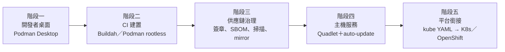
```mermaid
flowchart LR
    P1["階段一<br/>開發者桌面<br/>Podman Desktop"] --> P2["階段二<br/>CI 建置<br/>Buildah／Podman rootless"]
    P2 --> P3["階段三<br/>供應鏈治理<br/>簽章、SBOM、掃描、mirror"]
    P3 --> P4["階段四<br/>主機服務<br/>Quadlet＋auto-update"]
    P4 --> P5["階段五<br/>平台銜接<br/>kube YAML → K8s／OpenShift"]
```

**v2.0 的主要變化**

- 🆕 新增 Quadlet、Pod 與 Kubernetes 整合、企業 Registry 與供應鏈、監控維運、Docker 遷移與 Podman 6 升級等 7 個章節。
- ⚠️ 更正網路架構（CNI → Netavark、slirp4netns → pasta）、log 選項、Docker rootless 的比較說法，以及已停止發布的基底映像檔（`openjdk:*`、`node:16`）。
- ⚠️ 考照章節改以現行的 **EX188** 為主。EX180 已於 2023 年退役，v1.0 裡沒有出處的「題型比例」已經刪除。

---

## 1. Podman 概觀與架構

### 1.1 什麼是 Podman

Podman（**Pod Man**ager）是開源的容器引擎，用來在 Linux 上尋找、執行、建置、分享與部署 OCI 容器與容器映像檔。它最早由 Red Hat 發起，2025 年 1 月以「Podman Container Tools」之名成為 **CNCF Sandbox 專案**。2026 年 8 月起，Podman、Buildah、Skopeo 的原始碼倉庫都已移到 CNCF 名下的 GitHub 組織 [podman-container-tools](https://github.com/podman-container-tools)。

#### 1.1.1 主要特色

| 特色 | 說明 | 對企業的意義 |
| --- | --- | --- |
| **Daemonless** | 每次 `podman` 指令直接 fork/exec 出容器，不需要常駐、以 root 執行的背景服務 | 沒有單點故障；也沒有「能存取 daemon socket 就等於 root」的風險 |
| **Rootless 優先** | 一般使用者就能執行容器，透過 user namespace 把容器內的 root 對應到主機上的非特權 UID | 符合最小權限原則，容器逃逸的衝擊範圍較小 |
| **原生 Pod** | 支援與 Kubernetes 相同概念的 Pod（多容器共享 network／IPC namespace） | 本機就能模擬 K8s 的部署單位 |
| **Kubernetes YAML** | `podman kube generate` 與 `podman kube play` 可雙向轉換 | 開發到平台的銜接成本低 |
| **systemd 整合（Quadlet）** | 用宣告式的 `.container`、`.pod` 等檔案，由 systemd 管理容器的生命週期 | 單機服務不需要額外的編排工具 |
| **Docker 相容** | CLI 幾乎一對一，另提供相容於 Docker Engine API（v1.44）的 REST socket | 既有腳本、docker-compose、Testcontainers 可以沿用 |
| **OCI 標準** | 映像檔、執行期、發佈規格都遵循 OCI | 不會被單一廠商綁住 |

#### 1.1.2 適用場景

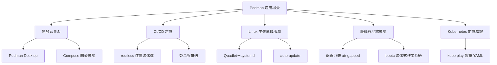
```mermaid
graph TD
    A[Podman 適用場景] --> B[開發者桌面]
    A --> C[CI/CD 建置]
    A --> D[Linux 主機單機服務]
    A --> E[邊緣與地端環境]
    A --> F[Kubernetes 前置驗證]

    B --> B1[Podman Desktop]
    B --> B2[Compose 開發環境]
    C --> C1[rootless 建置映像檔]
    C --> C2[簽章與推送]
    D --> D1[Quadlet＋systemd]
    D --> D2[auto-update]
    E --> E1[離線部署 air-gapped]
    E --> E2[bootc 映像式作業系統]
    F --> F1[kube play 驗證 YAML]
```

**不適合的場景**：需要跨多台主機排程、自動擴縮、服務網格的工作負載，應交給 Kubernetes／OpenShift。Podman 定位在「單一主機」與「開發者本機」。

### 1.2 架構與元件

#### 1.2.1 Daemonless 執行模型

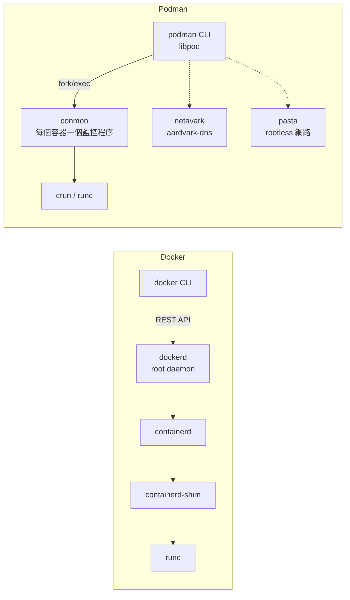
```mermaid
graph LR
    subgraph Docker
        DC[docker CLI] -->|REST API| DD[dockerd<br/>root daemon]
        DD --> CT[containerd]
        CT --> SH[containerd-shim]
        SH --> R1[runc]
    end
    subgraph Podman
        PC[podman CLI<br/>libpod] -->|fork/exec| CM[conmon<br/>每個容器一個監控程序]
        CM --> R2[crun / runc]
        PC -.-> NV[netavark<br/>aardvark-dns]
        PC -.-> PS[pasta<br/>rootless 網路]
    end
```

- `podman` 指令本身就是 **libpod** 函式庫的前端。狀態保存在本機資料庫（SQLite）與 containers/storage 裡，不需要 daemon。
- 每個容器各有一個 **conmon** 監控程序，負責保持 TTY、收集日誌、記錄結束碼。`podman` 指令結束後，容器仍會繼續執行。
- 需要 REST API 時（例如 docker-compose、Podman Desktop、Testcontainers），可以用 socket activation 啟動 `podman system service`（`podman.socket`）。這個服務是**按需啟動**的，不是常駐 daemon。

#### 1.2.2 元件一覽

| 元件 | 角色 | 備註 |
| --- | --- | --- |
| **libpod** | 容器、Pod、Volume、網路的生命週期管理 | Podman 的核心函式庫 |
| **conmon** | 容器監控程序 | 每個容器一個 |
| **crun**／runc | OCI runtime，實際建立 namespace 與 cgroup | RHEL／Fedora 預設 crun（C 實作，啟動快、記憶體用量低） |
| **containers/storage** | 映像檔層與容器檔案系統 | 預設 overlay driver |
| **containers/image** | 拉取、推送、簽章驗證 | 與 Skopeo 共用 |
| **Netavark** | 網路設定（bridge、macvlan、ipvlan），用 nftables 設定防火牆規則 | Podman 6 起是唯一的網路後端 |
| **Aardvark-dns** | 自訂網路內的容器名稱解析 | 與 Netavark 搭配 |
| **pasta**（passt 專案） | rootless 容器的使用者空間網路 | 5.0 起為預設；6.0 起取代已移除的 slirp4netns |
| **Buildah** | 建置映像檔（`podman build` 內部就是用 Buildah） | 也可以單獨在 CI 裡使用 |
| **Skopeo** | 在 registry 之間檢視、複製、同步映像檔，不需要先拉到本機 | 離線環境必備 |
| **Quadlet** | systemd generator，把 `.container` 等檔案轉成 service unit | 4.4 起內建 |
| **Podman Desktop** | 跨平台 GUI，可管理 Podman、Kind、Minikube、OpenShift Local | 獨立專案，版本號另計 |

#### 1.2.3 OCI 規範

[Open Container Initiative](https://opencontainers.org/) 定義了三份規格，Podman 全部遵循：

| 規格 | 內容 | Podman 對應 |
| --- | --- | --- |
| **Runtime Specification** | 容器的設定（`config.json`）與生命週期 | crun／runc |
| **Image Specification** | 映像檔 manifest、config、layer 的格式 | containers/image、Buildah |
| **Distribution Specification** | registry 的 HTTP API | push／pull、`podman artifact` |

OCI 映像檔也可以用來承載非容器內容，例如 AI 模型、設定檔、SBOM。這類內容在 Podman 裡稱為 **OCI artifact**，由 `podman artifact` 系列指令管理（5.4 起提供預覽版，5.6 起穩定），詳見[第 11 章](#11-企業-registry-與供應鏈)。

### 1.3 Podman 與 Docker 的差異

| 面向 | Podman | Docker Engine |
| --- | --- | --- |
| 架構 | 無 daemon，fork/exec | client／server，由 `dockerd` 管理所有容器 |
| 預設權限 | 預設 rootless | 預設 rootful；另有 **Rootless mode** 可選（需另外安裝設定） |
| Pod | 原生支援 | 不支援（Compose 以 service 為單位） |
| systemd | Quadlet 原生整合，容器即 service | 由 dockerd 的 restart policy 管理 |
| Kubernetes YAML | `kube generate` 與 `kube play` | 無原生支援 |
| API | 相容 Docker API（v1.44），另有 libpod API | Docker Engine API |
| Compose | `podman compose` 呼叫外部 provider（docker-compose 或 podman-compose） | 內建 Compose v2 |
| 建置 | Buildah（相容 Dockerfile／Containerfile） | BuildKit |
| 映像檔名稱 | 建議使用完整名稱，短名稱依 `registries.conf` 解析 | 短名稱預設指向 Docker Hub |
| 桌面授權 | Podman Desktop 採 Apache-2.0 | Docker Desktop 對一定規模以上的企業需付費訂閱 |

> ⚠️ **v2.0 更正**：v1.0 寫「Docker 需要 root 權限」並不精確。Docker 從 20.10 起就有正式的 Rootless mode，只是預設仍以 root 執行 daemon。兩者真正的差別在於「預設值」與「是否有常駐 daemon」。

#### 1.3.1 指令對比範例

```bash
# Docker 指令
docker run -d --name web -p 8080:80 nginx
docker ps
docker logs web

# Podman 指令（語法相同；建議寫完整映像檔名稱）
podman run -d --name web -p 8080:80 docker.io/library/nginx:stable
podman ps
podman logs web

# 讓既有腳本不用修改：安裝 podman-docker 套件，或設定 alias
alias docker=podman
```

#### 1.3.2 主要的行為差異

| 情境 | Docker | Podman | 處理方式 |
| --- | --- | --- | --- |
| 短名稱 `nginx` | 自動從 Docker Hub 拉取 | 依 `unqualified-search-registries` 搜尋；`short-name-mode="enforcing"` 時，名稱有歧義會詢問或失敗 | 一律寫完整名稱，例如 `docker.io/library/nginx` |
| 綁定 1024 以下的埠 | root daemon 可以直接綁定 | rootless 預設不行 | 改用高埠號，或調整 `net.ipv4.ip_unprivileged_port_start` |
| Volume 權限 | 以 root 寫入 | 以 user namespace 對應後的 UID 寫入 | 用 `:U`、`--userns=keep-id` 或 `podman unshare chown` |
| SELinux | 視設定而定 | RHEL／Fedora 預設強制 | bind mount 加上 `:z`／`:Z` |
| restart policy | daemon 重啟時會自動拉起容器 | 沒有 daemon | 用 Quadlet，或啟用 `podman-restart.service` |

### 1.4 版本演進

#### 1.4.1 近期版本時間軸

| 版本 | 發布時間 | 重點 |
| --- | --- | --- |
| 4.4 | 2023-02 | 推出 **Quadlet** |
| 4.7 | 2023-09 | 新增 `podman compose`；`podman generate systemd` 標示為**棄用**（不會移除，但不再加新功能） |
| 4.8 | 2023-11 | 新安裝預設改用 **SQLite** 資料庫 |
| 5.0 | 2024-03 | rootless 網路預設改為 **pasta**；`podman machine` 重寫（macOS 改用 applehv）；Quadlet 支援 `.pod` 與範本 |
| 5.2 | 2024-08 | macOS 可使用 libkrun（支援 GPU）；Quadlet 支援 `.build` |
| 5.3–5.5 | 2024-11～2025-05 | `podman update` 可修改 healthcheck；`podman artifact` 預覽；`podman machine cp` |
| 5.6 | 2025-08 | 新增 `podman quadlet install/list/print/rm`；`podman artifact` 標為穩定 |
| 5.7 | 2025-11 | 遠端 API 支援 TLS／mTLS；Quadlet `.artifact`；`podman kube play` 可一次處理多個檔案 |
| 5.8 | 2026-02 | BoltDB 自動遷移至 SQLite；5.x 最後一個次版本，目前持續發布修補版（5.8.7：2026-09-16） |
| **6.0** | **2026-06-24** | 移除 CNI、iptables、slirp4netns、cgroups v1、BoltDB、Intel Mac、Windows 10；預設啟用 network isolation；Quadlet 安裝結構改版；`podman machine` 可跨 provider 操作 |
| **6.1** | **2026-08-12** | `podman volume rename`、`podman machine restart`、Quadlet `ImageVolume=`；目前最新修補版為 6.1.2（2026-09-16） |

> 📌 年月依 GitHub Releases 與官方部落格整理；精確的查證紀錄見[附錄 E](#附錄-e查證紀錄)。

#### 1.4.2 Podman 6 對企業的影響

| 移除／變更項目 | 受影響的對象 | 替代方案 |
| --- | --- | --- |
| CNI 網路 | 在 `/etc/cni/net.d` 自訂網路的舊主機 | Netavark（4.0 起的預設） |
| iptables | 仍使用 iptables-legacy 的主機 | nftables |
| slirp4netns | 明確指定 `--network slirp4netns` 的腳本 | pasta |
| cgroups v1 | RHEL 8 或改過開機參數的主機 | 改用 cgroups v2（RHEL 9／10 預設） |
| BoltDB | 早期由 4.x 升級上來的主機 | 啟動時自動遷移到 SQLite；建議升級前先備份 |
| Intel Mac、Windows 10 | 舊的開發者筆電 | 維持 5.8.x，或更換設備 |
| `volume prune` 行為 | 自動化清理腳本 | 預設只清匿名 volume；要清全部請加 `--all` |
| network isolation 預設開啟 | 依賴不同網路之間可互通的環境 | 改用同一個網路，或明確把容器接到多個網路 |

詳細的升級步驟見[第 15 章](#15-從-docker-遷移與升級到-podman-6)。

### 1.5 生態系工具

| 工具 | 用途 | 目前版本（2026-09） |
| --- | --- | --- |
| [Podman Desktop](https://podman-desktop.io/) | GUI；管理容器、Pod、映像檔、Kubernetes context、擴充功能 | 1.29.3（穩定版） |
| [Buildah](https://github.com/podman-container-tools/buildah) | 細部控制映像檔建置，適合 CI | 1.45.1 |
| [Skopeo](https://github.com/podman-container-tools/skopeo) | 在 registry 之間檢視、複製、同步映像檔，也可處理簽章 | 1.24.1 |
| [podman-compose](https://github.com/containers/podman-compose) | 以 Python 實作的 Compose 規格 | 1.6.0 |
| [prometheus-podman-exporter](https://github.com/containers/prometheus-podman-exporter) | 匯出 Prometheus 指標 | 2.0.0 |
| [bootc](https://github.com/bootc-dev/bootc) | 以容器映像檔交付整個作業系統（image mode） | 與 RHEL image mode 搭配 |

### 1.6 💡 本章實務建議

1. **把 Podman 定位為「單機容器引擎」**：跨主機的排程交給 Kubernetes／OpenShift，不要自己用腳本拼湊叢集。
2. **統一版本基準**：開發者桌面、CI runner、正式主機的 Podman 主版本要一致；跨 5.x 與 6.x 混用時，要特別注意網路與 `volume prune` 的差異。
3. **一律寫完整映像檔名稱**：可以避開短名稱解析的歧義，也能防範 typosquatting。
4. **引用官方文件時使用新網址**：GitHub 倉庫已移到 `podman-container-tools`，舊的 `containers/podman` 網址目前會重新導向，但文件與腳本裡應該更新。

---

## 2. 安裝與環境設定

### 2.1 平台支援矩陣

| 平台 | 執行方式 | Podman 6.x | 備註 |
| --- | --- | --- | --- |
| RHEL 9／10 | 原生 | 由 Red Hat 的 Container Tools AppStream 決定（目前隨附 5.x） | 滾動更新，每年最多四次 |
| Fedora | 原生 | Fedora 45 起隨附 6.x | 新功能最早在這裡出現 |
| Ubuntu | 原生 | 官方套件庫尚未提供 6.x（26.04 LTS 隨附 5.7.0，24.04 LTS 隨附 4.9.3） | 版本落後，見 [2.2.3](#223-ubuntudebian) |
| Debian | 原生 | experimental 已有 6.1.1；13（trixie）隨附 5.4.2 | 同上 |
| Windows 11 | `podman machine`（WSL2 或 Hyper-V） | 支援 | **6.0 起不支援 Windows 10** |
| macOS（Apple Silicon） | `podman machine`（libkrun 或 applehv） | 支援 | **6.0 起不支援 Intel Mac** |

> 🆕 **v2.0 新增**：舊筆電（Windows 10、Intel Mac）只能留在 5.8.x。這一點要列入 IT 資產盤點。

### 2.2 Linux 安裝

#### 2.2.1 RHEL 9／10

```bash
# 只安裝 Podman
sudo dnf -y install podman

# 或安裝完整的 Container Tools（podman、buildah、skopeo、crun、netavark 等）
sudo dnf -y install container-tools

# 確認版本與執行環境
podman version
podman info --format '{{.Host.CgroupsVersion}} {{.Host.NetworkBackend}} {{.Store.GraphDriverName}}'
# 預期輸出：v2 netavark overlay
```

RHEL 9 與 10 的 Container Tools 以單一的滾動 Application Stream 提供，每年最多更新四次。每個 RHEL 次版本發布後的前三個月版本固定，之後在 EUS 期間只回補安全修正。所以同樣是「RHEL 10」，不同次版本的 Podman 版本也不同，**部署前要用 `podman version` 確認**。

#### 2.2.2 Fedora

```bash
sudo dnf -y install podman

# 想先試用下一版（不建議在正式環境使用）
sudo dnf -y --enablerepo=updates-testing upgrade podman
```

#### 2.2.3 Ubuntu／Debian

```bash
sudo apt-get update
sudo apt-get -y install podman

# 視需要安裝
sudo apt-get -y install podman-compose   # Compose 規格實作
sudo apt-get -y install podman-docker    # 提供 docker 指令的相容包裝
```

⚠️ **版本落差提醒**：Ubuntu 與 Debian 的 Podman 版本明顯落後上游（例如 Ubuntu 24.04 LTS 仍是 4.9.3）。企業做法建議如下：

- 開發者桌面若需要新功能（Quadlet 管理指令、`podman artifact`），改用 Fedora、RHEL，或 Windows／macOS 的 `podman machine`。
- 正式主機優先使用 RHEL 或其衍生版本，以取得有支援的版本。
- **不要**在正式環境使用 Copr 或第三方靜態建置版本，否則無法取得安全更新。

#### 2.2.4 其他發行版

| 發行版 | 指令 |
| --- | --- |
| Alpine | `sudo apk add podman` |
| Arch Linux | `sudo pacman -S podman` |
| openSUSE | `sudo zypper install podman` |

#### 2.2.5 Rootless 前置條件

```bash
# 1. 確認使用者有 subordinate UID／GID 範圍（通常建立帳號時會自動加入）
grep "^$(whoami):" /etc/subuid /etc/subgid
# 例：alice:524288:65536

# 2. 若沒有，由管理員新增
sudo usermod --add-subuids 524288-589823 --add-subgids 524288-589823 alice

# 3. 修改 subuid 後，讓 Podman 重新套用設定
podman system migrate

# 4. 確認 cgroups v2（Podman 6 必要；Quadlet 也需要）
podman info --format '{{.Host.CgroupsVersion}}'

# 5. 讓使用者登出後，rootless 服務仍能繼續執行（Quadlet 服務需要）
sudo loginctl enable-linger alice
```

### 2.3 Windows 安裝

#### 2.3.1 安裝方式

1. 確認是 **Windows 11**，並且已啟用 WSL2（`wsl --install`）；若要使用 Hyper-V provider，需要專業版或企業版。
2. 從 [GitHub Releases](https://github.com/podman-container-tools/podman/releases) 下載 `podman-installer-windows-amd64.msi`（或 arm64 版），或使用 winget：

   ```powershell
   # 安裝 Podman CLI
   winget install RedHat.Podman

   # 安裝 Podman Desktop（GUI，選用）
   winget install RedHat.Podman-Desktop
   ```

3. 安裝程式可以選擇 VM provider（WSL2 或 Hyper-V）。大量佈署時可以用 MSI 靜默安裝，並透過 Intune、SCCM 等工具派送；可用的安裝參數請見官方 [Podman for Windows 指南](https://github.com/podman-container-tools/podman/blob/main/docs/tutorials/podman-for-windows.md)。

#### 2.3.2 建立與啟動虛擬機

```powershell
# 建立預設 VM（podman-machine-default）並立即啟動
podman machine init --now

# 指定資源（CPU 數、記憶體 MiB、磁碟 GiB）
podman machine init --cpus 4 --memory 8192 --disk-size 100 --now dev-vm

# 驗證
podman info
podman run --rm quay.io/podman/hello
```

#### 2.3.3 WSL2 與 Hyper-V 的選擇

| 項目 | WSL2（預設） | Hyper-V |
| --- | --- | --- |
| VM 映像檔 | 以 Fedora 為基礎的客製映像檔 | Fedora CoreOS 為基礎的 machine-os |
| 建立 VM | 一般使用者即可 | 需要系統管理員權限；6.0 起啟動／停止不再需要 |
| 更新 VM 作業系統 | `podman machine ssh dnf update` | `podman machine os update`（6.0 新增） |
| 從 Windows 轉送埠號 | 6.1 起需要 `force_port_listen`，新建的 VM 會自動設定 | 原生支援 |
| 企業管理 | 受 WSL 政策影響 | 管理員可以用 `podman system hyperv-prep` 預先準備主機，讓一般使用者建立 VM |

> 🆕 **v2.0 新增**：6.0 起所有 `podman machine` 指令都能操作任何 provider 的 VM。在設定檔裡指定的 provider 只決定「新建 VM 預設用哪一個」，建立時也可以用 `podman machine init --provider hyperv` 覆寫。

### 2.4 macOS 安裝

```bash
# 建議：從 podman.io 或 GitHub Releases 下載官方安裝程式 podman-installer-macos-arm64.pkg
# Homebrew 版本由社群維護，官方不保證穩定性
brew install podman   # 選用

podman machine init --now
podman info
```

| Provider | 說明 |
| --- | --- |
| **libkrun**（6.0 起預設） | 可以把 GPU 帶進 VM，適合本機 AI 推論 |
| applehv | Apple Virtualization.framework，5.x 的預設 |

Apple Silicon 預設啟用 Rosetta 2，可以直接執行 x86_64 映像檔（效能會下降）。

### 2.5 `podman machine` 生命週期管理

```bash
podman machine list                     # 列出所有 VM（6.0 起包含所有 provider）
podman machine start / stop [name]
podman machine restart [name]           # 6.1 新增
podman machine ssh [name]               # 進入 VM
podman machine inspect [name]
podman machine set --cpus 6 --memory 12288 [name]   # VM 必須先停止
podman machine set --rootful [name]     # 切換成 rootful 模式
podman machine cp ./file.txt podman-machine-default:/tmp/   # 5.5 新增
podman machine os update                # 更新 VM 作業系統（6.0 新增；WSL 不支援）
podman machine rm [name]
podman machine reset                    # 刪除所有 VM 與相關設定
```

**主機目錄掛載**：macOS 預設會把 `/Users`、`/private`、`/var/folders` 掛載到 VM 裡；可以用 `podman machine init -v <host>:<vm>` 自訂。WSL 會自動把所有磁碟掛在 `/mnt`，所以 `--volume` 對 WSL 沒有作用。

> ⚠️ **注意**：6.0 起，Linux 主機上的 `podman machine` 改由 systemd 掛載主機目錄。**5.x 建立的 Linux VM 掛載會失效，必須重建。**

### 2.6 Podman Desktop

[Podman Desktop](https://podman-desktop.io/) 是跨平台的 GUI，目前穩定版為 1.29.3（2026-09），1.30 已發布預覽版。主要功能：

- 以圖形介面管理容器、Pod、映像檔、Volume，並檢視日誌、進入終端機。
- 建立與管理 `podman machine`，並提供 Docker 相容 socket 的設定精靈。
- 整合 Kind、Minikube、OpenShift Local、Developer Sandbox，可以一鍵把 Pod 部署到 Kubernetes。
- 可安裝擴充功能（例如 AI Lab、bootc、Red Hat 帳號登入）。
- 企業可以用設定檔預先鎖定 registry、proxy 等選項。

### 2.7 設定檔體系

#### 2.7.1 主要設定檔

| 檔案 | 用途 | 系統路徑 | 使用者路徑 |
| --- | --- | --- | --- |
| `containers.conf` | 引擎預設值（runtime、網路、日誌、machine 等） | `/etc/containers/`、`/usr/share/containers/` | `~/.config/containers/` |
| `registries.conf` | registry 搜尋清單、mirror、封鎖、短名稱策略 | `/etc/containers/` | `~/.config/containers/` |
| `storage.conf` | storage driver 與路徑 | `/etc/containers/` | `~/.config/containers/` |
| `policy.json` | 映像檔信任與簽章驗證策略 | `/etc/containers/` | `~/.config/containers/` |
| `auth.json` | registry 登入憑證 | `/run/containers/0/`（root） | `$XDG_RUNTIME_DIR/containers/` |

儲存位置：rootful 為 `/var/lib/containers/storage`，rootless 為 `~/.local/share/containers/storage`。

#### 2.7.2 Podman 6 的設定檔解析規則

> ⚠️ **v2.0 更正**：Podman 6 大幅改寫了設定檔的解析邏輯，`containers.conf`、`storage.conf`、`registries.conf` 現在採用同一套規則。

1. **主檔只取一個**：依序尋找 `$XDG_CONFIG_HOME/containers/<name>.conf` → `/etc/containers/<name>.conf` → `/usr/share/containers/<name>.conf`，**找到第一個就停止**（5.x 會把所有檔案合併）。
2. **Drop-in 目錄全部載入**：包含 `<name>.conf.d/`，以及依身分區分的 `<name>.rootful.conf.d/`、`<name>.rootless.conf.d/`、`<name>.rootless.conf.d/<UID>/`（分別位於 `/usr/share/containers/`、`/etc/containers/`），最後是 `$XDG_CONFIG_HOME/containers/<name>.conf.d/`。同一目錄內依檔名字典序載入，後面的覆蓋前面的。
3. **陣列可以附加**：`field = ["value", {append=true}]` 會附加到既有的值，不會整個取代。
4. **已移除的舊做法**：`containers.rootless.conf` 主檔、registries.conf 的 V1 格式；`storage.conf` 的 `rootless_storage_path` 已經棄用。
5. **環境變數**：`CONTAINERS_CONF` 只讀取指定的檔案；`CONTAINERS_CONF_OVERRIDE` 在正常解析完成後再疊加指定的檔案（適合測試）。

**企業建議**：公司的標準設定放在 `/etc/containers/containers.conf.d/10-corp.conf` 這類 drop-in 檔。這樣發行版在 `/usr/share` 的預設值與使用者的個人設定可以並存，升級時也不會被覆蓋。

#### 2.7.3 企業標準 containers.conf 範例

```toml
# /etc/containers/containers.conf.d/10-corp.conf
[containers]
# 預設時區與日誌
tz = "Asia/Taipei"
log_driver = "journald"
# 每個容器的程序數上限（預設 1024）
pids_limit = 2048

[engine]
# Compose provider 的優先順序
compose_providers = ["/usr/bin/podman-compose", {append=true}]
compose_warning_logs = false
events_logger = "journald"

[network]
# 預設網路 podman 的子網路（預設 10.88.0.0/16），避開公司內網網段
default_subnet = "10.89.0.0/24"
# 新建網路自動配置子網路時使用的位址池
default_subnet_pools = [
  {"base" = "10.90.0.0/16", "size" = 24},
]
```

> 📌 欄位的完整說明請見 `man containers.conf`。`default_subnet` 與 `default_subnet_pools` 要依公司的網段規劃調整，避免與 VPN 或內網衝突。`no-new-privileges` 等安全選項沒有對應的 containers.conf 欄位，要在執行時或 Quadlet 裡設定（見[第 10 章](#10-安全性強化)）。

### 2.8 企業網路環境：Proxy、自簽 CA 與內部 Mirror

```bash
# 1. Proxy：Podman 會讀取 HTTP_PROXY／HTTPS_PROXY／NO_PROXY 環境變數
export HTTPS_PROXY=http://proxy.corp.example:8080
export NO_PROXY=localhost,127.0.0.1,.corp.example
# 容器預設會繼承 proxy 變數（--http-proxy=true）；若不需要，可加上 --http-proxy=false

# 2. 自簽 CA：放到系統信任庫
sudo cp corp-root-ca.crt /etc/pki/ca-trust/source/anchors/
sudo update-ca-trust
# 或只信任特定 registry
sudo mkdir -p /etc/containers/certs.d/registry.corp.example:5000
sudo cp corp-root-ca.crt /etc/containers/certs.d/registry.corp.example:5000/ca.crt

# 3. podman machine：每次開機自動匯入主機信任的 CA（6.0 新增）
podman machine init --import-native-ca --now
podman machine set --import-native-ca     # 既有 VM
```

內部 mirror 的設定方式見[第 11 章](#11-企業-registry-與供應鏈)。

### 2.9 💡 本章實務建議

1. **先盤點作業系統版本**：Windows 10、Intel Mac、cgroups v1 主機都無法使用 Podman 6。
2. **正式主機優先用 RHEL 系列**，由 Container Tools AppStream 取得有支援的版本。Ubuntu／Debian 要接受版本落後，或改用 VM。
3. **設定集中在 drop-in 檔**：公司標準放在 `/etc/containers/*.conf.d/`，用組態管理工具（Ansible 等）發佈。
4. **rootless 服務帳號一定要 `enable-linger`**，否則使用者登出後服務會被停止。
5. **開發者桌面統一使用 Podman Desktop 加上 `--import-native-ca`**，可以減少 proxy 與 SSL 攔截造成的拉取失敗。

---

## 3. 核心概念與基本操作

### 3.1 三個核心物件

#### 3.1.1 映像檔（Image）

映像檔是**唯讀**的分層檔案系統，加上執行設定（entrypoint、環境變數、使用者、暴露埠等）。完整的映像檔名稱由四個部分組成：

```text
registry.access.redhat.com/ubi10/ubi-minimal:10.0@sha256:3f2a...
└──────── registry ───────┘└ 命名空間/名稱 ┘└ tag ┘└─── digest（不可變）───┘
```

- **tag** 是可以移動的標籤（例如 `latest`、`1.2`）；**digest** 是內容的雜湊值，永遠指向同一個映像檔。
- 正式環境建議至少固定到次版本的 tag；對稽核要求高的系統，要固定 digest。

#### 3.1.2 容器（Container）

容器是映像檔的**執行個體**：在唯讀層上加一層可寫層，並放進獨立的 namespace（PID、網路、掛載、UTS、IPC、user）與 cgroup 資源限制中執行。

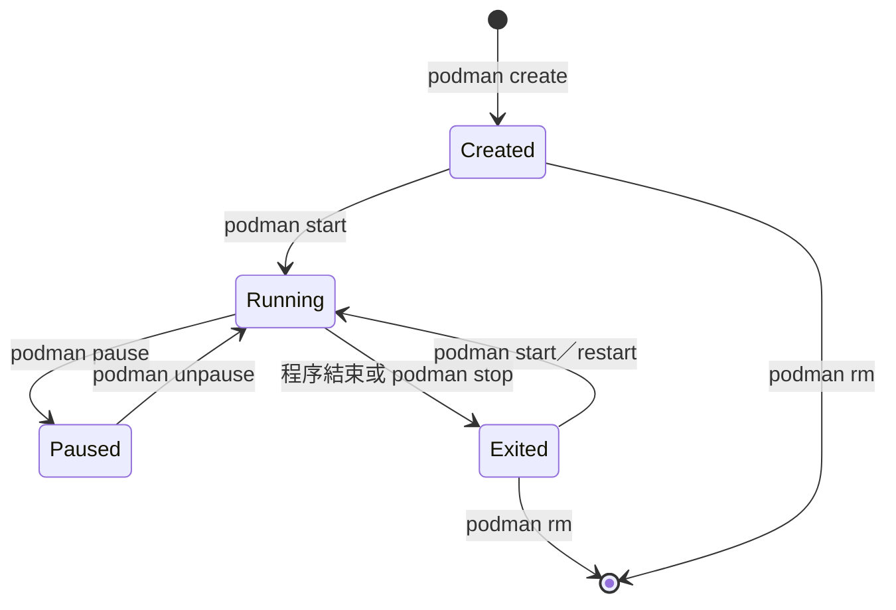
```mermaid
stateDiagram-v2
    [*] --> Created: podman create
    Created --> Running: podman start
    Running --> Paused: podman pause
    Paused --> Running: podman unpause
    Running --> Exited: 程序結束或 podman stop
    Exited --> Running: podman start／restart
    Exited --> [*]: podman rm
    Created --> [*]: podman rm
```

#### 3.1.3 Pod

Pod 是一組**共享網路與 IPC namespace** 的容器，概念與 Kubernetes 相同。每個 Pod 預設有一個 **infra 容器**（`pause` 程序），負責持有這些 namespace；Pod 內的容器可以互相用 `localhost` 通訊。

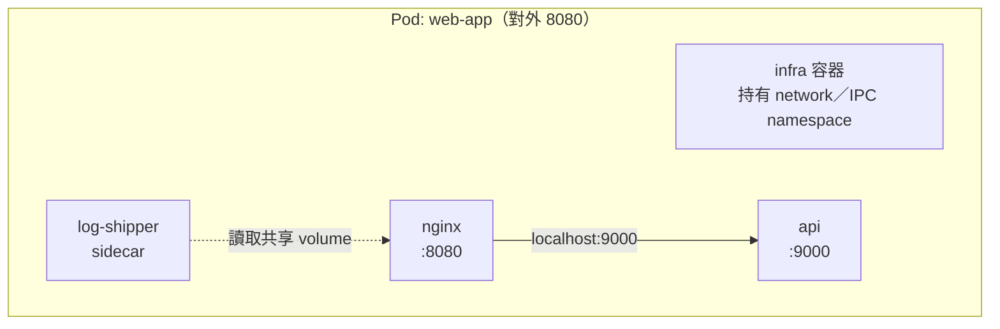
```mermaid
graph TB
    subgraph "Pod: web-app（對外 8080）"
        I[infra 容器<br/>持有 network／IPC namespace]
        W[nginx<br/>:8080]
        A[api<br/>:9000]
        L[log-shipper<br/>sidecar]
    end
    W -->|localhost:9000| A
    L -.->|讀取共享 volume| W
```

Pod 的詳細操作與 Kubernetes 整合見[第 7 章](#7-pod-與-kubernetes-整合)。

### 3.2 映像檔管理

```bash
# 搜尋（依 registries.conf 的 unqualified-search-registries）
podman search --limit 5 nginx
podman search --list-tags docker.io/library/nginx

# 拉取：建議寫完整名稱
podman pull docker.io/library/nginx:stable
podman pull registry.access.redhat.com/ubi10/ubi-minimal

# 指定平台（多架構映像檔）
podman pull --platform linux/arm64 docker.io/library/alpine:3

# 列出與檢視
podman images
podman image ls --format "table {{.Repository}}:{{.Tag}} {{.Size}}"
podman image inspect docker.io/library/nginx:stable
podman image history docker.io/library/nginx:stable
podman image tree docker.io/library/nginx:stable    # 以樹狀顯示層次

# 標記、移除、清理
podman tag docker.io/library/nginx:stable registry.corp.example/web/nginx:1.28
podman rmi registry.corp.example/web/nginx:1.28
podman image prune          # 清理 dangling 映像檔
podman image prune -a       # 清理所有沒有被容器使用的映像檔
```

### 3.3 容器管理

```bash
# 執行
podman run -d --name web -p 8080:80 docker.io/library/nginx:stable
podman run -it --rm registry.access.redhat.com/ubi10/ubi-minimal bash   # 互動式，結束後自動刪除

# 列出
podman ps                   # 執行中
podman ps -a                # 全部
podman ps --pod             # 顯示所屬 Pod
podman ps --format "table {{.Names}} {{.Status}} {{.Ports}}"

# 生命週期
podman stop web             # 送 SIGTERM，預設逾時 10 秒後送 SIGKILL
podman start web
podman restart web
podman pause web && podman unpause web
podman rm web               # 刪除已停止的容器
podman rm -f web            # 強制停止並刪除

# 觀察與除錯
podman logs -f --tail 100 web
podman exec -it web sh
podman top web
podman stats --no-stream
podman inspect web --format '{{.State.Status}} {{.NetworkSettings.IPAddress}}'
podman port web
podman diff web             # 檢視容器檔案系統的變更
podman cp web:/etc/nginx/nginx.conf ./nginx.conf

# 修改執行中容器的資源與設定（不必重建）
podman update --memory 512m --cpus 1.5 web
podman update --restart=always web
podman update --health-cmd 'curl -fsS http://localhost/ || exit 1' --health-interval 30s web
```

### 3.4 常用選項

| 選項 | 說明 | 範例 |
| --- | --- | --- |
| `-d`, `--detach` | 背景執行 | `podman run -d ...` |
| `-it` | 互動式並配置 TTY | `podman run -it ... bash` |
| `--name` | 容器名稱 | `--name api` |
| `--replace` | 同名容器已存在時，先刪除再建立 | `--name api --replace` |
| `--rm` | 結束後自動刪除 | 一次性工作 |
| `-p`, `--publish` | 埠號對應 `[主機IP:]主機埠:容器埠[/協定]` | `-p 127.0.0.1:8080:80` |
| `-e`, `--env`／`--env-file` | 環境變數 | `--env-file ./app.env` |
| `-v`, `--volume` | 掛載 volume 或主機目錄 | `-v data:/var/lib/data:Z` |
| `--mount` | 較明確的掛載語法 | `--mount type=volume,src=data,dst=/data` |
| `--network` | 指定網路 | `--network backend` |
| `--pod` | 加入 Pod | `--pod web-app` |
| `--memory`／`--cpus` | 資源限制 | `--memory 1g --cpus 2` |
| `--restart` | 重啟策略 | `--restart=on-failure:3` |
| `--health-*` | 健康檢查 | `--health-cmd`、`--health-interval` |
| `--user` | 容器內的執行身分 | `--user 1001:0` |
| `--userns` | user namespace 模式 | `--userns=keep-id` |
| `--read-only` | 根檔案系統唯讀 | 搭配 `--tmpfs /tmp` |
| `--secret` | 掛載機密 | `--secret db_pw,type=env,target=DB_PASSWORD` |
| `--pull` | 拉取策略 | `--pull=newer` |

### 3.5 實務範例

#### 3.5.1 Nginx 靜態網站

```bash
mkdir -p ~/site && echo '<h1>Hello Podman</h1>' > ~/site/index.html

# :Z 會為這個目錄設定 SELinux 私有標籤（沒有 SELinux 的系統會忽略）
podman run -d --name site -p 8080:80 \
  -v ~/site:/usr/share/nginx/html:ro,Z \
  docker.io/library/nginx:stable

curl -s http://localhost:8080
podman logs site
podman rm -f site
```

#### 3.5.2 Java 應用程式快速驗證

```bash
# 直接用 JDK 映像檔執行本機編譯好的 JAR
podman run --rm -p 8080:8080 \
  -v "$PWD/target:/app:ro,Z" \
  docker.io/library/eclipse-temurin:21-jre \
  java -jar /app/demo.jar
```

> ⚠️ **v2.0 更正**：v1.0 使用的 `openjdk:*` 官方映像檔已經停止發布，請改用 `eclipse-temurin`、`registry.access.redhat.com/ubi9/openjdk-21-runtime` 等仍在維護的映像檔。

#### 3.5.3 健康檢查

```bash
podman run -d --name api -p 9000:9000 \
  --health-cmd 'curl -fsS http://localhost:9000/actuator/health || exit 1' \
  --health-interval 30s --health-timeout 5s --health-retries 3 \
  --health-start-period 60s \
  --health-on-failure restart \
  registry.corp.example/app/api:1.4.2

podman healthcheck run api      # 手動執行一次
podman inspect api --format '{{.State.Health.Status}}'
```

`--health-on-failure` 可以設為 `none`、`kill`、`restart`、`stop`。在 Quadlet 裡搭配 systemd 的 restart 設定，效果最完整（見[第 8 章](#8-quadlet-與-systemd-生產部署)）。

### 3.6 📝 基礎實務練習

**目標**：熟悉映像檔與容器的完整生命週期。

1. 拉取 `docker.io/library/nginx:stable` 與 `registry.access.redhat.com/ubi10/ubi-minimal`，比較兩者的大小與層數（`podman image history`）。
2. 以 `-p 127.0.0.1:8080:80` 啟動 Nginx，並掛載自訂首頁（記得加 `:Z`）。
3. 用 `podman exec` 進入容器修改首頁，再用 `podman diff` 觀察可寫層的變化。
4. 用 `podman update --memory 256m` 調整記憶體上限，並用 `podman stats` 確認。
5. 加上健康檢查，故意讓檢查失敗，觀察 `--health-on-failure restart` 的行為。
6. 清理所有練習資源：`podman rm -fa && podman image prune -a`。

**驗證標準**

- [ ] 能說明 tag 與 digest 的差異
- [ ] 能使用 `inspect --format` 取出指定欄位
- [ ] 能說明 `:z` 與 `:Z` 的差異
- [ ] 能在不重建容器的情況下調整資源與 healthcheck

### 3.7 💡 本章實務建議

1. **容器是「用完即丟」的**：設定與資料放在映像檔、volume、secret 裡，不要依賴容器的可寫層。
2. **對外埠號預設綁定 `127.0.0.1`**：只有需要對外服務時才綁定 `0.0.0.0`，避免開發機意外暴露服務。
3. **善用 `--replace` 與 `podman update`**：腳本可以保持冪等，也能減少停機時間。
4. **每個服務都要有 healthcheck**：這是 auto-update 回滾與 systemd 監控的基礎。

---

## 4. 映像檔建置（Containerfile 與 Buildah）

### 4.1 Containerfile 基礎

Podman 使用 Buildah 建置映像檔，可以直接讀取 `Containerfile` 或 `Dockerfile`（兩者語法相同；同一目錄兩者都有時，優先使用 `Containerfile`）。

| 指令 | 用途 | 企業注意事項 |
| --- | --- | --- |
| `FROM` | 基底映像檔 | 固定 tag 或 digest；只使用核准的基底 |
| `ARG`／`ENV` | 建置參數與環境變數 | **機密不要放在 ARG／ENV**，會留在映像檔的 metadata 裡 |
| `COPY`／`ADD` | 複製檔案 | 優先用 `COPY`；`ADD` 會自動解壓縮並可以抓取 URL，行為較難預測 |
| `RUN` | 建置時執行指令 | 合併指令並在同一層清理快取 |
| `USER` | 執行身分 | 使用非 root 的 UID（OpenShift 相容做法是 `USER 1001` 並讓 GID 0 可寫） |
| `WORKDIR` | 工作目錄 | 使用絕對路徑 |
| `EXPOSE` | 宣告埠號 | 只是文件用途，實際對應要靠 `-p` |
| `HEALTHCHECK` | 健康檢查 | 必須用 `--format docker` 建置才會保留（OCI 格式沒有這個欄位） |
| `ENTRYPOINT`／`CMD` | 啟動指令 | 使用 exec 形式（JSON 陣列），訊號才能正確送達 |
| `LABEL` | 中繼資料 | 使用 `org.opencontainers.image.*` 標準標籤 |

> ⚠️ **v2.0 更正**：`HEALTHCHECK` 不在 OCI 映像檔規格裡。`podman build` 預設產生 OCI 格式，會忽略這個指令並顯示警告。要保留的話，請加上 `--format docker`，或改在執行時用 `--health-cmd`、在 Quadlet 裡用 `HealthCmd=` 設定。

### 4.2 建置指令

```bash
# 基本建置
podman build -t registry.corp.example/app/api:1.4.2 .

# 指定檔案、建置參數、標籤
podman build -f Containerfile.prod \
  --build-arg APP_VERSION=1.4.2 \
  --label org.opencontainers.image.revision="$(git rev-parse HEAD)" \
  -t registry.corp.example/app/api:1.4.2 .

# 保留 HEALTHCHECK（Docker 格式）
podman build --format docker -t api:1.4.2 .

# 不使用快取、每次都重新拉取基底映像檔（CI 建議）
podman build --no-cache --pull=always -t api:1.4.2 .

# 指定目標階段
podman build --target test -t api:test .
```

### 4.3 多階段建置：Spring Boot

```dockerfile
# Containerfile
# ---- 建置階段 ----
FROM docker.io/library/maven:3.9-eclipse-temurin-21 AS build
WORKDIR /workspace
# 先複製 pom.xml，讓相依套件層可以被快取
COPY pom.xml .
RUN --mount=type=cache,target=/root/.m2 mvn -B -q dependency:go-offline
COPY src ./src
RUN --mount=type=cache,target=/root/.m2 mvn -B -q package -DskipTests \
 && java -Djarmode=tools -jar target/*.jar extract --layers --launcher --destination /workspace/extracted

# ---- 執行階段 ----
FROM docker.io/library/eclipse-temurin:21-jre
LABEL org.opencontainers.image.title="order-api" \
      org.opencontainers.image.vendor="Corp"
WORKDIR /app
# Spring Boot 分層：相依套件變動少，放在前面的層
COPY --from=build /workspace/extracted/dependencies/ ./
COPY --from=build /workspace/extracted/spring-boot-loader/ ./
COPY --from=build /workspace/extracted/snapshot-dependencies/ ./
COPY --from=build /workspace/extracted/application/ ./
USER 1001
EXPOSE 8080
ENV JAVA_TOOL_OPTIONS="-XX:MaxRAMPercentage=75 -XX:+ExitOnOutOfMemoryError"
ENTRYPOINT ["java", "org.springframework.boot.loader.launch.JarLauncher"]
```

重點：

- `RUN --mount=type=cache` 讓 Maven 的本機倉庫在多次建置之間重複使用，但不會進入映像檔。
- `-XX:MaxRAMPercentage` 讓 JVM 依照容器的記憶體上限調整 heap，不需要寫死 `-Xmx`。
- 使用 Spring Boot 的 layertools（`-Djarmode=tools`），程式碼變動時只需要重建最上面那一層。

```bash
podman build -t order-api:1.0.0 .
podman run -d --name order-api -p 8080:8080 \
  -e SPRING_PROFILES_ACTIVE=dev \
  --health-cmd 'curl -fsS http://localhost:8080/actuator/health || exit 1' \
  order-api:1.0.0
```

> 📌 使用 Red Hat 生態系的團隊，可以把基底換成 `registry.access.redhat.com/ubi9/openjdk-21`（建置）與 `registry.access.redhat.com/ubi9/openjdk-21-runtime`（執行）。UBI 映像檔可以自由散佈，並且有 Red Hat 的安全更新。

### 4.4 多階段建置：前端（React／Vue）

```dockerfile
FROM docker.io/library/node:24-alpine AS build
WORKDIR /app
COPY package.json package-lock.json ./
RUN --mount=type=cache,target=/root/.npm npm ci
COPY . .
RUN npm run build

# 使用非 root 版的 Nginx（監聽 8080）
FROM docker.io/nginxinc/nginx-unprivileged:stable-alpine
COPY --from=build /app/dist /usr/share/nginx/html
COPY nginx.conf /etc/nginx/conf.d/default.conf
EXPOSE 8080
```

```nginx
# nginx.conf：SPA 路由與 API 反向代理
server {
    listen 8080;
    root /usr/share/nginx/html;
    index index.html;

    location / {
        try_files $uri $uri/ /index.html;
    }

    location /api/ {
        proxy_pass http://order-api:8080/;
        proxy_set_header Host $host;
        proxy_set_header X-Real-IP $remote_addr;
        proxy_set_header X-Forwarded-For $proxy_add_x_forwarded_for;
    }
}
```

> ⚠️ **v2.0 更正**：v1.0 的範例在 `nginx:alpine` 裡切換成自建使用者並監聽 80 埠，實際上會因為權限不足而無法啟動。另外 `npm ci --only=production` 會漏掉建置需要的 devDependencies。這兩個問題都已修正。Node.js 16 已經 EOL，範例改用 24（Active LTS）。

### 4.5 `.containerignore`

```text
# .containerignore（也支援 .dockerignore）
.git
.gitignore
**/node_modules
**/target
**/*.log
.env
*.pem
Containerfile*
README.md
```

作用：縮小建置 context、加快建置，並**避免把憑證、`.env` 等機密複製進映像檔**。

### 4.6 建置期機密與快取

```bash
# 把私有套件庫的 token 以 secret 形式傳入，不會留在任何一層
podman build --secret id=npmrc,src=$HOME/.npmrc -t web:1.0 .
```

```dockerfile
RUN --mount=type=secret,id=npmrc,target=/root/.npmrc npm ci
```

| 掛載類型 | 用途 |
| --- | --- |
| `--mount=type=cache` | 套件管理器的快取（Maven、npm、pip、dnf） |
| `--mount=type=secret` | 建置時需要的 token、憑證 |
| `--mount=type=bind` | 暫時掛載 context 裡的檔案，不複製進映像檔 |

### 4.7 映像檔瘦身與層最佳化

```dockerfile
# ❌ 不佳：每個 RUN 都是一層，快取也留在映像檔裡
FROM registry.access.redhat.com/ubi10/ubi
RUN dnf install -y python3
RUN dnf install -y python3-pip
COPY . /app
RUN pip3 install -r /app/requirements.txt

# ✅ 較佳：先複製相依清單以利用快取，同一層內清理
FROM registry.access.redhat.com/ubi10/ubi-minimal
RUN microdnf install -y python3 python3-pip \
 && microdnf clean all
WORKDIR /app
COPY requirements.txt .
RUN pip3 install --no-cache-dir -r requirements.txt
COPY . .
USER 1001
CMD ["python3", "app.py"]
```

| 基底映像檔類型 | 例子 | 適用情境 |
| --- | --- | --- |
| 完整版 | `ubi10/ubi`、`debian` | 需要完整工具鏈的建置階段 |
| 精簡版 | `ubi10/ubi-minimal`、`alpine` | 大多數執行階段 |
| micro／distroless | `ubi10/ubi-micro`、`gcr.io/distroless/java21-debian12` | 極小的攻擊面；沒有 shell，除錯要另外處理 |
| 語言執行環境 | `eclipse-temurin:21-jre`、`ubi9/openjdk-21-runtime` | 已經調校好的語言 runtime |

### 4.8 多架構映像檔

```bash
# 一次建置 amd64 與 arm64，產生 manifest list（需要 qemu-user-static 或對應的原生建置機）
podman build --platform linux/amd64,linux/arm64 \
  --manifest registry.corp.example/app/api:1.4.2 .

# 推送 manifest list 與所有架構的映像檔（6.1 新增 --retry）
podman manifest push --all --retry 3 registry.corp.example/app/api:1.4.2

# 檢視
podman manifest inspect registry.corp.example/app/api:1.4.2
```

### 4.9 直接使用 Buildah

在 CI 或需要逐步控制時，可以用 Buildah 的指令式建置：

```bash
ctr=$(buildah from registry.access.redhat.com/ubi10/ubi-micro)
buildah copy "$ctr" ./dist/app /usr/local/bin/app
buildah config --entrypoint '["/usr/local/bin/app"]' --user 1001 \
  --label org.opencontainers.image.source=https://git.corp.example/app "$ctr"
buildah commit "$ctr" registry.corp.example/app/tool:1.0
buildah rm "$ctr"
```

### 4.10 💡 本章實務建議

1. **建立公司核准的基底映像檔清單**（例如 UBI、Temurin），並由平台團隊每月重建、掃描。
2. **一律使用多階段建置與非 root 使用者**；執行階段不要包含編譯器、套件管理器、shell（能做到的話）。
3. **機密只能透過 `--secret` 傳入**，並在 CI 中掃描映像檔的每一層，確認沒有殘留。
4. **加上 OCI 標準標籤**（source、revision、version、created），方便追溯與產生 SBOM。
5. **需要 HEALTHCHECK 時記得 `--format docker`**，或統一改在 Quadlet 裡定義。

---

## 5. 儲存與 Volume

### 5.1 掛載類型總覽

| 類型 | 語法範例 | 資料位置 | 適用情境 |
| --- | --- | --- | --- |
| **Named volume** | `-v pgdata:/var/lib/postgresql/data` | Podman 管理（rootless 在 `~/.local/share/containers/storage/volumes`） | 資料庫、需要長期保存的資料 |
| **Anonymous volume** | `-v /data`，或映像檔的 `VOLUME` 指令 | 同上，名稱為隨機值 | 暫存資料 |
| **Bind mount** | `-v /srv/conf:/etc/app:ro,Z` | 主機上的指定目錄 | 設定檔、開發時的原始碼 |
| **tmpfs** | `--tmpfs /tmp:rw,size=256m,noexec` | 記憶體 | 暫存檔、搭配 `--read-only` |
| **Image volume** | `--mount type=image,src=IMG,dst=/models` | 另一個映像檔的內容（唯讀） | 模型、靜態資源 |
| **Artifact** | `--mount type=artifact,src=ART,dst=/cfg` | OCI artifact | 設定包、AI 模型（5.5 新增） |

```mermaid
graph LR
    subgraph 主機
        V[(named volume)]
        B[/srv/conf 目錄/]
        M[(記憶體 tmpfs)]
    end
    subgraph 容器
        D[/var/lib/data]
        C[/etc/app]
        T[/tmp]
    end
    V --> D
    B -->|唯讀＋SELinux 標籤| C
    M --> T
```

### 5.2 Volume 操作

```bash
podman volume create pgdata
podman volume create --label team=payments --uid 26 --gid 26 pgdata2   # 5.6 起可指定擁有者
podman volume ls --filter label=team=payments
podman volume inspect pgdata --format '{{.Mountpoint}}'

# 使用
podman run -d --name db -v pgdata:/var/lib/postgresql/data:Z \
  -e POSTGRES_PASSWORD_FILE=/run/secrets/pg_pw --secret pg_pw \
  docker.io/library/postgres:17

# 重新命名（6.1 新增；使用中或由 volume driver 建立的 volume 不能改名）
podman volume rename pgdata2 pgdata-archive

# 找不到 volume 時直接報錯，而不是自動建立（6.0 新增）
podman run --mount type=volume,src=pgdata,dst=/data,nocreate ...

# 清理
podman volume prune --dry-run     # 先看會刪哪些（6.0 新增）
podman volume prune               # 6.0 起只清「未使用的匿名 volume」
podman volume prune --all         # 清除所有未使用的 volume（5.x 的預設行為）
```

> ⚠️ **v2.0 更正**：Podman 6 的 `podman volume prune` 預設只清匿名 volume，與 Docker 行為一致；要清除所有未使用的 volume 請加 `--all`。另外 `podman volume ls` 的多個 `--filter` 改成 AND 條件（5.x 是 OR）。既有的清理腳本需要調整。

### 5.3 Bind mount 與 SELinux

在啟用 SELinux 的主機（RHEL、Fedora）上，容器程序帶有 `container_t` 標籤，預設**無法讀取**主機上一般目錄的檔案。bind mount 時要加上重新標記選項：

| 選項 | 效果 | 適用 |
| --- | --- | --- |
| `:z` | 標記為共享（`container_file_t`，不帶 MCS 類別），多個容器都能存取 | 多個容器共用的目錄 |
| `:Z` | 標記為私有（帶有本容器專屬的 MCS 類別），只有這個容器能存取 | 單一容器專用的目錄 |
| 不加 | 維持原標籤，通常會被拒絕存取 | — |

⚠️ **千萬不要**對 `/`、`/home`、`/usr`、`/etc` 這類系統目錄使用 `:z`／`:Z`，重新標記會影響主機本身的運作。

```bash
# 查看 SELinux 拒絕紀錄
sudo ausearch -m AVC -ts recent | grep container
```

### 5.4 Rootless 的檔案擁有權

rootless 容器裡的 UID 會透過 user namespace 對應到主機上的 subordinate UID。容器內的 root（UID 0）對應到你自己的 UID，容器內的 UID 1001 則對應到 `subuid 起始值 + 1000`。

```bash
# 查看對應關係
podman unshare cat /proc/self/uid_map
#          0       1000          1
#          1     524288      65536

# 方法一：:U 讓 Podman 自動把掛載內容 chown 成容器內的使用者
podman run -v ./data:/data:Z,U registry.corp.example/app/worker:1.0

# 方法二：以 user namespace 的身分修改擁有者
podman unshare chown -R 1001:1001 ./data

# 方法三：keep-id，讓容器內的使用者 UID 等於主機上的你（開發時常用）
podman run --userns=keep-id -v "$PWD:/src:Z" -w /src docker.io/library/node:24-alpine npm test
```

### 5.5 使用 `--mount` 的明確語法

```bash
# volume，並只掛載其中的子目錄（subpath）
podman run --mount type=volume,src=shared,dst=/app/config,subpath=config,ro ...

# bind，並設定 SELinux 標籤
podman run --mount type=bind,src=/srv/app/conf,dst=/etc/app,ro=true,relabel=private ...

# tmpfs
podman run --mount type=tmpfs,dst=/tmp,tmpfs-size=268435456 ...

# 把另一個映像檔的內容以唯讀方式掛進來（例如模型檔）
podman run --mount type=image,src=registry.corp.example/ml/model-bert:3,dst=/models ...
```

### 5.6 Storage driver 與容量管理

```bash
podman info --format '{{.Store.GraphDriverName}} {{.Store.GraphRoot}}'
podman system df            # 映像檔、容器、volume 的空間用量
podman system df -v         # 詳細清單
```

- 預設 driver 為 **overlay**。rootless 在新版核心（RHEL 9／10、Ubuntu 22.04 以後）會使用原生 overlay，只有舊核心才需要 `fuse-overlayfs`。
- 建議把 graphroot 放在**獨立的檔案系統**（例如 `/var/lib/containers` 獨立 LV），避免容器把根目錄塞滿。
- Podman 6 的 `storage.conf` 棄用了 `rootless_storage_path`；要改 rootless 的儲存位置，請在 rootless 專用的 drop-in 目錄設定 `graphroot`。

### 5.7 備份與還原

```bash
# Volume：匯出／匯入 tar
podman volume export pgdata --output pgdata-$(date +%F).tar
podman volume create pgdata-restore
podman volume import pgdata-restore pgdata-2026-09-29.tar

# 資料庫請優先使用原生的備份工具，確保一致性
podman exec db pg_dump -U app -Fc appdb > appdb.dump

# 映像檔：保留層與 metadata
podman save -o api-1.4.2.tar registry.corp.example/app/api:1.4.2
podman load -i api-1.4.2.tar

# 容器：只匯出檔案系統（會遺失 metadata 與 volume）
podman export api > api-rootfs.tar
podman import api-rootfs.tar localhost/api-snapshot:debug
```

| 需求 | 工具 | 是否包含 metadata | 是否包含 volume |
| --- | --- | --- | --- |
| 備份映像檔 | `podman save`／`load` | ✅ | ❌ |
| 在 registry 之間搬移映像檔 | `skopeo copy` | ✅ | ❌ |
| 備份容器的檔案系統 | `podman export`／`import` | ❌ | ❌ |
| 備份 volume | `podman volume export`／`import` | — | ✅ |
| 保存執行中的狀態 | `podman container checkpoint`（CRIU，見[第 13 章](#13-監控日誌與維運)） | ✅ | 可選 |

### 5.8 💡 本章實務建議

1. **資料一律放在 named volume**，並加上 label（`team=`、`app=`、`backup=daily`），方便自動化備份與清理。
2. **bind mount 只用來放設定檔**，並加上 `ro` 與 `:Z`；原始碼掛載只限開發環境。
3. **升級到 Podman 6 前，先檢查所有 `volume prune` 與 `volume ls --filter` 腳本**。
4. **資料庫備份用原生工具**（pg_dump、mysqldump、redis `BGSAVE`），`volume export` 只當作輔助。
5. **graphroot 要監控容量**，並排程執行 `podman system prune`（見[第 13 章](#13-監控日誌與維運)）。

---

## 6. 網路

### 6.1 網路架構

> ⚠️ **v2.0 更正**：v1.0 沒有說明網路後端。Podman 4.0 起預設使用 **Netavark＋Aardvark-dns**，5.0 起 rootless 預設使用 **pasta**；**Podman 6 已完全移除 CNI 與 slirp4netns**，防火牆規則也只支援 **nftables**。

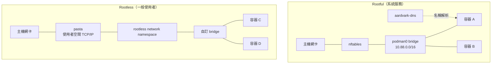
```mermaid
graph TB
    subgraph "Rootful（系統服務）"
        H1[主機網卡] --- FW1[nftables]
        FW1 --- BR1[podman0 bridge<br/>10.88.0.0/16]
        BR1 --- C1[容器 A]
        BR1 --- C2[容器 B]
        DNS1[aardvark-dns] -.->|名稱解析| C1
    end
    subgraph "Rootless（一般使用者）"
        H2[主機網卡] --- PA[pasta<br/>使用者空間 TCP/IP]
        PA --- NS[rootless network namespace]
        NS --- BR2[自訂 bridge]
        BR2 --- C3[容器 C]
        BR2 --- C4[容器 D]
    end
```

| 元件 | 功能 |
| --- | --- |
| **Netavark** | 建立 bridge、macvlan、ipvlan 網路，設定 IP 與 nftables 規則 |
| **Aardvark-dns** | 自訂網路內的 DNS，讓容器可以用名稱或別名互相連線 |
| **pasta** | rootless 容器的使用者空間網路，把主機的網路介面「複製」給容器 |
| **rootlessport** | rootless bridge 網路的埠號轉送（6.x 的預設） |
| **Pesto** | 6.0 的實驗功能：以 pasta 的 kernel 層轉送取代 rootlessport，**保留客戶端的原始來源 IP** |

### 6.2 網路模式

| 模式 | 語法 | 說明 | rootless |
| --- | --- | --- | --- |
| pasta | `--network pasta`（rootless 沒有指定網路時的預設） | 每個容器各自用 pasta 連外，沒有容器之間的 DNS | ✅ |
| bridge | `--network mynet` | 同一網路的容器可以用名稱互連 | ✅ |
| host | `--network host` | 共用主機的網路堆疊，沒有隔離 | ✅（安全性較低） |
| none | `--network none` | 只有 loopback | ✅ |
| container | `--network container:web` | 共用另一個容器的網路 | ✅ |
| macvlan／ipvlan | `--network mymacvlan` | 容器直接取得實體網段的 IP | ❌ 需要 rootful |

⚠️ 預設網路 `podman` **沒有啟用 DNS**。容器之間要用名稱互連，必須建立自訂網路。

### 6.3 自訂網路操作

```bash
# 建立（自訂網路預設啟用 DNS）
podman network create backend
podman network create --subnet 10.90.10.0/24 --gateway 10.90.10.1 \
  --ip-range 10.90.10.128/25 --label env=dev app-net

# 內部網路：不能對外連線
podman network create --internal db-net

# IPv6 雙堆疊
podman network create --ipv6 dual-net

# 封鎖特定網段（6.0 新增的 blackhole／unreachable／prohibit 路由）
podman network create --route 10.20.0.0/16,blackhole restricted-net

# 查詢與維護
podman network ls
podman network inspect backend
podman network update --dns-add 10.0.0.53 backend
podman network reload --all          # 防火牆規則被清除時（例如重啟 nftables）重新套用
podman network rm --ignore old-net   # 6.1 新增 --ignore
podman network prune
```

```bash
# 容器連接網路、別名、固定 IP
podman run -d --name api --network backend --network-alias order-api registry.corp.example/app/api:1.4.2
podman run -d --name db --network backend:ip=10.90.10.20 docker.io/library/postgres:17
podman network connect db-net api
podman network disconnect db-net api

# 6.0 起可以指定多個固定 IP
podman run -d --network app-net:ip=10.90.10.30,ip=10.90.10.31 ...
```

### 6.4 網路隔離（Podman 6 預設啟用）

Podman 6 起，網路的 `isolate` 選項**預設為開啟**：不同 bridge 網路上的容器不能互相連線，行為與 Docker 一致。

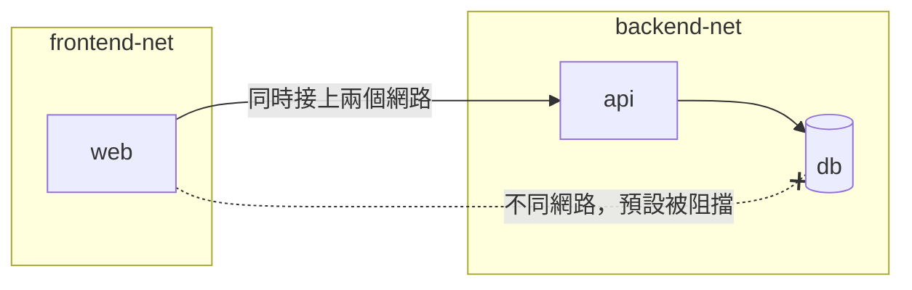
```mermaid
graph LR
    subgraph frontend-net
        W[web]
    end
    subgraph backend-net
        A[api]
        D[(db)]
    end
    W -->|同時接上兩個網路| A
    A --> D
    W -.-x|不同網路，預設被阻擋| D
```

設計原則：

- 依照**信任區域**切分網路（例如 `frontend`、`backend`、`db`），需要跨區的容器（例如 API gateway）再明確接上多個網路。
- 資料庫網路加上 `--internal`，防止資料外洩到網際網路。

### 6.5 埠號發佈

```bash
podman run -d -p 8080:80 ...                 # 所有介面
podman run -d -p 127.0.0.1:8080:80 ...       # 只允許本機
podman run -d -p 8443:443/tcp -p 8443:443/udp ...
podman run -d -P ...                         # 把所有 EXPOSE 的埠對應到隨機埠
podman port web
```

**rootless 綁定 1024 以下的埠**：

```bash
# 方法一：開放非特權埠的起始值（系統層級，需要評估）
echo 'net.ipv4.ip_unprivileged_port_start=80' | sudo tee /etc/sysctl.d/99-podman-ports.conf
sudo sysctl --system

# 方法二（建議）：容器使用高埠號，前面放主機上的反向代理或負載平衡器
```

**保留客戶端的來源 IP**：rootless bridge 網路預設透過 rootlessport 轉送，容器看到的來源 IP 是內部位址。需要記錄真實 IP 時，可以：

- 在前端的反向代理加上 `X-Forwarded-For` 標頭（建議）。
- 評估 6.0 的實驗選項 `rootless_port_forwarder="pasta"`（在 `containers.conf` 的 `[network]` 區段設定），6.1 起也支援 IPv6。

### 6.6 容器連到主機

```bash
# 容器內可以用 host.containers.internal 連到主機（也可以用 host.docker.internal）
podman run --rm docker.io/library/alpine:3 getent hosts host.containers.internal
```

- pasta 模式預設會把主機的 IP 複製給容器，所以容器**不能**直接用主機 IP 連回主機；請改用 `host.containers.internal`（5.3 起 pasta 預設使用 `--map-guest-addr` 提供這個位址）。
- 6.0 起，`--network host` 的容器，`host.containers.internal` 會解析成 `127.0.0.1`。

### 6.7 網路除錯

```bash
# 容器的網路設定
podman inspect api --format '{{json .NetworkSettings.Networks}}'
podman exec api cat /etc/resolv.conf /etc/hosts

# 名稱解析與連線
podman exec api getent hosts db
podman exec api nc -zv db 5432

# 使用 netshoot 之類的除錯映像檔，加入目標容器的網路 namespace
podman run --rm -it --network container:api docker.io/nicolaka/netshoot

# rootless 的網路 namespace
podman unshare --rootless-netns ip addr

# nftables 規則（rootful）
sudo nft list table inet netavark
```

### 6.8 從 CNI 遷移到 Netavark

```bash
# 1. 確認目前的後端
podman info --format '{{.Host.NetworkBackend}}'

# 2. 若仍是 cni：記錄既有網路的設定
podman network ls
podman network inspect <name> > <name>.json

# 3. 刪除所有容器與網路後，切換後端（會清除 CNI 設定）
podman system reset          # ⚠️ 會刪除所有容器、映像檔、volume，請先備份
# 或在 containers.conf 設定 [network] network_backend = "netavark" 後重建

# 4. 依照記錄重新建立網路（podman network create ...）
```

> 📌 Podman 6 完全不會讀取 `/etc/cni/net.d` 裡的設定。**升級前一定要先完成遷移**。

### 6.9 💡 本章實務建議

1. **每個應用堆疊使用自己的網路**，不要讓所有容器都用預設網路 `podman`（沒有 DNS，也沒有區隔）。
2. **資料庫網路使用 `--internal`**，對外服務埠號預設綁定 `127.0.0.1`，再由反向代理統一對外。
3. **子網路規劃要與公司 IP 規劃對齊**，用 `default_subnet_pools` 避開 VPN 與內網網段。
4. **升級到 Podman 6 前確認 `NetworkBackend` 是 netavark**，並確認主機使用 nftables。
5. **需要來源 IP 時優先用反向代理的標頭**，`rootless_port_forwarder="pasta"` 在 6.x 仍屬實驗性質。

---

## 7. Pod 與 Kubernetes 整合

### 7.1 Pod 的運作方式

- Pod 內的所有容器**共享網路 namespace**（同一個 IP、同一組埠號，彼此用 `localhost` 通訊）與 IPC namespace。
- 埠號發佈要設定在 **Pod 上**（`podman pod create -p`），不能設定在個別容器上。
- 每個 Pod 預設有一個 infra 容器負責持有 namespace；用 `--infra=false` 可以不建立，但這樣就無法使用 Quadlet 或 `generate systemd` 管理這個 Pod。

```bash
# 建立 Pod
podman pod create --name shop -p 8080:8080 --network backend --label app=shop

# 加入容器
podman run -d --pod shop --name shop-api registry.corp.example/shop/api:2.3.0
podman run -d --pod shop --name shop-cache docker.io/library/redis:8-alpine

# 在 Pod 內，api 可以用 localhost:6379 連到 Redis
podman pod ps
podman ps --pod --filter pod=shop
podman pod inspect shop
podman pod top shop
podman pod stats shop

# 生命週期
podman pod stop shop && podman pod start shop
podman pod restart shop
podman pod rm -f shop
```

| 選項 | 說明 |
| --- | --- |
| `--share` | 要共享的 namespace（預設 `ipc,net,uts`；加上 `pid` 可以讓 sidecar 看到其他容器的程序） |
| `--exit-policy` | 所有容器結束後 Pod 的行為：`continue`（預設）或 `stop` |
| `--userns` | 整個 Pod 共用的 user namespace 設定，例如 `keep-id` |
| `--infra-image` | 自訂 infra 映像檔（離線環境必須先準備好） |
| `--memory`／`--cpus` | Pod 層級的資源上限 |

### 7.2 從容器／Pod 產生 Kubernetes YAML

```bash
# 產生 Pod YAML
podman kube generate shop -f shop-pod.yaml

# 產生 Deployment（也支援 daemonset、job），並產生 Service
podman kube generate shop --type deployment --replicas 3 --service -f shop-deploy.yaml
```

產生的 YAML 會保留埠號、環境變數、volume（轉成 PVC）、資源限制、healthcheck（6.1 起轉成 `livenessProbe`）等設定，可以作為部署到 Kubernetes 的起點。

### 7.3 在本機執行 Kubernetes YAML

```yaml
# shop.yaml
apiVersion: v1
kind: ConfigMap
metadata:
  name: shop-config
data:
  SPRING_PROFILES_ACTIVE: "dev"
---
apiVersion: v1
kind: PersistentVolumeClaim
metadata:
  name: shop-data
spec:
  accessModes: ["ReadWriteOnce"]
  resources:
    requests:
      storage: 1Gi
---
apiVersion: v1
kind: Pod
metadata:
  name: shop
  labels:
    app: shop
spec:
  restartPolicy: Always
  containers:
    - name: api
      image: registry.corp.example/shop/api:2.3.0
      ports:
        - containerPort: 8080
          hostPort: 8080
      envFrom:
        - configMapRef:
            name: shop-config
      resources:
        limits:
          memory: 1Gi
          cpu: "1"
      livenessProbe:
        httpGet:
          path: /actuator/health
          port: 8080
        periodSeconds: 30
      volumeMounts:
        - name: data
          mountPath: /var/lib/shop
    - name: cache
      image: docker.io/library/redis:8-alpine
  volumes:
    - name: data
      persistentVolumeClaim:
        claimName: shop-data
```

```bash
podman kube play shop.yaml                  # 建立並啟動
podman kube play --replace shop.yaml        # 先刪除舊的，再依新內容重建
podman kube play --build shop.yaml          # image 名稱對應到子目錄的 Containerfile 時，先建置
podman kube play --network backend shop.yaml
podman kube play a.yaml b.yaml              # 5.7 起可以一次處理多個檔案
podman kube down shop.yaml                  # 停止並刪除（volume 會保留）
```

#### 7.3.1 支援範圍

| 項目 | 支援情況 |
| --- | --- |
| 資源種類 | Pod、Deployment、DaemonSet、Job、PersistentVolumeClaim、ConfigMap、Secret |
| Volume 類型 | hostPath、emptyDir、configMap、persistentVolumeClaim（對應到 named volume）、image（僅限 rootful） |
| Deployment 副本數 | 預設只建立 **1 個** Pod |
| 預設 restartPolicy | `Always` |
| 不支援 | Service 的負載平衡、Ingress、HPA、NetworkPolicy、RBAC、StatefulSet 等叢集層級功能 |

Podman 特有的行為可以用 annotation 控制，例如：

| Annotation | 用途 |
| --- | --- |
| `io.podman.annotations.userns` | Pod 的 user namespace，例如 `keep-id` |
| `io.podman.annotations.volumes-from` | 掛載其他容器的 volume |
| `io.podman.annotations.pids-limit/<容器名稱>` | PID 數量上限 |
| `io.podman.annotations.infra.name` | infra 容器名稱 |

### 7.4 部署到 Kubernetes

```bash
# 直接把本機的容器或 Pod 部署到目前 kubeconfig 指向的叢集
podman kube apply --kubeconfig ~/.kube/config --ns shop-dev shop

# 或部署 YAML 檔
podman kube apply --kubeconfig ~/.kube/config -f shop-deploy.yaml
```

實務上，建議把 `podman kube generate` 產生的 YAML 當成**草稿**，再交給 Helm、Kustomize 或 GitOps（Argo CD 等）管理，並補上 Service、Ingress、SecurityContext、資源 requests 等叢集設定。

### 7.5 從本機到平台的開發流程

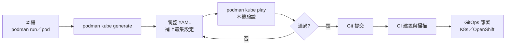
```mermaid
flowchart LR
    A[本機<br/>podman run／pod] --> B[podman kube generate]
    B --> C[調整 YAML<br/>補上叢集設定]
    C --> D[podman kube play<br/>本機驗證]
    D --> E{通過?}
    E -->|否| C
    E -->|是| F[Git 提交]
    F --> G[CI 建置與掃描]
    G --> H[GitOps 部署<br/>K8s／OpenShift]
```

### 7.6 💡 本章實務建議

1. **本機的多容器應用優先用 Pod 表達**，這樣才能直接轉成 Kubernetes YAML，減少「本機可以、叢集不行」的落差。
2. **Kubernetes YAML 是單一事實來源**：同一份 YAML 同時用於本機（`kube play`）、單機主機（Quadlet `.kube`）與叢集。
3. **不要依賴 Podman 不支援的欄位**：Service、Ingress 等叢集資源在本機會被忽略，需要在叢集上另外驗證。
4. **rootless 的 Pod 加上 `io.podman.annotations.userns: keep-id`**，可以減少 hostPath 的權限問題。

---

## 8. Quadlet 與 systemd 生產部署

> 🆕 **v2.0 新增**：v1.0 沒有涵蓋 Quadlet。Quadlet 是在 Linux 主機上以 systemd 長期執行容器的**官方建議做法**；`podman generate systemd` 從 4.7 起已標示為棄用（不會移除，但只修嚴重錯誤、不再加新功能）。

### 8.1 Quadlet 是什麼

Quadlet 是一個 **systemd generator**。你只要寫一個宣告式的 `.container`（或 `.pod`、`.network` 等）檔案，每次開機或執行 `systemctl daemon-reload` 時，Quadlet 就會自動把它轉成完整的 `.service` 單元。這個 service 由 systemd 負責啟動順序、相依性、重啟、日誌（journald）與資源控制。

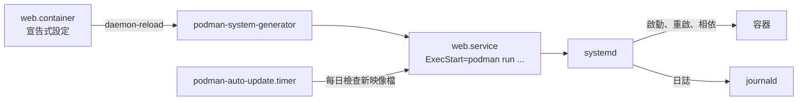
```mermaid
flowchart LR
    Q["web.container<br/>宣告式設定"] -->|daemon-reload| G[podman-system-generator]
    G --> S["web.service<br/>ExecStart=podman run ..."]
    S --> SD[systemd]
    SD -->|啟動、重啟、相依| C[容器]
    SD -->|日誌| J[journald]
    T[podman-auto-update.timer] -->|每日檢查新映像檔| S
```

**與其他做法的比較**

| 做法 | 優點 | 缺點 | 建議 |
| --- | --- | --- | --- |
| `podman run --restart=always` | 最簡單 | 沒有 daemon，主機重開後不會自動恢復（除非啟用 `podman-restart.service`）；沒有相依性管理 | 僅限開發 |
| `podman generate systemd` | 產生標準 unit | 已棄用；設定分散在產生出來的長指令裡，難以維護 | 既有系統逐步遷移 |
| **Quadlet** | 宣告式、可以放進 Git、支援 drop-in 與範本、整合 auto-update | 需要 systemd 與 cgroups v2 | ✅ **標準做法** |
| Compose | 開發者熟悉 | 沒有與 systemd 整合，重開機與監控要另外處理 | 開發、測試環境 |

### 8.2 單元檔類型

| 副檔名 | 用途 | 產生的 service | 預設的 Podman 物件名稱 |
| --- | --- | --- | --- |
| `.container` | 單一容器 | `名稱.service` | `systemd-名稱` |
| `.pod` | Pod | `名稱-pod.service` | `systemd-名稱` |
| `.network` | 網路 | `名稱-network.service` | `systemd-名稱` |
| `.volume` | Volume | `名稱-volume.service` | `systemd-名稱` |
| `.image` | 預先拉取映像檔 | `名稱-image.service` | — |
| `.build` | 建置映像檔 | `名稱-build.service` | — |
| `.kube` | 執行 Kubernetes YAML | `名稱.service` | 依 YAML |
| `.artifact` | 拉取 OCI artifact（5.7 新增） | `名稱-artifact.service` | — |

可以用 `ContainerName=`、`PodName=`、`NetworkName=`、`VolumeName=` 覆寫預設名稱。在其他 Quadlet 檔裡引用時，**要寫檔名**（例如 `Network=backend.network`），Quadlet 會自動換成真正的名稱並加上相依性。

### 8.3 檔案放置路徑

| 身分 | 路徑（優先順序由高到低） | 用途 |
| --- | --- | --- |
| rootful | `/run/containers/systemd/` | 暫時測試 |
| | `/etc/containers/systemd/` | 系統管理員定義 |
| | `/usr/share/containers/systemd/` | 發行版／套件提供 |
| rootless | `$XDG_RUNTIME_DIR/containers/systemd/` | 暫時測試 |
| | `~/.config/containers/systemd/` | 使用者自己定義 |
| | `/etc/containers/systemd/users/${UID}/` | 管理員為**特定使用者**提供 |
| | `/etc/containers/systemd/users/` | 管理員為**所有使用者**提供 |
| | `/usr/share/containers/systemd/users/${UID}/`、`/usr/share/containers/systemd/users/` | 發行版提供（6.0 新增） |

子目錄會被遞迴搜尋，所以可以依照應用程式分資料夾存放。

### 8.4 第一個 Quadlet：Nginx

```ini
# ~/.config/containers/systemd/web.container
[Unit]
Description=Corporate web front-end
After=network-online.target

[Container]
ContainerName=web
Image=docker.io/nginxinc/nginx-unprivileged:stable-alpine
PublishPort=127.0.0.1:8080:8080
Volume=%h/site:/usr/share/nginx/html:ro,Z
AutoUpdate=registry
HealthCmd=wget -qO- http://localhost:8080/ || exit 1
HealthInterval=30s
HealthOnFailure=kill
Notify=healthy

[Service]
Restart=always
TimeoutStartSec=300

[Install]
WantedBy=default.target
```

```bash
# 讓 systemd 重新產生 unit
systemctl --user daemon-reload

# 啟動與查看狀態（Quadlet 產生的 unit 不能 enable，開機自動啟動靠 [Install] 區段）
systemctl --user start web.service
systemctl --user status web.service
journalctl --user -u web.service -f

# rootless 服務要在使用者登出後繼續執行，記得啟用 linger
sudo loginctl enable-linger "$USER"
```

重點說明：

- `Notify=healthy`：等到 healthcheck 第一次成功，systemd 才會把服務視為「已啟動」。搭配 auto-update 的回滾功能效果最好。
- `HealthOnFailure=kill` 加上 `Restart=always`：健康檢查失敗時終止容器，交給 systemd 重新啟動。
- `%h` 是 systemd 的 specifier，代表使用者的家目錄。
- 開機時可能需要先拉取映像檔，超過 systemd 預設的 90 秒啟動時限，所以要加大 `TimeoutStartSec`。

### 8.5 多元件應用：Pod＋網路＋Volume＋Secret

```ini
# /etc/containers/systemd/shop/shop.network
[Network]
Subnet=10.90.20.0/24
Label=app=shop
```

```ini
# /etc/containers/systemd/shop/shop-db.volume
[Volume]
Label=app=shop
Label=backup=daily
```

```ini
# /etc/containers/systemd/shop/shop.pod
[Pod]
PodName=shop
Network=shop.network
PublishPort=8080:8080

[Install]
WantedBy=multi-user.target
```

```ini
# /etc/containers/systemd/shop/shop-db.container
[Unit]
Description=Shop PostgreSQL

[Container]
ContainerName=shop-db
Image=docker.io/library/postgres:17
Network=shop.network
NetworkAlias=db
Volume=shop-db.volume:/var/lib/postgresql/data:Z
Secret=shop_db_password,type=env,target=POSTGRES_PASSWORD
Environment=POSTGRES_DB=shop
Environment=POSTGRES_USER=shop
HealthCmd=pg_isready -U shop
HealthInterval=15s
HealthOnFailure=kill

[Service]
Restart=always

[Install]
WantedBy=multi-user.target
```

```ini
# /etc/containers/systemd/shop/shop-api.container
[Unit]
Description=Shop API
Requires=shop-db.service
After=shop-db.service

[Container]
ContainerName=shop-api
Image=registry.corp.example/shop/api:2.3.0
Pod=shop.pod
Secret=shop_db_password,type=env,target=SPRING_DATASOURCE_PASSWORD
Environment=SPRING_DATASOURCE_URL=jdbc:postgresql://db:5432/shop
AutoUpdate=registry
HealthCmd=curl -fsS http://localhost:8080/actuator/health || exit 1
HealthStartPeriod=90s
HealthOnFailure=kill
Notify=healthy
NoNewPrivileges=true
ReadOnly=true
DropCapability=ALL
Memory=1g

[Service]
Restart=always
TimeoutStartSec=600

[Install]
WantedBy=multi-user.target
```

```bash
# 事先建立 secret（不要寫在 Quadlet 檔裡）
printf '%s' "$DB_PASSWORD" | sudo podman secret create shop_db_password -

sudo systemctl daemon-reload
sudo systemctl start shop-pod.service
sudo systemctl status shop-api.service shop-db.service
```

> 📌 `shop-api` 透過 `Pod=shop.pod` 加入 Pod，Pod 又透過 `Network=shop.network` 接上網路，所以 API 可以用 DNS 名稱 `db` 連到資料庫。Quadlet 會自動加上 network、volume、pod 的相依性，不需要手寫 `Requires=`；上例的 `Requires=shop-db.service` 是**應用層面**的相依（API 需要資料庫先啟動）。

### 8.6 其他單元檔範例

```ini
# app.image：開機時預先拉取，並指定憑證檔
[Image]
Image=registry.corp.example/shop/api:2.3.0
AuthFile=/etc/containers/auth/corp.json
Policy=newer
```

```ini
# app.build：在主機上建置映像檔，給其他 .container 使用
[Build]
ImageTag=localhost/shop/report:latest
SetWorkingDirectory=unit
File=Containerfile
```

```ini
# legacy.kube：直接執行既有的 Kubernetes YAML
[Kube]
Yaml=/etc/containers/systemd/legacy/legacy.yaml
Network=shop.network
PublishPort=9090:9090
AutoUpdate=registry

[Install]
WantedBy=multi-user.target
```

### 8.7 `podman quadlet` 管理指令

5.6 起提供 `podman quadlet` 指令，用來安裝與管理**目前使用者**的 Quadlet：

```bash
# 安裝單一檔案（也可以是 URL）
podman quadlet install web.container

# 安裝整個目錄（含設定檔等非 Quadlet 檔案）為一個「應用程式」
podman quadlet install --application=shop ./shop/

# 一個 .quadlets 檔裡放多個 Quadlet（5.8 新增），用 --- 分隔，每段以 # FileName=<名稱> 開頭
podman quadlet install webapp.quadlets

# 更新既有的 Quadlet
podman quadlet install --replace web.container

# 列出、檢視、移除
podman quadlet list                     # 6.0 起有別名 ls，並顯示所屬 Pod
podman quadlet list --filter status=active
podman quadlet print web.container      # 別名 cat
podman quadlet rm web.container
```

> ⚠️ **v2.0 更正**：Podman 6 改變了 `podman quadlet install` 的存放方式：5.x 用 `.app` 檔追蹤同一個應用程式的檔案，6.0 改成**每個應用程式一個子目錄**，比較容易手動管理。從 5.x 升級後，建議用 `podman quadlet list` 檢查既有的 Quadlet。

### 8.8 自動更新（auto-update）

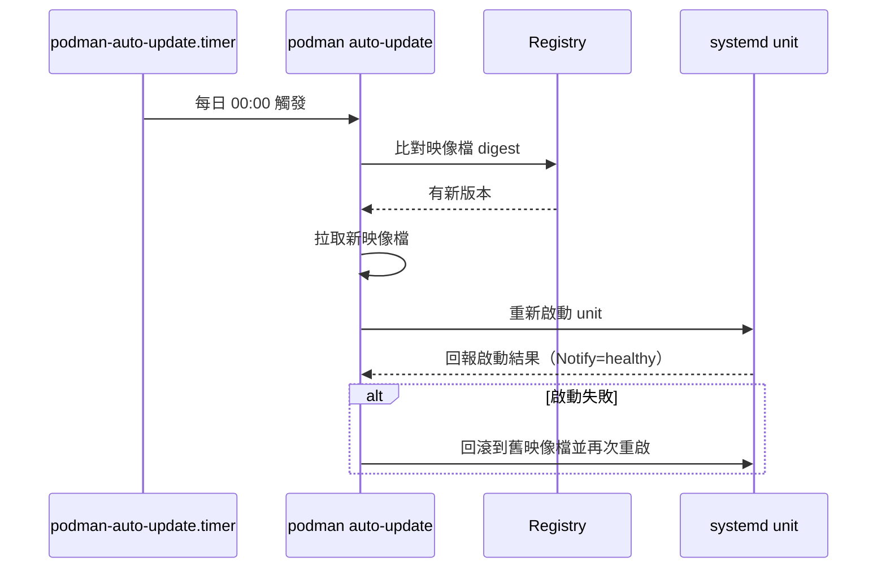
```mermaid
sequenceDiagram
    participant T as podman-auto-update.timer
    participant P as podman auto-update
    participant R as Registry
    participant S as systemd unit
    T->>P: 每日 00:00 觸發
    P->>R: 比對映像檔 digest
    R-->>P: 有新版本
    P->>P: 拉取新映像檔
    P->>S: 重新啟動 unit
    S-->>P: 回報啟動結果（Notify=healthy）
    alt 啟動失敗
        P->>S: 回滾到舊映像檔並再次重啟
    end
```

```bash
# 啟用每日排程（rootful 用 sudo systemctl；rootless 用 systemctl --user）
sudo systemctl enable --now podman-auto-update.timer

# 先看哪些容器有更新，但不執行
sudo podman auto-update --dry-run

# 手動執行
sudo podman auto-update

# 調整排程（例如改到每週日凌晨 3 點）
sudo systemctl edit podman-auto-update.timer
```

| 策略 | 說明 | 前提 |
| --- | --- | --- |
| `AutoUpdate=registry` | 比對 registry 上的 digest，不同就拉取並重啟 | 映像檔必須寫完整名稱 |
| `AutoUpdate=local` | 比對本機儲存的映像檔（例如 CI 推送或 `.build` 重建之後） | — |

**回滾**：`podman auto-update` 預設 `--rollback=true`，重啟失敗時會退回舊映像檔。要讓 systemd 能判斷「失敗」，容器必須正確回報就緒狀態，也就是 `Notify=healthy`，或讓應用程式自己送出 sd_notify。

**企業建議**：

- 正式環境的 tag 建議採「次版本浮動」（例如 `2.3`），由 CI 推送修補版，auto-update 自動套用。
- 金融業的正式環境通常要求變更管理。可以在正式環境**停用 timer**，只在變更時段手動執行 `podman auto-update`；測試環境再開啟自動更新。

### 8.9 Drop-in 與範本

```ini
# 覆寫單一設定而不修改原檔：/etc/containers/systemd/shop-api.container.d/10-prod.conf
[Container]
Environment=SPRING_PROFILES_ACTIVE=prod
Memory=2g
```

```ini
# 範本：worker@.container（%i 是實例名稱）
[Container]
Image=registry.corp.example/batch/worker:1.8
Exec=--queue %i
Volume=worker-data@.volume:/work

[Install]
WantedBy=multi-user.target
DefaultInstance=default
```

```bash
# 啟動多個實例
sudo systemctl start worker@orders.service worker@payments.service
```

### 8.10 除錯

```bash
# 查看 Quadlet 產生的 unit 與錯誤訊息（rootless 加 --user）
/usr/lib/systemd/system-generators/podman-system-generator --user --dryrun

# 只驗證特定 unit
systemd-analyze --user --generators=true verify web.service

# 只測試某個目錄的檔案
QUADLET_UNIT_DIRS=./test /usr/lib/systemd/system-generators/podman-system-generator --user --dryrun
```

| 症狀 | 可能原因 |
| --- | --- |
| `Unit web.service not found` | 語法錯誤，或用了比目前 Podman 版本更新的 key；用 `--dryrun` 查看錯誤 |
| 開機後服務沒有啟動 | 缺少 `[Install]` 區段；rootless 沒有啟用 linger |
| 啟動逾時 | 拉取映像檔太久：加大 `TimeoutStartSec`，或用 `.image` 先拉取 |
| 服務一直是 activating | 使用 `Notify=healthy`，但 healthcheck 一直沒有成功 |
| 在 service 裡設定 `User=` 沒有作用 | Quadlet 不支援 systemd 的 `User=`、`Group=`、`DynamicUser=`；rootless 請把檔案放在該使用者的路徑 |

### 8.11 從 `podman generate systemd` 遷移

| 舊做法 | Quadlet 對應 |
| --- | --- |
| `podman generate systemd --new --name web > web.service` | 寫 `web.container` |
| `ExecStart=/usr/bin/podman run ... --label io.containers.autoupdate=registry` | `AutoUpdate=registry` |
| `--sdnotify=conmon` | 預設值；需要時改用 `Notify=true` 或 `Notify=healthy` |
| 手寫的 network／volume 建立腳本 | `.network`、`.volume` 單元檔 |
| Pod 加上多個 container unit | `.pod` 加上 `Pod=` |

遷移步驟：

1. 用 `podman inspect` 取出既有容器的參數，對照 `man podman-container.unit` 轉寫成 Quadlet。
2. 停用並刪除舊的 `.service` 檔：`systemctl disable --now container-web.service`。
3. 放入 Quadlet 檔、`daemon-reload`、啟動並驗證。
4. 把 Quadlet 檔納入 Git 與組態管理（例如 Ansible 的 `containers.podman.podman_container` 模組已支援產生 Quadlet）。

### 8.12 💡 本章實務建議

1. **正式主機一律使用 Quadlet**，檔案納入 Git，並由組態管理工具佈署。
2. **每個 `.container` 都要有 healthcheck、`Restart=always`、`Notify=healthy`**，才能讓 auto-update 的回滾正確運作。
3. **機密透過 `Secret=` 引用**，不要把密碼寫在 `Environment=`。
4. **環境差異放在 drop-in**（`*.container.d/*.conf`），主檔在各環境保持一致。
5. **Quadlet 需要 cgroups v2**，RHEL 8 主機要先升級。

---

## 9. Compose 與 Docker 相容

### 9.1 三種執行 Compose 的方式

| 方式 | 原理 | 相容性 | 建議情境 |
| --- | --- | --- | --- |
| `podman compose`（4.7 起） | 一層薄包裝，呼叫外部的 compose provider，並自動把它連到 Podman socket | 依 provider 而定 | **建議的統一入口** |
| `podman-compose`（1.6.0） | Python 實作，直接把 Compose 檔轉成 `podman` 指令 | 大部分 Compose 規格；不需要 socket | 沒有 docker-compose 的 Linux 環境 |
| `docker-compose` 連 Podman socket | 原生的 Compose v2，透過 Docker 相容 API 操作 Podman | 最接近 Docker 行為 | 依賴 Compose 進階功能的團隊 |

`podman compose` 預設會依序尋找 `docker-compose`、`podman-compose`；**兩者都有時，`docker-compose` 優先**。可以在 `containers.conf` 的 `[engine]` 區段設定 `compose_providers`，或用 `PODMAN_COMPOSE_PROVIDER` 環境變數指定。

```bash
# 安裝 podman-compose
sudo dnf -y install podman-compose       # RHEL（EPEL）／Fedora
pip install --user podman-compose        # 其他平台

podman compose version
```

### 9.2 Compose 檔範例：前端＋API＋資料庫＋快取

```yaml
# compose.yaml
name: shop

services:
  web:
    image: registry.corp.example/shop/web:2.3.0
    ports:
      - "127.0.0.1:8080:8080"
    depends_on:
      api:
        condition: service_healthy
    networks: [frontend]

  api:
    build:
      context: ./api
      dockerfile: Containerfile
    image: localhost/shop/api:dev
    environment:
      SPRING_PROFILES_ACTIVE: dev
      SPRING_DATASOURCE_URL: jdbc:postgresql://db:5432/shop
      SPRING_DATASOURCE_USERNAME: shop
      SPRING_DATASOURCE_PASSWORD_FILE: /run/secrets/db_password
    secrets: [db_password]
    healthcheck:
      test: ["CMD", "curl", "-fsS", "http://localhost:8080/actuator/health"]
      interval: 30s
      timeout: 5s
      retries: 3
      start_period: 60s
    depends_on:
      db:
        condition: service_healthy
      cache:
        condition: service_started
    networks: [frontend, backend]
    deploy:
      resources:
        limits:
          memory: 1g
          cpus: "1.0"

  db:
    image: docker.io/library/postgres:17
    environment:
      POSTGRES_DB: shop
      POSTGRES_USER: shop
      POSTGRES_PASSWORD_FILE: /run/secrets/db_password
    secrets: [db_password]
    volumes:
      - db-data:/var/lib/postgresql/data:Z
    healthcheck:
      test: ["CMD-SHELL", "pg_isready -U shop"]
      interval: 10s
      retries: 5
    networks: [backend]

  cache:
    image: docker.io/library/redis:8-alpine
    command: ["redis-server", "--appendonly", "yes"]
    volumes:
      - cache-data:/data:Z
    networks: [backend]

networks:
  frontend: {}
  backend:
    internal: true

volumes:
  db-data: {}
  cache-data: {}

secrets:
  db_password:
    file: ./secrets/db_password.txt
```

> 📌 `SPRING_DATASOURCE_PASSWORD_FILE` 需要應用程式自行讀取檔案；也可以改用 Spring Boot 的 `configtree:` 設定匯入 `/run/secrets/`。`./secrets/` 要加進 `.gitignore`。

### 9.3 常用指令

```bash
podman compose up -d                    # 背景啟動
podman compose up -d --build            # 先建置再啟動
podman compose ps
podman compose logs -f api
podman compose exec db psql -U shop
podman compose run --rm api ./mvnw test # 一次性工作
podman compose up -d --scale worker=3   # 調整副本數
podman compose pull
podman compose down                     # 停止並刪除容器與網路
podman compose down -v                  # 連同 volume 一起刪除（⚠️ 資料會消失）
podman compose config                   # 顯示合併後的最終設定
```

podman-compose 1.6.0 新增 `up --wait`、`--wait-timeout`、`COMPOSE_PROFILES` 環境變數、`volume.type=image` 等功能，並會在 `up` 時先拉取映像檔再替換容器，縮短停機時間。

### 9.4 Docker 相容 socket

```bash
# rootless：啟用使用者層級的 socket（按需啟動，不是常駐 daemon）
systemctl --user enable --now podman.socket
export DOCKER_HOST=unix://$XDG_RUNTIME_DIR/podman/podman.sock

# rootful
sudo systemctl enable --now podman.socket
# socket 位置：/run/podman/podman.sock
# 安裝 podman-docker 套件會提供 /usr/bin/docker 包裝指令與 /var/run/docker.sock 連結

# 驗證
docker version        # Server 會顯示 Podman Engine
curl -s --unix-socket $XDG_RUNTIME_DIR/podman/podman.sock http://d/v1.44/info | head -c 200
```

```bash
# macOS／Windows：取得 podman machine 的 socket 位置
podman machine inspect --format '{{.ConnectionInfo.PodmanSocket.Path}}'
```

**相容程度**：Podman 6 支援 Docker Engine API **v1.44**，並已開始實作 v1.45。常見工具（docker-compose、Testcontainers、IDE 外掛、GitLab Runner 的 docker executor）大多可以直接使用；依賴 Swarm、BuildKit 專屬功能或 Docker plugin 的工具則不支援。

### 9.5 Testcontainers 設定

```properties
# ~/.testcontainers.properties（或用環境變數）
docker.host=unix:///run/user/1000/podman/podman.sock
```

```bash
export DOCKER_HOST=unix://$XDG_RUNTIME_DIR/podman/podman.sock
export TESTCONTAINERS_DOCKER_SOCKET_OVERRIDE=$XDG_RUNTIME_DIR/podman/podman.sock
# Ryuk（清理用的容器）需要掛載 socket；rootless 遇到權限問題時可以改用特權模式或停用
export TESTCONTAINERS_RYUK_CONTAINER_PRIVILEGED=true
```

> 📌 停用 Ryuk（`TESTCONTAINERS_RYUK_DISABLED=true`）會讓測試中斷時留下殘留容器，CI 環境要另外安排清理工作。

### 9.6 遠端連線

```bash
# 透過 SSH 管理遠端主機上的 Podman
podman system connection add prod-01 ssh://deploy@prod-01.corp.example/run/user/1001/podman/podman.sock
podman system connection list
podman --connection prod-01 ps

# 5.7 起支援 TLS／mTLS 的 TCP 連線（適合不能開 SSH 的環境）
podman system connection add prod-02 tcp://prod-02.corp.example:8888 \
  --tls-ca /etc/pki/corp/ca.pem --tls-cert ~/.pki/client.pem --tls-key ~/.pki/client.key
```

### 9.7 💡 本章實務建議

1. **開發環境統一用 `podman compose` 當入口**，並在 `containers.conf` 固定 provider，避免每台電腦行為不同。
2. **Compose 用於開發與測試**；正式主機改用 Quadlet（可以用 `.kube` 或個別的 `.container` 表達同樣的架構）。
3. **需要 Docker API 的工具透過 `podman.socket` 連線**，不要安裝 Docker daemon 與 Podman 並存，避免混淆。
4. **Compose 檔裡的密碼一律用 `secrets`**，不要直接寫在 `environment`。

---

## 10. 安全性強化

### 10.1 縱深防禦模型

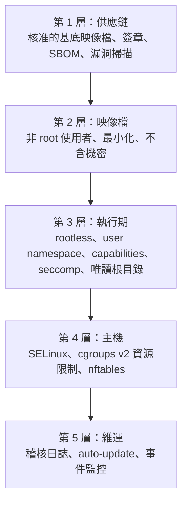
```mermaid
graph TB
    L1["第 1 層：供應鏈<br/>核准的基底映像檔、簽章、SBOM、漏洞掃描"] --> L2
    L2["第 2 層：映像檔<br/>非 root 使用者、最小化、不含機密"] --> L3
    L3["第 3 層：執行期<br/>rootless、user namespace、capabilities、seccomp、唯讀根目錄"] --> L4
    L4["第 4 層：主機<br/>SELinux、cgroups v2 資源限制、nftables"] --> L5
    L5["第 5 層：維運<br/>稽核日誌、auto-update、事件監控"]
```

### 10.2 Rootless 與 User Namespace

rootless 是 Podman 最重要的安全特性：就算攻擊者逃出容器，在主機上也只有一般使用者的權限。

| `--userns` 模式 | 容器內 root 對應到 | 主機上的你對應到 | 用途 |
| --- | --- | --- | --- |
| （rootless 預設） | 你的 UID | 容器內的 root | 一般用途 |
| `keep-id` | subordinate UID | 相同的 UID | 開發時掛載原始碼，避免權限錯亂 |
| `keep-id:uid=1001,gid=1001` | subordinate UID | 指定的 UID／GID | 映像檔使用固定的非 root UID |
| `auto` | 自動配置一段**獨立的** UID 範圍 | 不對應 | 多個容器彼此隔離（rootful 時需要 `containers` 使用者的 subuid） |
| `nomap` | subordinate UID | 不對應 | 容器完全碰不到你的檔案 |

```bash
# 確認容器內外的身分對應
podman run --rm --userns=keep-id docker.io/library/alpine:3 id
podman top -l user huser     # 比較容器內與主機上的 UID
```

⚠️ **rootful 容器也要降低權限**：必須以 root 執行 Podman 時（例如使用 macvlan），請搭配 `--userns=auto`，讓每個容器使用不同的 UID 範圍。

### 10.3 Capabilities 與 Seccomp

Podman 預設只給容器 11 個 capabilities，比 Docker 預設的少（沒有 `NET_RAW`、`MKNOD`、`AUDIT_WRITE`）：

```text
CHOWN, DAC_OVERRIDE, FOWNER, FSETID, KILL, NET_BIND_SERVICE,
SETFCAP, SETGID, SETPCAP, SETUID, SYS_CHROOT
```

```bash
# 最小權限：全部移除，只加回需要的
podman run -d --name api \
  --cap-drop=ALL \
  --security-opt no-new-privileges \
  --read-only --tmpfs /tmp:rw,size=64m,noexec,nosuid \
  --user 1001:1001 \
  --pids-limit 512 --memory 1g --cpus 1 \
  registry.corp.example/app/api:1.4.2

# 查看容器實際擁有的 capabilities
podman inspect api --format '{{.EffectiveCaps}}'
```

- **Seccomp**：預設套用 `/usr/share/containers/seccomp.json`，阻擋容器通常不需要的危險系統呼叫（例如載入核心模組、重新開機）。可以用 `--security-opt seccomp=profile.json` 套用更嚴格的設定；也可以用 OCI seccomp BPF hook 記錄應用程式實際用到的系統呼叫，再產生專屬設定檔。
- ⚠️ **禁止在正式環境使用 `--privileged`**：它會關閉 seccomp、SELinux 隔離，並給予全部 capabilities。

### 10.4 SELinux

```bash
# 確認 SELinux 為 enforcing
getenforce

# 容器程序的標籤：container_t 加上唯一的 MCS 類別（例如 s0:c123,c456）
podman run -d --name demo docker.io/library/nginx:stable
ps -eZ | grep nginx

# 需要特殊存取時，用 udica 產生專屬政策，而不是關閉 SELinux
podman inspect demo > demo.json
sudo udica -j demo.json my_nginx
sudo semodule -i my_nginx.cil /usr/share/udica/templates/base_container.cil
podman run --security-opt label=type:my_nginx.process ...
```

| 做法 | 評價 |
| --- | --- |
| `setenforce 0` | ❌ 絕對禁止 |
| `--security-opt label=disable` | ⚠️ 只限短期除錯 |
| bind mount 加 `:Z`／`:z` | ✅ 標準做法 |
| 用 udica 產生客製政策 | ✅ 需要特殊存取時的做法 |

### 10.5 Secret 管理

```bash
# 建立（從 stdin 讀入，避免留在 shell 歷史紀錄）
printf '%s' "$DB_PASSWORD" | podman secret create db_password -
podman secret create --driver file --label app=shop tls_key ./tls.key
podman secret ls
podman secret inspect db_password            # 不會顯示內容
podman secret inspect --showsecret db_password   # 需要時才顯示

# 使用：預設掛載成 /run/secrets/<名稱>
podman run --secret db_password ...
podman run --secret db_password,type=env,target=DB_PASSWORD ...
podman run --secret tls_key,target=/etc/app/tls.key,mode=0400,uid=1001 ...

# 更新（同名 secret 直接取代）
printf '%s' "$NEW_PASSWORD" | podman secret create --replace db_password -
```

| Driver | 儲存方式 | 適用 |
| --- | --- | --- |
| `file`（預設） | 本機檔案（未加密，靠檔案權限保護） | 開發、一般主機 |
| `pass` | 以 GPG 加密的 pass 儲存庫 | 需要靜態加密 |
| `shell` | 呼叫自訂腳本存取外部系統（例如 HashiCorp Vault、CyberArk） | **企業建議**：與既有的機密管理平台整合 |

> ⚠️ `ENV`、`ARG`、Compose 的 `environment` 都會出現在 `podman inspect` 的輸出與映像檔的 metadata 裡，**不能用來傳遞機密**。

### 10.6 映像檔簽章與驗證

Podman 支援兩種簽章：**sigstore**（與 cosign 相容，簽章以 OCI artifact 存放在 registry，**建議採用**）與傳統的 GPG simple signing。

```bash
# 1. 產生金鑰（使用 cosign）
cosign generate-key-pair

# 2. 推送時簽章
podman push --sign-by-sigstore-private-key ./cosign.key \
  registry.corp.example/app/api:1.4.2
```

```yaml
# 3. 讓 Podman 讀寫 sigstore 附件：/etc/containers/registries.d/corp.yaml
docker:
  registry.corp.example:
    use-sigstore-attachments: true
```

```json
{
  "default": [{ "type": "reject" }],
  "transports": {
    "docker": {
      "registry.corp.example": [
        {
          "type": "sigstoreSigned",
          "keyPath": "/etc/pki/containers/cosign.pub",
          "signedIdentity": { "type": "matchRepository" }
        }
      ],
      "registry.access.redhat.com": [
        {
          "type": "signedBy",
          "keyType": "GPGKeys",
          "keyPath": "/etc/pki/rpm-gpg/RPM-GPG-KEY-redhat-release"
        }
      ]
    },
    "docker-daemon": { "": [{ "type": "insecureAcceptAnything" }] }
  }
}
```

上面是 `/etc/containers/policy.json` 的範例：**預設拒絕**，只接受公司 registry 上有正確 sigstore 簽章的映像檔，以及 Red Hat 官方簽章的映像檔。

```bash
# 檢視目前的信任策略（6.0 起 trust set 需要 --signature-policy 指定檔案）
podman image trust show
```

> 📌 如果使用 Fulcio／Rekor 的 keyless 簽章，`policy.json` 要改用 `fulcio` 與 `rekorPublicKeyPath` 欄位，詳見 `man containers-policy.json`。

### 10.7 SBOM 與漏洞掃描

```bash
# 建置時同時產生 SBOM（使用 syft 掃描器映像檔）
podman build --sbom syft-cyclonedx \
  --sbom-output=api.cdx.json -t registry.corp.example/app/api:1.4.2 .

# Trivy（0.74）：掃描本機的 Podman 映像檔
trivy image --image-src podman --severity HIGH,CRITICAL --exit-code 1 \
  registry.corp.example/app/api:1.4.2

# Grype（0.119）
grype podman:registry.corp.example/app/api:1.4.2 --fail-on high
```

| 關卡 | 做法 | 未通過時 |
| --- | --- | --- |
| PR／建置 | 掃描 HIGH／CRITICAL，並產生 SBOM | 阻擋合併 |
| 推送到 registry | 簽章，並把 SBOM 以 artifact 附在映像檔上 | 禁止推送 |
| 部署 | `policy.json` 驗證簽章 | 拒絕拉取 |
| 執行期 | 每日重新掃描既有映像檔，比對新公布的 CVE | 開立修補工單 |

### 10.8 安全基準對照

| 控制項 | Podman 做法 | 對應規範 |
| --- | --- | --- |
| 最小權限執行 | rootless、`--cap-drop=ALL`、`USER 1001` | NIST SP 800-190 §4.4 容器風險；CIS Docker Benchmark 第 4、5 章 |
| 映像檔來源可信 | `policy.json` 驗證簽章、內部 mirror | NIST SP 800-190 §4.1–4.2 映像檔與 registry 風險；SLSA |
| 機密保護 | `podman secret`（shell driver 串接 Vault） | ISO 27001:2022 A.5.17 |
| 資源隔離 | cgroups v2 限制記憶體、CPU、PID | CIS 5.x |
| 稽核軌跡 | `podman events` 寫入 journald，轉送到 SIEM | ISO 27001:2022 A.8.15 |
| 弱點管理 | SBOM 加上持續掃描 | 金融業資安規範的弱點管理要求 |

### 10.9 💡 本章實務建議

1. **rootless 是預設值**：rootful 必須申請例外，並搭配 `--userns=auto`。
2. **執行期的安全基準**：`--cap-drop=ALL`、`no-new-privileges`、`--read-only`、資源限制，寫進 Quadlet 範本強制套用。
3. **SELinux 永遠是 enforcing**，權限問題用 `:Z` 或 udica 解決。
4. **`policy.json` 採預設拒絕**，只信任公司 registry 的簽章與原廠簽章。
5. **機密透過 shell driver 串接公司的機密管理平台**，不要把機密留在主機的檔案裡。

---

## 11. 企業 Registry 與供應鏈

### 11.1 企業 Registry 架構

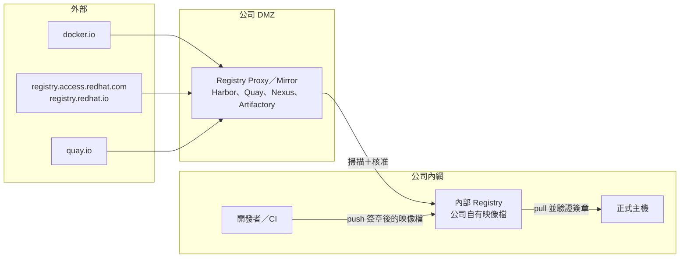
```mermaid
graph LR
    subgraph 外部
        DH[docker.io]
        RH[registry.access.redhat.com<br/>registry.redhat.io]
        Q[quay.io]
    end
    subgraph 公司 DMZ
        PX[Registry Proxy／Mirror<br/>Harbor、Quay、Nexus、Artifactory]
    end
    subgraph 公司內網
        INT[內部 Registry<br/>公司自有映像檔]
        DEV[開發者／CI]
        PRD[正式主機]
    end
    DH --> PX
    RH --> PX
    Q --> PX
    PX -->|掃描＋核准| INT
    DEV -->|push 簽章後的映像檔| INT
    INT -->|pull 並驗證簽章| PRD
```

設計原則：

- **正式主機不直接連網際網路**，只從內部 registry 拉取。
- 外部映像檔經過 proxy 快取、掃描、核准後，才**複製**到內部 registry。
- 每個專案或團隊使用自己的命名空間，並設定推送權限與保留政策。

### 11.2 registries.conf

```toml
# /etc/containers/registries.conf.d/10-corp.conf（Podman 6 只接受 V2 格式）

# 短名稱只搜尋公司的 registry
unqualified-search-registries = ["registry.corp.example"]

# 短名稱有歧義時直接失敗（不詢問）
short-name-mode = "enforcing"

# docker.io 一律走公司 mirror
[[registry]]
prefix = "docker.io"
location = "docker.io"
  [[registry.mirror]]
  location = "mirror.corp.example/dockerhub"

# Red Hat 映像檔走 mirror
[[registry]]
prefix = "registry.access.redhat.com"
location = "registry.access.redhat.com"
  [[registry.mirror]]
  location = "mirror.corp.example/redhat"

# 封鎖未核准的來源
[[registry]]
location = "ghcr.io"
blocked = true

# 測試用的內部 registry（沒有 TLS，正式環境禁止）
[[registry]]
location = "registry-test.corp.example:5000"
insecure = true
```

| 欄位 | 說明 |
| --- | --- |
| `unqualified-search-registries` | 短名稱的搜尋清單 |
| `short-name-mode` | `enforcing`（有歧義就失敗）、`permissive`、`disabled` |
| `prefix`／`location` | 把符合 prefix 的映像檔導向 location |
| `mirror` | 依序嘗試的鏡像站；可以加上 `pull-from-mirror = "digest-only"` 只在用 digest 拉取時使用 mirror |
| `blocked` | 禁止拉取 |
| `insecure` | 允許 HTTP 或不驗證 TLS |

另外，`/etc/containers/registries.conf.d/000-shortnames.conf` 提供了常見短名稱的別名（例如 `nginx` 對應到 `docker.io/library/nginx`）。

> ⚠️ **v2.0 更正**：v1.0 的範例把 V1 格式（`[registries.search]`、`[registries.block]`）與 V2 格式（`[[registry]]`）寫在同一個檔案裡，這種混用會讓 Podman 直接報錯；而且 Podman 6 已經完全移除 V1 格式。請改用本節的 V2 寫法，並用 `podman info --format '{{.Registries}}'` 確認實際生效的設定。

### 11.3 登入與憑證

```bash
# 互動式登入
podman login registry.corp.example

# CI：從 stdin 讀入 token
echo "$REGISTRY_TOKEN" | podman login -u "$REGISTRY_USER" --password-stdin registry.corp.example

# 指定憑證檔（預設：rootless 為 $XDG_RUNTIME_DIR/containers/auth.json，重開機後會消失）
podman login --authfile /etc/containers/auth/corp.json registry.corp.example
export REGISTRY_AUTH_FILE=/etc/containers/auth/corp.json

podman login --get-login registry.corp.example
podman logout registry.corp.example
```

**Credential helper**：在 auth.json 裡設定 `credHelpers`，把憑證交給作業系統的金鑰管理（例如 `secretservice`、`wincred`、`osxkeychain`）或雲端的 helper（例如 `ecr-login`），避免以明文存放。

```json
{
  "credHelpers": {
    "123456789012.dkr.ecr.ap-northeast-1.amazonaws.com": "ecr-login"
  }
}
```

### 11.4 自建 Registry

```bash
# 快速測試用的 Registry（CNCF Distribution v3）
podman volume create registry-data
podman run -d --name registry -p 5000:5000 \
  -v registry-data:/var/lib/registry:Z \
  docker.io/library/registry:3

podman tag localhost/shop/api:dev localhost:5000/shop/api:dev
podman push --tls-verify=false localhost:5000/shop/api:dev
```

正式環境建議使用具備以下功能的產品：

| 功能 | Harbor | Red Hat Quay | 說明 |
| --- | --- | --- | --- |
| RBAC 與 LDAP／OIDC 整合 | ✅ | ✅ | 帳號與權限管理 |
| 漏洞掃描 | Trivy | Clair | 推送時自動掃描 |
| 簽章驗證政策 | ✅ | ✅ | 阻擋未簽章的映像檔 |
| Proxy cache | ✅ | ✅ | 快取外部 registry |
| 複寫 | ✅ | ✅ | 異地備援、多資料中心 |
| 保留政策 | ✅ | ✅ | 自動清理舊的 tag |

### 11.5 Skopeo：不落地的映像檔操作

```bash
# 不拉取映像檔，直接檢視 metadata
skopeo inspect docker://registry.access.redhat.com/ubi10/ubi-minimal
skopeo list-tags docker://docker.io/library/postgres

# 在 registry 之間複製（包含所有架構）
skopeo copy --all \
  docker://docker.io/library/postgres:17 \
  docker://registry.corp.example/base/postgres:17

# 保留原始 digest（簽章依 digest 驗證，改變 digest 會讓簽章失效）
skopeo copy --all --preserve-digests \
  docker://registry.access.redhat.com/ubi10/ubi-minimal:latest \
  docker://registry.corp.example/base/ubi-minimal:latest

# 刪除 registry 上的 tag
skopeo delete docker://registry.corp.example/shop/api:old
```

### 11.6 離線（Air-gapped）環境

```yaml
# sync.yaml：要帶進離線環境的映像檔清單
registry.access.redhat.com:
  images:
    ubi10/ubi-minimal: ["latest"]
    ubi9/openjdk-21-runtime: ["latest"]
docker.io:
  images:
    library/postgres: ["17"]
    nginxinc/nginx-unprivileged: ["stable-alpine"]
```

```bash
# 1. 在可連外的主機，同步到本機目錄
skopeo sync --all --src yaml --dest dir sync.yaml /media/transfer/images

# 2. 以核准的媒介帶入離線環境後，同步到內部 registry
skopeo sync --all --src dir --dest docker /media/transfer/images registry.airgap.corp.example

# 單一映像檔也可以用 save／load
podman save --multi-image-archive -o bundle.tar img1 img2
podman load -i bundle.tar

# 在主機之間直接傳送映像檔（透過 SSH）
podman image scp registry.corp.example/shop/api:2.3.0 deploy@prod-01::
```

⚠️ 離線環境還要準備 **Pod 的 infra 映像檔**（`podman info` 可以查到預設值）以及 `podman machine` 的 VM 映像檔。

### 11.7 OCI Artifact

`podman artifact` 把任意檔案（設定檔、AI 模型、SBOM、Helm chart）當成 OCI artifact，存放在同一個 registry 裡，沿用同一套權限、簽章與複寫機制。

```bash
# 建立並推送
podman artifact add registry.corp.example/config/shop:2026.09 ./app.yaml ./logback.xml
podman artifact push registry.corp.example/config/shop:2026.09

# 拉取、檢視、解開
podman artifact pull registry.corp.example/config/shop:2026.09
podman artifact ls
podman artifact inspect registry.corp.example/config/shop:2026.09
podman artifact extract registry.corp.example/config/shop:2026.09 ./out/

# 直接掛進容器（5.5 新增）
podman run --mount type=artifact,src=registry.corp.example/config/shop:2026.09,dst=/etc/shop \
  registry.corp.example/shop/api:2.3.0

podman artifact rm registry.corp.example/config/shop:2026.09
```

在 Quadlet 裡可以用 `.artifact` 單元檔（5.7 新增）在開機時預先拉取 artifact。

### 11.8 映像檔標記策略

| Tag | 用途 | 是否可變 |
| --- | --- | --- |
| `1.4.2` | 正式發行版本 | ❌ 不可覆寫（在 registry 設定不可變） |
| `1.4`／`1` | 自動套用修補版（搭配 auto-update） | ✅ |
| `sha-<git短雜湊>` | 對應到 commit，方便追溯 | ❌ |
| `latest` | 只用於開發 | ✅（正式環境禁用） |

### 11.9 💡 本章實務建議

1. **所有主機統一派送 `registries.conf.d/10-corp.conf`**：短名稱只搜尋公司 registry，外部來源一律走 mirror。
2. **正式主機只能拉取內部 registry**，並以 `policy.json` 驗證簽章（見[第 10 章](#10-安全性強化)）。
3. **憑證不要長期存放在主機上**：CI 使用短期 token；主機使用唯讀帳號，並透過 credential helper 管理。
4. **離線環境用 `skopeo sync` 搭配清單檔**，清單納入 Git 管理，每次同步都要留下紀錄。
5. **設定檔與模型改用 OCI artifact 發佈**，與映像檔共用同一套治理機制。

---

## 12. CI/CD 整合

### 12.1 標準流水線

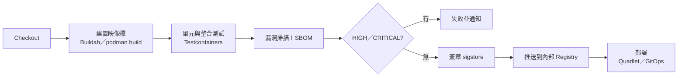
```mermaid
flowchart LR
    A[Checkout] --> B[建置映像檔<br/>Buildah／podman build]
    B --> C[單元與整合測試<br/>Testcontainers]
    C --> D[漏洞掃描＋SBOM]
    D --> E{HIGH／CRITICAL?}
    E -->|有| X[失敗並通知]
    E -->|無| F[簽章 sigstore]
    F --> G[推送到內部 Registry]
    G --> H[部署<br/>Quadlet／GitOps]
```

Podman／Buildah 在 CI 裡的優點：**不需要 Docker daemon，也不需要掛載 `/var/run/docker.sock`**，建置工作可以在一般權限（rootless）下完成，避免「CI 工作可以控制整台 runner」的風險。

### 12.2 GitHub Actions

```yaml
# .github/workflows/image.yml
name: build-image

on:
  push:
    branches: [main]
    tags: ["v*"]
  pull_request:
    branches: [main]

env:
  REGISTRY: registry.corp.example/shop
  IMAGE: api

jobs:
  build:
    runs-on: ubuntu-24.04
    permissions:
      contents: read
    steps:
      - uses: actions/checkout@v7

      - name: Build image
        id: build
        uses: redhat-actions/buildah-build@v3
        with:
          image: ${{ env.IMAGE }}
          tags: ${{ github.sha }} ${{ github.ref_type == 'tag' && github.ref_name || 'dev' }}
          containerfiles: ./Containerfile
          oci: true
          labels: |
            org.opencontainers.image.revision=${{ github.sha }}
            org.opencontainers.image.source=${{ github.server_url }}/${{ github.repository }}

      - name: Scan image
        run: |
          podman save --format oci-archive -o image.tar ${{ steps.build.outputs.image-with-tag }}
          podman run --rm -v "$PWD:/work:Z" docker.io/aquasec/trivy:0.74.0 \
            image --input /work/image.tar --severity HIGH,CRITICAL --exit-code 1

      - name: Push image
        if: github.event_name != 'pull_request'
        uses: redhat-actions/push-to-registry@v3
        with:
          image: ${{ steps.build.outputs.image }}
          tags: ${{ steps.build.outputs.tags }}
          registry: ${{ env.REGISTRY }}
          username: ${{ secrets.REGISTRY_USER }}
          password: ${{ secrets.REGISTRY_TOKEN }}
          sigstore-private-key: ${{ secrets.COSIGN_PRIVATE_KEY }}
```

| Action | 目前版本（2026-09） | 用途 |
| --- | --- | --- |
| `actions/checkout` | v7 | 取出原始碼 |
| `redhat-actions/buildah-build` | v3（3.1.0） | 用 Buildah 建置，支援多架構；3.1.0 新增 `sequential` 模式 |
| `redhat-actions/podman-login` | v2 | 登入 registry |
| `redhat-actions/push-to-registry` | v3 | 推送，並可以用 sigstore 簽章 |

需要多架構映像檔時，可以在 `buildah-build` 加上 `archs: amd64, arm64`（runner 要先安裝 qemu-user-static），並改用 `skopeo inspect --raw` 逐一取出各架構映像檔來掃描。

> ⚠️ **v2.0 更正**：v1.0 使用 `actions/checkout@v3`，並在 runner 上用 `apt-get install podman`。GitHub 的 Ubuntu runner 已經預先安裝 Podman 與 Buildah，不需要另外安裝；Action 的版本也已更新。

金融業通常使用 self-hosted runner。建議在 RHEL runner 上以一般使用者執行 Podman，並定期清理 `~/.local/share/containers`。

### 12.3 GitLab CI

```yaml
# .gitlab-ci.yml
stages: [build, test, scan, publish]

variables:
  IMAGE: $CI_REGISTRY_IMAGE:$CI_COMMIT_SHORT_SHA
  # 在沒有特權的容器內執行 Buildah
  STORAGE_DRIVER: vfs
  BUILDAH_ISOLATION: chroot
  BUILDAH_FORMAT: oci

.buildah:
  image: quay.io/buildah/stable:latest
  before_script:
    - echo "$CI_REGISTRY_PASSWORD" | buildah login -u "$CI_REGISTRY_USER" --password-stdin "$CI_REGISTRY"

build:
  extends: .buildah
  stage: build
  script:
    - buildah build --layers -t "$IMAGE" .
    - buildah push "$IMAGE"
  rules:
    - if: $CI_PIPELINE_SOURCE == "merge_request_event"
    - if: $CI_COMMIT_BRANCH == $CI_DEFAULT_BRANCH

test:
  stage: test
  image: $IMAGE
  script:
    - ./run-tests.sh

scan:
  stage: scan
  image:
    name: docker.io/aquasec/trivy:0.74.0
    entrypoint: [""]
  script:
    - trivy image --severity HIGH,CRITICAL --exit-code 1 "$IMAGE"

publish:
  extends: .buildah
  stage: publish
  script:
    - buildah pull "$IMAGE"
    - buildah tag "$IMAGE" "$CI_REGISTRY_IMAGE:$CI_COMMIT_TAG"
    - buildah push "$CI_REGISTRY_IMAGE:$CI_COMMIT_TAG"
  rules:
    - if: $CI_COMMIT_TAG
```

重點：

- `STORAGE_DRIVER=vfs` 與 `BUILDAH_ISOLATION=chroot` 讓 Buildah 可以在**沒有特權**的 Kubernetes executor 容器內執行（代價是建置速度較慢、占用較多空間）。
- 如果 runner 允許 `/dev/fuse`，可以改用 `overlay` 加上 `fuse-overlayfs` 提升速度。
- 部署到主機的步驟，建議改用 Ansible 或 GitOps 更新 Quadlet 檔與映像檔 tag，而不是在 CI 裡直接 `podman run`。

### 12.4 Jenkins

```groovy
// Jenkinsfile（agent 為安裝了 Podman 的 RHEL 節點，以一般使用者執行）
pipeline {
  agent { label 'podman' }
  environment {
    IMAGE = "registry.corp.example/shop/api:${env.GIT_COMMIT.take(8)}"
  }
  stages {
    stage('Build') {
      steps {
        sh 'podman build --pull=always -t "$IMAGE" .'
      }
    }
    stage('Test') {
      steps {
        sh 'podman run --rm "$IMAGE" ./run-tests.sh'
      }
    }
    stage('Scan') {
      steps {
        sh 'trivy image --image-src podman --severity HIGH,CRITICAL --exit-code 1 "$IMAGE"'
      }
    }
    stage('Push') {
      when { branch 'main' }
      steps {
        withCredentials([usernamePassword(credentialsId: 'corp-registry',
                         usernameVariable: 'U', passwordVariable: 'P')]) {
          sh 'echo "$P" | podman login -u "$U" --password-stdin registry.corp.example'
          sh 'podman push --sign-by-sigstore-private-key /etc/pki/ci/cosign.key "$IMAGE"'
        }
      }
    }
  }
  post {
    always {
      sh 'podman image prune -f || true'
    }
  }
}
```

### 12.5 Tekton／OpenShift Pipelines

在 OpenShift 上，建議使用 OpenShift Pipelines（Tekton）內建的 `buildah` Task，或改用 Shipwright。建置在叢集內以受限的權限（SCC）執行，並可以串接 Tekton Chains，自動產生簽章與 SLSA provenance。

```yaml
# 片段：在 Pipeline 裡使用 buildah Task
- name: build-image
  taskRef:
    resolver: cluster
    params:
      - name: kind
        value: task
      - name: name
        value: buildah
      - name: namespace
        value: openshift-pipelines
  params:
    - name: IMAGE
      value: image-registry.openshift-image-registry.svc:5000/shop/api:$(params.revision)
  workspaces:
    - name: source
      workspace: shared-workspace
```

### 12.6 CI 環境的注意事項

| 問題 | 原因 | 處理方式 |
| --- | --- | --- |
| `potentially insufficient UIDs or GIDs available` | CI 使用者沒有 subuid／subgid | 在 runner 映像檔設定 `/etc/subuid`，或改用 `--userns=host` 的 Buildah 映像檔 |
| 建置越來越慢、磁碟被塞滿 | 快取與 dangling 映像檔累積 | 在 `post` 階段執行 `podman image prune`，並定期執行 `podman system prune` |
| 在容器內執行 Podman 失敗 | 缺少 `/dev/fuse` 或 user namespace | 使用 `quay.io/podman/stable` 並參考官方的「Podman in a container」指引 |
| Testcontainers 找不到 Docker | 沒有 socket | `systemctl --user start podman.socket` 並設定 `DOCKER_HOST` |

### 12.7 💡 本章實務建議

1. **CI 裡不要掛載 Docker socket**，改用 Buildah／Podman rootless 建置。
2. **建置、掃描、簽章、推送四個步驟缺一不可**，並把掃描結果與 SBOM 保存為建置產物。
3. **Action 與掃描器要固定版本**（例如 `trivy:0.74.0`），並用 Dependabot 或 Renovate 定期更新。
4. **部署與建置分離**：CI 只負責產出經過簽章的映像檔，部署交給 GitOps 或 Ansible 更新 Quadlet。

---

## 13. 監控、日誌與維運

### 13.1 日誌

#### 13.1.1 Log driver

| Driver | 說明 | 輪替方式 |
| --- | --- | --- |
| `journald` | 寫入 systemd journal（systemd 系統的預設值） | 由 `journald.conf` 的 `SystemMaxUse` 等設定控制 |
| `k8s-file` | 寫入 Kubernetes 格式的文字檔 | `--log-opt max-size=10mb`，或 `containers.conf` 的 `log_size_max` |
| `passthrough` | 直接交給 systemd 的 stdout／stderr（只用於 systemd 管理的容器） | 由 journald 控制 |
| `none` | 不記錄 | — |

> ⚠️ **v2.0 更正**：v1.0 的範例 `--log-driver journald --log-opt max-size=10m --log-opt max-file=3` 是 Docker 的 json-file 寫法：`max-size` 只對 `k8s-file` 有效，Podman 也沒有 `max-file` 選項。使用 journald 時，保留量與輪替要在 journald 設定。

```bash
# 查看日誌
podman logs -f --since 10m --tail 200 api
podman logs --timestamps api

# journald：可以用欄位過濾
journalctl CONTAINER_NAME=api --since "1 hour ago"
journalctl --user -u web.service -o json-pretty | head

# 用 tag／label 加上可供搜尋的欄位（label 為 6.0 新增，只支援 journald）
podman run -d --log-driver journald \
  --log-opt tag='{{.ImageName}}' \
  --log-opt label=APP=shop \
  registry.corp.example/shop/api:2.3.0

# k8s-file 並限制大小
podman run -d --log-driver k8s-file --log-opt max-size=20mb ...
```

#### 13.1.2 集中式日誌

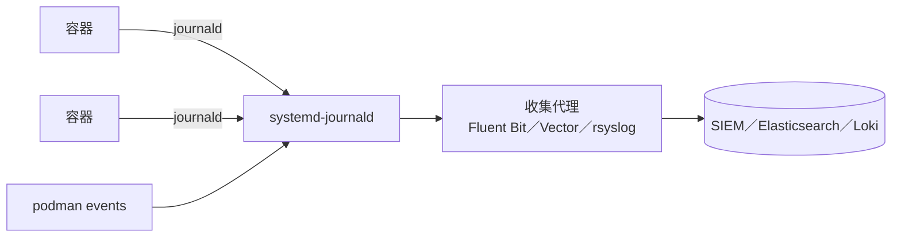
```mermaid
graph LR
    C1[容器] -->|journald| J[systemd-journald]
    C2[容器] -->|journald| J
    J --> A[收集代理<br/>Fluent Bit／Vector／rsyslog]
    A --> S[(SIEM／Elasticsearch／Loki)]
    E[podman events] --> J
```

建議讓容器使用 journald，再由主機上的代理程式統一轉送。這樣容器本身不需要安裝任何收集元件，也能保留 `CONTAINER_NAME`、`CONTAINER_ID`、`IMAGE_NAME` 等結構化欄位。

### 13.2 事件

```bash
# 即時監看
podman events
podman events --filter event=died --filter event=health_status --format json

# 查詢過去的事件
podman events --since 24h --until 1h --filter type=image
```

| 事件類型 | 常見事件 | 監控用途 |
| --- | --- | --- |
| container | `create`、`start`、`died`（6.0 起帶有 `OOMKilled` 屬性）、`health_status` | 異常重啟、記憶體不足、健康檢查失敗 |
| image | `pull`、`push`、`remove` | 供應鏈稽核 |
| volume／network／pod | `create`、`remove` | 變更追蹤 |
| secret | `create`、`remove`（5.5 起） | 機密存取稽核 |
| artifact | `create`、`pull`、`push`、`remove`（6.0 起） | 設定與模型發佈追蹤 |

`containers.conf` 的 `events_logger` 預設為 `journald`。如果主機上有大量 healthcheck，可以設定 `healthcheck_events = false`，避免 `health_status` 事件洗版。

### 13.3 資源監控

```bash
podman stats                               # 即時
podman stats --no-stream --format json     # 給腳本使用
podman pod stats shop
podman top api pid user %cpu %mem
podman system df
```

#### 13.3.1 Prometheus 整合

[prometheus-podman-exporter](https://github.com/containers/prometheus-podman-exporter)（2.0.0）透過 Podman API 匯出容器、Pod、映像檔、volume、網路的指標，預設監聽 `:9882`。

```bash
# 方法一：以套件安裝（Fedora／RHEL 系列）
sudo dnf -y install prometheus-podman-exporter

# 方法二：以容器執行（rootless）
systemctl --user enable --now podman.socket
podman run -d --name podman-exporter \
  -e CONTAINER_HOST=unix:///run/podman/podman.sock \
  -v $XDG_RUNTIME_DIR/podman/podman.sock:/run/podman/podman.sock \
  -p 9882:9882 \
  --userns=keep-id:uid=65534 \
  --security-opt label=type:container_runtime_t \
  quay.io/navidys/prometheus-podman-exporter \
  --collector.enable-all
```

```yaml
# prometheus.yml
scrape_configs:
  - job_name: podman
    static_configs:
      - targets: ["app-host-01:9882", "app-host-02:9882"]
```

**建議的告警規則**

| 告警 | 條件 | 嚴重度 |
| --- | --- | --- |
| 容器頻繁重啟 | 15 分鐘內 `died` 事件超過 3 次 | 高 |
| 健康檢查失敗 | `health_status` 為 unhealthy 超過 5 分鐘 | 高 |
| OOM | `died` 事件的 `OOMKilled=true` | 高 |
| 儲存空間 | graphroot 使用率超過 80% | 中 |
| 映像檔過舊 | 執行中的映像檔建立時間超過 90 天 | 低 |

### 13.4 系統維護

```bash
# 清理
podman container prune                  # 停止的容器
podman image prune -a                   # 沒有被使用的映像檔
podman volume prune                     # 6.0 起只清匿名 volume
podman network prune
podman system prune                     # 以上全部（不含 volume）
podman system prune --all --volumes     # ⚠️ 包含所有未使用的映像檔與 volume

# 儲存一致性檢查與修復（例如不正常關機之後）
podman system check
podman system check --repair

# 完全重置（刪除所有容器、映像檔、volume、網路與設定）
podman system reset
```

排程清理可以用 systemd timer：

```ini
# ~/.config/systemd/user/podman-prune.service
[Unit]
Description=Weekly podman cleanup

[Service]
Type=oneshot
ExecStart=/usr/bin/podman image prune -a -f --filter until=720h
ExecStart=/usr/bin/podman container prune -f --filter until=168h
```

```ini
# ~/.config/systemd/user/podman-prune.timer
[Timer]
OnCalendar=Sun 03:00
Persistent=true

[Install]
WantedBy=timers.target
```

```bash
systemctl --user daemon-reload
systemctl --user enable --now podman-prune.timer
```

### 13.5 開機自動啟動

| 做法 | 說明 |
| --- | --- |
| **Quadlet**（建議） | `[Install] WantedBy=` 設定，見[第 8 章](#8-quadlet-與-systemd-生產部署) |
| `podman-restart.service` | 開機時重新啟動所有 `--restart=always` 的容器：`systemctl enable podman-restart.service`（rootless 加 `--user`） |

### 13.6 Checkpoint／Restore（CRIU）

Podman 可以透過 CRIU 把**執行中**的容器狀態（記憶體、程序）存成檔案，之後在同一台或另一台主機還原。適合用在長時間暖機的應用、主機維護時的遷移，或保存故障現場供分析。

```bash
# 需要 rootful 與 criu 套件
sudo dnf -y install criu

# 建立 checkpoint 並匯出
sudo podman container checkpoint --export /backup/api.tar.gz api

# 保持容器繼續執行（6.0 起會暫停容器直到 checkpoint 完成，確保一致性）
sudo podman container checkpoint --leave-running --export /backup/api-live.tar.gz api

# 在另一台主機還原
sudo podman container restore --import /backup/api.tar.gz

# 也可以存成 OCI 映像檔，推送到 registry
sudo podman container checkpoint --create-image registry.corp.example/ckpt/api:20260929 api
```

限制：需要 root；有外部 TCP 連線時要加 `--tcp-established`；還原的主機需要相同的 CPU 功能與相容的核心版本。

### 13.7 容量規劃

| 項目 | 建議 |
| --- | --- |
| graphroot 容量 | 映像檔總大小 × 3（新舊版本並存加上建置快取），最少 50 GiB |
| 記憶體 | 所有容器的 `--memory` 上限總和，再加 20% 給主機與 page cache |
| PID | `pids_limit` 預設 1024；Java 應用程式執行緒多時要調高 |
| inotify | 大量容器時調高 `fs.inotify.max_user_instances`、`max_user_watches` |
| subuid 範圍 | 每個 rootless 使用者至少 65536；使用 `--userns=auto` 時要更大 |

### 13.8 💡 本章實務建議

1. **日誌一律使用 journald**，由主機的代理程式轉送到 SIEM，並在 journald 設定保留量。
2. **把 `podman events` 納入監控**：`died`、`health_status`、OOM 是最重要的三個訊號。
3. **每台主機部署 prometheus-podman-exporter**，並套用統一的告警規則。
4. **清理工作用 systemd timer 排程**，並在升級到 Podman 6 前確認 `volume prune` 的行為差異。
5. **不正常關機之後先執行 `podman system check`**，再啟動服務。

---

## 14. 疑難排解

### 14.1 診斷流程

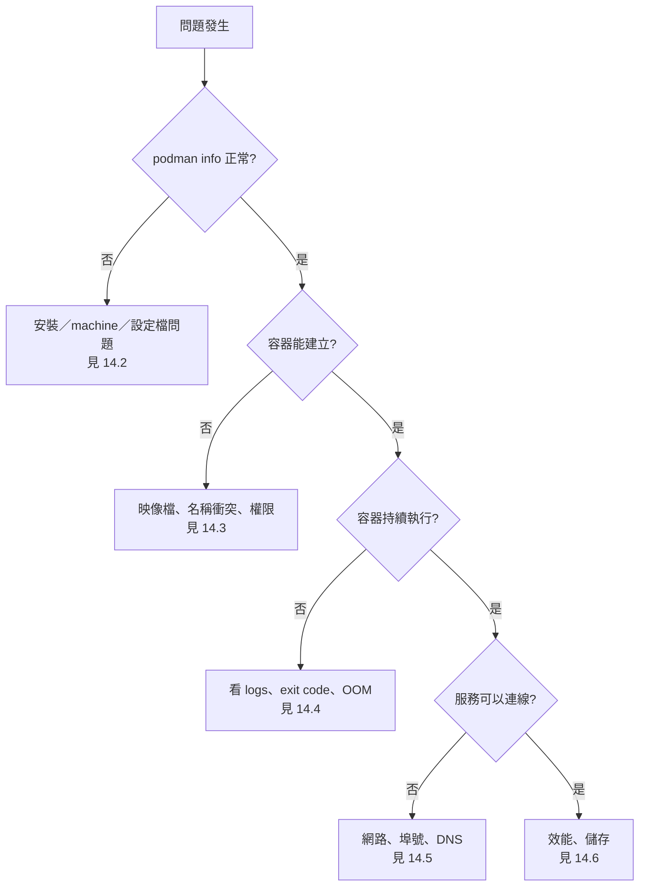
```mermaid
flowchart TD
    A[問題發生] --> B{podman info 正常?}
    B -->|否| C[安裝／machine／設定檔問題<br/>見 14.2]
    B -->|是| D{容器能建立?}
    D -->|否| E[映像檔、名稱衝突、權限<br/>見 14.3]
    D -->|是| F{容器持續執行?}
    F -->|否| G[看 logs、exit code、OOM<br/>見 14.4]
    F -->|是| H{服務可以連線?}
    H -->|否| I[網路、埠號、DNS<br/>見 14.5]
    H -->|是| J[效能、儲存<br/>見 14.6]
```

**必備的診斷指令**

```bash
podman version && podman info                    # 版本與執行環境
podman --log-level=debug run ...                 # 顯示詳細的執行過程
podman ps -a --format "{{.Names}} {{.Status}} {{.ExitCode}}"
podman inspect <容器> --format '{{.State.Error}} {{.State.OOMKilled}}'
podman logs --tail 100 <容器>
podman events --since 30m --filter container=<容器>
journalctl --user -xe                            # rootless 的 systemd 紀錄
```

### 14.2 安裝與環境

| 症狀 | 原因 | 處置 |
| --- | --- | --- |
| `podman: command not found` | 未安裝，或 PATH 沒有更新 | 依[第 2 章](#2-安裝與環境設定)安裝；Windows 請重新開啟終端機 |
| `Cannot connect to Podman... connection refused`（macOS／Windows） | VM 沒有啟動 | `podman machine start`；用 `podman system connection list` 確認預設連線 |
| Windows 上 `podman machine init` 失敗 | WSL 沒有安裝或版本太舊；或選了 Hyper-V 但沒有管理員權限 | `wsl --update`；Hyper-V 請管理員先執行 `podman system hyperv-prep` |
| Podman 6 啟動時出現 cgroups 錯誤 | 主機仍是 cgroups v1 | 改用 cgroups v2（RHEL 8 請升級到 9 以上），或維持 5.8.x |
| 升級到 6.0 後，容器與網路消失 | BoltDB 自動遷移失敗，或 CNI 網路不再被讀取 | 查看 `journalctl` 的遷移訊息；依[第 15 章](#15-從-docker-遷移與升級到-podman-6)重建 |
| `WARN: "/" is not a shared mount` | rootless 環境下根目錄不是 shared mount | 通常可以忽略；需要 mount propagation 時執行 `sudo mount --make-rshared /` |
| macOS／Windows 上 VM 與主機的版本不一致 | 只更新了主機端的 CLI | `podman machine os update`，或重建 VM |

### 14.3 權限與 Rootless

**症狀：`cannot set up namespace ... permission denied` 或 `potentially insufficient UIDs or GIDs available`**

```bash
# 原因：使用者沒有 subuid／subgid，或範圍太小
grep "^$(whoami):" /etc/subuid /etc/subgid

# 處置：由管理員新增範圍，再讓 Podman 重新套用
sudo usermod --add-subuids 524288-589823 --add-subgids 524288-589823 "$(whoami)"
podman system migrate
```

**症狀：掛載的目錄出現 `Permission denied`**

| 可能原因 | 判斷方式 | 處置 |
| --- | --- | --- |
| SELinux | `sudo ausearch -m AVC -ts recent` 有紀錄 | 掛載加上 `:Z`（私有）或 `:z`（共享） |
| UID 對應 | 容器內的使用者不是 root，檔案屬於主機上的你 | 加上 `:U`、`--userns=keep-id`，或 `podman unshare chown` |
| 家目錄權限 | 其他使用者的目錄是 700 | 把資料移到專用目錄 |

**症狀：`rootlessport cannot expose privileged port 80`**

原因是 rootless 不能綁定 1024 以下的埠。處置方式：改用高埠號，或調整 `net.ipv4.ip_unprivileged_port_start`（見[第 6 章](#6-網路)）。

### 14.4 容器啟動與執行

| 結束碼 | 意義 | 常見原因 |
| --- | --- | --- |
| 125 | Podman 本身出錯 | 參數錯誤、名稱衝突、映像檔不存在 |
| 126 | 指令無法執行 | 沒有執行權限、架構不符（`exec format error`） |
| 127 | 找不到指令 | entrypoint 或 command 路徑錯誤 |
| 137 | 被 SIGKILL 終止 | OOM、`podman stop` 逾時、healthcheck 設定 `kill` |
| 143 | 被 SIGTERM 終止 | 正常停止 |

```bash
# 名稱已被使用
podman run --name api ...      # Error: ... name "api" is already in use
podman run --replace --name api ...

# 確認是否為 OOM
podman inspect api --format '{{.State.OOMKilled}}'
podman events --filter event=died --filter container=api --since 1h

# 架構不符：在 ARM Mac 上執行只有 amd64 的映像檔
podman image inspect <映像檔> --format '{{.Architecture}}'
podman run --platform linux/amd64 ...   # 透過模擬執行（較慢）

# 短名稱無法解析
podman pull nginx      # Error: short-name "nginx" did not resolve to an alias ...
podman pull docker.io/library/nginx:stable
```

### 14.5 網路

| 症狀 | 原因 | 處置 |
| --- | --- | --- |
| 容器之間無法用名稱連線 | 使用預設網路 `podman`（沒有 DNS） | 建立自訂網路，把容器接上同一個網路 |
| 升級到 6.0 後，跨網路的容器不通 | 6.0 預設啟用 network isolation | 把需要互通的容器接上共同的網路 |
| 容器連不到主機上的服務 | pasta 模式下容器與主機使用相同 IP | 改用 `host.containers.internal` |
| 容器無法連外 | proxy 沒有傳入、DNS 錯誤、內網防火牆 | 確認 `HTTP_PROXY`、`podman exec <容器> cat /etc/resolv.conf` |
| 重啟 nftables／firewalld 後埠號轉送失效 | 防火牆規則被清除 | `podman network reload --all` |
| 應用程式記錄的來源 IP 都是內部位址 | rootless 的埠號轉送使用 rootlessport | 在反向代理加上 `X-Forwarded-For`，或評估 `rootless_port_forwarder="pasta"` |
| Windows 主機連不到 WSL 裡的服務（6.1） | 沒有設定 `force_port_listen` | 重建 VM，或在 VM 的 `containers.conf` 加上設定 |

### 14.6 效能與儲存

```bash
# 找出耗用資源的容器
podman stats --no-stream --format "table {{.Name}} {{.CPUPerc}} {{.MemUsage}} {{.PIDs}}"

# 找出占空間的映像檔與 volume
podman system df -v

# 儲存層損壞（例如磁碟滿或斷電後）
podman system check
podman system check --repair
```

| 症狀 | 原因 | 處置 |
| --- | --- | --- |
| 建置很慢 | 沒有利用層快取；vfs driver | 調整 Containerfile 順序；改用 overlay |
| rootless 的 I/O 很慢 | 仍在使用 fuse-overlayfs | 確認核心版本，並檢查 `podman info` 的 `graphDriverName` 與 overlay 設定 |
| 磁碟被塞滿 | dangling 映像檔、建置快取、日誌 | 排程執行 `podman system prune`；k8s-file 設定 `max-size` |
| Java 容器被 OOM | heap 設定超過容器記憶體上限 | 用 `-XX:MaxRAMPercentage=75` 取代寫死的 `-Xmx` |

### 14.7 Quadlet 與 systemd

見 [8.10 除錯](#810-除錯)。最常見的三個問題：

1. 檔案語法錯誤，導致 `Unit not found`：用 `podman-system-generator --dryrun` 查看錯誤。
2. rootless 服務在使用者登出後停止：執行 `loginctl enable-linger`。
3. 開機時拉取映像檔逾時：加大 `TimeoutStartSec`，或用 `.image` 單元預先拉取。

### 14.8 💡 本章實務建議

1. **先跑 `podman info`，再看其他東西**：多數問題是環境或設定檔造成的。
2. **建立團隊的疑難排解知識庫**，以「症狀 → 原因 → 處置」格式記錄，並附上 `podman version` 與作業系統版本。
3. **不要用 `--privileged` 或 `label=disable` 來「解決」權限問題**，要找出真正的原因。
4. **正式環境的問題先保存現場**（`podman inspect`、logs、events，必要時做 checkpoint），再重新啟動。

---

## 15. 從 Docker 遷移與升級到 Podman 6

> 🆕 **v2.0 新增**

### 15.1 從 Docker 遷移

#### 15.1.1 遷移評估清單

| 項目 | 檢查內容 | 風險 |
| --- | --- | --- |
| CLI 腳本 | 是否使用 Docker 專屬子指令（`docker swarm`、`docker plugin`、`docker buildx` 進階功能） | 中 |
| 短名稱 | 腳本與 Compose 檔是否依賴 `nginx` 這類短名稱 | 低（改成完整名稱即可） |
| Socket | 工具是否直接存取 `/var/run/docker.sock` | 低（改用 `podman.socket`） |
| 權限 | 是否依賴 root 權限（綁定低埠號、直接寫入 root 擁有的目錄） | 中 |
| Compose | 是否使用 `profiles`、`extends`、`develop.watch` 等進階功能 | 中（改用 docker-compose 作為 provider） |
| restart policy | 是否依賴 dockerd 在開機時拉起容器 | 高（改用 Quadlet） |
| 網路 | 是否依賴預設 bridge 的行為、`--link` | 中 |
| 日誌 | 是否依賴 json-file 的路徑與格式 | 中 |
| 建置 | 是否依賴 BuildKit 專屬語法（`# syntax=`、heredoc） | 中（Buildah 支援大多數語法，要實測） |

#### 15.1.2 遷移步驟

```bash
# 1. 安裝 Podman 與相容套件
sudo dnf -y install podman podman-docker podman-compose

# 2. 把 Docker 的映像檔搬過來（不需要重新拉取）
docker save myimage:1.0 | podman load
# 或直接從 Docker daemon 讀取
podman pull docker-daemon:myimage:1.0

# 3. 讓工具改用 Podman socket
systemctl --user enable --now podman.socket
export DOCKER_HOST=unix://$XDG_RUNTIME_DIR/podman/podman.sock

# 4. 驗證 Compose 專案
cd project && podman compose up -d && podman compose ps

# 5. 把正式服務轉成 Quadlet（見第 8 章）

# 6. 確認沒有問題後，停用 Docker
sudo systemctl disable --now docker.service docker.socket
```

#### 15.1.3 Docker Desktop 替換

1. 安裝 Podman Desktop 並建立 `podman machine`。
2. 在 Podman Desktop 的設定中啟用「Docker compatibility」，讓 `/var/run/docker.sock`（macOS）或 `npipe:////./pipe/docker_engine`（Windows）指向 Podman。
3. 驗證 IDE（VS Code Dev Containers、IntelliJ）、Testcontainers、Kind 等工具。
4. 移除 Docker Desktop，並由 IT 部門統一派送 Podman Desktop 的設定。

### 15.2 升級到 Podman 6

#### 15.2.1 升級前稽核

```bash
#!/usr/bin/env bash
# podman6-precheck.sh：在每台主機執行，確認是否可以升級到 Podman 6
echo "== Podman 版本";       podman version --format '{{.Client.Version}}'
echo "== cgroups 版本";      podman info --format '{{.Host.CgroupsVersion}}'          # 需要 v2
echo "== 網路後端";          podman info --format '{{.Host.NetworkBackend}}'          # 需要 netavark
echo "== 資料庫後端";        podman info --format '{{.Host.DatabaseBackend}}'         # 建議 sqlite
echo "== rootless 網路";     podman info --format '{{.Host.RootlessNetworkCmd}}'      # 需要 pasta
echo "== 防火牆";            sudo nft list tables 2>/dev/null | head -5                 # 需要 nftables
echo "== 設定檔中的舊設定"
grep -RIn -E 'slirp4netns|network_backend *= *"cni"|rootless_storage_path|\[registries\.' \
  /etc/containers ~/.config/containers 2>/dev/null
echo "== 腳本中的舊用法"
grep -RIn -E 'network[= ]slirp4netns|volume prune|generate systemd' /opt/scripts 2>/dev/null
```

| 檢查項目 | 通過條件 | 未通過時的處置 |
| --- | --- | --- |
| cgroups | `v2` | 升級作業系統（RHEL 8 → 9／10） |
| NetworkBackend | `netavark` | 依 [6.8](#68-從-cni-遷移到-netavark) 遷移 |
| DatabaseBackend | `sqlite` | 5.8 會在重開機時自動遷移；6.0 啟動時也會嘗試，**先備份** |
| RootlessNetworkCmd | `pasta` | 移除所有 `slirp4netns` 設定 |
| 防火牆 | nftables | 停用 iptables-legacy |
| 設定檔 | 沒有 V1 registries.conf、`containers.rootless.conf` 主檔 | 改寫成 V2 與 drop-in |
| 腳本 | `volume prune` 與 filter 語意已確認 | 依需要加上 `--all` |
| 桌面 | Windows 11、Apple Silicon | 其他設備維持 5.8.x |

#### 15.2.2 升級步驟

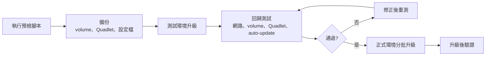
```mermaid
flowchart LR
    A[執行預檢腳本] --> B[備份<br/>volume、Quadlet、設定檔]
    B --> C[測試環境升級]
    C --> D[回歸測試<br/>網路、volume、Quadlet、auto-update]
    D --> E{通過?}
    E -->|否| F[修正後重測]
    F --> D
    E -->|是| G[正式環境分批升級]
    G --> H[升級後驗證]
```

```bash
# 1. 備份
podman volume ls -q | xargs -I{} podman volume export {} --output /backup/{}.tar
tar czf /backup/quadlet.tgz /etc/containers/systemd ~/.config/containers

# 2. 停止服務並升級（以 Fedora 為例；RHEL 依 AppStream 的發布時程）
sudo systemctl stop 'shop-*'
sudo dnf -y upgrade podman buildah skopeo netavark aardvark-dns

# 3. 驗證
podman version
podman info --format '{{.Host.DatabaseBackend}} {{.Host.NetworkBackend}}'
sudo systemctl daemon-reload && sudo systemctl start shop-pod.service
podman quadlet list
```

#### 15.2.3 5.8 維護線策略

| 情境 | 建議 |
| --- | --- |
| 新建主機（RHEL 10、Fedora） | 使用發行版提供的最新版本 |
| 暫時無法移除 CNI、cgroups v1 的主機 | 維持 5.8.x，列入技術債並排定遷移時程 |
| Intel Mac、Windows 10 開發機 | 維持 5.8.x，並排入設備汰換計畫 |
| 跨版本混用 | CI 與正式環境以正式環境的主版本為準，避免行為差異 |

> 📌 上游會持續發布 5.8 的修補版（目前為 5.8.7，2026-09-16），但停止維護的時間還沒有公布，請持續追蹤官方公告（見[附錄 E.1](#e1-待確認事項)）。

### 15.3 💡 本章實務建議

1. **遷移以「先開發、再 CI、最後正式環境」的順序進行**，每個階段都保留回退方案。
2. **正式服務遷移時順便改成 Quadlet**，一次解決開機自動啟動、auto-update、日誌整合三個問題。
3. **在每台主機執行 Podman 6 預檢腳本**，把結果彙整成資產清單。
4. **升級前一定要備份 volume 與設定檔**，特別是仍在使用 BoltDB 的舊主機。

---

## 16. 實務練習與認證準備

### 16.1 📝 專案實務練習

**目標**：把一個「前端＋API＋PostgreSQL＋Redis」的應用程式，從本機開發一路帶到單機正式部署。

| 步驟 | 任務 | 對應章節 |
| --- | --- | --- |
| 1 | 為 API 與前端撰寫多階段 Containerfile（非 root、有 OCI 標籤） | [第 4 章](#4-映像檔建置containerfile-與-buildah) |
| 2 | 撰寫 `compose.yaml`，用 `podman compose up` 啟動整個堆疊 | [第 9 章](#9-compose-與-docker-相容) |
| 3 | 把前端與 API 改成 Pod，並用 `podman kube generate` 產生 YAML | [第 7 章](#7-pod-與-kubernetes-整合) |
| 4 | 建立 GitHub Actions 或 GitLab CI 流水線：建置、掃描、簽章、推送 | [第 12 章](#12-cicd-整合) |
| 5 | 在測試主機用 Quadlet 部署，資料庫密碼使用 `podman secret` | [第 8 章](#8-quadlet-與-systemd-生產部署) |
| 6 | 啟用 `podman-auto-update.timer`，推送修補版，驗證自動更新與回滾 | [8.8](#88-自動更新auto-update) |
| 7 | 部署 prometheus-podman-exporter，並設定 OOM 與健康檢查告警 | [第 13 章](#13-監控日誌與維運) |

**驗證標準**

- [ ] 所有容器都以非 root 身分執行，並設定 `--cap-drop=ALL` 或等效的 Quadlet 設定
- [ ] 映像檔沒有 HIGH／CRITICAL 弱點，並附有 SBOM 與簽章
- [ ] 主機重開機後，服務依正確順序自動啟動
- [ ] 故意推送一個健康檢查會失敗的版本，auto-update 能自動回滾

### 16.2 📝 進階實務練習

1. **離線部署**：用 `skopeo sync` 把所需的映像檔帶進一台不能連外的 VM，並設定 `registries.conf` 只允許內部 registry。
2. **簽章強制**：設定 `policy.json` 為預設拒絕，驗證未簽章的映像檔無法拉取。
3. **Podman 6 升級演練**：在 5.8 主機上建立 CNI 網路與 BoltDB 狀態，執行預檢腳本、遷移並升級，記錄所有問題。
4. **Checkpoint 遷移**：把一個執行中的容器 checkpoint 後，在另一台主機還原，並量測停機時間。
5. **安全加固**：用 udica 為一個需要讀取主機日誌的容器產生 SELinux 政策，取代 `label=disable`。

### 16.3 認證概述

> ⚠️ **v2.0 更正**：v1.0 以 **EX180**（Red Hat Certified Specialist in Containers and Kubernetes）為主軸，但這個考試已於 2023 年退役，由 **EX188** 取代。v1.0 列出的各題型比例（30%、25%……）沒有官方出處，已經刪除。

| 認證 | 考試 | 與 Podman 的關聯 |
| --- | --- | --- |
| **Red Hat Certified Developer in Cloud-native Applications** | **EX188**（實機操作，2.5 小時） | 以 RHEL 10、Podman v5、OpenShift 4.22 為基準；**主要的 Podman 認證** |
| Red Hat Certified System Administrator（RHCSA） | EX200 | 考試目標包含以 Podman 管理容器，並用 systemd 讓 rootless 容器開機自動啟動 |
| Certified Kubernetes Application Developer（CKAD） | CNCF／Linux Foundation | Pod、YAML 概念可以延伸到 Kubernetes |

官方建議的課程為 **DO188**（Red Hat OpenShift Developer I: Introduction to Containers with Podman），並要求考生具備在 Linux 上使用 Podman v5 的經驗。

### 16.4 EX188 考試目標

以下依 Red Hat 官方考試頁面整理（查證日 2026-09-29），並標示本手冊對應的章節：

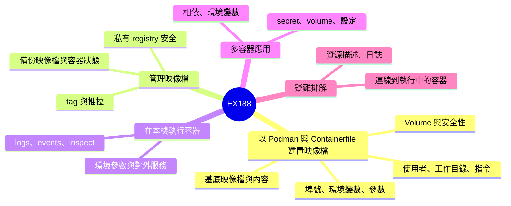
```mermaid
mindmap
  root((EX188))
    以 Podman 與 Containerfile 建置映像檔
      基底映像檔與內容
      使用者、工作目錄、指令
      埠號、環境變數、參數
      Volume 與安全性
    管理映像檔
      私有 registry 安全
      tag 與推拉
      備份映像檔與容器狀態
    在本機執行容器
      logs、events、inspect
      環境參數與對外服務
    多容器應用
      相依、環境變數
      secret、volume、設定
    疑難排解
      資源描述、日誌
      連線到執行中的容器
```

| # | 考試目標（官方原文的中文整理） | 本手冊章節 |
| --- | --- | --- |
| 1 | **以 Podman 與 Containerfile 建置映像檔**：指定基底映像檔、加入內容、設定執行身分／工作目錄／指令、暴露埠號、傳入環境變數與建置參數、指定啟動指令、使用 volume 與主機共享資料、理解主機與網路存取的安全性與權限要求、管理容器與映像檔的生命週期 | [第 3 章](#3-核心概念與基本操作)、[第 4 章](#4-映像檔建置containerfile-與-buildah)、[第 5 章](#5-儲存與-volume)、[第 10 章](#10-安全性強化) |
| 2 | **管理映像檔**：理解私有 registry 的安全性、與多個 registry 互動、使用 tag、推送與拉取、備份映像檔（含層與 metadata）與備份容器狀態的差異 | [第 11 章](#11-企業-registry-與供應鏈)、[5.7](#57-備份與還原) |
| 3 | **在本機以 Podman 執行容器**：執行容器、取得容器日誌、監聽主機上的容器事件、使用 `podman inspect`、指定環境參數、對外公開應用程式、取得應用程式日誌、檢視執行中的應用程式 | [第 3 章](#3-核心概念與基本操作)、[第 13 章](#13-監控日誌與維運) |
| 4 | **以 Podman 執行多容器應用**：建立應用堆疊、理解容器間的相依性、使用環境變數、secret、volume 與設定 | [第 7 章](#7-pod-與-kubernetes-整合)、[第 9 章](#9-compose-與-docker-相容) |
| 5 | **疑難排解容器化應用**：理解應用資源的描述、取得應用程式日誌、檢視執行中的應用程式、連線到執行中的容器 | [第 14 章](#14-疑難排解) |

### 16.5 模擬題

> 以下為依考試目標自行設計的練習題，**不是**官方考題。

**題 1（建置映像檔）**：以 `registry.access.redhat.com/ubi10/ubi-minimal` 為基底，建置 `localhost/hello:1.0`：安裝 `httpd`、以 UID 1001 執行、監聽 8080、預設首頁內容為 `EX188`。

```dockerfile
FROM registry.access.redhat.com/ubi10/ubi-minimal
RUN microdnf install -y httpd && microdnf clean all \
 && sed -i 's/^Listen 80$/Listen 8080/' /etc/httpd/conf/httpd.conf \
 && echo 'EX188' > /var/www/html/index.html \
 && chown -R 1001:0 /run/httpd /var/log/httpd \
 && chmod -R g=u /run/httpd /var/log/httpd
USER 1001
EXPOSE 8080
CMD ["httpd", "-D", "FOREGROUND"]
```

```bash
podman build -t localhost/hello:1.0 .
podman run -d --name hello -p 8080:8080 localhost/hello:1.0
curl -s localhost:8080
```

**題 2（映像檔管理）**：把 `localhost/hello:1.0` 加上 tag `registry.lab.example:5000/team/hello:1.0` 並推送；再把映像檔（含所有層）備份到 `/tmp/hello.tar`。

```bash
podman tag localhost/hello:1.0 registry.lab.example:5000/team/hello:1.0
podman login registry.lab.example:5000
podman push registry.lab.example:5000/team/hello:1.0
podman save -o /tmp/hello.tar localhost/hello:1.0
```

**題 3（多容器應用）**：建立網路 `app-net`；以 secret `dbpw` 提供密碼，啟動 MariaDB（資料保存在 volume `dbdata`）；再啟動一個 WordPress 容器連到資料庫，並對外公開 8081。

```bash
podman network create app-net
printf 'S3cret!' | podman secret create dbpw -
podman volume create dbdata

podman run -d --name db --network app-net \
  --secret dbpw,type=env,target=MARIADB_ROOT_PASSWORD \
  -e MARIADB_DATABASE=wp \
  -v dbdata:/var/lib/mysql:Z \
  docker.io/library/mariadb:11

podman run -d --name wp --network app-net -p 8081:80 \
  -e WORDPRESS_DB_HOST=db -e WORDPRESS_DB_USER=root -e WORDPRESS_DB_NAME=wp \
  --secret dbpw,type=env,target=WORDPRESS_DB_PASSWORD \
  docker.io/library/wordpress:6
```

**題 4（事件與檢視）**：在背景監看 `wp` 容器的事件並寫入檔案；取出 `db` 容器的 IP 位址與重啟次數。

```bash
podman events --filter container=wp --format json > /tmp/wp-events.json &
podman inspect db --format '{{(index .NetworkSettings.Networks "app-net").IPAddress}} {{.RestartCount}}'
```

**題 5（疑難排解）**：容器 `broken` 一啟動就結束。找出原因並修正。

```bash
podman ps -a --filter name=broken --format '{{.Status}} {{.ExitCode}}'
podman logs broken
podman inspect broken --format '{{.Config.Cmd}} {{.Config.Entrypoint}} {{.State.Error}}'
# 依原因修正（例如：指令路徑錯誤 → 以正確的 command 重建；權限不足 → 加上 :Z 或調整 UID）
podman run -d --replace --name broken ...
```

### 16.6 考試策略

| 階段 | 建議 |
| --- | --- |
| 考前 | 在 RHEL 10（或 Fedora）上實際操作過每一個考試目標；熟悉 `man` 與 `--help` 的查詢方式 |
| 開始時 | 先完整讀過所有題目，標出彼此相依的題目（例如後面的題目要用前面建好的映像檔） |
| 作答中 | 每題完成後立即驗證（`curl`、`podman ps`、`podman logs`）；需要「重開機後仍有效」的題目，要實際檢查 systemd 設定 |
| 常見失分 | 映像檔名稱或 tag 打錯、忘了 `:Z`、埠號對應寫反、rootless 綁定低埠號、secret 名稱不一致 |
| 結束前 | 保留 10～15 分鐘，重新檢查所有容器與服務的狀態 |

**快速查詢技巧**

```bash
man podman-run | grep -A3 -- '--secret'
podman run --help | grep -i health
man containers-registries.conf
man podman-container.unit    # Quadlet 的 [Container] 設定（6.0 起依類型分成多個 man page）
```

### 16.7 考前檢查清單

**知識點**

- [ ] 能說明 image、container、pod 的差異與生命週期
- [ ] 能說明 rootless、user namespace、SELinux 標籤的作用
- [ ] 能說明 tag 與 digest、save 與 export 的差異
- [ ] 能說明自訂網路與預設網路在 DNS 上的差異

**實作能力**

- [ ] 能在 10 分鐘內寫出可以正常執行的非 root Containerfile
- [ ] 能用 secret、volume、網路組出多容器應用
- [ ] 能用 `podman logs`、`events`、`inspect`、`exec` 找出問題
- [ ] 能登入私有 registry 並推送、拉取映像檔

### 16.8 💡 本章實務建議

1. **認證以 EX188 為目標**；系統管理職務再加考 RHCSA，平台團隊再往 CKA／CKAD 延伸。
2. **練習環境與考試一致**：使用 RHEL 10 或對應版本的 Podman 5 練習。本手冊以 Podman 6 為基準，兩者的差異請參考[第 15 章](#15-從-docker-遷移與升級到-podman-6)。
3. **團隊內部每季舉辦一次實作演練**，以本章的專案練習作為新人訓練的結業驗收。

---

## 附錄 A：指令速查

### A.1 映像檔

| 指令 | 功能 | 範例 |
| --- | --- | --- |
| `podman pull` | 拉取 | `podman pull docker.io/library/nginx:stable` |
| `podman images` | 列出 | `podman images --filter dangling=true` |
| `podman build` | 建置 | `podman build -t app:1.0 -f Containerfile .` |
| `podman tag` | 加上 tag | `podman tag app:1.0 registry.corp.example/app:1.0` |
| `podman push` | 推送 | `podman push registry.corp.example/app:1.0` |
| `podman rmi` | 刪除 | `podman rmi app:1.0` |
| `podman image inspect` | 檢視 | `podman image inspect --format '{{.Digest}}' app:1.0` |
| `podman image history`／`tree` | 檢視層 | `podman image tree app:1.0` |
| `podman save`／`load` | 備份／還原 | `podman save -o app.tar app:1.0` |
| `podman image scp` | 經由 SSH 傳送 | `podman image scp app:1.0 user@host::` |
| `podman manifest` | 多架構 | `podman manifest push --all app:1.0` |
| `podman image prune` | 清理 | `podman image prune -a` |

### A.2 容器

| 指令 | 功能 | 範例 |
| --- | --- | --- |
| `podman run` | 建立並啟動 | `podman run -d --name web -p 8080:80 IMAGE` |
| `podman create`／`start` | 分開建立與啟動 | `podman create --name job IMAGE && podman start job` |
| `podman ps` | 列出 | `podman ps -a --pod` |
| `podman stop`／`restart`／`kill` | 停止／重啟／送訊號 | `podman stop -t 30 web` |
| `podman rm` | 刪除 | `podman rm -f web` |
| `podman logs` | 日誌 | `podman logs -f --since 10m web` |
| `podman exec` | 執行指令 | `podman exec -it web sh` |
| `podman inspect` | 檢視 | `podman inspect web --format '{{.State.Health.Status}}'` |
| `podman update` | 修改資源、restart、healthcheck、環境變數 | `podman update --memory 1g web` |
| `podman cp` | 複製檔案 | `podman cp web:/etc/nginx/nginx.conf .` |
| `podman diff` | 檔案系統變更 | `podman diff web` |
| `podman stats`／`top` | 資源／程序 | `podman stats --no-stream` |
| `podman healthcheck run` | 手動執行健康檢查 | `podman healthcheck run web` |
| `podman container checkpoint`／`restore` | 保存與還原狀態 | `podman container checkpoint -e ckpt.tar.gz web` |

### A.3 Pod 與 Kubernetes

| 指令 | 功能 | 範例 |
| --- | --- | --- |
| `podman pod create` | 建立 Pod | `podman pod create --name shop -p 8080:8080` |
| `podman pod ps`／`inspect` | 列出／檢視 | `podman pod inspect shop` |
| `podman pod start`／`stop`／`rm` | 生命週期 | `podman pod rm -f shop` |
| `podman kube generate` | 產生 YAML | `podman kube generate shop --type deployment -f shop.yaml` |
| `podman kube play` | 執行 YAML | `podman kube play --replace shop.yaml` |
| `podman kube down` | 停止並刪除 | `podman kube down shop.yaml` |
| `podman kube apply` | 部署到叢集 | `podman kube apply -f shop.yaml --kubeconfig ~/.kube/config` |

### A.4 網路與 Volume

| 指令 | 功能 | 範例 |
| --- | --- | --- |
| `podman network create` | 建立網路 | `podman network create --internal db-net` |
| `podman network ls`／`inspect` | 列出／檢視 | `podman network inspect db-net` |
| `podman network connect`／`disconnect` | 連接／中斷 | `podman network connect db-net api` |
| `podman network reload` | 重新套用防火牆規則 | `podman network reload --all` |
| `podman network rm`／`prune` | 刪除 | `podman network rm --ignore old-net` |
| `podman volume create` | 建立 Volume | `podman volume create --label backup=daily data` |
| `podman volume ls`／`inspect` | 列出／檢視 | `podman volume inspect data` |
| `podman volume export`／`import` | 備份／還原 | `podman volume export data -o data.tar` |
| `podman volume rename` | 改名（6.1） | `podman volume rename old new` |
| `podman volume prune` | 清理 | `podman volume prune --dry-run` |

### A.5 Quadlet、machine 與系統

| 指令 | 功能 | 範例 |
| --- | --- | --- |
| `podman quadlet install` | 安裝 Quadlet | `podman quadlet install --replace web.container` |
| `podman quadlet list`／`print`／`rm` | 管理 Quadlet | `podman quadlet list --filter status=active` |
| `podman auto-update` | 自動更新 | `podman auto-update --dry-run` |
| `podman machine init`／`start`／`stop` | VM 管理 | `podman machine init --now --cpus 4` |
| `podman machine os update` | 更新 VM 作業系統（6.0） | `podman machine os update` |
| `podman secret create`／`ls`／`rm` | 機密 | `printf '%s' "$PW" \| podman secret create pw -` |
| `podman artifact add`／`push`／`pull` | OCI artifact | `podman artifact push registry.corp.example/cfg:1` |
| `podman events` | 事件 | `podman events --filter event=died` |
| `podman system df`／`prune` | 容量與清理 | `podman system prune -f` |
| `podman system check` | 儲存一致性檢查 | `podman system check --repair` |
| `podman system connection` | 遠端連線 | `podman system connection add prod ssh://...` |
| `podman info`／`version` | 環境資訊 | `podman info --format '{{.Host.NetworkBackend}}'` |

---

## 附錄 B：設定檔範本

### B.1 正式環境 Containerfile 範本（Java）

```dockerfile
FROM docker.io/library/maven:3.9-eclipse-temurin-21 AS build
WORKDIR /workspace
COPY pom.xml .
RUN --mount=type=cache,target=/root/.m2 mvn -B -q dependency:go-offline
COPY src ./src
RUN --mount=type=cache,target=/root/.m2 mvn -B -q package -DskipTests \
 && java -Djarmode=tools -jar target/*.jar extract --layers --launcher --destination extracted

FROM docker.io/library/eclipse-temurin:21-jre
ARG APP_VERSION=0.0.0
LABEL org.opencontainers.image.title="app" \
      org.opencontainers.image.version="${APP_VERSION}" \
      org.opencontainers.image.vendor="Corp"
WORKDIR /app
COPY --from=build /workspace/extracted/dependencies/ ./
COPY --from=build /workspace/extracted/spring-boot-loader/ ./
COPY --from=build /workspace/extracted/snapshot-dependencies/ ./
COPY --from=build /workspace/extracted/application/ ./
USER 1001
EXPOSE 8080
ENV JAVA_TOOL_OPTIONS="-XX:MaxRAMPercentage=75 -XX:+ExitOnOutOfMemoryError"
ENTRYPOINT ["java", "org.springframework.boot.loader.launch.JarLauncher"]
```

### B.2 正式環境 Quadlet 範本

```ini
# /etc/containers/systemd/<app>/<app>.container
[Unit]
Description=<app> service
Wants=network-online.target
After=network-online.target

[Container]
ContainerName=<app>
Image=registry.corp.example/<team>/<app>:<major.minor>
Network=<app>.network
PublishPort=127.0.0.1:8080:8080
EnvironmentFile=/etc/<app>/app.env
Secret=<app>_db_password,type=env,target=DB_PASSWORD
Volume=<app>-data.volume:/var/lib/<app>:Z
# 安全基準
User=1001
NoNewPrivileges=true
DropCapability=ALL
ReadOnly=true
Tmpfs=/tmp:rw,size=64m,noexec,nosuid
PidsLimit=1024
Memory=1g
# 健康檢查與更新
HealthCmd=curl -fsS http://localhost:8080/health || exit 1
HealthInterval=30s
HealthStartPeriod=60s
HealthOnFailure=kill
Notify=healthy
AutoUpdate=registry
# 日誌
LogDriver=journald
Label=app=<app>
Label=team=<team>

[Service]
Restart=always
RestartSec=5
TimeoutStartSec=600

[Install]
WantedBy=multi-user.target
```

### B.3 containers.conf drop-in

```toml
# /etc/containers/containers.conf.d/10-corp.conf
[containers]
tz = "Asia/Taipei"
log_driver = "journald"
pids_limit = 2048

[engine]
events_logger = "journald"
compose_warning_logs = false

[network]
default_subnet = "10.89.0.0/24"
default_subnet_pools = [
  {"base" = "10.90.0.0/16", "size" = 24},
]
```

### B.4 registries.conf drop-in

```toml
# /etc/containers/registries.conf.d/10-corp.conf
unqualified-search-registries = ["registry.corp.example"]
short-name-mode = "enforcing"

[[registry]]
prefix = "docker.io"
location = "docker.io"
  [[registry.mirror]]
  location = "mirror.corp.example/dockerhub"

[[registry]]
location = "ghcr.io"
blocked = true
```

### B.5 開發用 compose.yaml 骨架

```yaml
name: <project>
services:
  app:
    build: .
    image: localhost/<project>/app:dev
    ports: ["127.0.0.1:8080:8080"]
    env_file: [.env.dev]
    depends_on:
      db:
        condition: service_healthy
    networks: [backend]
  db:
    image: docker.io/library/postgres:17
    environment:
      POSTGRES_PASSWORD_FILE: /run/secrets/db_password
    secrets: [db_password]
    volumes: ["db-data:/var/lib/postgresql/data:Z"]
    healthcheck:
      test: ["CMD-SHELL", "pg_isready -U postgres"]
      interval: 10s
    networks: [backend]
networks:
  backend: {}
volumes:
  db-data: {}
secrets:
  db_password:
    file: ./secrets/db_password.txt
```

---

## 附錄 C：檢查清單

### C.1 開發環境

- [ ] Podman 與 Podman Desktop 已安裝，版本符合團隊基準
- [ ] `podman machine` 已使用 `--import-native-ca`（macOS／Windows）
- [ ] 公司的 `registries.conf.d`、`containers.conf.d` 設定已套用
- [ ] rootless 可以正常執行 `podman run --rm quay.io/podman/hello`
- [ ] `podman compose` 的 provider 已經固定
- [ ] 需要 Docker API 的工具已經改連 `podman.socket`
- [ ] IDE（Dev Containers、Testcontainers）已驗證可以使用

### C.2 正式部署

- [ ] 映像檔來自內部 registry，並固定版本（或 digest）
- [ ] 映像檔已通過漏洞掃描，並附有 SBOM 與 sigstore 簽章
- [ ] `policy.json` 採預設拒絕，只信任公司與原廠的簽章
- [ ] 以 Quadlet 部署，檔案納入 Git 與組態管理
- [ ] rootless 服務帳號已啟用 linger
- [ ] 容器以非 root 執行，並設定 `DropCapability=ALL`、`NoNewPrivileges=true`、`ReadOnly=true`
- [ ] 已設定 `Memory`、`PidsLimit` 等資源上限
- [ ] 已設定 healthcheck、`Restart=always`、`Notify=healthy`
- [ ] 機密透過 `Secret=` 提供，沒有寫在 `Environment=`
- [ ] 日誌寫入 journald，並已轉送到集中式平台
- [ ] 已部署 prometheus-podman-exporter 與告警規則
- [ ] volume 已納入備份排程，並完成還原演練
- [ ] auto-update 策略（自動或變更時段手動）已經核准

### C.3 故障排查

**容器無法啟動**

- [ ] `podman logs` 與 `podman inspect --format '{{.State.Error}}'`
- [ ] 結束碼（125／126／127／137）
- [ ] 映像檔是否存在、架構是否相符
- [ ] 埠號或名稱是否衝突
- [ ] SELinux（`ausearch -m AVC`）與 UID 對應

**效能問題**

- [ ] `podman stats` 的 CPU、記憶體、PID
- [ ] 是否發生 OOM（`died` 事件的 `OOMKilled`）
- [ ] graphroot 的容量與 storage driver
- [ ] 網路延遲與 DNS 解析

**安全事件**

- [ ] 保存現場：`podman inspect`、logs、events，必要時做 checkpoint
- [ ] 確認容器的 capabilities、user namespace、SELinux 標籤
- [ ] 比對映像檔 digest 與簽章
- [ ] 檢查 secret 是否外洩，並立即輪替

### C.4 Podman 6 升級

- [ ] cgroups v2、netavark、sqlite、pasta、nftables 五項檢查皆通過
- [ ] 沒有 V1 格式的 registries.conf 與 `containers.rootless.conf` 主檔
- [ ] `volume prune`、`volume ls --filter` 相關腳本已經調整
- [ ] 已備份 volume、Quadlet 與設定檔
- [ ] 已在測試環境完成回歸測試

---

## 附錄 D：版本紀錄

### D.1 版本歷程

| 版本 | 日期 | 說明 |
| --- | --- | --- |
| 1.0 | 2025-10-31 | 初版：基礎入門、專案實務、進階操作、EX180 考照準備、附錄 |
| 2.0 | 2026-09-29 | 以 Podman 6.1 為基準全面改寫；新增 Quadlet、Kubernetes 整合、供應鏈、監控維運、遷移升級等章節；修正過時與錯誤的內容；目錄改為自動產生 |

### D.2 v1.0 → v2.0 更正表

| # | v1.0 內容 | 問題 | v2.0 修正 | 章節 |
| --- | --- | --- | --- | --- |
| 1 | 沒有標示適用版本 | 讀者無法判斷內容是否適用 | 加上文件資訊表，以 Podman 6.1.x 為基準 | 開頭 |
| 2 | 「Docker 需要 root 權限」 | Docker 從 20.10 起有 Rootless mode | 改為比較「預設值」與「有無 daemon」 | [1.3](#13-podman-與-docker-的差異) |
| 3 | 沒有提到網路後端 | 已改用 Netavark／pasta；6.0 移除 CNI、slirp4netns | 新增網路架構與遷移說明 | [6.1](#61-網路架構)、[6.8](#68-從-cni-遷移到-netavark) |
| 4 | Windows 安裝只寫 winget／Chocolatey | 6.0 起不支援 Windows 10；安裝檔改為 MSI；可選 WSL2／Hyper-V | 補充平台矩陣與 provider 比較 | [2.1](#21-平台支援矩陣)、[2.3](#23-windows-安裝) |
| 5 | macOS 以 Homebrew 為主要安裝方式 | 官方建議使用 .pkg 安裝程式；6.0 預設 provider 為 libkrun，不支援 Intel Mac | 改寫安裝方式 | [2.4](#24-macos-安裝) |
| 6 | registries.conf 範例混用 V1 與 V2 格式 | 混用會報錯；6.0 已移除 V1 | 改為 V2 的 drop-in 範例 | [11.2](#112-registriesconf) |
| 7 | 基底映像檔使用 `openjdk:11-jre-slim`、`maven:3.8-openjdk-11` | `openjdk` 官方映像檔已停止發布；Java 11 過舊 | 改用 `eclipse-temurin:21-jre`、UBI OpenJDK | [4.3](#43-多階段建置spring-boot) |
| 8 | 前端範例使用 `node:16-alpine` 與 `npm ci --only=production` | Node.js 16 已 EOL；會漏掉建置需要的 devDependencies | 改用 `node:24-alpine` 與 `npm ci` | [4.4](#44-多階段建置前端reactvue) |
| 9 | 在 `nginx:alpine` 中切換成自建使用者並監聽 80 埠 | 非 root 無法綁定 80 埠，也無法寫入 nginx 的暫存目錄 | 改用 `nginx-unprivileged`（8080 埠） | [4.4](#44-多階段建置前端reactvue) |
| 10 | Containerfile 中使用 `HEALTHCHECK` 但沒有說明格式 | OCI 格式會忽略 HEALTHCHECK | 說明 `--format docker` 或改在執行期／Quadlet 設定 | [4.1](#41-containerfile-基礎) |
| 11 | `--log-driver journald --log-opt max-size=10m --log-opt max-file=3` | `max-size` 只對 k8s-file 有效；Podman 沒有 `max-file` | 改寫 log driver 與輪替說明 | [13.1](#131-日誌) |
| 12 | 完全沒有說明如何讓容器在主機上長期執行（開機啟動、重啟、更新） | 正式環境缺少標準做法；舊的 `podman generate systemd` 自 4.7 起已棄用 | 新增 Quadlet 章節 | [第 8 章](#8-quadlet-與-systemd-生產部署) |
| 13 | `podman run --user 1000:1000` 被當作 rootless 示範 | `--user` 只是容器內的身分，與 rootless 無關 | 改為說明 user namespace 與 `--userns` 模式 | [10.2](#102-rootless-與-user-namespace) |
| 14 | 以 EX180 為考照主軸 | EX180 已於 2023 年退役 | 改以 EX188 的官方考試目標為主 | [16.3](#163-認證概述) |
| 15 | 考題類型比例（30%、25%、20%、15%、10%） | 沒有官方出處 | 刪除，改為考試目標與章節對照表 | [16.4](#164-ex188-考試目標) |
| 16 | GitHub Actions 使用 `actions/checkout@v3` 並以 apt 安裝 Podman | 版本過舊；GitHub runner 已預先安裝 Podman | 改用 redhat-actions 並固定新版本 | [12.2](#122-github-actions) |
| 17 | GitLab CI 直接在 runner 上執行 `podman run` 部署 | 建置與部署未分離，也沒有處理無特權容器內的建置 | 改用 Buildah（vfs＋chroot），部署交給 GitOps／Ansible | [12.3](#123-gitlab-ci) |
| 18 | 使用 `consul:latest`、ELK 等映像檔的 `latest` tag | Consul 官方映像檔已改名為 `hashicorp/consul`；`latest` 不適合企業 | 移除微服務元件的示範，改為強調固定版本與完整名稱 | [11.8](#118-映像檔標記策略) |
| 19 | 資料庫範例使用 `postgres:13`、`redis:6-alpine`，密碼寫在環境變數 | 版本過舊；密碼暴露在 `inspect` 中 | 改用 `postgres:17`、`redis:8-alpine` 與 `podman secret` | [5.2](#52-volume-操作)、[8.5](#85-多元件應用pod網路volumesecret) |
| 20 | Volume 清理只寫 `podman volume prune` | 6.0 起預設只清匿名 volume | 說明 `--all`、`--dry-run` 與 filter 的 AND 語意 | [5.2](#52-volume-操作) |
| 21 | 附錄 5.1～5.6 在總結之後又重複出現一次，另有第二個「總結」 | 重複內容造成錨點衝突，舊版 5.1.1 內容被截斷 | 刪除重複段落，重新整理附錄 | 全文 |
| 22 | 目錄手動維護 | 容易與內文不一致 | 改為自動產生，並以 Hugo 實際渲染驗證 | 目錄 |
| 23 | 學習資源只列出名稱（「Udemy 課程」「YouTube」） | 無法連結、無法查證 | 改為附有連結的官方與社群資源清單 | [附錄 F](#附錄-f參考資料) |
| 24 | 專案倉庫連結指向 `github.com/containers/podman` | 2026-08 已移到 CNCF 組織 | 更新為 `github.com/podman-container-tools/podman` | 全文 |

### D.3 v2.0 新增章節

| 章節 | 內容 |
| --- | --- |
| [執行摘要](#執行摘要) | 五個決策問題與企業導入路線圖 |
| [1.4 版本演進](#14-版本演進) | 4.4～6.1 版本時間軸與 Podman 6 的企業影響 |
| [2.7 設定檔體系](#27-設定檔體系) | Podman 6 的設定檔解析規則與企業 drop-in 範例 |
| [第 7 章](#7-pod-與-kubernetes-整合) | Pod、`kube generate`／`play`／`apply` |
| [第 8 章](#8-quadlet-與-systemd-生產部署) | Quadlet、auto-update、drop-in、範本、除錯 |
| [第 10 章](#10-安全性強化) | user namespace、seccomp、udica、secret driver、sigstore、SBOM、規範對照 |
| [第 11 章](#11-企業-registry-與供應鏈) | registries.conf、Skopeo、離線環境、OCI artifact |
| [第 13 章](#13-監控日誌與維運) | journald、events、Prometheus、checkpoint／restore、容量規劃 |
| [第 15 章](#15-從-docker-遷移與升級到-podman-6) | Docker 遷移與 Podman 6 升級預檢 |
| [附錄 E](#附錄-e查證紀錄) | 查證紀錄與待確認事項 |

---

## 附錄 E：查證紀錄

以下事實於 **2026-09-29** 依官方來源查證。來源欄的 man page 以 [podman-container-tools/podman](https://github.com/podman-container-tools/podman) main 分支的 `docs/source/markdown/` 為準。

| # | 事實 | 來源 |
| --- | --- | --- |
| 1 | 最新版本 6.1.2（2026-09-16）；5.8.7（2026-09-16）為 5.x 維護線 | GitHub Releases |
| 2 | 6.0.0 發布於 2026-06-24；6.1.0 發布於 2026-08-12 | GitHub Releases |
| 3 | 6.0 移除 BoltDB、Intel Mac、Windows 10、cgroups v1、iptables、CNI、slirp4netns；預設啟用 network isolation | RELEASE_NOTES.md（6.0.0 Breaking Changes） |
| 4 | 6.0 起 `volume prune` 預設只清匿名 volume，新增 `--all`、`--dry-run`；`volume ls` 的 filter 改為 AND | RELEASE_NOTES.md（6.0.0） |
| 5 | 6.0 起 macOS 的預設 provider 為 libkrun；新增 `podman machine os update`、`podman system hyperv-prep`、`--import-native-ca` | RELEASE_NOTES.md（6.0.0） |
| 6 | 6.1 新增 `podman volume rename`、`podman machine restart`、Quadlet `ImageVolume=`、`kube generate` 產生 livenessProbe、`force_port_listen` | RELEASE_NOTES.md（6.1.0） |
| 7 | 2026-08-04 起 Podman、Buildah、Skopeo 移到 `podman-container-tools` 組織；Go import path 改為 `go.podman.io/podman/v6` | CNCF 專案頁、RELEASE_NOTES.md |
| 8 | Podman Container Tools 於 2025-01-21 成為 CNCF Sandbox 專案 | cncf.io/projects/podman-container-tools |
| 9 | Quadlet 於 4.4 推出；`podman generate systemd` 於 4.7 棄用（不會移除） | RELEASE_NOTES.md、podman-generate-systemd(1) |
| 10 | SQLite 於 4.8 成為新安裝的預設資料庫；pasta 於 5.0 成為 rootless 預設網路 | RELEASE_NOTES.md |
| 11 | `podman quadlet install/list/print/rm` 於 5.6 推出；`podman artifact` 於 5.6 標為穩定 | RELEASE_NOTES.md（5.6.0） |
| 12 | Quadlet 的單元檔類型、搜尋路徑、`systemd-` 名稱前綴、除錯指令 | podman-systemd.unit(5)、podman-network.unit(5)、podman-volume.unit(5) |
| 13 | `podman compose` 預設 provider 為 docker-compose 與 podman-compose，前者優先 | podman-compose(1) |
| 14 | Podman 6 的設定檔解析規則（主檔取第一個、drop-in、`{append=true}`、移除 V1 registries.conf） | contrib/design-docs/config-file-parsing.md |
| 15 | containers.conf 預設值：`pids_limit=1024`、`default_subnet=10.88.0.0/16`、預設 11 個 capabilities、secret driver 為 file／pass | containers.conf(5)（container-libs） |
| 16 | `--log-opt max-size` 用於 k8s-file；`tag`、`label` 只支援 journald | podman-run(1) 的 log-opt 選項 |
| 17 | `podman kube play` 支援 Pod、Deployment、PersistentVolumeClaim、ConfigMap、Secret、DaemonSet、Job | podman-kube-play(1) |
| 18 | EX188 名稱為 Red Hat Certified Developer in Cloud-native Applications；2.5 小時；以 RHEL 10、Podman v5、OCP 4.22 為基準；建議課程 DO188 | redhat.com EX188 頁面 |
| 19 | EX180 於 2023 年退役並由 EX188 取代 | Red Hat Learning Community |
| 20 | Windows 安裝檔為 `podman-installer-windows-{amd64,arm64}.msi`；macOS 為 `podman-installer-macos-arm64.pkg` | GitHub Releases v6.1.2 assets |
| 21 | Homebrew 版本由社群維護，官方建議使用安裝程式 | podman.io/docs/installation |
| 22 | Ubuntu 26.04 LTS 為 5.7.0、Debian 13 為 5.4.2、Debian experimental 為 6.1.1 | Launchpad、sources.debian.org |
| 23 | Fedora 45 導入 Podman 6 | Fedora Wiki Changes/Podman6 |
| 24 | RHEL 9／10 的 Container Tools 為滾動 AppStream，每年最多更新四次 | Red Hat Container Tools AppStream 政策 |
| 25 | Podman Desktop 1.29.3（穩定）、Buildah 1.45.1、Skopeo 1.24.1、Netavark 2.1.0、crun 1.30.1、podman-compose 1.6.0、prometheus-podman-exporter 2.0.0 | 各專案 GitHub Releases |
| 26 | redhat-actions：buildah-build v3.1.0、push-to-registry v3.0.0、podman-login v2.0；actions/checkout v7 | 各專案 GitHub Releases |
| 27 | Trivy 0.74.0、Grype 0.119.0、cosign 3.1.3 | 各專案 GitHub Releases |
| 28 | prometheus-podman-exporter 預設監聽 `:9882`，預設只啟用 container collector | 專案 README、install.md |

### E.1 待確認事項

| # | 項目 | 原因 | 建議追蹤方式 |
| --- | --- | --- | --- |
| 1 | RHEL 10.x／9.x 各次版本實際隨附的 Podman 版本 | 官方政策頁沒有列出對照表 | 在各版本主機執行 `podman version`，或查閱 RHEL Release Notes |
| 2 | RHEL 何時提供 Podman 6 | 尚未公布 | 追蹤 RHEL 10.2 之後的 Release Notes |
| 3 | 5.8.x 的停止維護時間 | 尚未公布 | 追蹤 GitHub Releases 與 Podman 部落格 |
| 4 | `rootless_port_forwarder="pasta"`（Pesto）何時成為預設 | 6.x 仍為實驗性質 | 追蹤 RELEASE_NOTES.md |
| 5 | Podman Desktop 1.30 何時發布穩定版 | 2026-09 時仍標示為 prerelease | 追蹤 Podman Desktop Releases |
| 6 | `podman kube play --validate`、`--multiple-pods` | 只出現在 main 分支的文件，尚未發布 | 等下一個次版本（6.2）的 Release Notes |
| 7 | 未來的映像檔 ID 格式（非 SHA256 digest） | 6.0 預告會改變，格式尚未決定 | 依賴映像檔 ID 格式的腳本要追蹤 |
| 8 | Windows MSI 靜默安裝的參數名稱 | 官方指南需要依 MSI 版本確認 | 參考 Podman for Windows 指南並實測 |

---

## 附錄 F：參考資料

### F.1 官方文件

- [Podman 官方文件](https://docs.podman.io/)：指令參考、教學、Quadlet 說明
- [Podman 官網](https://podman.io/)：安裝說明、部落格
- [Podman GitHub（podman-container-tools）](https://github.com/podman-container-tools/podman)：原始碼、Release Notes、Issues
- [Podman Discussions](https://github.com/podman-container-tools/podman/discussions)：社群問答（舊網址 `github.com/containers/podman/discussions` 會自動重新導向）
- [Podman Release Notes](https://github.com/podman-container-tools/podman/blob/main/RELEASE_NOTES.md)
- [Quadlet：podman-systemd.unit(5)](https://docs.podman.io/en/latest/markdown/podman-systemd.unit.5.html)
- [containers.conf(5)](https://github.com/podman-container-tools/container-libs/blob/main/common/docs/containers.conf.5.md)
- [Buildah](https://buildah.io/)、[Skopeo](https://github.com/podman-container-tools/skopeo)
- [Podman Desktop](https://podman-desktop.io/)
- [podman-compose](https://github.com/containers/podman-compose)

### F.2 Red Hat 資源

- [Red Hat Developer：Containers](https://developers.redhat.com/topics/containers)
- [Red Hat Blog：Containers](https://www.redhat.com/en/blog/tag/containers)
- [Red Hat Blog：Rootless containers using Podman](https://www.redhat.com/en/blog/rootless-containers-podman)
- [RHEL 10：Building, running, and managing containers](https://docs.redhat.com/en/documentation/red_hat_enterprise_linux/10/html/building_running_and_managing_containers/index)
- [Container Tools AppStream 支援政策](https://access.redhat.com/support/policy/updates/containertools)
- [EX188 考試頁面](https://www.redhat.com/en/services/training/ex188-red-hat-certified-specialist-containers-exam)
- [Red Hat Universal Base Images（UBI）](https://catalog.redhat.com/software/base-images)

### F.3 標準與規範

- [Open Container Initiative（OCI）](https://opencontainers.org/)
- [CNCF：Podman Container Tools](https://www.cncf.io/projects/podman-container-tools/)
- [NIST SP 800-190：Application Container Security Guide](https://csrc.nist.gov/pubs/sp/800/190/final)
- [CIS Docker Benchmark](https://www.cisecurity.org/benchmark/docker)
- [SLSA](https://slsa.dev/)
- [Sigstore](https://www.sigstore.dev/)

### F.4 生態系工具

- [redhat-actions（GitHub Actions）](https://github.com/redhat-actions)
- [prometheus-podman-exporter](https://github.com/containers/prometheus-podman-exporter)
- [Trivy](https://trivy.dev/)、[Grype](https://github.com/anchore/grype)、[Syft](https://github.com/anchore/syft)
- [udica（SELinux 政策產生器）](https://github.com/containers/udica)
- [Ansible containers.podman collection](https://github.com/containers/ansible-podman-collections)
- [passt／pasta](https://passt.top/)

---

## 📚 總結

本手冊以 Podman 6.1 為基準，涵蓋從開發者桌面到正式主機的完整生命週期：

1. **基礎**（第 1～3 章）：架構、安裝、核心操作。
2. **建置與資源**（第 4～6 章）：Containerfile、儲存、網路。
3. **部署**（第 7～9 章）：Pod 與 Kubernetes、Quadlet、Compose。
4. **治理**（第 10～13 章）：安全、供應鏈、CI/CD、監控維運。
5. **維運與成長**（第 14～16 章）：疑難排解、遷移升級、EX188 認證準備。

企業導入的核心原則可以歸納為四點：**rootless 為預設、Quadlet 管理服務、簽章驗證供應鏈、Kubernetes YAML 銜接平台**。建議依[執行摘要](#執行摘要)的路線圖分階段導入，並以[附錄 C](#附錄-c檢查清單) 的檢查清單驗收。
