+++
date = '2026-08-19T17:19:51+08:00'
draft = false
title = 'PostgreSQL 19.x 教學手冊'
tags = ['教學', '工具']
categories = ['教學']
+++
# PostgreSQL 19.x 教學手冊

> **文件性質**：企業內部教育訓練教材／團隊開發規範文件
> **適用對象**：Junior/Backend/Frontend/Full Stack Developer、Database Developer、DBA、System Administrator、DevOps／DevSecOps Engineer、Software／Solution／Enterprise Architect、Data Engineer、AI Engineer、AI Agent Developer、PM、Technical Lead
> **內容取向**：實戰與維運導向，可直接作為專案團隊內部規範採用
> **技術基準**：PostgreSQL 18（現行正式支援版本）／PostgreSQL 19（Beta 3，尚未 GA）
> **查證基準日**：2026-08-19（全書所有「截至目前」均指此日）
> **主要參考來源**：
>
> - PostgreSQL 官方網站：<https://www.postgresql.org/>
> - PostgreSQL 官方 Documentation：<https://www.postgresql.org/docs/>
> - PostgreSQL 19 Documentation：<https://www.postgresql.org/docs/19/index.html>
> - PostgreSQL Release Notes：<https://www.postgresql.org/docs/release/>
> - PostgreSQL 19 Release Notes：<https://www.postgresql.org/docs/19/release-19.html>
> - PostgreSQL Versioning Policy：<https://www.postgresql.org/support/versioning/>
> - PostgreSQL Development Roadmap：<https://www.postgresql.org/developer/roadmap/>
> - PostgreSQL Beta Testing 說明：<https://www.postgresql.org/developer/beta/>

---

## ⚠️ 版本狀態重要聲明

**請務必先讀完本節，再決定你的團隊要如何使用本手冊。**

截至 **2026-08-19**，經查證 PostgreSQL 官方網站與官方公告，事實如下：

| 項目 | 現況 | 佐證來源 |
|---|---|---|
| 目前 Production 正式支援版本 | **PostgreSQL 18**（2025 年 9 月 GA），官方支援至 **2030-11-14** | PostgreSQL Versioning Policy |
| PostgreSQL 19 目前狀態 | **Beta 階段**：Beta 1（2026-06-04）→ Beta 2（2026-07-16）→ **Beta 3（2026-08-13，最新）**，**尚未正式 GA** | postgresql.org 官方新聞稿 |
| PostgreSQL 19 預計 GA 時間 | 官方 Roadmap 明確標示目標為 **2026 年 9 月**；查證當下尚未釋出 RC，精確 GA 日期仍待官方公告 | PostgreSQL Development Roadmap |
| 即將 EOL 的版本 | PostgreSQL 14 將於 **2026-11-12** EOL，屆時只剩最後一次修補版本 | PostgreSQL Versioning Policy |

> **PostgreSQL 19 尚未正式 GA 時，不建議直接用於 Production；企業正式環境應依 PostgreSQL 官方支援版本與組織驗證政策決定。**
> 本手冊中標示為「PostgreSQL 19（Beta）」的功能，其語法、參數名稱、預設值皆有可能在 RC／GA 階段調整。**正式導入前，請務必重新比對當時的官方 Release Notes。**

### 這對你的團隊代表什麼

本手冊的定位是 **「PostgreSQL 18 生產可用 ＋ PostgreSQL 19 前瞻評估」** 雙軌並行，而非「立即切換至 19」。具體建議：

| 用途 | 建議版本 | 理由 |
|---|---|---|
| 正式生產環境（新建置／既有系統） | **PostgreSQL 18** | 官方唯一標示為現行穩定的最新大版本 |
| PostgreSQL 19 相容性評估與功能試點 | **PostgreSQL 19 Beta 3** | 提早驗證新功能（Parallel Autovacuum、REPACK、Logical Replication 強化等），降低 GA 後的升級風險 |
| 教育訓練 / POC / Side Project | PostgreSQL 18 或 19 Beta 皆可 | 非 Production 場景風險可控 |

### 內容可信度標記

本手冊區分「官方已確認事實」與「作者實務經驗補充」。凡非官方明文者，一律標記：

| 標記 | 意義 |
|---|---|
| （作者建議） | 來自企業導入實務的做法，官方未表態 |
| （作者推論） | 由官方公開資訊外推的判斷，非官方保證 |
| （Beta 階段功能，未經 GA 驗證） | 僅在 19 Beta 觀察到的行為，GA 版可能改變語法或預設值 |
| 🔍 **待官方確認** | 撰稿時查證未果，刻意不給出斷言 |

---

## 📖 本書使用方式

### 排版約定

- 英文專有名詞**首次出現**時附中文說明，例如：多版本併發控制（Multi-Version Concurrency Control，MVCC）
- 指令、檔名、參數、SQL 關鍵字一律以 `等寬字體` 標示
- 重要技術主題採用 `What / Why / Architecture / How / Example / Production / Security / Performance / AI Agent / Common Mistakes / Best Practices / Troubleshooting` 子結構；篇幅較小的主題則彈性精簡，避免流於填空式重複
- Production 範例一律優先展示 `BEGIN` / 驗證 / `COMMIT` 的可控寫法，破壞性 SQL（`DROP DATABASE`、無 `WHERE` 的 `DELETE` 等）僅作為「反面案例」出現，並標明風險
- 每章結尾提供「本章重點」與（適用章節）Checklist；章節標題旁 `[↑ 回目錄]` 可返回總目錄

### 建議閱讀路徑

| 角色 | 建議章節 |
|---|---|
| 想快速了解 PostgreSQL 19 有什麼新東西 | 第2章 → 第18章 → 第22章 |
| 新手 Developer 入門 | 第1章 → 第6～9章 → 第12～13章 → 第15～17章 |
| DBA / 維運負責人 | 第9～10章 → 第18～23章 → 第43～45章 → 第52～55章 |
| Architect / Solution Architect | 第4～5章 → 第21章 → 第39～41章 → 第56～57章 |
| DevOps / DevSecOps | 第6～8章 → 第36～38章 → 第42章 |
| AI Engineer / AI Agent Developer | 第28～33章 → 第46～51章 → 第60～63章 |
| 準備升級 18 → 19 | 第2章 → 第52～53章 |
| 快速查指令／解問題 | 第44章（Troubleshooting）→ 第45章（Cheat Sheet）→ 第65章（FAQ） |

---

## 📖 目錄

- [⚠️ 版本狀態重要聲明](#️-版本狀態重要聲明)
- [📖 本書使用方式](#-本書使用方式)
- [第1章 PostgreSQL 簡介與定位](#第1章-postgresql-簡介與定位)
- [第2章 PostgreSQL 19.x 版本狀態與新功能](#第2章-postgresql-19x-版本狀態與新功能)
- [第3章 PostgreSQL 技術選型比較](#第3章-postgresql-技術選型比較)
- [第4章 PostgreSQL 系統架構總覽](#第4章-postgresql-系統架構總覽)
- [第5章 PostgreSQL Internal Architecture：一條 SQL 的旅程](#第5章-postgresql-internal-architecture一條-sql-的旅程)
- [第6章 安裝與部署：Windows](#第6章-安裝與部署windows)
- [第7章 安裝與部署：Linux](#第7章-安裝與部署linux)
- [第8章 安裝與部署：Docker／Podman／Kubernetes](#第8章-安裝與部署dockerpodmankubernetes)
- [第9章 PostgreSQL 設定](#第9章-postgresql-設定)
- [第10章 Authentication 與 Security](#第10章-authentication-與-security)
- [第11章 Database／Schema／Role 設計](#第11章-databaseschemarole-設計)
- [第12章 SQL 基礎語法](#第12章-sql-基礎語法)
- [第13章 PostgreSQL Data Types](#第13章-postgresql-data-types)
- [第14章 Table Design 與正規化](#第14章-table-design-與正規化)
- [第15章 Index 設計與應用](#第15章-index-設計與應用)
- [第16章 Query Planner／Optimizer 與 EXPLAIN](#第16章-query-planneroptimizer-與-explain)
- [第17章 Transaction／MVCC／Concurrency](#第17章-transactionmvccconcurrency)
- [第18章 VACUUM／Autovacuum／REPACK](#第18章-vacuumautovacuumrepack)
- [第19章 WAL（Write-Ahead Logging）](#第19章-walwrite-ahead-logging)
- [第20章 Backup／Restore](#第20章-backuprestore)
- [第21章 High Availability](#第21章-high-availability)
- [第22章 Logical Replication](#第22章-logical-replication)
- [第23章 Monitoring 與 Observability](#第23章-monitoring-與-observability)
- [第24章 Performance Tuning 方法論](#第24章-performance-tuning-方法論)
- [第25章 Connection Management／Pooling](#第25章-connection-managementpooling)
- [第26章 PostgreSQL Extensions](#第26章-postgresql-extensions)
- [第27章 PostgreSQL＋JSON／JSONB](#第27章-postgresqljsonjsonb)
- [第28章 PostgreSQL＋Vector（pgvector）與 AI 應用](#第28章-postgresqlvectorpgvector-與-ai-應用)
- [第29章 PostgreSQL＋RAG 架構](#第29章-postgresqlrag-架構)
- [第30章 PostgreSQL＋AI Agent](#第30章-postgresqlai-agent)
- [第31章 PostgreSQL＋AI Coding Agent](#第31章-postgresqlai-coding-agent)
- [第32章 PostgreSQL＋Reverse Engineering](#第32章-postgresqlreverse-engineering)
- [第33章 PostgreSQL＋Software Framework Upgrade 知識庫](#第33章-postgresqlsoftware-framework-upgrade-知識庫)
- [第34章 PostgreSQL 與 Spring Boot／Java 25](#第34章-postgresql-與-spring-bootjava-25)
- [第35章 PostgreSQL 與前端框架的安全邊界](#第35章-postgresql-與前端框架的安全邊界)
- [第36章 Database Migration（Flyway／Liquibase）](#第36章-database-migrationflywayliquibase)
- [第37章 PostgreSQL DevOps](#第37章-postgresql-devops)
- [第38章 PostgreSQL DevSecOps](#第38章-postgresql-devsecops)
- [第39章 Multi-Tenant Architecture](#第39章-multi-tenant-architecture)
- [第40章 Partitioning](#第40章-partitioning)
- [第41章 Enterprise Reference Architecture](#第41章-enterprise-reference-architecture)
- [第42章 Production Checklist](#第42章-production-checklist)
- [第43章 DBA 日常／週期性維運](#第43章-dba-日常週期性維運)
- [第44章 Troubleshooting](#第44章-troubleshooting)
- [第45章 常用指令 Cheat Sheet](#第45章-常用指令-cheat-sheet)
- [第46章 AI Agent Database Operations 與 SQL 安全分級](#第46章-ai-agent-database-operations-與-sql-安全分級)
- [第47章 AI Agent＋PostgreSQL MCP](#第47章-ai-agentpostgresql-mcp)
- [第48章 AI Agent Database Governance](#第48章-ai-agent-database-governance)
- [第49章 AI Agent 逆向工程 Knowledge Graph](#第49章-ai-agent-逆向工程-knowledge-graph)
- [第50章 RAG＋Knowledge Graph 混合架構](#第50章-ragknowledge-graph-混合架構)
- [第51章 Observability＋AI（Root Cause Analysis）](#第51章-observabilityairoot-cause-analysis)
- [第52章 PostgreSQL Upgrade（Minor／Major）](#第52章-postgresql-upgrademinormajor)
- [第53章 PostgreSQL 18 → 19 Migration Runbook](#第53章-postgresql-18--19-migration-runbook)
- [第54章 Capacity Planning](#第54章-capacity-planning)
- [第55章 Disaster Recovery](#第55章-disaster-recovery)
- [第56章 金融／銀行企業應用案例](#第56章-金融銀行企業應用案例)
- [第57章 大型企業微服務資料庫模式](#第57章-大型企業微服務資料庫模式)
- [第58章 Anti-Patterns](#第58章-anti-patterns)
- [第59章 Coding Standards](#第59章-coding-standards)
- [第60章 AI Development Coding Standards](#第60章-ai-development-coding-standards)
- [第61章 實戰 Lab](#第61章-實戰-lab)
- [第62章 完整企業專案實例](#第62章-完整企業專案實例)
- [第63章 Enterprise AI Coding Platform 實例](#第63章-enterprise-ai-coding-platform-實例)
- [第64章 常見面試題](#第64章-常見面試題)
- [第65章 FAQ](#第65章-faq)
- [第66章 技術選型決策表](#第66章-技術選型決策表)
- [第67章 Learning Roadmap](#第67章-learning-roadmap)
- [第68章 Enterprise Adoption Recommendation](#第68章-enterprise-adoption-recommendation)
- [第69章 PostgreSQL Enterprise Golden Rules](#第69章-postgresql-enterprise-golden-rules)
- [References](#references)
- [附錄：新進成員快速上手 Checklist](#附錄新進成員快速上手-checklist)

---

## 第1章 PostgreSQL 簡介與定位

### 1.1 PostgreSQL 是什麼

PostgreSQL 是一套開源的**物件關聯式資料庫管理系統**（Object-Relational Database Management System，ORDBMS），由加州大學柏克萊分校的 POSTGRES 專案演化而來，1996 年起以 PostgreSQL 之名持續開發至今，是目前發展史最長、社群治理最成熟的開源資料庫之一。

它同時具備：

- **關聯式資料庫**的嚴謹性：Schema、外鍵、Transaction、SQL 標準相容性
- **物件導向擴充性**：自訂型別（Domain / Composite Type）、繼承式資料表、Operator Overloading
- **平台特性**：透過 Extension 機制可以擴展成 GIS 資料庫（PostGIS）、時序資料庫（TimescaleDB）、向量資料庫（pgvector）等，而不需要換一套系統

### 1.2 授權與治理模式

PostgreSQL 採用 **PostgreSQL License**——一種與 MIT/BSD 精神相近的寬鬆授權，允許商業使用、修改、再散布，不要求開源衍生產品。這與 MySQL（GPL + 商業雙授權，實質由 Oracle 主導）或部分「開源後改為 Source Available」的資料庫（如 MongoDB 的 SSPL、Elastic 的 Elastic License）不同：**PostgreSQL 沒有單一公司可以「收回」它的開源性質**，這對企業長期技術選型是重要的風險考量。

### 1.3 核心能力總覽

| 能力 | 說明 |
|---|---|
| **ACID** | Atomicity（原子性）、Consistency（一致性）、Isolation（隔離性）、Durability（持久性）四項交易保證，完整支援 |
| **MVCC** | 多版本併發控制，讀取不阻塞寫入、寫入不阻塞讀取，是 PostgreSQL 高併發能力的核心 |
| **SQL 相容性** | 高度相容 SQL 標準（含 Window Function、CTE、Recursive Query、MERGE），是目前開源資料庫中標準相容度最高者之一 |
| **JSON / JSONB** | 原生支援半結構化資料，`JSONB` 提供索引與二進位效能 |
| **Extensibility** | `CREATE EXTENSION` 機制可安裝第三方擴充（PostGIS、pgvector、pg_stat_statements 等）而不需修改核心 |
| **Stored Procedure** | 支援 PL/pgSQL、PL/Python、PL/Perl 等多種程序語言 |
| **Full Text Search** | 內建全文檢索（`tsvector` / `tsquery`），中小型場景可取代獨立搜尋引擎 |
| **GIS** | 透過 PostGIS 成為業界標準的空間資料庫之一 |
| **Vector Database** | 透過 pgvector 支援向量相似度搜尋，是 AI/RAG 應用的熱門選項（詳見第28章） |
| **Physical / Logical Replication** | 支援實體複寫（Streaming Replication）與邏輯複寫（Publication/Subscription），是 HA 與資料整合的基礎 |
| **High Availability** | 本身不含自動 Failover，需搭配 Patroni／pg_auto_failover 等工具（詳見第21章） |

### 1.4 PostgreSQL 生態系

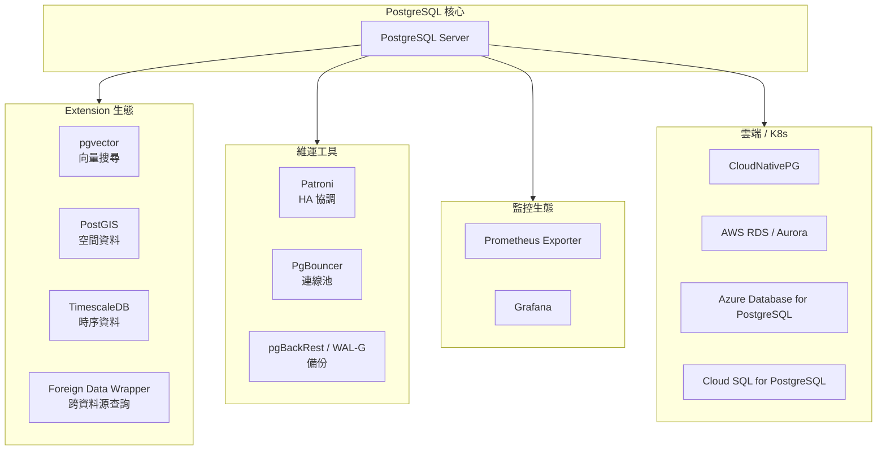

### 1.5 與其他資料庫的定位比較

| 資料庫 | 授權模式 | 強項 | PostgreSQL 相對優勢 |
|---|---|---|---|
| **Oracle Database** | 商業授權，昂貴 | 企業級功能完整、RAC | 授權成本、不被廠商鎖定、Extension 生態更開放 |
| **MySQL / MariaDB** | GPL（MySQL 由 Oracle 控制） | 簡單易用、讀多寫少場景效能佳 | SQL 標準相容性更高、原生 JSONB／Window Function／CTE 更完整、複雜查詢與資料完整性更強 |
| **SQL Server** | 商業授權 | 與 .NET／Windows 生態整合佳 | 跨平台、無授權費、開源可稽核 |
| **DB2** | 商業授權 | 大型主機、金融傳統系統 | 現代化生態、雲原生部署、人才市場更廣 |
| **MongoDB** | SSPL（非典型開源） | Schema-less 文件儲存 | JSONB 已可涵蓋多數半結構化需求，且保有關聯式完整性；不需要為了「彈性 Schema」犧牲交易一致性 |

> **What 情況適合選 PostgreSQL？**
> 需要交易一致性、複雜查詢、資料完整性、長期可稽核、不希望被單一廠商鎖定的系統——從一般企業 Web/後台系統、金融交易、到 AI/RAG 應用的 Metadata + Vector 儲存，PostgreSQL 都是合理的預設選擇。
>
> **What 情況不建議只用 PostgreSQL？**
> 超大規模（PB 級以上）分析型工作負載建議搭配欄式資料倉儲（如 ClickHouse / BigQuery）；超高吞吐的純 Key-Value 快取場景（微秒級延遲）仍以 Redis 更合適；PostgreSQL 可以「支援」這些場景的 Metadata / 交易一致部分，但不必然要取代專用系統。

### 本章重點

1. PostgreSQL 是採寬鬆授權、治理去中心化的物件關聯式資料庫，長期技術風險低。
2. 核心優勢是 ACID + MVCC + SQL 標準相容 + Extension 擴充性，讓它能透過擴充套件涵蓋 GIS、向量、時序等多種工作負載，而不必更換系統。
3. 選型時要區分「PostgreSQL 本身能力」與「透過 Extension 才具備的能力」，兩者的維運與風險屬性不同（詳見各章節）。

[↑ 回目錄](#-目錄)

---

## 第2章 PostgreSQL 19.x 版本狀態與新功能

### 2.1 版本狀態總表

| 版本 | 狀態 | 發布日 | 官方支援至 |
|---|---|---|---|
| PostgreSQL 18 | **Stable（現行 Production 版本）** | 2025-09 | 2030-11-14 |
| PostgreSQL 19 | **Beta 3** | 2026-08-13 | GA 前不建議 Production；官方 Roadmap 標示目標為 **2026 年 9 月** |
| PostgreSQL 17 | Stable | 2024-09 | 2029-11-08 |
| PostgreSQL 16 | Stable | 2023-09 | 2028-11-09 |
| PostgreSQL 15 | Stable | 2022-10 | 2027-11-11 |
| PostgreSQL 14 | Stable（即將 EOL） | 2021-09 | **2026-11-12** |

> Beta 版本代表**功能已凍結（Feature Freeze）**，但仍在進行相容性與效能測試，官方明確表示不建議用於 Production；RC（Release Candidate）代表已鎖定候選版本，僅接受重大缺陷修補。依 PostgreSQL 官方 Roadmap（<https://www.postgresql.org/developer/roadmap/>），19 的正式發布目標為 **2026 年 9 月**；本手冊查證基準日（2026-08-19）尚未有 RC 版本釋出，GA 精確日期仍以屆時官方公告為準。
>
> Beta 3 公告同時提到一項**過渡期限定機制**：Beta 階段內建「Protocol Grease Mode」（協定灰測模式），刻意在連線協定中加入非標準參數，用於及早發現生態圈（驅動程式、連線池、中介軟體）尚未正確處理未知協定欄位的相容性問題；此機制**僅存在於 Beta 期間，GA 版會移除**，企業測試 19 Beta 時若遇到連線層異常，應先確認是否為此機制觸發，而非直接視為正式回歸問題。

### 2.2 PostgreSQL 19（Beta）重點新功能

以下依官方 19 Release Notes（<https://www.postgresql.org/docs/19/release-19.html>）整理，**全數標記為 Beta 階段功能**，GA 前語法與預設值可能調整。為方便查閱，依「SQL 語法／查詢」「維運與儲存」「複寫」「效能與 I/O」「監控」「安全性」「資料型別與函式」「工具程式」七大分類呈現。

#### 2.2.1 SQL 語法與查詢

| Feature | 說明 | 狀態 |
|---|---|---|
| SQL/PGQ 屬性圖查詢 | 以標準 SQL 語法（`GRAPH_TABLE`）對既有資料表執行 Property Graph 查詢，內部轉譯為一般關聯式查詢／View 執行，適合社交網路、供應鏈、組織圖等圖狀關聯資料 | Beta |
| Temporal Table：`FOR PORTION OF` | `UPDATE` / `DELETE` 新增 `FOR PORTION OF` 子句，可對時態（Temporal）資料表指定時間區間進行局部更新／刪除，資料庫自動處理區間切割 | Beta |
| Window Function：`IGNORE NULLS` / `RESPECT NULLS` | `lead()`、`lag()`、`first_value()`、`last_value()`、`nth_value()` 新增忽略/保留 NULL 的語意，補齊與 Oracle／SQL Server 對齊的常見報表需求 | Beta |
| `ON CONFLICT DO SELECT ... RETURNING` | 提供原子性 get-or-create 語意，衝突列可搭配 `FOR UPDATE`/`FOR SHARE` 鎖定後回傳 | Beta |
| `GROUP BY` 子查詢欄位強化 | 允許 `GROUP BY` 處理目標列中含子查詢、且運算式參照非子查詢欄位的情境，減少過去必須改寫成 CTE 的限制 | Beta |
| `COPY TO` 支援 JSON 輸出 | 可直接輸出 JSON／JSON Array（`FORCE_ARRAY` 選項）格式，並支援對分區表 `COPY TO` | Beta |
| `COPY FROM` 強化 | 支援跳過多行標頭（Multiple Header Line）、`ON_ERROR SET_NULL` 選項將錯誤輸入值設為 NULL 而非中止 | Beta |

#### 2.2.2 維運與儲存指令

| Feature | 說明 | 狀態 |
|---|---|---|
| `REPACK` 指令 | 新增指令整合 `VACUUM FULL` 與 `CLUSTER` 的能力並統一介面（舊指令保留相容），支援 `REPACK CONCURRENTLY` 不阻塞讀寫，新增 `max_repack_replication_slots` 參數控制複寫延遲 | Beta |
| `ALTER TABLE ... MERGE/SPLIT PARTITIONS` | 原生合併／分割分區，不需再手動建表、搬資料、換父表 | Beta |
| `CHECKPOINT` 選項列 | `CHECKPOINT` 指令可接受 `MODE`、`FLUSH_UNLOGGED` 等選項，精細控制 Checkpoint 行為 | Beta |
| `GRANT ... GRANTED BY` | 授權時可明確指定「以哪個角色身分」執行授權動作，強化稽核追溯 | Beta |
| `CREATE SCHEMA` 建立多型別物件 | 可在同一個 `CREATE SCHEMA` 區塊中建立更多物件型別；外鍵固定最後建立以避免相依性問題（同時也是行為變更，見 2.3） | Beta |
| Online 啟用/停用 Data Checksums | 新增 `pg_online_enable_checksums()` / `pg_online_disable_checksums()`，資料檢查碼可在伺服器**運行中**開關，不需離線跑 `pg_checksums` 或重建叢集 | Beta |

#### 2.2.3 複寫（Replication）

| Feature | 說明 | 狀態 |
|---|---|---|
| Logical Replication 複寫 Sequence | `CREATE/ALTER PUBLICATION` 支援 `ALL SEQUENCES`，`ALTER SUBSCRIPTION ... REFRESH SEQUENCES` 可同步 Sequence 數值，補齊長年缺口 | Beta |
| Logical Replication 免重啟啟用 | `wal_level = replica` 時，新增 `effective_wal_level` 回報實際生效等級，邏輯複寫在特定情境下可不需改參數重啟 | Beta |
| Publication `EXCEPT` 子句 | 可用 `EXCEPT` 排除特定資料表，不需逐一列舉要複寫的表 | Beta |
| `retain_dead_tuples` / `max_retention_duration` | 控制邏輯複寫衝突解決時死元組的保留與上限，降低長時間訂閱斷線造成的 Bloat 風險 | Beta |
| `WAIT FOR` LSN 等待語法 | Standby／訂閱端可等待特定 LSN 被寫入／flush／replay，實作 Read-Your-Writes 一致性模式 | Beta |
| `wal_sender_shutdown_timeout` | 限制伺服器關閉時等待複寫端同步的最長時間 | Beta |

#### 2.2.4 效能與 I/O

| Feature | 說明 | 狀態 |
|---|---|---|
| Async I/O Worker 自動擴縮 | `io_method = worker` 時新增 `io_min_workers`／`io_max_workers`／`io_worker_idle_timeout`／`io_worker_launch_interval`，依負載自動增減 I/O Worker 數量，延續 18 引入的非同步 I/O 子系統 | Beta |
| Parallel Autovacuum | Autovacuum 可用多個 Worker 平行處理索引清理，新增 `autovacuum_max_parallel_workers`（伺服器層級）與 `autovacuum_parallel_workers`（資料表層級） | Beta |
| Autovacuum Scoring 系統 | 新增 `autovacuum_freeze_score_weight`、`autovacuum_multixact_freeze_score_weight`、`autovacuum_vacuum_score_weight`、`autovacuum_vacuum_insert_score_weight`、`autovacuum_analyze_score_weight`，依評分決定優先處理哪些資料表，並提供 `pg_stat_autovacuum_scores` 視圖檢視決策依據 | Beta |
| `pg_plan_advice` / `pg_stash_advice` | 新擴充套件，可依 Query Identifier 穩定並自動套用特定查詢的執行計畫建議，降低升級或統計資訊變動造成的計畫突變風險 | Beta |
| TOAST 預設壓縮改為 `lz4` | `default_toast_compression` 預設由 `pglz` 改為壓縮率與效能更佳的 `lz4` | Beta（Breaking Change，見 2.3） |
| Optimizer 多項強化 | `NOT IN`／`LEFT JOIN` 更積極轉為 Anti Join、Anti Join 支援 Memoize、聚合前置處理、Hash Join 對 NULL Key 最佳化、Append/MergeAppend 支援增量排序等一系列 Planner 改善 | Beta |
| Checksum／編碼運算 SIMD 加速 | 頁面檢查碼運算導入 AVX2／ARM Crypto Extension，`hex_encode()`／`hex_decode()` 使用 SIMD 指令加速 | Beta |

#### 2.2.5 監控與可觀測性

| Feature | 說明 | 狀態 |
|---|---|---|
| 新系統視圖 | `pg_stat_lock`（依鎖類型統計）、`pg_stat_recovery`（復原進度）、`pg_stat_autovacuum_scores`（Autovacuum 優先順序決策）、`pg_dsm_registry_allocations`（動態共享記憶體明細） | Beta |
| 既有視圖新增欄位 | `pg_stat_progress_vacuum` 新增 `started_by`／`mode`；`pg_stat_replication_slots` 新增 `mem_exceeded_count` 等欄位；`pg_stat_wal` 新增 Full-Page Image 寫入位元組統計；多個 `pg_stat_*` 視圖新增 `stats_reset` 欄位 | Beta |
| `pg_stat_subscription_stats` 欄位調整 | `sync_error_count` 更名為 `sync_table_error_count`，新增 `sync_seq_error_count`（Sequence 同步錯誤）與 `update_deleted` | Beta（Breaking Change，見 2.3） |

#### 2.2.6 安全性

| Feature | 說明 | 狀態 |
|---|---|---|
| RADIUS 認證移除 | 移除不安全的 UDP-based RADIUS 認證方式 | Beta（Breaking Change） |
| OAuth / SNI 強化 | Server 端 SNI 支援（新增 `PGDATA/pg_hosts.conf`）、OAuth Validator 可註冊自訂 `pg_hba.conf` 選項，libpq 新增 `oauth_ca_file` 連線參數 | Beta |
| 密碼安全強化 | 新增 `password_expiration_warning_threshold`（預設 7 天）；對 MD5 密碼認證發出警告，可用 `md5_password_warnings` 關閉 | Beta |
| `pg_read_all_data` / `pg_write_all_data` 涵蓋大型物件 | 兩個內建角色現在也涵蓋 Large Object 的讀寫權限 | Beta |

#### 2.2.7 資料型別、函式與工具程式

| Feature | 說明 | 狀態 |
|---|---|---|
| 新資料型別 `oid8` | 64 位元無號 OID 型別，補齊既有 32 位元 OID 系列在超大型系統的容量限制 | Beta |
| `bytea` ↔ `uuid` 型別轉換 | 新增雙向 Cast，簡化以 `bytea` 儲存 UUID 的整合情境 | Beta |
| DDL 匯出函式 | `pg_get_role_ddl()`、`pg_get_tablespace_ddl()`、`pg_get_database_ddl()`，方便以 SQL 直接取得物件的建立語法（第32、49章逆向工程情境可直接運用） | Beta |
| `vacuumdb --dry-run` | 僅列出將執行的指令而不實際執行，便於維運腳本先行驗證 | Beta |
| `pgbench --continue-on-error` | 發生 SQL 錯誤後繼續壓測，不中止整個測試 | Beta |
| 文字檢索新增詞幹分析器 | 新增波蘭語（Polish）、世界語（Esperanto）詞幹分析器 | Beta |

> 🔍 **待官方確認**：以上功能於 GA 前仍可能因 RC 階段回饋而調整參數名稱或預設值，正式導入前請以 <https://www.postgresql.org/docs/19/release-19.html> 當時內容為準。

### 2.3 Breaking Changes／不相容變更完整清單

這是 PostgreSQL 19 對企業升級評估**最關鍵**的一節——多數團隊只關注「新功能」，卻在上線後才發現既有系統因「行為變更」而故障。以下依官方 Release Notes「不相容性」章節整理：

| 類別 | 變更內容 | Enterprise Impact |
|---|---|---|
| Dump／Restore | `standard_conforming_strings` **強制為 `on`**，無法再關閉 | 若既有系統／舊版 `pg_dump` 匯出檔設定為 `off`，該匯出檔**無法**還原到 19+；必須改用 19+ 版本的 `pg_dump`/`pg_dumpall` 重新匯出，或確認來源已為 `on` |
| 命名限制 | 資料庫名稱、Role 名稱、Tablespace 名稱**禁止**包含 CR／LF（Carriage Return／Line Feed） | 屬於安全性強化；`pg_upgrade` 會直接拒絕含此類名稱的舊叢集，升級前需先盤點並改名 |
| Index／Opclass | `inet`／`cidr` 型別的**預設 Opclass** 由 `btree_gist` 改為 `GiST`（原因：`btree_gist` 對此二型別的版本存在邏輯錯誤，可能漏掉應回傳的資料列） | `pg_upgrade` 會拒絕含有以 `btree_gist` 建立 `inet`/`cidr` 索引的叢集；升級前需盤點相關索引並改建 |
| 編碼 | 移除 `MULE_INTERNAL` 編碼 | 若資料庫使用此編碼，須先以其他編碼 Dump／Restore 後才能升級 |
| 參數移除 | 移除 `escape_string_warning` 參數 | 設定檔中若仍保留此參數需清除，否則啟動時會出現未知參數錯誤或警告 |
| Object 建立順序 | `CREATE SCHEMA` 不再自動重排物件建立順序以避開相依性，改採「指定順序」（外鍵固定最後建立） | 批次匯入或 Schema-as-Code 腳本若倚賴舊版自動重排行為，需重新驗證執行順序 |
| `COPY FROM` | `WHERE` 子句禁止參照系統欄位 | 少數以系統欄位（如 `ctid`）過濾匯入資料的腳本需調整寫法 |
| 函式行為 | `json_array()` 在無資料列時，回傳空 JSON 陣列 `[]`，**不再回傳 `NULL`** | 應用層若對此函式結果做 `IS NULL` 判斷，需改為判斷空陣列 |
| Foreign Data Wrapper | Read Only／Deferrable 交易狀態會透過 `postgres_fdw` 傳遞至遠端伺服器 | `READ ONLY` 交易透過 `postgres_fdw` 將**無法再修改**遠端資料列，需重新檢視跨庫交易腳本 |
| 預設值 | `max_locks_per_transaction`：64 → 128（內部鎖配置結構也調整） | 大量分區表／複雜交易系統若曾手動調高過此值，升級後需重新確認容量換算是否仍符合預期 |
| 預設值 | JIT 預設由**開啟**改為**關閉**（官方判斷其成本估算不夠穩定） | 倚賴 JIT 帶來查詢效能的分析型系統，升級後需手動 `jit = on` 並重新測試 |
| 預設值 | `default_toast_compression`：`pglz` → `lz4` | 新寫入資料採 `lz4` 壓縮；舊資料不受影響，但跨版本相容測試需納入壓縮格式差異 |
| 預設值 | `log_lock_waits`：關閉 → **預設開啟** | 日誌量會增加，屬於企業可觀測性的正向變更，但需評估既有集中式日誌系統的容量與過濾規則 |
| 監控欄位改名 | `pg_stat_subscription_stats.sync_error_count` → `sync_table_error_count` | 監控儀表板／告警規則中直接引用此欄位名稱者需同步更新 |
| Wait Event | Wait Event 型別 `BUFFERPIN` 更名為 `BUFFER` | 依賴此欄位名稱做告警或報表的監控系統需同步調整 |
| 擴充套件開發 | Index Access Method Handler 改用靜態 `IndexAmRoutines` 結構（不再動態配置）；`get_relation_info_hook` 移除，改為新增 `build_simple_rel_hook` | 自行開發或使用第三方 C 擴充套件的團隊，升級前須確認擴充套件是否已針對 19 更新 |
| 安全性 | 移除 RADIUS 認證 | 見 2.2.6；`pg_hba.conf` 中使用 `radius` 的規則需改為 LDAP／Kerberos／憑證認證 |
| 建置需求 | C 語言標準要求提升至 **C11**（原 C99）；Meson 需 0.57.2 以上；Windows 建置需 Visual Studio 2019 以上 | 自行原始碼編譯或維護自訂 Extension 的團隊，需同步升級建置工具鏈 |

> **升級評估鐵律**：任何大版本升級（尤其是含 Breaking Change 的版本）都必須先在**非生產環境**以正式資料的等量副本執行完整回歸測試，並使用 `pg_upgrade --check` 提前偵測 `inet`/`cidr` 索引、特殊命名等會被直接拒絕的情境。詳細升級步驟見第52、53章。

### 2.4 Stable / Beta / Deprecated 標示原則（本手冊通用）

| 標示 | 意義 |
|---|---|
| ✅ Stable | 已在 PostgreSQL 18 或更早版本存在，可安心 Production 使用 |
| 🧪 Beta（19） | 僅存在於 PostgreSQL 19 Beta，GA 前不建議 Production 依賴 |
| ⚠️ Deprecated | 官方已標示為棄用或即將移除 |
| ⛔ Removed | 本版本已移除（例如 19 移除 RADIUS 認證、`MULE_INTERNAL` 編碼、`escape_string_warning` 參數） |

### 2.5 Enterprise Impact 對照表

| Feature | PostgreSQL 18 | PostgreSQL 19 | Enterprise Impact |
|---|---|---|---|
| Autovacuum 平行化 | 單 Worker 循序處理 | 支援 Parallel Worker + Scoring | 大型資料表 Vacuum 時間可望縮短，但需重新評估 `autovacuum_max_parallel_workers` 對 CPU 的影響 |
| Bloat 整理 | `VACUUM FULL` / `pg_repack`（第三方） | 原生 `REPACK CONCURRENTLY` | 減少對第三方擴充套件的依賴，但升級前需確認既有 `pg_repack` 腳本相容性 |
| Logical Replication | 不含 Sequence 複寫 | 原生複寫 Sequence | 零停機遷移／異地災備場景可減少手動同步 Sequence 的維運負擔 |
| JIT | 預設開啟 | 預設關閉 | 升級後若依賴 JIT 帶來的查詢效能，需手動設定 `jit = on` 並重新測試 |
| `max_locks_per_transaction` | 預設 64 | 預設 128（內部配置也改變） | 大量分區表／複雜交易的系統升級時，若原本手動調高過此參數，需重新確認容量換算是否仍正確 |
| Dump／Restore 相容性 | `standard_conforming_strings` 可設為 off | 強制為 on | 舊版匯出檔／舊版工具鏈可能無法直接還原，需以新版工具重新匯出 |
| Index 相容性 | `inet`/`cidr` 常用 `btree_gist` | 預設改用 `GiST` | `pg_upgrade --check` 會攔截含問題索引的叢集，需提前盤點改建 |
| Async I/O | `io_method=worker` 固定 Worker 數 | 依負載自動擴縮（`io_min/max_workers`） | 高 I/O 波動的系統可望降低尖峰延遲，但需重新觀察 Worker 數量對系統資源的影響 |

### 本章重點

1. 撰寫本手冊當下（2026-08-19），PostgreSQL 18 是唯一可放心用於 Production 的版本，19 仍在 Beta 3，官方 Roadmap 目標為 2026 年 9 月 GA。
2. PostgreSQL 19 的 Breaking Change 清單遠比多數團隊預期的長——`standard_conforming_strings` 強制開啟、`inet`/`cidr` 預設 Opclass 改變、`max_locks_per_transaction`／JIT／TOAST 壓縮預設值調整、RADIUS 移除，都可能讓「看似能直接升級」的系統在 `pg_upgrade --check` 階段就失敗，或上線後行為不符預期。
3. Parallel Autovacuum、原生 REPACK、Logical Replication 複寫 Sequence、Async I/O 自動擴縮，是本次最具維運價值的改動，建議優先納入 19 GA 後的升級評估重點；SQL/PGQ 與 Temporal Table（`FOR PORTION OF`）則是最具應用面想像空間的新能力。

[↑ 回目錄](#-目錄)

---

## 第3章 PostgreSQL 技術選型比較

### 3.1 RDBMS 選型比較表

| 需求 | PostgreSQL | MySQL/MariaDB | Oracle | SQL Server | 建議 |
|---|---|---|---|---|---|
| 複雜查詢／報表 | ★★★★★ | ★★★☆☆ | ★★★★★ | ★★★★☆ | 複雜 Join、Window Function、CTE 多的系統選 PostgreSQL |
| 高併發讀寫 | ★★★★☆ | ★★★★☆ | ★★★★★ | ★★★★☆ | 皆可勝任，差異在調校成本與授權費 |
| 授權成本 | 免費 | 免費／商業雙授權 | 高額商業授權 | 商業授權 | 成本敏感系統優先 PostgreSQL |
| 半結構化資料 | JSONB 原生支援 | JSON（功能較陽春） | JSON 支援但語法複雜 | JSON 支援但非原生型別 | PostgreSQL JSONB 索引與查詢能力最完整 |
| 地理空間 | PostGIS（業界標準） | 基本 GIS 函式 | Oracle Spatial（商業） | 基本 GIS 函式 | GIS 為主要需求時選 PostgreSQL + PostGIS |
| 向量搜尋 / AI | pgvector | 無原生支援 | Oracle 23ai 有限支援 | 有限支援 | AI/RAG 應用的 Metadata + Vector 一體化，PostgreSQL 優勢明顯 |
| 人才市場 | 廣，持續成長 | 廣 | 中（企業導向） | 中（微軟生態） | 長期人力可維護性 PostgreSQL 與 MySQL 相當 |

### 3.2 PostgreSQL vs MongoDB：JSONB 能否取代文件資料庫？

```mermaid
flowchart LR
    A[需求：半結構化資料] --> B{需要交易一致性<br/>與關聯式查詢?}
    B -->|是| C[PostgreSQL + JSONB]
    B -->|否，且需要水平擴展<br/>與 Schema-less 彈性極致] --> D[MongoDB / 文件資料庫]
    C --> E[可混合 Relational + JSONB<br/>單一系統維運]
    D --> F[需另外處理跨文件一致性]
```

- **PostgreSQL JSONB 適合**：Schema 大致穩定但有少量彈性欄位（如商品屬性、表單資料、事件 Payload），且需要與關聯式資料一起查詢、交易。
- **MongoDB 適合**：真正 Schema-less、需要水平分片擴展到單一叢集無法負荷的規模、文件間幾乎不需要 Join。
- 實務上很多團隊誤用 MongoDB 存放「其實有明確關聯性」的資料，之後才發現需要應用層自行處理一致性——這類情境改用 PostgreSQL + JSONB 通常是更省維運成本的選擇。

### 3.3 PostgreSQL vs 專用 Vector Database（延伸見第28章）

| 面向 | PostgreSQL + pgvector | 專用 Vector DB（如 Milvus/Pinecone/Weaviate） |
|---|---|---|
| 一致性 | 向量與業務資料同一交易 | 通常最終一致，需另外同步 |
| 維運複雜度 | 沿用既有 PostgreSQL 維運能力 | 需額外一套系統的部署/監控/備份 |
| 超大規模（十億級向量） | 需搭配良好分區/索引策略，量體極大時較吃力 | 專門為此設計，擴展性更佳 |
| Metadata Filtering | 原生 SQL WHERE，天生強項 | 多數需要額外的 Filter 索引設計 |

### 本章重點

1. 選型不是「PostgreSQL 好不好」，而是「工作負載的一致性需求、查詢複雜度、擴展規模」三者的權衡。
2. JSONB 能覆蓋多數「以為需要文件資料庫」的場景，但不代表 PostgreSQL 可以無限水平擴展。
3. AI/向量場景，中小規模與需要一致性者優先 PostgreSQL + pgvector；十億級向量、極致水平擴展需求才考慮專用 Vector DB。

[↑ 回目錄](#-目錄)

---

## 第4章 PostgreSQL 系統架構總覽

### 4.1 Process-per-Connection 架構

PostgreSQL 採用 **Process-per-Connection**（每連線一個作業系統程序）架構，不同於 MySQL 常見的 Thread-per-Connection。這個決策從 1990 年代延續至今，優缺點都很明確：

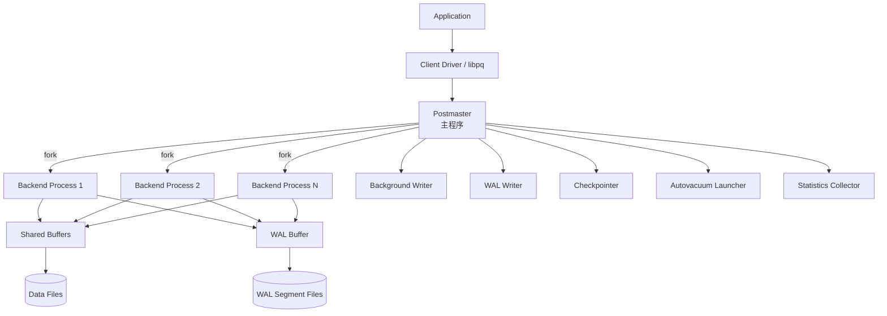

- **優點**：單一連線當機不會拖垮整個資料庫進程；作業系統層級的資源隔離與安全邊界清楚。
- **缺點**：每個連線的記憶體開銷較高（相較 Thread 模型），因此 `max_connections` 不能無限拉高——這正是第25章 Connection Pooling 存在的原因。

### 4.2 核心行程說明

| 元件 | 角色 |
|---|---|
| **Postmaster** | 主監聽程序，接受連線並 fork 出 Backend Process；管理所有背景行程的生命週期 |
| **Backend Process** | 每個用戶端連線對應一個程序，負責解析、規劃、執行該連線的 SQL |
| **Shared Buffers** | 記憶體中的資料頁快取，是 PostgreSQL 效能的核心資源（見 `shared_buffers` 參數，第9章） |
| **Background Writer** | 定期將 Shared Buffers 中的 Dirty Page 寫回磁碟，平滑 I/O 尖峰 |
| **WAL Writer** | 將 WAL Buffer 中的紀錄寫入磁碟上的 WAL 檔案 |
| **Checkpointer** | 定期執行 Checkpoint，確保 Crash Recovery 時間可控（見第19章） |
| **Autovacuum Launcher / Worker** | 自動觸發 VACUUM / ANALYZE，回收 Dead Tuple、更新統計資訊（見第18章） |
| **Statistics Collector** | 收集執行統計資料，供 `pg_stat_*` 系統視圖查詢（見第23章） |

### 4.3 從 Client 到 Storage 的資料路徑

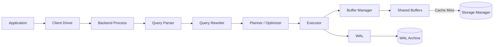

### 本章重點

1. Process-per-Connection 是理解「為什麼不能無限開連線」「為什麼需要連線池」的根本原因。
2. Shared Buffers、WAL、Checkpoint、Autovacuum 是四個決定效能與穩定性的關鍵背景機制，後續章節會逐一深入。
3. DBA 調校前務必先理解這張架構圖——多數效能問題最終都能對應回其中某一個元件。

[↑ 回目錄](#-目錄)

---

## 第5章 PostgreSQL Internal Architecture：一條 SQL 的旅程

### 5.1 Query Processing Pipeline

以下面這條查詢為例：

```sql
SELECT customer_id, customer_name
FROM customer
WHERE customer_id = 100;
```

它會依序經過：

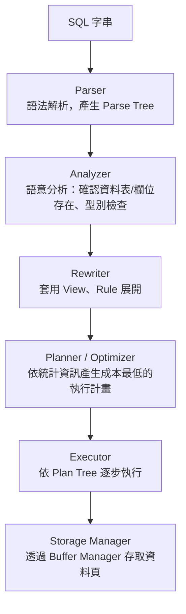

| 階段 | 做什麼 | 常見錯誤在此階段被攔截 |
|---|---|---|
| Parser | 純語法檢查，產生 Parse Tree | SQL 語法錯誤 |
| Analyzer | 檢查資料表/欄位是否存在、型別是否相容 | `relation "xxx" does not exist`、型別不匹配 |
| Rewriter | 展開 View 定義、套用 Rule | — |
| Planner | 依 `pg_statistic` 統計資訊評估多種執行路徑的成本，選出最低成本方案 | 統計資訊過期會導致「規劃錯誤」而非語法錯誤（見第16章） |
| Executor | 依 Plan Tree（可能含 Seq Scan / Index Scan / Join 節點）逐步執行並回傳結果 | Lock 等待、Runtime Error |

### 5.2 MVCC 與 Transaction Manager 的角色

Executor 存取資料時，並非直接讀「最新資料」，而是透過 **Snapshot** 判斷哪些 Row Version 對目前交易可見——這就是 MVCC（見第17章）的核心機制，也是 PostgreSQL「讀不阻塞寫、寫不阻塞讀」的原因。

### 5.3 Lock Manager 與 Catalog

- **Lock Manager**：管理資料表、資料列等各層級的鎖，避免多個交易同時修改造成資料不一致（見第17章 Deadlock）。
- **System Catalog**（`pg_catalog` schema）：PostgreSQL 把「資料表結構本身」也存成資料表（如 `pg_class`、`pg_attribute`），這也是為什麼 PostgreSQL 可以用 SQL 查詢自己的 Metadata——這個特性在第32章「Reverse Engineering」會大量運用。

```sql
-- 查詢目前資料庫有哪些資料表（示範 Catalog 可被 SQL 查詢）
SELECT relname, relkind
FROM pg_class
WHERE relnamespace = 'public'::regnamespace
  AND relkind = 'r';
```

### 本章重點

1. 一條 SQL 從字串到結果，會依序經過 Parser → Analyzer → Rewriter → Planner → Executor，理解這個流程是診斷「查詢為什麼跑不動」的基礎。
2. 統計資訊（`pg_statistic`）過期會讓 Planner 做出錯誤決策——這是實務上最常見卻最容易被忽略的效能問題根因。
3. System Catalog 本身也是資料表，AI Agent／逆向工程場景可以直接用 SQL 查詢 Schema Metadata（第32、49章延伸）。

[↑ 回目錄](#-目錄)

---

## 第6章 安裝與部署：Windows

### 6.1 安裝步驟（PostgreSQL 18 Production／19 Beta 評估環境皆適用）

1. 至官方下載頁取得 Windows Installer（EDB 提供的官方打包版）
2. 執行安裝程式，選擇安裝路徑（預設 `C:\Program Files\PostgreSQL\18`）
3. 設定 **Data Directory**（預設 `C:\Program Files\PostgreSQL\18\data`）——生產環境建議指向獨立磁碟，而非系統碟
4. 設定 **Port**（預設 `5432`）
5. 設定 **Superuser（postgres）密碼**——企業環境務必使用強密碼並存入密鑰管理系統，不寫在安裝腳本中
6. 選擇 **Locale**（建議 `en_US.UTF-8` 或依企業標準統一，避免跨系統排序行為不一致）
7. 安裝完成後會自動註冊為 **Windows Service**（`postgresql-x64-18`）
8. 確認安裝目錄下的 `bin` 已加入 **PATH 環境變數**（或每次以完整路徑呼叫）

### 6.2 驗證安裝

```powershell
psql --version

# 使用 postgres 超級使用者連線（會提示輸入密碼）
psql -U postgres -h localhost -p 5432
```

### 6.3 服務管理

```powershell
# 查詢服務狀態
Get-Service -Name "postgresql-x64-18"

# 啟動 / 停止 / 重啟服務
Start-Service -Name "postgresql-x64-18"
Stop-Service -Name "postgresql-x64-18"
Restart-Service -Name "postgresql-x64-18"
```

### 6.4 pgAdmin

pgAdmin 是官方推薦的圖形化管理工具，安裝程式通常會一併安裝。首次啟動需連線至剛安裝的伺服器（Host: `localhost`、Port: `5432`、User: `postgres`）。

> **Production 注意事項**：pgAdmin 的連線密碼預設會被瀏覽器/應用程式加密儲存於本機，共用工作站環境務必評估是否採用個別帳號登入，而非共用 `postgres` 超級使用者。

### 本章重點

1. Windows 安裝的關鍵決策點是 Data Directory 位置、Port、Superuser 密碼與 Locale——四者事後修改成本都不低，安裝前先確認企業規範。
2. Service 化後可用標準 PowerShell 服務指令管理，方便納入既有 Windows 維運流程。

[↑ 回目錄](#-目錄)

---

## 第7章 安裝與部署：Linux

### 7.1 Ubuntu / Debian

```bash
sudo apt update
sudo apt install -y postgresql postgresql-contrib

# 確認版本（發行版套件庫版本可能落後官方最新版，企業環境建議改用 PGDG 官方套件庫）
psql --version
```

企業正式環境建議加入 **PGDG（PostgreSQL Global Development Group）官方套件庫**，才能取得最新且與官方文件一致的版本：

```bash
sudo sh -c 'echo "deb https://apt.postgresql.org/pub/repos/apt $(lsb_release -cs)-pgdg main" > /etc/apt/sources.list.d/pgdg.list'
curl -fsSL https://www.postgresql.org/media/keys/ACCC4CF8.asc | sudo gpg --dearmor -o /etc/apt/trusted.gpg.d/pgdg.gpg
sudo apt update
sudo apt install -y postgresql-18
```

### 7.2 RHEL / Rocky Linux / AlmaLinux

```bash
sudo dnf install -y https://download.postgresql.org/pub/repos/yum/reporpms/EL-9-x86_64/pgdg-redhat-repo-latest.noarch.rpm
sudo dnf install -y postgresql18-server postgresql18-contrib
sudo /usr/pgsql-18/bin/postgresql-18-setup initdb
sudo systemctl enable --now postgresql-18
```

### 7.3 服務、使用者、目錄

| 項目 | 說明 |
|---|---|
| 系統使用者 | 安裝後會建立 `postgres` 系統帳號，所有 PostgreSQL 程序以此身分執行 |
| Data Directory | Debian 系常見於 `/var/lib/postgresql/18/main`；RHEL 系常見於 `/var/lib/pgsql/18/data` |
| 設定檔 | `postgresql.conf`、`pg_hba.conf` 通常與 Data Directory 同層或 `/etc/postgresql/18/main/`（Debian 系另外管理） |
| Log | 預設輸出至 Data Directory 下的 `log/` 或由 systemd journal 接管（`journalctl -u postgresql-18`） |

```bash
# systemd 服務管理
sudo systemctl status postgresql-18
sudo systemctl restart postgresql-18

# 切換至 postgres 系統帳號操作
sudo -iu postgres psql
```

### 7.4 Port 與防火牆

```bash
# 確認監聽 Port（預設 5432）
sudo ss -tlnp | grep 5432

# firewalld 環境開放 Port（僅在真正需要外部連線時開放，內網服務建議維持預設關閉）
sudo firewall-cmd --permanent --add-port=5432/tcp
sudo firewall-cmd --reload
```

> **Security 提醒**：預設安裝的 `listen_addresses` 通常僅監聽 `localhost`。除非有明確需求（例如獨立資料庫伺服器），否則不建議直接開放 `0.0.0.0` 對外監聽——應用程式連線建議透過內網、VPN 或連線池服務轉接（第10、25章延伸）。

### 本章重點

1. 生產環境建議使用 PGDG 官方套件庫而非發行版內建套件庫，確保版本與官方文件、Release Notes 一致。
2. 所有 PostgreSQL 程序以 `postgres` 系統帳號執行，維運指令與檔案權限管理需圍繞這個帳號設計。
3. 防火牆與 `listen_addresses` 是兩道獨立防線，兩者都需要「預設拒絕、按需開放」。

[↑ 回目錄](#-目錄)

---

## 第8章 安裝與部署：Docker／Podman／Kubernetes

### 8.1 核心觀念：Container 可被刪除，Data 不行

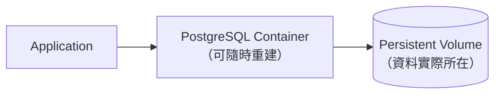

**Container 被刪除 ≠ Database Data 必須消失。** 這是 Container 化 PostgreSQL 最核心也最容易被新手忽略的觀念：資料必須掛載在 Persistent Volume，Container 本身應視為無狀態、可隨時重建的執行單元。

### 8.2 Docker Compose 範例

```yaml
services:
  postgres:
    image: postgres:18
    container_name: pg18
    restart: unless-stopped
    environment:
      POSTGRES_USER: app_user
      POSTGRES_PASSWORD_FILE: /run/secrets/pg_password
      POSTGRES_DB: appdb
    ports:
      - "5432:5432"
    volumes:
      - pg_data:/var/lib/postgresql/data
    secrets:
      - pg_password
    healthcheck:
      test: ["CMD-SHELL", "pg_isready -U app_user -d appdb"]
      interval: 10s
      timeout: 5s
      retries: 5

secrets:
  pg_password:
    file: ./secrets/pg_password.txt

volumes:
  pg_data:
```

> **安全提醒**：範例使用 `POSTGRES_PASSWORD_FILE` 搭配 Docker Secret，而非直接把密碼寫在 `environment` 或 `.env` 提交進 Git——這是本手冊第38章 DevSecOps 會反覆強調的原則。

### 8.3 Podman（Rootless 部署）

```bash
podman run -d \
  --name pg18 \
  -e POSTGRES_USER=app_user \
  -e POSTGRES_PASSWORD_FILE=/run/secrets/pg_password \
  -e POSTGRES_DB=appdb \
  -v pg_data:/var/lib/postgresql/data:Z \
  -p 5432:5432 \
  --secret pg_password \
  docker.io/library/postgres:18
```

Podman 預設支援 **Rootless** 執行，容器內程序不具備主機 root 權限，是企業安全基準常見要求。`:Z` 標記用於 SELinux 環境正確設定 Volume 標籤。

### 8.4 備份 / 還原 / 升級（Container 場景）

```bash
# 備份（透過容器內的 pg_dump）
docker exec -t pg18 pg_dump -U app_user -d appdb -F c -f /tmp/appdb.dump
docker cp pg18:/tmp/appdb.dump ./backup/appdb.dump

# 還原至新容器
docker cp ./backup/appdb.dump pg18_new:/tmp/appdb.dump
docker exec -t pg18_new pg_restore -U app_user -d appdb -c /tmp/appdb.dump
```

Container 場景的**大版本升級**（例如 18 → 19）不能只是換 image tag 重啟——PostgreSQL 的 Data Directory 版本與伺服器版本綁定，直接換版本會導致啟動失敗。正確做法是：`pg_dump`/`pg_restore` 或掛載新版容器執行 `pg_upgrade`（詳見第52、53章）。

### 8.5 Kubernetes：StatefulSet 與 Operator

裸 `StatefulSet` 部署 PostgreSQL 需要自行處理 Failover、備份排程、憑證輪替，企業場景更常見的做法是採用 **PostgreSQL Operator**：

| 方案 | 特性 |
|---|---|
| **CloudNativePG** | CNCF 生態圈活躍、原生支援 Streaming Replication 自動 Failover、內建備份至 Object Storage |
| **Zalando Postgres Operator** | 成熟度高，社群案例多 |
| **Crunchy PGO** | 企業支援選項完整（Crunchy Data 商業支援） |

```yaml
# CloudNativePG 最小化 Cluster 範例（概念示意，實際欄位請以官方 CRD 文件為準）
apiVersion: postgresql.cnpg.io/v1
kind: Cluster
metadata:
  name: pg-cluster
spec:
  instances: 3
  imageName: ghcr.io/cloudnative-pg/postgresql:18
  storage:
    size: 100Gi
  bootstrap:
    initdb:
      database: appdb
      owner: app_user
```

> 🔍 **待官方確認**：CloudNativePG CRD 欄位會隨版本演進，正式部署前請以當時官方文件為準，不要直接複製本手冊範例上線。

### 本章重點

1. Container 化 PostgreSQL 的第一原則：資料在 Volume，不在 Container；Container 應視為可拋棄的執行單元。
2. 密碼／憑證一律透過 Secret 機制注入，不寫進 image 或 Compose 檔案明文提交。
3. Kubernetes 上的 PostgreSQL 生產部署建議採用成熟 Operator（如 CloudNativePG），而非自行維護裸 StatefulSet 的 Failover 邏輯。

[↑ 回目錄](#-目錄)

---

## 第9章 PostgreSQL 設定

### 9.1 三個設定檔的分工

| 檔案 | 用途 |
|---|---|
| `postgresql.conf` | 伺服器行為參數（記憶體、WAL、Log、Autovacuum、Query Planner 等） |
| `pg_hba.conf` | Host-Based Authentication：**誰**可以從**哪裡**用**什麼方式**連線 |
| `pg_ident.conf` | 作業系統使用者到 PostgreSQL Role 的對應（搭配 `peer`/`ident` 認證使用） |

### 9.2 修改設定的三種方式與差異

```sql
-- 方式一：ALTER SYSTEM（寫入 postgresql.auto.conf，需 reload 或 restart 生效，依參數而定）
ALTER SYSTEM SET work_mem = '64MB';
SELECT pg_reload_conf();

-- 方式二：SET（僅影響目前 Session，斷線即失效）
SET work_mem = '64MB';

-- 方式三：查詢目前生效值與是否需要重啟
SHOW work_mem;
SELECT name, setting, unit, context
FROM pg_settings
WHERE name = 'work_mem';
```

`pg_settings.context` 欄位標示該參數的生效方式：`internal`（不可改）、`postmaster`（需重啟）、`sighup`（reload 即可）、`user`（Session 層級可改）等——**修改參數前先查這個欄位，避免以為 reload 生效實際上需要重啟**。

### 9.3 重要參數（分類整理）

| 類別 | 參數 | 說明 |
|---|---|---|
| 連線 | `listen_addresses` | 監聽的網路介面，預設 `localhost` |
| 連線 | `port` | 監聽埠號，預設 `5432` |
| 連線 | `max_connections` | 最大連線數；並非越大越好，每個連線都有記憶體開銷 |
| 記憶體 | `shared_buffers` | Shared Buffers 大小，常見建議起點為系統記憶體的 25% |
| 記憶體 | `work_mem` | 單一排序/雜湊操作可用記憶體，過大時多個並行操作可能耗盡系統記憶體 |
| 記憶體 | `maintenance_work_mem` | VACUUM、CREATE INDEX 等維護操作使用的記憶體 |
| 記憶體 | `effective_cache_size` | 告訴 Planner「作業系統層級大約有多少快取可用」，非實際配置記憶體 |
| WAL | `wal_level` | `replica`（預設，支援實體複寫）／`logical`（支援邏輯複寫，見第22章） |
| WAL | `max_wal_size` / `checkpoint_timeout` | 控制 Checkpoint 觸發頻率，影響 Crash Recovery 時間與 I/O 尖峰 |
| I/O | `random_page_cost` | 隨機存取相對循序存取的成本估計；SSD/NVMe 環境常調低（如 1.1），影響 Planner 是否選 Index Scan |
| I/O | `effective_io_concurrency` | 允許同時發起的非同步 I/O 請求數，SSD 環境可調高 |
| 平行處理 | `max_worker_processes` / `max_parallel_workers` / `max_parallel_workers_per_gather` | 控制平行查詢可用的 Worker 數量上限 |
| 維運 | `autovacuum` 相關參數群 | 詳見第18章 |
| Log | `log_min_duration_statement`、`log_lock_waits`、`log_autovacuum_min_duration` | 慢查詢與鎖等待的診斷基礎 |

> **不要提供「一套參數適用所有 Production」的錯誤設定。**
> 上述所有效能相關參數，**必須依 CPU、RAM、Storage 類型（HDD/SSD/NVMe）、Workload 特性（OLTP/OLAP/混合）、Connection 數量與實際 Query Pattern 調校**，並透過第24章的 Measure → Explain → Optimize → Benchmark 流程驗證，而不是抄一份網路上的「建議值」直接套用。

### 9.4 常見設定錯誤

| 錯誤 | 後果 | 正確做法 |
|---|---|---|
| `max_connections` 設很高（如 1000）但沒用連線池 | 每個連線占用記憶體，容易 OOM；Context Switch 開銷上升 | 搭配 PgBouncer 等連線池（第25章），`max_connections` 維持合理範圍 |
| `shared_buffers` 設超過實體記憶體的 40% | 排擠作業系統檔案快取，反而降低整體效能 | 依實測調整，常見起點 25%，非絕對值 |
| 修改 `postgresql.conf` 後只 reload 卻期待 `postmaster` 層級參數生效 | 參數未生效，誤判調校無效 | 先查 `pg_settings.context` 判斷需要 reload 還是 restart |

### 本章重點

1. `postgresql.conf` 管行為、`pg_hba.conf` 管連線認證，兩者職責不同、不要混淆。
2. 每個參數修改前，先用 `pg_settings.context` 確認生效方式，避免「改了沒生效」的誤判。
3. 效能參數沒有放諸四海皆準的預設值，一切依實際 Workload 與監控數據調校。

[↑ 回目錄](#-目錄)

---

## 第10章 Authentication 與 Security

### 10.1 pg_hba.conf 的判斷邏輯

`pg_hba.conf` 由上而下逐行比對，**第一個符合的規則生效**，格式為：

```text
# TYPE  DATABASE  USER  ADDRESS  METHOD
host    appdb     app_user  10.0.0.0/24   scram-sha-256
host    all       postgres  127.0.0.1/32  scram-sha-256
local   all       all                     peer
```

| METHOD | 說明 |
|---|---|
| `scram-sha-256` | 目前建議的密碼認證方式，取代已不安全的 `md5` |
| `cert` | 用戶端憑證認證，適合服務對服務的高安全性場景 |
| `peer` / `ident` | 對應作業系統使用者身分，僅適合本機管理用途 |
| `ldap` / `gss`（Kerberos） | 企業 SSO／目錄服務整合 |
| `trust` | **不驗證密碼**，僅限本機開發環境使用，Production 嚴禁使用 |

> PostgreSQL 19 移除了 RADIUS 認證（UDP-based，官方認定不安全），若既有系統仍使用 RADIUS，升級前必須改為 LDAP、Kerberos 或憑證認證。

### 10.2 企業安全模型

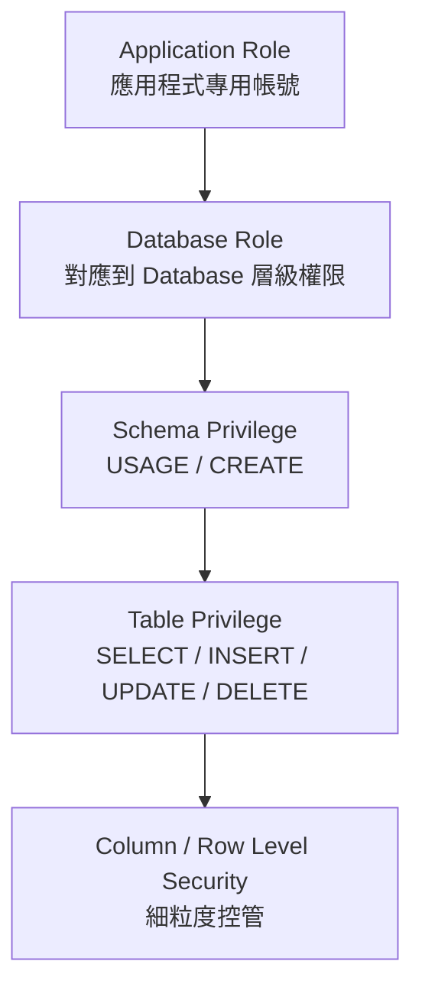

```sql
-- 最小權限原則範例：應用程式帳號只給實際需要的權限
CREATE ROLE app_service LOGIN PASSWORD 'use-a-secret-manager-generated-value';
GRANT CONNECT ON DATABASE appdb TO app_service;
GRANT USAGE ON SCHEMA app TO app_service;
GRANT SELECT, INSERT, UPDATE, DELETE ON ALL TABLES IN SCHEMA app TO app_service;

-- Row Level Security：限制每個租戶只能看到自己的資料
ALTER TABLE app.orders ENABLE ROW LEVEL SECURITY;
CREATE POLICY tenant_isolation ON app.orders
  USING (tenant_id = current_setting('app.current_tenant')::uuid);
```

### 10.3 Least Privilege 與 Separation of Duties

| 原則 | 實務做法 |
|---|---|
| **Least Privilege（最小權限）** | 應用程式帳號絕不使用 Superuser；依功能拆分 Read-only／Read-write 帳號 |
| **Separation of Duties（職責分離）** | DBA 帳號與應用程式帳號分開；Migration 執行帳號與日常查詢帳號分開 |
| **Secret Management** | 密碼存放於 Vault／雲端密鑰服務，不寫入設定檔或 Git |
| **Password Rotation** | 定期輪替，搭配應用程式的連線池支援無停機換密碼 |
| **TLS** | 內網之間的連線也建議啟用 TLS（`ssl = on`），尤其是跨可用區/資料中心的複寫流量 |
| **Audit** | 搭配 `pgaudit` 擴充套件記錄誰在何時對哪些資料表做了什麼操作 |

### 10.4 SQL Injection 與 Parameterized Query

```java
// ❌ 錯誤：字串拼接，SQL Injection 風險
String sql = "SELECT * FROM customer WHERE name = '" + userInput + "'";

// ✅ 正確：Parameterized Query，交給 Driver / JPA 處理跳脫
String sql = "SELECT * FROM customer WHERE name = ?";
PreparedStatement ps = connection.prepareStatement(sql);
ps.setString(1, userInput);
```

PostgreSQL 本身不會替你避免 SQL Injection——這是應用層的責任。任何直接把使用者輸入拼接進 SQL 字串的程式碼，無論是傳統後端或 AI Agent 產生的程式碼，都必須視為高風險並在 Code Review 中攔截（延伸見第46章 AI Agent SQL 安全分級）。

### 本章重點

1. `pg_hba.conf` 由上而下比對，規則順序本身就是安全設計的一部分。
2. 企業安全模型是一條鏈：Role → Database → Schema → Table → Row/Column，每一層都要遵守最小權限。
3. SQL Injection 防護是應用層責任，Parameterized Query 是唯一可靠的做法，不論程式碼由人或 AI Agent 撰寫。

[↑ 回目錄](#-目錄)

---

## 第11章 Database／Schema／Role 設計

### 11.1 三層次概念釐清

| 概念 | 說明 |
|---|---|
| **Database** | 最外層容器，一個 PostgreSQL 叢集（Cluster）可包含多個 Database，彼此完全隔離（無法跨 Database 直接 Join） |
| **Schema** | Database 內的命名空間，用於邏輯分組資料表（如 `app`、`audit`、`reporting`） |
| **Role** | 兼具「使用者」與「群組」概念，可 `LOGIN`（作為使用者）或不可登入（作為權限群組） |

### 11.2 Enterprise Role Model 範例

```sql
BEGIN;

-- 建立資料庫與 Schema
CREATE DATABASE appdb;
\c appdb
CREATE SCHEMA app;
CREATE SCHEMA audit;

-- 建立「權限群組」角色（不可登入，僅作為權限容器）
CREATE ROLE app_readonly NOLOGIN;
CREATE ROLE app_readwrite NOLOGIN;

GRANT USAGE ON SCHEMA app TO app_readonly, app_readwrite;
GRANT SELECT ON ALL TABLES IN SCHEMA app TO app_readonly;
GRANT SELECT, INSERT, UPDATE, DELETE ON ALL TABLES IN SCHEMA app TO app_readwrite;

-- 未來新建的資料表自動套用權限（避免每次手動 GRANT）
ALTER DEFAULT PRIVILEGES IN SCHEMA app
  GRANT SELECT ON TABLES TO app_readonly;
ALTER DEFAULT PRIVILEGES IN SCHEMA app
  GRANT SELECT, INSERT, UPDATE, DELETE ON TABLES TO app_readwrite;

-- 建立實際登入帳號，繼承群組權限
CREATE ROLE svc_reporting LOGIN PASSWORD 'from-secret-manager' IN ROLE app_readonly;
CREATE ROLE svc_backend LOGIN PASSWORD 'from-secret-manager' IN ROLE app_readwrite;

COMMIT;
```

### 11.3 常見反模式

| 反模式 | 問題 | 正確做法 |
|---|---|---|
| 所有應用程式共用 `postgres` 超級使用者連線 | 無法追蹤誰做了什麼、無法個別撤權 | 每個服務／用途建立獨立 Role |
| 直接對登入帳號逐一 `GRANT`，不透過群組角色 | 帳號一多，權限管理難以稽核 | 用 `NOLOGIN` 角色作為權限模板，登入帳號繼承角色 |
| 忘記設定 `ALTER DEFAULT PRIVILEGES` | 新建資料表預設沒有給群組權限，應用程式頻繁出現權限錯誤 | 專案初期就設定好 Default Privileges |

### 本章重點

1. Database 是硬隔離邊界，Schema 是邏輯分組，Role 兼具使用者與群組兩種型態。
2. 建議用 `NOLOGIN` 角色作為權限模板，登入帳號透過 `IN ROLE` 繼承，權限異動只需改模板角色。
3. `ALTER DEFAULT PRIVILEGES` 是常被忽略但非常關鍵的設定，避免「新資料表沒權限」的低級問題。

[↑ 回目錄](#-目錄)

---

## 第12章 SQL 基礎語法

### 12.1 基本 CRUD

```sql
-- SELECT
SELECT customer_id, customer_name, created_at
FROM app.customer
WHERE status = 'active'
ORDER BY created_at DESC
LIMIT 20 OFFSET 0;

-- INSERT
INSERT INTO app.customer (customer_name, status)
VALUES ('Acme Corp', 'active')
RETURNING customer_id;

-- UPDATE（Production 建議先 SELECT 確認範圍再 UPDATE）
BEGIN;
SELECT count(*) FROM app.customer WHERE status = 'pending' AND created_at < now() - interval '30 days';
UPDATE app.customer
SET status = 'expired'
WHERE status = 'pending' AND created_at < now() - interval '30 days';
COMMIT;

-- DELETE（同樣先確認範圍）
BEGIN;
SELECT count(*) FROM app.customer WHERE status = 'expired' AND created_at < now() - interval '1 year';
DELETE FROM app.customer
WHERE status = 'expired' AND created_at < now() - interval '1 year';
COMMIT;
```

> **Production destructive operation 必須經過審核、Backup / Recovery Strategy 與 Change Management。** 本章所有 UPDATE/DELETE 範例皆先用 SELECT 驗證影響範圍，這是實務上避免「誤刪整張表」最基本也最有效的習慣。

### 12.2 MERGE（PostgreSQL 15+）

```sql
MERGE INTO app.inventory AS target
USING app.inventory_staging AS source
ON target.sku = source.sku
WHEN MATCHED THEN
  UPDATE SET quantity = source.quantity, updated_at = now()
WHEN NOT MATCHED THEN
  INSERT (sku, quantity, updated_at)
  VALUES (source.sku, source.quantity, now());
```

### 12.3 JOIN / GROUP BY / HAVING

```sql
SELECT c.customer_name, count(o.order_id) AS order_count, sum(o.total_amount) AS total_spent
FROM app.customer c
LEFT JOIN app.orders o ON o.customer_id = c.customer_id
GROUP BY c.customer_name
HAVING count(o.order_id) > 5
ORDER BY total_spent DESC;
```

### 12.4 CTE 與 Recursive CTE

```sql
-- 一般 CTE：拆解複雜查詢，提升可讀性
WITH active_customers AS (
  SELECT customer_id, customer_name FROM app.customer WHERE status = 'active'
),
recent_orders AS (
  SELECT customer_id, order_id, total_amount
  FROM app.orders
  WHERE order_date >= now() - interval '90 days'
)
SELECT ac.customer_name, ro.order_id, ro.total_amount
FROM active_customers ac
JOIN recent_orders ro ON ro.customer_id = ac.customer_id;

-- Recursive CTE：組織架構、分類樹等階層資料的標準做法
WITH RECURSIVE org_tree AS (
  SELECT employee_id, manager_id, employee_name, 1 AS level
  FROM app.employee
  WHERE manager_id IS NULL
  UNION ALL
  SELECT e.employee_id, e.manager_id, e.employee_name, ot.level + 1
  FROM app.employee e
  JOIN org_tree ot ON e.manager_id = ot.employee_id
)
SELECT * FROM org_tree ORDER BY level, employee_id;
```

### 12.5 Window Function

```sql
SELECT
  order_id,
  customer_id,
  total_amount,
  row_number() OVER (PARTITION BY customer_id ORDER BY order_date DESC) AS rn,
  sum(total_amount) OVER (PARTITION BY customer_id) AS customer_total
FROM app.orders;
```

### 12.6 集合運算與子查詢

```sql
-- UNION / INTERSECT / EXCEPT
SELECT customer_id FROM app.vip_customer
EXCEPT
SELECT customer_id FROM app.churned_customer;

-- EXISTS 通常比 IN 對大表更有效率（Planner 可及早短路）
SELECT c.customer_id, c.customer_name
FROM app.customer c
WHERE EXISTS (
  SELECT 1 FROM app.orders o WHERE o.customer_id = c.customer_id
);
```

### 本章重點

1. UPDATE/DELETE 前先用對應條件 SELECT 驗證影響範圍，是最基本也最重要的 Production 習慣。
2. Recursive CTE 是處理階層資料（組織架構、分類樹、依賴關係）的標準工具，不需要在應用層手刻遞迴查詢。
3. Window Function 能在同一次查詢內同時取得明細與彙總，比額外的子查詢／應用層計算更有效率。

[↑ 回目錄](#-目錄)

---

## 第13章 PostgreSQL Data Types

### 13.1 數值型別

| 型別 | 大小 | 說明 |
|---|---|---|
| `smallint` | 2 bytes | -32768 ~ 32767 |
| `integer` | 4 bytes | 一般整數，常用於 ID（搭配 `GENERATED ALWAYS AS IDENTITY`） |
| `bigint` | 8 bytes | 大範圍整數，高流量系統的自增 ID 建議直接用 bigint 避免日後溢位遷移 |
| `numeric(p,s)` / `decimal(p,s)` | 變動 | **精確**十進位數值，金融金額欄位必須使用 |
| `real` / `double precision` | 4／8 bytes | 浮點數，**有精度誤差**，不可用於金額計算 |

### 13.2 numeric vs floating point：金融系統的第一課

```sql
-- ❌ 錯誤：浮點數的精度誤差在金額計算中會累積成真實的金錢損失
SELECT 0.1::double precision + 0.2::double precision; -- 結果不精確等於 0.3

-- ✅ 正確：金額欄位一律使用 numeric，並明確指定精度與小數位數
CREATE TABLE app.ledger (
  entry_id    bigint GENERATED ALWAYS AS IDENTITY PRIMARY KEY,
  amount      numeric(18, 2) NOT NULL,
  currency    char(3) NOT NULL
);
```

> **企業金融系統原則**：任何代表金錢的欄位（金額、匯率、利率）一律使用 `numeric`，絕不使用 `real`/`double precision`。`numeric` 的效能成本相對浮點數略高，但這是正確性換取效能的必要取捨。

### 13.3 timestamp vs timestamptz

```sql
CREATE TABLE app.audit_log (
  event_id    bigint GENERATED ALWAYS AS IDENTITY PRIMARY KEY,
  occurred_at timestamptz NOT NULL DEFAULT now(),  -- ✅ 建議：儲存時區資訊
  legacy_time timestamp                             -- ⚠️ 無時區資訊，容易在跨時區系統產生錯誤
);
```

| 型別 | 行為 |
|---|---|
| `timestamp`（`timestamp without time zone`） | 純粹儲存「看起來的時間」，**不帶時區資訊**，同一個值在不同時區的應用程式解讀會不一致 |
| `timestamptz`（`timestamp with time zone`） | 內部以 UTC 儲存，輸出時依連線的 `TimeZone` 設定轉換顯示；**企業系統的預設建議** |

> **Best Practice**：除非有明確理由（例如儲存「使用者本地時鐘上顯示的時間，不隨時區轉換」的特殊需求），一律使用 `timestamptz`，並讓應用層負責顯示時的時區轉換。

### 13.4 json vs jsonb

| 型別 | 儲存方式 | 索引 | 適用情境 |
|---|---|---|---|
| `json` | 儲存原始文字，保留欄位順序與重複鍵 | 不支援 GIN 索引 | 需要保留原始輸入格式（如稽核用途） |
| `jsonb` | 二進位格式，正規化儲存 | 支援 GIN 索引，查詢效能佳 | 絕大多數應用情境的預設選擇 |

```sql
CREATE TABLE app.event_log (
  event_id   bigint GENERATED ALWAYS AS IDENTITY PRIMARY KEY,
  payload    jsonb NOT NULL,
  created_at timestamptz NOT NULL DEFAULT now()
);
CREATE INDEX idx_event_log_payload ON app.event_log USING gin (payload);

-- JSONB 查詢範例
SELECT * FROM app.event_log WHERE payload @> '{"event_type": "order_created"}';
SELECT payload ->> 'order_id' AS order_id FROM app.event_log WHERE payload ->> 'event_type' = 'order_created';
```

### 13.5 其他重要型別

| 型別 | 用途 |
|---|---|
| `uuid` | 分散式系統常用主鍵型別，避免自增 ID 洩漏業務量資訊；搭配 `gen_random_uuid()`（`pgcrypto`） |
| `array` | 單一欄位儲存陣列，如 `text[]`、`integer[]`；適度使用，避免濫用取代正規化資料表 |
| `enum` | 固定選項集合（如訂單狀態），比 `varchar` + `CHECK` 更緊湊，但**修改選項需要 `ALTER TYPE`，較不彈性** |
| `range` / `multirange` | 時間區間、數值區間，搭配 GiST 索引可高效處理區間重疊查詢（如訂房系統） |
| `domain` | 對既有型別加上驗證規則的自訂型別，如 `CREATE DOMAIN email AS text CHECK (VALUE ~ '^[^@]+@[^@]+$')` |
| `composite type` | 自訂複合型別，可作為欄位型別或函式回傳型別 |

### 本章重點

1. 金額一律用 `numeric`，時間一律優先用 `timestamptz`——這兩條是企業系統資料型別選型最容易出錯也最不能出錯的地方。
2. `jsonb` 是絕大多數半結構化資料的預設選擇，`json` 僅在需要保留原始格式時使用。
3. `enum` 提供緊湊儲存但犧牲彈性，選項會頻繁變動的欄位建議改用 `varchar` + 對照表或 `CHECK` 約束。

[↑ 回目錄](#-目錄)

---

## 第14章 Table Design 與正規化

### 14.1 完整性約束

```sql
CREATE TABLE app.orders (
  order_id     bigint GENERATED ALWAYS AS IDENTITY PRIMARY KEY,
  customer_id  bigint NOT NULL REFERENCES app.customer(customer_id),
  order_no     varchar(32) NOT NULL UNIQUE,
  total_amount numeric(18,2) NOT NULL CHECK (total_amount >= 0),
  status       varchar(20) NOT NULL DEFAULT 'pending',
  order_date   timestamptz NOT NULL DEFAULT now(),
  tax_amount   numeric(18,2) GENERATED ALWAYS AS (total_amount * 0.05) STORED
);
```

| 約束 | 作用 |
|---|---|
| `PRIMARY KEY` | 唯一識別 + 自動建立唯一索引 |
| `FOREIGN KEY`（`REFERENCES`） | 保證關聯資料存在，避免孤兒資料列 |
| `UNIQUE` | 欄位或欄位組合不可重複 |
| `NOT NULL` | 禁止空值 |
| `CHECK` | 自訂驗證邏輯，於資料庫層強制業務規則 |
| `DEFAULT` | 未指定值時的預設值 |
| `GENERATED ALWAYS AS IDENTITY` | 現代寫法的自增主鍵，取代舊式 `SERIAL` |
| `GENERATED ALWAYS AS (...) STORED` | 產生型欄位，依其他欄位自動計算並實際儲存 |

### 14.2 正規化層級快速回顧

| 正規化 | 規則 | 企業案例 |
|---|---|---|
| **1NF** | 每個欄位是原子值，不重複群組 | 客戶電話不應存成 `"0912,0913,0914"`，應拆成獨立資料表 |
| **2NF** | 符合 1NF，且非主鍵欄位完全依賴整個主鍵 | 訂單明細表若以 `(order_id, product_id)` 為複合主鍵，`product_name` 不應直接存在明細表（應查 `product` 表） |
| **3NF** | 符合 2NF，且非主鍵欄位不依賴其他非主鍵欄位（消除遞移依賴） | `customer` 表存 `city`，`city` 又決定 `region`，`region` 應獨立成表或改用外鍵，而非在 customer 表重複存 |
| **BCNF** | 更嚴格版本的 3NF，處理特殊的多重候選鍵情境 | 課程排課系統：教師、教室、時段三者的候選鍵重疊時需特別設計 |

### 14.3 何時該刻意反正規化（Denormalization）

```sql
-- 反正規化範例：報表用的彙總欄位，犧牲一致性風險換取查詢效能
ALTER TABLE app.customer ADD COLUMN total_order_amount numeric(18,2) DEFAULT 0;
-- 需搭配 Trigger 或排程 Job 維護一致性，並在文件中明確記載此欄位為「衍生資料」
```

反正規化不是原罪，但**必須是刻意的決策並有配套機制**（Trigger／排程／CDC 保持同步），而不是因為「懶得 Join」而複製資料。

### 本章重點

1. 資料庫層的約束（FK/CHECK/UNIQUE）是資料完整性的最後一道防線，不能只靠應用層驗證。
2. 正規化到 3NF 是多數 OLTP 系統的合理預設，反正規化必須是有配套維護機制的刻意決策。
3. `GENERATED ALWAYS AS IDENTITY` 是目前建議的自增主鍵寫法，新專案不建議再用舊式 `SERIAL`。

[↑ 回目錄](#-目錄)

---

## 第15章 Index 設計與應用

### 15.1 索引類型總覽

| 索引類型 | 適用場景 |
|---|---|
| **B-tree**（預設） | 等值查詢、範圍查詢、排序，絕大多數情境的預設選擇 |
| **Hash** | 純等值查詢（`=`），現代 PostgreSQL 已具 WAL 記錄可安全用於複寫，但適用面遠窄於 B-tree |
| **GiST** | 幾何資料、範圍型別（`range`）、全文檢索的其中一種實作、PostGIS 空間索引 |
| **SP-GiST** | 非平衡樹狀資料，如電話號碼前綴、IP 位址範圍 |
| **GIN** | 多值欄位：`jsonb`、`array`、全文檢索 `tsvector`（查詢快、寫入相對慢） |
| **BRIN** | 資料實體儲存順序與邏輯順序高度相關的超大型資料表（如依時間遞增寫入的 Log 表），索引體積極小 |

### 15.2 進階索引技巧

```sql
-- Composite Index：多欄位查詢，欄位順序影響能否被使用
CREATE INDEX idx_orders_customer_date ON app.orders (customer_id, order_date DESC);

-- Partial Index：只索引常查詢的子集合，縮小索引體積、加快維護速度
CREATE INDEX idx_orders_pending ON app.orders (order_date) WHERE status = 'pending';

-- Expression Index：索引運算後的值
CREATE INDEX idx_customer_email_lower ON app.customer (lower(email));

-- Covering Index（INCLUDE）：讓查詢可以只靠索引回傳，不需回表（Index Only Scan）
CREATE INDEX idx_orders_covering ON app.orders (customer_id) INCLUDE (order_date, total_amount);
```

### 15.3 用 EXPLAIN ANALYZE 驗證索引是否被使用

```sql
EXPLAIN (ANALYZE, BUFFERS)
SELECT order_id, order_date, total_amount
FROM app.orders
WHERE customer_id = 12345
ORDER BY order_date DESC
LIMIT 10;
```

```text
Limit  (cost=0.42..8.86 rows=10 width=24) (actual time=0.03..0.05 rows=10 loops=1)
  ->  Index Scan using idx_orders_customer_date on orders
        (cost=0.42..120.30 rows=142 width=24) (actual time=0.03..0.04 rows=10 loops=1)
        Index Cond: (customer_id = 12345)
Planning Time: 0.15 ms
Execution Time: 0.08 ms
```

- `Index Scan` 表示索引被使用；若看到 `Seq Scan` 掃描整張大表卻預期應該走索引，通常代表：索引不存在、統計資訊過期、或 Planner 判斷 Seq Scan 成本更低（例如查詢會回傳表中大比例的資料列）。
- `Index Only Scan` 代表完全不需回表，是效能最佳的情境，通常需要 Covering Index（`INCLUDE`）配合。

### 15.4 常見錯誤

| 錯誤 | 說明 |
|---|---|
| **不要盲目增加 Index** | 每個索引都會拖慢 INSERT/UPDATE/DELETE，並占用儲存與維護成本；先用 `pg_stat_user_indexes` 確認索引是否真的被使用 |
| Composite Index 欄位順序錯誤 | `(a, b)` 的索引可以支援「只查 a」或「查 a 且 b」，但無法有效支援「只查 b」 |
| 對低基數（Low Cardinality）欄位建 B-tree | 如 `status`（僅幾種值）單獨建索引效益有限，通常要搭配其他高選擇性欄位組成 Composite Index，或改用 Partial Index |

```sql
-- 找出從未被使用的索引（定期檢視候選刪除清單）
SELECT schemaname, relname, indexrelname, idx_scan
FROM pg_stat_user_indexes
WHERE idx_scan = 0
ORDER BY relname;
```

### 本章重點

1. B-tree 是預設且涵蓋面最廣的索引類型，GIN／BRIN／GiST 是針對特定資料型態的專門優化。
2. 索引不是越多越好，每個索引都是「查詢加速」與「寫入/儲存成本」的取捨，需定期用 `pg_stat_user_indexes` 檢視使用率。
3. `EXPLAIN (ANALYZE, BUFFERS)` 是驗證索引是否生效的標準工具，永遠不要憑感覺猜測執行計畫。

[↑ 回目錄](#-目錄)

---

## 第16章 Query Planner／Optimizer 與 EXPLAIN

### 16.1 Cost-Based Optimizer 的運作原理

PostgreSQL 的 Planner 是 **Cost-Based**：它依據 `pg_statistic`（由 `ANALYZE` 收集）中的資料分布統計，估算每種可能執行路徑（Seq Scan、Index Scan、Bitmap Scan、各種 Join 演算法）的成本，選出**估計成本最低**的方案——**不是最快，而是「估計」最快**，這就是為何統計資訊準確度直接影響查詢效能。

| 概念 | 說明 |
|---|---|
| **Selectivity（選擇性）** | 某個條件會篩選掉多少比例的資料列，選擇性越高（篩掉越多），Index Scan 越有利 |
| **Cardinality（基數）** | 預估回傳的資料列數，是所有成本估算的基礎輸入 |
| **Cost Model** | 由 `seq_page_cost`、`random_page_cost`、`cpu_tuple_cost` 等參數組成的成本函數 |

### 16.2 常見 Join 策略

| Join 策略 | 適用情境 |
|---|---|
| **Nested Loop** | 其中一側資料量很小（尤其有索引可用時）效率最高 |
| **Hash Join** | 兩側資料量都較大、且無合適索引時，PostgreSQL 常見預設策略 |
| **Merge Join** | 兩側資料已排序（或排序成本可接受）時具優勢，常見於已依 Join Key 建索引的情境 |

### 16.3 掃描策略

```text
Seq Scan      —— 全表掃描，資料量小或篩選比例低時反而是最優解
Index Scan    —— 依索引逐筆定位並回表取得完整資料列
Bitmap Scan   —— 先收集符合條件的頁面位置成 Bitmap，再批次讀取，適合中等選擇性的查詢
```

### 16.4 閱讀 EXPLAIN ANALYZE 的實務技巧

```sql
EXPLAIN (ANALYZE, BUFFERS, FORMAT TEXT)
SELECT c.customer_name, sum(o.total_amount)
FROM app.customer c
JOIN app.orders o ON o.customer_id = c.customer_id
WHERE o.order_date >= now() - interval '30 days'
GROUP BY c.customer_name;
```

閱讀順序建議：

1. **由內而外、由下而上**看 Plan Tree，最底層節點先執行
2. 比對 `estimated rows`（Planner 預估）與 `actual rows`（實際回傳），**差距過大**（例如預估 10 筆、實際 10 萬筆）通常代表統計資訊過期，需要 `ANALYZE`
3. 注意 `Execution Time` 與各節點的 `actual time`，找出耗時最高的節點
4. `BUFFERS` 選項可看出 Cache Hit（`shared hit`）與實際磁碟讀取（`shared read`）的比例

### 16.5 Parallel Query、Memoize、Incremental Sort

- **Parallel Query**：大型 Seq Scan／Aggregate 可由多個 Worker 平行處理，受 `max_parallel_workers_per_gather` 等參數控制。
- **Memoize**：對重複出現的 Join Key 快取結果，避免 Nested Loop 對相同的內側查詢重複執行。
- **Incremental Sort**：當資料已依部分排序鍵排序時，只需針對剩餘鍵做局部排序，減少整體排序成本。

### 本章重點

1. Planner 的所有決策都建立在統計資訊之上，`estimated rows` 與 `actual rows` 差距過大是最重要的排查訊號。
2. 沒有「最好的 Join 策略」，只有「適合該資料分布與資料量的策略」——這也是為何同一條 SQL 在不同資料量下可能走完全不同的執行計畫。
3. 效能調校永遠從 `EXPLAIN ANALYZE` 的實際數據出發，禁止憑經驗法則臆測（詳見第24章方法論）。

[↑ 回目錄](#-目錄)

---

## 第17章 Transaction／MVCC／Concurrency

### 17.1 ACID 與 MVCC 的關係

MVCC（Multi-Version Concurrency Control，多版本併發控制）讓 PostgreSQL 得以實現「讀不阻塞寫、寫不阻塞讀」：每次 `UPDATE` 並非覆寫原資料列，而是**產生新版本**，舊版本依交易可見性規則保留一段時間（直到 VACUUM 回收，見第18章）。每個交易看到的是一份基於其 **Snapshot** 的一致資料視圖。

### 17.2 四種隔離等級

```sql
BEGIN ISOLATION LEVEL READ COMMITTED;   -- PostgreSQL 預設
BEGIN ISOLATION LEVEL REPEATABLE READ;
BEGIN ISOLATION LEVEL SERIALIZABLE;
```

| 隔離等級 | 可能發生的異常 | 說明 |
|---|---|---|
| **Read Committed**（預設） | Non-repeatable Read | 每個陳述式（Statement）看到執行當下最新已提交的資料，同一交易內兩次查詢可能看到不同結果 |
| **Repeatable Read** | Phantom Read（PostgreSQL 實作下已大幅緩解，但仍可能出現序列化異常） | 整個交易期間看到的是交易開始時的一致快照 |
| **Serializable** | 無（但可能出現 Serialization Failure 需要應用層重試） | 最嚴格等級，PostgreSQL 以 SSI（Serializable Snapshot Isolation）實作，效能成本最高 |

> PostgreSQL **沒有 Dirty Read**（讀到未提交資料）這個問題，即使在最低的 Read Committed 等級也不會發生——這是與部分其他資料庫預設行為的重要差異。

### 17.3 Deadlock 實務案例

```text
Transaction A:                    Transaction B:
UPDATE accounts                   UPDATE accounts
  SET balance = balance - 100       SET balance = balance - 50
  WHERE account_id = 1;             WHERE account_id = 2;
-- 持有 account_id=1 的鎖            -- 持有 account_id=2 的鎖

UPDATE accounts                   UPDATE accounts
  SET balance = balance + 100       SET balance = balance + 50
  WHERE account_id = 2;             WHERE account_id = 1;
-- 等待 A 釋放 account_id=2         -- 等待 B 釋放 account_id=1
-- ⇒ Deadlock，PostgreSQL 會自動偵測並終止其中一個交易
```

**預防方式**：確保所有交易以**一致的順序**存取資源（例如永遠先鎖 `account_id` 較小的那筆）。

```sql
-- 診斷目前的鎖等待狀況
SELECT
  blocked_locks.pid AS blocked_pid,
  blocking_locks.pid AS blocking_pid,
  blocked_activity.query AS blocked_query,
  blocking_activity.query AS blocking_query
FROM pg_catalog.pg_locks blocked_locks
JOIN pg_catalog.pg_locks blocking_locks
  ON blocking_locks.locktype = blocked_locks.locktype
  AND blocking_locks.database IS NOT DISTINCT FROM blocked_locks.database
  AND blocking_locks.relation IS NOT DISTINCT FROM blocked_locks.relation
  AND blocking_locks.pid != blocked_locks.pid
JOIN pg_catalog.pg_stat_activity blocked_activity ON blocked_activity.pid = blocked_locks.pid
JOIN pg_catalog.pg_stat_activity blocking_activity ON blocking_activity.pid = blocking_locks.pid
WHERE NOT blocked_locks.granted;
```

### 17.4 Blocking vs Deadlock

- **Blocking**：交易 B 等待交易 A 釋放鎖，屬正常現象，只要 A 最終會提交/回滾即可解決；長時間 Blocking 通常是「交易開太久沒提交」造成。
- **Deadlock**：兩個以上交易互相等待對方釋放鎖，形成循環，PostgreSQL 會自動偵測並終止其中一方（回傳 `deadlock detected` 錯誤），應用層需要有重試邏輯。

### 本章重點

1. MVCC 是 PostgreSQL 高併發能力的根本機制，理解「讀寫互不阻塞」背後是「多版本」而非「鎖免除」。
2. Read Committed 是預設且多數應用場景足夠，Serializable 提供最強保證但需要應用層處理重試。
3. Deadlock 無法完全避免，但可透過「一致的資源存取順序」大幅降低發生機率；應用層必須對 `deadlock detected` 有重試機制。

[↑ 回目錄](#-目錄)

---

## 第18章 VACUUM／Autovacuum／REPACK

### 18.1 為什麼需要 VACUUM

MVCC 的代價是：`UPDATE`／`DELETE` 產生的舊版本資料列（**Dead Tuple**）不會立刻消失，需要 `VACUUM` 回收。長期不清理會導致：

- **Table／Index Bloat（膨脹）**：實際占用空間遠大於有效資料量，拖慢掃描與 I/O
- **Transaction ID Wraparound**：PostgreSQL 的交易 ID 是有限範圍的循環計數器，若長期不 `VACUUM` FREEZE，理論上可能面臨 ID 回繞風險（現代版本有多重保護機制會提前警告甚至強制唯讀，但這是**必須主動避免**、不是「順其自然」的風險）

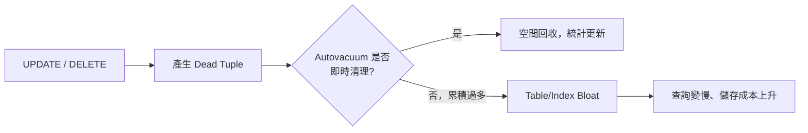

### 18.2 VACUUM 的幾種型態

```sql
VACUUM app.orders;                 -- 標準 VACUUM：回收空間供重複使用，不釋放給作業系統，不阻塞讀寫
VACUUM (VERBOSE, ANALYZE) app.orders;  -- 同時更新統計資訊，並輸出詳細進度
VACUUM FULL app.orders;            -- 重建整張表，實際釋放磁碟空間，但需要 ACCESS EXCLUSIVE 鎖，會阻塞讀寫
ANALYZE app.orders;                -- 僅更新統計資訊，不回收空間
```

> **PostgreSQL 19（Beta）新增 `REPACK`**：`REPACK app.orders;` 可達到接近 `VACUUM FULL` 的空間回收效果，搭配 `REPACK (CONCURRENTLY) app.orders;` 可在不長期鎖表的情況下完成，是取代第三方 `pg_repack` 擴充套件的原生方案。GA 前語法仍可能微調，正式導入前請確認當時官方文件。

### 18.3 Autovacuum 調校

```sql
-- 全域參數（postgresql.conf）
-- autovacuum = on
-- autovacuum_vacuum_scale_factor = 0.2   -- 預設：Dead Tuple 超過 20% 才觸發，大表可能過於保守
-- autovacuum_vacuum_cost_delay = 2ms

-- 針對特定大表（高頻寫入）調整更積極的觸發門檻
ALTER TABLE app.orders SET (
  autovacuum_vacuum_scale_factor = 0.05,
  autovacuum_vacuum_cost_delay = 0
);
```

> PostgreSQL 19（Beta）引入 **Parallel Autovacuum**（伺服器層級 `autovacuum_max_parallel_workers`、資料表層級 `autovacuum_parallel_workers`，允許索引清理平行化）與 **Scoring 系統**（由 `autovacuum_vacuum_score_weight`、`autovacuum_vacuum_insert_score_weight`、`autovacuum_analyze_score_weight`、`autovacuum_freeze_score_weight`、`autovacuum_multixact_freeze_score_weight` 五個權重參數共同決定優先處理哪些資料表，決策依據可透過新視圖 `pg_stat_autovacuum_scores` 查詢），目標是解決「大量資料表競爭同一批 Autovacuum Worker」的排隊問題。GA 前建議先在測試環境驗證對 CPU 使用率的影響（詳見第2章 2.2.4）。

### 18.4 DBA 維護策略

| 情境 | 建議做法 |
|---|---|
| 高頻寫入的大表持續膨脹 | 調低該表的 `autovacuum_vacuum_scale_factor`，讓 Autovacuum 更積極介入，而非依賴手動 VACUUM |
| 需要真正釋放磁碟空間 | 評估用 `REPACK CONCURRENTLY`（19+）或維護窗口內執行 `VACUUM FULL` |
| 交易 ID 逼近 Wraparound 警告值 | 立即排查是否有長時間未提交的交易或閒置的 Prepared Transaction 阻擋 Autovacuum 的 FREEZE 進度 |
| 監控 Dead Tuple 比例 | 定期查詢 `pg_stat_user_tables` 的 `n_dead_tup` / `n_live_tup` |

```sql
SELECT relname, n_live_tup, n_dead_tup,
       round(n_dead_tup::numeric / NULLIF(n_live_tup, 0) * 100, 2) AS dead_ratio_pct,
       last_autovacuum
FROM pg_stat_user_tables
ORDER BY n_dead_tup DESC
LIMIT 20;
```

### 本章重點

1. VACUUM 不是「錦上添花」的維護，而是 MVCC 機制正常運作的必要條件，長期忽視會導致 Bloat 甚至 Wraparound 風險。
2. `VACUUM FULL` 會鎖表，Production 環境優先評估 PostgreSQL 19 的 `REPACK CONCURRENTLY` 或維護窗口執行。
3. 大表建議個別調整 Autovacuum 觸發門檻，不要只依賴全域預設值。

[↑ 回目錄](#-目錄)

---

## 第19章 WAL（Write-Ahead Logging）

### 19.1 核心概念

**Write-Ahead Logging（預寫日誌）**：任何資料變更必須先寫入 WAL 並確保落盤，才能回報交易提交成功——即使資料檔案本身的變更尚未寫回磁碟，也能透過 WAL 在當機後重建。這是 PostgreSQL 達成 **Durability（持久性）** 的核心機制。

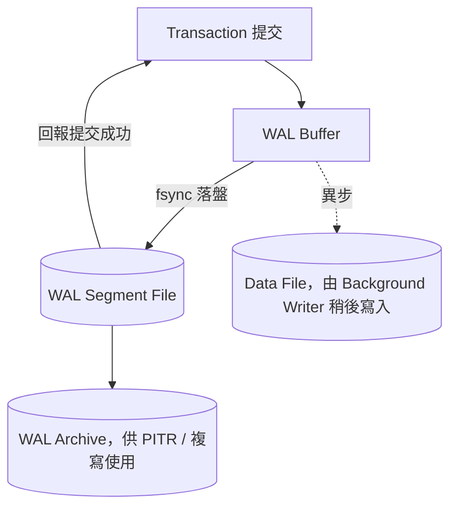

### 19.2 Checkpoint 的角色

Checkpoint 會將目前 Shared Buffers 中所有 Dirty Page 強制寫入資料檔案，並記錄一個「此時間點之前的資料都已落盤」的標記——**Crash Recovery 只需要重播 Checkpoint 之後的 WAL**，而不必從資料庫建立之初開始重播。`checkpoint_timeout` 與 `max_wal_size` 共同控制 Checkpoint 頻率：頻率太低會拉長 Recovery 時間，頻率太高會增加 I/O 負擔（Full Page Write 的成本）。

### 19.3 Point-in-Time Recovery（PITR）概念

```text
Base Backup（某時間點的完整快照）
        |
        v
   WAL Archive（持續累積的異動紀錄）
        |
        v
還原至 Base Backup ──重播 WAL 至指定時間點── 任意精確到秒的還原點
```

PITR 讓企業可以還原到「誤刪資料發生前一秒」，而不只是還原到最近一次的每日備份——這是第20章 Backup／Restore 與第55章 Disaster Recovery 的技術基礎。

### 本章重點

1. WAL 是 PostgreSQL Durability 的根本機制：先寫日誌、後寫資料，當機也不遺失已提交的交易。
2. Checkpoint 頻率是「Recovery 時間」與「日常 I/O 負擔」的取捨，需依 RTO 要求與硬體條件調校。
3. WAL Archive 是 PITR 與複寫（Streaming／Logical Replication）共同的基礎設施，備份策略設計必須將其納入考量。

[↑ 回目錄](#-目錄)

---

## 第20章 Backup／Restore

### 20.1 邏輯備份 vs 實體備份

| 類型 | 工具 | 特性 |
|---|---|---|
| **邏輯備份** | `pg_dump` / `pg_dumpall` | 匯出 SQL 或自訂格式，可跨版本、跨平台還原；還原速度較慢（需重建索引等） |
| **實體備份** | `pg_basebackup` + WAL Archive | 直接複製資料檔案，還原速度快，可搭配 PITR；不可跨版本 |

```bash
# 邏輯備份：單一資料庫，自訂格式（可搭配 pg_restore 的平行還原）
pg_dump -U postgres -d appdb -F c -f appdb.dump

# 邏輯備份：整個叢集（含所有 Database、Role）
pg_dumpall -U postgres -f cluster_backup.sql

# 還原
pg_restore -U postgres -d appdb_restored -j 4 appdb.dump
```

> **Production destructive operation 必須經過審核、Backup / Recovery Strategy 與 Change Management。** 任何 Restore 到既有 Database 前，務必先確認目標是全新／測試環境，避免覆蓋 Production 資料。

### 20.2 pgBackRest 與 WAL-G

企業級實體備份很少直接手刻 `pg_basebackup` + Archive 腳本，通常採用成熟工具：

| 工具 | 特色 |
|---|---|
| **pgBackRest** | 支援平行備份/還原、增量備份、備份驗證、多種 Repository（本機/S3/Azure/GCS） |
| **WAL-G** | 輕量、專注於 WAL Archive 與備份上傳至 Object Storage，常見於 Kubernetes 場景 |

### 20.3 備份方式比較

| Method | Backup Type | PITR | Large DB | Complexity |
|---|---|---|---|---|
| `pg_dump` / `pg_dumpall` | 邏輯 | 不支援 | 大型 DB 備份/還原時間長 | 低 |
| `pg_basebackup` + 手動 WAL Archive | 實體 | 支援 | 佳 | 中（需自行維護 Archive 腳本） |
| **pgBackRest** | 實體（含增量） | 支援 | 佳，專為大型 DB 設計 | 中～高（設定項多，但功能完整） |
| **WAL-G** | 實體 | 支援 | 佳 | 低～中，適合雲原生/K8s |

### 20.4 Backup 反模式

> **Backup 必須定期 Restore Test。** 「有備份」不等於「備份可用」——沒有經過還原驗證的備份，只是「看起來安心」。企業實務應定期（例如每季）於隔離環境執行完整 Restore 演練，並記錄實際還原所需時間，作為 RTO 評估依據（第54、55章延伸）。

### 本章重點

1. 邏輯備份跨版本相容性佳但還原慢，實體備份還原快且可搭配 PITR，但受限同版本；企業通常兩者並行。
2. 大型系統建議採用 pgBackRest 或 WAL-G 等成熟工具，而非自行維護 Archive 腳本。
3. 備份必須定期做 Restore Test，這是本手冊反覆強調的 Golden Rule 之一（見第69章）。

[↑ 回目錄](#-目錄)

---

## 第21章 High Availability

### 21.1 Streaming Replication 基礎

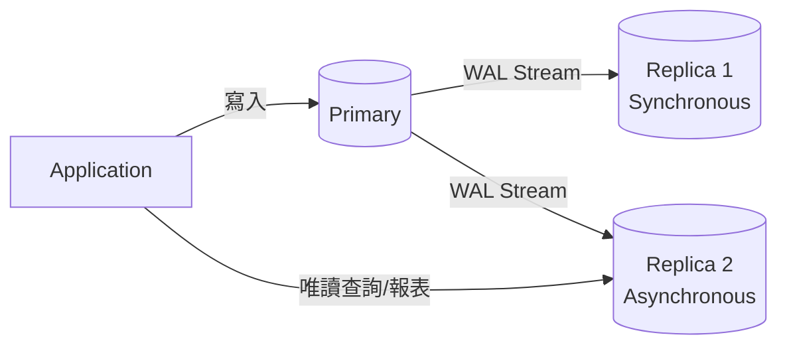

| 模式 | 說明 |
|---|---|
| **Asynchronous（非同步）** | Primary 提交交易不等待 Replica 確認，效能最佳，但 Failover 時可能遺失少量最近交易 |
| **Synchronous（同步）** | Primary 需等待至少一個 Replica 確認收到 WAL 才回報提交成功，資料零遺失但延遲增加 |

### 21.2 Failover、Switchover、Split Brain

| 概念 | 說明 |
|---|---|
| **Failover** | Primary 非計畫性故障時，將某個 Replica 提升（Promote）為新 Primary |
| **Switchover** | 計畫性維護時，人為主動將 Primary 角色轉移給 Replica |
| **Split Brain** | 舊 Primary 恢復連線後，若未正確處理，可能同時有兩個節點自認為 Primary，導致資料分歧——**這是 HA 架構設計中最需要防範的情境** |
| **Quorum** | 透過多數決機制（如 etcd／Consul）確保同一時間只有一個節點被認定為合法 Primary，是防止 Split Brain 的關鍵 |

### 21.3 完整 HA 架構

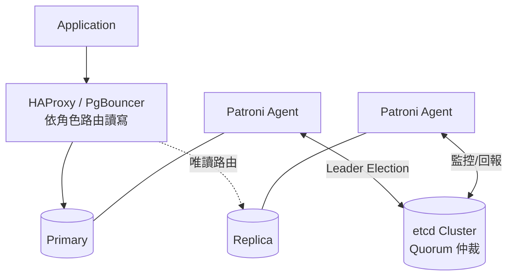

| 元件 | 角色 |
|---|---|
| **Patroni** | 監控 PostgreSQL 健康狀態，透過 etcd/Consul 等 DCS 進行 Leader Election，自動執行 Failover |
| **etcd** | 分散式一致性存放區，作為 Patroni 的 Quorum 仲裁後端 |
| **HAProxy / PgBouncer** | 依 Patroni 回報的角色狀態，將寫入導向目前的 Primary、讀取可分流至 Replica |
| **Keepalived** | 透過 VIP（Virtual IP）漂移，讓應用程式連線位址在 Failover 後保持不變（依架構選用） |

### 21.4 Replication Slot：避免 Replica 落後導致 WAL 被提前清除

```sql
-- 建立 Physical Replication Slot，確保 Primary 不會清除 Replica 尚未取走的 WAL
SELECT pg_create_physical_replication_slot('replica_1_slot');
```

> **注意事項**：Replication Slot 會讓 Primary 保留 WAL 直到對應 Replica 取走，若某個 Slot 對應的 Replica 長期離線，WAL 會持續累積直到**磁碟被塞滿**——這是實務上常見的 Production 事故，需搭配監控 `pg_replication_slots` 的 Slot 是否過期未使用。

### 本章重點

1. HA 不是「裝了 Streaming Replication 就叫高可用」，還需要 Leader Election、Quorum、自動 Failover 三者齊備才是完整方案。
2. Split Brain 是 HA 設計中最危險的失效模式，必須透過 Quorum 機制杜絕。
3. Replication Slot 提供了複寫的可靠性保障，但若疏於監控，反而可能因 WAL 累積拖垮 Primary 磁碟。

[↑ 回目錄](#-目錄)

---

## 第22章 Logical Replication

### 22.1 Publication / Subscription 模型

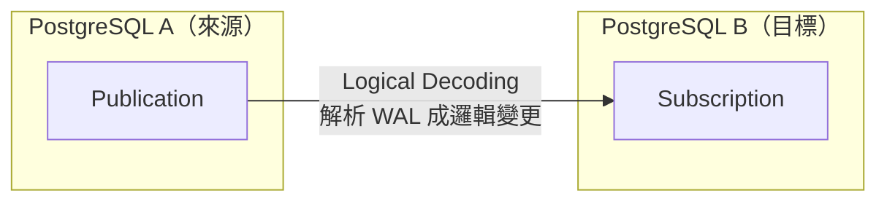

```sql
-- 來源端：建立 Publication
CREATE PUBLICATION app_orders_pub FOR TABLE app.orders, app.customer;

-- 目標端：建立 Subscription 開始同步
CREATE SUBSCRIPTION app_orders_sub
  CONNECTION 'host=source-db.internal dbname=appdb user=repl_user password=xxx'
  PUBLICATION app_orders_pub;
```

### 22.2 與 Physical Replication 的差異

| 面向 | Physical Replication | Logical Replication |
|---|---|---|
| 複寫粒度 | 整個叢集（Byte-Level WAL） | 可選特定資料表 |
| PostgreSQL 版本 | 來源與目標須相同大版本 | 可跨版本，是 Major Version Upgrade 的重要工具 |
| Schema 變更 | 自動隨 WAL 同步 | 部分 DDL 需手動於雙端執行 |
| 主要用途 | HA、Read Replica | 零/低停機升級、跨系統資料整合、CDC |

### 22.3 PostgreSQL 19（Beta）的複寫強化

- **Sequence 複寫**：過去邏輯複寫不包含 Sequence 數值，Failover/切換後常需手動校正；19 起 `CREATE/ALTER PUBLICATION ... ALL SEQUENCES` 與 `ALTER SUBSCRIPTION ... REFRESH SEQUENCES` 可原生同步。
- **`WAIT FOR`**：讓應用程式可以在 Standby／Subscriber 端等待特定 LSN 已被寫入/回放，實作「寫入後立即在複本讀到最新資料」（Read-Your-Writes）的模式，緩解過去邏輯複寫的最終一致性痛點。
- **Publication `EXCEPT` 子句**：可用排除法定義 Publication（「除了這幾張表以外全部複寫」），大量資料表的場景不需逐一列舉。
- **`retain_dead_tuples` / `max_retention_duration`**：控制邏輯複寫衝突解決時死元組的保留時間上限，降低訂閱端長時間離線造成來源端 Bloat 的風險。
- 上述功能皆為 **Beta 階段**，GA 前建議先在測試環境驗證行為（詳見第2章 2.2.3）。

### 22.4 零／低停機遷移應用

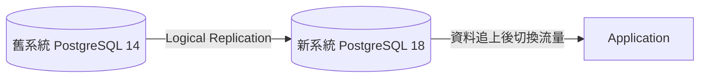

利用 Logical Replication 讓新舊版本並行一段時間、資料持續同步，待確認資料一致後再切換應用程式連線——這是大版本升級（第52、53章）與資料庫遷移最常見的低停機做法，也是 Change Data Capture（CDC）架構的基礎。

### 本章重點

1. Logical Replication 以資料表為單位、可跨版本，是升級與資料整合的關鍵工具，用途與 Physical Replication（HA 導向）不同。
2. PostgreSQL 19 補齊 Sequence 複寫的長年缺口，對零停機升級場景是實質改善，但仍屬 Beta 功能。
3. Replication Slot（邏輯複寫也使用）同樣有「Subscriber 離線導致來源端 WAL 累積」的風險，維運監控原則與實體複寫一致。

[↑ 回目錄](#-目錄)

---

## 第23章 Monitoring 與 Observability

### 23.1 核心系統視圖

```sql
-- 目前所有連線與執行中查詢
SELECT pid, usename, application_name, state, query, query_start
FROM pg_stat_activity
WHERE state != 'idle';

-- 資料庫層級統計（Cache Hit Ratio 是最重要的健康指標之一）
SELECT datname,
       round(blks_hit::numeric / NULLIF(blks_hit + blks_read, 0) * 100, 2) AS cache_hit_ratio_pct
FROM pg_stat_database
WHERE datname = 'appdb';

-- 複寫延遲
SELECT application_name, client_addr, state,
       pg_wal_lsn_diff(pg_current_wal_lsn(), replay_lsn) AS replay_lag_bytes
FROM pg_stat_replication;

-- 目前的鎖等待
SELECT * FROM pg_locks WHERE NOT granted;

-- 慢查詢分析（需先啟用 pg_stat_statements 擴充套件）
SELECT query, calls, mean_exec_time, total_exec_time
FROM pg_stat_statements
ORDER BY total_exec_time DESC
LIMIT 20;
```

### 23.2 Prometheus + Grafana 架構

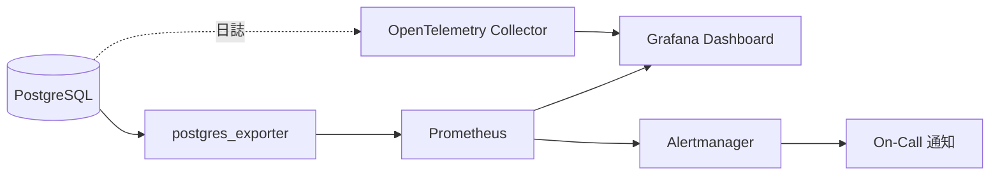

企業級監控除了指標（Metrics）還需搭配日誌（Logs）與追蹤（Traces），三者合稱 Observability 的三大支柱，OpenTelemetry 是目前將三者標準化整合的主流方案（詳見專案內另一份《OpenTelemetry教學手冊》與《Prometheus與Grafana教學手冊》）。

### 23.3 關鍵監控指標清單

| 指標類別 | 具體指標 | 告警意義 |
|---|---|---|
| 連線 | `pg_stat_activity` 連線數 / `max_connections` | 逼近上限代表連線池設定或洩漏問題 |
| 快取 | `pg_stat_database` Cache Hit Ratio | 長期低於 99% 通常代表 `shared_buffers` 不足或查詢模式異常 |
| 複寫 | `pg_stat_replication` Lag | Lag 持續增加代表 Replica 硬體不足或網路問題 |
| 鎖 | `pg_locks` 未授予的鎖數量與等待時間 | 判斷是否有長時間 Blocking |
| Vacuum | `pg_stat_progress_vacuum`、`n_dead_tup` | 判斷 Autovacuum 是否跟得上寫入速度 |
| 磁碟 | WAL 目錄與資料目錄使用率 | 提前預警磁碟塞滿風險 |

### 本章重點

1. `pg_stat_*` 系統視圖是排查任何 PostgreSQL 問題的第一手資料來源，優先於猜測或翻找應用程式日誌。
2. Cache Hit Ratio、複寫延遲、鎖等待是三個最該放進儀表板首頁的指標。
3. Metrics（Prometheus/Grafana）+ Logs + Traces（OpenTelemetry）三者合一，才是完整的資料庫 Observability。

[↑ 回目錄](#-目錄)

---

## 第24章 Performance Tuning 方法論

### 24.1 完整方法論

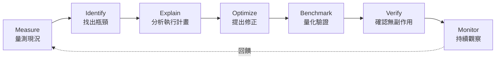

**禁止只說：「增加 `shared_buffers` 就會變快。」**

效能調校必須由實際 Workload、Metrics、Execution Plan、I/O、CPU、Memory、Locking 與 Connection Behavior 驗證——任何脫離實測數據的「建議參數值」都只是猜測。

### 24.2 排查優先順序（實務經驗）

1. **先看是不是少了索引或統計資訊過期**（第15、16章）——多數「突然變慢」的問題根因在此
2. **再看是不是 Lock 等待**（第17章）——查詢本身很快，但卡在等鎖
3. **再看是不是 Autovacuum 跟不上**（第18章）——Bloat 導致同樣查詢要掃更多實體頁面
4. **最後才調整記憶體/並行相關參數**（第9章）——這類調整影響全域，變更前後都需要有基準數據比對

### 24.3 常見效能問題對照

| 現象 | 可能原因 | 排查工具 |
|---|---|---|
| 特定查詢突然變慢 | 統計資訊過期、資料量成長導致 Planner 改變執行計畫 | `EXPLAIN ANALYZE`、檢查 `last_analyze` |
| 整體吞吐下降但無明顯慢查詢 | Autovacuum 落後造成 Bloat、Checkpoint 過於頻繁 | `pg_stat_user_tables`、`pg_stat_bgwriter` |
| 尖峰時段大量連線逾時 | `max_connections` 不足或無連線池，Connection 建立開銷過高 | `pg_stat_activity` 連線數趨勢 |
| 批次匯入異常緩慢 | 逐筆 INSERT 而非批次、索引/觸發器在大量寫入時的開銷 | 改用 `COPY`、匯入前暫停非必要索引 |

### 本章重點

1. 效能調校是一個閉環方法論，不是單次「調參數」的動作。
2. 排查應由「查詢層」到「維運層」再到「全域參數」依序排除，避免一開始就跳去調整高風險的全域參數。
3. 任何效能改動都必須有 Before/After 的量化數據支撐，才能判斷是否真的有效、有無副作用。

[↑ 回目錄](#-目錄)

---

## 第25章 Connection Management／Pooling

### 25.1 為什麼需要連線池

第4章提到 PostgreSQL 是 Process-per-Connection 架構，每個連線都有記憶體與 Fork 開銷。應用程式（尤其是微服務、Serverless）常見的「每個請求開一條新連線」模式，在高併發下會快速耗盡 `max_connections`。**連線池的角色是在應用程式與資料庫之間，重複利用少量實體連線。**

### 25.2 Session Pooling vs Transaction Pooling（以 PgBouncer 為例）

| 模式 | 行為 | 限制 |
|---|---|---|
| **Session Pooling** | 一個 Client 連線綁定一個資料庫連線，直到 Client 斷線才釋放 | 資源利用率提升有限，但完整支援所有 PostgreSQL 功能（如 `LISTEN/NOTIFY`、Prepared Statement） |
| **Transaction Pooling** | 資料庫連線僅在交易期間被占用，交易結束立即歸還池中 | 資源利用率最高，但**不支援跨交易的 Session 狀態**（如 Session 層級的 `SET`、Advisory Lock、`LISTEN/NOTIFY`），應用層需注意 |

```ini
; pgbouncer.ini 範例
[databases]
appdb = host=127.0.0.1 port=5432 dbname=appdb

[pgbouncer]
listen_port = 6432
pool_mode = transaction
max_client_conn = 1000
default_pool_size = 20
```

### 25.3 應用程式框架的連線池建議

| 框架/語言 | 建議 |
|---|---|
| **Spring Boot + HikariCP** | `maximum-pool-size` 建議依 `((core_count * 2) + effective_spindle_count)` 之類的經驗公式起算後再實測調整，而非直接設很大；搭配 PgBouncer 時注意 Transaction Pooling 下 HikariCP 的連線存活假設是否受影響 |
| **Node.js（`pg` / `pg-pool`）** | 明確設定 `max` 連線數上限，避免無限制建立連線 |
| **Python（SQLAlchemy / psycopg pool）** | 使用連線池物件而非每次請求手動 `connect()` |
| **Go（`database/sql` + `pgx`）** | 設定 `SetMaxOpenConns` / `SetMaxIdleConns`，避免依賴預設值 |

> **Best Practice**：應用層連線池 + PgBouncer（或雲端代管服務內建的連線池）常見於高併發架構，兩層池化需要協調總連線數，避免「應用層以為池夠用，實際上疊加多個服務實例後仍打爆資料庫」。

### 本章重點

1. Process-per-Connection 架構讓連線池不是「錦上添花」而是高併發系統的必要元件。
2. Transaction Pooling 效率最高但犧牲 Session 狀態相容性，選型前需確認應用程式是否依賴 Session 層級功能。
3. 多服務實例場景要盤點「總連線數」而非只看單一服務的池大小設定。

[↑ 回目錄](#-目錄)

---

## 第26章 PostgreSQL Extensions

### 26.1 Extension 機制

```sql
-- 查詢可用的 Extension
SELECT name, default_version, comment FROM pg_available_extensions ORDER BY name;

-- 安裝 Extension（需要對應的資料庫具備權限，通常由 DBA 執行）
CREATE EXTENSION IF NOT EXISTS pg_stat_statements;
CREATE EXTENSION IF NOT EXISTS pgcrypto;
CREATE EXTENSION IF NOT EXISTS "uuid-ossp";
```

### 26.2 常用企業 Extension

| Extension | 用途 |
|---|---|
| `pg_stat_statements` | 記錄每條查詢語句的執行統計，是效能分析必裝套件（第16、24章） |
| `pgcrypto` | 提供雜湊、加解密函式，如 `crypt()`、`gen_random_uuid()` |
| `uuid-ossp` | 提供 UUID 產生函式（現代版本也可直接用內建 `gen_random_uuid()`） |
| `postgres_fdw` | Foreign Data Wrapper，可像查詢本地表一樣查詢另一台 PostgreSQL 上的資料表 |
| `PostGIS` | 空間資料與 GIS 查詢（第1章已提及） |
| `pgvector` | 向量相似度搜尋，AI/RAG 應用核心（第28章詳述） |
| `pgaudit` | 詳細的稽核紀錄，滿足合規需求 |

### 26.3 Extension 管理策略

| 原則 | 說明 |
|---|---|
| 版本控制 | Extension 安裝／升級指令納入 Migration 腳本（第36章），不要手動在 Production 執行後未留紀錄 |
| 最小安裝 | 只安裝實際需要的 Extension，減少攻擊面與升級時的相容性風險 |
| 升級前確認相容性 | 大版本升級（第52、53章）前，確認每個已安裝 Extension 是否支援目標版本 |
| 權限控管 | `CREATE EXTENSION` 通常需要較高權限，應用程式帳號不應具備此權限 |

### 本章重點

1. Extension 是 PostgreSQL「核心精簡、按需擴充」哲學的具體實現，但每個 Extension 都是額外的維運與升級相容性負擔。
2. `pg_stat_statements` 幾乎是所有 Production 資料庫都該安裝的基礎設施，而非選配。
3. Extension 安裝應納入版本控制與 Migration 流程，避免變成「口耳相傳」的隱性設定。

[↑ 回目錄](#-目錄)

---

## 第27章 PostgreSQL＋JSON／JSONB

### 27.1 JSON 運算子與路徑查詢

```sql
-- -> 取得 JSON 物件（保留 JSON 型別）；->> 取得文字值
SELECT payload -> 'customer' AS customer_json,
       payload ->> 'order_id' AS order_id_text
FROM app.event_log;

-- @> 包含運算子（可搭配 GIN 索引高效查詢）
SELECT * FROM app.event_log WHERE payload @> '{"status": "failed"}';

-- jsonpath（SQL/JSON Path Language）
SELECT jsonb_path_query(payload, '$.items[*].sku') FROM app.event_log;
```

### 27.2 Hybrid Relational + JSON 架構

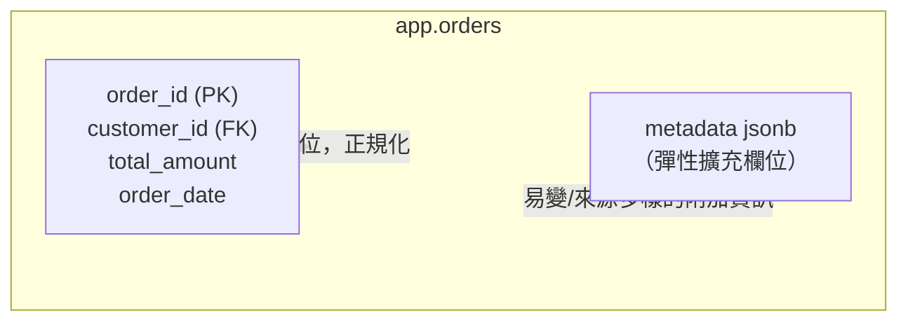

實務常見模式：**核心業務欄位維持正規化的關聯式結構**（保有 FK、CHECK、索引效益），**易變或來源多樣的附加資訊**（如第三方 API 回傳的原始 Payload、使用者自訂欄位）**存放於 JSONB 欄位**。

### 27.3 What 情況適合 JSONB？What 情況該用一般 Relational Table？

| 情境 | 建議 |
|---|---|
| Schema 高度穩定、需要嚴格型別與約束、常做跨表 Join 統計 | Relational Table |
| Schema 因租戶/來源不同而有差異、欄位會頻繁新增但不影響核心邏輯 | JSONB |
| 需要對某個內部欄位做高頻率、高選擇性查詢 | 若該欄位查詢非常頻繁且效能關鍵，考慮拉出獨立的 Relational 欄位並建 B-tree 索引，而非依賴 JSONB GIN 索引 |
| 需要儲存第三方系統回傳的原始資料以供稽核 | JSONB（或搭配 `json` 保留原始格式） |

> **常見誤用**：把所有資料都塞進單一 JSONB 欄位（「Schema-less 化整張資料庫」），放棄關聯式資料庫的完整性保證與 Join 效能——這是第58章 Anti-Patterns 明確列出的反模式之一。

### 本章重點

1. JSONB 是「關聯式資料庫的半結構化延伸」，不是要取代正規化設計。
2. GIN 索引讓 JSONB 的包含查詢效能可接受，但高頻精確查詢的欄位仍建議正規化拉出獨立欄位。
3. 混合架構（核心正規化 + 附加 JSONB）是多數企業系統的務實選擇。

[↑ 回目錄](#-目錄)

---

## 第28章 PostgreSQL＋Vector（pgvector）與 AI 應用

### 28.1 What：PostgreSQL 不只是傳統 RDBMS

透過 `pgvector` 擴充套件，PostgreSQL 可以額外扮演：

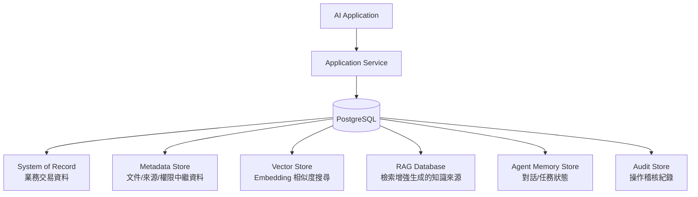

**重要客觀性提醒**：以上是 pgvector **擴充套件**賦予 PostgreSQL 的能力，不是 PostgreSQL 核心原生具備——選型評估時要清楚區分「PostgreSQL 本身」與「安裝 Extension 之後」的能力邊界。

### 28.2 Why：為什麼用 PostgreSQL 做向量搜尋

- 向量資料與業務資料**同一個交易、同一套備份/複寫/權限機制**，不需要額外維護一套獨立系統的一致性
- **Metadata Filtering 是天生強項**：`WHERE tenant_id = ... AND created_at > ...` 直接用 SQL 表達，比多數專用 Vector DB 的 Filter 語法更直覺
- 團隊已有的 PostgreSQL 維運能力（備份、監控、HA）可直接沿用

### 28.3 Architecture：安裝與資料表設計

```sql
CREATE EXTENSION IF NOT EXISTS vector;

CREATE TABLE app.document_chunk (
  chunk_id     bigint GENERATED ALWAYS AS IDENTITY PRIMARY KEY,
  document_id  bigint NOT NULL REFERENCES app.document(document_id),
  tenant_id    uuid NOT NULL,
  content      text NOT NULL,
  embedding    vector(1536),   -- 維度需與 Embedding 模型輸出一致，例如常見模型為 1536 維
  metadata     jsonb NOT NULL DEFAULT '{}',
  created_at   timestamptz NOT NULL DEFAULT now()
);
```

### 28.4 How：相似度搜尋與索引

| 距離運算子 | SQL 運算子 | 適用情境 |
|---|---|---|
| **Cosine Distance（餘弦距離）** | `<=>` | 多數文字 Embedding 模型的建議距離度量 |
| **Euclidean Distance（歐氏距離）** | `<->` | 部分模型或圖像 Embedding 場景 |
| **Inner Product（內積）** | `<#>` | 模型輸出已正規化時，內積等價於餘弦相似度但計算更快 |

```sql
-- 相似度搜尋：找出與查詢向量最相近的前 5 筆，並套用租戶隔離（Metadata Filtering）
SELECT chunk_id, content, embedding <=> :query_embedding AS distance
FROM app.document_chunk
WHERE tenant_id = :current_tenant_id
ORDER BY embedding <=> :query_embedding
LIMIT 5;
```

```sql
-- HNSW 索引：查詢速度快、召回率高，是目前建議的預設索引類型
CREATE INDEX idx_chunk_embedding_hnsw ON app.document_chunk
  USING hnsw (embedding vector_cosine_ops)
  WITH (m = 16, ef_construction = 64);

-- IVFFlat 索引：建索引速度較快、記憶體開銷較低，但查詢前需要合理的 lists 參數與資料分布
CREATE INDEX idx_chunk_embedding_ivfflat ON app.document_chunk
  USING ivfflat (embedding vector_cosine_ops)
  WITH (lists = 100);
```

| 索引 | 特性 |
|---|---|
| **HNSW** | 建索引較慢、佔用記憶體較高，但查詢延遲低、召回率穩定，適合查詢頻繁的 Production 場景 |
| **IVFFlat** | 建索引快，但**必須先有足夠資料再建索引**（`lists` 參數依資料量調整），查詢前建議設定 `SET ivfflat.probes` 平衡召回率與速度 |

### 28.5 Hybrid Search：向量 + 全文檢索 + Metadata

```sql
-- 混合搜尋：向量相似度 + 全文檢索關鍵字比對 + 結構化條件過濾
WITH vector_candidates AS (
  SELECT chunk_id, content, embedding <=> :query_embedding AS vscore
  FROM app.document_chunk
  WHERE tenant_id = :current_tenant_id
  ORDER BY embedding <=> :query_embedding
  LIMIT 50
),
keyword_candidates AS (
  SELECT chunk_id, content, ts_rank(to_tsvector('english', content), plainto_tsquery('english', :keyword)) AS kscore
  FROM app.document_chunk
  WHERE tenant_id = :current_tenant_id
    AND to_tsvector('english', content) @@ plainto_tsquery('english', :keyword)
)
SELECT coalesce(v.chunk_id, k.chunk_id) AS chunk_id,
       coalesce(v.content, k.content) AS content,
       coalesce(1 - v.vscore, 0) * 0.7 + coalesce(k.kscore, 0) * 0.3 AS combined_score
FROM vector_candidates v
FULL OUTER JOIN keyword_candidates k USING (chunk_id)
ORDER BY combined_score DESC
LIMIT 10;
```

### 28.6 Production 注意事項

- **維度必須與 Embedding 模型輸出一致**，模型更換（例如從 1536 維換成 3072 維）需要重建整張表或並存多個欄位，不能就地變更維度。
- HNSW／IVFFlat 都是**近似最近鄰（Approximate Nearest Neighbor）**演算法，召回率與查詢速度是取捨關係，需依業務對準確度的容忍度調整參數。
- 向量欄位體積大，`VACUUM`／備份時間會隨向量資料量顯著增加，容量規劃需納入考量（第54章）。

### 28.7 Security：Metadata Filtering 是租戶隔離的第一道防線

任何多租戶 RAG 系統，向量查詢**必須**搭配 `WHERE tenant_id = ...` 等過濾條件，否則會發生「跨租戶檢索到不該看到的內容」——這是 AI 應用中容易被忽略但後果嚴重的資安問題，建議透過 Row Level Security（第10章）在資料庫層強制，而非僅依賴應用層邏輯。

### 28.8 PostgreSQL + pgvector vs 專用 Vector Database 客觀比較

| 面向 | PostgreSQL + pgvector | 專用 Vector DB（Milvus/Pinecone/Weaviate） | Elasticsearch / OpenSearch | Redis Vector Search |
|---|---|---|---|---|
| 一致性 | 與業務資料同交易 | 通常最終一致 | 最終一致 | 記憶體內，需額外考慮持久化 |
| Metadata Filtering | 原生 SQL，天生強項 | 依產品而異，多數需額外設計 | 強（本身是搜尋引擎） | 中等 |
| 超大規模（十億級以上） | 需良好分區/索引策略，量體極大時較吃力 | 專門設計，擴展性佳 | 佳 | 受記憶體容量限制 |
| 維運複雜度 | 沿用既有 PostgreSQL 維運能力 | 額外一套系統 | 額外一套系統 | 額外一套系統 |
| 適合場景 | 中小至中大規模、需要與業務資料一致、已有 PostgreSQL 維運能力的團隊 | 超大規模、向量搜尋為核心工作負載 | 已有 Elastic 生態、需混合全文+向量 | 需要極低延遲且資料集可放入記憶體 |

### 本章重點

1. pgvector 讓 PostgreSQL 成為 AI 應用可行的 Vector Store 選項，優勢在於與業務資料的一致性與 Metadata Filtering，而非取代所有專用向量資料庫的場景。
2. HNSW 是目前查詢效能優先場景的建議索引，IVFFlat 適合建索引成本敏感的情境，兩者都是近似演算法。
3. 多租戶場景的 Metadata Filtering／Row Level Security 是資安必要條件，不是效能優化選項。

[↑ 回目錄](#-目錄)

---

## 第29章 PostgreSQL＋RAG 架構

### 29.1 完整 RAG（Retrieval-Augmented Generation）Pipeline

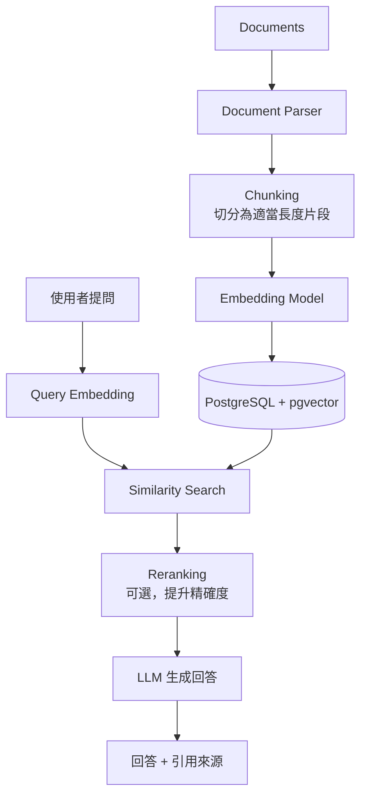

### 29.2 Chunk 與 Metadata 資料表設計

```sql
CREATE TABLE app.rag_document (
  document_id   bigint GENERATED ALWAYS AS IDENTITY PRIMARY KEY,
  tenant_id     uuid NOT NULL,
  source        text NOT NULL,          -- 文件來源，如檔名/URL/系統名稱
  version       int NOT NULL DEFAULT 1,
  permission_tag text NOT NULL DEFAULT 'internal',  -- 供權限過濾使用
  created_at    timestamptz NOT NULL DEFAULT now()
);

CREATE TABLE app.rag_chunk (
  chunk_id     bigint GENERATED ALWAYS AS IDENTITY PRIMARY KEY,
  document_id  bigint NOT NULL REFERENCES app.rag_document(document_id),
  tenant_id    uuid NOT NULL,
  chunk_index  int NOT NULL,
  content      text NOT NULL,
  embedding    vector(1536),
  created_at   timestamptz NOT NULL DEFAULT now()
);
CREATE INDEX idx_rag_chunk_embedding ON app.rag_chunk USING hnsw (embedding vector_cosine_ops);
```

| 欄位 | 為什麼需要 |
|---|---|
| `tenant_id` | 多租戶隔離，第28章已強調的安全必要條件 |
| `source` / `version` | 可追溯回答依據的原始文件與版本，是企業 RAG 的可稽核性基礎 |
| `permission_tag` | 檢索時可依使用者權限過濾，避免 LLM 引用使用者無權查看的內容 |
| `chunk_index` | 保留原文順序，方便還原上下文或除錯 |

### 29.3 企業 RAG Security 原則

1. **檢索前過濾，而非生成後過濾**：權限判斷必須在 SQL 的 `WHERE` 條件中完成，不能只靠「請 LLM 不要回答敏感內容」的 Prompt 約束——LLM 的指令遵循不是安全邊界。
2. **回答附上來源引用**：`source` + `document_id` + `chunk_id` 一併回傳，讓使用者可驗證答案依據，也利於事後稽核。
3. **版本一致性**：文件更新後若未重新 Embedding，檢索到的內容可能與最新文件不一致，需要有 Embedding 更新流程與版本追蹤。

### 本章重點

1. RAG 的資料庫設計必須把「租戶隔離」「權限標籤」「來源可追溯」當作一開始就要考慮的欄位，而非事後補強。
2. 權限控制必須在檢索的 SQL 層完成，Prompt 層的「請不要洩漏」不能作為安全邊界。
3. Chunk 與原始文件的版本關聯，是企業 RAG 系統長期可維護、可稽核的關鍵。

[↑ 回目錄](#-目錄)

---

## 第30章 PostgreSQL＋AI Agent

### 30.1 AI Agent 需要的資料模型

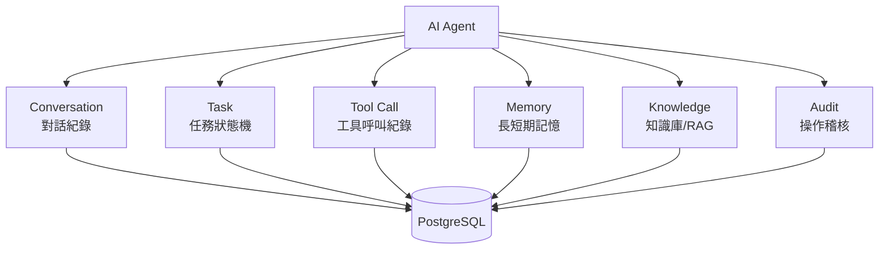

### 30.2 Schema 範例

```sql
CREATE TABLE agent.session (
  session_id   uuid PRIMARY KEY DEFAULT gen_random_uuid(),
  user_id      bigint NOT NULL,
  started_at   timestamptz NOT NULL DEFAULT now(),
  status       varchar(20) NOT NULL DEFAULT 'active'
);

CREATE TABLE agent.message (
  message_id   bigint GENERATED ALWAYS AS IDENTITY PRIMARY KEY,
  session_id   uuid NOT NULL REFERENCES agent.session(session_id),
  role         varchar(20) NOT NULL CHECK (role IN ('user', 'assistant', 'tool', 'system')),
  content      text NOT NULL,
  created_at   timestamptz NOT NULL DEFAULT now()
);

CREATE TABLE agent.task (
  task_id      bigint GENERATED ALWAYS AS IDENTITY PRIMARY KEY,
  session_id   uuid NOT NULL REFERENCES agent.session(session_id),
  goal         text NOT NULL,
  status       varchar(20) NOT NULL DEFAULT 'pending' CHECK (status IN ('pending','in_progress','completed','failed','cancelled')),
  created_at   timestamptz NOT NULL DEFAULT now(),
  completed_at timestamptz
);

CREATE TABLE agent.tool_call (
  tool_call_id  bigint GENERATED ALWAYS AS IDENTITY PRIMARY KEY,
  task_id       bigint NOT NULL REFERENCES agent.task(task_id),
  tool_name     varchar(100) NOT NULL,
  request_args  jsonb NOT NULL,
  response_body jsonb,
  risk_level    varchar(20) NOT NULL DEFAULT 'safe' CHECK (risk_level IN ('safe','requires_approval','denied')),
  approved_by   bigint,                -- 需人工核准時記錄核准者
  executed_at   timestamptz,
  created_at    timestamptz NOT NULL DEFAULT now()
);

CREATE TABLE agent.long_term_memory (
  memory_id    bigint GENERATED ALWAYS AS IDENTITY PRIMARY KEY,
  user_id      bigint NOT NULL,
  memory_text  text NOT NULL,
  embedding    vector(1536),
  importance   smallint NOT NULL DEFAULT 5,
  created_at   timestamptz NOT NULL DEFAULT now(),
  last_used_at timestamptz
);

CREATE TABLE agent.audit_log (
  audit_id     bigint GENERATED ALWAYS AS IDENTITY PRIMARY KEY,
  session_id   uuid NOT NULL,
  actor        varchar(50) NOT NULL,   -- 'agent' 或實際操作的人員帳號
  action       text NOT NULL,
  target       text,
  result       varchar(20) NOT NULL,
  created_at   timestamptz NOT NULL DEFAULT now()
);
```

### 30.3 AI Agent 資料庫存取分層（安全核心觀念）

**AI Agent 不應直接擁有 PostgreSQL Superuser 權限。**

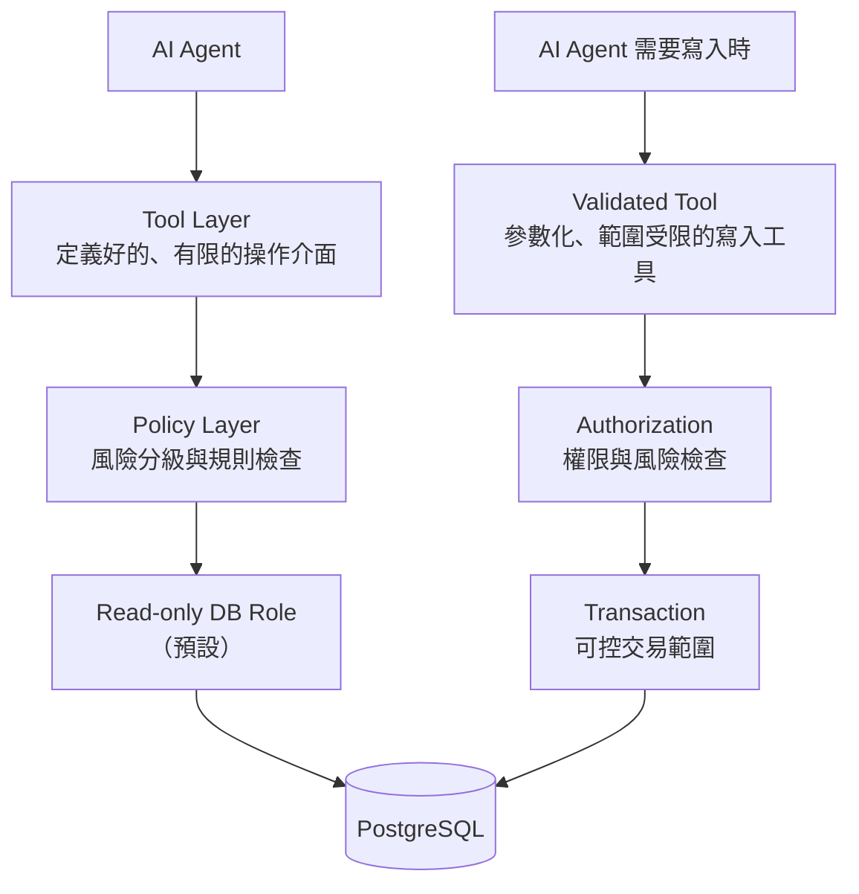

| Agent 類型 | 建議 Role 權限 |
|---|---|
| **Read-only Agent**（查詢、報表、分析） | 僅 `SELECT`，且限定可查詢的 Schema／View |
| **Read/Write Agent**（業務資料維護） | 限定資料表的 `SELECT/INSERT/UPDATE`，透過 Validated Tool 而非任意 SQL |
| **DBA Agent**（維運輔助） | 僅唯讀存取 `pg_stat_*` 等監控視圖，任何變更需人工核准（第46章） |
| **Migration Agent** | 僅能在受控環境（如 CI 流程）中執行已審查過的 Migration 腳本，不具互動式任意 SQL 權限 |
| **Monitoring / Incident Agent** | 唯讀存取監控資料，可產生告警與建議，不可直接執行修復 SQL |

### 本章重點

1. Agent 的 Conversation、Task、Tool Call、Memory、Audit 都應該有明確的資料表與生命週期狀態，而不是全部塞進一個 `jsonb` 欄位。
2. Tool Call 紀錄必須包含 `risk_level` 與 `approved_by`，讓「哪些操作需要人工核准」在資料層就有稽核軌跡。
3. 不同用途的 Agent（Read-only／Read-write／DBA／Migration／Monitoring）應對應不同的資料庫 Role，權限邊界在資料庫層強制，而非僅依賴 Agent 程式邏輯自律。

[↑ 回目錄](#-目錄)

---

## 第31章 PostgreSQL＋AI Coding Agent

### 31.1 定位：程式碼知識的資料底層

Claude Code、GitHub Copilot、Codex 等 AI Coding Agent 在處理大型既有專案時，最大的挑戰是「上下文視窗裝不下整個 Codebase」。PostgreSQL 可作為這些 Agent 的**外部長期記憶與結構化知識庫**，讓 Agent 用 SQL／向量查詢取得所需片段，而不是每次都重新掃描整個檔案系統。

```mermaid
flowchart TB
    REPO[Git Repository] --> PARSER[Code Parser<br/>AST/靜態分析]
    PARSER --> SYMBOL[Symbol 資料]
    PARSER --> DEP[Dependency 資料]
    PARSER --> AST[AST Metadata]
    PARSER --> EMBED[Code Embedding]
    SYMBOL & DEP & AST & EMBED --> PG[(PostgreSQL)]
    PG --> SQLSEARCH[SQL 結構化查詢]
    PG --> VECSEARCH[向量語意查詢]
    PG --> GRAPHREL[Graph-like 關聯查詢]
    SQLSEARCH & VECSEARCH & GRAPHREL --> AGENT[AI Coding Agent]
```

### 31.2 Schema 範例：可儲存的 12 類知識

```sql
CREATE TABLE code.repository (
  repository_id bigint GENERATED ALWAYS AS IDENTITY PRIMARY KEY,
  repo_url      text NOT NULL,
  default_branch varchar(100) NOT NULL DEFAULT 'main'
);

CREATE TABLE code.symbol (
  symbol_id     bigint GENERATED ALWAYS AS IDENTITY PRIMARY KEY,
  repository_id bigint NOT NULL REFERENCES code.repository(repository_id),
  file_path     text NOT NULL,
  symbol_type   varchar(30) NOT NULL,  -- class / method / function / field
  symbol_name   text NOT NULL,
  signature     text,
  embedding     vector(1536),
  updated_at    timestamptz NOT NULL DEFAULT now()
);

CREATE TABLE code.dependency (
  dependency_id bigint GENERATED ALWAYS AS IDENTITY PRIMARY KEY,
  from_symbol_id bigint NOT NULL REFERENCES code.symbol(symbol_id),
  to_symbol_id   bigint NOT NULL REFERENCES code.symbol(symbol_id),
  dependency_type varchar(30) NOT NULL  -- calls / extends / implements / imports / reads_table / writes_table
);

CREATE TABLE code.requirement (
  requirement_id bigint GENERATED ALWAYS AS IDENTITY PRIMARY KEY,
  repository_id  bigint NOT NULL REFERENCES code.repository(repository_id),
  title          text NOT NULL,
  description    text NOT NULL,
  status         varchar(20) NOT NULL DEFAULT 'open'
);

CREATE TABLE code.architecture_decision (
  adr_id        bigint GENERATED ALWAYS AS IDENTITY PRIMARY KEY,
  repository_id bigint NOT NULL REFERENCES code.repository(repository_id),
  title         text NOT NULL,
  context       text NOT NULL,
  decision      text NOT NULL,
  consequences  text,
  created_at    timestamptz NOT NULL DEFAULT now()
);

CREATE TABLE code.agent_task (
  task_id       bigint GENERATED ALWAYS AS IDENTITY PRIMARY KEY,
  repository_id bigint NOT NULL REFERENCES code.repository(repository_id),
  description   text NOT NULL,
  status        varchar(20) NOT NULL DEFAULT 'pending',
  result_summary text
);

CREATE TABLE code.test_result (
  test_result_id bigint GENERATED ALWAYS AS IDENTITY PRIMARY KEY,
  task_id        bigint REFERENCES code.agent_task(task_id),
  test_name      text NOT NULL,
  passed         boolean NOT NULL,
  executed_at    timestamptz NOT NULL DEFAULT now()
);

CREATE TABLE code.review_result (
  review_id      bigint GENERATED ALWAYS AS IDENTITY PRIMARY KEY,
  task_id        bigint REFERENCES code.agent_task(task_id),
  reviewer       varchar(50) NOT NULL,  -- 'ai_agent' 或人員帳號
  finding        text NOT NULL,
  severity       varchar(20) NOT NULL
);
```

> 上表涵蓋 Codebase／Repository Metadata、Symbol、Dependency、AST Metadata（可存於 `symbol`／獨立表的 `jsonb` 欄位）、Code Embedding、Issue（可對應 `requirement` 或獨立 `issue` 表）、Requirement、Architecture Decision、Agent Task、Test Result、Code Review Result——即 Master Prompt 要求的核心知識類別，實際專案可依需求增減。

### 31.3 混合查詢範例

```sql
-- SQL 結構化查詢：找出所有依賴某個即將棄用的類別的程式碼
SELECT s2.file_path, s2.symbol_name
FROM code.symbol s1
JOIN code.dependency d ON d.to_symbol_id = s1.symbol_id
JOIN code.symbol s2 ON s2.symbol_id = d.from_symbol_id
WHERE s1.symbol_name = 'LegacyPaymentService';

-- 向量語意查詢：找出與「重試機制」語意相近的既有實作，避免重複造輪子
SELECT file_path, symbol_name, embedding <=> :query_embedding AS distance
FROM code.symbol
WHERE repository_id = :repo_id
ORDER BY embedding <=> :query_embedding
LIMIT 10;
```

### 本章重點

1. PostgreSQL 讓 AI Coding Agent 得以用「查詢」取代「每次重新掃描整個 Repository」，是突破上下文視窗限制的務實做法。
2. Symbol、Dependency 資料表本質是一個可用 SQL 查詢的程式碼關聯圖，能回答「誰依賴誰」這類結構化問題。
3. SQL 結構化查詢與向量語意查詢互補：前者回答「精確關聯」，後者回答「概念相似」。

[↑ 回目錄](#-目錄)

---

## 第32章 PostgreSQL＋Reverse Engineering

### 32.1 既有系統逆向工程方法論

```mermaid
flowchart TB
    IN["輸入：既有 Database / 既有 Application /<br/>既有 SQL / 既有 Java / 既有 API / 既有 Batch / 既有 Logs"] --> D[Discovery]
    D --> SA[Schema Analysis]
    SA --> RA[Relationship Analysis]
    RA --> SQLA[SQL Analysis]
    SQLA --> CA[Code Analysis]
    CA --> DA[Dependency Analysis]
    DA --> AIR[AI Reasoning]
    AIR --> ARR[Architecture Reconstruction]
```

### 32.2 用 System Catalog 做 Schema Discovery

第5章提到 PostgreSQL 的 Schema 本身也是資料表，這讓自動化逆向工程成為可能：

```sql
-- 列出所有資料表、欄位、型別、是否可為空
SELECT c.relname AS table_name, a.attname AS column_name,
       format_type(a.atttypid, a.atttypmod) AS data_type,
       a.attnotnull AS not_null
FROM pg_class c
JOIN pg_attribute a ON a.attrelid = c.oid
WHERE c.relkind = 'r' AND a.attnum > 0 AND NOT a.attisdropped
  AND c.relnamespace = 'app'::regnamespace
ORDER BY c.relname, a.attnum;

-- 列出所有外鍵關係（重建 ER 圖的基礎資料）
SELECT
  tc.table_name AS from_table, kcu.column_name AS from_column,
  ccu.table_name AS to_table, ccu.column_name AS to_column
FROM information_schema.table_constraints tc
JOIN information_schema.key_column_usage kcu ON kcu.constraint_name = tc.constraint_name
JOIN information_schema.constraint_column_usage ccu ON ccu.constraint_name = tc.constraint_name
WHERE tc.constraint_type = 'FOREIGN KEY';

-- 列出所有函式/預存程序定義（理解既有商業邏輯散落在資料庫層的部分）
SELECT proname, prosrc FROM pg_proc WHERE pronamespace = 'app'::regnamespace;
```

### 32.3 儲存逆向工程結果供 AI Agent 查詢

延續第32章前段與第31章的 Schema 設計，逆向工程結果應存放於：

| 儲存內容 | 對應資料表 |
|---|---|
| Table / Column / FK / Index / View / Function / Trigger / Procedure | `code.symbol`（擴充 `symbol_type` 涵蓋資料庫物件）或獨立的 `reverse_eng.db_object` 表 |
| Application ↔ SQL ↔ Table 的映射 | `code.dependency`（`dependency_type = 'reads_table' / 'writes_table'`） |
| API ↔ Java Class 映射 | `code.dependency`（`dependency_type = 'exposes_api'`） |
| Business Rule | `code.requirement` 或獨立 `reverse_eng.business_rule` 表，附上來源程式碼位置 |
| Reverse Engineering 結果摘要 | `code.architecture_decision`，記錄「發現了什麼、據此做了什麼決策」 |

### 本章重點

1. PostgreSQL 的 System Catalog（`pg_catalog` / `information_schema`）本身就是最可靠的 Schema Discovery 資料來源，優先於人工閱讀文件或猜測。
2. 逆向工程的價值在於把「隱性知識」（散落在 SQL、程式碼、資料庫函式中的商業邏輯）轉為「可查詢的顯性資料」。
3. 逆向工程結果應該存回資料庫，讓後續的 AI Agent 或人類工程師可以持續查詢與累積，而不是每次重新分析。

[↑ 回目錄](#-目錄)

---

## 第33章 PostgreSQL＋Software Framework Upgrade 知識庫

### 33.1 升級知識庫架構

```mermaid
flowchart TB
    LEGACY[Legacy System] --> ANALYSIS[Analysis<br/>現況分析]
    ANALYSIS --> KB[(PostgreSQL Knowledge Base)]
    KB --> AGENT[AI Agent]
    AGENT --> PLAN[Migration Plan]
    PLAN --> CHANGE[Code Change]
    CHANGE --> TEST[Test]
    TEST --> RESULT[Result]
    RESULT -.回饋更新.-> KB
```

### 33.2 Schema 範例

```sql
CREATE TABLE upgrade.dependency_version (
  id             bigint GENERATED ALWAYS AS IDENTITY PRIMARY KEY,
  repository_id  bigint NOT NULL,
  dependency_name text NOT NULL,   -- 如 'spring-boot', 'jakarta.servlet-api'
  current_version text NOT NULL,
  target_version  text NOT NULL,
  UNIQUE (repository_id, dependency_name)
);

CREATE TABLE upgrade.breaking_change (
  id              bigint GENERATED ALWAYS AS IDENTITY PRIMARY KEY,
  dependency_name text NOT NULL,
  from_version    text NOT NULL,
  to_version      text NOT NULL,
  description     text NOT NULL,
  affected_symbol_pattern text,   -- 如套件/類別名稱樣式，供比對受影響程式碼
  risk_level      varchar(20) NOT NULL DEFAULT 'medium'
);

CREATE TABLE upgrade.migration_task (
  task_id        bigint GENERATED ALWAYS AS IDENTITY PRIMARY KEY,
  repository_id  bigint NOT NULL,
  breaking_change_id bigint REFERENCES upgrade.breaking_change(id),
  file_path      text NOT NULL,
  status         varchar(20) NOT NULL DEFAULT 'pending',
  compatibility_result varchar(20),
  test_result    varchar(20)
);
```

### 33.3 應用情境

適用於 Java / Spring Boot / Spring Framework / Jakarta EE / Maven / Node.js / Vue / Angular 等框架升級評估：

1. 掃描專案依賴，寫入 `upgrade.dependency_version`
2. 比對官方 Migration Guide 中的已知 Breaking Change，寫入 `upgrade.breaking_change`（此步驟建議人工審核來源，避免 AI 幻覺產生不存在的變更項目）
3. 依 `affected_symbol_pattern` 掃描程式碼庫，找出受影響檔案，寫入 `upgrade.migration_task`
4. AI Agent 依任務逐一提出程式碼變更建議，經人工 Review 後套用
5. 測試結果回寫 `test_result`，作為升級風險評估的依據

### 本章重點

1. 框架升級的核心挑戰是「Breaking Change 散落在多份 Release Notes / Migration Guide 中」，用資料庫集中管理可讓查詢與比對系統化。
2. AI Agent 產出的 Breaking Change 清單必須有人工審核來源的機制，避免將幻覺內容當作既定事實寫入知識庫。
3. 升級知識庫的價值會隨專案持續累積——每次升級的實際踩坑經驗，都應該回寫成下一次升級的參考資料。

[↑ 回目錄](#-目錄)

---

## 第34章 PostgreSQL 與 Spring Boot／Java 25

### 34.1 標準連線堆疊

```mermaid
flowchart TB
    JAVA[Java 25] --> SB[Spring Boot 4.x]
    SB --> SD[Spring Data JPA]
    SD --> HIB[Hibernate]
    HIB --> JDBC[JDBC Driver]
    JDBC --> HIKARI[HikariCP 連線池]
    HIKARI --> PG[(PostgreSQL)]
    SB --> FLYWAY[Flyway Migration]
    FLYWAY --> PG
```

### 34.2 設定範例

```properties
spring.datasource.url=jdbc:postgresql://pg-host:5432/appdb
spring.datasource.username=svc_backend
# Production 密碼不應直接寫在 application.properties，見下方說明
spring.datasource.hikari.maximum-pool-size=20
spring.datasource.hikari.minimum-idle=5
spring.datasource.hikari.connection-timeout=3000

spring.jpa.hibernate.ddl-auto=validate
spring.flyway.locations=classpath:db/migration
```

> **Production Secret 不應直接寫在 `application.properties`。** 建議透過環境變數注入（`SPRING_DATASOURCE_PASSWORD`）、Kubernetes Secret、或 Vault 等密鑰管理服務動態取得，並確保 `application.properties` 本身不含明文密碼被提交進 Git。

### 34.3 `ddl-auto` 的企業級選擇

| 值 | 說明 | 建議使用場景 |
|---|---|---|
| `validate` | 僅驗證 Entity 與資料庫 Schema 是否一致，不自動變更 Schema | **Production 建議值**，Schema 變更一律走 Flyway/Liquibase |
| `update` | 自動依 Entity 調整 Schema | 僅適合本機開發，Production 使用會失去 Migration 版本控制與可稽核性 |
| `create` / `create-drop` | 每次啟動重建 Schema | 僅適合測試環境 |

### 34.4 Java 25／Spring Boot 4.x 整合注意事項

- **Driver 版本**：確認 PostgreSQL JDBC Driver 版本支援目標 Java 版本與 PostgreSQL Server 版本（含第2章列出的 19 Beta 相容性仍需自行驗證）。
- **Connection Pool**：HikariCP 的 `maximum-pool-size` 需與 PostgreSQL 端 `max_connections` 及其他服務實例數量整體規劃（第25章）。
- **Transaction 邊界**：`@Transactional` 的傳播行為（Propagation）需與第17章的隔離等級知識搭配理解，避免長交易占用連線與鎖。
- **Observability**：建議搭配 Micrometer + OpenTelemetry 匯出資料庫呼叫的追蹤資訊，與第23、51章的監控體系串接。

### 本章重點

1. Production 環境的 `ddl-auto` 應設為 `validate`，Schema 變更一律透過 Flyway/Liquibase 走版本控制（第36章）。
2. 資料庫密碼絕不寫死在設定檔提交進版本控制，改用環境變數或密鑰管理服務注入。
3. HikariCP 連線池大小需要與資料庫端 `max_connections` 及服務實例數整體規劃，不能只看單一服務的預設值。

[↑ 回目錄](#-目錄)

---

## 第35章 PostgreSQL 與前端框架的安全邊界

### 35.1 正確的架構邊界

```mermaid
flowchart LR
    FE[Vue / React / Angular] --> API[REST / GraphQL API]
    API --> BE[Backend<br/>驗證、授權、業務邏輯]
    BE --> PG[(PostgreSQL)]
```

**前端不應直接連 PostgreSQL。** 這不只是「工程慣例」，而是安全邊界的必要條件：

| 風險 | 說明 |
|---|---|
| 憑證暴露 | 前端程式碼在瀏覽器執行，任何寫在前端的資料庫連線字串／密碼都會被使用者看到 |
| 缺乏集中授權 | 資料庫層的權限控制粒度（Row Level Security 等）難以完整表達「使用者在這個畫面能做什麼操作」的業務規則 |
| SQL Injection 面暴露 | 若前端組裝查詢條件直接送進資料庫，攻擊面直接暴露給任何能操作瀏覽器的使用者 |

所有資料存取都必須經過後端 API：由後端負責身份驗證（Authentication）、授權（Authorization）、輸入驗證、Parameterized Query（第10章），前端只透過定義好的 API 合約互動。

### 本章重點

1. 前端與資料庫之間必須有後端服務作為安全邊界，這是不可妥協的架構原則。
2. 資料庫連線憑證絕不可能出現在任何會被瀏覽器載入的程式碼或設定中。
3. 業務規則與授權邏輯集中在後端，前端僅負責呈現與呼叫已授權的 API。

[↑ 回目錄](#-目錄)

---

## 第36章 Database Migration（Flyway／Liquibase）

### 36.1 版本化 Migration 的必要性

```mermaid
flowchart LR
    V1[V1__init_schema.sql] --> V2[V2__add_orders_table.sql]
    V2 --> V3[V3__add_index_orders_customer.sql]
    V3 --> V4[V4__add_tenant_id_column.sql]
```

每個 Migration 檔案代表 Schema 的一次確定性變更，工具（Flyway／Liquibase）會在資料庫中記錄已套用的版本，確保**任何環境套用同一組 Migration，最終 Schema 狀態完全一致**。

### 36.2 Flyway 範例

```sql
-- V4__add_tenant_id_column.sql
BEGIN;

ALTER TABLE app.orders ADD COLUMN tenant_id uuid;

-- 分批回填既有資料（大表建議分批執行避免長時間鎖表，見下方 Expand/Contract 說明）
UPDATE app.orders SET tenant_id = '00000000-0000-0000-0000-000000000001'
WHERE tenant_id IS NULL;

ALTER TABLE app.orders ALTER COLUMN tenant_id SET NOT NULL;

COMMIT;
```

### 36.3 Expand / Contract 模式（Zero-Downtime Migration）

| 階段 | 做法 |
|---|---|
| **Expand** | 新增欄位／資料表，但**不移除**舊結構；新舊程式碼版本並存期間都能運作 |
| **Migrate** | 背景任務或批次逐步將資料從舊結構搬遷至新結構 |
| **Contract** | 確認所有服務都已切換至新結構後，才移除舊欄位／資料表 |

這個模式讓「資料庫變更」與「應用程式部署」可以解耦，避免「Migration 一執行，舊版本程式碼立刻壞掉」的停機風險。

### 36.4 Rollback 策略

PostgreSQL 的 DDL 大多可在交易內執行（`BEGIN...COMMIT`），但 Migration 工具的「Rollback」通常代表**執行另一個反向 Migration**，而非資料庫原生撤銷——尤其牽涉資料搬移或欄位刪除的 Migration，**必須額外撰寫並測試對應的回滾腳本**，不能假設「反向操作」是顯而易見的。

### 本章重點

1. Migration 檔案必須版本化、確定性、可在任何環境重複套用出相同結果。
2. Expand/Contract 模式是避免 Schema 變更造成停機的標準做法，尤其適用於高可用系統。
3. Rollback 不是「自動反向」，牽涉資料的 Migration 必須額外設計並測試回滾腳本。

[↑ 回目錄](#-目錄)

---

## 第37章 PostgreSQL DevOps

### 37.1 CI/CD Pipeline 中的資料庫關卡

```mermaid
flowchart LR
    DEV[Developer] --> GIT[Git]
    GIT --> CI[CI]
    CI --> MIGTEST[Migration Test<br/>套用所有 Migration 至乾淨資料庫]
    MIGTEST --> INTTEST[Integration Test<br/>含資料庫的整合測試]
    INTTEST --> SECTEST[Security Test]
    SECTEST --> PERFTEST[Performance Test]
    PERFTEST --> DEPLOY[Deploy]
```

### 37.2 Testcontainers：CI 中的一次性 PostgreSQL

```java
@Testcontainers
class OrderRepositoryTest {

    @Container
    static PostgreSQLContainer<?> postgres =
        new PostgreSQLContainer<>("postgres:18")
            .withDatabaseName("appdb_test")
            .withUsername("test_user")
            .withPassword("test_password");

    @DynamicPropertySource
    static void configureProperties(DynamicPropertyRegistry registry) {
        registry.add("spring.datasource.url", postgres::getJdbcUrl);
        registry.add("spring.datasource.username", postgres::getUsername);
        registry.add("spring.datasource.password", postgres::getPassword);
    }

    @Test
    void shouldPersistOrder() {
        // 測試針對真實 PostgreSQL 執行，而非 Mock，避免第10章提到的
        // 「Mock 測試通過但正式環境行為不同」的落差
    }
}
```

### 37.3 Infrastructure as Code

| 工具 | 用途 |
|---|---|
| **Terraform** | 佈建雲端 PostgreSQL 服務（RDS／Cloud SQL／Azure Database）、網路與安全群組 |
| **Ansible** | 自建主機上的 PostgreSQL 安裝與設定管理 |
| **Helm** | Kubernetes 上部署 PostgreSQL Operator 與相關資源 |

### 本章重點

1. Migration Test（在乾淨資料庫套用所有 Migration）應該是 CI 的必要關卡，避免「Migration 在 Production 才發現套用失敗」。
2. Testcontainers 讓整合測試針對真實 PostgreSQL 執行，比純 Mock 更能反映實際行為。
3. 資料庫基礎設施（不只是 Schema）也應納入 Infrastructure as Code 管理，而非人工手動設定。

[↑ 回目錄](#-目錄)

---

## 第38章 PostgreSQL DevSecOps

### 38.1 安全管線

```mermaid
flowchart LR
    CODE[Code] --> SQLSCAN[SQL Scan<br/>靜態分析潛在注入風險]
    SQLSCAN --> DEPSCAN[Dependency Scan]
    DEPSCAN --> SECRETSCAN[Secret Scan]
    SECRETSCAN --> MIGTEST[Migration Test]
    MIGTEST --> SECTEST[Security Test]
    SECTEST --> INTTEST[Integration Test]
    INTTEST --> DEPLOY[Deploy]
```

### 38.2 風險清單與對應措施

| 風險 | 對應措施 |
|---|---|
| **SQL Injection** | 強制 Parameterized Query（第10章），CI 加入靜態掃描規則檢查字串拼接 SQL 的模式 |
| **Privilege Escalation** | 應用程式帳號權限最小化（第11章），定期稽核 Role 的 `GRANT` 紀錄 |
| **Credential Leakage** | Secret Scan（如 gitleaks）納入 CI，禁止密碼／連線字串出現在提交紀錄 |
| **TLS 未啟用** | `pg_hba.conf` 強制要求 `hostssl`，尤其是跨網段流量 |
| **Audit 缺失** | 安裝 `pgaudit`，關鍵資料表的異動需可回溯到操作者 |
| **Backup 未加密** | 備份檔案（尤其上傳至 Object Storage 者）啟用伺服器端或用戶端加密 |
| **Least Privilege 未落實** | 定期執行權限稽核，移除不再需要的授權 |

### 本章重點

1. DevSecOps 管線應把 SQL 掃描、依賴掃描、Secret 掃描都視為與功能測試同等重要的關卡，而非事後補救。
2. 備份加密與 Audit 紀錄常是企業安全稽核中最容易被忽略、卻最常被稽核單位要求提供證據的兩項。
3. 權限最小化不是一次性設定，而是需要定期稽核與清理的持續性工作。

[↑ 回目錄](#-目錄)

---

## 第39章 Multi-Tenant Architecture

### 39.1 三種主要架構比較

| Architecture | Isolation | Cost | Complexity | Recommendation |
|---|---:|---:|---:|---|
| **Database per Tenant** | 最高 | 最高（每租戶獨立連線、備份、監控開銷） | 高（大量租戶時維運指數成長） | 租戶數少、對隔離性/合規要求極高（如金融客戶各自獨立稽核） |
| **Schema per Tenant** | 中高 | 中 | 中（單一連線可跨 Schema，但仍需管理大量 Schema） | 租戶數中等（數十至數百），需要一定隔離性 |
| **Shared Table + tenant_id** | 中（依賴 RLS 落實） | 最低 | 低～中（需嚴格的 RLS 與應用層規範） | 租戶數龐大（數千以上）的 SaaS 產品 |
| **Hybrid（大客戶獨立、長尾客戶共用）** | 依租戶分級 | 中 | 高（需維護兩套模式） | 租戶規模差異懸殊的企業 SaaS |

### 39.2 Row Level Security 實作 Shared Table 模式

```sql
ALTER TABLE app.orders ENABLE ROW LEVEL SECURITY;

CREATE POLICY tenant_isolation_select ON app.orders
  FOR SELECT
  USING (tenant_id = current_setting('app.current_tenant_id')::uuid);

CREATE POLICY tenant_isolation_modify ON app.orders
  FOR ALL
  USING (tenant_id = current_setting('app.current_tenant_id')::uuid)
  WITH CHECK (tenant_id = current_setting('app.current_tenant_id')::uuid);

-- 應用程式於連線建立後、處理該租戶請求前設定
SET app.current_tenant_id = '11111111-1111-1111-1111-111111111111';
```

> **常見錯誤**：只在應用層 `WHERE tenant_id = ?` 做隔離，卻沒有搭配 RLS——只要有一處查詢忘記加條件（例如新加的報表功能），就會發生跨租戶資料外洩。RLS 讓隔離規則在資料庫層強制執行，是應用層邏輯的最後一道防線，而非取代應用層檢查。

### 本章重點

1. 多租戶架構選型的核心變數是「租戶數量」與「隔離性要求」，沒有放諸四海皆準的答案。
2. Shared Table 模式若無 Row Level Security 把關，任何一處遺漏 `WHERE tenant_id` 的查詢都是資安事故。
3. 大型 SaaS 常見 Hybrid 模式：核心大客戶獨立 Schema／Database，長尾客戶共用 Table + RLS，兼顧成本與關鍵客戶的隔離需求。

[↑ 回目錄](#-目錄)

---

## 第40章 Partitioning

### 40.1 三種分區策略

```sql
-- Range Partitioning：依時間範圍分區，金融交易/日誌類資料的常見選擇
CREATE TABLE app.transaction (
  transaction_id bigint GENERATED ALWAYS AS IDENTITY,
  transaction_date date NOT NULL,
  amount numeric(18,2) NOT NULL,
  PRIMARY KEY (transaction_id, transaction_date)
) PARTITION BY RANGE (transaction_date);

CREATE TABLE app.transaction_2024 PARTITION OF app.transaction
  FOR VALUES FROM ('2024-01-01') TO ('2025-01-01');
CREATE TABLE app.transaction_2025 PARTITION OF app.transaction
  FOR VALUES FROM ('2025-01-01') TO ('2026-01-01');
CREATE TABLE app.transaction_2026 PARTITION OF app.transaction
  FOR VALUES FROM ('2026-01-01') TO ('2027-01-01');
```

```mermaid
flowchart TB
    T["app.transaction<br/>Partition by transaction_date"]
    T --> P2024[transaction_2024]
    T --> P2025[transaction_2025]
    T --> P2026[transaction_2026]
```

| 策略 | 適用情境 |
|---|---|
| **Range** | 依時間或連續數值範圍分區，如交易紀錄、日誌、Audit（最常見） |
| **List** | 依離散類別分區，如依地區、租戶群組 |
| **Hash** | 無明顯自然分區鍵、僅想平均分散資料以利平行處理 |

### 40.2 為什麼要分區：金融/交易/Log/Audit 大型資料案例

- **查詢效能**：查詢通常帶有時間範圍條件時，Planner 可透過 Partition Pruning 只掃描相關分區，避免掃描全表
- **維護效率**：`VACUUM`／`REINDEX` 可針對單一分區進行，不需鎖定整張邏輯表
- **生命週期管理**：過期資料（如 7 年前的交易紀錄，依法規僅需保留特定年限）可用 `DETACH PARTITION` 快速移除，遠比 `DELETE` 大量資料列有效率且不會產生大量 Dead Tuple

```sql
-- 移除過期分區（先 DETACH 保留資料以防萬一，確認無誤後再 DROP）
ALTER TABLE app.transaction DETACH PARTITION app.transaction_2019;
-- 確認保留策略符合法規要求後才執行：
-- DROP TABLE app.transaction_2019;
```

### 本章重點

1. Range Partitioning 是金融交易、日誌、Audit 等隨時間成長資料的標準做法，核心價值是 Partition Pruning 與生命週期管理。
2. 分區鍵必須反映實際查詢模式（多數查詢是否帶有該欄位的範圍條件），否則分區反而增加複雜度卻無效能收益。
3. 過期資料用 `DETACH PARTITION` 而非大量 `DELETE`，避免產生大量 Dead Tuple 拖累 Autovacuum。

[↑ 回目錄](#-目錄)

---

## 第41章 Enterprise Reference Architecture

### 41.1 完整企業架構圖

```mermaid
flowchart TB
    LB[Load Balancer] --> APP[Application / Spring Boot Services]
    APP --> POOL[Connection Pool<br/>PgBouncer]
    POOL --> PRIMARY[(PostgreSQL Primary)]
    PRIMARY --> REPLICA[(Read Replica)]
    PRIMARY --> BACKUP[Backup<br/>pgBackRest/WAL-G]
    REPLICA --> REPORT[Reporting / Analytics]
    PRIMARY --> WAL[WAL]
    WAL --> ARCHIVE[(Object Storage Archive)]
    ARCHIVE --> DR[(DR Site)]
    PATRONI[Patroni + etcd] -.管理.-> PRIMARY
    PATRONI -.管理.-> REPLICA
    PROM[Prometheus] --> PRIMARY
    PROM --> REPLICA
    PROM --> GRAF[Grafana]
    AGENT[AI Agent] -.唯讀監控/受控維運.-> PROM
    AGENT -.RAG/向量查詢.-> PRIMARY
```

### 41.2 各層責任

| 層 | 責任 |
|---|---|
| Load Balancer / Connection Pool | 流量入口、連線數控管、讀寫分流 |
| Primary / Replica | 交易處理、HA、讀取分流 |
| Backup / Archive / DR | 資料持久性、法規遵循、災難復原 |
| Patroni / etcd | Leader Election、自動 Failover（第21章） |
| Prometheus / Grafana | Metrics 監控與告警（第23章） |
| AI Agent | 唯讀監控輔助、RAG 檢索、受控維運建議（第46～51章），**不具備未經核准的寫入/維運權限** |

### 本章重點

1. 企業級 PostgreSQL 架構是多個子系統（HA、備份、監控、安全、AI）的組合，任一環節缺失都會成為整體可靠性的短板。
2. AI Agent 在此架構中的定位是「唯讀監控與受控輔助」，不是取代 DBA 的自動化維運黑盒。
3. 這張參考架構是設計起點，實際導入仍需依第54章 Capacity Planning 與第55章 Disaster Recovery 的方法調整規模與拓撲。

[↑ 回目錄](#-目錄)

---

## 第42章 Production Checklist

### 42.1 上線前完整檢查清單

- [ ] **OS**：作業系統版本受支援、已套用安全更新、時間同步（NTP）已設定
- [ ] **Storage**：使用 SSD/NVMe（生產環境不建議 HDD）、磁碟有足夠餘裕（含 WAL 成長空間）
- [ ] **CPU／Memory**：依 Workload 完成第54章 Capacity Planning 估算，非拍腦袋決定
- [ ] **Network**：資料庫僅對必要來源開放連線，跨可用區流量已評估延遲影響
- [ ] **Security**：`pg_hba.conf` 遵循最小必要原則，無 `trust` 規則暴露於非本機
- [ ] **Authentication**：採用 `scram-sha-256` 或更高強度的認證方式
- [ ] **TLS**：`ssl = on`，跨網段連線強制 `hostssl`
- [ ] **Roles**：應用程式帳號非 Superuser，遵循最小權限（第11章）
- [ ] **Database／Schema**：命名規範一致（第59章 Coding Standards）
- [ ] **Index**：關鍵查詢已透過 `EXPLAIN ANALYZE` 驗證使用索引
- [ ] **Query**：已知的高頻查詢完成效能驗證
- [ ] **Connection Pool**：已部署並設定合理的 Pool Size（第25章）
- [ ] **Vacuum**：Autovacuum 已針對大表個別調校（第18章）
- [ ] **Backup**：備份排程已設定，涵蓋邏輯與/或實體備份
- [ ] **Restore Test**：至少完成一次完整還原演練並記錄所需時間
- [ ] **WAL**：`wal_level` 符合複寫需求，WAL 保留策略已確認不會塞爆磁碟
- [ ] **Replication**：Streaming／Logical Replication（如適用）已驗證延遲在可接受範圍
- [ ] **Monitoring**：Prometheus/Grafana 或等效方案已上線，關鍵指標已設定告警
- [ ] **Alerting**：告警有明確 On-Call 對應窗口，而非發出後無人處理
- [ ] **Logging**：`log_min_duration_statement` 等關鍵日誌參數已設定
- [ ] **Disaster Recovery**：RPO/RTO 已定義並驗證可達成（第55章）
- [ ] **Upgrade Plan**：已知未來的升級路徑與時程（第52、53章）

[↑ 回目錄](#-目錄)

---

## 第43章 DBA 日常／週期性維運

### 43.1 Daily（每日）

- [ ] 確認 Primary／Replica 皆健康、複寫延遲在正常範圍
- [ ] 檢查是否有異常長時間執行的查詢（`pg_stat_activity`）
- [ ] 檢查昨夜是否有未預期的鎖等待或 Deadlock 記錄
- [ ] 檢查錯誤日誌是否有新的異常模式
- [ ] 確認磁碟使用率（資料目錄、WAL 目錄）在安全範圍

### 43.2 Weekly（每週）

- [ ] 檢視 Autovacuum 執行紀錄，確認大表未持續累積 Dead Tuple
- [ ] 檢視 Table／Index Bloat 排行，評估是否需要 `REPACK`
- [ ] 抽樣驗證備份可正確還原（非每週完整演練，但定期抽樣）
- [ ] 檢視 `pg_stat_statements` 慢查詢排行，是否有新出現的效能異常

### 43.3 Monthly（每月）

- [ ] 容量趨勢檢視，評估是否需提前擴充（第54章）
- [ ] 權限稽核：檢視 Role／GRANT 是否有不再需要的授權
- [ ] 檢查是否有可套用的安全性 Patch（Minor Version Upgrade，第52章）
- [ ] 檢視升級路徑規劃：現行版本距 EOL 尚有多久
- [ ] 完整 DR 演練（依企業政策頻率，至少每季一次，部分企業要求每月）

### 本章重點

1. 日常維運分層檢查（每日健康、每週趨勢、每月策略），避免所有事情都堆到「出事才處理」。
2. 備份 Restore Test 與 DR 演練必須排入固定週期，而非依賴「有空再做」。
3. 容量與升級規劃是「月」等級的節奏，避免臨到 EOL 或容量瓶頸才倉促應對。

[↑ 回目錄](#-目錄)

---

## 第44章 Troubleshooting

### 44.1 Connection 相關

| Symptom | Possible Cause | Diagnosis | Solution | Prevention |
|---|---|---|---|---|
| `too many connections` | `max_connections` 已滿，或連線洩漏 | `SELECT count(*) FROM pg_stat_activity;` 比對 `max_connections` | 導入/檢查連線池設定，找出未正確關閉連線的程式碼 | 應用層務必使用連線池，並設定合理逾時 |
| `password authentication failed` | 密碼錯誤、`pg_hba.conf` 規則不符 | 檢查連線來源 IP 是否符合 `pg_hba.conf` 規則順序 | 修正密碼或 `pg_hba.conf` 規則後 `pg_reload_conf()` | 密碼輪替流程需同步通知所有服務 |
| `connection timeout` | 網路問題、資料庫端過載無法接受新連線 | 檢查網路路徑、資料庫端 CPU/連線數是否已飽和 | 排查網路或擴充資料庫端資源 | 監控連線數與網路延遲告警 |

### 44.2 Performance 相關

| Symptom | Possible Cause | Diagnosis | Solution | Prevention |
|---|---|---|---|---|
| Slow Query | 缺索引、統計資訊過期、資料量成長改變執行計畫 | `EXPLAIN ANALYZE`，比對預估與實際列數 | 建立適當索引、執行 `ANALYZE` | 定期檢視 `pg_stat_statements`，建立慢查詢告警 |
| High CPU | 大量排序/雜湊操作、Sequential Scan 掃描大表、Regex 密集查詢 | 檢查當下 `pg_stat_activity` 執行中查詢 | 優化查詢/索引，必要時調整 `work_mem` | 慢查詢監控 + Code Review 攔截高成本查詢 |
| High I/O | Cache Hit Ratio 過低、Checkpoint 過於頻繁 | 檢查 `pg_stat_database`、`pg_stat_bgwriter` | 評估 `shared_buffers`、調整 Checkpoint 相關參數 | 持續監控 Cache Hit Ratio 趨勢 |
| Lock 等待 | 長時間未提交交易占用鎖 | 第17章的鎖等待診斷 SQL | 終止異常交易（`pg_terminate_backend`，需審慎評估）、修正應用邏輯縮短交易時間 | 應用層避免在交易中包含外部呼叫（如 API 請求） |
| Deadlock | 多交易以不同順序存取相同資源 | 檢查日誌中的 `deadlock detected` 詳細資訊 | 統一資源存取順序、應用層加入重試機制 | Code Review 檢查跨資源交易的存取順序 |

### 44.3 Storage 相關

| Symptom | Possible Cause | Diagnosis | Solution | Prevention |
|---|---|---|---|---|
| Disk Full | 資料成長超出預期、WAL 累積、備份檔案未清理 | 檢查資料目錄與 WAL 目錄用量分布 | 緊急擴充磁碟、清理過期備份、檢查 Replication Slot 是否卡住 WAL | 容量監控告警、Replication Slot 定期稽核 |
| WAL Growth 異常 | Replica／Replication Slot 離線導致 WAL 無法被清除 | 檢查 `pg_replication_slots` 是否有過期 Slot | 移除失效 Slot 或修復對應 Replica | 監控 Slot 對應的 Replica 存活狀態 |
| Table Bloat | Autovacuum 落後、長交易阻擋清理 | `pg_stat_user_tables` 的 Dead Tuple 比例 | 調整 Autovacuum 觸發門檻、必要時 `REPACK` | 大表個別調校 Autovacuum 參數 |

### 44.4 Replication 相關

| Symptom | Possible Cause | Diagnosis | Solution | Prevention |
|---|---|---|---|---|
| Replica Lag | 網路延遲、Replica 硬體不足、Primary 寫入尖峰 | `pg_stat_replication` 的 LSN 差距 | 提升 Replica 規格、檢查網路、必要時暫緩非必要批次作業 | 持續監控延遲趨勢並設定告警門檻 |
| Replication Slot 累積 WAL | 對應 Replica/Subscriber 長期離線 | `pg_replication_slots` 檢查 `active` 狀態 | 修復或移除失效 Slot | 定期稽核未使用的 Slot |

### 44.5 Application 相關

| Symptom | Possible Cause | Diagnosis | Solution | Prevention |
|---|---|---|---|---|
| Connection Pool Exhaustion | 應用程式連線未正確釋放、Pool Size 設定過小 | 檢查應用程式連線池的使用率指標 | 修正連線洩漏、調整 Pool Size | Code Review 確保所有連線使用 try-with-resources 或等效機制 |
| Transaction Timeout | 交易內包含慢速外部呼叫、鎖等待過久 | 檢查交易起訖時間與內部呼叫鏈 | 縮短交易範圍，外部呼叫移出交易邊界 | 設計規範明確禁止交易內呼叫外部服務 |

### 本章重點

1. Troubleshooting 應遵循 Symptom → Possible Cause → Diagnosis → Solution → Prevention 的固定流程，避免頭痛醫頭。
2. 多數 Production 事故的根因可回溯到本手冊前面章節（索引、Vacuum、連線池、鎖）——Troubleshooting 能力建立在對這些機制的理解上，而非死記案例。
3. Prevention 欄位往往比 Solution 更重要：解決一次事故不如建立監控告警，讓下次同類問題提早被發現。

[↑ 回目錄](#-目錄)

---

## 第45章 常用指令 Cheat Sheet

### 45.1 Shell 指令

```bash
psql -U postgres -h localhost -d appdb   # 連線
pg_dump -U postgres -d appdb -F c -f appdb.dump   # 邏輯備份
pg_restore -U postgres -d appdb_new -j 4 appdb.dump  # 平行還原
pg_dumpall -U postgres -f cluster.sql    # 整個叢集備份（含 Role）
createdb -U postgres appdb               # 建立資料庫
dropdb -U postgres appdb                 # 刪除資料庫（高風險，需再次確認）
createuser -U postgres --interactive     # 互動式建立角色
dropuser -U postgres app_user            # 刪除角色
pg_isready -h localhost -p 5432          # 健康檢查
pg_ctl status -D /path/to/data           # 查詢伺服器狀態
```

### 45.2 psql Meta 指令

```text
\l          列出所有資料庫
\c dbname   切換資料庫
\dt         列出目前 Schema 的資料表
\d table    顯示資料表結構
\du         列出所有角色
\dn         列出所有 Schema
\dx         列出已安裝的 Extension
\df         列出函式
\di         列出索引
\x          切換擴展顯示模式（欄位多時較易讀）
\timing     顯示每次查詢耗時
\q          離開 psql
```

### 45.3 常用診斷 SQL

```sql
-- 目前連線與查詢
SELECT pid, usename, state, query FROM pg_stat_activity WHERE state != 'idle';

-- 資料庫大小
SELECT pg_size_pretty(pg_database_size('appdb'));

-- 資料表大小排行（含索引）
SELECT relname, pg_size_pretty(pg_total_relation_size(relid)) AS total_size
FROM pg_catalog.pg_statio_user_tables
ORDER BY pg_total_relation_size(relid) DESC
LIMIT 20;

-- 終止異常查詢（審慎使用，執行前先確認 pid 對應的查詢內容）
SELECT pg_terminate_backend(12345);
```

[↑ 回目錄](#-目錄)

---

## 第46章 AI Agent Database Operations 與 SQL 安全分級

### 46.1 核心原則

**AI Agent 不應直接擁有 PostgreSQL Superuser 權限。** 這是本手冊在第30章已建立的原則，本章進一步定義「哪些 SQL 可以讓 Agent 直接執行、哪些需要人工核准、哪些永遠不允許」。

```mermaid
flowchart TB
    REQ[AI Request] --> PARSER[SQL Parser<br/>解析出操作類型與影響範圍]
    PARSER --> POLICY[Policy Engine]
    POLICY --> RISK[Risk Classification]
    RISK -->|Safe| EXEC[Execute]
    RISK -->|Requires Approval| APPROVAL[Human Approval]
    APPROVAL -->|核准| EXEC
    APPROVAL -->|駁回| DENY[Denied + Audit Log]
    RISK -->|Never Allowed| DENY
```

### 46.2 SQL 風險分級表

| 分級 | SQL 類型 | 範例 | 執行方式 |
|---|---|---|---|
| **Safe（可自動執行）** | 唯讀查詢 | `SELECT`、`EXPLAIN` | Read-only Role 下可自動執行，但仍建議有 Row Limit 與 Timeout |
| **Requires Approval（需人工核准）** | 會修改資料或結構的操作 | `UPDATE`、`DELETE`、`ALTER`、`CREATE`、`TRUNCATE` | 產生變更提案（含影響範圍評估），經人工核准後才執行，並留下審核紀錄 |
| **Never Directly Allowed（絕不允許 Agent 直接執行）** | 破壞性、不可逆或影響全庫的操作 | `DROP DATABASE`、無 `WHERE` 條件的全表 `DELETE`／`UPDATE`、`ALTER SYSTEM` 大幅變更關鍵參數 | 僅能由人類 DBA 透過標準變更管理流程執行，Agent 最多只能「建議」而不能「執行」 |

### 46.3 即使是 Requires Approval 的操作，也要求可控寫法

```sql
-- ✅ AI Agent 產生的變更提案應優先採用可驗證、可回滾的寫法
BEGIN;

-- 驗證影響範圍
SELECT count(*) FROM app.orders WHERE status = 'pending' AND order_date < now() - interval '90 days';

-- 若確認範圍符合預期才執行
UPDATE app.orders
SET status = 'expired'
WHERE status = 'pending' AND order_date < now() - interval '90 days';

COMMIT;
```

### 46.4 Read-only Query 的額外防護

```sql
-- 即使是 Safe 等級的 SELECT，也建議透過連線層級設定強制 Timeout 與唯讀
SET statement_timeout = '5s';
SET default_transaction_read_only = on;
```

| 防護機制 | 目的 |
|---|---|
| `statement_timeout` | 避免 Agent 產生的查詢（可能包含效能不佳的寫法）拖垮資料庫 |
| Row Limit | 避免單次查詢回傳過大結果集，拖垮 Agent 的上下文處理或造成過度負載 |
| `default_transaction_read_only` | 即使 SQL 解析有漏網之魚，連線層級仍強制無法寫入 |

### 本章重點

1. SQL 安全分級（Safe／Requires Approval／Never Allowed）讓「AI Agent 能做什麼」變成明確規則，而非依賴 Prompt 中的口頭約束。
2. 即使是需要核准的變更，也應該產生「先驗證範圍、再執行、可回滾」的提案，降低核准者的審查負擔與風險。
3. Read-only 查詢也要有 Timeout 與 Row Limit 等連線層防護，避免「安全等級最低的操作」反而造成可用性事故。

[↑ 回目錄](#-目錄)

---

## 第47章 AI Agent＋PostgreSQL MCP

### 47.1 MCP Server 應提供的能力

Model Context Protocol（MCP）讓 AI Agent 得以用標準化介面存取外部工具與資料源。PostgreSQL MCP Server 至少應提供：

| 能力 | 說明 |
|---|---|
| Database Discovery | 列出可存取的 Database／Schema |
| Schema Discovery | 查詢資料表結構、欄位、型別（第32章的 Catalog 查詢） |
| Table Discovery | 列出資料表與基本統計（列數、大小） |
| Query | 執行受限的唯讀查詢 |
| Explain | 取得執行計畫，輔助 Agent 自我檢查查詢效率 |
| Metadata | 提供索引、約束、外鍵等結構化 Metadata |
| Migration | 僅在受控流程中觸發（通常需搭配人工核准） |
| Health Check | 提供連線、複寫等基礎健康狀態 |

### 47.2 MCP Server 必須具備的防護機制

```mermaid
flowchart TB
    AGENT[AI Agent] --> MCP[PostgreSQL MCP Server]
    MCP --> AUTHN[Authentication]
    AUTHN --> AUTHZ[Authorization]
    AUTHZ --> ALLOWLIST[SQL Allowlist<br/>僅允許特定操作類型]
    ALLOWLIST --> TIMEOUT[Query Timeout]
    TIMEOUT --> ROWLIMIT[Row Limit]
    ROWLIMIT --> AUDIT[Audit Log]
    AUDIT --> APPROVAL[Approval Workflow<br/>（寫入類操作）]
    APPROVAL --> PG[(PostgreSQL<br/>Read-only Role 預設)]
```

| 防護項目 | 說明 |
|---|---|
| **Authentication** | MCP Server 本身需要驗證呼叫端身份，不可匿名開放 |
| **Authorization** | 依呼叫端角色決定可存取的 Database／操作範圍 |
| **SQL Allowlist** | 僅允許特定語句類型（預設僅 `SELECT`/`EXPLAIN`），而非任意 SQL 透傳 |
| **Query Timeout** | 強制設定 `statement_timeout`，避免長查詢佔用資源 |
| **Row Limit** | 強制查詢結果列數上限 |
| **Audit Log** | 記錄每次呼叫的來源、SQL、結果摘要 |
| **Approval Workflow** | 任何寫入類請求需經過第46章定義的核准流程 |
| **Read-only Default** | MCP Server 對應的資料庫連線帳號，預設應為第11章定義的唯讀角色 |
| **Secret Management** | 連線憑證透過密鑰管理服務注入，不寫死在 MCP Server 設定 |

### 本章重點

1. MCP Server 是「AI Agent 存取 PostgreSQL 的閘道」，其安全設計等同於對外 API 的安全設計，不能因為呼叫端是 AI 就降低標準。
2. SQL Allowlist + Read-only Default 是最基本的縱深防禦：即使上層授權判斷有漏洞，底層連線角色仍限制了可能造成的傷害範圍。
3. Audit Log 必須記錄「誰（哪個 Agent/使用者）在何時執行了什麼查詢」，這是事後追查與合規稽核的必要條件。

[↑ 回目錄](#-目錄)

---

## 第48章 AI Agent Database Governance

### 48.1 治理框架

```mermaid
flowchart TB
    AGENT[AI Agent] --> IDENTITY[Identity<br/>是哪個 Agent/代表哪位使用者]
    IDENTITY --> POLICY[Policy<br/>適用哪些規則]
    POLICY --> PERMISSION[Permission<br/>實際可執行的操作範圍]
    PERMISSION --> VALIDATION[SQL Validation<br/>語句是否符合分級規則]
    VALIDATION --> AUDIT[Audit<br/>完整記錄]
    AUDIT --> PG[(PostgreSQL)]
```

### 48.2 治理必須回答的問題

| 問題 | 說明 |
|---|---|
| **Who** | 哪個 Agent、代表哪位使用者／服務發出此請求 |
| **What** | 執行了什麼操作（SQL 語句或 Tool Call） |
| **When** | 操作發生的時間 |
| **Why** | 觸發此操作的任務／使用者請求脈絡 |
| **Which Database** | 存取了哪個 Database／Schema |
| **Which SQL** | 完整 SQL 語句（供事後重現與審查） |
| **Which Rows** | 影響的資料範圍（尤其寫入操作） |
| **Result** | 執行結果（成功/失敗/影響列數） |
| **Approval** | 若需核准，核准者是誰、核准時間 |

### 48.3 治理落地：延伸第30章 Schema

第30章的 `agent.tool_call` 與 `agent.audit_log` 資料表，正是本章治理框架的具體實作——`risk_level` 對應 Policy 判斷結果，`approved_by` 對應 Approval 記錄，`request_args`／`response_body` 對應 What／Result。企業導入 AI Agent Database Governance 時，建議直接以這組 Schema 為起點，依組織治理需求擴充欄位（如加入 `compliance_tag`、`data_classification`）。

### 本章重點

1. AI Agent Database Governance 本質是把「Who/What/When/Why/Which/Result/Approval」七個問題，變成資料庫中可查詢、可稽核的紀錄。
2. 治理框架不是額外的官僚流程，而是讓「AI Agent 做了什麼」從不透明的黑盒，變成可事後重建的軌跡。
3. 第30章的 Schema 設計已內建治理所需的欄位，治理落地應優先重用既有結構，而非另起爐灶。

[↑ 回目錄](#-目錄)

---

## 第49章 AI Agent 逆向工程 Knowledge Graph

### 49.1 Knowledge Graph 的節點類型

延伸第31、32章的 Schema，逆向工程累積的知識可視為一張以 PostgreSQL 儲存的關聯圖：

```mermaid
flowchart TB
    REPO[Repository] --> PROJ[Project]
    PROJ --> MOD[Module]
    MOD --> PKG[Package]
    PKG --> CLS[Class]
    CLS --> METH[Method]
    METH -->|calls| API[API]
    METH -->|reads/writes| SQL[SQL]
    SQL -->|reads| TABLE[Table]
    TABLE --> COL[Column]
    REQ[Requirement] -.對應.-> CLS
    RULE[BusinessRule] -.來源於.-> METH
    TEST[Test] -.驗證.-> METH
    ISSUE[Issue] -.關聯.-> CLS
```

### 49.2 用 SQL 查詢架構關係範例

```sql
-- 找出某個 API 端點最終會讀寫哪些資料表（追蹤完整呼叫鏈）
WITH RECURSIVE call_chain AS (
  SELECT symbol_id, symbol_name, 1 AS depth
  FROM code.symbol
  WHERE symbol_name = 'OrderController.createOrder'
  UNION ALL
  SELECT s.symbol_id, s.symbol_name, cc.depth + 1
  FROM code.dependency d
  JOIN code.symbol s ON s.symbol_id = d.to_symbol_id
  JOIN call_chain cc ON cc.symbol_id = d.from_symbol_id
  WHERE cc.depth < 10  -- 避免遞迴過深或循環依賴造成無限迴圈
)
SELECT DISTINCT symbol_name, depth FROM call_chain ORDER BY depth;
```

這類查詢讓 AI Agent（或人類架構師）可以直接問「這個 API 到底動到哪些資料表」，而不需要人工逐層追蹤程式碼——這正是第5章提到「System Catalog 本身可被 SQL 查詢」精神的延伸應用：**架構知識本身也被建模成可查詢的資料**。

### 本章重點

1. Knowledge Graph 不需要額外導入圖資料庫——PostgreSQL 的關聯式結構搭配 Recursive CTE，足以表達與查詢多數程式碼架構關係。
2. 呼叫鏈追蹤（Class → Method → SQL → Table）讓「這段程式碼影響範圍多大」這類問題可以被系統化回答，而非依賴資深工程師的經驗記憶。
3. Knowledge Graph 的價值來自持續維護——建議搭配 CI 流程，在程式碼變更時增量更新，而非一次性建置後放著不管。

[↑ 回目錄](#-目錄)

---

## 第50章 RAG＋Knowledge Graph 混合架構

### 50.1 三種查詢模式並存

```mermaid
flowchart TB
    AGENT[AI Agent]
    AGENT --> SQLSEARCH[SQL Search<br/>結構化、精確關聯查詢]
    AGENT --> VECSEARCH[Vector Search<br/>語意相似度查詢]
    SQLSEARCH --> PG[(PostgreSQL)]
    VECSEARCH --> PG
    PG --> REL[Relational<br/>結構化業務資料]
    PG --> JSONB[JSONB<br/>半結構化資料]
    PG --> VECTOR[pgvector<br/>Embedding]
```

### 50.2 何時使用哪種查詢模式

| 需求 | 建議模式 |
|---|---|
| 「這張表的外鍵關聯是什麼」「誰呼叫了這個方法」 | SQL Search（結構化、精確） |
| 「有沒有類似『重試機制』的既有實作」 | Vector Search（語意相似） |
| 「找出所有包含特定關鍵字的文件片段」 | Full Text Search（`tsvector`） |
| 「哪些訂單符合這些條件（狀態、日期、金額）」 | Relational + 標準 SQL 條件查詢 |
| 「文件中提到的這個實體與哪些其他實體有關」 | Graph-like Relationship（Recursive CTE，第49章） |

### 50.3 混合查詢範例：RAG 檢索時同時套用結構化過濾

```sql
-- 向量相似度 + 結構化條件（文件狀態、權限標籤）+ 全文檢索關鍵字加權
SELECT chunk_id, content,
       (embedding <=> :query_embedding) AS vector_distance
FROM app.rag_chunk c
JOIN app.rag_document d ON d.document_id = c.document_id
WHERE d.tenant_id = :tenant_id
  AND d.permission_tag = ANY(:user_allowed_tags)
ORDER BY vector_distance
LIMIT 10;
```

### 本章重點

1. 沒有一種查詢模式能解決所有問題，成熟的 AI 應用架構會依問題性質選擇 SQL／JSONB／全文檢索／向量搜尋/Graph 查詢的組合。
2. PostgreSQL 的優勢正是能在**同一個系統、同一次交易**內混合使用這些模式，不需要跨系統整合的額外複雜度。
3. RAG 檢索永遠要疊加結構化的權限與租戶過濾條件，這是第29章已強調、在此進一步落實的安全原則。

[↑ 回目錄](#-目錄)

---

## 第51章 Observability＋AI（Root Cause Analysis）

### 51.1 架構

```mermaid
flowchart TB
    PG[(PostgreSQL)] --> METRICS[Metrics]
    PG --> LOGS[Logs]
    PG --> TRACES[Traces]
    METRICS --> PROM[Prometheus]
    LOGS --> OTEL[OpenTelemetry Collector]
    TRACES --> OTEL
    PROM --> GRAF[Grafana]
    OTEL --> GRAF
    GRAF --> AGENT[AI Agent]
    AGENT --> RCA[Root Cause Analysis<br/>建議報告]
    RCA --> HUMAN[人工審閱與決策]
```

### 51.2 AI Agent 可協助分析的項目

| 項目 | AI Agent 的角色 |
|---|---|
| Slow Query | 彙整 `pg_stat_statements` 趨勢，指出異常成長的查詢並建議可能索引 |
| Blocking / Deadlock | 分析 `pg_locks` 與日誌，重建鎖等待鏈，指出涉及的交易與查詢 |
| Replication Lag | 關聯 `pg_stat_replication` 與網路/硬體監控指標，推測延遲成因 |
| CPU / Memory / Disk | 對照時間軸事件（部署、批次工作、流量高峰）與資源使用曲線，提出關聯假設 |
| Autovacuum 落後 | 分析 `pg_stat_user_tables`，建議需要優先調整 Autovacuum 參數的資料表 |

### 51.3 不可跨越的邊界

**AI 建議 ≠ 自動執行。** 高風險 DBA 操作（重啟服務、調整全域參數、終止交易、執行 REPACK/VACUUM FULL 等鎖表操作）必須經過人工審閱與核准（呼應第46章的風險分級），AI Agent 在 Observability 場景的角色定位是**分析與建議**，而非**自主修復（Auto-Remediation）**——除非企業已針對特定、範圍明確、風險極低的操作（如「清除已知安全的過期快取」）建立過完整測試與核准的自動化白名單。

### 本章重點

1. AI Agent 在 Observability 領域最有價值的貢獻是「跨指標關聯分析」與「產生結構化 Root Cause 假設」，加速人工診斷，而非取代判斷。
2. 任何會改變資料庫狀態或影響可用性的建議，執行前都必須回到第46章的 SQL 安全分級與人工核准流程。
3. Observability + AI 的成熟度應該漸進：先做「輔助診斷」，累積足夠信任與案例後，才考慮對極低風險操作開放範圍受限的自動化。

[↑ 回目錄](#-目錄)

---

## 第52章 PostgreSQL Upgrade（Minor／Major）

### 52.1 Minor Upgrade vs Major Upgrade

| 類型 | 範例 | 特性 |
|---|---|---|
| **Minor Upgrade** | `18.1 → 18.2` | 僅修補程式（Bug Fix／安全性修補），不變更 Data Directory 格式，通常只需替換執行檔並重啟，風險與停機時間都很低 |
| **Major Upgrade** | `18 → 19` | 可能包含 Data Directory 格式變更、行為變更（如第2章列出的 Breaking Change），需要明確的升級流程與相容性驗證 |

> **原則**：Minor Upgrade 應盡快、定期套用（尤其是安全性修補），Major Upgrade 需要完整的評估流程，不應倉促執行。

### 52.2 Major Upgrade 三種手段比較

| 手段 | 停機時間 | 適用情境 |
|---|---|---|
| **`pg_upgrade`（含 `--link` 模式）** | 短（`--link` 模式以硬連結取代複製資料檔案，大幅縮短時間） | 同機或同儲存系統升級，資料量大時是首選 |
| **`dump` / `restore`** | 長（與資料量成正比） | 資料量小、可接受較長停機、或需要同時變更硬體/架構 |
| **Logical Replication** | 極短（可趨近零停機） | 資料量大且要求最小停機，透過新舊版本並行同步後切換（第22章） |

### 52.3 標準升級流程

```mermaid
flowchart LR
    A[Assessment] --> B[Compatibility Test]
    B --> C[Backup]
    C --> D[Upgrade]
    D --> E[Validation]
    E --> F[Performance Test]
    F --> G[Cutover]
    G --> H[Rollback Plan<br/>已準備但期望不需使用]
```

| 階段 | 內容 |
|---|---|
| Assessment | 盤點 Extension 相容性、應用程式 Driver／ORM 相容性、已知 Breaking Change 影響範圍 |
| Compatibility Test | 在測試環境以真實資料規模的複本執行升級演練 |
| Backup | 升級前務必完整備份，即使使用 `pg_upgrade` |
| Upgrade | 依選定手段執行 |
| Validation | 資料筆數比對、關鍵查詢結果比對、應用程式功能測試 |
| Performance Test | 確認升級後效能無劣化（新版本 Planner 行為可能改變執行計畫） |
| Cutover | 正式切換流量 |
| Rollback Plan | 明確定義「若升級後發現重大問題，如何在可接受時間內退回舊版本」 |

### 本章重點

1. Minor Upgrade 是低風險的例行維護，應保持定期套用的節奏，尤其是安全性修補。
2. Major Upgrade 的手段選擇（`pg_upgrade` / dump-restore / Logical Replication）取決於資料量與可接受停機時間的權衡。
3. 升級流程必須包含明確的 Rollback Plan，即使期望用不到，也要確保「真的用得到時來得及」。

[↑ 回目錄](#-目錄)

---

## 第53章 PostgreSQL 18 → 19 Migration Runbook

### 53.1 相容性檢查重點

依第2章整理的 PostgreSQL 19（Beta）變更，18 → 19 升級評估必須特別檢查：

| 檢查項目 | 原因 |
|---|---|
| `max_locks_per_transaction` 是否有自訂值 | 19 預設值加倍且內部配置改變，自訂值需重新評估是否仍符合預期容量 |
| 是否依賴 JIT 帶來的查詢效能 | 19 預設關閉 JIT，若既有效能基準包含 JIT 加速，升級後需手動開啟並重新測試 |
| 是否使用 RADIUS 認證 | 19 已移除，必須先遷移至 LDAP／Kerberos／憑證認證 |
| 是否有自訂程式依賴 TOAST 壓縮演算法細節 | 預設壓縮改為 `lz4`，一般應用不受影響，但若有工具直接讀取底層壓縮格式需確認相容性 |
| 已安裝的 Extension 是否已釋出支援 19 的版本 | 逐一確認 `pg_stat_statements`、`pgvector`、`PostGIS` 等關鍵 Extension 的相容版本 |
| Driver／ORM（JDBC、Hibernate 等）是否已驗證支援 19 | 即使協定相容，仍建議在測試環境跑過完整回歸測試 |

### 53.1a `pg_upgrade --check` 會直接攔截的項目（必須升級前排除）

以下四項是 19 Release Notes 明確列為**會讓 `pg_upgrade --check` 直接失敗**的不相容變更，優先度高於其他一般性檢查——建議作為 Runbook 第一階段（Pre-Check）的**強制**檢查項，而非「建議檢查」：

| 檢查項目 | 判斷方式 | 處置 |
|---|---|---|
| 資料庫／Role／Tablespace 名稱是否含 CR／LF | `SELECT datname FROM pg_database WHERE datname ~ E'[\r\n]';`（Role／Tablespace 同理查 `pg_roles`／`pg_tablespace`） | 升級前重新命名，並同步檢查應用程式連線字串是否寫死舊名稱 |
| 是否有 `inet`／`cidr` 欄位使用 `btree_gist` 索引 | 查詢 `pg_index` 關聯 `pg_opclass`，找出 opclass 屬於 `btree_gist` 且欄位型別為 `inet`/`cidr` 的索引 | 升級前改建為 `GiST` 索引（19 起為預設 opclass），並重新驗證查詢計畫是否仍符合預期 |
| 資料庫是否使用 `MULE_INTERNAL` 編碼 | `SELECT datname, pg_encoding_to_char(encoding) FROM pg_database;` | 升級前須先以其他編碼執行 Dump／Restore，`pg_upgrade` 無法直接處理此編碼的叢集 |
| 舊版匯出檔／工具鏈是否仍以 `standard_conforming_strings = off` 產生 | 檢查既有 Migration／ETL 腳本、舊版 `pg_dump` 版本 | 19+ 強制 `standard_conforming_strings = on`；務必改用 19+ 版本的 `pg_dump`/`pg_dumpall` 重新產生匯出檔，或確認來源腳本已改用 `on` |

> **實務建議**：升級 Runbook 的 Pre-Check 階段，第一步就先跑一次 `pg_upgrade --check`（不執行實際升級，僅檢查），把上述四項的檢查結果當作「能否進入下一階段」的關卡（Gate），而非等到正式升級當下才發現卡關。

### 53.2 Runbook

```mermaid
flowchart TB
    P1["1. Pre-Check<br/>盤點自訂參數、Extension、Driver"] --> P2["2. Backup<br/>完整備份現有 18 環境"]
    P2 --> P3["3. Compatibility Test<br/>測試環境還原並升級"]
    P3 --> P4["4. Dependency 驗證<br/>應用程式回歸測試"]
    P4 --> P5["5. Extension 驗證"]
    P5 --> P6["6. Test<br/>功能/效能/安全測試"]
    P6 --> P7["7. Upgrade<br/>正式環境執行"]
    P7 --> P8["8. Validation<br/>資料與功能驗證"]
    P8 --> P9["9. Monitoring<br/>密切觀察 48-72 小時"]
    P9 --> P10["10. Rollback（如需要）"]
    P10 --> P11["11. Post Upgrade Review"]
```

> 🔍 **待官方確認**：本 Runbook 基於撰稿當下（Beta 3）已知資訊整理。**PostgreSQL 19 GA 前，本章內容僅供評估規劃參考，正式升級 Production 前必須以當時的官方 Release Notes 與官方升級文件為準**，並重新確認是否有新增的 Breaking Change。

### 本章重點

1. 18 → 19 升級評估的重點不是「有什麼新功能」，而是「哪些既有行為會改變」——`max_locks_per_transaction`、JIT 預設值、RADIUS 移除是三個最需要事先確認的項目。
2. Runbook 的核心價值在於「可重複執行、可稽核」，每個階段都應留下紀錄，而非依賴執行者的臨場經驗。
3. GA 前的所有評估都應標註為「基於 Beta 版本的初步結論」，正式升級前必須以 GA 版本的官方文件重新驗證。

[↑ 回目錄](#-目錄)

---

## 第54章 Capacity Planning

### 54.1 需要估算的維度

| 維度 | 估算重點 |
|---|---|
| **CPU** | 尖峰併發查詢數 × 平均查詢 CPU 時間，並保留應對突發流量的餘裕 |
| **Memory** | `shared_buffers` + 所有連線的 `work_mem` 峰值總和 + 作業系統檔案快取需求 |
| **Storage** | 目前資料量 + 預估成長率 × 規劃年限，並加上 WAL、索引、備份暫存空間 |
| **IOPS** | 依儲存類型（SSD/NVMe）與 Workload 特性（隨機/循序）估算所需 IOPS，避免僅看容量忽略吞吐 |
| **Network** | 跨可用區複寫流量、備份上傳流量的頻寬需求 |
| **Connection** | 尖峰連線數 × 每連線記憶體開銷，評估是否需要連線池 |
| **TPS／QPS** | 交易/查詢吞吐量的現況與成長預估 |
| **Database Size** | 依資料表成長速度加總，個別評估大表的分區需求（第40章） |
| **WAL Rate** | 寫入密集系統的 WAL 產生速度，影響複寫頻寬與 Archive 儲存需求 |
| **Backup Window** | 備份所需時間是否能在維護窗口內完成，是否需要增量備份策略 |
| **Replication Lag 容忍度** | 依業務對「讀取新鮮度」的要求，反推 Replica 的硬體與網路需求 |

### 54.2 簡化估算範例（僅供示意，實際仍需依真實 Workload 調整）

```text
預估尖峰併發連線數：200
每連線平均 work_mem 峰值：32MB
work_mem 總需求（保守估計，非所有連線同時達峰值）：約 3-4GB

shared_buffers 建議起點：實體記憶體的 25%
作業系統檔案快取保留：不應被 shared_buffers 過度排擠

⇒ 需要透過實測（第24章方法論）驗證，而非直接套用此範例數字
```

### 本章重點

1. Capacity Planning 涵蓋 CPU/Memory/Storage/IOPS/Network/Connection 六大維度，任何單一維度的估算不足都可能成為未來的瓶頸。
2. 容量估算是「起點」而非「終點」，必須搭配第24章的方法論持續用實際監控數據校正。
3. Backup Window 與 WAL Rate 是容易被忽略、卻直接影響 RPO/RTO 可達成性的兩個維度。

[↑ 回目錄](#-目錄)

---

## 第55章 Disaster Recovery

### 55.1 RPO 與 RTO

| 指標 | 定義 | 決定因素 |
|---|---|---|
| **RPO（Recovery Point Objective）** | 可接受的最大資料遺失量（以時間衡量） | 備份頻率、WAL Archive 頻率、複寫延遲 |
| **RTO（Recovery Time Objective）** | 可接受的最大復原時間 | 備份還原速度、Failover 自動化程度、DR 站點的即時性 |

### 55.2 DR 架構

```mermaid
flowchart TB
    PRIMARY[(Primary<br/>主要區域)] -->|Streaming Replication| DRSITE[(DR PostgreSQL<br/>異地備援區域)]
    PRIMARY --> BACKUP[Backup]
    BACKUP --> OBJSTORE[(Object Storage<br/>跨區域複製)]
    OBJSTORE -.可還原至.-> DRSITE
```

| DR 模式 | RPO | RTO | 成本 |
|---|---|---|---|
| 僅備份（無 Standby） | 較高（取決於備份頻率） | 較長（需完整還原流程） | 最低 |
| 異步複寫 DR Site（Warm Standby） | 低（複寫延遲範圍內） | 中（需 Promote 流程，但資料已就緒） | 中 |
| 同步複寫 DR Site（Hot Standby） | 接近零 | 短 | 最高（延遲與網路成本） |

### 55.3 DR 演練的重要性

> **RPO/RTO 只是紙上目標，唯有實際演練過的數字才可信。** 企業應定期（依政策至少每季）執行完整的 DR 演練：模擬 Primary 完全失效，實際執行 Failover 或從備份還原至 DR 站點，記錄實際花費時間與過程中發現的問題，並據此更新 Runbook。

### 本章重點

1. RPO 與 RTO 是業務需求（能接受遺失多少資料、能接受停機多久）反推出的技術指標，不是先射箭再畫靶。
2. DR 架構的選擇（純備份／異步 Standby／同步 Standby）本質是成本與 RPO/RTO 目標之間的權衡。
3. 未經演練驗證的 DR 計畫只是理論——實際執行過的 Failover/還原時間，才是可信的 RTO 依據。

[↑ 回目錄](#-目錄)

---

## 第56章 金融／銀行企業應用案例

### 56.1 典型業務資料模型

```sql
-- 帳戶（Account）
CREATE TABLE fin.account (
  account_id   bigint GENERATED ALWAYS AS IDENTITY PRIMARY KEY,
  customer_id  bigint NOT NULL,
  account_no   varchar(34) NOT NULL UNIQUE,   -- 預留 IBAN 長度
  currency     char(3) NOT NULL,
  balance      numeric(18,2) NOT NULL DEFAULT 0 CHECK (balance >= 0),
  status       varchar(20) NOT NULL DEFAULT 'active'
);

-- 分類帳（Ledger）：每筆異動都留下不可竄改的紀錄，餘額透過加總計算或搭配 Trigger 維護
CREATE TABLE fin.ledger_entry (
  entry_id     bigint GENERATED ALWAYS AS IDENTITY PRIMARY KEY,
  account_id   bigint NOT NULL REFERENCES fin.account(account_id),
  entry_type   varchar(10) NOT NULL CHECK (entry_type IN ('debit', 'credit')),
  amount       numeric(18,2) NOT NULL CHECK (amount > 0),
  reference_id bigint NOT NULL,   -- 關聯至 payment/transaction
  created_at   timestamptz NOT NULL DEFAULT now()
);
```

### 56.2 金融系統的特別要求

| 要求 | 對應做法 |
|---|---|
| **Numeric Precision（精確金額）** | 一律 `numeric`，禁止 `real`/`double precision`（第13章） |
| **Transaction Isolation** | 涉及餘額計算的操作，評估是否需要 `SERIALIZABLE` 或明確的悲觀鎖（`SELECT ... FOR UPDATE`）避免併發扣款出現競態條件 |
| **Audit** | 所有異動留下不可竄改的分類帳紀錄，搭配 `pgaudit` 記錄誰執行了什麼操作 |
| **Encryption** | 靜態加密（Storage/Backup 層）與傳輸加密（TLS）並行，敏感欄位視需求另以 `pgcrypto` 加密 |
| **HA／DR** | 依監理要求，金融核心系統的 RPO/RTO 通常有明確法規門檻，需對應第21、55章的架構設計 |
| **Batch／Reporting** | 日終批次與報表查詢建議導向 Read Replica，避免與線上交易競爭資源 |

```sql
-- 悲觀鎖範例：轉帳時鎖定兩個帳戶列，避免併發扣款造成餘額錯誤
BEGIN;
SELECT balance FROM fin.account WHERE account_id = 1001 FOR UPDATE;
SELECT balance FROM fin.account WHERE account_id = 1002 FOR UPDATE;
-- 確認餘額充足後才執行扣款與入帳
UPDATE fin.account SET balance = balance - 100 WHERE account_id = 1001;
UPDATE fin.account SET balance = balance + 100 WHERE account_id = 1002;
COMMIT;
```

> 本節僅示範資料庫設計層面的通用原則，**不涉及、也不得捏造任何特定銀行的內部機密資訊或實際業務規則**。

### 本章重點

1. 金融系統的資料模型設計核心是「精確金額 + 不可竄改的異動紀錄」，這兩者是資料庫層必須強制的完整性保證。
2. 涉及餘額扣款的併發操作，需要明確的鎖策略（悲觀鎖或 Serializable 隔離），避免競態條件造成資金誤差。
3. 日終批次與報表應與線上交易資源隔離（走 Replica），避免報表查詢拖垮交易系統的回應時間。

[↑ 回目錄](#-目錄)

---

## 第57章 大型企業微服務資料庫模式

### 57.1 資料庫拓撲模式

```mermaid
flowchart TB
    GW[API Gateway] --> MS1[Order Service]
    GW --> MS2[Inventory Service]
    GW --> MS3[Payment Service]
    GW --> MS4[Notification Service]
    MS1 --> DB1[(Order DB)]
    MS2 --> DB2[(Inventory DB)]
    MS3 --> DB3[(Payment DB)]
    MS4 --> DB4[(Notification DB)]
```

| 模式 | 說明 | 取捨 |
|---|---|---|
| **Database per Service** | 每個微服務擁有獨立 Database，服務間不直接共用資料表 | 服務自治性最高，但跨服務查詢/交易需要額外機制（見下方） |
| **Shared Database** | 多個服務共用同一 Database | 初期開發快，但長期容易演變成隱性耦合，違背微服務邊界 |

企業實務上，**Database per Service 是較被推薦的預設模式**，但需要配套解決跨服務資料一致性的問題。

### 57.2 跨服務一致性：Saga、Event Driven、Outbox Pattern

```mermaid
flowchart LR
    ORDER[Order Service] -->|1.建立訂單+寫入 Outbox| ORDERDB[(Order DB)]
    ORDERDB -->|2.CDC 讀取 Outbox| RELAY[Outbox Relay / CDC]
    RELAY -->|3.發布事件| BUS[Message Bus]
    BUS -->|4.消費事件| PAYMENT[Payment Service]
    PAYMENT -->|5.處理付款| PAYMENTDB[(Payment DB)]
```

| 模式 | 說明 |
|---|---|
| **Distributed Transaction（如 2PC）** | 跨資料庫的強一致性交易，但延遲與可用性代價高，現代微服務架構已較少採用 |
| **Saga** | 將跨服務交易拆解為一連串本地交易 + 補償動作（Compensating Transaction），犧牲即時強一致性換取可用性 |
| **Event Driven** | 服務間透過事件非同步通訊，降低耦合，但需接受最終一致性 |
| **Outbox Pattern** | 在本地交易中，將「要發布的事件」寫入同一資料庫的 Outbox 資料表（與業務資料同一交易，避免資料寫入成功但事件遺失的不一致），再由獨立程序讀取並發布，是實作可靠 Event Driven 的標準做法 |
| **CDC（Change Data Capture）** | 透過第22章的 Logical Replication／Logical Decoding，直接捕捉資料變更並轉為事件，可作為 Outbox Relay 的實作基礎 |

```sql
-- Outbox 資料表範例：與業務異動同一交易寫入，保證「異動成功」與「事件已記錄」的一致性
CREATE TABLE app.outbox_event (
  event_id     bigint GENERATED ALWAYS AS IDENTITY PRIMARY KEY,
  aggregate_type varchar(50) NOT NULL,
  aggregate_id   bigint NOT NULL,
  event_type     varchar(50) NOT NULL,
  payload        jsonb NOT NULL,
  published      boolean NOT NULL DEFAULT false,
  created_at     timestamptz NOT NULL DEFAULT now()
);

BEGIN;
INSERT INTO app.orders (customer_id, total_amount) VALUES (123, 999.00) RETURNING order_id;
INSERT INTO app.outbox_event (aggregate_type, aggregate_id, event_type, payload)
VALUES ('order', :order_id, 'order_created', '{"order_id": ' || :order_id || '}');
COMMIT;
```

### 本章重點

1. Database per Service 是微服務架構下較推薦的預設拓撲，但必須搭配 Saga／Event Driven／Outbox 解決跨服務一致性問題。
2. Outbox Pattern 利用「業務資料與事件記錄同一資料庫交易」的特性，解決了「資料寫入成功但事件發布失敗」的經典分散式系統難題。
3. Logical Replication／Logical Decoding（第22章）可作為實作 CDC 與 Outbox Relay 的原生技術基礎，不一定需要額外引入 Debezium 等第三方工具（但大型專案也常見兩者搭配使用）。

[↑ 回目錄](#-目錄)

---

## 第58章 Anti-Patterns

以下反模式在企業 PostgreSQL 專案中反覆出現，逐一列出原因與正確做法：

| # | Anti-Pattern | 為什麼是問題 | 正確做法 |
|---|---|---|---|
| 1 | Superuser 給 Application | 應用程式帳號一旦外洩，攻擊者取得完整資料庫控制權 | 最小權限 Role（第11章） |
| 2 | 所有資料都用 JSONB | 放棄關聯式完整性保證，Join 效能與可維護性下降 | 核心資料正規化，JSONB 僅用於彈性欄位（第27章） |
| 3 | 所有欄位都加 Index | 拖慢寫入、增加儲存與維護成本 | 依實際查詢模式與 `pg_stat_user_indexes` 決定（第15章） |
| 4 | 沒有 FK（用應用層保證關聯完整性） | 應用層 Bug 或直接操作資料庫時容易產生孤兒資料 | 資料庫層 FK 約束是最後防線（第14章） |
| 5 | 沒有 Transaction 包裹多步驟寫入 | 中途失敗導致資料不一致 | 相關聯的寫入操作務必包在同一交易 |
| 6 | `SELECT *` | 隱藏實際依賴的欄位、Schema 變更時容易出錯、傳輸不必要的資料 | 明確指定所需欄位 |
| 7 | 無限制 Connection（無連線池、無上限） | 耗盡 `max_connections`，拖垮整個資料庫 | 連線池 + 合理上限（第25章） |
| 8 | 沒有 Backup | 資料遺失即無法挽回 | 第20章的備份策略是基本配備，非選配 |
| 9 | Backup 從未 Restore Test | 「有備份」的假安全感 | 定期 Restore Test（第20、43章） |
| 10 | 用 `VACUUM FULL` 解所有問題 | 長時間鎖表，影響 Production 可用性 | 先查明根因，評估 `REPACK CONCURRENTLY` 或調整 Autovacuum（第18章） |
| 11 | 只靠增加 RAM 解決所有效能問題 | 未找到真正瓶頸，治標不治本且成本持續墊高 | 遵循第24章方法論找出根因 |
| 12 | AI Agent 直接執行 `DROP` / `DELETE` | 不可逆的資料損失風險 | SQL 安全分級 + 人工核准（第46章） |
| 13 | Password 寫入 Git | 憑證一旦提交，即使刪除仍存在於歷史紀錄 | Secret Management，Git Secret Scan（第38章） |
| 14 | Production 使用 Beta 功能 | 未經 GA 驗證的行為可能在正式版本改變或存在未知缺陷 | 依第2章版本狀態原則謹慎評估 |
| 15 | 沒有 Migration Strategy（手動改 Schema） | Schema 變更不可追溯、環境間容易產生落差 | 版本化 Migration 工具（第36章） |

### 本章重點

1. 這些反模式的共通根源多半是「圖一時方便，忽略長期維運與安全代價」。
2. 多數反模式都有本手冊對應章節的正確做法，出現反模式時應回頭檢視對應章節的原則，而非只做局部修補。
3. Code Review／架構審查應將本清單作為檢查項目之一，提前攔截而非等事故發生才處理。

[↑ 回目錄](#-目錄)

---

## 第59章 Coding Standards

### 59.1 命名規範

| 物件 | 規範 | 範例 |
|---|---|---|
| Schema | 小寫、依業務領域命名 | `app`、`audit`、`reporting` |
| Table | 小寫、底線分隔、單數或複數需團隊統一（建議單數） | `customer`、`order_item` |
| Column | 小寫、底線分隔，避免使用保留字 | `customer_id`、`created_at` |
| Primary Key | `<table>_id` 或簡化為 `id`（團隊需統一） | `customer_id` |
| Foreign Key | 與被參照資料表的主鍵同名 | `orders.customer_id` 參照 `customer.customer_id` |
| Index | `idx_<table>_<columns>` | `idx_orders_customer_date` |
| Constraint | `<type>_<table>_<column>`，如 `chk_`、`uq_`、`fk_` | `chk_orders_total_amount_positive` |
| Migration 檔案 | 依工具慣例（Flyway：`V<version>__<description>.sql`） | `V12__add_tenant_id_to_orders.sql` |

### 59.2 SQL 格式化與交易慣例

```sql
-- 關鍵字大寫、每個子句換行、適度縮排，提升團隊可讀性一致性
SELECT
    c.customer_id,
    c.customer_name,
    count(o.order_id) AS order_count
FROM app.customer AS c
LEFT JOIN app.orders AS o
    ON o.customer_id = c.customer_id
WHERE c.status = 'active'
GROUP BY c.customer_id, c.customer_name
ORDER BY order_count DESC;
```

- 多步驟寫入務必包在明確的 `BEGIN...COMMIT` 交易範圍內
- 錯誤處理：應用層對交易失敗（含 Deadlock、Serialization Failure）需有一致的重試/回報機制，不可靜默吞掉例外
- 註解：僅在「為什麼這樣寫」不直觀時才加註解（例如刻意反正規化的欄位、繞過某個已知限制的 Workaround），避免贅述「這行在做什麼」

### 本章重點

1. 命名規範的價值在於「一致性」本身，團隊選定規範後應透過 Code Review 或 Linter 持續落實，而非各自為政。
2. SQL 格式化一致性能大幅降低 Code Review 的認知負擔，建議搭配團隊共用的格式化工具設定。
3. 交易邊界與錯誤處理是比格式化更關鍵的規範，多步驟寫入未包交易是實務上常見卻後果嚴重的疏漏。

[↑ 回目錄](#-目錄)

---

## 第60章 AI Development Coding Standards

本章制定 AI Agent（或使用 AI 輔助撰寫 SQL 的工程師）產生 SQL 與 Schema 變更時應遵守的規範，呼應第46～48章的治理原則：

1. **不得猜 Schema。** Agent 產生 SQL 前，必須先透過 Catalog 查詢（第5、32章）確認實際的資料表與欄位存在，不可依賴訓練資料中的記憶或猜測欄位名稱。
2. **先 Inspect Schema，再撰寫查詢。** 透過 MCP（第47章）或直接查詢 `information_schema` 取得最新結構。
3. **先 EXPLAIN，再修改。** 對於效能敏感的查詢，先取得執行計畫評估影響，而非直接上線後才發現效能問題。
4. **Production 寫操作必須 Approval。** 依第46章的 SQL 安全分級，`UPDATE`／`DELETE`／DDL 一律進入核准流程。
5. **所有 Migration 必須 Version Control。** 不允許 Agent 直接對 Production 執行未經版本控制的 `ALTER TABLE` 等變更（第36章）。
6. **所有 Destructive SQL 必須明確標示。** Agent 產生的變更提案中，任何 `DROP`／`DELETE`／`TRUNCATE` 必須在說明中清楚標註風險與影響範圍，不可隱藏在大量變更中不易被發現。
7. **所有 Query 必須有 Timeout。** 避免 Agent 產生的查詢因執行計畫不佳而長時間佔用資源（第46章）。
8. **大型資料操作必須評估 Lock 影響。** 大表的 DDL／批次更新，Agent 應主動評估是否需要分批執行或使用 `CONCURRENTLY` 選項，而非產生會長時間鎖表的一次性操作。
9. **必須保留 Audit。** 所有 Agent 執行或建議的操作，需記錄於第48章的治理框架中。
10. **不得將 Secret 放入 Prompt 或程式碼。** 資料庫密碼、API Key 等機密資訊不應出現在 Agent 的輸入、輸出或產生的程式碼中，一律透過密鑰管理服務參照。

### 本章重點

1. AI Coding Standards 本質是把「資深 DBA 的直覺」轉譯成 Agent 可依循的明確規則，因為 Agent 沒有「過去踩過的坑」帶來的直覺。
2. 「先查證、後動作」（Inspect Schema → Explain → 提案 → 核准 → 執行）是貫穿本章所有規則的核心思維模式。
3. 這十條規則應內建於 Agent 的 System Prompt 或工具層限制中，而非僅是文件上的期望，才能真正產生約束力。

[↑ 回目錄](#-目錄)

---

## 第61章 實戰 Lab

以下 20 個 Lab 依難度遞增排列，建議依序完成，每個 Lab 都基於前面章節的實際指令。

| Lab | 主題 | 對應章節 | 目標 |
|---|---|---|---|
| Lab 1 | 安裝 PostgreSQL | 第6～8章 | 在本機（Docker 或原生安裝）成功啟動 PostgreSQL 18，並用 `psql` 連線 |
| Lab 2 | 建立 Database | 第11章 | 建立一個新 Database，設定合適的 Locale |
| Lab 3 | 建立 Schema | 第11章 | 在 Database 中建立 `app` 與 `audit` 兩個 Schema |
| Lab 4 | 建立 Role | 第10、11章 | 建立 `NOLOGIN` 權限模板角色與對應的登入帳號，驗證最小權限生效 |
| Lab 5 | CRUD | 第12章 | 建立一張資料表並完成 INSERT／SELECT／UPDATE／DELETE 全流程，UPDATE/DELETE 前先驗證範圍 |
| Lab 6 | Index | 第15章 | 對一張有一定資料量的表建立 Composite Index 與 Partial Index，比較查詢前後的 `EXPLAIN` 差異 |
| Lab 7 | EXPLAIN ANALYZE | 第16章 | 找出一條刻意設計成低效率的查詢，透過 `EXPLAIN ANALYZE` 找出瓶頸並優化 |
| Lab 8 | Transaction | 第17章 | 用兩個 `psql` Session 模擬併發交易，觀察 Read Committed 隔離等級行為 |
| Lab 9 | Deadlock | 第17章 | 刻意製造一個 Deadlock 情境，觀察 PostgreSQL 的偵測與終止行為，並用診斷 SQL 找出鎖鏈 |
| Lab 10 | VACUUM | 第18章 | 對一張表製造大量 Dead Tuple，比較 `VACUUM` 前後的統計數據變化 |
| Lab 11 | Backup／Restore | 第20章 | 完成一次 `pg_dump` 備份與還原至新 Database 的完整流程 |
| Lab 12 | Replication | 第21章 | 建立一組 Primary/Replica 的 Streaming Replication，驗證資料同步與延遲監控 |
| Lab 13 | Monitoring | 第23章 | 安裝 `postgres_exporter`，串接 Prometheus/Grafana，建立基本儀表板 |
| Lab 14 | pgvector | 第28章 | 安裝 pgvector，建立向量資料表與 HNSW 索引，執行相似度查詢 |
| Lab 15 | RAG | 第29章 | 實作一個最小可行的 RAG 流程：切分文件、產生 Embedding、寫入 PostgreSQL、依查詢檢索 |
| Lab 16 | AI Agent Memory | 第30章 | 建立 Agent 的 Session/Message/Memory 資料表，實作一個簡單的對話記錄與長期記憶查詢 |
| Lab 17 | AI Agent PostgreSQL Tool | 第46、47章 | 實作一個僅允許 `SELECT` 的唯讀查詢工具，含 Timeout 與 Row Limit |
| Lab 18 | Reverse Engineering Database | 第32章 | 對一個既有（示範用）資料庫執行 Catalog 查詢，自動產生資料表關聯圖 |
| Lab 19 | Spring Boot + PostgreSQL | 第34、37章 | 建立一個最小 Spring Boot 專案，整合 Flyway Migration 與 Testcontainers 測試 |
| Lab 20 | PostgreSQL Upgrade | 第52章 | 在測試環境用 `pg_dump`/`pg_restore` 或 `pg_upgrade` 完成一次版本升級演練 |

### 本章重點

1. 20 個 Lab 覆蓋從安裝到 AI Agent 整合的完整技能樹，建議搭配對應章節內容邊做邊讀。
2. Lab 8、9（Transaction／Deadlock）與 Lab 12（Replication）建議在容器或虛擬機環境操作，避免影響其他開發用途的資料庫。
3. 完成全部 Lab 後，應能獨立完成「建置一個具備基本 HA、監控、AI 整合能力的 PostgreSQL 應用系統」。

[↑ 回目錄](#-目錄)

---

## 第62章 完整企業專案實例

### 62.1 專案架構：AI Agent + Spring Boot + PostgreSQL + pgvector + Vue 3

```mermaid
flowchart TB
    VUE[Vue 3 前端] --> API[REST API]
    API --> SB[Spring Boot 4.x]
    SB --> SVC[Service Layer]
    SVC --> REPO[Repository Layer<br/>Spring Data JPA]
    REPO --> PG[(PostgreSQL 18)]
    PG --> REL[Relational 業務資料]
    PG --> JSONB[JSONB 彈性欄位]
    PG --> FTS[Full Text Search]
    PG --> VEC[pgvector 向量搜尋]
    SVC --> AGENTSVC[AI Agent Service]
    AGENTSVC --> LLM[LLM API]
    AGENTSVC --> PG
```

### 62.2 技術堆疊清單

| 分層 | 技術 | 用途 |
|---|---|---|
| 語言 / 建置 | Java 25、Maven | 應用程式開發與建置 |
| 後端框架 | Spring Boot 4.x | REST API、依賴注入、交易管理 |
| ORM | Spring Data JPA + Hibernate | 資料存取抽象層 |
| 連線池 | HikariCP | 資料庫連線管理（第25章） |
| Migration | Flyway | Schema 版本控制（第36章） |
| 資料庫 | PostgreSQL 18 + pgvector | 業務資料 + 向量搜尋（第28章） |
| 測試 | JUnit 5 + Testcontainers | 針對真實 PostgreSQL 的整合測試（第37章） |
| 容器化 | Docker / Podman | 開發與部署一致性（第8章） |
| 監控 | Prometheus + Grafana | Observability（第23章） |
| 前端 | Vue 3 | 使用者介面，透過 REST API 存取後端（第35章） |

### 62.3 核心模組示意

```java
// 示意：AI Agent 服務層呼叫受控的資料存取工具，而非直接組裝任意 SQL
@Service
public class AgentQueryService {

    private final JdbcTemplate readOnlyJdbcTemplate; // 綁定第46章定義的 Read-only Role 連線

    public List<DocumentChunk> searchSimilarChunks(UUID tenantId, float[] queryEmbedding, int limit) {
        String sql = """
            SELECT chunk_id, content, embedding <=> ? AS distance
            FROM app.rag_chunk
            WHERE tenant_id = ?
            ORDER BY embedding <=> ?
            LIMIT ?
            """;
        return readOnlyJdbcTemplate.query(sql,
            (rs, rowNum) -> mapToChunk(rs),
            queryEmbedding, tenantId, queryEmbedding, limit);
    }
}
```

### 本章重點

1. 本專案實例串連了本手冊多數重點：正規化業務資料、JSONB 彈性欄位、pgvector 向量搜尋、AI Agent 受控存取、完整測試與監控。
2. AI Agent 相關的資料存取，即使在應用程式內部，也建議透過獨立、綁定唯讀角色的 Service/Repository 呼叫，維持第46章的安全分級精神。
3. 這是一個「架構骨架」示範，實際專案仍需依第42章 Production Checklist 補齊安全、備份、HA 等生產化細節。

[↑ 回目錄](#-目錄)

---

## 第63章 Enterprise AI Coding Platform 實例

### 63.1 平台架構

```mermaid
flowchart TB
    DEV[Developer] --> AGENT[AI Coding Agent]
    AGENT --> ORCH[Agent Orchestrator]
    ORCH --> REPO[Code Repository]
    ORCH --> PG[(PostgreSQL)]
    PG --> META[Metadata<br/>Symbol/Dependency/AST]
    PG --> RAG[RAG<br/>文件/需求/ADR]
    PG --> VEC[Vector<br/>Code Embedding]
    META & RAG & VEC --> AGENT2[AI Agent 查詢與推理]
```

### 63.2 平台定位：AI Software Engineering Knowledge Platform

這個架構把第31章（AI Coding Agent）、第32章（Reverse Engineering）、第33章（Framework Upgrade 知識庫）、第49章（Knowledge Graph）的資料模型整合成單一平台：

| 能力 | 對應章節 | 平台角色 |
|---|---|---|
| Codebase Metadata 查詢 | 第31章 | 讓 Agent 快速定位相關程式碼，不必每次全庫掃描 |
| 逆向工程知識庫 | 第32章 | 提供既有系統的結構化知識，加速新人與 Agent 理解遺留系統 |
| 框架升級知識庫 | 第33章 | 系統化管理 Breaking Change 與升級任務 |
| Knowledge Graph 查詢 | 第49章 | 回答「影響範圍」類問題，支援變更風險評估 |
| RAG 文件檢索 | 第29章 | 讓 Agent 可查詢需求文件、架構決策紀錄（ADR）等非程式碼知識 |

### 63.3 客觀邊界提醒

**PostgreSQL 在此平台中的角色是「知識底層」，不是「智慧來源」。** 實際的程式碼理解、生成、推理能力來自 AI Agent／LLM 本身；PostgreSQL 提供的是讓這些能力可以**查詢到正確、最新、結構化資訊**的基礎設施。清楚區分這個責任邊界，才能正確評估平台各部分的維護重點：資料庫負責「資料新鮮度與查詢效能」，Agent／LLM 負責「推理品質」，兩者是互補而非替代關係。

### 本章重點

1. Enterprise AI Coding Platform 的核心價值在於把分散的程式碼知識（Metadata、逆向工程結果、升級知識、Knowledge Graph、RAG 文件）整合進同一個可查詢的資料底層。
2. 平台的資料新鮮度直接影響 Agent 建議的品質——過期的 Metadata 比沒有 Metadata 更危險（Agent 可能基於錯誤的既有結構做出錯誤建議）。
3. PostgreSQL 是知識基礎設施，不是推理引擎，責任邊界需要在架構文件中明確寫清楚，避免高估資料庫在整個 AI 平台中的角色。

[↑ 回目錄](#-目錄)

---

## 第64章 常見面試題

### Beginner

**Q1. PostgreSQL 是什麼類型的資料庫？與 MySQL 最大的差異是什麼？**
A：物件關聯式資料庫（ORDBMS），與 MySQL 相比在 SQL 標準相容性（Window Function、CTE、Recursive Query）、資料型別豐富度（JSONB、Array、Range）與 Extension 生態上更完整（第1、3章）。

**Q2. `timestamp` 與 `timestamptz` 的差異？**
A：`timestamp` 不含時區資訊；`timestamptz` 內部以 UTC 儲存，依連線 TimeZone 設定顯示，企業系統建議預設使用 `timestamptz`（第13章）。

**Q3. 為什麼金額欄位不能用 `double precision`？**
A：浮點數有精度誤差，累積計算會產生真實的金額誤差；`numeric` 提供精確的十進位運算（第13章）。

### Intermediate

**Q4. 什麼是 MVCC？它如何讓 PostgreSQL 達成「讀不阻塞寫」？**
A：MVCC 讓每次 UPDATE 產生新版本資料列而非覆寫，交易依 Snapshot 判斷可見版本，讀取交易不需要等待寫入交易釋放鎖（第17章）。

**Q5. `VACUUM` 與 `VACUUM FULL` 的差異？**
A：`VACUUM` 回收空間供內部重複使用，不阻塞讀寫；`VACUUM FULL` 重建整張表釋放磁碟空間給作業系統，但需要 Exclusive Lock，會阻塞讀寫（第18章）。

**Q6. 什麼情況下 Planner 會選擇 Seq Scan 而非 Index Scan，即使有索引存在？**
A：當查詢預期回傳的資料列比例夠高，Seq Scan 的成本反而低於「大量隨機 I/O 的 Index Scan + 回表」，這是 Cost-Based Optimizer 的正常行為（第16章）。

### Advanced

**Q7. Read Committed 與 Serializable 隔離等級的具體差異，並各自可能發生的異常？**
A：Read Committed 每個陳述式看當下已提交的最新資料，可能有 Non-repeatable Read；Serializable 提供最嚴格保證，PostgreSQL 以 SSI 實作，異常改以 Serialization Failure 呈現，需應用層重試（第17章）。

**Q8. Logical Replication 與 Physical Replication 的核心差異及各自適用場景？**
A：Physical 是位元組級 WAL 複寫，整個叢集、需相同版本，適合 HA；Logical 是資料表層級、可跨版本，適合升級與資料整合（第22章）。

### DBA

**Q9. Replication Slot 為什麼可能導致 Primary 磁碟塞滿？如何預防？**
A：Slot 會讓 Primary 保留 WAL 直到對應 Replica/Subscriber 取走，若該端長期離線，WAL 持續累積；需監控 `pg_replication_slots` 並對失效 Slot 有清理機制（第21、44章）。

**Q10. 如何診斷並解決 Deadlock？**
A：透過 `pg_locks` 搭配 `pg_stat_activity` 重建鎖等待鏈，找出涉及的交易；長期解法是統一資源存取順序、應用層加入重試邏輯（第17、44章）。

### Architect

**Q11. 設計一個多租戶 SaaS 系統的資料庫架構，你會如何選擇 Database per Tenant / Schema per Tenant / Shared Table？**
A：依租戶數量與隔離性要求權衡（第39章）：租戶少且隔離要求極高選 Database per Tenant；租戶數中等選 Schema per Tenant；租戶數龐大選 Shared Table + Row Level Security，大型 SaaS 常見依客戶規模採 Hybrid 模式。

**Q12. 如何設計一個零停機的 PostgreSQL 大版本升級方案？**
A：透過 Logical Replication 讓新舊版本並行同步，資料追上後切換應用程式連線（第22、52章），搭配 Expand/Contract 模式處理應用程式相容性（第36章）。

### AI Engineer

**Q13. pgvector 的 HNSW 與 IVFFlat 索引該如何選擇？**
A：HNSW 建索引較慢但查詢延遲低、召回率穩定，適合查詢頻繁的 Production；IVFFlat 建索引快但需要足夠資料量與合理的 `lists` 參數，查詢前需設定 `probes` 平衡召回率與速度（第28章）。

**Q14. 企業 RAG 系統中，如何防止跨租戶資料外洩？**
A：檢索的 SQL 必須在 `WHERE` 條件中強制過濾 `tenant_id`，並建議搭配 Row Level Security 在資料庫層強制執行，而非僅依賴應用層邏輯或 Prompt 約束（第28、29章）。

**Q15. 為什麼 AI Agent 不應該擁有 PostgreSQL Superuser？應該如何設計權限模型？**
A：Superuser 一旦被 Prompt Injection 或邏輯錯誤誘導，可能造成無法挽回的損害；應依 Agent 類型（Read-only／Read-write／DBA／Migration／Monitoring）分別授予最小必要權限，並搭配 SQL 安全分級與人工核准流程（第30、46章）。

### 本章重點

1. 面試題設計涵蓋 Beginner 到 AI Engineer 六個層級，可依受訪者職級與方向調整比重。
2. 多數進階題目的正確答案都需要引用具體機制（MVCC、Cost-Based Optimizer、Replication Slot），而非僅停留在名詞定義，這也是評估候選人實務深度的關鍵。
3. AI Engineer 相關題目特別聚焦「安全邊界」而非「功能會不會用」，反映企業導入 AI Agent 時最容易出問題的環節。

[↑ 回目錄](#-目錄)

---

## 第65章 FAQ

**Q：PostgreSQL vs MySQL，該怎麼選？**
A：需要複雜查詢、高標準相容性、豐富資料型別（JSONB/Array/Range）時選 PostgreSQL；追求極致簡單、讀多寫少且已有大量 MySQL 維運經驗的團隊，MySQL 也是合理選擇。兩者都是成熟的開源選項，差異在於工作負載特性與團隊既有經驗（第3章）。

**Q：PostgreSQL vs Oracle，企業為什麼要遷移？**
A：授權成本是最直接的驅動因素；此外 PostgreSQL 的開放治理模式避免被單一廠商鎖定。遷移前需仔細評估既有 PL/SQL 商業邏輯的移植成本（第1、3章）。

**Q：JSONB 是否能取代 MongoDB？**
A：能覆蓋多數「以為需要文件資料庫」的場景（Schema 大致穩定但有彈性欄位），但無法取代 MongoDB 在真正 Schema-less、需要極致水平擴展場景的優勢（第3、27章）。

**Q：PostgreSQL 能不能做 Vector DB？**
A：透過 pgvector 可以，且在需要與業務資料一致性、Metadata Filtering 的場景有優勢；十億級向量的極致擴展場景則專用 Vector DB 更合適（第28章）。

**Q：PostgreSQL 能不能做 RAG？**
A：可以，pgvector + 關聯式 Metadata + 全文檢索的組合，適合中小至中大規模、需要與業務資料一致的 RAG 系統（第29章）。

**Q：PostgreSQL 能不能做 AI Agent Memory？**
A：可以，透過第30章的 Schema 設計（Session/Message/Task/Memory/Audit），PostgreSQL 可作為 Agent 的短期與長期記憶儲存，且天生具備交易一致性與稽核能力。

**Q：PostgreSQL 是否適合金融系統？**
A：適合，`numeric` 精確運算、完整 ACID、成熟的 HA/DR 生態，是金融系統常見選擇；實際導入仍需依監理要求完成合規驗證（第56章）。

**Q：PostgreSQL 是否適合 Microservices？**
A：適合作為 Database per Service 模式下各服務的資料庫；跨服務一致性需搭配 Saga/Event Driven/Outbox Pattern（第57章）。

**Q：pgvector 是否適合大型 AI 應用？**
A：中大規模、需與業務資料整合一致性的場景適合；超大規模（十億級以上向量、向量搜尋為唯一核心工作負載）建議評估專用 Vector DB（第28章）。

**Q：PostgreSQL 如何做 HA？**
A：Streaming Replication + Patroni（Leader Election）+ etcd（Quorum）+ HAProxy/PgBouncer（流量路由）是常見的完整方案（第21章）。

**Q：PostgreSQL 如何 Backup？**
A：邏輯備份（`pg_dump`）跨版本相容但還原慢；實體備份（`pg_basebackup`/pgBackRest/WAL-G）還原快且可搭配 PITR。企業通常兩者並行，且必須定期做 Restore Test（第20章）。

**Q：PostgreSQL 如何 Upgrade？**
A：Minor Upgrade 定期套用風險低；Major Upgrade 依資料量與可接受停機時間，選擇 `pg_upgrade`、dump/restore 或 Logical Replication（第52、53章）。

[↑ 回目錄](#-目錄)

---

## 第66章 技術選型決策表

| Requirement | PostgreSQL | Other Technology | Recommendation |
|---|---|---|---|
| 需要複雜查詢、強交易一致性的核心業務系統 | ★★★★★ | RDBMS 皆可能勝任 | PostgreSQL：SQL 標準相容性與擴充性最佳 |
| 純 Key-Value、微秒級延遲快取 | ★★☆☆☆ | Redis：★★★★★ | Redis 專精此場景，PostgreSQL 不需承擔快取角色 |
| 真正 Schema-less、極致水平擴展的文件儲存 | ★★★☆☆（JSONB 可覆蓋多數情境） | Document DB（MongoDB）：★★★★☆ | 依 Schema 穩定度與擴展規模判斷，勿預設文件型需求就一定要 Document DB |
| AI/RAG 應用的 Metadata + Vector 一體化 | ★★★★★ | Vector DB：★★★★☆（規模更大時） | 中大規模、需一致性選 PostgreSQL + pgvector；超大規模選專用 Vector DB |
| 全文檢索為核心工作負載（大量文字搜尋、複雜相關性排序） | ★★★☆☆ | Search Engine（Elasticsearch/OpenSearch）：★★★★★ | 全文檢索是主要功能時選專用搜尋引擎；PostgreSQL 內建全文檢索適合中小規模輔助搜尋 |
| 複雜圖狀關聯查詢（深度遍歷、路徑分析） | ★★★☆☆（Recursive CTE 可處理中等深度） | Graph DB（Neo4j）：★★★★★ | 淺層/中等深度關聯用 PostgreSQL 足夠；深度圖遍歷、圖演算法為核心需求選 Graph DB |
| 地理空間資料 | ★★★★★（PostGIS） | 專用 GIS 系統 | PostGIS 是業界標準等級的解決方案 |
| PB 級分析型工作負載（OLAP） | ★★☆☆☆ | 欄式資料倉儲（ClickHouse/BigQuery）：★★★★★ | 大規模分析場景建議搭配欄式資料倉儲，PostgreSQL 專注 OLTP |

### 本章重點

1. 技術選型沒有「萬用解」，PostgreSQL 的強項是「一個系統涵蓋多種工作負載」，而非在每個單點需求上都是最強解。
2. 當某個非關聯式需求（快取、搜尋、圖、分析）已成為系統的**核心**工作負載時，應評估搭配對應的專用系統，而非勉強用 PostgreSQL 承擔。
3. Extension 生態（PostGIS、pgvector）讓「PostgreSQL + Extension」在多個評估項目中都具備競爭力，選型時應把這個組合視為候選方案。

[↑ 回目錄](#-目錄)

---

## 第67章 Learning Roadmap

```mermaid
flowchart TB
    L1[Level 1<br/>SQL Beginner] --> L2[Level 2<br/>Application Developer]
    L2 --> L3[Level 3<br/>Database Developer]
    L3 --> L4[Level 4<br/>Performance Engineer]
    L4 --> L5[Level 5<br/>DBA]
    L5 --> L6[Level 6<br/>Architect]
    L6 --> L7[Level 7<br/>AI Database Engineer]
    L7 --> L8[Level 8<br/>AI Agent Database Architect]
```

| Level | 目標能力 | 對應章節 |
|---|---|---|
| **Level 1：SQL Beginner** | 熟悉 CRUD、JOIN、GROUP BY、基本資料型別 | 第12、13章 |
| **Level 2：Application Developer** | 能設計資料表、使用索引、理解 Transaction 基礎、串接 Spring Boot | 第14、15、17、34章 |
| **Level 3：Database Developer** | 熟悉進階 SQL（CTE、Window Function）、JSONB、Migration 工具 | 第12、27、36章 |
| **Level 4：Performance Engineer** | 能獨立用 EXPLAIN ANALYZE 診斷並優化查詢，理解 Planner 行為 | 第16、24章 |
| **Level 5：DBA** | 熟悉 VACUUM、WAL、Backup/Restore、HA、Replication、日常維運 | 第18～23、43～45章 |
| **Level 6：Architect** | 能設計企業級參考架構、多租戶、Partitioning、DR 策略 | 第39～41、54～57章 |
| **Level 7：AI Database Engineer** | 熟悉 pgvector、RAG 架構、AI Agent 資料模型設計 | 第28～31章 |
| **Level 8：AI Agent Database Architect** | 能設計完整的 AI Agent Database Governance、MCP、Knowledge Graph 架構 | 第46～51章、第63章 |

### 本章重點

1. Roadmap 是漸進式的，Level 5（DBA）與 Level 7（AI Database Engineer）並非互斥分支，而是同一位資深工程師可以同時具備的複合能力。
2. 多數團隊不需要每個人都走到 Level 8，但至少應有 1-2 位角色具備 Level 6～8 的能力，作為架構決策與 AI 導入的把關者。
3. 這個 Roadmap 也可作為團隊培訓計畫或職涯發展對談的參考架構。

[↑ 回目錄](#-目錄)

---

## 第68章 Enterprise Adoption Recommendation

### 68.1 公司為什麼應該使用 PostgreSQL

寬鬆授權、去中心化治理、SQL 標準相容性、Extension 生態帶來的擴充彈性，讓 PostgreSQL 在長期技術風險（不被單一廠商鎖定）與短期開發效率（豐富資料型別、成熟工具鏈）上都具備優勢（第1章）。

### 68.2 哪些系統適合

企業核心業務系統（訂單、客戶、金流）、需要交易一致性的服務、AI/RAG 應用的 Metadata + Vector 儲存、需要地理空間能力的系統。

### 68.3 哪些系統不適合（或不應「只用」PostgreSQL）

純 Key-Value 微秒級快取場景、PB 級 OLAP 分析、以圖演算法為核心的應用、全文檢索為主要功能且規模龐大的搜尋系統——這些場景 PostgreSQL 可以「輔助」（如儲存 Metadata），但不應是唯一系統（第66章）。

### 68.4 AI Agent 如何導入

遵循漸進式導入：先從 Read-only Agent（查詢、報表輔助）開始累積信任，再導入 Read/Write Agent（受控的業務操作），DBA/Migration/Monitoring Agent 應在明確的核准流程與 Audit 機制到位後才逐步開放（第30、46～48章）。

### 68.5 DBA 如何轉型

傳統 DBA 技能（效能調校、HA、備份復原）仍是基礎，但需要進一步具備：理解向量索引與 RAG 架構的基本原理、能與 AI Engineer 協作設計 Agent 的資料庫權限模型、能審查 AI Agent 產生的 Migration 提案（第28～30、46章）。

### 68.6 Developer 如何使用

從第12～17章的 SQL 與 Transaction 基礎開始，逐步理解索引與執行計畫（第15、16章），並學習如何與 AI Coding Agent 協作（先讓 Agent Inspect Schema、產生提案，自己負責審查與核准，第31、60章）。

### 68.7 Architect 如何設計

以第41章 Enterprise Reference Architecture 為起點，依組織實際的租戶模型（第39章）、資料規模（第54章）、RPO/RTO 要求（第55章）調整拓撲，並在架構文件中明確定義 AI Agent 的權限邊界（第46～48章）。

### 68.8 DevOps 如何維護

將 Migration Test、Security Test 納入 CI 必要關卡（第37、38章），資料庫基礎設施納入 IaC 管理，並確保監控告警有明確的 On-Call 對應（第23章）。

### 68.9 如何建立 PostgreSQL Center of Excellence

建議由資深 DBA + Architect + 一位熟悉 AI Agent 整合的工程師組成核心小組，負責：制定第59章 Coding Standards、審核重大 Schema 變更、維護升級路線圖（第52、53章）、對內提供諮詢與教育訓練（本手冊即為此類教材的範例）。

### 68.10 如何建立企業 PostgreSQL Standard

以本手冊第42章 Production Checklist、第59章 Coding Standards、第69章 Golden Rules 為基礎，依組織實際情況調整後正式化為內部規範文件，並納入新專案啟動時的必要審查項目。

### 68.11 如何建立 AI Agent Database Governance

以第48章的治理框架（Who/What/When/Why/Which/Result/Approval）為基礎，落實到實際的 Schema 設計（第30章）與 MCP Server 實作（第47章），並定期稽核 Audit Log 確保治理機制真正運作，而非形同虛設。

### 68.12 如何建立 PostgreSQL Security Standard

整合第10章（Authentication）、第38章（DevSecOps）、第46章（AI Agent SQL 安全分級）的原則，制定涵蓋「人類操作」與「AI Agent 操作」兩種主體的統一安全規範，避免出現「人類走嚴謹流程、AI Agent 走捷徑」的雙重標準。

### 68.13 如何建立 PostgreSQL Upgrade Policy

明確定義 Minor Upgrade 的例行套用頻率（如每季）、Major Upgrade 的評估週期（如每個大版本 GA 後 6-12 個月內完成評估），並將第53章的 Runbook 模式複製到未來每次大版本升級。

### 本章重點

1. 企業導入 PostgreSQL（含 AI Agent 整合）應該是漸進式、有明確治理框架的過程，而非一次到位的技術決策。
2. Center of Excellence 與 Governance 機制的價值在於「持續性」——技術標準需要有人維護與更新，而非寫完文件就束之高閣。
3. AI Agent 的安全標準應與人類操作的安全標準一致甚至更嚴格，不應存在「因為是 AI 所以走捷徑」的例外。

[↑ 回目錄](#-目錄)

---

## 第69章 PostgreSQL Enterprise Golden Rules

1. Application 不使用 Superuser，一律透過最小權限 Role 連線（第11章）。
2. Production Database 必須有備份，「沒有備份」不是選項（第20章）。
3. Backup 必須定期執行 Restore Test，未驗證的備份等同沒有備份（第20、43章）。
4. Production 必須有主動監控與告警，而非「出事才知道」（第23章）。
5. 所有 Schema 變更必須透過版本化 Migration 工具，禁止手動改 Production Schema（第36章）。
6. AI Agent 預設使用 Read-only 角色，寫入權限需明確申請與核准（第30、46章）。
7. Destructive SQL（`DROP`／無條件 `DELETE`／`TRUNCATE`）必須經過人工核准（第46章）。
8. 所有重要資料庫操作必須留下 Audit 紀錄，涵蓋人類與 AI Agent 兩種操作者（第48章）。
9. 不要盲目增加 Index，先用 `pg_stat_user_indexes` 確認實際使用率（第15章）。
10. 不要盲目修改 PostgreSQL 全域參數，任何調整都要有 Before/After 的量化數據支撐（第9、24章）。
11. 所有效能問題必須透過 Measurement（`EXPLAIN ANALYZE`、`pg_stat_*`）驗證，禁止憑經驗法則臆測（第16、24章）。
12. 所有大版本升級必須先完成 Compatibility Test，不可直接在 Production 執行（第52、53章）。
13. PostgreSQL 19 GA 前不應被視為 Production Stable Version（第2章）。
14. Secrets（密碼、API Key、連線字串）絕不寫入 Git，一律透過密鑰管理服務注入（第10、38章）。
15. Frontend 不直接連 Database，一律透過後端 API 存取（第35章）。
16. 金額欄位一律使用 `numeric`，禁止使用 `real`/`double precision`（第13章）。
17. 時間欄位優先使用 `timestamptz`，除非有明確理由使用 `timestamp`（第13章）。
18. `SELECT *` 應避免用於 Production 程式碼，明確指定所需欄位（第58章）。
19. 多步驟寫入操作必須包在明確的交易（`BEGIN...COMMIT`）範圍內（第17、59章）。
20. 連線數必須透過連線池管理，禁止無限制建立連線（第25章）。
21. 多租戶 Shared Table 架構必須搭配 Row Level Security，不能只依賴應用層過濾（第39章）。
22. RAG／向量檢索必須在 SQL 層強制租戶與權限過濾，不可僅依賴 Prompt 約束（第28、29章）。
23. `VACUUM FULL` 需評估其鎖表影響，Production 優先考慮 `REPACK CONCURRENTLY` 或維護窗口（第18章）。
24. Replication Slot 必須定期稽核，避免失效 Slot 導致 WAL 累積塞爆磁碟（第21、44章）。
25. 大表的 DDL／批次更新，執行前必須評估鎖表影響與分批策略（第40、44章）。
26. 所有查詢（尤其 AI Agent 產生的查詢）應設定合理的 `statement_timeout`（第46章）。
27. Extension 安裝與升級必須納入版本控制，不可僅憑口耳相傳的維運知識（第26章）。
28. 生產環境的 `ddl-auto`（或等效的 ORM 自動建表設定）必須為 `validate`，Schema 變更一律走 Migration（第34章）。
29. 資料庫容量規劃必須涵蓋 CPU/Memory/Storage/IOPS/Network/Connection 六大維度，不可只看單一指標（第54章）。
30. DR 演練必須實際執行並記錄真實耗時，未經演練驗證的 RPO/RTO 只是紙上目標（第55章）。
31. AI Agent 產生的 Breaking Change／升級知識必須經人工審核來源，避免將幻覺內容當作既定事實（第33章）。
32. 任何跨越 Beta／RC／GA 狀態的功能引用，必須清楚標示版本狀態，不可將未 GA 功能當作既定穩定行為描述（第2章）。

[↑ 回目錄](#-目錄)

---

## References

| 名稱 | 官方 URL | 用途說明 |
|---|---|---|
| PostgreSQL 官方網站 | <https://www.postgresql.org/> | 專案首頁、下載、公告 |
| PostgreSQL 官方 Documentation | <https://www.postgresql.org/docs/> | 各版本完整技術文件入口 |
| PostgreSQL 19 Documentation | <https://www.postgresql.org/docs/19/index.html> | 本手冊 19 章節內容的主要查證來源 |
| PostgreSQL Release Notes | <https://www.postgresql.org/docs/release/> | 各版本發布紀錄總覽 |
| PostgreSQL 19 Release Notes | <https://www.postgresql.org/docs/19/release-19.html> | 19 新功能與行為變更的權威來源（第2、53章） |
| PostgreSQL Versioning Policy | <https://www.postgresql.org/support/versioning/> | 版本支援週期與 EOL 政策 |
| pgAdmin | <https://www.pgadmin.org/> | 官方圖形化管理工具（第6章） |
| pgvector（GitHub） | <https://github.com/pgvector/pgvector> | 向量相似度搜尋 Extension（第28章） |
| pgBackRest | <https://pgbackrest.org/> | 企業級實體備份工具（第20章） |
| WAL-G（GitHub） | <https://github.com/wal-g/wal-g> | 輕量備份/WAL Archive 工具（第20章） |
| Patroni | <https://patroni.readthedocs.io/> | HA 自動 Failover 協調工具（第21章） |
| PgBouncer | <https://www.pgbouncer.org/> | 輕量連線池（第25章） |
| CloudNativePG | <https://cloudnative-pg.io/> | Kubernetes 原生 PostgreSQL Operator（第8章） |
| PostGIS | <https://postgis.net/> | 空間資料 Extension（第1章） |
| Prometheus | <https://prometheus.io/> | 監控指標收集系統（第23章） |
| Grafana | <https://grafana.com/> | 監控視覺化儀表板（第23章） |
| OpenTelemetry | <https://opentelemetry.io/> | Observability 標準（Metrics/Logs/Traces）（第23、51章） |

[↑ 回目錄](#-目錄)

---

## 附錄：新進成員快速上手 Checklist

### 🔧 開發前準備

- [ ] 已安裝 PostgreSQL 18（Production 基準版本），並確認 `psql --version`（第6～8章）
- [ ] 已理解 Process-per-Connection 架構與 Shared Buffers/WAL 基本概念（第4、5章）
- [ ] 已閱讀第10、11章，理解企業安全模型與 Role 設計原則
- [ ] 已知道公司 Coding Standard 的命名規範（第59章）

### 📝 日常開發規範

- [ ] 所有 UPDATE/DELETE 先用對應條件 SELECT 驗證影響範圍（第12章）
- [ ] 金額欄位使用 `numeric`、時間欄位優先使用 `timestamptz`（第13章）
- [ ] Schema 變更一律透過 Flyway/Liquibase Migration，不手動改 Production（第36章）
- [ ] 資料庫密碼／連線字串不寫入版本控制（第10、38章）
- [ ] 撰寫查詢前先確認是否有可用索引，必要時用 `EXPLAIN ANALYZE` 驗證（第15、16章）

### 🔍 提交前自我檢查

- [ ] 多步驟寫入是否已包在明確交易範圍內（第17章）
- [ ] 是否有 `SELECT *`，能否改為明確欄位（第58章）
- [ ] 是否有遺漏的 FK／CHECK 約束（第14章）
- [ ] 大表操作是否評估過鎖表影響（第40、44章）

### 🤖 涉及 AI Agent 的開發

- [ ] Agent 使用的資料庫連線是否為 Read-only（除非明確需要寫入）（第46章）
- [ ] 寫入類操作是否已納入核准流程（第46、48章）
- [ ] 查詢是否設定 `statement_timeout` 與合理 Row Limit（第46、47章）
- [ ] RAG／向量檢索是否已套用租戶與權限過濾（第28、29章）
- [ ] 是否已記錄 Audit（誰、何時、做了什麼）（第48章）

### 🛡️ 上線前確認

- [ ] 已對照第42章 Production Checklist 逐項確認
- [ ] 已完成至少一次備份 Restore Test（第20章）
- [ ] 監控告警已設定且有明確 On-Call 對應（第23章）
- [ ] 已知悉本手冊第69章 Golden Rules，並確認變更不違反任一條

---

> 本手冊為企業內部教育訓練教材，內容基於 PostgreSQL 官方文件與公開技術資料整理而成，撰寫過程中已標明版本狀態（Stable／Beta）與資訊查證基準日。PostgreSQL 19 於本手冊撰寫時尚未 GA，任何 Production 導入決策請以當時最新的官方 Release Notes 為準。

[↑ 回目錄](#-目錄)


