+++
date = '2026-05-19T00:00:00+08:00'
draft = false
title = 'Postman 教學手冊'
tags = ['教學', '工具', 'devtools', 'API', 'Postman']
categories = ['教學']
+++

> **版本**：2.0  
> **最後更新**：2026 年 5 月  19 日
> **適用對象**：後端工程師、前端工程師、QA 工程師、系統架構師、DevOps 工程師  
> **定位**：企業內部標準教材  
> **文件維護**：內部技術團隊  
> **適用於**：Postman v12.x（2026 年最新穩定版，向下相容 v11.x）  
> **Created by**：Eric Cheng

# Postman 教學手冊

## 📋 教學大綱

1. [Postman 簡介與概觀](#1-postman-簡介與概觀)
   - [1.1 Postman 是什麼？](#11-postman-是什麼)
   - [1.2 核心功能總覽](#12-核心功能總覽)
   - [1.3 Postman 平台架構](#13-postman-平台架構)
   - [1.4 版本與授權方案](#14-版本與授權方案)
   - [1.5 與同類工具比較](#15-與同類工具比較)
   - [1.6 適用場景與不適用場景](#16-適用場景與不適用場景)
2. [安裝與環境設定](#2-安裝與環境設定)
   - [2.1 桌面應用程式安裝](#21-桌面應用程式安裝)
   - [2.2 網頁版與 VS Code Extension](#22-網頁版與-vs-code-extension)
   - [2.3 帳號註冊與登入](#23-帳號註冊與登入)
   - [2.4 介面導覽](#24-介面導覽)
   - [2.5 企業網路設定（Proxy / SSL）](#25-企業網路設定proxy--ssl)
   - [2.6 團隊初始化設定](#26-團隊初始化設定)
3. [核心概念](#3-核心概念)
   - [3.1 Workspaces（工作區）](#31-workspaces工作區)
   - [3.2 Collections（集合）](#32-collections集合)
   - [3.3 Environments 與 Variables](#33-environments-與-variables)
   - [3.4 Authorization（認證與授權）](#34-authorization認證與授權)
   - [3.5 Postman Console](#35-postman-console)
4. [發送 API 請求](#4-發送-api-請求)
   - [4.1 建立與發送 HTTP 請求](#41-建立與發送-http-請求)
   - [4.2 Request Body 格式](#42-request-body-格式)
   - [4.3 Response 檢視與分析](#43-response-檢視與分析)
   - [4.4 GraphQL 請求](#44-graphql-請求)
   - [4.5 gRPC 與 WebSocket](#45-grpc-與-websocket)
   - [4.6 Cookie 與 Certificate 管理](#46-cookie-與-certificate-管理)
5. [變數與環境管理](#5-變數與環境管理)
   - [5.1 變數作用域與優先順序](#51-變數作用域與優先順序)
   - [5.2 動態變數](#52-動態變數)
   - [5.3 環境切換策略](#53-環境切換策略)
   - [5.4 Postman Vault（敏感資料管理）](#54-postman-vault敏感資料管理)
   - [5.5 資料檔案驅動（CSV / JSON）](#55-資料檔案驅動csv--json)
6. [腳本開發（Tests & Scripts）](#6-腳本開發tests--scripts)
   - [6.1 Pre-request Script](#61-pre-request-script)
   - [6.2 Post-response Script（測試斷言）](#62-post-response-script測試斷言)
   - [6.3 pm API 完整參考](#63-pm-api-完整參考)
   - [6.4 Chai Assertion Library](#64-chai-assertion-library)
   - [6.5 請求鏈結（Chaining Requests）](#65-請求鏈結chaining-requests)
   - [6.6 常見測試範例](#66-常見測試範例)
   - [6.7 可重用腳本（Package Library）](#67-可重用腳本package-library)
7. [Collection Runner 與自動化測試](#7-collection-runner-與自動化測試)
   - [7.1 Collection Runner 使用](#71-collection-runner-使用)
   - [7.2 執行順序控制](#72-執行順序控制)
   - [7.3 Data-Driven Testing](#73-data-driven-testing)
   - [7.4 效能測試](#74-效能測試)
   - [7.5 整合測試與回歸測試](#75-整合測試與回歸測試)
8. [Postman CLI 與 CI/CD 整合](#8-postman-cli-與-cicd-整合)
   - [8.1 Postman CLI 安裝與設定](#81-postman-cli-安裝與設定)
   - [8.2 命令列執行 Collection](#82-命令列執行-collection)
   - [8.3 Newman（傳統 CLI）](#83-newman傳統-cli)
   - [8.4 GitHub Actions 整合](#84-github-actions-整合)
   - [8.5 Jenkins / Azure DevOps 整合](#85-jenkins--azure-devops-整合)
9. [API 設計與文件](#9-api-設計與文件)
   - [9.1 Spec Hub（OpenAPI / AsyncAPI）](#91-spec-hubopenapi--asyncapi)
   - [9.2 Mock Server 設定](#92-mock-server-設定)
   - [9.3 API 文件產生與發布](#93-api-文件產生與發布)
   - [9.4 版本管理與 Native Git](#94-版本管理與-native-git)
   - [9.5 SDK Generation（SDK 產生）](#95-sdk-generationsdk-產生)
   - [9.6 API Catalog（Enterprise）](#96-api-catalogenterprise)
10. [Postman Flows](#10-postman-flows)
    - [10.1 Flows 概念與用途](#101-flows-概念與用途)
    - [10.2 建立視覺化工作流](#102-建立視覺化工作流)
    - [10.3 實務案例](#103-實務案例)
11. [AI 功能（Agent Mode）](#11-ai-功能agent-mode)
    - [11.1 Postman AI 功能總覽](#111-postman-ai-功能總覽)
    - [11.2 Agent Mode 深度指南](#112-agent-mode-深度指南)
    - [11.3 MCP Server 與 MCP Client 整合](#113-mcp-server-與-mcp-client-整合)
    - [11.4 AI Credits 管理與最佳化](#114-ai-credits-管理與最佳化)
12. [團隊協作](#12-團隊協作)
    - [12.1 團隊建立與管理](#121-團隊建立與管理)
    - [12.2 角色與權限](#122-角色與權限)
    - [12.3 Version Control（Fork / Pull Request / Merge）](#123-version-controlfork--pull-request--merge)
    - [12.4 團隊工作區最佳實務](#124-團隊工作區最佳實務)
13. [安全治理與 API Governance](#13-安全治理與-api-governance)
    - [13.1 Postman Secret Scanner](#131-postman-secret-scanner)
    - [13.2 Postman Vault 與第三方整合](#132-postman-vault-與第三方整合)
    - [13.3 API Governance Rules](#133-api-governance-rules)
    - [13.4 SSO / SCIM / Audit Log](#134-sso--scim--audit-log)
    - [13.5 BYOK 與 Data Residency](#135-byok-與-data-residency)
14. [監控與效能](#14-監控與效能)
    - [14.1 Monitor 設定與排程](#141-monitor-設定與排程)
    - [14.2 效能指標與告警](#142-效能指標與告警)
    - [14.3 Insights（Enterprise）](#143-insightsenterprise)
15. [整合與擴充](#15-整合與擴充)
    - [15.1 第三方工具整合](#151-第三方工具整合)
    - [15.2 Postman API 使用](#152-postman-api-使用)
    - [15.3 Webhook 與自訂整合](#153-webhook-與自訂整合)
16. [企業導入策略](#16-企業導入策略)
    - [16.1 評估與導入路線圖](#161-評估與導入路線圖)
    - [16.2 方案選擇與團隊培訓](#162-方案選擇與團隊培訓)
    - [16.3 標準化規範](#163-標準化規範)
17. [最佳實務與反模式](#17-最佳實務與反模式)
    - [17.1 最佳實務](#171-最佳實務)
    - [17.2 常見反模式](#172-常見反模式)
18. [常見問題與除錯（FAQ）](#18-常見問題與除錯faq)
19. [附錄](#19-附錄)
    - [19.1 pm API 速查表](#191-pm-api-速查表)
    - [19.2 Chai Assertion 速查表](#192-chai-assertion-速查表)
    - [19.3 HTTP Status Code 速查表](#193-http-status-code-速查表)
    - [19.4 快捷鍵速查表](#194-快捷鍵速查表)
    - [19.5 新人上手 Checklist](#195-新人上手-checklist)
    - [19.6 API 測試 Checklist](#196-api-測試-checklist)
    - [19.7 安全性 Checklist](#197-安全性-checklist)

---

## 1. Postman 簡介與概觀

### 1.1 Postman 是什麼？

Postman 是全球領先的 **AI 原生 API 平台**，為超過 4,000 萬開發者與 50 萬以上的組織提供 API 開發、測試、文件化、監控與協作的統一解決方案。Fortune 500 企業中有 98% 使用 Postman 作為其 API 開發流程的核心工具。根據 2025 年 State of the API 報告，90% 的開發者正在使用 API，74% 已採用 API-First 策略，而 AI 驅動的 API 流量在 2024 年增長了 73%。

Postman 從最初的 Chrome 擴充功能（2012 年），歷經桌面應用程式的獨立化，發展為涵蓋 API 完整生命週期的企業級平台。2026 年推出的 **Postman v12** 進一步強化 AI 能力，引入全新的 Agent Mode、AI Credits 計費體系與 MCP 生態整合，標誌著平台正式邁入 **AI-Native** 時代。其核心理念是 **API-First Development**——將 API 視為產品的第一等公民，從設計、開發、測試到部署提供端到端的工具支援。

#### Postman 主要解決的問題

| 問題類型 | 傳統做法的痛點 | Postman 的解決方案 |
|---------|--------------|-------------------|
| **API 測試分散** | curl 指令難以管理與共享 | Collections 統一組織，雲端同步 |
| **環境管理混亂** | 硬編碼 URL 與 Token，切換環境靠手動 | Environments + Variables 一鍵切換 |
| **團隊協作困難** | API 文件與測試腳本散落各處 | Workspaces + Version Control 即時協作 |
| **測試自動化門檻高** | 需另建測試框架（JUnit / pytest） | 內建腳本引擎 + Collection Runner |
| **CI/CD 整合繁瑣** | 測試工具與 Pipeline 整合成本高 | Postman CLI + 原生 CI/CD 整合 |
| **API 文件過時** | 文件與實作長期脫節 | 從 Collection 自動產生文件 |

### 1.2 核心功能總覽

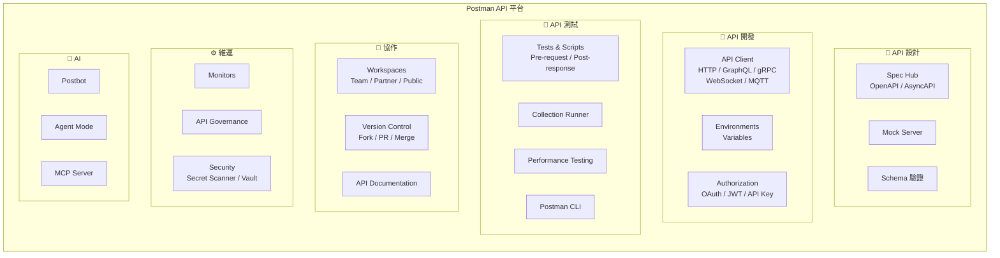

**核心功能矩陣：**

| 功能類別 | 主要能力 | 支援協定 |
|---------|---------|---------|
| **API Client** | 發送請求、檢視回應、認證管理、Cookie 管理 | HTTP、HTTPS |
| **多協定支援** | 原生支援多種 API 協定 | GraphQL、gRPC、WebSocket、MQTT、SSE |
| **Tests & Scripts** | Pre-request / Post-response 腳本、斷言 | JavaScript（Sandbox） |
| **Collection Runner** | 批次執行、資料驅動、效能測試 | — |
| **Spec Hub** | API 定義設計、Schema 驗證 | OpenAPI 3.x、AsyncAPI、GraphQL SDL |
| **Mock Server** | 模擬 API 回應、前後端並行開發 | HTTP |
| **Monitors** | 定時監控、多區域、告警 | HTTP |
| **Insights** | API 流量分析、生產環境可視化 | HTTP |
| **Flows** | 視覺化 API 工作流編排 | HTTP |
| **Agent Mode** | AI 自然語言指令、自動化執行、智慧協助 | — |
| **MCP Server / Client** | Postman MCP Server、外部 MCP Server 探索、MCP 目錄 | MCP Protocol |
| **API Catalog** | 企業 API 資產目錄、探索與治理 | — |
| **SDK Generation** | 從 API 定義自動產生多語言 SDK | OpenAPI |
| **API Governance** | 規則引擎、合規檢查、安全掃描 | OpenAPI |
| **Postman CLI** | 命令列執行、CI/CD 整合 | — |

### 1.3 Postman 平台架構

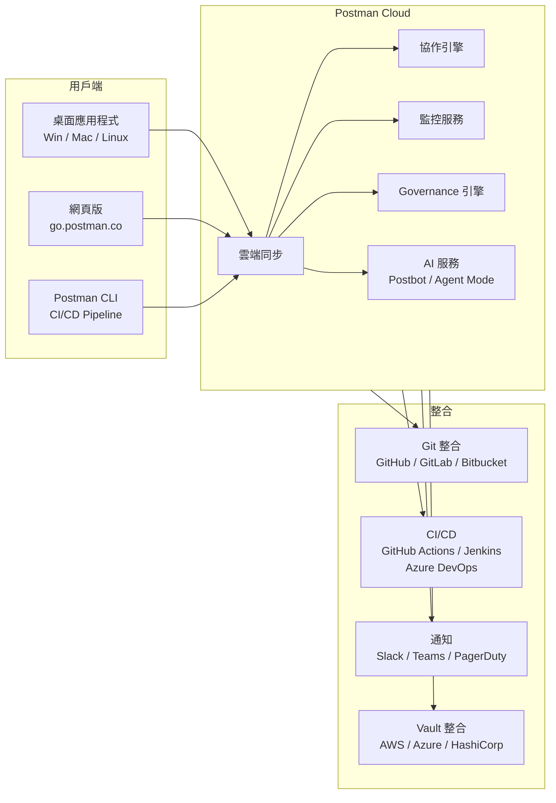

### 1.4 版本與授權方案

Postman 於 2026 年重新調整方案架構，將原有的 Basic 與 Professional 方案替換為更清晰的四層結構（舊方案既有客戶可繼續使用）：

| 方案 | 價格 | 定位 | 主要功能 | AI Credits |
|-----|------|------|---------|----------|
| **Free** | 免費 | 個人開發、學習 | API Client、基礎工具、Spec Hub、Mock Server、手動 Flows | 50 點 |
| **Solo** | $9/月（年繳） | 個人進階使用者 | 資料驅動測試、無限 NPM 套件、自訂品牌文件、擴展監控 | 400 點/月 |
| **Team** | $19/user/月（年繳） | 團隊協作 | 團隊協作、無限 Viewer、基礎 RBAC、SDK 產生 | 400 點/user/月 |
| **Enterprise** | $49/user/月（年繳） | 組織級規模 | API Catalog、Private API Network、進階 RBAC、Governance、Audit Log、Insights、BYOK、私有 Runner、Data Residency | 800 點/user/月（池化） |

**AI Credits 說明：**

Postman v12 引入 AI Credits 計費機制，所有方案均包含一定額度的 AI 點數，用於 Agent Mode、測試產生、文件產生、Flows 自動化等 AI 功能。付費方案超過額度後可以按用量付費（Pay-as-you-go，$0.035/credit）。

**附加模組（Add-on）：**

| 模組 | 價格 | 說明 |
|------|------|------|
| **Simple Security** | $6/user/月 | Team 方案專屬，新增 SSO（Google / Azure AD / Okta 等）、JIT Provisioning |
| **Advanced Security** | 聯繫業務 | Enterprise 方案專屬，Domain Capture、進階 Secret 控制、Account Discovery |
| **Premium Support** | 聯繫業務 | 24x7 支援、專屬客戶經理 |

> **企業建議**：若團隊人數超過 10 人且有合規需求（金融業、政府機關），建議直接採用 Enterprise 方案，以取得 SSO、SCIM、Audit Log、BYOK、Data Residency 與進階 Governance 功能。若僅需 SSO，Team + Simple Security Add-on 亦可滿足基本需求。

### 1.5 與同類工具比較

| 比較面向 | Postman | Insomnia | curl / HTTPie | Thunder Client（VSCode）| Swagger UI |
|---------|---------|----------|---------------|------------------------|------------|
| **定位** | 全方位 AI-Native API 平台 | 輕量 API Client | 命令列工具 | VSCode 擴充 | API 文件瀏覽 |
| **多協定** | HTTP / GraphQL / gRPC / WS / MQTT | HTTP / GraphQL / gRPC | HTTP | HTTP / GraphQL | HTTP |
| **測試腳本** | ✅ 內建 JS Sandbox | ✅ 插件支援 | ❌ 需搭配其他工具 | ⚠️ 基礎支援 | ❌ |
| **團隊協作** | ✅ Workspaces + Cloud Sync | ⚠️ 基礎支援 | ❌ | ❌ | ❌ |
| **CI/CD 整合** | ✅ Postman CLI + Newman | ⚠️ Inso CLI | ✅ 原生 | ❌ | ❌ |
| **API 設計** | ✅ Spec Hub + Mock | ⚠️ 基礎支援 | ❌ | ❌ | ✅ 瀏覽用 |
| **AI 功能** | ✅ Agent Mode + AI Credits | ❌ | ❌ | ❌ | ❌ |
| **MCP 整合** | ✅ MCP Server + Client | ❌ | ❌ | ❌ | ❌ |
| **API Governance** | ✅ 規則引擎 + Catalog | ❌ | ❌ | ❌ | ❌ |
| **SDK 產生** | ✅ 多語言 SDK | ❌ | ❌ | ❌ | ✅ Codegen |
| **IDE 整合** | ✅ VS Code Extension | ❌ | ✅ 原生 | ✅ VSCode 原生 | ❌ |
| **學習曲線** | 中 | 低 | 低 | 低 | 低 |
| **企業適用** | ✅ Enterprise 方案 | ⚠️ 有限 | ❌ | ❌ | ❌ |

### 1.6 適用場景與不適用場景

**✅ 適用場景：**

- 後端 API 開發與測試（REST / GraphQL / gRPC）
- 前後端並行開發（Mock Server）
- API 自動化測試（整合測試、回歸測試、效能測試）
- CI/CD Pipeline 中的 API 測試閘門
- 團隊協作共享 API Collection 與環境
- API 文件產生與發布
- API 監控與告警
- API 設計與治理（OpenAPI / AsyncAPI）

**❌ 不適用場景：**

- 大量單元測試（應使用 JUnit / pytest / Jest 等框架）
- UI / E2E 測試（應使用 Selenium / Cypress / Playwright）
- 長時間壓力測試（應使用 JMeter / k6 / Gatling）
- 即時封包分析（應使用 Wireshark / Fiddler）
- 資料庫直接操作測試

---

## 2. 安裝與環境設定

### 2.1 桌面應用程式安裝

#### Windows

1. 前往 [Postman 下載頁面](https://www.postman.com/downloads/)
2. 下載 Windows 64-bit 安裝程式
3. 執行安裝程式，依預設路徑安裝即可
4. 安裝完成後自動啟動

```powershell
# 使用 winget 安裝（Windows 套件管理器）
winget install Postman.Postman

# 使用 Chocolatey 安裝
choco install postman
```

#### macOS

```bash
# 使用 Homebrew 安裝
brew install --cask postman
```

- **Apple Silicon（M1/M2/M3/M4）**：下載 Apple Chip 版本，原生支援 ARM64
- **Intel**：下載 Intel Chip 版本

#### Linux

```bash
# Ubuntu / Debian（Snap）
sudo snap install postman

# Flatpak
flatpak install flathub com.getpostman.Postman

# 手動安裝（tar.gz）
wget https://dl.pstmn.io/download/latest/linux_64 -O postman-linux.tar.gz
tar -xzf postman-linux.tar.gz -C /opt
ln -s /opt/Postman/Postman /usr/local/bin/postman
```

> **企業注意事項**：若公司有軟體白名單管控，需將 Postman 加入允許清單。桌面版會在本機 `~/.postman` 或 `%APPDATA%/Postman` 存放設定與快取。

### 2.2 網頁版與 VS Code Extension

#### 網頁版

1. 前往 [go.postman.co](https://go.postman.co) 登入帳號
2. 安裝 **Postman Agent**（瀏覽器擴充功能），突破瀏覽器 CORS 限制
3. 網頁版與桌面版功能完全同步，Collection、Environment 等資料即時同步

**Postman Agent 安裝：**

- Chrome Web Store 搜尋 "Postman Agent" 安裝
- Agent 以獨立應用程式方式執行，代理瀏覽器的 API 請求
- 支援本機 localhost 請求

#### VS Code Extension

Postman 提供官方 VS Code 擴充套件，讓開發者可在 IDE 內直接操作 Postman 功能：

1. VS Code Marketplace 搜尋 **"Postman"** 安裝
2. 登入 Postman 帳號後即可存取 Collections、Environments
3. 支援發送請求、編輯腳本、檢視回應
4. 與桌面版 / 網頁版同步，變更即時反映

> **建議**：開發階段建議使用桌面版（效能更佳、支援本機檔案存取）；Code Review 或文件瀏覽時可使用網頁版；需在 IDE 內快速測試 API 時可使用 VS Code Extension。

### 2.3 帳號註冊與登入

1. 前往 [identity.getpostman.com/signup](https://identity.getpostman.com/signup)
2. 支援以下登入方式：
   - Email + 密碼
   - Google SSO
   - GitHub SSO
   - Enterprise SSO（SAML / OIDC）
3. 建立帳號後設定個人檔案（名稱、頭像、角色）
4. 加入或建立團隊（Team）

### 2.4 介面導覽

Postman 桌面版介面分為以下區域：

| 區域 | 位置 | 功能 |
|------|------|------|
| **Header Bar** | 頂部 | 搜尋、建立新請求、切換 Workspace、設定、通知 |
| **Sidebar** | 左側 | Collections、APIs、Environments、Mock Servers、Monitors、Flows、History |
| **Workbench（主工作區）** | 中央 | 請求編輯器、回應檢視器、Tab 管理 |
| **Footer Bar** | 底部 | Postman Console 開關、同步狀態、Postman Agent 狀態 |
| **Context Bar** | 右側 | 文件預覽、變數參考、AI 助手 |

**關鍵操作快捷鍵（Windows / macOS）：**

| 動作 | Windows | macOS |
|------|---------|-------|
| 新建請求 | `Ctrl + N` | `⌘ + N` |
| 新建 Tab | `Ctrl + T` | `⌘ + T` |
| 發送請求 | `Ctrl + Enter` | `⌘ + Enter` |
| 儲存請求 | `Ctrl + S` | `⌘ + S` |
| 開啟 Console | `Ctrl + Alt + C` | `⌘ + ⌥ + C` |
| 搜尋 | `Ctrl + K` | `⌘ + K` |
| 切換環境 | 點擊右上角 Environment 下拉選單 | 同左 |

### 2.5 企業網路設定（Proxy / SSL）

#### Proxy 設定

若企業使用代理伺服器上網：

1. **Settings** → **Proxy**
2. 啟用 **Use the system proxy**（使用系統代理）
3. 或手動設定 **Custom Proxy**：
   - Proxy Type：HTTP / HTTPS / SOCKS5
   - Proxy Server：`proxy.company.com`
   - Port：`8080`
   - Authentication（若需要）：username / password

#### SSL 憑證設定

企業內部 API 使用自簽憑證時：

1. **Settings** → **General** → 關閉 **SSL certificate verification**（僅限開發/測試環境）
2. 正式做法：**Settings** → **Certificates** → **Add Certificate**
   - Host：`api.internal.company.com`
   - CRT file：上傳 CA 憑證
   - KEY file：上傳用戶端金鑰（若需 mTLS）
   - Passphrase：金鑰密碼

> **⚠️ 安全提醒**：生產環境**絕對不要**關閉 SSL 驗證。應正確安裝企業 CA 憑證。

#### 自訂 CA 憑證

```powershell
# Windows：將企業 CA 加入信任根憑證
certutil -addstore -user Root "C:\certs\company-ca.crt"

# macOS：將 CA 加入鑰匙圈
sudo security add-trusted-cert -d -r trustRoot -k /Library/Keychains/System.keychain company-ca.crt
```

### 2.6 團隊初始化設定

團隊開始使用 Postman 時的建議初始化步驟：

1. **建立 Team Workspace**：為專案建立專屬工作區（例如：`Project-X API`）
2. **邀請成員**：透過 Email 邀請團隊成員加入 Workspace
3. **建立 Environments**：建立 `dev`、`sit`、`uat`、`prod` 環境
4. **建立 Collection 資料夾結構**：依功能模組或 API 版本組織
5. **設定 Governance Rules**（Enterprise）：啟用 API Naming 規範等治理規則
6. **建立 README**：在 Collection / Workspace 層級撰寫使用說明

---

## 3. 核心概念

### 3.1 Workspaces（工作區）

Workspace 是 Postman 中組織與協作的最上層單位。所有的 Collections、Environments、APIs、Mock Servers 等資源都存在於 Workspace 內。

| 類型 | 存取權限 | 適用場景 |
|------|---------|---------|
| **Personal** | 僅自己 | 個人實驗、學習 |
| **Team** | 團隊成員 | 內部 API 開發協作（最常用） |
| **Private** | 指定成員 | 敏感 API、限制存取（僅受邀者可見） |
| **Partner** | 團隊 + 外部夥伴 | 與單一外部廠商協作 API 整合 |
| **Multi-Partner** | 團隊 + 多外部夥伴 | 同時與多個外部廠商協作，各夥伴間資料隔離 |
| **Public** | 所有人 | 開源專案、公開 API 文件 |

**Workspace 組織建議：**

```
📁 Team Workspace: "Order Service API"
├── 📂 Collections
│   ├── 📋 Order API v2
│   ├── 📋 Order API v1 (deprecated)
│   └── 📋 Integration Tests
├── 🌐 Environments
│   ├── dev
│   ├── sit
│   ├── uat
│   └── prod
├── 🎭 Mock Servers
│   └── Order Mock v2
├── 📡 Monitors
│   └── Order Health Check
└── 📖 APIs
    └── Order API (OpenAPI 3.1)
```

### 3.2 Collections（集合）

Collection 是 Postman 的核心組織單位，用於將相關的 API 請求分組管理。

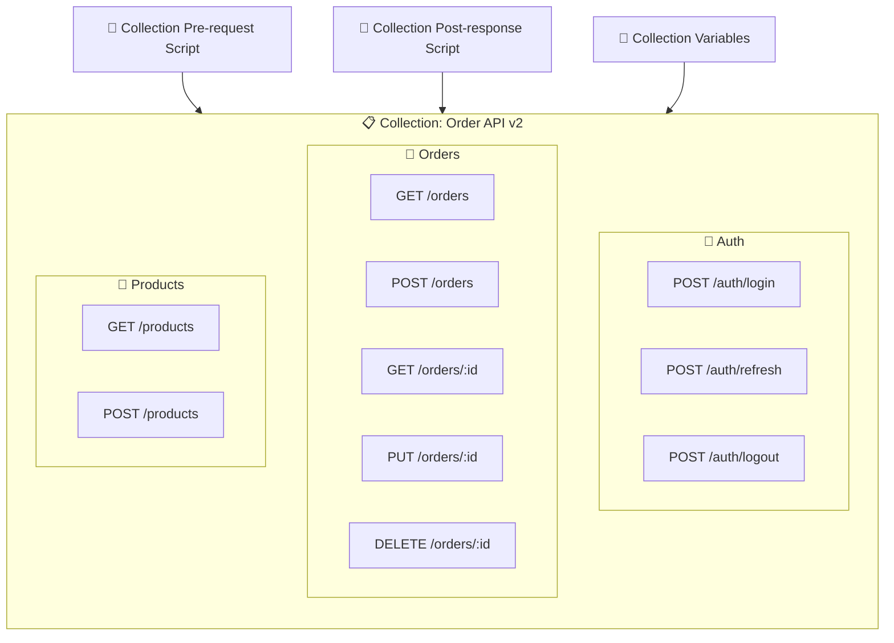

**Collection 組織最佳實務：**

- **依功能模組分資料夾**：`Auth`、`Orders`、`Products`、`Users`
- **統一命名規則**：`HTTP_METHOD /path - 描述`，例如：`POST /orders - 建立訂單`
- **設定 Collection 層級變數**：`baseUrl`、`apiVersion` 等
- **撰寫 Collection README**：說明用途、前置條件、使用方式
- **設定 Collection 層級腳本**：共用的認證邏輯放在 Collection Pre-request Script

### 3.3 Environments 與 Variables

#### 變數類型與作用域

Postman 提供五種作用域的變數，優先順序由高到低：

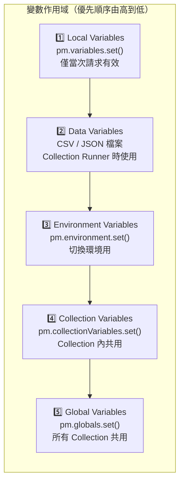

#### 變數使用語法

在 URL、Header、Body 等位置使用雙大括號語法引用變數：

```
{{baseUrl}}/api/v1/orders/{{orderId}}
```

```json
{
  "token": "{{accessToken}}",
  "userId": "{{userId}}"
}
```

### 3.4 Authorization（認證與授權）

Postman 支援多種認證方式，可在 Collection、Folder 或 Request 層級設定：

| 認證類型 | 適用場景 | 設定方式 |
|---------|---------|---------|
| **No Auth** | 公開 API | 預設 |
| **API Key** | 簡單 API 認證 | Key / Value 放在 Header 或 Query Param |
| **Bearer Token** | JWT / OAuth 2.0 Token | `Authorization: Bearer {{token}}` |
| **Basic Auth** | 舊式系統 | Username + Password，自動 Base64 編碼 |
| **Digest Auth** | 進階 HTTP 認證 | 自動處理 nonce 交換 |
| **OAuth 2.0** | 第三方登入 | 完整 OAuth 流程（Authorization Code / Client Credentials / PKCE） |
| **AWS Signature** | AWS 服務 | Access Key + Secret Key + Region |
| **NTLM / Kerberos** | Windows 企業網路 | 域帳號認證 |

**OAuth 2.0 設定範例（Authorization Code + PKCE）：**

1. Auth Type 選擇 **OAuth 2.0**
2. 填入：
   - Grant Type：`Authorization Code (With PKCE)`
   - Auth URL：`https://auth.company.com/authorize`
   - Token URL：`https://auth.company.com/token`
   - Client ID：`your-client-id`
   - Scope：`openid profile email`
   - Code Challenge Method：`S256`
3. 點擊 **Get New Access Token**
4. 完成瀏覽器認證後，Token 自動填入

> **最佳實務**：在 Collection 層級設定認證，子資料夾與請求選擇 **Inherit auth from parent**，避免重複設定。

### 3.5 Postman Console

Postman Console 是除錯的核心工具，等同於瀏覽器的 DevTools Console：

- **開啟方式**：底部 Footer Bar 點擊 **Console** 或 `Ctrl + Alt + C`
- **顯示內容**：
  - 完整的 HTTP Request / Response（含 Header、Body、Status Code）
  - `console.log()` 輸出（來自 Pre-request 與 Post-response Script）
  - 請求時間、大小
  - 重定向記錄
  - 憑證資訊

```javascript
// 在腳本中使用 console 進行除錯
console.log("Request URL:", pm.request.url.toString());
console.log("Environment:", pm.environment.get("env_name"));
console.info("Token expires at:", pm.environment.get("tokenExpiry"));
console.warn("Token will expire soon!");
console.error("Authentication failed!");
```

---

## 4. 發送 API 請求

### 4.1 建立與發送 HTTP 請求

#### 基本步驟

1. 點擊 **New** → **HTTP** 或使用 `Ctrl + N`
2. 選擇 HTTP Method（GET / POST / PUT / PATCH / DELETE / HEAD / OPTIONS）
3. 輸入 URL：`{{baseUrl}}/api/v1/orders`
4. 設定 Headers、Params、Body、Auth
5. 點擊 **Send** 或 `Ctrl + Enter`

#### GET 請求範例

```
GET {{baseUrl}}/api/v1/orders?status=active&page=1&size=20
```

**Query Parameters 設定：**

| Key | Value | Description |
|-----|-------|-------------|
| `status` | `active` | 訂單狀態篩選 |
| `page` | `1` | 頁碼 |
| `size` | `20` | 每頁筆數 |

#### POST 請求範例

```
POST {{baseUrl}}/api/v1/orders
Content-Type: application/json
Authorization: Bearer {{accessToken}}
```

```json
{
  "customerId": "{{customerId}}",
  "items": [
    {
      "productId": "PROD-001",
      "quantity": 2,
      "unitPrice": 150.00
    }
  ],
  "shippingAddress": {
    "city": "台北市",
    "district": "信義區",
    "address": "市府路1號"
  }
}
```

#### Path Variables

URL 中使用 `:paramName` 語法定義路徑參數：

```
GET {{baseUrl}}/api/v1/orders/:orderId/items/:itemId
```

Postman 會自動在 Params Tab 的 Path Variables 區域顯示 `orderId` 和 `itemId`，供輸入值。

### 4.2 Request Body 格式

| 格式 | Content-Type | 適用場景 |
|------|-------------|---------|
| **none** | — | GET / DELETE 等無 Body 的請求 |
| **form-data** | `multipart/form-data` | 檔案上傳、表單提交 |
| **x-www-form-urlencoded** | `application/x-www-form-urlencoded` | 傳統表單、OAuth Token 請求 |
| **raw - JSON** | `application/json` | RESTful API（最常用） |
| **raw - XML** | `application/xml` | SOAP / 舊式系統 |
| **raw - Text** | `text/plain` | 純文字 |
| **binary** | `application/octet-stream` | 檔案上傳（單一檔案） |
| **GraphQL** | `application/json` | GraphQL 查詢 |

**檔案上傳範例（form-data）：**

| Key | Type | Value |
|-----|------|-------|
| `file` | File | 選擇檔案 |
| `description` | Text | `使用者頭像` |
| `category` | Text | `avatar` |

### 4.3 Response 檢視與分析

Response 區域提供多種檢視方式：

| Tab | 說明 |
|-----|------|
| **Body** | 回應內容（Pretty / Raw / Preview） |
| **Cookies** | 回應設定的 Cookie |
| **Headers** | 回應 Header |
| **Test Results** | Post-response Script 測試結果 |

**Body 檢視模式：**

- **Pretty**：格式化 JSON / XML / HTML（預設，推薦）
- **Raw**：原始文字
- **Preview**：HTML 預覽渲染
- **Visualize**：自訂視覺化（需搭配 `pm.visualizer.set()`）

**Response 關鍵資訊：**

- **Status Code**：`200 OK` / `201 Created` / `400 Bad Request` / `401 Unauthorized` / `500 Internal Server Error`
- **Time**：請求耗時（毫秒）
- **Size**：回應大小（含 Header）

#### Response 視覺化範例

```javascript
// Post-response Script 中自訂視覺化
const template = `
<table>
  <tr><th>ID</th><th>Name</th><th>Status</th></tr>
  {{#each response}}
  <tr><td>{{id}}</td><td>{{name}}</td><td>{{status}}</td></tr>
  {{/each}}
</table>
`;

pm.visualizer.set(template, {
  response: pm.response.json().data
});
```

### 4.4 GraphQL 請求

1. 建立新請求，Method 選 **POST**
2. Body Tab 選擇 **GraphQL**
3. 輸入 Query：

```graphql
query GetOrders($status: OrderStatus, $limit: Int) {
  orders(status: $status, limit: $limit) {
    id
    customerName
    totalAmount
    status
    createdAt
    items {
      productName
      quantity
    }
  }
}
```

4. Variables 區塊輸入：

```json
{
  "status": "ACTIVE",
  "limit": 10
}
```

> **提示**：Postman 支援 GraphQL Schema 自動補全。在 API Definition 匯入 GraphQL Schema 後，編輯器會提供欄位提示。

### 4.5 gRPC 與 WebSocket

#### gRPC 請求

1. 建立新請求，選擇 **gRPC**
2. 輸入 Server URL：`grpc.company.com:443`
3. 匯入 `.proto` 檔案或透過 Server Reflection 自動探索
4. 選擇 Service 與 Method
5. 輸入 Message（JSON 格式）
6. 支援四種 gRPC 模式：Unary、Server Streaming、Client Streaming、Bidirectional Streaming

#### WebSocket 請求

1. 建立新請求，選擇 **WebSocket**
2. 輸入 URL：`wss://ws.company.com/live`
3. 設定 Headers（如 `Authorization`）
4. 點擊 **Connect** 建立連線
5. 在 Message 欄位輸入訊息並 **Send**
6. 即時檢視收發訊息記錄

### 4.6 Cookie 與 Certificate 管理

#### Cookie 管理

1. 點擊 Header Bar 的 **Cookies** 按鈕
2. 可查看、新增、修改、刪除各 Domain 的 Cookie
3. Cookie 在同一 Workspace 內的請求之間自動共享
4. 支援 Allowlist 設定：指定允許使用 Cookie 的 Domain

#### Certificate 管理（Client Certificate / mTLS）

用於需要雙向 TLS 認證的 API：

1. **Settings** → **Certificates** → **Add Certificate**
2. 設定：
   - **Host**：`api.internal.company.com`
   - **Port**：`443`（選填）
   - **CRT file**：用戶端憑證檔案（`.crt` / `.pem`）
   - **KEY file**：私鑰檔案（`.key`）
   - **Passphrase**：私鑰密碼（若有）
3. **CA Certificates**：上傳企業內部 CA 根憑證

> **實務建議**：在企業內網環境中，建議統一將 CA 憑證安裝至作業系統信任儲存區，而非在 Postman 中逐一設定。

---

## 5. 變數與環境管理

### 5.1 變數作用域與優先順序

當多個作用域存在同名變數時，Postman 依以下優先順序解析（由高到低）：

```
Local > Data > Environment > Collection > Global
```

**各作用域使用時機：**

| 作用域 | 設定方式 | 生命週期 | 典型用途 |
|-------|---------|---------|---------|
| **Local** | `pm.variables.set("key", "val")` | 單次請求執行 | 臨時計算值、請求間傳遞 |
| **Data** | CSV / JSON 檔案 | Collection Runner 期間 | 資料驅動測試的測試資料 |
| **Environment** | `pm.environment.set("key", "val")` | 切換環境前有效 | baseUrl、Token、環境專屬設定 |
| **Collection** | `pm.collectionVariables.set("key", "val")` | Collection 內永久 | API 版本、共用路徑前綴 |
| **Global** | `pm.globals.set("key", "val")` | 跨 Collection 永久 | 全域 Token、使用者偏好 |

**範例情境：**

```javascript
// Collection Variable（設一次，所有請求共用）
// 在 Collection Variables Tab 設定：
// apiVersion = "v2"
// baseUrl 不設，留給 Environment

// Environment Variable（依環境切換）
// dev: baseUrl = "http://localhost:8080"
// sit: baseUrl = "https://sit-api.company.com"
// prod: baseUrl = "https://api.company.com"

// 請求 URL 引用：
// {{baseUrl}}/api/{{apiVersion}}/orders
```

### 5.2 動態變數

Postman 內建動態變數，每次請求時自動產生隨機值：

| 變數 | 說明 | 範例輸出 |
|------|------|---------|
| `{{$guid}}` | UUID v4 | `a1b2c3d4-e5f6-7890-abcd-ef1234567890` |
| `{{$timestamp}}` | Unix 時間戳（秒） | `1716076800` |
| `{{$isoTimestamp}}` | ISO 8601 時間 | `2026-05-19T00:00:00.000Z` |
| `{{$randomInt}}` | 0-1000 隨機整數 | `742` |
| `{{$randomUUID}}` | UUID v4（同 $guid） | `...` |
| `{{$randomAlphaNumeric}}` | 隨機英數字元 | `a` |
| `{{$randomFirstName}}` | 隨機名字 | `John` |
| `{{$randomLastName}}` | 隨機姓氏 | `Smith` |
| `{{$randomEmail}}` | 隨機 Email | `john.smith@example.com` |
| `{{$randomIP}}` | 隨機 IPv4 | `192.168.1.42` |
| `{{$randomColor}}` | 隨機顏色 | `blue` |

**在腳本中使用動態變數：**

```javascript
// 在腳本中取得動態變數值
const uuid = pm.variables.replaceIn("{{$guid}}");
const timestamp = pm.variables.replaceIn("{{$timestamp}}");

// 設定為環境變數供後續請求使用
pm.environment.set("requestId", uuid);
pm.environment.set("requestTime", timestamp);
```

### 5.3 環境切換策略

#### 企業環境規劃建議

```
📁 Environments
├── 🟢 dev          → localhost / 開發機
├── 🟡 sit          → 系統整合測試環境
├── 🟠 uat          → 使用者驗收測試環境
├── 🔴 prod         → 正式環境（唯讀建議）
└── 🔵 sandbox      → 第三方 API 沙箱
```

**各環境標準變數模板：**

| 變數名 | dev | sit | uat | prod |
|--------|-----|-----|-----|------|
| `baseUrl` | `http://localhost:8080` | `https://sit-api.company.com` | `https://uat-api.company.com` | `https://api.company.com` |
| `authUrl` | `http://localhost:8180` | `https://sit-auth.company.com` | `https://uat-auth.company.com` | `https://auth.company.com` |
| `clientId` | `dev-client` | `sit-client` | `uat-client` | `prod-client` |
| `clientSecret` | `dev-secret` | *(use Vault)* | *(use Vault)* | *(use Vault)* |
| `dbHost` | `localhost` | `sit-db.internal` | `uat-db.internal` | *(不應存在)* |

> **安全原則**：`prod` 環境的 `clientSecret` 等敏感資訊**不應**存放在 Environment Variables 中，應使用 Postman Vault。

#### 環境切換操作

- **GUI**：右上角 Environment 下拉選單，一鍵切換
- **腳本中**：`pm.environment.name` 取得當前環境名稱

```javascript
// 依環境動態調整行為
if (pm.environment.name === "prod") {
    console.warn("⚠️ 正在對生產環境發送請求！");
}
```

### 5.4 Postman Vault（敏感資料管理）

Postman Vault 是本機端的敏感資料儲存機制，解決 Token、密碼等機密資訊不應儲存在雲端同步變數中的問題。

**核心特性：**

- 資料**僅存在本機**，不會同步至 Postman Cloud
- 使用 `{{vault:secretName}}` 語法引用
- 支援整合第三方 Vault：AWS Secrets Manager、Azure Key Vault、HashiCorp Vault

**設定步驟：**

1. **Settings** → **Vault** → **Add Secret**
2. 輸入 Key-Value：
   - Key：`prodApiKey`
   - Value：`sk-live-xxxxxxxxxxxxx`
3. 在請求中引用：`{{vault:prodApiKey}}`

**第三方 Vault 整合（Enterprise）：**

```javascript
// Azure Key Vault 整合設定
// Settings → Vault → Add Vault Integration
// Provider: Azure Key Vault
// Vault URL: https://my-vault.vault.azure.net/
// Authentication: Service Principal (Client ID + Secret)
```

**Shared Vault（Team / Enterprise）：**

Postman 正在推出 Shared Vault 功能，允許團隊共享加密的 Vault 機密，而不需要每位成員各自設定。Shared Vault 的資料仍為端對端加密，僅在使用時於本機解密。

> **企業強烈建議**：所有生產環境的 API Key、Token、密碼必須使用 Vault 管理，禁止直接存放在 Environment Variables 中。

### 5.5 資料檔案驅動（CSV / JSON）

Collection Runner 支援讀取外部檔案作為測試資料，實現 Data-Driven Testing。

**CSV 檔案範例（`test-data.csv`）：**

```csv
email,password,expectedStatus,expectedMessage
admin@company.com,Admin123!,200,Login successful
user@company.com,User456!,200,Login successful
invalid@company.com,wrong,401,Invalid credentials
,Admin123!,400,Email is required
admin@company.com,,400,Password is required
```

**JSON 檔案範例（`test-data.json`）：**

```json
[
  {
    "email": "admin@company.com",
    "password": "Admin123!",
    "expectedStatus": 200,
    "expectedMessage": "Login successful"
  },
  {
    "email": "invalid@company.com",
    "password": "wrong",
    "expectedStatus": 401,
    "expectedMessage": "Invalid credentials"
  }
]
```

**在請求與腳本中引用資料變數：**

```javascript
// Request Body 中引用（與一般變數相同）
// {{email}} 和 {{password}} 會自動替換為資料檔中的值

// Post-response Script 中驗證
pm.test("Status code matches expected", function () {
    pm.response.to.have.status(parseInt(pm.iterationData.get("expectedStatus")));
});

pm.test("Response message matches expected", function () {
    const response = pm.response.json();
    pm.expect(response.message).to.eql(pm.iterationData.get("expectedMessage"));
});
```

---

## 6. 腳本開發（Tests & Scripts）

Postman 的腳本引擎是其自動化能力的核心。腳本使用 JavaScript 語法，在隔離的 Sandbox 環境中執行。

### 6.1 Pre-request Script

Pre-request Script 在請求發送**之前**執行，常用於：

- 動態產生請求參數
- 計算簽章（HMAC / JWT）
- 取得或刷新 Token
- 設定時間戳

**範例 1：產生 HMAC 簽章**

```javascript
const crypto = require('crypto-js');
const timestamp = Math.floor(Date.now() / 1000).toString();
const secretKey = pm.environment.get("apiSecret");
const requestBody = pm.request.body.raw;

// 計算 HMAC-SHA256 簽章
const signature = crypto.HmacSHA256(timestamp + requestBody, secretKey).toString();

// 設定到 Header
pm.request.headers.add({
    key: "X-Timestamp",
    value: timestamp
});
pm.request.headers.add({
    key: "X-Signature",
    value: signature
});
```

**範例 2：自動刷新過期 Token**

```javascript
const tokenExpiry = pm.environment.get("tokenExpiry");
const currentTime = Math.floor(Date.now() / 1000);

if (!tokenExpiry || currentTime >= parseInt(tokenExpiry) - 60) {
    // Token 即將過期或不存在，發送刷新請求
    pm.sendRequest({
        url: pm.environment.get("authUrl") + "/token",
        method: "POST",
        header: {
            "Content-Type": "application/x-www-form-urlencoded"
        },
        body: {
            mode: "urlencoded",
            urlencoded: [
                { key: "grant_type", value: "client_credentials" },
                { key: "client_id", value: pm.environment.get("clientId") },
                { key: "client_secret", value: pm.environment.get("clientSecret") }
            ]
        }
    }, function (err, res) {
        if (err) {
            console.error("Token refresh failed:", err);
            return;
        }
        const token = res.json();
        pm.environment.set("accessToken", token.access_token);
        pm.environment.set("tokenExpiry", String(currentTime + token.expires_in));
        console.log("Token refreshed successfully");
    });
}
```

### 6.2 Post-response Script（測試斷言）

Post-response Script 在收到回應**之後**執行，用於驗證 API 回應是否符合預期。

**基本結構：**

```javascript
// 每個 pm.test() 定義一個測試案例
pm.test("Test case name", function () {
    // 使用 pm.expect() 或 pm.response 進行斷言
    pm.expect(pm.response.code).to.eql(200);
});
```

**完整測試範例：**

```javascript
// 1. 驗證 Status Code
pm.test("Status code is 200", function () {
    pm.response.to.have.status(200);
});

// 2. 驗證回應時間
pm.test("Response time is less than 500ms", function () {
    pm.expect(pm.response.responseTime).to.be.below(500);
});

// 3. 驗證回應 Header
pm.test("Content-Type is application/json", function () {
    pm.response.to.have.header("Content-Type", "application/json; charset=utf-8");
});

// 4. 驗證 JSON Body 結構
pm.test("Response has correct structure", function () {
    const response = pm.response.json();
    pm.expect(response).to.have.property("data");
    pm.expect(response).to.have.property("meta");
    pm.expect(response.data).to.be.an("array");
    pm.expect(response.meta).to.have.property("total");
    pm.expect(response.meta).to.have.property("page");
});

// 5. 驗證資料內容
pm.test("First order has required fields", function () {
    const order = pm.response.json().data[0];
    pm.expect(order).to.have.all.keys("id", "customerId", "status", "totalAmount", "createdAt");
    pm.expect(order.status).to.be.oneOf(["ACTIVE", "COMPLETED", "CANCELLED"]);
    pm.expect(order.totalAmount).to.be.a("number").and.to.be.above(0);
});

// 6. 擷取回應資料供下一個請求使用
const firstOrderId = pm.response.json().data[0].id;
pm.environment.set("orderId", firstOrderId);
console.log("Captured orderId:", firstOrderId);
```

### 6.3 pm API 完整參考

| API | 說明 | 範例 |
|-----|------|------|
| `pm.info` | 請求與執行資訊 | `pm.info.requestName`、`pm.info.iteration` |
| `pm.request` | 當前請求物件 | `pm.request.url`、`pm.request.headers`、`pm.request.body` |
| `pm.response` | 回應物件 | `pm.response.code`、`pm.response.json()`、`pm.response.text()` |
| `pm.variables` | Local 變數 | `pm.variables.get("key")`、`pm.variables.set("key", "val")` |
| `pm.environment` | 環境變數 | `pm.environment.get("key")`、`pm.environment.set("key", "val")` |
| `pm.collectionVariables` | Collection 變數 | `pm.collectionVariables.get("key")` |
| `pm.globals` | 全域變數 | `pm.globals.get("key")`、`pm.globals.set("key", "val")` |
| `pm.iterationData` | Data 檔案變數 | `pm.iterationData.get("email")` |
| `pm.test()` | 定義測試案例 | `pm.test("name", callback)` |
| `pm.expect()` | Chai BDD 斷言 | `pm.expect(value).to.eql(expected)` |
| `pm.sendRequest()` | 發送額外請求 | `pm.sendRequest(options, callback)` |
| `pm.visualizer.set()` | 自訂視覺化 | `pm.visualizer.set(template, data)` |
| `pm.execution` | 執行控制 | `pm.execution.skipRequest()`、`pm.execution.setNextRequest("name")` |
| `pm.cookies` | Cookie 存取 | `pm.cookies.get("cookieName")` |

### 6.4 Chai Assertion Library

Postman 內建 Chai BDD 斷言庫，支援鏈式語法：

```javascript
// 相等
pm.expect(value).to.eql(expected);         // 深度相等（推薦）
pm.expect(value).to.equal(expected);       // 嚴格相等（===）

// 類型
pm.expect(value).to.be.a("string");
pm.expect(value).to.be.an("array");
pm.expect(value).to.be.a("number");
pm.expect(value).to.be.an("object");
pm.expect(value).to.be.a("boolean");
pm.expect(value).to.be.null;
pm.expect(value).to.be.undefined;

// 比較
pm.expect(value).to.be.above(10);          // >
pm.expect(value).to.be.below(100);         // <
pm.expect(value).to.be.at.least(1);        // >=
pm.expect(value).to.be.at.most(50);        // <=
pm.expect(value).to.be.within(1, 100);     // 範圍

// 包含
pm.expect(string).to.include("substr");
pm.expect(array).to.include("item");
pm.expect(object).to.have.property("key");
pm.expect(object).to.have.all.keys("a", "b", "c");
pm.expect(object).to.have.any.keys("a", "b");

// 長度
pm.expect(array).to.have.lengthOf(5);
pm.expect(array).to.have.length.above(0);
pm.expect(string).to.have.lengthOf.at.least(1);

// 正則
pm.expect(string).to.match(/^[A-Z]{2}-\d+$/);

// 否定
pm.expect(value).to.not.eql(unexpected);
pm.expect(array).to.not.be.empty;

// 布林
pm.expect(value).to.be.true;
pm.expect(value).to.be.false;
pm.expect(value).to.be.ok;    // truthy
```

### 6.5 請求鏈結（Chaining Requests）

將前一個請求的回應資料傳遞至下一個請求，實現完整的測試流程：

**流程範例：Login → Create Order → Get Order → Delete Order**

**Step 1：Login（Post-response Script）**

```javascript
pm.test("Login successful", function () {
    pm.response.to.have.status(200);
    const token = pm.response.json().accessToken;
    pm.environment.set("accessToken", token);
    console.log("Token saved to environment");
});
```

**Step 2：Create Order（Post-response Script）**

```javascript
pm.test("Order created", function () {
    pm.response.to.have.status(201);
    const orderId = pm.response.json().data.id;
    pm.environment.set("orderId", orderId);
    console.log("Order created:", orderId);
});
```

**Step 3：Get Order（使用前步驟的 orderId）**

```
GET {{baseUrl}}/api/v1/orders/{{orderId}}
Authorization: Bearer {{accessToken}}
```

```javascript
pm.test("Order retrieved correctly", function () {
    pm.response.to.have.status(200);
    const order = pm.response.json().data;
    pm.expect(order.id).to.eql(pm.environment.get("orderId"));
});
```

**Step 4：Delete Order**

```javascript
pm.test("Order deleted", function () {
    pm.response.to.have.status(204);
    // 清理環境變數
    pm.environment.unset("orderId");
});
```

### 6.6 常見測試範例

#### JSON Schema 驗證

```javascript
const schema = {
    type: "object",
    required: ["data", "meta"],
    properties: {
        data: {
            type: "array",
            items: {
                type: "object",
                required: ["id", "name", "status"],
                properties: {
                    id: { type: "string", pattern: "^[A-Z]{2}-\\d+$" },
                    name: { type: "string", minLength: 1 },
                    status: { type: "string", enum: ["ACTIVE", "INACTIVE"] },
                    createdAt: { type: "string", format: "date-time" }
                }
            }
        },
        meta: {
            type: "object",
            required: ["total", "page", "size"],
            properties: {
                total: { type: "integer", minimum: 0 },
                page: { type: "integer", minimum: 1 },
                size: { type: "integer", minimum: 1, maximum: 100 }
            }
        }
    }
};

pm.test("Response matches JSON Schema", function () {
    pm.response.to.have.jsonSchema(schema);
});
```

#### 分頁驗證

```javascript
pm.test("Pagination is correct", function () {
    const meta = pm.response.json().meta;
    const data = pm.response.json().data;

    pm.expect(meta.page).to.eql(1);
    pm.expect(meta.size).to.eql(20);
    pm.expect(data.length).to.be.at.most(meta.size);
    pm.expect(meta.total).to.be.at.least(data.length);
    pm.expect(meta.totalPages).to.eql(Math.ceil(meta.total / meta.size));
});
```

#### 錯誤回應驗證

```javascript
pm.test("Error response has correct format", function () {
    pm.response.to.have.status(400);
    const error = pm.response.json();
    pm.expect(error).to.have.property("error");
    pm.expect(error.error).to.have.all.keys("code", "message", "details");
    pm.expect(error.error.code).to.be.a("string");
    pm.expect(error.error.message).to.be.a("string");
    pm.expect(error.error.details).to.be.an("array");
});
```

#### 回應時間 SLA 驗證

```javascript
pm.test("Response time SLA check", function () {
    // P99 < 500ms
    pm.expect(pm.response.responseTime).to.be.below(500);
});

pm.test("Response time classification", function () {
    const time = pm.response.responseTime;
    if (time < 200) {
        console.log("✅ Excellent: " + time + "ms");
    } else if (time < 500) {
        console.log("⚠️ Acceptable: " + time + "ms");
    } else {
        console.warn("❌ Slow: " + time + "ms");
    }
});
```

### 6.7 可重用腳本（Package Library）

Postman 支援 **Package Library**，讓團隊共享可重用的腳本模組：

1. 在 Workspace 中建立 **Package**
2. 撰寫共用函式：

```javascript
// Package: api-test-helpers

/**
 * 驗證標準成功回應格式
 */
function validateSuccessResponse(statusCode = 200) {
    pm.test(`Status code is ${statusCode}`, function () {
        pm.response.to.have.status(statusCode);
    });

    pm.test("Response time is acceptable", function () {
        pm.expect(pm.response.responseTime).to.be.below(2000);
    });

    pm.test("Content-Type is JSON", function () {
        pm.response.to.have.header("Content-Type");
        pm.expect(pm.response.headers.get("Content-Type")).to.include("application/json");
    });
}

/**
 * 驗證標準錯誤回應格式
 */
function validateErrorResponse(expectedStatus) {
    pm.test(`Status code is ${expectedStatus}`, function () {
        pm.response.to.have.status(expectedStatus);
    });

    pm.test("Error response has standard format", function () {
        const body = pm.response.json();
        pm.expect(body).to.have.property("error");
        pm.expect(body.error).to.have.property("code");
        pm.expect(body.error).to.have.property("message");
    });
}

module.exports = { validateSuccessResponse, validateErrorResponse };
```

3. 在請求的腳本中引入：

```javascript
const { validateSuccessResponse, validateErrorResponse } = pm.require("api-test-helpers");

// 使用共用函式
validateSuccessResponse(200);

// 額外的自訂測試
pm.test("Response contains orders", function () {
    pm.expect(pm.response.json().data).to.be.an("array").and.to.not.be.empty;
});
```

---

## 7. Collection Runner 與自動化測試

### 7.1 Collection Runner 使用

Collection Runner 可批次執行 Collection 內的所有請求，適合整合測試與回歸測試。

**啟動方式：**

1. 在 Collection 上右鍵 → **Run collection**
2. 或點擊 Collection 右側的 **▶ Run** 按鈕

**Runner 設定選項：**

| 選項 | 說明 | 建議值 |
|------|------|--------|
| **Environment** | 使用的環境 | 選擇目標環境 |
| **Iterations** | 執行次數 | 1（單次）或配合 Data 檔案 |
| **Delay** | 請求間延遲（ms） | 0-1000（避免 Rate Limit） |
| **Data** | CSV / JSON 檔案 | 資料驅動測試用 |
| **Save responses** | 儲存回應 | 除錯時啟用 |
| **Keep variable values** | 保留執行後的變數 | 依需求 |
| **Run manually** | 手動逐步執行 | 除錯用 |

### 7.2 執行順序控制

預設情況下，Collection Runner 依資料夾與請求的排列順序執行。可透過 `pm.execution.setNextRequest()` 動態控制：

```javascript
// 跳轉到指定請求
pm.execution.setNextRequest("Create Order");

// 跳過後續所有請求（結束執行）
pm.execution.setNextRequest(null);

// 條件式跳轉
if (pm.response.code === 401) {
    pm.execution.setNextRequest("Login");  // Token 過期，重新登入
} else if (pm.response.code === 200) {
    pm.execution.setNextRequest("Verify Order");
}

// 跳過當前請求（Pre-request Script 中使用）
pm.execution.skipRequest();
```

**工作流範例：**

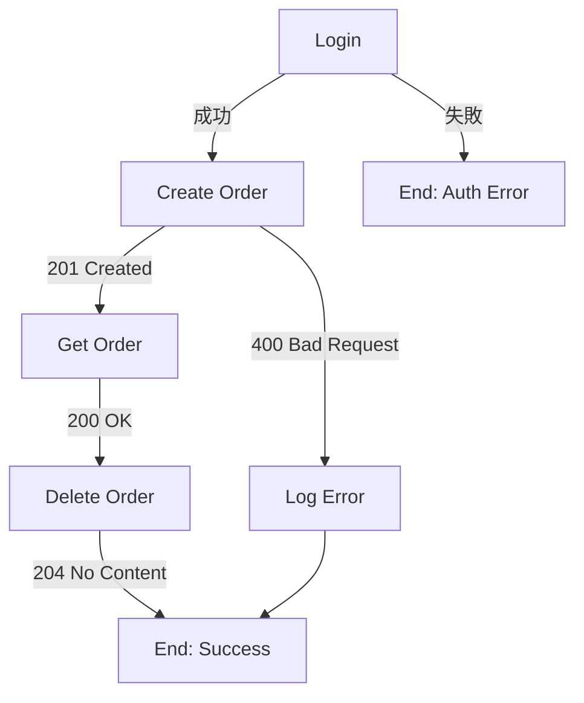

### 7.3 Data-Driven Testing

將 CSV / JSON 檔案載入 Collection Runner，每筆資料執行一次完整的 Collection：

**步驟：**

1. 準備測試資料檔案（參見 [5.5 資料檔案驅動](#55-資料檔案驅動csv--json)）
2. Runner 中點擊 **Select File** 載入資料檔
3. **Iterations** 自動設定為資料筆數
4. 在請求 Body 與 URL 中用 `{{columnName}}` 引用欄位
5. 在 Post-response Script 中用 `pm.iterationData.get("columnName")` 取值

**批次驗證範例（登入 API 邊界測試）：**

```javascript
// 取得當前迭代的預期值
const expectedStatus = parseInt(pm.iterationData.get("expectedStatus"));
const expectedMessage = pm.iterationData.get("expectedMessage");
const testEmail = pm.iterationData.get("email");

pm.test(`[${testEmail}] Status ${expectedStatus}`, function () {
    pm.response.to.have.status(expectedStatus);
});

pm.test(`[${testEmail}] Message: ${expectedMessage}`, function () {
    const body = pm.response.json();
    pm.expect(body.message).to.include(expectedMessage);
});
```

### 7.4 效能測試

Postman 內建效能測試功能，可模擬並發使用者對 API 進行負載測試：

**設定方式：**

1. 在 Collection Runner 中選擇 **Performance** Tab
2. 設定：
   - **Virtual Users**：模擬並發使用者數（例如：50）
   - **Test Duration**：測試持續時間（例如：60 秒）
   - **Load Profile**：Fixed / Ramp Up / Spike
3. 點擊 **Run** 開始測試

**Load Profile 類型：**

| Profile | 說明 | 適用場景 |
|---------|------|---------|
| **Fixed** | 固定並發數 | 穩態壓力測試 |
| **Ramp Up** | 逐步增加並發 | 尋找系統瓶頸 |
| **Spike** | 突然高峰 | 突發流量測試 |

**效能測試結果指標：**

- **Avg. Response Time**：平均回應時間
- **Min / Max Response Time**：最小 / 最大回應時間
- **Throughput**：每秒請求數（RPS）
- **Error Rate**：錯誤率
- **P95 / P99**：百分位回應時間

> **注意**：Postman 效能測試適合快速驗證。大規模壓力測試建議使用 JMeter、k6 或 Gatling。

### 7.5 整合測試與回歸測試

#### 整合測試策略

將多個 API 請求組成完整業務流程，驗證系統整合正確性：

```
📋 Collection: Order Integration Tests
├── 📁 Setup
│   ├── POST /auth/login              → 取得 Token
│   └── POST /products                → 建立測試商品
├── 📁 Happy Path
│   ├── POST /orders                  → 建立訂單
│   ├── GET /orders/:id               → 查詢訂單
│   ├── PUT /orders/:id/status        → 更新狀態
│   └── GET /orders/:id/history       → 查詢歷程
├── 📁 Error Cases
│   ├── POST /orders (invalid body)   → 400 驗證
│   ├── GET /orders/nonexistent       → 404 驗證
│   └── DELETE /orders/:id (no auth)  → 401 驗證
└── 📁 Cleanup
    ├── DELETE /orders/:id            → 刪除測試訂單
    └── DELETE /products/:id          → 刪除測試商品
```

#### 回歸測試

- 將穩定的 Integration Test Collection 設定為 **Monitor**，定期自動執行
- 或整合至 CI/CD Pipeline（見 Ch8），每次 PR 觸發
- 測試失敗時自動通知（Slack / Teams / Email）

---

## 8. Postman CLI 與 CI/CD 整合

### 8.1 Postman CLI 安裝與設定

Postman CLI 是官方推出的命令列工具，用於在 CI/CD Pipeline 中執行 Collection。

**安裝方式：**

```bash
# Windows（PowerShell）
powershell -Command "iwr 'https://dl-cli.pstmn.io/install/win64.ps1' -useb | iex"

# macOS
curl -o- "https://dl-cli.pstmn.io/install/osx_arm64.sh" | sh

# Linux
curl -o- "https://dl-cli.pstmn.io/install/linux64.sh" | sh
```

**登入認證：**

```bash
# 使用 API Key 登入（CI/CD 環境推薦）
postman login --with-api-key PMAK-xxxxxxxxxxxxxxxxxxxxxxxx

# API Key 取得方式：Postman Settings → API Keys → Generate API Key
```

### 8.2 命令列執行 Collection

```bash
# 基本執行
postman collection run <collection-id>

# 指定環境
postman collection run <collection-id> -e <environment-id>

# 指定迭代次數與資料檔案
postman collection run <collection-id> \
    -e <environment-id> \
    --iteration-count 5 \
    --iteration-data test-data.csv

# 指定資料夾（僅執行部分測試）
postman collection run <collection-id> \
    --folder "Happy Path"

# 輸出報告
postman collection run <collection-id> \
    -e <environment-id> \
    --reporter-cli \
    --reporter-json --reporter-json-export results.json
```

**取得 Collection / Environment ID：**

- 在 Postman GUI 中，對 Collection 右鍵 → **Share** → 複製 Collection ID
- 或使用 Postman API 查詢

### 8.3 Newman（傳統 CLI）

Newman 是 Postman 早期的 CLI 工具，部分團隊仍在使用：

```bash
# 安裝
npm install -g newman
npm install -g newman-reporter-htmlextra

# 執行
newman run collection.json \
    -e environment.json \
    --reporters cli,htmlextra \
    --reporter-htmlextra-export report.html

# 從 Postman API 直接執行
newman run "https://api.getpostman.com/collections/<id>?apikey=<key>" \
    -e "https://api.getpostman.com/environments/<id>?apikey=<key>"
```

> **遷移建議**：新專案建議直接使用 Postman CLI。Newman 將持續維護但功能不再新增。

### 8.4 GitHub Actions 整合

```yaml
# .github/workflows/api-tests.yml
name: API Tests

on:
  push:
    branches: [main, develop]
  pull_request:
    branches: [main]
  schedule:
    - cron: '0 */6 * * *'  # 每 6 小時執行一次

jobs:
  api-tests:
    runs-on: ubuntu-latest
    
    steps:
      - name: Checkout code
        uses: actions/checkout@v4

      - name: Install Postman CLI
        run: |
          curl -o- "https://dl-cli.pstmn.io/install/linux64.sh" | sh

      - name: Login to Postman CLI
        run: postman login --with-api-key ${{ secrets.POSTMAN_API_KEY }}

      - name: Run API Tests
        run: |
          postman collection run ${{ vars.POSTMAN_COLLECTION_ID }} \
            -e ${{ vars.POSTMAN_ENVIRONMENT_ID }} \
            --reporter-cli \
            --reporter-json --reporter-json-export results.json

      - name: Upload test results
        if: always()
        uses: actions/upload-artifact@v4
        with:
          name: api-test-results
          path: results.json

      - name: Notify on failure
        if: failure()
        uses: slackapi/slack-github-action@v2
        with:
          webhook: ${{ secrets.SLACK_WEBHOOK }}
          payload: |
            {
              "text": "❌ API Tests failed on ${{ github.ref_name }}"
            }
```

### 8.5 Jenkins / Azure DevOps 整合

#### Jenkins Pipeline

```groovy
// Jenkinsfile
pipeline {
    agent any
    
    environment {
        POSTMAN_API_KEY = credentials('postman-api-key')
    }
    
    stages {
        stage('Install Postman CLI') {
            steps {
                sh 'curl -o- "https://dl-cli.pstmn.io/install/linux64.sh" | sh'
            }
        }
        
        stage('Run API Tests') {
            steps {
                sh '''
                    postman login --with-api-key ${POSTMAN_API_KEY}
                    postman collection run ${POSTMAN_COLLECTION_ID} \
                        -e ${POSTMAN_ENVIRONMENT_ID} \
                        --reporter-json --reporter-json-export results.json
                '''
            }
            post {
                always {
                    archiveArtifacts artifacts: 'results.json'
                }
                failure {
                    slackSend channel: '#api-alerts',
                        message: "API Tests failed: ${env.BUILD_URL}"
                }
            }
        }
    }
}
```

#### Azure DevOps Pipeline

```yaml
# azure-pipelines.yml
trigger:
  branches:
    include:
      - main
      - develop

pool:
  vmImage: 'ubuntu-latest'

steps:
  - task: CmdLine@2
    displayName: 'Install Postman CLI'
    inputs:
      script: 'curl -o- "https://dl-cli.pstmn.io/install/linux64.sh" | sh'

  - task: CmdLine@2
    displayName: 'Run API Tests'
    inputs:
      script: |
        postman login --with-api-key $(POSTMAN_API_KEY)
        postman collection run $(POSTMAN_COLLECTION_ID) \
          -e $(POSTMAN_ENVIRONMENT_ID) \
          --reporter-json --reporter-json-export $(Build.ArtifactStagingDirectory)/results.json
    env:
      POSTMAN_API_KEY: $(PostmanApiKey)

  - task: PublishBuildArtifacts@1
    displayName: 'Publish Results'
    condition: always()
    inputs:
      PathtoPublish: '$(Build.ArtifactStagingDirectory)'
      ArtifactName: 'api-test-results'
```

**CI/CD 整合架構圖：**

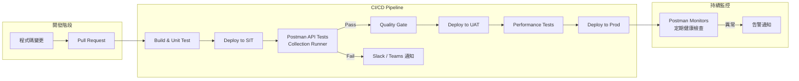


---

## 9. API 設計與文件

### 9.1 Spec Hub（OpenAPI / AsyncAPI）

Spec Hub 是 Postman 的 API 定義管理中心，支援以 Design-First 方式開發 API。

**支援的 API 規格：**

| 規格 | 版本 | 用途 |
|------|------|------|
| **OpenAPI** | 3.0 / 3.1 | RESTful API 定義（最常用） |
| **AsyncAPI** | 2.x | 事件驅動 API（Kafka、WebSocket） |
| **GraphQL SDL** | — | GraphQL Schema 定義 |
| **RAML** | 1.0 | （匯入支援） |
| **WSDL** | 1.1 / 2.0 | SOAP 服務（匯入支援） |

**Design-First 工作流程：**

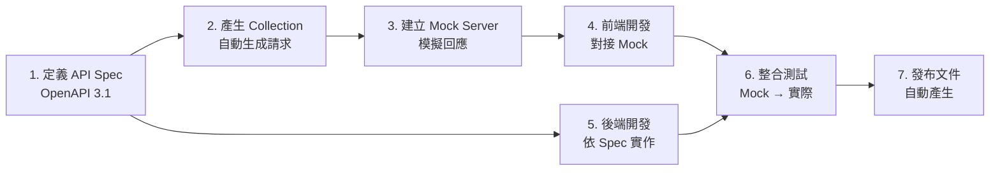

**建立 API 定義：**

1. Sidebar → **APIs** → **Create API**
2. 輸入名稱與版本（例如：`Order API v2`）
3. 選擇 Definition Type：**OpenAPI 3.1**
4. 撰寫或匯入 API 定義

**OpenAPI 定義範例：**

```yaml
openapi: 3.1.0
info:
  title: Order API
  version: 2.0.0
  description: 訂單管理服務 API
servers:
  - url: https://api.company.com/v2
    description: Production
  - url: https://sit-api.company.com/v2
    description: SIT
paths:
  /orders:
    get:
      summary: 查詢訂單列表
      operationId: listOrders
      parameters:
        - name: status
          in: query
          schema:
            type: string
            enum: [ACTIVE, COMPLETED, CANCELLED]
        - name: page
          in: query
          schema:
            type: integer
            default: 1
      responses:
        '200':
          description: 成功
          content:
            application/json:
              schema:
                $ref: '#/components/schemas/OrderListResponse'
    post:
      summary: 建立訂單
      operationId: createOrder
      requestBody:
        required: true
        content:
          application/json:
            schema:
              $ref: '#/components/schemas/CreateOrderRequest'
      responses:
        '201':
          description: 建立成功
components:
  schemas:
    OrderListResponse:
      type: object
      properties:
        data:
          type: array
          items:
            $ref: '#/components/schemas/Order'
        meta:
          $ref: '#/components/schemas/PaginationMeta'
    Order:
      type: object
      required: [id, status, totalAmount]
      properties:
        id:
          type: string
        status:
          type: string
          enum: [ACTIVE, COMPLETED, CANCELLED]
        totalAmount:
          type: number
          format: double
```

**從 Spec 產生 Collection：**

- API 定義頁面 → **Generate Collection**
- 自動依 `paths` 建立對應的請求
- 請求自動填入 URL、Method、Body Schema 範例

### 9.2 Mock Server 設定

Mock Server 讓前後端在 API 定義完成後即可並行開發，不需等待後端實作完成。

**建立 Mock Server：**

1. Collection 右鍵 → **Mock collection**
2. 命名 Mock Server（例如：`Order Mock v2`）
3. 選擇環境（可選）
4. 點擊 **Create Mock Server**
5. 取得 Mock URL：`https://xxxxxxxx.mock.pstmn.io`

**設定 Mock 回應：**

- 在 Collection 的各請求中新增 **Examples**
- 每個 Example 定義不同的回應情境：

| Example 名稱 | Status Code | 用途 |
|-------------|-------------|------|
| `Success` | 200 | 正常回應 |
| `Created` | 201 | 建立成功 |
| `Not Found` | 404 | 資源不存在 |
| `Validation Error` | 400 | 輸入驗證失敗 |
| `Unauthorized` | 401 | 未授權 |

**Mock 回應匹配規則（優先順序）：**

1. 請求的 `x-mock-response-name` Header 指定 Example 名稱
2. 請求的 `x-mock-response-code` Header 指定 Status Code
3. URL + Method 匹配
4. 預設回應

**在腳本中使用 Mock：**

```javascript
// Pre-request Script：開發階段自動切換 Mock
const useMock = pm.environment.get("useMock");
if (useMock === "true") {
    pm.request.url = pm.request.url.toString()
        .replace(pm.environment.get("baseUrl"), pm.environment.get("mockUrl"));
}
```

### 9.3 API 文件產生與發布

Postman 可從 Collection 自動產生互動式 API 文件。

**產生文件：**

1. Collection 右鍵 → **View documentation**
2. 文件自動包含：
   - 各請求的描述、URL、Method、Parameters
   - Request Body 範例
   - Response Examples
   - 認證資訊
   - 變數說明

**發布文件（公開分享）：**

1. 文件頁面 → **Publish**
2. 選擇公開版本與環境
3. 取得公開 URL（例如：`https://documenter.getpostman.com/view/xxxxx`）
4. 可自訂域名（Enterprise）

**撰寫良好文件的建議：**

- 為每個請求添加 **Description**（支援 Markdown）
- 為每個參數添加 **Description** 與範例值
- 提供多種 **Examples**（成功、錯誤情境）
- 在 Collection 層級撰寫 **README**（Overview、Authentication、Rate Limit）

### 9.4 版本管理與 Native Git

Postman 支援 API 版本管理與 Native Git 雙向同步整合：

**API Versioning（Postman 內建）：**

- 在 API 定義中建立多個版本（v1、v2）
- 各版本獨立管理 Spec 與 Collection

**Native Git 整合（推薦）：**

Postman v12 強化了 Native Git 功能，可直接將 Collection、Environment 與 API 定義同步至 Git 版本庫：

1. **Settings** → **Integrations** → **GitHub / GitLab / Bitbucket / Azure Repos**
2. 將 Collection 與 Environment 同步至 Git Repository
3. 支援雙向同步：Postman 變更 → Git 提交、Git 變更 → Postman 更新
4. Collection 產生（Collection Generation & Sync）：從 API Spec 自動產生並保持同步

**版本管理流程：**

```
📁 Git Repository: api-collections
├── collections/
│   ├── order-api-v2.json
│   └── order-api-v1.json
├── environments/
│   ├── dev.json
│   ├── sit.json
│   └── uat.json
└── schemas/
    └── order-api-v2.yaml  (OpenAPI)
```

**Native Git 與 Postman 內建版控的比較：**

| 面向 | Postman 內建 Fork/PR | Native Git |
|------|---------------------|------------|
| **適用對象** | 非 Git 使用者、快速協作 | 已有 Git 工作流的團隊 |
| **版本歷史** | Postman Cloud | Git Repository |
| **分支管理** | Fork → PR → Merge | Git Branch → PR → Merge |
| **CI/CD 整合** | 透過 Postman CLI | 直接觸發 Pipeline |
| **離線使用** | 需連網 | Git 本機操作 |

### 9.5 SDK Generation（SDK 產生）

Postman 支援從 API 定義自動產生多語言 SDK，加速 API 消費端的整合開發（Team 以上方案）。

**支援語言：**

| 語言 | 框架 / 用途 |
|------|-----------|
| **JavaScript / TypeScript** | Node.js / 瀏覽器 |
| **Python** | REST Client |
| **Java** | Spring / 一般 Java 應用 |
| **Go** | 原生 HTTP Client |
| **C#** | .NET 應用 |
| **Ruby** | REST Client |
| **PHP** | REST Client |
| **Swift** | iOS / macOS |
| **Kotlin** | Android / JVM |

**產生步驟：**

1. 在 API 定義頁面選擇 **Generate SDK**
2. 選擇目標語言與框架
3. 自訂設定（套件名稱、命名空間等）
4. 下載或直接推送至 Git Repository
5. SDK 可設定隨 API Spec 變更自動重新產生

### 9.6 API Catalog（Enterprise）

API Catalog 是 Enterprise 方案的核心功能，提供組織層級的 API 資產目錄，實現 API 的可探索性、可重用性與治理。

**核心能力：**

| 功能 | 說明 |
|------|------|
| **集中式 API 目錄** | 統一瀏覽組織內所有 API，含版本、狀態、Owner 資訊 |
| **API 探索** | 全文搜尋、標籤篩選、分類瀏覽 |
| **Private API Network** | 內部 API 市場，團隊可發布與訂閱 API |
| **API 生命週期狀態** | Draft → Active → Deprecated → Retired |
| **API 分析** | 各 API 的使用頻率、消費者數量、健康狀態 |
| **治理儀表板** | API 合規率、Governance 違規統計 |

**API Catalog 架構：**

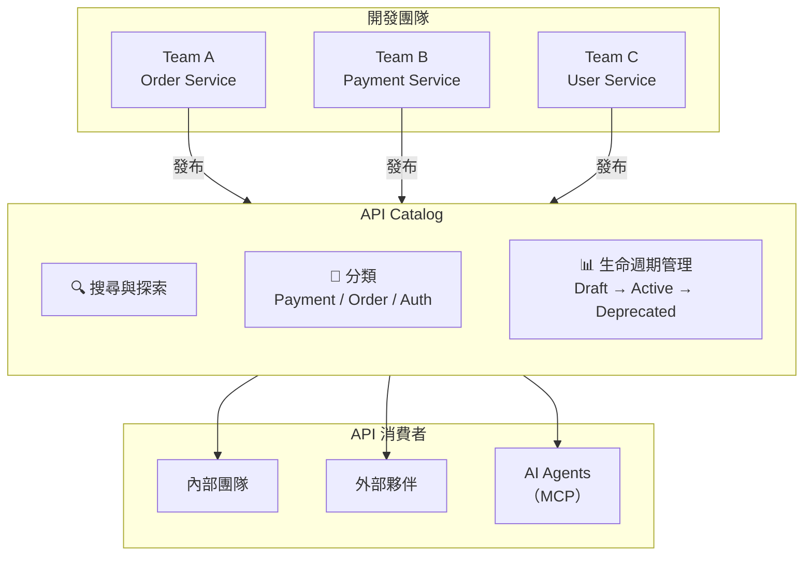

> **企業價值**：API Catalog 讓組織避免重複造輪子，提高 API 重用率。根據 Postman 2025 State of API 報告，93% 的 API 團隊仍面臨協作障礙，集中式 Catalog 是解決此問題的關鍵。

---

## 10. Postman Flows

### 10.1 Flows 概念與用途

Postman Flows 是視覺化的 API 工作流編排工具，透過拖拉方式建立多步驟的 API 調用流程，無需撰寫程式碼。

**適用場景：**

- 多 API 串接的業務流程驗證
- 資料轉換與聚合
- 建立概念驗證（PoC）
- 非技術人員進行 API 測試
- 視覺化展示 API 整合流程

### 10.2 建立視覺化工作流

**基本元件（Blocks）：**

| 元件 | 功能 | 說明 |
|------|------|------|
| **Send Request** | 發送 API 請求 | 從 Collection 選擇請求 |
| **Select** | 資料擷取 | 從 JSON 中選取特定欄位 |
| **Evaluate** | 條件判斷 | IF / ELSE 邏輯分支 |
| **For Each** | 迴圈 | 遍歷陣列資料 |
| **Create Variable** | 建立變數 | 儲存中間結果 |
| **Output** | 輸出結果 | 顯示或匯出結果 |
| **Template** | 文字模板 | 格式化輸出 |
| **Delay** | 延遲 | 等待指定時間 |
| **Log** | 日誌 | 輸出除錯訊息 |

**建立步驟：**

1. Sidebar → **Flows** → **Create Flow**
2. 拖入 **Send Request** 元件，選擇登入請求
3. 連接 **Select** 元件，擷取 Token
4. 拖入下一個 **Send Request** 元件，將 Token 連接至 Header
5. 添加 **Evaluate** 元件進行條件判斷
6. 點擊 **Run** 執行整個工作流

### 10.3 實務案例

**案例：訂單建立與驗證流程**

```
[Login] → [Select Token] → [Create Order] → [Select Order ID]
                                                     │
                                             ┌───────┴───────┐
                                             ▼               ▼
                                     [Get Order]      [List Orders]
                                             │               │
                                             ▼               ▼
                                     [Verify Status]  [Verify In List]
                                             │               │
                                             └───────┬───────┘
                                                     ▼
                                             [Delete Order]
                                                     │
                                                     ▼
                                              [Output Results]
```

**案例：多 API 資料聚合**

- 從 User Service 取得用戶資料
- 從 Order Service 取得該用戶的訂單
- 從 Product Service 取得訂單中的商品詳情
- 聚合所有資料後輸出完整報告

---

## 11. AI 功能（Agent Mode）

### 11.1 Postman AI 功能總覽

Postman v12 將 AI 定位為平台的核心引擎，以 **Agent Mode** 為中心，整合自然語言理解、上下文感知與自動執行能力。所有 AI 功能均使用 AI Credits 計費，各方案包含不同額度。

**AI 功能矩陣：**

| 功能 | 說明 | 使用位置 | Credits 消耗 |
|------|------|---------|-------------|
| **Agent Mode** | 自然語言指令自動執行多步驟任務 | 底部面板 / 任意位置 | 依複雜度 |
| **Generate Tests** | 自動分析回應並產生測試腳本 | Post-response Script | 低 |
| **Fix Tests** | 修復失敗的測試腳本 | Post-response Script | 低 |
| **Generate Documentation** | 為 Collection / Request 產生描述 | Documentation | 低 |
| **Explain Code** | 解釋現有腳本的邏輯 | 任何腳本 | 低 |
| **Generate Request** | 從自然語言描述產生 API 請求 | Request Builder | 中 |
| **Visualize Response** | 產生回應視覺化模板 | Visualizer | 低 |
| **Generate Collection** | 從描述或 Spec 產生完整 Collection | Collection 層級 | 高 |
| **Generate Flows** | AI 輔助建立自動化工作流 | Flows | 高 |
| **Troubleshoot** | 分析 API 錯誤並提供修復建議 | Response | 中 |

**AI 上下文感知：**

Agent Mode 理解你的 Postman 工作環境，包括：
- 現有的 Collections、Specs、Environments
- 請求歷史與回應結構
- 團隊的 API 定義與 Governance 規則
- 當前選取的 Environment 與變數

**使用方式：**

1. 發送請求後，在 Post-response Script 區域點擊 **AI** 圖示
2. 或直接在腳本編輯器中輸入自然語言指令
3. 在底部 Agent Mode 面板輸入任意指令

**範例互動：**

```
使用者輸入：「驗證回應是否為有效的訂單列表，包含分頁資訊，
          每筆訂單都有 id、status 和 totalAmount」

Postman AI 產出：
pm.test("Status code is 200", function () {
    pm.response.to.have.status(200);
});

pm.test("Response has pagination metadata", function () {
    const meta = pm.response.json().meta;
    pm.expect(meta).to.have.property("total");
    pm.expect(meta).to.have.property("page");
    pm.expect(meta).to.have.property("size");
});

pm.test("Each order has required fields", function () {
    const orders = pm.response.json().data;
    orders.forEach(order => {
        pm.expect(order).to.have.property("id");
        pm.expect(order).to.have.property("status");
        pm.expect(order).to.have.property("totalAmount");
    });
});
```

### 11.2 Agent Mode 深度指南

Agent Mode 是 Postman v12 的旗艦 AI 功能，允許以自然語言描述任務，AI 自動規劃並執行多步驟操作。所有方案（Free / Solo / Team / Enterprise）均可使用，依 AI Credits 額度計費。

**啟用方式：**

1. 底部面板 → 切換至 **Agent Mode**
2. 或在任何請求、Collection 中點擊 AI 圖示
3. 輸入自然語言指令

**核心特性：**

| 特性 | 說明 |
|------|------|
| **Fully Actionable** | 描述需求後直接執行操作，非僅建議 |
| **深度 API 上下文** | 理解 Collections、Specs、Environments、歷史記錄 |
| **審核模式** | 預設要求使用者確認後才執行修改操作 |
| **Auto-Run 模式** | 啟用後自動執行，無需逐步確認（進階使用） |
| **全方案可用** | Free / Solo / Team / Enterprise 均可使用 |

**支援的指令範例：**

| 自然語言指令 | Agent 執行動作 |
|-------------|---------------|
| 「建立一個 Order CRUD Collection」 | 建立 Collection 含 GET / POST / PUT / DELETE 請求 |
| 「測試所有 2xx 回應是否有正確的 JSON 格式」 | 遍歷所有請求，新增 JSON 驗證測試 |
| 「為所有請求新增 Bearer Token 認證」 | 設定 Collection 層級 Auth |
| 「將 baseUrl 換成 sit 環境」 | 切換 Environment |
| 「執行 Collection 並回報失敗的測試」 | 執行 Runner 並彙整結果 |
| 「產生 API 文件」 | 為所有請求添加描述並發布文件 |
| 「從 OpenAPI Spec 產生完整的測試 Collection」 | 分析 Spec 並產生含測試的 Collection |
| 「修復這個失敗的請求」 | 分析錯誤原因，調整 URL / Header / Body |
| 「將這兩個不同格式的 API 資料整合在一起」 | 建立 Flows 或腳本串接兩個 API |
| 「探索並整合 Stripe Payment API」 | 搜尋 API Network，建立整合 Collection |

**Agent Mode 工作流程：**

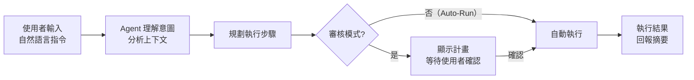

**企業 AI 治理（Enterprise）：**

Enterprise 方案提供 AI 存取控制與防護機制：

| 控制項 | 說明 |
|--------|------|
| **AI 存取管理** | 管理者可啟用 / 停用團隊的 AI 功能 |
| **AI Input Guardrails** | 防止 AI 處理敏感資料（如 PII、機密資訊） |
| **AI Usage 報表** | 追蹤團隊 AI Credits 使用情況 |
| **AI 審計** | AI 操作記錄納入 Audit Log |

### 11.3 MCP Server 與 MCP Client 整合

Postman 支援 **Model Context Protocol（MCP）** 的雙向整合——既可作為 MCP Server 供外部 AI Agent 使用，也可作為 MCP Client 連接外部 MCP Server。

**Postman 作為 MCP Server：**

將 Postman 的 Collection、Environment 等資源暴露給外部 AI Agent（如 GitHub Copilot、Cursor、Claude 等）：

```json
// MCP Server 設定（VS Code settings.json）
{
  "mcp": {
    "servers": {
      "postman": {
        "command": "npx",
        "args": ["-y", "@anthropic/postman-mcp-server"],
        "env": {
          "POSTMAN_API_KEY": "PMAK-xxxxxxxx"
        }
      }
    }
  }
}
```

**Postman 作為 MCP Client：**

Postman v12 新增 MCP Client 功能，可在 Postman 內直接連接並使用外部 MCP Server：

1. **Settings** → **MCP Servers** → **Add Server**
2. 輸入 MCP Server URL 或設定
3. 在 Agent Mode 中即可調用外部 MCP 提供的工具

**MCP Server 目錄：**

Postman 提供 [MCP Server 目錄](https://www.postman.com/explore/mcp-servers)，可探索並連接各類外部 MCP Server：

| 類別 | 範例 |
|------|------|
| **資料庫** | PostgreSQL、MongoDB、Redis |
| **雲端服務** | AWS、Azure、GCP |
| **開發工具** | GitHub、GitLab、Jira |
| **AI/ML** | OpenAI、Anthropic |
| **通訊** | Slack、Discord |

### 11.4 AI Credits 管理與最佳化

**各方案 AI Credits 額度：**

| 方案 | 包含額度 | 超額計費 |
|------|---------|---------|
| **Free** | 50 點 | 不可超額 |
| **Solo** | 400 點/月 | $0.035/credit（需啟用 Pay-as-you-go） |
| **Team** | 400 點/user/月 | $0.035/credit |
| **Enterprise** | 800 點/user/月（池化） | 聯繫業務取得批量價格 |

> **池化**（Enterprise）：團隊成員的 Credits 集中管理，由管理者統一分配。例如 10 人團隊共有 8,000 點/月，個別成員可彈性使用。

**Credits 最佳化建議：**

| 策略 | 說明 |
|------|------|
| **善用審核模式** | 確認 AI 計畫正確後再執行，避免浪費 Credits |
| **精確描述需求** | 指令越明確，AI 執行越精準，消耗越少 |
| **重用產生的腳本** | AI 產生的測試腳本存入 Package Library，避免重複產生 |
| **監控使用量** | 定期檢視 AI Usage 報表，識別過度消耗 |
| **分層使用** | 簡單操作手動完成，複雜任務交給 AI |

---

## 12. 團隊協作

### 12.1 團隊建立與管理

**建立團隊：**

1. 點擊右上角頭像 → **Manage Team**
2. 或前往 [go.postman.co/settings/team](https://go.postman.co/settings/team)
3. 設定：
   - **Team Name**：`MyCompany API Team`
   - **Team URL**：`mycompany.postman.co`
   - **Plan**：選擇方案

**邀請成員：**

- **Email 邀請**：輸入同仁 Email，發送邀請
- **邀請連結**：產生連結，發送至 Slack / Teams
- **SSO 自動加入**（Enterprise）：透過 SAML / OIDC 自動加入

### 12.2 角色與權限

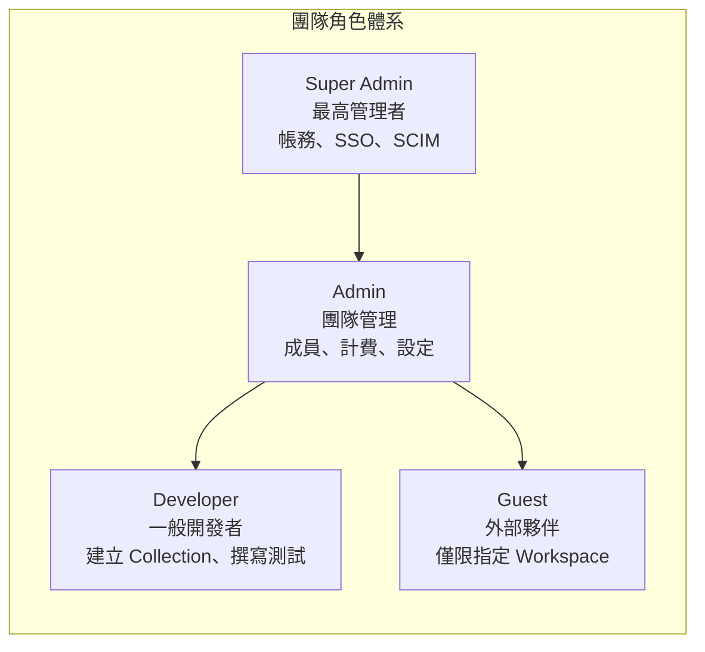

**Workspace 層級權限：**

| 權限 | Admin | Editor | Viewer |
|------|-------|--------|--------|
| 管理 Workspace 設定 | ✅ | ❌ | ❌ |
| 新增 / 刪除 Collection | ✅ | ✅ | ❌ |
| 編輯請求與腳本 | ✅ | ✅ | ❌ |
| 執行請求 | ✅ | ✅ | ✅ |
| 檢視 Collection | ✅ | ✅ | ✅ |
| Fork Collection | ✅ | ✅ | ✅ |
| 合併 Pull Request | ✅ | ✅ | ❌ |

### 12.3 Version Control（Fork / Pull Request / Merge）

Postman 內建類似 Git 的版本控制機制：

**Fork（分叉）：**

```
📋 Collection: Order API v2 (Team)
        │
        ├── 🍴 Fork → Order API v2 (Alice's Workspace)
        │       │ ← Alice 修改
        │       └── 📤 Create Pull Request
        │
        └── 🍴 Fork → Order API v2 (Bob's Workspace)
                │ ← Bob 修改
                └── 📤 Create Pull Request
```

**操作流程：**

1. **Fork**：Collection 右鍵 → **Create a Fork** → 選擇目標 Workspace
2. **修改**：在 Fork 的 Collection 中進行開發
3. **Pull Request**：修改完成後 → **Create Pull Request** → 填寫描述
4. **Review**：團隊成員審查變更差異
5. **Merge**：審查通過後 → **Merge** 至源 Collection

**衝突解決：**

- Postman 會自動偵測衝突（兩人修改同一請求）
- 衝突時需手動選擇保留哪一方的變更
- 建議：修改前先 **Pull changes** 同步最新版本

### 12.4 團隊工作區最佳實務

**Workspace 組織架構建議：**

```
📁 Team Workspaces
├── 🏢 [Project] Order Service
│   ├── 📋 Order API v2 (Source of Truth)
│   ├── 📋 Order Integration Tests
│   ├── 📋 Order Performance Tests
│   ├── 🌐 Environments (dev / sit / uat / prod)
│   ├── 🎭 Mock Server
│   ├── 📡 Monitor: Health Check
│   └── 📖 API: Order API (OpenAPI)
│
├── 🏢 [Project] User Service
│   └── ...
│
├── 🧪 [Shared] Test Utilities
│   ├── 📋 Common Test Scripts
│   └── 📦 Package Library
│
└── 📚 [Shared] API Standards & Templates
    ├── 📋 API Template Collection
    └── 📄 API Design Guidelines
```

**協作規範建議：**

| 項目 | 規範 |
|------|------|
| **Collection 命名** | `[Service] API Name vX`，例如：`[Order] Order API v2` |
| **Request 命名** | `METHOD /path - 描述`，例如：`POST /orders - 建立訂單` |
| **Folder 結構** | 依功能模組：`Auth`、`Orders`、`Products` |
| **環境管理** | 統一建立 `dev` / `sit` / `uat` / `prod`，變數名稱一致 |
| **變更流程** | Fork → 修改 → Pull Request → Review → Merge |
| **禁止事項** | 不得在 Environment 存放明文密碼、不得直接修改 Team Collection |

---


---

## 13. 安全治理與 API Governance

### 13.1 Postman Secret Scanner

Secret Scanner 自動掃描 Postman Workspace 中意外暴露的敏感資訊（API Key、密碼、Token 等），防止機密資料外洩。

**支援偵測的 Secret 類型：**

| 類型 | 範例 |
|------|------|
| **AWS Access Key** | `AKIA...` |
| **GitHub Token** | `ghp_...` / `github_pat_...` |
| **Slack Token** | `xoxb-...` |
| **Stripe Key** | `sk_live_...` |
| **Azure Storage Key** | Base64 encoded key |
| **JWT Token** | `eyJ...` |
| **通用密碼模式** | `password=`, `secret=` |
| **自訂規則**（Enterprise） | 正則表達式自訂 |

**設定與使用：**

1. **Team Settings** → **Secret Scanner** → **Enable**
2. Scanner 自動掃描 Collection、Environment、Global Variables
3. 偵測到 Secret 時發送通知
4. 在 Dashboard 檢視掃描結果與建議處理方式

**處理建議：**

| 嚴重性 | 處理方式 |
|--------|---------|
| **Critical** | 立即撤銷 Key / Token，重新產生，移至 Vault |
| **High** | 移至 Postman Vault 或第三方 Vault |
| **Medium** | 評估是否為測試用途，標記為 False Positive 或移除 |
| **Low** | 審查並決定是否需要處理 |

### 13.2 Postman Vault 與第三方整合

**Vault 整合架構：**

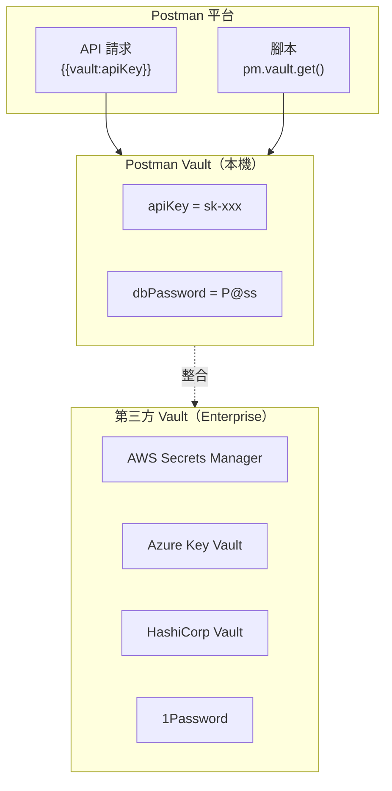

**第三方 Vault 整合步驟（以 Azure Key Vault 為例）：**

1. **Settings** → **Vault** → **Integrations** → **Azure Key Vault**
2. 設定：
   - Vault URL：`https://my-keyvault.vault.azure.net/`
   - Tenant ID：`xxxxxxxx-xxxx-xxxx-xxxx-xxxxxxxxxxxx`
   - Client ID：`xxxxxxxx-xxxx-xxxx-xxxx-xxxxxxxxxxxx`
   - Client Secret：（透過安全方式輸入）
3. 同步 Secret 至 Postman Vault
4. 在請求中使用：`{{vault:azure/my-secret-name}}`

### 13.3 API Governance Rules

API Governance 是 Postman 的規則引擎，可在 API 設計階段強制執行組織標準。

**內建規則類別：**

| 類別 | 規則範例 | 說明 |
|------|---------|------|
| **Naming** | `paths-kebab-case` | Path 必須使用 kebab-case |
| **Naming** | `properties-camelCase` | Schema 屬性使用 camelCase |
| **Security** | `security-schemes-defined` | 必須定義安全方案 |
| **Security** | `no-http-basic` | 禁止使用 HTTP Basic Auth |
| **Documentation** | `operation-description` | 每個操作必須有描述 |
| **Documentation** | `response-examples` | 回應必須有範例 |
| **Best Practice** | `no-trailing-slash` | URL 不可有尾部斜線 |
| **Best Practice** | `error-response-schema` | 錯誤回應需有統一格式 |
| **Versioning** | `api-version-header` | 必須包含版本 Header |

**設定方式：**

1. **API** → **Governance** → **Configure Rules**
2. 啟用 / 停用 / 自訂規則
3. 設定嚴重性等級：`Error`（阻擋）/ `Warning`（警告）/ `Info`（資訊）
4. 每次修改 API 定義時自動執行規則檢查

**自訂規則（Enterprise）：**

```yaml
# 自訂 Governance Rule
rules:
  company-api-standards:
    - rule: require-correlation-id
      description: "所有 API 必須支援 X-Correlation-ID Header"
      severity: error
      given: "$.paths.*.*.parameters"
      then:
        function: schema
        functionOptions:
          schema:
            type: array
            contains:
              properties:
                name:
                  const: "X-Correlation-ID"
```

### 13.4 SSO / SCIM / Audit Log

#### SSO（Single Sign-On）

Enterprise 方案支援 SSO 整合：

| Provider | 協定 | 設定方式 |
|----------|------|---------|
| **Azure AD（Entra ID）** | SAML 2.0 / OIDC | 企業最常用 |
| **Okta** | SAML 2.0 | 北美企業常用 |
| **Google Workspace** | SAML 2.0 | Google 生態系 |
| **OneLogin** | SAML 2.0 | — |
| **自訂 IdP** | SAML 2.0 | 任何支援 SAML 的 IdP |

**SSO 設定流程（Azure AD）：**

1. Azure Portal → Enterprise Applications → New Application → Postman
2. 設定 SAML：
   - Identifier：`https://identity.getpostman.com/saml/<team-id>`
   - Reply URL：`https://identity.getpostman.com/saml/acs/<team-id>`
3. Postman Team Settings → Authentication → SAML 2.0
4. 填入 IdP Metadata URL 或手動設定

#### SCIM（自動用戶管理）

透過 SCIM 協定自動同步組織成員：

- Azure AD 新增 / 移除成員時，Postman 自動同步
- 自動指派角色與 Workspace 存取權限
- 離職人員自動撤銷存取

#### Audit Log（稽核日誌）

Enterprise 方案提供完整的操作稽核日誌：

| 記錄內容 | 說明 |
|---------|------|
| **登入事件** | 誰在何時登入 |
| **Collection 變更** | 新增 / 修改 / 刪除 Collection |
| **Environment 變更** | 變數修改記錄 |
| **成員管理** | 邀請 / 移除成員 |
| **Workspace 操作** | 建立 / 刪除 Workspace |
| **API 呼叫** | Postman API 使用記錄 |

- 稽核日誌可匯出至 SIEM 系統（Splunk、ELK）
- 保留期限：依方案不同，Enterprise 最長 365 天

### 13.5 BYOK 與 Data Residency

#### BYOK（Bring Your Own Key）

Enterprise 方案支援 BYOK 加密，讓組織使用自己的加密金鑰保護儲存在 Postman Cloud 中的資料：

- 組織自行管理加密金鑰（透過 AWS KMS 或 Azure Key Vault）
- Postman 使用該金鑰加密組織的 Collection、Environment、API 定義等資料
- 金鑰輪替由組織自行控制
- 撤銷金鑰即可立即使 Postman 無法讀取資料

**BYOK 設定流程：**

1. 在雲端提供商建立 KMS 金鑰（AWS KMS / Azure Key Vault）
2. 授予 Postman 服務帳號使用金鑰的權限
3. 在 Postman Admin Console → **Security** → **Encryption** → 設定 BYOK
4. 等待資料重新加密完成

#### Data Residency（資料落地）

Enterprise 方案支援指定資料儲存區域，滿足法規合規要求：

| 區域 | 說明 | 適用法規 |
|------|------|---------|
| **US** | 美國 | — |
| **EU** | 歐盟 | GDPR |
| **AP** | 亞太 | 各國資料保護法 |

- 組織可在建立時選擇資料儲存區域
- 所有同步資料（Collection、Environment、Monitor 結果等）僅儲存在指定區域
- 一旦設定，無法變更區域（需聯繫 Postman 支援）

#### Domain Verification & Capture（Enterprise）

| 功能 | 說明 |
|------|------|
| **Domain Verification** | 驗證組織域名所有權，取得進階管控能力 |
| **Domain Capture** | 自動將使用公司域名註冊的 Postman 帳號納入組織管理 |
| **Account Discovery** | 發現組織內未納管的 Postman 帳號 |
| **Account Control** | 強制帳號加入組織或限制獨立使用 |

> **合規建議**：金融業、醫療業、政府機關等受監管行業，應啟用 BYOK + Data Residency + Domain Capture，確保 API 開發資料完全受控。

---

## 14. 監控與效能

### 14.1 Monitor 設定與排程

Postman Monitors 定期自動執行 Collection，監控 API 健康狀態與可用性。

**建立 Monitor：**

1. Collection 右鍵 → **Monitor collection**
2. 設定：
   - **Name**：`Order API Health Check`
   - **Environment**：`prod`
   - **Schedule**：排程頻率

**排程選項：**

| 頻率 | 適用場景 |
|------|---------|
| **Every 5 minutes** | 關鍵 API 即時監控 |
| **Every hour** | 一般 API 健康檢查 |
| **Every day** | 非關鍵 API 日常巡檢 |
| **Weekly** | 週期性回歸測試 |
| **Custom (Cron)** | 自訂排程 |

**進階設定：**

| 選項 | 說明 |
|------|------|
| **Regions** | 選擇執行區域（US East、EU West、AP Southeast） |
| **Retry on failure** | 失敗時自動重試 |
| **Follow redirects** | 跟隨重定向 |
| **Request timeout** | 單一請求逾時設定 |
| **Notifications** | Email / Slack / Teams / Webhook / PagerDuty |

### 14.2 效能指標與告警

**Monitor Dashboard 指標：**

| 指標 | 說明 |
|------|------|
| **Uptime** | 可用性百分比 |
| **Avg. Response Time** | 平均回應時間趨勢 |
| **Failed Tests** | 失敗的測試案例 |
| **Error Rate** | 錯誤率趨勢 |
| **Region Comparison** | 各區域效能比較 |

**告警設定：**

- 連續 N 次失敗時發送告警
- 回應時間超過閾值時發送告警
- 支援整合：
  - **Slack**：發送到指定頻道
  - **Microsoft Teams**：透過 Webhook
  - **PagerDuty**：觸發告警流程
  - **Email**：發送至團隊 Email
  - **Custom Webhook**：自訂通知端點

**Monitor 搭配 Post-response Script 實現細緻監控：**

```javascript
// 健康檢查腳本
pm.test("API is healthy", function () {
    pm.response.to.have.status(200);
});

pm.test("Response time SLA (< 1s)", function () {
    pm.expect(pm.response.responseTime).to.be.below(1000);
});

pm.test("Database connectivity", function () {
    const health = pm.response.json();
    pm.expect(health.database).to.eql("UP");
});

pm.test("External service connectivity", function () {
    const health = pm.response.json();
    pm.expect(health.externalServices.payment).to.eql("UP");
    pm.expect(health.externalServices.notification).to.eql("UP");
});
```

### 14.3 Insights（Enterprise）

Insights 是 Enterprise 方案的進階分析功能，提供 API 使用與團隊活動的統一可視化儀表板。

**Insights 儀表板類別：**

| 儀表板 | 說明 | 用途 |
|--------|------|------|
| **Team Activity** | 團隊成員的 Postman 使用情況 | 識別高活躍 / 低活躍成員 |
| **API Usage** | API 被呼叫的頻率與模式 | 發現熱門 / 冷門 API |
| **Collection Runs** | Collection 執行統計 | 追蹤測試覆蓋率 |
| **AI Usage** | AI Credits 消耗分析 | 最佳化 Credits 使用 |
| **API Governance** | Governance 規則符合率 | 追蹤 API 標準合規 |
| **Security** | 安全掃描與漏洞趨勢 | 降低安全風險 |

**關鍵指標：**

- **API 分佈**：組織中 API 按狀態（Active / Deprecated）、Team、Workspace 的分佈
- **消費者趨勢**：各 API 的消費者成長趨勢
- **反應時間 P50/P95/P99**：API 效能百分位數
- **Governance 合規率**：符合組織規範的 API 佔比
- **Credits 消耗趨勢**：AI Credits 的使用趨勢與預測

> **決策價值**：Insights 協助技術主管做出資料驅動的決策——投資哪些 API、淘汰哪些 API、哪個團隊需要更多 AI Credits。

---

## 15. 整合與擴充

### 15.1 第三方工具整合

Postman 支援與多種開發工具整合：

| 類別 | 工具 | 整合方式 |
|------|------|---------|
| **版本控制** | GitHub / GitLab / Bitbucket / Azure Repos | 雙向 Collection 同步 |
| **CI/CD** | GitHub Actions / Jenkins / Azure DevOps / CircleCI | Postman CLI |
| **通訊** | Slack / Microsoft Teams | Webhook 通知 |
| **事件管理** | PagerDuty / Opsgenie | Monitor 告警整合 |
| **APM** | Datadog / New Relic | 自訂 Webhook |
| **文件** | Confluence | API 文件發布 |
| **專案管理** | Jira | 測試失敗建立 Issue |
| **身份驗證** | Azure AD / Okta / OneLogin | SSO / SCIM |
| **金鑰管理** | AWS Secrets Manager / Azure Key Vault / HashiCorp Vault | Vault 整合 |

### 15.2 Postman API 使用

Postman 提供自身的 REST API，允許程式化管理 Postman 資源。

**API Base URL：** `https://api.getpostman.com`

**常用端點：**

```bash
# 認證：所有請求需包含 API Key
# Header: X-Api-Key: PMAK-xxxxxxxx

# 列出所有 Collection
GET /collections

# 取得特定 Collection
GET /collections/{collection_id}

# 列出所有 Environment
GET /environments

# 取得特定 Environment
GET /environments/{environment_id}

# 列出所有 Workspace
GET /workspaces

# 建立 Collection
POST /collections
{
  "collection": {
    "info": {
      "name": "New Collection",
      "schema": "https://schema.getpostman.com/json/collection/v2.1.0/collection.json"
    }
  }
}
```

**實務應用場景：**

- 自動化建立 Collection（從 OpenAPI Spec 轉換）
- 定期備份 Collection 與 Environment 至 Git
- 建立自訂 Dashboard 彙整 Monitor 結果
- 自動化成員管理（搭配 HR 系統）

### 15.3 Webhook 與自訂整合

**設定 Postman Webhook：**

1. **Team Settings** → **Webhooks** → **Create Webhook**
2. 設定：
   - **Name**：`trigger-api-tests`
   - **Collection**：選擇要執行的 Collection
   - **Environment**：選擇環境
3. 取得 Webhook URL：`https://newman-api.getpostman.com/run/<id>`
4. 從外部系統（如 GitHub、Jira）呼叫此 URL 觸發 Collection 執行

**自訂整合範例（部署完成後自動觸發 API 測試）：**

```yaml
# GitHub Actions：部署後觸發 Postman 測試
- name: Trigger Postman API Tests
  run: |
    curl -X POST "https://newman-api.getpostman.com/run/${{ secrets.POSTMAN_WEBHOOK_ID }}" \
      -H "Content-Type: application/json" \
      -d '{"environment": "${{ vars.POSTMAN_ENVIRONMENT_ID }}"}'
```

---

## 16. 企業導入策略

### 16.1 評估與導入路線圖

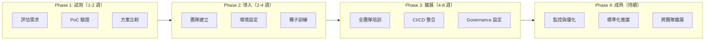

**Phase 1 - 試用評估（1-2 週）：**

| 項目 | 內容 |
|------|------|
| 目標 | 驗證 Postman 是否符合團隊需求 |
| 參與者 | 2-3 位技術骨幹 |
| 活動 | 安裝桌面版、匯入現有 API、嘗試 Collection / Environment / Scripts |
| 成果 | PoC 報告、功能評估矩陣、方案建議 |

**Phase 2 - 團隊導入（2-4 週）：**

| 項目 | 內容 |
|------|------|
| 目標 | 建立團隊基礎設施 |
| 活動 | 申請付費方案、建立 Team Workspace、設定 Environment、匯入現有 Collection |
| 種子訓練 | 4 小時 Workshop：基礎操作 + 腳本入門 |
| 成果 | 可運作的團隊工作環境 |

**Phase 3 - 擴展深化（4-8 週）：**

| 項目 | 內容 |
|------|------|
| 目標 | 整合至開發流程 |
| 活動 | CI/CD Pipeline 整合、Governance Rules 設定、Monitor 上線 |
| 培訓 | 進階 Workshop：腳本進階 + CI/CD + Mock Server |
| 成果 | 完整的 API 開發與測試流程 |

**Phase 4 - 持續優化（持續）：**

| 項目 | 內容 |
|------|------|
| 目標 | 持續改善與擴展 |
| 活動 | 收集使用回饋、優化 Collection 結構、跨團隊標準化推廣 |
| 指標 | Collection 覆蓋率、自動化測試比例、API 文件完整度 |

### 16.2 方案選擇與團隊培訓

**方案選擇決策樹：**

| 條件 | 建議方案 |
|------|---------|
| 個人學習 / 獨立開發者 | Free |
| 個人進階、需 AI 功能與更多整合 | Solo |
| 5-25 人團隊、需協作與 Governance | Team |
| 25+ 人、合規需求（金融/政府）、SSO/SCIM/BYOK | Enterprise |

> **注意**：Basic 與 Professional 方案已停止對新客戶銷售，現有客戶仍可繼續使用。新客戶請從 Free / Solo / Team / Enterprise 中選擇。

**培訓計畫建議：**

| 培訓類型 | 對象 | 時長 | 內容 |
|---------|------|------|------|
| **新人入門** | 新進工程師 | 2 小時 | 安裝、介面、基本請求、Collection、Environment |
| **腳本開發** | 後端 / QA | 4 小時 | Pre-request / Post-response Script、Chai、Data-Driven |
| **CI/CD 整合** | DevOps | 2 小時 | Postman CLI、GitHub Actions、Newman |
| **API 設計** | 架構師 | 2 小時 | Spec Hub、Mock Server、Governance |
| **管理者** | Tech Lead | 1 小時 | Workspace 管理、權限、Monitor、報表 |

### 16.3 標準化規範

**建議制定的團隊規範文件：**

1. **Postman 使用規範**：命名規則、目錄結構、變更流程
2. **Environment 管理規範**：變數命名、敏感資料處理
3. **測試腳本規範**：必測項目、斷言標準、覆蓋率要求
4. **CI/CD 整合規範**：Pipeline 設定、測試閘門標準
5. **安全規範**：Secret 管理、權限控管、Audit 要求

**測試腳本最低要求清單：**

| 項目 | 要求 |
|------|------|
| Status Code 驗證 | 每個請求必須 |
| Response Time 驗證 | 每個請求必須（SLA < 2s） |
| Content-Type 驗證 | 每個請求必須 |
| Response Body 結構驗證 | GET / POST 必須 |
| 錯誤回應格式驗證 | 至少一個錯誤情境 |
| 資料正確性驗證 | CRUD 流程必須 |

---

## 17. 最佳實務與反模式

### 17.1 最佳實務

#### Collection 組織

| # | 最佳實務 | 說明 |
|---|---------|------|
| 1 | **依服務 / 模組分 Collection** | 一個微服務對應一個 Collection，避免巨型 Collection |
| 2 | **依功能分資料夾** | `Auth`、`Orders`、`Products` 等，層次不超過 3 層 |
| 3 | **統一命名規則** | Request：`METHOD /path - 描述`；Folder：功能名稱 |
| 4 | **撰寫 Collection README** | 說明目的、前置條件、使用方式、Owner 資訊 |
| 5 | **為每個請求添加 Description** | 描述 API 用途、參數說明、注意事項 |

#### 變數與環境

| # | 最佳實務 | 說明 |
|---|---------|------|
| 6 | **baseUrl 放 Environment** | 方便切換 dev / sit / uat / prod |
| 7 | **apiVersion 放 Collection Variable** | Collection 內共用，不隨環境變 |
| 8 | **敏感資料放 Vault** | API Key、Password、Token 禁止存放在 Environment |
| 9 | **Environment 變數名稱統一** | 各環境的變數名稱完全一致，僅值不同 |
| 10 | **善用 Initial Value / Current Value** | Initial Value 可同步分享；Current Value 僅本機 |

#### 腳本開發

| # | 最佳實務 | 說明 |
|---|---------|------|
| 11 | **Collection 層級設定共用 Auth** | 子請求 Inherit from parent，避免重複設定 |
| 12 | **Token 自動刷新** | Pre-request Script 檢查過期並刷新 |
| 13 | **每個請求至少 3 個基本測試** | Status Code、Response Time、Content-Type |
| 14 | **使用 Package Library** | 共用測試函式抽出為 Package，避免複製貼上 |
| 15 | **善用 console.log 除錯** | 開發時在腳本中輸出關鍵資訊至 Console |

#### 團隊協作

| # | 最佳實務 | 說明 |
|---|---------|------|
| 16 | **使用 Fork → PR → Merge 流程** | 不直接修改 Team Collection |
| 17 | **定期同步 Fork** | 修改前先 Pull changes |
| 18 | **Code Review PR 描述** | 說明變更原因與影響範圍 |
| 19 | **指定 Collection Owner** | 每個 Collection 有明確負責人 |
| 20 | **定期清理過期資源** | 移除不再使用的 Collection、Environment、Mock |

#### CI/CD 與維運

| # | 最佳實務 | 說明 |
|---|---------|------|
| 21 | **API 測試作為 Quality Gate** | PR 合併前必須通過 API 測試 |
| 22 | **分離 Smoke / Integration / E2E 測試** | 不同 Collection 對應不同測試層級 |
| 23 | **Monitor 監控關鍵 API** | 至少監控 Health Check、Login、核心業務 API |
| 24 | **測試報告存檔** | 保留歷史執行報告，追蹤品質趨勢 |
| 25 | **Infrastructure as Code** | Collection / Environment JSON 納入 Git 版控 |

### 17.2 常見反模式

| # | 反模式 | 問題 | 正確做法 |
|---|--------|------|---------|
| 1 | **硬編碼 URL** | 無法切換環境 | 使用 `{{baseUrl}}` 變數 |
| 2 | **硬編碼 Token** | Token 過期後需手動更新 | Pre-request Script 自動刷新 |
| 3 | **密碼存 Environment** | 雲端同步導致洩漏風險 | 使用 Postman Vault |
| 4 | **巨型 Collection** | 數百個請求難以維護 | 依服務 / 模組拆分 |
| 5 | **無測試腳本** | 手動檢查回應，易遺漏 | 每個請求至少 3 個斷言 |
| 6 | **複製貼上測試** | 修改一處需改多處 | 使用 Package Library |
| 7 | **直接修改 Team Collection** | 可能覆蓋他人變更 | Fork → PR → Merge |
| 8 | **不設 Description** | 新人無法理解 API 用途 | 必須撰寫描述 |
| 9 | **忽略 Console** | 問題難以追蹤 | 善用 console.log 除錯 |
| 10 | **關閉 SSL 驗證後忘記開啟** | 生產環境安全風險 | 僅在開發環境關閉，加入醒目提醒 |
| 11 | **不清理測試資料** | 測試資料殘留影響後續 | Cleanup Folder 清理 |
| 12 | **所有人用 Admin 角色** | 權限過大，誤操作風險 | 依職責分配角色 |

---

## 18. 常見問題與除錯（FAQ）

### 基礎問題

**Q1：Postman 免費版可以商用嗎？**

可以。Free 方案允許商業使用，但有執行次數與團隊功能限制。企業團隊建議使用付費方案以取得團隊協作、Governance 與進階功能。

**Q2：桌面版與網頁版有何差異？**

功能基本相同，資料即時同步。差異：
- 桌面版：效能較佳、支援本機檔案存取、無 CORS 限制
- 網頁版：免安裝、需安裝 Postman Agent 突破 CORS、適合快速瀏覽

**Q3：Postman 的資料存在哪裡？**

- **雲端**：Collection、Environment、Global Variables 等同步至 Postman Cloud
- **本機**：Postman Vault、History、Desktop Settings 存在本機
- **匯出**：可將 Collection / Environment 匯出為 JSON 檔案

**Q4：如何從 Swagger UI / curl 遷移到 Postman？**

- **Swagger / OpenAPI**：File → Import → 匯入 `.yaml` / `.json`，自動產生 Collection
- **curl**：File → Import → 貼上 curl 指令，自動轉為 Postman 請求
- **HAR**：File → Import → 匯入 `.har` 檔案（從瀏覽器 DevTools 匯出）

### 環境與變數

**Q5：為什麼我的變數沒有被替換（顯示 `{{variableName}}`）？**

常見原因：
1. 未選擇 Environment（右上角下拉選單）
2. 變數名稱拼寫錯誤（大小寫敏感）
3. 變數定義在錯誤的作用域（例如在 Collection A 設定，但在 Collection B 使用）
4. 變數值為空

除錯步驟：將滑鼠移至 `{{variable}}` 上，Postman 會顯示解析結果與來源作用域。

**Q6：Initial Value 與 Current Value 的差異？**

- **Initial Value**：同步至 Postman Cloud，團隊成員可見。適合非敏感的預設值
- **Current Value**：僅存在本機，不同步。適合個人的 Token、密碼等

**Q7：如何在不同環境間共享變數？**

使用 **Collection Variables**（不隨環境切換而改變）或 **Global Variables**（跨 Collection 共用）。

### 腳本與測試

**Q8：Pre-request Script 中可以發送 HTTP 請求嗎？**

可以。使用 `pm.sendRequest()` 發送額外請求（例如取得 Token）。注意此請求是同步阻塞的，會增加整體請求時間。

**Q9：如何在不同請求之間傳遞資料？**

在 Post-response Script 中使用 `pm.environment.set("key", value)` 或 `pm.collectionVariables.set("key", value)` 儲存資料，下一個請求透過 `{{key}}` 引用。

**Q10：pm.test() 失敗但請求本身是成功的，怎麼辦？**

`pm.test()` 失敗不影響請求本身。檢查測試斷言是否正確：
- 確認預期值與實際回應一致
- 使用 Console 輸出 `console.log(pm.response.json())` 檢視實際回應
- 確認 JSON 路徑正確（例如 `response.data[0].id` vs `response[0].id`）

**Q11：如何測試需要登入的 API？**

推薦做法：
1. Collection Pre-request Script 中加入 Token 自動刷新邏輯
2. Collection Auth 設定 Bearer Token：`{{accessToken}}`
3. 所有子請求 Inherit auth from parent
4. 首次執行時 Pre-request Script 自動取得 Token

**Q12：如何驗證 Response 的 JSON Schema？**

使用 `pm.response.to.have.jsonSchema(schema)` 進行 JSON Schema 驗證（參見 [6.6 常見測試範例](#66-常見測試範例)）。

### 協作與團隊

**Q13：如何防止團隊成員誤修改 Collection？**

1. 使用 **Fork → PR → Merge** 流程
2. 設定 Workspace 權限：一般成員為 Editor，Collection Owner 為 Admin
3. Enterprise 方案可設定 Branch Protection（鎖定直接修改）

**Q14：多人同時修改同一 Collection 會衝突嗎？**

Postman Cloud 會即時同步變更。若兩人修改同一請求的不同欄位，通常不會衝突。若修改同一欄位，後儲存者會覆蓋前者。建議使用 Fork 工作流避免衝突。

**Q15：如何將 Collection 分享給外部廠商？**

- **Public Workspace**：完全公開（適合開源 / 公共 API）
- **Partner Workspace**（Enterprise）：邀請外部夥伴，控制存取範圍
- **匯出 JSON**：直接提供 Collection JSON 檔案
- **公開文件連結**：發布 API 文件，提供唯讀瀏覽

### CI/CD 與維運

**Q16：Postman CLI 與 Newman 該選哪個？**

- **新專案**：使用 Postman CLI（官方推薦，與 Postman Cloud 深度整合）
- **舊專案**：Newman 仍可使用，但不再新增功能
- **差異**：Postman CLI 支援 Cloud Collection 直接執行、更好的報告整合

**Q17：CI/CD 環境中如何管理 API Key？**

1. 將 Postman API Key 存入 CI/CD 的 Secret 管理（如 GitHub Secrets）
2. 環境專屬的 Token / Key 存入 CI/CD Variables 或 Vault
3. **禁止**在 YAML / Jenkinsfile 中硬編碼任何密鑰

**Q18：Monitor 與 CI/CD 中的 API 測試有何差異？**

| 面向 | Monitor | CI/CD API Tests |
|------|---------|-----------------|
| 觸發時機 | 定期排程 | 程式碼變更觸發 |
| 目的 | 持續監控可用性 | 驗證程式碼變更 |
| 環境 | 通常針對 prod | 通常針對 sit / uat |
| 失敗處理 | 發送告警 | 阻擋 PR 合併或部署 |

### 進階問題

**Q19：Postman 的請求是否經過 Postman 伺服器？**

- **桌面版**：請求直接從本機發出，**不經過** Postman 伺服器
- **網頁版**：透過 Postman Agent（本機）發出，同樣不經過 Postman 伺服器
- **Mock Server / Monitor**：由 Postman Cloud 發出
- **Collection / Environment 定義**：同步至 Postman Cloud（Vault 資料除外）

**Q20：如何處理自簽憑證（Self-Signed Certificate）？**

開發 / 測試環境：
1. **Settings** → **General** → 關閉 **SSL certificate verification**（僅限開發）
2. 正式做法：**Settings** → **Certificates** → 添加企業 CA 根憑證
3. 最佳做法：將 CA 憑證安裝至作業系統信任儲存區

**Q21：Postman 支援 OAuth 2.0 PKCE 流程嗎？**

支援。在 Auth Tab 選擇 OAuth 2.0 → Grant Type 選 `Authorization Code (With PKCE)` → 設定 Code Challenge Method 為 `S256`。Postman 會自動處理 code_verifier 與 code_challenge 的產生與交換。

**Q22：如何批量更新 Collection 中的 URL？**

1. 使用 `{{baseUrl}}` 變數（推薦）：只需切換 Environment
2. Postman API：程式化批量修改 Collection JSON
3. 匯出 Collection JSON → 文字編輯器全域替換 → 重新匯入

**Q23：如何處理 API 的分頁測試（遍歷所有頁面）？**

使用 `pm.execution.setNextRequest()` 實現迴圈：

```javascript
// Post-response Script
const response = pm.response.json();
const currentPage = parseInt(pm.environment.get("currentPage") || "1");
const totalPages = response.meta.totalPages;

if (currentPage < totalPages) {
    pm.environment.set("currentPage", String(currentPage + 1));
    pm.execution.setNextRequest(pm.info.requestName); // 重複執行自己
} else {
    pm.environment.unset("currentPage");
    pm.execution.setNextRequest(null); // 結束
}
```

**Q24：Collection Runner 中途失敗，如何從指定位置繼續？**

目前 Postman 不支援中斷點續跑。建議：
1. 將 Collection 拆分為獨立 Folder，可單獨執行
2. 使用 `pm.execution.skipRequest()` 跳過已完成的步驟
3. CI/CD 中建議重新執行整個 Collection（保證冪等性）

**Q25：如何模擬網路延遲或慢速回應？**

1. **Mock Server** 設定延遲回應（Header：`x-mock-response-delay: 5000`）
2. **Pre-request Script** 中使用 `setTimeout()`（不建議，Sandbox 限制）
3. **代理工具**（Charles / Fiddler）設定網路節流

### v12 與 AI 相關

**Q26：Postman v11 升級到 v12 需要注意什麼？**

- Postman v12 為自動更新，無需手動升級
- v11 的 Collection、Environment、API 定義等資料完全相容
- 主要差異：UI 調整、新增 Agent Mode 面板、方案架構變更
- v11 功能未被移除，只有新增功能
- 組織管理者可控制更新時程（Enterprise）

**Q27：AI Credits 用完會怎樣？**

- **Free 方案**：AI 功能暫停，等待下月重置或升級方案
- **Solo / Team 方案**：可啟用 Pay-as-you-go，每個超額 Credit 計費 $0.035
- **Enterprise 方案**：聯繫 Postman 業務取得批量加購價格
- AI Credits 每月重置，未使用額度不累計

**Q28：Agent Mode 可以存取我的本機檔案嗎？**

不可以。Agent Mode 僅能操作 Postman 內的資源（Collection、Environment、Request 等），無法存取本機檔案系統。但可透過 MCP Server 整合外部工具。

**Q29：Postman 的 AI 會使用我的 API 資料進行訓練嗎？**

Postman 官方聲明：不會使用客戶的 API 資料訓練 AI 模型。Enterprise 方案另提供 AI Input Guardrails，可防止 AI 處理特定敏感資料。

---

## 19. 附錄

### 19.1 pm API 速查表

```javascript
// ===== 變數操作 =====
pm.variables.get("key")                    // Local 變數
pm.variables.set("key", "value")
pm.environment.get("key")                  // Environment 變數
pm.environment.set("key", "value")
pm.environment.unset("key")
pm.environment.name                        // 當前環境名稱
pm.collectionVariables.get("key")          // Collection 變數
pm.collectionVariables.set("key", "value")
pm.globals.get("key")                      // Global 變數
pm.globals.set("key", "value")
pm.iterationData.get("key")               // Data 檔案變數
pm.variables.replaceIn("{{var}}")          // 解析變數字串

// ===== 請求資訊 =====
pm.request.url                             // 完整 URL
pm.request.method                          // HTTP Method
pm.request.headers                         // Headers
pm.request.body                            // Request Body
pm.info.requestName                        // 請求名稱
pm.info.iteration                          // 當前迭代次數
pm.info.iterationCount                     // 總迭代次數
pm.info.requestId                          // 請求 ID

// ===== 回應資訊 =====
pm.response.code                           // Status Code (number)
pm.response.status                         // Status Text ("OK")
pm.response.json()                         // 解析為 JSON
pm.response.text()                         // 原始文字
pm.response.headers                        // Response Headers
pm.response.responseTime                   // 回應時間 (ms)
pm.response.responseSize                   // 回應大小 (bytes)

// ===== 測試 =====
pm.test("name", function () { ... })       // 定義測試
pm.expect(value).to.eql(expected)          // BDD 斷言
pm.response.to.have.status(200)            // Status 斷言
pm.response.to.have.header("key")          // Header 斷言
pm.response.to.have.jsonSchema(schema)     // Schema 斷言

// ===== 執行控制 =====
pm.execution.setNextRequest("name")        // 跳轉請求
pm.execution.setNextRequest(null)          // 結束執行
pm.execution.skipRequest()                 // 跳過當前請求

// ===== 發送額外請求 =====
pm.sendRequest(options, callback)          // 發送請求
pm.sendRequest("https://...", (err, res) => { ... })

// ===== Cookie =====
pm.cookies.get("name")                     // 取得 Cookie
pm.cookies.has("name")                     // 是否存在

// ===== 視覺化 =====
pm.visualizer.set(template, data)          // 自訂視覺化

// ===== 內建函式庫 =====
const crypto = require('crypto-js')        // 加密
const moment = require('moment')           // 日期（Legacy）
const _ = require('lodash')                // 工具函式
const uuid = require('uuid')               // UUID 產生
const xml2js = require('xml2js')           // XML 解析
const cheerio = require('cheerio')         // HTML 解析
const tv4 = require('tv4')                 // JSON Schema（Legacy）
const ajv = require('ajv')                 // JSON Schema（推薦）
```

### 19.2 Chai Assertion 速查表

```javascript
// ===== 相等 =====
expect(a).to.eql(b)           // 深度相等（推薦）
expect(a).to.equal(b)         // 嚴格相等 ===
expect(a).to.not.eql(b)       // 不等

// ===== 類型 =====
expect(a).to.be.a("string")
expect(a).to.be.an("array")
expect(a).to.be.a("number")
expect(a).to.be.an("object")
expect(a).to.be.a("boolean")
expect(a).to.be.null
expect(a).to.be.undefined
expect(a).to.be.NaN

// ===== 布林 =====
expect(a).to.be.true
expect(a).to.be.false
expect(a).to.be.ok             // truthy
expect(a).to.not.be.ok         // falsy

// ===== 數值比較 =====
expect(a).to.be.above(n)       // >
expect(a).to.be.below(n)       // <
expect(a).to.be.at.least(n)    // >=
expect(a).to.be.at.most(n)     // <=
expect(a).to.be.within(m, n)   // m <= a <= n
expect(a).to.be.closeTo(n, d)  // |a - n| <= d

// ===== 字串 =====
expect(s).to.include("sub")
expect(s).to.match(/regex/)
expect(s).to.have.string("sub")

// ===== 陣列 =====
expect(arr).to.include(item)
expect(arr).to.have.members([a, b])
expect(arr).to.include.members([a])
expect(arr).to.have.lengthOf(n)
expect(arr).to.be.empty
expect(arr).to.not.be.empty
expect(arr).to.have.length.above(0)

// ===== 物件 =====
expect(obj).to.have.property("key")
expect(obj).to.have.property("key", "val")
expect(obj).to.have.all.keys("a", "b")
expect(obj).to.have.any.keys("a", "b")
expect(obj).to.have.nested.property("a.b.c")
expect(obj).to.deep.include({ key: "val" })
```

### 19.3 HTTP Status Code 速查表

| Code | 名稱 | 說明 | 常見情境 |
|------|------|------|---------|
| **200** | OK | 請求成功 | GET 查詢成功 |
| **201** | Created | 資源建立成功 | POST 建立成功 |
| **204** | No Content | 成功但無回應內容 | DELETE 刪除成功 |
| **301** | Moved Permanently | 永久重定向 | URL 變更 |
| **302** | Found | 暫時重定向 | OAuth 回調 |
| **304** | Not Modified | 資源未變更 | 快取有效 |
| **400** | Bad Request | 請求格式錯誤 | 輸入驗證失敗 |
| **401** | Unauthorized | 未認證 | Token 缺失或過期 |
| **403** | Forbidden | 無權限 | 角色權限不足 |
| **404** | Not Found | 資源不存在 | ID 不存在 |
| **405** | Method Not Allowed | HTTP Method 不支援 | 用 GET 存取 POST API |
| **409** | Conflict | 資源衝突 | 重複建立 |
| **422** | Unprocessable Entity | 語義錯誤 | 業務邏輯驗證失敗 |
| **429** | Too Many Requests | 超過速率限制 | Rate Limit |
| **500** | Internal Server Error | 伺服器內部錯誤 | 未處理的例外 |
| **502** | Bad Gateway | 閘道器錯誤 | 上游服務無回應 |
| **503** | Service Unavailable | 服務不可用 | 維護中 / 過載 |
| **504** | Gateway Timeout | 閘道器逾時 | 上游服務回應過慢 |

### 19.4 快捷鍵速查表

| 動作 | Windows | macOS |
|------|---------|-------|
| 新建請求 | `Ctrl + N` | `⌘ + N` |
| 新建 Tab | `Ctrl + T` | `⌘ + T` |
| 關閉 Tab | `Ctrl + W` | `⌘ + W` |
| 發送請求 | `Ctrl + Enter` | `⌘ + Enter` |
| 儲存 | `Ctrl + S` | `⌘ + S` |
| 另存新檔 | `Ctrl + Shift + S` | `⌘ + ⇧ + S` |
| 搜尋 | `Ctrl + K` | `⌘ + K` |
| Console | `Ctrl + Alt + C` | `⌘ + ⌥ + C` |
| 切換 Sidebar | `Ctrl + \` | `⌘ + \` |
| 格式化 JSON | `Ctrl + B`（在 Body 編輯器） | `⌘ + B` |
| 前一個 Tab | `Ctrl + Shift + [` | `⌘ + ⇧ + [` |
| 下一個 Tab | `Ctrl + Shift + ]` | `⌘ + ⇧ + ]` |
| 復原 | `Ctrl + Z` | `⌘ + Z` |
| 重做 | `Ctrl + Y` | `⌘ + ⇧ + Z` |

### 19.5 新人上手 Checklist

```
□ 安裝 Postman 桌面版（或使用網頁版 + Agent）
□ 註冊 Postman 帳號並登入
□ 加入團隊 Workspace
□ 熟悉介面：Sidebar、Workbench、Console、Footer Bar
□ 建立第一個 GET 請求（呼叫公開 API）
□ 了解 Collection 與 Folder 概念，建立第一個 Collection
□ 建立 Environment（dev）並設定 baseUrl 變數
□ 使用 {{baseUrl}} 發送請求
□ 撰寫第一個 Post-response Script（驗證 Status Code）
□ 使用 Console 檢視請求 / 回應詳情
□ 匯入團隊現有的 Collection
□ Fork 團隊 Collection 進行修改
□ 建立 Pull Request 提交變更
□ 了解 Postman Vault 並設定敏感資料
□ 執行 Collection Runner 批次測試
□ 閱讀團隊 API 測試規範文件
```

### 19.6 API 測試 Checklist

```
□ 功能測試
  □ 所有 CRUD 操作正常（200 / 201 / 204）
  □ 正確的 Request Body 格式與必填欄位
  □ Query Parameters 篩選 / 排序 / 分頁正確
  □ Path Parameters 正確解析
  □ Response Body 結構符合規格（JSON Schema）

□ 錯誤處理
  □ 必填欄位缺失 → 400 Bad Request
  □ 無效資料格式 → 400 Bad Request
  □ 未認證 → 401 Unauthorized
  □ 權限不足 → 403 Forbidden
  □ 資源不存在 → 404 Not Found
  □ 重複建立 → 409 Conflict
  □ 錯誤回應格式統一（error.code + error.message）

□ 認證與授權
  □ 無 Token → 401
  □ 過期 Token → 401
  □ 無效 Token → 401
  □ 錯誤角色 → 403
  □ Token 刷新流程正常

□ 效能
  □ 回應時間 < SLA 閾值
  □ 大量資料查詢效能可接受
  □ 分頁查詢效能穩定

□ 邊界條件
  □ 空陣列回應正確（data: [], meta.total: 0）
  □ 超長字串處理
  □ 特殊字元（中文、emoji、HTML entities）
  □ 數值邊界（0、負數、最大值）
  □ 日期格式（ISO 8601）

□ 安全性
  □ SQL Injection 防護（在參數中嘗試 ' OR 1=1）
  □ XSS 防護（在輸入中嘗試 <script>）
  □ 敏感資料不在 URL 中傳遞
  □ 回應不洩漏伺服器資訊（Server Header）
  □ CORS 設定正確
```

### 19.7 安全性 Checklist

```
□ 帳號與存取
  □ 所有成員使用 SSO 登入（Enterprise）
  □ 已離職人員已從團隊移除
  □ 最小權限原則：依角色分配權限
  □ 定期審查成員權限

□ 敏感資料管理
  □ API Key / Token / Password 存放在 Postman Vault
  □ Environment Variables 的 Initial Value 不含敏感資料
  □ Secret Scanner 已啟用
  □ 定期審查 Secret Scanner 報告
  □ CI/CD 的 API Key 存放在 Pipeline Secret

□ Collection 安全
  □ Production Collection 設定唯讀（Viewer 權限）
  □ Fork → PR → Merge 流程執行中
  □ 不在 Description 或 README 中放置密碼

□ 網路安全
  □ SSL 驗證已啟用（生產環境）
  □ 企業 CA 憑證已正確安裝
  □ Proxy 設定正確且安全
  □ mTLS 憑證設定正確（如適用）

□ 稽核與合規
  □ Audit Log 已啟用（Enterprise）
  □ 稽核日誌匯出至 SIEM
  □ API Governance Rules 已設定
  □ 定期合規審查
```

---

> **全文完成。本手冊涵蓋 Postman v11.x 的完整功能，從安裝設定、核心操作、腳本開發、自動化測試、CI/CD 整合、AI 功能、團隊協作、安全治理到企業導入策略，共 19 章。建議團隊依據 [16. 企業導入策略](#16-企業導入策略) 規劃導入路線圖，搭配 [19.5 新人上手 Checklist](#195-新人上手-checklist) 協助同仁快速上手。**
