+++
date = '2026-01-29T19:08:16+08:00'
draft = false
title = 'Prometheus與Grafana教學手冊'
tags = ['教學', '工具', 'Metrics','Visualization','Prometheus' , 'Grafana']
categories = ['教學']
+++


# Prometheus與Grafana教學手冊

> **版本**：1.0  
> **最後更新**：2026 年 1 月  
> **適用對象**：資深工程師、DevOps / SRE、系統架構師 
> **定位**：企業級實務導向教學手冊
> **最後更新**: 2026年1月27日  
> **適用於**: Metrics Visualization 
> **Created by**: Eric Cheng


## 目錄

### 1. [總覽（Overview）](#1-總覽overview)

- [1.1 為何需要 Metrics Visualization](#11-為何需要-metrics-visualization)
- [1.2 Prometheus 與 Grafana 在 Observability 中的角色](#12-prometheus-與-grafana-在-observability-中的角色)
- [1.3 與 Logging / Tracing 的差異與整合方式](#13-與-logging--tracing-的差異與整合方式)
- [1.4 適合的使用場景](#14-適合的使用場景)

### 2. [架構說明（Architecture）](#2-架構說明architecture)

- [2.1 Prometheus 架構](#21-prometheus-架構)
- [2.2 Exporter 概念](#22-exporter-概念)
- [2.3 Grafana 架構](#23-grafana-架構)
- [2.4 Prometheus 與 Grafana 串接流程](#24-prometheus-與-grafana-串接流程)
- [2.5 單機 vs HA / Federation 架構](#25-單機-vs-ha--federation-架構)

### 3. [系統安裝（Installation）](#3-系統安裝installation)

- [3.1 環境準備](#31-環境準備)
- [3.2 Prometheus 安裝](#32-prometheus-安裝)
- [3.3 Grafana 安裝](#33-grafana-安裝)
- [3.4 Node Exporter 安裝](#34-node-exporter-安裝)
- [3.5 目錄結構說明](#35-目錄結構說明)
- [3.6 常見安裝錯誤與排除](#36-常見安裝錯誤與排除)

### 4. [系統設定（Configuration）](#4-系統設定configuration)

- [4.1 Prometheus 設定](#41-prometheus-設定)
- [4.2 Grafana 設定](#42-grafana-設定)

### 5. [系統使用（Usage）](#5-系統使用usage)

- [5.1 PromQL 基本與進階語法](#51-promql-基本與進階語法)
- [5.2 常見 Metrics 範例](#52-常見-metrics-範例)
- [5.3 Dashboard 設計最佳實務](#53-dashboard-設計最佳實務)
- [5.4 實務範例](#54-實務範例)
- [5.5 與 AI 搭配使用](#55-與-ai-搭配使用)

### 6. [告警與通知（Alerting）](#6-告警與通知alerting)

- [6.1 Prometheus Alertmanager 架構](#61-prometheus-alertmanager-架構)
- [6.2 Alert Rule 撰寫範例](#62-alert-rule-撰寫範例)
- [6.3 告警分級](#63-告警分級)
- [6.4 Grafana Alert 與 Prometheus Alert 差異](#64-grafana-alert-與-prometheus-alert-差異)
- [6.5 與 Teams / Slack 整合](#65-與-teams--slack-整合)

### 7. [系統維護（Maintenance）](#7-系統維護maintenance)

- [7.1 資料成長與磁碟空間管理](#71-資料成長與磁碟空間管理)
- [7.2 效能調校建議](#72-效能調校建議)
- [7.3 常見問題處理](#73-常見問題處理)
- [7.4 備份與還原策略](#74-備份與還原策略)

### 8. [系統升級（Upgrade）](#8-系統升級upgrade)

- [8.1 Prometheus 升級注意事項](#81-prometheus-升級注意事項)
- [8.2 Grafana 升級注意事項](#82-grafana-升級注意事項)
- [8.3 升級前檢查清單](#83-升級前檢查清單)
- [8.4 回滾（Rollback）策略](#84-回滾rollback策略)

### 9. [企業實務與最佳實踐（Best Practices）](#9-企業實務與最佳實踐best-practices)

- [9.1 指標命名規範](#91-指標命名規範)
- [9.2 Label 設計原則](#92-label-設計原則)
- [9.3 多環境設計（DEV / SIT / UAT / PROD）](#93-多環境設計dev--sit--uat--prod)
- [9.4 與 CI/CD、Batch、微服務整合](#94-與-cicdbatch微服務整合)
- [9.5 銀行與高穩定系統導入建議](#95-銀行與高穩定系統導入建議)

### 10. [附錄（Appendix）](#10-附錄appendix)

- [10.1 常用 PromQL Cheat Sheet](#101-常用-promql-cheat-sheet)
- [10.2 推薦 Exporter 清單](#102-推薦-exporter-清單)
- [10.3 Dashboard 範本建議](#103-dashboard-範本建議)
- [10.4 常見錯誤與 FAQ](#104-常見錯誤與-faq)

### 11. [檢查清單（Checklist）](#11-檢查清單checklist)

- [11.1 安裝檢查清單](#111-安裝檢查清單)
- [11.2 設定檢查清單](#112-設定檢查清單)
- [11.3 生產環境檢查清單](#113-生產環境檢查清單)
- [11.4 日常維運檢查清單](#114-日常維運檢查清單)

### [參考資源](#參考資源)

---

## 1. 總覽（Overview）

### 1.1 為何需要 Metrics Visualization

在現代企業系統中，**可觀測性（Observability）** 是維運的核心能力。Metrics Visualization 提供以下價值：

| 需求面向 | 說明 |
|---------|------|
| **效能監控** | 即時掌握系統資源使用率（CPU、Memory、Disk I/O） |
| **問題定位** | 透過指標趨勢快速定位效能瓶頸 |
| **容量規劃** | 預測資源需求，提前擴容 |
| **SLA/SLO 管理** | 量化服務品質，確保合約達標 |
| **異常告警** | 自動偵測異常並通知相關人員 |

#### 💡 實務觀點
> 在銀行與金融系統中，Metrics 是「第一層防線」。當系統出現問題時，Metrics 能在使用者感知前提供早期預警，是達成 99.99% SLA 的關鍵工具。

### 1.2 Prometheus 與 Grafana 在 Observability 中的角色

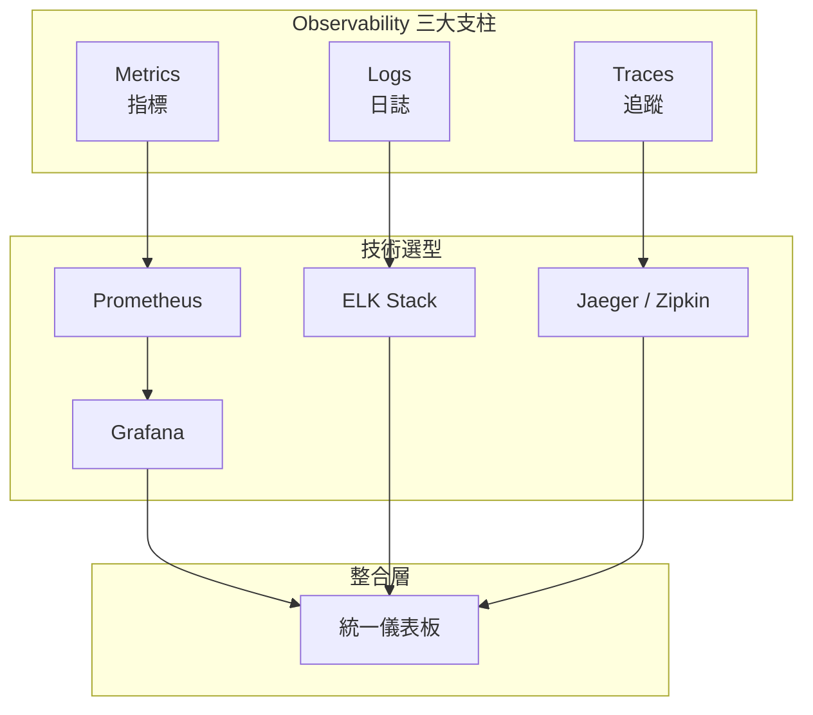

| 工具 | 角色定位 | 核心功能 |
|-----|---------|---------|
| **Prometheus** | 時序資料庫 + 資料收集器 | 抓取、儲存、查詢 Metrics |
| **Grafana** | 視覺化平台 | Dashboard、告警、多資料源整合 |

### 1.3 與 Logging / Tracing 的差異與整合方式

| 面向 | Metrics | Logs | Traces |
|-----|---------|------|--------|
| **資料型態** | 數值型時序資料 | 文字事件記錄 | 請求鏈路追蹤 |
| **用途** | 監控趨勢、告警 | 問題根因分析 | 分散式追蹤 |
| **儲存成本** | 低 | 高 | 中 |
| **查詢速度** | 快 | 中 | 中 |
| **適用問題** | "系統是否健康？" | "發生了什麼？" | "請求經過哪裡？" |

#### 整合架構範例

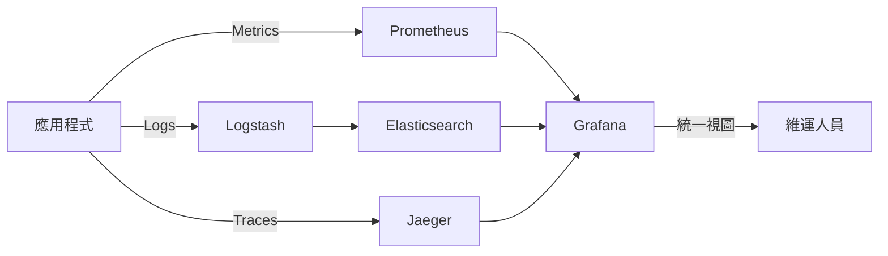

### 1.4 適合的使用場景

#### ✅ 適合使用 Prometheus + Grafana 的場景

| 場景 | 說明 |
|-----|------|
| **微服務架構** | 大量服務實例的統一監控 |
| **容器化環境** | K8s / Docker 原生支援 |
| **雲原生應用** | 與 Cloud Native 生態系無縫整合 |
| **高頻交易系統** | 毫秒級指標收集與告警 |
| **銀行核心系統** | 7x24 監控，符合稽核需求 |

#### ⚠️ 需要額外評估的場景

| 場景 | 考量點 |
|-----|-------|
| **超大規模叢集** | 需考慮 Federation / Thanos / Cortex |
| **長期資料保存** | 預設 15 天，需搭配遠端儲存 |
| **高精度 Metrics** | Cardinality 管理成為挑戰 |

---

## 2. 架構說明（Architecture）

### 2.1 Prometheus 架構

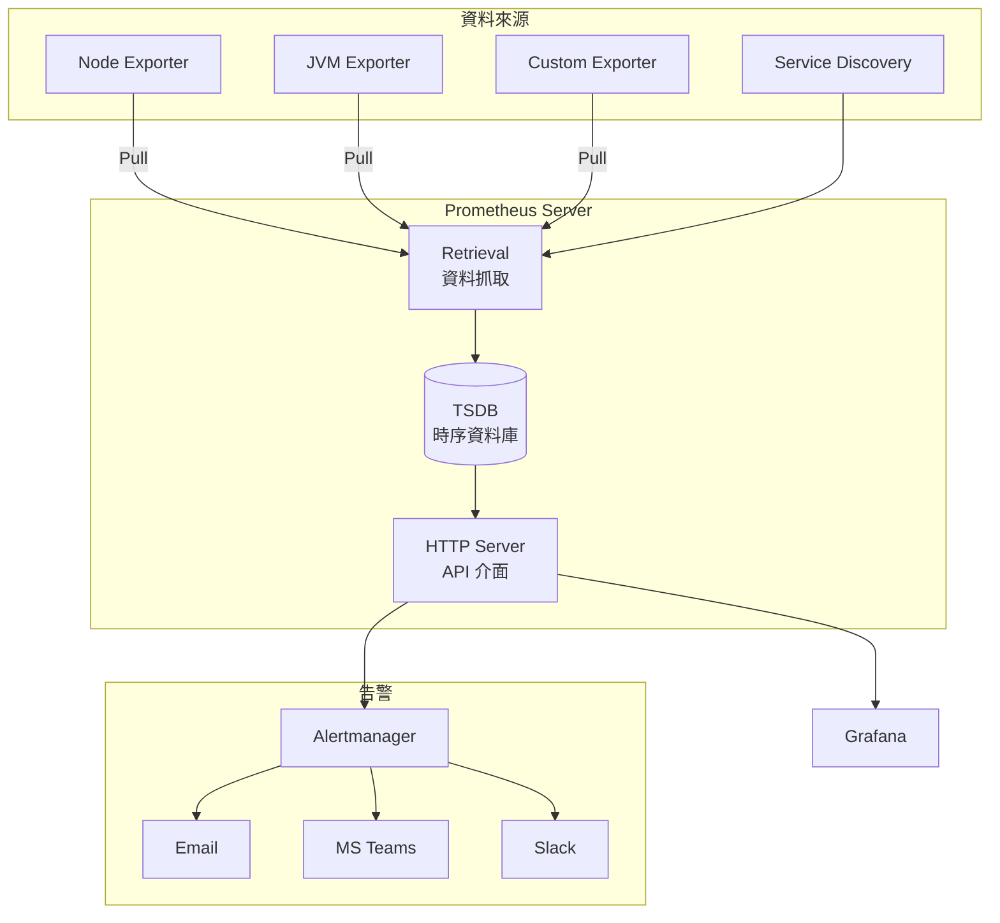

#### 核心元件說明

| 元件 | 功能 | 說明 |
|-----|------|------|
| **Retrieval** | 資料抓取 | 定期從 Target 拉取 Metrics |
| **TSDB** | 時序儲存 | 高效能本地時序資料庫 |
| **HTTP Server** | API 介面 | 提供 PromQL 查詢與管理 API |
| **Service Discovery** | 服務發現 | 支援 K8s、Consul、DNS 等 |

#### Pull Model vs Push Model

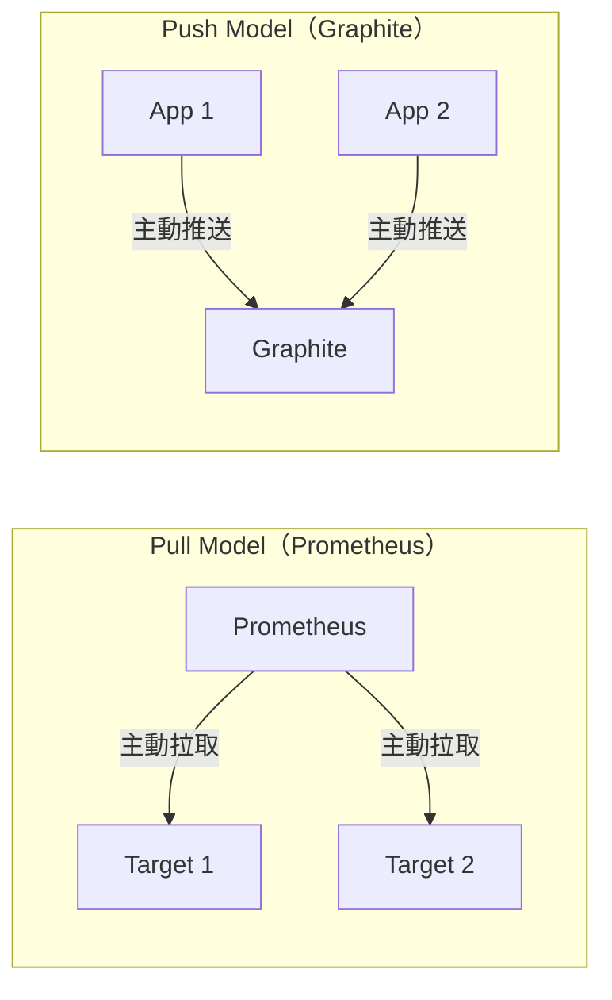

| 模式 | 優點 | 缺點 |
|-----|------|------|
| **Pull** | 服務探測、簡化配置、避免資料擁塞 | 防火牆穿越問題 |
| **Push** | 短生命週期 Job 友善 | 資料擁塞風險 |

### 2.2 Exporter 概念

Exporter 是將各種系統指標轉換為 Prometheus 格式的元件。

#### 常用 Exporter 清單

| Exporter | 監控對象 | Port |
|----------|---------|------|
| **node_exporter** | Linux 主機（CPU、Memory、Disk） | 9100 |
| **jmx_exporter** | JVM（Heap、GC、Thread） | 9404 |
| **mysql_exporter** | MySQL 資料庫 | 9104 |
| **postgres_exporter** | PostgreSQL 資料庫 | 9187 |
| **redis_exporter** | Redis | 9121 |
| **blackbox_exporter** | HTTP/TCP/ICMP 探測 | 9115 |
| **kafka_exporter** | Kafka | 9308 |

#### Exporter 架構示意

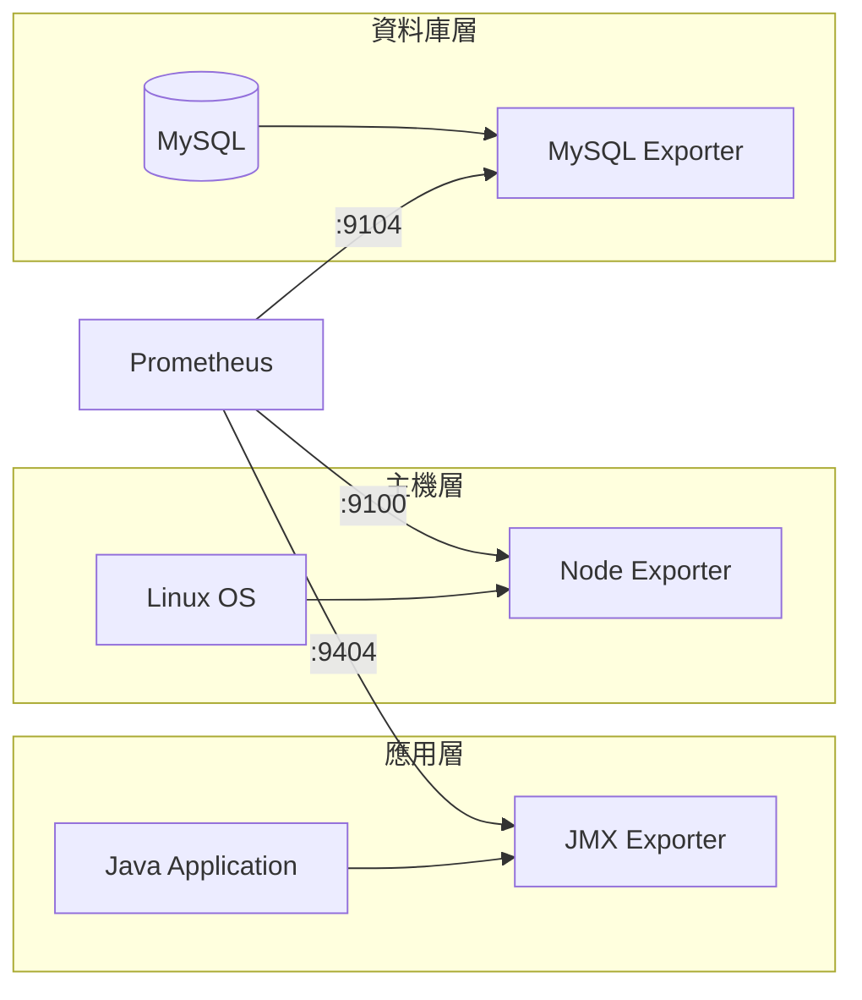

### 2.3 Grafana 架構

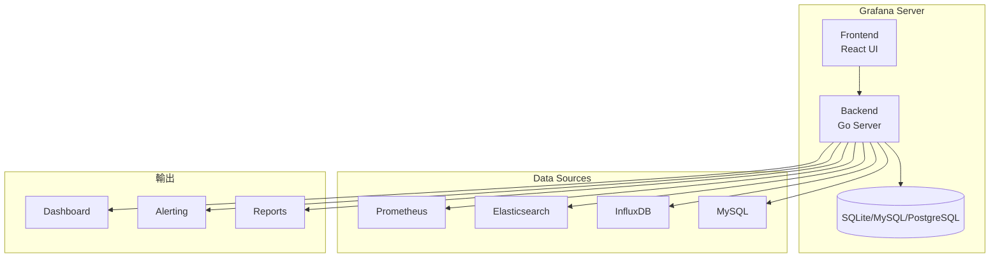

#### Grafana 核心概念

| 概念 | 說明 |
|-----|------|
| **Data Source** | 資料來源連接（Prometheus、ES 等） |
| **Dashboard** | 儀表板，包含多個 Panel |
| **Panel** | 單一視覺化元件（圖表、表格等） |
| **Variable** | 動態變數，支援下拉選單篩選 |
| **Folder** | Dashboard 分類與權限管理 |
| **Organization** | 多租戶隔離 |

### 2.4 Prometheus 與 Grafana 串接流程

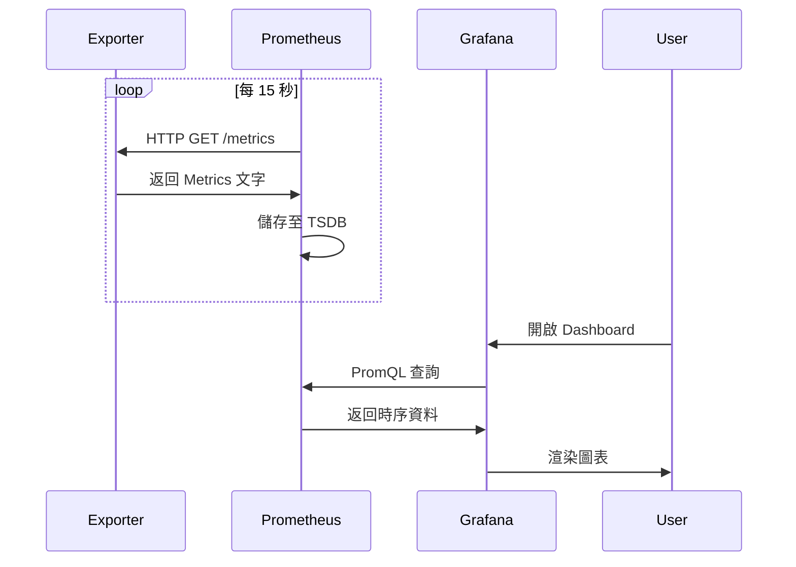

### 2.5 單機 vs HA / Federation 架構

#### 單機架構（適合小型環境）

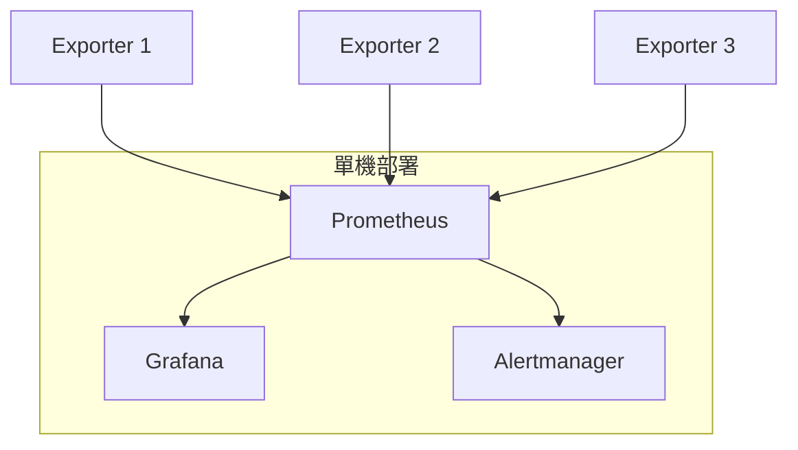

#### HA 架構（適合生產環境）

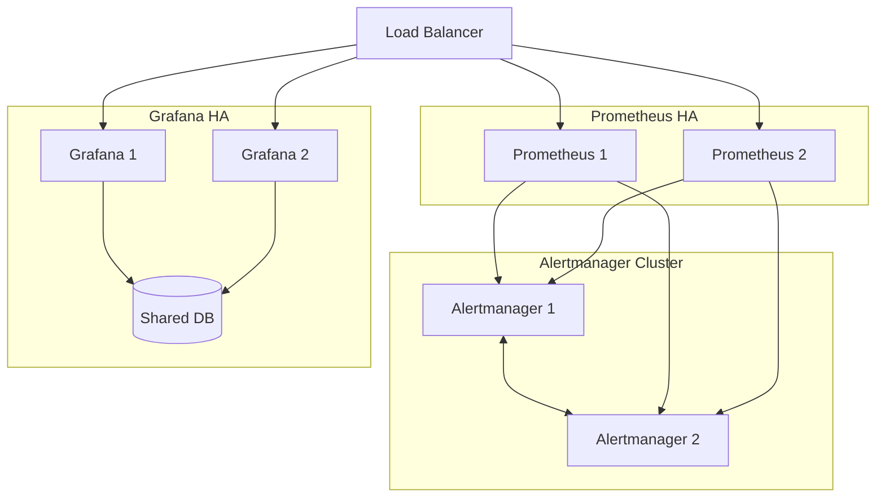

#### Federation 架構（適合大型分散式環境）

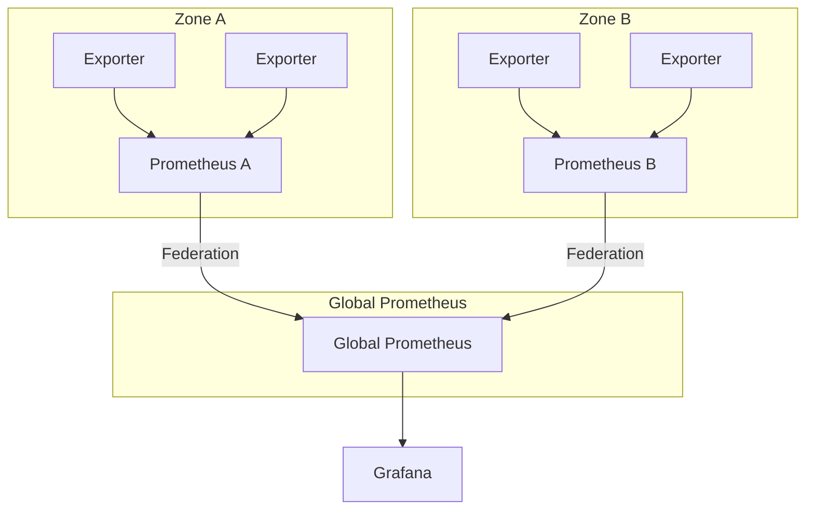

| 架構 | 適用場景 | 複雜度 |
|-----|---------|-------|
| **單機** | 開發環境、小型系統 | 低 |
| **HA** | 生產環境、中型系統 | 中 |
| **Federation** | 跨機房、大型分散式系統 | 高 |
| **Thanos/Cortex** | 超大規模、長期儲存 | 很高 |

#### ⚠️ 實務建議
> 1. **生產環境至少要 HA**：單點故障會導致監控盲區
> 2. **Alertmanager 必須叢集化**：避免告警遺漏
> 3. **Grafana 後端資料庫要共享**：確保 Dashboard 一致性

---

## 3. 系統安裝（Installation）

### 3.1 環境準備

#### 系統需求

| 項目 | 最低需求 | 建議配置（生產） |
|-----|---------|----------------|
| **OS** | CentOS 7+ / Ubuntu 18.04+ | CentOS 8+ / Ubuntu 22.04 |
| **CPU** | 2 cores | 4+ cores |
| **Memory** | 4 GB | 16+ GB |
| **Disk** | 50 GB SSD | 500+ GB SSD |
| **Network** | 穩定內網 | 10 Gbps |

#### 防火牆設定

```bash
# Prometheus
firewall-cmd --permanent --add-port=9090/tcp

# Grafana
firewall-cmd --permanent --add-port=3000/tcp

# Alertmanager
firewall-cmd --permanent --add-port=9093/tcp

# Node Exporter
firewall-cmd --permanent --add-port=9100/tcp

# 重新載入
firewall-cmd --reload
```

### 3.2 Prometheus 安裝

#### 方法一：Binary 安裝（推薦用於 VM）

```bash
# 1. 建立使用者
sudo useradd --no-create-home --shell /bin/false prometheus

# 2. 建立目錄
sudo mkdir -p /etc/prometheus
sudo mkdir -p /var/lib/prometheus

# 3. 下載 Prometheus（請確認最新版本）
cd /tmp
wget https://github.com/prometheus/prometheus/releases/download/v2.48.0/prometheus-2.48.0.linux-amd64.tar.gz

# 4. 解壓縮
tar xvfz prometheus-2.48.0.linux-amd64.tar.gz
cd prometheus-2.48.0.linux-amd64

# 5. 複製執行檔
sudo cp prometheus /usr/local/bin/
sudo cp promtool /usr/local/bin/

# 6. 複製設定檔
sudo cp -r consoles /etc/prometheus
sudo cp -r console_libraries /etc/prometheus
sudo cp prometheus.yml /etc/prometheus/

# 7. 設定權限
sudo chown -R prometheus:prometheus /etc/prometheus
sudo chown -R prometheus:prometheus /var/lib/prometheus
sudo chown prometheus:prometheus /usr/local/bin/prometheus
sudo chown prometheus:prometheus /usr/local/bin/promtool
```

#### 建立 Systemd Service

```bash
sudo cat > /etc/systemd/system/prometheus.service << 'EOF'
[Unit]
Description=Prometheus
Wants=network-online.target
After=network-online.target

[Service]
User=prometheus
Group=prometheus
Type=simple
ExecStart=/usr/local/bin/prometheus \
    --config.file=/etc/prometheus/prometheus.yml \
    --storage.tsdb.path=/var/lib/prometheus/ \
    --storage.tsdb.retention.time=15d \
    --web.console.templates=/etc/prometheus/consoles \
    --web.console.libraries=/etc/prometheus/console_libraries \
    --web.enable-lifecycle \
    --web.enable-admin-api

ExecReload=/bin/kill -HUP $MAINPID
Restart=on-failure
RestartSec=5s

[Install]
WantedBy=multi-user.target
EOF

# 啟動服務
sudo systemctl daemon-reload
sudo systemctl enable prometheus
sudo systemctl start prometheus
sudo systemctl status prometheus
```

#### 方法二：Docker 安裝

```bash
# 建立資料目錄
mkdir -p /data/prometheus

# 建立設定檔
cat > /data/prometheus/prometheus.yml << 'EOF'
global:
  scrape_interval: 15s
  evaluation_interval: 15s

scrape_configs:
  - job_name: 'prometheus'
    static_configs:
      - targets: ['localhost:9090']
EOF

# 執行容器
docker run -d \
  --name prometheus \
  --restart unless-stopped \
  -p 9090:9090 \
  -v /data/prometheus/prometheus.yml:/etc/prometheus/prometheus.yml \
  -v /data/prometheus/data:/prometheus \
  prom/prometheus:v2.48.0 \
  --config.file=/etc/prometheus/prometheus.yml \
  --storage.tsdb.path=/prometheus \
  --storage.tsdb.retention.time=15d \
  --web.enable-lifecycle
```

#### 驗證安裝

```bash
# 檢查服務狀態
curl http://localhost:9090/-/healthy
# 預期回應: Prometheus Server is Healthy.

# 檢查設定
curl http://localhost:9090/api/v1/status/config

# 開啟 Web UI
# http://<server-ip>:9090
```

### 3.3 Grafana 安裝

#### 方法一：Binary / Package 安裝

```bash
# CentOS/RHEL
cat > /etc/yum.repos.d/grafana.repo << 'EOF'
[grafana]
name=grafana
baseurl=https://rpm.grafana.com
repo_gpgcheck=1
enabled=1
gpgcheck=1
gpgkey=https://rpm.grafana.com/gpg.key
sslverify=1
sslcacert=/etc/pki/tls/certs/ca-bundle.crt
EOF

sudo yum install grafana -y

# Ubuntu/Debian
sudo apt-get install -y apt-transport-https software-properties-common
wget -q -O - https://apt.grafana.com/gpg.key | sudo apt-key add -
echo "deb https://apt.grafana.com stable main" | sudo tee /etc/apt/sources.list.d/grafana.list
sudo apt-get update
sudo apt-get install grafana -y

# 啟動服務
sudo systemctl daemon-reload
sudo systemctl enable grafana-server
sudo systemctl start grafana-server
```

#### 方法二：Docker 安裝

```bash
# 建立資料目錄
mkdir -p /data/grafana

# 設定權限（Grafana 容器使用 UID 472）
sudo chown -R 472:472 /data/grafana

# 執行容器
docker run -d \
  --name grafana \
  --restart unless-stopped \
  -p 3000:3000 \
  -v /data/grafana:/var/lib/grafana \
  -e "GF_SECURITY_ADMIN_PASSWORD=your_secure_password" \
  -e "GF_USERS_ALLOW_SIGN_UP=false" \
  grafana/grafana:10.2.0
```

#### 驗證安裝

```bash
# 檢查服務狀態
curl http://localhost:3000/api/health
# 預期回應: {"commit":"...","database":"ok","version":"10.2.0"}

# 開啟 Web UI
# http://<server-ip>:3000
# 預設帳號: admin / admin
```

### 3.4 Node Exporter 安裝

```bash
# 下載
cd /tmp
wget https://github.com/prometheus/node_exporter/releases/download/v1.7.0/node_exporter-1.7.0.linux-amd64.tar.gz
tar xvfz node_exporter-1.7.0.linux-amd64.tar.gz

# 安裝
sudo cp node_exporter-1.7.0.linux-amd64/node_exporter /usr/local/bin/
sudo useradd --no-create-home --shell /bin/false node_exporter

# 建立 Service
sudo cat > /etc/systemd/system/node_exporter.service << 'EOF'
[Unit]
Description=Node Exporter
Wants=network-online.target
After=network-online.target

[Service]
User=node_exporter
Group=node_exporter
Type=simple
ExecStart=/usr/local/bin/node_exporter \
    --collector.systemd \
    --collector.processes

[Install]
WantedBy=multi-user.target
EOF

# 啟動
sudo systemctl daemon-reload
sudo systemctl enable node_exporter
sudo systemctl start node_exporter

# 驗證
curl http://localhost:9100/metrics | head -20
```

### 3.5 目錄結構說明

```
/etc/prometheus/                    # Prometheus 設定目錄
├── prometheus.yml                  # 主要設定檔
├── rules/                          # 告警規則目錄
│   ├── node_alerts.yml
│   └── app_alerts.yml
├── consoles/                       # Console 模板
└── console_libraries/              # Console 函式庫

/var/lib/prometheus/                # Prometheus 資料目錄
├── chunks_head/                    # 記憶體資料
├── wal/                            # Write-Ahead Log
└── <block_id>/                     # 壓縮後的資料區塊

/etc/grafana/                       # Grafana 設定目錄
├── grafana.ini                     # 主要設定檔
└── provisioning/                   # 自動配置目錄
    ├── datasources/
    ├── dashboards/
    └── notifiers/

/var/lib/grafana/                   # Grafana 資料目錄
├── grafana.db                      # SQLite 資料庫
├── plugins/                        # 外掛目錄
└── png/                            # 圖片快取
```

### 3.6 常見安裝錯誤與排除

| 問題 | 原因 | 解決方式 |
|-----|------|---------|
| `permission denied` | 權限不足 | `chown -R prometheus:prometheus /var/lib/prometheus` |
| `port already in use` | Port 被佔用 | `netstat -tlnp \| grep 9090` 找出並停止佔用程式 |
| `TSDB lock` | 上次未正常關閉 | 刪除 `/var/lib/prometheus/lock` |
| `scrape error` | 網路不通 | 檢查防火牆與網路連通性 |
| `Grafana 503` | 後端未啟動 | 檢查 Grafana log `/var/log/grafana/grafana.log` |

#### 除錯指令

```bash
# 檢查 Prometheus 設定語法
promtool check config /etc/prometheus/prometheus.yml

# 檢查告警規則語法
promtool check rules /etc/prometheus/rules/*.yml

# 查看 Prometheus 日誌
journalctl -u prometheus -f

# 查看 Grafana 日誌
journalctl -u grafana-server -f

# 測試 Exporter 連通性
curl -v http://target:9100/metrics
```

---

## 4. 系統設定（Configuration）

### 4.1 Prometheus 設定

#### prometheus.yml 完整範例

```yaml
# 全域設定
global:
  scrape_interval: 15s          # 預設抓取間隔
  evaluation_interval: 15s      # 規則評估間隔
  scrape_timeout: 10s           # 抓取逾時
  external_labels:              # 外部標籤（用於 Federation）
    environment: production
    region: taiwan

# Alertmanager 設定
alerting:
  alertmanagers:
    - static_configs:
        - targets:
            - alertmanager1:9093
            - alertmanager2:9093
      timeout: 10s

# 規則檔案
rule_files:
  - "/etc/prometheus/rules/*.yml"

# 抓取設定
scrape_configs:
  # Prometheus 自身監控
  - job_name: 'prometheus'
    static_configs:
      - targets: ['localhost:9090']
    
  # Node Exporter - 主機監控
  - job_name: 'node'
    static_configs:
      - targets:
          - 'server1:9100'
          - 'server2:9100'
          - 'server3:9100'
    relabel_configs:
      - source_labels: [__address__]
        regex: '(.*):\d+'
        target_label: instance
        replacement: '${1}'

  # JVM 應用程式監控
  - job_name: 'jvm-apps'
    metrics_path: /actuator/prometheus
    static_configs:
      - targets:
          - 'app1:8080'
          - 'app2:8080'
        labels:
          application: 'order-service'
          team: 'backend'

  # Kubernetes Service Discovery
  - job_name: 'kubernetes-pods'
    kubernetes_sd_configs:
      - role: pod
    relabel_configs:
      - source_labels: [__meta_kubernetes_pod_annotation_prometheus_io_scrape]
        action: keep
        regex: true
      - source_labels: [__meta_kubernetes_pod_annotation_prometheus_io_path]
        action: replace
        target_label: __metrics_path__
        regex: (.+)
      - source_labels: [__address__, __meta_kubernetes_pod_annotation_prometheus_io_port]
        action: replace
        regex: ([^:]+)(?::\d+)?;(\d+)
        replacement: $1:$2
        target_label: __address__

# 遠端寫入（選用）
remote_write:
  - url: "http://thanos-receive:19291/api/v1/receive"
    queue_config:
      capacity: 10000
      max_shards: 30
```

#### scrape_config 進階設定

```yaml
scrape_configs:
  - job_name: 'secure-endpoint'
    scheme: https
    tls_config:
      ca_file: /etc/prometheus/ca.crt
      cert_file: /etc/prometheus/client.crt
      key_file: /etc/prometheus/client.key
      insecure_skip_verify: false
    basic_auth:
      username: prometheus
      password_file: /etc/prometheus/password
    static_configs:
      - targets: ['secure-server:443']

  - job_name: 'blackbox-http'
    metrics_path: /probe
    params:
      module: [http_2xx]
    static_configs:
      - targets:
          - https://api.example.com/health
          - https://web.example.com
    relabel_configs:
      - source_labels: [__address__]
        target_label: __param_target
      - source_labels: [__param_target]
        target_label: instance
      - target_label: __address__
        replacement: blackbox-exporter:9115
```

#### Job / Target / Label 設計原則

| 設計原則 | 說明 | 範例 |
|---------|------|------|
| **Job 按服務類型** | 同類型服務歸為同一 Job | `job: order-service` |
| **Target 按實例** | 每個實例一個 Target | `instance: order-1:8080` |
| **Label 標準化** | 統一命名、避免高 Cardinality | `env`, `team`, `app` |

```yaml
# ✅ 好的設計
labels:
  env: production
  team: backend
  app: order-service

# ❌ 避免的設計
labels:
  request_id: abc123        # 高 Cardinality
  timestamp: 2024-01-01     # 高 Cardinality
  user_id: 12345            # 高 Cardinality
```

#### Retention 與效能考量

```yaml
# 命令列參數
--storage.tsdb.retention.time=15d       # 資料保留天數
--storage.tsdb.retention.size=50GB      # 資料保留大小上限
--storage.tsdb.wal-compression          # 啟用 WAL 壓縮
--query.max-concurrency=20              # 最大並行查詢數
--query.timeout=2m                      # 查詢逾時
```

| 參數 | 建議值 | 說明 |
|-----|-------|------|
| `retention.time` | 15-30d | 依需求調整，越長佔用空間越大 |
| `retention.size` | 依磁碟大小 | 達到上限自動刪除舊資料 |
| `max-concurrency` | CPU 核心數 | 避免過載 |

### 4.2 Grafana 設定

#### Datasource 設定（Prometheus）

**方法一：Web UI 設定**

1. 登入 Grafana → Configuration → Data Sources
2. Add data source → 選擇 Prometheus
3. 填入設定：
   - URL: `http://prometheus:9090`
   - Access: Server (default)
   - Scrape interval: 15s

**方法二：Provisioning 自動設定**

```yaml
# /etc/grafana/provisioning/datasources/prometheus.yml
apiVersion: 1

datasources:
  - name: Prometheus
    type: prometheus
    access: proxy
    url: http://prometheus:9090
    isDefault: true
    editable: false
    jsonData:
      timeInterval: "15s"
      httpMethod: POST
      exemplarTraceIdDestinations:
        - name: traceID
          datasourceUid: jaeger

  - name: Prometheus-DR
    type: prometheus
    access: proxy
    url: http://prometheus-dr:9090
    editable: false
```

#### Dashboard 結構設計原則


| 層級 | 對象 | 內容 | 更新頻率 |
|-----|------|------|---------|
| **Overview** | 主管/值班 | SLA、錯誤率、關鍵告警 | 5 分鐘 |
| **Service** | SRE/維運 | 服務健康度、資源使用 | 1 分鐘 |
| **Debug** | 開發人員 | 詳細指標、Latency 分布 | 即時 |

#### Variable（變數）使用方式

```json
{
  "templating": {
    "list": [
      {
        "name": "environment",
        "type": "custom",
        "options": [
          {"text": "Production", "value": "prod"},
          {"text": "Staging", "value": "stage"},
          {"text": "Development", "value": "dev"}
        ],
        "current": {"text": "Production", "value": "prod"}
      },
      {
        "name": "instance",
        "type": "query",
        "datasource": "Prometheus",
        "query": "label_values(up{job=\"node\"}, instance)",
        "refresh": 2,
        "multi": true,
        "includeAll": true
      },
      {
        "name": "interval",
        "type": "interval",
        "options": [
          {"text": "1m", "value": "1m"},
          {"text": "5m", "value": "5m"},
          {"text": "1h", "value": "1h"}
        ],
        "auto": true,
        "auto_min": "1m"
      }
    ]
  }
}
```

**在 Panel 中使用變數：**

```promql
# 使用單選變數
node_cpu_seconds_total{instance="$instance"}

# 使用多選變數
node_cpu_seconds_total{instance=~"$instance"}

# 使用 interval 變數
rate(http_requests_total[$interval])
```

#### Folder 與權限管理

```yaml
# /etc/grafana/provisioning/dashboards/default.yml
apiVersion: 1

providers:
  - name: 'Infrastructure'
    orgId: 1
    folder: 'Infrastructure'
    type: file
    disableDeletion: true
    editable: false
    options:
      path: /var/lib/grafana/dashboards/infrastructure

  - name: 'Applications'
    orgId: 1
    folder: 'Applications'
    type: file
    disableDeletion: true
    editable: false
    options:
      path: /var/lib/grafana/dashboards/applications
```

**權限設計建議：**

| 角色 | Folder 權限 | 說明 |
|-----|------------|------|
| **Admin** | 全部 Edit | 系統管理員 |
| **SRE** | Infrastructure: Edit, Apps: View | 維運團隊 |
| **Developer** | Applications: Edit | 開發團隊 |
| **Viewer** | 全部 View | 一般使用者 |

---

## 5. 系統使用（Usage）

### 5.1 PromQL 基本與進階語法

#### 基本語法

```promql
# 即時查詢 - Instant Vector
http_requests_total

# 帶 Label 過濾
http_requests_total{job="api", status="200"}

# 範圍查詢 - Range Vector
http_requests_total[5m]

# Label 匹配運算子
http_requests_total{status="200"}        # 完全匹配
http_requests_total{status!="500"}       # 不等於
http_requests_total{status=~"2.."}       # 正則匹配
http_requests_total{status!~"5.."}       # 正則不匹配
```

#### 常用函數

```promql
# rate() - 計算每秒增長率（Counter 專用）
rate(http_requests_total[5m])

# irate() - 瞬時增長率（更敏感）
irate(http_requests_total[5m])

# increase() - 區間內增量
increase(http_requests_total[1h])

# sum() - 加總
sum(rate(http_requests_total[5m])) by (job)

# avg() - 平均
avg(node_cpu_seconds_total{mode="idle"}) by (instance)

# max() / min() - 最大/最小值
max(node_memory_MemAvailable_bytes) by (instance)

# histogram_quantile() - 百分位數
histogram_quantile(0.99, rate(http_request_duration_seconds_bucket[5m]))
```

#### 進階查詢範例

```promql
# 計算 CPU 使用率
100 - (avg by(instance) (irate(node_cpu_seconds_total{mode="idle"}[5m])) * 100)

# 計算記憶體使用率
(1 - node_memory_MemAvailable_bytes / node_memory_MemTotal_bytes) * 100

# 計算磁碟使用率
(1 - node_filesystem_avail_bytes{fstype!~"tmpfs|overlay"} 
    / node_filesystem_size_bytes{fstype!~"tmpfs|overlay"}) * 100

# HTTP 錯誤率
sum(rate(http_requests_total{status=~"5.."}[5m])) 
  / sum(rate(http_requests_total[5m])) * 100

# P99 Latency
histogram_quantile(0.99, 
  sum(rate(http_request_duration_seconds_bucket[5m])) by (le, endpoint))

# 預測磁碟空間（線性回歸）
predict_linear(node_filesystem_avail_bytes[1h], 24*3600)
```

### 5.2 常見 Metrics 範例

#### CPU Metrics

```promql
# CPU 使用率（按模式）
sum by (mode) (rate(node_cpu_seconds_total[5m]))

# 系統負載
node_load1   # 1 分鐘平均
node_load5   # 5 分鐘平均
node_load15  # 15 分鐘平均

# CPU 飽和度（Load > CPU 數量）
node_load1 / count without(cpu, mode) (node_cpu_seconds_total{mode="idle"})
```

#### Memory Metrics

```promql
# 記憶體可用量
node_memory_MemAvailable_bytes

# 記憶體使用量
node_memory_MemTotal_bytes - node_memory_MemAvailable_bytes

# Swap 使用量
node_memory_SwapTotal_bytes - node_memory_SwapFree_bytes
```

#### Disk Metrics

```promql
# 磁碟可用空間
node_filesystem_avail_bytes{fstype!~"tmpfs|overlay"}

# 磁碟 I/O 速率
rate(node_disk_read_bytes_total[5m])
rate(node_disk_written_bytes_total[5m])

# 磁碟 IOPS
rate(node_disk_reads_completed_total[5m])
rate(node_disk_writes_completed_total[5m])
```

#### JVM Metrics（Spring Boot Actuator）

```promql
# Heap 使用量
jvm_memory_used_bytes{area="heap"}
jvm_memory_max_bytes{area="heap"}

# GC 次數與時間
rate(jvm_gc_pause_seconds_count[5m])
rate(jvm_gc_pause_seconds_sum[5m])

# 執行緒數
jvm_threads_live_threads
jvm_threads_peak_threads
```

#### HTTP Metrics

```promql
# 請求速率 (QPS)
sum(rate(http_server_requests_seconds_count[5m])) by (uri)

# 平均延遲
rate(http_server_requests_seconds_sum[5m]) 
  / rate(http_server_requests_seconds_count[5m])

# 錯誤率
sum(rate(http_server_requests_seconds_count{status=~"5.."}[5m])) 
  / sum(rate(http_server_requests_seconds_count[5m])) * 100
```

### 5.3 Dashboard 設計最佳實務

#### Dashboard 結構範本

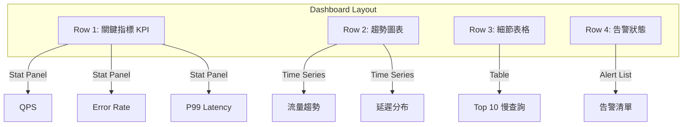

#### Panel 類型選擇指南

| Panel 類型 | 適用場景 | 範例 |
|-----------|---------|------|
| **Stat** | 單一數值 KPI | QPS、錯誤率、可用性 |
| **Gauge** | 百分比、使用率 | CPU%、Memory%、Disk% |
| **Time Series** | 趨勢變化 | 流量、延遲、資源使用 |
| **Bar Chart** | 排名、比較 | Top N 服務、錯誤分布 |
| **Heatmap** | 分布圖 | Latency 分布 |
| **Table** | 明細資料 | 告警清單、服務列表 |
| **Logs** | 日誌檢視 | 錯誤日誌 |

### 5.4 實務範例

#### 範例一：API 延遲 Dashboard

```json
{
  "panels": [
    {
      "title": "P99 Latency",
      "type": "stat",
      "targets": [
        {
          "expr": "histogram_quantile(0.99, sum(rate(http_request_duration_seconds_bucket{job=\"api\"}[5m])) by (le))",
          "legendFormat": "P99"
        }
      ],
      "fieldConfig": {
        "defaults": {
          "unit": "s",
          "thresholds": {
            "steps": [
              {"color": "green", "value": null},
              {"color": "yellow", "value": 0.5},
              {"color": "red", "value": 1}
            ]
          }
        }
      }
    },
    {
      "title": "Latency Distribution",
      "type": "heatmap",
      "targets": [
        {
          "expr": "sum(rate(http_request_duration_seconds_bucket{job=\"api\"}[5m])) by (le)",
          "format": "heatmap"
        }
      ]
    }
  ]
}
```

#### 範例二：Batch 成功率 Dashboard

```promql
# Batch 執行成功率
sum(batch_job_completed_total{status="success"}) 
  / sum(batch_job_completed_total) * 100

# Batch 執行時間
batch_job_duration_seconds{quantile="0.99"}

# 失敗的 Batch Jobs
batch_job_completed_total{status="failed"}
```

### 5.5 與 AI 搭配使用

#### 請 AI 產生 PromQL 的 Prompt 範例

```
你是 Prometheus 專家。請幫我寫 PromQL 查詢：

需求：
- 計算過去 5 分鐘內，所有 API endpoint 的 P95 延遲
- 依據 endpoint 分組
- 只顯示延遲超過 500ms 的 endpoint

可用的 Metrics：
- http_request_duration_seconds_bucket (Histogram)
- Labels: job, endpoint, method, status
```

#### AI 協助 Dashboard 設計

```
請幫我設計一個「JVM 監控 Dashboard」的 JSON 結構：

需求：
1. 第一行：4 個 Stat Panel（Heap 使用率、GC 次數、Thread 數、Uptime）
2. 第二行：Heap 使用趨勢圖、GC 暫停時間趨勢圖
3. 第三行：Thread 狀態分布、Class 載入數量

請使用 Grafana Dashboard JSON 格式輸出。
```

---

## 6. 告警與通知（Alerting）

### 6.1 Prometheus Alertmanager 架構

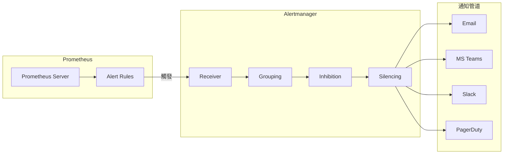

#### Alertmanager 設定範例

```yaml
# alertmanager.yml
global:
  smtp_smarthost: 'smtp.example.com:587'
  smtp_from: 'alertmanager@example.com'
  smtp_auth_username: 'alertmanager'
  smtp_auth_password: 'password'

route:
  receiver: 'default'
  group_by: ['alertname', 'env', 'severity']
  group_wait: 30s
  group_interval: 5m
  repeat_interval: 4h
  routes:
    - match:
        severity: critical
      receiver: 'pagerduty-critical'
      continue: true
    - match:
        severity: critical
      receiver: 'slack-critical'
    - match:
        severity: warning
      receiver: 'slack-warning'

receivers:
  - name: 'default'
    email_configs:
      - to: 'ops-team@example.com'

  - name: 'pagerduty-critical'
    pagerduty_configs:
      - service_key: '<your-service-key>'
        severity: critical

  - name: 'slack-critical'
    slack_configs:
      - api_url: 'https://hooks.slack.com/services/xxx'
        channel: '#alerts-critical'
        title: '🚨 Critical Alert'
        text: '{{ .CommonAnnotations.description }}'

  - name: 'slack-warning'
    slack_configs:
      - api_url: 'https://hooks.slack.com/services/xxx'
        channel: '#alerts-warning'
        title: '⚠️ Warning Alert'

inhibit_rules:
  - source_match:
      severity: 'critical'
    target_match:
      severity: 'warning'
    equal: ['alertname', 'instance']
```

### 6.2 Alert Rule 撰寫範例

```yaml
# /etc/prometheus/rules/node_alerts.yml
groups:
  - name: node_alerts
    rules:
      # CPU 高使用率告警
      - alert: HighCpuUsage
        expr: 100 - (avg by(instance) (irate(node_cpu_seconds_total{mode="idle"}[5m])) * 100) > 80
        for: 5m
        labels:
          severity: warning
        annotations:
          summary: "High CPU usage on {{ $labels.instance }}"
          description: "CPU usage is {{ $value | printf \"%.2f\" }}% on {{ $labels.instance }}"

      # CPU 極高使用率告警
      - alert: CriticalCpuUsage
        expr: 100 - (avg by(instance) (irate(node_cpu_seconds_total{mode="idle"}[5m])) * 100) > 95
        for: 2m
        labels:
          severity: critical
        annotations:
          summary: "Critical CPU usage on {{ $labels.instance }}"
          description: "CPU usage is {{ $value | printf \"%.2f\" }}% on {{ $labels.instance }}"

      # 記憶體不足告警
      - alert: LowMemory
        expr: (1 - node_memory_MemAvailable_bytes / node_memory_MemTotal_bytes) * 100 > 85
        for: 5m
        labels:
          severity: warning
        annotations:
          summary: "Low memory on {{ $labels.instance }}"
          description: "Memory usage is {{ $value | printf \"%.2f\" }}%"

      # 磁碟空間不足告警
      - alert: LowDiskSpace
        expr: (1 - node_filesystem_avail_bytes{fstype!~"tmpfs|overlay"} / node_filesystem_size_bytes) * 100 > 80
        for: 5m
        labels:
          severity: warning
        annotations:
          summary: "Low disk space on {{ $labels.instance }}"
          description: "Disk usage is {{ $value | printf \"%.2f\" }}% on {{ $labels.mountpoint }}"

      # 服務 Down 告警
      - alert: InstanceDown
        expr: up == 0
        for: 1m
        labels:
          severity: critical
        annotations:
          summary: "Instance {{ $labels.instance }} is down"
          description: "{{ $labels.job }} on {{ $labels.instance }} has been down for more than 1 minute"
```

```yaml
# /etc/prometheus/rules/app_alerts.yml
groups:
  - name: application_alerts
    rules:
      # API 錯誤率告警
      - alert: HighErrorRate
        expr: |
          sum(rate(http_server_requests_seconds_count{status=~"5.."}[5m])) by (application)
          / sum(rate(http_server_requests_seconds_count[5m])) by (application) * 100 > 1
        for: 2m
        labels:
          severity: critical
        annotations:
          summary: "High error rate on {{ $labels.application }}"
          description: "Error rate is {{ $value | printf \"%.2f\" }}%"

      # API 延遲告警
      - alert: HighLatency
        expr: |
          histogram_quantile(0.99, sum(rate(http_request_duration_seconds_bucket[5m])) by (le, application)) > 1
        for: 5m
        labels:
          severity: warning
        annotations:
          summary: "High P99 latency on {{ $labels.application }}"
          description: "P99 latency is {{ $value | printf \"%.2f\" }}s"

      # JVM Heap 告警
      - alert: JvmHeapHigh
        expr: jvm_memory_used_bytes{area="heap"} / jvm_memory_max_bytes{area="heap"} * 100 > 80
        for: 5m
        labels:
          severity: warning
        annotations:
          summary: "High JVM heap usage on {{ $labels.application }}"
          description: "Heap usage is {{ $value | printf \"%.2f\" }}%"
```

### 6.3 告警分級

| 嚴重度 | 定義 | 回應時間 | 通知方式 |
|-------|------|---------|---------|
| **Critical** | 服務中斷、資料遺失風險 | 立即 | PagerDuty + Slack + Email |
| **Warning** | 效能下降、需關注 | 1 小時內 | Slack + Email |
| **Info** | 資訊性通知 | 下個工作日 | Email |

### 6.4 Grafana Alert 與 Prometheus Alert 差異

| 項目 | Prometheus Alertmanager | Grafana Alerting |
|-----|------------------------|------------------|
| **資料來源** | 僅 Prometheus | 多資料源（Prometheus、ES 等） |
| **規則管理** | YAML 檔案 | Web UI |
| **功能** | 進階路由、抑制、靜默 | 簡易設定、統一告警 |
| **適用場景** | 大型複雜環境 | 中小型環境、快速設定 |

#### 💡 建議
> - **生產環境**：使用 Prometheus Alertmanager（功能完整、可版控）
> - **開發/測試**：可用 Grafana Alerting（快速設定）

### 6.5 與 Teams / Slack 整合

#### Microsoft Teams Webhook

```yaml
# alertmanager.yml
receivers:
  - name: 'teams-alerts'
    webhook_configs:
      - url: 'https://outlook.office.com/webhook/xxx'
        send_resolved: true
```

需搭配 Prometheus-MS-Teams（https://github.com/prometheus-msteams/prometheus-msteams）

#### Slack Webhook

```yaml
receivers:
  - name: 'slack-alerts'
    slack_configs:
      - api_url: 'https://hooks.slack.com/services/T00/B00/xxx'
        channel: '#alerts'
        username: 'Prometheus'
        icon_emoji: ':prometheus:'
        title: '{{ .Status | toUpper }}{{ if eq .Status "firing" }} 🔥{{ else }} ✅{{ end }}'
        text: >-
          {{ range .Alerts }}
          *Alert:* {{ .Annotations.summary }}
          *Description:* {{ .Annotations.description }}
          *Severity:* {{ .Labels.severity }}
          {{ end }}
```

---

## 7. 系統維護（Maintenance）

### 7.1 資料成長與磁碟空間管理

#### 預估儲存空間

```
儲存空間 = 時序數量 × 每秒樣本數 × 每樣本大小 × 保留天數

範例：
- 10,000 個時序
- 每 15 秒一個樣本
- 每樣本約 2 bytes
- 保留 15 天

= 10,000 × (86400/15) × 2 × 15
= 10,000 × 5,760 × 2 × 15
≈ 1.7 GB（壓縮後約 0.5 GB）
```

#### 監控儲存空間

```promql
# TSDB 目前大小
prometheus_tsdb_storage_blocks_bytes

# 時序數量
prometheus_tsdb_head_series

# 樣本數量
prometheus_tsdb_head_samples_appended_total

# WAL 大小
prometheus_tsdb_wal_storage_size_bytes
```

#### 空間清理策略

```bash
# 方法一：調整保留時間
--storage.tsdb.retention.time=7d

# 方法二：設定大小上限
--storage.tsdb.retention.size=30GB

# 方法三：手動觸發壓縮（謹慎使用）
curl -X POST http://localhost:9090/api/v1/admin/tsdb/clean_tombstones

# 方法四：刪除過期資料（需啟用 admin API）
curl -X POST http://localhost:9090/api/v1/admin/tsdb/delete_series \
  -d 'match[]=http_requests_total{job="old-service"}'
```

### 7.2 效能調校建議

#### Prometheus 效能調校

```yaml
# 增加抓取並行度
global:
  scrape_interval: 15s
  scrape_timeout: 10s

# 在 scrape_config 中限制樣本數
scrape_configs:
  - job_name: 'high-cardinality-job'
    sample_limit: 10000  # 每次抓取最多樣本數
```

```bash
# 命令列調校參數
--storage.tsdb.min-block-duration=2h
--storage.tsdb.max-block-duration=36h
--query.max-samples=50000000
--query.timeout=2m
```

#### Grafana 效能調校

```ini
# /etc/grafana/grafana.ini
[server]
concurrent_render_request_limit = 30

[database]
max_idle_conn = 25
max_open_conn = 100
conn_max_lifetime = 14400

[dashboards]
min_refresh_interval = 15s

[dataproxy]
timeout = 60
```

### 7.3 常見問題處理

| 問題 | 原因 | 解決方式 |
|-----|------|---------|
| **指標爆量** | Label Cardinality 過高 | 檢查並移除高 Cardinality Label |
| **查詢變慢** | 時序過多、範圍過大 | 使用 Recording Rules、縮小查詢範圍 |
| **記憶體不足** | 太多 head series | 增加記憶體或減少保留時間 |
| **抓取失敗** | 網路問題或 Target 過載 | 檢查網路、增加 scrape_timeout |
| **WAL 損壞** | 非正常關機 | 備份後刪除 WAL，重啟服務 |

#### Recording Rules 優化查詢

```yaml
# /etc/prometheus/rules/recording_rules.yml
groups:
  - name: recording_rules
    interval: 1m
    rules:
      # 預先計算 CPU 使用率
      - record: instance:node_cpu_utilization:avg5m
        expr: 100 - (avg by(instance) (irate(node_cpu_seconds_total{mode="idle"}[5m])) * 100)

      # 預先計算 HTTP 錯誤率
      - record: job:http_error_rate:5m
        expr: |
          sum(rate(http_requests_total{status=~"5.."}[5m])) by (job)
          / sum(rate(http_requests_total[5m])) by (job) * 100

      # 預先計算 P99 延遲
      - record: job:http_latency_p99:5m
        expr: histogram_quantile(0.99, sum(rate(http_request_duration_seconds_bucket[5m])) by (le, job))
```

### 7.4 備份與還原策略

#### Prometheus 備份

```bash
# 方法一：快照備份（推薦）
curl -X POST http://localhost:9090/api/v1/admin/tsdb/snapshot
# 快照會存放在 /var/lib/prometheus/snapshots/

# 方法二：停機備份
sudo systemctl stop prometheus
tar -czvf prometheus-backup-$(date +%Y%m%d).tar.gz /var/lib/prometheus/
sudo systemctl start prometheus

# 方法三：遠端儲存
# 設定 remote_write 到 Thanos / Cortex
```

#### Prometheus 還原

```bash
# 從快照還原
sudo systemctl stop prometheus
rm -rf /var/lib/prometheus/*
cp -r /var/lib/prometheus/snapshots/<snapshot-id>/* /var/lib/prometheus/
sudo chown -R prometheus:prometheus /var/lib/prometheus
sudo systemctl start prometheus
```

#### Grafana 備份

```bash
# 備份資料庫
cp /var/lib/grafana/grafana.db /backup/grafana-$(date +%Y%m%d).db

# 備份 provisioning 設定
tar -czvf grafana-provisioning-$(date +%Y%m%d).tar.gz /etc/grafana/provisioning/

# 使用 API 匯出 Dashboard
curl -H "Authorization: Bearer <api-key>" \
  http://localhost:3000/api/dashboards/uid/<uid> > dashboard-backup.json
```

#### 自動備份腳本

```bash
#!/bin/bash
# backup-monitoring.sh

BACKUP_DIR="/backup/monitoring"
DATE=$(date +%Y%m%d)

# Prometheus 快照
curl -X POST http://localhost:9090/api/v1/admin/tsdb/snapshot

# Grafana 資料庫
cp /var/lib/grafana/grafana.db $BACKUP_DIR/grafana-$DATE.db

# 清理 7 天前的備份
find $BACKUP_DIR -type f -mtime +7 -delete

echo "Backup completed: $DATE"
```

---

## 8. 系統升級（Upgrade）

### 8.1 Prometheus 升級注意事項

#### 升級前準備

```bash
# 1. 檢查版本相容性
# 參考：https://prometheus.io/docs/prometheus/latest/migration/

# 2. 備份資料
curl -X POST http://localhost:9090/api/v1/admin/tsdb/snapshot

# 3. 備份設定
cp -r /etc/prometheus /etc/prometheus.bak

# 4. 驗證設定檔
promtool check config /etc/prometheus/prometheus.yml
promtool check rules /etc/prometheus/rules/*.yml
```

#### 升級步驟

```bash
# 1. 下載新版本
wget https://github.com/prometheus/prometheus/releases/download/v2.50.0/prometheus-2.50.0.linux-amd64.tar.gz

# 2. 解壓縮
tar xvfz prometheus-2.50.0.linux-amd64.tar.gz

# 3. 停止服務
sudo systemctl stop prometheus

# 4. 備份舊版本
sudo mv /usr/local/bin/prometheus /usr/local/bin/prometheus.old
sudo mv /usr/local/bin/promtool /usr/local/bin/promtool.old

# 5. 安裝新版本
sudo cp prometheus-2.50.0.linux-amd64/prometheus /usr/local/bin/
sudo cp prometheus-2.50.0.linux-amd64/promtool /usr/local/bin/

# 6. 啟動服務
sudo systemctl start prometheus

# 7. 驗證
prometheus --version
curl http://localhost:9090/-/healthy
```

### 8.2 Grafana 升級注意事項

#### 升級前準備

```bash
# 1. 備份資料庫
cp /var/lib/grafana/grafana.db /backup/

# 2. 備份設定
cp /etc/grafana/grafana.ini /backup/

# 3. 匯出重要 Dashboard
# 使用 Web UI 或 API 匯出
```

#### 升級步驟（Package Manager）

```bash
# CentOS/RHEL
sudo yum update grafana

# Ubuntu/Debian
sudo apt-get update
sudo apt-get install --only-upgrade grafana

# 重啟服務
sudo systemctl restart grafana-server
```

#### 升級步驟（Docker）

```bash
# 1. 拉取新版本
docker pull grafana/grafana:10.3.0

# 2. 停止舊容器
docker stop grafana

# 3. 移除舊容器（資料卷保留）
docker rm grafana

# 4. 啟動新容器
docker run -d \
  --name grafana \
  --restart unless-stopped \
  -p 3000:3000 \
  -v /data/grafana:/var/lib/grafana \
  grafana/grafana:10.3.0
```

### 8.3 升級前檢查清單

| 項目 | 檢查內容 | 狀態 |
|-----|---------|------|
| **版本相容性** | 查閱 Release Notes、Breaking Changes | ☐ |
| **資料備份** | Prometheus 快照、Grafana DB | ☐ |
| **設定備份** | prometheus.yml、alertmanager.yml、grafana.ini | ☐ |
| **Dashboard 備份** | 匯出重要 Dashboard JSON | ☐ |
| **Alert Rule 備份** | 備份所有 Rule 檔案 | ☐ |
| **測試環境驗證** | 在測試環境先行升級測試 | ☐ |
| **回滾計畫** | 準備回滾腳本與步驟 | ☐ |
| **通知相關人員** | 通知維運團隊升級時間 | ☐ |

### 8.4 回滾（Rollback）策略

```bash
# Prometheus 回滾
sudo systemctl stop prometheus
sudo mv /usr/local/bin/prometheus /usr/local/bin/prometheus.new
sudo mv /usr/local/bin/prometheus.old /usr/local/bin/prometheus
sudo systemctl start prometheus

# Grafana 回滾（使用備份資料庫）
sudo systemctl stop grafana-server
cp /backup/grafana.db /var/lib/grafana/grafana.db
sudo yum downgrade grafana-<previous-version>  # 或使用 apt
sudo systemctl start grafana-server
```

---

## 9. 企業實務與最佳實踐（Best Practices）

### 9.1 指標命名規範

#### 命名規則

```
<namespace>_<subsystem>_<name>_<unit>_<suffix>

範例：
http_server_requests_seconds_total      # HTTP 請求總數
http_server_requests_seconds_bucket     # HTTP 請求延遲分布
jvm_memory_used_bytes                   # JVM 記憶體使用量
node_cpu_seconds_total                  # CPU 使用時間
```

| 組成 | 說明 | 範例 |
|-----|------|------|
| **namespace** | 應用程式或組織 | `myapp`, `order` |
| **subsystem** | 子系統 | `server`, `client`, `db` |
| **name** | 指標名稱 | `requests`, `errors`, `duration` |
| **unit** | 單位 | `bytes`, `seconds`, `total` |
| **suffix** | 類型後綴 | `_total` (Counter), `_bucket` (Histogram) |

#### ⚠️ 命名禁忌

```yaml
# ❌ 錯誤示範
request_count          # 缺少單位
httpRequestDuration    # 使用 camelCase
my.app.requests        # 使用點號
requests_2024          # 包含年份
```

### 9.2 Label 設計原則

#### 好的 Label 設計

```yaml
# ✅ 好的設計
labels:
  env: production          # 環境
  region: taiwan           # 區域
  team: backend            # 團隊
  application: order-svc   # 應用程式
  instance: order-1        # 實例
  method: GET              # HTTP 方法
  status: 200              # HTTP 狀態碼
  endpoint: /api/orders    # API 端點
```

#### 避免高 Cardinality

```yaml
# ❌ 避免的設計
labels:
  user_id: 12345           # 用戶 ID（數百萬個值）
  request_id: abc-123      # 請求 ID（無限多個值）
  timestamp: 2024-01-01    # 時間戳
  email: user@example.com  # 個資
  trace_id: xxxx           # 追蹤 ID
```

#### Cardinality 監控

```promql
# 查詢高 Cardinality 指標
topk(10, count by (__name__)({__name__=~".+"}))

# 查詢特定指標的 Label 數量
count(count by (user_id) (http_requests_total))
```

### 9.3 多環境設計（DEV / SIT / UAT / PROD）

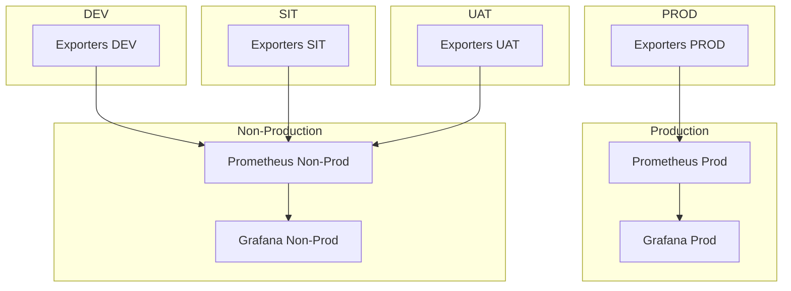

#### 設定範例

```yaml
# prometheus-prod.yml
global:
  external_labels:
    env: production
    datacenter: primary

# prometheus-nonprod.yml
global:
  external_labels:
    env: non-production

scrape_configs:
  - job_name: 'dev-apps'
    static_configs:
      - targets: ['dev-app:8080']
        labels:
          env: dev

  - job_name: 'sit-apps'
    static_configs:
      - targets: ['sit-app:8080']
        labels:
          env: sit
```

### 9.4 與 CI/CD、Batch、微服務整合

#### CI/CD 整合

```yaml
# GitLab CI 範例
deploy:
  stage: deploy
  script:
    - kubectl apply -f k8s/
  after_script:
    # 驗證 Prometheus 已抓取新服務
    - |
      for i in {1..30}; do
        if curl -s "http://prometheus:9090/api/v1/targets" | grep -q "new-service"; then
          echo "Service registered in Prometheus"
          exit 0
        fi
        sleep 10
      done
      echo "Warning: Service not found in Prometheus"
```

#### Batch Job 監控

```java
// Spring Batch + Micrometer
@Component
public class BatchMetrics {
    private final MeterRegistry registry;
    
    public void recordJobExecution(String jobName, String status, Duration duration) {
        registry.counter("batch_job_executions_total", 
            "job", jobName, 
            "status", status).increment();
        
        registry.timer("batch_job_duration_seconds", 
            "job", jobName)
            .record(duration);
    }
}
```

```promql
# Batch 監控指標
batch_job_executions_total{status="COMPLETED"}
batch_job_executions_total{status="FAILED"}
batch_job_duration_seconds
```

#### 微服務整合（Service Mesh）

```yaml
# Istio Prometheus 整合
scrape_configs:
  - job_name: 'istio-mesh'
    kubernetes_sd_configs:
      - role: endpoints
        namespaces:
          names:
            - istio-system
    relabel_configs:
      - source_labels: [__meta_kubernetes_service_name, __meta_kubernetes_endpoint_port_name]
        action: keep
        regex: istio-telemetry;prometheus
```

### 9.5 銀行與高穩定系統導入建議

#### 架構建議

| 項目 | 建議 |
|-----|------|
| **高可用** | Prometheus HA + Alertmanager Cluster |
| **資料保留** | 搭配 Thanos / Cortex 長期儲存 |
| **備份** | 每日快照 + 異地備份 |
| **存取控制** | 整合 AD/LDAP、啟用 HTTPS |
| **稽核** | 啟用 Grafana Audit Log |

#### 安全性建議

```yaml
# Prometheus 啟用基本認證
# 需搭配反向代理（如 Nginx）

# Grafana 安全設定
[security]
admin_password = <strong-password>
secret_key = <random-key>
disable_gravatar = true
cookie_secure = true
cookie_samesite = strict

[auth]
disable_login_form = false
oauth_auto_login = true

[auth.ldap]
enabled = true
config_file = /etc/grafana/ldap.toml
```

#### 稽核需求

```ini
# Grafana Audit Log
[log]
mode = file
level = info

[auditing]
enabled = true
log_file = /var/log/grafana/audit.log
```

---

## 10. 附錄（Appendix）

### 10.1 常用 PromQL Cheat Sheet

| 用途 | PromQL |
|-----|--------|
| **CPU 使用率** | `100 - (avg by(instance) (irate(node_cpu_seconds_total{mode="idle"}[5m])) * 100)` |
| **記憶體使用率** | `(1 - node_memory_MemAvailable_bytes / node_memory_MemTotal_bytes) * 100` |
| **磁碟使用率** | `(1 - node_filesystem_avail_bytes / node_filesystem_size_bytes) * 100` |
| **HTTP QPS** | `sum(rate(http_requests_total[5m])) by (job)` |
| **HTTP 錯誤率** | `sum(rate(http_requests_total{status=~"5.."}[5m])) / sum(rate(http_requests_total[5m])) * 100` |
| **P99 延遲** | `histogram_quantile(0.99, sum(rate(http_request_duration_seconds_bucket[5m])) by (le))` |
| **JVM Heap** | `jvm_memory_used_bytes{area="heap"} / jvm_memory_max_bytes{area="heap"} * 100` |
| **GC 頻率** | `rate(jvm_gc_pause_seconds_count[5m])` |
| **網路流量** | `rate(node_network_receive_bytes_total[5m])` |
| **磁碟 IOPS** | `rate(node_disk_reads_completed_total[5m]) + rate(node_disk_writes_completed_total[5m])` |

### 10.2 推薦 Exporter 清單

| Exporter | 監控對象 | 預設 Port | GitHub |
|----------|---------|----------|--------|
| node_exporter | Linux 主機 | 9100 | prometheus/node_exporter |
| windows_exporter | Windows 主機 | 9182 | prometheus-community/windows_exporter |
| jmx_exporter | JVM 應用 | 9404 | prometheus/jmx_exporter |
| mysql_exporter | MySQL | 9104 | prometheus/mysqld_exporter |
| postgres_exporter | PostgreSQL | 9187 | prometheus-community/postgres_exporter |
| redis_exporter | Redis | 9121 | oliver006/redis_exporter |
| kafka_exporter | Kafka | 9308 | danielqsj/kafka_exporter |
| mongodb_exporter | MongoDB | 9216 | percona/mongodb_exporter |
| elasticsearch_exporter | Elasticsearch | 9114 | prometheus-community/elasticsearch_exporter |
| blackbox_exporter | HTTP/TCP/DNS 探測 | 9115 | prometheus/blackbox_exporter |
| nginx_exporter | Nginx | 9113 | nginxinc/nginx-prometheus-exporter |

### 10.3 Dashboard 範本建議

| 用途 | Dashboard ID | 名稱 |
|-----|-------------|------|
| **主機監控** | 1860 | Node Exporter Full |
| **Docker** | 893 | Docker and system monitoring |
| **K8s Cluster** | 315 | Kubernetes cluster monitoring |
| **JVM** | 4701 | JVM (Micrometer) |
| **Spring Boot** | 12900 | Spring Boot Statistics |
| **MySQL** | 7362 | MySQL Overview |
| **PostgreSQL** | 9628 | PostgreSQL Database |
| **Redis** | 763 | Redis Dashboard |
| **Nginx** | 12708 | Nginx Prometheus |
| **Kafka** | 7589 | Kafka Exporter Overview |

匯入方式：Grafana → Dashboards → Import → 輸入 ID

### 10.4 常見錯誤與 FAQ

#### Q1: Prometheus 記憶體使用過高？

```bash
# 檢查時序數量
curl http://localhost:9090/api/v1/status/tsdb | jq '.data.headStats'

# 解決方案：
# 1. 減少 scrape 頻率
# 2. 移除不必要的 metrics
# 3. 降低 retention 時間
# 4. 使用 sample_limit 限制
```

#### Q2: Grafana 查詢逾時？

```ini
# 調整 Grafana 逾時設定
[dataproxy]
timeout = 120
keep_alive_seconds = 60
```

```promql
# 優化查詢：使用 Recording Rules 預先計算
```

#### Q3: Alertmanager 沒有發送告警？

```bash
# 檢查 Alertmanager 狀態
curl http://localhost:9093/api/v1/status

# 檢查 Prometheus 告警狀態
curl http://localhost:9090/api/v1/alerts

# 常見原因：
# 1. 路由設定錯誤
# 2. 靜默（Silence）生效中
# 3. 通知管道設定錯誤
```

#### Q4: Target 顯示 Down？

```bash
# 檢查網路連通性
curl -v http://target:9100/metrics

# 常見原因：
# 1. 防火牆阻擋
# 2. Exporter 未啟動
# 3. 錯誤的 Port
# 4. 認證失敗
```

#### Q5: 如何處理高 Cardinality？

```promql
# 找出高 Cardinality 指標
topk(10, count by (__name__)({__name__=~".+"}))

# 找出高 Cardinality Label
count by (job) (count by (job, instance) (up))

# 解決方案：
# 1. 移除不必要的 Label
# 2. 使用 relabel_configs 過濾
# 3. 限制 sample_limit
```

---

## 11. 檢查清單（Checklist）

### 11.1 安裝檢查清單

| 項目 | 檢查內容 | 狀態 |
|-----|---------|------|
| ☐ | 系統需求確認（CPU / Memory / Disk） | |
| ☐ | 防火牆 Port 開通（9090 / 3000 / 9100 / 9093） | |
| ☐ | Prometheus 安裝完成 | |
| ☐ | Grafana 安裝完成 | |
| ☐ | Node Exporter 安裝完成 | |
| ☐ | Alertmanager 安裝完成（選用） | |
| ☐ | 服務設為開機自動啟動 | |
| ☐ | 健康檢查通過 | |

### 11.2 設定檢查清單

| 項目 | 檢查內容 | 狀態 |
|-----|---------|------|
| ☐ | prometheus.yml 語法驗證通過 | |
| ☐ | Alert Rules 語法驗證通過 | |
| ☐ | scrape_config 設定正確 | |
| ☐ | Grafana Datasource 連線成功 | |
| ☐ | 基本 Dashboard 匯入 | |
| ☐ | 告警通知測試成功 | |
| ☐ | 權限設定完成 | |

### 11.3 生產環境檢查清單

| 項目 | 檢查內容 | 狀態 |
|-----|---------|------|
| ☐ | HA 架構部署 | |
| ☐ | 備份策略設定 | |
| ☐ | 監控自身的監控（Meta-monitoring） | |
| ☐ | HTTPS 啟用 | |
| ☐ | 認證機制啟用 | |
| ☐ | 稽核日誌啟用 | |
| ☐ | Retention 設定合理 | |
| ☐ | 告警測試完成 | |
| ☐ | Runbook 文件準備 | |
| ☐ | 團隊教育訓練完成 | |

### 11.4 日常維運檢查清單

| 項目 | 頻率 | 狀態 |
|-----|------|------|
| ☐ | 檢查服務健康狀態 | 每日 |
| ☐ | 檢查磁碟空間使用 | 每日 |
| ☐ | 檢查告警狀態 | 每日 |
| ☐ | 檢查 Target 狀態 | 每日 |
| ☐ | 備份驗證 | 每週 |
| ☐ | 效能指標檢視 | 每週 |
| ☐ | Dashboard 使用狀況檢視 | 每月 |
| ☐ | 版本更新評估 | 每月 |
| ☐ | 安全性更新檢查 | 每月 |

---

## 參考資源

- [Prometheus 官方文件](https://prometheus.io/docs/)
- [Grafana 官方文件](https://grafana.com/docs/)
- [PromQL 教學](https://prometheus.io/docs/prometheus/latest/querying/basics/)
- [Alertmanager 設定](https://prometheus.io/docs/alerting/latest/configuration/)
- [Grafana Dashboard 範本](https://grafana.com/grafana/dashboards/)
- [Awesome Prometheus](https://github.com/roaldnefs/awesome-prometheus)


