+++
date = '2026-01-29T19:08:16+08:00'
draft = false
title = 'Prometheus與Grafana教學手冊'
tags = ['教學', '工具', 'Metrics', 'Visualization', 'Prometheus', 'Grafana', 'Alertmanager', 'PromQL', 'Kubernetes']
categories = ['教學']
+++

# Prometheus與Grafana教學手冊

## 文件資訊

| 項目 | 內容 |
| --- | --- |
| **文件版本** | 2.0 |
| **最後更新** | 2026-10-01 |
| **版本基準** | Prometheus 3.15.0（2026-09-24）、Prometheus LTS 3.13.x（支援至 2027-07-31）、Alertmanager 0.34.1、Grafana 13.2.3（2026-09-29）、node_exporter 1.12.1；完整矩陣見 [1.5 版本基準與相容性矩陣](#15-版本基準與相容性矩陣) |
| **文件定位** | 企業標準技術白皮書／內部標準教材：**Prometheus＋Alertmanager＋Grafana 的規劃、安裝、設定、使用、告警、安全、高可用、維運與升級** |
| **適用對象** | 資深工程師、DevOps／SRE、系統管理員、系統架構師、資安與稽核人員 |
| **前置知識** | Linux 系統管理（systemd、防火牆、檔案權限）、容器與 Kubernetes 基本概念、HTTP 與 TLS、YAML |
| **姊妹文件** | 《Metrics Visualization 教學手冊》：指標設計、PromQL 分析、儀表板設計、SLO 與架構決策的深入探討；《OpenTelemetry教學手冊》：OTel SDK 與 Collector；《Logs Visualization 教學手冊》：日誌視覺化 |
| **前一版本** | 1.0（2026-01-27，以 Prometheus 2.48、Grafana 10.2 為基準） |
| **Created by** | Eric Cheng |

> 📌 **v2.0 改版重點**：章節重新編排為 15 章與 7 個附錄，全面對齊 Prometheus 3.x、Alertmanager 0.34 與 Grafana 13。
>
> - **修正錯誤**：修正 v1.0 中已不適用或會造成故障的內容。例如 3.x 發行包已不含 `consoles`、`apt-key` 已棄用、Alertmanager `/api/v1` 已移除（回傳 410）、`match`／`source_match` 已棄用、Teams Office 365 connector 已停用、快照還原步驟會刪除快照本身、儲存估算重複折算壓縮率、Grafana 稽核設定鍵錯誤且為 Enterprise 限定、Istio `istio-telemetry` 已不存在等。
> - **新增內容**：容量規劃、Alertmanager 安裝、Compose 與 Kubernetes 部署、離線安裝、Service Discovery 與 relabel、抓取保護、Remote Write／Agent mode、OTLP、Grafana 資料庫與認證整合、原生直方圖、Dynamic dashboards、Grafana Alerting 決策、規則單元測試、安全強化、高可用、自我監控、Prometheus 2.x → 3.x 遷移、Grafana 13 升級、AI 輔助維運與臺灣法規對應。
> - **追溯依據**：所有差異見 [E.2 v1.0 → v2.0 更正對照表](#e2-v10--v20-更正對照表)，查證依據見 [附錄 F：查證紀錄](#附錄-f查證紀錄)。

### 閱讀指引

| 讀者角色 | 建議閱讀章節 |
| --- | --- |
| 初次接觸 Prometheus／Grafana | 第 1 章 → 第 2 章 → 4.5 → 第 7 章 → 第 8 章 |
| 系統管理員（VM／實體機） | 第 3 章 → 4.1–4.4 → 第 5、6 章 → 第 12 章 → 第 13 章 |
| Kubernetes 平台工程師 | 2.6 → 4.6 → 5.2–5.4 → 11.1–11.2 → 12.4 |
| SRE／值班人員 | 第 7 章 → 第 9 章 → 12.1 → 12.6 → 第 15 章 |
| 應用程式開發人員 | 2.2–2.3 → 7.4 → 14.1–14.2 → 14.5 |
| 架構師 | 2.6–2.7 → 3.2 → 第 11 章 → 14.3–14.4 |
| 資安／稽核人員 | 第 10 章 → 14.6 → 15.3 |
| 技術主管／決策者 | 1.1–1.5 → 2.7 → 13.1 → 14.6 → 14.7 |

### 本文慣例

| 標記 | 意義 |
| --- | --- |
| ✅／❌ | 建議做法／不建議做法 |
| ⚠️ | 容易出錯或有風險的地方 |
| 💡 | 實務技巧 |
| 🧪 | 實驗性功能：需 `--enable-feature` 或 feature toggle，行為可能在後續版本變更，不納入 LTS 支援範圍 |
| 📌 | 版本差異或改版說明 |
| 🏢 | 只在 Grafana Enterprise 或 Grafana Cloud 提供的功能 |
| `$變數` | Grafana 範本變數 |
| `<尖括號>` | 需依環境替換的值 |
| `example.internal` | 範例內部網域，請替換為實際網域 |

> ⚠️ 本手冊的指令以 RHEL 9／10 與 Ubuntu 24.04 LTS 為例，設定檔與 PromQL 皆以 Prometheus 3.15、Alertmanager 0.34.1、Grafana 13.2.3 撰寫，並以官方二進位檔的 `promtool`／`amtool` 驗證（見 [附錄 F：查證紀錄](#附錄-f查證紀錄)）。若仍在 Prometheus 2.x，請先閱讀 [13.2 Prometheus 2.x → 3.x 遷移](#132-prometheus-2x--3x-遷移)。

## 📑 目錄

<!-- TOC-AUTO-BEGIN -->

- [1. 總覽與版本基準](#1-總覽與版本基準)
  - [1.1 文件定位、範圍與姊妹手冊分工](#11-文件定位範圍與姊妹手冊分工)
  - [1.2 為何需要 Metrics 監控](#12-為何需要-metrics-監控)
  - [1.3 Observability 訊號與整合方式](#13-observability-訊號與整合方式)
  - [1.4 適用與需評估場景](#14-適用與需評估場景)
  - [1.5 版本基準與相容性矩陣](#15-版本基準與相容性矩陣)
  - [1.6 Prometheus 3.x 與 Grafana 12–13 重大變化](#16-prometheus-3x-與-grafana-1213-重大變化)
- [2. 架構說明](#2-架構說明)
  - [2.1 Prometheus 架構與資料流](#21-prometheus-架構與資料流)
  - [2.2 資料模型與指標型別](#22-資料模型與指標型別)
  - [2.3 Exporter、Instrumentation、Pushgateway 與 OTLP](#23-exporterinstrumentationpushgateway-與-otlp)
  - [2.4 Grafana 架構](#24-grafana-架構)
  - [2.5 Alertmanager 架構](#25-alertmanager-架構)
  - [2.6 部署拓撲](#26-部署拓撲)
  - [2.7 架構選型決策](#27-架構選型決策)
- [3. 規劃與容量](#3-規劃與容量)
  - [3.1 硬體與作業系統](#31-硬體與作業系統)
  - [3.2 記憶體與磁碟容量估算](#32-記憶體與磁碟容量估算)
  - [3.3 網路與 Port 規劃](#33-網路與-port-規劃)
  - [3.4 帳號、目錄與檔案系統規劃](#34-帳號目錄與檔案系統規劃)
- [4. 系統安裝](#4-系統安裝)
  - [4.1 Prometheus 安裝（二進位檔＋systemd）](#41-prometheus-安裝二進位檔systemd)
  - [4.2 Alertmanager 安裝](#42-alertmanager-安裝)
  - [4.3 node_exporter 與常用 Exporter](#43-node_exporter-與常用-exporter)
  - [4.4 Grafana 安裝（RPM／DEB 套件）](#44-grafana-安裝rpmdeb-套件)
  - [4.5 Docker／Podman Compose 一站式環境](#45-dockerpodman-compose-一站式環境)
  - [4.6 Kubernetes：kube-prometheus-stack](#46-kuberneteskube-prometheus-stack)
  - [4.7 離線（Air-gapped）安裝](#47-離線air-gapped安裝)
  - [4.8 安裝驗證與常見錯誤](#48-安裝驗證與常見錯誤)
- [5. Prometheus 設定](#5-prometheus-設定)
  - [5.1 prometheus.yml 結構總覽](#51-prometheusyml-結構總覽)
  - [5.2 scrape_configs 與 Service Discovery](#52-scrape_configs-與-service-discovery)
  - [5.3 relabel_configs 與 metric_relabel_configs](#53-relabel_configs-與-metric_relabel_configs)
  - [5.4 抓取限制與保護](#54-抓取限制與保護)
  - [5.5 規則檔與規則群組](#55-規則檔與規則群組)
  - [5.6 Remote Write、Remote Read 與 Agent mode](#56-remote-writeremote-read-與-agent-mode)
  - [5.7 OTLP 接收](#57-otlp-接收)
  - [5.8 Retention 與儲存設定](#58-retention-與儲存設定)
  - [5.9 熱重載與設定驗證](#59-熱重載與設定驗證)
- [6. Grafana 設定](#6-grafana-設定)
  - [6.1 grafana.ini 與環境變數](#61-grafanaini-與環境變數)
  - [6.2 資料庫後端與 unified storage](#62-資料庫後端與-unified-storage)
  - [6.3 Datasource provisioning](#63-datasource-provisioning)
  - [6.4 Dashboard provisioning、Git Sync 與 Dashboard as Code](#64-dashboard-provisioninggit-sync-與-dashboard-as-code)
  - [6.5 組織、Team、Folder 與 RBAC](#65-組織teamfolder-與-rbac)
  - [6.6 認證整合](#66-認證整合)
  - [6.7 外掛管理](#67-外掛管理)
- [7. PromQL 與指標查詢](#7-promql-與指標查詢)
  - [7.1 基本語法](#71-基本語法)
  - [7.2 函式與聚合](#72-函式與聚合)
  - [7.3 Histogram：classic 與 native](#73-histogramclassic-與-native)
  - [7.4 常用查詢範本](#74-常用查詢範本)
  - [7.5 Recording rules](#75-recording-rules)
  - [7.6 查詢效能與常見陷阱](#76-查詢效能與常見陷阱)
- [8. Dashboard 設計與實作](#8-dashboard-設計與實作)
  - [8.1 設計原則](#81-設計原則)
  - [8.2 Panel 類型選擇](#82-panel-類型選擇)
  - [8.3 Variables 與 $__rate_interval](#83-variables-與-__rate_interval)
  - [8.4 Dynamic dashboards（schema v2）](#84-dynamic-dashboardsschema-v2)
  - [8.5 實務範例](#85-實務範例)
  - [8.6 社群範本與匯入](#86-社群範本與匯入)
- [9. 告警與通知](#9-告警與通知)
  - [9.1 Alerting rules 撰寫](#91-alerting-rules-撰寫)
  - [9.2 Alertmanager 設定](#92-alertmanager-設定)
  - [9.3 通知整合](#93-通知整合)
  - [9.4 Grafana Alerting 與選擇決策](#94-grafana-alerting-與選擇決策)
  - [9.5 告警分級、Runbook 與 On-call](#95-告警分級runbook-與-on-call)
  - [9.6 SLO 與燃燒率告警](#96-slo-與燃燒率告警)
  - [9.7 規則與路由測試](#97-規則與路由測試)
- [10. 安全強化](#10-安全強化)
  - [威脅模型](#威脅模型)
  - [10.1 TLS 與 Basic Auth（web.config.file）](#101-tls-與-basic-authwebconfigfile)
  - [10.2 Admin 與 Lifecycle API 保護](#102-admin-與-lifecycle-api-保護)
  - [10.3 Grafana 安全設定](#103-grafana-安全設定)
  - [10.4 祕密管理](#104-祕密管理)
  - [10.5 稽核日誌](#105-稽核日誌)
  - [10.6 網路分區與最小權限](#106-網路分區與最小權限)
- [11. 高可用與擴展](#11-高可用與擴展)
  - [11.1 Prometheus HA](#111-prometheus-ha)
  - [11.2 Alertmanager 叢集](#112-alertmanager-叢集)
  - [11.3 Grafana HA](#113-grafana-ha)
  - [11.4 Federation](#114-federation)
  - [11.5 長期儲存方案比較](#115-長期儲存方案比較)
- [12. 系統維護](#12-系統維護)
  - [12.1 自我監控（Meta-monitoring）](#121-自我監控meta-monitoring)
  - [12.2 儲存與磁碟管理](#122-儲存與磁碟管理)
  - [12.3 效能調校](#123-效能調校)
  - [12.4 Cardinality（基數）管理](#124-cardinality基數管理)
  - [12.5 備份與還原](#125-備份與還原)
  - [12.6 疑難排解 FAQ](#126-疑難排解-faq)
- [13. 系統升級與版本管理](#13-系統升級與版本管理)
  - [13.1 版本策略與 LTS](#131-版本策略與-lts)
  - [13.2 Prometheus 2.x → 3.x 遷移](#132-prometheus-2x--3x-遷移)
  - [13.3 Prometheus 升級步驟（minor 版）](#133-prometheus-升級步驟minor-版)
  - [13.4 Grafana 升級](#134-grafana-升級)
  - [13.5 Alertmanager、Exporter 與 kube-prometheus-stack 升級](#135-alertmanagerexporter-與-kube-prometheus-stack-升級)
  - [13.6 回滾策略](#136-回滾策略)
- [14. 企業實務與最佳實踐](#14-企業實務與最佳實踐)
  - [14.1 命名規範](#141-命名規範)
  - [14.2 Label 設計](#142-label-設計)
  - [14.3 多環境設計（DEV／SIT／UAT／PROD）](#143-多環境設計devsituatprod)
  - [14.4 CI/CD 與 GitOps](#144-cicd-與-gitops)
  - [14.5 Batch、微服務與 Service Mesh](#145-batch微服務與-service-mesh)
  - [14.6 金融業與高穩定系統導入建議](#146-金融業與高穩定系統導入建議)
  - [14.7 AI 輔助維運](#147-ai-輔助維運)
- [15. 檢查清單](#15-檢查清單)
  - [15.1 安裝檢查清單](#151-安裝檢查清單)
  - [15.2 設定檢查清單](#152-設定檢查清單)
  - [15.3 上線前（生產環境）檢查清單](#153-上線前生產環境檢查清單)
  - [15.4 日常維運檢查清單](#154-日常維運檢查清單)
  - [15.5 升級檢查清單](#155-升級檢查清單)
- [附錄 A：PromQL 速查](#附錄-apromql-速查)
  - [A.1 選擇器與修飾子](#a1-選擇器與修飾子)
  - [A.2 函式](#a2-函式)
  - [A.3 聚合與向量匹配](#a3-聚合與向量匹配)
  - [A.4 常用情境速查](#a4-常用情境速查)
- [附錄 B：設定範本](#附錄-b設定範本)
  - [B.1 範本索引](#b1-範本索引)
  - [B.2 備份排程（systemd timer）](#b2-備份排程systemd-timer)
  - [B.3 以 Ansible 產生 file_sd 目標檔](#b3-以-ansible-產生-file_sd-目標檔)
  - [B.4 Prometheus Operator：納管 Kubernetes 外部的目標](#b4-prometheus-operator納管-kubernetes-外部的目標)
- [附錄 C：Exporter、Mixin 與 Dashboard 清單](#附錄-cexportermixin-與-dashboard-清單)
  - [C.1 Exporter 清單](#c1-exporter-清單)
  - [C.2 Monitoring mixins](#c2-monitoring-mixins)
  - [C.3 Dashboard 範本](#c3-dashboard-範本)
- [附錄 D：參考資源](#附錄-d參考資源)
  - [D.1 Prometheus 與 Alertmanager](#d1-prometheus-與-alertmanager)
  - [D.2 Grafana](#d2-grafana)
  - [D.3 Kubernetes 與生態系](#d3-kubernetes-與生態系)
  - [D.4 社群資源](#d4-社群資源)
  - [D.5 推薦書籍](#d5-推薦書籍)
  - [D.6 臺灣法規與指引](#d6-臺灣法規與指引)
  - [D.7 姊妹手冊](#d7-姊妹手冊)
- [附錄 E：版本紀錄](#附錄-e版本紀錄)
  - [E.1 版本歷程](#e1-版本歷程)
  - [E.2 v1.0 → v2.0 更正對照表](#e2-v10--v20-更正對照表)
- [附錄 F：查證紀錄](#附錄-f查證紀錄)
  - [F.1 待確認事項](#f1-待確認事項)
- [附錄 G：術語表](#附錄-g術語表)

<!-- TOC-AUTO-END -->

---

## 1. 總覽與版本基準

### 1.1 文件定位、範圍與姊妹手冊分工

本手冊是企業導入 **Prometheus＋Alertmanager＋Grafana** 指標監控平台的完整操作與管理標準。內容從架構與容量規劃開始，依序說明安裝、設定、查詢、儀表板、告警、安全、高可用、日常維運與版本升級，並提供可直接套用的設定範本與檢查清單。

本手冊可以單獨閱讀。各章節涵蓋的設計主題（PromQL、Dashboard、SLO）以「能正確操作與落地」為目標；若需要更深入的設計方法論與分析案例，請參考《Metrics Visualization 教學手冊》對應章節。

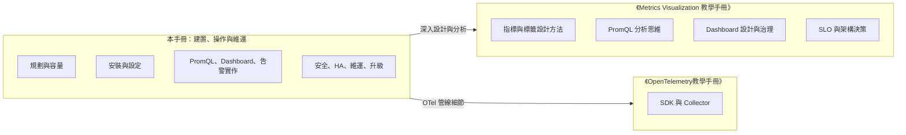
```mermaid
flowchart LR
    subgraph This["本手冊：建置、操作與維運"]
        A1["規劃與容量"]
        A2["安裝與設定"]
        A3["PromQL、Dashboard、告警實作"]
        A4["安全、HA、維運、升級"]
    end
    subgraph Sister["《Metrics Visualization 教學手冊》"]
        B1["指標與標籤設計方法"]
        B2["PromQL 分析思維"]
        B3["Dashboard 設計與治理"]
        B4["SLO 與架構決策"]
    end
    subgraph OTel["《OpenTelemetry教學手冊》"]
        C1["SDK 與 Collector"]
    end
    This -->|"深入設計與分析"| Sister
    This -->|"OTel 管線細節"| OTel
```

| 主題 | 本手冊 | 延伸閱讀 |
| --- | --- | --- |
| 安裝、設定檔逐項說明、升級步驟 | **完整涵蓋** | — |
| PromQL | 語法、常用查詢、效能與陷阱（第 7 章） | 《Metrics Visualization 教學手冊》第 3 章：PromQL 思考模型 |
| Dashboard | 設計原則、變數、Dynamic dashboards、範例（第 8 章） | 同上第 4 章：故事線與角色化設計 |
| 告警與 SLO | 規則、路由、通知、燃燒率告警實作（第 9 章） | 同上第 5 章：SLO 與 Error Budget |
| OpenTelemetry | OTLP 接收與轉換（[5.7](#57-otlp-接收)） | 《OpenTelemetry教學手冊》 |
| 日誌 | 不涵蓋 | 《ELK Stack 教學手冊》、《Logs Visualization 教學手冊》 |

### 1.2 為何需要 Metrics 監控

在現代企業系統中，**可觀測性（Observability）** 是維運的核心能力。Metrics（指標）以低成本的數值時序資料，持續回答「系統現在是否健康、趨勢往哪裡走」。

| 需求面向 | 說明 | 本手冊章節 |
| --- | --- | --- |
| **效能監控** | 即時掌握 CPU、記憶體、磁碟 I/O、網路與應用程式延遲 | [7.4](#74-常用查詢範本)、[8.5](#85-實務範例) |
| **問題定位** | 從趨勢與相關性快速縮小問題範圍，再交給 Logs／Traces 細查 | [1.3](#13-observability-訊號與整合方式)、[8.1](#81-設計原則) |
| **容量規劃** | 以歷史成長率預測資源需求，提前擴容 | [3.2](#32-記憶體與磁碟容量估算)、[7.2](#72-函式與聚合) |
| **SLA／SLO 管理** | 量化服務品質，追蹤 Error Budget | [9.6](#96-slo-與燃燒率告警) |
| **異常告警** | 自動偵測異常並依嚴重度通知對應人員 | 第 9 章 |
| **稽核與合規** | 證明系統持續受監控、事件有被偵測與處理 | [10.5](#105-稽核日誌)、[14.6](#146-金融業與高穩定系統導入建議) |

#### 實務觀點：Metrics 是第一層防線

在金融與高可用系統中，Metrics 是「第一層防線」：它成本最低、查詢最快，最適合用來**偵測**問題；Logs 與 Traces 則用來**解釋**問題。要讓 Metrics 真正提供早期預警，必須同時具備三個條件：

1. **正確的指標**：以 RED（Rate、Errors、Duration）衡量服務，以 USE（Utilization、Saturation、Errors）衡量資源
2. **可行動的告警**：告警代表「需要有人處理」，並附上 Runbook
3. **可靠的監控平台**：監控系統本身要有 HA 與自我監控，否則故障時會「一起失明」（見 [12.1](#121-自我監控meta-monitoring)）

> 💡 偵測時間的現實估算：抓取間隔 15 秒＋規則評估 15 秒＋`for: 2m`＋Alertmanager `group_wait: 30s`，從異常發生到通知送達約需 3 分鐘。99.99% 可用性每月只允許約 4.3 分鐘停機，因此高可用目標必須搭配自動化修復，不能只靠人員收到告警後處理。

### 1.3 Observability 訊號與整合方式

| 面向 | Metrics | Logs | Traces | Profiles |
| --- | --- | --- | --- | --- |
| **資料型態** | 數值型時序資料 | 文字或結構化事件 | 請求在各服務間的呼叫鏈 | 程式碼層級的 CPU／記憶體取樣 |
| **主要用途** | 監控趨勢、告警、容量規劃 | 根因分析、稽核 | 分散式延遲分析 | 找出熱點函式 |
| **儲存成本** | 低（每個樣本約 1–2 bytes） | 高 | 中（通常需取樣） | 中 |
| **典型問題** | 「系統是否健康？」 | 「發生了什麼事？」 | 「時間花在哪個服務？」 | 「時間花在哪一行程式？」 |
| **常見工具** | Prometheus、Mimir、Thanos | Elasticsearch、Loki | Jaeger、Tempo | Pyroscope |

#### 整合架構範例

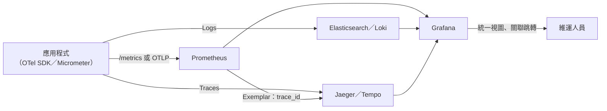
```mermaid
flowchart LR
    App["應用程式<br/>（OTel SDK／Micrometer）"]
    App -->|"/metrics 或 OTLP"| Prom["Prometheus"]
    App -->|"Logs"| Log["Elasticsearch／Loki"]
    App -->|"Traces"| Trace["Jaeger／Tempo"]
    Prom -->|"Exemplar：trace_id"| Trace
    Prom --> G["Grafana"]
    Log --> G
    Trace --> G
    G -->|"統一視圖、關聯跳轉"| User["維運人員"]
```

三種訊號要能互相跳轉，才稱得上「整合」：

| 關聯方式 | 做法 | 設定位置 |
| --- | --- | --- |
| Metrics → Traces | Exemplar 帶 `trace_id`，Grafana 點擊資料點跳到 trace | 6.3 `exemplarTraceIdDestinations` |
| Traces → Logs | Trace 中的 `trace_id` 對應到日誌欄位 | Tempo／Jaeger 資料來源的 Trace to logs |
| Logs → Metrics | 共用 `service`、`namespace`、`instance` 等標籤 | 14.2 標籤規範 |

### 1.4 適用與需評估場景

#### 適合使用 Prometheus＋Grafana 的場景

| 場景 | 說明 |
| --- | --- |
| **微服務架構** | 大量服務實例的統一監控，搭配 Service Discovery 自動納管 |
| **容器化與 Kubernetes** | 生態系原生支援，Prometheus Operator 已是事實標準 |
| **雲原生應用** | CNCF 畢業專案，多數中介軟體都提供 exporter 或原生 `/metrics` |
| **混合雲與地端機房** | 單一二進位檔即可部署，不依賴外部服務 |
| **金融核心與高可用系統** | 7×24 監控、可版控的告警規則，便於稽核 |

#### 需要額外評估的場景

| 場景 | 考量點 | 建議方案 |
| --- | --- | --- |
| **超大規模（千萬級 active series）** | 單機垂直擴展有上限 | 分片＋Thanos／Mimir／VictoriaMetrics（[11.5](#115-長期儲存方案比較)） |
| **長期資料保存（數月到數年）** | 本機 TSDB 預設只保留 15 天，且沒有複寫 | Remote Write 到長期儲存，並啟用降採樣 |
| **高基數資料（使用者 ID、訂單號）** | 每個標籤值組合都是一條序列，記憶體會爆增 | 改用 Logs、Traces 或 Exemplar（[14.2](#142-label-設計)） |
| **逐筆事件精確計數（例如帳務）** | Prometheus 會在抓取失敗、重啟時遺失樣本 | 以交易資料庫或事件流為準，Metrics 只做監控 |
| **短生命週期批次工作** | 工作結束前可能來不及被抓取 | Pushgateway 或 OTLP 推送（[2.3](#23-exporterinstrumentationpushgateway-與-otlp)） |

### 1.5 版本基準與相容性矩陣

本手冊以 2026-10-01 各專案的最新穩定版為基準，版本號皆以 GitHub Releases 與官方 CHANGELOG 查證。

#### 核心元件

| 元件 | 基準版本 | 發佈日期 | 支援說明 |
| --- | --- | --- | --- |
| Prometheus | **3.15.0** | 2026-09-24 | 每 6 週一個 minor 版；一般 minor 版只在下一版發佈前修正錯誤 |
| Prometheus LTS | **3.13.x**（3.13.3） | 3.13.0 於 2026-07-01 | LTS 支援至 2027-07-31；前一個 LTS 3.5 已於 2026-07-31 結束 |
| Alertmanager | **0.34.1** | 2026-09-17 | 仍為 0.x 版號，但已廣泛用於生產環境；只支援最新版 |
| Grafana | **13.2.3** | 2026-09-29 | 每兩個月一個 minor 版；每個 minor 版支援 9 個月，major 的最後一個 minor 版支援 15 個月；13.3 預定 2026-10-20 |
| Pushgateway | 1.11.3 | 2026-05-27 | 只用於批次工作 |

#### Exporter

| Exporter | 基準版本 | 預設 Port | 專案 |
| --- | --- | --- | --- |
| node_exporter | 1.12.1 | 9100 | prometheus/node_exporter |
| windows_exporter | 0.31.8 | 9182 | prometheus-community/windows_exporter |
| blackbox_exporter | 0.28.0 | 9115 | prometheus/blackbox_exporter |
| jmx_exporter（Java agent） | 1.6.0 | 無預設，於啟動參數指定（慣例 9404） | prometheus/jmx_exporter |
| mysqld_exporter | 0.20.0 | 9104 | prometheus/mysqld_exporter |
| postgres_exporter | 0.20.1 | 9187 | prometheus-community/postgres_exporter |
| redis_exporter | 1.93.0 | 9121 | oliver006/redis_exporter |
| kafka_exporter | 1.10.0 | 9308 | danielqsj/kafka_exporter |
| mongodb_exporter | 0.53.0 | 9216 | percona/mongodb_exporter |
| elasticsearch_exporter | 1.11.0 | 9114 | prometheus-community/elasticsearch_exporter |
| nginx-prometheus-exporter | 1.5.3 | 9113 | nginx/nginx-prometheus-exporter |
| snmp_exporter | 0.30.1 | 9116 | prometheus/snmp_exporter |
| kube-state-metrics | 2.20.0 | 8080 | kubernetes/kube-state-metrics |

#### Kubernetes 與長期儲存

| 元件 | 基準版本 | 用途 |
| --- | --- | --- |
| Prometheus Operator | 0.94.1 | 以 CRD 管理 Prometheus、Alertmanager 與抓取設定 |
| kube-prometheus-stack（Helm chart） | 91.8.2 | Operator＋Prometheus＋Alertmanager＋Grafana＋預設規則與儀表板；要求 Kubernetes 1.25 以上 |
| Thanos | 0.42.4 | 長期儲存與全域查詢 |
| Grafana Mimir | 3.2.1 | 多租戶長期儲存 |
| VictoriaMetrics | 1.153.0 | 高壓縮率的相容時序資料庫 |
| Grafana Alloy | 1.20.1 | Grafana 的 OTel Collector 發行版；取代已於 2025-11-01 結束支援的 Grafana Agent |

#### 相容性重點

| 組合 | 相容性說明 |
| --- | --- |
| Prometheus 3.x ↔ Alertmanager | Prometheus 3 只支援 Alertmanager v2 API，需 Alertmanager 0.16.0 以上 |
| Prometheus 3.x ↔ Grafana | Grafana 13 的 Prometheus 資料來源完整支援 3.x，包含原生直方圖與 UTF-8 名稱；資料來源設定中的 `prometheusVersion` 應填實際版本 |
| Prometheus 3.x TSDB ↔ 2.x | 3.x 寫入的資料只能由 **2.55 以上**讀取；降版前要確認 |
| Grafana 13 ↔ 資料庫 | 支援 SQLite 3、MySQL 8.0 以上、PostgreSQL 12 以上；生產環境不建議 SQLite |
| Grafana 13 ↔ 外掛 | 前端改為 React 19，AngularJS 外掛自 12.0 起已不支援；升級前需更新外掛 |

> 📌 **LTS 選擇建議**：受監理、變更窗口有限的環境建議採用 **Prometheus 3.13 LTS**，搭配 Grafana 最新 minor 版的最新修補版。功能需求優先的團隊可追最新 minor 版，但要接受每 6 週評估一次升級的節奏（見 [13.1](#131-版本策略與-lts)）。

### 1.6 Prometheus 3.x 與 Grafana 12–13 重大變化

#### Prometheus 3.x

| 版本 | 變化 | 本手冊章節 |
| --- | --- | --- |
| 3.0 | 全新 UI；UTF-8 指標與標籤名稱；OTLP receiver 以 `--web.enable-otlp-receiver` 啟用；Agent mode 改用 `--agent`；自動設定 `GOMEMLIMIT`／`GOMAXPROCS`；發行包移除 `consoles` 與 `console_libraries` | [4.1](#41-prometheus-安裝二進位檔systemd)、[5.6](#56-remote-writeremote-read-與-agent-mode)、[5.7](#57-otlp-接收)、[13.2](#132-prometheus-2x--3x-遷移) |
| 3.0 | `le`／`quantile` 標籤值正規化（`le="1"` → `le="1.0"`）；範圍選擇器改為左開右閉；抓取時嚴格檢查 `Content-Type` | [7.3](#73-histogramclassic-與-native)、[13.2](#132-prometheus-2x--3x-遷移) |
| 3.8／3.9 | **原生直方圖轉為穩定**，以 `scrape_native_histograms` 設定啟用；3.9 起舊 feature flag 成為 no-op | [5.4](#54-抓取限制與保護)、[7.3](#73-histogramclassic-與-native) |
| 3.10 | 🧪 `fill()`／`fill_left()`／`fill_right()` 二元運算修飾子 | 附錄 A |
| 3.11 | 🧪 `histogram_quantiles()`；🧪 `storage.tsdb.retention.percentage` | [5.8](#58-retention-與儲存設定)、[7.3](#73-histogramclassic-與-native) |
| 3.13（LTS） | 跨主機轉址時不再轉送認證資訊 | [10.1](#101-tls-與-basic-authwebconfigfile) |
| 3.14 | Duration expressions 預設啟用；`first_over_time` 轉為穩定 | [7.2](#72-函式與聚合) |
| 3.15 | `--log.level` 棄用，改用設定檔 `runtime.log_level`；`storage.tsdb.retention.*` 設定檔欄位取代 CLI 旗標；🧪 OpenMetrics 2.0、zstd 壓縮抓取 | [5.1](#51-prometheusyml-結構總覽)、[5.8](#58-retention-與儲存設定) |

#### Grafana 12–13

| 版本 | 變化 | 本手冊章節 |
| --- | --- | --- |
| 11.0 | 移除舊版（legacy）Dashboard 告警，統一為 Grafana Alerting | [9.4](#94-grafana-alerting-與選擇決策) |
| 12.0 | 移除 AngularJS 外掛支援；Dashboard schema v2 與 Git Sync（實驗）；SQL expressions；Drilldown 應用 | [6.4](#64-dashboard-provisioninggit-sync-與-dashboard-as-code)、[8.4](#84-dynamic-dashboardsschema-v2) |
| 12.4 | `grafana/grafana-oss` Docker 映像停止更新，改用 `grafana/grafana` | [4.4](#44-grafana-安裝rpmdeb-套件)、[4.5](#45-dockerpodman-compose-一站式環境) |
| 13.0 | **Dynamic dashboards 與 Git Sync GA**；資料夾與 Dashboard 遷移到 unified storage；**移除 `grafana-cli`／`grafana-server` 指令**；移除 Image Renderer 外掛模式；以數字 `id` 存取資料來源的 API 預設停用 | [6.2](#62-資料庫後端與-unified-storage)、[6.4](#64-dashboard-provisioninggit-sync-與-dashboard-as-code)、[13.4](#134-grafana-升級) |
| 13.1／13.2 | 變數可放在 rows／tabs；Git Sync 支援 GitHub Enterprise、GitLab、Bitbucket；Saved queries GA（🏢） | [6.4](#64-dashboard-provisioninggit-sync-與-dashboard-as-code)、[8.4](#84-dynamic-dashboardsschema-v2) |

---

## 2. 架構說明

### 2.1 Prometheus 架構與資料流

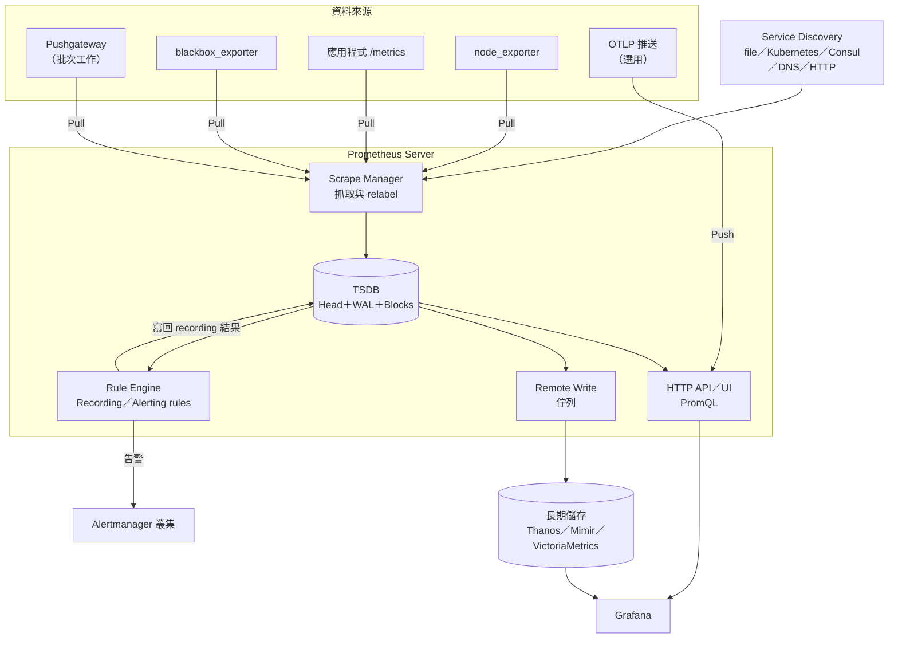
```mermaid
flowchart TB
    subgraph Sources["資料來源"]
        E1["node_exporter"]
        E2["應用程式 /metrics"]
        E3["blackbox_exporter"]
        PG["Pushgateway<br/>（批次工作）"]
        OT["OTLP 推送<br/>（選用）"]
    end
    SD["Service Discovery<br/>file／Kubernetes／Consul／DNS／HTTP"]
    subgraph Server["Prometheus Server"]
        SM["Scrape Manager<br/>抓取與 relabel"]
        TSDB[("TSDB<br/>Head＋WAL＋Blocks")]
        RE["Rule Engine<br/>Recording／Alerting rules"]
        API["HTTP API／UI<br/>PromQL"]
        RW["Remote Write<br/>佇列"]
    end
    AM["Alertmanager 叢集"]
    G["Grafana"]
    LTS[("長期儲存<br/>Thanos／Mimir／VictoriaMetrics")]

    SD --> SM
    E1 -->|"Pull"| SM
    E2 -->|"Pull"| SM
    E3 -->|"Pull"| SM
    PG -->|"Pull"| SM
    OT -->|"Push"| API
    SM --> TSDB
    TSDB --> RE
    RE -->|"寫回 recording 結果"| TSDB
    RE -->|"告警"| AM
    TSDB --> API
    TSDB --> RW
    RW --> LTS
    API --> G
    LTS --> G
```

#### 核心元件說明

| 元件 | 功能 | 說明 |
| --- | --- | --- |
| **Service Discovery** | 找出要抓取的目標 | 支援 static、file、Kubernetes、Consul、DNS、HTTP、各大雲端等 30 多種機制（[5.2](#52-scrape_configs-與-service-discovery)） |
| **Scrape Manager** | 定期以 HTTP GET 抓取 `/metrics` | 抓取前以 `relabel_configs` 決定目標與標籤；抓取後以 `metric_relabel_configs` 過濾樣本（[5.3](#53-relabel_configs-與-metric_relabel_configs)） |
| **TSDB** | 本機時序資料庫 | 詳見下方「TSDB 儲存結構」 |
| **Rule Engine** | 定期評估規則 | Recording rule 預先計算並寫回 TSDB；Alerting rule 產生告警送往 Alertmanager（[5.5](#55-規則檔與規則群組)） |
| **HTTP API／UI** | 查詢與管理 | PromQL 查詢 API、狀態頁、Admin API（預設關閉，10.2） |
| **Remote Write** | 將樣本轉送到外部系統 | 以 WAL 為來源，有佇列與重試機制（[5.6](#56-remote-writeremote-read-與-agent-mode)） |

#### TSDB 儲存結構

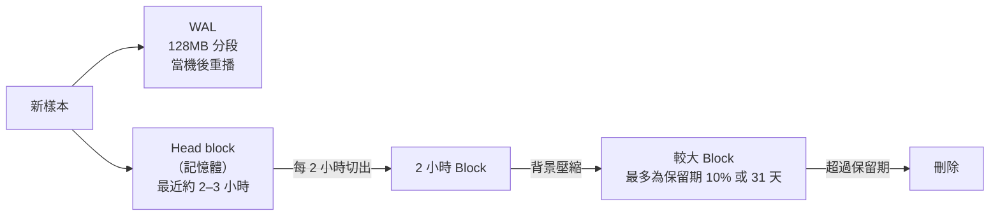
```mermaid
flowchart LR
    S["新樣本"] --> WAL["WAL<br/>128MB 分段<br/>當機後重播"]
    S --> Head["Head block<br/>（記憶體）<br/>最近約 2–3 小時"]
    Head -->|"每 2 小時切出"| B1["2 小時 Block"]
    B1 -->|"背景壓縮"| B2["較大 Block<br/>最多為保留期 10% 或 31 天"]
    B2 -->|"超過保留期"| Del["刪除"]
```

| 目錄 | 內容 | 維運重點 |
| --- | --- | --- |
| `wal/` | Write-Ahead Log，記錄尚未寫成 Block 的樣本 | 當機重啟時重播，大量序列時重播需要數分鐘 |
| `chunks_head/` | Head block 已寫入磁碟並以 mmap 存取的 chunk | 與 WAL 一起構成「尚未持久化成 Block」的資料 |
| `wbl/` | 亂序樣本（out-of-order）的 WAL | 只有設定 `out_of_order_time_window` 時才會出現 |
| `01J...`（ULID） | 不可變的 Block：`chunks/`、`index`、`meta.json`、`tombstones` | 備份與複製的基本單位 |
| `snapshots/` | Admin API 建立的快照 | 用於備份（[12.5](#125-備份與還原)） |
| `lock` | 防止兩個程序同時開啟同一資料目錄 | 正常情況不要手動刪除 |

> ⚠️ 官方文件明確指出：本機儲存**不具叢集與複寫能力**，也**不支援 NFS**（包含 AWS EFS）。請使用本機磁碟或區塊儲存（SSD、SAN LUN、雲端 Block Volume）。

#### Pull 與 Push 模型

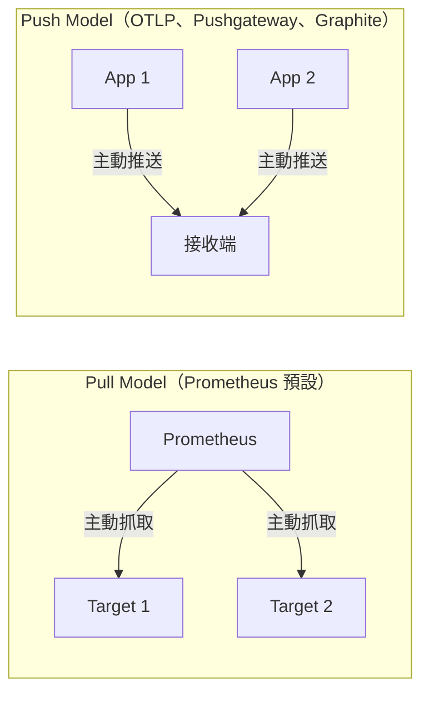
```mermaid
flowchart LR
    subgraph Pull["Pull Model（Prometheus 預設）"]
        P1["Prometheus"] -->|"主動抓取"| T1["Target 1"]
        P1 -->|"主動抓取"| T2["Target 2"]
    end
    subgraph Push["Push Model（OTLP、Pushgateway、Graphite）"]
        A1["App 1"] -->|"主動推送"| R1["接收端"]
        A2["App 2"] -->|"主動推送"| R1
    end
```

| 模式 | 優點 | 缺點 | 適用 |
| --- | --- | --- | --- |
| **Pull** | `up` 指標天然提供健康檢查；由監控端控制頻率，不會被打爆；容易在本機手動查看 `/metrics` | 需要網路可達目標；短生命週期工作可能來不及抓 | 長時間運行的服務（預設選擇） |
| **Push** | 穿越防火牆與 NAT 容易；適合短生命週期工作 | 需另外判斷「沒收到資料」是故障還是沒事；接收端可能被大量推送壓垮 | 批次工作、無法被連入的環境、OTel SDK |

### 2.2 資料模型與指標型別

每一條**時間序列（time series）** 由「指標名稱＋一組標籤」唯一識別，例如：

```text
http_server_requests_seconds_count{application="order-service", method="GET", status="200", uri="/api/orders"}
```

序列數＝各標籤值組合的乘積，這就是**基數（Cardinality）**。基數是決定 Prometheus 記憶體用量與查詢速度的最重要因素（[3.2](#32-記憶體與磁碟容量估算)、[12.4](#124-cardinality基數管理)）。

#### 指標型別

| 型別 | 特性 | 常見後綴 | 正確查詢方式 |
| --- | --- | --- | --- |
| **Counter** | 只增不減，重啟歸零 | `_total` | `rate()`、`increase()`，不可直接加總原始值 |
| **Gauge** | 可增可減的瞬時值 | 無 | 直接使用，或 `avg_over_time()`、`max_over_time()` |
| **Histogram（classic）** | 依 `le` bucket 累計次數 | `_bucket`、`_sum`、`_count` | `histogram_quantile(0.99, sum by (le) (rate(..._bucket[5m])))` |
| **Histogram（native）** | 單一序列內含動態 bucket，解析度高、成本低 | 無後綴 | `histogram_quantile(0.99, sum(rate(...[5m])))`（[7.3](#73-histogramclassic-與-native)） |
| **Summary** | 用戶端預先計算分位數 | `{quantile="0.99"}`、`_sum`、`_count` | ⚠️ 分位數**不可跨實例聚合** |

> ⚠️ Summary 的分位數是在每個實例內計算的，把多個實例的 P99 取平均在數學上沒有意義。需要跨實例分位數時一律使用 Histogram。

### 2.3 Exporter、Instrumentation、Pushgateway 與 OTLP

指標進入 Prometheus 有四種途徑：

| 途徑 | 說明 | 範例 | 何時使用 |
| --- | --- | --- | --- |
| **直接 instrumentation** | 應用程式以 client library 暴露 `/metrics` | Micrometer（Spring Boot Actuator）、client_java、client_golang | 自行開發的應用程式（首選） |
| **Exporter** | 獨立程序把第三方系統的狀態轉為 Prometheus 格式 | node_exporter、mysqld_exporter、blackbox_exporter | 作業系統、資料庫、中介軟體、網路設備 |
| **Pushgateway** | 批次工作把結果推送到 Pushgateway，再由 Prometheus 抓取 | 每日對帳、備份工作 | 服務層級的批次工作；**不適合**用來繞過防火牆 |
| **OTLP** | 應用程式或 OTel Collector 以 OTLP 推送 | OTel SDK、Grafana Alloy | 已全面採用 OpenTelemetry 的團隊（[5.7](#57-otlp-接收)） |

#### Exporter 架構示意

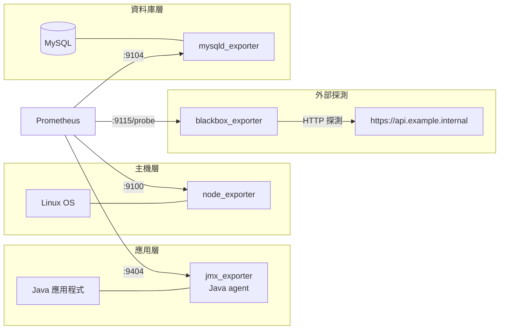
```mermaid
flowchart LR
    subgraph AppLayer["應用層"]
        App["Java 應用程式"]
        JMX["jmx_exporter<br/>Java agent"]
        App --- JMX
    end
    subgraph HostLayer["主機層"]
        OS["Linux OS"]
        NE["node_exporter"]
        OS --- NE
    end
    subgraph DBLayer["資料庫層"]
        DB[("MySQL")]
        ME["mysqld_exporter"]
        DB --- ME
    end
    subgraph Probe["外部探測"]
        BB["blackbox_exporter"]
        URL["https://api.example.internal"]
        BB -->|"HTTP 探測"| URL
    end
    P["Prometheus"] -->|":9404"| JMX
    P -->|":9100"| NE
    P -->|":9104"| ME
    P -->|":9115/probe"| BB
```

#### Pushgateway 使用原則

- **只用於服務層級的批次工作**：推送的是「這個工作最後一次執行的結果」，而不是某台主機的狀態
- **Pushgateway 不會自動刪除資料**：官方文件說明它「永遠不會忘記」推送過的序列。工作下線後，要以 API 刪除對應的 group，否則舊資料會一直存在
- Prometheus 抓取 Pushgateway 時必須設定 `honor_labels: true`，保留推送端的 `job`、`instance` 標籤
- 用「最後成功時間」判斷工作是否正常：`time() - backup_last_success_timestamp_seconds > 26 * 3600`

```bash
# 批次工作結束時推送結果（以 job 與 instance 作為 group key）
cat <<'EOF' | curl --data-binary @- http://pushgateway.example.internal:9091/metrics/job/nightly_backup/instance/db-01
# TYPE backup_last_success_timestamp_seconds gauge
backup_last_success_timestamp_seconds 1790812800
# TYPE backup_duration_seconds gauge
backup_duration_seconds 1834
EOF

# 工作下線時刪除整個 group
curl -X DELETE http://pushgateway.example.internal:9091/metrics/job/nightly_backup/instance/db-01
```

### 2.4 Grafana 架構

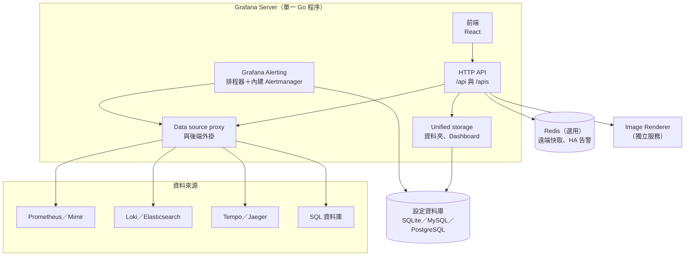
```mermaid
flowchart TB
    subgraph Grafana["Grafana Server（單一 Go 程序）"]
        FE["前端<br/>React"]
        API["HTTP API<br/>/api 與 /apis"]
        DSP["Data source proxy<br/>與後端外掛"]
        AL["Grafana Alerting<br/>排程器＋內建 Alertmanager"]
        US["Unified storage<br/>資料夾、Dashboard"]
    end
    DB[("設定資料庫<br/>SQLite／MySQL／PostgreSQL")]
    RC[("Redis（選用）<br/>遠端快取、HA 告警")]
    RR["Image Renderer<br/>（獨立服務）"]
    subgraph DS["資料來源"]
        D1["Prometheus／Mimir"]
        D2["Loki／Elasticsearch"]
        D3["Tempo／Jaeger"]
        D4["SQL 資料庫"]
    end
    FE --> API
    API --> DSP
    API --> US
    US --> DB
    AL --> DB
    API --> RC
    DSP --> D1
    DSP --> D2
    DSP --> D3
    DSP --> D4
    AL --> DSP
    API --> RR
```

#### Grafana 核心概念

| 概念 | 說明 |
| --- | --- |
| **Data source** | 資料來源連線設定；以 `uid` 識別（Grafana 13 起以數字 `id` 存取的 API 預設停用） |
| **Dashboard** | 儀表板；13 版起預設為 Dynamic dashboards（schema v2），支援 rows、tabs、auto grid |
| **Panel** | 單一視覺化元件（Time series、Stat、Table 等） |
| **Variable** | 範本變數，讓同一張 Dashboard 切換環境、服務、實例 |
| **Folder** | Dashboard 的分類與權限單位（建議的授權粒度） |
| **Team** | 使用者群組；通常由 IdP 群組同步 |
| **Organization** | 完全隔離的租戶；只有需要完全隔離時才使用 |
| **Service account** | 自動化與 API 存取用的身分，取代已棄用的 API key |
| **Alert rule／Contact point／Notification policy** | Grafana Alerting 的規則、通知管道與路由 |

> 📌 Grafana 13 將資料夾與 Dashboard 遷移到 **unified storage**，並推出 Kubernetes 風格的 `/apis` 新 API；舊的 `/api` 仍可使用但已標示 deprecated。自動化腳本與 Terraform 應逐步改用新 API（[13.4](#134-grafana-升級)）。

### 2.5 Alertmanager 架構

Alertmanager 接收 Prometheus（或其他系統）送來的告警，負責**去重、分組、抑制、靜默與路由**，再送到 Email、Teams、Slack、PagerDuty 等通知管道。

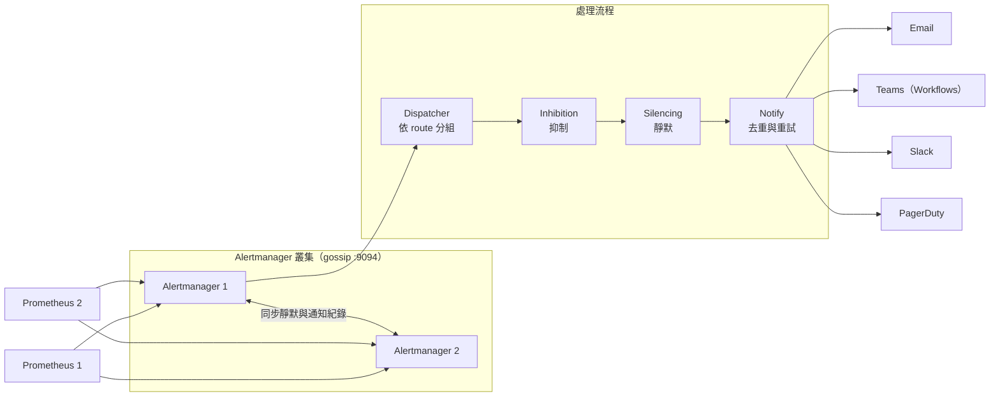
```mermaid
flowchart LR
    P1["Prometheus 1"] --> AM1
    P2["Prometheus 2"] --> AM1
    P1 --> AM2
    P2 --> AM2
    subgraph Cluster["Alertmanager 叢集（gossip :9094）"]
        AM1["Alertmanager 1"]
        AM2["Alertmanager 2"]
        AM1 <-->|"同步靜默與通知紀錄"| AM2
    end
    subgraph Pipeline["處理流程"]
        D["Dispatcher<br/>依 route 分組"] --> I["Inhibition<br/>抑制"] --> S["Silencing<br/>靜默"] --> N["Notify<br/>去重與重試"]
    end
    AM1 --> D
    N --> Mail["Email"]
    N --> Teams["Teams（Workflows）"]
    N --> Slack["Slack"]
    N --> PD["PagerDuty"]
```

| 功能 | 說明 | 設定 |
| --- | --- | --- |
| **分組（Grouping）** | 把同一類告警合併成一則通知，避免告警風暴 | `route.group_by` |
| **節流** | 首次等待、同組新增告警間隔、重複通知間隔 | `group_wait`（預設 30s）、`group_interval`（預設 5m）、`repeat_interval`（預設 4h） |
| **抑制（Inhibition）** | 上游故障時，壓制下游衍生的告警 | `inhibit_rules` |
| **靜默（Silence）** | 維護期間暫停通知 | UI 或 `amtool silence add` |
| **時間區間** | 依上班時段或維護窗口啟用／靜音路由 | `time_intervals`、`mute_time_intervals`、`active_time_intervals` |
| **叢集** | 多個實例以 gossip 同步，避免重複通知 | `--cluster.peer`（[9.2](#92-alertmanager-設定)、[11.2](#112-alertmanager-叢集)） |

> ⚠️ **Prometheus 必須把告警送到每一個 Alertmanager 實例**，不要在中間放負載平衡器。Alertmanager 叢集會自行去重。

### 2.6 部署拓撲

#### 單機架構（開發、測試或小型環境）

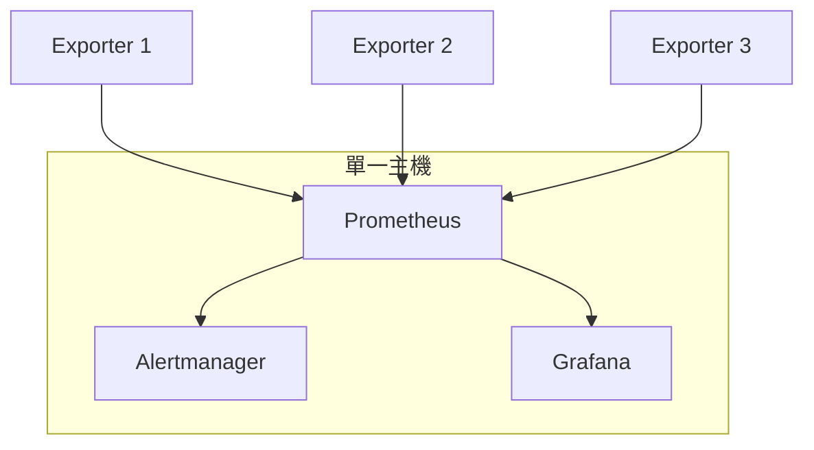
```mermaid
flowchart TB
    subgraph Host["單一主機"]
        P["Prometheus"]
        AM["Alertmanager"]
        G["Grafana"]
    end
    E1["Exporter 1"] --> P
    E2["Exporter 2"] --> P
    E3["Exporter 3"] --> P
    P --> AM
    P --> G
```

#### HA 架構（生產環境）

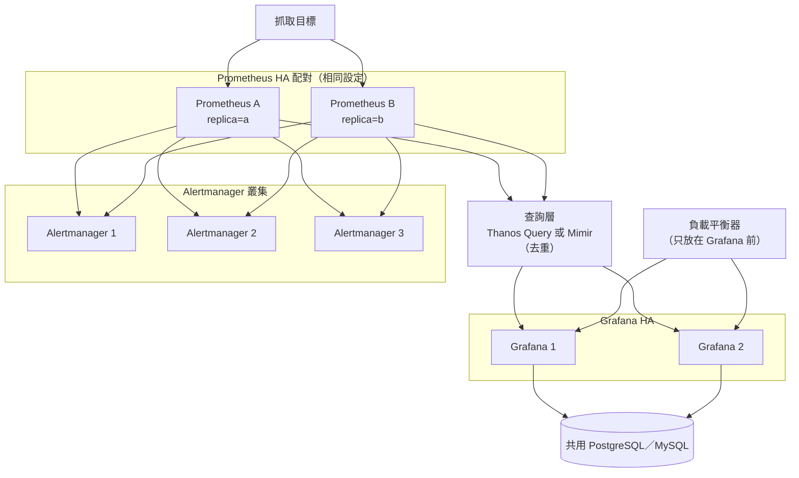
```mermaid
flowchart TB
    subgraph PromHA["Prometheus HA 配對（相同設定）"]
        P1["Prometheus A<br/>replica=a"]
        P2["Prometheus B<br/>replica=b"]
    end
    subgraph AMC["Alertmanager 叢集"]
        AM1["Alertmanager 1"]
        AM2["Alertmanager 2"]
        AM3["Alertmanager 3"]
    end
    subgraph GHA["Grafana HA"]
        G1["Grafana 1"]
        G2["Grafana 2"]
    end
    GDB[("共用 PostgreSQL／MySQL")]
    Q["查詢層<br/>Thanos Query 或 Mimir<br/>（去重）"]
    LB["負載平衡器<br/>（只放在 Grafana 前）"]
    Targets["抓取目標"] --> P1
    Targets --> P2
    P1 --> AM1
    P1 --> AM2
    P1 --> AM3
    P2 --> AM1
    P2 --> AM2
    P2 --> AM3
    P1 --> Q
    P2 --> Q
    Q --> G1
    Q --> G2
    LB --> G1
    LB --> G2
    G1 --> GDB
    G2 --> GDB
```

> ⚠️ 兩台 Prometheus 各自抓取，資料不會完全一致（抓取時間點不同）。不要在兩者前面放一般的負載平衡器輪流查詢，否則圖表會跳動；應透過具去重能力的查詢層（Thanos Query、Mimir、VictoriaMetrics），或至少讓 Grafana 固定查詢其中一台並以另一台作為備援資料來源。

#### Federation 架構（跨機房彙總）

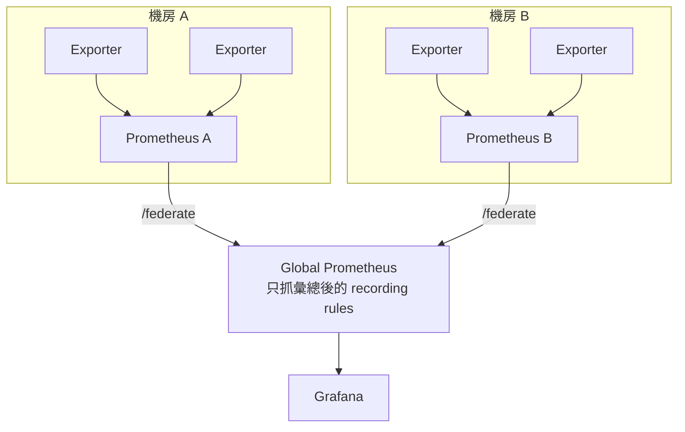
```mermaid
flowchart TB
    GP["Global Prometheus<br/>只抓彙總後的 recording rules"]
    subgraph ZoneA["機房 A"]
        PA["Prometheus A"]
        EA1["Exporter"] --> PA
        EA2["Exporter"] --> PA
    end
    subgraph ZoneB["機房 B"]
        PB["Prometheus B"]
        EB1["Exporter"] --> PB
        EB2["Exporter"] --> PB
    end
    PA -->|"/federate"| GP
    PB -->|"/federate"| GP
    GP --> Grafana["Grafana"]
```

#### Agent mode＋Remote Write（分支機構、邊緣、多叢集）

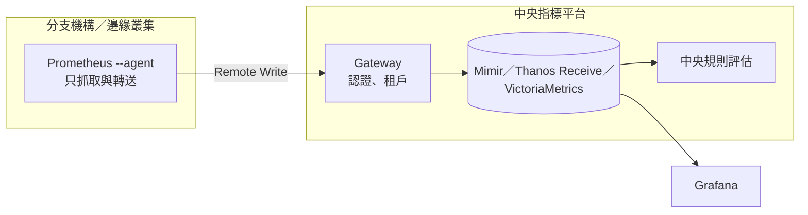
```mermaid
flowchart LR
    subgraph Edge["分支機構／邊緣叢集"]
        AG["Prometheus --agent<br/>只抓取與轉送"]
    end
    subgraph Central["中央指標平台"]
        GW["Gateway<br/>認證、租戶"]
        LTS[("Mimir／Thanos Receive／<br/>VictoriaMetrics")]
        Ruler["中央規則評估"]
    end
    AG -->|"Remote Write"| GW
    GW --> LTS
    LTS --> Ruler
    LTS --> G["Grafana"]
```

### 2.7 架構選型決策

| 架構 | 適用場景 | 優點 | 代價 | 複雜度 |
| --- | --- | --- | --- | --- |
| **單機** | 開發、測試、小型系統 | 部署最簡單 | 單點故障；無長期儲存 | 低 |
| **HA 配對** | 中型生產環境、單一機房 | 任一台故障不影響告警 | 查詢端需處理重複資料；無長期儲存 | 中 |
| **Federation** | 少量跨機房彙總指標 | 不需額外元件 | 只能傳彙總資料；上層成為瓶頸 | 中 |
| **Agent＋Remote Write** | 分支機構、邊緣、大量叢集 | 邊緣端輕量；集中查詢與告警 | 依賴中央平台與網路 | 中高 |
| **Thanos／Mimir／VictoriaMetrics** | 大規模、長期保存、全域查詢、多租戶 | 水平擴展、物件儲存、降採樣 | 元件多、需專責維運 | 高 |
| **託管服務** | 不想自建平台 | 免維運 | 費用、資料駐留與合規評估 | 低 |

#### 決策流程

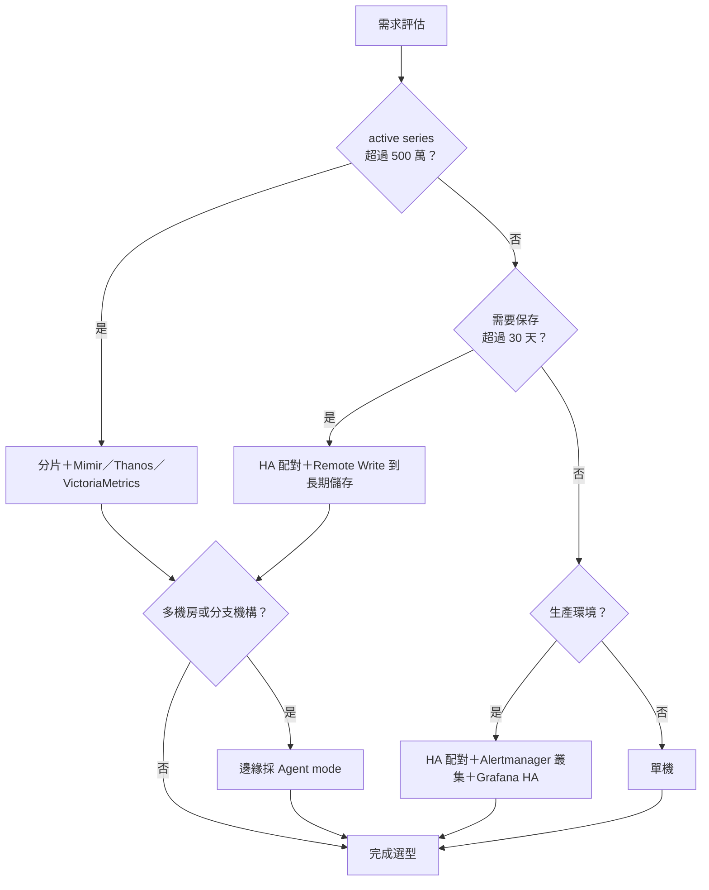
```mermaid
flowchart TD
    Start["需求評估"] --> Q1{"active series<br/>超過 500 萬？"}
    Q1 -->|"是"| LTS["分片＋Mimir／Thanos／VictoriaMetrics"]
    Q1 -->|"否"| Q2{"需要保存<br/>超過 30 天？"}
    Q2 -->|"是"| RW["HA 配對＋Remote Write 到長期儲存"]
    Q2 -->|"否"| Q3{"生產環境？"}
    Q3 -->|"是"| HA["HA 配對＋Alertmanager 叢集＋Grafana HA"]
    Q3 -->|"否"| Single["單機"]
    LTS --> Q4{"多機房或分支機構？"}
    RW --> Q4
    Q4 -->|"是"| Agent["邊緣採 Agent mode"]
    Q4 -->|"否"| Done["完成選型"]
    Agent --> Done
    HA --> Done
    Single --> Done
```

#### 實務建議

> 1. **生產環境至少要 HA**：單一 Prometheus 故障時，所有告警會同時失效
> 2. **Alertmanager 至少 3 個實例**：叢集以 gossip 運作，奇數成員較能容忍網路分割
> 3. **Grafana 使用共用的外部資料庫**：多個 Grafana 實例共用 MySQL／PostgreSQL，並設定 Alerting HA（[11.3](#113-grafana-ha)）
> 4. **告警在本地評估**：即使有中央平台，各叢集的 Prometheus 仍評估與自身相關的告警，避免中央故障時全面失明

---

## 3. 規劃與容量

### 3.1 硬體與作業系統

#### 作業系統

| 項目 | 建議 | 說明 |
| --- | --- | --- |
| **Linux 發行版** | RHEL 9／10（或相容的 Rocky、Alma）、Ubuntu 24.04 LTS、SUSE Linux Enterprise | ❌ CentOS 7／8 與 Ubuntu 18.04／20.04 皆已結束標準支援，不應再用於新建置 |
| **核心參數** | `vm.max_map_count` 視 Block 數量調高；`fs.file-max` 足夠 | Prometheus 以 mmap 存取 Block 與 head chunks |
| **檔案描述符** | systemd `LimitNOFILE=65536` 以上 | 每個抓取連線、Block 檔案都會佔用 |
| **時間同步** | chronyd 或 systemd-timesyncd，並監控 `node_timex_sync_status` | 時間偏移會造成樣本被拒（out of bounds）與告警誤判 |
| **檔案系統** | XFS 或 ext4，本機 SSD 或區塊儲存 | ❌ 不支援 NFS／EFS |
| **SELinux** | 維持 Enforcing，並為資料目錄設定正確 context | 不要為了省事而停用 |

#### 硬體規格

下表為**起始建議**，實際需求依 active series 數、抓取間隔、查詢負載而定，請以 3.2 公式估算並在上線前壓測。

| 規模 | Active series | Prometheus（每台） | Alertmanager | Grafana（每台） |
| --- | --- | --- | --- | --- |
| **小型** | < 50 萬 | 4 vCPU、16 GB、200 GB SSD | 1 vCPU、1 GB | 2 vCPU、2–4 GB；1 台；可用 SQLite（僅限非生產） |
| **中型** | 50–300 萬 | 8 vCPU、32–64 GB、500 GB–1 TB SSD | 2 vCPU、2 GB × 3 | 4–8 vCPU、8–16 GB × 2；外部 MySQL／PostgreSQL |
| **大型** | 300 萬以上 | 16+ vCPU、64–128 GB、多 TB SSD；或分片＋長期儲存 | 2 vCPU、4 GB × 3 | 8–16 vCPU、16–32 GB × 3 以上；HA 資料庫；Redis |

> 💡 Grafana 規模依 Grafana 官方「Deployment tiers」：小型 < 25 位同時使用者、< 100 條告警規則；中型 25–200 位使用者、100–1,000 條規則；大型 200 位以上、1,000 條規則以上。Image Renderer 每個 worker 約需 1 GB 記憶體，中型以上應獨立部署。

### 3.2 記憶體與磁碟容量估算

#### 磁碟估算（官方公式）

```text
needed_disk_space = retention_time_seconds × ingested_samples_per_second × bytes_per_sample
bytes_per_sample ≈ 1–2 bytes（官方文件數值，已是壓縮後的大小）

ingested_samples_per_second ≈ active_series ÷ scrape_interval_seconds
```

**範例一：小型環境（v1.0 範例的修正版）**

```text
10,000 條序列，每 15 秒抓取一次，保留 15 天，每個樣本以 2 bytes 估算

每秒樣本數   = 10,000 ÷ 15             ≈ 667
保留秒數     = 15 × 86,400             = 1,296,000
所需空間     = 667 × 1,296,000 × 2      ≈ 1.73 GB（已是壓縮後大小）
```

> 📌 v1.0 寫成「≈ 1.7 GB（壓縮後約 0.5 GB）」是錯誤的：官方的 1–2 bytes/sample 已經是 TSDB 壓縮後的平均值，不能再折算一次。

**範例二：中型環境**

```text
200 萬條 active series，每 15 秒抓取一次，保留 15 天，以 1.5 bytes 估算

每秒樣本數   = 2,000,000 ÷ 15          ≈ 133,333
所需空間     = 133,333 × 1,296,000 × 1.5 ≈ 259 GB
加上 WAL、壓縮時新舊 Block 並存、成長空間（× 1.5–2） ≈ 400–520 GB
```

> ⚠️ 背景壓縮時新舊 Block 會同時存在，磁碟用量可能短暫超過 `retention.size`。磁碟容量至少預留 30% 餘裕。

#### 記憶體估算（經驗值）

Prometheus 的記憶體主要用於 Head block（最近 2–3 小時的資料與索引），與 **active series 數**及 **churn（序列新建與消失的速度）** 成正比。官方沒有提供固定係數，實務上常見每條 active series 約數 KB，並需為查詢預留記憶體。**請在自己的環境實測**：

```promql
# 每條 active series 實際使用的記憶體（bytes）
process_resident_memory_bytes{job="prometheus"}
  / on (instance) prometheus_tsdb_head_series{job="prometheus"}

# 每小時新建立的序列數（churn）
rate(prometheus_tsdb_head_series_created_total{job="prometheus"}[1h]) * 3600
```

| 影響記憶體的因素 | 說明 | 對策 |
| --- | --- | --- |
| Active series 數 | 主要因素 | 控制基數（[12.4](#124-cardinality基數管理)、[14.2](#142-label-設計)） |
| Churn | Pod 頻繁重建、標籤值不斷變化 | 移除 `pod_template_hash` 等不穩定標籤 |
| 標籤長度 | 長字串的標籤值佔用索引空間 | 設定 `label_value_length_limit` |
| 查詢負載 | 大範圍查詢會載入大量樣本 | `--query.max-samples`、recording rules |
| WAL 重播 | 重啟時需重播 WAL | 預留記憶體，避免重啟時 OOM |

> 💡 Prometheus 3.x 預設啟用 `--auto-gomemlimit`，會把 `GOMEMLIMIT` 設為容器或系統記憶體上限的 90%（`--auto-gomemlimit.ratio=0.9`），讓 Go GC 在接近上限時更積極回收。這能減少 OOM，但不能取代容量規劃。

#### Grafana 資料庫容量

Grafana 的資料庫存放使用者、Dashboard、告警規則與告警狀態歷史，通常在數 GB 以內。若啟用告警狀態歷史寫入資料庫或大量 Dashboard 版本，需定期清理（`[dashboards] versions_to_keep`）。

### 3.3 網路與 Port 規劃

| 元件 | Port | 協定 | 來源 → 目的 | 說明 |
| --- | --- | --- | --- | --- |
| Prometheus | 9090 | TCP | Grafana、管理員、Federation 上層 → Prometheus | UI、API；建議只開放給 Grafana 與管理網段 |
| Alertmanager | 9093 | TCP | Prometheus、Grafana、管理員 → Alertmanager | API、UI |
| Alertmanager 叢集 | 9094 | **TCP＋UDP** | Alertmanager ↔ Alertmanager | gossip；兩種協定都要開 |
| Grafana | 3000 | TCP | 使用者（經反向代理）→ Grafana | 建議前方放 HTTPS 反向代理，對外 443 |
| Grafana Alerting HA | 9094 | TCP＋UDP | Grafana ↔ Grafana | 與 Alertmanager 同 port，不同主機時不衝突 |
| node_exporter | 9100 | TCP | Prometheus → 各主機 | |
| windows_exporter | 9182 | TCP | Prometheus → Windows 主機 | |
| blackbox_exporter | 9115 | TCP | Prometheus → blackbox | 探測流量由 blackbox 發出 |
| Pushgateway | 9091 | TCP | 批次工作、Prometheus → Pushgateway | |
| 應用程式 | 依服務而定 | TCP | Prometheus → 應用程式 | 例如 Spring Boot `/actuator/prometheus` |

#### 防火牆設定範例（firewalld）

```bash
# Prometheus 主機：只允許 Grafana 與管理網段存取 9090
sudo firewall-cmd --permanent --zone=internal --add-source=10.10.20.0/24
sudo firewall-cmd --permanent --zone=internal --add-port=9090/tcp

# Alertmanager 主機：API 與叢集 gossip（TCP＋UDP）
sudo firewall-cmd --permanent --zone=internal --add-port=9093/tcp
sudo firewall-cmd --permanent --zone=internal --add-port=9094/tcp
sudo firewall-cmd --permanent --zone=internal --add-port=9094/udp

# 被監控主機：只允許 Prometheus 主機抓取 node_exporter
sudo firewall-cmd --permanent --zone=internal --add-rich-rule='rule family="ipv4" source address="10.10.30.11/32" port port="9100" protocol="tcp" accept'
sudo firewall-cmd --permanent --zone=internal --add-rich-rule='rule family="ipv4" source address="10.10.30.12/32" port port="9100" protocol="tcp" accept'

# 重新載入並確認
sudo firewall-cmd --reload
sudo firewall-cmd --zone=internal --list-all
```

Ubuntu 使用 ufw 時：

```bash
sudo ufw allow from 10.10.30.11 to any port 9100 proto tcp
sudo ufw allow from 10.10.30.12 to any port 9100 proto tcp
sudo ufw status numbered
```

> ⚠️ v1.0 的範例對所有來源開放 9090、9100，等於把內部架構與主機資訊暴露給整個網段。生產環境應以「來源 IP＋目的 Port」最小化開放。

### 3.4 帳號、目錄與檔案系統規劃

#### 服務帳號

| 元件 | 系統帳號 | 說明 |
| --- | --- | --- |
| Prometheus | `prometheus` | 無登入 shell、無家目錄 |
| Alertmanager | `alertmanager` | 同上 |
| node_exporter | `node_exporter` | 同上；`systemd` collector 需要讀取 D-Bus |
| Grafana | `grafana` | 由 RPM／DEB 套件自動建立 |

#### 目錄結構（FHS）

```text
/usr/local/bin/                      # 二進位檔（prometheus、promtool、alertmanager、amtool、node_exporter）
/etc/prometheus/                     # Prometheus 設定（root:prometheus，0750）
├── prometheus.yml                   # 主設定檔
├── web-config.yml                   # TLS 與 Basic Auth（10.1）
├── rules/                           # 規則檔（*.rules.yml）
├── tests/                           # 規則單元測試（9.7）
├── file_sd/                         # file_sd 目標清單（5.2）
└── secrets/                         # 密碼與 token 檔（0640）
/var/lib/prometheus/                 # TSDB 資料（prometheus:prometheus，0750）
├── wal/                             # Write-Ahead Log
├── chunks_head/                     # Head chunks（mmap）
├── 01J.../                          # 壓縮後的 Block（ULID）
└── snapshots/                       # Admin API 快照
/etc/alertmanager/                   # Alertmanager 設定
├── alertmanager.yml
└── templates/                       # 通知範本（*.tmpl）
/var/lib/alertmanager/               # 靜默與通知紀錄（nflog）
/etc/grafana/                        # Grafana 設定（套件安裝）
├── grafana.ini
└── provisioning/
    ├── datasources/
    ├── dashboards/
    ├── alerting/                    # 告警規則、contact points、policies
    └── plugins/
/var/lib/grafana/                    # Grafana 資料（SQLite、外掛）
├── grafana.db
└── plugins/
/var/lib/grafana-dashboards/         # 以檔案 provisioning 的 Dashboard JSON（建議與 Git 同步）
/var/log/grafana/                    # Grafana 日誌
```

> 📌 v1.0 的目錄結構包含 `consoles/`、`console_libraries/` 與 Grafana `provisioning/notifiers/`。前者自 Prometheus 3.0 起已不在發行包中；後者屬於 Grafana 11 已移除的舊版告警，現在改用 `provisioning/alerting/`。

#### 磁碟配置建議

- `/var/lib/prometheus` 使用**獨立的檔案系統或 LV**，避免資料成長塞滿根目錄
- 監控檔案系統用量並設定 `storage.tsdb.retention.size` 作為最後防線（[5.8](#58-retention-與儲存設定)）
- 使用 LVM 時預留 VG 空間，以便線上擴充

```bash
# 範例：建立獨立 LV 給 Prometheus（依環境調整 VG 名稱與大小）
sudo lvcreate -L 500G -n lv_prometheus vg_data
sudo mkfs.xfs /dev/vg_data/lv_prometheus
sudo mkdir -p /var/lib/prometheus
echo '/dev/vg_data/lv_prometheus /var/lib/prometheus xfs defaults,noatime 0 0' | sudo tee -a /etc/fstab
sudo mount /var/lib/prometheus
```

---

## 4. 系統安裝

本章提供四種安裝方式：VM／實體機的二進位檔與套件安裝（4.1–4.4）、容器 Compose（[4.5](#45-dockerpodman-compose-一站式環境)）、Kubernetes（[4.6](#46-kuberneteskube-prometheus-stack)），以及無法連網的離線安裝（[4.7](#47-離線air-gapped安裝)）。所有範例均固定版本號，**不要在生產環境使用 `latest` 標籤**。

| 方式 | 適用 | 優點 | 注意事項 |
| --- | --- | --- | --- |
| 二進位檔＋systemd | VM、實體機、金融業內網 | 依賴最少、行為透明 | 需自行管理升級與設定 |
| RPM／DEB 套件（Grafana） | VM、實體機 | 官方 repo、自動建立服務 | 以 versionlock／hold 固定版本 |
| Docker／Podman Compose | PoC、單機、小型環境 | 一個指令建立完整環境 | 注意容器使用者 UID 與資料卷權限 |
| Kubernetes（kube-prometheus-stack） | K8s 叢集 | 含 Operator、預設規則與儀表板 | CRD 升級需手動處理 |

### 4.1 Prometheus 安裝（二進位檔＋systemd）

#### 步驟 1：建立帳號與目錄

```bash
sudo useradd --system --no-create-home --shell /usr/sbin/nologin prometheus

sudo install -d -o root -g prometheus -m 0750 \
  /etc/prometheus /etc/prometheus/rules /etc/prometheus/tests \
  /etc/prometheus/file_sd /etc/prometheus/secrets
sudo install -d -o prometheus -g prometheus -m 0750 /var/lib/prometheus
```

#### 步驟 2：下載、驗證並安裝

```bash
PROM_VERSION=3.15.0          # 受監理環境可改用 LTS，例如 3.13.3
ARCH=linux-amd64
BASE=https://github.com/prometheus/prometheus/releases/download/v${PROM_VERSION}

cd /tmp
curl -fLO ${BASE}/prometheus-${PROM_VERSION}.${ARCH}.tar.gz
curl -fLO ${BASE}/sha256sums.txt
sha256sum --check --ignore-missing sha256sums.txt     # 必須顯示 OK

tar xzf prometheus-${PROM_VERSION}.${ARCH}.tar.gz
cd prometheus-${PROM_VERSION}.${ARCH}
sudo install -o root -g root -m 0755 prometheus promtool /usr/local/bin/
sudo install -o root -g prometheus -m 0640 prometheus.yml /etc/prometheus/prometheus.yml

prometheus --version
promtool --version
```

> 📌 Prometheus 3.x 的發行包只包含 `prometheus`、`promtool`、`prometheus.yml`、`LICENSE`、`NOTICE`。v1.0 範例中複製 `consoles`、`console_libraries` 並設定 `--web.console.*` 的步驟已不適用（目錄不存在，`cp` 會失敗）。

#### 步驟 3：建立 systemd 服務

```bash
sudo tee /etc/systemd/system/prometheus.service > /dev/null <<'EOF'
[Unit]
Description=Prometheus Server
Documentation=https://prometheus.io/docs/
Wants=network-online.target
After=network-online.target

[Service]
Type=simple
User=prometheus
Group=prometheus
ExecStart=/usr/local/bin/prometheus \
  --config.file=/etc/prometheus/prometheus.yml \
  --storage.tsdb.path=/var/lib/prometheus \
  --web.listen-address=0.0.0.0:9090 \
  --web.external-url=https://prometheus.example.internal/ \
  --web.config.file=/etc/prometheus/web-config.yml
# 重新載入前先驗證設定；驗證失敗則不送出 SIGHUP
ExecReload=/usr/local/bin/promtool check config /etc/prometheus/prometheus.yml
ExecReload=/bin/kill -HUP $MAINPID
Restart=on-failure
RestartSec=5s
# 關閉時需要時間寫出 head 資料，避免被強制終止
TimeoutStopSec=300s
LimitNOFILE=65536

# 安全強化
NoNewPrivileges=true
ProtectSystem=strict
ProtectHome=true
PrivateTmp=true
PrivateDevices=true
ProtectKernelTunables=true
ProtectKernelModules=true
ProtectControlGroups=true
ReadWritePaths=/var/lib/prometheus

[Install]
WantedBy=multi-user.target
EOF
```

> ⚠️ v1.0 使用 `sudo cat > /etc/systemd/system/...` 寫入檔案。重新導向 `>` 是由目前的 shell（非 root）執行，會出現 `Permission denied`；請改用 `sudo tee`。

<!-- markdownlint-disable-next-line MD028 -->

> 💡 `--web.config.file` 指向的 TLS／認證設定見 [10.1](#101-tls-與-basic-authwebconfigfile)。若暫時不啟用，先建立內容為空的 `web-config.yml`，或移除該參數。

#### 步驟 4：啟動與驗證

```bash
# 尚未設定 TLS 時，先建立空的 web 設定檔
sudo install -o root -g prometheus -m 0640 /dev/null /etc/prometheus/web-config.yml

sudo promtool check config /etc/prometheus/prometheus.yml
sudo systemctl daemon-reload
sudo systemctl enable --now prometheus
sudo systemctl status prometheus --no-pager

curl -s http://localhost:9090/-/healthy     # Prometheus Server is Healthy.
curl -s http://localhost:9090/-/ready       # Prometheus Server is Ready.
```

#### 管理介面旗標的選擇

| 旗標 | 預設 | 建議 | 說明 |
| --- | --- | --- | --- |
| `--web.enable-lifecycle` | false | 通常不需要 | 開啟 `/-/reload`、`/-/quit`；systemd 環境以 `systemctl reload` 送 SIGHUP 即可 |
| `--web.enable-admin-api` | false | 只在需要快照或刪除資料時暫時開啟，並以認證保護 | 開啟 `/api/v1/admin/tsdb/*`，可刪除資料（[10.2](#102-admin-與-lifecycle-api-保護)） |
| `--web.enable-remote-write-receiver` | false | 只在作為接收端時開啟 | 允許外部寫入資料 |
| `--web.enable-otlp-receiver` | false | 只在需要接收 OTLP 時開啟 | 5.7 |
| `--config.auto-reload` | false | 可選 | 定期（預設 30s）偵測設定檔變更並自動重載 |

> ⚠️ v1.0 的 systemd 範例同時開啟 `--web.enable-lifecycle` 與 `--web.enable-admin-api` 且未設定認證。任何能連到 9090 的人都能關閉 Prometheus 或刪除資料，生產環境不可如此設定。

### 4.2 Alertmanager 安裝

以三台主機組成叢集為例（`10.10.30.21`～`23`）。

```bash
AM_VERSION=0.34.1
ARCH=linux-amd64
BASE=https://github.com/prometheus/alertmanager/releases/download/v${AM_VERSION}

sudo useradd --system --no-create-home --shell /usr/sbin/nologin alertmanager
sudo install -d -o root -g alertmanager -m 0750 /etc/alertmanager /etc/alertmanager/templates /etc/alertmanager/secrets
sudo install -d -o alertmanager -g alertmanager -m 0750 /var/lib/alertmanager

cd /tmp
curl -fLO ${BASE}/alertmanager-${AM_VERSION}.${ARCH}.tar.gz
curl -fLO ${BASE}/sha256sums.txt
sha256sum --check --ignore-missing sha256sums.txt
tar xzf alertmanager-${AM_VERSION}.${ARCH}.tar.gz
cd alertmanager-${AM_VERSION}.${ARCH}
sudo install -o root -g root -m 0755 alertmanager amtool /usr/local/bin/
sudo install -o root -g alertmanager -m 0640 alertmanager.yml /etc/alertmanager/alertmanager.yml
```

```bash
# 在 10.10.30.21 上；另外兩台調整 advertise-address 與 peer
sudo tee /etc/systemd/system/alertmanager.service > /dev/null <<'EOF'
[Unit]
Description=Prometheus Alertmanager
Wants=network-online.target
After=network-online.target

[Service]
Type=simple
User=alertmanager
Group=alertmanager
ExecStart=/usr/local/bin/alertmanager \
  --config.file=/etc/alertmanager/alertmanager.yml \
  --storage.path=/var/lib/alertmanager \
  --web.listen-address=:9093 \
  --web.external-url=https://alertmanager.example.internal/ \
  --cluster.listen-address=0.0.0.0:9094 \
  --cluster.advertise-address=10.10.30.21:9094 \
  --cluster.peer=10.10.30.22:9094 \
  --cluster.peer=10.10.30.23:9094
ExecReload=/usr/local/bin/amtool check-config /etc/alertmanager/alertmanager.yml
ExecReload=/bin/kill -HUP $MAINPID
Restart=on-failure
NoNewPrivileges=true
ProtectSystem=strict
ProtectHome=true
PrivateTmp=true
ReadWritePaths=/var/lib/alertmanager

[Install]
WantedBy=multi-user.target
EOF

sudo amtool check-config /etc/alertmanager/alertmanager.yml
sudo systemctl daemon-reload
sudo systemctl enable --now alertmanager

# 確認叢集成員（應看到 3 個 peers）
curl -s http://localhost:9093/api/v2/status | python3 -m json.tool | grep -A3 '"peers"'
amtool cluster show --alertmanager.url=http://localhost:9093
```

| 旗標 | 預設 | 說明 |
| --- | --- | --- |
| `--storage.path` | `data/` | 靜默與通知紀錄（nflog）的儲存位置 |
| `--data.retention` | 120h | 靜默與通知紀錄的保存時間 |
| `--cluster.listen-address` | `0.0.0.0:9094` | 叢集 gossip 位址；設為空字串可停用叢集 |
| `--cluster.peer` | — | 其他成員位址，可重複指定 |
| `--cluster.advertise-address` | 自動偵測 | 多網卡或容器環境必須明確指定 |
| `--web.config.file` | — | TLS 與 Basic Auth，格式同 Prometheus（[10.1](#101-tls-與-basic-authwebconfigfile)） |

### 4.3 node_exporter 與常用 Exporter

#### node_exporter

```bash
NE_VERSION=1.12.1
ARCH=linux-amd64
BASE=https://github.com/prometheus/node_exporter/releases/download/v${NE_VERSION}

sudo useradd --system --no-create-home --shell /usr/sbin/nologin node_exporter
sudo install -d -o node_exporter -g node_exporter -m 0755 /var/lib/node_exporter/textfile

cd /tmp
curl -fLO ${BASE}/node_exporter-${NE_VERSION}.${ARCH}.tar.gz
curl -fLO ${BASE}/sha256sums.txt
sha256sum --check --ignore-missing sha256sums.txt
tar xzf node_exporter-${NE_VERSION}.${ARCH}.tar.gz
sudo install -o root -g root -m 0755 node_exporter-${NE_VERSION}.${ARCH}/node_exporter /usr/local/bin/

sudo tee /etc/systemd/system/node_exporter.service > /dev/null <<'EOF'
[Unit]
Description=Prometheus Node Exporter
Wants=network-online.target
After=network-online.target

[Service]
Type=simple
User=node_exporter
Group=node_exporter
ExecStart=/usr/local/bin/node_exporter \
  --collector.systemd \
  --collector.processes \
  --collector.textfile.directory=/var/lib/node_exporter/textfile \
  --collector.filesystem.mount-points-exclude=^/(dev|proc|run/credentials/.+|sys|var/lib/docker/.+|var/lib/containers/storage/.+)($|/)
Restart=on-failure
NoNewPrivileges=true
ProtectHome=true

[Install]
WantedBy=multi-user.target
EOF

sudo systemctl daemon-reload
sudo systemctl enable --now node_exporter
curl -s http://localhost:9100/metrics | grep -E '^node_(uname_info|boot_time_seconds)'
```

| Collector | 預設 | 說明 |
| --- | --- | --- |
| `cpu`、`meminfo`、`diskstats`、`filesystem`、`netdev`、`loadavg`、`timex` 等 | 啟用 | 主機 USE 指標的基礎 |
| `systemd` | **停用** | 服務狀態（`node_systemd_unit_state`）；需讀取 D-Bus |
| `processes` | **停用** | 行程與執行緒數量 |
| `textfile` | 啟用，但需指定目錄 | 讓批次腳本寫入 `*.prom` 檔，由 node_exporter 一起暴露 |

> 💡 `textfile` collector 很適合主機層級的批次結果（例如備份腳本）。寫入時先寫暫存檔再 `mv`，避免 node_exporter 讀到寫一半的檔案。

#### windows_exporter

```powershell
# 以系統管理員身分執行；--% 讓 PowerShell 原樣傳遞後續參數
msiexec /i windows_exporter-0.31.8-amd64.msi --% ENABLED_COLLECTORS="[defaults],process,service" LISTEN_PORT=9182 ADDLOCAL=FirewallException
```

#### blackbox_exporter（外部探測）

```yaml
# /etc/blackbox_exporter/blackbox.yml
modules:
  http_2xx:
    prober: http
    timeout: 5s
    http:
      valid_status_codes: []          # 空值代表 2xx
      method: GET
      preferred_ip_protocol: ip4
      fail_if_not_ssl: true
  tcp_connect:
    prober: tcp
    timeout: 5s
  icmp:
    prober: icmp
    timeout: 5s
```

> ⚠️ `icmp` prober 需要 raw socket 權限：以 systemd 執行時加上 `AmbientCapabilities=CAP_NET_RAW`。

#### 其他常用 Exporter

| Exporter | 安裝重點 |
| --- | --- |
| **jmx_exporter** | 以 Java agent 啟動：`-javaagent:/opt/jmx/jmx_prometheus_javaagent-1.6.0.jar=9404:/opt/jmx/config.yaml`；Spring Boot 應用程式優先使用 Micrometer（`/actuator/prometheus`） |
| **mysqld_exporter** | 建立專用帳號：`GRANT PROCESS, REPLICATION CLIENT, SELECT ON *.* TO 'exporter'@'localhost';`；憑證放在 `--config.my-cnf` 指定的檔案，不要放在命令列 |
| **postgres_exporter** | 使用 `pg_monitor` 角色；連線字串以環境變數或檔案提供 |
| **redis_exporter** | 一個 exporter 可透過 `/scrape?target=` 探測多個 Redis（multi-target 模式） |
| **kafka_exporter** | 消費者延遲（lag）監控的主要來源 |

### 4.4 Grafana 安裝（RPM／DEB 套件）

Grafana 提供兩種版本，功能在未授權時完全相同：

| 套件 | 授權 | 說明 |
| --- | --- | --- |
| `grafana-enterprise` | 免費使用；匯入授權後解鎖 Enterprise 功能 | 官方推薦的預設版本；未來需要稽核日誌、資料來源權限等 🏢 功能時不必重裝 |
| `grafana` | AGPLv3 | 純開源版；部分企業的開源政策偏好此版本 |

#### RHEL／Rocky／Alma（dnf）

```bash
wget -q -O gpg.key https://rpm.grafana.com/gpg.key
sudo rpm --import gpg.key

sudo tee /etc/yum.repos.d/grafana.repo > /dev/null <<'EOF'
[grafana]
name=grafana
baseurl=https://rpm.grafana.com
repo_gpgcheck=1
enabled=1
gpgcheck=1
gpgkey=https://rpm.grafana.com/gpg.key
sslverify=1
sslcacert=/etc/pki/tls/certs/ca-bundle.crt
EOF

# 安裝指定版本並鎖定，避免 dnf update 時意外升級
sudo dnf install -y grafana-enterprise-13.2.3
sudo dnf install -y 'dnf-command(versionlock)'
sudo dnf versionlock add grafana-enterprise
```

#### Ubuntu／Debian（apt）

```bash
sudo apt-get install -y apt-transport-https wget gnupg
sudo mkdir -p /etc/apt/keyrings
sudo wget -O /etc/apt/keyrings/grafana.asc https://apt.grafana.com/gpg-full.key
sudo chmod 644 /etc/apt/keyrings/grafana.asc

echo "deb [signed-by=/etc/apt/keyrings/grafana.asc] https://apt.grafana.com stable main" \
  | sudo tee /etc/apt/sources.list.d/grafana.list
sudo apt-get update

# 安裝指定版本並鎖定
apt-cache madison grafana-enterprise | head -5
sudo apt-get install -y grafana-enterprise=13.2.3
sudo apt-mark hold grafana-enterprise
```

> 📌 v1.0 使用的 `apt-key add` 已被 Debian／Ubuntu 棄用，新版本會顯示警告或無法使用。現行做法是把金鑰放在 `/etc/apt/keyrings/`，並在 sources 中以 `signed-by` 指定。

#### 啟動與初始設定

```bash
sudo systemctl daemon-reload
sudo systemctl enable --now grafana-server
sudo systemctl status grafana-server --no-pager

curl -s http://localhost:3000/api/health
# {"database":"ok","version":"13.2.3","commit":"..."} 之類的回應
```

> 📌 Grafana 13 **移除了 `grafana-server` 與 `grafana-cli` 兩個指令**，改用單一的 `grafana server`、`grafana cli`。套件安裝的 systemd 服務名稱仍是 `grafana-server`，因此 `systemctl ... grafana-server` 不受影響；但自訂腳本、容器 entrypoint 與 CI 中直接呼叫舊指令的地方都要修改。

#### 首次登入的安全處理

| 項目 | 做法 |
| --- | --- |
| 管理員密碼 | 預設帳密 `admin`／`admin`，首次登入會要求變更；建議在首次啟動前設定 `[security] admin_password = $__file{/etc/grafana/secrets/admin_password}`（容器則用 `GF_SECURITY_ADMIN_PASSWORD__FILE`）。此設定只在建立初始管理員時生效 |
| 忘記管理員密碼 | `sudo grafana cli --homepath /usr/share/grafana --config /etc/grafana/grafana.ini admin reset-admin-password '<新密碼>'` |
| 停用自助註冊 | `[users] allow_sign_up = false`（預設即為 false，仍建議明確設定） |
| 加密金鑰 | 設定唯一的 `[security] secret_key`；**一旦設定就不要變更**，否則已加密的資料來源密碼無法解密 |
| SSO | 盡早整合 LDAP／OIDC（[6.6](#66-認證整合)），本機帳號只保留緊急管理員 |

### 4.5 Docker／Podman Compose 一站式環境

適合 PoC、教育訓練與小型單機環境。以下範例包含 Prometheus、Alertmanager、node_exporter 與 Grafana，並自動設定資料來源。

```text
monitoring/
├── compose.yaml
├── prometheus/
│   ├── prometheus.yml
│   └── rules/
│       └── node.rules.yml
├── alertmanager/
│   └── alertmanager.yml
└── grafana/
    └── provisioning/
        └── datasources/
            └── prometheus.yaml
```

```yaml
# compose.yaml
name: monitoring

services:
  prometheus:
    image: quay.io/prometheus/prometheus:v3.15.0
    command:
      - --config.file=/etc/prometheus/prometheus.yml
      - --storage.tsdb.path=/prometheus
      - --web.enable-lifecycle
    ports:
      - "9090:9090"
    volumes:
      - ./prometheus:/etc/prometheus:ro
      - prometheus-data:/prometheus
    restart: unless-stopped

  alertmanager:
    image: quay.io/prometheus/alertmanager:v0.34.1
    command:
      - --config.file=/etc/alertmanager/alertmanager.yml
      - --storage.path=/alertmanager
      - --cluster.listen-address=        # 單機：停用叢集
    ports:
      - "9093:9093"
    volumes:
      - ./alertmanager:/etc/alertmanager:ro
      - alertmanager-data:/alertmanager
    restart: unless-stopped

  node-exporter:
    image: quay.io/prometheus/node-exporter:v1.12.1
    command:
      - --path.rootfs=/host
    pid: host
    volumes:
      - /:/host:ro,rslave
    restart: unless-stopped

  grafana:
    image: grafana/grafana:13.2.3
    ports:
      - "3000:3000"
    environment:
      GF_SECURITY_ADMIN_PASSWORD__FILE: /run/secrets/grafana_admin_password
      GF_USERS_ALLOW_SIGN_UP: "false"
    secrets:
      - grafana_admin_password
    volumes:
      - ./grafana/provisioning:/etc/grafana/provisioning:ro
      - grafana-data:/var/lib/grafana
    depends_on:
      - prometheus
    restart: unless-stopped

secrets:
  grafana_admin_password:
    file: ./secrets/grafana_admin_password.txt

volumes:
  prometheus-data:
  alertmanager-data:
  grafana-data:
```

```yaml
# prometheus/prometheus.yml
global:
  scrape_interval: 15s
  evaluation_interval: 15s
  external_labels:
    env: poc

alerting:
  alertmanagers:
    - static_configs:
        - targets: ["alertmanager:9093"]

rule_files:
  - /etc/prometheus/rules/*.yml

scrape_configs:
  - job_name: prometheus
    static_configs:
      - targets: ["localhost:9090"]
  - job_name: alertmanager
    static_configs:
      - targets: ["alertmanager:9093"]
  - job_name: node
    static_configs:
      - targets: ["node-exporter:9100"]
  - job_name: grafana
    static_configs:
      - targets: ["grafana:3000"]
```

```yaml
# grafana/provisioning/datasources/prometheus.yaml
apiVersion: 1
datasources:
  - name: Prometheus
    uid: prometheus
    type: prometheus
    access: proxy
    url: http://prometheus:9090
    isDefault: true
    jsonData:
      httpMethod: POST
      prometheusType: Prometheus
      prometheusVersion: 3.15.0
      timeInterval: 15s
```

```bash
mkdir -p secrets && openssl rand -base64 24 > secrets/grafana_admin_password.txt
docker compose up -d          # Podman：podman compose up -d
docker compose ps
```

#### 容器使用者與資料卷權限

| 映像 | 執行使用者 | 綁定掛載（bind mount）時的處理 |
| --- | --- | --- |
| `prom/prometheus`、`quay.io/prometheus/prometheus` | `nobody`（UID 65534） | `chown -R 65534:65534 <資料目錄>` |
| `prom/alertmanager` | `nobody`（UID 65534） | 同上 |
| `grafana/grafana`、`grafana/grafana-enterprise` | UID 472、GID 0 | `chown -R 472:0 <資料目錄>` |

> 📌 Grafana 12.4 起 `grafana/grafana-oss` 映像不再更新，OSS 版請改用 `grafana/grafana`；Enterprise 版為 `grafana/grafana-enterprise`。映像有 Alpine（預設）、Ubuntu（`-ubuntu`）、Distroless 三種基底，各有 `-slim` 變體。

<!-- markdownlint-disable-next-line MD028 -->

> 💡 Podman rootless 環境請在掛載參數加上 `:Z`（SELinux 重新標記），並注意 rootless 容器內的 UID 會對應到主機的 subuid 範圍。

### 4.6 Kubernetes：kube-prometheus-stack

kube-prometheus-stack 以 Prometheus Operator 為核心，一次部署 Prometheus、Alertmanager、Grafana、kube-state-metrics、node-exporter，以及社群維護的規則與儀表板（kubernetes-mixin、node-mixin 等）。

#### 安裝

```bash
kubectl create namespace monitoring

# 自 91.x 起以 OCI registry 安裝；--version 固定 chart 版本
helm show values oci://ghcr.io/prometheus-community/charts/kube-prometheus-stack \
  --version 91.8.2 > values-default.yaml

helm install kps oci://ghcr.io/prometheus-community/charts/kube-prometheus-stack \
  --version 91.8.2 \
  --namespace monitoring \
  --values values-prod.yaml

kubectl -n monitoring get pods
kubectl get crd | grep monitoring.coreos.com
```

#### 生產環境 values 範例

```yaml
# values-prod.yaml
prometheus:
  prometheusSpec:
    replicas: 2                                 # HA 配對
    retention: 15d
    retentionSize: 450GB
    scrapeInterval: 30s
    evaluationInterval: 30s
    externalLabels:
      cluster: prod-tpe-01
    # 讓 Prometheus 選取所有命名空間的 ServiceMonitor／PodMonitor／PrometheusRule
    serviceMonitorSelectorNilUsesHelmValues: false
    podMonitorSelectorNilUsesHelmValues: false
    ruleSelectorNilUsesHelmValues: false
    probeSelectorNilUsesHelmValues: false
    scrapeConfigSelectorNilUsesHelmValues: false
    resources:
      requests:
        cpu: "2"
        memory: 16Gi
      limits:
        memory: 24Gi
    storageSpec:
      volumeClaimTemplate:
        spec:
          storageClassName: fast-ssd
          accessModes: ["ReadWriteOnce"]
          resources:
            requests:
              storage: 500Gi

alertmanager:
  alertmanagerSpec:
    replicas: 3
    storage:
      volumeClaimTemplate:
        spec:
          storageClassName: fast-ssd
          accessModes: ["ReadWriteOnce"]
          resources:
            requests:
              storage: 10Gi

grafana:
  admin:
    existingSecret: grafana-admin            # 事先建立，含 admin-user 與 admin-password
    userKey: admin-user
    passwordKey: admin-password
  persistence:
    enabled: true
    size: 10Gi
```

#### 以 ServiceMonitor 納管應用程式

```yaml
apiVersion: monitoring.coreos.com/v1
kind: ServiceMonitor
metadata:
  name: order-service
  namespace: order
  labels:
    team: backend
spec:
  selector:
    matchLabels:
      app.kubernetes.io/name: order-service
  endpoints:
    - port: http-metrics            # Service 中的 port 名稱
      path: /actuator/prometheus
      interval: 30s
      scrapeTimeout: 10s
  sampleLimit: 20000                # 基數保護
```

#### 以 PrometheusRule 管理規則

```yaml
apiVersion: monitoring.coreos.com/v1
kind: PrometheusRule
metadata:
  name: order-service-alerts
  namespace: order
spec:
  groups:
    - name: order-service
      rules:
        - alert: OrderServiceHighErrorRatio
          expr: |
            sum by (namespace) (rate(http_server_requests_seconds_count{job="order-service", status=~"5.."}[5m]))
              / sum by (namespace) (rate(http_server_requests_seconds_count{job="order-service"}[5m]))
              > 0.05
          for: 5m
          labels:
            severity: critical
          annotations:
            summary: "order-service 錯誤率 {{ $value | humanizePercentage }}"
            runbook_url: "https://runbook.example.internal/order-service/high-error-ratio"
```

| CRD | 用途 |
| --- | --- |
| `Prometheus`／`PrometheusAgent` | Prometheus 伺服器或 Agent 的部署規格 |
| `Alertmanager`／`AlertmanagerConfig` | Alertmanager 部署規格；命名空間層級的路由與 receiver |
| `ServiceMonitor`／`PodMonitor` | 以 Service 或 Pod 標籤選取抓取目標 |
| `Probe` | blackbox 探測目標 |
| `ScrapeConfig` | 直接描述 Prometheus 原生 scrape_config（含非 K8s 目標） |
| `PrometheusRule` | 記錄與告警規則 |
| `ThanosRuler` | Thanos 規則評估元件 |

> ⚠️ **CRD 不會隨 `helm upgrade` 更新**。chart 的 major 版本變更通常代表 CRD 有更新，升級前請閱讀 chart 的 `UPGRADE.md` 並先手動更新 CRD（[13.5](#135-alertmanagerexporter-與-kube-prometheus-stack-升級)）。`helm uninstall` 也不會刪除 CRD。

### 4.7 離線（Air-gapped）安裝

金融業與政府機關的生產網路常無法連上網際網路，請在可連網的「建置主機」下載並驗證所有檔案，再透過核准的媒介傳入內網。

| 元件 | 準備方式 |
| --- | --- |
| Prometheus、Alertmanager、Exporter | 下載 `*.linux-amd64.tar.gz` 與 `sha256sums.txt`，在建置主機驗證後一併帶入，內網再驗證一次 |
| Grafana（RPM） | `dnf download --resolve grafana-enterprise-13.2.3`，或從 Grafana 下載頁取得 RPM；匯入 GPG 公鑰 `rpm --import` 後以 `rpm -K` 驗證簽章 |
| Grafana（DEB） | `apt-get download grafana-enterprise=13.2.3` 與相依套件 |
| Grafana 外掛 | 下載外掛 zip，內網以 `grafana cli --pluginUrl <內部檔案伺服器 URL> plugins install <plugin-id>` 安裝；或解壓縮到 `plugins` 目錄 |
| 容器映像 | `docker pull` 後 `docker save`，內網 `docker load` 再推送到內部 registry（Harbor 等）；以 digest 固定版本 |
| Helm chart | `helm pull oci://ghcr.io/prometheus-community/charts/kube-prometheus-stack --version 91.8.2`，再推送到內部 OCI registry；values 中所有 `image.registry` 改為內部 registry |
| Dashboard | 從 grafana.com 下載 JSON，納入 Git 版控後以 provisioning 部署（[6.4](#64-dashboard-provisioninggit-sync-與-dashboard-as-code)） |

```bash
# 建置主機：打包 kube-prometheus-stack 需要的所有映像（以渲染後的 manifest 擷取）
helm template kps oci://ghcr.io/prometheus-community/charts/kube-prometheus-stack \
  --version 91.8.2 -f values-prod.yaml \
  | grep -E '^\s+image:' | awk '{print $2}' | tr -d '"' | sort -u > images.txt

while read -r img; do
  docker pull "$img"
done < images.txt
docker save $(cat images.txt) -o kps-images-91.8.2.tar
sha256sum kps-images-91.8.2.tar > kps-images-91.8.2.tar.sha256
```

> ⚠️ Grafana 預設會連線到 grafana.com 檢查更新、下載外掛與傳送匿名使用統計。內網環境請設定 `[analytics] reporting_enabled = false`、`check_for_updates = false`、`check_for_plugin_updates = false`，避免不斷出現連線逾時日誌。

### 4.8 安裝驗證與常見錯誤

#### 驗證清單

```bash
# Prometheus
curl -s http://localhost:9090/-/ready
curl -s http://localhost:9090/api/v1/status/buildinfo | python3 -m json.tool
curl -s 'http://localhost:9090/api/v1/query?query=up' | python3 -m json.tool | head -40

# Alertmanager（v2 API；v1 已於 0.27 移除並回傳 410）
curl -s http://localhost:9093/-/healthy
curl -s http://localhost:9093/api/v2/status | python3 -m json.tool | head -20

# node_exporter
curl -s http://localhost:9100/metrics | head -5

# Grafana
curl -s http://localhost:3000/api/health
```

在 Prometheus UI 的 **Status → Target health** 確認所有目標為 `UP`，在 **Status → Configuration** 確認載入的設定與預期相符。

#### 常見錯誤

| 症狀 | 原因 | 解決方式 |
| --- | --- | --- |
| `permission denied`（資料目錄） | 目錄擁有者錯誤；SELinux context 不符 | `chown -R prometheus:prometheus /var/lib/prometheus`；`restorecon -Rv /var/lib/prometheus` |
| `address already in use` | Port 被佔用 | `sudo ss -tlnp \| grep 9090` 找出佔用的程序 |
| `opening storage failed: lock DB directory` | 另一個 Prometheus 程序仍在使用同一目錄 | 確認沒有殘留程序（`pgrep -a prometheus`）；**不要**在程序仍執行時刪除 `lock` |
| 抓取顯示 `context deadline exceeded` | 網路不通、目標過慢 | 用 `curl -v` 從 Prometheus 主機測試；調整 `scrape_timeout`（不可大於 `scrape_interval`） |
| 抓取顯示 `received unsupported Content-Type` | 3.x 對 `Content-Type` 更嚴格 | 修正目標的回應標頭，或設定 `fallback_scrape_protocol: PrometheusText0.0.4` |
| `systemctl` 顯示服務啟動後立即結束 | 設定檔語法錯誤 | `journalctl -u prometheus -n 50`；`promtool check config` |
| Grafana 502／503 | 反向代理後端未啟動、`root_url` 設定錯誤 | `journalctl -u grafana-server -n 100`；檢查 `/var/log/grafana/grafana.log` |
| Grafana 升級後指令找不到 | 13 版移除 `grafana-server`、`grafana-cli` | 改用 `grafana server`、`grafana cli` |
| Alertmanager 叢集只有自己 | 9094 UDP 未開放；advertise 位址錯誤 | 檢查防火牆 TCP＋UDP；明確設定 `--cluster.advertise-address` |

> ⚠️ v1.0 建議「TSDB lock 時刪除 `/var/lib/prometheus/lock`」。鎖定檔的用途是防止兩個程序同時寫入同一個資料目錄造成損毀；正確做法是先確認沒有其他 Prometheus 程序。若確定是異常終止留下的殘檔，Prometheus 啟動時會自行處理，並以 `prometheus_tsdb_clean_start` 指標標示上次是否正常關閉。

---

## 5. Prometheus 設定

### 5.1 prometheus.yml 結構總覽

| 區段 | 用途 | 可熱重載 | 本手冊章節 |
| --- | --- | --- | --- |
| `global` | 預設抓取間隔、評估間隔、`external_labels`、全域抓取限制 | ✅ | [5.1](#51-prometheusyml-結構總覽)、[5.4](#54-抓取限制與保護) |
| `runtime` | `log_level`（3.15 取代 `--log.level`）、`gogc` | ✅ | [5.1](#51-prometheusyml-結構總覽) |
| `rule_files` | 規則檔路徑（可用 glob） | ✅ | [5.5](#55-規則檔與規則群組) |
| `scrape_config_files` | 從其他檔案載入 scrape_configs，方便分團隊維護 | ✅ | [5.2](#52-scrape_configs-與-service-discovery) |
| `scrape_configs` | 抓取工作與 Service Discovery | ✅ | 5.2–5.4 |
| `alerting` | Alertmanager 位址與告警 relabel | ✅ | [5.1](#51-prometheusyml-結構總覽)、[9.2](#92-alertmanager-設定) |
| `remote_write`／`remote_read` | 遠端寫入與讀取 | ✅ | [5.6](#56-remote-writeremote-read-與-agent-mode) |
| `otlp` | OTLP 接收的名稱轉換與屬性提升 | ✅ | [5.7](#57-otlp-接收) |
| `storage` | `tsdb`（保留期、亂序視窗）與 `exemplars` | ✅ | [5.8](#58-retention-與儲存設定) |
| `tracing` | Prometheus 自身的追蹤輸出 | ✅ | — |

> 💡 抓取間隔建議：一般服務 15–30 秒；大規模環境 30–60 秒。**同一個 Prometheus 內盡量使用一致的間隔**，否則 `rate()` 的時間窗難以統一（至少要涵蓋 4 個抓取間隔）。官方預設值為 1 分鐘，需明確設定。

#### prometheus.yml 生產環境範例

```yaml
# /etc/prometheus/prometheus.yml
global:
  scrape_interval: 15s
  scrape_timeout: 10s              # 不可大於 scrape_interval
  evaluation_interval: 15s
  external_labels:                 # 對外（Alertmanager、Remote Write、Federation）時附加
    cluster: prod-tpe-01
    env: prod
    replica: a                     # HA 配對的另一台設為 b
  # 全域抓取保護（各 job 可覆寫）
  sample_limit: 50000
  label_limit: 64
  label_value_length_limit: 512

runtime:
  log_level: info

alerting:
  alert_relabel_configs:
    # 送往 Alertmanager 前移除 replica 標籤，讓兩台 Prometheus 的告警能被去重
    - action: labeldrop
      regex: replica
  alertmanagers:
    - scheme: http
      timeout: 10s
      static_configs:
        - targets:
            - 10.10.30.21:9093
            - 10.10.30.22:9093
            - 10.10.30.23:9093

rule_files:
  - /etc/prometheus/rules/*.rules.yml

scrape_config_files:
  - /etc/prometheus/scrape.d/*.yml

scrape_configs:
  # Prometheus 自我監控
  - job_name: prometheus
    static_configs:
      - targets: ["localhost:9090"]

  - job_name: alertmanager
    static_configs:
      - targets:
          - 10.10.30.21:9093
          - 10.10.30.22:9093
          - 10.10.30.23:9093

  # 主機：以 file_sd 管理目標清單（由 CMDB 或 Ansible 產生）
  - job_name: node
    file_sd_configs:
      - files:
          - /etc/prometheus/file_sd/node_*.yml
        refresh_interval: 5m

  # Spring Boot 應用程式
  - job_name: order-service
    metrics_path: /actuator/prometheus
    scrape_interval: 30s
    static_configs:
      - targets:
          - app-01.example.internal:8080
          - app-02.example.internal:8080
        labels:
          application: order-service
          team: backend

storage:
  tsdb:
    retention:
      time: 15d
      size: 450GB
```

> 📌 v1.0 範例中以 `regex: '(.*):\d+'` 把 `instance` 改成不含 port 的主機名稱。這能讓圖表更好讀，但若同一台主機上有兩個 exporter（例如 node_exporter 與 jmx_exporter）屬於同一 job，就會產生重複序列。建議保留 `instance` 原值，另外以 relabel 新增 `hostname` 標籤（[5.3](#53-relabel_configs-與-metric_relabel_configs)）。

### 5.2 scrape_configs 與 Service Discovery

#### 常用 Service Discovery 機制

| 機制 | 適用 | 說明 |
| --- | --- | --- |
| `static_configs` | 固定且數量少的目標 | 變更需重載設定 |
| `file_sd_configs` | VM 環境、由 CMDB／Ansible 產生清單 | **檔案變更自動生效**，不需重載；企業內網首選 |
| `http_sd_configs` | 由內部服務 API 提供清單 | 回應格式與 file_sd 的 JSON 相同 |
| `kubernetes_sd_configs` | Kubernetes | role：`node`、`service`、`pod`、`endpoints`、`endpointslice`、`ingress` |
| `consul_sd_configs` | Consul 服務註冊 | 以 tag 篩選 |
| `dns_sd_configs` | DNS SRV／A 紀錄 | |
| 雲端 SD | AWS EC2、Azure、GCE、OpenStack 等 | 以雲端 API 列出 VM |

#### file_sd 目標檔

```yaml
# /etc/prometheus/file_sd/node_prod.yml
- targets:
    - web-01.example.internal:9100
    - web-02.example.internal:9100
  labels:
    env: prod
    role: web
    datacenter: tpe
- targets:
    - db-01.example.internal:9100
  labels:
    env: prod
    role: db
    datacenter: tpe
```

```bash
# 檢查 SD 結果（含 relabel 後的標籤），不需要重啟
promtool check service-discovery /etc/prometheus/prometheus.yml node
```

#### Kubernetes Pod 註解自動發現

```yaml
# 片段：未使用 Prometheus Operator 時，以 Pod 註解 prometheus.io/* 自動發現
scrape_configs:
  - job_name: kubernetes-pods
    kubernetes_sd_configs:
      - role: pod
    relabel_configs:
      # 只抓取 prometheus.io/scrape: "true" 的 Pod
      - source_labels: [__meta_kubernetes_pod_annotation_prometheus_io_scrape]
        action: keep
        regex: "true"
      # 自訂路徑
      - source_labels: [__meta_kubernetes_pod_annotation_prometheus_io_path]
        action: replace
        target_label: __metrics_path__
        regex: (.+)
      # 自訂 port：從 __address__ 取主機，從註解取 port
      - source_labels: [__address__, __meta_kubernetes_pod_annotation_prometheus_io_port]
        action: replace
        regex: ([^:]+)(?::\d+)?;(\d+)
        replacement: $1:$2
        target_label: __address__
      # 把 Kubernetes 中繼資料轉為標籤
      - source_labels: [__meta_kubernetes_namespace]
        target_label: namespace
      - source_labels: [__meta_kubernetes_pod_name]
        target_label: pod
      - source_labels: [__meta_kubernetes_pod_label_app_kubernetes_io_name]
        target_label: app
```

> 💡 已使用 Prometheus Operator（[4.6](#46-kuberneteskube-prometheus-stack)）時，請改用 `ServiceMonitor`／`PodMonitor`，不要再手寫 kubernetes_sd。

#### blackbox 探測（multi-target exporter 模式）

```yaml
# 片段：以 blackbox_exporter 探測外部端點
scrape_configs:
  - job_name: blackbox-http
    metrics_path: /probe
    params:
      module: [http_2xx]
    static_configs:
      - targets:
          - https://api.example.internal/health
          - https://www.example.internal
    relabel_configs:
      - source_labels: [__address__]
        target_label: __param_target         # 探測目標作為 URL 參數
      - source_labels: [__param_target]
        target_label: instance                # instance 顯示被探測的 URL
      - target_label: __address__
        replacement: blackbox.example.internal:9115   # 實際抓取 blackbox_exporter
```

#### HTTPS 與認證目標

```yaml
# 片段：抓取需要 mTLS 與 Basic Auth 的目標
scrape_configs:
  - job_name: secure-endpoint
    scheme: https
    tls_config:
      ca_file: /etc/prometheus/tls/ca.crt
      cert_file: /etc/prometheus/tls/client.crt
      key_file: /etc/prometheus/tls/client.key
      server_name: secure.example.internal
    basic_auth:
      username: prometheus
      password_file: /etc/prometheus/secrets/secure-endpoint.password
    static_configs:
      - targets: ["secure.example.internal:443"]
```

> ⚠️ 不要設定 `insecure_skip_verify: true`。內部 CA 簽發的憑證請以 `ca_file` 信任。

#### 以 scrape_config_files 分團隊維護

```yaml
# /etc/prometheus/scrape.d/payment.yml（由支付團隊的 Git repository 部署）
scrape_configs:
  - job_name: payment-api
    metrics_path: /actuator/prometheus
    static_configs:
      - targets: ["pay-01.example.internal:8080", "pay-02.example.internal:8080"]
        labels:
          team: payment
```

### 5.3 relabel_configs 與 metric_relabel_configs

| 階段 | 設定 | 作用對象 | 典型用途 |
| --- | --- | --- | --- |
| 抓取前 | `relabel_configs` | **目標**（target）的標籤，含 `__meta_*`、`__address__` | 篩選目標、改寫位址、從中繼資料產生標籤 |
| 抓取後 | `metric_relabel_configs` | 每一個**樣本**的標籤 | 丟棄指標或標籤、控制基數 |
| 送出告警前 | `alert_relabel_configs` | 告警標籤 | 移除 `replica`、統一標籤 |
| Remote Write 前 | `write_relabel_configs` | 送出的樣本 | 只轉送部分指標到長期儲存 |

#### Relabel action 一覽

| Action | 說明 |
| --- | --- |
| `replace`（預設） | 以 `regex` 比對 `source_labels` 串接值，符合時把 `replacement` 寫入 `target_label` |
| `keep`／`drop` | 保留／丟棄符合的目標或樣本 |
| `keepequal`／`dropequal` | 比較 `source_labels` 串接值與 `target_label` 的值是否相等 |
| `labelmap` | 以 `regex` 比對**標籤名稱**，複製成新名稱（常用於 `__meta_kubernetes_pod_label_(.+)`） |
| `labeldrop`／`labelkeep` | 以 `regex` 比對標籤名稱並刪除／保留 |
| `hashmod` | 依雜湊值取模，用於分片抓取 |
| `lowercase`／`uppercase` | 轉換大小寫 |

> ⚠️ `regex` 一律是**完全錨定**（等同前後加上 `^…$`）。YAML 中的 `true`、`yes` 等值請加引號（`regex: "true"`），避免被解讀為布林值。

#### 常用範例

```yaml
# 片段：relabel 常用技巧
scrape_configs:
  - job_name: node
    file_sd_configs:
      - files: [/etc/prometheus/file_sd/node_*.yml]
    relabel_configs:
      # 保留 instance 原值，另外新增不含 port 的 hostname 標籤
      - source_labels: [__address__]
        regex: "([^:]+)(?::\\d+)?"
        target_label: hostname
        replacement: "$1"
    metric_relabel_configs:
      # 丟棄不需要的高基數指標
      - source_labels: [__name__]
        regex: "node_(scrape_collector_.*|softnet_.*)"
        action: drop
      # 丟棄虛擬檔案系統的序列
      - source_labels: [__name__, fstype]
        regex: "node_filesystem_.*;(tmpfs|overlay|squashfs|nsfs)"
        action: drop

  # 以 hashmod 把目標分給 4 台 Prometheus，本台負責第 0 份
  - job_name: node-sharded
    file_sd_configs:
      - files: [/etc/prometheus/file_sd/node_*.yml]
    relabel_configs:
      - source_labels: [__address__]
        modulus: 4
        target_label: __tmp_hash
        action: hashmod
      - source_labels: [__tmp_hash]
        regex: "0"
        action: keep
```

> ⚠️ 以 `metric_relabel_configs` 搭配 `action: keep` 只保留部分 histogram bucket 時，`source_labels: [__name__, le]` 的組合會把**所有其他指標**一起丟掉（它們的串接值例如 `up;` 也不符合 regex）。精簡 bucket 請改用 `drop` 列出不要的 bucket。

### 5.4 抓取限制與保護

一個錯誤部署的應用程式可能在一次抓取中產生數十萬條新序列，讓 Prometheus 記憶體耗盡。請在 `global` 設定保守的預設值，再依 job 調整。

| 設定 | 層級 | 預設 | 作用 |
| --- | --- | --- | --- |
| `sample_limit` | global／job | 0（無限制） | 單次抓取的樣本數上限；超過則**整次抓取失敗** |
| `label_limit` | global／job | 0 | 每個樣本的標籤數上限 |
| `label_name_length_limit`／`label_value_length_limit` | global／job | 0 | 標籤名稱與值的長度上限（bytes） |
| `target_limit` | global／job | 0 | 單一 job 的目標數上限（🧪 實驗性） |
| `body_size_limit` | global／job | 0 | 未壓縮回應大小上限（🧪 實驗性），例如 `100MB` |
| `keep_dropped_targets` | global／job | 0 | 保留在記憶體中、供 UI 顯示的已丟棄目標數上限 |
| `extra_scrape_metrics` | global／job | false | 額外產生 `scrape_sample_limit`、`scrape_timeout_seconds`、`scrape_body_size_bytes`，方便監控接近上限的目標 |

```promql
# 接近 sample_limit 80% 的目標（需啟用 extra_scrape_metrics）
scrape_samples_post_metric_relabeling / (scrape_sample_limit > 0) > 0.8

# 因超過 sample_limit 而失敗的抓取
increase(prometheus_target_scrapes_exceeded_sample_limit_total[1h]) > 0
```

#### 抓取協定與原生直方圖

| 設定 | 預設 | 說明 |
| --- | --- | --- |
| `scrape_protocols` | 依 `scrape_native_histograms` 動態決定 | 與目標協商的格式順序 |
| `fallback_scrape_protocol` | — | 目標回應缺少或無法辨識 `Content-Type` 時使用的格式（3.x 新增） |
| `scrape_native_histograms` | false | 啟用原生直方圖抓取（3.8 起穩定）；啟用時會優先使用 protobuf 格式 |
| `always_scrape_classic_histograms` | false | 同時保留 classic bucket（遷移期間建議開啟） |
| `convert_classic_histograms_to_nhcb` | false | 把 classic histogram 轉成自訂 bucket 的原生直方圖（NHCB） |
| `enable_compression` | true | 以 gzip 抓取 |

```yaml
# 片段：分階段導入原生直方圖
scrape_configs:
  - job_name: order-service-nh
    scrape_native_histograms: true
    always_scrape_classic_histograms: true   # 遷移期間同時保留 classic bucket，既有 Dashboard 不受影響
    static_configs:
      - targets: ["app-01.example.internal:8080"]
```

### 5.5 規則檔與規則群組

```yaml
# /etc/prometheus/rules/node.rules.yml
groups:
  - name: node-recording
    interval: 30s                     # 預設為 global.evaluation_interval
    rules:
      - record: instance:node_cpu_utilisation:rate5m
        expr: |
          1 - avg without (cpu) (
            sum without (mode) (rate(node_cpu_seconds_total{job="node", mode=~"idle|iowait|steal"}[5m]))
          )

  - name: node-alerts
    labels:                           # 群組層級標籤，會加到群組內所有規則
      team: infra
    rules:
      - alert: NodeFilesystemAlmostFull
        expr: |
          (
            node_filesystem_avail_bytes{job="node", fstype!~"tmpfs|overlay"}
              / node_filesystem_size_bytes{job="node", fstype!~"tmpfs|overlay"}
          ) < 0.10
          and node_filesystem_readonly{job="node"} == 0
        for: 15m
        labels:
          severity: warning
        annotations:
          summary: "{{ $labels.instance }} 的 {{ $labels.mountpoint }} 剩餘空間 {{ $value | humanizePercentage }}"
          runbook_url: "https://runbook.example.internal/node/filesystem-almost-full"
```

| 群組欄位 | 說明 |
| --- | --- |
| `name` | 檔案內唯一 |
| `interval` | 評估間隔 |
| `limit` | 單一規則可產生的告警數或序列數上限；超過則該次評估失敗 |
| `query_offset` | 評估時間往前偏移，等待延遲到達的資料（Remote Write 接收端常用）；全域預設為 `global.rule_query_offset` |
| `labels` | 加到群組內所有規則的標籤；規則自身的同名標籤優先 |

> 💡 同一群組內的規則依序評估，後面的規則可以使用前面 recording rule 的結果；不同群組平行評估。

#### 規則檔管理原則

| 原則 | 說明 |
| --- | --- |
| 依領域分檔 | `node.rules.yml`、`kubernetes.rules.yml`、`<service>.rules.yml` |
| 版控與審查 | 所有規則放在 Git，合併前在 CI 執行 `promtool check rules` 與 `promtool test rules`（[9.7](#97-規則與路由測試)） |
| 採用社群 mixin | node-mixin、kubernetes-mixin、prometheus-mixin、alertmanager-mixin 提供經過實戰驗證的規則與儀表板 |
| 命名慣例 | Recording rule：`level:metric:operations`（[14.1](#141-命名規範)） |

### 5.6 Remote Write、Remote Read 與 Agent mode

```yaml
# 片段：Remote Write 到長期儲存
remote_write:
  - url: https://mimir.example.internal/api/v1/push
    name: mimir-prod
    remote_timeout: 30s
    headers:
      X-Scope-OrgID: platform               # Mimir 租戶
    basic_auth:
      username: prom-prod-a
      password_file: /etc/prometheus/secrets/mimir.password
    write_relabel_configs:
      # 不轉送除錯用的高基數指標
      - source_labels: [__name__]
        regex: "go_gc_.*|prometheus_tsdb_.*_bucket"
        action: drop
    queue_config:
      capacity: 10000                       # 每個 shard 的佇列容量
      max_shards: 50
      max_samples_per_send: 2000
      batch_send_deadline: 5s
      retry_on_http_429: true
    send_native_histograms: true
    metadata_config:
      send: true
```

| 參數 | 預設 | 調整建議 |
| --- | --- | --- |
| `max_shards` | 50 | 送出落後時增加；接收端承受不住時降低 |
| `capacity` | 10000 | 一般為 `max_samples_per_send` 的數倍 |
| `max_samples_per_send` | 2000 | 依接收端的請求大小限制調整 |
| `retry_on_http_429` | false | 接收端有速率限制時開啟 |
| `protobuf_message` | `prometheus.WriteRequest` | 接收端支援時可改用 Remote Write 2.0 的 `io.prometheus.write.v2.Request` |

> 📌 Prometheus 3.0 起，Remote Write 的 `http_config.enable_http2` 預設改為 `false`，以便多個佇列分散在多個 TCP 連線上。

#### 監控 Remote Write 健康度

```promql
# 送出延遲（秒）：最新樣本時間 − 已送出的最新樣本時間
max by (remote_name) (prometheus_remote_storage_highest_timestamp_in_seconds)
  - max by (remote_name) (prometheus_remote_storage_queue_highest_sent_timestamp_seconds)

# 送出失敗與重試
rate(prometheus_remote_storage_samples_failed_total[5m])
rate(prometheus_remote_storage_samples_retried_total[5m])

# 需要的 shard 數超過上限：送出能力不足
prometheus_remote_storage_shards_desired > prometheus_remote_storage_shards_max
```

#### Agent mode

Agent mode 只做抓取與 Remote Write，沒有本機查詢、規則評估與長期儲存，資源需求遠低於完整的 Prometheus。適合分支機構、邊緣節點與大量 Kubernetes 叢集。

```bash
/usr/local/bin/prometheus \
  --agent \
  --config.file=/etc/prometheus/prometheus-agent.yml \
  --storage.agent.path=/var/lib/prometheus-agent \
  --web.listen-address=0.0.0.0:9090
```

| 項目 | Server mode | Agent mode |
| --- | --- | --- |
| 抓取 | ✅ | ✅ |
| 本機查詢、UI 圖表 | ✅ | ❌ |
| Recording／Alerting rules | ✅ | ❌（`rule_files` 不可使用） |
| 本機長期儲存 | ✅ | ❌（只有 WAL，送出後即刪除） |
| Remote Write | ✅ | ✅（必要） |

> 📌 Prometheus 3.0 起以 `--agent` 啟用 Agent mode，舊的 `--enable-feature=agent` 已移除。

#### Remote Read

`remote_read` 讓 Prometheus 查詢時一併讀取遠端儲存的資料。由於效能與一致性考量，**一般建議由 Grafana 直接查詢長期儲存**（Mimir、Thanos Query），而不是透過 Prometheus 的 remote_read。

### 5.7 OTLP 接收

Prometheus 3.x 可以直接接收 OTLP（OpenTelemetry Protocol）指標，路徑為 `/api/v1/otlp/v1/metrics`。

```bash
# 啟用 OTLP receiver（預設關閉）
/usr/local/bin/prometheus \
  --config.file=/etc/prometheus/prometheus.yml \
  --web.enable-otlp-receiver
```

```yaml
# 片段：prometheus.yml 中的 OTLP 相關設定
otlp:
  # 把常用的 resource attributes 提升為標籤
  promote_resource_attributes:
    - service.instance.id
    - service.name
    - service.namespace
    - deployment.environment.name
    - k8s.namespace.name
    - k8s.pod.name
  # 預設 UnderscoreEscapingWithSuffixes：http.server.request.duration → http_server_request_duration_seconds
  translation_strategy: UnderscoreEscapingWithSuffixes
  keep_identifying_resource_attributes: true

storage:
  tsdb:
    # OTLP 推送可能亂序抵達，官方建議開啟亂序視窗
    out_of_order_time_window: 30m
```

| 項目 | 說明 |
| --- | --- |
| `job`／`instance` 標籤 | 由 `service.namespace`＋`service.name` 與 `service.instance.id` 產生 |
| 其他 resource attributes | 預設放在 `target_info` 指標，可用 `promote_resource_attributes` 提升，或查詢時以 join／🧪 `info()` 取得 |
| Delta temporality | 預設不接受 delta 型指標；可在 Collector 端用 `deltatocumulative` processor 轉換，或使用 🧪 `otlp-deltatocumulative` |

> ⚠️ OTLP receiver 沒有內建認證。開啟時請以 `--web.config.file` 啟用認證，或只允許 OTel Collector 所在網段存取。大規模環境建議由 OTel Collector／Alloy 匯集後再以 Remote Write 送到長期儲存。

### 5.8 Retention 與儲存設定

Prometheus 3.15 起，保留期改在**設定檔**中設定，可熱重載；命令列旗標 `--storage.tsdb.retention.time`／`.size` 已標示 deprecated，設定檔的值優先。

```yaml
# 片段：storage 區段
storage:
  tsdb:
    retention:
      time: 15d          # 預設 15d；設為 0 停用以時間為基準的保留
      size: 450GB        # 以 Block 大小為上限，任一條件先達到即刪除最舊的 Block
      # percentage: 80   # 🧪 以磁碟總容量的百分比設定，可隨磁碟擴充自動調整
    out_of_order_time_window: 0s
  exemplars:
    max_exemplars: 100000   # 需 --enable-feature=exemplar-storage
```

| 設定 | 建議 | 說明 |
| --- | --- | --- |
| `retention.time` | 15–30 天 | 本機只保留近期資料；長期資料交給長期儲存 |
| `retention.size` | 磁碟容量的 80–85% | 只計算 Block，不含 WAL 與 head chunks，因此不能設成 100% |
| `out_of_order_time_window` | 一般 0；OTLP 或 Remote Write 接收端 30m | 允許接收較舊的樣本 |
| WAL 壓縮 | 預設啟用 | 不需設定 |

> 💡 保留期調整後會在下一次 Block 重載（1 分鐘內或壓縮完成時）生效；過期 Block 的刪除可能需要最多兩小時。

#### 相關命令列參數

| 參數 | 預設 | 說明 |
| --- | --- | --- |
| `--storage.tsdb.path` | `data/` | 資料目錄 |
| `--query.timeout` | 2m | 單一查詢逾時 |
| `--query.max-concurrency` | 20 | 同時執行的查詢數 |
| `--query.max-samples` | 50000000 | 單一查詢可載入的樣本數上限 |
| `--query.lookback-delta` | 5m | 查詢時往回找最新樣本的範圍 |
| `--rules.max-concurrent-evals` | 4 | 平行評估的規則數上限 |
| `--enable-feature` | — | 啟用 🧪 功能，例如 `exemplar-storage`、`promql-experimental-functions` |

> ⚠️ v1.0 建議調整 `--storage.tsdb.min-block-duration`／`max-block-duration`。這兩個是隱藏的進階參數，除了 Thanos sidecar 等特定整合外不應變更。

### 5.9 熱重載與設定驗證

#### 驗證

```bash
# 設定檔（含引用的規則檔語法）
promtool check config /etc/prometheus/prometheus.yml

# 規則檔
promtool check rules /etc/prometheus/rules/*.rules.yml

# 規則單元測試（9.7）
promtool test rules /etc/prometheus/tests/*.test.yml

# web 設定檔（TLS／認證）
promtool check web-config /etc/prometheus/web-config.yml

# 指定 job 的 SD 與 relabel 結果
promtool check service-discovery /etc/prometheus/prometheus.yml node

# 檢查 /metrics 是否符合命名與格式規範
curl -s http://app-01.example.internal:8080/actuator/prometheus | promtool check metrics
```

#### 重載方式

| 方式 | 指令 | 說明 |
| --- | --- | --- |
| systemd | `sudo systemctl reload prometheus` | 搭配 4.1 的 `ExecReload` 先驗證再送 SIGHUP（建議） |
| SIGHUP | `kill -HUP $(pidof prometheus)` | |
| HTTP | `curl -X POST http://localhost:9090/-/reload` | 需 `--web.enable-lifecycle` |
| 自動 | `--config.auto-reload` | 定期偵測設定檔內容變更 |

```promql
# 重載是否成功（0 代表最近一次重載失敗，Prometheus 仍使用舊設定）
prometheus_config_last_reload_successful == 0
```

> ⚠️ 重載失敗時 Prometheus 會**繼續使用舊設定**而不會停止，因此錯誤很容易被忽略。請務必對 `prometheus_config_last_reload_successful` 設定告警（[12.1](#121-自我監控meta-monitoring)）。

---

## 6. Grafana 設定

### 6.1 grafana.ini 與環境變數

#### 設定檔位置與優先順序

| 來源 | 位置 | 說明 |
| --- | --- | --- |
| 預設值 | `/usr/share/grafana/conf/defaults.ini` | **不要修改**，升級時會被覆蓋 |
| 自訂設定 | `/etc/grafana/grafana.ini`（套件安裝）；`conf/custom.ini`（二進位檔） | 只寫需要覆寫的鍵 |
| 環境變數 | `GF_<SECTION>_<KEY>`，例如 `GF_SERVER_ROOT_URL` | 優先於設定檔；區段名中的 `.` 與 `-` 以 `_` 表示 |
| 變數展開 | `$__env{VAR}`、`$__file{/path}`、`$__vault{...}`（🏢） | 讓祕密不出現在設定檔中 |

#### 生產環境 grafana.ini 範例

```ini
# /etc/grafana/grafana.ini（只列出需要覆寫的設定）
[server]
protocol = http
http_addr = 127.0.0.1                 ; 只聽本機，由反向代理對外提供 HTTPS
http_port = 3000
domain = grafana.example.internal
root_url = https://grafana.example.internal/
enforce_domain = true

[database]
type = postgres
host = pg-grafana.example.internal:5432
name = grafana
user = grafana
password = $__file{/etc/grafana/secrets/db_password}
ssl_mode = verify-full
ca_cert_path = /etc/grafana/tls/pg-ca.crt
max_open_conn = 100
max_idle_conn = 25
conn_max_lifetime = 14400

[security]
admin_user = admin
admin_password = $__file{/etc/grafana/secrets/admin_password}
secret_key = $__file{/etc/grafana/secrets/secret_key}
disable_gravatar = true
cookie_secure = true
cookie_samesite = lax
strict_transport_security = true
strict_transport_security_max_age_seconds = 31536000
content_security_policy = true
allow_embedding = false

[users]
allow_sign_up = false
allow_org_create = false
auto_assign_org_role = Viewer

[auth]
disable_login_form = false            ; SSO 穩定後可改為 true，保留緊急管理員流程
login_maximum_inactive_lifetime_duration = 7d
login_maximum_lifetime_duration = 30d

[auth.anonymous]
enabled = false

[analytics]
reporting_enabled = false
check_for_updates = false
check_for_plugin_updates = false

[dashboards]
versions_to_keep = 20
min_refresh_interval = 30s

[dataproxy]
timeout = 60

[log]
mode = console file
level = info

[unified_alerting]
enabled = true
```

> 📌 v1.0 的安全設定區塊使用 `yaml` 標記且混入註解，設定 `cookie_samesite = strict`。`strict` 會讓 OAuth 登入回呼時無法帶入 cookie，造成 SSO 登入失敗；一般建議 `lax`。v1.0 的 `[auth] oauth_auto_login` 已標示 deprecated，請改用各 OAuth 提供者的 `auto_login`。

#### 重要安全設定

| 設定 | 建議值 | 說明 |
| --- | --- | --- |
| `[security] secret_key` | 隨機 32 字元以上 | 加密資料來源密碼等祕密；**設定後不可變更**，否則無法解密 |
| `[security] cookie_secure` | true | 只在 HTTPS 傳送 cookie |
| `[security] allow_embedding` | false | 需要嵌入 iframe 時才開啟，並搭配 CSP |
| `[security] disable_brute_force_login_protection` | false（預設） | 保留暴力登入保護 |
| `[server] enforce_domain` | true | 以非 `domain` 的主機名稱存取時重新導向 |
| `[auth.anonymous] enabled` | false | 不允許匿名存取 |
| `[snapshots] external_enabled` | false | 禁止把快照發佈到外部 |

### 6.2 資料庫後端與 unified storage

| 資料庫 | 支援版本 | 適用 |
| --- | --- | --- |
| SQLite 3 | 內嵌 | 開發與評估；**官方不建議用於生產** |
| MySQL | 8.0 以上 | 生產環境；HA 時資料庫本身也要 HA |
| PostgreSQL | 12 以上 | 生產環境（建議）；HA 時資料庫本身也要 HA |

> ⚠️ Grafana 以唯讀 MySQL 節點（例如故障切換中、Aurora Serverless）作為後端時可能出錯。HA 資料庫請確認 Grafana 連線的永遠是可寫入的主節點。

#### 建立 PostgreSQL 資料庫

```sql
CREATE USER grafana WITH PASSWORD '<strong-password>';
CREATE DATABASE grafana OWNER grafana ENCODING 'UTF8';
```

#### unified storage（Grafana 13）

Grafana 13 啟動時會自動把資料夾與 Dashboard 從舊資料表遷移到 unified storage，並以 `unifiedstorage_migration_log` 資料表記錄。遷移後舊的 `dashboard`、`folder`、`dashboard_version` 等資料表標示為 deprecated，未來版本將移除。

| 影響 | 說明 |
| --- | --- |
| **降版** | 降回 12.x 會讀到過時的舊資料表；**唯一的回退方式是還原升級前的資料庫備份**（[13.4](#134-grafana-升級)、[13.6](#136-回滾策略)） |
| **SQLite 遷移失敗** | 可能出現 `database is locked`；可在 `[unified_storage]` 調整 `migration_cache_size_kb` 或啟用 `migration_parquet_buffer` |
| **直接查詢資料表的腳本** | 改用 `/apis` 或 `/api` 取得 Dashboard，不要直接讀資料表 |

### 6.3 Datasource provisioning

以檔案宣告資料來源，可納入版控，並在多台 Grafana 間保持一致。

```yaml
# /etc/grafana/provisioning/datasources/prometheus.yaml
apiVersion: 1

# 先刪除再新增（例如更名時）
deleteDatasources:
  - name: Prometheus-Old
    orgId: 1

datasources:
  - name: Prometheus
    uid: prom-prod                      # 固定 uid，Dashboard 與告警以 uid 參照
    type: prometheus
    access: proxy
    url: https://thanos-query.example.internal
    isDefault: true
    editable: false
    jsonData:
      httpMethod: POST
      prometheusType: Thanos            # Prometheus／Mimir／Thanos／Cortex
      prometheusVersion: 0.42.4
      timeInterval: 15s                 # 與抓取間隔一致，$__rate_interval 依此計算
      queryTimeout: 60s
      cacheLevel: Medium
      incrementalQuerying: true
      incrementalQueryOverlapWindow: 10m
      manageAlerts: true
      tlsAuthWithCACert: true
      exemplarTraceIdDestinations:
        - name: trace_id
          datasourceUid: tempo-prod
    secureJsonData:
      tlsCACert: $__file{/etc/grafana/tls/internal-ca.crt}
      basicAuthPassword: $__file{/etc/grafana/secrets/prom_password}
    basicAuth: true
    basicAuthUser: grafana

  - name: Prometheus-DR
    uid: prom-dr
    type: prometheus
    access: proxy
    url: https://prometheus-dr.example.internal:9090
    editable: false
    jsonData:
      httpMethod: POST
      prometheusType: Prometheus
      prometheusVersion: 3.15.0
      timeInterval: 15s
```

| 欄位 | 說明 |
| --- | --- |
| `uid` | **務必固定**。Dashboard、告警規則與 API 都以 `uid` 參照（13 版起以數字 `id` 存取的 API 預設停用） |
| `access: proxy` | 由 Grafana 後端代為查詢（唯一建議的模式） |
| `prometheusType`／`prometheusVersion` | 讓 Grafana 知道可用的 API 功能 |
| `timeInterval` | 資料來源的最小時間間隔，應等於抓取間隔 |
| `incrementalQuerying` | 只查詢新增的時間範圍並快取舊結果，降低長時間範圍 Dashboard 的負載 |
| `secureJsonData` | 密碼與憑證，會以 `secret_key` 加密存入資料庫 |
| `deleteDatasources`／`prune` | 移除不再宣告的資料來源 |

> 📌 v1.0 的 Web UI 操作路徑為「Configuration → Data Sources」。Grafana 10 之後改為 **Connections → Data sources**。

### 6.4 Dashboard provisioning、Git Sync 與 Dashboard as Code

#### 三種管理方式比較

| 方式 | 說明 | 適用 |
| --- | --- | --- |
| **檔案 provisioning** | Grafana 定期讀取目錄中的 JSON | 內網、簡單、與既有部署工具整合 |
| **Git Sync**（13.0 GA） | Grafana 與 GitHub／GitLab／Bitbucket repository 雙向同步，UI 修改會產生 PR | 希望保留 UI 編輯體驗、又要 Git 審查流程 |
| **Terraform／API／gcx** | 以 IaC 管理 Dashboard、資料夾、權限、告警 | 平台團隊、多環境一致 |

#### 檔案 provisioning

```yaml
# /etc/grafana/provisioning/dashboards/platform.yaml
apiVersion: 1

providers:
  - name: infrastructure
    orgId: 1
    folder: Infrastructure
    folderUid: infra
    type: file
    disableDeletion: true
    allowUiUpdates: false               # 禁止在 UI 儲存，避免與 Git 不一致
    updateIntervalSeconds: 60
    options:
      path: /var/lib/grafana-dashboards/infrastructure

  - name: applications
    orgId: 1
    type: file
    disableDeletion: true
    allowUiUpdates: false
    updateIntervalSeconds: 60
    options:
      path: /var/lib/grafana-dashboards/applications
      foldersFromFilesStructure: true   # 以子目錄名稱建立資料夾
```

> 💡 `updateIntervalSeconds` 小於等於 10 時，Grafana 依賴檔案系統的變更通知；在容器或網路檔案系統中通知可能不會傳遞，建議設為大於 10 改用輪詢。

#### Git Sync

| 項目 | 說明 |
| --- | --- |
| 支援平台 | GitHub、GitHub Enterprise、GitLab、Bitbucket（[13.2](#132-prometheus-2x--3x-遷移)） |
| 運作方式 | Repository 中的 Dashboard JSON 與 Grafana 雙向同步；UI 修改可直接 commit 或開 PR |
| 自管限制 | 預設最多 10 個 repository |
| ⚠️ 已知問題 | 13.0.0 的遷移錯誤可能造成 Git Sync 內容遺失，已下架；請直接升級到 13.0.1 以上 |

#### Terraform

```hcl
# 以 terraform-provider-grafana 管理資料夾、權限與 Dashboard
resource "grafana_folder" "payment" {
  title = "Payment"
  uid   = "payment"
}

resource "grafana_folder_permission" "payment" {
  folder_uid = grafana_folder.payment.uid
  permissions {
    team_id    = grafana_team.payment_sre.id
    permission = "Edit"
  }
  permissions {
    role       = "Viewer"
    permission = "View"
  }
}

resource "grafana_dashboard" "payment_overview" {
  folder      = grafana_folder.payment.uid
  config_json = file("${path.module}/dashboards/payment-overview.json")
  overwrite   = true
}
```

### 6.5 組織、Team、Folder 與 RBAC

#### 權限模型

| 層級 | 機制 | 建議 |
| --- | --- | --- |
| 伺服器 | Grafana server admin | 只給平台管理員 2–3 人 |
| 組織（Organization） | 完全隔離的租戶 | 只有需要完全隔離的單位才分 Org；一般用資料夾區隔 |
| 基本角色（Basic role） | Viewer、Editor、Admin、No basic role | 預設 Viewer；Editor 只給 Dashboard 擁有者 |
| 固定角色與自訂角色 | 細粒度權限（例如只能管理告警） | 自訂角色為 🏢 功能 |
| 資料夾／Dashboard | View、Edit、Admin | **以 Team 授權資料夾**，不要直接授權個人 |
| 資料來源權限 | 限制誰能查詢某個資料來源 | 🏢 功能；機敏資料用獨立資料來源 |
| Service account | 自動化與 API 存取 | 每個用途一個 service account，token 設定到期日 |

#### 資料夾權限設計範例

| Team（由 IdP 群組同步） | Infrastructure | Applications/Payment | Applications/Order | 告警 |
| --- | --- | --- | --- | --- |
| `platform-admins` | Admin | Admin | Admin | 可編輯所有規則與通知政策 |
| `sre` | Edit | Edit | Edit | 可編輯規則 |
| `payment-dev` | View | Edit | View | 可編輯自己資料夾中的規則 |
| `order-dev` | View | View | Edit | 同上 |
| 所有登入使用者 | View | View | View | 檢視 |

#### Service account 與 Token

API key 已棄用，官方文件說明由 service account 取代；既有 API key 可在 **Administration → Users and access → Service accounts** 遷移為 service account token：

```bash
# 建立 service account（需管理員權限）
curl -s -X POST https://grafana.example.internal/api/serviceaccounts \
  -H "Authorization: Bearer ${ADMIN_TOKEN}" -H "Content-Type: application/json" \
  -d '{"name":"backup-job","role":"Viewer"}'

# 建立 token，設定 90 天到期（secondsToLive）
curl -s -X POST https://grafana.example.internal/api/serviceaccounts/<id>/tokens \
  -H "Authorization: Bearer ${ADMIN_TOKEN}" -H "Content-Type: application/json" \
  -d '{"name":"backup-job-2026q4","secondsToLive":7776000}'
```

> ⚠️ Token 只會在建立時顯示一次，請立即存入祕密管理系統（Vault 等）。定期以 `/api/serviceaccounts/search` 盤點沒有到期日或長期未使用的 token。

### 6.6 認證整合

| 方式 | 適用 | 說明 |
| --- | --- | --- |
| **OIDC／OAuth2**（`[auth.generic_oauth]`） | Keycloak、Entra ID、Okta 等 | 建議的 SSO 方式；可由 token 中的角色或群組對應 Grafana 角色 |
| **SAML** | 既有 SAML IdP | 🏢 功能 |
| **LDAP**（`[auth.ldap]`） | Active Directory | 以群組對應組織角色 |
| **Auth proxy** | 前方已有 SSO 反向代理 | 由代理在標頭帶入使用者；必須確保使用者無法繞過代理直連 Grafana |

#### Keycloak（OIDC）範例

```ini
[auth.generic_oauth]
enabled = true
name = Keycloak
allow_sign_up = true
auto_login = false
client_id = grafana
client_secret = $__file{/etc/grafana/secrets/oidc_client_secret}
scopes = openid email profile offline_access roles
email_attribute_path = email
login_attribute_path = preferred_username
name_attribute_path = name
auth_url = https://sso.example.internal/realms/corp/protocol/openid-connect/auth
token_url = https://sso.example.internal/realms/corp/protocol/openid-connect/token
api_url = https://sso.example.internal/realms/corp/protocol/openid-connect/userinfo
use_pkce = true
role_attribute_path = contains(roles[*], 'grafana-admin') && 'Admin' || contains(roles[*], 'grafana-editor') && 'Editor' || 'Viewer'
role_attribute_strict = true
groups_attribute_path = groups
signout_redirect_url = https://sso.example.internal/realms/corp/protocol/openid-connect/logout?post_logout_redirect_uri=https%3A%2F%2Fgrafana.example.internal%2Flogin
```

> 💡 `role_attribute_strict = true` 會在無法對應角色時拒絕登入，避免使用者以預設角色進入。Keycloak 的設定細節請參考《Keycloak教學手冊》。

#### Active Directory（LDAP）範例

```ini
[auth.ldap]
enabled = true
config_file = /etc/grafana/ldap.toml
allow_sign_up = true
```

```toml
# /etc/grafana/ldap.toml
[[servers]]
host = "dc01.corp.example.internal dc02.corp.example.internal"
port = 636
use_ssl = true
start_tls = false
ssl_skip_verify = false
root_ca_cert = "/etc/grafana/tls/corp-ca.crt"
bind_dn = "CN=svc-grafana,OU=Service Accounts,DC=corp,DC=example,DC=internal"
bind_password = '$__file{/etc/grafana/secrets/ldap_bind_password}'
timeout = 10
search_filter = "(sAMAccountName=%s)"
search_base_dns = ["OU=Users,DC=corp,DC=example,DC=internal"]

[servers.attributes]
name = "givenName"
surname = "sn"
username = "sAMAccountName"
member_of = "memberOf"
email = "mail"

[[servers.group_mappings]]
group_dn = "CN=GRP-Grafana-Admins,OU=Groups,DC=corp,DC=example,DC=internal"
org_role = "Admin"

[[servers.group_mappings]]
group_dn = "CN=GRP-Grafana-Editors,OU=Groups,DC=corp,DC=example,DC=internal"
org_role = "Editor"

[[servers.group_mappings]]
group_dn = "*"
org_role = "Viewer"
```

### 6.7 外掛管理

| 項目 | 說明 |
| --- | --- |
| 安裝 | `grafana cli plugins install <plugin-id> [version]`；容器以 `GF_PLUGINS_PREINSTALL` 指定 |
| 宣告式安裝 | `[plugins] preinstall = grafana-clock-panel@<version>`；`preinstall_auto_update` 控制是否自動更新 |
| 未簽章外掛 | 預設拒絕載入；只有在 `[plugins] allow_loading_unsigned_plugins` 明確列出 ID 時才允許 |
| 停用外掛 | `[plugins] disable_plugins` |
| AngularJS 外掛 | Grafana 12 起完全不支援，需改用 React 版本或替代外掛 |
| 升級前 | Grafana 13 前端改為 React 19，升級前先把所有外掛更新到最新版 |

```bash
grafana cli plugins ls
grafana cli plugins update-all
sudo systemctl restart grafana-server
```

> ⚠️ 外掛以 Grafana 程序的權限執行，可以讀取資料來源的查詢結果。只安裝簽章類型為 Grafana Labs 或 Partner、且有持續維護的外掛，並定期檢視 Grafana Advisor 的建議。

---

## 7. PromQL 與指標查詢

本章提供日常維運需要的 PromQL 語法與查詢範本。所有運算式皆以 Prometheus 3.15 語法撰寫並經 `promtool` 驗證。完整速查見 [附錄 A：PromQL 速查](#附錄-apromql-速查)；更深入的分析思維請參考《Metrics Visualization 教學手冊》的 PromQL 章節。

### 7.1 基本語法

#### 資料型別

| 型別 | 說明 | 範例 |
| --- | --- | --- |
| **Instant vector** | 每條序列在某一時間點的一個值 | `http_requests_total` |
| **Range vector** | 每條序列在一段時間內的多個值 | `http_requests_total[5m]` |
| **Scalar** | 單一數值 | `count(up)` 經 `scalar()` 轉換後 |
| **String** | 字串（極少使用） | `"text"` |

#### 選擇器與比對運算子

```promql
# Instant vector：每條序列的最新值
http_requests_total

# 以標籤過濾
http_requests_total{job="api", status="200"}

# Range vector：最近 5 分鐘的所有樣本，只能作為函式的參數
http_requests_total{job="api"}[5m]

# 比對運算子：= 完全相等、!= 不等於、=~ 正規表示式、!~ 正規表示式不符合
http_requests_total{status=~"5.."}
http_requests_total{status!~"2..|3.."}
http_requests_total{method!="OPTIONS"}

# 時間偏移：一週前同一時間
http_requests_total offset 1w

# @ 修飾子：固定在某個時間點（Unix 秒）
http_requests_total @ 1790812800
```

> ⚠️ 正規表示式一律**完全錨定**：`status=~"5"` 只符合 `"5"`，不會符合 `"500"`；要寫成 `status=~"5.."`。

#### UTF-8 名稱（Prometheus 3.x）

Prometheus 3.0 起支援含 `.` 等字元的指標與標籤名稱（例如 OTLP 指標不轉換時）。這類名稱需加引號並放進大括號：

```promql
# 傳統名稱
http_server_request_duration_seconds_count

# UTF-8 名稱：以引號包住並放入大括號
{"http.server.request.duration", "service.name"="checkout"}
```

### 7.2 函式與聚合

#### Counter 相關函式

| 函式 | 說明 | 使用時機 |
| --- | --- | --- |
| `rate(v[d])` | 時間窗內的**每秒平均增長率**，自動處理 counter 重置 | Dashboard 與告警的預設選擇 |
| `irate(v[d])` | 只看時間窗內**最後兩個樣本**的增長率 | 只適合觀察高度變動的即時圖表；**不要用於告警** |
| `increase(v[d])` | 時間窗內的總增量（= `rate × 秒數`，可能有小數） | 「過去 1 小時發生幾次」 |
| `resets(v[d])` | counter 重置次數 | 偵測頻繁重啟 |

> ⚠️ v1.0 的 CPU 使用率與告警範例使用 `irate()`。`irate` 只取最後兩個點，結果會劇烈跳動，搭配 `for` 時容易誤報或漏報；告警與趨勢圖請使用 `rate()`。

#### 聚合運算子

```promql
# 依 job 加總每秒請求數
sum by (job) (rate(http_requests_total[5m]))

# 保留除了 instance 以外的所有標籤
sum without (instance) (rate(http_requests_total[5m]))

# 前 5 名
topk(5, sum by (uri) (rate(http_server_requests_seconds_count[5m])))

# 各 job 有幾個實例 UP
count by (job) (up == 1)

# 每個 instance 的最大值、平均值
max by (instance) (node_load5)
avg by (job) (process_resident_memory_bytes)
```

> 💡 **鐵律：先 `rate()` 再 `sum()`**。`rate(sum(...))` 會在任一實例重啟時算出錯誤的負值或尖峰；PromQL 也不允許對 instant vector 的聚合結果直接取 range。

#### 時間窗函式（`*_over_time`）

```promql
# 過去 1 小時的最大記憶體用量
max_over_time(process_resident_memory_bytes{job="order-service"}[1h])

# 過去 10 分鐘目標可用率（0–1）
avg_over_time(up{job="node"}[10m])

# 過去 10 分鐘完全沒有資料時回傳 1（偵測目標或指標消失）
absent_over_time(up{job="payment-api"}[10m])
```

#### 預測與趨勢

```promql
# 以過去 6 小時趨勢預測 24 小時後的可用空間；< 0 表示將寫滿
predict_linear(node_filesystem_avail_bytes{fstype!~"tmpfs|overlay"}[6h], 24 * 3600)

# 與一週前同時段比較（> 1.5 表示比上週多 50%）
sum(rate(http_requests_total[5m])) / sum(rate(http_requests_total[5m] offset 1w))
```

#### 向量匹配

```promql
# 一對一：同標籤集合的序列相除
node_filesystem_avail_bytes / node_filesystem_size_bytes

# 忽略部分標籤
sum by (instance) (rate(node_network_receive_bytes_total[5m]))
  / on (instance) group_left () node_network_speed_bytes_total_by_instance

# 多對一：把 info 指標的版本標籤附加到錯誤率上
sum by (job, instance) (rate(http_requests_total{status=~"5.."}[5m]))
  * on (job, instance) group_left (version) app_build_info
```

> 💡 第二個範例中的 `node_network_speed_bytes_total_by_instance` 代表一個自訂 recording rule；實際使用時請先建立對應的規則。

#### 標籤處理

```promql
# 從 instance 擷取主機名稱到新標籤 host
label_replace(up, "host", "$1", "instance", "([^:]+):.*")

# 合併多個標籤
label_join(up, "target", "/", "job", "instance")
```

### 7.3 Histogram：classic 與 native

#### Classic histogram

```promql
# P99 延遲：必須保留 le，並先 rate 再 sum
histogram_quantile(0.99,
  sum by (le, application) (rate(http_server_requests_seconds_bucket[5m]))
)

# 平均延遲：_sum ÷ _count
sum by (application) (rate(http_server_requests_seconds_sum[5m]))
  / sum by (application) (rate(http_server_requests_seconds_count[5m]))

# 500ms 內完成的請求比例（SLI）。le 值以實際暴露的 bucket 為準；3.x 會正規化為浮點格式
sum(rate(http_server_requests_seconds_bucket{le="0.5"}[5m]))
  / sum(rate(http_server_requests_seconds_count[5m]))
```

> 📌 Prometheus 3.x 會把 `le` 與 `quantile` 標籤值正規化為浮點表示，例如 `le="1"` 變成 `le="1.0"`。從 2.x 升級後，規則與 Dashboard 中寫死整數 `le` 的查詢會查不到資料（[13.2](#132-prometheus-2x--3x-遷移)）。

#### Native histogram（3.8 起穩定）

原生直方圖以單一序列保存動態 bucket，解析度更高、序列數更少，查詢時**不需要 `le`**：

```promql
# P99：直接對原生直方圖計算
histogram_quantile(0.99, sum by (application) (rate(http_server_requests_seconds[5m])))

# 500ms 內完成的比例
histogram_fraction(0, 0.5, sum(rate(http_server_requests_seconds[5m])))

# 每秒請求數與平均值
histogram_count(sum(rate(http_server_requests_seconds[5m])))
histogram_avg(sum(rate(http_server_requests_seconds[5m])))
```

| 項目 | Classic | Native |
| --- | --- | --- |
| 序列數 | 每個 bucket 一條（常見 10–30 條） | 一條 |
| Bucket 邊界 | 用戶端事先固定 | 指數型動態 bucket，或自訂 bucket（NHCB） |
| 啟用方式 | 預設 | 用戶端支援＋`scrape_native_histograms: true`（[5.4](#54-抓取限制與保護)） |
| 分位數準確度 | 受 bucket 邊界限制 | 較高 |
| 生態系支援 | 全部 | Grafana 13、Mimir、Thanos 已支援；部分舊工具不支援 |

> 🧪 `histogram_quantiles()`（3.11 起，需 `promql-experimental-functions`）可一次計算多個分位數，但不屬於 LTS 支援範圍。

### 7.4 常用查詢範本

#### 主機（node_exporter）

```promql
# CPU 使用率（0–1），排除 idle、iowait、steal
1 - avg by (instance) (
  sum without (mode) (rate(node_cpu_seconds_total{mode=~"idle|iowait|steal"}[5m]))
)

# 各模式的 CPU 時間比例
sum by (instance, mode) (rate(node_cpu_seconds_total[5m]))
  / on (instance) group_left () count by (instance) (node_cpu_seconds_total{mode="idle"})

# CPU 飽和度：1 分鐘負載 ÷ CPU 數（> 1 代表有排隊）
node_load1 / on (instance) count by (instance) (node_cpu_seconds_total{mode="idle"})

# 記憶體使用率（0–1）
1 - node_memory_MemAvailable_bytes / node_memory_MemTotal_bytes

# Swap 使用量
node_memory_SwapTotal_bytes - node_memory_SwapFree_bytes

# 檔案系統使用率（0–1），排除虛擬檔案系統
1 - node_filesystem_avail_bytes{fstype!~"tmpfs|overlay|squashfs"}
  / node_filesystem_size_bytes{fstype!~"tmpfs|overlay|squashfs"}

# 磁碟讀寫吞吐量與 IOPS
rate(node_disk_read_bytes_total[5m])
rate(node_disk_written_bytes_total[5m])
rate(node_disk_reads_completed_total[5m]) + rate(node_disk_writes_completed_total[5m])

# 磁碟忙碌程度（0–1，接近 1 表示飽和）
rate(node_disk_io_time_seconds_total[5m])

# 網路收送量（bytes/s），排除迴路介面
rate(node_network_receive_bytes_total{device!="lo"}[5m])
rate(node_network_transmit_bytes_total{device!="lo"}[5m])

# 時間同步狀態（0 表示未同步）
node_timex_sync_status
```

> 📌 v1.0 的 `avg(node_cpu_seconds_total{mode="idle"}) by (instance)` 直接對 counter 取平均，結果是「開機以來的累計秒數」，沒有監控意義；計算使用率一定要先 `rate()`。

#### JVM（Spring Boot Actuator／Micrometer）

```promql
# Heap 使用率（0–1）。G1 的 Eden／Survivor 區 max 為 -1，需以 > 0 排除
sum by (application, instance) (jvm_memory_used_bytes{area="heap"})
  / sum by (application, instance) (jvm_memory_max_bytes{area="heap"} > 0)

# GC 暫停：每秒次數與每秒暫停時間
sum by (application, instance) (rate(jvm_gc_pause_seconds_count[5m]))
sum by (application, instance) (rate(jvm_gc_pause_seconds_sum[5m]))

# 執行緒數
jvm_threads_live_threads
jvm_threads_peak_threads

# 連線池（HikariCP）使用率
hikaricp_connections_active / hikaricp_connections_max
```

> 📌 v1.0 的 JVM Heap 告警以 `jvm_memory_used_bytes{area="heap"} / jvm_memory_max_bytes{area="heap"}` 逐記憶體區計算。每個記憶體區（Eden、Survivor、Old Gen）各自成一條序列，而 G1 的 Eden／Survivor 的 max 為 -1，會算出負值或錯誤比例；應先依實例加總。

#### HTTP 服務（RED）

```promql
# Rate：每秒請求數
sum by (application) (rate(http_server_requests_seconds_count[5m]))

# Errors：5xx 比例（0–1）
sum by (application) (rate(http_server_requests_seconds_count{status=~"5.."}[5m]))
  / sum by (application) (rate(http_server_requests_seconds_count[5m]))

# Duration：P95（Micrometer 需開啟 percentiles-histogram 才有 _bucket）
histogram_quantile(0.95,
  sum by (le, application) (rate(http_server_requests_seconds_bucket[5m]))
)

# 依 URI 的平均延遲前 10 名
topk(10,
  sum by (uri) (rate(http_server_requests_seconds_sum[5m]))
    / sum by (uri) (rate(http_server_requests_seconds_count[5m]))
)
```

```yaml
# application.yml：讓 Micrometer 輸出 histogram bucket（Spring Boot 3／4）
management:
  endpoints:
    web:
      exposure:
        include: health,info,prometheus
  metrics:
    distribution:
      percentiles-histogram:
        http.server.requests: true
      slo:
        http.server.requests: 100ms,300ms,500ms,1s
    tags:
      application: ${spring.application.name}
```

#### Kubernetes（cAdvisor＋kube-state-metrics）

```promql
# 容器 CPU 使用（核心數）
sum by (namespace, pod) (rate(container_cpu_usage_seconds_total{container!=""}[5m]))

# 容器記憶體 working set（OOM 與驅逐的判斷依據）
sum by (namespace, pod) (container_memory_working_set_bytes{container!=""})

# CPU throttling 比例（> 0.25 通常代表 CPU limit 太低）
sum by (namespace, pod) (rate(container_cpu_cfs_throttled_periods_total[5m]))
  / sum by (namespace, pod) (rate(container_cpu_cfs_periods_total[5m]))

# 過去 1 小時重啟次數
increase(kube_pod_container_status_restarts_total[1h]) > 0

# 未就緒的 Pod
sum by (namespace, pod) (kube_pod_status_ready{condition="false"}) > 0

# Deployment 可用副本不足
kube_deployment_status_replicas_available < kube_deployment_spec_replicas
```

#### Prometheus 自我監控

```promql
# Active series 數與每秒寫入樣本數
prometheus_tsdb_head_series
rate(prometheus_tsdb_head_samples_appended_total[5m])

# 區塊佔用空間與 WAL 大小
prometheus_tsdb_storage_blocks_bytes
prometheus_tsdb_wal_storage_size_bytes

# 抓取失敗的目標
up == 0

# 查詢 P99 延遲（以 slice 區分查詢階段）
prometheus_engine_query_duration_seconds{quantile="0.99"}

# 規則群組執行時間佔評估間隔的比例（> 0.8 表示快來不及）
prometheus_rule_group_last_duration_seconds / prometheus_rule_group_interval_seconds
```

### 7.5 Recording rules

Recording rule 把常用或昂貴的查詢預先計算並存成新序列，讓 Dashboard 與告警查詢更快、更一致。

#### 命名慣例：`level:metric:operations`

| 部分 | 意義 | 範例 |
| --- | --- | --- |
| `level` | 保留的聚合標籤 | `job`、`instance`、`namespace_pod` |
| `metric` | 原始指標名稱（去除 `_total`） | `http_requests` |
| `operations` | 套用的運算，由內而外 | `rate5m`、`ratio_rate5m` |

```yaml
# /etc/prometheus/rules/http-red.rules.yml
groups:
  - name: http-red
    interval: 30s
    rules:
      - record: application:http_server_requests:rate5m
        expr: sum by (application) (rate(http_server_requests_seconds_count[5m]))

      - record: application:http_server_requests_errors:rate5m
        expr: sum by (application) (rate(http_server_requests_seconds_count{status=~"5.."}[5m]))

      # 比例用 _per_ 與 ratio 命名
      - record: application:http_server_requests_errors_per_requests:ratio_rate5m
        expr: |
          application:http_server_requests_errors:rate5m
            / application:http_server_requests:rate5m

      - record: application_le:http_server_requests_seconds_bucket:rate5m
        expr: sum by (application, le) (rate(http_server_requests_seconds_bucket[5m]))

      - record: application:http_server_requests_seconds:p99_rate5m
        expr: histogram_quantile(0.99, application_le:http_server_requests_seconds_bucket:rate5m)

  - name: node-usage
    rules:
      - record: instance:node_cpu_utilisation:rate5m
        expr: |
          1 - avg by (instance) (
            sum without (mode) (rate(node_cpu_seconds_total{mode=~"idle|iowait|steal"}[5m]))
          )
      - record: instance:node_memory_utilisation:ratio
        expr: 1 - node_memory_MemAvailable_bytes / node_memory_MemTotal_bytes
```

> 📌 v1.0 的 `job:http_error_rate:5m` 內容其實是「乘以 100 的百分比」，名稱與內容不符；`instance:node_cpu_utilization:avg5m` 則使用 `irate`。依官方慣例，比例應以 0–1 儲存，在 Dashboard 以單位 `percentunit` 顯示，告警 annotation 以 `humanizePercentage` 格式化。

### 7.6 查詢效能與常見陷阱

| 陷阱 | 說明 | 正確做法 |
| --- | --- | --- |
| 時間窗太短 | `rate(x[30s])` 在 15 秒抓取間隔下常常只有 1–2 個點 | 時間窗至少 4 倍抓取間隔；Grafana 中使用 `$__rate_interval` |
| 先聚合再 rate | `rate(sum(x)[5m])` 語法錯誤；以子查詢硬寫則重置處理錯誤 | 先 `rate()` 再 `sum()` |
| 平均分位數 | `avg(histogram_quantile(...))` 或平均各實例的 Summary P99 | 先加總 bucket 再算分位數 |
| 寫死整數 `le` | 3.x 正規化為 `le="1.0"` | 以實際暴露的值為準 |
| `irate` 用於告警 | 只看最後兩點，告警不穩定 | 用 `rate` |
| 全量基數查詢 | `count by (__name__) ({__name__=~".+"})` 會掃描所有序列 | 使用 UI **Status → TSDB Status** 或 `/api/v1/status/tsdb` |
| 高基數 regex | `{uri=~".*order.*"}` 在大量序列上很慢 | 先以 `job`、`namespace` 等精確標籤縮小範圍 |
| 長時間範圍原始查詢 | 30 天的原始 `rate` 需要載入大量樣本 | 使用 recording rules，或長期儲存的降採樣資料 |
| 子查詢對齊 | 3.x 範圍左開右閉，`x[1m:1m]` 可能只剩一點 | 時間窗至少涵蓋兩個解析度：`x[2m:1m]` |

```bash
# 查看基數最高的指標（不需執行昂貴的 PromQL）
curl -s http://localhost:9090/api/v1/status/tsdb | python3 -m json.tool | head -60

# 以 promtool 分析查詢的序列數
promtool query analyze --server=http://localhost:9090 --type=histogram --duration=1h \
  --match='http_server_requests_seconds_bucket'
```

---

## 8. Dashboard 設計與實作

### 8.1 設計原則

#### 分層設計

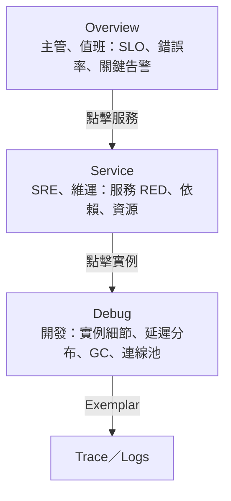
```mermaid
flowchart TB
    L1["Overview<br/>主管、值班：SLO、錯誤率、關鍵告警"]
    L2["Service<br/>SRE、維運：服務 RED、依賴、資源"]
    L3["Debug<br/>開發：實例細節、延遲分布、GC、連線池"]
    L1 -->|"點擊服務"| L2
    L2 -->|"點擊實例"| L3
    L3 -->|"Exemplar"| Trace["Trace／Logs"]
```

| 層級 | 對象 | 內容 | 建議重新整理頻率 |
| --- | --- | --- | --- |
| **Overview** | 主管、值班人員 | SLO 達成率、Error Budget、各服務紅綠燈、進行中的告警 | 1–5 分鐘 |
| **Service** | SRE、維運 | RED（Rate、Errors、Duration）、依賴服務、飽和度 | 30 秒–1 分鐘 |
| **Debug** | 開發人員 | 實例層級、延遲分布（Heatmap）、JVM、資料庫連線池 | 手動或 30 秒 |

#### 設計準則

| 準則 | 說明 |
| --- | --- |
| **一張 Dashboard 回答一個問題** | 例如「付款服務現在健康嗎？」，而不是把所有指標放在一起 |
| **由上而下說故事** | 最上方是結論（KPI），往下是原因（趨勢、細節） |
| **服務用 RED，資源用 USE** | 讓不同團隊的 Dashboard 有共同語言 |
| **單位與閾值一致** | 比例一律 0–1 並使用 `percentunit`；延遲用秒（`s`） |
| **控制 Panel 數量** | 一張 Dashboard 15–25 個 Panel 為宜；30 個 Panel 每 10 秒重新整理的查詢負載約為 30 秒重新整理的 3 倍 |
| **使用 recording rules** | Overview 與長時間範圍的 Panel 查詢 recording rule，而非原始指標 |
| **連結而非堆疊** | 以 Data links、Dashboard links 串接下一層，不要把三層塞在一張 |

#### Dashboard 結構範本

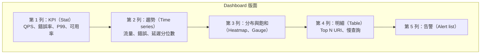
```mermaid
flowchart TB
    subgraph Layout["Dashboard 版面"]
        R1["第 1 列：KPI（Stat）<br/>QPS、錯誤率、P99、可用率"]
        R2["第 2 列：趨勢（Time series）<br/>流量、錯誤、延遲分位數"]
        R3["第 3 列：分布與飽和（Heatmap、Gauge）"]
        R4["第 4 列：明細（Table）<br/>Top N URI、慢查詢"]
        R5["第 5 列：告警（Alert list）"]
    end
    R1 --> R2 --> R3 --> R4 --> R5
```

### 8.2 Panel 類型選擇

| Panel | 適用 | 範例 | 注意事項 |
| --- | --- | --- | --- |
| **Stat** | 單一數值 KPI，可附 sparkline 趨勢 | QPS、錯誤率、可用率 | 設定 Calculation（Last、Mean）與閾值顏色 |
| **Gauge**／**Bar gauge** | 有明確上限的使用率 | CPU、記憶體、磁碟 | 上限要正確（例如 1 或 100%） |
| **Time series** | 趨勢變化 | 流量、延遲、資源使用 | 預設選擇；比例軸用 `percentunit` |
| **Bar chart** | 類別比較 | 各服務錯誤數 | 需要 Instant 查詢或 Reduce 轉換 |
| **Heatmap** | 延遲分布 | Histogram bucket | 查詢格式選 Heatmap，或直接使用原生直方圖 |
| **Table** | 明細清單 | 告警清單、Top N | 以 Transformations 合併多個查詢 |
| **State timeline**／**Status history** | 狀態變化 | 服務 UP／DOWN、斷路器狀態 | |
| **Alert list** | 目前觸發中的告警 | Overview 底部 | |
| **Logs**／**Traces** | 日誌、追蹤 | 搭配 Loki、Tempo | 用於 Debug 層 |

### 8.3 Variables 與 `$__rate_interval`

#### 常用變數

| 類型 | 範例 | 說明 |
| --- | --- | --- |
| **Query** | `label_values(up{job="node"}, instance)` | 由 Prometheus 標籤值產生選項 |
| **Custom** | `prod,uat,sit,dev` | 固定選項 |
| **Data source** | 類型 `prometheus` | 切換不同的 Prometheus／環境 |
| **Interval** | `1m,5m,1h` | 一般不需要，改用內建的 `$__rate_interval` |
| **Constant**／**Text box** | 固定值或自由輸入 | |

#### 串接變數（Chained variables）

```text
$datasource  → 資料來源（type: prometheus）
$env         → label_values(up, env)
$application → label_values(http_server_requests_seconds_count{env="$env"}, application)
$instance    → label_values(http_server_requests_seconds_count{env="$env", application="$application"}, instance)
```

#### 在查詢中使用變數

```promql
# 單選變數
sum(rate(http_server_requests_seconds_count{application="$application"}[$__rate_interval]))

# 多選或 All：Grafana 會展開為 regex，因此必須使用 =~
sum by (instance) (rate(http_server_requests_seconds_count{application=~"$application", instance=~"$instance"}[$__rate_interval]))
```

#### 內建時間變數

| 變數 | 說明 | 用途 |
| --- | --- | --- |
| `$__rate_interval` | `max($__interval + 抓取間隔, 4 × 抓取間隔)` | **`rate()`／`increase()` 的時間窗一律使用它** |
| `$__interval` | 依時間範圍與 Panel 寬度計算的步長 | `*_over_time` |
| `$__range` | 目前選取的時間範圍 | 「選取範圍內總數」：`increase(x[$__range])` |

> 💡 `$__rate_interval` 依資料來源的 `timeInterval`（Scrape interval）計算，因此 6.3 中的 `timeInterval` 必須等於實際抓取間隔。v1.0 自訂的 `$interval` 變數在縮放時間範圍時可能小於 4 倍抓取間隔，造成圖表斷線。

### 8.4 Dynamic dashboards（schema v2）

Grafana 13 的 Dynamic dashboards（schema v2）已 GA，相較於傳統的 grid layout：

| 功能 | 說明 |
| --- | --- |
| **Rows 與 Tabs** | 以列與分頁組織內容；13.1 起變數可以只放在某個 row 或 tab |
| **Auto grid** | Panel 依可用寬度自動排列，不必手動拖拉座標 |
| **Show／hide 規則** | 依變數值或查詢結果顯示或隱藏 Panel、Row（例如只有選擇 `prod` 時顯示 SLO 列） |
| **與 Git Sync 整合** | schema v2 JSON 可透過 Git Sync 版控（[6.4](#64-dashboard-provisioninggit-sync-與-dashboard-as-code)） |

> ⚠️ schema v2 的 JSON 結構與 v1 不同。以 API、Terraform 或腳本產生 Dashboard 的團隊，升級前要確認工具支援的 schema 版本；v1 JSON 仍可匯入，Grafana 會自動轉換。

### 8.5 實務範例

#### 範例一：API 延遲 Dashboard（JSON 片段）

```json
{
  "uid": "api-latency",
  "title": "API Latency",
  "tags": ["api", "red"],
  "timezone": "browser",
  "refresh": "1m",
  "schemaVersion": 41,
  "templating": {
    "list": [
      {
        "name": "datasource",
        "type": "datasource",
        "query": "prometheus"
      },
      {
        "name": "application",
        "type": "query",
        "datasource": { "type": "prometheus", "uid": "${datasource}" },
        "query": { "query": "label_values(http_server_requests_seconds_count, application)", "refId": "A" },
        "refresh": 2,
        "includeAll": false,
        "multi": false
      }
    ]
  },
  "panels": [
    {
      "id": 1,
      "title": "P99 Latency",
      "type": "stat",
      "gridPos": { "h": 6, "w": 6, "x": 0, "y": 0 },
      "datasource": { "type": "prometheus", "uid": "${datasource}" },
      "targets": [
        {
          "refId": "A",
          "expr": "histogram_quantile(0.99, sum by (le) (rate(http_server_requests_seconds_bucket{application=\"$application\"}[$__rate_interval])))",
          "legendFormat": "P99"
        }
      ],
      "fieldConfig": {
        "defaults": {
          "unit": "s",
          "thresholds": {
            "mode": "absolute",
            "steps": [
              { "color": "green", "value": null },
              { "color": "yellow", "value": 0.5 },
              { "color": "red", "value": 1 }
            ]
          }
        },
        "overrides": []
      }
    },
    {
      "id": 2,
      "title": "Latency Distribution",
      "type": "heatmap",
      "gridPos": { "h": 9, "w": 18, "x": 6, "y": 0 },
      "datasource": { "type": "prometheus", "uid": "${datasource}" },
      "targets": [
        {
          "refId": "A",
          "expr": "sum by (le) (rate(http_server_requests_seconds_bucket{application=\"$application\"}[$__rate_interval]))",
          "format": "heatmap",
          "legendFormat": "{{le}}"
        }
      ]
    }
  ]
}
```

> 📌 v1.0 的 JSON 範例以字串 `"datasource": "Prometheus"` 參照資料來源。新版 Grafana 以 `{ "type": "prometheus", "uid": "..." }` 物件參照，並建議搭配 datasource 變數，讓同一張 Dashboard 可切換環境。

#### 範例二：批次工作 Dashboard（Spring Batch）

Spring Batch 5／6 透過 Micrometer 內建 `spring.batch.job`（Timer）等指標，標籤為 `spring.batch.job.name` 與 `spring.batch.job.status`，在 Prometheus 中分別成為 `spring_batch_job_name`、`spring_batch_job_status`。

```promql
# 過去 24 小時各工作的執行次數（依結束狀態）
sum by (spring_batch_job_name, spring_batch_job_status) (
  increase(spring_batch_job_seconds_count[24h])
)

# 過去 24 小時的成功率（0–1）
sum by (spring_batch_job_name) (increase(spring_batch_job_seconds_count{spring_batch_job_status="COMPLETED"}[24h]))
  / sum by (spring_batch_job_name) (increase(spring_batch_job_seconds_count[24h]))

# 平均執行時間（秒）
sum by (spring_batch_job_name) (rate(spring_batch_job_seconds_sum[1h]))
  / sum by (spring_batch_job_name) (rate(spring_batch_job_seconds_count[1h]))

# 正在執行中的工作數（Long task timer）
sum by (spring_batch_job_name) (spring_batch_job_active_seconds_active_count)
```

> 📌 v1.0 以 `sum(batch_job_completed_total{status="success"}) / sum(batch_job_completed_total)` 計算成功率，這是「程式啟動以來的累計比例」，應用程式重啟就會歸零，也看不出最近是否失敗；應以 `increase()` 限定時間窗。v1.0 的 `batch_job_duration_seconds{quantile="0.99"}` 則是 Summary，不能跨實例聚合。

<!-- markdownlint-disable-next-line MD028 -->

> 💡 每日只跑一次的批次工作，用「最後成功時間」告警比用成功率更可靠：由工作在結束時寫入 `textfile` collector 或 Pushgateway 的 `*_last_success_timestamp_seconds`（[2.3](#23-exporterinstrumentationpushgateway-與-otlp)），再以 `time() - x > 26 * 3600` 告警。

#### 範例三：主機總覽 Dashboard

| 列 | Panel | 查詢（摘要） | 單位 |
| --- | --- | --- | --- |
| KPI | CPU 使用率 | `instance:node_cpu_utilisation:rate5m{instance="$instance"}` | percentunit |
| KPI | 記憶體使用率 | `instance:node_memory_utilisation:ratio{instance="$instance"}` | percentunit |
| KPI | 最滿的檔案系統 | `max(1 - node_filesystem_avail_bytes / node_filesystem_size_bytes)` | percentunit |
| KPI | 運行時間 | `time() - node_boot_time_seconds` | s |
| 趨勢 | CPU 各模式 | `sum by (mode) (rate(node_cpu_seconds_total[$__rate_interval]))` | short |
| 趨勢 | 網路收送 | `rate(node_network_receive_bytes_total{device!="lo"}[$__rate_interval])` | Bps |
| 飽和 | 磁碟忙碌 | `rate(node_disk_io_time_seconds_total[$__rate_interval])` | percentunit |
| 預測 | 檔案系統寫滿預測 | `predict_linear(node_filesystem_avail_bytes[6h], 24*3600)` | bytes |

### 8.6 社群範本與匯入

grafana.com 上的社群 Dashboard 是很好的起點，但品質與維護狀況差異很大。下表為 2026-10-01 以 grafana.com API 查詢的結果：

| 用途 | ID | 名稱 | 最後更新 | 建議 |
| --- | --- | --- | --- | --- |
| **主機（Linux）** | 1860 | Node Exporter Full | 2026-04 | ✅ 持續維護，首選 |
| **主機（Windows）** | 20763 | Windows Exporter Dashboard 2024 | 2024-05 | 可用；確認指標名稱與 windows_exporter 版本相符 |
| **Prometheus 自身** | 19105 | Prometheus | 2026-03 | ✅ |
| **Alertmanager** | 9578 | Alertmanager | 2019-04 | ⚠️ 老舊；建議改用 alertmanager-mixin 產生的儀表板 |
| **Kubernetes** | 15757／15760 | Kubernetes / Views / Global、Pods | 2025-02／2026-09 | ✅；使用 kube-prometheus-stack 時優先用其內建儀表板 |
| **JVM（Micrometer）** | 4701 | JVM (Micrometer) | 2024-11 | ✅ |
| **Spring Boot 3.x** | 19004 | Spring Boot 3.x Statistics | 2023-06 | 可用；取代 v1.0 的 12900（2020 年後未更新） |
| **PostgreSQL** | 9628 | PostgreSQL Database | 2024-12 | ✅ |
| **MySQL** | 14057 | MySQL Exporter Quickstart and Dashboard | 2021-03 | ⚠️ v1.0 的 7362 自 2018 年未更新；兩者都建議以 mysqld_exporter mixin 為準 |
| **Redis** | 763 | Redis Dashboard for Prometheus Redis Exporter 1.x | 2024-02 | ✅ |
| **Kafka** | 7589 | Kafka Exporter Overview | 2018-08 | ⚠️ 老舊，匯入後需逐一檢查查詢 |
| **NGINX** | 12708 | NGINX exporter | 2020-07 | nginx 官方提供；功能簡單 |
| **Blackbox** | 13659 | Blackbox Exporter (HTTP prober) | 2020-12 | 可用 |
| **cAdvisor／容器** | 19792 | cadvisor dashboard | 2024-11 | 取代 v1.0 的 893（2021 年後未更新） |

#### 匯入方式

| 方式 | 步驟 |
| --- | --- |
| UI | **Dashboards → New → Import** → 輸入 ID 或貼上 JSON → 選擇資料來源 |
| 檔案 provisioning | 下載 JSON，把 `${DS_PROMETHEUS}` 等輸入變數替換為固定的資料來源 uid，放入 provisioning 目錄（[6.4](#64-dashboard-provisioninggit-sync-與-dashboard-as-code)） |
| Git Sync | 把 JSON commit 到同步的 repository |

> ⚠️ 社群 Dashboard 匯入後請檢查：是否使用已改名的指標（例如舊版 node_exporter 的 `node_cpu`）、是否使用 `irate`、是否以整數 `le` 查詢、Panel 是否仍是已移除的 AngularJS 類型。**正式環境的 Dashboard 應納入版控並經過審查**，不要直接在 UI 上修改社群版本。

---

## 9. 告警與通知

### 9.1 Alerting rules 撰寫

#### 告警的品質標準

| 標準 | 說明 |
| --- | --- |
| **可行動** | 每則告警都代表「有人需要做某件事」；不需要處理的資訊改放 Dashboard |
| **症狀優先** | 優先對使用者可感知的症狀（錯誤率、延遲、SLO 燃燒率）告警，原因類指標（CPU 高）作為輔助 |
| **有 Runbook** | `runbook_url` 指向處理步驟 |
| **有擁有者** | `team` 標籤決定路由 |
| **避免抖動** | 以 `for` 過濾短暫尖峰；以 `keep_firing_for` 避免剛恢復又觸發 |
| **低流量保護** | 比例類告警加上最低流量條件，避免「1 個請求失敗＝100% 錯誤率」 |

#### 標籤與 annotation 規範

| 欄位 | 類型 | 必要 | 說明 |
| --- | --- | --- | --- |
| `severity` | label | ✅ | `critical`／`warning`／`info`（[9.5](#95-告警分級runbook-與-on-call)） |
| `team` | label | ✅ | 負責團隊，用於路由 |
| `summary` | annotation | ✅ | 一行摘要，會出現在通知標題 |
| `description` | annotation | ✅ | 現象、影響與目前數值 |
| `runbook_url` | annotation | ✅ | Runbook 連結 |
| `dashboard_url` | annotation | 建議 | 相關 Dashboard 連結 |

#### 主機告警

```yaml
# /etc/prometheus/rules/node-alerts.rules.yml
groups:
  - name: node-alerts
    labels:
      team: infra
    rules:
      - alert: NodeExporterDown
        expr: up{job="node"} == 0
        for: 2m
        labels:
          severity: critical
        annotations:
          summary: "{{ $labels.instance }} 的 node_exporter 無法抓取"
          description: "{{ $labels.instance }} 已超過 2 分鐘無法抓取，主機可能當機或網路中斷。"
          runbook_url: "https://runbook.example.internal/node/exporter-down"

      - alert: NodeHighCpuUtilisation
        expr: instance:node_cpu_utilisation:rate5m > 0.90
        for: 15m
        labels:
          severity: warning
        annotations:
          summary: "{{ $labels.instance }} CPU 使用率 {{ $value | humanizePercentage }}"
          description: "CPU 使用率已連續 15 分鐘高於 90%。"
          runbook_url: "https://runbook.example.internal/node/high-cpu"

      - alert: NodeMemoryAlmostExhausted
        expr: instance:node_memory_utilisation:ratio > 0.90
        for: 10m
        labels:
          severity: warning
        annotations:
          summary: "{{ $labels.instance }} 記憶體使用率 {{ $value | humanizePercentage }}"
          description: "可用記憶體低於 10% 已持續 10 分鐘。"
          runbook_url: "https://runbook.example.internal/node/memory"

      - alert: NodeFilesystemWillFillIn24Hours
        expr: |
          (
            node_filesystem_avail_bytes{fstype!~"tmpfs|overlay|squashfs"}
              / node_filesystem_size_bytes{fstype!~"tmpfs|overlay|squashfs"} < 0.40
          )
          and predict_linear(node_filesystem_avail_bytes{fstype!~"tmpfs|overlay|squashfs"}[6h], 24 * 3600) < 0
          and node_filesystem_readonly == 0
        for: 1h
        labels:
          severity: warning
        annotations:
          summary: "{{ $labels.instance }} 的 {{ $labels.mountpoint }} 預計 24 小時內寫滿"
          description: "依過去 6 小時的趨勢推算，此檔案系統將在 24 小時內寫滿。"
          runbook_url: "https://runbook.example.internal/node/filesystem-fill"

      - alert: NodeFilesystemAlmostFull
        expr: |
          node_filesystem_avail_bytes{fstype!~"tmpfs|overlay|squashfs"}
            / node_filesystem_size_bytes{fstype!~"tmpfs|overlay|squashfs"} < 0.05
          and node_filesystem_readonly == 0
        for: 5m
        labels:
          severity: critical
        annotations:
          summary: "{{ $labels.instance }} 的 {{ $labels.mountpoint }} 剩餘 {{ $value | humanizePercentage }}"
          description: "檔案系統剩餘空間低於 5%。"
          runbook_url: "https://runbook.example.internal/node/filesystem-full"

      - alert: NodeClockNotSynchronising
        expr: min_over_time(node_timex_sync_status[5m]) == 0 and node_timex_maxerror_seconds >= 16
        for: 10m
        labels:
          severity: warning
        annotations:
          summary: "{{ $labels.instance }} 時間未同步"
          description: "NTP 未同步會造成樣本被拒與告警誤判。"
          runbook_url: "https://runbook.example.internal/node/clock"
```

#### 應用程式告警

```yaml
# /etc/prometheus/rules/app-alerts.rules.yml
groups:
  - name: application-alerts
    rules:
      - alert: HighErrorRatio
        expr: |
          application:http_server_requests_errors_per_requests:ratio_rate5m > 0.05
          and application:http_server_requests:rate5m > 1
        for: 5m
        keep_firing_for: 5m
        labels:
          severity: critical
          team: backend
        annotations:
          summary: "{{ $labels.application }} 錯誤率 {{ $value | humanizePercentage }}"
          description: "5xx 比例已連續 5 分鐘高於 5%（每秒請求數大於 1）。"
          runbook_url: "https://runbook.example.internal/app/high-error-ratio"
          dashboard_url: "https://grafana.example.internal/d/api-latency?var-application={{ $labels.application }}"

      - alert: HighLatencyP99
        expr: application:http_server_requests_seconds:p99_rate5m > 1
        for: 10m
        labels:
          severity: warning
          team: backend
        annotations:
          summary: "{{ $labels.application }} P99 延遲 {{ $value | humanizeDuration }}"
          description: "P99 延遲已連續 10 分鐘超過 1 秒。"
          runbook_url: "https://runbook.example.internal/app/high-latency"

      - alert: JvmHeapUsageHigh
        expr: |
          sum by (application, instance) (jvm_memory_used_bytes{area="heap"})
            / sum by (application, instance) (jvm_memory_max_bytes{area="heap"} > 0)
            > 0.90
        for: 10m
        labels:
          severity: warning
          team: backend
        annotations:
          summary: "{{ $labels.application }}／{{ $labels.instance }} Heap 使用率 {{ $value | humanizePercentage }}"
          description: "Heap 使用率持續高於 90%，可能即將發生 OutOfMemoryError 或頻繁 Full GC。"
          runbook_url: "https://runbook.example.internal/app/jvm-heap"

      - alert: TargetMissing
        expr: absent_over_time(up{job="payment-api"}[10m])
        labels:
          severity: critical
          team: payment
        annotations:
          summary: "payment-api 已 10 分鐘沒有任何抓取目標"
          description: "Service Discovery 找不到 payment-api，或服務已被移除。"
          runbook_url: "https://runbook.example.internal/app/target-missing"
```

> 📌 v1.0 的錯誤率告警把比例乘以 100 後以 `printf "%.2f"` 顯示；本版統一以 0–1 儲存比例並以 `humanizePercentage` 格式化，與 recording rule 及 Dashboard 的 `percentunit` 一致，也避免「顯示 0.05%、實際 5%」這類錯誤。

#### 常用範本函式

| 函式 | 範例輸出 | 用途 |
| --- | --- | --- |
| `humanize` | `1.234k` | 一般數值 |
| `humanize1024` | `1.5Gi` | bytes |
| `humanizePercentage` | `5.2%` | 0–1 的比例 |
| `humanizeDuration` | `1.5s` | 秒數 |
| `printf "%.2f"` | `0.05` | 自訂格式 |
| `$labels.<name>` | — | 告警標籤 |
| `$value` | — | 觸發時運算式的值 |
| `$externalLabels.<name>` | — | `global.external_labels` |

### 9.2 Alertmanager 設定

#### alertmanager.yml 生產環境範例

```yaml
# /etc/alertmanager/alertmanager.yml
global:
  resolve_timeout: 5m
  smtp_smarthost: smtp.example.internal:587
  smtp_from: alertmanager@example.internal
  smtp_auth_username: alertmanager
  smtp_auth_password_file: /etc/alertmanager/secrets/smtp_password
  smtp_require_tls: true

templates:
  - /etc/alertmanager/templates/*.tmpl

route:
  receiver: default-email
  group_by: [alertname, cluster, team]
  group_wait: 30s
  group_interval: 5m
  repeat_interval: 4h
  routes:
    # 死人開關：Watchdog 每分鐘送到外部心跳服務
    - receiver: deadmans-switch
      matchers:
        - alertname = "Watchdog"
      group_wait: 0s
      group_interval: 1m
      repeat_interval: 1m

    # Critical：先送 PagerDuty，再繼續往下比對送 Teams
    - receiver: pagerduty-critical
      matchers:
        - severity = "critical"
      continue: true

    # 依團隊路由
    - receiver: teams-payment
      matchers:
        - team = "payment"
      routes:
        - receiver: teams-payment
          matchers:
            - severity = "warning"
          active_time_intervals:
            - business-hours

    - receiver: teams-infra
      matchers:
        - team = "infra"
      mute_time_intervals:
        - change-window

    - receiver: slack-backend
      matchers:
        - team = "backend"

inhibit_rules:
  # 同一服務已有 critical 時，抑制同名的 warning
  - name: critical-suppresses-warning
    source_matchers:
      - severity = "critical"
    target_matchers:
      - severity = "warning"
    equal: [alertname, cluster, application]

  # 主機無法抓取時，抑制該主機上的其他告警
  - name: node-down-suppresses-node-alerts
    source_matchers:
      - alertname = "NodeExporterDown"
    target_matchers:
      - team = "infra"
      - alertname != "NodeExporterDown"
    equal: [instance]

time_intervals:
  - name: business-hours
    time_intervals:
      - weekdays: ["monday:friday"]
        times:
          - start_time: "09:00"
            end_time: "18:00"
        location: Asia/Taipei
  - name: change-window
    time_intervals:
      - weekdays: ["saturday"]
        times:
          - start_time: "01:00"
            end_time: "05:00"
        location: Asia/Taipei

receivers:
  - name: default-email
    email_configs:
      - to: ops-team@example.internal
        send_resolved: true

  - name: deadmans-switch
    webhook_configs:
      - url_file: /etc/alertmanager/secrets/heartbeat_url
        send_resolved: false

  - name: pagerduty-critical
    pagerduty_configs:
      - routing_key_file: /etc/alertmanager/secrets/pagerduty_routing_key
        severity: critical

  - name: teams-payment
    msteamsv2_configs:
      - webhook_url_file: /etc/alertmanager/secrets/teams_payment_webhook
        title: '{{ template "custom.title" . }}'
        text: '{{ template "custom.text" . }}'

  - name: teams-infra
    msteamsv2_configs:
      - webhook_url_file: /etc/alertmanager/secrets/teams_infra_webhook

  - name: slack-backend
    slack_configs:
      - api_url_file: /etc/alertmanager/secrets/slack_backend_webhook
        channel: "#alerts-backend"
        send_resolved: true
        title: '{{ template "custom.title" . }}'
        text: '{{ template "custom.text" . }}'
```

#### 路由設計要點

| 項目 | 說明 |
| --- | --- |
| `matchers` | 取代已棄用的 `match`、`match_re`；語法 `label = "value"`、`label =~ "regex"`、`label != "value"` |
| `continue: true` | 比對成功後繼續比對後面的兄弟路由；預設在第一個符合處停止 |
| `group_by` | 決定哪些告警合併成一則通知；`[...]` 代表完全不分組（不建議） |
| `active_time_intervals`／`mute_time_intervals` | 只在指定時段發送／在指定時段靜音 |
| `inhibit_rules` | 以 `source_matchers`、`target_matchers` 取代已棄用的 `source_match`、`target_match`；`equal` 列出必須相同的標籤 |

> 📌 v1.0 使用 `match`、`source_match`、`target_match`，自 Alertmanager 0.22 起已標示 DEPRECATED。PagerDuty 的 `service_key` 屬於舊版整合類型，新整合請使用 Events API v2 的 `routing_key`。

<!-- markdownlint-disable-next-line MD028 -->

> ⚠️ 祕密（SMTP 密碼、Webhook URL、Routing key）一律以 `*_file` 從檔案讀取，檔案權限設為 `0640`、群組為 `alertmanager`，不要寫在 `alertmanager.yml` 中並提交到 Git。

#### 自訂通知範本

```text
{{/* /etc/alertmanager/templates/custom.tmpl */}}
{{ define "custom.title" -}}
[{{ .Status | toUpper }}{{ if eq .Status "firing" }}:{{ .Alerts.Firing | len }}{{ end }}] {{ .CommonLabels.alertname }} ({{ .CommonLabels.cluster }})
{{- end }}

{{ define "custom.text" -}}
{{ range .Alerts -}}
**{{ .Labels.severity | toUpper }}** {{ .Annotations.summary }}
{{ if .Annotations.description }}{{ .Annotations.description }}{{ end }}
{{ if .Annotations.runbook_url }}Runbook：{{ .Annotations.runbook_url }}{{ end }}
開始時間：{{ .StartsAt.Local.Format "2006-01-02 15:04:05" }}
{{ end -}}
{{- end }}
```

```bash
# 驗證設定與範本
amtool check-config /etc/alertmanager/alertmanager.yml

# 以範例資料渲染範本
amtool template render --template.glob='/etc/alertmanager/templates/*.tmpl' \
  --template.text='{{ template "custom.title" . }}'
```

### 9.3 通知整合

| 管道 | Alertmanager 設定 | 重點 |
| --- | --- | --- |
| **Email** | `email_configs` | 以 `global.smtp_*` 設定 SMTP；Go 不支援對遠端以未加密方式連線 |
| **Microsoft Teams** | `msteamsv2_configs` | 使用 Power Automate **Workflows** 產生的 webhook URL |
| **Slack** | `slack_configs` | Incoming webhook（`api_url`）或 Bot token（`app_token`） |
| **PagerDuty** | `pagerduty_configs` | Events API v2 `routing_key` |
| **Webhook** | `webhook_configs` | 對接內部 ITSM、工單系統、自動修復服務；0.34 起支援完整 payload 範本 |
| **其他** | Opsgenie、Jira、Telegram、Webex、Discord、Mattermost、incident.io、SNS 等 | 見 Alertmanager 官方設定文件 |

#### Microsoft Teams（Workflows）

> ⚠️ **Office 365 Connectors（含舊的 Teams Incoming Webhook）已停用**：Microsoft 自 2024-08-15 起不再允許建立，並於 2026 年 4 月底結束支援、5 月中旬全面關閉。v1.0 的 `https://outlook.office.com/webhook/...` 與 prometheus-msteams 轉接方式已無法使用。

遷移步驟：

1. 在 Teams 頻道選擇 **Workflows**，建立「Post to a channel when a webhook request is received」流程
2. 取得產生的 webhook URL（網域為 Power Automate／Power Platform），存入 `/etc/alertmanager/secrets/teams_*_webhook`
3. Alertmanager 改用 `msteamsv2_configs`（以 Adaptive Card 格式發送）
4. 以 `amtool alert add` 送測試告警確認

```bash
# 送出測試告警（5 分鐘後自動結束）
amtool alert add alertname=NotificationTest severity=warning team=payment cluster=prod-tpe-01 \
  --annotation=summary="Teams 通知測試" \
  --end="$(date -u -d '+5 minutes' +%Y-%m-%dT%H:%M:%SZ)" \
  --alertmanager.url=http://localhost:9093
```

#### Slack

```yaml
# 片段：Slack Bot token 模式（可編輯既有訊息、較易管理權限）
receivers:
  - name: slack-backend-bot
    slack_configs:
      - app_url: https://slack.com/api/chat.postMessage   # 使用 app_token 時必填；不可同時設定 api_url
        app_token_file: /etc/alertmanager/secrets/slack_bot_token
        channel: "#alerts-backend"
        send_resolved: true
```

#### 監控通知是否送達

```promql
# 通知失敗（reason 區分 authError、rateLimited、clientError 等）
sum by (integration, reason) (rate(alertmanager_notifications_failed_total[5m])) > 0

# 各管道送出量
sum by (integration) (rate(alertmanager_notifications_total[5m]))
```

### 9.4 Grafana Alerting 與選擇決策

Grafana Alerting 自 Grafana 11 起取代舊版 Dashboard 告警，包含規則評估、內建 Alertmanager、contact points 與 notification policies。

| 項目 | Prometheus＋Alertmanager | Grafana Alerting（Grafana-managed） |
| --- | --- | --- |
| **資料來源** | Prometheus（PromQL） | 多資料源：Prometheus、Loki、SQL、Elasticsearch 等，並可用 Expressions 組合 |
| **規則管理** | YAML 檔＋Git＋`promtool` 測試 | UI、provisioning 檔、Terraform、API、Git Sync |
| **評估位置** | 靠近資料的 Prometheus，中央故障不受影響 | Grafana 伺服器 |
| **路由與通知** | Alertmanager：分組、抑制、靜默、時間區間 | 內建 Alertmanager，功能相近；也可把告警送到外部 Alertmanager |
| **HA** | Prometheus HA 配對＋Alertmanager 叢集 | 多台 Grafana＋HA 設定（[11.3](#113-grafana-ha)） |
| **適用** | 基礎設施與平台告警、需要高可靠度的核心告警 | 跨資料源告警、Logs／SQL 告警、讓應用團隊自助管理 |

> 📌 v1.0 建議「生產環境用 Alertmanager、開發／測試用 Grafana Alerting」。這已與現況不符：Grafana 官方文件現在建議**優先使用 Grafana-managed 規則**，兩者都能用於生產環境，差異在於評估位置、管理方式與團隊分工。

#### 建議的混合架構

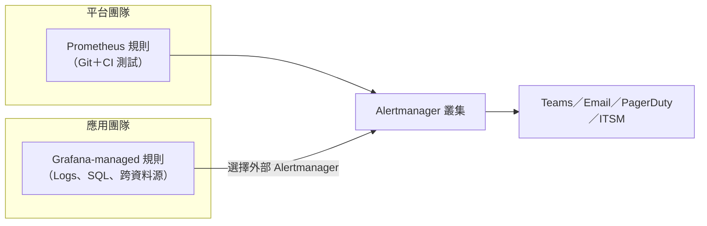
```mermaid
flowchart LR
    subgraph Platform["平台團隊"]
        PR["Prometheus 規則<br/>（Git＋CI 測試）"]
    end
    subgraph Apps["應用團隊"]
        GR["Grafana-managed 規則<br/>（Logs、SQL、跨資料源）"]
    end
    PR --> AM["Alertmanager 叢集"]
    GR -->|"選擇外部 Alertmanager"| AM
    AM --> Notify["Teams／Email／PagerDuty／ITSM"]
```

| 決策問題 | 建議 |
| --- | --- |
| 告警只需要 PromQL，而且是核心基礎設施？ | Prometheus 規則 |
| 需要結合 Logs、SQL 或多個資料來源？ | Grafana-managed 規則 |
| 希望所有通知走同一套路由與靜默？ | Grafana 設定「傳送到外部 Alertmanager」，統一由 Alertmanager 處理 |
| 想把既有 Prometheus 規則搬進 Grafana？ | 使用 Grafana 的規則匯入功能；匯入時會自動套用 query offset（預設 1m）並依序評估；含 `limit` 的群組會匯入失敗 |

> 💡 在 Grafana 中建立好 contact point、notification policy 與規則後，可在 UI 使用 **Export** 匯出為 provisioning YAML 或 Terraform HCL，再納入 Git 管理。

### 9.5 告警分級、Runbook 與 On-call

#### 嚴重度定義

| 嚴重度 | 定義 | 回應時間 | 通知方式 | 範例 |
| --- | --- | --- | --- | --- |
| **critical** | 服務中斷、資料遺失風險、SLO 快速燃燒 | 立即（7×24） | PagerDuty／電話＋Teams | 錯誤率 > 5%、主機當機、磁碟剩 5% |
| **warning** | 效能下降、需在上班時間處理 | 4 個工作小時內 | Teams／Slack | 磁碟 24 小時內寫滿、Heap 持續偏高 |
| **info** | 資訊性，不需立即處理 | 下一個工作日 | Email 或只在 Dashboard 顯示 | 憑證 30 天內到期 |
| **none** | 心跳與系統用途 | — | 外部心跳服務 | Watchdog |

#### Runbook 範本

```markdown
# HighErrorRatio

## 意義
應用程式 5xx 比例超過 5% 且持續 5 分鐘。

## 影響
使用者交易失敗；可能影響 SLO。

## 診斷
1. 開啟 API Latency Dashboard，確認錯誤集中在哪些 URI 與實例
2. 檢查最近 30 分鐘是否有部署（ArgoCD／GitLab pipeline）
3. 檢查下游依賴（資料庫、Redis、外部 API）的錯誤率與延遲
4. 以 Exemplar 跳到失敗請求的 trace，查看錯誤堆疊

## 處置
- 部署造成：回滾到前一版
- 下游故障：啟用降級或斷路器，通知下游負責團隊
- 流量暴增：確認 HPA 是否達上限，必要時手動擴容

## 升級路徑
15 分鐘內無法緩解 → 通知服務負責人與值班主管
```

#### On-call 運作原則

- **每則 critical 告警都要有事後檢討**：是否真的需要叫醒人？能否自動化處理？
- **每週檢視告警統計**：觸發次數最多、靜默最多、從未有人處理的告警，優先調整或刪除
- **維護期間使用 silence**：`amtool silence add` 並填寫原因與到期時間，不要修改路由

```bash
# 維護期間靜默某台主機 2 小時
amtool silence add instance="db-01.example.internal:9100" \
  --duration=2h --author="ops-oncall" --comment="CHG-20261001-01 DB 主機維護" \
  --alertmanager.url=http://localhost:9093

amtool silence query --alertmanager.url=http://localhost:9093
```

### 9.6 SLO 與燃燒率告警

SLO（Service Level Objective）以「使用者體驗」定義目標，例如「30 天內 99.9% 的請求成功」。Error Budget 為 0.1%；**燃燒率（burn rate）** = 目前錯誤比例 ÷ 0.1%。燃燒率 1 代表剛好在 30 天結束時用完預算。

#### 多視窗多燃燒率告警（Google SRE Workbook）

| 嚴重度 | 長視窗 | 短視窗 | 燃燒率 | 意義 |
| --- | --- | --- | --- | --- |
| critical | 1h | 5m | 14.4 | 1 小時內消耗 2% 的月預算 |
| critical | 6h | 30m | 6 | 6 小時內消耗 5% |
| warning | 3d | 6h | 1 | 3 天內消耗 10% |

```yaml
# /etc/prometheus/rules/slo-order-service.rules.yml
groups:
  - name: slo-order-service-recording
    rules:
      - record: slo:http_errors_per_requests:ratio_rate5m
        labels:
          slo: order-availability
        expr: |
          sum(rate(http_server_requests_seconds_count{application="order-service", status=~"5.."}[5m]))
            / sum(rate(http_server_requests_seconds_count{application="order-service"}[5m]))
      - record: slo:http_errors_per_requests:ratio_rate30m
        labels:
          slo: order-availability
        expr: |
          sum(rate(http_server_requests_seconds_count{application="order-service", status=~"5.."}[30m]))
            / sum(rate(http_server_requests_seconds_count{application="order-service"}[30m]))
      - record: slo:http_errors_per_requests:ratio_rate1h
        labels:
          slo: order-availability
        expr: |
          sum(rate(http_server_requests_seconds_count{application="order-service", status=~"5.."}[1h]))
            / sum(rate(http_server_requests_seconds_count{application="order-service"}[1h]))
      - record: slo:http_errors_per_requests:ratio_rate6h
        labels:
          slo: order-availability
        expr: |
          sum(rate(http_server_requests_seconds_count{application="order-service", status=~"5.."}[6h]))
            / sum(rate(http_server_requests_seconds_count{application="order-service"}[6h]))
      - record: slo:http_errors_per_requests:ratio_rate3d
        labels:
          slo: order-availability
        expr: |
          sum(rate(http_server_requests_seconds_count{application="order-service", status=~"5.."}[3d]))
            / sum(rate(http_server_requests_seconds_count{application="order-service"}[3d]))

  - name: slo-order-service-alerts
    rules:
      - alert: OrderServiceErrorBudgetBurnFast
        expr: |
          (
            slo:http_errors_per_requests:ratio_rate1h{slo="order-availability"} > (14.4 * 0.001)
            and slo:http_errors_per_requests:ratio_rate5m{slo="order-availability"} > (14.4 * 0.001)
          )
          or
          (
            slo:http_errors_per_requests:ratio_rate6h{slo="order-availability"} > (6 * 0.001)
            and slo:http_errors_per_requests:ratio_rate30m{slo="order-availability"} > (6 * 0.001)
          )
        labels:
          severity: critical
          team: backend
        annotations:
          summary: "order-service 正快速消耗 Error Budget"
          description: "錯誤比例 {{ $value | humanizePercentage }}，超過 SLO 99.9% 允許的快速燃燒門檻。"
          runbook_url: "https://runbook.example.internal/slo/order-availability"

      - alert: OrderServiceErrorBudgetBurnSlow
        expr: |
          slo:http_errors_per_requests:ratio_rate3d{slo="order-availability"} > 0.001
          and slo:http_errors_per_requests:ratio_rate6h{slo="order-availability"} > 0.001
        labels:
          severity: warning
          team: backend
        annotations:
          summary: "order-service Error Budget 持續消耗"
          description: "過去 3 天的錯誤比例 {{ $value | humanizePercentage }} 高於 SLO 允許值。"
          runbook_url: "https://runbook.example.internal/slo/order-availability"
```

> 💡 大量服務時，手寫上述規則容易出錯。可用 **Sloth**（0.16.0）或 **Pyrra**（0.10.2）由 SLO 規格自動產生 recording 與告警規則。SLO 的定義方法、延遲 SLO 與 Error Budget 政策，請參考《Metrics Visualization 教學手冊》的 SLO 章節。

### 9.7 規則與路由測試

#### 規則單元測試（promtool test rules）

```yaml
# /etc/prometheus/tests/app-alerts.test.yml
rule_files:
  - ../rules/http-red.rules.yml
  - ../rules/app-alerts.rules.yml

evaluation_interval: 1m

tests:
  - interval: 1m
    input_series:
      # 每分鐘 600 個請求（每秒 10 個），其中 60 個 5xx（10%）
      - series: 'http_server_requests_seconds_count{application="order-service", status="200"}'
        values: '0+540x20'
      - series: 'http_server_requests_seconds_count{application="order-service", status="500"}'
        values: '0+60x20'
    alert_rule_test:
      - eval_time: 3m
        alertname: HighErrorRatio
        exp_alerts: []                       # 尚未滿足 for: 5m
      - eval_time: 12m
        alertname: HighErrorRatio
        exp_alerts:
          - exp_labels:
              severity: critical
              team: backend
              application: order-service
            exp_annotations:
              summary: "order-service 錯誤率 10%"
              description: "5xx 比例已連續 5 分鐘高於 5%（每秒請求數大於 1）。"
              runbook_url: "https://runbook.example.internal/app/high-error-ratio"
              dashboard_url: "https://grafana.example.internal/d/api-latency?var-application=order-service"
```

```bash
promtool test rules /etc/prometheus/tests/*.test.yml
```

#### Alertmanager 路由測試

```bash
# 這組標籤會送到哪個 receiver？
amtool config routes test --config.file=/etc/alertmanager/alertmanager.yml \
  severity=critical team=payment alertname=HighErrorRatio
# 預期輸出：pagerduty-critical,teams-payment

# 顯示整棵路由樹
amtool config routes show --config.file=/etc/alertmanager/alertmanager.yml
```

#### CI 流程範例（GitLab CI）

```yaml
# .gitlab-ci.yml
stages: [validate]

validate-prometheus:
  stage: validate
  image:
    name: quay.io/prometheus/prometheus:v3.15.0
    entrypoint: [""]
  script:
    - promtool check config prometheus/prometheus.yml
    - promtool check rules prometheus/rules/*.yml
    - promtool test rules prometheus/tests/*.test.yml

validate-alertmanager:
  stage: validate
  image:
    name: quay.io/prometheus/alertmanager:v0.34.1
    entrypoint: [""]
  script:
    - amtool check-config alertmanager/alertmanager.yml
    - amtool config routes test --config.file=alertmanager/alertmanager.yml --verify.receivers=pagerduty-critical,teams-payment severity=critical team=payment
```

> 💡 `--verify.receivers` 讓路由測試在結果不符預期時以非零狀態結束，適合放在 CI 中防止路由被誤改。

---

## 10. 安全強化

### 威脅模型

| 面向 | 風險 | 控制措施 | 章節 |
| --- | --- | --- | --- |
| `/metrics` 端點 | 洩漏內部架構、版本、主機名稱 | 網段限制；必要時 TLS＋認證 | [10.1](#101-tls-與-basic-authwebconfigfile)、[10.6](#106-網路分區與最小權限) |
| Prometheus UI／API | 沒有使用者權限模型，能連線者可查詢全部資料 | TLS＋認證；只開放給 Grafana 與管理員 | [10.1](#101-tls-與-basic-authwebconfigfile) |
| Admin／Lifecycle API | 可刪除資料、關閉服務 | 預設關閉；需要時以認證與路徑限制保護 | [10.2](#102-admin-與-lifecycle-api-保護) |
| Remote Write、OTLP receiver | 可寫入偽造資料 | 預設關閉；限制來源並要求認證 | [10.2](#102-admin-與-lifecycle-api-保護) |
| Grafana | 帳號接管、權限過大、外部分享洩漏 | SSO＋MFA；RBAC；停用匿名與外部快照；稽核 | [10.3](#103-grafana-安全設定)、[10.5](#105-稽核日誌) |
| 祕密 | 資料庫密碼、Webhook URL、Token 外洩 | `*_file`、祕密管理系統、輪替 | [10.4](#104-祕密管理) |
| 第三方元件 | Exporter、Grafana 外掛弱點 | 版本鎖定、弱點掃描、只裝簽章外掛 | [6.7](#67-外掛管理)、[13.5](#135-alertmanagerexporter-與-kube-prometheus-stack-升級) |
| 標籤內容 | 標籤中含個資 | 標籤審查、`labeldrop` | [14.2](#142-label-設計) |

### 10.1 TLS 與 Basic Auth（web.config.file）

Prometheus、Alertmanager、node_exporter 以及多數官方 exporter 都使用 **exporter-toolkit** 的 web 設定檔格式，以 `--web.config.file` 載入。設定檔在**每次 HTTP 請求時讀取**，更新憑證不需重啟。

> 📌 官方文件仍將此功能標示為 experimental，但已廣泛用於生產環境。

```yaml
# /etc/prometheus/web-config.yml
tls_server_config:
  cert_file: /etc/prometheus/tls/prometheus.crt
  key_file: /etc/prometheus/tls/prometheus.key
  min_version: TLS12
  # 需要 mTLS 時：
  # client_auth_type: RequireAndVerifyClientCert
  # client_ca_file: /etc/prometheus/tls/internal-ca.crt

http_server_config:
  headers:
    X-Frame-Options: deny
    X-Content-Type-Options: nosniff
    Strict-Transport-Security: max-age=31536000

basic_auth_users:
  # 以 bcrypt 雜湊：htpasswd -nBC 12 "" | tr -d ':\n'
  grafana: $2y$12$Ff6lyVdgVBu6lv4FyKfPC.1rYdljwWnxVIFKGgqaVkXHGHsGEwOuS
  admin: $2y$12$Ff6lyVdgVBu6lv4FyKfPC.1rYdljwWnxVIFKGgqaVkXHGHsGEwOuS
```

```bash
# 產生 bcrypt 雜湊（輸入密碼後輸出雜湊值）
htpasswd -nBC 12 "" | tr -d ':\n'; echo

# 驗證設定檔
promtool check web-config /etc/prometheus/web-config.yml

# 測試
curl --cacert /etc/prometheus/tls/internal-ca.crt -u grafana:'<password>' \
  https://prometheus.example.internal:9090/api/v1/query?query=up
```

> ⚠️ 範例中的雜湊值僅供格式參考，請自行產生。bcrypt 成本建議 10–12：成本越高越安全，但每次請求的 CPU 消耗也越高。

#### Prometheus 抓取 TLS 保護的 exporter

```yaml
# 片段：Prometheus 以 HTTPS＋Basic Auth 抓取 node_exporter
scrape_configs:
  - job_name: node-secure
    scheme: https
    tls_config:
      ca_file: /etc/prometheus/tls/internal-ca.crt
    basic_auth:
      username: prometheus
      password_file: /etc/prometheus/secrets/node_exporter.password
    file_sd_configs:
      - files: [/etc/prometheus/file_sd/node_*.yml]
```

> 📌 Prometheus 3.13 起，跟隨 HTTP 轉址到**不同主機**時，不再轉送 Authorization、Basic Auth、OAuth2 等認證資訊，降低憑證外洩到第三方主機的風險。

### 10.2 Admin 與 Lifecycle API 保護

| 端點 | 啟用旗標 | 風險 | 建議 |
| --- | --- | --- | --- |
| `POST /-/reload`、`/-/quit` | `--web.enable-lifecycle` | 任何人可重載或關閉 Prometheus | 改用 systemd `reload`；若需開啟，只允許管理網段 |
| `POST /api/v1/admin/tsdb/snapshot` | `--web.enable-admin-api` | 大量磁碟 I/O 與空間 | 備份時才開啟（[12.5](#125-備份與還原)） |
| `POST /api/v1/admin/tsdb/delete_series` | `--web.enable-admin-api` | **永久刪除資料** | 需變更單審核 |
| `POST /api/v1/admin/tsdb/clean_tombstones` | `--web.enable-admin-api` | 觸發大量 I/O | 同上 |
| `POST /api/v1/write` | `--web.enable-remote-write-receiver` | 寫入偽造資料 | 只在接收端開啟並要求認證 |
| `POST /api/v1/otlp/v1/metrics` | `--web.enable-otlp-receiver` | 同上 | 同上 |

#### 以反向代理限制路徑（NGINX）

```nginx
# /etc/nginx/conf.d/prometheus.conf
server {
    listen 443 ssl;
    server_name prometheus.example.internal;

    ssl_certificate     /etc/nginx/tls/prometheus.crt;
    ssl_certificate_key /etc/nginx/tls/prometheus.key;
    ssl_protocols       TLSv1.2 TLSv1.3;

    # Admin 與 Lifecycle 端點只允許管理主機
    location ~ ^/(api/v1/admin|-/reload|-/quit) {
        allow 10.10.10.5;
        deny  all;
        proxy_pass http://127.0.0.1:9090;
    }

    location / {
        allow 10.10.20.0/24;     # Grafana 與維運網段
        deny  all;
        proxy_pass http://127.0.0.1:9090;
        proxy_set_header Host $host;
        proxy_set_header X-Forwarded-For $proxy_add_x_forwarded_for;
    }
}
```

> 💡 使用反向代理時，Prometheus 只聽本機（`--web.listen-address=127.0.0.1:9090`），並以 `--web.external-url` 設定對外網址。

### 10.3 Grafana 安全設定

#### 部署架構

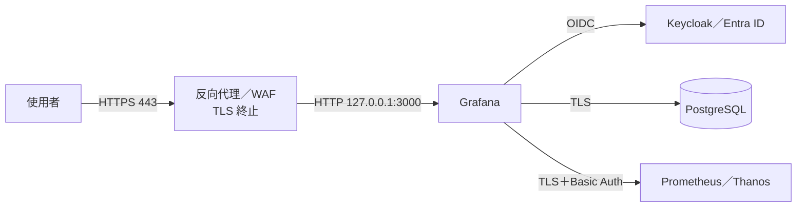
```mermaid
flowchart LR
    U["使用者"] -->|"HTTPS 443"| RP["反向代理／WAF<br/>TLS 終止"]
    RP -->|"HTTP 127.0.0.1:3000"| G["Grafana"]
    G -->|"OIDC"| IdP["Keycloak／Entra ID"]
    G -->|"TLS"| DB[("PostgreSQL")]
    G -->|"TLS＋Basic Auth"| P["Prometheus／Thanos"]
```

#### 強化設定清單

| 類別 | 設定 | 建議值 | 說明 |
| --- | --- | --- | --- |
| 傳輸 | `[server] protocol` 或反向代理 | HTTPS | Grafana 本身也可直接設定 `cert_file`、`cert_key`、`min_tls_version` |
| Cookie | `[security] cookie_secure` | true | |
| Cookie | `[security] cookie_samesite` | `lax` | 使用 OAuth／SAML 登入時**必須**為 `lax`；未使用 SSO 時可設 `strict` |
| Cookie | `[auth] login_cookie_name` | `__Host-grafana_session` | `__Host-` 前綴限制 cookie 只能由同一主機以 HTTPS 設定 |
| 標頭 | `[security] content_security_policy` | true | 搭配 `content_security_policy_template` |
| 標頭 | `[security] strict_transport_security` | true | |
| 嵌入 | `[security] allow_embedding` | false | |
| 版本資訊 | `[auth.anonymous] hide_version` | true | 對未登入者隱藏版本號 |
| 指標端點 | `[metrics] basic_auth_username`／`basic_auth_password` | 設定 | Grafana 自身 `/metrics` 預設不需認證 |
| 匿名 | `[auth.anonymous] enabled` | false | |
| 外部分享 | `[snapshots] external_enabled` | false | 禁止發佈到外部快照服務 |
| 公開儀表板 | 依政策關閉或審查 | — | 公開儀表板不需登入即可存取 |
| 暴力登入 | `[security] disable_brute_force_login_protection` | false（預設） | |
| 外掛沙箱 | `[security] enable_frontend_sandbox_for_plugins` | 列出第三方前端外掛 | 降低外掛 XSS 風險 |

#### 帳號與權限

- **SSO 為主**：本機帳號只保留 1 個緊急管理員，密碼放保險箱並定期輪替
- **MFA 在 IdP 端強制**：Grafana 本身不提供 MFA，由 Keycloak／Entra ID 負責
- **最小權限**：預設 Viewer（`auto_assign_org_role = Viewer`），Editor 以 Team 授權到資料夾
- **Service account token 設到期日**，每季盤點

### 10.4 祕密管理

| 元件 | 機制 | 範例 |
| --- | --- | --- |
| Prometheus | `password_file`、`credentials_file`、`bearer_token_file`、`ca_file` 等 `*_file` 欄位 | `basic_auth.password_file` |
| Alertmanager | `*_file` 欄位 | `smtp_auth_password_file`、`webhook_url_file`、`routing_key_file` |
| Grafana 設定檔 | `$__file{}`、`$__env{}`、`$__vault{}`（🏢） | `password = $__file{/etc/grafana/secrets/db_password}` |
| Grafana provisioning | `$ENV_VAR`、`$__file{}`；祕密放在 `secureJsonData` | 6.3 |
| Kubernetes | Secret＋External Secrets Operator／Sealed Secrets | kube-prometheus-stack 的 `existingSecret` |

```bash
# 祕密檔案的權限範例
sudo install -o root -g alertmanager -m 0640 /dev/stdin /etc/alertmanager/secrets/pagerduty_routing_key <<< '<routing-key>'
sudo ls -l /etc/alertmanager/secrets/
```

> ⚠️ 祕密不要放在命令列參數（會出現在 `ps` 與 `/proc/<pid>/cmdline`）、也不要提交到 Git。Grafana 的 `secret_key` 遺失會導致所有已加密的資料來源密碼無法解密，請一併納入備份與保管（[12.5](#125-備份與還原)）。

### 10.5 稽核日誌

#### Grafana 稽核日誌（🏢 Enterprise／Cloud）

Grafana 的稽核日誌**只在 Grafana Enterprise（需授權）與 Grafana Cloud 提供**，記錄登入、Dashboard 與資料來源變更、權限調整等動作，以 JSON 格式輸出到檔案、Loki 或 console。

```ini
# Grafana Enterprise
[auditing]
enabled = true
loggers = file
log_dashboard_content = false
log_all_status_codes = false

[auditing.logs.file]
path = /var/log/grafana/audit
max_files = 30
max_file_size_mb = 256
```

> 📌 v1.0 的 `[auditing] log_file = /var/log/grafana/audit.log` 不是有效的設定鍵；檔案輸出的位置設定在 `[auditing.logs.file] path`。此外 v1.0 未說明這是 Enterprise 功能，在 OSS 版設定不會有任何效果。

#### OSS 版的替代方案

| 稽核需求 | 替代做法 |
| --- | --- |
| 誰在何時存取 Grafana | 反向代理的 access log（含使用者標頭、來源 IP） |
| 登入成功與失敗 | IdP（Keycloak 等）的登入事件 |
| Grafana API 呼叫 | `[server] router_logging = true` 記錄每個 HTTP 請求（日誌量大，建議只在必要時開啟） |
| Dashboard、告警規則變更 | 以 provisioning 或 Git Sync 管理，Git 歷史即為變更紀錄；Dashboard 版本歷史 |
| Prometheus 查詢 | `global.query_log_file` 記錄所有 PromQL 查詢 |
| Alertmanager 靜默 | `--log.silences` 記錄靜默的建立與到期；`amtool silence query` 匯出 |
| 設定檔變更 | 設定檔以 Git 管理，部署走 CI/CD 與變更單 |

#### 保存期限

日誌保存期限依所屬法規決定（[14.6](#146-金融業與高穩定系統導入建議)）。以金融業為例，銀行公會「金融機構資通安全防護基準」要求相關紀錄**至少保存一年**。稽核日誌應送到集中日誌平台（ELK、Loki），並與 Grafana 主機分離，避免管理員可以竄改。

### 10.6 網路分區與最小權限

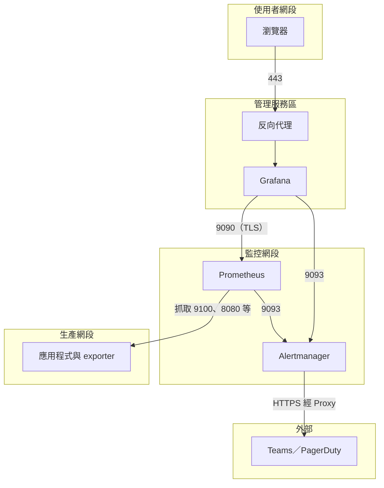
```mermaid
flowchart TB
    subgraph User["使用者網段"]
        U["瀏覽器"]
    end
    subgraph DMZ["管理服務區"]
        RP["反向代理"]
        G["Grafana"]
    end
    subgraph Mon["監控網段"]
        P["Prometheus"]
        AM["Alertmanager"]
    end
    subgraph Prod["生產網段"]
        T["應用程式與 exporter"]
    end
    subgraph Ext["外部"]
        N["Teams／PagerDuty"]
    end
    U -->|"443"| RP --> G
    G -->|"9090（TLS）"| P
    G -->|"9093"| AM
    P -->|"抓取 9100、8080 等"| T
    P -->|"9093"| AM
    AM -->|"HTTPS 經 Proxy"| N
```

| 原則 | 實作 |
| --- | --- |
| 抓取方向單向 | 只允許監控網段 → 生產網段的抓取 Port；生產網段不能主動連到 Prometheus |
| Prometheus 不對使用者開放 | 使用者只透過 Grafana 查詢 |
| 對外通知經 Proxy | Alertmanager 透過 `http_config.proxy_url` 存取 Teams、PagerDuty 等外部服務 |
| 服務帳號最小權限 | exporter 連線資料庫只給唯讀與監控角色（例如 PostgreSQL `pg_monitor`） |
| 檔案權限 | 設定 `root:<service>` 0640；資料目錄只有服務帳號可寫 |

---

## 11. 高可用與擴展

### 11.1 Prometheus HA

Prometheus 沒有內建叢集與複寫。標準做法是**兩台設定完全相同的 Prometheus 各自抓取同一批目標**（HA 配對），任一台故障時另一台仍持續抓取與評估告警。

| 項目 | 做法 |
| --- | --- |
| 設定 | 兩台使用同一份 `prometheus.yml`，只有 `external_labels.replica` 不同（`a`／`b`） |
| 告警 | 兩台都把告警送到**所有** Alertmanager；以 `alert_relabel_configs` 移除 `replica`，讓 Alertmanager 把兩份告警視為同一則並去重（[5.1](#51-prometheusyml-結構總覽)） |
| 查詢 | 由具去重能力的查詢層合併：Thanos Query（`--query.replica-label=replica`）、Mimir（HA tracker）、VictoriaMetrics（`-dedup.minScrapeInterval`） |
| 沒有查詢層時 | Grafana 預設查詢 A，B 作為備援資料來源；不要用一般負載平衡器輪流查詢 |
| 部署位置 | 兩台放在不同的實體主機、機櫃或可用區 |

#### Kubernetes 上的 HA 與分片

```yaml
# Prometheus Operator：2 個副本 × 2 個分片（共 4 個 Pod）
apiVersion: monitoring.coreos.com/v1
kind: Prometheus
metadata:
  name: k8s
  namespace: monitoring
spec:
  replicas: 2                 # 每個分片的副本數（HA）
  shards: 2                   # 以 hashmod 把目標分成 2 份
  replicaExternalLabelName: prometheus_replica
  externalLabels:
    cluster: prod-tpe-01
  serviceMonitorSelector: {}
  ruleSelector: {}
  retention: 15d
```

> ⚠️ 分片（shards）時，每個分片只有部分目標的資料。需要跨分片的查詢與告警（例如整個叢集的錯誤率），必須透過 Thanos Query 或長期儲存的全域查詢與規則評估（ThanosRuler、Mimir ruler）。

### 11.2 Alertmanager 叢集

Alertmanager 以 gossip 協定（memberlist）組成叢集，同步**靜默**與**通知紀錄（nflog）**，避免重複發送。

| 項目 | 建議 |
| --- | --- |
| 成員數 | 3 個（奇數），分散在不同主機 |
| Port | 9094 **TCP＋UDP** 都要開放 |
| Prometheus 設定 | `alertmanagers.static_configs` 列出所有成員，**不經過負載平衡器** |
| 啟動參數 | `--cluster.peer` 指向其他成員；多網卡時明確設定 `--cluster.advertise-address` |
| 一致性取捨 | Alertmanager 選擇「可用性優先」：網路分割時可能重複通知，但不會漏發 |

```promql
# 叢集成員數低於預期
min(alertmanager_cluster_members{job="alertmanager"}) < 3

# 叢集內有無法連線的成員
max(alertmanager_cluster_failed_peers{job="alertmanager"}) > 0

# 各實例設定不一致（設定雜湊值不同）
count(count by (config_hash) (alertmanager_config_hash{job="alertmanager"})) > 1
```

### 11.3 Grafana HA

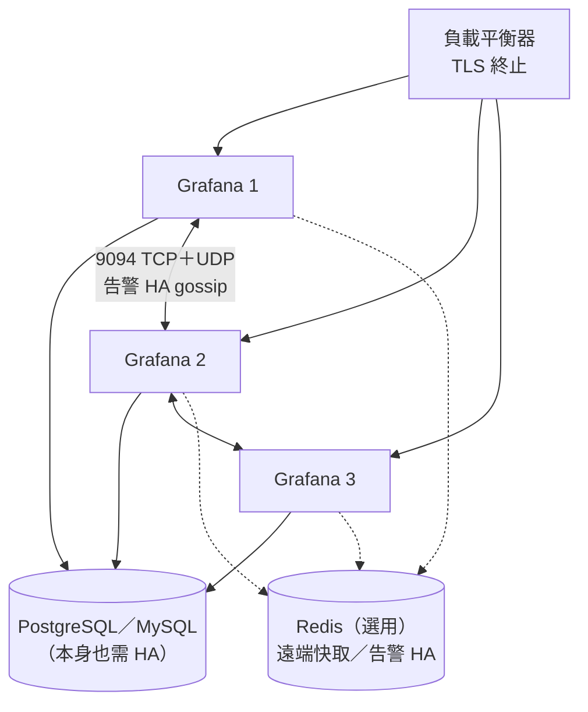
```mermaid
flowchart TB
    LB["負載平衡器<br/>TLS 終止"] --> G1["Grafana 1"]
    LB --> G2["Grafana 2"]
    LB --> G3["Grafana 3"]
    G1 --> DB[("PostgreSQL／MySQL<br/>（本身也需 HA）")]
    G2 --> DB
    G3 --> DB
    G1 <-->|"9094 TCP＋UDP<br/>告警 HA gossip"| G2
    G2 <--> G3
    G1 -.-> R[("Redis（選用）<br/>遠端快取／告警 HA")]
    G2 -.-> R
    G3 -.-> R
```

| 項目 | 設定 | 說明 |
| --- | --- | --- |
| 共用資料庫 | `[database]` 指向同一個 MySQL／PostgreSQL | **必要**；SQLite 不支援 HA |
| 使用者工作階段 | 預設存於資料庫 | 官方 HA 文件說明負載平衡器不需 session affinity；大型部署可加上 Redis（`[remote_cache]`）或 sticky session 降低資料庫負載 |
| 告警 HA | `[unified_alerting] ha_peers` 等 | 見下方設定；否則每台各自發送通知，造成重複 |
| Enterprise 授權 | 授權綁定 `root_url` 的共用主機名稱 | 🏢 |
| Grafana Live | HA 下有限制 | 需要時設定 Redis 作為 Live 的 HA 引擎 |
| Image Renderer | 獨立服務 | 13 版起不再支援外掛模式 |

```ini
# 每台 Grafana 的 [unified_alerting]（以 10.10.40.11 為例）
[unified_alerting]
enabled = true
ha_listen_address = 10.10.40.11:9094
ha_advertise_address = 10.10.40.11:9094
ha_peers = 10.10.40.11:9094,10.10.40.12:9094,10.10.40.13:9094
ha_peer_timeout = 15s
```

| 模式 | 說明 |
| --- | --- |
| 預設 | **每台都評估所有規則**，由內建 Alertmanager 以 gossip 去重通知；任何一台存活即可持續告警，但資料來源的查詢負載會乘以實例數 |
| Redis 模式 | 以 `ha_redis_address` 取代 memberlist，適合無法開放 UDP 的環境 |
| 單節點評估 | `ha_single_node_evaluation = true`：只由主節點評估（public preview）；查詢負載降為 1 倍，但主節點故障時會有短暫評估空窗 |

### 11.4 Federation

Federation 讓上層 Prometheus 從下層 Prometheus 的 `/federate` 端點抓取**彙總後**的序列，適合跨機房的總覽，不適合搬運大量原始資料。

```yaml
# 片段：全域 Prometheus 抓取各機房 Prometheus 的 recording rules 結果
scrape_configs:
  - job_name: federate-dc
    scrape_interval: 60s
    scrape_timeout: 30s
    honor_labels: true                    # 保留下層的 job、instance 等標籤
    metrics_path: /federate
    params:
      "match[]":
        - '{__name__=~"job:.*|application:.*|instance:.*"}'
        - '{__name__="up"}'
    static_configs:
      - targets:
          - prometheus-tpe.example.internal:9090
          - prometheus-tch.example.internal:9090
```

| 原則 | 說明 |
| --- | --- |
| 只抓 recording rules | 以 `match[]` 限定彙總後的序列，避免上層承受全部基數 |
| 下層要有 `external_labels` | 例如 `datacenter: tpe`，上層才能區分來源 |
| 告警留在下層 | 上層故障不應影響機房內的告警 |
| 大量資料改用 Remote Write | Federation 不適合長期保存與大量原始資料 |

### 11.5 長期儲存方案比較

| 方案 | 架構 | 優點 | 代價 | 適用情境 |
| --- | --- | --- | --- | --- |
| **Thanos**（0.42） | Sidecar 上傳 Block 到物件儲存，或 Receive 接收 Remote Write；Query 全域查詢與去重；Compactor 降採樣 | 保留既有 Prometheus；物件儲存成本低；成熟 | 元件多（Sidecar、Store、Query、Compactor、Ruler） | 已有多個 Prometheus，想加上長期儲存與全域查詢 |
| **Grafana Mimir**（[3.2](#32-記憶體與磁碟容量估算)） | Remote Write 寫入；微服務架構水平擴展；物件儲存 | 原生多租戶、可擴展到極大規模、支援原生直方圖 | 架構較重 | 平台團隊提供「指標即服務」給多個租戶 |
| **VictoriaMetrics**（1.153） | 單機版或叢集版；Remote Write 寫入 | 壓縮率高、資源效率佳、維運簡單 | MetricsQL 與 PromQL 有少數行為差異，需驗證告警與 Dashboard | 成本敏感、高基數 |
| **託管服務** | Grafana Cloud、Amazon Managed Service for Prometheus 等 | 免維運 | 費用、資料駐留與合規評估 | 不想自建平台 |

#### 參考架構

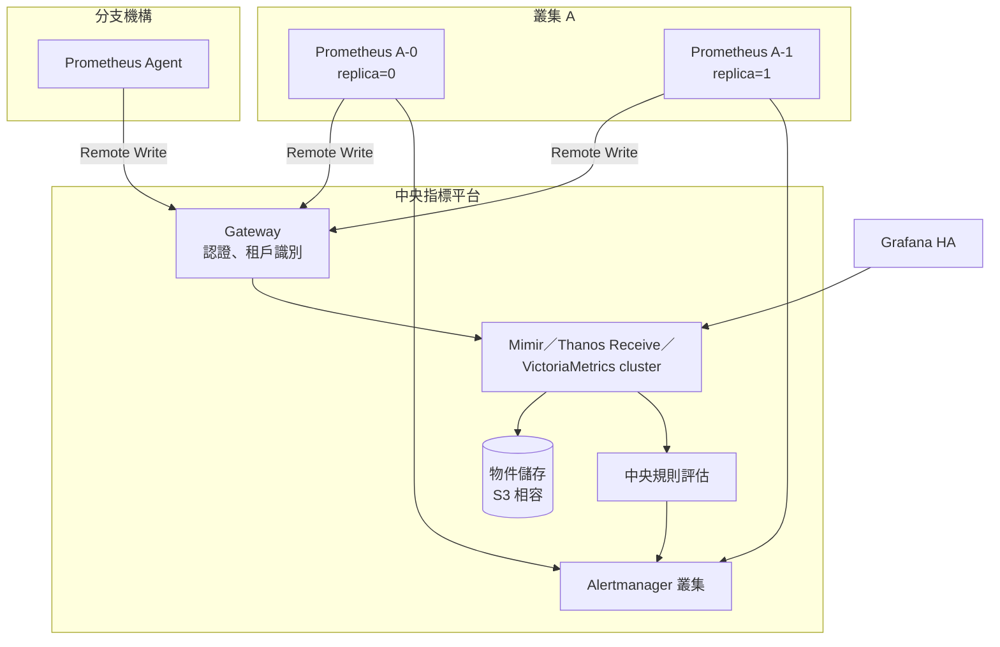
```mermaid
flowchart TB
    subgraph ClusterA["叢集 A"]
        PA1["Prometheus A-0<br/>replica=0"]
        PA2["Prometheus A-1<br/>replica=1"]
    end
    subgraph Branch["分支機構"]
        AG["Prometheus Agent"]
    end
    subgraph Central["中央指標平台"]
        GW["Gateway<br/>認證、租戶識別"]
        Store["Mimir／Thanos Receive／<br/>VictoriaMetrics cluster"]
        Obj[("物件儲存<br/>S3 相容")]
        Ruler["中央規則評估"]
        AM["Alertmanager 叢集"]
    end
    G["Grafana HA"]

    PA1 -->|"Remote Write"| GW
    PA2 -->|"Remote Write"| GW
    AG -->|"Remote Write"| GW
    GW --> Store
    Store --> Obj
    Store --> Ruler
    Ruler --> AM
    PA1 --> AM
    PA2 --> AM
    G --> Store
```

#### 設計要點

1. **副本以 `external_labels` 區分**，由長期儲存端去重
2. **關鍵告警在地評估**：叢集內的 Prometheus 仍評估與自身相關的告警
3. **監控 Remote Write**：送出延遲與失敗（[5.6](#56-remote-writeremote-read-與-agent-mode)）
4. **降採樣的限制**：Thanos 會產生 5 分鐘與 1 小時解析度的資料；查詢降採樣資料時，`rate()` 的時間窗必須大於解析度（例如 1 小時解析度至少用 `[2h]` 以上）
5. **保留期分層**：原始資料 30–90 天、5 分鐘解析度 1 年、1 小時解析度 2–5 年，依稽核與容量規劃需求調整

---

## 12. 系統維護

### 12.1 自我監控（Meta-monitoring）

「監控系統本身」是最容易被忽略的單點故障：Prometheus 或 Alertmanager 停止時，所有告警會一起消失，而且**不會有任何告警通知你**。

#### Watchdog（死人開關）

```mermaid
flowchart LR
    P["Prometheus<br/>Watchdog: vector(1)"] --> AM["Alertmanager"]
    AM -->|"每分鐘"| HB["外部心跳服務<br/>（Healthchecks、PagerDuty、自建）"]
    HB -->|"超過 N 分鐘未收到"| Oncall["通知值班人員"]
```

Watchdog 是一則**永遠處於觸發狀態**的告警，經 Alertmanager 每分鐘送到外部心跳服務（路由見 [9.2](#92-alertmanager-設定)）。心跳停止代表 Prometheus、Alertmanager 或通知管道其中之一故障，由外部服務通知值班人員。

#### 自我監控規則

```yaml
# /etc/prometheus/rules/meta-monitoring.rules.yml
groups:
  - name: meta-monitoring
    labels:
      team: platform
    rules:
      - alert: Watchdog
        expr: vector(1)
        labels:
          severity: none
        annotations:
          summary: "告警管線正常運作的心跳；此告警應永遠處於觸發狀態"

      - alert: PrometheusConfigReloadFailed
        expr: max_over_time(prometheus_config_last_reload_successful{job="prometheus"}[5m]) == 0
        for: 10m
        labels:
          severity: warning
        annotations:
          summary: "{{ $labels.instance }} 設定重載失敗，仍使用舊設定"
          runbook_url: "https://runbook.example.internal/prometheus/config-reload"

      - alert: PrometheusRuleEvaluationFailures
        expr: increase(prometheus_rule_evaluation_failures_total{job="prometheus"}[5m]) > 0
        for: 15m
        labels:
          severity: critical
        annotations:
          summary: "{{ $labels.instance }} 規則評估失敗，告警可能失效"
          runbook_url: "https://runbook.example.internal/prometheus/rule-failures"

      - alert: PrometheusRuleGroupIterationsMissed
        expr: increase(prometheus_rule_group_iterations_missed_total{job="prometheus"}[5m]) > 0
        for: 15m
        labels:
          severity: warning
        annotations:
          summary: "{{ $labels.rule_group }} 來不及在評估間隔內完成"
          runbook_url: "https://runbook.example.internal/prometheus/rule-slow"

      - alert: PrometheusNotConnectedToAlertmanagers
        expr: max_over_time(prometheus_notifications_alertmanagers_discovered{job="prometheus"}[5m]) < 1
        for: 10m
        labels:
          severity: critical
        annotations:
          summary: "{{ $labels.instance }} 沒有連上任何 Alertmanager"
          runbook_url: "https://runbook.example.internal/prometheus/no-alertmanager"

      - alert: PrometheusNotificationsDropped
        expr: increase(prometheus_notifications_dropped_total{job="prometheus"}[5m]) > 0
        for: 5m
        labels:
          severity: critical
        annotations:
          summary: "{{ $labels.instance }} 有告警通知送不出去被丟棄"
          runbook_url: "https://runbook.example.internal/prometheus/notifications-dropped"

      - alert: PrometheusTSDBCompactionsFailing
        expr: increase(prometheus_tsdb_compactions_failed_total{job="prometheus"}[3h]) > 0
        labels:
          severity: warning
        annotations:
          summary: "{{ $labels.instance }} TSDB 壓縮失敗"
          runbook_url: "https://runbook.example.internal/prometheus/tsdb-compaction"

      - alert: PrometheusTSDBWALCorruptions
        expr: increase(prometheus_tsdb_wal_corruptions_total{job="prometheus"}[3h]) > 0
        labels:
          severity: warning
        annotations:
          summary: "{{ $labels.instance }} 偵測到 WAL 損毀"
          runbook_url: "https://runbook.example.internal/prometheus/wal-corruption"

      - alert: PrometheusRemoteWriteBehind
        expr: |
          (
            max_over_time(prometheus_remote_storage_highest_timestamp_in_seconds{job="prometheus"}[5m])
            - ignoring (remote_name, url) group_right ()
            max_over_time(prometheus_remote_storage_queue_highest_sent_timestamp_seconds{job="prometheus"}[5m])
          ) > 120
        for: 15m
        labels:
          severity: warning
        annotations:
          summary: "{{ $labels.instance }} Remote Write 落後 {{ $value | humanizeDuration }}"
          runbook_url: "https://runbook.example.internal/prometheus/remote-write-behind"

      - alert: PrometheusHeadSeriesGrowth
        expr: |
          prometheus_tsdb_head_series{job="prometheus"}
            > 1.5 * max_over_time(prometheus_tsdb_head_series{job="prometheus"}[1d] offset 1d)
        for: 30m
        labels:
          severity: warning
        annotations:
          summary: "{{ $labels.instance }} active series 比昨日峰值增加 50% 以上"
          runbook_url: "https://runbook.example.internal/prometheus/cardinality"

      - alert: AlertmanagerFailedToSendAlerts
        expr: |
          sum by (instance, integration) (rate(alertmanager_notifications_failed_total{job="alertmanager"}[5m]))
            / sum by (instance, integration) (rate(alertmanager_notifications_total{job="alertmanager"}[5m]))
            > 0.01
        for: 5m
        labels:
          severity: warning
        annotations:
          summary: "{{ $labels.instance }} 透過 {{ $labels.integration }} 發送通知失敗 {{ $value | humanizePercentage }}"
          runbook_url: "https://runbook.example.internal/alertmanager/notify-failed"

      - alert: AlertmanagerConfigInconsistent
        expr: count(count by (config_hash) (alertmanager_config_hash{job="alertmanager"})) > 1
        for: 20m
        labels:
          severity: warning
        annotations:
          summary: "Alertmanager 叢集成員的設定不一致"
          runbook_url: "https://runbook.example.internal/alertmanager/config-inconsistent"
```

> 💡 這些規則改寫自社群的 prometheus-mixin 與 alertmanager-mixin。kube-prometheus-stack 已預設安裝完整版本，VM 環境可直接採用 mixin 產生的規則。

#### 交叉監控

- 兩組 Prometheus（或兩個機房）互相抓取對方的 `/metrics`，並各自評估對方的存活告警
- 中央平台監控各叢集是否持續送達資料：`absent_over_time(up{cluster="prod-tpe-01"}[10m])`
- Grafana 本身也要被監控：抓取 Grafana 的 `/metrics`（`grafana_*`），並以 blackbox 探測登入頁

### 12.2 儲存與磁碟管理

#### 容量監控指標

| 指標 | 意義 | 建議告警 |
| --- | --- | --- |
| `prometheus_tsdb_head_series` | Active series 數 | 比昨日峰值增加 50% |
| `prometheus_tsdb_storage_blocks_bytes` | 區塊佔用空間 | 接近 `retention.size` 或磁碟容量 |
| `prometheus_tsdb_wal_storage_size_bytes` | WAL 大小 | 持續增長（壓縮或截斷失敗） |
| `prometheus_tsdb_retention_limit_bytes` | 目前生效的大小保留上限 | 確認設定已生效 |
| `prometheus_tsdb_size_retentions_total` | 因大小上限而刪除 Block 的次數 | 持續增加代表保留期被大小上限縮短 |
| `prometheus_tsdb_lowest_timestamp_seconds` | 最舊資料的時間 | `time() - x` 即實際保留期 |
| `node_filesystem_avail_bytes{mountpoint="/var/lib/prometheus"}` | 資料目錄剩餘空間 | 9.1 的檔案系統告警 |

```promql
# 實際保留了幾天資料
(time() - prometheus_tsdb_lowest_timestamp_seconds) / 86400
```

#### 空間管理策略

| 策略 | 做法 | 說明 |
| --- | --- | --- |
| 調整保留期 | 修改 `storage.tsdb.retention.time`／`size` 後 `systemctl reload` | 首選；設定檔可熱重載（[5.8](#58-retention-與儲存設定)） |
| 減少寫入 | 以 `metric_relabel_configs` 丟棄不需要的指標 | 從源頭降低成本（[12.4](#124-cardinality基數管理)） |
| 擴充磁碟 | LVM 線上擴充 | `retention.percentage`（🧪）可隨磁碟擴充自動調整 |
| 刪除特定序列 | Admin API `delete_series` 後 `clean_tombstones` | 只在需要刪除錯誤或敏感資料時使用 |

```bash
# 刪除特定序列（需暫時開啟 --web.enable-admin-api，並經變更審核）
# match[] 中含大括號與引號，須以 --data-urlencode 編碼
curl -X POST -g 'http://localhost:9090/api/v1/admin/tsdb/delete_series' \
  --data-urlencode 'match[]=http_requests_total{job="old-service"}' \
  --data-urlencode 'start=2026-09-01T00:00:00Z' \
  --data-urlencode 'end=2026-09-30T23:59:59Z'

# delete_series 只是寫入 tombstone（標記刪除），要清除才會釋放空間
curl -X POST http://localhost:9090/api/v1/admin/tsdb/clean_tombstones
```

> 📌 v1.0 把 `clean_tombstones` 說明為「手動觸發壓縮」。它的作用是把已標記刪除的資料從 Block 中真正移除，會改寫受影響的 Block 並產生大量 I/O，並不是一般的壓縮。

#### 離線分析 TSDB

```bash
# 分析 Block：基數最高的指標與標籤
promtool tsdb analyze /var/lib/prometheus

# 列出所有 Block 的時間範圍與大小
promtool tsdb list -r /var/lib/prometheus
```

### 12.3 效能調校

#### Prometheus

| 項目 | 建議 | 說明 |
| --- | --- | --- |
| 抓取間隔 | 一般 15–30 秒，大規模 30–60 秒 | 間隔加倍，寫入量減半 |
| 抓取限制 | `sample_limit`、`label_limit` 等（[5.4](#54-抓取限制與保護)） | 防止單一目標拖垮整台 |
| Recording rules | Dashboard 與告警常用的昂貴查詢預先計算（[7.5](#75-recording-rules)） | 最有效的查詢加速方式 |
| `--query.max-samples` | 預設 5000 萬 | 防止單一查詢耗盡記憶體 |
| `--query.timeout` | 預設 2 分鐘 | Grafana 的資料來源逾時應略小於此值 |
| `--query.max-concurrency` | 預設 20 | 依 CPU 核心數調整 |
| `--rules.max-concurrent-evals` | 預設 4 | 規則多時可提高；同時注意查詢並行數 |
| `GOMEMLIMIT` | 3.x 自動設定 | 容器環境務必設定記憶體 limit，讓自動偵測生效 |
| 拆分 | 依團隊或功能拆成多台，或以 hashmod 分片 | 單機 active series 超過數百萬時考慮 |

#### Grafana

```ini
# /etc/grafana/grafana.ini（效能相關）
[database]
max_open_conn = 100
max_idle_conn = 25
conn_max_lifetime = 14400

[dashboards]
min_refresh_interval = 30s          ; 禁止使用者設定過短的自動重新整理

[dataproxy]
timeout = 60                        ; 預設 30 秒

[rendering]
concurrent_render_request_limit = 30

[remote_cache]
type = redis
connstr = addr=redis.example.internal:6379,pool_size=100,db=0,ssl=true
```

> 📌 v1.0 把 `concurrent_render_request_limit` 放在 `[server]` 區段，正確位置是 `[rendering]`。

| 項目 | 建議 |
| --- | --- |
| Dashboard 設計 | 控制 Panel 數量、使用 recording rules、預設時間範圍不要過長（[8.1](#81-設計原則)） |
| 資料來源 | 開啟 `incrementalQuerying`、設定 `cacheLevel`（[6.3](#63-datasource-provisioning)） |
| 告警 | 告警規則多於 1,000 條或評估間隔小於 1 分鐘時，考慮單節點評估或獨立的評估節點 |
| 渲染 | Image Renderer 獨立部署，每個 worker 約 1 GB 記憶體 |

### 12.4 Cardinality（基數）管理

#### 找出高基數來源

| 方法 | 說明 |
| --- | --- |
| UI **Status → TSDB Status** | 序列數最多的指標、標籤、標籤值組合 |
| `/api/v1/status/tsdb` | 同上，可自動化 |
| `promtool tsdb analyze` | 離線分析 Block |
| `scrape_series_added` | 每次抓取新增的序列數，用於找出 churn 來源 |
| `scrape_samples_post_metric_relabeling` | 各目標實際寫入的樣本數 |

```promql
# 各 job 的序列數（每次抓取保留的樣本數 ≈ 序列數）
sum by (job) (scrape_samples_post_metric_relabeling)

# 過去 1 小時新增序列最多的 job（churn）
topk(10, sum by (job) (sum_over_time(scrape_series_added[1h])))

# 特定指標的某標籤有多少個不同值
count(count by (uri) (http_server_requests_seconds_count))
```

> ⚠️ v1.0 的 `topk(10, count by (__name__)({__name__=~".+"}))` 會掃描所有序列，在大型環境可能拖垮 Prometheus。請改用 TSDB Status。

#### 降低基數

```yaml
# 片段：以 metric_relabel_configs 降低基數
metric_relabel_configs:
  # 丟棄整個指標
  - source_labels: [__name__]
    regex: "go_gc_duration_seconds|jvm_buffer_.*"
    action: drop
  # 只丟棄某個 histogram 中不需要的細粒度 bucket（le 值以實際暴露的為準）
  - source_labels: [__name__, le]
    regex: "http_server_requests_seconds_bucket;(0\\.001|0\\.002|0\\.005)"
    action: drop
  # 移除高基數且無分析價值的標籤
  - regex: "pod_template_hash|controller_revision_hash"
    action: labeldrop
```

> ⚠️ `labeldrop` 之後，若兩條序列只差在被移除的標籤，會變成重複序列而互相衝突。只移除「同一實體上恆定不變」的標籤，或改在 recording rule 中以 `sum without (...)` 彙總。

#### 治理流程

```mermaid
flowchart LR
    New["新指標或新標籤"] --> Review["審查<br/>名稱、型別、標籤、預估基數"]
    Review -->|"通過"| Deploy["上線"]
    Review -->|"高基數"| Redesign["改用 Exemplar、<br/>Logs 或 Traces"]
    Deploy --> Monitor["每週基數報表"]
    Monitor -->|"90 天未被查詢"| Drop["metric_relabel drop"]
    Monitor -->|"異常成長"| Alert["告警＋通知擁有者"]
```

### 12.5 備份與還原

#### 備份範圍

| 元件 | 項目 | 方式 | 頻率建議 |
| --- | --- | --- | --- |
| Prometheus | TSDB 資料 | Admin API 快照，或停機複製；有長期儲存時可不備份 | 每日（或依 RPO） |
| Prometheus | 設定、規則、web-config、file_sd | Git 版控 | 每次變更 |
| Alertmanager | `alertmanager.yml`、範本 | Git 版控 | 每次變更 |
| Alertmanager | `--storage.path`（靜默與 nflog） | 檔案備份；叢集成員互為備援 | 每日 |
| Grafana | 資料庫 | `pg_dump`／`mysqldump`；SQLite 需停機或使用 `.backup` | 每日＋升級前 |
| Grafana | `grafana.ini`、provisioning、外掛目錄 | Git 版控＋檔案備份 | 每次變更 |
| Grafana | `secret_key` | 祕密管理系統 | 設定時 |
| 全部 | TLS 憑證與祕密檔 | 祕密管理系統 | 變更時 |

#### Prometheus 快照備份

```bash
# 1. 建立快照（需 --web.enable-admin-api）
curl -s -X POST http://localhost:9090/api/v1/admin/tsdb/snapshot
# {"status":"success","data":{"name":"20261001T122223Z-125a0b70ae06622b"}}

# 2. 快照位於資料目錄下，以硬連結建立，幾乎不佔額外空間；請立即複製到其他位置
SNAP=20261001T122223Z-125a0b70ae06622b
sudo tar -C /var/lib/prometheus/snapshots -czf /backup/prometheus/prom-${SNAP}.tar.gz ${SNAP}

# 3. 刪除資料目錄中的快照，避免佔用空間
sudo rm -rf /var/lib/prometheus/snapshots/${SNAP}
```

> 💡 快照預設包含 head block 中尚未寫成 Block 的資料。加上 `?skip_head=true` 可略過，速度較快但會少最近約 2 小時的資料。

#### Prometheus 還原

```bash
# 1. 停止服務
sudo systemctl stop prometheus

# 2. 先把現有資料移到旁邊（不要直接刪除）
sudo mv /var/lib/prometheus /var/lib/prometheus.before-restore.$(date +%Y%m%d%H%M)
sudo install -d -o prometheus -g prometheus -m 0750 /var/lib/prometheus

# 3. 從備份解壓縮快照內容到資料目錄
sudo tar -C /tmp -xzf /backup/prometheus/prom-20261001T122223Z-125a0b70ae06622b.tar.gz
sudo cp -a /tmp/20261001T122223Z-125a0b70ae06622b/. /var/lib/prometheus/
sudo chown -R prometheus:prometheus /var/lib/prometheus
sudo restorecon -R /var/lib/prometheus 2>/dev/null || true

# 4. 啟動並確認資料範圍
sudo systemctl start prometheus
curl -s 'http://localhost:9090/api/v1/query?query=prometheus_tsdb_lowest_timestamp_seconds'
```

> ⚠️ v1.0 的還原步驟先執行 `rm -rf /var/lib/prometheus/*`，再從 `/var/lib/prometheus/snapshots/<id>` 複製——但快照就在剛刪除的目錄裡，**這個順序會連同快照一起刪除，造成資料全部遺失**。還原前務必先把快照複製到資料目錄以外的位置。

#### Grafana 備份與還原

```bash
# PostgreSQL
pg_dump -h pg-grafana.example.internal -U grafana -Fc grafana > /backup/grafana/grafana-$(date +%Y%m%d).dump
# 還原：pg_restore -h ... -U grafana -d grafana --clean /backup/grafana/grafana-20261001.dump

# MySQL
mysqldump -h mysql-grafana.example.internal -u grafana -p --single-transaction grafana > /backup/grafana/grafana-$(date +%Y%m%d).sql

# SQLite：官方建議停止服務後再複製；不停機時用 sqlite3 的線上備份
sudo sqlite3 /var/lib/grafana/grafana.db ".backup '/backup/grafana/grafana-$(date +%Y%m%d).db'"

# 設定、provisioning 與外掛
sudo tar -czf /backup/grafana/grafana-config-$(date +%Y%m%d).tar.gz /etc/grafana /var/lib/grafana/plugins
```

> ⚠️ v1.0 在 Grafana 執行中直接 `cp grafana.db`，可能複製到寫到一半的資料庫檔。也不要以 Dashboard API 匯出取代資料庫備份：資料庫還包含使用者、權限、告警規則、資料來源與加密的祕密。

#### 自動備份腳本

```bash
#!/usr/bin/env bash
# /usr/local/sbin/backup-monitoring.sh — 由 systemd timer 每日執行
set -euo pipefail

BACKUP_DIR=/backup/monitoring
DATE=$(date +%Y%m%d)
KEEP_DAYS=14
PROM=http://localhost:9090

install -d -m 0750 "${BACKUP_DIR}/${DATE}"

# Prometheus 快照
SNAP=$(curl -fsS -X POST "${PROM}/api/v1/admin/tsdb/snapshot" | python3 -c 'import json,sys; print(json.load(sys.stdin)["data"]["name"])')
tar -C /var/lib/prometheus/snapshots -czf "${BACKUP_DIR}/${DATE}/prometheus-${SNAP}.tar.gz" "${SNAP}"
rm -rf "/var/lib/prometheus/snapshots/${SNAP}"

# Grafana 資料庫（PostgreSQL；密碼由 ~/.pgpass 提供）
pg_dump -h pg-grafana.example.internal -U grafana -Fc grafana > "${BACKUP_DIR}/${DATE}/grafana.dump"

# 設定檔
tar -czf "${BACKUP_DIR}/${DATE}/config.tar.gz" /etc/prometheus /etc/alertmanager /etc/grafana

# 校驗值
( cd "${BACKUP_DIR}/${DATE}" && sha256sum ./* > SHA256SUMS )

# 清理舊備份（只刪除日期目錄）
find "${BACKUP_DIR}" -mindepth 1 -maxdepth 1 -type d -mtime +"${KEEP_DAYS}" -exec rm -rf {} +

# 寫入備份成功時間，供 node_exporter textfile collector 暴露（先寫暫存檔再 mv）
TEXTFILE=/var/lib/node_exporter/textfile/backup_monitoring.prom
{
  echo '# TYPE backup_last_success_timestamp_seconds gauge'
  echo "backup_last_success_timestamp_seconds{job=\"monitoring\"} $(date +%s)"
} > "${TEXTFILE}.tmp"
mv "${TEXTFILE}.tmp" "${TEXTFILE}"

echo "Backup completed: ${BACKUP_DIR}/${DATE}"
```

> 💡 備份要定期**演練還原**（建議每季一次），並記錄還原所需時間，作為 RTO 的依據。備份檔應複製到異地或物件儲存，並以 node_exporter textfile 輸出 `backup_last_success_timestamp_seconds`，納入監控。

### 12.6 疑難排解 FAQ

#### Q1：Prometheus 記憶體使用過高或 OOM

```bash
# 序列數與基數最高的指標
curl -s http://localhost:9090/api/v1/status/tsdb | python3 -m json.tool | head -60
```

| 可能原因 | 對策 |
| --- | --- |
| Active series 過多 | 找出高基數指標並以 `metric_relabel_configs` 丟棄或降維（[12.4](#124-cardinality基數管理)） |
| Churn 過高 | 移除不穩定標籤（Pod 名稱、版本雜湊） |
| 大型查詢 | 改用 recording rules；調低 `--query.max-samples` |
| 重啟時 WAL 重播 | 預留記憶體；調查 WAL 為何過大 |

> 📌 v1.0 建議「降低 retention 時間」來解決記憶體問題。保留期主要影響**磁碟**，對記憶體幾乎沒有影響；記憶體由 active series 與查詢決定。

#### Q2：Grafana 查詢逾時

| 檢查項目 | 做法 |
| --- | --- |
| 查詢本身是否昂貴 | 在 Prometheus UI 執行並觀察耗時；以 recording rules 預先計算 |
| 時間範圍 | 長時間範圍改查長期儲存的降採樣資料 |
| 逾時設定的一致性 | Grafana `[dataproxy] timeout` 與資料來源 `queryTimeout` 應略小於 Prometheus `--query.timeout` |
| 資料來源快取 | 開啟 `incrementalQuerying` |

#### Q3：Alertmanager 沒有發送告警

```bash
# 1. Prometheus 是否有觸發中的告警
curl -s http://localhost:9090/api/v1/alerts | python3 -m json.tool | head -40

# 2. Prometheus 是否連上 Alertmanager
curl -s http://localhost:9090/api/v1/alertmanagers | python3 -m json.tool

# 3. Alertmanager 是否收到（v2 API）
amtool alert query --alertmanager.url=http://localhost:9093

# 4. 是否被靜默或抑制
amtool silence query --alertmanager.url=http://localhost:9093

# 5. 路由是否正確
amtool config routes test --config.file=/etc/alertmanager/alertmanager.yml alertname=HighErrorRatio severity=critical team=backend

# 6. 通知是否失敗
curl -s http://localhost:9093/metrics | grep alertmanager_notifications_failed_total
```

> 📌 v1.0 使用 `curl http://localhost:9093/api/v1/status`。Alertmanager 0.27 起已移除所有 `/api/v1/` 端點，會回傳 HTTP 410；請改用 `/api/v2/status` 或 `amtool`。

#### Q4：Target 顯示 Down

| 錯誤訊息 | 原因 | 對策 |
| --- | --- | --- |
| `connection refused` | Exporter 未啟動、Port 錯誤 | `systemctl status`；`ss -tlnp` |
| `context deadline exceeded` | 防火牆阻擋、目標過慢 | 從 Prometheus 主機 `curl -v`；調整 `scrape_timeout` |
| `server returned HTTP status 401` | 認證失敗 | 檢查 `basic_auth`／`authorization` 設定 |
| `x509: certificate signed by unknown authority` | 未信任內部 CA | 設定 `tls_config.ca_file` |
| `sample limit exceeded` | 超過 `sample_limit` | 找出暴增原因或調整上限 |
| `unsupported Content-Type` | 3.x 嚴格檢查 | 修正目標或設定 `fallback_scrape_protocol` |

#### Q5：大量 `out of order` 或 `out of bounds` 樣本

| 原因 | 對策 |
| --- | --- |
| 兩個抓取工作抓到相同序列 | 檢查重複的 job 或目標 |
| 主機時間不同步 | 監控 `node_timex_sync_status`，修正 NTP |
| Remote Write／OTLP 接收端 | 設定 `out_of_order_time_window` |

```promql
rate(prometheus_tsdb_out_of_order_samples_total[5m]) > 0
```

#### Q6：WAL 或 Block 損毀

1. 查看日誌確認損毀的檔案：`journalctl -u prometheus | grep -i corrupt`
2. Prometheus 啟動時會嘗試修復 WAL（截斷損毀之後的部分），並記錄 `prometheus_tsdb_wal_corruptions_total`
3. 無法自動修復時：停止服務，**先備份整個資料目錄**，再移除損毀的 Block 目錄或 WAL 片段
4. 調查根因：磁碟錯誤、檔案系統已滿、使用了不支援的 NFS

#### Q7：Grafana 登入後一直跳回登入頁

| 原因 | 對策 |
| --- | --- |
| `root_url` 與實際網址不一致 | 修正 `[server] root_url` |
| `cookie_secure = true` 但以 HTTP 存取 | 經 HTTPS 存取，或確認反向代理傳遞 `X-Forwarded-Proto` |
| `cookie_samesite = strict` 搭配 OAuth | 改為 `lax` |
| 多台 Grafana 未共用資料庫 | 設定共用資料庫（[11.3](#113-grafana-ha)） |

---

## 13. 系統升級與版本管理

### 13.1 版本策略與 LTS

| 產品 | 發佈節奏 | 支援政策 | 企業建議 |
| --- | --- | --- | --- |
| **Prometheus** | 每 6 週一個 minor | 一般 minor 版在下一版發佈前修正錯誤；**LTS 版提供 1 年**的重大錯誤與高嚴重度（CVSS ≥ 7.0）安全修正 | 受監理環境使用 **3.13 LTS（至 2027-07-31）**；下一個 LTS 預計 2027 年 6 月 |
| **Alertmanager** | 不定期 | 只支援最新版 | 隨 Prometheus 升級週期一併評估 |
| **Grafana** | 每兩個月一個 minor；每年 4–5 月一個 major；每月至少一次修補 | 每個 minor 版支援 9 個月；major 的最後一個 minor 版支援 15 個月 | 追最新 minor 的最新修補版；13.3 預定 2026-10-20 |
| **Exporter** | 各專案不同 | 通常只支援最新版 | 每季評估一次；有安全公告時立即處理 |
| **kube-prometheus-stack** | 頻繁 | 只支援最新版 | 鎖定 chart 版本，每季升級；major 版本必讀 `UPGRADE.md` |

#### 升級流程

```mermaid
flowchart LR
    A["閱讀 Release notes<br/>與升級指南"] --> B["在測試環境升級"]
    B --> C["驗證：設定、規則、<br/>Dashboard、告警"]
    C --> D["變更審核<br/>回退計畫"]
    D --> E["備份"]
    E --> F["生產環境<br/>HA 逐台升級"]
    F --> G["升級後驗證<br/>觀察 24 小時"]
```

### 13.2 Prometheus 2.x → 3.x 遷移

#### 主要變更

| 類別 | 變更 | 影響 | 對策 |
| --- | --- | --- | --- |
| 旗標 | 多個 feature flag 併入預設（`promql-at-modifier`、`expand-external-labels` 等），舊旗標只記錄警告 | 啟動參數需清理 | 移除不再需要的 `--enable-feature` |
| 旗標 | Agent mode 改為 `--agent`；remote write receiver 改為 `--web.enable-remote-write-receiver` | 舊旗標無效 | 修改啟動參數 |
| 旗標 | 發行包移除 `consoles`、`console_libraries` | 舊的 `--web.console.*` 指向不存在的目錄 | 移除相關參數 |
| 設定 | `scrape_classic_histograms` 改名為 `always_scrape_classic_histograms` | 設定檔載入失敗 | 修改名稱 |
| 設定 | Remote Write `enable_http2` 預設改為 false | 連線行為改變 | 需要 HTTP/2 時明確設定 |
| PromQL | `le`、`quantile` 標籤值正規化為浮點（`le="1"` → `le="1.0"`） | 寫死整數 `le` 的規則與 Dashboard 查不到資料 | 修正查詢 |
| PromQL | 範圍與 lookback 改為左開右閉 | 子查詢可能少一個點，如 `foo[1m:1m]` 無法計算 rate | 擴大時間窗，如 `foo[2m:1m]` |
| PromQL | Regex 的 `.` 會匹配換行 | 少數 regex 結果改變 | 需要舊行為時改用 `[^\n]` |
| PromQL | `holt_winters` 改名為 🧪 `double_exponential_smoothing` | 舊查詢失效 | 改名並開啟實驗功能 |
| 抓取 | 嚴格檢查 `Content-Type`；不再自動補預設 port | 部分 exporter 抓取失敗；`instance` 標籤值改變 | 設定 `fallback_scrape_protocol`；檢查依賴 `instance` 的查詢 |
| 名稱 | 支援 UTF-8 指標與標籤名稱 | 某些原本被拒絕的名稱現在可接受 | 需要舊驗證時設定 `metric_name_validation_scheme: legacy` |
| Alertmanager | 不再支援 Alertmanager v1 API | 0.16 以前的 Alertmanager 無法接收 | 升級 Alertmanager；移除 `api_version: v1` |
| TSDB | 3.x 的資料只能由 **2.55 以上**讀取 | 降版受限 | **先升到 2.55 驗證，再升 3.x** |
| UI | 全新 UI | 使用者習慣 | 過渡期可用 🧪 `--enable-feature=old-ui` |
| 日誌 | 改用 `log/slog`，格式改變 | 日誌解析規則失效 | 更新 Logstash／Loki 解析規則 |

#### 遷移步驟

```bash
# 1. 先升級到 2.55（可讀寫 3.x 格式的最後一個 2.x），運行至少數天
# 2. 以 3.x 的 promtool 檢查設定與規則
/opt/prometheus-3.15.0/promtool check config /etc/prometheus/prometheus.yml
/opt/prometheus-3.15.0/promtool check rules /etc/prometheus/rules/*.yml
/opt/prometheus-3.15.0/promtool test rules /etc/prometheus/tests/*.test.yml

# 3. 找出寫死整數 le／quantile 的查詢
grep -rnE 'le="[0-9]+"|quantile="[0-9]+"' /etc/prometheus/rules/ /var/lib/grafana-dashboards/

# 4. 找出已改名或移除的項目
grep -rnE 'holt_winters|scrape_classic_histograms|enable-feature=(agent|remote-write-receiver)|web\.console' \
  /etc/prometheus/ /etc/systemd/system/prometheus.service
```

> 💡 HA 配對可以先升級 B 台並觀察 1–2 天，比較兩台的規則評估結果與 Dashboard，確認無誤後再升級 A 台。

### 13.3 Prometheus 升級步驟（minor 版）

```bash
NEW=3.15.0
ARCH=linux-amd64
BASE=https://github.com/prometheus/prometheus/releases/download/v${NEW}

# 1. 下載並驗證
cd /tmp
curl -fLO ${BASE}/prometheus-${NEW}.${ARCH}.tar.gz
curl -fLO ${BASE}/sha256sums.txt
sha256sum --check --ignore-missing sha256sums.txt
tar xzf prometheus-${NEW}.${ARCH}.tar.gz

# 2. 以新版 promtool 驗證現有設定
./prometheus-${NEW}.${ARCH}/promtool check config /etc/prometheus/prometheus.yml
./prometheus-${NEW}.${ARCH}/promtool test rules /etc/prometheus/tests/*.test.yml

# 3. 保留舊版二進位檔以便回退
OLD=$(prometheus --version | head -1 | awk '{print $3}')
sudo cp /usr/local/bin/prometheus /usr/local/bin/prometheus-${OLD}
sudo cp /usr/local/bin/promtool /usr/local/bin/promtool-${OLD}

# 4. 停止、替換、啟動
sudo systemctl stop prometheus
sudo install -o root -g root -m 0755 prometheus-${NEW}.${ARCH}/prometheus prometheus-${NEW}.${ARCH}/promtool /usr/local/bin/
sudo systemctl start prometheus

# 5. 驗證
prometheus --version
curl -s http://localhost:9090/-/ready
curl -s http://localhost:9090/api/v1/status/buildinfo | python3 -m json.tool
```

#### Prometheus 升級後驗證

| 項目 | 確認方式 |
| --- | --- |
| 服務就緒 | `/-/ready` 回應；WAL 重播完成（大量序列時需數分鐘） |
| 目標 | **Status → Target health** 全部 UP，數量與升級前相同 |
| 規則 | **Alerts** 頁面無評估錯誤；`prometheus_rule_evaluation_failures_total` 未增加 |
| 告警送達 | Watchdog 心跳持續 |
| 資料連續性 | Dashboard 在升級時間點沒有異常斷層（停機期間的空缺為正常） |
| Remote Write | 送出延遲恢復正常 |

### 13.4 Grafana 升級

#### 升級前準備

1. **閱讀目前版本到目標版本之間每一版的升級指南**（`upgrade-guide/upgrade-v<版本>`）
2. **備份資料庫**、`grafana.ini`、provisioning 與外掛目錄（[12.5](#125-備份與還原)）
3. 先把 Grafana 升到目前 minor 版的最新修補版，並**更新所有外掛**
4. 在測試環境以生產資料庫的複本演練升級
5. 盤點直接呼叫 `grafana-server`、`grafana-cli` 或舊 API 的腳本

#### Grafana 13 破壞性變更

| 類別 | 變更 | 對策 |
| --- | --- | --- |
| 儲存 | 資料夾與 Dashboard 遷移到 unified storage | 升級前備份；**降版必須還原備份** |
| 指令 | 移除 `grafana-cli`、`grafana-server` | 改用 `grafana cli`、`grafana server`；systemd 服務名稱不變 |
| 渲染 | 移除 Image Renderer 外掛模式；預設改用 JWT 認證 | 改為獨立服務，設定 `[rendering] renderer_token` |
| API | 以數字 `id` 存取資料來源的 API 預設停用；`/api` 標示 deprecated | 改用 `uid` 與 `/apis`；暫時可開啟 `datasourceLegacyIdApi` feature toggle |
| 告警 API | 部分舊版 Alertmanager 設定端點移除或限管理員 | 改用 `notifications.alerting.grafana.app/v1beta1` 資源 API |
| RBAC | 自訂角色中的部分舊權限會導致更新失敗 | 升級前檢查 Terraform 管理的角色 |
| 前端 | React 19 | 升級前更新外掛 |
| 已知問題 | 13.0.0 的 Git Sync 遷移錯誤，已下架 | 直接升到 13.0.1 以上（目前為 13.2.3） |

#### 套件升級（RHEL）

```bash
sudo systemctl stop grafana-server
pg_dump -h pg-grafana.example.internal -U grafana -Fc grafana > /backup/grafana/pre-upgrade-$(date +%Y%m%d%H%M).dump

sudo dnf versionlock delete grafana-enterprise
sudo dnf install -y grafana-enterprise-13.2.3
sudo dnf versionlock add grafana-enterprise

sudo systemctl daemon-reload
sudo systemctl start grafana-server
sudo journalctl -u grafana-server -n 100 --no-pager | grep -iE 'migrat|error'
curl -s http://localhost:3000/api/health
```

Ubuntu／Debian：

```bash
sudo apt-mark unhold grafana-enterprise
sudo apt-get update
sudo apt-get install -y grafana-enterprise=13.2.3
sudo apt-mark hold grafana-enterprise
sudo systemctl restart grafana-server
```

#### 容器升級

```bash
docker compose pull grafana            # compose.yaml 中的映像標籤已改為新版本
docker compose up -d grafana
docker compose logs -f grafana | grep -iE 'migrat|error'
```

> ⚠️ HA 環境升級時，多台 Grafana 共用同一個資料庫。資料庫遷移由第一台啟動的新版實例執行；**請先停止所有舊版實例**，再逐台啟動新版，避免新舊版本同時寫入。

#### Grafana 升級後驗證

| 項目 | 確認方式 |
| --- | --- |
| 健康狀態 | `/api/health` 回應 `database: ok` 與新版本號 |
| 資料遷移 | 日誌無錯誤；資料夾與 Dashboard 數量與升級前一致 |
| 外掛 | **Administration → Plugins** 無錯誤；Panel 正常顯示 |
| 告警 | 規則正常評估；送測試通知 |
| SSO | 以一般使用者帳號登入，確認角色對應正確 |

### 13.5 Alertmanager、Exporter 與 kube-prometheus-stack 升級

| 元件 | 重點 |
| --- | --- |
| **Alertmanager** | 叢集逐台升級；先以新版 `amtool check-config` 驗證；注意已棄用欄位（`match`、`source_match`）與已移除的 v1 API |
| **node_exporter** | 注意 collector 預設值與指標名稱的變更（Release notes 的 CHANGE 項目）；以 Ansible 等工具批次升級 |
| **其他 Exporter** | 0.x 版號的 exporter 可能在 minor 版改名指標；升級前比對新舊 `/metrics` 輸出 |
| **Grafana 外掛** | `grafana cli plugins update-all` 後重啟 |

```bash
# 比對 exporter 升級前後的指標名稱差異
curl -s http://host:9100/metrics | grep -v '^#' | sed -E 's/[{ ].*//' | sort -u > before.txt
# （升級後）
curl -s http://host:9100/metrics | grep -v '^#' | sed -E 's/[{ ].*//' | sort -u > after.txt
diff before.txt after.txt
```

#### kube-prometheus-stack

```bash
# 1. 閱讀 UPGRADE.md 中「From <目前 major> to <目標 major>」的段落

# 2. 先更新 CRD（Helm 不會自動更新 CRD）；版本為 chart 的 appVersion（91.8.2 對應 v0.94.1）
OP=v0.94.1
for crd in alertmanagerconfigs alertmanagers podmonitors probes prometheusagents \
           prometheuses prometheusrules scrapeconfigs servicemonitors thanosrulers; do
  kubectl apply --server-side \
    -f https://raw.githubusercontent.com/prometheus-operator/prometheus-operator/${OP}/example/prometheus-operator-crd/monitoring.coreos.com_${crd}.yaml
done

# 3. 比對差異後升級
helm diff upgrade kps oci://ghcr.io/prometheus-community/charts/kube-prometheus-stack \
  --version 91.8.2 -n monitoring -f values-prod.yaml     # 需安裝 helm-diff 外掛
helm upgrade kps oci://ghcr.io/prometheus-community/charts/kube-prometheus-stack \
  --version 91.8.2 -n monitoring -f values-prod.yaml
```

> 💡 kube-prometheus-stack 也提供 `crds.upgradeJob.enabled`，在升級時以 Job 自動更新 CRD。

### 13.6 回滾策略

| 元件 | 回滾方式 | 限制 |
| --- | --- | --- |
| Prometheus（minor 版） | 換回舊版二進位檔並重啟 | 通常可行；若新版啟用了新的儲存格式（例如 🧪 `xor2-encoding`），舊版可能無法讀取新寫入的 Block |
| Prometheus（3.x → 2.x） | 只能降到 **2.55 以上** | 更舊的版本需捨棄 TSDB 資料 |
| Alertmanager | 換回舊版二進位檔 | 靜默資料格式通常相容 |
| Grafana（13 → 12） | **停止服務 → 還原升級前的資料庫備份 → 安裝舊版** | 直接降版會讀到過時的舊資料表；升級後在新版做的變更會遺失 |
| kube-prometheus-stack | `helm rollback` | CRD 不會回滾；確認舊版 Operator 能處理新版 CRD |

```bash
# Prometheus 回滾
OLD=3.14.0
sudo systemctl stop prometheus
sudo install -o root -g root -m 0755 /usr/local/bin/prometheus-${OLD} /usr/local/bin/prometheus
sudo install -o root -g root -m 0755 /usr/local/bin/promtool-${OLD} /usr/local/bin/promtool
sudo systemctl start prometheus

# Grafana 回滾（PostgreSQL 範例）
PREV_VERSION=12.4.0          # 替換為升級前記錄的版本（rpm -q grafana-enterprise）
sudo systemctl stop grafana-server
pg_restore -h pg-grafana.example.internal -U grafana -d grafana --clean /backup/grafana/pre-upgrade-202610011200.dump
sudo dnf versionlock delete grafana-enterprise
sudo dnf downgrade -y grafana-enterprise-${PREV_VERSION}
sudo dnf versionlock add grafana-enterprise
sudo systemctl start grafana-server
```

> ⚠️ v1.0 的 Grafana 回滾只複製 `grafana.db` 再 `yum downgrade`，沒有說明資料庫結構已被新版遷移；Grafana 13 起降版**一定要還原升級前的資料庫備份**。`PREV_VERSION` 請替換為升級前記錄的實際版本號。

---

## 14. 企業實務與最佳實踐

### 14.1 命名規範

#### 指標命名

```text
<namespace>_<name>_<base_unit>_<suffix>

範例：
http_server_requests_seconds_count       # Histogram 的請求次數（_count）
http_server_requests_seconds_bucket      # Histogram 的 bucket
jvm_memory_used_bytes                    # Gauge，單位 bytes
node_cpu_seconds_total                   # Counter，單位 seconds，_total 結尾
payment_transactions_total               # Counter，無單位
```

| 規則 | 說明 | ✅ 正確 | ❌ 錯誤 |
| --- | --- | --- | --- |
| 小寫＋底線（snake_case） | 不用 camelCase | `order_created_total` | `orderCreatedTotal` |
| 使用基本單位 | 秒、bytes、比例（0–1） | `_seconds`、`_bytes`、`_ratio` | `_milliseconds`、`_mb`、`_percent` |
| Counter 以 `_total` 結尾 | client library 通常自動加上 | `requests_total` | `requests_count`（Counter） |
| 單位在 `_total` 前 | | `cpu_seconds_total` | `cpu_total_seconds` |
| 名稱不含標籤值 | 環境、版本、年份放標籤 | `requests_total{env="prod"}` | `prod_requests_total`、`requests_2026` |
| 同一名稱同一意義 | 不同單位不可共用名稱 | | |

> 📌 v1.0 以 `http_server_requests_seconds_total` 示範「HTTP 請求總數」。Micrometer 的 Timer 會產生 `_count`、`_sum`、`_bucket`、`_max`，沒有 `_seconds_total`；請求次數是 `http_server_requests_seconds_count`。

<!-- markdownlint-disable-next-line MD028 -->

> 💡 Prometheus 3.x 支援 UTF-8 名稱（例如 OTLP 的 `http.server.request.duration`），但查詢時必須加引號（[7.1](#71-基本語法)）。為了 PromQL 與既有工具的相容性，**自行定義的指標仍建議使用底線命名**。

#### Recording rule 與告警命名

| 類型 | 慣例 | 範例 |
| --- | --- | --- |
| Recording rule | `level:metric:operations` | `application:http_server_requests_errors_per_requests:ratio_rate5m` |
| 告警 | PascalCase，描述症狀 | `HighErrorRatio`、`NodeFilesystemAlmostFull` |
| 規則檔 | `<領域>.rules.yml` | `node.rules.yml`、`order-service.rules.yml` |

### 14.2 Label 設計

#### 企業標準標籤

| 標籤 | 來源 | 說明 |
| --- | --- | --- |
| `job` | Prometheus 自動 | 抓取工作名稱 |
| `instance` | Prometheus 自動 | 目標位址 |
| `cluster` | `external_labels` | Kubernetes 叢集或 Prometheus 所在環境 |
| `env` | `external_labels` 或目標標籤 | `prod`、`uat`、`sit`、`dev` |
| `datacenter` | 目標標籤 | 機房或可用區 |
| `team` | 目標標籤 | 負責團隊，用於告警路由 |
| `application` | 應用程式 | 服務名稱；Spring Boot 以 `management.metrics.tags.application` 設定 |
| `namespace`、`pod`、`container` | Kubernetes SD | |

```yaml
# ✅ 好的標籤：值的數量有限、可預期
labels:
  env: prod
  datacenter: tpe
  team: backend
  application: order-service
  method: GET
  status: "200"          # YAML 中數字狀態碼加引號，確保為字串
  uri: /api/orders/{id}  # 使用路由樣板，而不是實際路徑
```

```yaml
# ❌ 高基數或敏感的標籤
labels:
  user_id: "12345"           # 使用者 ID：數百萬個值
  request_id: abc-123        # 每個請求一個值
  timestamp: "2026-10-01"    # 時間應是樣本的時間戳，不是標籤
  email: user@example.com    # 個資，違反個資法與內部規範
  trace_id: 4bf92f3577b34da6 # 改用 Exemplar
  uri: /api/orders/98765     # 未樣板化的路徑
```

| 原則 | 說明 |
| --- | --- |
| 每個標籤的值數量有上限 | 一般不超過數百；整個指標的序列數 = 各標籤值數量的乘積 |
| 不放個資 | 帳號、身分證字號、Email、手機號碼、IP（使用者端）不可作為標籤 |
| 路徑樣板化 | `/api/orders/{id}` 而非實際 ID；Micrometer 預設會使用樣板 |
| 錯誤分類有限化 | 以錯誤類別（`timeout`、`db_error`）取代完整錯誤訊息 |
| 需要逐筆追查時 | 用 Exemplar、Logs 或 Traces，不要用標籤 |

### 14.3 多環境設計（DEV／SIT／UAT／PROD）

```mermaid
flowchart TB
    subgraph Prod["生產環境（獨立）"]
        PP1["Prometheus PROD A"]
        PP2["Prometheus PROD B"]
        AMP["Alertmanager PROD"]
        EP["PROD 目標"]
        EP --> PP1
        EP --> PP2
        PP1 --> AMP
        PP2 --> AMP
    end
    subgraph NonProd["非生產環境（共用）"]
        PNP["Prometheus NON-PROD"]
        AMN["Alertmanager NON-PROD"]
        ED["DEV 目標"] --> PNP
        ES["SIT 目標"] --> PNP
        EU["UAT 目標"] --> PNP
        PNP --> AMN
    end
    G["Grafana<br/>依資料來源區分環境"]
    PP1 --> G
    PNP --> G
```

| 設計原則 | 說明 |
| --- | --- |
| **生產環境獨立** | PROD 使用獨立的 Prometheus、Alertmanager 與通知管道，避免測試環境的告警與負載影響生產 |
| **非生產環境可共用** | DEV／SIT／UAT 共用一組，以 `env` 標籤區分 |
| **設定一致** | 各環境共用同一套規則與 Dashboard，只以標籤或資料來源區分 |
| **告警分流** | 非生產環境的告警只送到團隊頻道，不觸發 PagerDuty |
| **Grafana** | 一般使用單一 Grafana＋各環境資料來源＋`$datasource` 變數；有完全隔離需求時使用獨立 Grafana 或 Organization |

```yaml
# /etc/prometheus/prometheus-prod.yml（摘要）
global:
  scrape_interval: 15s
  external_labels:
    env: prod
    datacenter: tpe
    replica: a
scrape_configs:
  - job_name: order-service
    metrics_path: /actuator/prometheus
    file_sd_configs:
      - files: [/etc/prometheus/file_sd/order-service_prod.yml]
```

```yaml
# /etc/prometheus/prometheus-nonprod.yml（摘要）
global:
  scrape_interval: 30s
  external_labels:
    env: nonprod
scrape_configs:
  - job_name: order-service
    metrics_path: /actuator/prometheus
    file_sd_configs:
      - files:
          - /etc/prometheus/file_sd/order-service_dev.yml    # 檔案內以 labels.env: dev 標示
          - /etc/prometheus/file_sd/order-service_sit.yml
          - /etc/prometheus/file_sd/order-service_uat.yml
```

> 📌 v1.0 把 `prometheus-prod.yml` 與 `prometheus-nonprod.yml` 寫在同一個 YAML 區塊中，`global` 鍵重複出現，複製使用會解析失敗；且以 `dev-apps`、`sit-apps` 等不同 job 名稱區分環境，會讓同一個服務在各環境的查詢不一致。本版改為兩個獨立檔案，並維持相同的 job 名稱，以 `env` 標籤區分。

### 14.4 CI/CD 與 GitOps

#### 設定 repository 結構

```text
monitoring-config/
├── prometheus/
│   ├── prometheus.yml
│   ├── scrape.d/                 # 各團隊的 scrape 設定（CODEOWNERS 指定審核者）
│   ├── rules/
│   └── tests/
├── alertmanager/
│   ├── alertmanager.yml
│   └── templates/
├── grafana/
│   ├── provisioning/
│   └── dashboards/
├── .gitlab-ci.yml                # 9.7 的驗證工作＋部署工作
└── CODEOWNERS
```

#### 部署後驗證服務已被監控

```bash
# 部署後確認新服務的目標已出現且為 UP（取代 v1.0 以 grep 比對 /api/v1/targets 的做法）
for i in $(seq 1 30); do
  UP=$(curl -s --get 'http://prometheus.example.internal:9090/api/v1/query' \
        --data-urlencode 'query=sum(up{job="new-service"})' \
        | python3 -c 'import json,sys; r=json.load(sys.stdin)["data"]["result"]; print(r[0]["value"][1] if r else 0)')
  if [ "${UP%.*}" -ge 1 ]; then
    echo "new-service 已被抓取：${UP} 個目標 UP"
    exit 0
  fi
  sleep 10
done
echo "警告：5 分鐘內未偵測到 new-service 的抓取目標" >&2
exit 1
```

#### 在 Grafana 標記部署事件

```bash
# 以 service account token 建立組織層級的 annotation，所有 Dashboard 可顯示
curl -s -X POST https://grafana.example.internal/api/annotations \
  -H "Authorization: Bearer ${GRAFANA_TOKEN}" -H "Content-Type: application/json" \
  -d "{\"tags\":[\"deploy\",\"order-service\"],\"text\":\"order-service ${CI_COMMIT_SHORT_SHA} 部署到 prod\"}"
```

> 💡 在 Dashboard 加入以 `deploy` 標籤篩選的 annotation 查詢，就能在圖表上直接看到「錯誤率上升是否發生在部署之後」。

### 14.5 Batch、微服務與 Service Mesh

#### 自訂批次工作指標（Micrometer）

```java
// 自訂批次工作指標：執行時間（Timer）與最後成功時間（Gauge）
@Component
public class BatchJobMetrics {

    private final MeterRegistry registry;
    private final Map<String, AtomicLong> lastSuccess = new ConcurrentHashMap<>();

    public BatchJobMetrics(MeterRegistry registry) {
        this.registry = registry;
    }

    public void record(String jobName, String status, Duration duration) {
        // 產生 batch_job_duration_seconds_count／_sum／_max，標籤為 job、status
        Timer.builder("batch.job.duration")
             .tag("job", jobName)
             .tag("status", status)
             .register(registry)
             .record(duration);

        if ("COMPLETED".equals(status)) {
            lastSuccess
                .computeIfAbsent(jobName, name -> registry.gauge(
                    "batch.job.last.success.timestamp.seconds",
                    Tags.of("job", name),
                    new AtomicLong()))
                .set(Instant.now().getEpochSecond());
        }
    }
}
```

> 📌 v1.0 以 `registry.counter("batch_job_executions_total", ...)` 直接使用 Prometheus 格式名稱。Micrometer 的命名慣例是以 `.` 分隔，由 Prometheus registry 轉換並自動加上 `_total`、`_seconds` 等後綴；直接寫底線與 `_total` 容易產生重複後綴或不一致的名稱。使用 Spring Batch 時，優先採用內建的 `spring.batch.*` 指標（[8.5](#85-實務範例)）。

#### 微服務

| 主題 | 建議 |
| --- | --- |
| 指標來源 | Spring Boot Actuator＋Micrometer；或 OpenTelemetry SDK＋OTLP（[5.7](#57-otlp-接收)） |
| 共通標籤 | 所有服務一致的 `application`、`env`、`team` |
| 依賴監控 | 對外呼叫（HTTP client、DB、Redis、Kafka）的延遲與錯誤率；Resilience4j 斷路器狀態 |
| 服務發現 | Kubernetes 上使用 ServiceMonitor／PodMonitor；VM 上使用 file_sd 或 Consul |

#### Service Mesh（Istio）

> 📌 v1.0 以 `regex: istio-telemetry;prometheus` 抓取 Mixer 的 `istio-telemetry` 服務。Mixer 已在多年前的 Istio 版本中移除，該設定不會抓到任何資料。

現行 Istio 的指標來源：

| 來源 | 端點 | 說明 |
| --- | --- | --- |
| Envoy sidecar（含應用程式指標合併） | Pod 的 `:15020/stats/prometheus` | 預設啟用 metrics merging，並自動設定 `prometheus.io/*` 註解；以 5.2 的 Pod 註解自動發現即可抓取 |
| istiod（控制平面） | `istiod` Service 的 `http-monitoring`（15014）`/metrics` | |

```yaml
# 片段：抓取 istiod 控制平面指標
scrape_configs:
  - job_name: istiod
    kubernetes_sd_configs:
      - role: endpoints
        namespaces:
          names: [istio-system]
    relabel_configs:
      - source_labels: [__meta_kubernetes_service_name, __meta_kubernetes_endpoint_port_name]
        action: keep
        regex: istiod;http-monitoring
```

> ⚠️ 若需要以 mTLS 抓取、應用程式指標與 Istio 指標同名，或 Prometheus 不使用 `prometheus.io` 註解，請關閉 metrics merging（`meshConfig.enablePrometheusMerge=false`）並分別抓取。

### 14.6 金融業與高穩定系統導入建議

#### 架構建議

| 項目 | 建議 |
| --- | --- |
| **高可用** | Prometheus HA 配對（或 LTS 版本）＋Alertmanager 3 節點叢集＋Grafana 多實例與 HA 資料庫（第 11 章） |
| **版本** | Prometheus 使用 3.13 LTS；Grafana 追最新 minor 的修補版；所有元件以變更單管理 |
| **資料保留** | 本機 15–30 天；長期儲存依法規與容量規劃保存彙總資料 |
| **備份** | 每日快照＋異地備份；每季還原演練（[12.5](#125-備份與還原)） |
| **存取控制** | SSO＋MFA；RBAC 以 Team 授權資料夾；service account 分用途並設到期日（[6.5](#65-組織teamfolder-與-rbac)、[10.3](#103-grafana-安全設定)） |
| **網路** | 監控網段獨立；抓取單向；對外通知經 Proxy（[10.6](#106-網路分區與最小權限)） |
| **離線環境** | 內部 registry、內部 Grafana 外掛來源、關閉對外檢查（[4.7](#47-離線air-gapped安裝)） |
| **稽核** | Grafana Enterprise 稽核日誌或 OSS 替代方案；設定以 Git 管理；日誌集中並保存 ≥ 法規期限（[10.5](#105-稽核日誌)） |
| **自我監控** | Watchdog＋外部心跳；監控系統本身的告警（[12.1](#121-自我監控meta-monitoring)） |

#### 臺灣法規與稽核對應（精簡版）

> ⚠️ 本節只摘錄與「指標監控平台」直接相關、且可查證的要求，不構成法律意見。實際適用範圍依機關或企業的身分（公務機關、特定非公務機關、金融機構）與資通安全責任等級而定，請與法遵單位確認。

| 規範 | 相關要求（摘要） | 對監控平台的意涵 |
| --- | --- | --- |
| 資通安全責任等級分級辦法 附表十「資通系統防護基準」 | 「事件日誌與可歸責性」構面：記錄事件、日誌紀錄內容、**日誌儲存容量**、**日誌處理失效之回應**、**時戳及校時** | 儲存容量規劃與告警（[3.2](#32-記憶體與磁碟容量估算)、[12.2](#122-儲存與磁碟管理)）；監控系統失效告警（[12.1](#121-自我監控meta-monitoring)）；NTP 同步監控（[9.1](#91-alerting-rules-撰寫)） |
| 資通安全事件通報及應變辦法 | 公務機關知悉資通安全事件後，應於 **1 小時內**通報 | 告警延遲與值班流程要能支撐「知悉」的時效（[1.2](#12-為何需要-metrics-監控)、[9.5](#95-告警分級runbook-與-on-call)） |
| 中華民國銀行公會「金融機構資通安全防護基準」 | 相關紀錄至少保存**一年** | 稽核紀錄、告警歷史、存取紀錄的保存期限（[10.5](#105-稽核日誌)） |
| 個人資料保護法 | 個人資料的蒐集、處理、利用需符合特定目的 | 指標標籤不得含個資（[14.2](#142-label-設計)） |
| 金管會「金融業運用人工智慧（AI）指引」（2024-06） | AI 治理、風險管理、委外管理 | AI 輔助維運的使用評估（[14.7](#147-ai-輔助維運)） |

#### 控制對應表

| 控制要求 | 監控平台的實作 | 可提供的稽核證據 |
| --- | --- | --- |
| 日誌儲存容量 | 容量公式規劃；`retention.size` 上限；磁碟用量告警 | 容量規劃文件、告警規則、Dashboard 截圖 |
| 日誌處理失效之回應 | Watchdog；Remote Write 失敗告警；規則評估失敗告警 | 告警規則、外部心跳紀錄、演練紀錄 |
| 時戳及校時 | 所有節點 NTP 同步；`node_timex_sync_status` 告警 | NTP 設定、告警規則 |
| 存取控制與可歸責性 | SSO＋RBAC；service account 分用途；稽核紀錄 | 權限清單、稽核紀錄匯出 |
| 事件偵測與通報時效 | SLO 燃燒率告警；值班與升級路徑；Alertmanager 通知紀錄 | 告警與通知時間軸、事故報告 |
| 變更管理 | 設定以 Git 管理；CI 驗證；變更單 | Git 歷史、CI 紀錄、變更單 |
| 個資保護 | 標籤審查流程；`labeldrop` 移除敏感標籤 | 指標審查紀錄、relabel 設定 |

> 💡 **指標資料本身通常不是法規所稱的「日誌」**，但監控平台上的**存取紀錄、設定變更紀錄與告警歷史**通常是。稽核準備的重點應放在這些紀錄的完整性與保存期限，而不是把所有指標都保留多年。

### 14.7 AI 輔助維運

#### 適合交給 AI 的工作

| 工作 | 範例 | 人工把關重點 |
| --- | --- | --- |
| 撰寫與解釋 PromQL | 「計算各 URI 的 P95 延遲」 | 用 `promtool` 驗證語法；確認先 rate 再 sum、使用正確的指標名稱 |
| 產生規則與單元測試 | 依需求產生告警規則與 `promtool test rules` 測試 | 測試必須能通過；閾值由服務負責人決定 |
| Dashboard 初稿 | 依需求產生 Dashboard JSON | 檢查資料來源 uid、`$__rate_interval`、單位 |
| 事件初步分析 | 彙整告警、指標與部署事件，提出可能原因 | AI 的推論只能作為假設，需以資料驗證 |
| 設定審查 | 檢查 `prometheus.yml`、`alertmanager.yml` 的風險 | 不得把祕密貼給外部 AI 服務 |

#### Prompt 範例

````markdown
## 角色
你是 Prometheus 3.15 與 Grafana 13 的 SRE 專家。

## 任務
撰寫 PromQL：計算過去 5 分鐘各 URI 的 P95 延遲，只顯示超過 500ms 的 URI。

## 可用指標（Micrometer，classic histogram）
- http_server_requests_seconds_bucket：標籤 application、uri、method、status、le
- 抓取間隔 15 秒

## 要求
1. 先 rate 再 sum，並保留 le
2. 提供 Grafana 版本（使用 $__rate_interval）與 recording rule 版本
3. 說明每個步驟的用意
4. 列出這個查詢在高基數 uri 時的風險與對策
````

````markdown
## 任務
依下列需求產生 Prometheus 告警規則與 promtool 單元測試。

## 需求
- 服務：order-service（標籤 application="order-service"）
- 5xx 比例 > 5% 且每秒請求數 > 1，持續 5 分鐘 → severity=critical，team=backend
- annotation 需包含 summary（以 humanizePercentage 顯示比例）與 runbook_url

## 輸出
1. rules 檔（YAML）
2. test 檔：涵蓋「未滿 5 分鐘不觸發」、「觸發」、「低流量不觸發」三種情境
3. 執行指令：promtool check rules、promtool test rules
````

#### Grafana Assistant 與 MCP

| 工具 | 說明 | 注意事項 |
| --- | --- | --- |
| **Grafana Assistant** | Grafana 內建的 AI 助理，可協助撰寫查詢、建立 Dashboard、分析問題 | 自管（地端）版本需連接 Grafana Cloud stack，後端與計費在 Grafana Cloud；資料會送往雲端，需經資安與法遵評估 |
| **mcp-grafana**（1.6.3） | Grafana 官方 MCP server，讓 AI 代理（Claude Code 等）查詢 Grafana、Prometheus、Loki、告警 | 以 `--disable-write` 限制為唯讀；以 `--disable-<category>` 關閉不需要的工具類別；使用權限最小的 service account token |

#### AI 使用治理

| 原則 | 做法 |
| --- | --- |
| 資料分級 | 指標名稱與標籤可能透露內部架構；機敏環境只使用核准的 AI 服務或地端模型 |
| 祕密不外流 | 貼給 AI 的設定檔先移除密碼、token、Webhook URL |
| 唯讀優先 | AI 代理預設唯讀；任何寫入（建立告警、修改 Dashboard）需人工確認 |
| 驗證 | AI 產生的 PromQL、規則一律經 `promtool`／`amtool` 驗證與 Code Review |
| 紀錄 | 保存 AI 參與事件分析與變更的紀錄，以便稽核 |
| 法規 | 金融業依金管會 AI 指引進行風險評估與委外管理 |

---

## 15. 檢查清單

> 💡 以下清單使用 Markdown 任務清單格式，可直接複製到 Issue、Merge Request 或變更單中勾選。

### 15.1 安裝檢查清單

- [ ] 依 3.2 估算 active series、磁碟與記憶體，並保留 30% 以上餘裕
- [ ] 作業系統為受支援版本（RHEL 9／10、Ubuntu 24.04 LTS 等），時間同步正常
- [ ] `/var/lib/prometheus` 為獨立檔案系統，且不是 NFS
- [ ] 防火牆依 3.3 以「來源 IP＋目的 Port」最小化開放；Alertmanager 9094 TCP＋UDP
- [ ] 二進位檔以 `sha256sums.txt` 驗證；Grafana 套件以 GPG 驗證
- [ ] 版本固定（versionlock／apt-mark hold／映像標籤不使用 `latest`）
- [ ] 服務以專用系統帳號執行，systemd 已設定安全強化參數
- [ ] Prometheus、Alertmanager、node_exporter、Grafana 皆設為開機自動啟動
- [ ] `/-/ready`、`/api/v2/status`、`/api/health` 健康檢查通過
- [ ] Grafana 管理員密碼已變更，`secret_key` 已設定並妥善保管

### 15.2 設定檢查清單

- [ ] `promtool check config` 與 `promtool check rules` 通過
- [ ] `promtool test rules` 單元測試通過
- [ ] `amtool check-config` 通過；`amtool config routes test` 驗證主要路由
- [ ] `global.scrape_interval` 已明確設定，`scrape_timeout` 不大於間隔
- [ ] `external_labels` 已設定 `cluster`／`env`／`replica`
- [ ] 全域抓取限制（`sample_limit`、`label_limit` 等）已設定
- [ ] 保留期以設定檔 `storage.tsdb.retention` 設定，`size` 小於磁碟容量的 85%
- [ ] Grafana 資料來源 `uid` 固定，`timeInterval` 等於抓取間隔
- [ ] Dashboard 與資料來源以 provisioning／Git Sync／Terraform 管理
- [ ] 告警規則都有 `severity`、`team`、`summary`、`description`、`runbook_url`
- [ ] 通知測試成功（Email、Teams Workflows、PagerDuty 等）
- [ ] 祕密以 `*_file`／`$__file{}` 提供，未出現在設定檔與 Git 中

### 15.3 上線前（生產環境）檢查清單

- [ ] Prometheus HA 配對，兩台位於不同主機或可用區
- [ ] Alertmanager 3 節點叢集，`alertmanager_cluster_members` 為 3
- [ ] Grafana 多實例＋共用 MySQL／PostgreSQL＋告警 HA 設定
- [ ] Watchdog 與外部心跳服務已串接並測試
- [ ] 自我監控告警（[12.1](#121-自我監控meta-monitoring)）已部署
- [ ] TLS 與認證已啟用（Prometheus、Alertmanager、exporter、Grafana）
- [ ] Admin／Lifecycle API 已關閉或受保護
- [ ] SSO 已整合，角色對應正確；匿名存取、外部快照已關閉
- [ ] 稽核紀錄方案已實作（Enterprise 稽核日誌或 OSS 替代方案），保存期限符合法規
- [ ] 備份已排程，並完成一次還原演練
- [ ] Runbook 已撰寫並可從告警直接連結
- [ ] 值班人員已完成教育訓練，升級路徑已公告
- [ ] 容量與效能已壓測（查詢延遲、規則評估時間、Remote Write 延遲）

### 15.4 日常維運檢查清單

#### 每日

- [ ] Watchdog 心跳正常；無未處理的 critical 告警
- [ ] 所有目標 UP；`prometheus_config_last_reload_successful` 為 1
- [ ] 磁碟用量與實際保留天數正常
- [ ] 備份成功（`backup_last_success_timestamp_seconds`）

#### 每週

- [ ] Active series 與 churn 趨勢；前 10 名高基數指標
- [ ] 告警統計：觸發最多、靜默最多、無人處理的告警
- [ ] 過期或即將過期的靜默

#### 每月

- [ ] Dashboard 使用情形；清理未使用的 Dashboard
- [ ] Service account token 與使用者權限盤點
- [ ] 各元件安全公告與版本評估

#### 每季

- [ ] 還原演練；HA 故障切換演練
- [ ] 容量規劃檢討

### 15.5 升級檢查清單

- [ ] 已閱讀目前版本到目標版本之間所有的 Release notes 與升級指南
- [ ] 已在測試環境完成升級演練
- [ ] 已以新版 `promtool`／`amtool` 驗證設定、規則與單元測試
- [ ] Prometheus 2.x → 3.x：已先升到 2.55，並檢查 `le`／`quantile` 整數值、已改名的設定與旗標（[13.2](#132-prometheus-2x--3x-遷移)）
- [ ] Grafana：已更新所有外掛；已修改使用 `grafana-server`／`grafana-cli` 的腳本（[13.4](#134-grafana-升級)）
- [ ] kube-prometheus-stack：已閱讀 `UPGRADE.md` 並更新 CRD（[13.5](#135-alertmanagerexporter-與-kube-prometheus-stack-升級)）
- [ ] 已備份 TSDB 快照、Grafana 資料庫、設定檔與 `secret_key`
- [ ] 已保留舊版二進位檔／套件，回退步驟已寫入變更單（[13.6](#136-回滾策略)）
- [ ] HA 環境採逐台升級；Grafana 升級前已停止所有舊版實例
- [ ] 已通知相關團隊升級時間與可能的監控中斷
- [ ] 升級後完成驗證：目標、規則、告警送達、Dashboard、SSO

---

## 附錄 A：PromQL 速查

> 🧪 標記的項目需以 `--enable-feature` 啟用；其他皆為 Prometheus 3.15 的穩定功能。

### A.1 選擇器與修飾子

| 語法 | 說明 | 範例 |
| --- | --- | --- |
| `metric{label="v"}` | 標籤完全相等 | `up{job="node"}` |
| `!=`、`=~`、`!~` | 不等於、regex 符合、regex 不符合（完全錨定） | `{status=~"5.."}` |
| `[5m]` | Range vector | `rate(x[5m])` |
| `offset 1w` | 時間偏移 | `x offset 1w` |
| `@ <時間>` | 固定評估時間 | `x @ end()` |
| `[1h:5m]` | 子查詢 | `max_over_time(rate(x[5m])[1h:5m])` |
| `{"a.b"}` | UTF-8 名稱 | `{"http.server.request.duration"}` |

### A.2 函式

| 函式 | 用途 |
| --- | --- |
| `rate()`、`increase()`、`irate()` | Counter 速率與增量（告警用 `rate`） |
| `delta()`、`deriv()` | Gauge 的變化量與每秒變化率 |
| `predict_linear(v[d], t)` | 線性預測 t 秒後的值 |
| `avg_over_time`、`max_over_time`、`min_over_time`、`sum_over_time`、`count_over_time`、`quantile_over_time`、`last_over_time`、`first_over_time` | 時間窗統計 |
| `absent()`、`absent_over_time()` | 偵測序列消失 |
| `changes()`、`resets()` | 值變更次數、counter 重置次數 |
| `label_replace()`、`label_join()` | 標籤處理 |
| `clamp_min()`、`clamp_max()`、`clamp()` | 限制範圍 |
| `time()`、`timestamp()` | 目前時間、樣本時間 |
| `sort()`、`sort_desc()`、`sort_by_label()` | 排序 |
| `histogram_quantile()`、`histogram_fraction()`、`histogram_count()`、`histogram_sum()`、`histogram_avg()` | Histogram（[7.3](#73-histogramclassic-與-native)） |
| 🧪 `histogram_quantiles()`、`info()`、`double_exponential_smoothing()` | 需 `promql-experimental-functions` |

### A.3 聚合與向量匹配

| 語法 | 說明 |
| --- | --- |
| `sum`、`avg`、`min`、`max`、`count`、`group` | 基本聚合 |
| `topk(k, v)`、`bottomk(k, v)` | 前／後 k 名 |
| `quantile(φ, v)`、`stddev`、`stdvar` | 跨序列統計 |
| `count_values("label", v)` | 依值計數 |
| `by (labels)`／`without (labels)` | 保留／排除標籤 |
| `on (labels)`／`ignoring (labels)` | 二元運算的匹配標籤 |
| `group_left (labels)`／`group_right (labels)` | 多對一／一對多，並帶入額外標籤 |
| `and`、`or`、`unless` | 集合運算 |
| 🧪 `fill()`、`fill_left()`、`fill_right()` | 缺值補齊（需 `promql-binop-fill-modifiers`） |

### A.4 常用情境速查

| 用途 | PromQL |
| --- | --- |
| **CPU 使用率（0–1）** | `1 - avg by (instance) (sum without (mode) (rate(node_cpu_seconds_total{mode=~"idle\|iowait\|steal"}[5m])))` |
| **記憶體使用率（0–1）** | `1 - node_memory_MemAvailable_bytes / node_memory_MemTotal_bytes` |
| **磁碟使用率（0–1）** | `1 - node_filesystem_avail_bytes{fstype!~"tmpfs\|overlay"} / node_filesystem_size_bytes{fstype!~"tmpfs\|overlay"}` |
| **磁碟寫滿預測** | `predict_linear(node_filesystem_avail_bytes[6h], 24 * 3600) < 0` |
| **HTTP QPS** | `sum by (application) (rate(http_server_requests_seconds_count[5m]))` |
| **HTTP 錯誤率（0–1）** | `sum(rate(http_server_requests_seconds_count{status=~"5.."}[5m])) / sum(rate(http_server_requests_seconds_count[5m]))` |
| **P99 延遲（classic）** | `histogram_quantile(0.99, sum by (le) (rate(http_server_requests_seconds_bucket[5m])))` |
| **P99 延遲（native）** | `histogram_quantile(0.99, sum(rate(http_server_requests_seconds[5m])))` |
| **JVM Heap（0–1）** | `sum by (instance) (jvm_memory_used_bytes{area="heap"}) / sum by (instance) (jvm_memory_max_bytes{area="heap"} > 0)` |
| **GC 暫停（秒／秒）** | `sum by (instance) (rate(jvm_gc_pause_seconds_sum[5m]))` |
| **網路流量** | `rate(node_network_receive_bytes_total{device!="lo"}[5m])` |
| **磁碟 IOPS** | `rate(node_disk_reads_completed_total[5m]) + rate(node_disk_writes_completed_total[5m])` |
| **容器 CPU throttling** | `sum by (pod) (rate(container_cpu_cfs_throttled_periods_total[5m])) / sum by (pod) (rate(container_cpu_cfs_periods_total[5m]))` |
| **Pod 重啟** | `increase(kube_pod_container_status_restarts_total[1h]) > 0` |
| **目標消失** | `absent_over_time(up{job="payment-api"}[10m])` |
| **實際保留天數** | `(time() - prometheus_tsdb_lowest_timestamp_seconds) / 86400` |

## 附錄 B：設定範本

### B.1 範本索引

本手冊中可直接使用的完整範本：

| 範本 | 位置 |
| --- | --- |
| Prometheus systemd unit | [4.1](#41-prometheus-安裝二進位檔systemd) |
| Alertmanager systemd unit（叢集） | [4.2](#42-alertmanager-安裝) |
| node_exporter systemd unit | [4.3](#43-node_exporter-與常用-exporter) |
| blackbox_exporter 模組 | [4.3](#43-node_exporter-與常用-exporter) |
| Grafana dnf／apt 安裝與版本鎖定 | [4.4](#44-grafana-安裝rpmdeb-套件) |
| Docker／Podman Compose 一站式環境 | [4.5](#45-dockerpodman-compose-一站式環境) |
| kube-prometheus-stack 生產 values、ServiceMonitor、PrometheusRule | [4.6](#46-kuberneteskube-prometheus-stack) |
| `prometheus.yml` 生產範例 | [5.1](#51-prometheusyml-結構總覽) |
| file_sd 目標檔、Kubernetes Pod 自動發現、blackbox、mTLS 目標 | [5.2](#52-scrape_configs-與-service-discovery) |
| Remote Write、OTLP、Retention | 5.6–5.8 |
| `grafana.ini` 生產範例 | [6.1](#61-grafanaini-與環境變數) |
| Datasource／Dashboard provisioning | [6.3](#63-datasource-provisioning)、[6.4](#64-dashboard-provisioninggit-sync-與-dashboard-as-code) |
| Keycloak OIDC、AD LDAP | [6.6](#66-認證整合) |
| Recording rules（RED、主機） | [7.5](#75-recording-rules) |
| 主機與應用程式告警規則 | [9.1](#91-alerting-rules-撰寫) |
| `alertmanager.yml` 生產範例與通知範本 | [9.2](#92-alertmanager-設定) |
| SLO 多視窗多燃燒率規則 | [9.6](#96-slo-與燃燒率告警) |
| 規則單元測試、GitLab CI | [9.7](#97-規則與路由測試) |
| `web-config.yml`（TLS、Basic Auth） | [10.1](#101-tls-與-basic-authwebconfigfile) |
| NGINX 反向代理（限制 Admin API） | [10.2](#102-admin-與-lifecycle-api-保護) |
| Grafana 告警 HA | [11.3](#113-grafana-ha) |
| 自我監控規則 | [12.1](#121-自我監控meta-monitoring) |
| 備份與還原腳本 | [12.5](#125-備份與還原) |

### B.2 備份排程（systemd timer）

```ini
# /etc/systemd/system/backup-monitoring.service
[Unit]
Description=Backup Prometheus snapshot, Grafana DB and configs
Wants=network-online.target
After=network-online.target

[Service]
Type=oneshot
ExecStart=/usr/local/sbin/backup-monitoring.sh
Nice=10
IOSchedulingClass=idle
```

```ini
# /etc/systemd/system/backup-monitoring.timer
[Unit]
Description=Daily monitoring backup

[Timer]
OnCalendar=*-*-* 02:30:00
RandomizedDelaySec=15m
Persistent=true

[Install]
WantedBy=timers.target
```

```bash
sudo systemctl daemon-reload
sudo systemctl enable --now backup-monitoring.timer
systemctl list-timers backup-monitoring.timer
```

> 💡 備份狀態指標 `backup_last_success_timestamp_seconds` 由 12.5 的腳本在最後一步寫入 node_exporter 的 textfile 目錄，失敗時不會更新，可直接以 `time() - backup_last_success_timestamp_seconds > 26 * 3600` 告警。

### B.3 以 Ansible 產生 file_sd 目標檔

```yaml
# roles/prometheus_targets/templates/node_targets.yml.j2

- targets:
    - "{{ hostvars[host]['ansible_fqdn'] }}:9100"
  labels:
    env: "{{ hostvars[host]['env'] | default('prod') }}"
    role: "{{ hostvars[host]['role'] | default('generic') }}"
    datacenter: "{{ hostvars[host]['datacenter'] | default('tpe') }}"

```

```yaml
# roles/prometheus_targets/tasks/main.yml
- name: 產生 node_exporter 目標檔（file_sd 會自動重新讀取，不需重載 Prometheus）
  ansible.builtin.template:
    src: node_targets.yml.j2
    dest: /etc/prometheus/file_sd/node_prod.yml
    owner: root
    group: prometheus
    mode: "0640"
```

### B.4 Prometheus Operator：納管 Kubernetes 外部的目標

```yaml
apiVersion: monitoring.coreos.com/v1alpha1
kind: ScrapeConfig
metadata:
  name: legacy-vm-nodes
  namespace: monitoring
spec:
  staticConfigs:
    - targets:
        - vm-01.example.internal:9100
        - vm-02.example.internal:9100
      labels:
        env: prod
        role: legacy
  metricsPath: /metrics
  scrapeInterval: 30s
```

## 附錄 C：Exporter、Mixin 與 Dashboard 清單

### C.1 Exporter 清單

| Exporter | 監控對象 | 預設 Port | 專案 | 備註 |
| --- | --- | --- | --- | --- |
| node_exporter | Linux／Unix 主機 | 9100 | prometheus/node_exporter | |
| windows_exporter | Windows 主機 | 9182 | prometheus-community/windows_exporter | MSI 安裝 |
| blackbox_exporter | HTTP／TCP／ICMP／DNS 探測 | 9115 | prometheus/blackbox_exporter | multi-target 模式 |
| snmp_exporter | 網路設備 | 9116 | prometheus/snmp_exporter | 以 generator 產生設定 |
| jmx_exporter | JVM 與 Java 中介軟體 | 無預設（慣例 9404） | prometheus/jmx_exporter | Java agent |
| mysqld_exporter | MySQL／MariaDB | 9104 | prometheus/mysqld_exporter | |
| postgres_exporter | PostgreSQL | 9187 | prometheus-community/postgres_exporter | |
| redis_exporter | Redis／Valkey | 9121 | oliver006/redis_exporter | |
| kafka_exporter | Kafka 消費延遲 | 9308 | danielqsj/kafka_exporter | |
| mongodb_exporter | MongoDB | 9216 | percona/mongodb_exporter | |
| elasticsearch_exporter | Elasticsearch | 9114 | prometheus-community/elasticsearch_exporter | |
| nginx-prometheus-exporter | NGINX | 9113 | nginx/nginx-prometheus-exporter | 需開啟 stub_status |
| statsd_exporter | StatsD 協定轉換 | 9102 | prometheus/statsd_exporter | |
| json_exporter | 任意 JSON API | 7979 | prometheus-community/json_exporter | |
| Pushgateway | 批次工作 | 9091 | prometheus/pushgateway | 見 [2.3](#23-exporterinstrumentationpushgateway-與-otlp) |
| kube-state-metrics | Kubernetes 物件狀態 | 8080 | kubernetes/kube-state-metrics | |

> 💡 預設 Port 的完整登記表見 Prometheus 官方 Wiki 的「Default port allocations」。新開發的 exporter 請在登記表中選擇未使用的 Port。

### C.2 Monitoring mixins

Mixin 是以 Jsonnet 撰寫、由社群維護的「規則＋儀表板」組合，比 grafana.com 上的個別範本更能保持與 exporter 版本一致。

| Mixin | 內容 |
| --- | --- |
| node-mixin | 主機告警與 USE 儀表板（node_exporter 專案內） |
| kubernetes-mixin | Kubernetes 叢集、工作負載、資源的規則與儀表板 |
| prometheus-mixin | Prometheus 自我監控（12.1 的規則來源） |
| alertmanager-mixin | Alertmanager 自我監控 |
| mysqld-mixin、postgres-mixin、redis-mixin 等 | 各 exporter 專案或社群提供 |

> 💡 kube-prometheus-stack 已內建上述大部分 mixin 產生的規則與儀表板。VM 環境可從 [monitoring.mixins.dev](https://monitoring.mixins.dev/) 取得產生好的 YAML 與 JSON。

### C.3 Dashboard 範本

見 [8.6](#86-社群範本與匯入) 的建議清單（含最後更新日期與替代建議）。

## 附錄 D：參考資源

### D.1 Prometheus 與 Alertmanager

- [Prometheus 官方文件](https://prometheus.io/docs/)
- [PromQL 基礎（Querying basics）](https://prometheus.io/docs/prometheus/latest/querying/basics/)
- [PromQL 函式](https://prometheus.io/docs/prometheus/latest/querying/functions/)
- [Configuration](https://prometheus.io/docs/prometheus/latest/configuration/configuration/)
- [HTTPS and authentication（web.config.file）](https://prometheus.io/docs/prometheus/latest/configuration/https/)
- [Storage（容量估算、快照、損毀處理）](https://prometheus.io/docs/prometheus/latest/storage/)
- [HTTP API（含 TSDB Admin API）](https://prometheus.io/docs/prometheus/latest/querying/api/)
- [Feature flags](https://prometheus.io/docs/prometheus/latest/feature_flags/)
- [Prometheus 3.0 migration guide](https://prometheus.io/docs/prometheus/latest/migration/)
- [Unit testing for rules](https://prometheus.io/docs/prometheus/latest/configuration/unit_testing_rules/)
- [Long-term support（LTS）](https://prometheus.io/docs/introduction/release-cycle/)
- [Metric and label naming](https://prometheus.io/docs/practices/naming/)
- [Recording rules 命名慣例](https://prometheus.io/docs/practices/rules/)
- [Using Prometheus as your OpenTelemetry backend](https://prometheus.io/docs/guides/opentelemetry/)
- [Alertmanager 設定](https://prometheus.io/docs/alerting/latest/configuration/)
- [Alertmanager High Availability](https://prometheus.io/docs/alerting/latest/high_availability/)
- [Prometheus CHANGELOG](https://github.com/prometheus/prometheus/blob/main/CHANGELOG.md)、[Alertmanager CHANGELOG](https://github.com/prometheus/alertmanager/blob/main/CHANGELOG.md)

### D.2 Grafana

- [Grafana 官方文件](https://grafana.com/docs/grafana/latest/)
- [Install Grafana（含 Sizing 與支援的資料庫）](https://grafana.com/docs/grafana/latest/setup-grafana/installation/)
- [Configure Grafana](https://grafana.com/docs/grafana/latest/setup-grafana/configure-grafana/)
- [Configure security hardening](https://grafana.com/docs/grafana/latest/setup-grafana/configure-security/configure-security-hardening/)
- [Set up Grafana for high availability](https://grafana.com/docs/grafana/latest/setup-grafana/set-up-for-high-availability/)
- [Alerting high availability](https://grafana.com/docs/grafana/latest/alerting/set-up/configure-high-availability/)
- [Provision Grafana](https://grafana.com/docs/grafana/latest/administration/provisioning/)
- [Back up Grafana](https://grafana.com/docs/grafana/latest/administration/back-up-grafana/)
- [Upgrade to Grafana v13.0](https://grafana.com/docs/grafana/latest/upgrade-guide/upgrade-v13.0/)
- [When to upgrade（版本支援政策）](https://grafana.com/docs/grafana/latest/upgrade-guide/when-to-upgrade/)
- [Audit a Grafana instance（🏢）](https://grafana.com/docs/grafana/latest/setup-grafana/configure-security/audit-grafana/)
- [Prometheus data source](https://grafana.com/docs/grafana/latest/datasources/prometheus/)
- [Grafana Dashboard 範本](https://grafana.com/grafana/dashboards/)

### D.3 Kubernetes 與生態系

- [Prometheus Operator](https://github.com/prometheus-operator/prometheus-operator)
- [kube-prometheus-stack](https://github.com/prometheus-community/helm-charts/tree/main/charts/kube-prometheus-stack)（含 `UPGRADE.md`）
- [Thanos](https://thanos.io/)、[Grafana Mimir](https://grafana.com/docs/mimir/latest/)、[VictoriaMetrics](https://docs.victoriametrics.com/)
- [Istio：Prometheus integration](https://istio.io/latest/docs/ops/integrations/prometheus/)
- [Spring Batch：Micrometer support](https://docs.spring.io/spring-batch/reference/spring-batch-observability/micrometer.html)

### D.4 社群資源

- [Awesome Prometheus](https://github.com/roaldnefs/awesome-prometheus)
- [Awesome Prometheus Alerts](https://samber.github.io/awesome-prometheus-alerts/)
- [Monitoring Mixins](https://monitoring.mixins.dev/)
- [pint（Prometheus 規則 lint）](https://cloudflare.github.io/pint/)
- [mcp-grafana](https://github.com/grafana/mcp-grafana)
- [Sloth](https://github.com/slok/sloth)、[Pyrra](https://github.com/pyrra-dev/pyrra)
- [Google SRE Workbook：Alerting on SLOs](https://sre.google/workbook/alerting-on-slos/)

### D.5 推薦書籍

| 書名 | 作者 | 版本／年份 |
| --- | --- | --- |
| 《Prometheus: Up & Running》 | Julien Pivotto、Brian Brazil | 第 2 版，2023 |
| 《Site Reliability Engineering》 | Google SRE 團隊（Betsy Beyer 等編） | 2016（線上免費版） |
| 《The Site Reliability Workbook》 | Google SRE 團隊 | 2018（線上免費版） |
| 《Implementing Service Level Objectives》 | Alex Hidalgo | 2020 |
| 《Observability Engineering》 | Charity Majors、Liz Fong-Jones、George Miranda、Austin Parker | 第 2 版，2026 |

### D.6 臺灣法規與指引

- 資通安全管理法、資通安全責任等級分級辦法（附表十「資通系統防護基準」）、資通安全事件通報及應變辦法：全國法規資料庫
- 個人資料保護法：全國法規資料庫
- 金融業運用人工智慧（AI）指引：金融監督管理委員會
- 金融機構資通安全防護基準：中華民國銀行商業同業公會全國聯合會

### D.7 姊妹手冊

- 《Metrics Visualization 教學手冊》：指標設計、PromQL 分析、Dashboard 設計、SLO
- 《OpenTelemetry教學手冊》：SDK、Collector、OTLP
- 《Kubernetes教學手冊》、《Keycloak教學手冊》、《ELK Stack 教學手冊》、《Logs Visualization 教學手冊》

## 附錄 E：版本紀錄

### E.1 版本歷程

| 版本 | 日期 | 說明 |
| --- | --- | --- |
| 1.0 | 2026-01-27 | 初版：Prometheus 2.48／Grafana 10.2 為基準，11 章：總覽、架構、安裝、設定、使用、告警、維護、升級、最佳實踐、附錄、檢查清單 |
| 2.0 | 2026-10-01 | 重新編排為 15 章＋附錄 A–G；對齊 Prometheus 3.15／3.13 LTS、Alertmanager 0.34.1、Grafana 13.2.3；修正 E.2 所列問題；新增規劃與容量、Alertmanager 安裝、Compose／Kubernetes／離線安裝、Service Discovery 與 relabel、抓取保護、Remote Write／Agent／OTLP、Grafana 資料庫與認證、原生直方圖、Dynamic dashboards、Grafana Alerting 決策、SLO 燃燒率、規則測試、安全強化、高可用、自我監控、2.x → 3.x 遷移、Grafana 13 升級、臺灣法規、AI 輔助維運 |

#### 章節對照（v1.0 → v2.0）

| v1.0 | v2.0 |
| --- | --- |
| 1. 總覽 | 1. 總覽與版本基準 |
| 2. 架構說明 | 2. 架構說明 |
| 3. 系統安裝 | 3. 規劃與容量、4. 系統安裝 |
| 4.1 Prometheus 設定 | 5. Prometheus 設定 |
| 4.2 Grafana 設定 | 6. Grafana 設定、8.3 Variables |
| 5.1–5.2 PromQL、常見 Metrics | 7. PromQL 與指標查詢 |
| 5.3–5.4 Dashboard、實務範例 | 8. Dashboard 設計與實作 |
| 5.5 與 AI 搭配使用 | 14.7 AI 輔助維運 |
| 6. 告警與通知 | 9. 告警與通知 |
| 7. 系統維護 | 12. 系統維護 |
| 8. 系統升級 | 13. 系統升級與版本管理 |
| 9.1–9.4 企業實務 | 14.1–14.5 |
| 9.5 銀行與高穩定系統 | 10. 安全強化、11. 高可用與擴展、14.6 |
| 10.1 PromQL Cheat Sheet | 附錄 A |
| 10.2–10.3 Exporter、Dashboard 範本 | 附錄 C、8.6 |
| 10.4 常見錯誤與 FAQ | 4.8、12.6 |
| 11. 檢查清單 | 15. 檢查清單 |
| 參考資源 | 附錄 D |

### E.2 v1.0 → v2.0 更正對照表

| # | v1.0 位置 | v1.0 內容 | v2.0 修正 | 原因 |
| --- | --- | --- | --- | --- |
| 1 | 文件標頭 | 「最後更新」出現兩次且日期不同；行尾空白不一致 | 單一文件資訊表 | 格式問題 |
| 2 | 目錄 | 手動維護；H3 標題內含連結 | 由腳本依標題自動產生兩層目錄 | 避免目錄與內文不一致 |
| 3 | 1.2 | 只有 Metrics／Logs／Traces | 加入 Profiles 與 Exemplar 關聯 | 內容不足 |
| 4 | 1.4 | 「高頻交易系統：毫秒級指標收集」 | 移除；Prometheus 以秒級抓取，不適合毫秒級事件 | 描述不精確 |
| 5 | 2.2 | jmx_exporter 預設 Port 9404 | 無預設 Port，於 Java agent 參數指定（慣例 9404） | 描述不精確 |
| 6 | 2.5 | 以負載平衡器輪流分配到兩台 Prometheus | 改由去重查詢層或主備資料來源；Alertmanager 不經負載平衡器 | 會造成圖表跳動與告警重複 |
| 7 | 2.5 | Alertmanager 叢集 2 節點 | 建議 3 節點 | gossip 叢集的可用性 |
| 8 | 3.1 | CentOS 7+／Ubuntu 18.04+ | RHEL 9／10、Ubuntu 24.04 LTS | 舊版已結束支援 |
| 9 | 3.1 | 防火牆對所有來源開放 9090／9100 等 | 依來源 IP 最小化；9094 需 TCP＋UDP | 安全性；功能缺漏 |
| 10 | 3.2 | Prometheus 2.48.0，無校驗 | 3.15.0（或 3.13 LTS）；以 `sha256sums.txt` 驗證 | 過時；供應鏈安全 |
| 11 | 3.2 | 複製 `consoles`、`console_libraries`；設定 `--web.console.*` | 移除 | 3.x 發行包已不含這些目錄，`cp` 會失敗 |
| 12 | 3.2、3.4 | `sudo cat > /etc/systemd/... << EOF` | `sudo tee` | 重新導向不以 root 執行，會 Permission denied |
| 13 | 3.2 | systemd 同時開啟 `--web.enable-lifecycle`、`--web.enable-admin-api`，無認證 | 預設關閉；`web.config.file`；`ExecReload` 先驗證設定 | 任何人可關閉服務或刪除資料 |
| 14 | 3.2 | Docker 映像 `prom/prometheus:v2.48.0` | `quay.io/prometheus/prometheus:v3.15.0`；說明 UID 65534 | 過時；權限問題 |
| 15 | 3.3 | `apt-key add` | `/etc/apt/keyrings/grafana.asc`＋`signed-by` | apt-key 已棄用 |
| 16 | 3.3 | Grafana 10.2.0；未區分版本 | 13.2.3；說明 `grafana-enterprise` 與 `grafana`；版本鎖定 | 過時 |
| 17 | 3.3 | 預設帳號 admin／admin 未處理 | 首次啟動前設定密碼與 `secret_key` | 安全性 |
| 18 | 3.4 | node_exporter 1.7.0 | 1.12.1；加入 textfile 與 mount point 排除 | 過時 |
| 19 | 3.5 | 目錄結構含 `consoles/` 與 Grafana `provisioning/notifiers/` | 移除；改為 `provisioning/alerting/` | 3.x 已移除；Grafana 11 已移除舊版告警 |
| 20 | 3.6 | 「TSDB lock：刪除 lock 檔」 | 先確認沒有其他程序；說明 `prometheus_tsdb_clean_start` | 誤刪可能造成兩個程序同時寫入而損毀 |
| 21 | 3.6 | `netstat -tlnp` | `ss -tlnp` | net-tools 多數發行版已不預設安裝 |
| 22 | 4.1 | relabel 把 `instance` 改為不含 port 的主機名稱 | 保留 `instance`，另建 `hostname` | 同主機多 exporter 時產生重複序列 |
| 23 | 4.1 | `regex: true`（未加引號） | `regex: "true"` | 避免 YAML 布林轉型的誤解 |
| 24 | 4.1 | Retention 以 `yaml` 標示命令列參數；建議 `--storage.tsdb.wal-compression` | 設定檔 `storage.tsdb.retention`；WAL 壓縮預設啟用 | 3.15 CLI 旗標已 deprecated；標記錯誤 |
| 25 | 4.2 | 「Configuration → Data Sources」 | 「Connections → Data sources」 | UI 已變更 |
| 26 | 4.2 | Datasource provisioning 無 `uid`、`prometheusType`、`prometheusVersion` | 補齊並說明 `timeInterval`、增量查詢 | 13 版以 uid 參照；功能不足 |
| 27 | 4.2 | 變數 JSON 以字串參照資料來源；自訂 `$interval` | `{type, uid}` 物件；`$__rate_interval` | 舊格式；縮放時圖表斷線 |
| 28 | 5.1 | CPU 使用率使用 `irate()` | `rate()` | `irate` 只看最後兩點，結果劇烈跳動 |
| 29 | 5.1 | `avg(node_cpu_seconds_total{mode="idle"}) by (instance)` | 移除；計算使用率前一定先 `rate()` | 對 counter 取平均沒有意義 |
| 30 | 5.1 | `histogram_quantile(0.99, rate(..._bucket[5m]))` 未聚合 | `sum by (le, ...)` 後再計算 | 多實例時產生多條無法比較的結果 |
| 31 | 5.2、6.2 | JVM Heap 比例逐記憶體區計算 | 依實例加總，並以 `> 0` 排除 max 為 -1 的記憶體區 | G1 Eden／Survivor max 為 -1，結果錯誤 |
| 32 | 5.3 | Panel 指南缺少狀態類 Panel | 加入 State timeline、Status history、Alert list | 內容不足 |
| 33 | 5.4 | Batch 成功率以 counter 原始值相除；以 Summary `quantile` 表示執行時間 | `increase()` 限定時間窗；採 Spring Batch 內建 `spring.batch.job` 指標 | 累計比例看不出近期失敗；Summary 不可聚合 |
| 34 | 5.5 | Prompt 範例無格式；未談治理 | 4 反引號巢狀範例；Grafana Assistant、MCP 與治理 | 內容不足；已與現況不符 |
| 35 | 6.1 | `match`、`source_match`、`target_match` | `matchers`、`source_matchers`、`target_matchers` | 已標示 DEPRECATED |
| 36 | 6.1 | PagerDuty `service_key` | Events API v2 `routing_key_file` | 新整合使用 v2 |
| 37 | 6.1 | SMTP 密碼與 Webhook URL 明文寫在設定檔 | `*_file` | 祕密外洩風險 |
| 38 | 6.2 | 告警使用 `irate`；`printf "%.2f"` 顯示乘以 100 的百分比；錯誤率無流量下限 | `rate`；比例 0–1＋`humanizePercentage`；加上最低流量條件；`keep_firing_for` | 誤報；格式不一致 |
| 39 | 6.4 | 「生產環境用 Alertmanager、開發／測試用 Grafana Alerting」 | 決策表；Grafana 官方建議優先使用 Grafana-managed 規則 | 已與現況不符 |
| 40 | 6.5 | Teams 使用 `outlook.office.com/webhook` 與 prometheus-msteams | `msteamsv2_configs`＋Power Automate Workflows | Office 365 Connectors 已於 2026 年停用 |
| 41 | 7.1 | 儲存估算「≈ 1.7 GB（壓縮後約 0.5 GB）」 | 1.73 GB 即為壓縮後大小 | 1–2 bytes/sample 已是壓縮後數值 |
| 42 | 7.1 | `clean_tombstones` 說明為「手動觸發壓縮」；`delete_series` 以 `-d` 傳送未編碼的 selector | 正確說明 tombstone；`--data-urlencode` | 描述錯誤；參數可能被錯誤解析 |
| 43 | 7.2 | `[server] concurrent_render_request_limit` | `[rendering]` 區段 | 區段錯誤，設定無效 |
| 44 | 7.2 | 建議調整 `--storage.tsdb.min-block-duration`／`max-block-duration` | 不建議變更 | 隱藏的進階參數，只用於特定整合 |
| 45 | 7.3 | Recording rule 名稱與內容不符（`job:http_error_rate:5m` 實為 ×100 的百分比；CPU 使用 `irate`） | 依官方 `level:metric:operations` 慣例，比例以 0–1 儲存 | 命名與內容一致 |
| 46 | 7.4 | 快照還原：先 `rm -rf /var/lib/prometheus/*` 再從 `/var/lib/prometheus/snapshots/` 複製 | 先把快照複製到資料目錄外，再還原 | **原步驟會連同快照一起刪除，資料全部遺失** |
| 47 | 7.4 | Grafana 執行中 `cp grafana.db`；以 API key 匯出 Dashboard | 停機或 `sqlite3 .backup`；`pg_dump`；service account | 可能複製到不一致的資料庫；API key 已棄用 |
| 48 | 7.4 | 備份腳本未把快照移出資料目錄；`find -delete` 範圍未限定 | 快照打包後移除；只刪除過期的日期目錄；加校驗值與監控指標 | 磁碟被快照佔滿；誤刪風險 |
| 49 | 8.1 | 升級範例 2.50.0；未說明 2.x → 3.x 的破壞性變更 | 13.2 完整遷移指南；先升 2.55 | 過時；內容不足 |
| 50 | 8.2 | Grafana Docker 10.3.0；`systemctl restart grafana-server` 前未停止舊實例 | 13.2.3；HA 先停所有舊版實例；說明 `grafana-server` 指令移除 | 過時；資料庫遷移衝突 |
| 51 | 8.4 | Grafana 回滾只還原 `grafana.db` 後 `yum downgrade` | 還原升級前資料庫備份（13 版 unified storage） | 13 版降版必須還原備份 |
| 52 | 8.3、11.x | 以表格內 `☐` 呈現清單 | Markdown 任務清單 | 可勾選、可複製 |
| 53 | 9.1 | 命名範例 `http_server_requests_seconds_total` | `http_server_requests_seconds_count` | Micrometer Timer 不產生該名稱 |
| 54 | 9.1 | 命名禁忌範例標示為 `yaml` | 改為表格 | 語法標示錯誤 |
| 55 | 9.2 | `status: 200` 未加引號；範例日期 2024 | `"200"`；更新日期 | 型別一致性；過時 |
| 56 | 9.2、10.4 | `topk(10, count by (__name__)({__name__=~".+"}))` | TSDB Status、`/api/v1/status/tsdb`、`scrape_series_added` | 掃描全部序列，大型環境可能拖垮 Prometheus |
| 57 | 9.3 | 兩份設定檔寫在同一 YAML 區塊（`global` 重複）；以不同 job 名稱區分環境 | 分成兩個檔案；相同 job 名稱＋`env` 標籤 | 無法解析；查詢不一致 |
| 58 | 9.4 | CI 以 `grep` 比對 `/api/v1/targets` 輸出 | 以 PromQL `sum(up{job=...})` 驗證 | 字串比對不可靠 |
| 59 | 9.4 | Micrometer 直接使用 `batch_job_executions_total` 等 Prometheus 格式名稱 | 點分隔名稱，由 registry 轉換 | 後綴重複或不一致 |
| 60 | 9.4 | Istio 以 `istio-telemetry;prometheus` 抓取 | Envoy 合併指標 `:15020/stats/prometheus`；istiod `http-monitoring` | Mixer 已移除，原設定抓不到資料 |
| 61 | 9.5 | 安全設定以 `yaml` 標記但內容為 ini；`cookie_samesite = strict`；`[auth] oauth_auto_login` | `ini` 標記；`lax`；各提供者的 `auto_login` | OAuth／SAML 必須為 `lax`；設定已 deprecated |
| 62 | 9.5 | `[auditing] log_file = ...`，未說明授權 | `[auditing.logs.file] path`；標示 🏢 並提供 OSS 替代方案 | 無效設定鍵；OSS 無此功能 |
| 63 | 10.3 | Dashboard ID 清單未標示維護狀態（893、12900、7362 等多年未更新） | 附最後更新日期與替代建議 | 部分範本過時 |
| 64 | 10.4 Q1 | 以「降低 retention」解決記憶體過高 | 說明保留期影響磁碟而非記憶體；改從基數與查詢著手 | 錯誤建議 |
| 65 | 10.4 Q2 | 空的 `promql` 區塊 | 移除；改為檢查表 | 格式問題 |
| 66 | 10.4 Q3 | `curl http://localhost:9093/api/v1/status` | `/api/v2/status` 或 `amtool` | v1 API 自 0.27 移除，回傳 410 |
| 67 | 10.4 Q5 | 以 `count by (job) (count by (job, instance) (up))` 找高基數標籤 | 移除；改用 TSDB Status 與 `count(count by (<label>) (...))` | 原查詢只是計算各 job 的實例數 |
| 68 | 全文 | `#### 💡` 等標題後直接接 blockquote；多個程式碼區塊未標語言；表格分隔列風格不一；檔尾多餘空行 | 統一修正 | Markdown 格式（MD022、MD032、MD040 等） |

## 附錄 F：查證紀錄

查證日期：2026-10-01。方法：

- **版本號**：以 GitHub Releases（`gh api repos/<owner>/<repo>/releases`）確認
- **Prometheus／Alertmanager 行為與預設值**：讀取 `prometheus/prometheus@v3.15.0`、`prometheus/alertmanager@v0.34.1` 的 `docs/`、`CHANGELOG.md`、`.promu.yml`、`Dockerfile`；並在本機以官方 Windows 二進位檔實際啟動驗證
- **Grafana**：讀取 `grafana/grafana@v13.2.3` 的 `docs/sources`、`Dockerfile` 與原始碼
- **Helm chart**：`prometheus-community/helm-charts@kube-prometheus-stack-91.8.2` 的 `README.md`、`values.yaml`、`UPGRADE.md`、`Chart.yaml`
- **Dashboard 範本**：grafana.com API（`/api/dashboards/<id>`）
- **其他**：Istio、Spring Batch、Microsoft Teams 以官方文件與網路搜尋確認；臺灣法規沿用《Metrics Visualization 教學手冊》v2.0 同日的查證結論

| # | 項目 | 結論 | 依據 |
| --- | --- | --- | --- |
| 1 | 版本基準 | Prometheus 3.15.0、3.13.3（LTS）、Alertmanager 0.34.1、Grafana 13.2.3／13.1.7／13.0.10（2026-09-29） | GitHub Releases |
| 2 | Exporter 版本 | node_exporter 1.12.1、windows_exporter 0.31.8、blackbox 0.28.0、mysqld 0.20.0、postgres 0.20.1、redis 1.93.0、kafka 1.10.0、mongodb 0.53.0、elasticsearch 1.11.0、nginx 1.5.3、jmx 1.6.0、snmp 0.30.1、statsd 0.31.0、json 0.8.0、Pushgateway 1.11.3、KSM 2.20.0 | GitHub Releases |
| 3 | K8s 與長期儲存版本 | Operator 0.94.1、kube-prometheus-stack 91.8.2（`kubeVersion >=1.25`、Grafana 子 chart 13.2.7）、Thanos 0.42.4、Mimir 3.2.1、VictoriaMetrics 1.153.0、Alloy 1.20.1 | GitHub Releases、`Chart.yaml` |
| 4 | Prometheus 發行包內容 | 只含 `prometheus`、`promtool`、`prometheus.yml`、`LICENSE`、`NOTICE` | `.promu.yml` 的 `tarball.files`；實際解壓縮確認 |
| 5 | Retention 設定 | 設定檔 `storage.tsdb.retention.{time,size,percentage}`；CLI 旗標標示 DEPRECATED；`percentage` 為實驗性 | `docs/configuration/configuration.md`、`docs/command-line/prometheus.md` |
| 6 | `--log.level` | 3.15 棄用，改用 `runtime.log_level` | `docs/command-line/prometheus.md` |
| 7 | 管理旗標預設值 | `--web.enable-lifecycle`、`--web.enable-admin-api`、`--web.enable-remote-write-receiver`、`--web.enable-otlp-receiver` 皆為 false；`--config.auto-reload` 預設 false、間隔 30s | `docs/command-line/prometheus.md` |
| 8 | 查詢與規則旗標 | `--query.timeout` 2m、`--query.max-concurrency` 20、`--query.max-samples` 50000000、`--rules.max-concurrent-evals` 4、`--auto-gomemlimit.ratio` 0.9 | 同上 |
| 9 | 2.x → 3.x 遷移 | 旗標併入預設、`--agent`、`le`／`quantile` 正規化、左開右閉、regex `.` 匹配換行、Content-Type 嚴格、TSDB 只能降到 2.55、不支援 Alertmanager v1 API、Remote Write HTTP/2 預設關閉 | `docs/migration.md` |
| 10 | 抓取保護與原生直方圖欄位 | `sample_limit`、`label_limit`、`target_limit`、`body_size_limit`、`keep_dropped_targets`、`extra_scrape_metrics`、`scrape_native_histograms`、`always_scrape_classic_histograms`、`convert_classic_histograms_to_nhcb`、`fallback_scrape_protocol` | `configuration.md` |
| 11 | 規則群組欄位 | `interval`、`limit`、`query_offset`、`labels`；告警 `keep_firing_for` | `recording_rules.md`、`alerting_rules.md` |
| 12 | Remote Write 預設 | `capacity` 10000、`max_shards` 50、`max_samples_per_send` 2000、`batch_send_deadline` 5s、`retry_on_http_429` false；`protobuf_message` 支援 v2 | `configuration.md` |
| 13 | Web 設定 | `tls_server_config`、`http_server_config.headers`、`basic_auth_users`（bcrypt）；每次請求重新讀取；標示 experimental | `docs/configuration/https.md` |
| 14 | 快照 | `POST /api/v1/admin/tsdb/snapshot` 產生 `snapshots/<datetime>-<rand>`；支援 `skip_head`；本機實測回傳 `20261001T122223Z-…` | `docs/querying/api.md`；本機實測 |
| 15 | 儲存 | 1–2 bytes/sample；不支援 NFS；Block 最大為保留期 10% 或 31 天；過期刪除最多需 2 小時 | `docs/storage.md` |
| 16 | Prometheus 容器 | `USER nobody`、`VOLUME /prometheus` | `Dockerfile@v3.15.0` |
| 17 | Alertmanager v1 API | 0.27.0 移除所有 `/api/v1/`，回傳 410；本機實測 `/api/v1/status` 回傳 410 | `CHANGELOG.md`；本機實測 |
| 18 | Alertmanager 棄用欄位 | `match`、`match_re`、`source_match(_re)`、`target_match(_re)`、`mute_time_intervals` 標示 DEPRECATED | `docs/configuration.md` |
| 19 | Alertmanager 通知整合 | `msteamsv2_configs`（Workflows／Adaptive Card）、`msteams_configs` 附棄用說明、PagerDuty `routing_key_file`、Slack `app_token`、webhook `url_file` | `docs/configuration.md` |
| 20 | Alertmanager 旗標與指標 | `--storage.path`、`--data.retention` 120h、`--cluster.*`；`alertmanager_cluster_members`、`alertmanager_cluster_failed_peers`、`alertmanager_notifications_failed_total` 的 `reason` 標籤 | `alertmanager --help`；`cluster/*.go`；CHANGELOG 0.34.0 |
| 21 | 自我監控指標 | 12.1、12.2、7.4 引用的 42 個 `prometheus_*` 指標皆存在於 3.15.0 的 `/metrics` | 本機實際啟動後擷取 |
| 22 | node_exporter collectors | `systemd`、`processes` 預設停用；`textfile` 需指定目錄；支援 `--web.config.file` | `README.md@v1.12.1` |
| 23 | windows_exporter 安裝 | MSI 參數 `ENABLED_COLLECTORS`、`LISTEN_PORT`（預設 9182）、`ADDLOCAL=FirewallException`；`[defaults]` 佔位 | `README.md@v0.31.8` |
| 24 | mysqld_exporter | `GRANT PROCESS, REPLICATION CLIENT, SELECT`；`--config.my-cnf`；Port 9104 | `README.md@v0.20.0` |
| 25 | Grafana 安裝 | APT：`/etc/apt/keyrings/grafana.asc`＋`signed-by`；RPM：`rpm.grafana.com`；Enterprise 為推薦的預設版本 | `installation/debian`、`redhat-rhel-fedora` |
| 26 | Grafana 硬體與資料庫 | Sizing 分 Small／Medium／Large；支援 SQLite 3、MySQL 8.0+、PostgreSQL 12+；生產不建議 SQLite | `installation/_index.md` |
| 27 | Grafana 13 升級 | unified storage 遷移、降版需還原備份、移除 `grafana-cli`／`grafana-server`、Image Renderer 外掛移除、`datasourceLegacyIdApi`、13.0.0 下架 | `upgrade-guide/upgrade-v13.0` |
| 28 | Grafana systemd 服務名稱 | 仍為 `grafana-server` | `setup-grafana/start-restart-grafana.md` |
| 29 | Grafana 容器 | `grafana/grafana-oss` 自 12.4.0 停止更新；`GF_UID=472`、`GF_GID=0`；`__FILE` 環境變數 | `installation/docker`、`configure-docker.md`、`Dockerfile` |
| 30 | Grafana 支援政策 | minor 版支援 9 個月；major 最後一個 minor 15 個月；13.3 預定 2026-10-20 | `upgrade-guide/when-to-upgrade` |
| 31 | Grafana 設定鍵 | `[rendering] concurrent_render_request_limit`、`[dataproxy] timeout`（預設 30）、`[dashboards] versions_to_keep`、`[analytics] check_for_updates`、`[server] router_logging`、`[metrics] basic_auth_*`、`[plugins] preinstall` | `configure-grafana/_index.md` |
| 32 | `cookie_samesite` | 預設 `lax`；使用 OAuth／SAML 時必須為 `lax` | `configure-grafana/_index.md` |
| 33 | `oauth_auto_login` | Deprecated，改用各提供者的 `auto_login` | 同上 |
| 34 | Grafana 稽核日誌 | 僅 Enterprise 與 Cloud；`[auditing]`＋`[auditing.logs.file] path` | `configure-security/audit-grafana.md` |
| 35 | Grafana HA | 共用 MySQL／PostgreSQL；工作階段存於資料庫；告警 HA 使用 9094 TCP＋UDP、`ha_peers`；可用 Redis；`ha_single_node_evaluation` 為 public preview | `set-up-for-high-availability.md`、`alerting/set-up/configure-high-availability` |
| 36 | Grafana 備份 | SQLite 建議停機後複製；MySQL `mysqldump`；PostgreSQL `pg_dump` | `shared/back-up/back-up-grafana.md` |
| 37 | Provisioning 變數展開 | 支援 `$VAR`；值會經 `setting.ExpandVar` 處理，可用 `$__file{}` | `administration/provisioning`；`pkg/services/provisioning/values/values.go` |
| 38 | Prometheus 資料來源 | `prometheusType`、`prometheusVersion`、`cacheLevel`、`incrementalQuerying`、`incrementalQueryOverlapWindow`、`timeInterval` | `datasources/prometheus/configure` |
| 39 | API key | 已棄用，由 service account 取代 | `service-accounts/migrate-api-keys.md` |
| 40 | Keycloak／LDAP 設定 | `generic_oauth` 範例與 `role_attribute_path`、`use_pkce`、`role_attribute_strict`；LDAP `ldap.toml` 結構 | `configure-authentication/keycloak`、`generic-oauth`、`ldap` |
| 41 | kube-prometheus-stack | 以 OCI `oci://ghcr.io/prometheus-community/charts/kube-prometheus-stack` 安裝；CRD 不隨 upgrade 更新；`crds.upgradeJob.enabled` | `README.md`、`UPGRADE.md` |
| 42 | values 鍵名 | `prometheusSpec.replicas`、`retention`、`retentionSize`、`*SelectorNilUsesHelmValues`、`storageSpec`；`grafana.admin.existingSecret` | `values.yaml` |
| 43 | Operator CRD 欄位 | `Prometheus.spec.shards`、`replicaExternalLabelName`；`ScrapeConfig`（v1alpha1）`staticConfigs`、`metricsPath`、`scrapeInterval` | `pkg/apis/monitoring` 原始碼 |
| 44 | Dashboard 範本 | 14 個 ID 的名稱與最後更新日期（[8.6](#86-社群範本與匯入)） | grafana.com API |
| 45 | Teams Office 365 Connectors | 2024-08-15 起無法新建；2026-04-30 結束支援並於 5 月中旬關閉；改用 Workflows | Microsoft 公告、多個整合廠商文件 |
| 46 | Istio 指標 | metrics merging 預設啟用，合併於 `:15020/stats/prometheus`；istiod 15014 | istio.io Prometheus integration |
| 47 | Spring Batch 指標 | `spring.batch.job`（Timer）；標籤 `spring.batch.job.name`、`spring.batch.job.status` | Spring Batch 6.0 文件與 `MicrometerMetricsTests.java` |
| 48 | 範例的機器驗證 | 見下方說明 | 本機以官方 Windows 二進位檔執行 |

**範例的機器驗證**（promtool 3.15.0、amtool 0.34.1）：全文程式碼區塊以腳本擷取後逐一驗證，結果 **133 項全部通過、0 項失敗**：

- **PromQL**：110 個運算式（含附錄 A.4 表格內的運算式；Grafana 變數以等價時間窗替換）以 `promtool check rules` 檢查語法
- **規則檔**：7 個（含 PrometheusRule 的 `spec`）以 `promtool check rules` 通過；9.7 的單元測試以 `promtool test rules` 通過，annotation 實際輸出為「order-service 錯誤率 10%」
- **Prometheus 設定**：17 個設定或片段以 `promtool check config --syntax-only` 通過；`web-config.yml` 以 `promtool check web-config` 通過（以測試憑證替換路徑）
- **Alertmanager**：2 個設定以 `amtool check-config` 通過（`time_intervals` 的 `Asia/Taipei` 以 Go 的 `zoneinfo.zip` 解析）；9.2 的路由以 `amtool config routes test --verify.receivers` 驗證 5 組標籤，結果皆符合預期
- **其他**：51 個 bash 區塊通過 `bash -n` 語法檢查；JSON、TOML、INI 區塊通過解析；其餘 YAML（Compose、Kubernetes、Helm values）通過 YAML 解析
- 驗證過程中發現並修正 2 處錯誤：Slack Bot token 範例同時設定 `api_url` 與 `app_token_file`（amtool 拒絕，改為 `app_url`）；回滾腳本中的 `<版本>` 佔位造成 bash 語法錯誤

### F.1 待確認事項

| # | 項目 | 狀態與後續 |
| --- | --- | --- |
| 1 | Grafana 13.3（預定 2026-10-20） | 發佈後檢視 What's new 與 breaking changes，更新 1.5、1.6、13.4 |
| 2 | Prometheus 下一個 LTS | 官方標示 2027-06「TBD」；確定後更新 1.5、13.1 |
| 3 | Remote Write 2.0 規格定案 | 目前 `io.prometheus.write.v2.Request` 已可使用；規格定案後更新 5.6 |
| 4 | 每條 active series 的記憶體係數 | 官方無數值；3.2 僅列為經驗值並要求實測 |
| 5 | Grafana `ha_single_node_evaluation` | 目前為 public preview；GA 後更新 11.3 |
| 6 | Teams Workflows 對私人頻道的支援 | 公告「即將支援」；確認後更新 9.3 |
| 7 | Grafana DEB／RPM 套件的確切版本字串 | 範例以 `13.2.3` 指定；請以 `apt-cache madison`／`dnf list --showduplicates` 確認後使用 |
| 8 | RHEL 10 的 versionlock 外掛名稱 | 範例以 `dnf-command(versionlock)` 安裝；如 RHEL 10 改用 dnf5 請依其文件調整 |
| 9 | 資安法 2025 修正條文與「資通安全事件通報及應變辦法」條號 | 需以全國法規資料庫最新版本確認 |
| 10 | 銀行公會「金融機構資通安全防護基準」紀錄保存一年的條文全文 | 沿用姊妹手冊的查證結論，尚未取得原文再次確認 |

## 附錄 G：術語表

| 術語 | 說明 |
| --- | --- |
| **Active series** | Head block 中仍在接收樣本的序列；決定 Prometheus 記憶體用量 |
| **Agent mode** | 只抓取並 Remote Write、不提供查詢與規則的 Prometheus 執行模式（`--agent`） |
| **Alertmanager** | 負責告警分組、抑制、靜默與通知路由的元件 |
| **Block** | TSDB 中不可變的 2 小時（或壓縮後更長）資料區塊 |
| **Burn rate（燃燒率）** | 目前錯誤比例 ÷ SLO 允許的錯誤比例 |
| **Cardinality（基數）** | 序列數量；由標籤值組合決定 |
| **Churn** | 序列頻繁新建與消失，增加 Head 負擔 |
| **Classic histogram** | 每個 bucket 一條序列的傳統直方圖 |
| **Contact point** | Grafana Alerting 的通知管道設定 |
| **Counter／Gauge／Histogram／Summary** | Prometheus 四種指標型別（[2.2](#22-資料模型與指標型別)） |
| **Dynamic dashboards** | Grafana 13 起 GA 的新一代儀表板（schema v2） |
| **Exemplar** | 附在樣本上的範例資料（例如 `trace_id`），可從指標跳到追蹤 |
| **Exporter** | 把第三方系統狀態轉為 Prometheus 格式的程式 |
| **external_labels** | Prometheus 對外（Alertmanager、Remote Write、Federation）時附加的標籤 |
| **Federation** | 上層 Prometheus 抓取下層 Prometheus 的 `/federate` |
| **file_sd** | 以檔案提供抓取目標的 Service Discovery |
| **Git Sync** | Grafana 13 GA 的 Dashboard 與 Git repository 雙向同步功能 |
| **Head block** | 最近 2–3 小時、仍在記憶體中的資料 |
| **Inhibition（抑制）** | 某告警觸發時壓制其他告警 |
| **LTS** | Long-term support；Prometheus 提供 1 年支援的版本 |
| **Mixin** | 以 Jsonnet 撰寫的規則＋儀表板組合 |
| **Native histogram** | 單一序列內含動態 bucket 的直方圖（3.8 起穩定） |
| **NHCB** | Native histogram with custom buckets；以自訂 bucket 表示的原生直方圖 |
| **Notification policy** | Grafana Alerting 的通知路由 |
| **OTLP** | OpenTelemetry Protocol |
| **Recording rule** | 預先計算並儲存查詢結果的規則 |
| **Relabeling** | 在抓取前後改寫或過濾標籤的機制 |
| **Remote Write** | 把樣本轉送到外部儲存的協定 |
| **Runbook** | 告警的處理步驟文件 |
| **Service account** | Grafana 中供自動化使用的身分 |
| **Silence（靜默）** | 在指定時間內不發送符合條件的告警通知 |
| **SLI／SLO／SLA** | 服務水準指標／目標／協議 |
| **Unified storage** | Grafana 13 起存放資料夾與 Dashboard 的新儲存層 |
| **WAL** | Write-Ahead Log；當機後重播用的寫入日誌 |
| **Watchdog** | 永遠觸發的心跳告警，用於偵測告警管線故障 |
