+++
date = '2026-01-30T19:37:33+08:00'
draft = false
title = 'Redis教學手冊'
tags = ['教學', '工具', 'Redis']
categories = ['教學']
+++


# Redis教學手冊

> **版本**：1.0  
> **最後更新**：2026 年 1 月  
> **適用對象**：資深工程師、中階工程師、DevOps、新進同仁 
> **定位**：企業級實務導向教學手冊
> **最後更新**: 2026年1月27日  
> **適用於**: Redis 7.x 
> **Created by**: Eric Cheng

## 目錄

1. [Redis 簡介與核心概念](#1-redis-簡介與核心概念)
   - [1.1 Redis 是什麼？適合解決什麼問題](#11-redis-是什麼適合解決什麼問題)
   - [1.2 In-Memory 設計原理](#12-in-memory-設計原理)
   - [1.3 單執行緒模型與效能優勢](#13-單執行緒模型與效能優勢)
   - [1.4 Redis 與 RDBMS / NoSQL 的差異](#14-redis-與-rdbms--nosql-的差異)
   - [1.5 常見使用場景與反模式（Anti-pattern）](#15-常見使用場景與反模式anti-pattern)
2. [Redis 系統架構設計](#2-redis-系統架構設計)
   - [2.1 Redis 架構總覽](#21-redis-架構總覽)
   - [2.2 Single Node 架構](#22-single-node-架構)
   - [2.3 Master / Replica（主從複寫）](#23-master--replica主從複寫)
   - [2.4 Sentinel 高可用架構](#24-sentinel-高可用架構)
   - [2.5 Redis Cluster 架構（Sharding）](#25-redis-cluster-架構sharding)
   - [2.6 架構選型建議](#26-架構選型建議)
3. [Redis 安裝與部署](#3-redis-安裝與部署)
   - [3.1 Linux 安裝（建議版本）](#31-linux-安裝建議版本)
   - [3.2 Docker / Container 部署](#32-docker--container-部署)
   - [3.3 基本目錄結構說明](#33-基本目錄結構說明)
   - [3.4 Redis CLI 工具介紹](#34-redis-cli-工具介紹)
   - [3.5 常見安裝錯誤與排查方式](#35-常見安裝錯誤與排查方式)
4. [Redis 設定（redis.conf）](#4-redis-設定redisconf)
   - [4.1 基本設定說明](#41-基本設定說明)
   - [4.2 記憶體管理](#42-記憶體管理)
   - [4.3 Persistence 設定（RDB / AOF）](#43-persistence-設定rdb--aof)
   - [4.4 Replication 設定](#44-replication-設定)
   - [4.5 Cluster / Sentinel 設定重點](#45-cluster--sentinel-設定重點)
   - [4.6 資安相關設定](#46-資安相關設定)
5. [Redis 資料結構與使用方式](#5-redis-資料結構與使用方式)
   - [5.1 String（字串）](#51-string字串)
   - [5.2 Hash（雜湊）](#52-hash雜湊)
   - [5.3 List（列表）](#53-list列表)
   - [5.4 Set（集合）](#54-set集合)
   - [5.5 Sorted Set（有序集合）](#55-sorted-set有序集合)
   - [5.6 進階資料結構](#56-進階資料結構)
6. [Redis 系統使用實戰](#6-redis-系統使用實戰)
   - [6.1 快取設計模式](#61-快取設計模式)
   - [6.2 TTL 與 Key 命名規範](#62-ttl-與-key-命名規範)
   - [6.3 Session 管理](#63-session-管理)
   - [6.4 Rate Limiting（速率限制）](#64-rate-limiting速率限制)
   - [6.5 分散式 Lock（RedLock 概念）](#65-分散式-lockredlock-概念)
   - [6.6 Queue / Pub-Sub / Stream 使用情境](#66-queue--pub-sub--stream-使用情境)
7. [應用系統如何串接 Redis](#7-應用系統如何串接-redis)
   - [7.1 系統整體架構說明](#71-系統整體架構說明)
   - [7.2 常見串接方式（Client Library）](#72-常見串接方式client-library)
   - [7.3 Java（Spring Boot + Redis）](#73-javaspring-boot--redis)
   - [7.4 Node.js / Python 串接概念](#74-nodejs--python-串接概念)
   - [7.5 Connection Pool 設計](#75-connection-pool-設計)
   - [7.6 Timeout / Retry / Fallback 設計](#76-timeout--retry--fallback-設計)
8. [Redis 維運與監控](#8-redis-維運與監控)
   - [8.1 常用監控指標](#81-常用監控指標)
   - [8.2 INFO 指令說明](#82-info-指令說明)
   - [8.3 慢查詢（Slow Log）](#83-慢查詢slow-log)
   - [8.4 Key 分析與 Big Key 問題](#84-key-分析與-big-key-問題)
   - [8.5 常見效能問題與處理方式](#85-常見效能問題與處理方式)
9. [Redis 系統升級與版本管理](#9-redis-系統升級與版本管理)
   - [9.1 升級前評估事項](#91-升級前評估事項)
   - [9.2 Rolling Upgrade 策略](#92-rolling-upgrade-策略)
   - [9.3 升級風險與回滾策略](#93-升級風險與回滾策略)
   - [9.4 舊資料相容性說明](#94-舊資料相容性說明)
   - [9.5 版本差異注意事項](#95-版本差異注意事項)
10. [資安與風險控管](#10-資安與風險控管)
    - [10.1 Redis 常見資安風險](#101-redis-常見資安風險)
    - [10.2 內網 / 外網使用原則](#102-內網--外網使用原則)
    - [10.3 ACL 與權限控管](#103-acl-與權限控管)
    - [10.4 防止誤刪與資料風險](#104-防止誤刪與資料風險)
    - [10.5 實務安全建議](#105-實務安全建議)
11. [Redis Best Practices（最佳實務）](#11-redis-best-practices最佳實務)
    - [11.1 Key 設計原則](#111-key-設計原則)
    - [11.2 避免的設計地雷](#112-避免的設計地雷)
    - [11.3 高併發系統設計建議](#113-高併發系統設計建議)
    - [11.4 與資料庫搭配策略](#114-與資料庫搭配策略)
    - [11.5 團隊使用規範建議](#115-團隊使用規範建議)
12. [常見問題與除錯（FAQ / Troubleshooting）](#12-常見問題與除錯faq--troubleshooting)
    - [12.1 Redis 掛掉怎麼辦](#121-redis-掛掉怎麼辦)
    - [12.2 記憶體暴增如何處理](#122-記憶體暴增如何處理)
    - [12.3 Hit Rate 過低的原因](#123-hit-rate-過低的原因)
    - [12.4 Replication 延遲處理](#124-replication-延遲處理)
    - [12.5 實務案例分享](#125-實務案例分享)
13. [檢查清單（Checklist）](#13-檢查清單checklist)
    - [🔧 部署前檢查](#-部署前檢查)
    - [📝 開發規範檢查](#-開發規範檢查)
    - [🔍 日常維運檢查](#-日常維運檢查)
    - [🚀 升級前檢查](#-升級前檢查)
    - [🛡️ 資安檢查](#️-資安檢查)

[附錄：常用指令速查表](#附錄常用指令速查表)

---

## 1. Redis 簡介與核心概念

### 1.1 Redis 是什麼？適合解決什麼問題

**Redis（Remote Dictionary Server）** 是一個開源的高效能記憶體內鍵值資料庫，支援多種資料結構，常用於：

| 使用場景 | 說明 |
|---------|------|
| **快取（Cache）** | 減少資料庫查詢，提升系統效能 |
| **Session 管理** | 分散式系統中的 Session 共享 |
| **排行榜/計數器** | 即時統計、排名功能 |
| **訊息佇列** | Pub/Sub、Stream 實作非同步處理 |
| **分散式鎖** | 跨服務的資源協調 |
| **速率限制** | API Rate Limiting |

#### 💡 實務建議

```text
✅ 適合：讀多寫少、需要低延遲、可接受資料短暫遺失的場景
❌ 不適合：需要複雜查詢、資料量超過記憶體、強一致性要求
```

### 1.2 In-Memory 設計原理

Redis 將所有資料儲存在記憶體中，這是其高效能的核心原因：

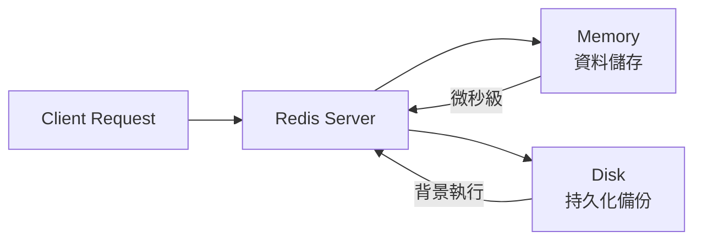

**記憶體存取 vs 磁碟存取效能比較**：

| 操作 | 記憶體 | SSD | HDD |
|------|--------|-----|-----|
| 隨機讀取 | ~100 ns | ~100 μs | ~10 ms |
| 效能差異 | 1x | 1000x | 100000x |

### 1.3 單執行緒模型與效能優勢

Redis 使用 **單執行緒事件迴圈（Event Loop）** 處理所有命令：

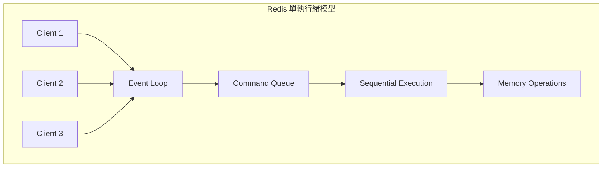

**為什麼單執行緒還能這麼快？**

1. **避免上下文切換**：無需執行緒切換開銷
2. **無鎖設計**：不需要處理並發鎖問題
3. **I/O 多工**：使用 epoll/kqueue 處理大量連線
4. **記憶體操作**：所有操作都在記憶體中完成

> ⚠️ **注意**：Redis 6.0+ 引入多執行緒 I/O，但命令執行仍是單執行緒

### 1.4 Redis 與 RDBMS / NoSQL 的差異

| 特性 | Redis | RDBMS (MySQL) | NoSQL (MongoDB) |
|------|-------|---------------|-----------------|
| 資料儲存 | 記憶體 | 磁碟 | 磁碟 |
| 資料結構 | 多種（String, Hash, List...） | 表格（Table） | 文件（Document） |
| 查詢語言 | 命令式 | SQL | 類 JSON 查詢 |
| 交易支援 | 有限（MULTI/EXEC） | 完整 ACID | 有限 |
| 持久化 | 可選（RDB/AOF） | 預設 | 預設 |
| 適用場景 | 快取、Session | 業務資料 | 彈性結構資料 |

### 1.5 常見使用場景與反模式（Anti-pattern）

#### ✅ 正確使用場景

```bash
# 1. 快取熱門商品資料
SET product:1001 '{"name":"iPhone","price":35000}' EX 3600

# 2. Session 管理
SET session:abc123 '{"userId":1,"role":"admin"}' EX 1800

# 3. 計數器
INCR page:views:homepage

# 4. 排行榜
ZADD leaderboard 1000 "player1" 950 "player2"
```

#### ❌ 反模式（Anti-pattern）

| 反模式 | 問題 | 建議 |
|--------|------|------|
| 把 Redis 當主資料庫 | 記憶體有限、資料可能遺失 | 僅作快取或輔助儲存 |
| 儲存大型物件（>1MB） | 阻塞其他操作、記憶體碎片 | 拆分或使用其他儲存 |
| 使用 KEYS * 命令 | 阻塞整個服務 | 使用 SCAN 命令 |
| 無 TTL 的快取 | 記憶體持續增長 | 務必設定過期時間 |
| Key 命名無規範 | 難以管理、可能衝突 | 使用命名空間如 `app:module:key` |

---

## 2. Redis 系統架構設計

### 2.1 Redis 架構總覽

根據系統規模與可用性需求，Redis 提供多種架構選擇：

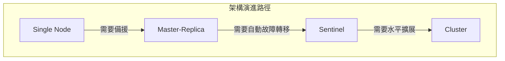

### 2.2 Single Node 架構

**適用場景**：開發環境、小型系統、可接受短暫停機

```text
┌─────────────────────────────────┐
│          Application            │
└─────────────┬───────────────────┘
              │
              ▼
┌─────────────────────────────────┐
│        Redis Server             │
│   ┌─────────────────────────┐   │
│   │      Memory Data        │   │
│   └─────────────────────────┘   │
│   ┌─────────────────────────┐   │
│   │    RDB/AOF (Disk)       │   │
│   └─────────────────────────┘   │
└─────────────────────────────────┘
```

**優點**：

- 架構簡單、易於維護
- 無網路延遲

**缺點**：

- 單點故障
- 容量受限於單機記憶體

### 2.3 Master / Replica（主從複寫）

**適用場景**：需要讀寫分離、資料備援

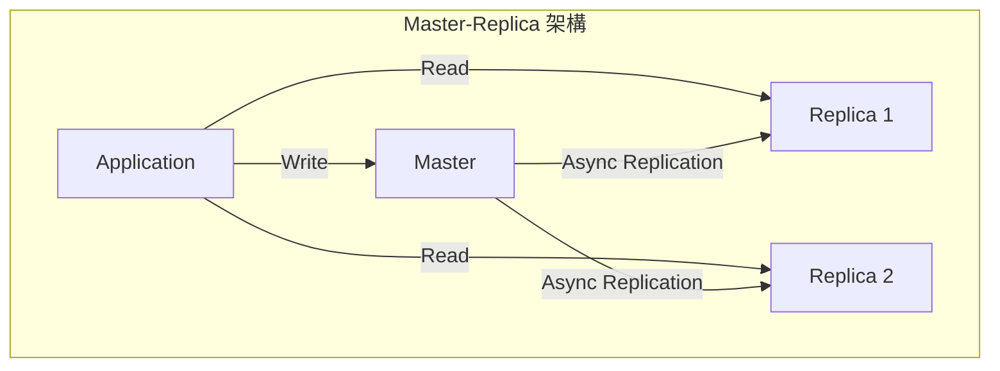

**設定範例**（Replica 端）：

```bash
# redis.conf on Replica
replicaof 192.168.1.100 6379
masterauth your_master_password
replica-read-only yes
```

**優點**：

- 讀取可水平擴展
- 資料有備份

**缺點**：

- 寫入仍是單點
- 故障需手動切換

### 2.4 Sentinel 高可用架構

**適用場景**：需要自動故障轉移的生產環境

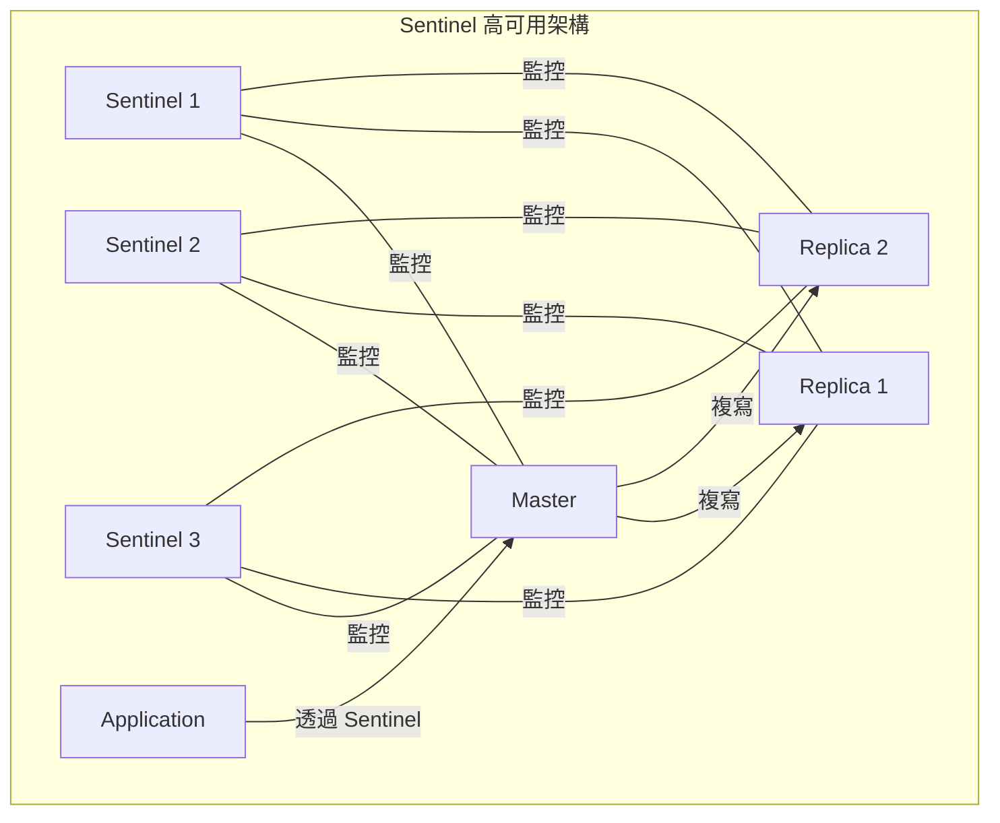

**Sentinel 設定範例**：

```bash
# sentinel.conf
sentinel monitor mymaster 192.168.1.100 6379 2
sentinel auth-pass mymaster your_password
sentinel down-after-milliseconds mymaster 30000
sentinel failover-timeout mymaster 180000
sentinel parallel-syncs mymaster 1
```

**Sentinel 數量建議**：

- 最少 3 個（奇數）
- 部署在不同主機/機房

### 2.5 Redis Cluster 架構（Sharding）

**適用場景**：大規模資料、需要水平擴展

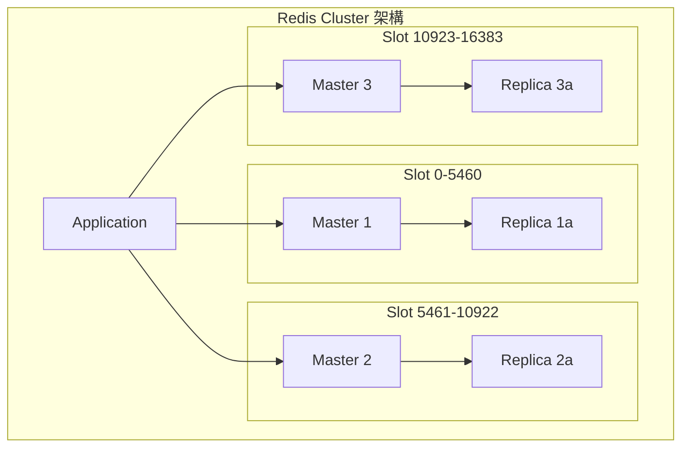

**Cluster 特性**：

- 16384 個 Hash Slot 分散到各節點
- 自動分片（Sharding）
- 內建故障轉移
- 最少需要 6 個節點（3 Master + 3 Replica）

**Hash Slot 計算**：

```bash
CLUSTER KEYSLOT mykey
# 結果：5798（該 key 會落在負責 5798 slot 的節點）
```

### 2.6 架構選型建議

| 情境 | 建議架構 | 理由 |
|------|---------|------|
| 開發/測試環境 | Single Node | 簡單、成本低 |
| 小型生產系統（<10GB） | Master-Replica + Sentinel | 平衡可用性與成本 |
| 中型生產系統（10-100GB） | Sentinel（多 Replica） | 讀取可擴展 |
| 大型系統（>100GB） | Redis Cluster | 水平擴展、自動分片 |
| 跨機房部署 | Cluster + 異地複寫 | 災難復原 |

#### 💡 決策流程圖

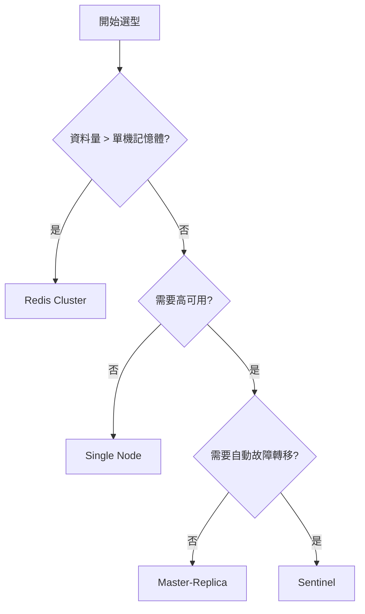

---

## 3. Redis 安裝與部署

### 3.1 Linux 安裝（建議版本）

**建議版本**：Redis 7.2.x（最新穩定版）

#### 方式一：從原始碼編譯

```bash
# 1. 安裝相依套件
sudo apt update
sudo apt install build-essential tcl

# 2. 下載並解壓縮
wget https://download.redis.io/redis-stable.tar.gz
tar xzf redis-stable.tar.gz
cd redis-stable

# 3. 編譯
make
make test  # 可選，執行測試

# 4. 安裝
sudo make install

# 5. 驗證安裝
redis-server --version
# Redis server v=7.2.4 sha=00000000:0 malloc=jemalloc-5.3.0 bits=64 build=...
```

#### 方式二：使用套件管理器（Ubuntu/Debian）

```bash
# 添加官方 Redis 儲存庫
curl -fsSL https://packages.redis.io/gpg | sudo gpg --dearmor -o /usr/share/keyrings/redis-archive-keyring.gpg

echo "deb [signed-by=/usr/share/keyrings/redis-archive-keyring.gpg] https://packages.redis.io/deb $(lsb_release -cs) main" | sudo tee /etc/apt/sources.list.d/redis.list

# 安裝
sudo apt update
sudo apt install redis

# 啟動服務
sudo systemctl start redis-server
sudo systemctl enable redis-server
```

### 3.2 Docker / Container 部署

#### 單節點部署

```bash
# 拉取映像
docker pull redis:7.2

# 啟動容器
docker run -d \
  --name redis \
  -p 6379:6379 \
  -v /data/redis:/data \
  -v /etc/redis/redis.conf:/usr/local/etc/redis/redis.conf \
  redis:7.2 redis-server /usr/local/etc/redis/redis.conf
```

#### Docker Compose 範例

```yaml
# docker-compose.yml
version: '3.8'

services:
  redis:
    image: redis:7.2
    container_name: redis
    ports:
      - "6379:6379"
    volumes:
      - redis-data:/data
      - ./redis.conf:/usr/local/etc/redis/redis.conf
    command: redis-server /usr/local/etc/redis/redis.conf
    restart: unless-stopped
    healthcheck:
      test: ["CMD", "redis-cli", "ping"]
      interval: 10s
      timeout: 5s
      retries: 3

volumes:
  redis-data:
```

#### Docker Compose - Sentinel 架構

```yaml
# docker-compose-sentinel.yml
version: '3.8'

services:
  redis-master:
    image: redis:7.2
    container_name: redis-master
    ports:
      - "6379:6379"
    command: redis-server --requirepass mypassword
    volumes:
      - redis-master-data:/data

  redis-replica-1:
    image: redis:7.2
    container_name: redis-replica-1
    ports:
      - "6380:6379"
    command: redis-server --replicaof redis-master 6379 --masterauth mypassword --requirepass mypassword
    depends_on:
      - redis-master

  redis-replica-2:
    image: redis:7.2
    container_name: redis-replica-2
    ports:
      - "6381:6379"
    command: redis-server --replicaof redis-master 6379 --masterauth mypassword --requirepass mypassword
    depends_on:
      - redis-master

  sentinel-1:
    image: redis:7.2
    container_name: sentinel-1
    ports:
      - "26379:26379"
    command: redis-sentinel /etc/redis/sentinel.conf
    volumes:
      - ./sentinel.conf:/etc/redis/sentinel.conf
    depends_on:
      - redis-master
      - redis-replica-1
      - redis-replica-2

volumes:
  redis-master-data:
```

### 3.3 基本目錄結構說明

```text
/etc/redis/
├── redis.conf          # 主要設定檔
├── sentinel.conf       # Sentinel 設定檔（如使用）
└── users.acl           # ACL 使用者設定

/var/lib/redis/
├── dump.rdb            # RDB 快照檔
└── appendonly.aof      # AOF 持久化檔

/var/log/redis/
└── redis-server.log    # 日誌檔

/var/run/redis/
└── redis-server.pid    # PID 檔
```

### 3.4 Redis CLI 工具介紹

#### 基本連線

```bash
# 本地連線
redis-cli

# 遠端連線
redis-cli -h 192.168.1.100 -p 6379

# 帶密碼連線
redis-cli -h 192.168.1.100 -p 6379 -a your_password

# 連線到特定資料庫
redis-cli -n 1
```

#### 常用命令

```bash
# 測試連線
127.0.0.1:6379> PING
PONG

# 查看伺服器資訊
127.0.0.1:6379> INFO

# 查看記憶體使用
127.0.0.1:6379> INFO memory

# 查看所有 Key（生產環境慎用）
127.0.0.1:6379> SCAN 0 MATCH "user:*" COUNT 100

# 監控即時命令
127.0.0.1:6379> MONITOR

# 查看慢查詢
127.0.0.1:6379> SLOWLOG GET 10

# 清空資料庫（危險！）
127.0.0.1:6379> FLUSHDB    # 清空當前 DB
127.0.0.1:6379> FLUSHALL   # 清空所有 DB
```

### 3.5 常見安裝錯誤與排查方式

| 錯誤訊息 | 可能原因 | 解決方式 |
|---------|---------|---------|
| `Could not connect to Redis` | 服務未啟動或防火牆阻擋 | 檢查服務狀態、開放 6379 port |
| `NOAUTH Authentication required` | 未提供密碼 | 使用 `-a password` 或 `AUTH` 命令 |
| `OOM command not allowed` | 記憶體不足 | 調整 `maxmemory` 或增加記憶體 |
| `MISCONF Redis is configured to save RDB snapshots` | RDB 儲存失敗 | 檢查磁碟空間、目錄權限 |
| `Can't open the log file` | 日誌目錄權限問題 | 修正目錄權限 `chown redis:redis /var/log/redis` |

#### 排查步驟

```bash
# 1. 檢查服務狀態
sudo systemctl status redis-server

# 2. 查看日誌
sudo tail -f /var/log/redis/redis-server.log

# 3. 檢查 Port 監聽
sudo netstat -tlnp | grep 6379

# 4. 測試連線
redis-cli ping

# 5. 檢查設定檔語法
redis-server /etc/redis/redis.conf --test-memory 256
```

---

## 4. Redis 設定（redis.conf）

### 4.1 基本設定說明

```bash
# 綁定 IP（安全性考量）
bind 127.0.0.1 192.168.1.100

# 監聽 Port
port 6379

# 背景執行
daemonize yes

# PID 檔案位置
pidfile /var/run/redis/redis-server.pid

# 日誌等級：debug, verbose, notice, warning
loglevel notice

# 日誌檔案
logfile /var/log/redis/redis-server.log

# 資料庫數量（預設 16 個，編號 0-15）
databases 16

# 工作目錄（RDB/AOF 儲存位置）
dir /var/lib/redis
```

### 4.2 記憶體管理

```bash
# 最大記憶體限制（建議設為實體記憶體的 70-80%）
maxmemory 4gb

# 記憶體淘汰策略
maxmemory-policy allkeys-lru
```

**淘汰策略說明**：

| 策略 | 說明 | 適用場景 |
|------|------|---------|
| `noeviction` | 不淘汰，寫入報錯 | 不可遺失資料 |
| `allkeys-lru` | 所有 Key 中淘汰最久未使用 | **快取首選** |
| `allkeys-lfu` | 所有 Key 中淘汰最少使用 | 熱點資料快取 |
| `volatile-lru` | 有 TTL 的 Key 中淘汰最久未使用 | 混合儲存 |
| `volatile-lfu` | 有 TTL 的 Key 中淘汰最少使用 | 混合儲存 |
| `volatile-ttl` | 淘汰 TTL 最短的 Key | TTL 敏感場景 |
| `allkeys-random` | 隨機淘汰 | 均勻存取 |
| `volatile-random` | 有 TTL 的 Key 中隨機淘汰 | 特殊場景 |

### 4.3 Persistence 設定（RDB / AOF）

#### RDB（快照）設定

```bash
# 儲存條件（滿足任一條件就儲存）
save 900 1      # 900 秒內有 1 次修改
save 300 10     # 300 秒內有 10 次修改
save 60 10000   # 60 秒內有 10000 次修改

# 停用 RDB
# save ""

# RDB 檔名
dbfilename dump.rdb

# 壓縮（建議開啟）
rdbcompression yes

# 校驗（建議開啟）
rdbchecksum yes
```

#### AOF（追加日誌）設定

```bash
# 啟用 AOF
appendonly yes

# AOF 檔名
appendfilename "appendonly.aof"

# 同步策略
# always: 每次寫入都同步（最安全，最慢）
# everysec: 每秒同步一次（建議）
# no: 由作業系統決定（最快，最不安全）
appendfsync everysec

# AOF 重寫設定
auto-aof-rewrite-percentage 100
auto-aof-rewrite-min-size 64mb

# 混合持久化（Redis 4.0+，建議開啟）
aof-use-rdb-preamble yes
```

#### 💡 持久化策略建議

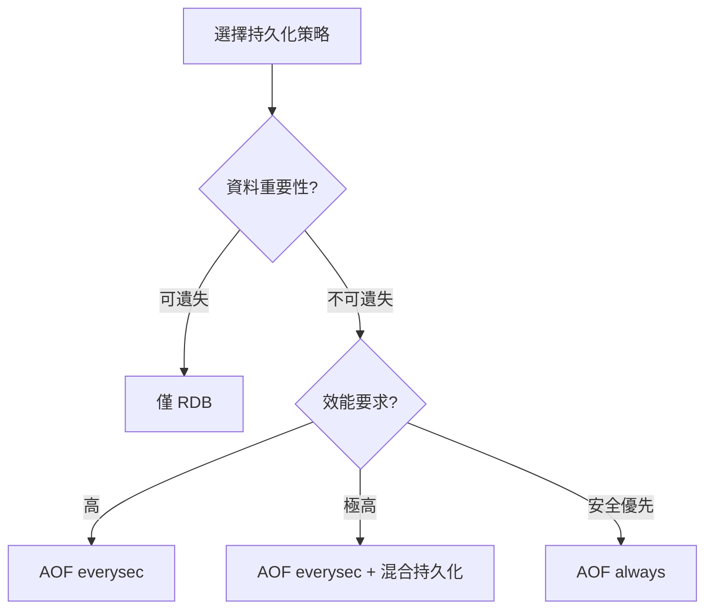

### 4.4 Replication 設定

**Master 端**（通常不需特別設定）：

```bash
# 設定密碼供 Replica 連線
requirepass your_master_password
masterauth your_master_password  # 如果 Master 也可能變成 Replica
```

**Replica 端**：

```bash
# 指定 Master
replicaof 192.168.1.100 6379

# Master 密碼
masterauth your_master_password

# Replica 唯讀（建議）
replica-read-only yes

# 複寫積壓緩衝區（支援部分重同步）
repl-backlog-size 64mb

# 複寫超時
repl-timeout 60
```

### 4.5 Cluster / Sentinel 設定重點

#### Cluster 設定

```bash
# 啟用 Cluster 模式
cluster-enabled yes

# Cluster 設定檔（自動維護）
cluster-config-file nodes.conf

# 節點超時時間
cluster-node-timeout 15000

# 至少需要多少 Replica 才允許 Master 失敗
cluster-replica-validity-factor 10

# 是否允許部分 Slot 不可用時繼續服務
cluster-require-full-coverage yes
```

#### Sentinel 設定

```bash
# 監控的 Master
sentinel monitor mymaster 192.168.1.100 6379 2

# Master 密碼
sentinel auth-pass mymaster your_password

# 判定主觀下線時間（毫秒）
sentinel down-after-milliseconds mymaster 30000

# 故障轉移超時
sentinel failover-timeout mymaster 180000

# 同時進行同步的 Replica 數量
sentinel parallel-syncs mymaster 1
```

### 4.6 資安相關設定

```bash
# 綁定特定 IP（不要使用 0.0.0.0）
bind 127.0.0.1 192.168.1.100

# 保護模式（建議開啟）
protected-mode yes

# 設定密碼
requirepass your_strong_password_here

# 停用危險命令
rename-command FLUSHDB ""
rename-command FLUSHALL ""
rename-command DEBUG ""
rename-command CONFIG "ADMIN_CONFIG"

# ACL（Redis 6.0+）- 詳見 ACL 章節
# aclfile /etc/redis/users.acl
```

#### ACL 設定範例

```bash
# 建立使用者
ACL SETUSER app_user on >app_password ~app:* +@read +@write -@dangerous

# 建立唯讀使用者
ACL SETUSER readonly_user on >readonly_password ~* +@read -@write

# 查看使用者列表
ACL LIST

# 儲存 ACL 設定
ACL SAVE
```

---

## 5. Redis 資料結構與使用方式

### 5.1 String（字串）

**說明**：最基本的資料型態，可儲存字串、數字、二進位資料（最大 512MB）

#### 使用情境

- 快取（JSON 物件序列化）
- 計數器
- 分散式鎖
- Session 資料

#### 常用指令

```bash
# 設定值
SET key value
SET key value EX 3600              # 設定並指定過期時間（秒）
SET key value PX 3600000           # 設定並指定過期時間（毫秒）
SET key value NX                   # 只在 Key 不存在時設定
SET key value XX                   # 只在 Key 存在時設定
SETNX key value                    # 等同 SET key value NX
SETEX key 3600 value               # 等同 SET key value EX 3600

# 取得值
GET key
MGET key1 key2 key3                # 批次取得

# 批次設定
MSET key1 value1 key2 value2

# 數值操作
INCR counter                       # +1
INCRBY counter 10                  # +10
INCRBYFLOAT counter 1.5            # +1.5
DECR counter                       # -1
DECRBY counter 10                  # -10

# 字串操作
APPEND key " appended"             # 追加
STRLEN key                         # 長度
GETRANGE key 0 4                   # 子字串
```

#### 實務範例

```bash
# 快取使用者資料
SET user:1001 '{"id":1001,"name":"John","email":"john@example.com"}' EX 3600

# 頁面瀏覽計數
INCR page:views:homepage

# 分散式鎖（簡易版）
SET lock:order:123 "owner_id" NX EX 30
# 成功回傳 OK，失敗回傳 nil
```

#### ❌ 不建議的使用方式

- 儲存超過 100KB 的大型物件
- 不設定 TTL 的快取資料
- 用 String 儲存結構化資料卻頻繁部分更新

---

### 5.2 Hash（雜湊）

**說明**：適合儲存物件，類似 Map/Dictionary 結構

#### 使用情境

- 使用者資料（部分欄位更新）
- 商品資訊
- 設定項目

#### 常用指令

```bash
# 設定欄位
HSET user:1001 name "John"
HSET user:1001 email "john@example.com" age 30

# 取得欄位
HGET user:1001 name
HMGET user:1001 name email
HGETALL user:1001

# 欄位操作
HDEL user:1001 age                 # 刪除欄位
HEXISTS user:1001 name             # 檢查欄位是否存在
HLEN user:1001                     # 欄位數量
HKEYS user:1001                    # 所有欄位名稱
HVALS user:1001                    # 所有欄位值

# 數值操作
HINCRBY user:1001 login_count 1
HINCRBYFLOAT user:1001 balance 10.5

# 掃描（大 Hash 時使用）
HSCAN user:1001 0 MATCH "name*" COUNT 10
```

#### 實務範例

```bash
# 儲存使用者資料
HSET user:1001 name "John" email "john@example.com" age 30 login_count 0

# 更新登入次數
HINCRBY user:1001 login_count 1

# 取得特定欄位
HMGET user:1001 name email
```

#### ❌ 不建議的使用方式
- 欄位數量過多（>1000）
- 單一欄位值過大
- 需要巢狀結構（Hash 不支援）

---

### 5.3 List（列表）

**說明**：雙向鏈結串列，適合佇列、堆疊操作

#### 使用情境
- 訊息佇列
- 最新動態（Timeline）
- 歷史記錄

#### 常用指令

```bash
# 新增元素
LPUSH mylist value1 value2         # 從左邊加入
RPUSH mylist value3 value4         # 從右邊加入

# 取出元素
LPOP mylist                        # 從左邊取出
RPOP mylist                        # 從右邊取出
BLPOP mylist 10                    # 阻塞式取出（等待 10 秒）
BRPOP mylist 10

# 查詢
LRANGE mylist 0 -1                 # 取得所有元素
LRANGE mylist 0 9                  # 取得前 10 個
LINDEX mylist 0                    # 取得指定位置元素
LLEN mylist                        # 長度

# 修剪
LTRIM mylist 0 99                  # 只保留前 100 個元素

# 移動（Redis 6.2+）
LMOVE source destination LEFT RIGHT
```

#### 實務範例

```bash
# 訊息佇列 - 生產者
RPUSH queue:orders '{"orderId":1001,"amount":500}'

# 訊息佇列 - 消費者
BLPOP queue:orders 30

# 最新動態（保留最新 100 則）
LPUSH timeline:user:1001 '{"type":"post","content":"Hello"}'
LTRIM timeline:user:1001 0 99
```

#### ❌ 不建議的使用方式
- 使用 LINDEX 隨機存取（O(n) 複雜度）
- 不限制長度的 List
- 需要優先級的佇列（應使用 Sorted Set）

---

### 5.4 Set（集合）

**說明**：無序、不重複的字串集合

#### 使用情境
- 標籤系統
- 共同好友
- 去重計數
- 抽獎系統

#### 常用指令

```bash
# 新增成員
SADD myset member1 member2 member3

# 移除成員
SREM myset member1

# 查詢
SMEMBERS myset                     # 所有成員
SISMEMBER myset member1            # 是否為成員
SCARD myset                        # 成員數量
SRANDMEMBER myset 3                # 隨機取 3 個（不移除）
SPOP myset 1                       # 隨機取出 1 個（移除）

# 集合運算
SINTER set1 set2                   # 交集
SUNION set1 set2                   # 聯集
SDIFF set1 set2                    # 差集

# 掃描
SSCAN myset 0 MATCH "member*" COUNT 10
```

#### 實務範例

```bash
# 使用者標籤
SADD user:1001:tags "vip" "active" "premium"

# 共同好友
SADD user:1001:friends "user:1002" "user:1003" "user:1004"
SADD user:1002:friends "user:1001" "user:1003" "user:1005"
SINTER user:1001:friends user:1002:friends
# 結果：user:1003

# 抽獎
SADD lottery:participants "user:1001" "user:1002" "user:1003"
SRANDMEMBER lottery:participants 1  # 抽出 1 位中獎者
```

#### ❌ 不建議的使用方式
- 儲存大量成員（>10000）時使用 SMEMBERS
- 需要排序的場景（應使用 Sorted Set）

---

### 5.5 Sorted Set（有序集合）

**說明**：帶分數的有序集合，按分數排序

#### 使用情境
- 排行榜
- 延遲佇列
- 時間軸
- 範圍查詢

#### 常用指令

```bash
# 新增成員
ZADD leaderboard 1000 "player1"
ZADD leaderboard 950 "player2" 900 "player3"

# 更新分數
ZINCRBY leaderboard 50 "player1"   # +50 分

# 查詢排名
ZRANK leaderboard "player1"        # 排名（從 0 開始，分數低到高）
ZREVRANK leaderboard "player1"     # 反向排名（分數高到低）
ZSCORE leaderboard "player1"       # 取得分數

# 範圍查詢
ZRANGE leaderboard 0 9             # 前 10 名（分數低到高）
ZREVRANGE leaderboard 0 9          # 前 10 名（分數高到低）
ZREVRANGE leaderboard 0 9 WITHSCORES  # 含分數

# 分數範圍查詢
ZRANGEBYSCORE leaderboard 900 1000
ZCOUNT leaderboard 900 1000        # 分數在 900-1000 的數量

# 移除
ZREM leaderboard "player1"
ZREMRANGEBYRANK leaderboard 0 -11  # 移除排名外的（保留前 10）
ZREMRANGEBYSCORE leaderboard -inf 500  # 移除分數 500 以下

# 集合運算
ZUNIONSTORE out 2 zset1 zset2 WEIGHTS 1 2
ZINTERSTORE out 2 zset1 zset2
```

#### 實務範例

```bash
# 排行榜
ZADD game:leaderboard 1000 "player1" 950 "player2" 900 "player3"
ZREVRANGE game:leaderboard 0 9 WITHSCORES  # Top 10

# 延遲佇列（分數 = 執行時間戳）
ZADD delay:queue 1706500000 '{"task":"send_email","to":"user@example.com"}'
# 取得到期任務
ZRANGEBYSCORE delay:queue -inf 1706499999

# 滑動視窗限流
# 記錄請求時間戳
ZADD rate:limit:user:1001 1706499990 "req1" 1706499991 "req2"
# 移除過期記錄
ZREMRANGEBYSCORE rate:limit:user:1001 -inf 1706499900
# 計算視窗內請求數
ZCARD rate:limit:user:1001
```

#### ❌ 不建議的使用方式
- 分數精度要求極高（浮點數精度問題）
- 成員數量過大時使用 ZRANGE 取全部

---

### 5.6 進階資料結構

#### Bitmap（點陣圖）

適用於大量布林值儲存，如：使用者簽到、線上狀態

```bash
# 設定位元
SETBIT user:1001:signin 0 1        # 第 0 天簽到
SETBIT user:1001:signin 1 1        # 第 1 天簽到
SETBIT user:1001:signin 2 0        # 第 2 天未簽到

# 取得位元
GETBIT user:1001:signin 1          # 回傳 1

# 統計
BITCOUNT user:1001:signin          # 總簽到天數

# 位元運算
BITOP AND result bitmap1 bitmap2
```

#### HyperLogLog

適用於大量不重複元素的近似計數（誤差約 0.81%）

```bash
# 新增元素
PFADD visitors "user1" "user2" "user3"

# 估算數量
PFCOUNT visitors

# 合併
PFMERGE result hll1 hll2
```

#### Stream（Redis 5.0+）

適用於訊息佇列，支援消費者群組

```bash
# 新增訊息
XADD mystream * field1 value1 field2 value2

# 讀取訊息
XREAD COUNT 10 STREAMS mystream 0

# 消費者群組
XGROUP CREATE mystream mygroup $ MKSTREAM
XREADGROUP GROUP mygroup consumer1 COUNT 10 STREAMS mystream >

# 確認處理完成
XACK mystream mygroup message_id
```

---

## 6. Redis 系統使用實戰

### 6.1 快取設計模式

#### Cache Aside（旁路快取）- 最常用

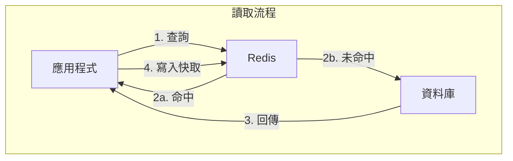

```java
// Java 範例（Spring Boot）
public User getUser(Long userId) {
    String key = "user:" + userId;
    
    // 1. 查詢快取
    String cached = redisTemplate.opsForValue().get(key);
    if (cached != null) {
        return objectMapper.readValue(cached, User.class);
    }
    
    // 2. 查詢資料庫
    User user = userRepository.findById(userId).orElse(null);
    if (user != null) {
        // 3. 寫入快取
        redisTemplate.opsForValue().set(key, objectMapper.writeValueAsString(user), 
            Duration.ofHours(1));
    }
    return user;
}
```

#### Write Through（寫入穿透）

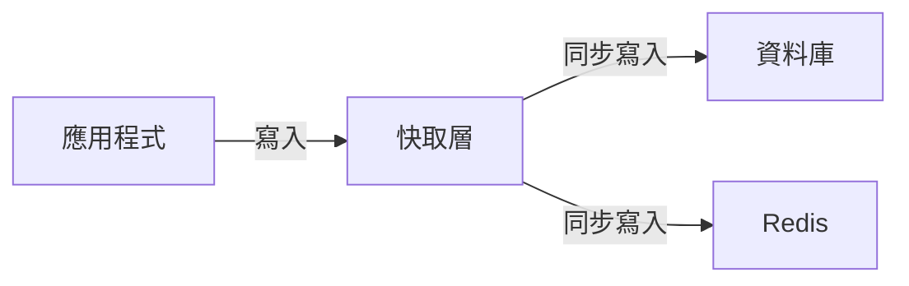

#### Write Back（延遲寫入）


### 6.2 TTL 與 Key 命名規範

#### Key 命名規範

```
格式：{業務}:{模組}:{實體}:{識別碼}

範例：
- user:profile:1001          # 使用者資料
- order:detail:ORD202401001  # 訂單詳情
- cache:product:list:page:1  # 商品列表第 1 頁
- session:abc123             # Session
- lock:order:create:1001     # 分散式鎖
```

#### TTL 設定建議

| 資料類型 | 建議 TTL | 說明 |
|---------|---------|------|
| Session | 30 分鐘 | 根據業務需求調整 |
| 使用者快取 | 1-24 小時 | 依更新頻率決定 |
| 商品列表 | 5-30 分鐘 | 熱門資料較短 |
| 設定快取 | 1-7 天 | 變動不頻繁 |
| 驗證碼 | 5-10 分鐘 | 安全考量 |

```bash
# 設定 TTL
SET key value EX 3600          # 1 小時
EXPIRE key 3600                # 對已存在的 Key 設定
EXPIREAT key 1706500000        # 指定 Unix 時間戳

# 查詢剩餘時間
TTL key                        # 秒
PTTL key                       # 毫秒

# 移除 TTL
PERSIST key
```

### 6.3 Session 管理

#### Spring Session + Redis 範例

```xml
<!-- pom.xml -->
<dependency>
    <groupId>org.springframework.session</groupId>
    <artifactId>spring-session-data-redis</artifactId>
</dependency>
```

```yaml
# application.yml
spring:
  session:
    store-type: redis
    timeout: 30m
  redis:
    host: localhost
    port: 6379
    password: your_password
```

```java
@Configuration
@EnableRedisHttpSession(maxInactiveIntervalInSeconds = 1800)
public class SessionConfig {
}
```

### 6.4 Rate Limiting（速率限制）

#### 固定視窗計數器

```bash
# Lua Script
local key = KEYS[1]
local limit = tonumber(ARGV[1])
local window = tonumber(ARGV[2])

local current = redis.call('GET', key)
if current and tonumber(current) >= limit then
    return 0
end

current = redis.call('INCR', key)
if tonumber(current) == 1 then
    redis.call('EXPIRE', key, window)
end
return 1
```

#### 滑動視窗（使用 Sorted Set）

```java
public boolean isAllowed(String userId, int limit, int windowSeconds) {
    String key = "rate:" + userId;
    long now = System.currentTimeMillis();
    long windowStart = now - (windowSeconds * 1000L);
    
    // 移除過期記錄
    redisTemplate.opsForZSet().removeRangeByScore(key, 0, windowStart);
    
    // 計算當前視窗請求數
    Long count = redisTemplate.opsForZSet().count(key, windowStart, now);
    
    if (count != null && count >= limit) {
        return false;
    }
    
    // 記錄本次請求
    redisTemplate.opsForZSet().add(key, UUID.randomUUID().toString(), now);
    redisTemplate.expire(key, Duration.ofSeconds(windowSeconds));
    
    return true;
}
```

### 6.5 分散式 Lock（RedLock 概念）

#### 單節點分散式鎖

```bash
# 獲取鎖
SET lock:resource:123 "owner_uuid" NX EX 30

# 釋放鎖（Lua Script 確保原子性）
if redis.call("GET", KEYS[1]) == ARGV[1] then
    return redis.call("DEL", KEYS[1])
else
    return 0
end
```

#### Spring Integration 範例

```java
@Service
public class DistributedLockService {
    
    @Autowired
    private StringRedisTemplate redisTemplate;
    
    public boolean tryLock(String key, String value, long expireSeconds) {
        Boolean result = redisTemplate.opsForValue()
            .setIfAbsent(key, value, Duration.ofSeconds(expireSeconds));
        return Boolean.TRUE.equals(result);
    }
    
    public boolean unlock(String key, String value) {
        String script = 
            "if redis.call('GET', KEYS[1]) == ARGV[1] then " +
            "    return redis.call('DEL', KEYS[1]) " +
            "else " +
            "    return 0 " +
            "end";
        
        Long result = redisTemplate.execute(
            new DefaultRedisScript<>(script, Long.class),
            Collections.singletonList(key),
            value
        );
        return Long.valueOf(1).equals(result);
    }
}
```

#### ⚠️ RedLock 注意事項

RedLock 需要在多個獨立的 Redis 節點上獲取鎖，在以下情況需謹慎使用：
- 時鐘不同步
- 網路分區
- 節點故障

> 💡 **建議**：對於關鍵業務鎖，考慮使用 ZooKeeper 或 etcd

### 6.6 Queue / Pub-Sub / Stream 使用情境

#### 簡易佇列（List）

```bash
# 生產者
RPUSH queue:tasks '{"taskId":1,"type":"email"}'

# 消費者（阻塞式）
BLPOP queue:tasks 30
```

#### Pub/Sub

```bash
# 訂閱者
SUBSCRIBE channel:notifications

# 發布者
PUBLISH channel:notifications '{"type":"alert","message":"System update"}'
```

> ⚠️ **注意**：Pub/Sub 不保證訊息持久化，訂閱者離線時會遺失訊息

#### Stream（推薦用於訊息佇列）

```bash
# 建立消費者群組
XGROUP CREATE orders:stream orders-group $ MKSTREAM

# 生產者
XADD orders:stream * orderId 1001 status pending

# 消費者
XREADGROUP GROUP orders-group consumer-1 COUNT 10 BLOCK 5000 STREAMS orders:stream >

# 確認處理完成
XACK orders:stream orders-group 1706500000000-0

# 查看待處理訊息
XPENDING orders:stream orders-group
```

---

## 7. 應用系統如何串接 Redis

### 7.1 系統整體架構說明

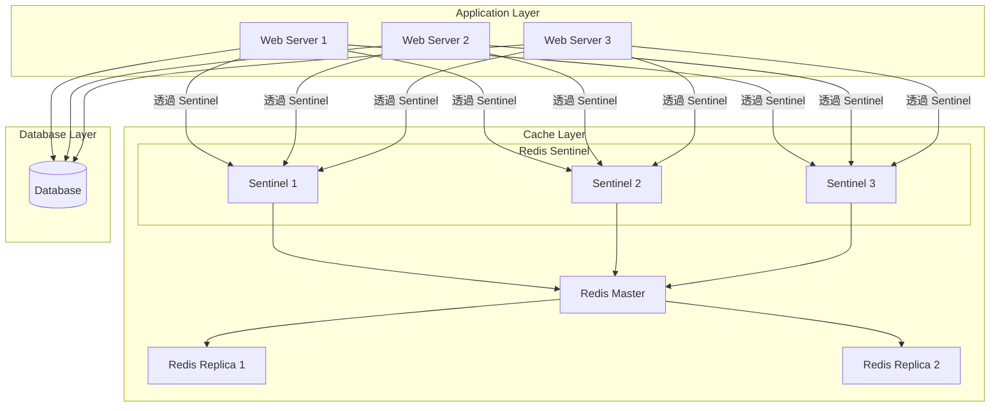

### 7.2 常見串接方式（Client Library）

| 語言 | 推薦 Client | 特點 |
|------|------------|------|
| Java | Lettuce / Jedis | Lettuce 支援非同步、Jedis 較簡單 |
| Node.js | ioredis | 功能完整、支援 Cluster |
| Python | redis-py | 官方推薦 |
| Go | go-redis | 高效能 |
| .NET | StackExchange.Redis | 微軟推薦 |

### 7.3 Java（Spring Boot + Redis）

#### Maven 依賴

```xml
<dependencies>
    <!-- Spring Data Redis -->
    <dependency>
        <groupId>org.springframework.boot</groupId>
        <artifactId>spring-boot-starter-data-redis</artifactId>
    </dependency>
    
    <!-- Connection Pool -->
    <dependency>
        <groupId>org.apache.commons</groupId>
        <artifactId>commons-pool2</artifactId>
    </dependency>
</dependencies>
```

#### 設定檔

```yaml
# application.yml
spring:
  redis:
    # 單節點
    host: localhost
    port: 6379
    password: your_password
    database: 0
    
    # Connection Pool
    lettuce:
      pool:
        max-active: 8
        max-idle: 8
        min-idle: 2
        max-wait: -1ms
      shutdown-timeout: 100ms
    
    # 超時設定
    timeout: 3000ms
    connect-timeout: 3000ms

---
# Sentinel 設定
spring:
  redis:
    sentinel:
      master: mymaster
      nodes:
        - 192.168.1.101:26379
        - 192.168.1.102:26379
        - 192.168.1.103:26379
    password: your_password

---
# Cluster 設定
spring:
  redis:
    cluster:
      nodes:
        - 192.168.1.101:6379
        - 192.168.1.102:6379
        - 192.168.1.103:6379
        - 192.168.1.104:6379
        - 192.168.1.105:6379
        - 192.168.1.106:6379
      max-redirects: 3
    password: your_password
```

#### Redis 設定類別

```java
@Configuration
public class RedisConfig {

    @Bean
    public RedisTemplate<String, Object> redisTemplate(RedisConnectionFactory factory) {
        RedisTemplate<String, Object> template = new RedisTemplate<>();
        template.setConnectionFactory(factory);
        
        // Key 序列化
        template.setKeySerializer(new StringRedisSerializer());
        template.setHashKeySerializer(new StringRedisSerializer());
        
        // Value 序列化（使用 JSON）
        Jackson2JsonRedisSerializer<Object> jsonSerializer = 
            new Jackson2JsonRedisSerializer<>(Object.class);
        
        ObjectMapper objectMapper = new ObjectMapper();
        objectMapper.setVisibility(PropertyAccessor.ALL, JsonAutoDetect.Visibility.ANY);
        objectMapper.activateDefaultTyping(
            LaissezFaireSubTypeValidator.instance,
            ObjectMapper.DefaultTyping.NON_FINAL
        );
        jsonSerializer.setObjectMapper(objectMapper);
        
        template.setValueSerializer(jsonSerializer);
        template.setHashValueSerializer(jsonSerializer);
        
        template.afterPropertiesSet();
        return template;
    }
    
    @Bean
    public StringRedisTemplate stringRedisTemplate(RedisConnectionFactory factory) {
        return new StringRedisTemplate(factory);
    }
}
```

#### 使用範例

```java
@Service
public class UserCacheService {

    @Autowired
    private RedisTemplate<String, Object> redisTemplate;
    
    @Autowired
    private StringRedisTemplate stringRedisTemplate;
    
    private static final String USER_KEY_PREFIX = "user:";
    private static final Duration DEFAULT_TTL = Duration.ofHours(1);
    
    // 儲存使用者
    public void saveUser(User user) {
        String key = USER_KEY_PREFIX + user.getId();
        redisTemplate.opsForValue().set(key, user, DEFAULT_TTL);
    }
    
    // 取得使用者
    public User getUser(Long userId) {
        String key = USER_KEY_PREFIX + userId;
        return (User) redisTemplate.opsForValue().get(key);
    }
    
    // 刪除使用者快取
    public void deleteUser(Long userId) {
        String key = USER_KEY_PREFIX + userId;
        redisTemplate.delete(key);
    }
    
    // 批次操作
    public List<User> getUsers(List<Long> userIds) {
        List<String> keys = userIds.stream()
            .map(id -> USER_KEY_PREFIX + id)
            .collect(Collectors.toList());
        
        List<Object> results = redisTemplate.opsForValue().multiGet(keys);
        return results.stream()
            .filter(Objects::nonNull)
            .map(obj -> (User) obj)
            .collect(Collectors.toList());
    }
    
    // 使用 Hash
    public void saveUserAsHash(User user) {
        String key = "user:hash:" + user.getId();
        Map<String, Object> map = new HashMap<>();
        map.put("name", user.getName());
        map.put("email", user.getEmail());
        map.put("age", String.valueOf(user.getAge()));
        
        redisTemplate.opsForHash().putAll(key, map);
        redisTemplate.expire(key, DEFAULT_TTL);
    }
}
```

#### 快取註解方式

```java
@Configuration
@EnableCaching
public class CacheConfig {

    @Bean
    public CacheManager cacheManager(RedisConnectionFactory factory) {
        RedisCacheConfiguration config = RedisCacheConfiguration.defaultCacheConfig()
            .entryTtl(Duration.ofHours(1))
            .serializeKeysWith(
                RedisSerializationContext.SerializationPair.fromSerializer(new StringRedisSerializer())
            )
            .serializeValuesWith(
                RedisSerializationContext.SerializationPair.fromSerializer(
                    new GenericJackson2JsonRedisSerializer()
                )
            )
            .disableCachingNullValues();
        
        return RedisCacheManager.builder(factory)
            .cacheDefaults(config)
            .build();
    }
}

@Service
public class ProductService {

    @Cacheable(value = "products", key = "#id")
    public Product getProduct(Long id) {
        // 查詢資料庫
        return productRepository.findById(id).orElse(null);
    }
    
    @CachePut(value = "products", key = "#product.id")
    public Product updateProduct(Product product) {
        return productRepository.save(product);
    }
    
    @CacheEvict(value = "products", key = "#id")
    public void deleteProduct(Long id) {
        productRepository.deleteById(id);
    }
    
    @CacheEvict(value = "products", allEntries = true)
    public void clearAllProductCache() {
        // 清除所有 products 快取
    }
}
```

### 7.4 Node.js / Python 串接概念

#### Node.js (ioredis)

```javascript
const Redis = require('ioredis');

// 單節點
const redis = new Redis({
  host: 'localhost',
  port: 6379,
  password: 'your_password',
  db: 0,
  retryDelayOnFailover: 100,
  maxRetriesPerRequest: 3
});

// Sentinel
const redis = new Redis({
  sentinels: [
    { host: '192.168.1.101', port: 26379 },
    { host: '192.168.1.102', port: 26379 },
    { host: '192.168.1.103', port: 26379 }
  ],
  name: 'mymaster',
  password: 'your_password'
});

// Cluster
const redis = new Redis.Cluster([
  { host: '192.168.1.101', port: 6379 },
  { host: '192.168.1.102', port: 6379 },
  { host: '192.168.1.103', port: 6379 }
], {
  redisOptions: { password: 'your_password' }
});

// 使用
await redis.set('key', 'value', 'EX', 3600);
const value = await redis.get('key');
```

#### Python (redis-py)

```python
import redis
from redis.sentinel import Sentinel

# 單節點
r = redis.Redis(
    host='localhost',
    port=6379,
    password='your_password',
    db=0,
    decode_responses=True
)

# Sentinel
sentinel = Sentinel([
    ('192.168.1.101', 26379),
    ('192.168.1.102', 26379),
    ('192.168.1.103', 26379)
], socket_timeout=0.5)

master = sentinel.master_for('mymaster', password='your_password')
slave = sentinel.slave_for('mymaster', password='your_password')

# Cluster
from redis.cluster import RedisCluster

rc = RedisCluster(
    host='192.168.1.101',
    port=6379,
    password='your_password'
)

# 使用
r.set('key', 'value', ex=3600)
value = r.get('key')
```

### 7.5 Connection Pool 設計

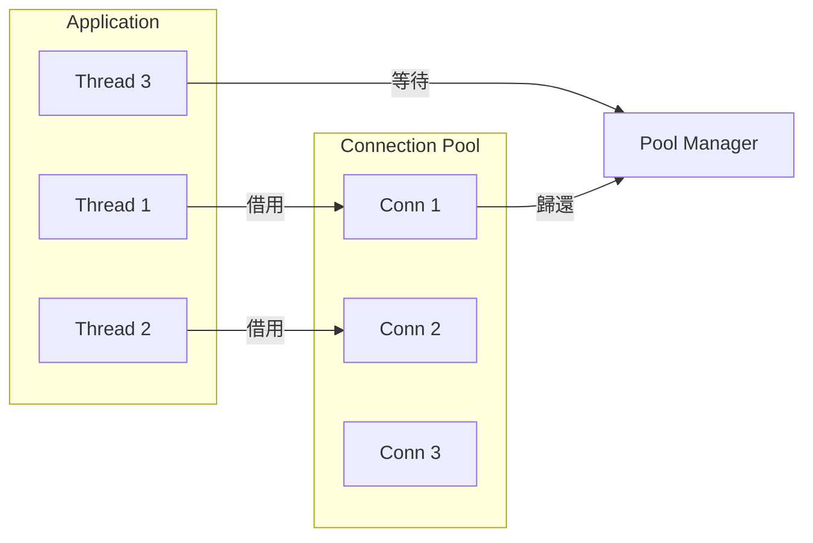

**連線池參數建議**：

| 參數 | 建議值 | 說明 |
|------|--------|------|
| max-active | 8-16 | 最大活動連線數 |
| max-idle | 8 | 最大閒置連線數 |
| min-idle | 2-4 | 最小閒置連線數 |
| max-wait | 3000ms | 獲取連線最大等待時間 |
| test-on-borrow | false | 借用時測試（影響效能） |
| test-while-idle | true | 閒置時測試 |

### 7.6 Timeout / Retry / Fallback 設計

```java
@Configuration
public class RedisResilienceConfig {

    @Bean
    public LettuceClientConfiguration lettuceClientConfiguration() {
        return LettuceClientConfiguration.builder()
            .commandTimeout(Duration.ofSeconds(3))       // 命令超時
            .shutdownTimeout(Duration.ofMillis(100))
            .clientOptions(ClientOptions.builder()
                .disconnectedBehavior(
                    ClientOptions.DisconnectedBehavior.REJECT_COMMANDS
                )
                .autoReconnect(true)
                .build())
            .build();
    }
}

@Service
public class ResilientCacheService {

    @Autowired
    private RedisTemplate<String, Object> redisTemplate;
    
    @Autowired
    private UserRepository userRepository;
    
    private static final int MAX_RETRIES = 3;
    
    public User getUserWithFallback(Long userId) {
        String key = "user:" + userId;
        
        // 嘗試從快取取得
        for (int i = 0; i < MAX_RETRIES; i++) {
            try {
                User cached = (User) redisTemplate.opsForValue().get(key);
                if (cached != null) {
                    return cached;
                }
                break; // 快取未命中，跳出重試
            } catch (Exception e) {
                log.warn("Redis 存取失敗，重試 {}/{}", i + 1, MAX_RETRIES, e);
                if (i == MAX_RETRIES - 1) {
                    log.error("Redis 不可用，改為直接查詢資料庫");
                }
            }
        }
        
        // Fallback: 直接查詢資料庫
        User user = userRepository.findById(userId).orElse(null);
        
        // 嘗試更新快取（非同步，不影響回應）
        if (user != null) {
            try {
                redisTemplate.opsForValue().set(key, user, Duration.ofHours(1));
            } catch (Exception e) {
                log.warn("更新快取失敗", e);
            }
        }
        
        return user;
    }
}
```

#### 使用 Resilience4j

```java
@Service
public class CircuitBreakerCacheService {

    private final CircuitBreaker circuitBreaker;
    private final RedisTemplate<String, Object> redisTemplate;
    
    public CircuitBreakerCacheService(RedisTemplate<String, Object> redisTemplate) {
        this.redisTemplate = redisTemplate;
        this.circuitBreaker = CircuitBreaker.ofDefaults("redis");
    }
    
    public Optional<User> getUser(Long userId) {
        return Try.ofSupplier(
            CircuitBreaker.decorateSupplier(circuitBreaker, () -> {
                String key = "user:" + userId;
                return Optional.ofNullable((User) redisTemplate.opsForValue().get(key));
            })
        ).recover(throwable -> {
            log.error("Redis Circuit Breaker 觸發", throwable);
            return Optional.empty();
        }).get();
    }
}
```

---

## 8. Redis 維運與監控

### 8.1 常用監控指標

| 類別 | 指標 | 說明 | 警示閾值 |
|------|------|------|---------|
| **記憶體** | used_memory | 已使用記憶體 | > 80% maxmemory |
| | used_memory_rss | 系統分配記憶體 | > used_memory * 1.5 |
| | mem_fragmentation_ratio | 記憶體碎片率 | > 1.5 或 < 1 |
| **效能** | instantaneous_ops_per_sec | QPS | 依業務定義 |
| | latency | 命令延遲 | > 10ms |
| **命中率** | keyspace_hits / (hits + misses) | 快取命中率 | < 90% |
| **連線** | connected_clients | 連線數 | > maxclients * 0.8 |
| | blocked_clients | 阻塞連線數 | > 0（需關注） |
| **複寫** | master_link_status | 主從連線狀態 | down |
| | master_last_io_seconds_ago | 複寫延遲 | > 10 秒 |
| **持久化** | rdb_last_bgsave_status | RDB 狀態 | err |
| | aof_last_write_status | AOF 狀態 | err |

### 8.2 INFO 指令說明

```bash
# 完整資訊
INFO

# 特定區塊
INFO server          # 伺服器資訊
INFO clients         # 用戶端資訊
INFO memory          # 記憶體資訊
INFO persistence     # 持久化資訊
INFO stats           # 統計資訊
INFO replication     # 複寫資訊
INFO cpu             # CPU 使用
INFO cluster         # Cluster 資訊
INFO keyspace        # 資料庫統計
```

**重要指標解讀**：

```bash
# 記憶體相關
used_memory:1073741824              # 已使用 1GB
used_memory_human:1.00G
used_memory_rss:1200000000          # 系統實際分配
mem_fragmentation_ratio:1.12        # 碎片率（1.0-1.5 正常）
maxmemory:4294967296                # 上限 4GB
maxmemory_policy:allkeys-lru        # 淘汰策略

# 效能相關
total_connections_received:10000    # 總連線數
total_commands_processed:5000000    # 總命令數
instantaneous_ops_per_sec:1234      # 當前 QPS

# 命中率
keyspace_hits:4500000
keyspace_misses:500000
# 命中率 = 4500000 / (4500000 + 500000) = 90%

# 複寫相關
role:master
connected_slaves:2
slave0:ip=192.168.1.101,port=6379,state=online,offset=1234567,lag=0
slave1:ip=192.168.1.102,port=6379,state=online,offset=1234567,lag=1
```

### 8.3 慢查詢（Slow Log）

```bash
# 設定慢查詢閾值（微秒）
CONFIG SET slowlog-log-slower-than 10000   # 10ms

# 設定慢查詢日誌長度
CONFIG SET slowlog-max-len 128

# 查看慢查詢
SLOWLOG GET 10

# 結果範例：
# 1) 1) (integer) 14                 # ID
#    2) (integer) 1706500000         # Unix 時間戳
#    3) (integer) 15000              # 執行時間（微秒）
#    4) 1) "KEYS"                    # 命令
#       2) "*"
#    5) "192.168.1.100:12345"        # 用戶端

# 清空慢查詢日誌
SLOWLOG RESET

# 查看慢查詢數量
SLOWLOG LEN
```

### 8.4 Key 分析與 Big Key 問題

#### 找出 Big Key

```bash
# 使用 redis-cli（推薦）
redis-cli --bigkeys

# 輸出範例：
# Biggest string found 'user:session:abc123' has 10240 bytes
# Biggest hash found 'config:settings' has 1000 fields
# Biggest list found 'queue:tasks' has 50000 members

# 使用 MEMORY USAGE（Redis 4.0+）
MEMORY USAGE key_name

# 掃描特定 pattern
redis-cli --scan --pattern "cache:*" | while read key; do
  size=$(redis-cli MEMORY USAGE "$key")
  echo "$key: $size bytes"
done
```

#### Big Key 處理方式

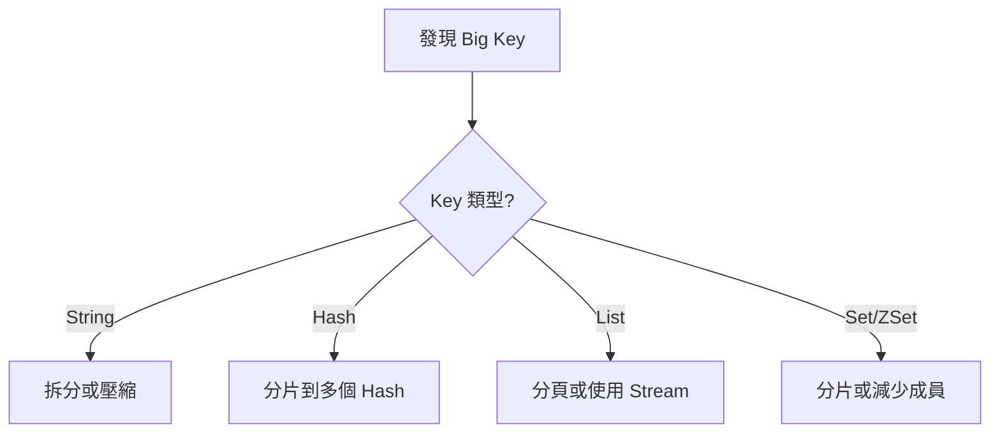

**處理範例**：

```bash
# 大 Hash 分片
# 原本：user:1001（含 10000 個欄位）
# 改為：user:1001:0, user:1001:1, ... user:1001:9（每個 1000 欄位）

# 大 List 分頁
# 原本：queue:tasks（100000 筆）
# 改為：queue:tasks:page:1, queue:tasks:page:2, ...
```

### 8.5 常見效能問題與處理方式

| 問題 | 症狀 | 原因 | 解決方式 |
|------|------|------|---------|
| **命令阻塞** | 延遲突然升高 | KEYS、SMEMBERS 等 O(n) 命令 | 使用 SCAN 系列命令 |
| **記憶體碎片** | used_memory_rss >> used_memory | 頻繁刪除/更新 | 重啟或使用 MEMORY PURGE |
| **連線數過多** | 連線被拒絕 | 連線池設定不當 | 調整 maxclients、優化連線池 |
| **RDB fork 慢** | 週期性延遲 | 記憶體大、Copy-on-Write | 使用 AOF、調整 save 頻率 |
| **網路瓶頸** | QPS 上不去 | 頻繁小請求 | Pipeline、批次操作 |
| **Big Key** | 單一操作延遲高 | Key 過大 | 拆分 Key |

#### Pipeline 優化範例

```java
// 批次操作優化
public void batchSet(Map<String, String> data) {
    redisTemplate.executePipelined((RedisCallback<Object>) connection -> {
        StringRedisConnection stringConn = (StringRedisConnection) connection;
        data.forEach((key, value) -> {
            stringConn.set(key, value);
        });
        return null;
    });
}
```

---

## 9. Redis 系統升級與版本管理

### 9.1 升級前評估事項

**檢查清單**：

- [ ] 確認當前版本與目標版本
- [ ] 閱讀 Release Notes，了解破壞性變更
- [ ] 檢查應用程式 Client Library 相容性
- [ ] 確認設定檔相容性
- [ ] 評估資料相容性（RDB/AOF 格式）
- [ ] 準備回滾計畫
- [ ] 安排維護視窗
- [ ] 通知相關團隊

**版本差異重點**：

| 版本 | 重要變更 |
|------|---------|
| 6.0 | ACL 支援、多執行緒 I/O |
| 6.2 | COPY 命令、GETDEL/GETEX |
| 7.0 | Function、多部分 AOF、Sharded Pub/Sub |
| 7.2 | 效能優化、Cluster 改進 |

### 9.2 Rolling Upgrade 策略

#### Sentinel 架構升級流程

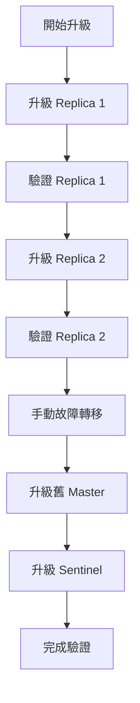

**步驟詳解**：

```bash
# 1. 升級 Replica（逐一進行）
sudo systemctl stop redis-server
# 備份資料與設定
cp /var/lib/redis/dump.rdb /backup/
cp /etc/redis/redis.conf /backup/

# 升級 Redis
sudo apt update && sudo apt upgrade redis-server

# 啟動並驗證
sudo systemctl start redis-server
redis-cli INFO server | grep redis_version

# 2. 確認複寫正常
redis-cli INFO replication
# 確認 master_link_status:up

# 3. 手動故障轉移（讓已升級的 Replica 成為 Master）
redis-cli -p 26379 SENTINEL failover mymaster

# 4. 升級舊 Master（現在是 Replica）
# 重複步驟 1

# 5. 升級所有 Sentinel
sudo systemctl stop redis-sentinel
sudo apt upgrade redis-sentinel
sudo systemctl start redis-sentinel
```

#### Cluster 架構升級流程

```bash
# 1. 逐一升級 Replica
# 對每個 Replica 執行：
redis-cli -h replica-host CLUSTER FAILOVER  # 先故障轉移
# 升級後重新加入 Cluster

# 2. 升級原 Master（現為 Replica）

# 3. 驗證 Cluster 狀態
redis-cli CLUSTER INFO
redis-cli CLUSTER NODES
```

### 9.3 升級風險與回滾策略

**風險評估**：

| 風險 | 機率 | 影響 | 緩解措施 |
|------|------|------|---------|
| 設定不相容 | 中 | 服務啟動失敗 | 預先測試、備份設定 |
| 資料格式不相容 | 低 | 資料無法載入 | 備份 RDB/AOF |
| Client 不相容 | 中 | 應用程式錯誤 | 預先驗證、灰度發布 |
| 效能下降 | 低 | 延遲增加 | 監控、準備回滾 |

**回滾步驟**：

```bash
# 1. 停止服務
sudo systemctl stop redis-server

# 2. 降級版本
sudo apt install redis-server=6.2.x  # 指定舊版本

# 3. 還原設定
cp /backup/redis.conf /etc/redis/

# 4. 還原資料（如需要）
cp /backup/dump.rdb /var/lib/redis/

# 5. 啟動服務
sudo systemctl start redis-server

# 6. 驗證
redis-cli INFO server
redis-cli PING
```

### 9.4 舊資料相容性說明

**RDB 相容性**：
- 向後相容（新版本可讀取舊版本 RDB）
- 不保證向前相容（舊版本可能無法讀取新版本 RDB）

**AOF 相容性**：
- 基本上相容
- Redis 7.0 引入多部分 AOF，舊版本無法讀取

**建議**：
```bash
# 升級前備份
redis-cli BGSAVE
cp /var/lib/redis/dump.rdb /backup/dump.rdb.$(date +%Y%m%d)

# 升級後驗證資料完整性
redis-cli DBSIZE
redis-cli INFO keyspace
```

### 9.5 版本差異注意事項

**Redis 6.x → 7.x 注意事項**：

1. **AOF 格式變更**
   ```bash
   # Redis 7.0 使用多部分 AOF
   # 設定項變更
   aof-use-rdb-preamble yes  # 建議開啟
   ```

2. **命令變更**
   - `DEBUG` 命令預設禁用
   - 新增 Function（替代 Lua Script）

3. **設定變更**
   ```bash
   # 部分設定重新命名
   # 舊：slave-* → 新：replica-*（6.0 已開始）
   ```

4. **Cluster 變更**
   - Sharded Pub/Sub
   - 改進的故障偵測

---

## 10. 資安與風險控管

### 10.1 Redis 常見資安風險

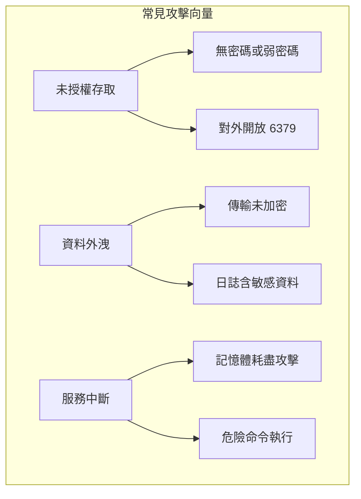

**歷史案例**：
- **Redis 未授權存取漏洞（CVE-2015-4335）**：攻擊者可寫入 SSH 公鑰獲取伺服器權限
- **遠端程式碼執行**：透過 CONFIG SET 修改 dbfilename 寫入惡意檔案

### 10.2 內網 / 外網使用原則

**原則**：
1. ❌ **永遠不要** 將 Redis 直接暴露在公網
2. ✅ 僅在內網使用，透過 VPN 或堡壘機存取
3. ✅ 使用防火牆限制來源 IP

**網路架構建議**：

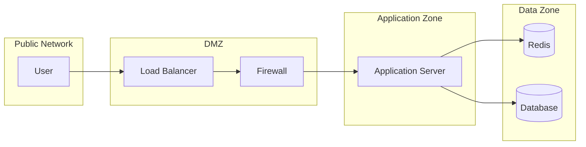

**防火牆設定範例**：

```bash
# 僅允許應用程式伺服器存取
iptables -A INPUT -p tcp --dport 6379 -s 192.168.1.0/24 -j ACCEPT
iptables -A INPUT -p tcp --dport 6379 -j DROP

# 或使用 Redis 設定
bind 192.168.1.100      # 僅綁定內網 IP
protected-mode yes      # 保護模式
```

### 10.3 ACL 與權限控管

**Redis 6.0+ ACL 完整範例**：

```bash
# 建立不同角色的使用者

# 1. 管理員（完整權限）
ACL SETUSER admin on >StrongAdminPass!123 ~* &* +@all

# 2. 應用程式使用者（限制危險命令）
ACL SETUSER app_user on >AppUserPass!456 ~app:* +@all -@dangerous -@admin -DEBUG -SHUTDOWN

# 3. 唯讀使用者
ACL SETUSER readonly_user on >ReadOnlyPass!789 ~* +@read -@write -@admin -@dangerous

# 4. 特定前綴使用者
ACL SETUSER order_service on >OrderPass!000 ~order:* ~cache:order:* +@read +@write +@connection -KEYS -FLUSHALL -FLUSHDB

# 查看使用者
ACL LIST
ACL WHOAMI

# 測試權限
ACL DRYRUN app_user SET app:key value    # OK
ACL DRYRUN app_user FLUSHALL             # ERR

# 儲存到設定檔
ACL SAVE
```

**ACL 設定檔（users.acl）**：

```
user default off
user admin on >StrongAdminPass!123 ~* &* +@all
user app_user on >AppUserPass!456 ~app:* +@all -@dangerous -@admin
user readonly_user on >ReadOnlyPass!789 ~* +@read
```

### 10.4 防止誤刪與資料風險

**危險命令防護**：

```bash
# redis.conf - 重新命名或停用危險命令
rename-command FLUSHDB ""                    # 完全停用
rename-command FLUSHALL ""
rename-command DEBUG ""
rename-command CONFIG "ADMIN_CONFIG_a1b2c3"  # 重新命名
rename-command KEYS "ADMIN_KEYS_x1y2z3"
rename-command SHUTDOWN "ADMIN_SHUTDOWN_p1q2r3"
```

**操作安全規範**：

```bash
# ❌ 危險操作
KEYS *                    # 阻塞服務
FLUSHALL                  # 清空所有資料
DEBUG SEGFAULT            # 觸發 crash

# ✅ 安全替代
SCAN 0 MATCH "*" COUNT 100   # 非阻塞掃描
# 使用 ACL 限制 FLUSHALL
# 禁用 DEBUG 命令
```

**備份策略**：

```bash
# 定期備份 RDB
0 */4 * * * /usr/bin/redis-cli BGSAVE && cp /var/lib/redis/dump.rdb /backup/dump.rdb.$(date +\%Y\%m\%d\%H\%M)

# 保留策略
find /backup -name "dump.rdb.*" -mtime +7 -delete
```

### 10.5 實務安全建議

**安全設定 Checklist**：

```bash
# redis.conf 安全設定範本

# 1. 網路安全
bind 192.168.1.100 127.0.0.1    # 限制綁定 IP
port 6379
protected-mode yes
timeout 300                      # 閒置超時

# 2. 認證授權
requirepass YourVeryStrongPassword!@#$%
aclfile /etc/redis/users.acl

# 3. 停用危險命令
rename-command FLUSHDB ""
rename-command FLUSHALL ""
rename-command DEBUG ""
rename-command CONFIG "ADMIN_CONFIG_secret"
rename-command KEYS "ADMIN_KEYS_secret"

# 4. 資源限制
maxclients 10000
maxmemory 4gb
maxmemory-policy allkeys-lru

# 5. 日誌
loglevel notice
logfile /var/log/redis/redis-server.log

# 6. TLS（Redis 6.0+）
tls-port 6380
tls-cert-file /etc/redis/tls/redis.crt
tls-key-file /etc/redis/tls/redis.key
tls-ca-cert-file /etc/redis/tls/ca.crt
tls-auth-clients yes
```

**TLS 設定（加密傳輸）**：

```bash
# 產生憑證（測試用）
openssl genrsa -out ca.key 4096
openssl req -x509 -new -nodes -sha256 -key ca.key -days 3650 -subj "/CN=Redis-CA" -out ca.crt

openssl genrsa -out redis.key 2048
openssl req -new -sha256 -key redis.key -subj "/CN=redis-server" -out redis.csr
openssl x509 -req -sha256 -in redis.csr -CA ca.crt -CAkey ca.key -CAcreateserial -days 365 -out redis.crt

# redis.conf
tls-port 6380
tls-cert-file /etc/redis/tls/redis.crt
tls-key-file /etc/redis/tls/redis.key
tls-ca-cert-file /etc/redis/tls/ca.crt
tls-auth-clients yes

# 連線（使用 TLS）
redis-cli --tls --cert ./redis.crt --key ./redis.key --cacert ./ca.crt -p 6380
```

---

## 11. Redis Best Practices（最佳實務）

### 11.1 Key 設計原則

**命名規範**：

```
格式：{業務}:{模組}:{實體}:{識別碼}

範例：
✅ user:profile:1001
✅ order:detail:ORD202401001
✅ cache:product:list:category:electronics:page:1
✅ session:web:abc123def456
✅ lock:order:create:1001

❌ user_profile_1001          # 不使用底線
❌ UserProfile:1001           # 不使用大寫
❌ 1001                       # 無意義的 Key
❌ cache:product:list:category:electronics:brand:apple:page:1:sort:price:order:asc  # 過長
```

**Key 長度建議**：
- 不超過 100 bytes
- 避免過短（無意義）或過長（浪費記憶體）

### 11.2 避免的設計地雷

| 地雷 | 問題 | 解決方式 |
|------|------|---------|
| 使用 `KEYS *` | O(n) 阻塞 | 使用 `SCAN` |
| Big Key（>10KB String, >1000 成員） | 阻塞、記憶體問題 | 拆分 |
| 無 TTL 快取 | 記憶體無限增長 | 設定合理 TTL |
| Hot Key | 單點瓶頸 | 本地快取 + 分散 |
| Key 碰撞 | 資料覆蓋 | 命名空間隔離 |
| 序列化大物件 | 效能差 | 使用 Hash 或拆分 |

**Hot Key 處理**：

```java
// 方案 1：本地快取
private LoadingCache<String, Object> localCache = CacheBuilder.newBuilder()
    .maximumSize(1000)
    .expireAfterWrite(10, TimeUnit.SECONDS)
    .build(new CacheLoader<String, Object>() {
        @Override
        public Object load(String key) {
            return redisTemplate.opsForValue().get(key);
        }
    });

// 方案 2：Key 分散
public String getHotData(String hotKey) {
    // 分散到多個 Key
    int shard = ThreadLocalRandom.current().nextInt(10);
    String shardedKey = hotKey + ":shard:" + shard;
    return redisTemplate.opsForValue().get(shardedKey);
}
```

### 11.3 高併發系統設計建議

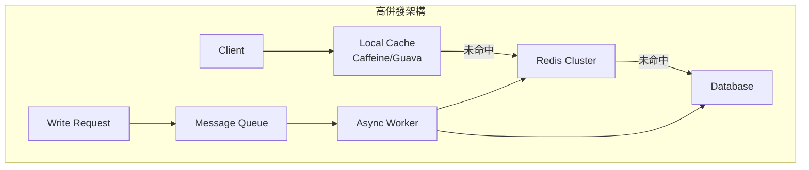

**設計原則**：

1. **多層快取**
   ```
   L1: 本地快取（毫秒級，容量小）
   L2: Redis（微秒級，容量中）
   L3: 資料庫（毫秒級，容量大）
   ```

2. **讀寫分離**
   ```java
   // 寫入走 Master
   @Qualifier("masterRedisTemplate")
   private RedisTemplate masterRedis;
   
   // 讀取走 Replica（可負載平衡）
   @Qualifier("replicaRedisTemplate")
   private RedisTemplate replicaRedis;
   ```

3. **異步更新**
   ```java
   // 更新資料庫後，透過 MQ 異步更新快取
   @TransactionalEventListener(phase = TransactionPhase.AFTER_COMMIT)
   public void onUserUpdated(UserUpdatedEvent event) {
       messageQueue.send("cache.invalidate", event.getUserId());
   }
   ```

4. **批次操作**
   ```java
   // Pipeline 批次讀取
   List<Object> results = redisTemplate.executePipelined((RedisCallback<Object>) conn -> {
       StringRedisConnection stringConn = (StringRedisConnection) conn;
       for (String key : keys) {
           stringConn.get(key);
       }
       return null;
   });
   ```

### 11.4 與資料庫搭配策略

**快取一致性策略**：

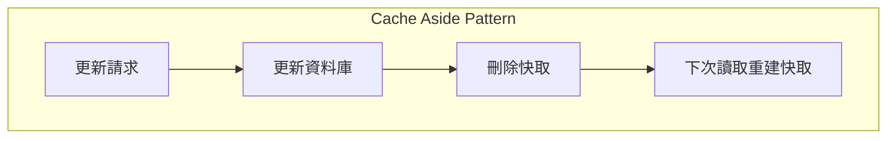

```java
@Service
@Transactional
public class UserService {
    
    @Autowired
    private UserRepository userRepository;
    
    @Autowired
    private RedisTemplate<String, Object> redisTemplate;
    
    // 更新使用者（Cache Aside）
    public User updateUser(User user) {
        // 1. 更新資料庫
        User updated = userRepository.save(user);
        
        // 2. 刪除快取（而非更新，避免並發問題）
        String key = "user:" + user.getId();
        redisTemplate.delete(key);
        
        return updated;
    }
    
    // 防止快取穿透（查詢不存在的資料）
    public User getUser(Long userId) {
        String key = "user:" + userId;
        Object cached = redisTemplate.opsForValue().get(key);
        
        // 快取空值標記
        if ("NULL".equals(cached)) {
            return null;
        }
        
        if (cached != null) {
            return (User) cached;
        }
        
        User user = userRepository.findById(userId).orElse(null);
        if (user != null) {
            redisTemplate.opsForValue().set(key, user, Duration.ofHours(1));
        } else {
            // 快取空值，較短 TTL
            redisTemplate.opsForValue().set(key, "NULL", Duration.ofMinutes(5));
        }
        return user;
    }
}
```

**快取雪崩防護**：

```java
// TTL 加上隨機偏移，避免同時過期
public void setWithRandomTtl(String key, Object value, Duration baseTtl) {
    // 基礎 TTL + 0~10% 隨機
    long randomOffset = (long) (baseTtl.toMillis() * Math.random() * 0.1);
    Duration ttl = baseTtl.plusMillis(randomOffset);
    redisTemplate.opsForValue().set(key, value, ttl);
}
```

### 11.5 團隊使用規範建議

**Redis 使用規範文件範本**：

```markdown
# Redis 使用規範 v1.0

## 1. Key 命名規範
- 格式：{業務}:{模組}:{實體}:{識別碼}
- 全小寫，使用冒號分隔
- 長度不超過 100 bytes

## 2. TTL 規範
- 所有快取 Key 必須設定 TTL
- Session：30 分鐘
- 使用者資料：1-24 小時
- 列表/搜尋結果：5-30 分鐘
- 設定資料：1-7 天

## 3. 資料大小限制
- String Value：< 10KB
- Hash/Set/ZSet/List 成員數：< 1000
- 單一成員大小：< 1KB

## 4. 禁止操作
- 禁止使用 KEYS 命令
- 禁止在業務代碼中使用 FLUSHDB/FLUSHALL
- 禁止儲存敏感資料（密碼、金鑰等）

## 5. 效能要求
- 單一命令執行時間 < 10ms
- Pipeline 批次操作 < 100 個命令
- 連線池正確使用，禁止頻繁建立連線

## 6. 監控告警
- 記憶體使用率 > 80% 告警
- 命中率 < 90% 告警
- 延遲 > 10ms 告警
```

---

## 12. 常見問題與除錯（FAQ / Troubleshooting）

### 12.1 Redis 掛掉怎麼辦

**診斷步驟**：

```bash
# 1. 檢查服務狀態
sudo systemctl status redis-server

# 2. 查看日誌
sudo tail -100 /var/log/redis/redis-server.log

# 3. 檢查系統資源
free -h                    # 記憶體
df -h                      # 磁碟空間
dmesg | tail -50           # 系統日誌（OOM Killer）

# 4. 檢查 Port
netstat -tlnp | grep 6379
```

**常見原因與解決**：

| 原因 | 日誌特徵 | 解決方式 |
|------|---------|---------|
| OOM Killer | `Out of memory: Kill process` | 增加記憶體、調整 maxmemory |
| RDB 儲存失敗 | `Can't save in background` | 檢查磁碟空間、調整 vm.overcommit_memory |
| AOF 損壞 | `Bad file format reading the append only file` | 使用 redis-check-aof 修復 |
| 設定錯誤 | `Fatal error loading the DB` | 檢查設定檔 |

**緊急恢復**：

```bash
# 從 RDB 恢復
sudo systemctl stop redis-server
cp /backup/dump.rdb /var/lib/redis/
sudo chown redis:redis /var/lib/redis/dump.rdb
sudo systemctl start redis-server

# 修復損壞的 AOF
redis-check-aof --fix /var/lib/redis/appendonly.aof
```

### 12.2 記憶體暴增如何處理

**診斷**：

```bash
# 查看記憶體使用
redis-cli INFO memory

# 重要指標
used_memory_human:2.00G        # 實際使用
used_memory_rss_human:2.50G    # 系統分配
mem_fragmentation_ratio:1.25   # 碎片率

# 分析 Key 分布
redis-cli --bigkeys

# 查看各資料庫 Key 數量
redis-cli INFO keyspace
```

**處理方式**：

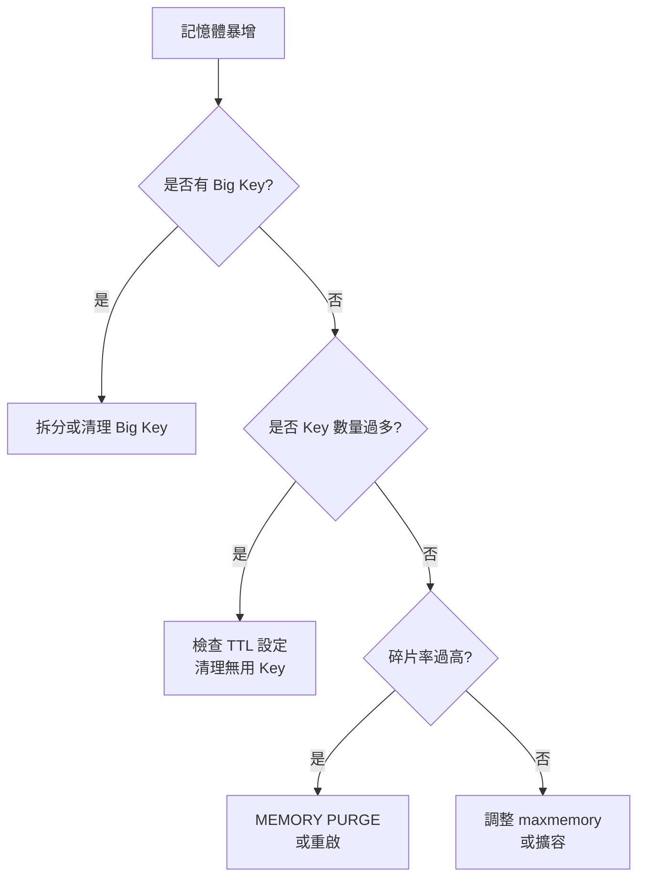

```bash
# 清理過期 Key（主動掃描）
redis-cli --scan --pattern "cache:*" | xargs -L 100 redis-cli DEL

# 整理記憶體碎片（Redis 4.0+）
redis-cli MEMORY PURGE

# 調整淘汰策略
redis-cli CONFIG SET maxmemory-policy allkeys-lru
redis-cli CONFIG SET maxmemory 4gb
```

### 12.3 Hit Rate 過低的原因

**診斷**：

```bash
# 計算命中率
redis-cli INFO stats | grep keyspace
# keyspace_hits:4500000
# keyspace_misses:500000
# Hit Rate = 4500000 / (4500000 + 500000) = 90%
```

**常見原因與解決**：

| 原因 | 檢查方式 | 解決方式 |
|------|---------|---------|
| TTL 過短 | 檢查 TTL 設定 | 延長 TTL |
| 快取未命中後未回填 | 檢查程式碼 | 確保 Cache Aside 正確實作 |
| 快取穿透 | 大量查詢不存在的 Key | 快取空值 |
| Key 命名錯誤 | 檢查 Key 生成邏輯 | 統一命名規則 |
| 資料更新頻繁 | 檢查更新頻率 | 調整快取策略 |

### 12.4 Replication 延遲處理

**監控複寫狀態**：

```bash
# Master 端
redis-cli INFO replication
# role:master
# connected_slaves:2
# slave0:ip=192.168.1.101,port=6379,state=online,offset=1234567,lag=0
# slave1:ip=192.168.1.102,port=6379,state=online,offset=1234560,lag=1

# Replica 端
redis-cli INFO replication
# role:slave
# master_link_status:up
# master_last_io_seconds_ago:0
# master_sync_in_progress:0
```

**延遲原因與解決**：

| 原因 | 症狀 | 解決方式 |
|------|------|---------|
| 網路問題 | lag 持續增加 | 檢查網路、增加頻寬 |
| 大 Key 同步 | 同步時延遲 | 避免 Big Key |
| Replica 負載高 | lag 波動 | 減少 Replica 讀取負載 |
| repl-backlog-size 不足 | 頻繁全量同步 | 增加 backlog size |

```bash
# 調整 backlog size
redis-cli CONFIG SET repl-backlog-size 128mb

# 檢查是否在全量同步
redis-cli INFO replication | grep master_sync_in_progress
```

### 12.5 實務案例分享

#### 案例 1：生產環境 Redis 突然變慢

**現象**：API 延遲從 50ms 上升到 500ms

**診斷過程**：
```bash
# 1. 檢查慢查詢
redis-cli SLOWLOG GET 10
# 發現大量 KEYS pattern* 命令

# 2. 追查來源
redis-cli CLIENT LIST
# 找到對應的 Client IP

# 3. 確認原因
# 開發人員在除錯時執行了 KEYS 命令
```

**解決**：
- 立即停止有問題的程式
- 設定 `rename-command KEYS ""`
- 建立 Redis 使用規範

---

#### 案例 2：快取雪崩導致資料庫過載

**現象**：資料庫 CPU 100%，大量超時

**原因**：大量快取同時過期

**解決**：
```java
// TTL 加上隨機偏移
public void setCache(String key, Object value) {
    Duration baseTtl = Duration.ofHours(1);
    long randomOffset = ThreadLocalRandom.current().nextLong(0, 600); // 0-10 分鐘
    redisTemplate.opsForValue().set(key, value, baseTtl.plusSeconds(randomOffset));
}

// 提前異步刷新
@Scheduled(fixedRate = 60000)
public void refreshHotCache() {
    // 刷新即將過期的熱點快取
}
```

---

#### 案例 3：記憶體碎片導致 OOM

**現象**：used_memory 只有 2GB，但 used_memory_rss 達到 4GB

**診斷**：
```bash
redis-cli INFO memory
# mem_fragmentation_ratio:2.0  # 碎片率過高
```

**解決**：
```bash
# 方案 1：在低峰期重啟
sudo systemctl restart redis-server

# 方案 2：使用 MEMORY PURGE（Redis 4.0+）
redis-cli MEMORY PURGE

# 方案 3：調整記憶體分配器
# redis.conf
# jemalloc 通常比 libc 更好
```

---

## 13. 檢查清單（Checklist）

### 🔧 部署前檢查

- [ ] 確認 Redis 版本（建議 7.x）
- [ ] 設定 `bind` 限制監聽 IP
- [ ] 設定 `requirepass` 密碼
- [ ] 設定 `maxmemory` 與淘汰策略
- [ ] 設定持久化（RDB + AOF）
- [ ] 停用危險命令（KEYS, FLUSHALL, DEBUG）
- [ ] 設定 ACL 使用者權限
- [ ] 配置防火牆規則
- [ ] 設定監控與告警

### 📝 開發規範檢查

- [ ] Key 命名符合規範（{業務}:{模組}:{實體}:{識別碼}）
- [ ] 所有快取設定 TTL
- [ ] 避免 Big Key（String < 10KB, 成員數 < 1000）
- [ ] 使用 Pipeline 批次操作
- [ ] 使用 SCAN 替代 KEYS
- [ ] 實作 Cache Aside Pattern
- [ ] 處理快取穿透（快取空值）
- [ ] 處理快取雪崩（TTL 隨機偏移）
- [ ] 正確使用連線池

### 🔍 日常維運檢查

- [ ] 記憶體使用率 < 80%
- [ ] 快取命中率 > 90%
- [ ] 無慢查詢（> 10ms）
- [ ] 複寫延遲 < 1 秒
- [ ] 無 Big Key
- [ ] RDB/AOF 正常
- [ ] 備份正常執行

### 🚀 升級前檢查

- [ ] 閱讀 Release Notes
- [ ] 備份資料（RDB）
- [ ] 備份設定檔
- [ ] 確認 Client Library 相容
- [ ] 準備回滾計畫
- [ ] 安排維護視窗
- [ ] 通知相關團隊

### 🛡️ 資安檢查

- [ ] 不對外開放 6379 Port
- [ ] 使用強密碼（> 16 字元）
- [ ] 啟用 ACL
- [ ] 停用 DEBUG 命令
- [ ] 定期更新版本
- [ ] 啟用 TLS（如需要）
- [ ] 日誌不含敏感資料

---

## 附錄：常用指令速查表

### 連線與認證
```bash
redis-cli -h host -p 6379 -a password
AUTH password
SELECT db_number
```

### 資料操作
```bash
# String
SET key value [EX seconds] [NX|XX]
GET key
MSET k1 v1 k2 v2
MGET k1 k2
INCR key
EXPIRE key seconds
TTL key

# Hash
HSET key field value
HGET key field
HMSET key f1 v1 f2 v2
HGETALL key
HDEL key field

# List
LPUSH key value
RPUSH key value
LPOP key
RPOP key
LRANGE key start stop
BLPOP key timeout

# Set
SADD key member
SREM key member
SMEMBERS key
SISMEMBER key member
SINTER key1 key2

# Sorted Set
ZADD key score member
ZRANGE key start stop [WITHSCORES]
ZREVRANGE key start stop [WITHSCORES]
ZSCORE key member
ZRANK key member
ZREM key member
```

### 管理命令
```bash
INFO [section]
DBSIZE
KEYS pattern        # 慎用！
SCAN cursor [MATCH pattern] [COUNT count]
SLOWLOG GET [count]
CLIENT LIST
CONFIG GET parameter
CONFIG SET parameter value
BGSAVE
BGREWRITEAOF
```

### Cluster 命令
```bash
CLUSTER INFO
CLUSTER NODES
CLUSTER SLOTS
CLUSTER KEYSLOT key
CLUSTER FAILOVER
```

### Sentinel 命令
```bash
SENTINEL masters
SENTINEL master mymaster
SENTINEL slaves mymaster
SENTINEL failover mymaster
SENTINEL get-master-addr-by-name mymaster
```

---

> 📚 **參考資源**
> - [Redis 官方文件](https://redis.io/documentation)
> - [Redis Commands](https://redis.io/commands)
> - [Redis Best Practices](https://redis.io/docs/manual/patterns/)


