+++
date = '2026-06-25T18:33:40+08:00'
draft = false
title = 'SonarQube教學手冊'
tags = ['教學', '工具','AI開發']
categories = ['教學']
+++
# SonarQube 教學手冊

> 企業級 AI Coding Quality / Reverse Engineering / Framework Upgrade Validation / Secure SDLC / DevSecOps / Code Governance / AI Native Governance 全方位實戰教學

---

## 📋 目錄 (Table of Contents)

### 第一部分：基礎概念與架構

1. [SonarQube 概論](#第1章-sonarqube-概論)
2. [SonarQube 版本比較](#第2章-sonarqube-版本比較)
3. [SonarQube 系統架構](#第3章-sonarqube-系統架構)

### 第二部分：安裝部署與設定

4. [安裝與部署](#第4章-安裝與部署)
5. [SonarQube 設定](#第5章-sonarqube-設定)
6. [SonarScanner](#第6章-sonarscanner)
7. [Quality Gate](#第7章-quality-gate)

### 第三部分：AI Coding 整合實戰

8. [AI Coding 與 SonarQube](#第8章-ai-coding-與-sonarqube)
9. [Claude Code 整合實戰](#第9章-claude-code-整合實戰)
10. [GitHub Copilot 整合實戰](#第10章-github-copilot-整合實戰)

### 第四部分：SonarQube 原生 AI 治理與進階安全

11. [SonarQube 原生 AI 治理](#第11章-sonarqube-原生-ai-治理)
12. [SonarQube Advanced Security](#第12章-sonarqube-advanced-security)

### 第五部分：Legacy 與升級治理

13. [Legacy System 逆向工程](#第13章-legacy-system-逆向工程)
14. [Framework Upgrade](#第14章-framework-upgrade)

### 第六部分：安全治理框架

15. [SSDLC](#第15章-ssdlc)
16. [DevSecOps](#第16章-devsecops)

### 第七部分：CI/CD 實戰整合

17. [GitHub Actions 整合](#第17章-github-actions-整合)
18. [GitLab CI/CD 整合](#第18章-gitlab-cicd-整合)
19. [Jenkins 整合](#第19章-jenkins-整合)

### 第八部分：API 與維運

20. [SonarQube API](#第20章-sonarqube-api)
21. [維運管理](#第21章-維運管理)
22. [升級策略](#第22章-升級策略)

### 第九部分：企業導入與案例

23. [企業導入最佳實務](#第23章-企業導入最佳實務)
24. [銀行級實戰案例](#第24章-銀行級實戰案例)

### 第十部分：FAQ、Prompt Library 與附錄

25. [常見問題 FAQ](#第25章-常見問題-faq)
26. [Prompt Library](#第26章-prompt-library)
27. [附錄](#第27章-附錄)

---

## 📖 文件說明

### 🎯 文件目標

本手冊將 SonarQube 定位為企業七大平台：

1. **AI Coding Quality Platform** — 守門 Claude Code / GitHub Copilot / Gemini CLI / OpenAI Codex 產出的程式碼品質與安全性
2. **Reverse Engineering Analysis Platform** — 協助理解 Legacy 系統的結構、依賴與風險
3. **Framework Upgrade Validation Platform** — 驗證 Spring Boot / Java / Vue 升級過程的技術債與風險
4. **Secure SDLC Platform** — 貫穿需求、設計、開發、測試、上線、維運的安全控制點
5. **DevSecOps Platform** — 整合 GitHub Actions / GitLab CI/CD / Jenkins 的 Security Gate
6. **Code Governance Platform** — 跨團隊、跨專案的程式碼治理與品質量化指標
7. **AI Native Governance Platform（新增）** — 透過 SonarQube 原生的 AI CodeFix、AI Code Assurance 與 SonarQube MCP Server，治理「AI Agent 自主寫程式碼」的 Agent Centric Development（AC/DC）時代下的品質與安全風險

### 👥 目標讀者

系統分析師（SA）、軟體架構師、Tech Lead、Backend / Frontend Developer、DevOps / DevSecOps Engineer、AppSec Engineer、SRE、AI Platform Engineer、AI Developer、Claude Code 使用者、GitHub Copilot 使用者。

### 🛠️ 技術背景

| 分類 | 技術 |
|---|---|
| Frontend | Vue 3、TypeScript、TailwindCSS |
| Backend | Java 21、Spring Boot 3.5+、Maven |
| Database | Oracle、PostgreSQL、SQL Server、DB2 |
| 版本控制 | GitHub、GitLab |
| CI/CD | GitHub Actions、GitLab CI/CD、Jenkins |
| AI 工具 | Claude Code、GitHub Copilot、Gemini CLI、OpenAI Codex |

### 📚 版本基準與品牌命名說明

SonarSource 在 2024～2026 年間數次調整產品品牌與版本制度，許多市面教材仍停留在舊名稱。本手冊以下列**現行**命名與制度為基準撰寫：

| 項目 | 現行名稱／制度 | 取代／調整對象 |
|---|---|---|
| 自管伺服器 | **SonarQube Server**（Developer / Enterprise / Data Center 三版） | 原泛稱「SonarQube」 |
| 免費自管版 | **SonarQube Community Build**（持續滾動發行，不採年度 LTA 版號） | 原「SonarQube Community Edition」 |
| SaaS 版本 | **SonarQube Cloud**（Free／Team／Enterprise 三方案，另有公開原始碼專屬 OSS 方案） | 原「SonarCloud」 |
| IDE 外掛 | **SonarQube for IDE**（VS Code／JetBrains／Eclipse／Visual Studio） | 原「SonarLint」（2024-10-29 正式改名，市場仍混用兩名） |
| 版本制度 | **年度日曆版號** `YYYY.Release.Patch`（如 2025.1 LTA、2025.4 LTA、2026.1 LTA、2026.2…），每年首發版本即為 **LTA（Long-Term Active）**，發布週期由 18 個月縮短為 12 個月 | 原連續版號（如 9.9、10.x）與 LTS 稱呼 |
| 嚴重度／分類體系 | 預設 **MQR（Multi-Quality Rule）Mode**：三大 Software Quality（Security／Reliability／Maintainability）＋四項 Clean Code Attribute，嚴重度為 **Blocker／High／Medium／Low／Info**；仍可切回舊制 **Standard Experience Mode**（Bug／Vulnerability／Code Smell，嚴重度 Blocker／Critical／Major／Minor／Info） | 原單一舊制敘述，詳見第1章 1.6 |
| 原生 AI 能力 | **AI CodeFix**、**AI Code Assurance**、**SonarQube MCP Server**（第11章專章） | 全新功能 |
| 進階安全模組 | **SonarQube Advanced Security**：原生 SCA／IaC 掃描／Secrets Detection／Container SBOM 分析（第12章專章） | 全新模組 |

> ⚠️ **注意事項**：本手冊涉及精確 Patch 版號、CI Action 版本號之處，採用「目前主版本為 X，請以官方頁面核對」的活引用寫法，避免文件再度迅速過時；各企業環境版本仍應以官方 Release Notes 核對細節差異。

### 🔖 使用方式

- 新進同仁：建議依序閱讀第 1～7 章建立基礎概念
- AI 開發者 / Tech Lead：閱讀第 8～12 章，涵蓋外部 AI 工具整合與 SonarQube 原生 AI 治理能力
- DevSecOps / AppSec：聚焦第 15～19 章，並參考第12章 Advanced Security
- 維運 / SRE：聚焦第 20～22 章
- 導入決策者：閱讀第 23～24 章
- 日常查詢：第 25～27 章（FAQ / Prompt Library / 附錄）

---

## 第1章 SonarQube 概論

### 🎯 學習目標

- 理解 SonarQube 在企業軟體開發生命週期與「Agent Centric Development」時代中的角色
- 區分 Code Quality 與 Code Security 的治理範疇
- 掌握 SAST / DAST / SCA 的差異與 SonarQube／SonarQube Advanced Security 的定位
- 掌握 Clean Code Taxonomy（MQR Mode）與傳統 Bug/Vulnerability/Code Smell 分類（Standard Mode）的對應關係
- 理解 SonarQube 與 OWASP Top 10、CWE、NIST SSDF 的對應關係

### 1.1 SonarQube 是什麼

SonarQube 是 SonarSource 旗下**程式碼品質與安全分析平台家族**的統稱，依部署型態分為三大產品：自管的 **SonarQube Server**、SaaS 的 **SonarQube Cloud**，以及免費、持續滾動發行的自管版 **SonarQube Community Build**；並透過 **SonarQube for IDE**（原 SonarLint）將檢查延伸至開發者本機編輯器。其核心能力是透過靜態分析（Static Analysis），在開發者撰寫程式碼的當下、甚至在程式碼進入版本庫之前，就找出：

- **Bug / Reliability 問題**（可能造成執行期錯誤的程式碼）
- **Vulnerability / Security 問題**（可被利用的安全漏洞，如 SQL Injection、XSS）
- **Security Hotspot**（需要人工確認是否安全的敏感程式碼，如加密演算法選用）
- **Code Smell / Maintainability 問題**（影響可維護性但不一定造成錯誤的程式碼，如重複邏輯、過長函式）

自 SonarQube 10.x 起，官方導入 **Clean Code Taxonomy**，將上述四類問題收斂為三大 **Software Quality**（Security／Reliability／Maintainability）與四項 **Clean Code Attribute**（Consistent／Intentional／Adaptable／Responsible）構成的二維模型，並以新的 **MQR（Multi-Quality Rule）Mode** 呈現分析結果（詳見 1.6）。

SonarQube 並非取代 Code Review，而是把「機械可判斷」的問題自動化攔截，讓 Reviewer 把時間留給「需要人類判斷」的設計與商業邏輯討論——在 AI Agent（Claude Code、GitHub Copilot 等）大量自動產出程式碼的時代，這個角色被官方進一步擴展為 **Agent Centric Development Cycle（AC/DC，第11章）** 中「Verify／Solve」階段的核心工具。

### 1.2 為什麼企業需要 SonarQube

| 痛點 | 沒有 SonarQube | 有 SonarQube |
|---|---|---|
| Code Review 品質不一 | 依賴 Reviewer 經驗，標準不一致 | 統一 Quality Profile，規則一致套用全公司 |
| 技術債看不見 | 技術債累積到無法估算 | Technical Debt Ratio 量化，可追蹤趨勢 |
| 安全漏洞晚期才發現 | 上線後被 Pentest / 紅隊抓到 | Commit 階段即攔截 SQL Injection、Hardcoded Secret |
| AI 產生程式碼品質不可控 | Copilot / Claude Code 產出未經把關 | Quality Gate 強制檢核，AI 產出與人工程式碼一視同仁 |
| AI Agent 自主產出規模暴增 | 人力 Review 速度跟不上 Agent 提交速度 | AI Code Assurance + 專屬 Quality Gate 強制驗證每次 Agent 提交（第11章） |
| Legacy 系統不敢動 | 沒人知道改了會壞什麼 | 依賴分析、複雜度分析降低改動風險 |
| 多專案治理困難 | 各專案各自為政 | Portfolio / Application 跨專案儀表板 |

### 1.3 SonarQube 解決的核心問題

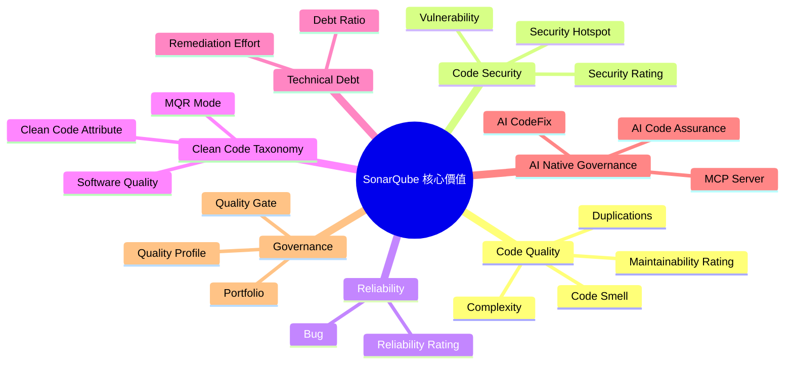

#### 1.3.1 Maintainability（可維護性）

以 **Code Smell** 數量與修復所需工時換算成 **Technical Debt Ratio**：

```
Technical Debt Ratio = 修復所有 Code Smell 所需時間 / 重新開發整個程式碼庫所需時間 × 100%
```

對應 **Maintainability Rating**（A～E）：A（≤5%）、B（5～10%）、C（10～20%）、D（20～50%）、E（>50%）。

#### 1.3.2 Reliability（可靠性）

以 Bug 數量與嚴重程度換算 **Reliability Rating**：只要存在一個 Blocker Bug 即降為 E 級，強制團隊優先修復。

#### 1.3.3 Security（安全性）

以 Vulnerability 數量換算 **Security Rating**，並透過 **Security Hotspot Review** 流程，要求安全敏感程式碼（如硬編碼密碼、弱加密演算法、SQL 拼接）必須有人工複核紀錄，符合稽核要求。

> 💡 **實務案例**：某金融集團導入 SonarQube 後，將 Security Rating 納入 Release Checklist 強制項目，半年內生產環境因程式碼層級漏洞（非設定錯誤）導致的資安事件數降為 0。

### 1.4 SAST、DAST、SCA 差異比較

| 比較項目 | SAST（Static） | DAST（Dynamic） | SCA（Software Composition） |
|---|---|---|---|
| 分析對象 | 原始碼 / Bytecode | 執行中的應用程式 | 第三方套件 / 相依套件 |
| 執行時機 | 開發階段、CI 階段 | 測試 / Staging 階段 | 任何階段，越早越好 |
| 找到的問題 | SQL Injection、XSS 程式碼層級成因 | 實際可被攻擊驗證的漏洞 | CVE、惡意套件、授權風險、過期版本 |
| 代表工具 | **SonarQube**、Checkmarx、Fortify | OWASP ZAP、Burp Suite | **SonarQube Advanced Security**（原生 SCA，第12章）、Snyk、Dependabot |
| 優點 | 左移（Shift Left）、可在 Commit 階段攔截 | 驗證真實可利用性，少誤判 | 涵蓋供應鏈風險 |
| 限制 | 可能有誤判（False Positive） | 需要可執行環境，較晚才能跑 | 不分析自有程式碼邏輯 |

SonarQube 的核心定位是 **SAST**。2025 年起官方推出獨立付費模組 **SonarQube Advanced Security**，將 SCA、IaC 掃描、Secrets Detection、Container/SBOM 分析整合進同一治理介面，取代過去「另外串接外部 SCA 工具」的做法，建立涵蓋原始碼到供應鏈的完整防線（細節見第12章）。

### 1.5 與 OWASP Top 10 / CWE / NIST SSDF 的關聯

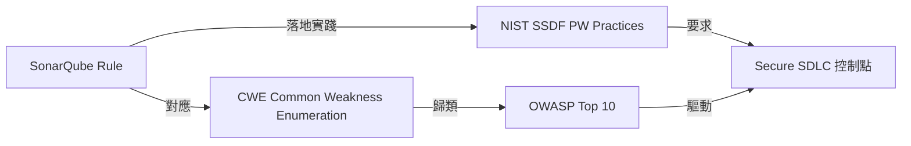

- **OWASP Top 10**：SonarQube 的安全規則集（Security Rule Set）明確標註對應的 OWASP Top 10 分類（如 A03:2021-Injection），方便資安團隊用業界通用語言溝通風險。
- **CWE（Common Weakness Enumeration）**：每條 SonarQube 安全規則背後都對應至少一個 CWE 編號（如 CWE-89 SQL Injection），可作為弱點分類的最小單位，方便與其他工具（DAST、Pentest 報告）比對去重。
- **NIST SSDF（Secure Software Development Framework, SP 800-218）**：強調「在開發流程中內建安全控制點」（Practice PW: Produce Well-Secured Software），SonarQube 的 Quality Gate 正是落地 PW.7（Review and/or Analyze Human-Readable Code)、PW.8（Test Executable Code) 的具體工具。

> ⚠️ **注意事項**：SonarQube 的安全規則覆蓋是「程式碼層級成因」，無法取代 DAST 與 Pentest 對「執行期可利用性」的驗證；企業應採用 SAST + DAST + SCA + Pentest 的縱深防禦（Defense in Depth）策略，而非僅依賴單一工具。

### 1.6 Clean Code Taxonomy：MQR Mode 與 Standard Experience Mode 對照

SonarQube 自 10.x 起導入 **Clean Code Taxonomy**，企業在升級或新導入時會在兩種分析模式間做選擇：

| 比較項目 | **MQR Mode**（新制，現行預設） | **Standard Experience Mode**（舊制，相容保留） |
|---|---|---|
| 問題分類 | 不再分 Bug／Vulnerability／Code Smell，統一為 Issue，依其影響的 Software Quality（Security／Reliability／Maintainability）分別計分 | Bug／Vulnerability／Code Smell 三分類 |
| 嚴重度 | **Blocker／High／Medium／Low／Info**（每個 Software Quality 各自獨立評級） | Blocker／Critical／Major／Minor／Info |
| Clean Code Attribute | Consistent／Intentional／Adaptable／Responsible 四項，描述「這為什麼是個問題」 | 無對應概念 |
| Rating 計算方式 | 依每個 Software Quality 各自的最高嚴重度換算 A～E | 依 Bug／Vulnerability 各自最高嚴重度換算 A～E |
| 切換位置 | Administration > General Settings > Mode（Server／Cloud 皆可整個 Instance 切換） | 同上，可隨時切回舊制 |
| 適用建議 | 新導入企業、重視與官方最新教材／Rules Explorer 用語一致者 | 已有大量客製化舊嚴重度規則、稽核報表綁定舊分類者，可作為過渡 |

> ⚠️ **注意事項**：切換 Mode 會影響既有 Quality Gate 條件所使用的 metric（如新程式碼違規計算基準），企業若已有大量自訂 Quality Gate／報表，建議先在測試環境驗證切換後數值是否符合預期，避免直接在生產環境切換造成 Quality Gate 結果劇烈跳動。
>
> 💡 **實務案例**：新導入企業建議直接採用 MQR Mode 作為標準，避免日後二次遷移；已長期使用 SonarQube 的企業若稽核報表大量綁定 Standard Mode 舊術語（如 Critical/Major），可先維持 Standard Mode，待內部報表改版後再規劃切換時程，並將切換規劃為正式變更管理項目而非臨時決定。

---

## 第2章 SonarQube 版本比較

### 🎯 學習目標

- 了解 SonarQube Community Build／SonarQube Server（Developer/Enterprise/Data Center）／SonarQube Cloud（Free/Team/Enterprise）的現行命名與差異
- 理解年度日曆版號與 LTA（Long-Term Active）制度
- 依企業規模、合規要求、團隊規模做出正確選型，並判斷是否需要加購 Advanced Security／AI CodeFix

### 2.1 產品家族總覽

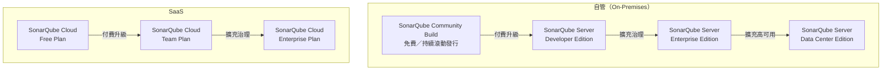

### 2.2 命名與制度變更摘要

近兩年 SonarSource 多次調整品牌與版本制度，企業導入前務必先確認對齊現行用語，避免採購或文件對錯版本：

| 舊名稱／舊制度 | 現行名稱／制度 | 變更說明 |
|---|---|---|
| SonarQube Community Edition | **SonarQube Community Build** | 持續滾動發行，不採年度 LTA 版號，定位為免費自管入門選項 |
| SonarLint | **SonarQube for IDE** | 2024-10-29 正式改名，市場仍混用兩名 |
| SonarCloud | **SonarQube Cloud** | 品牌統一為 SonarQube 家族 |
| LTS（Long-Term Support，每 18 個月一版） | **LTA（Long-Term Active，每 12 個月一版）** | 自 2025.1 起生效，每年首發版本即為 LTA |
| 連續版號（如 9.9、10.6） | **年度日曆版號** `YYYY.Release.Patch`（如 2025.1、2025.4、2026.1、2026.2） | 自 2025 起生效 |

### 2.3 SonarQube Server 完整功能比較表

| 功能 | Community Build | Developer Edition | Enterprise Edition | Data Center Edition |
|---|---|---|---|---|
| 版號制度 | 持續滾動發行，無 LTA 版號 | 年度 LTA + 年中 Release | 年度 LTA + 年中 Release | 年度 LTA + 年中 Release |
| 支援語言數量 | 約 20+ 主流語言 | 同左 + 更多商業語言 | 全語言（含 COBOL／PL/I／RPG／VB6 等大型主機語言） | 全語言 |
| Branch Analysis | ❌（僅 main） | ✅ | ✅ | ✅ |
| Pull/Merge Request Analysis | ❌ | ✅ | ✅ | ✅ |
| Security Analysis（Taint Analysis） | 基礎規則 | 進階 | 進階 + 自訂安全規則 | 進階 |
| AI CodeFix | ❌ | ❌ | ✅ | ✅ |
| AI Code Assurance | ❌ | ❌ | ✅ | ✅ |
| Advanced Security（SCA/IaC/Secrets/Container，第12章） | ❌ | 部分功能可加購 | ✅（可加購） | ✅（可加購） |
| Portfolio / 跨專案治理 | ❌ | ❌ | ✅ | ✅ |
| Application（多模組彙總） | ❌ | ❌ | ✅ | ✅ |
| 高可用 / Cluster（HA） | ❌ | ❌ | ❌ | ✅ |
| OIDC / SAML SSO | ❌（基礎 LDAP） | ✅ | ✅ | ✅ |
| 部署模式 | Self-host | Self-host | Self-host | Self-host（Cluster） |
| 適合對象 | 個人／小型團隊／PoC | 中型開發團隊 | 中大型企業 | 超大型／高可用需求企業 |

### 2.4 SonarQube Cloud 方案比較表

| 方案 | LOC 額度 | 使用者數 | AI CodeFix | 適合對象 |
|---|---|---|---|---|
| Free | 最多 50K LOC | 最多 5 人 | ❌ | 個人／小型專案試用 |
| Team | 100K～1.9M LOC（依用量計費） | 無限制 | ✅ | 中型團隊，含 Secrets Detection、30+ 語言 |
| Enterprise | 5M LOC 起（年約計費） | 無限制 | ✅ | 大型企業，加 SLA、SSO、Portfolio、Audit Log、IP Allowlist、企業專屬語言、導入協助 |
| OSS（公開原始碼專屬） | 不限（僅限公開倉庫） | 無限制 | ✅ | 開源專案免費使用，不可用於私有專案 |

### 2.5 企業選型建議

| 情境 | 建議方案 | 理由 |
|---|---|---|
| 10 人以下新創、單一專案、先驗證流程價值 | SonarQube Community Build 或 SonarQube Cloud Free | 成本最低 |
| 中型團隊、需要 PR/MR 把關 | SonarQube Server Developer Edition 或 SonarQube Cloud Team | PR Analysis 是品質左移關鍵功能；Cloud Team 可直接取得 AI CodeFix |
| 多事業群、需跨專案儀表板、合規稽核 | SonarQube Server Enterprise Edition 或 SonarQube Cloud Enterprise | Portfolio + 進階治理是稽核必備 |
| 銀行／政府、要求地端部署 + 不可單點故障 | SonarQube Server Data Center Edition | HA Cluster 符合 RTO/RPO 要求 |
| 不想自建維運團隊、快速上線、雲原生團隊 | SonarQube Cloud Team／Enterprise | 免維運 |
| 需要原生 SCA／IaC／Secrets／Container 掃描 | 任一付費 Edition/Plan + 加購 Advanced Security | 取代另外串接多套外部工具的治理複雜度（第12章） |

> 💡 **實務案例**：某銀行核心系統因「不可單點故障」與「資料不可出境」雙重合規要求，最終選擇 **SonarQube Server Data Center Edition** 地端部署並建置雙機房 Active-Passive 架構；而其行動 App 開發團隊（無資料落地限制）則採用 **SonarQube Cloud Team/Enterprise** 方案加速導入。
>
> ⚠️ **注意事項**：版本升級（如 Developer Edition → Enterprise Edition）通常只需更換 License，不需重新部署資料庫，但務必先在測試環境驗證 Quality Profile 與既有規則相容性。若由舊版 SonarQube Community Edition／SonarLint 環境規劃升級，請注意元件已改名為 SonarQube Community Build／SonarQube for IDE，官方下載連結與安裝路徑也已調整，務必改用現行官方下載頁面，避免誤抓已停止維護的舊版安裝檔。

---

## 第3章 SonarQube 系統架構

### 🎯 學習目標

- 理解 SonarQube Server / SonarScanner / Database / Search Engine / Web UI 五大元件
- 掌握開發者到生產環境的完整資料流

### 3.1 核心元件說明

| 元件 | 角色 |
|---|---|
| **SonarQube Server** | 核心服務，包含 Web Server、Compute Engine（運算分析結果）、 Search Server |
| **SonarScanner** | 在開發者本機或 CI Runner 上執行，將原始碼分析結果（Report）上傳至 Server |
| **Database**（PostgreSQL 等） | 儲存專案設定、Issue、歷史趨勢、權限等結構化資料 |
| **Search Engine**（內嵌 Elasticsearch） | 提供 Issue 搜尋、Web UI 篩選查詢的索引引擎 |
| **Web UI** | 儀表板、Quality Gate 結果、Issue 清單、管理介面 |
| **SonarQube for IDE**（原 SonarLint） | 開發者本機編輯器外掛，提供撰寫當下的即時規則回饋 |
| **SonarQube MCP Server**（選配新元件） | 提供 Model Context Protocol 介面，讓 Claude Code 等 AI Agent 直接查詢／操作 Quality Gate、Issue、SCA 風險，詳見第11章 |

### 3.2 系統架構圖

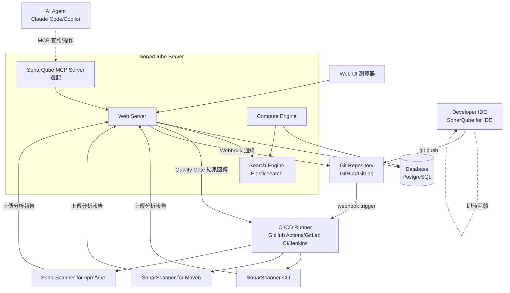

### 3.3 端到端互動流程（Sequence）

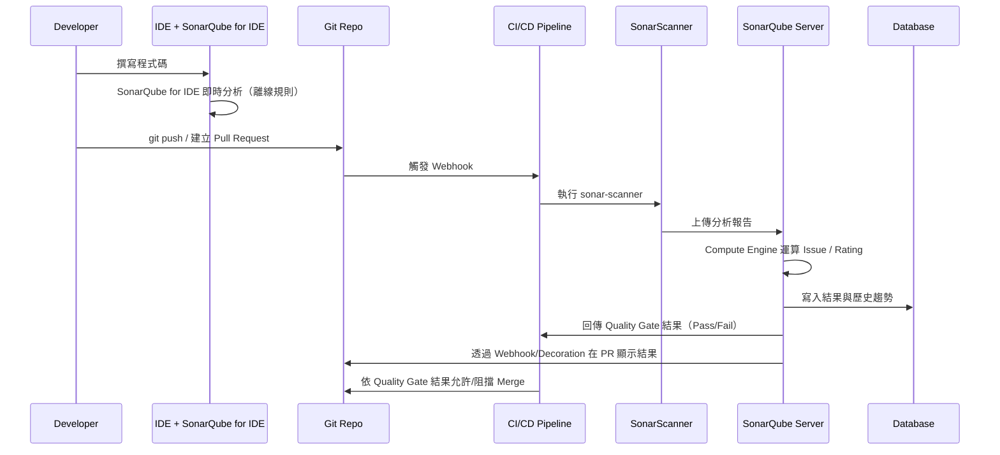

### 3.4 部署型態選擇

- **單機部署**：適合 Community Build/Developer Edition，Server 與 DB 可同機或分離
- **分離式部署**：Web Server + Compute Engine 同進程，但 Database 與 Elasticsearch 獨立掛載，便於擴充儲存與調優
- **叢集部署（Data Center Edition）**：多個 Application Node（Web+CE）+ 多個 Search Node，前端掛 Load Balancer，後端共用高可用資料庫（如 PostgreSQL Streaming Replication）

> 💡 **實務案例**：建議 Database 與 SonarQube Server 分離部署，即使是 Community Build 的小型團隊，未來升級到叢集架構時也不需搬移資料，降低升級風險。
>
> ⚠️ **注意事項**：SonarQube 內嵌的 Elasticsearch 僅供 SonarQube 自身索引使用，**不可**也**不支援**作為共用 Elasticsearch 叢集對外提供服務；官方明確要求獨佔資源、關閉部分系統層級的記憶體管理機制（如 Linux 的 Transparent Huge Pages，並調高 `vm.max_map_count`）。

### 3.5 SonarQube MCP Server 與 AI Agent 整合點（概覽）

第11章將深入說明 SonarQube MCP Server 的工具清單與設定方式；此處先點出其在系統架構中的位置：MCP Server 是獨立於 Web Server 之外的**選配元件**，對外暴露 Model Context Protocol 介面供 Claude Code、VS Code 等 AI Agent 連線，對內仍透過既有 REST API 向 SonarQube Server／Cloud 查詢 Quality Gate、Issue、SCA 風險等資料——換言之，MCP Server 是「AI Agent 友善的 API 轉接層」，不會改變 Compute Engine 既有的分析運算邏輯。

> ⚠️ **注意事項**：MCP Server 連線使用的 Token 同樣應遵循最小權限原則，且建議獨立於一般使用者 Token 管理，避免 AI Agent 取得超出查詢/標註範圍的管理權限。

---

## 第4章 安裝與部署

### 🎯 學習目標

- 掌握 Windows / Linux / Docker / Kubernetes 多種部署方式
- 理解硬體資源規劃與高可用架構設計

### 4.1 硬體需求規劃

| 規模 | CPU | Memory | Storage | 適用版本 |
|---|---|---|---|---|
| 小型（<10 專案） | 2 vCPU | 4 GB | 50 GB SSD | Community Build/Developer Edition |
| 中型（10～50 專案） | 4 vCPU | 8～16 GB | 200 GB SSD | Developer/Enterprise Edition |
| 大型（50～200 專案） | 8 vCPU | 16～32 GB | 500 GB SSD（建議獨立掛載 DB） | Enterprise Edition |
| 企業級 / 銀行級（HA） | 每節點 8 vCPU 起 | 每節點 32 GB 起 | 共用高可用儲存 + 異地備援 | Data Center Edition |

> ⚠️ **注意事項**：Elasticsearch 對記憶體與檔案描述符（File Descriptor）敏感，Linux 環境務必設定：
> ```bash
> # /etc/sysctl.conf
> vm.max_map_count=524288
> # /etc/security/limits.conf
> sonarqube   -   nofile   131072
> sonarqube   -   nproc    8192
> ```

> 💡 **版本下載提醒**：SonarQube Server 自 2025 年起採年度日曆版號（如 `2026.1`），SonarQube Community Build 則持續滾動發行、不釘版號。下列範例以 `<VERSION>` 表示當前版本，請至官方下載頁（`sonarsource.com/products/sonarqube/downloads/`）取得實際版號後替換，切勿直接複製本手冊出現過的舊版號。

### 4.2 Linux 安裝（ZIP 部署，適合理解架構）

```bash
# 1. 建立專用使用者
sudo useradd -m -d /opt/sonarqube sonarqube

# 2. 下載並解壓（<VERSION> 請替換為官方下載頁當前版本，如 2026.1.xxxxx）
cd /opt
sudo curl -O https://binaries.sonarsource.com/Distribution/sonarqube/sonarqube-<VERSION>.zip
sudo unzip sonarqube-<VERSION>.zip
sudo mv sonarqube-<VERSION> sonarqube
sudo chown -R sonarqube:sonarqube /opt/sonarqube

# 3. 設定資料庫連線（conf/sonar.properties）
sudo -u sonarqube vi /opt/sonarqube/conf/sonar.properties
```

```properties
# conf/sonar.properties
sonar.jdbc.username=sonarqube
sonar.jdbc.password=ChangeMe_StrongPassword!
sonar.jdbc.url=jdbc:postgresql://localhost:5432/sonarqube
sonar.web.host=0.0.0.0
sonar.web.port=9000
sonar.search.javaOpts=-Xmx2g -Xms2g
```

```bash
# 4. 以服務啟動（建議用 systemd 而非直接執行 bin/linux-x86-64/sonar.sh）
sudo tee /etc/systemd/system/sonarqube.service <<EOF
[Unit]
Description=SonarQube Service
After=syslog.target network.target postgresql.service

[Service]
Type=forking
User=sonarqube
Group=sonarqube
ExecStart=/opt/sonarqube/bin/linux-x86-64/sonar.sh start
ExecStop=/opt/sonarqube/bin/linux-x86-64/sonar.sh stop
LimitNOFILE=131072
LimitNPROC=8192
TimeoutStartSec=5
Restart=always

[Install]
WantedBy=multi-user.target
EOF

sudo systemctl daemon-reload
sudo systemctl enable sonarqube
sudo systemctl start sonarqube
```

### 4.3 Windows 安裝

```powershell
# 1. 下載並解壓至 C:\sonarqube（<VERSION> 請替換為官方下載頁當前版本）
Expand-Archive sonarqube-<VERSION>.zip -DestinationPath C:\

# 2. 編輯 conf\sonar.properties（同 Linux 設定內容）

# 3. 安裝為 Windows 服務
cd C:\sonarqube\bin\windows-x86-64
.\InstallNTService.bat
Start-Service SonarQube
```

> 💡 **實務案例**：正式環境建議**不要**使用 Windows/Linux ZIP 部署方式長期維運，僅適合 PoC 驗證；正式環境建議統一改用 **Docker / Kubernetes**，便於版本管理、回滾與監控整合。

### 4.4 Docker / Docker Compose 部署

```yaml
# docker-compose.yml（image tag 請至 Docker Hub「sonarqube」官方頁面核對當前可用標籤後替換 <TAG>）
version: "3.8"
services:
  sonarqube:
    image: sonarqube:<TAG>
    container_name: sonarqube
    depends_on:
      - db
    environment:
      SONAR_JDBC_URL: jdbc:postgresql://db:5432/sonarqube
      SONAR_JDBC_USERNAME: sonarqube
      SONAR_JDBC_PASSWORD: ChangeMe_StrongPassword!
    volumes:
      - sonarqube_data:/opt/sonarqube/data
      - sonarqube_extensions:/opt/sonarqube/extensions
      - sonarqube_logs:/opt/sonarqube/logs
    ports:
      - "9000:9000"
    ulimits:
      nofile:
        soft: 131072
        hard: 131072
    sysctls:
      - net.ipv4.ip_unprivileged_port_start=0

  db:
    image: postgres:16
    container_name: sonarqube_db
    environment:
      POSTGRES_USER: sonarqube
      POSTGRES_PASSWORD: ChangeMe_StrongPassword!
      POSTGRES_DB: sonarqube
    volumes:
      - postgresql_data:/var/lib/postgresql/data

volumes:
  sonarqube_data:
  sonarqube_extensions:
  sonarqube_logs:
  postgresql_data:
```

```bash
# Linux Host 端需先調整 kernel 參數（Container 內無法調整）
sudo sysctl -w vm.max_map_count=524288
docker compose up -d
```

### 4.5 Kubernetes 部署（Helm）

```bash
helm repo add sonarqube https://SonarSource.github.io/helm-chart-sonarqube
helm repo update

cat <<EOF > values-enterprise.yaml
edition: enterprise
image:
  tag: "<TAG>"  # 請至 Helm Chart 文件核對與所選 SonarQube Server 版本對應的 image tag
monitoringPasscode: "ChangeMe"
postgresql:
  enabled: false
jdbcOverwrite:
  jdbcUrl: "jdbc:postgresql://sonarqube-postgresql.db.svc.cluster.local:5432/sonarqube"
  jdbcUsername: sonarqube
  jdbcSecretName: sonarqube-db-secret
  jdbcSecretPasswordKey: password
resources:
  requests:
    memory: "4Gi"
    cpu: "2"
  limits:
    memory: "8Gi"
    cpu: "4"
persistence:
  enabled: true
  size: 50Gi
ingress:
  enabled: true
  hosts:
    - name: sonarqube.internal.example.com
      path: /
  tls:
    - secretName: sonarqube-tls
      hosts:
        - sonarqube.internal.example.com
EOF

kubectl create namespace sonarqube
helm install sonarqube sonarqube/sonarqube -n sonarqube -f values-enterprise.yaml
```

> ⚠️ **注意事項**：Kubernetes 部署 Elasticsearch（SonarQube 內建）對 `initContainers` 設定 `sysctl` 有嚴格要求，需確認叢集允許 Privileged InitContainer，否則 Pod 會卡在 `CrashLoopBackOff`。

### 4.6 OpenShift 部署注意事項

OpenShift 預設以**隨機 UID**執行容器（Security Context Constraints, SCC），SonarQube 官方映像檔的內建使用者需特別處理：

```yaml
# 建議建立專屬 SCC 或調整現有 SCC 允許指定 UID 範圍
apiVersion: security.openshift.io/v1
kind: SecurityContextConstraints
metadata:
  name: sonarqube-scc
runAsUser:
  type: MustRunAsRange
  uidRangeMin: 1000
  uidRangeMax: 1000
fsGroup:
  type: MustRunAs
  ranges:
    - min: 1000
      max: 1000
```

### 4.7 高可用與備援架構（Data Center Edition）

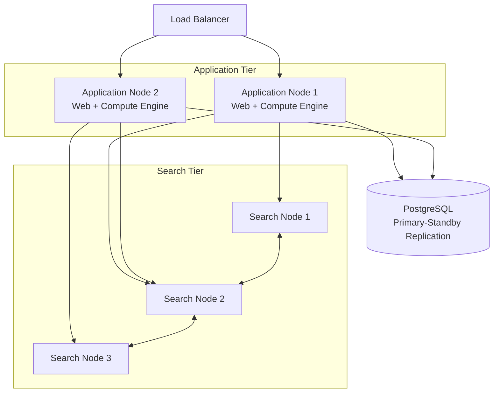

企業部署建議：

- **Database**：採用雲端 RDS（PostgreSQL）或自建 Streaming Replication，搭配每日邏輯備份 + WAL 持續備份
- **異地備援**：雙機房 Active-Passive，RPO（可容忍資料損失）以 Database 備份頻率為準，RTO 以服務啟動時間 + DNS 切換時間估算
- **儲存**：Application 與 Search Node 使用本機高效能 SSD（避免網路儲存延遲影響索引效能）
- **監控**：透過 `/api/system/health` 與 `/api/monitoring/metrics`（DCE）整合 Prometheus

> 💡 **實務案例**：某銀行採用 Data Center Edition 三節點 Application + 三節點 Search 架構，資料庫採用 PostgreSQL Patroni 高可用叢集，達成單節點故障時服務不中斷（Zero Downtime Failover）。

---

## 第5章 SonarQube 設定

### 🎯 學習目標

- 掌握 Project / Application / Portfolio 三層級的差異與使用情境
- 完整設定 Quality Profile、Quality Gate、Permission、SSO

### 5.1 Project / Application / Portfolio 架構

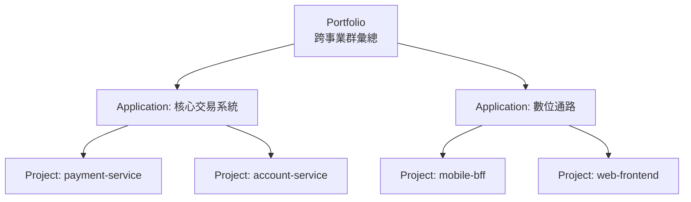

| 層級 | 說明 | 適用情境 |
|---|---|---|
| Project | 單一程式碼庫（Repo）的分析單位 | 微服務各自一個 Project |
| Application | 將多個 Project 邏輯彙總成一個業務系統 | 微服務架構下的「系統」視角 |
| Portfolio | 將多個 Application/Project 依組織彙總 | 高層管理儀表板、跨事業群比較 |

### 5.2 建立 Project 與產生 Token

```bash
# 透過 Web UI：Administration > Projects > Create Project
# 或透過 API 建立
curl -u admin:admin -X POST "http://localhost:9000/api/projects/create" \
  -d "project=payment-service&name=Payment Service"

# 產生分析用 Token（建議使用 Project Analysis Token，而非個人 Token）
curl -u admin:admin -X POST "http://localhost:9000/api/user_tokens/generate" \
  -d "name=payment-service-ci&type=PROJECT_ANALYSIS_TOKEN&projectKey=payment-service"
```

> ⚠️ **注意事項**：CI/CD Pipeline 應使用 **Project Analysis Token** 或 **Global Analysis Token**，並設定到期日（Expiration），避免使用永久有效的個人 Token，降低憑證外洩風險。

### 5.3 Quality Profile（規則集設定）

Quality Profile 決定「哪些規則會被檢查」，依語言各自獨立設定。

```bash
# 建立企業專屬 Java Profile（繼承 Sonar way 並客製化）
curl -u admin:admin -X POST "http://localhost:9000/api/qualityprofiles/create" \
  -d "language=java&name=Enterprise-Java-Profile"

# 設為該語言預設 Profile
curl -u admin:admin -X POST "http://localhost:9000/api/qualityprofiles/set_default" \
  -d "language=java&qualityProfile=Enterprise-Java-Profile"

# 啟用特定安全規則（例：硬編碼密碼偵測 S2068），severity 依 Instance 所選 Mode 而異
curl -u admin:admin -X POST "http://localhost:9000/api/qualityprofiles/activate_rule" \
  -d "key=java:S2068&targetKey=<profile-key>&severity=BLOCKER"
```

> ⚠️ **注意事項**：本章節若 Instance 已啟用 **MQR Mode**（第1章 1.6），規則啟用後的嚴重度需針對其影響的每個 Software Quality 分別指定（Blocker／High／Medium／Low／Info）；若仍使用 **Standard Experience Mode**，則維持單一嚴重度（Blocker／Critical／Major／Minor／Info）。建立 Quality Profile 前，務必先確認 Instance 目前的 Mode 設定，避免規則嚴重度與企業標準對照表脫鉤。
>
> 💡 **實務案例**：企業應建立「集團標準 Profile」並鎖定繼承（Inheritance），各專案僅可在標準之上**加嚴**，不可放寬，確保治理一致性。

### 5.4 Quality Gate（先在此概覽，第7章深入）

```bash
curl -u admin:admin -X POST "http://localhost:9000/api/qualitygates/create" \
  -d "name=Enterprise-Gate"
```

### 5.5 Permission / Role / Group

| 角色 | 權限範圍 |
|---|---|
| `sonar-administrators` | 全域管理（系統設定、使用者管理） |
| `sonar-users` | 一般使用者（檢視已授權專案） |
| Project `Administer` | 該專案的設定、Quality Gate 指派 |
| Project `Execute Analysis` | 允許上傳分析結果（給 CI Service Account） |
| Project `Browse` | 僅檢視結果 |

```bash
# 建立 Group 並綁定 Project 權限
curl -u admin:admin -X POST "http://localhost:9000/api/user_groups/create" \
  -d "name=payment-team"

curl -u admin:admin -X POST "http://localhost:9000/api/permissions/add_group" \
  -d "groupName=payment-team&projectKey=payment-service&permission=admin"
```

> ⚠️ **注意事項**：務必落實**最小權限原則**，CI Service Account 僅給予 `Execute Analysis`，**不要**給予 `Administer`；人員權限透過 Group 管理而非逐一指派個人帳號，便於離職交接與稽核。

### 5.6 LDAP 設定

```properties
# conf/sonar.properties
sonar.security.realm=LDAP
ldap.url=ldaps://ldap.example.com:636
ldap.bindDn=cn=svc-sonarqube,ou=ServiceAccounts,dc=example,dc=com
ldap.bindPassword=ChangeMe
ldap.user.baseDn=ou=Users,dc=example,dc=com
ldap.user.request=(&(objectClass=person)(uid={login}))
ldap.group.baseDn=ou=Groups,dc=example,dc=com
ldap.group.request=(&(objectClass=groupOfNames)(member={dn}))
```

### 5.7 SSO / SAML / OIDC 設定（Enterprise 起）

```properties
# SAML 範例（conf/sonar.properties，企業內網仍建議搭配 reverse proxy 終止 TLS）
sonar.auth.saml.enabled=true
sonar.auth.saml.applicationId=sonarqube
sonar.auth.saml.providerId=https://idp.example.com/saml2
sonar.auth.saml.providerCertificate=<IdP 公開憑證內容>
sonar.auth.saml.loginUrl=https://idp.example.com/saml2/sso
sonar.auth.saml.user.login=login
sonar.auth.saml.user.name=name
sonar.auth.saml.group.name=groups
```

```properties
# OIDC 範例
sonar.auth.oidc.enabled=true
sonar.auth.oidc.issuerUri=https://idp.example.com/realms/corp
sonar.auth.oidc.clientId.secured=sonarqube-client
sonar.auth.oidc.clientSecret.secured=ChangeMe
sonar.auth.oidc.scopes=openid email profile groups
```

> 💡 **實務案例**：銀行內部系統通常要求 SSO 整合企業 Keycloak（OIDC）並啟用群組同步（Group Sync），離職員工帳號停用後 SonarQube 存取權限自動跟著失效，符合 IAM 稽核要求。

### 5.8 Webhook 設定（通知 CI / ChatOps）

```bash
curl -u admin:admin -X POST "http://localhost:9000/api/webhooks/create" \
  -d "name=CI-Callback&url=https://ci.example.com/sonarqube-webhook&project=payment-service"
```

---

## 第6章 SonarScanner

### 🎯 學習目標

- 理解 Scanner 的執行架構與分析流程
- 能針對 Java/Spring Boot、Vue/TypeScript、Python、C#、Go、C++ 撰寫正確的 Scanner 設定

### 6.1 Scanner 架構與執行流程

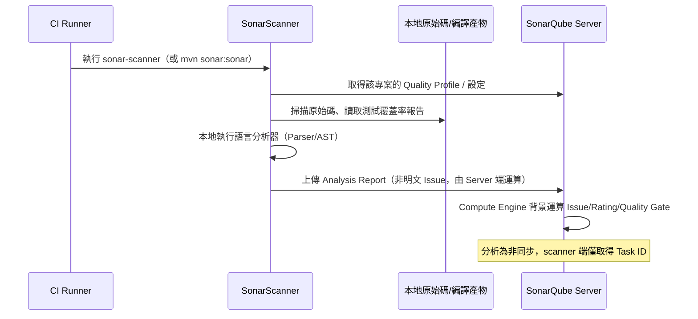

> ⚠️ **注意事項**：Scanner 端的分析結果上傳後，**實際 Issue 運算在 Server 端的 Compute Engine 非同步完成**；CI Pipeline 若要等待 Quality Gate 結果，必須額外呼叫 `report-task.txt` 中的 `ceTaskUrl` 進行輪詢（各官方 Plugin 已封裝此邏輯，如 `waitForQualityGate()`）。

### 6.2 支援語言總覽

| 語言 | Scanner 方式 |
|---|---|
| Java / Spring Boot | SonarScanner for Maven / Gradle |
| Vue / TypeScript / JavaScript | SonarScanner CLI（搭配 ESLint/TS 編譯產物） |
| Python | SonarScanner CLI |
| C# / .NET | SonarScanner for .NET（`dotnet-sonarscanner`） |
| Go | SonarScanner CLI |
| C / C++ | SonarScanner CLI + Build Wrapper（需攔截編譯指令） |

### 6.3 Java / Spring Boot 分析範例

```xml
<!-- pom.xml -->
<properties>
    <sonar.host.url>https://sonarqube.internal.example.com</sonar.host.url>
    <sonar.projectKey>payment-service</sonar.projectKey>
    <sonar.java.source>21</sonar.java.source>
    <sonar.coverage.jacoco.xmlReportPaths>target/site/jacoco/jacoco.xml</sonar.coverage.jacoco.xmlReportPaths>
</properties>

<build>
    <plugins>
        <plugin>
            <groupId>org.jacoco</groupId>
            <artifactId>jacoco-maven-plugin</artifactId>
            <version>0.8.12</version>
            <executions>
                <execution>
                    <goals><goal>prepare-agent</goal></goals>
                </execution>
                <execution>
                    <id>report</id>
                    <phase>test</phase>
                    <goals><goal>report</goal></goals>
                </execution>
            </executions>
        </plugin>
        <plugin>
            <groupId>org.sonarsource.scanner.maven</groupId>
            <artifactId>sonar-maven-plugin</artifactId>
            <version><!-- 請至 Maven Central 核對 sonar-maven-plugin 當前最新版本 --></version>
        </plugin>
    </plugins>
</build>
```

```bash
mvn -B clean verify \
  org.jacoco:jacoco-maven-plugin:report \
  sonar:sonar \
  -Dsonar.token=$SONAR_TOKEN
```

### 6.4 Vue 3 / TypeScript 分析範例

```json
// package.json（測試覆蓋率搭配 Vitest）
{
  "scripts": {
    "test:coverage": "vitest run --coverage"
  }
}
```

```properties
# sonar-project.properties
sonar.projectKey=web-frontend
sonar.sources=src
sonar.tests=src
sonar.test.inclusions=**/*.spec.ts,**/*.test.ts
sonar.exclusions=**/node_modules/**,**/dist/**,**/*.spec.ts
sonar.javascript.lcov.reportPaths=coverage/lcov.info
sonar.typescript.tsconfigPaths=tsconfig.json
```

```bash
npm run test:coverage
sonar-scanner -Dsonar.token=$SONAR_TOKEN
```

### 6.5 Python 分析範例

```properties
# sonar-project.properties
sonar.projectKey=data-pipeline
sonar.sources=src
sonar.python.coverage.reportPaths=coverage.xml
sonar.python.version=3.11
```

```bash
pytest --cov=src --cov-report=xml
sonar-scanner -Dsonar.token=$SONAR_TOKEN
```

### 6.6 C# / .NET 分析範例

```bash
dotnet tool install --global dotnet-sonarscanner

dotnet sonarscanner begin \
  /k:"legacy-billing-api" \
  /d:sonar.token="$SONAR_TOKEN" \
  /d:sonar.host.url="https://sonarqube.internal.example.com" \
  /d:sonar.cs.opencover.reportsPaths="coverage.opencover.xml"

dotnet build
dotnet test --collect:"XPlat Code Coverage"

dotnet sonarscanner end /d:sonar.token="$SONAR_TOKEN"
```

### 6.7 Go 分析範例

```properties
sonar.projectKey=inventory-service-go
sonar.sources=.
sonar.exclusions=**/*_test.go,**/vendor/**
sonar.go.coverage.reportPaths=coverage.out
```

```bash
go test ./... -coverprofile=coverage.out
sonar-scanner -Dsonar.token=$SONAR_TOKEN
```

### 6.8 C / C++ 分析範例（需 Build Wrapper）

```bash
# 下載對應平台的 build-wrapper（與 SonarQube 版本對應）
build-wrapper-linux-x86-64 --out-dir bw-output make clean all

sonar-scanner \
  -Dsonar.projectKey=embedded-firmware \
  -Dsonar.sources=. \
  -Dsonar.cfamily.build-wrapper-output=bw-output \
  -Dsonar.token=$SONAR_TOKEN
```

> 💡 **實務案例**：Monorepo 架構建議每個子模組設定獨立 `sonar.projectKey`，並在根目錄使用 `sonar.sources` 搭配 `sonar.inclusions/exclusions` 分別掃描，避免單一 Project 把前後端程式碼混為一談導致 Quality Profile 衝突。

> ⚠️ **注意事項**：覆蓋率報告路徑（`reportPaths`）是企業導入時最常設錯的地方，務必在 CI Log 中確認 Scanner 輸出「Sensor JaCoCo XML Report Importer」等字樣，代表覆蓋率確實被讀取，而非顯示 0%。

---

## 第7章 Quality Gate

### 🎯 學習目標

- 深入理解 Quality Gate 各項度量指標（Metric）的意義
- 能依風險等級（一般企業 / 銀行級 / 政府專案）建立對應的 Quality Gate

### 7.1 核心度量指標：MQR Mode 與 Standard Mode 對照

| 指標 | MQR Mode（現行預設） | Standard Experience Mode（舊制） |
|---|---|---|
| 問題本體 | Issue，依其影響的 Software Quality 分別計分 | Bug／Vulnerability／Code Smell |
| 嚴重度 | Blocker／High／Medium／Low／Info（每個 Software Quality 各自評級） | Blocker／Critical／Major／Minor／Info |
| **Security Hotspot** | 需人工審查的敏感程式碼，需標記 Reviewed（兩模式皆相同概念） | 同左 |
| **Coverage** | 單元測試覆蓋率（新程式碼覆蓋率尤其關鍵，兩模式皆相同） | 同左 |
| **Duplicated Lines (%)** | 重複程式碼比例（兩模式皆相同） | 同左 |
| **Cyclomatic / Cognitive Complexity** | 程式碼複雜度（兩模式皆相同） | 同左 |
| **Maintainability Rating** | A～E，依 Maintainability Software Quality 最高嚴重度換算 | A～E，依 Technical Debt Ratio 換算 |
| **Reliability Rating** | A～E，依 Reliability Software Quality 最高嚴重度換算 | A～E，依 Bug 嚴重度換算 |
| **Security Rating** | A～E，依 Security Software Quality 最高嚴重度換算 | A～E，依 Vulnerability 嚴重度換算 |

### 7.2 Mode 切換對 Quality Gate 的影響

Administration > General Settings > Mode 可在 **MQR Mode** 與 **Standard Experience Mode** 間整個 Instance 切換，兩種模式下 Quality Gate 仍使用相同的 `new_coverage`、`new_duplicated_lines_density` 等共用 metric key；但涉及嚴重度／評級的 metric（如 `new_reliability_rating`、`new_security_rating`、`new_maintainability_rating`）在底層計算基準會隨 Mode 改變（MQR 依 Software Quality 嚴重度，Standard 依問題類型嚴重度），數值意義不完全等價。

> ⚠️ **注意事項**：切換 Mode **不會**自動重新計算歷史趨勢圖；既有 Quality Gate 條件的 metric key 通常維持相容，但對應的實際嚴重度評級基準已改變，務必在切換後重新檢視各 Quality Gate 是否仍符合預期的把關力度，而非預設沿用舊門檻值。

### 7.3 Clean as You Code 策略

SonarQube 現行最佳實務聚焦 **New Code**（本次變更的程式碼），而非強迫一次清理全部歷史程式碼：

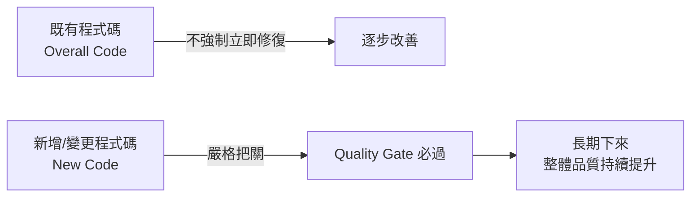

新程式碼定義（New Code Definition）建議設定為「上一版本」或「過去 30 天」，依 Release 節奏調整。

### 7.4 建立企業級 Quality Gate

```bash
curl -u admin:admin -X POST "http://localhost:9000/api/qualitygates/create" \
  -d "name=Enterprise-Gate"

# 新程式碼覆蓋率 >= 80%
curl -u admin:admin -X POST "http://localhost:9000/api/qualitygates/create_condition" \
  -d "gateName=Enterprise-Gate&metric=new_coverage&op=LT&error=80"

# 新程式碼重複率 <= 3%
curl -u admin:admin -X POST "http://localhost:9000/api/qualitygates/create_condition" \
  -d "gateName=Enterprise-Gate&metric=new_duplicated_lines_density&op=GT&error=3"

# 新程式碼不可有 Bug（Blocker/Critical 等同失敗）
curl -u admin:admin -X POST "http://localhost:9000/api/qualitygates/create_condition" \
  -d "gateName=Enterprise-Gate&metric=new_reliability_rating&op=GT&error=1"

# 新程式碼不可有 Vulnerability
curl -u admin:admin -X POST "http://localhost:9000/api/qualitygates/create_condition" \
  -d "gateName=Enterprise-Gate&metric=new_security_rating&op=GT&error=1"

# 100% Security Hotspot 已審查
curl -u admin:admin -X POST "http://localhost:9000/api/qualitygates/create_condition" \
  -d "gateName=Enterprise-Gate&metric=new_security_hotspots_reviewed&op=LT&error=100"

# 新程式碼維護性 A 級
curl -u admin:admin -X POST "http://localhost:9000/api/qualitygates/create_condition" \
  -d "gateName=Enterprise-Gate&metric=new_maintainability_rating&op=GT&error=1"
```

### 7.5 銀行級 Quality Gate（加嚴版）

在企業級基礎上，銀行級新增整體程式碼（Overall Code）門檻，並提高覆蓋率要求：

| 條件 | 門檻值 | 理由 |
|---|---|---|
| New Coverage | ≥ 90% | 核心交易邏輯零容忍未測試路徑 |
| New Duplicated Lines | ≤ 1% | 降低多處修改不同步風險 |
| New Security Rating | = A（無 Vulnerability） | 監理要求 |
| New Reliability Rating | = A（無 Bug） | 監理要求 |
| Security Hotspots Reviewed | = 100% | 稽核留痕要求 |
| Overall Security Rating | = A | 既有系統亦不可有已知漏洞殘留 |
| Blocker Issues（Overall） | = 0 | 任何 Blocker 等級問題視為發行阻斷 |

```bash
curl -u admin:admin -X POST "http://localhost:9000/api/qualitygates/create_condition" \
  -d "gateName=Banking-Gate&metric=security_rating&op=GT&error=1"

curl -u admin:admin -X POST "http://localhost:9000/api/qualitygates/create_condition" \
  -d "gateName=Banking-Gate&metric=blocker_violations&op=GT&error=0"
```

### 7.6 政府專案 Quality Gate（合規導向）

政府專案常見要求對應 **資安基準檢測（如 TWCERT 開放原始碼安全檢測規範）**：

| 條件 | 門檻值 |
|---|---|
| New Vulnerabilities | = 0 |
| Security Hotspots Reviewed | = 100% |
| New Coverage | ≥ 70%（依專案類型可調整） |
| Duplicated Lines | ≤ 5% |
| 所有 Critical 以上問題 | 需於 Quality Gate 結果中附帶人工簽核紀錄（流程層面，非工具內建） |

### 7.7 將 Quality Gate 指派給專案

```bash
curl -u admin:admin -X POST "http://localhost:9000/api/qualitygates/select" \
  -d "gateName=Banking-Gate&projectKey=payment-service"
```

> 💡 **實務案例**：建議依「系統關鍵等級（Criticality Tier）」分層套用 Quality Gate，而非全公司統一一套——核心交易系統套用銀行級 Gate，內部後台工具套用企業級 Gate，避免過度嚴苛拖慢非關鍵系統開發速度。

> ⚠️ **注意事項**：Quality Gate 條件設太多、太嚴格但團隊能力未到位，容易導致團隊「為了過 Gate」而濫用 `// NOSONAR`、`@SuppressWarnings` 等抑制手段，治理單位應同步監控 **Issue 抑制率**，作為 Gate 設計是否合理的反饋指標。

---

## 第8章 AI Coding 與 SonarQube

### 🎯 學習目標

- 理解 AI 輔助開發（Claude Code、GitHub Copilot、Gemini CLI、OpenAI Codex）帶來的品質與安全風險
- 建立 AI 開發治理流程，讓 SonarQube 成為 AI 產出程式碼的最後一道防線

> 📌 **本章定位**：本章聚焦企業如何治理**外部 AI 開發工具**（Claude Code／GitHub Copilot／Gemini CLI／OpenAI Codex）所產出的程式碼，把 SonarQube 當作「驗證關卡」。SonarQube **自身原生**的 AI 能力——AI CodeFix（自動修復建議）、AI Code Assurance（AI 程式碼專屬標籤與 Quality Gate）、SonarQube MCP Server（讓 Agent 直接查詢/操作分析結果）與 Agent Centric Development Cycle（AC/DC）框架——請見第11章。兩者互補：本章是「工具如何被驗證」，第11章是「驗證工具本身多了哪些 AI 能力」。

### 8.1 AI Coding 工具整合模式總覽

| 工具 | 主要互動模式 | 風險特性 |
|---|---|---|
| **Claude Code** | CLI / Agent，可直接執行指令、改檔、跑測試 | 改動範圍可能較大，需要 Local Scan 把關 |
| **GitHub Copilot** | IDE 即時補全 + Chat + Coding Agent | 高頻率小幅產出，易累積大量未審視片段 |
| **Gemini CLI** | CLI Agent，多檔案操作 | 與 Claude Code 類似，需相同治理模式 |
| **OpenAI Codex** | CLI / Cloud Agent，可自動建立 PR | 自動化程度高，更需強制 CI Gate 把關 |

### 8.2 AI 產生程式碼常見問題

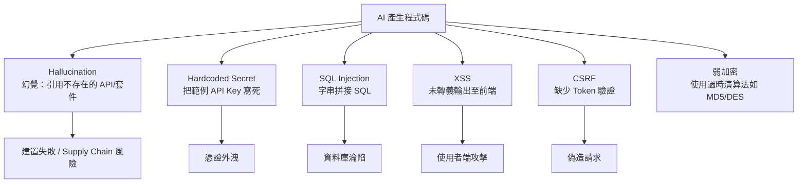

| 風險類型 | 說明 | SonarQube 對應規則範例 |
|---|---|---|
| Hallucination | AI 引用不存在或版本不符的 API、套件名稱 | 雖非 SonarQube 直接規則，但建置失敗 + Dependency 規則可間接攔截 |
| Hardcoded Secret | AI 為了「讓範例能跑」直接寫入假設的金鑰/密碼 | `S2068`（Hardcoded credentials）、Secrets Detection |
| SQL Injection | AI 偏好用字串拼接生成 SQL（尤其在生成 Demo/CRUD 時） | `S3649`（SQL Injection） |
| XSS | 前端 AI 產生程式碼直接 `innerHTML` 插入使用者輸入 | `S5247`（XSS）、Vue/JS 安全規則 |
| CSRF | API 端點未要求驗證 Token，AI 預設產生「最簡單能動」版本 | Spring Security 相關 Hotspot 規則 |
| 弱加密 | AI 訓練語料中仍含大量舊範例（MD5、DES、ECB 模式） | `S4790`（弱雜湊演算法）、`S5547`（弱加密演算法） |

> ⚠️ **注意事項**：AI 模型傾向產出「能跑」而非「安全」的程式碼，因為訓練資料以教學範例與舊專案為主。企業不能僅靠 Prompt 提示「請注意安全性」來防範，**必須**用 SonarQube 等工具做機械化、強制性的把關。

### 8.3 AI 開發治理流程

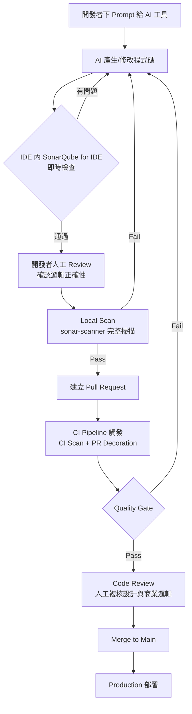

### 8.4 AI 開發治理政策建議

1. **強制 IDE 層即時檢查**：開發者使用 SonarQube for IDE（原 SonarLint）連線至公司 SonarQube Server（Connected Mode），AI 產生程式碼當下即取得一致規則回饋
2. **AI 產出標記**：透過 Commit 訊息規範（如 `Co-Authored-By: Claude <noreply@anthropic.com>`）標記 AI 協作產出，便於後續稽核與品質趨勢分析（可比較 AI 協作 vs 純人工的 Issue 密度）
3. **禁止跳過 Quality Gate**：即使是 AI 自動建立的 PR（如 Codex Cloud Agent），CI 仍須通過相同的 Quality Gate，不得有特例
4. **Secrets 規則設為 Blocker**：所有 AI 相關專案的 Quality Profile 必須將 Hardcoded Secret 規則嚴重度提升至 Blocker
5. **定期人工抽查 Security Hotspot**：AI 高頻產出下，Security Hotspot 數量會上升，需安排專人定期 Review，而非僅靠自動化

> 💡 **實務案例**：某團隊導入 Claude Code 後，原本人工撰寫的 PR 平均每個含 1.2 個 Code Smell，AI 協作 PR 初期高達 4.8 個；導入「Local Scan 必過才能建立 PR」的 Git Hook 後，AI 協作 PR 的 Code Smell 密度降至與人工相當水準。

---

## 第9章 Claude Code 整合實戰

### 🎯 學習目標

- 建立 Claude Code + SonarQube + GitHub + Spring Boot 的完整整合架構
- 掌握 AI 產生程式碼 → Local Scan → PR → CI Scan → Quality Gate → Merge 的實戰流程
- 理解 CLI Local Scan 模式與 SonarQube MCP Server 模式的差異與並存方式

### 9.1 整合架構（傳統 CLI Local Scan 模式）

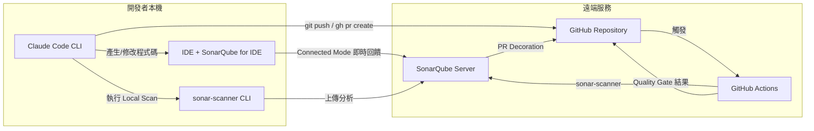

本章 9.1～9.5 採用「CLI Local Scan」模式：Claude Code 透過 Shell 執行 `sonar-scanner`/`mvn sonar:sonar`，分析完成後才能得知結果，屬於「先產出、後驗證」的批次流程。9.6 將介紹官方 **SonarQube MCP Server** 帶來的「邊產出、邊驗證」模式，兩者可並存（詳見 9.6 與第11章 11.3）。

### 9.2 Claude Code 本機 Local Scan 設定

於專案根目錄建立 `CLAUDE.md`，明確要求 Claude Code 在每次變更後執行掃描：

```markdown
# CLAUDE.md（節錄）

## 程式碼品質規範

- 每次完成功能修改後，必須執行 `mvn sonar:sonar -Dsonar.host.url=$SONAR_HOST_URL` 進行本地掃描
- 若掃描結果包含 Blocker/Critical 等級的 Bug 或 Vulnerability，必須先修復才能視為任務完成
- 禁止使用字串拼接方式組成 SQL 查詢，必須使用 JPA/MyBatis 參數化查詢
- 禁止在程式碼中寫入任何 API Key、密碼、Token，測試用敏感資訊請使用環境變數或測試替身（Test Double）
```

### 9.3 Git Hook 強制 Local Scan（pre-push）

```bash
#!/bin/bash
# .git/hooks/pre-push
echo "執行 SonarQube Local Scan..."
mvn -q clean verify sonar:sonar \
  -Dsonar.host.url="$SONAR_HOST_URL" \
  -Dsonar.token="$SONAR_TOKEN" \
  -Dsonar.qualitygate.wait=true

if [ $? -ne 0 ]; then
  echo "❌ SonarQube Quality Gate 未通過，禁止 push"
  exit 1
fi
echo "✅ Quality Gate 通過"
```

### 9.4 GitHub Actions CI Scan 整合

```yaml
# .github/workflows/sonarqube.yml
name: SonarQube Analysis
on:
  pull_request:
  push:
    branches: [main]

jobs:
  sonar-scan:
    runs-on: ubuntu-latest
    steps:
      - uses: actions/checkout@v4
        with:
          fetch-depth: 0

      - uses: actions/setup-java@v4
        with:
          java-version: '21'
          distribution: 'temurin'

      - name: Build and Test
        run: mvn -B clean verify

      - name: SonarQube Scan  # Action 版本請至 GitHub Marketplace 核對當前主版本
        uses: SonarSource/sonarqube-scan-action@v5
        env:
          SONAR_TOKEN: ${{ secrets.SONAR_TOKEN }}
          SONAR_HOST_URL: ${{ secrets.SONAR_HOST_URL }}

      - name: Quality Gate Check
        uses: SonarSource/sonarqube-quality-gate-action@v1
        timeout-minutes: 5
        env:
          SONAR_TOKEN: ${{ secrets.SONAR_TOKEN }}
```

### 9.5 實際案例：Claude Code 產生付款驗證邏輯

**情境**：請 Claude Code 新增一個信用卡付款驗證 API。

**Prompt 範例（含安全規範引導）**：

```text
請在 PaymentController 新增 POST /api/payments/verify 端點。
要求：
1. 使用參數化查詢操作資料庫，禁止字串拼接 SQL
2. 信用卡號碼僅記錄遮罩後末四碼，不可記錄完整卡號於 log
3. 端點需有 CSRF 防護與輸入驗證（Bean Validation）
4. 完成後執行 mvn sonar:sonar 進行本地掃描，確認沒有 Blocker/Critical 問題
5. 若 SonarQube 回報 Security Hotspot，請列出清單供我人工複核，不要自行標記為已審查
```

**最佳實務**：

- Prompt 中明確列出安全要求，比期待 AI「自動懂安全」更可靠
- 要求 AI **列出 Security Hotspot 清單**而非自行標記已審查，保留人工決策權
- 將上述 Prompt 模式建立為團隊範本（見第26章 Prompt Library）

> 💡 **實務案例**：團隊將「Local Scan 必過」寫入 `CLAUDE.md` 後，Claude Code 在偵測到 Quality Gate 失敗時會自動讀取 Issue 清單並嘗試修復，大幅減少人工來回修正的次數。
>
> ⚠️ **注意事項**：`sonar.qualitygate.wait=true` 會讓 Scanner 同步等待 Server 端運算完成才回傳結果，會拉長執行時間（通常增加 10～30 秒），但對於 Local Scan 與 CI Gate 把關是必要的，不建議省略。

### 9.6 進階模式：以 SonarQube MCP Server 取代/輔助 CLI Local Scan

官方 **SonarQube MCP Server** 讓 Claude Code 不必離開對話即可直接查詢 Quality Gate 狀態、列出 Issue、檢視 SCA 風險，實現官方所稱的「**vibe-then-verify**」模式：Agent 先依需求快速產出程式碼，再立即透過 MCP 工具自我檢查並修正，縮短「產出→驗證→修復」的回合時間。

```bash
# 以 Docker 啟動 SonarQube MCP Server（連線至 SonarQube Cloud／Server，Token 請使用最小權限）
docker run -i --rm \
  -e SONARQUBE_TOKEN="$SONAR_TOKEN" \
  -e SONARQUBE_ORG="my-org" \
  mcp/sonarqube
```

```bash
# 將 MCP Server 註冊進 Claude Code
claude mcp add sonarqube -- docker run -i --rm \
  -e SONARQUBE_TOKEN="$SONAR_TOKEN" \
  -e SONARQUBE_ORG="my-org" \
  mcp/sonarqube
```

註冊完成後，可直接以自然語言請 Claude Code 透過 MCP 工具操作，例如：

```text
請透過 SonarQube MCP Server 查詢 payment-service 目前分支的 Quality Gate 狀態，
若有未解決的 Blocker/High 等級問題，列出清單並逐一修復，修復後重新查詢確認已通過。
```

| 比較項目 | CLI Local Scan（9.1～9.5） | SonarQube MCP Server（本節） |
|---|---|---|
| 觸發方式 | 明確執行 `sonar-scanner`／`mvn sonar:sonar` | Agent 依對話需求自主呼叫 MCP 工具 |
| 回饋速度 | 需等待完整掃描（依專案規模數十秒至數分鐘） | 可針對特定查詢快速取得已有分析結果 |
| 適用情境 | 完整、正式的本地驗證，作為 PR 前最後一道關卡 | 開發過程中快速確認、查詢既有 Issue／SCA 風險、更新 Issue 狀態 |
| 是否互斥 | 否，建議兩者並存：MCP 用於開發中快速確認，CLI Local Scan／CI Gate 仍作為正式關卡 | 同左 |

> ⚠️ **注意事項**：MCP Server 屬於官方免費工具，但其存取的仍是企業 SonarQube 帳號權限範圍內的資料；連線 Token 應遵循最小權限原則（建議僅供查詢與 Issue 狀態更新，不給予 Administrator 權限），並與第11章 11.3 的企業導入建議一併規劃。

---

## 第10章 GitHub Copilot 整合實戰

### 🎯 學習目標

- 建立 GitHub Copilot 開發流程與 SonarQube 分析的整合標準
- 理解 PR Analysis、Code Review、自動修復流程

### 10.1 Copilot 開發 + SonarQube 分析流程

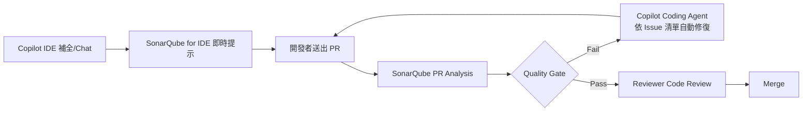

### 10.2 IDE 層整合：SonarQube for IDE + Copilot 並行

在 VS Code 中同時啟用兩個延伸模組，建議設定：

```json
// .vscode/settings.json（設定鍵名沿用 sonarlint.* 命名空間以維持相容性，延伸模組本身已改名為 SonarQube for IDE）
{
  "sonarlint.connectedMode.project": {
    "connectionId": "corp-sonarqube",
    "projectKey": "web-frontend"
  },
  "sonarlint.rules": {
    "typescript:S2068": { "level": "on" },
    "javascript:S5247": { "level": "on" }
  },
  "github.copilot.enable": {
    "*": true
  }
}
```

> 💡 SonarQube for IDE 與 Copilot 並行時，建議啟用 **Connected Mode**，使 IDE 內顯示的規則與企業 SonarQube Server 的 Quality Profile 完全一致，避免開發者本機規則和 CI Gate 規則不一致造成「IDE 沒提示，PR 卻被擋」的困惑。

### 10.3 Pull Request Analysis 設定

GitHub Copilot 常見工作模式是由 Coding Agent 直接建立 PR，需確保 PR Decoration 正確掛載：

```yaml
# .github/workflows/sonarqube.yml（節錄，PR 觸發段）
on:
  pull_request:
    types: [opened, synchronize, reopened]

permissions:
  pull-requests: write
  contents: read
  checks: write
```

PR 畫面將顯示：

- New Code 的 Bug / Vulnerability / Code Smell 清單，逐行標註於 Diff
- Quality Gate 狀態（綠色 Passed / 紅色 Failed）作為 PR Check
- 點擊 Issue 可直接跳轉至 SonarQube Web UI 詳細說明與修復建議

### 10.4 Code Review 標準作業

| 角色 | 檢查重點 |
|---|---|
| **Copilot（自動）** | 程式碼補全與初版生成 |
| **SonarQube（自動）** | Bug / Vulnerability / Code Smell / Coverage 機械檢查 |
| **人工 Reviewer** | 商業邏輯正確性、架構設計合理性、Security Hotspot 人工確認 |

> ⚠️ **注意事項**：Reviewer **不應**將「SonarQube Quality Gate 顯示綠色」直接等同於「可以安心 Approve」，Quality Gate 只保證機械可判斷的品質基準，商業邏輯正確性仍需人工判斷。

### 10.5 自動修復流程

```yaml
# .github/workflows/copilot-autofix.yml（示意：結合 SonarQube Issue 觸發 Copilot 修復建議）
name: Auto Remediation Suggestion
on:
  workflow_run:
    workflows: ["SonarQube Analysis"]
    types: [completed]

jobs:
  notify:
    if: github.event.workflow_run.conclusion == 'failure'
    runs-on: ubuntu-latest
    steps:
      - name: Comment PR with remediation hint
        uses: actions/github-script@v7
        with:
          script: |
            github.rest.issues.createComment({
              owner: context.repo.owner,
              repo: context.repo.repo,
              issue_number: context.payload.workflow_run.pull_requests[0].number,
              body: '⚠️ SonarQube Quality Gate 未通過，請於 IDE 使用 Copilot Chat 搭配 SonarQube for IDE 標註的 Issue 進行修復，或執行 `@copilot fix sonarqube issues`。'
            })
```

### 10.6 企業導入標準

1. **必裝清單**：SonarQube for IDE（Connected Mode）+ Copilot 兩者皆須安裝並連線至公司帳號/Server
2. **PR 模板強制檢查項**：PR Template 加入「SonarQube Quality Gate: Passed」勾選項
3. **Coding Agent 權限限制**：Copilot Coding Agent 自動建立的 PR，**不可**有自動 Merge 權限，必須經過人工 Approve
4. **指標追蹤**：每月追蹤 Copilot 協作 PR 的 Quality Gate 一次性通過率，作為導入成效指標
5. **MCP Server 相容性現況**：截至目前，官方 SonarQube MCP Server 整合範例主要驗證於 Claude Code 等 CLI Agent（第11章 11.3）；GitHub Copilot 仍以標準「IDE 即時提示 + CI Quality Gate」模式整合為主，企業導入前請以官方文件核對 Copilot 對 MCP 的最新支援狀態。

> 💡 **實務案例**：某團隊將「Quality Gate 一次性通過率」納入導入儀表板，發現前兩個月通過率僅 60%，主因是 Copilot 偏好產生缺少輸入驗證的 REST Controller；補強 Quality Profile 中 Bean Validation 相關 Code Smell 規則並更新團隊 Prompt 範本後，三個月後通過率提升至 92%。

---

## 第11章 SonarQube 原生 AI 治理

### 🎯 學習目標

- 理解 SonarQube 原生 AI 能力與第8~10章「外部工具治理」的差異與互補關係
- 掌握 AI CodeFix、AI Code Assurance 的運作原理、適用版本與企業導入考量
- 能設定 SonarQube MCP Server，讓 Claude Code 等 AI Agent 直接查詢/操作分析結果
- 理解 Agent Centric Development Cycle（AC/DC）框架，並對應到既有 SSDLC／DevSecOps 治理架構

> 📌 **本章定位**：第8~10章討論「如何用 SonarQube 把關外部 AI 工具」；本章討論「SonarQube 本身內建了哪些 AI 能力」。兩者共同構成企業面對 AI Agent 大量寫程式碼時代的完整治理拼圖。

### 11.1 AI CodeFix：LLM 自動修復建議

**原理**：當分析發現 Issue 時，AI CodeFix 會將該段程式碼與 Issue 描述送至 LLM，由模型提出**不改變程式行為**的修復建議；開發者在 Web UI 或 IDE 中可一鍵套用、修改後套用，或忽略建議。

| 項目 | 說明 |
|---|---|
| 適用版本（Server） | Enterprise Edition、Data Center Edition |
| 適用方案（Cloud） | Team Plan、Enterprise Plan |
| 支援語言（Cloud 範例） | Java、JavaScript、TypeScript、Python、HTML、CSS、C#、C++ 等 |
| 可用模型 | SonarSource 代管模型，或企業自帶模型／私有 LLM（含雲端 Hyperscaler 或完全自管的地端 LLM） |
| 套用方式 | Web UI／IDE 一鍵套用建議，人工確認後才提交，不會自動修改程式碼並直接 commit |

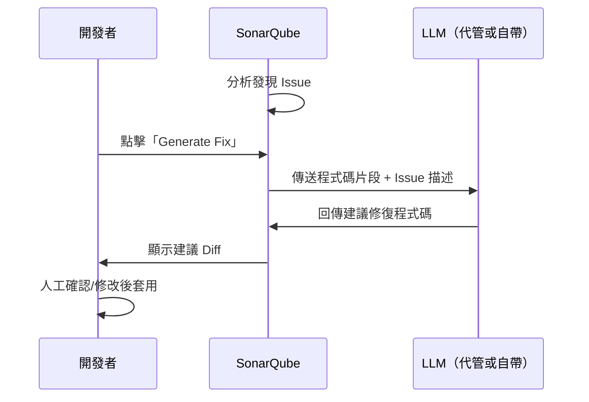

> ⚠️ **注意事項**：啟用 AI CodeFix 代表程式碼片段會被傳送至所設定的 LLM（即使是企業自帶模型，仍是「離開 SonarQube 本身進程」的資料流動）。金融、政府等對資料外流敏感的企業，應優先評估「自帶私有 LLM／地端模型」選項，並將此資料流納入既有資料治理與供應商風險評估範圍，而非預設使用 SonarSource 代管模型。

### 11.2 AI Code Assurance：AI 程式碼專屬治理

AI Code Assurance 讓企業可以：

- **標記專案／程式碼含有 AI 產生內容**（例如標註該 Repo 主要由 Claude Code／Copilot 協作開發）
- 對標記為「含 AI 程式碼」的專案，套用**專屬、通常更嚴格**的 Quality Gate（呼應第1章「AI Agent 自主產出規模暴增」的治理需求）
- 產生**外部徽章（Badge）**，對外證明該專案的 AI 產出已通過企業治理把關（可用於供應商評估、客戶稽核溝通）

> 💡 **實務案例**：與第8章「AI Code Quality Gate 強制檢核」理念一致，AI Code Assurance 把這個概念**產品化**為官方功能，企業不需自行用 Tag／Label 手動拼湊治理機制，可直接使用內建標記與專屬 Gate。

### 11.3 SonarQube MCP Server：讓 AI Agent 直接操作分析結果

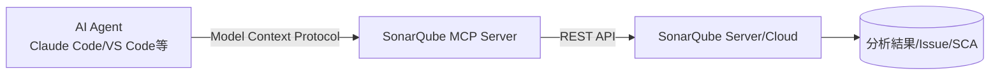

| 常見可用工具（依官方版本可能調整） | 用途 |
|---|---|
| 查詢 Quality Gate 狀態 | 取得指定專案/分支目前是否通過 |
| 列出 Issue／Security Hotspot | 取得未解決問題清單與詳細說明 |
| 查詢 SCA 依賴風險 | 取得第三方套件風險清單（第12章） |
| 更新 Issue 狀態 | 標記已確認／已解決（仍建議保留人工複核敏感操作的權限分級） |
| 分析程式碼片段 | 對尚未提交的片段做即時規則檢查 |

**企業導入建議**：

1. **獨立 Token 管理**：MCP Server 連線 Token 與一般 CI Token 分開管理，並設定到期日
2. **最小權限原則**：僅授予查詢與 Issue 狀態更新所需權限，不授予 Administrator／Quality Gate 設定變更權限
3. **稽核留痕**：透過 MCP 進行的 Issue 狀態變更，仍會留下與 Web UI／API 操作相同的歷史紀錄，可納入既有稽核流程
4. **與傳統 CLI Scan 並存**：MCP 提供「開發中快速查詢」，正式的 Quality Gate 仍應由 CI Pipeline（第17~19章）強制把關，不可僅依賴 Agent 自主呼叫 MCP 作為唯一驗證手段

實際設定方式見第9章 9.6。

### 11.4 Agent Centric Development Cycle（AC/DC）

AC/DC 是 SonarSource 提出的治理框架，用於描述「AI Agent 大量參與寫程式碼」時代下，品質與安全把關應如何融入開發循環：

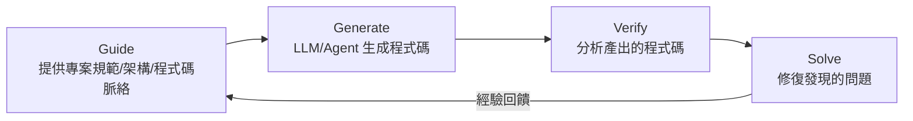

| 階段 | 說明 | 對應 SonarQube 能力 |
|---|---|---|
| **Guide** | 在 Agent 寫程式碼之前，提供專案規範、架構資訊、既有程式碼脈絡（如 `CLAUDE.md`、Quality Profile 規則） | Quality Profile、CLAUDE.md／團隊 Prompt 規範（第8、9章） |
| **Generate** | Agent 依據 Guide 階段提供的脈絡生成程式碼 | （由 AI 工具本身負責） |
| **Verify** | 分析 Generate 階段產出的程式碼 | SonarQube 分析、Quality Gate、MCP Server 即時查詢 |
| **Solve** | 修復 Verify 階段發現的問題 | AI CodeFix、Agent 自主修復（如 Claude Code 讀取 Issue 清單自動修復） |

AC/DC 形成一個自我改善迴圈：Verify／Solve 階段的經驗（哪些問題反覆出現）應回饋至 Guide 階段（調整規範、補充脈絡），讓下一輪產出品質持續提升。此框架與既有 **SSDLC**（第15章）、**DevSecOps**（第16章）並不衝突——AC/DC 是針對「Agent 自主開發」場景的治理視角，可視為 SSDLC／DevSecOps 在 AI 時代的延伸補充，而非取代既有治理框架。

### 11.5 實務案例與注意事項

> 💡 **實務案例**：某團隊導入 SonarQube MCP Server 後，Claude Code 在多輪對話中可即時查詢 Quality Gate 狀態並自主修復，PR 建立前的「人工跑掃描、等結果、回去改」迴圈大幅縮短；但團隊仍保留 CI Pipeline 的正式 Quality Gate 作為最終關卡，避免完全依賴 Agent 自我宣稱「已通過」。
>
> ⚠️ **注意事項**：AI CodeFix／AI Code Assurance／MCP Server 都是**輔助工具**，不會改變「人工需對程式碼正確性與安全性負最終責任」的治理原則；企業導入時應同步更新內部規範，明確界定哪些操作（如 Issue 標記為已解決、套用 AI CodeFix 建議）仍需人工確認，避免治理責任在自動化便利性下被悄悄稀釋。

---

## 第12章 SonarQube Advanced Security

### 🎯 學習目標

- 理解 SonarQube Advanced Security 模組的定位、涵蓋範圍與適用版本/方案
- 掌握 SCA、IaC 安全掃描、Secrets Detection、Container/SBOM 分析的核心能力
- 理解本模組與第14章 DevSecOps 既有外部工具防線的整合/取代關係

### 12.1 模組總覽

SonarQube Advanced Security 是 2025 年起推出的**獨立付費加購模組**，將原本需要另外串接的供應鏈與基礎設施安全檢查，整合進與 SAST 相同的治理介面：

| 能力 | 涵蓋範圍 | 對應第1章 1.4 比較 |
|---|---|---|
| SCA（Software Composition Analysis） | 第三方依賴風險、惡意套件偵測、授權合規、SBOM | 取代/補強原「外部 SCA 工具」欄位 |
| IaC 安全掃描 | Terraform、CloudFormation、Azure Resource Manager、Kubernetes、Ansible | 補強基礎設施層級的程式碼化風險 |
| Secrets Detection | API Key、密碼、Token 等敏感資訊外洩偵測 | 與第8章 AI 產出 Hardcoded Secret 風險呼應 |
| Container/SBOM 分析 | 匯入 SBOM 檔案分析容器內容 | 補強第14章 DevSecOps 第三層 Container Scan |

| 項目 | 說明 |
|---|---|
| 適用版本（Server） | Enterprise Edition、Data Center Edition（可加購） |
| 適用方案（Cloud） | 視方案開放範圍，請以官方當前方案頁面核對 |
| 與既有 SAST 關係 | 同一治理介面呈現，無需切換工具或另開報表 |

### 12.2 SCA：依賴風險與供應鏈安全

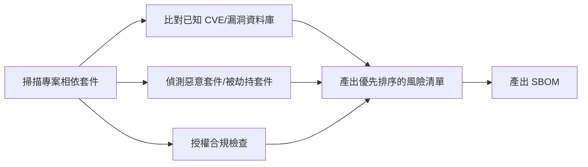

- **依賴風險**：識別第三方與開源套件帶來的已知漏洞，提供優先排序的修復建議
- **惡意套件偵測**：偵測供應鏈攻擊常見手法（如套件遭劫持、惡意版本發布），即時阻斷風險擴散
- **授權合規**：盤點相依套件授權條款，避免商業專案誤用 Copyleft 等限制性授權套件
- **SBOM（Software Bill of Materials）**：產出符合供應鏈安全要求的軟體物料清單，供稽核與客戶溝通使用

### 12.3 IaC 安全掃描

支援 Terraform、AWS CloudFormation、Azure Resource Manager、Kubernetes Manifest、Ansible 等常見 IaC 格式，於程式碼階段即發現雲端資源設定風險（如公開的 Storage Bucket、過寬的 Security Group），落實「基礎設施程式碼與應用程式碼同等級把關」。

### 12.4 Secrets Detection

掃描原始碼歷史與當前版本，偵測 API Key、雲端服務憑證、資料庫密碼等硬編碼敏感資訊；與第8章「AI 工具為了讓範例能跑而寫死金鑰」風險直接對應，建議所有專案（尤其 AI 協作專案）將此規則設為 Blocker。

### 12.5 Container/SBOM 分析

可匯入容器映像檔的 SBOM，分析容器內安裝的套件與其風險，與 CI Pipeline 中既有的 Container Scan（如 Trivy）形成互補或取代關係，視企業既有工具鏈整合成本決定。

### 12.6 與既有 DevSecOps 防線的整合

第16章描述的五層 Security Gate（SAST/SCA/Container/DAST/Runtime）中，**第二層 SCA 與第三層 Container Scan** 現可由 SonarQube Advanced Security 原生提供，企業可依下表評估是否整合：

| 情境 | 建議 |
|---|---|
| 已有成熟的外部 SCA/Container Scan 工具鏈 | 可維持現狀，將 Advanced Security 結果作為交叉比對/去重的第二來源 |
| 尚未導入 SCA/Container Scan，或想降低工具鏈複雜度 | 優先評估以 Advanced Security 取代外部工具，減少治理介面數量 |
| 高度合規導向（金融/政府） | 兩者並存交叉驗證，降低單一工具誤判/漏判風險，並保留多來源證據鏈供稽核 |

### 12.7 實務案例與注意事項

> 💡 **實務案例**：某企業導入 Advanced Security 後，將原本分散在 SonarQube（SAST）、Snyk（SCA）、Trivy（Container）三套工具的稽核報表，整合為單一 SonarQube Portfolio 視圖，大幅降低每月彙整跨工具報表的人力成本。
>
> ⚠️ **注意事項**：導入 Advanced Security 前應先盤點現有 SCA／Container Scan 工具的授權合約與整合深度（如是否已串接漏洞管理平台），避免在合約週期中途貿然切換造成治理空窗；建議先以「並存交叉驗證」階段性導入，確認覆蓋範圍與既有工具相當後，再評估是否正式取代。

---

## 第13章 Legacy System 逆向工程

### 🎯 學習目標

- 運用 SonarQube 分析結果理解 Legacy 系統的結構、依賴與風險
- 建立 Architecture Recovery 的標準分析流程

### 13.1 Legacy 系統常見挑戰

| 挑戰 | 說明 |
|---|---|
| 文件缺失 | 原開發者已離職，無架構文件 |
| 高耦合 | 模組間相互依賴，牽一動全身 |
| 技術債深 | 多年累積的 Code Smell 未清理 |
| 測試覆蓋率低 | 改動風險無法量化 |
| 框架過舊 | 使用已不維護的函式庫版本 |

### 13.2 SonarQube 逆向工程分析流程

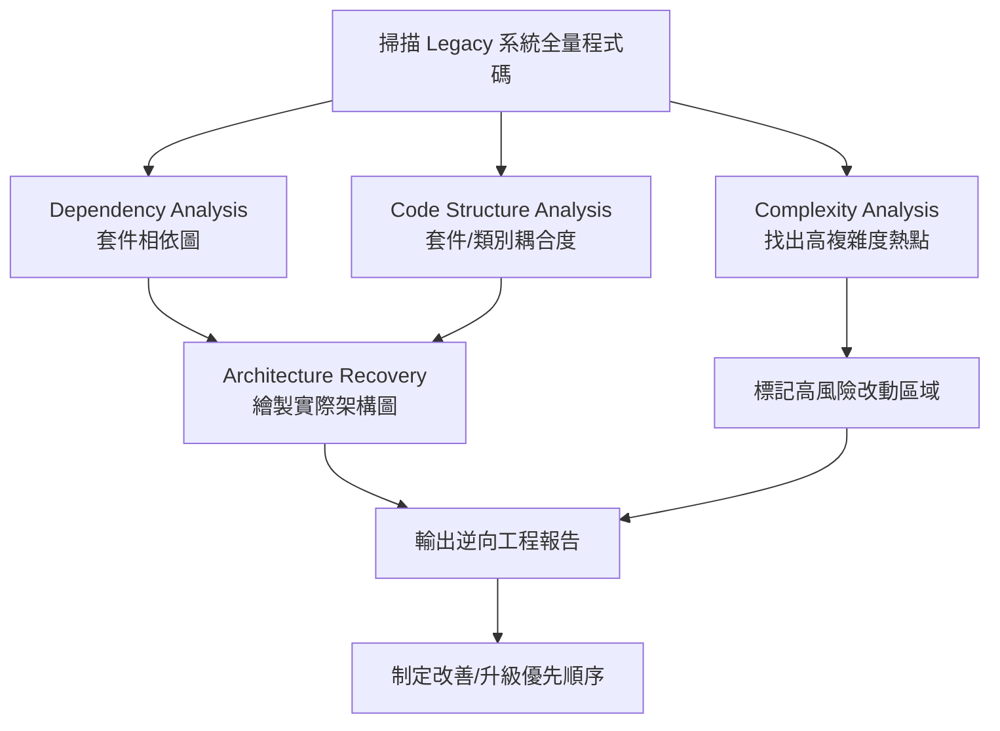

### 13.3 Dependency Analysis（依賴分析）

```bash
# 對既有系統執行全量掃描（首次掃描建議關閉 New Code 限制，取得 Overall 視角）
mvn clean verify sonar:sonar \
  -Dsonar.projectKey=legacy-core-banking \
  -Dsonar.host.url=$SONAR_HOST_URL \
  -Dsonar.token=$SONAR_TOKEN
```

透過 Web UI 的 **Measures > Complexity** 與 API 取得跨模組依賴：

```bash
curl -u admin:admin "http://localhost:9000/api/measures/component_tree?component=legacy-core-banking&metricKeys=complexity,cognitive_complexity,ncloc&strategy=children"
```

### 13.4 Code Structure Analysis（結構分析）

關注以下指標找出「上帝類別」（God Class）與「霰彈式修改」（Shotgun Surgery）熱點：

| 指標 | 風險訊號 |
|---|---|
| `ncloc`（程式碼行數）單一檔案 > 1000 行 | 可能是 God Class |
| `complexity` 單一方法 > 50 | 極難測試與理解 |
| `duplicated_lines_density` > 20% | 同樣邏輯散落多處，改一處需改多處 |
| 類別數量過多的循環依賴（Cyclic Dependency） | 架構邊界已破壞 |

### 13.5 Architecture Recovery（架構還原）

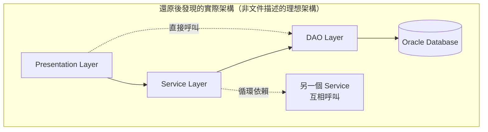

> ⚠️ **注意事項**：逆向工程常會發現「文件上畫的是分層架構，但程式碼裡 Presentation 直接呼叫 DAO」等架構腐化（Architecture Erosion）現象，SonarQube 的 Dependency 分析能提供「實際存在的依賴」證據，而非僅依賴口述歷史。

### 13.6 Database Analysis 配合策略

SonarQube 本身不直接分析資料庫 Schema，但可搭配：

1. 掃描 DAO / Repository 層程式碼，找出動態 SQL 拼接（高風險 SQL Injection 來源，常見於 Legacy 系統）
2. 搭配 Schema 比對工具（如 Liquibase diff、SchemaSpy）產出 ER 圖，與 SonarQube 程式碼依賴圖交叉比對，確認「程式碼宣稱的資料存取路徑」與「實際 SQL 內容」是否一致

### 13.7 實際案例：核心放款系統逆向工程

某銀行核心放款系統（2008 年建置，Struts 1 + 原生 JDBC）導入逆向工程分析：

1. **第一步**：全量掃描，產出 Overall Code 報告，發現 Maintainability Rating 為 D 級，Technical Debt Ratio 38%
2. **第二步**：Dependency Analysis 發現 3 組循環依賴模組，且其中一組正是「放款額度計算」核心邏輯
3. **第三步**：依複雜度排序，找出 Top 20 高風險檔案（複雜度 > 80 且無測試）
4. **第四步**：制定改善優先順序——先補測試覆蓋率，再進行小範圍重構，最後才考慮模組拆分
5. **結果**：6 個月內將核心模組 Maintainability Rating 由 D 提升至 B，且未發生因重構引發的生產事故

> 💡 **實務案例**：逆向工程階段**不要急著重構**，先建立「安全網」（測試覆蓋率 + 基準分析報告），再依風險排序逐步改善，避免「為了清技術債而引入新 Bug」。

---

## 第14章 Framework Upgrade

### 🎯 學習目標

- 運用 SonarQube 輔助 Spring Boot 2.x→3.x、Java 8→17→21、Vue 2→3 升級
- 建立框架升級的標準作業程序（SOP）

### 14.1 升級風險評估框架

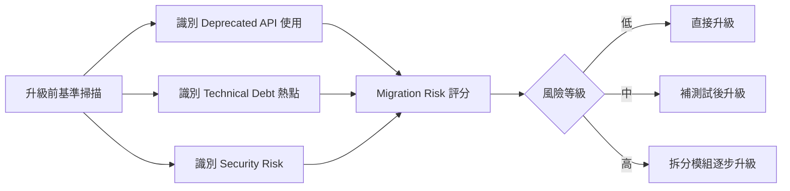

### 14.2 Spring Boot 2.x → 3.x 升級

**關鍵變更與 SonarQube 偵測重點**：

| 變更項目 | SonarQube 輔助方式 |
|---|---|
| `javax.*` → `jakarta.*` namespace 遷移 | 全文搜尋 + 自訂規則標記殘留 `javax.persistence` 等舊 import |
| Spring Security 設定方式改變（`WebSecurityConfigurerAdapter` 移除） | Deprecated API 規則會標示已棄用類別的使用 |
| 最低 Java 版本要求 17 | 配合下方 Java 升級章節 |

```bash
# 升級前：先用既有 Quality Profile 跑一次基準掃描，記錄 Issue 總數作為比較基準
mvn clean verify sonar:sonar -Dsonar.projectKey=svc-baseline-before-upgrade

# 升級程式碼（pom.xml 調整版本、javax->jakarta 遷移）
mvn org.openrewrite.maven:rewrite-maven-plugin:run \
  -Drewrite.activeRecipes=org.openrewrite.java.spring.boot3.UpgradeSpringBoot_3_0

# 升級後：再次掃描，比較 Issue 增減
mvn clean verify sonar:sonar -Dsonar.projectKey=svc-baseline-after-upgrade
```

### 14.3 Java 8 → 17 → 21 升級

採用**逐版升級**而非直接跳級，每個中繼版本都用 SonarQube 驗證：

```mermaid
graph LR
    J8[Java 8] -->|驗證 Quality Gate| J11[Java 11]
    J11 -->|驗證 Quality Gate| J17[Java 17 LTS]
    J17 -->|驗證 Quality Gate| J21[Java 21 LTS]
```

| 版本階段 | 重點檢查 |
|---|---|
| 8 → 11 | `javax.xml.bind` 等模組移除影響、`sun.misc.*` 內部 API 使用 |
| 11 → 17 | Records、Sealed Classes 等新語法導入後的 Code Smell 規則更新 |
| 17 → 21 | Virtual Threads（Project Loom）使用模式、Pattern Matching for switch |

```properties
# 升級至 Java 21 後更新 sonar 設定
sonar.java.source=21
```

> ⚠️ **注意事項**：每次跨版本升級後，務必更新 Quality Profile 中對應語言版本的規則集（部分規則僅在啟用對應 `sonar.java.source` 後才會生效，例如 Record 相關的 Code Smell）。

### 14.4 Vue 2 → 3 升級

| 變更項目 | SonarQube 輔助方式 |
|---|---|
| Options API → Composition API | 透過自訂 ESLint 規則 + SonarQube 整合，標記仍使用 `this.$data` 等舊模式的檔案 |
| `Vue.extend` 等已移除 API | Deprecated API 規則標示 |
| TypeScript 支援增強 | 升級後可啟用更嚴格的 TypeScript 規則（如 `strict: true`） |

```bash
# 升級前後比較 Technical Debt Ratio 趨勢
curl -u admin:admin "http://localhost:9000/api/measures/search_history?component=web-frontend&metrics=sqale_debt_ratio&from=2026-01-01"
```

### 14.5 框架升級 SOP

1. **基準掃描**：升級前對目標模組執行全量掃描，記錄 Maintainability/Reliability/Security Rating 與 Issue 總數
2. **建立升級分支**：獨立分支進行升級，避免與功能開發衝突
3. **自動化遷移工具**：優先使用官方遷移工具（OpenRewrite、Vue 官方 Migration Build）降低人工錯誤
4. **逐步驗證**：每完成一個模組/中繼版本，立即執行 SonarQube 掃描比較 Before/After
5. **Quality Gate 不降級**：升級後 Quality Gate 結果不可比升級前差，若變差需先修復才能繼續
6. **回歸測試 + 覆蓋率檢查**：確保覆蓋率沒有因為程式碼搬動而虛降
7. **PR 審查 + 文件更新**：記錄升級過程中發現的技術債與後續待辦事項

> 💡 **實務案例**：某團隊進行 Spring Boot 2.7 → 3.2 升級時，SonarQube 在升級後立即標記出 12 處「捕捉了過於廣泛的 Exception 類型」的新 Code Smell，原因是 OpenRewrite 自動遷移工具在處理例外處理時採用較保守的寫法；團隊將此列為已知技術債，安排下個 Sprint 統一處理，而非阻擋升級進度。

---

## 第15章 SSDLC

### 🎯 學習目標

- 理解 Secure SDLC 各階段的安全控制點
- 明確定義 SonarQube 在 SSDLC 中扮演的角色

### 15.1 SSDLC 全流程與 SonarQube 參與點

```mermaid
flowchart LR
    A[需求 Requirements] --> B[設計 Design]
    B --> C[開發 Development]
    C --> D[測試 Testing]
    D --> E[發行 Release]
    E --> F[維運 Operation]

    A -.安全需求基線.-> A1[定義 Quality Gate 標準]
    B -.威脅建模.-> B1[識別需特別關注的安全規則]
    C -.SonarQube for IDE + Local Scan.-> SQ1[SonarQube]
    D -.CI Scan + Quality Gate.-> SQ1
    E -.Release Checklist 含 Quality Gate 結果.-> SQ1
    F -.定期全量掃描 + 新漏洞規則更新.-> SQ1
```

### 15.2 各階段詳細說明

| 階段 | 安全活動 | SonarQube 角色 |
|---|---|---|
| **Requirements** | 定義資安需求基線（如：所有對外 API 須通過 OWASP Top 10 檢查） | 制定對應的 Quality Gate 標準作為需求的可執行驗證標準 |
| **Design** | 威脅建模（Threat Modeling）、架構安全審查 | 依威脅建模結果，調整 Quality Profile 啟用對應規則（如涉及金鑰管理則加嚴 Secret 規則） |
| **Development** | 安全程式碼撰寫、Code Review | SonarQube for IDE 即時回饋、AI 工具整合（第8章）、原生 AI 治理（第11章） |
| **Testing** | 單元測試、整合測試、SAST/DAST/SCA | CI Scan + Quality Gate 作為自動化關卡 |
| **Release** | Release Checklist、安全簽核 | Quality Gate 結果作為 Checklist 必填項目，並保留歷史記錄供稽核 |
| **Operation** | 漏洞監控、Patch 管理、事件回應 | 定期重新掃描既有程式碼（規則庫更新後新發現的漏洞）、追蹤 Security Rating 趨勢 |

### 15.3 SonarQube 在 SSDLC 中的治理角色

1. **可執行的安全標準**：將抽象的安全需求（如「不可有 SQL Injection」）轉換為自動化、可重複驗證的 Quality Gate 條件
2. **左移（Shift Left）**：在 Development 階段就攔截問題，而非等到 Testing/Release 才發現
3. **留痕稽核**：每次掃描結果、Quality Gate 通過/失敗紀錄、Security Hotspot 審查紀錄，都是 SSDLC 稽核的證據鏈
4. **持續監控**：Operation 階段透過規則庫更新（SonarQube 定期發布新規則），即使程式碼沒變也可能因為新規則而發現舊有風險，需建立定期全量重新掃描機制

> 💡 **實務案例**：某政府專案要求每個 Release 必須附上「SonarQube Quality Gate 結果截圖 + Security Hotspot 審查清單」作為上線簽核附件，落實 SSDLC 留痕要求，後續資安署稽核時可直接提供完整證據鏈。

> ⚠️ **注意事項**：SSDLC 不是「裝了 SonarQube 就等於有 SSDLC」，工具只是落地手段；組織仍需有威脅建模、安全需求定義、事件回應等人員與流程配套，否則容易陷入「為合規而合規」的形式主義。

---

## 第16章 DevSecOps

### 🎯 學習目標

- 理解 DevSecOps Pipeline 的設計原則
- 建立整合 GitHub Actions / GitLab CI / Jenkins 與 SonarQube 的完整 Security Gate

### 16.1 DevSecOps Pipeline 設計原則

```mermaid
flowchart TD
    A[Commit] --> B[Build]
    B --> C[Unit Test]
    C --> D[SAST: SonarQube]
    D --> E[SCA: Dependency Check]
    E --> F[Container Scan]
    F --> G[Quality Gate / Security Gate]
    G -->|Fail| H[阻擋部署 + 通知]
    G -->|Pass| I[Deploy to Staging]
    I --> J[DAST: OWASP ZAP]
    J --> K{安全閥門}
    K -->|Fail| H
    K -->|Pass| L[Deploy to Production]
    L --> M[Runtime 監控 + 漏洞情報持續比對]
```

### 16.2 Security Gate 設計：多層防線

| 層級 | 工具 | 把關時機 | 失敗處理 |
|---|---|---|---|
| 第一層：SAST | SonarQube | Commit / PR 階段 | 阻擋 Merge |
| 第二層：SCA | SonarQube Advanced Security（原生，第12章）或 OWASP Dependency-Check 等外部工具 | CI 階段 | 阻擋 Build 產出 Artifact |
| 第三層：Container Scan | SonarQube Advanced Security（Container/SBOM，第12章）或 Trivy / Grype | Image Build 後 | 阻擋推送至 Registry |
| 第四層：DAST | OWASP ZAP | Staging 部署後 | 阻擋晉升 Production |
| 第五層：Runtime | RASP / WAF / 漏洞情報訂閱 | Production 持續監控 | 觸發事件回應流程 |

> 💡 第二、三層是否改用 SonarQube Advanced Security 取代外部工具，請參考第12章 12.6 的整合建議與評估表。

### 16.3 完整 DevSecOps Pipeline 範例（GitHub Actions）

```yaml
name: DevSecOps Pipeline
on:
  push:
    branches: [main, develop]
  pull_request:

jobs:
  build-test-sast:
    runs-on: ubuntu-latest
    steps:
      - uses: actions/checkout@v4
        with:
          fetch-depth: 0
      - uses: actions/setup-java@v4
        with:
          java-version: '21'
          distribution: 'temurin'
      - name: Build & Unit Test
        run: mvn -B clean verify

      - name: SAST - SonarQube Scan
        uses: SonarSource/sonarqube-scan-action@v4
        env:
          SONAR_TOKEN: ${{ secrets.SONAR_TOKEN }}
          SONAR_HOST_URL: ${{ secrets.SONAR_HOST_URL }}

      - name: Quality Gate Check
        uses: SonarSource/sonarqube-quality-gate-action@v1
        timeout-minutes: 5
        env:
          SONAR_TOKEN: ${{ secrets.SONAR_TOKEN }}

      - name: SCA - OWASP Dependency Check
        run: mvn org.owasp:dependency-check-maven:check

  container-scan:
    needs: build-test-sast
    runs-on: ubuntu-latest
    steps:
      - uses: actions/checkout@v4
      - name: Build Image
        run: docker build -t payment-service:${{ github.sha }} .
      - name: Trivy Container Scan
        uses: aquasecurity/trivy-action@master
        with:
          image-ref: payment-service:${{ github.sha }}
          severity: 'CRITICAL,HIGH'
          exit-code: '1'

  dast:
    needs: container-scan
    runs-on: ubuntu-latest
    steps:
      - name: Deploy to Staging
        run: ./scripts/deploy-staging.sh
      - name: OWASP ZAP Baseline Scan
        uses: zaproxy/action-baseline@v0.12.0
        with:
          target: 'https://staging.example.com'
          fail_action: true
```

### 16.4 Security Gate 治理原則

1. **快速失敗（Fail Fast）**：把成本最低、速度最快的檢查（SAST）放在 Pipeline 最前面
2. **不可繞過**：任何環境（包含 Hotfix 緊急上線）都不可跳過 Security Gate，若有特殊情況須走正式的風險豁免簽核流程並留下紀錄
3. **指標可視化**：將各層 Gate 的通過率、平均修復時間（MTTR）整合至 DevSecOps 儀表板
4. **跨工具去重**：SAST（SonarQube）、SCA、DAST 結果可能對同一漏洞重複告警，建立去重機制（依 CWE/CVE 編號比對）避免告警疲勞

> 💡 **實務案例**：某保險公司導入五層 Security Gate 後，初期因 Container Scan 攔截大量 Base Image 既有 CVE 導致部署延遈；改為「Critical 阻擋、High 限期修復、Medium 記錄追蹤」分級處理後，兼顧安全要求與交付節奏。

> ⚠️ **注意事項**：DevSecOps 的核心精神是「安全是每個人的責任」，而非「資安團隊事後把關」；SonarQube 等工具應盡早讓開發者在自己的 IDE/Local 階段就看到結果，而非只在 CI 階段才第一次得知問題。

---

## 第17章 GitHub Actions 整合

### 🎯 學習目標

- 掌握 Spring Boot、Vue、Monorepo、Microservices 情境下的 GitHub Actions + SonarQube 整合

> 💡 **版本提醒**：以下範例中 `sonarqube-scan-action`／`sonarqube-quality-gate-action` 等 Action 版本號會隨官方發布持續推進，請至 GitHub Marketplace 對應頁面核對當前主版本後調整。

### 17.1 Spring Boot 專案完整 YAML

```yaml
name: SonarQube - Spring Boot
on:
  push:
    branches: [main]
  pull_request:

jobs:
  sonar:
    runs-on: ubuntu-latest
    steps:
      - uses: actions/checkout@v4
        with:
          fetch-depth: 0
      - uses: actions/setup-java@v4
        with:
          java-version: '21'
          distribution: 'temurin'
          cache: maven
      - name: Build, Test, Coverage
        run: mvn -B clean verify org.jacoco:jacoco-maven-plugin:report
      - name: SonarQube Scan
        uses: SonarSource/sonarqube-scan-action@v5
        env:
          SONAR_TOKEN: ${{ secrets.SONAR_TOKEN }}
          SONAR_HOST_URL: ${{ secrets.SONAR_HOST_URL }}
        with:
          args: >
            -Dsonar.projectKey=spring-boot-service
            -Dsonar.coverage.jacoco.xmlReportPaths=target/site/jacoco/jacoco.xml
      - uses: SonarSource/sonarqube-quality-gate-action@v1
        timeout-minutes: 5
        env:
          SONAR_TOKEN: ${{ secrets.SONAR_TOKEN }}
```

### 17.2 Vue 3 專案完整 YAML

```yaml
name: SonarQube - Vue Frontend
on:
  push:
    branches: [main]
  pull_request:

jobs:
  sonar:
    runs-on: ubuntu-latest
    steps:
      - uses: actions/checkout@v4
        with:
          fetch-depth: 0
      - uses: actions/setup-node@v4
        with:
          node-version: '20'
          cache: 'npm'
      - run: npm ci
      - run: npm run lint
      - run: npm run test:coverage
      - uses: SonarSource/sonarqube-scan-action@v5
        env:
          SONAR_TOKEN: ${{ secrets.SONAR_TOKEN }}
          SONAR_HOST_URL: ${{ secrets.SONAR_HOST_URL }}
      - uses: SonarSource/sonarqube-quality-gate-action@v1
        timeout-minutes: 5
        env:
          SONAR_TOKEN: ${{ secrets.SONAR_TOKEN }}
```

### 17.3 Monorepo 多模組整合

```yaml
name: SonarQube - Monorepo
on:
  pull_request:

jobs:
  detect-changes:
    runs-on: ubuntu-latest
    outputs:
      backend: ${{ steps.filter.outputs.backend }}
      frontend: ${{ steps.filter.outputs.frontend }}
    steps:
      - uses: actions/checkout@v4
      - uses: dorny/paths-filter@v3
        id: filter
        with:
          filters: |
            backend:
              - 'services/backend/**'
            frontend:
              - 'apps/frontend/**'

  sonar-backend:
    needs: detect-changes
    if: needs.detect-changes.outputs.backend == 'true'
    runs-on: ubuntu-latest
    defaults:
      run:
        working-directory: services/backend
    steps:
      - uses: actions/checkout@v4
        with: { fetch-depth: 0 }
      - uses: actions/setup-java@v4
        with: { java-version: '21', distribution: 'temurin' }
      - run: mvn -B clean verify sonar:sonar -Dsonar.projectKey=monorepo-backend
        env:
          SONAR_TOKEN: ${{ secrets.SONAR_TOKEN }}
          SONAR_HOST_URL: ${{ secrets.SONAR_HOST_URL }}

  sonar-frontend:
    needs: detect-changes
    if: needs.detect-changes.outputs.frontend == 'true'
    runs-on: ubuntu-latest
    defaults:
      run:
        working-directory: apps/frontend
    steps:
      - uses: actions/checkout@v4
        with: { fetch-depth: 0 }
      - uses: actions/setup-node@v4
        with: { node-version: '20' }
      - run: npm ci && npm run test:coverage
      - uses: SonarSource/sonarqube-scan-action@v5
        env:
          SONAR_TOKEN: ${{ secrets.SONAR_TOKEN }}
          SONAR_HOST_URL: ${{ secrets.SONAR_HOST_URL }}
        with:
          args: -Dsonar.projectKey=monorepo-frontend
```

> 💡 Monorepo 採用**路徑偵測（path filter）只掃描變更模組**，可大幅縮短 CI 時間；但仍須安排「每日全量掃描」排程，確保跨模組依賴問題不被遺漏。

### 17.4 Microservices（多 Repo）共用 Workflow

```yaml
# .github/workflows/sonarqube-reusable.yml（共用工作流程，供各微服務 Repo 呼叫）
name: Reusable SonarQube Scan
on:
  workflow_call:
    inputs:
      project-key:
        required: true
        type: string
    secrets:
      SONAR_TOKEN:
        required: true
      SONAR_HOST_URL:
        required: true

jobs:
  sonar:
    runs-on: ubuntu-latest
    steps:
      - uses: actions/checkout@v4
        with: { fetch-depth: 0 }
      - uses: actions/setup-java@v4
        with: { java-version: '21', distribution: 'temurin' }
      - run: mvn -B clean verify sonar:sonar -Dsonar.projectKey=${{ inputs.project-key }}
        env:
          SONAR_TOKEN: ${{ secrets.SONAR_TOKEN }}
          SONAR_HOST_URL: ${{ secrets.SONAR_HOST_URL }}
```

```yaml
# 各微服務 Repo 內的呼叫端
jobs:
  call-sonar:
    uses: org/shared-workflows/.github/workflows/sonarqube-reusable.yml@main
    with:
      project-key: order-service
    secrets:
      SONAR_TOKEN: ${{ secrets.SONAR_TOKEN }}
      SONAR_HOST_URL: ${{ secrets.SONAR_HOST_URL }}
```

> ⚠️ **注意事項**：`fetch-depth: 0` 是常見遺漏項，SonarQube 需要完整 Git 歷史來正確計算 New Code（與基準分支比較），淺層 Clone 會導致 New Code 指標失準。

---

## 第18章 GitLab CI/CD 整合

### 🎯 學習目標

- 建立 GitLab CI/CD + SonarQube 的企業級整合範例
- 掌握 Merge Request Decoration 設定

### 18.1 完整 YAML 範例

```yaml
# .gitlab-ci.yml
stages:
  - build
  - test
  - sonar

variables:
  MAVEN_OPTS: "-Dmaven.repo.local=.m2/repository"
  SONAR_USER_HOME: "${CI_PROJECT_DIR}/.sonar"
  GIT_DEPTH: "0"

cache:
  key: "${CI_JOB_NAME}"
  paths:
    - .m2/repository
    - .sonar/cache

build:
  stage: build
  image: maven:3.9-eclipse-temurin-21
  script:
    - mvn -B compile

unit-test:
  stage: test
  image: maven:3.9-eclipse-temurin-21
  script:
    - mvn -B test org.jacoco:jacoco-maven-plugin:report
  artifacts:
    paths:
      - target/site/jacoco/jacoco.xml

sonarqube-check:
  stage: sonar
  image: maven:3.9-eclipse-temurin-21
  script:
    - mvn -B sonar:sonar
        -Dsonar.projectKey=$CI_PROJECT_NAME
        -Dsonar.host.url=$SONAR_HOST_URL
        -Dsonar.token=$SONAR_TOKEN
        -Dsonar.qualitygate.wait=true
  allow_failure: false
  rules:
    - if: '$CI_PIPELINE_SOURCE == "merge_request_event"'
    - if: '$CI_COMMIT_BRANCH == "main"'
```

### 18.2 Merge Request Decoration 設定

於 SonarQube **Project Settings > General Settings > DevOps Platform Integration**，設定 GitLab 整合：

```bash
curl -u admin:admin -X POST "http://localhost:9000/api/alm_settings/create_gitlab" \
  -d "key=corp-gitlab&url=https://gitlab.example.com/api/v4&personalAccessToken=$GITLAB_PAT"

curl -u admin:admin -X POST "http://localhost:9000/api/alm_settings/set_gitlab_binding" \
  -d "almSetting=corp-gitlab&project=payment-service&repository=12345"
```

設定完成後，Merge Request 頁面將顯示 SonarQube Widget，包含 Quality Gate 狀態與 New Issue 摘要。

### 18.3 企業設定最佳實務

1. **使用 Project-level CI/CD Variable** 儲存 `SONAR_TOKEN`，並設定為 `Masked` + `Protected`（僅受保護分支可用）
2. **GitLab Group-level Variable** 統一管理 `SONAR_HOST_URL`，避免各 Repo 各自硬編碼
3. **Pipeline Template 共用**：透過 `include:` 引入集團共用的 `.gitlab-ci-sonarqube-template.yml`，確保所有專案套用一致的掃描設定

```yaml
# .gitlab-ci-sonarqube-template.yml（共用範本）
.sonarqube-scan:
  stage: sonar
  image: maven:3.9-eclipse-temurin-21
  script:
    - mvn -B sonar:sonar -Dsonar.token=$SONAR_TOKEN -Dsonar.host.url=$SONAR_HOST_URL
  rules:
    - if: '$CI_PIPELINE_SOURCE == "merge_request_event"'
```

```yaml
# 各專案 .gitlab-ci.yml
include:
  - project: 'platform/ci-templates'
    file: '.gitlab-ci-sonarqube-template.yml'

sonarqube-check:
  extends: .sonarqube-scan
```

> 💡 **實務案例**：集團導入共用 Pipeline Template 後，新專案導入 SonarQube 的時間從原本平均 2 天（各團隊自行摸索設定）縮短至 30 分鐘（複製範本 + 設定變數即可）。

> ⚠️ **注意事項**：GitLab CI 預設 `GIT_DEPTH` 為淺層 Clone（通常 50），務必在涉及 SonarQube 的 Job 設定 `GIT_DEPTH: "0"`，否則 New Code 比較基準會出錯。

---

## 第19章 Jenkins 整合

### 🎯 學習目標

- 建立 Jenkins Pipeline + SonarQube 整合，包含 Webhook 非同步等待與 Shared Library 封裝

### 19.1 Declarative Pipeline 範例

```groovy
pipeline {
    agent any

    tools {
        maven 'Maven-3.9'
        jdk 'Temurin-21'
    }

    environment {
        SONAR_TOKEN = credentials('sonarqube-token')
    }

    stages {
        stage('Checkout') {
            steps {
                checkout scm
            }
        }
        stage('Build & Test') {
            steps {
                sh 'mvn -B clean verify org.jacoco:jacoco-maven-plugin:report'
            }
        }
        stage('SonarQube Analysis') {
            steps {
                withSonarQubeEnv('corp-sonarqube') {
                    sh '''
                        mvn -B sonar:sonar \
                          -Dsonar.projectKey=${JOB_NAME} \
                          -Dsonar.token=${SONAR_TOKEN}
                    '''
                }
            }
        }
        stage('Quality Gate') {
            steps {
                timeout(time: 10, unit: 'MINUTES') {
                    waitForQualityGate abortPipeline: true
                }
            }
        }
        stage('Deploy') {
            when { branch 'main' }
            steps {
                sh './scripts/deploy.sh'
            }
        }
    }

    post {
        failure {
            slackSend channel: '#devsecops-alerts', message: "❌ ${JOB_NAME} #${BUILD_NUMBER} 失敗：Quality Gate 未通過"
        }
    }
}
```

> ⚠️ **注意事項**：`waitForQualityGate` 採用 **Webhook 回呼機制**而非輪詢，因此 Jenkins Server 必須設定 SonarQube Webhook 指向 `<Jenkins_URL>/sonarqube-webhook/`，否則 Pipeline 會卡在等待直到 Timeout。

### 19.2 SonarQube Server 端設定 Jenkins Webhook

```bash
curl -u admin:admin -X POST "http://localhost:9000/api/webhooks/create" \
  -d "name=Jenkins&url=https://jenkins.example.com/sonarqube-webhook/"
```

### 19.3 Shared Library 封裝（企業標準化）

```groovy
// vars/sonarQubeScan.groovy（Shared Library）
def call(Map config = [:]) {
    def projectKey = config.projectKey ?: env.JOB_NAME
    def gateTimeout = config.gateTimeoutMinutes ?: 10

    stage('SonarQube Analysis') {
        withSonarQubeEnv('corp-sonarqube') {
            sh """
                mvn -B sonar:sonar \
                  -Dsonar.projectKey=${projectKey} \
                  -Dsonar.token=\${SONAR_TOKEN}
            """
        }
    }
    stage('Quality Gate') {
        timeout(time: gateTimeout, unit: 'MINUTES') {
            waitForQualityGate abortPipeline: true
        }
    }
}
```

```groovy
// 各專案 Jenkinsfile 呼叫共用 Library
@Library('corp-shared-library') _

pipeline {
    agent any
    stages {
        stage('Build') {
            steps { sh 'mvn -B clean verify' }
        }
    }
    post {
        success {
            script { sonarQubeScan(projectKey: 'order-service', gateTimeoutMinutes: 5) }
        }
    }
}
```

### 19.4 最佳實務

1. **集中管理 Server 連線資訊**：於 Jenkins **Manage Jenkins > System > SonarQube servers** 設定一次，各 Pipeline 透過 `withSonarQubeEnv('corp-sonarqube')` 引用，避免 Token/URL 散落各 Jenkinsfile
2. **Credential 一律使用 Jenkins Credentials Store**，不可寫死於 Jenkinsfile 或 Shell Script
3. **Shared Library 版本化**：透過 Git Tag 管理 Shared Library 版本，重大變更（如 Quality Gate 邏輯調整）採用新版號，避免影響既有 Pipeline
4. **Multibranch Pipeline** 搭配 PR Decoration，確保 Feature Branch 也能在合併前看到分析結果

> 💡 **實務案例**：某企業將 200+ 個 Jenkinsfile 中重複的 SonarQube 設定，抽取為 Shared Library 後，後續調整 Quality Gate 等待邏輯只需修改一處，並透過版本化逐步讓各專案升級，而非強制全部 Pipeline 同時變更。

---

## 第20章 SonarQube API

### 🎯 學習目標

- 掌握 REST API 認證方式
- 能透過 curl / Java / Python 自動化操作 Project、Quality Gate、Issue

### 20.1 認證方式

```bash
# 方式一：Token 作為 Basic Auth 帳號（密碼留空）
curl -u "$SONAR_TOKEN:" "http://localhost:9000/api/system/status"

# 方式二：Bearer Token（新版建議方式）
curl -H "Authorization: Bearer $SONAR_TOKEN" "http://localhost:9000/api/system/status"
```

### 20.2 Project API

```bash
# 建立專案
curl -u "$SONAR_TOKEN:" -X POST "http://localhost:9000/api/projects/create" \
  -d "project=new-service&name=New Service"

# 查詢專案列表
curl -u "$SONAR_TOKEN:" "http://localhost:9000/api/projects/search?q=service"

# 刪除專案
curl -u "$SONAR_TOKEN:" -X POST "http://localhost:9000/api/projects/delete" \
  -d "project=deprecated-service"
```

### 20.3 Quality Gate API

```bash
# 取得專案目前 Quality Gate 狀態
curl -u "$SONAR_TOKEN:" "http://localhost:9000/api/qualitygates/project_status?projectKey=payment-service"

# 取得 Quality Gate 詳細結果（含各 Condition 通過/失敗）
curl -u "$SONAR_TOKEN:" "http://localhost:9000/api/qualitygates/project_status?projectKey=payment-service" | jq '.projectStatus.conditions'
```

### 20.4 Issue API

```bash
# 查詢專案所有未解決的 Vulnerability
curl -u "$SONAR_TOKEN:" "http://localhost:9000/api/issues/search?componentKeys=payment-service&types=VULNERABILITY&resolved=false"

# 將某 Issue 標記為已確認（Confirm）
curl -u "$SONAR_TOKEN:" -X POST "http://localhost:9000/api/issues/do_transition" \
  -d "issue=AYg1RT-PdyiEm6IY&transition=confirm"

# 批次取得 Security Hotspot 清單
curl -u "$SONAR_TOKEN:" "http://localhost:9000/api/hotspots/search?projectKey=payment-service&status=TO_REVIEW"
```

### 20.5 Automation API 應用：自動化稽核報表

```bash
#!/bin/bash
# generate-compliance-report.sh：每日彙整所有專案 Quality Gate 狀態
PROJECTS=$(curl -s -u "$SONAR_TOKEN:" "http://localhost:9000/api/projects/search?ps=500" | jq -r '.components[].key')

echo "Project,QualityGate,SecurityRating,Coverage" > report.csv
for p in $PROJECTS; do
  STATUS=$(curl -s -u "$SONAR_TOKEN:" "http://localhost:9000/api/qualitygates/project_status?projectKey=$p" | jq -r '.projectStatus.status')
  MEASURES=$(curl -s -u "$SONAR_TOKEN:" "http://localhost:9000/api/measures/component?component=$p&metricKeys=security_rating,coverage")
  SEC=$(echo "$MEASURES" | jq -r '.component.measures[] | select(.metric=="security_rating") | .value')
  COV=$(echo "$MEASURES" | jq -r '.component.measures[] | select(.metric=="coverage") | .value')
  echo "$p,$STATUS,$SEC,$COV" >> report.csv
done
```

### 20.6 Java 客戶端範例

```java
// 使用 java.net.http.HttpClient（Java 17+ 內建，無需額外套件）
HttpClient client = HttpClient.newHttpClient();
String token = System.getenv("SONAR_TOKEN");
String auth = Base64.getEncoder().encodeToString((token + ":").getBytes());

HttpRequest request = HttpRequest.newBuilder()
        .uri(URI.create("http://localhost:9000/api/qualitygates/project_status?projectKey=payment-service"))
        .header("Authorization", "Basic " + auth)
        .GET()
        .build();

HttpResponse<String> response = client.send(request, HttpResponse.BodyHandlers.ofString());
System.out.println(response.body());
```

### 20.7 Python 客戶端範例

```python
import requests
import os

SONAR_URL = "http://localhost:9000"
TOKEN = os.environ["SONAR_TOKEN"]

def get_quality_gate_status(project_key: str) -> str:
    resp = requests.get(
        f"{SONAR_URL}/api/qualitygates/project_status",
        params={"projectKey": project_key},
        auth=(TOKEN, ""),
        timeout=10,
    )
    resp.raise_for_status()
    return resp.json()["projectStatus"]["status"]

def list_vulnerabilities(project_key: str) -> list[dict]:
    resp = requests.get(
        f"{SONAR_URL}/api/issues/search",
        params={"componentKeys": project_key, "types": "VULNERABILITY", "resolved": "false"},
        auth=(TOKEN, ""),
        timeout=10,
    )
    resp.raise_for_status()
    return resp.json()["issues"]

if __name__ == "__main__":
    status = get_quality_gate_status("payment-service")
    print(f"Quality Gate: {status}")
    if status == "ERROR":
        for issue in list_vulnerabilities("payment-service"):
            print(f"- [{issue['severity']}] {issue['message']}")
```

> ⚠️ **注意事項**：API 自動化腳本的 Token 應使用**權限受限的 Service Account Token**（如僅 `Browse` 權限的報表用 Token），且需設定到期日並定期輪替，不可使用 Administrator 個人 Token 寫入自動化腳本。

---

## 第21章 維運管理

### 🎯 學習目標

- 建立 SonarQube 的備份、還原、效能調校、監控與容量規劃標準作業

### 21.1 Backup / Restore

SonarQube 沒有內建「一鍵備份」功能，備份策略需自行組合：

| 備份對象 | 方式 |
|---|---|
| Database | `pg_dump`（邏輯備份）+ WAL 持續備份（時間點還原） |
| `data/` 目錄（Elasticsearch 索引） | 檔案系統層級備份（索引可由 Database 資料重建，非必要可不備份，但備份可加速復原） |
| `conf/sonar.properties` | 納入版本控制或 IaC 設定管理（如 Ansible/Helm values） |
| Plugins（`extensions/plugins`） | 記錄版本清單，便於重新安裝 |

```bash
# PostgreSQL 邏輯備份
pg_dump -U sonarqube -F c -f sonarqube_$(date +%Y%m%d).dump sonarqube

# 還原
pg_restore -U sonarqube -d sonarqube_restored sonarqube_20260601.dump
```

> ⚠️ **注意事項**：還原 Database 後，**必須**清空並重建 Elasticsearch 索引（`data/es8` 目錄），SonarQube 啟動時會自動依 Database 內容重建索引，但需預留足夠時間（視專案數量，可能需數十分鐘）。

### 21.2 Upgrade（版本升級維運面）

```bash
# 升級前：先備份 Database
pg_dump -U sonarqube -F c -f pre_upgrade_backup.dump sonarqube

# 停止服務
sudo systemctl stop sonarqube

# 替換程式檔案（保留 conf/、data/、extensions/plugins 中的第三方外掛需逐一檢查相容性；<VERSION> 請替換為目標 LTA 版本，如 2026.1）
sudo unzip sonarqube-<VERSION>.zip -d /opt/

# 啟動，系統會自動執行 Database Migration
sudo systemctl start sonarqube
tail -f /opt/sonarqube/logs/sonar.log  # 觀察 "Database is up to date" 訊息
```

### 21.3 Log Analysis

| Log 檔案 | 用途 |
|---|---|
| `logs/sonar.log` | 主服務啟動/錯誤紀錄 |
| `logs/web.log` | Web Server 請求、認證錯誤 |
| `logs/ce.log` | Compute Engine 分析運算紀錄（掃描卡住時首查） |
| `logs/es.log` | Elasticsearch 索引、叢集狀態 |
| `logs/deprecation.log` | 已棄用設定警告 |

```bash
# 常見問題：分析卡在 PENDING，查看 Compute Engine 是否有錯誤
grep -i "ERROR" logs/ce.log | tail -50

# 查看某次分析任務詳細結果
curl -u "$SONAR_TOKEN:" "http://localhost:9000/api/ce/task?id=<task-id>"
```

### 21.4 效能調校

```properties
# conf/sonar.properties — JVM 調校範例（依硬體規模調整）
sonar.web.javaOpts=-Xmx2g -Xms2g -XX:+HeapDumpOnOutOfMemoryError
sonar.ce.javaOpts=-Xmx4g -Xms4g -XX:+HeapDumpOnOutOfMemoryError
sonar.search.javaOpts=-Xmx4g -Xms4g

# Compute Engine 平行運算數（依 CPU 核心數調整，過高會互相搶資源）
sonar.ce.workerCount=4
```

| 效能瓶頸 | 排查方向 |
|---|---|
| 掃描排隊（Queue）過長 | 增加 `sonar.ce.workerCount` 或新增 Application Node |
| Web UI 反應緩慢 | 檢查 Elasticsearch heap 是否不足、Database 連線池是否飽和 |
| 單次掃描耗時過長 | 檢查 `sonar.exclusions` 是否排除了 `node_modules`、`target`、`dist` 等不必要目錄 |

### 21.5 Database Maintenance

```sql
-- PostgreSQL 定期維護（建議排程於低峰時段）
VACUUM ANALYZE;
REINDEX DATABASE sonarqube;
```

### 21.6 Elasticsearch Maintenance

```bash
# 檢查內嵌 Elasticsearch 健康狀態
curl -u "$SONAR_TOKEN:" "http://localhost:9000/api/system/health"

# 嚴重索引問題時，可請求 SonarQube 重建索引（注意：會短暫無法搜尋）
curl -u "$SONAR_TOKEN:" -X POST "http://localhost:9000/api/system/reindex"
```

### 21.7 Monitoring / Alert

```yaml
# Prometheus 監控範例（搭配 Data Center Edition 的 /api/monitoring/metrics）
scrape_configs:
  - job_name: 'sonarqube'
    metrics_path: '/api/monitoring/metrics'
    bearer_token: 'YOUR_MONITORING_PASSCODE'
    static_configs:
      - targets: ['sonarqube.internal.example.com:9000']
```

建議告警規則：

- `/api/system/health` 回傳非 `GREEN` 超過 5 分鐘
- Compute Engine Queue 長度持續成長（代表分析能力供不應求）
- Database 連線數接近上限

### 21.8 容量規劃

| 成長因子 | 規劃建議 |
|---|---|
| 專案數量 | 每新增 50 個中型專案，評估是否需要增加 Application Node |
| 程式碼總行數（NCLOC） | License 通常依 NCLOC 計費，需定期盤點避免超出授權範圍 |
| 掃描頻率（PR 數量） | 高頻 PR 團隊需提高 `sonar.ce.workerCount` 與 Worker Node 數量 |
| 歷史資料保留 | Database 隨時間增長，規劃定期歸檔策略 |

> 💡 **實務案例**：某企業每月透過 Automation API 統計各專案 NCLOC 總量，作為 License 採購談判與成本分攤（Chargeback）依據，避免年度授權續約時才驚覺超用。

---

## 第22章 升級策略

### 🎯 學習目標

- 建立 LTA 升級、Release 升級、Rollback 的標準作業程序與風險控制機制
- 理解 SonarQube Server 自 2025 年起的年度日曆版號與發布節奏

### 22.1 LTA（Long-Term Active）升級策略

SonarQube Server 自 2025 年起改用**年度日曆版號** `YYYY.Release.Patch`：每年第一個發布版本即為 **LTA（Long-Term Active，取代舊稱 LTS）**，年內後續版本（如 `.2`、`.3`、`.4`）為一般 Release，提供新功能但非長期維護目標版本。LTA 發布週期已由舊制的 18 個月縮短為 12 個月，企業應**優先停留在 LTA 版本**，僅在 LTA 之間升級，避免逐一追逐年中 Release：

```mermaid
graph LR
    LTA1[LTA 版本<br/>如 2025.1] -->|跳過年中 Release| LTA2[LTA 版本<br/>如 2026.1]
    LTA2 -->|跳過年中 Release| LTA3[LTA 版本<br/>如下一年度首發]
```

| 升級類型 | 頻率建議 | 風險等級 |
|---|---|---|
| LTA → LTA | 每 12 個月 | 中（官方有明確升級路徑文件） |
| Patch 版本（如 `2026.1.0` → `2026.1.1`） | 隨官方發布即時跟進 | 低（多為安全修補） |
| 跳過多個 LTA 直接升級 | 不建議 | 高（可能需要逐步中繼升級） |
| SonarQube Community Build | 持續滾動發行，無 LTA／Patch 概念，建議定期跟進最新版本 | 視變更內容而定，建議先讀官方 Release Notes |

> ⚠️ **注意事項**：SonarQube Cloud 為 SaaS，版本升級由官方自動完成，企業不需自行規劃升級時程；本章升級策略主要適用於自管的 SonarQube Server／Community Build。

### 22.2 Major Upgrade SOP

1. **閱讀官方 Upgrade Notes**：確認是否有 Breaking Change（如 API 棄用、Plugin 相容性、MQR Mode 預設行為調整）
2. **測試環境先行**：在與生產環境規格一致的測試環境完整演練升級流程
3. **Plugin 相容性盤點**：第三方外掛（如 LDAP、SAML 整合套件）需逐一確認新版相容性
4. **備份**：依第21章備份策略，完整備份 Database
5. **維護窗口公告**：升級期間服務不可用，需提前通知所有使用團隊
6. **執行升級**：依官方文件逐步執行，觀察 `sonar.log` 確認 Migration 成功
7. **驗證**：抽樣重新觸發幾個專案的掃描，確認 Quality Gate、PR Decoration 正常運作
8. **觀察期**：升級後 48 小時內密切監控錯誤日誌與使用者回報

### 22.3 Rollback 策略

```mermaid
flowchart TD
    A[升級執行] --> B{驗證是否成功}
    B -->|成功| C[結束，進入觀察期]
    B -->|失敗| D[停止服務]
    D --> E[還原 Database 備份]
    E --> F[還原舊版程式檔案]
    F --> G[啟動舊版服務]
    G --> H[驗證服務恢復]
    H --> I[事後檢討 Root Cause]
```

> ⚠️ **注意事項**：SonarQube 的 Database Schema Migration **通常不支援降版（Downgrade）**，一旦新版本完成 Migration，無法直接「降級」回舊版本連接同一個 Database；Rollback 必須依賴**升級前的完整 Database 備份還原**，而非僅切換程式檔案版本。這也是為何升級前備份是強制步驟，沒有例外。

### 22.4 風險控制清單

- [ ] 已閱讀目標版本的官方 Release Notes / Upgrade Guide
- [ ] 已在測試環境完整演練升級流程並記錄耗時
- [ ] 已確認所有第三方 Plugin 相容性
- [ ] 已完整備份 Database 並驗證備份可還原
- [ ] 已公告維護窗口並取得關鍵團隊確認
- [ ] 已準備 Rollback 腳本與還原 SOP
- [ ] 已安排升級後 48 小時觀察期的值班人員

> 💡 **實務案例**：某銀行每次 Major Upgrade 前，會先在影子環境（Shadow Environment，與生產環境資料結構相同但獨立的測試環境）完整還原一份生產 Database 備份進行演練，確保升級腳本在真實資料規模下的執行時間可預估，避免正式維護窗口超時。

---

## 第23章 企業導入最佳實務

### 🎯 學習目標

- 建立 PoC → Pilot → Production 的完整導入路線圖
- 設計治理架構、組織架構、權限架構

### 23.1 導入路線圖

```mermaid
gantt
    title SonarQube 企業導入路線圖
    dateFormat YYYY-MM-DD
    section PoC
    工具評估與架構設計      :a1, 2026-01-01, 14d
    PoC 環境部署            :a2, after a1, 7d
    單一專案驗證            :a3, after a2, 14d
    section Pilot
    Quality Gate 標準制定   :b1, after a3, 14d
    3-5 個試點專案導入       :b2, after b1, 30d
    CI/CD 整合與流程優化    :b3, after b2, 21d
    section Production
    正式環境部署（含 HA）   :c1, after b3, 14d
    全公司分階段導入        :c2, after c1, 90d
    治理儀表板與持續優化    :c3, after c2, 60d
```

### 23.2 PoC 階段

| 目標 | 產出 |
|---|---|
| 驗證技術可行性 | 部署文件、與既有 CI/CD 整合可行性報告 |
| 評估規則集適用性 | 預設 Quality Profile 對公司程式碼的 Issue 密度評估 |
| 評估版本需求 | Community 是否足夠，或需 Developer/Enterprise |

### 23.3 Pilot 階段

- 選擇 **3～5 個代表性專案**（建議涵蓋不同技術棧：1 個 Java 後端、1 個 Vue 前端、1 個 Legacy 系統）
- 制定初版 Quality Gate，**避免一開始就用銀行級嚴格標準**，先用較寬鬆門檻讓團隊適應流程
- 收集團隊回饋，調整 Quality Profile 規則嚴重度（避免初期大量誤判打擊團隊信心）

### 23.4 Production 階段

- 分階段導入，依**團隊成熟度**而非僅依組織架構排序（先導入已有測試文化的團隊，作為標竿案例）
- 建立**治理儀表板**（Portfolio 層級），讓管理層可一目了然各事業群品質趨勢
- 將 Quality Gate 結果**正式納入** Release Checklist 與績效指標（謹慎設計，避免淪為團隊規避手段，如刻意拆小 PR 規避覆蓋率要求）

### 23.5 治理架構

```mermaid
graph TB
    CTO[CTO / 技術長辦公室] --> Governance[程式碼治理委員會]
    Governance --> Platform[平台團隊<br/>維運 SonarQube Server]
    Governance --> Security[資安團隊<br/>制定安全規則標準]
    Governance --> QA[品質團隊<br/>制定 Quality Gate 標準]
    Platform --> Teams[各開發團隊]
    Security --> Teams
    QA --> Teams
    Teams -->|回饋規則誤判/建議| Governance
```

### 23.6 組織架構與權限架構

| 角色 | 職責 | SonarQube 權限 |
|---|---|---|
| 平台管理員 | 維運 Server、處理升級 | Global Administrator |
| 治理委員會成員 | 制定 Quality Profile / Gate 標準 | Quality Profile/Gate Administrator |
| Tech Lead | 管理團隊專案設定 | Project Administrator |
| 開發者 | 撰寫程式碼、查看分析結果 | Project Browse + Execute Analysis（透過 CI Service Account） |
| 稽核人員 | 唯讀查閱合規報表 | 唯讀（透過 Portfolio 或專屬報表帳號） |

### 23.7 品質治理架構：分層 Quality Gate 策略

```mermaid
graph TB
    Tier1[Tier 1: 核心交易系統] -->|套用| Gate1[銀行級 Quality Gate]
    Tier2[Tier 2: 一般業務系統] -->|套用| Gate2[企業級 Quality Gate]
    Tier3[Tier 3: 內部工具/PoC] -->|套用| Gate3[寬鬆 Quality Gate]
```

> 💡 **實務案例**：某集團導入時將「治理委員會」設計為跨職能（平台 + 資安 + 品質 + 各事業群代表）的常設會議，每月檢視規則誤判回報、Quality Gate 通過率趨勢，並有權限調整規則嚴重度，避免治理標準由單一團隊閉門制定導致基層團隊抗拒。

> ⚠️ **注意事項**：企業導入最常見的失敗模式是「一次性導入過於嚴格的標準」，導致既有系統大量 Issue 湧現、團隊士氣低落而放棄；應採用 **Clean as You Code**（第7章）策略聚焦新程式碼，既有程式碼技術債另外排專案逐步清理。

---

## 第24章 銀行級實戰案例

### 🎯 學習目標

- 透過完整案例理解大型銀行核心系統從 Legacy 到 Modern Architecture 的 SonarQube 導入歷程

### 24.1 案例背景

某大型銀行核心放款與帳務系統，技術棧涵蓋：

- **Legacy**：Struts 1 + 原生 JDBC + Oracle，運行超過 15 年
- **目標架構**：Spring Boot 3 微服務 + Vue 3 前端 + PostgreSQL/Oracle 混合
- **版本控制**：由 SVN 遷移至 GitHub Enterprise
- **CI/CD**：Jenkins（既有）逐步遷移至 GitHub Actions
- **SonarQube**：Data Center Edition，雙機房 HA 部署

### 24.2 導入時間軸

```mermaid
timeline
    title 銀行核心系統 SonarQube 導入時程
    2025 Q1 : PoC 驗證 : Data Center Edition 架構設計
    2025 Q2 : Pilot 3 個模組 : 建立企業級/銀行級 Quality Gate
    2025 Q3 : Legacy 逆向工程 : 全量掃描既有系統並建立技術債清冊
    2025 Q4 : Framework Upgrade 啟動 : Spring Boot 2 to 3 / Java 8 to 21
    2026 Q1 : 微服務拆分驗證 : 新模組套用銀行級 Gate
    2026 Q2 : 全面 DevSecOps Pipeline 上線 : SAST and SCA and DAST 整合
    2026 Q3 : 導入 Advanced Security : 評估以原生 SCA/IaC/Secrets 取代部分外部工具
    2026 Q4 : 導入 AI Code Assurance : 為 Claude Code 協作模組套用專屬 Quality Gate
```

### 24.3 階段一：Legacy 評估

執行全量掃描後的基準數據：

| 指標 | 結果 |
|---|---|
| 程式碼總行數 | 約 2,400,000 行 |
| Maintainability Rating | D |
| Technical Debt Ratio | 34% |
| Security Rating | C（大量未審查 Security Hotspot） |
| 測試覆蓋率 | 11% |

依風險矩陣（複雜度 × 變更頻率）排出 Top 30 高風險檔案，作為後續重構與補測試的優先清單。

### 24.4 階段二：建立分層 Quality Gate

- **核心放款計算邏輯**（Tier 1）：套用銀行級 Quality Gate（第7章 7.5）
- **既有 Struts 1 模組**（維護中、不擴充新功能）：套用「凍結維護」Gate，僅檢查新增程式碼，不要求補齊歷史覆蓋率
- **新建微服務**：套用銀行級 Gate，且 New Coverage 要求 ≥ 90%

### 24.5 階段三：Framework Upgrade 實戰

依第14章 SOP 執行：

1. 先升級風險最低的批次作業模組（無對外 API，影響範圍小）作為練兵
2. 取得經驗後，制定內部 Migration Playbook，標準化 `javax→jakarta`、Java 版本升級步驟
3. 每個模組升級後的 SonarQube 報告作為「升級完成」的正式驗收證據之一

### 24.6 階段四：DevSecOps Pipeline 全面上線

依第16章架構，建立五層 Security Gate（可評估以第12章 Advanced Security 取代部分外部工具），並針對銀行監理要求加強：

- Security Hotspot Review 100%，且審查紀錄保留 7 年（符合金融監理留存要求）
- 所有 Quality Gate 失敗紀錄自動同步至內部稽核系統
- Production 部署前的 DAST 掃描結果與 SonarQube SAST 結果交叉比對去重，產出單一風險清單供資安主管簽核

### 24.7 成果與經驗教訓

| 項目 | 成果 |
|---|---|
| Maintainability Rating | D → B（18 個月） |
| Security Rating | C → A（核心模組） |
| 測試覆蓋率 | 11% → 68%（新模組 90%+） |
| 生產環境程式碼層級資安事件 | 降為 0（導入後 12 個月） |
| Framework Upgrade 完成度 | 核心模組 100% 升級至 Spring Boot 3 / Java 21 |

**經驗教訓**：

1. **先建安全網再重構**：補測試覆蓋率永遠排在大規模重構之前
2. **分層治理優於齊頭式平等**：核心系統與邊陲系統不應套用同一套標準
3. **治理委員會需有實際調整權限**，否則基層團隊會視規則為「上面訂的、不合理也要照做」的負擔
4. **AI 工具導入需同步加嚴 Quality Gate**：團隊導入 Claude Code 加速開發後，初期 Issue 密度上升，需提前規劃因應（第8～10章）

> 💡 **實務案例**：此案例最關鍵的成功因素並非工具本身，而是「治理委員會」每月覆盤機制——根據實際誤判與團隊回饋持續調整規則，而非一次訂定後不再變動。

---

## 第25章 常見問題 FAQ

### 25.1 安裝與部署

**Q1. SonarQube 啟動失敗，日誌顯示 `max virtual memory areas vm.max_map_count [65530] is too low`？**
A：Linux 環境需調整 `vm.max_map_count=524288`，這是 Elasticsearch 的硬性要求，詳見第4章 4.1。

**Q2. Docker 部署後容器不斷重啟（CrashLoopBackOff）？**
A：通常是 Host 端 `vm.max_map_count` 未設定，或記憶體 Limit 過低導致 Elasticsearch OOM；檢查 `docker logs` 中 `es.log` 段落。

**Q3. 可以把 SonarQube 部署在與其他應用程式共用的 Elasticsearch 叢集上嗎？**
A：不可以，官方明確不支援；SonarQube 內嵌的 Elasticsearch 僅供自身使用。

**Q4. SonarQube Community Build 可以用在生產環境嗎？**
A：可以，但僅支援單分支分析（無 Branch/PR Analysis），中大型團隊建議評估 Developer Edition 以上。

**Q5. Kubernetes 部署時 Pod 一直 Pending？**
A：檢查 PersistentVolumeClaim 是否成功綁定，以及節點資源（CPU/Memory Request）是否足夠。

**Q6. Windows 上可以用 ZIP 部署正式營運嗎？**
A：技術上可行，但官方與業界實務皆建議正式環境使用 Docker/Kubernetes，便於版本管理與監控整合。

### 25.2 設定

**Q7. 如何讓新專案自動套用公司標準 Quality Profile？**
A：將標準 Profile 設為該語言的 Default Profile（`api/qualityprofiles/set_default`），新建專案會自動繼承。

**Q8. Quality Profile 可以針對不同團隊套用不同規則嗎？**
A：可以，建立多個 Profile 並各自指派給對應專案，但建議透過繼承（Inheritance）共用基礎規則，避免標準分裂。

**Q9. Webhook 一直沒有觸發？**
A：檢查 Webhook URL 是否可從 SonarQube Server 網路存取（注意防火牆/NAT），並查看 `api/webhooks/deliveries` 確認送達狀態。

**Q10. LDAP 整合後使用者無法登入？**
A：檢查 `ldap.user.request` 的 LDAP Filter 語法，並用 `ldapsearch` 工具先驗證帳密與查詢語法正確性。

**Q11. Token 過期後 CI Pipeline 失敗，如何處理？**
A：重新產生 Token 並更新 CI/CD Secret，建議建立 Token 到期前自動提醒機制。

**Q12. Permission 設定後，使用者仍看不到專案？**
A：確認是否透過 Group 授權但使用者未加入該 Group，或專案的 `Browse` 權限被限制為特定使用者。

### 25.3 掃描

**Q13. 掃描完成但覆蓋率顯示 0%？**
A：最常見原因是覆蓋率報告路徑（如 `sonar.coverage.jacoco.xmlReportPaths`）設錯，或測試與掃描在不同步驟導致報告未產生即被掃描。

**Q14. 掃描時間過長怎麼辦？**
A：檢查 `sonar.exclusions` 是否排除了 `node_modules`、編譯產物等不必要目錄；確認 Compute Engine Worker 數量是否足夠。

**Q15. Monorepo 中各模組互相干擾分析結果？**
A：每個模組應有獨立 `sonar.projectKey`，並用 `sonar.sources`/`sonar.inclusions` 限定範圍。

**Q16. PR 沒有顯示 SonarQube 分析結果？**
A：確認 DevOps Platform Integration（GitHub/GitLab App 或 Personal Access Token）設定正確，且 CI 是以 PR 事件觸發掃描。

**Q17. 為什麼本地 SonarQube for IDE 與 CI 掃描結果不一致？**
A：請確認 SonarQube for IDE 是否設定為 Connected Mode 並指向同一台 Server 與相同 Quality Profile，否則 IDE 會用內建預設規則。

**Q18. New Code 計算基準不正確？**
A：檢查 Git Clone 是否使用 `fetch-depth: 0`（GitHub Actions）或 `GIT_DEPTH: "0"`（GitLab CI），淺層 Clone 會導致比較基準錯誤。

### 25.4 CI/CD

**Q19. Jenkins Pipeline 卡在 `waitForQualityGate` 不動？**
A：確認 SonarQube Server 已設定 Webhook 指向 Jenkins，否則 Server 端分析完成後無法回呼通知 Jenkins。

**Q20. GitHub Actions 中 Quality Gate Action 一直 Timeout？**
A：先確認 Scanner 步驟本身有無錯誤（看是否真的有上傳成功），再檢查 Compute Engine 是否排隊塞車。

**Q21. 如何在多個 CI 平台之間共用掃描設定？**
A：抽取共用 Pipeline Template（GitHub Reusable Workflow / GitLab Include / Jenkins Shared Library），統一維護。

**Q22. CI 中可以略過 Quality Gate 嗎？**
A：技術上可移除 `waitForQualityGate` 等步驟，但治理上應避免，緊急情況應走正式風險豁免流程並留紀錄，而非技術上繞過。

**Q23. 同一個 Commit 在 PR 和 main 分支各跑一次掃描，會不會互相干擾？**
A：不會，PR 分析是暫時性分析（不會永久寫入該分支的歷史趨勢），只有 main（或設定的長期分支）的分析才會累積歷史資料。

**Q24. Pipeline 中如何取得本次掃描的 Issue 清單做客製化處理？**
A：透過 `report-task.txt` 取得 `ceTaskUrl`，輪詢取得分析完成後再呼叫 Issues API 查詢。

### 25.5 AI Coding

**Q25. Claude Code/Copilot 產生的程式碼一定要額外掃描嗎？**
A：是，AI 產出程式碼應與人工撰寫程式碼套用**相同甚至更嚴格**的 Quality Gate，不應有特例。

**Q26. AI 產生的程式碼 Issue 密度比人工高，是否代表 AI 不該用？**
A：不代表，這是常見現象（第8章），透過 Prompt 規範 + Local Scan 強制把關可大幅改善，不應因此放棄 AI 工具的生產力優勢。

**Q27. 如何避免 AI 自行把 Security Hotspot 標記為已審查？**
A：透過 Prompt 明確要求 AI「列出清單交由人工複核」而非自行處理，並用權限設定限制自動化帳號的 Hotspot 變更權限。

**Q28. AI 工具大量產生 PR，Reviewer 來不及審查怎麼辦？**
A：先用 Quality Gate 過濾掉機械可判斷的問題，讓 Reviewer 聚焦在 Quality Gate 通過後的商業邏輯審查，並控制 AI Agent 單次 PR 規模。

**Q29. Gemini CLI / OpenAI Codex 是否有對應的官方 SonarQube 整合套件？**
A：目前主要透過標準 CLI Scanner + CI Gate 的方式整合（如第9～10章模式），原理與 Claude Code/Copilot 相同，無需專屬套件。

**Q30. 如何衡量 AI 協作對程式碼品質的實際影響？**
A：透過 Commit 標記（如 Co-Authored-By）區分 AI 協作 Commit，比較其 Issue 密度、Quality Gate 一次性通過率與純人工 Commit 的差異趨勢。

**Q31. AI 生成的測試案例本身需要被掃描嗎？**
A：需要，測試程式碼品質同樣影響可維護性，且需避免 AI 生成「為了讓覆蓋率達標但無實際斷言」的空泛測試。

**Q32. 公司禁止 AI 工具存取程式碼怎麼辦，還能用 SonarQube 嗎？**
A：可以，SonarQube 對任何來源的程式碼（人工或 AI）都適用，AI 治理是額外的加值情境而非必要條件。

### 25.6 效能

**Q33. Web UI 反應越來越慢？**
A：檢查 Elasticsearch heap 使用率與 Database 連線池狀態，必要時增加 `sonar.search.javaOpts` 記憶體配置。

**Q34. 掃描排隊（Background Task Queue）越來越長？**
A：增加 `sonar.ce.workerCount` 或新增 Application Node（Data Center Edition）。

**Q35. 大型 Monorepo 每次全量掃描都很慢，如何優化？**
A：搭配路徑偵測只掃描變更模組（第17章），並安排夜間排程做全量掃描。

**Q36. Database 查詢越來越慢？**
A：定期執行 `VACUUM ANALYZE` 與 `REINDEX`，並評估歷史資料歸檔策略。

**Q37. 多個專案同時觸發掃描造成資源競爭？**
A：透過 CI Runner 並行數限制或 Compute Engine Worker 調整，避免尖峰時段集中觸發。

### 25.7 升級

**Q38. 可以跳過幾個版本直接升級到最新版嗎？**
A：建議遵循官方 Upgrade Path，部分跨版本升級需要先經過中繼版本，直接跳級可能導致 Migration 失敗。

**Q39. 升級後 Plugin 全部失效？**
A：第三方 Plugin 需逐一確認與新版相容性，官方核心功能涵蓋範圍擴大後，部分舊 Plugin 可能已被取代或棄用。

**Q40. 升級失敗後可以直接退回舊版程式檔案嗎？**
A：不可以，一旦 Database Migration 已執行，必須用升級前備份還原 Database 才能安全退回（第22章）。

**Q41. LTA 版本之間升級需要停機嗎？**
A：是，Database Migration 期間服務無法使用，需安排維護窗口。

**Q42. 如何知道目前版本是否為 LTA？**
A：查閱官方 Release Notes 或 Web UI 的版本資訊頁面，LTA 版本會明確標示；判斷原則為「每年第一個發布版本即為 LTA」（如 `2026.1`）。

### 25.8 維運

**Q43. 如何備份 SonarQube？**
A：核心是備份 Database（`pg_dump`），`data/` 索引可由 Database 重建，非必要備份項目（第21章）。

**Q44. 忘記 Administrator 密碼怎麼辦？**
A：可透過直接修改 Database 中 `users` 表，或使用官方提供的密碼重設程序（需謹慎操作並先備份）。

**Q45. 如何監控 SonarQube 健康狀態？**
A：定期呼叫 `/api/system/health`，並整合 Prometheus（Data Center Edition 的 `/api/monitoring/metrics`）。

**Q46. License 是依什麼計費？**
A：通常依程式碼總行數（NCLOC）與版本（Edition）計費，需定期透過 API 盤點 NCLOC 用量。

**Q47. 如何清理過舊的分析歷史資料？**
A：可設定 Issue 與分析歷史的保留期限（Administration > Configuration > Housekeeping），定期清理過期資料。

### 25.9 安全

**Q48. SonarQube 找到的 Vulnerability 一定是真的漏洞嗎？**
A：不一定，SAST 工具存在 False Positive，需人工確認；但 Security Hotspot 設計上就是要求人工複核，不應自動忽略。

**Q49. SonarQube 可以取代 Penetration Test 嗎？**
A：不可以，SAST 與 Pentest 是縱深防禦的不同層次，SonarQube 找的是程式碼層級成因，Pentest 驗證實際可利用性（第1章 1.4）。

**Q50. Quality Gate 顯示 Passed，是否代表程式碼完全安全？**
A：不代表，Quality Gate 只保證機械可判斷的已知規則檢查通過，無法涵蓋商業邏輯漏洞、設計缺陷等需要人工判斷的風險。

**Q51. SonarQube Server 自己的安全性如何強化？**
A：啟用 HTTPS、SSO 整合、定期升級修補已知 CVE、限制管理介面網路存取範圍（建議僅內網可存取）。

**Q52. 如何處理大量歷史遺留的 Security Hotspot？**
A：依風險評估排序，優先審查對外暴露、處理敏感資料的模組，不要求一次性清空，但需建立追蹤清冊與時程。

**Q53. AI 工具是否可能讀取到 SonarQube Token 並外洩？**
A：需注意 AI Agent 的執行環境是否能存取環境變數/設定檔，Token 應遵循最小權限原則並設定到期日，降低外洩衝擊範圍。

**Q54. 第三方套件的已知 CVE，SonarQube 能直接告警嗎？**
A：核心 SAST 功能不直接做套件 CVE 比對，需搭配 SCA 工具（如 OWASP Dependency-Check）或第12章 SonarQube Advanced Security 原生 SCA 功能。

### 25.10 品牌變更與原生 AI 能力

**Q55. MQR Mode 與 Standard Experience Mode 該怎麼選？**
A：新導入企業建議直接採用現行預設的 MQR Mode；已有大量舊嚴重度（Critical/Major）相關報表或客製規則的企業，可先維持 Standard Experience Mode，待報表改版後再規劃切換（第1章 1.6）。

**Q56. SonarLint 與 SonarQube for IDE 是同一個工具嗎？**
A：是，SonarLint 於 2024-10-29 正式改名為 SonarQube for IDE，功能與外掛本體相同，部分設定鍵名（如 `sonarlint.*`）為相容性考量暫未變更，市場上仍常見兩種稱呼混用。

**Q57. SonarQube Community Build 與舊版 Community Edition 有什麼差異？**
A：Community Build 是 Community Edition 的後繼名稱，定位仍是免費自管版本，但改為**持續滾動發行**，不採用年度 LTA 版號制度；功能範圍與舊 Community Edition 大致相同，企業由舊版升級時建議改用官方現行下載頁面取得最新安裝檔。

**Q58. 啟用 AI CodeFix 會不會把程式碼洩漏給外部 LLM？**
A：使用 SonarSource 代管模型時，程式碼片段確實會傳送至該模型服務；對資料外流敏感的企業，應改用「自帶模型／私有 LLM」選項（可部署於企業雲端或地端），並將此資料流納入既有供應商風險評估與資料治理流程（第11章 11.1）。

**Q59. SonarQube MCP Server 的權限風險是什麼？**
A：MCP Server 使用的 Token 若權限過大（如具備 Administrator 權限），AI Agent 可能在非預期情況下變更 Quality Gate 設定或大量修改 Issue 狀態；建議獨立管理 MCP 專用 Token，僅授予查詢與 Issue 狀態更新所需的最小權限（第11章 11.3）。

---

## 第26章 Prompt Library

### 🎯 學習目標

- 提供可直接複製使用的 AI 開發 Prompt 範本，涵蓋程式碼生成、審查、安全、重構、升級、逆向工程、架構分析情境

### 26.1 Claude Code Prompt（5 組）

**P1. 新功能開發（含安全規範）**
```text
請在 [模組名稱] 新增 [功能描述]。
要求：
1. 使用參數化查詢，禁止字串拼接 SQL
2. 不可在程式碼或 log 中記錄任何敏感資訊（密碼、金鑰、完整卡號）
3. 完成後執行 mvn sonar:sonar 進行 Local Scan，確認無 Blocker/Critical 問題
4. 若有 Security Hotspot，列出清單供我人工複核，不要自行標記為已審查
```

**P2. 修復 SonarQube Issue**
```text
請讀取以下 SonarQube Issue 清單（JSON 格式），逐一分析根因並提出修復方案，
修復後請重新執行 sonar-scanner 驗證該 Issue 已消除，且未引入新的 Issue。
[貼上 issues/search API 回傳結果]
```

**P3. 撰寫單元測試以提升覆蓋率**
```text
請針對 [類別/檔案路徑] 補齊單元測試，目標將 New Coverage 提升至 90% 以上。
要求：
1. 測試需包含正常路徑與至少 2 個邊界/異常情境
2. 禁止寫出「只為了覆蓋率達標但無實際斷言」的空泛測試
3. 完成後執行測試並確認覆蓋率報告正確產生
```

**P4. Local Scan 自動修復迴圈**
```text
請執行 mvn clean verify sonar:sonar -Dsonar.qualitygate.wait=true。
若 Quality Gate 失敗，請讀取失敗原因，修復後重新執行，最多重試 3 次；
若 3 次後仍失敗，請總結剩餘問題清單並暫停等待我的指示。
```

**P5. PR 建立前自我檢查**
```text
在建立 Pull Request 之前，請依序確認：
1. 已執行 Local Scan 且 Quality Gate 通過
2. 已撰寫/更新對應的單元測試
3. Commit 訊息已標註 Co-Authored-By: Claude
4. 列出本次變更涉及的 Security Hotspot（若有）供我複核
全部確認後才建立 PR。
```

### 26.2 GitHub Copilot Prompt（4 組）

**P6. Chat 模式安全檢查**
```text
@workspace 請檢查目前選取的程式碼是否存在 SQL Injection、XSS 或硬編碼密鑑風險，
並比對 SonarQube 規則 S3649、S5247、S2068 說明，提出修復建議。
```

**P7. 依 SonarQube for IDE 提示修復**
```text
請修復目前檔案中 SonarQube for IDE 標註的所有問題，
若某個問題你認為是誤判（False Positive），請說明理由而非直接抑制（NOSONAR）。
```

**P8. Coding Agent 自動修復 Quality Gate 失敗**
```text
@copilot fix sonarqube issues
參考本次 CI 中 SonarQube Quality Gate 失敗的 Issue 清單，逐一修復，
修復後請在 PR 留言總結修改內容與對應的 Issue Key。
```

**P9. 補強輸入驗證**
```text
請為這個 REST Controller 的所有端點補上 Bean Validation（@Valid + 對應 Annotation），
並確保例外處理會回傳結構化錯誤訊息而非直接洩漏堆疊追蹤（Stack Trace）內容。
```

### 26.3 SonarQube Review Prompt（4 組）

**P10. Issue 優先順序排序**
```text
以下是某專案的 SonarQube Issue 清單，請依「修復成本」與「風險等級」排序，
並建議本次 Sprint 應優先處理的前 10 項。
[貼上 Issue 清單]
```

**P11. Quality Gate 失敗根因分析**
```text
本次 CI 的 Quality Gate 失敗，條件為 [貼上失敗的 Condition]，
請分析可能根因，並列出具體修復步驟。
```

**P12. Security Hotspot 複核輔助**
```text
以下是標記為 TO_REVIEW 的 Security Hotspot 清單與對應程式碼片段，
請逐一評估是否為真實風險，並以「Safe / Fixed / 需進一步確認」分類。
[貼上 Hotspot 清單與程式碼]
```

**P13. Technical Debt 趨勢解讀**
```text
以下是過去 6 個月的 Maintainability Rating 與 Technical Debt Ratio 趨勢資料，
請分析趨勢走向並推測可能原因（如：新人加入、趕工期、重大重構）。
[貼上歷史趨勢資料]
```

### 26.4 Security Review Prompt（4 組）

**P14. OWASP Top 10 對照檢查**
```text
請檢查 [檔案/模組] 是否存在 OWASP Top 10 (2021) 中 A01~A10 任一類別的風險，
逐項說明是否存在、對應的 CWE 編號，以及若 SonarQube 掃描可能對應哪條規則。
```

**P15. AI 生成程式碼安全複核**
```text
以下程式碼由 AI 工具生成，請特別檢查：
1. 是否有 Hardcoded Secret
2. 是否有未參數化的資料庫查詢
3. 是否有未轉義的使用者輸入輸出至前端
4. 加密/雜湊演算法是否為已知弱演算法（MD5、SHA-1、DES）
[貼上程式碼]
```

**P16. CSRF/Session 安全檢查**
```text
請檢查這個 Spring Security 設定是否正確啟用 CSRF 防護、
Session Fixation 防護，以及 Cookie 是否設定 HttpOnly/Secure/SameSite。
```

**P17. 弱加密演算法掃描**
```text
請搜尋整個專案中是否使用 MD5、SHA-1、DES、ECB 模式等已知弱加密/雜湊演算法，
列出所有發現位置並提出替換為現代演算法（如 AES-GCM、SHA-256/Argon2）的修改建議。
```

### 26.5 Refactoring Prompt（4 組）

**P18. 降低認知複雜度**
```text
這個方法的 Cognitive Complexity 過高（SonarQube 標記超過門檻），
請將其拆解為多個職責單一的私有方法，但不可改變原有的對外行為（需保持現有測試全部通過）。
```

**P19. 消除重複程式碼**
```text
以下兩個檔案存在重複邏輯（SonarQube 標記為 Duplicated Lines），
請抽取共用邏輯為共用方法/類別，並確保抽取後兩處呼叫行為一致。
```

**P20. God Class 拆分**
```text
這個類別超過 1000 行且承擔多項職責，請依單一職責原則分析應拆分為哪些類別，
先提出拆分方案讓我確認，再進行實際拆分。
```

**P21. 移除技術債：過時 API 替換**
```text
請搜尋專案中所有 SonarQube 標記為 Deprecated API 使用的位置，
列出清單並依官方 Migration Guide 提出替換方案。
```

### 26.6 Framework Upgrade Prompt（4 組）

**P22. Spring Boot 2 to 3 升級評估**
```text
請掃描專案中所有 javax.* 的 import，列出需要遷移至 jakarta.* 的清單，
並標註哪些是第三方套件相容性風險（無法單純改 import 解決）。
```

**P23. Java 版本升級影響分析**
```text
請分析升級至 Java 21 後，目前程式碼中哪些寫法可以改用新語法簡化
（如 Record、Pattern Matching for switch、Text Block），並評估改寫的風險與收益。
```

**P24. Vue 2 to 3 元件遷移**
```text
請將這個 Vue 2 Options API 元件改寫為 Vue 3 Composition API，
保持原有的 props、emits 介面不變，並確認改寫後的行為與原元件一致。
```

**P25. 升級前後 Quality Gate 比較**
```text
以下是升級前後兩次 SonarQube 掃描結果，請比較 New Issue 的差異，
標註哪些是升級工具自動產生的、哪些需要人工介入修復。
[貼上 Before/After 掃描結果]
```

### 26.7 Legacy Analysis Prompt（3 組）

**P26. Legacy 模組依賴分析**
```text
請分析 [模組名稱] 與其他模組的依賴關係，找出是否存在循環依賴，
並評估若要將此模組獨立拆分為微服務，需要先解除哪些依賴。
```

**P27. Legacy 程式碼意圖還原**
```text
這段 Legacy 程式碼沒有任何文件或註解，請分析其商業邏輯意圖，
並以白話文總結這個方法/類別實際在做什麼，標註任何你不確定的部分。
```

**P28. 動態 SQL 風險盤點**
```text
請搜尋這個 DAO 模組中所有使用字串拼接組成 SQL 的位置，
列出清單並依風險程度（是否包含使用者輸入）排序。
```

### 26.8 Architecture Analysis Prompt（3 組）

**P29. 實際架構還原**
```text
請依據程式碼中實際存在的呼叫關係（而非文件描述），
繪製出目前系統的分層架構圖（Mermaid 格式），並標註哪些地方違反了預期的分層原則（如 Controller 直接呼叫 Repository）。
```

**P30. 微服務拆分邊界建議**
```text
請分析這個 Monolith 專案的套件結構與資料表存取模式，
提出可能的微服務拆分邊界建議，並說明每個建議邊界的耦合風險。
```

**P31. 跨系統依賴風險評估**
```text
請列出這個系統對外部系統（資料庫、第三方 API、訊息佇列）的所有依賴，
並評估若某個外部依賴中斷，會造成哪些功能受影響（Blast Radius 分析）。
```

### 26.9 SonarQube MCP Server Prompt（3 組）

**P32. 查詢分支 Quality Gate 狀態並修復**
```text
請透過 SonarQube MCP Server 查詢目前分支的 Quality Gate 狀態，
若有未解決的 Blocker/High 等級問題，列出清單並逐一修復，修復後重新查詢確認已通過。
```

**P33. 查詢 SCA 依賴風險**
```text
請透過 SonarQube MCP Server 查詢本專案目前的 SCA 依賴風險清單，
依嚴重度排序，並針對前 5 項提出升級或替換建議（含是否為 Breaking Change）。
```

**P34. 開發中即時複核 Security Hotspot**
```text
請透過 SonarQube MCP Server 列出本專案目前狀態為 TO_REVIEW 的 Security Hotspot，
逐一評估是否為真實風險並說明理由，但不要自行將其標記為已審查，最終分類交由我確認後再透過 MCP 更新狀態。
```

---

## 第27章 附錄

### 27.1 術語表

| 術語 | 說明 |
|---|---|
| Quality Gate | 一組度量條件，決定程式碼是否「達標」可以合併/發行 |
| Quality Profile | 特定語言的規則集設定 |
| Technical Debt | 因採用較快但非最佳方案所累積、未來需償還的修復成本 |
| Security Hotspot | 需人工複核才能判斷是否為真實風險的敏感程式碼 |
| New Code | 依設定基準（如上一版本）判定的本次新增/變更程式碼 |
| Clean as You Code | 聚焦新程式碼品質、逐步改善既有程式碼的治理策略 |
| Compute Engine | SonarQube Server 內負責運算分析結果的元件 |
| Portfolio | 跨專案/跨 Application 的彙總治理視圖 |
| **MQR Mode** | Multi-Quality Rule Mode，現行預設分析模式，依 Software Quality 分別評級（第1章 1.6） |
| **Clean Code Attribute** | Consistent／Intentional／Adaptable／Responsible 四項屬性，描述問題違反了哪種程式碼特性 |
| **LTA** | Long-Term Active，取代舊稱 LTS 的年度長期維護版本 |
| **SonarQube Community Build** | 取代舊「Community Edition」名稱的免費自管版本，持續滾動發行 |
| **AI CodeFix** | SonarQube 原生功能，透過 LLM 產生 Issue 修復建議（第11章 11.1） |
| **AI Code Assurance** | SonarQube 原生功能，標記 AI 程式碼並套用專屬 Quality Gate（第11章 11.2） |
| **SonarQube MCP Server** | 官方 Model Context Protocol 伺服器，供 AI Agent 查詢/操作分析結果（第11章 11.3） |
| **AC/DC** | Agent Centric Development Cycle，Guide→Generate→Verify→Solve 治理框架（第11章 11.4） |
| **SonarQube Advanced Security** | 原生 SCA／IaC／Secrets／Container 安全模組（第12章） |

### 27.2 縮寫表

| 縮寫 | 全稱 |
|---|---|
| SAST | Static Application Security Testing |
| DAST | Dynamic Application Security Testing |
| SCA | Software Composition Analysis |
| CWE | Common Weakness Enumeration |
| OWASP | Open Worldwide Application Security Project |
| SSDF | Secure Software Development Framework |
| SSDLC | Secure Software Development Life Cycle |
| NCLOC | Non-Commenting Lines of Code |
| HA | High Availability |
| RTO / RPO | Recovery Time Objective / Recovery Point Objective |
| CE | Compute Engine（依上下文判斷；現行版本命名已不再以 CE 簡稱 Community Edition，該名稱已調整為 SonarQube Community Build） |
| MQR | Multi-Quality Rule（Mode） |
| LTA | Long-Term Active |
| MCP | Model Context Protocol |
| AC/DC | Agent Centric Development Cycle |
| SBOM | Software Bill of Materials |
| IaC | Infrastructure as Code |

### 27.3 參考架構

```mermaid
graph TB
    Dev[開發者 + AI Agent] --> Git[Git Repository]
    Dev -.MCP 查詢/操作.-> MCP[SonarQube MCP Server]
    Git --> CI[CI/CD Pipeline]
    CI --> SQ[SonarQube]
    MCP --> SQ
    SQ --> Gate{Quality Gate}
    Gate -->|Pass| Deploy[部署]
    Gate -->|Fail| Dev
    SQ --> Dashboard[治理儀表板/Portfolio]
    Dashboard --> Mgmt[管理層/稽核]
```

### 27.4 參考文件與官方文件

- SonarSource 文件入口：`https://docs.sonarsource.com/`
- 「What is SonarQube」官方說明：`https://docs.sonarsource.com/what-is-sonarqube`
- SonarQube Community Build 文件：`https://docs.sonarsource.com/sonarqube-community-build`
- SonarQube Server 官方文件：`https://docs.sonarsource.com/sonarqube-server/`
- SonarQube Cloud 官方文件：`https://docs.sonarsource.com/sonarqube-cloud/`
- SonarQube for IDE 官方文件：`https://docs.sonarsource.com/sonarqube-for-ide/`
- SonarQube MCP Server 官方文件：`https://docs.sonarsource.com/sonarqube-mcp-server/`
- Agent Centric Development Cycle（AC/DC）官方文件：`https://docs.sonarsource.com/agent-centric-development-cycle`
- SonarScanner 官方文件：`https://docs.sonarsource.com/sonarqube-server/analyzing-source-code/scanners/`
- SonarSource Rules Explorer：`https://rules.sonarsource.com/`
- OWASP Top 10：`https://owasp.org/Top10/`
- NIST SSDF (SP 800-218)：`https://csrc.nist.gov/Projects/ssdf`
- GitHub Actions SonarQube Scan Action：`https://github.com/SonarSource/sonarqube-scan-action`
- SonarQube MCP Server（GitHub）：`https://github.com/SonarSource/sonarqube-mcp-server`

> ⚠️ 上述為官方資源**索引位置**，請以企業內網實際可存取的版本與當下官方最新文件為準，版本更新可能調整路徑與內容。

### 27.5 最佳實務清單

- 採用 Clean as You Code，聚焦 New Code 而非強迫一次清理全部歷史技術債
- CI/CD Token 使用最小權限 Service Account，設定到期日並定期輪替
- 所有 AI 工具（Claude Code/Copilot/Gemini CLI/Codex）產出程式碼套用與人工相同或更嚴格的 Quality Gate
- 依系統關鍵等級分層設計 Quality Gate（核心系統 vs 一般系統 vs 內部工具）
- Database 與 Application 分離部署，便於未來擴充與升級
- 升級前必定備份 Database，且在測試環境完整演練
- Security Hotspot 落實人工複核，保留審查紀錄供稽核
- 治理標準由跨職能委員會制定並定期覆盤調整，避免閉門造車
- Monorepo 採用路徑偵測 + 獨立 projectKey，避免模組互相干擾
- 所有環境（含 Hotfix）一致套用 Quality Gate，特殊情況走正式豁免流程而非技術繞過
- 新導入企業優先採用現行 MQR Mode，避免日後二次遷移術語與報表
- 啟用 AI CodeFix 前先評估資料外流風險，敏感產業優先考慮自帶模型／私有 LLM
- SonarQube MCP Server Token 與一般 CI Token 分開管理，僅授予最小必要權限

### 27.6 檢查清單（Checklist）

#### 新進同仁上手 Checklist

- [ ] 已安裝 SonarQube for IDE（原 SonarLint）並設定 Connected Mode 連線至公司 SonarQube Server
- [ ] 已了解所屬專案套用的 Quality Gate 標準
- [ ] 已知道如何在本機執行 Local Scan
- [ ] 已了解 Security Hotspot 與一般 Issue 的差異與處理流程
- [ ] 已閱讀公司 AI 開發治理規範（如 `CLAUDE.md`）

#### 新專案導入 Checklist

- [ ] 已建立 Project 並產生具到期日的 Analysis Token
- [ ] 已指派對應的 Quality Profile 與 Quality Gate
- [ ] 已設定 CI/CD Pipeline 整合（含 PR Decoration）
- [ ] 已設定覆蓋率報告正確產生與路徑對應
- [ ] 已設定 Webhook（如需與 ChatOps/稽核系統整合）

#### Release 上線前 Checklist

- [ ] Quality Gate 狀態為 Passed
- [ ] 所有新增 Security Hotspot 已完成人工複核
- [ ] 覆蓋率符合該系統 Tier 等級要求
- [ ] DevSecOps Pipeline 各層 Gate（SAST/SCA/Container/DAST）皆已通過或完成風險簽核
- [ ] 升級類型變更已附上 Before/After SonarQube 報告比較

#### 維運定期檢查 Checklist

- [ ] Database 備份已驗證可成功還原
- [ ] `/api/system/health` 為 GREEN
- [ ] Compute Engine Queue 長度在合理範圍
- [ ] License NCLOC 用量在授權範圍內
- [ ] 近期升級 Release Notes 已檢視，評估是否需排程升級

---

*本手冊為企業內部教學與規範用途，內容會隨 SonarQube 官方版本演進持續更新，請定期核對官方文件確認最新行為。*

