+++
date = '2025-10-31T00:00:00+08:00'
draft = false
title = 'Vim使用教學'
tags = ['教學', '工具']
categories = ['教學']
+++
# Vim 使用教學手冊

## 目錄

- [前言](#前言)
  - [Vim 在專案中的角色](#vim-在專案中的角色)
  - [為什麼要學習 Vim](#為什麼要學習-vim)
  - [本手冊的學習方式與使用建議](#本手冊的學習方式與使用建議)
- [第一篇：Vim 基礎入門](#第一篇vim-基礎入門)
  - [1. Vim 簡介](#1-vim-簡介)
  - [2. 安裝與環境設定](#2-安裝與環境設定)
  - [3. Vim 的操作模式](#3-vim-的操作模式)
  - [4. 文字編輯基礎](#4-文字編輯基礎)
  - [5. 檔案操作](#5-檔案操作)
- [第二篇：進階編輯技巧](#第二篇進階編輯技巧)
  - [6. 搜尋與取代](#6-搜尋與取代)
  - [7. 巨集與自動化](#7-巨集與自動化)
  - [8. 多檔案編輯與快速導覽](#8-多檔案編輯與快速導覽)
  - [9. 文本處理進階](#9-文本處理進階)
- [第三篇：專案開發實務](#第三篇專案開發實務)
  - [10. Vim 與程式開發](#10-vim-與程式開發)
  - [11. 插件管理](#11-插件管理)
  - [12. Git 與版本控制整合](#12-git-與版本控制整合)
  - [13. 日常開發案例](#13-日常開發案例)
- [第四篇：考試與認證準備](#第四篇考試與認證準備)
  - [14. Vim 認證簡介](#14-vim-認證簡介)
  - [15. 模擬練習題](#15-模擬練習題)
  - [16. 學習路線圖](#16-學習路線圖)
- [附錄](#附錄)
  - [Vim 常用快捷鍵速查表](#vim-常用快捷鍵速查表)
  - [常見錯誤排解](#常見錯誤排解)
  - [推薦書籍與網站](#推薦書籍與網站)
  - [練習建議](#練習建議)
- [檢查清單（Checklist）](#檢查清單checklist)
  - [新進成員 Vim 技能檢查清單](#新進成員-vim-技能檢查清單)
  - [團隊協作檢查清單](#團隊協作檢查清單)
  - [系統管理檢查清單](#系統管理檢查清單)
  - [持續改進檢查清單](#持續改進檢查清單)

---

## 前言

### Vim 在專案中的角色

在現代軟體開發專案中，Vim 扮演著重要的角色：

- **Linux 伺服器管理必備工具**：在產品環境中進行設定檔編輯、日誌查看、緊急修復
- **高效率文字編輯器**：相較於圖形界面編輯器，Vim 在純文字環境下具有絕對優勢
- **跨平台一致性**：無論在 Linux、macOS 或 Windows 環境，Vim 都能提供相同的操作體驗
- **與開發工具整合**：許多現代 IDE 都提供 Vim 模式，學會 Vim 能提升整體開發效率

### 為什麼要學習 Vim

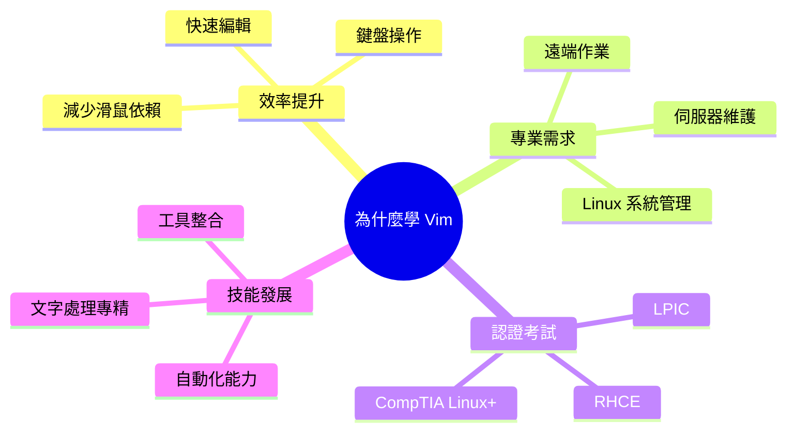

### 本手冊的學習方式與使用建議

1. **循序漸進**：建議按章節順序學習，每章都有實作練習
2. **動手實作**：理論與實務並重，務必完成每章的練習題
3. **日常應用**：將學會的技巧應用到實際專案開發中
4. **認證導向**：標註的認證重點可作為考試準備參考

---

## 第一篇：Vim 基礎入門

### 1. Vim 簡介

#### 簡介
Vim（Vi IMproved）是基於經典的 Vi 編輯器所改良的文字編輯器，是 Unix/Linux 系統中最重要的編輯工具之一。

#### 學習目標
- 了解 Vim 的歷史背景與設計理念
- 理解 Vim 與其他編輯器的差異
- 掌握 Vim 的基本概念

#### 內容教學

##### Vim 與 Vi 的關係

Vi 編輯器於 1976 年誕生，是 Unix 系統的標準編輯器。Vim 則是在 1991 年由 Bram Moolenaar 開發的 Vi 改良版本。

**主要改進**：
- 語法高亮顯示
- 多重復原/重做
- 分割視窗
- 插件系統
- 更豐富的搜尋功能

##### Vim 的特色與優勢

1. **模式化編輯**
   - 不同操作模式專精不同任務
   - 避免功能鍵混亂
   - 提高編輯效率

2. **純鍵盤操作**
   - 所有功能都可透過鍵盤完成
   - 減少手部移動
   - 適合長時間文字處理

3. **高度可客製化**
   - 豐富的設定選項
   - 插件生態系統
   - 個人化工作環境

4. **輕量快速**
   - 啟動速度快
   - 記憶體使用少
   - 適合遠端作業

##### Vim 與 IDE 的比較

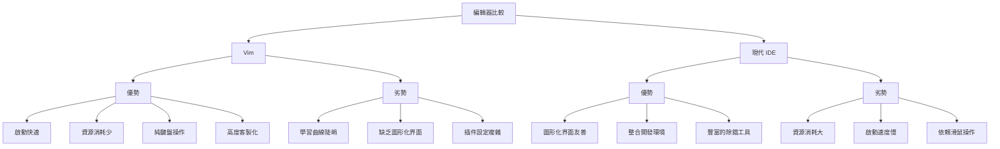

#### 實務練習

1. **環境檢查**
   ```bash
   # 檢查系統是否有 Vim
   which vim
   
   # 檢查 Vim 版本
   vim --version
   ```

2. **第一次啟動**
   ```bash
   # 啟動 Vim
   vim
   
   # 退出 Vim（在一般模式下）
   :q
   ```

#### 專案應用案例

**案例：伺服器緊急維護**
當產品伺服器發生問題需要緊急修改設定檔時，SSH 連線到伺服器只能使用命令列編輯器。此時 Vim 就是最佳選擇。

#### Linux 認證考試重點 ⭐
- **LPIC-1**: 編輯文字檔案（102.1）
- **RHCE**: 使用文字編輯器編輯檔案
- **CompTIA Linux+**: 文字處理工具

#### 注意事項
- 初學者最常遇到的問題是不知道如何退出 Vim，記住 `:q` 或 `:q!`
- Vim 有自己的術語體系，建議從基礎概念開始學習

---

### 2. 安裝與環境設定

#### 簡介
正確安裝和設定 Vim 是學習的第一步，良好的環境設定能大幅提升使用體驗。

#### 學習目標
- 在不同作業系統上安裝 Vim
- 建立基本的 `.vimrc` 設定檔
- 調整顯示與編碼設定

#### 內容教學

##### 在不同作業系統安裝 Vim

**Linux 系統**
```bash
# Ubuntu/Debian
sudo apt update
sudo apt install vim

# CentOS/RHEL/Fedora
sudo yum install vim
# 或 (較新版本)
sudo dnf install vim

# 檢查安裝結果
vim --version
```

**macOS 系統**
```bash
# 使用 Homebrew
brew install vim

# 或使用 MacPorts
sudo port install vim
```

**Windows 系統**
1. 下載 Windows 版本：https://www.vim.org/download.php
2. 執行安裝程式
3. 或使用 Chocolatey：`choco install vim`

##### 基本設定檔 .vimrc 建立

`.vimrc` 檔案是 Vim 的個人設定檔，通常位於用戶主目錄下。

**基礎 .vimrc 範例**：
```vim
" 基本設定
set number              " 顯示行號
set relativenumber      " 顯示相對行號
set tabstop=4          " Tab 寬度設為 4 空格
set shiftwidth=4       " 縮排寬度
set expandtab          " 將 Tab 轉換為空格
set autoindent         " 自動縮排
set smartindent        " 智慧縮排

" 搜尋設定
set ignorecase         " 搜尋時忽略大小寫
set smartcase          " 有大寫字母時區分大小寫
set incsearch          " 即時搜尋
set hlsearch           " 高亮搜尋結果

" 顯示設定
set showcmd            " 顯示命令
set showmatch          " 高亮對應括號
set ruler              " 顯示游標位置
set laststatus=2       " 總是顯示狀態列

" 編碼設定
set encoding=utf-8
set fileencoding=utf-8
set termencoding=utf-8

" 語法高亮
syntax enable
syntax on

" 顏色主題
colorscheme desert
```

##### 字體、編碼與顯示調整

**字體設定**（主要用於 GUI 版本）：
```vim
" 設定字體
set guifont=Consolas:h12
" Linux 下
set guifont=Monospace\ 12
```

**編碼處理**：
```vim
" 檔案編碼自動偵測
set fileencodings=utf-8,big5,gbk,latin1

" 解決中文顯示問題
set ambiwidth=double
```

**顯示優化**：
```vim
" 長行處理
set wrap
set linebreak
set showbreak=+++\ 

" 游標行高亮
set cursorline

" 設定顏色
highlight CursorLine cterm=NONE ctermbg=darkgray
```

#### 實務練習

1. **建立個人 .vimrc**
   ```bash
   # 編輯 .vimrc 檔案
   vim ~/.vimrc
   
   # 複製上述基礎設定內容
   # 儲存並退出：:wq
   ```

2. **測試設定**
   ```bash
   # 重新啟動 Vim 或重新載入設定
   vim
   :source ~/.vimrc
   ```

3. **檢查設定是否生效**
   ```vim
   " 在 Vim 中檢查設定值
   :set number?
   :set tabstop?
   :set encoding?
   ```

#### 專案應用案例

**案例：團隊統一開發環境**
在 Java 專案中，團隊成員可能使用不同的編輯器。建立標準的 `.vimrc` 檔案並加入版本控制，確保所有成員在使用 Vim 時有一致的體驗。

```bash
# 在專案根目錄建立標準 .vimrc
vim .vimrc-project

# 成員可以連結到個人設定
ln -s $(pwd)/.vimrc-project ~/.vimrc
```

#### Linux 認證考試重點 ⭐
- **LPIC-1**: 客製化與使用 shell 環境（105.1）
- **RHCE**: 設定系統環境
- **CompTIA Linux+**: 使用者環境設定

#### 注意事項
- `.vimrc` 設定會影響所有 Vim 會話，建議逐步加入設定並測試
- 不同版本的 Vim 可能不支援某些設定選項，注意相容性
- 備份原有的 `.vimrc` 檔案再進行修改

---

### 3. Vim 的操作模式

#### 簡介
Vim 的核心概念是模式化編輯，理解各種模式的用途和切換方法是掌握 Vim 的關鍵。

#### 學習目標
- 理解 Vim 的四種主要操作模式
- 熟練掌握模式之間的切換
- 在不同模式下執行對應操作

#### 內容教學

##### Vim 的四種主要模式

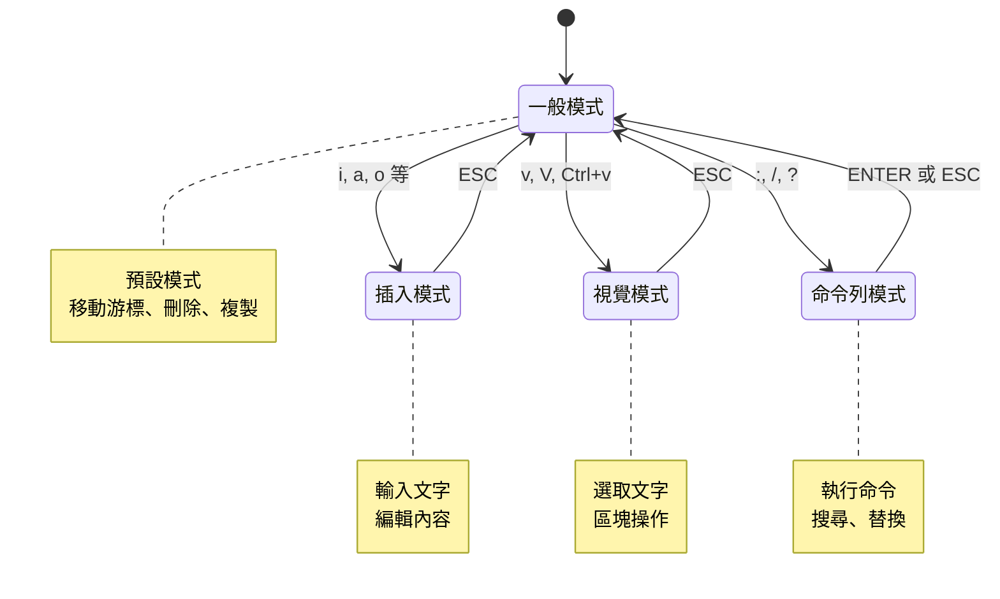

##### 一般模式 (Normal Mode)

一般模式是 Vim 的預設模式，主要用於導覽和文字操作。

**基本移動**：
- `h` - 左移
- `j` - 下移  
- `k` - 上移
- `l` - 右移

**快速移動**：
- `w` - 移到下一個字首
- `b` - 移到上一個字首
- `0` - 移到行首
- `$` - 移到行尾
- `gg` - 移到檔案開頭
- `G` - 移到檔案結尾

##### 插入模式 (Insert Mode)

插入模式用於輸入和編輯文字。

**進入插入模式**：
- `i` - 在游標位置插入
- `a` - 在游標後插入
- `o` - 在下一行插入
- `O` - 在上一行插入
- `I` - 在行首插入
- `A` - 在行尾插入

**離開插入模式**：
- `ESC` - 回到一般模式
- `Ctrl + [`  - 同 ESC（替代鍵）

##### 視覺模式 (Visual Mode)

視覺模式用於選取文字進行區塊操作。

**視覺模式類型**：
- `v` - 字元選取模式
- `V` - 行選取模式  
- `Ctrl + v` - 區塊選取模式

**常用操作**：
- 選取後按 `d` - 刪除選取內容
- 選取後按 `y` - 複製選取內容
- 選取後按 `>` - 向右縮排
- 選取後按 `<` - 向左縮排

##### 命令列模式 (Command-Line Mode)

命令列模式用於執行複雜命令和檔案操作。

**進入方式**：
- `:` - 執行命令
- `/` - 向下搜尋
- `?` - 向上搜尋

**常用命令**：
- `:w` - 儲存檔案
- `:q` - 退出
- `:wq` - 儲存並退出
- `:q!` - 強制退出不儲存

#### 實務練習

1. **模式切換練習**
   ```bash
   # 建立練習檔案
   vim practice.txt
   ```
   
   練習步驟：
   - 啟動 Vim（一般模式）
   - 按 `i` 進入插入模式，輸入一些文字
   - 按 `ESC` 回到一般模式
   - 按 `v` 進入視覺模式，選取部分文字
   - 按 `ESC` 回到一般模式
   - 按 `:` 進入命令列模式，輸入 `wq` 儲存退出

2. **模式識別練習**
   觀察 Vim 底部狀態列，不同模式會有不同顯示：
   - 一般模式：無特殊顯示
   - 插入模式：顯示 `-- INSERT --`
   - 視覺模式：顯示 `-- VISUAL --`
   - 命令列模式：底部出現 `:` 提示符

#### 專案應用案例

**案例：快速修改設定檔**
在專案中需要修改 `application.properties` 檔案：

1. `vim src/main/resources/application.properties` （一般模式）
2. `/database` （命令列模式搜尋）
3. `i` （切換到插入模式）
4. 修改資料庫連線設定
5. `ESC` （回到一般模式）
6. `:wq` （命令列模式儲存退出）

#### Linux 認證考試重點 ⭐
- **LPIC-1**: 使用 vi/vim 編輯器（102.1）
- **RHCE**: 文字編輯基本操作
- **CompTIA Linux+**: 命令列文字編輯

#### 注意事項
- 新手最容易混淆模式，建議多練習模式切換
- 使用 `:set showmode` 可以在狀態列顯示目前模式
- 如果不確定目前在哪個模式，按幾次 `ESC` 通常能回到一般模式

---

### 4. 文字編輯基礎

#### 簡介

文字編輯是 Vim 的核心功能，掌握基本的游標移動和文字操作是提高編輯效率的基礎。

#### 學習目標
- 熟練使用各種游標移動命令
- 掌握文字的插入、刪除、複製、貼上操作
- 學會使用 Undo/Redo 功能

#### 內容教學

##### 游標移動

**基本移動**：
```vim
h   - 左移一個字元
j   - 下移一行
k   - 上移一行  
l   - 右移一個字元
```

**快速移動**：
```vim
w   - 移到下一個單字開頭
b   - 移到上一個單字開頭
e   - 移到目前單字結尾
W   - 移到下一個空白分隔的單字
B   - 移到上一個空白分隔的單字
```

**行內移動**：
```vim
0   - 移到行首
^   - 移到行首第一個非空白字元
$   - 移到行尾
f{char} - 移到行內下一個 {char} 字元
F{char} - 移到行內上一個 {char} 字元
```

**檔案內移動**：
```vim
gg  - 移到檔案開頭
G   - 移到檔案結尾
{n}G - 移到第 n 行
Ctrl+f - 向下翻頁
Ctrl+b - 向上翻頁
Ctrl+d - 向下翻半頁
Ctrl+u - 向上翻半頁
```

##### 插入與刪除文字

**插入文字**：
```vim
i   - 在游標位置插入
a   - 在游標後插入
o   - 在下一行插入
O   - 在上一行插入
I   - 在行首插入
A   - 在行尾插入
s   - 刪除游標字元並插入
S   - 刪除整行並插入
```

**刪除文字**：
```vim
x   - 刪除游標處字元
X   - 刪除游標前字元
dd  - 刪除整行
dw  - 刪除單字
d$  - 刪除到行尾
d0  - 刪除到行首
{n}dd - 刪除 n 行
```

##### 複製、貼上、取代

**複製操作**：
```vim
yy  - 複製整行
yw  - 複製單字
y$  - 複製到行尾
y0  - 複製到行首
{n}yy - 複製 n 行
```

**貼上操作**：
```vim
p   - 在游標後貼上
P   - 在游標前貼上
```

**取代操作**：
```vim
r   - 取代單一字元
R   - 進入取代模式
cw  - 改變單字
cc  - 改變整行
c$  - 改變到行尾
```

##### Undo / Redo

```vim
u       - 復原上一個動作
Ctrl+r  - 重做被復原的動作
U       - 復原整行的所有變更
```

#### 實務練習

1. **游標移動練習**
   ```bash
   # 建立練習檔案
   vim movement_practice.txt
   ```
   
   輸入以下文字進行練習：
   ```
   The quick brown fox jumps over the lazy dog.
   Java is a programming language.
   Vim is a powerful text editor.
   Practice makes perfect.
   ```
   
   練習任務：
   - 使用 `w` 和 `b` 在單字間移動
   - 使用 `f` 查找特定字元
   - 使用 `0` 和 `$` 移動到行首行尾

2. **編輯操作練習**
   ```vim
   " 進入插入模式，輸入：
   Hello World
   This is a test
   
   " 練習以下操作：
   " 1. 在 'World' 後加上驚嘆號
   " 2. 在第二行開頭加上 'Note: '
   " 3. 複製第一行並貼到檔案結尾
   ```

3. **文字處理練習**
   建立一個 Java 類別骨架：
   ```java
   public class Student {
       private String name;
       private int age;
       
       public Student(String name, int age) {
           this.name = name;
           this.age = age;
       }
   }
   ```

#### 專案應用案例

**案例：快速修改 Java 程式碼**
假設需要在專案中的 `Student.java` 檔案增加新的屬性：

1. 開啟檔案：`vim src/main/java/com/tutorial/Student.java`
2. 移動到屬性區域：`/private`
3. 在最後一個屬性下新增行：`o`
4. 輸入新屬性：`private String email;`
5. 移動到建構子：`/public Student`
6. 修改建構子參數並更新實作

**操作流程**：
```vim
vim Student.java
/private         " 搜尋 private
jj              " 向下移動兩行到最後一個屬性
o               " 在下一行插入
" 輸入: private String email;
ESC             " 回到一般模式
/public Student " 搜尋建構子
" 修改建構子...
:wq             " 儲存並退出
```

#### Linux 認證考試重點 ⭐
- **LPIC-1**: 基本文字編輯操作（102.1）
- **RHCE**: 檔案編輯與修改
- **CompTIA Linux+**: 文字編輯器使用

#### 注意事項
- 刪除和複製的內容會暫存在剪貼簿中，可以重複貼上
- 使用數字前綴可以重複命令，如 `3dd` 刪除三行
- 練習時建議先用簡單的文字檔案，熟悉後再編輯程式碼

---

### 5. 檔案操作

#### 簡介

檔案操作是 Vim 使用中的重要環節，包括開啟、儲存、關閉檔案，以及多檔案管理和視窗分割等進階功能。

#### 學習目標
- 掌握檔案的開啟、儲存、關閉操作
- 學會多檔案同時編輯
- 理解分割視窗和分頁的使用

#### 內容教學

##### 開啟、儲存、關閉檔案

**開啟檔案**：
```bash
# 從命令列開啟
vim filename.txt
vim file1.txt file2.txt    # 同時開啟多個檔案

# 在 Vim 中開啟
:e filename.txt            # 編輯新檔案
:e!                        # 重新載入目前檔案
:e .                       # 開啟檔案瀏覽器
```

**儲存檔案**：
```vim
:w                  " 儲存目前檔案
:w filename         " 另存為 filename
:w!                 " 強制儲存（覆寫唯讀檔案）
:wa                 " 儲存所有開啟的檔案
```

**關閉檔案**：
```vim
:q                  " 退出（未修改時）
:q!                 " 強制退出（不儲存修改）
:wq                 " 儲存並退出
:x                  " 儲存並退出（同 :wq）
ZZ                  " 儲存並退出（一般模式）
ZQ                  " 不儲存退出（一般模式）
```

##### 多檔案切換

**緩衝區管理**：
```vim
:ls                 " 列出所有緩衝區
:b{number}          " 切換到指定編號的緩衝區
:b filename         " 切換到指定檔案
:bn                 " 下一個緩衝區
:bp                 " 上一個緩衝區
:bd                 " 刪除目前緩衝區
```

**實用的檔案切換**：
```vim
Ctrl+^              " 切換到上一個檔案
:e#                 " 編輯上一個檔案
```

##### 分割視窗 (Split)

**水平分割**：
```vim
:split filename     " 水平分割並開啟檔案
:sp filename        " 簡寫形式
Ctrl+w s            " 分割目前檔案
```

**垂直分割**：
```vim
:vsplit filename    " 垂直分割並開啟檔案
:vsp filename       " 簡寫形式
Ctrl+w v            " 垂直分割目前檔案
```

**視窗操作**：
```vim
Ctrl+w w            " 切換視窗
Ctrl+w h            " 移到左邊視窗
Ctrl+w j            " 移到下方視窗
Ctrl+w k            " 移到上方視窗
Ctrl+w l            " 移到右邊視窗
Ctrl+w c            " 關閉目前視窗
Ctrl+w o            " 關閉其他視窗
Ctrl+w =            " 平均分配視窗大小
```

**調整視窗大小**：
```vim
Ctrl+w +            " 增加視窗高度
Ctrl+w -            " 減少視窗高度
Ctrl+w >            " 增加視窗寬度
Ctrl+w <            " 減少視窗寬度
```

##### 分頁 (Tab)

**分頁管理**：
```vim
:tabnew filename    " 新分頁開啟檔案
:tabnew             " 新增空白分頁
:tabclose           " 關閉目前分頁
:tabonly            " 關閉其他分頁
```

**分頁切換**：
```vim
gt                  " 下一個分頁
gT                  " 上一個分頁
{n}gt               " 移到第 n 個分頁
:tabn               " 下一個分頁
:tabp               " 上一個分頁
```

#### 實務練習

1. **基本檔案操作**
   ```bash
   # 建立測試檔案
   echo "Hello World" > test1.txt
   echo "Java Tutorial" > test2.txt
   
   # 練習開啟和切換
   vim test1.txt test2.txt
   ```
   
   在 Vim 中練習：
   ```vim
   :ls              " 查看緩衝區列表
   :bn              " 切換到下一個檔案
   :bp              " 切換回上一個檔案
   ```

2. **分割視窗練習**
   ```vim
   vim test1.txt
   :vsp test2.txt   " 垂直分割開啟第二個檔案
   Ctrl+w w         " 在視窗間切換
   Ctrl+w =         " 調整視窗大小
   ```

3. **分頁操作練習**
   ```vim
   vim test1.txt
   :tabnew test2.txt " 在新分頁開啟檔案
   gt               " 切換分頁
   :tabclose        " 關閉分頁
   ```

#### 專案應用案例

**案例：Java 專案多檔案編輯**
在開發 Java 專案時，經常需要同時編輯多個相關檔案：

```bash
# 同時開啟相關檔案
vim src/main/java/com/tutorial/Student.java \
    src/test/java/com/tutorial/StudentTest.java \
    src/main/resources/application.properties
```

**工作流程**：
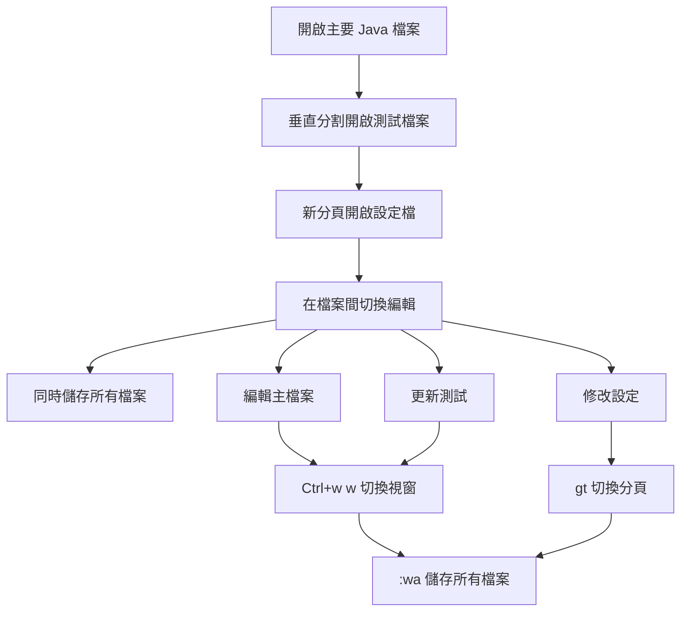

**實際操作**：
```vim
" 1. 開啟主檔案
vim Student.java

" 2. 垂直分割開啟測試檔案
:vsp StudentTest.java

" 3. 新分頁開啟設定檔
:tabnew ../../../resources/application.properties

" 4. 在檔案間工作
Ctrl+w w        " 在 Student.java 和 StudentTest.java 間切換
gt              " 切換到設定檔分頁

" 5. 儲存所有變更
:wa             " 儲存所有檔案
```

#### Linux 認證考試重點 ⭐
- **LPIC-1**: 檔案管理操作（102.1）
- **RHCE**: 同時編輯多個檔案
- **CompTIA Linux+**: 檔案編輯器進階功能

#### 注意事項
- 使用 `:ls` 經常檢查開啟的緩衝區，避免遺漏未儲存的檔案
- 分割視窗時注意螢幕空間，過多分割會影響編輯效率
- 分頁適合處理不同類型的檔案，分割視窗適合相關聯的檔案

---

## 第二篇：進階編輯技巧

### 6. 搜尋與取代

#### 簡介

搜尋與取代是 Vim 最強大的功能之一，支援正規表示式和複雜的模式匹配，能大幅提升文字處理效率。

#### 學習目標
- 掌握基本文字搜尋技巧
- 學會使用正規表示式進行複雜搜尋
- 熟練使用全域取代功能

#### 內容教學

##### 基本文字搜尋

**向前搜尋**：
```vim
/pattern            " 向下搜尋 pattern
n                   " 下一個匹配項
N                   " 上一個匹配項
```

**向後搜尋**：
```vim
?pattern            " 向上搜尋 pattern
n                   " 下一個匹配項（向上）
N                   " 上一個匹配項（向下）
```

**搜尋選項**：
```vim
:set ignorecase     " 忽略大小寫
:set smartcase      " 智慧大小寫匹配
:set incsearch      " 即時搜尋
:set hlsearch       " 高亮搜尋結果
:nohlsearch         " 清除搜尋高亮
```

**搜尋當前單字**：
```vim
*                   " 搜尋游標所在單字（向下）
#                   " 搜尋游標所在單字（向上）
g*                  " 搜尋游標所在單字（部分匹配）
g#                  " 搜尋游標所在單字（部分匹配，向上）
```

##### 正規表示式搜尋

**基本正規表示式元字符**：
```vim
.                   " 任意字元
^                   " 行首
$                   " 行尾
\<                  " 單字開始
\>                  " 單字結束
*                   " 零個或多個
\+                  " 一個或多個
\?                  " 零個或一個
\{n,m\}             " n 到 m 個
[]                  " 字元類
[^]                 " 否定字元類
\|                  " 或者
```

**實用搜尋範例**：
```vim
/^public            " 搜尋以 public 開頭的行
/\<int\>            " 搜尋完整的 int 單字
/^$                 " 搜尋空白行
/\d\+               " 搜尋數字
/[A-Z]\+            " 搜尋大寫字母
```

##### 全檔取代與範圍取代

**基本取代語法**：
```vim
:s/old/new/         " 取代目前行第一個 old 為 new
:s/old/new/g        " 取代目前行所有 old 為 new
:%s/old/new/        " 取代全檔第一個 old 為 new
:%s/old/new/g       " 取代全檔所有 old 為 new
:%s/old/new/gc      " 取代全檔所有 old，每次確認
```

**範圍取代**：
```vim
:1,10s/old/new/g    " 取代第 1-10 行
:'<,'>s/old/new/g   " 取代選取範圍
:.,+5s/old/new/g    " 取代目前行到下 5 行
```

**進階取代範例**：
```vim
" 刪除行尾空白
:%s/\s\+$//g

" 將多個空白替換為單一空白
:%s/\s\+/ /g

" 交換兩個單字的位置
:%s/\(\w\+\)\s\+\(\w\+\)/\2 \1/g

" 在每行開頭加上行號
:%s/^/\=line('.') . ': '/g
```

#### 實務練習

1. **基本搜尋練習**

   建立練習檔案：
   
   ```bash
   vim search_practice.java
   ```

   輸入以下 Java 程式碼：
   
   ```java
   public class Student {
       private String name;
       private int age;
       private String email;
       
       public Student(String name, int age) {
           this.name = name;
           this.age = age;
       }
       
       public String getName() {
           return name;
       }
       
       public void setName(String name) {
           this.name = name;
       }
   }
   ```

   練習任務：
   ```vim
   /String             " 搜尋 String
   n                   " 下一個
   *                   " 搜尋游標所在單字
   ```

2. **取代練習**

   ```vim
   " 將所有 String 改為 Object
   :%s/String/Object/g
   
   " 將 private 改為 protected（僅前三行）
   :1,3s/private/protected/g
   ```

3. **正規表示式練習**

   ```vim
   " 搜尋所有 public 方法
   /^    public
   
   " 搜尋所有以 set 開頭的方法
   /public void set\w\+
   ```

#### 專案應用案例

**案例：重構 Java 程式碼**

假設需要將專案中的所有 `ArrayList` 改為 `List`：

```vim
" 開啟多個 Java 檔案
vim src/main/java/com/tutorial/*.java

" 在所有緩衝區中進行取代
:bufdo %s/ArrayList/List/ge | update

" 說明：
" bufdo - 對所有緩衝區執行命令
" %s/ArrayList/List/g - 全域取代
" e - 忽略錯誤
" update - 儲存有變更的檔案
```

**日誌檔案分析案例**：
```vim
" 搜尋錯誤日誌
/ERROR\|Exception

" 提取所有時間戳記
:%s/^\(\d\{4\}-\d\{2\}-\d\{2\} \d\{2\}:\d\{2\}:\d\{2\}\).*$/\1/g

" 刪除所有 DEBUG 層級的日誌
:g/DEBUG/d
```

**搜尋與取代流程圖**：
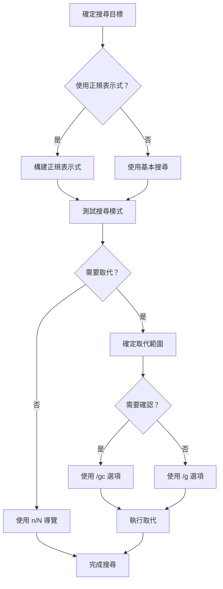

#### Linux 認證考試重點 ⭐
- **LPIC-1**: 使用正規表示式搜尋檔案（103.7）
- **RHCE**: 文字處理和搜尋
- **CompTIA Linux+**: 文字搜尋和模式匹配

#### 注意事項
- 使用 `:%s/old/new/gc` 進行重要取代時，逐一確認每個替換
- 複雜的正規表示式建議先在小範圍測試
- 使用 `:set hlsearch` 可以視覺化搜尋結果

---

### 7. 巨集與自動化

#### 簡介

巨集是 Vim 最強大的自動化功能，可以錄製一系列按鍵操作並重複執行，大幅提升重複性工作的效率。

#### 學習目標
- 學會錄製和執行巨集
- 掌握巨集的編輯和儲存
- 應用巨集解決實際開發問題

#### 內容教學

##### 錄製巨集

**基本巨集錄製**：
```vim
q{register}         " 開始錄製巨集到暫存器
" ... 執行操作 ...
q                   " 停止錄製
```

**暫存器選擇**：
- 使用 `a-z` 作為巨集暫存器
- 小寫字母會覆寫原有內容
- 大寫字母會附加到原有內容

**錄製範例**：
```vim
qa                  " 開始錄製到暫存器 a
I// <ESC>           " 在行首插入 //
j                   " 移到下一行
q                   " 停止錄製
```

##### 執行與重複巨集

**執行巨集**：
```vim
@{register}         " 執行指定暫存器的巨集
@@                  " 重複上次執行的巨集
{number}@{register} " 重複執行巨集 number 次
```

**批次執行**：
```vim
:1,10norm @a        " 對第 1-10 行執行巨集 a
:%norm @a           " 對所有行執行巨集 a
:'<,'>norm @a       " 對選取範圍執行巨集 a
```

##### 巨集的檢視與編輯

**檢視巨集內容**：
```vim
:reg {register}     " 查看暫存器內容
:reg                " 查看所有暫存器
```

**編輯巨集**：
```vim
" 方法一：使用命令列
:let @a = 'i// ^[j'

" 方法二：貼到編輯區修改再複製回暫存器
"ap                 " 貼上巨集內容
" 編輯內容
"ay$                " 複製回暫存器 a
```

##### 自動化編輯案例

**案例 1：批次新增註解**
```vim
" 錄製巨集為多行加上 // 註解
qa
I// <ESC>
j
q

" 執行巨集為接下來 10 行加註解
10@a
```

**案例 2：格式化 Java 屬性**
```vim
" 將 "name" 轉換為 private String name;
qa
I private String <ESC>
A;<ESC>
j
q
```

**案例 3：建立 getter/setter 方法**
```vim
" 從屬性行建立 getter 方法
qa
yiw                 " 複製屬性名稱
o<ESC>              " 新增空行
i    public <ESC>   " 輸入 public
pa<ESC>             " 貼上型別
i get<ESC>          " 輸入 get
pa<ESC>             " 貼上屬性名稱
~ " 首字母大寫
A() {<ESC>
o        return <ESC>
pa<ESC>
A;<ESC>
o    }<ESC>
q
```

#### 實務練習

1. **基本巨集練習**

   建立測試檔案：
   ```bash
   vim macro_practice.java
   ```

   輸入以下內容：
   ```java
   String name
   int age
   boolean active
   double salary
   ```

   錄製巨集將每行轉換為 private 屬性：
   ```vim
   qa
   I    private <ESC>
   A;<ESC>
   j
   q
   
   " 執行巨集
   3@a
   ```

2. **進階巨集練習**

   建立完整的 Java 類別：
   ```vim
   " 錄製建立 constructor 的巨集
   qb
   /class<CR>
   f{
   o<ESC>
   o    public <ESC>
   /class<CR>
   w
   yw
   GA(<ESC>
   " ... 繼續錄製 constructor 內容
   q
   ```

3. **JSON 格式化巨集**

   假設有以下 JSON 資料需要格式化：
   ```json
   {"name":"John","age":30,"city":"New York"}
   ```

   錄製格式化巨集：
   ```vim
   qa
   f,
   a<CR><ESC>
   q
   
   " 重複執行直到格式化完成
   ```

#### 專案應用案例

**案例：批次建立 JUnit 測試方法**

假設需要為以下方法建立測試：
```java
public void validateUser()
public void saveUser()
public void deleteUser()
```

錄製巨集建立測試方法：
```vim
qa
yiw                     " 複製方法名稱
o<ESC>
i    @Test<ESC>
o    public void test<ESC>
pa<ESC>
I<ESC>
~                       " 首字母大寫
A() {<ESC>
o        // TODO: implement test<ESC>
o    }<ESC>
o<ESC>
/public void<CR>        " 移到下一個方法
q

" 執行巨集為其他方法建立測試
2@a
```

**巨集工作流程**：
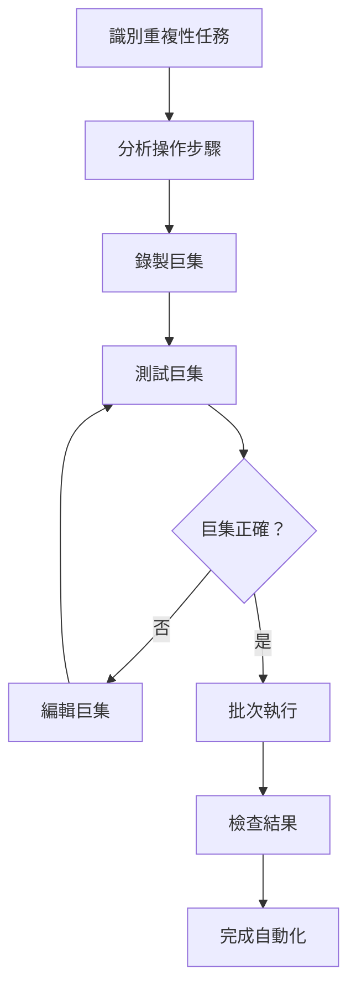

#### Linux 認證考試重點 ⭐
- **LPIC-1**: 編輯器進階功能（102.1）
- **RHCE**: 自動化文字處理
- **CompTIA Linux+**: 編輯器自動化

#### 注意事項
- 錄製巨集時要考慮游標的起始和結束位置
- 複雜巨集建議分段錄製，再組合使用
- 使用 `:reg` 定期檢查暫存器內容，避免意外覆寫

---

### 8. 多檔案編輯與快速導覽

#### 簡介

在專案開發中，經常需要在多個檔案間快速切換和導覽。Vim 提供了標記、跳轉列表等功能來提升多檔案編輯效率。

#### 學習目標
- 掌握標記系統的使用
- 學會使用跳轉列表快速導覽
- 熟練多檔案編輯技巧

#### 內容教學

##### 標記 (Mark) 系統

**設定標記**：
```vim
m{a-z}              " 設定檔案內標記（小寫字母）
m{A-Z}              " 設定全域標記（大寫字母）
```

**跳轉到標記**：
```vim
'{mark}             " 跳轉到標記所在行的行首
`{mark}             " 跳轉到標記的精確位置
''                  " 回到上次跳轉前的位置
``                  " 回到上次跳轉前的精確位置
```

**特殊標記**：
```vim
'.                  " 最後編輯的位置
'0-'9               " 最近開啟的檔案位置
'^                  " 最後插入模式的位置
'[                  " 最後變更的開始位置
']                  " 最後變更的結束位置
```

**檢視標記**：
```vim
:marks              " 顯示所有標記
:marks {marks}      " 顯示指定標記
```

##### 快速跳轉 (Jump List)

**跳轉歷史**：
```vim
Ctrl+o              " 跳到上一個位置
Ctrl+i              " 跳到下一個位置
:jumps              " 顯示跳轉歷史
```

**函數和標籤跳轉**：
```vim
gd                  " 跳到區域變數定義
gD                  " 跳到全域變數定義
]]                  " 下一個函數
[[                  " 上一個函數
```

**括號匹配跳轉**：
```vim
%                   " 跳到匹配的括號
[{                  " 跳到上一個未匹配的 {
]}                  " 跳到下一個未匹配的 }
[(                  " 跳到上一個未匹配的 (
])                  " 跳到下一個未匹配的 )
```

##### 編輯多個檔案的技巧

**檔案模式匹配**：
```bash
# 開啟多個相關檔案
vim src/**/*.java
vim *.{h,c}
vim {main,test}/*.java
```

**全域命令**：
```vim
:args *.java        " 設定參數列表
:argdo %s/old/new/ge | update   " 對所有檔案執行命令
:bufdo %s/old/new/ge | update   " 對所有緩衝區執行命令
:windo set number   " 對所有視窗執行命令
```

**檔案內搜尋**：
```vim
:vimgrep /pattern/ **/*.java    " 在所有 Java 檔案中搜尋
:copen              " 開啟 quickfix 視窗
:cnext              " 下一個匹配項
:cprev              " 上一個匹配項
```

#### 實務練習

1. **標記系統練習**

   開啟一個 Java 檔案進行練習：
   ```bash
   vim Student.java
   ```

   練習步驟：
   ```vim
   " 1. 在 class 定義處設定標記
   ma
   
   " 2. 移動到方法處設定標記
   /public
   mb
   
   " 3. 在標記間跳轉
   'a                  " 跳到 class 定義
   'b                  " 跳到方法定義
   
   " 4. 檢視所有標記
   :marks
   ```

2. **多檔案導覽練習**

   ```bash
   # 同時開啟多個相關檔案
   vim src/main/java/com/tutorial/{Student,Teacher,Course}.java
   ```

   練習任務：
   ```vim
   " 1. 在不同檔案設定全域標記
   mA                  " 在 Student.java 設定標記 A
   :bn                 " 切換到下一個檔案
   mB                  " 在 Teacher.java 設定標記 B
   
   " 2. 在檔案間跳轉
   'A                  " 跳回 Student.java
   'B                  " 跳到 Teacher.java
   
   " 3. 使用跳轉歷史
   Ctrl+o              " 回到上一個位置
   Ctrl+i              " 前進到下一個位置
   ```

3. **專案搜尋練習**

   ```vim
   " 搜尋專案中所有包含 "Student" 的 Java 檔案
   :vimgrep /Student/ **/*.java
   
   " 在結果間導覽
   :copen              " 開啟結果視窗
   :cnext              " 下一個結果
   :cprev              " 上一個結果
   ```

#### 專案應用案例

**多檔案重構工作流程**：

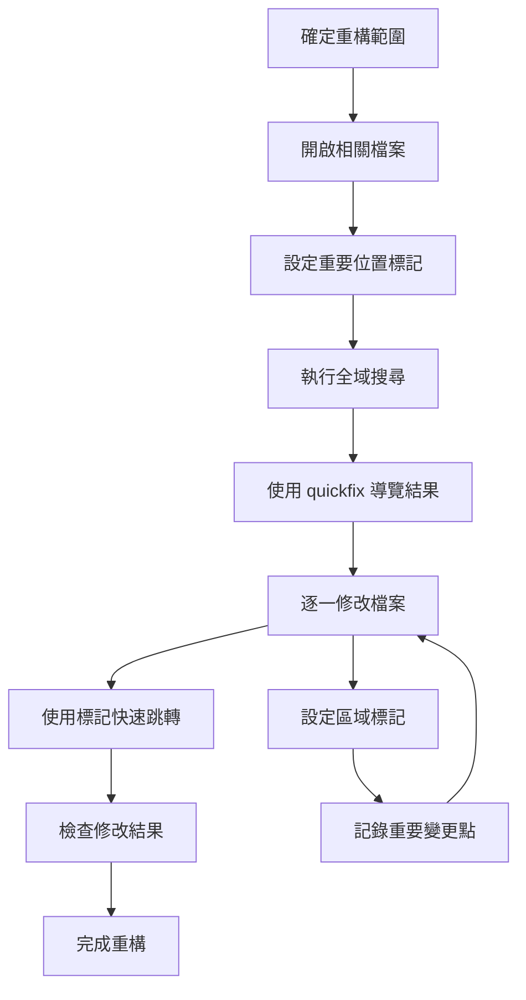

**實際應用範例：重構 Java 套件**

假設需要將 `com.tutorial.model` 套件重新命名為 `com.tutorial.entity`：

```vim
" 1. 開啟所有相關檔案
:args src/**/*.java

" 2. 在重要檔案設定標記
mA                  " 主要 Student 類別
mB                  " 重要的 Service 類別
mC                  " 設定檔案

" 3. 全域搜尋並取代
:argdo %s/com\.tutorial\.model/com.tutorial.entity/ge | update

" 4. 檢查重要位置
'A                  " 檢查 Student 類別
'B                  " 檢查 Service 類別
'C                  " 檢查設定檔

" 5. 使用 vimgrep 確認修改完整性
:vimgrep /com\.tutorial\.model/ **/*.java
```

**IDE 風格的檔案導覽**：
```vim
" 建立檔案樹狀導覽
:Ex                 " 開啟檔案瀏覽器
:Sex                " 水平分割開啟瀏覽器
:Vex                " 垂直分割開啟瀏覽器

" 在瀏覽器中的操作
<Enter>             " 開啟檔案或目錄
-                   " 上一層目錄
D                   " 刪除檔案
R                   " 重新命名檔案
```

#### Linux 認證考試重點 ⭐
- **LPIC-1**: 檔案系統導覽（103.1）
- **RHCE**: 多檔案編輯操作
- **CompTIA Linux+**: 檔案管理和導覽

#### 注意事項
- 全域標記（A-Z）在關閉 Vim 後會保留
- 使用 `viminfo` 可以保存標記和跳轉歷史
- 大型專案建議使用 `tags` 檔案配合 `ctags` 工具

---

### 9. 文本處理進階

#### 簡介

Vim 提供了豐富的文本處理功能，包括對齊、縮排、區塊編輯和自動補全等，這些功能對於程式設計和文件編輯極其重要。

#### 學習目標
- 掌握文字對齊和縮排技巧
- 學會區塊選取和編輯
- 熟練使用自動補全功能

#### 內容教學

##### 對齊與縮排

**基本縮排操作**：
```vim
>>                  " 向右縮排目前行
<<                  " 向左縮排目前行
{n}>>               " 向右縮排 n 行
{n}<<               " 向左縮排 n 行
```

**視覺模式縮排**：
```vim
" 選取多行後
>                   " 向右縮排選取內容
<                   " 向左縮排選取內容
```

**自動縮排**：
```vim
=                   " 自動縮排目前行
gg=G                " 自動縮排整個檔案
={motion}           " 自動縮排指定範圍
```

**縮排設定**：
```vim
:set tabstop=4      " Tab 顯示寬度
:set shiftwidth=4   " 縮排寬度
:set expandtab      " 使用空格替代 Tab
:set autoindent     " 自動縮排
:set smartindent    " 智慧縮排
```

##### 區塊選取與編輯

**視覺模式類型**：
```vim
v                   " 字元視覺模式
V                   " 行視覺模式
Ctrl+v              " 區塊視覺模式
```

**區塊編輯操作**：
```vim
" 在區塊視覺模式下
I                   " 在選取區塊的開頭插入
A                   " 在選取區塊的結尾插入
c                   " 變更選取區塊
d                   " 刪除選取區塊
y                   " 複製選取區塊
```

**實用區塊編輯範例**：
```vim
" 批次註解多行程式碼
Ctrl+v              " 進入區塊視覺模式
jjj                 " 選取多行
I// <ESC>           " 在每行開頭插入 //

" 批次刪除行首的空格
Ctrl+v              " 進入區塊視覺模式
jjj                 " 選取多行
l                   " 向右擴展選取
x                   " 刪除選取內容
```

##### 文字對象操作

**內部文字對象**：
```vim
iw                  " 內部單字
is                  " 內部句子
ip                  " 內部段落
i"                  " 內部雙引號內容
i'                  " 內部單引號內容
i)                  " 內部圓括號內容
i]                  " 內部方括號內容
i}                  " 內部大括號內容
```

**包含文字對象**：
```vim
aw                  " 包含單字（含空格）
as                  " 包含句子
ap                  " 包含段落
a"                  " 包含雙引號（含引號）
a'                  " 包含單引號（含引號）
a)                  " 包含圓括號（含括號）
```

**文字對象應用**：
```vim
diw                 " 刪除游標所在單字
ci"                 " 變更雙引號內的內容
ya}                 " 複製大括號內容（含括號）
```

##### 自動補全

**Vim 內建補全**：
```vim
Ctrl+n              " 下一個關鍵字補全
Ctrl+p              " 上一個關鍵字補全
Ctrl+x Ctrl+l       " 整行補全
Ctrl+x Ctrl+f       " 檔案名稱補全
Ctrl+x Ctrl+]       " 標籤補全
Ctrl+x Ctrl+k       " 字典補全
```

**補全設定**：
```vim
:set complete=.,w,b,u,t,i   " 設定補全來源
:set completeopt=menu,preview   " 補全選項
```

#### 實務練習

1. **縮排練習**

   建立一個未格式化的 Java 檔案：
   ```java
   public class Test {
   public void method1() {
   if (true) {
   System.out.println("Hello");
   }
   }
   }
   ```

   練習格式化：
   ```vim
   gg=G                " 自動縮排整個檔案
   ```

2. **區塊編輯練習**

   建立以下內容：
   ```java
   String name = "John";
   String email = "john@example.com";
   String phone = "123-456-7890";
   ```

   練習批次修改：
   ```vim
   " 在每行開頭加上 private
   Ctrl+v              " 區塊視覺模式
   jj                  " 選取三行
   I private <ESC>     " 插入 private
   ```

3. **文字對象練習**

   在以下程式碼中練習：
   ```java
   public void setName(String name) {
       this.name = name;
   }
   ```

   練習任務：
   ```vim
   " 游標在 name 上
   ciw                 " 變更單字
   
   " 游標在字串內
   ci"                 " 變更引號內容
   
   " 游標在方法體內
   ci}                 " 變更大括號內容
   ```

#### 專案應用案例

**批次程式碼重構案例**：

假設需要將多個類似的程式碼片段進行標準化：

```java
// 原始程式碼（不一致的格式）
if(condition1){
doSomething();
}
if(condition2){
doSomethingElse();
}
```

使用區塊編輯統一格式：
```vim
" 1. 選取所有 if 區塊
/if
Ctrl+v
/}
j

" 2. 使用自動縮排
=

" 3. 統一括號前的空格
:%s/if(/if (/g
:%s/){/) {/g
```

**JSON 資料格式化案例**：

```json
{"name":"John","age":30,"city":"New York","country":"USA"}
```

使用區塊編輯格式化：
```vim
" 1. 在每個逗號後換行
:%s/,/,\r/g

" 2. 調整縮排
gg=G

" 3. 對齊屬性值
" 使用區塊選取對齊冒號
```

**文本處理工作流程**：
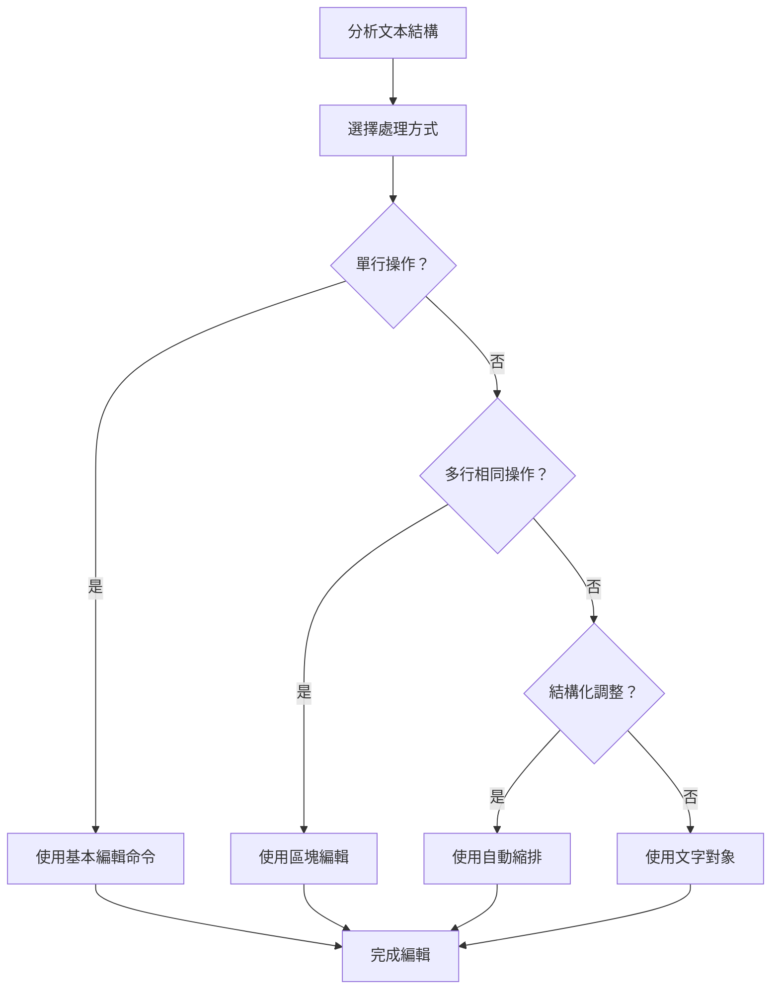

#### Linux 認證考試重點 ⭐
- **LPIC-1**: 文字處理工具（103.2）
- **RHCE**: 進階文字編輯技巧
- **CompTIA Linux+**: 文字格式化

#### 注意事項
- 區塊編輯時注意選取範圍的精確性
- 自動縮排依賴於檔案類型檢測，確保設定正確
- 文字對象操作可以與其他命令組合使用，提高效率

---

## 第三篇：專案開發實務

### 10. Vim 與程式開發

#### 簡介

將 Vim 應用於程式開發需要掌握語法高亮、自動縮排、編譯整合等功能，這些功能能讓 Vim 成為強大的程式開發環境。

#### 學習目標
- 掌握語法高亮設定
- 學會自動縮排和程式碼格式化
- 了解編譯與除錯整合

#### 內容教學

##### 語法高亮 (Syntax Highlight)

**啟用語法高亮**：
```vim
syntax on           " 啟用語法高亮
syntax enable       " 啟用語法高亮（保留現有設定）
syntax off          " 關閉語法高亮
```

**檢查語法高亮狀態**：
```vim
:syntax             " 查看語法高亮狀態
:set syntax?        " 查看目前語法類型
:set filetype?      " 查看檔案類型
```

**手動設定檔案類型**：
```vim
:set filetype=java  " 設定為 Java 檔案
:set syntax=java    " 設定 Java 語法高亮
```

**客製化語法高亮**：
```vim
" 在 .vimrc 中設定
colorscheme desert
highlight Comment ctermfg=green
highlight String ctermfg=yellow
highlight Number ctermfg=cyan
```

##### 自動縮排與程式碼格式化

**程式語言專用縮排**：
```vim
" Java 專用設定
autocmd FileType java setlocal shiftwidth=4 tabstop=4 expandtab
autocmd FileType java setlocal cindent

" Python 專用設定
autocmd FileType python setlocal shiftwidth=4 tabstop=4 expandtab
autocmd FileType python setlocal autoindent

" JavaScript 專用設定
autocmd FileType javascript setlocal shiftwidth=2 tabstop=2 expandtab
```

**智慧縮排選項**：
```vim
set cindent         " C 語言風格縮排
set smartindent     " 智慧縮排
set autoindent      " 自動縮排
set cinoptions=>4,n-2,{2,^-2,:2,=2,g0,h2,p5,t0,+2,(0,u0,w1,m1
```

**程式碼摺疊**：
```vim
set foldmethod=syntax   " 基於語法摺疊
set foldmethod=indent   " 基於縮排摺疊
set foldlevel=1         " 預設摺疊層級

" 摺疊操作
za                  " 切換摺疊狀態
zc                  " 關閉摺疊
zo                  " 開啟摺疊
zR                  " 開啟所有摺疊
zM                  " 關閉所有摺疊
```

##### 編譯與除錯整合

**設定編譯命令**：
```vim
" Java 編譯設定
autocmd FileType java set makeprg=javac\ %
autocmd FileType java set errorformat=%A%f:%l:\ %m,%-Z%p^,%-C%.%#

" Maven 專案設定
set makeprg=mvn\ compile
```

**執行編譯**：
```vim
:make               " 執行編譯
:copen              " 開啟錯誤視窗
:cnext              " 下一個錯誤
:cprev              " 上一個錯誤
:cc                 " 顯示目前錯誤
```

**quickfix 視窗操作**：
```vim
:copen              " 開啟 quickfix 視窗
:cclose             " 關閉 quickfix 視窗
:clist              " 列出所有錯誤
:cfirst             " 第一個錯誤
:clast              " 最後一個錯誤
```

##### 程式開發工作流程

**典型 Java 開發流程**：
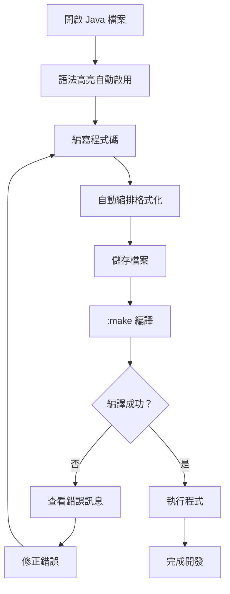

#### 實務練習

1. **語法高亮練習**

   建立 Java 檔案測試語法高亮：
   ```bash
   vim HelloWorld.java
   ```

   輸入以下程式碼觀察語法高亮：
   ```java
   public class HelloWorld {
       private static final String MESSAGE = "Hello, World!";
       
       public static void main(String[] args) {
           System.out.println(MESSAGE);
           // 這是註解
           int number = 42;
           double pi = 3.14159;
       }
   }
   ```

   測試語法高亮功能：
   ```vim
   :syntax on          " 確保語法高亮啟用
   :set filetype?      " 檢查檔案類型
   ```

2. **自動縮排練習**

   建立未格式化的程式碼：
   ```java
   public class Test {
   public void method() {
   if (true) {
   System.out.println("test");
   for (int i = 0; i < 10; i++) {
   System.out.println(i);
   }
   }
   }
   }
   ```

   使用自動格式化：
   ```vim
   gg=G                " 格式化整個檔案
   ```

3. **編譯整合練習**

   ```vim
   " 設定 Java 編譯
   :set makeprg=javac\ %
   
   " 編譯目前檔案
   :make
   
   " 如果有錯誤，查看錯誤列表
   :copen
   ```

#### 專案應用案例

**Java Maven 專案開發環境設定**：

在 `.vimrc` 中加入 Java 開發專用設定：
```vim
" Java 開發環境設定
augroup JavaDevelopment
    autocmd!
    autocmd FileType java setlocal shiftwidth=4 tabstop=4 expandtab
    autocmd FileType java setlocal cindent
    autocmd FileType java setlocal number
    autocmd FileType java setlocal foldmethod=syntax
    autocmd FileType java setlocal foldlevel=1
    
    " Maven 專案編譯設定
    autocmd FileType java setlocal makeprg=mvn\ compile
    autocmd FileType java setlocal errorformat=%A%f:[%l,%c]\ %m,%A%f:%l:\ %m,%-Z%p^,%-C%.%#
augroup END
```

**多檔案 Java 專案工作流程**：
```vim
" 1. 開啟專案主要檔案
vim src/main/java/com/tutorial/Student.java

" 2. 分割視窗開啟測試檔案
:vsp src/test/java/com/tutorial/StudentTest.java

" 3. 新分頁開啟設定檔
:tabnew pom.xml

" 4. 設定編譯快捷鍵
:map <F5> :make<CR>

" 5. 設定執行快捷鍵
:map <F6> :!mvn exec:java<CR>
```

**程式碼導覽增強**：
```vim
" 函數跳轉
map <C-]> :tag <C-R><C-W><CR>   " 跳到函數定義
map <C-T> :pop<CR>              " 返回上一個位置

" 快速註解
map <leader>cc :s/^/\/\/ /<CR>  " 加註解
map <leader>cu :s/^\/\/ //<CR>  " 移除註解
```

#### Linux 認證考試重點 ⭐
- **LPIC-1**: 編輯器客製化（102.1）
- **RHCE**: 開發環境設定
- **CompTIA Linux+**: 程式開發工具

#### 注意事項
- 不同程式語言需要不同的縮排規則，建議使用 `autocmd` 分別設定
- 語法高亮會影響效能，大型檔案可考慮關閉
- 編譯錯誤格式因編譯器而異，需要調整 `errorformat`

---

### 11. 插件管理

#### 簡介

Vim 的插件系統讓編輯器功能可以無限擴展。學會插件管理是進階 Vim 使用的重要技能。

#### 學習目標
- 了解常見插件管理工具
- 學會安裝和管理插件
- 熟悉常用開發插件

#### 內容教學

##### 插件管理工具

**vim-plug（推薦）**：
```vim
" 安裝 vim-plug
" Unix/Linux
curl -fLo ~/.vim/autoload/plug.vim --create-dirs \
    https://raw.githubusercontent.com/junegunn/vim-plug/master/plug.vim

" Windows
iwr -useb https://raw.githubusercontent.com/junegunn/vim-plug/master/plug.vim |`
    ni "$(@($env:UserProfile, $env:LocalAppData)[$null -eq $env:UserProfile])/.vim/autoload/plug.vim" -Force
```

**基本使用方法**：
```vim
" 在 .vimrc 中配置插件
call plug#begin('~/.vim/plugged')

" 插件列表
Plug 'vim-airline/vim-airline'
Plug 'nerdtree'
Plug 'ctrlpvim/ctrlp.vim'

call plug#end()
```

**插件管理命令**：
```vim
:PlugInstall        " 安裝插件
:PlugUpdate         " 更新插件
:PlugClean          " 清理未使用的插件
:PlugStatus         " 查看插件狀態
```

**Vundle（傳統選擇）**：
```vim
" 基本配置
set nocompatible
filetype off
set rtp+=~/.vim/bundle/Vundle.vim
call vundle#begin()

Plugin 'VundleVim/Vundle.vim'
Plugin 'vim-airline/vim-airline'

call vundle#end()
filetype plugin indent on
```

##### 常用開發插件介紹

**檔案管理插件**：

1. **NERDTree** - 檔案樹瀏覽器
```vim
Plug 'preservim/nerdtree'

" 基本設定
map <C-n> :NERDTreeToggle<CR>
let NERDTreeShowHidden=1
let NERDTreeIgnore=['\.git$', '\.class$', '\.jar$']
```

2. **CtrlP** - 模糊檔案搜尋
```vim
Plug 'ctrlpvim/ctrlp.vim'

" 基本使用
" Ctrl+P 開啟檔案搜尋
let g:ctrlp_map = '<c-p>'
let g:ctrlp_cmd = 'CtrlP'
```

**程式開發插件**：

1. **vim-airline** - 狀態列美化
```vim
Plug 'vim-airline/vim-airline'
Plug 'vim-airline/vim-airline-themes'

" 設定
let g:airline#extensions#tabline#enabled = 1
let g:airline_theme='dark'
```

2. **syntastic** - 語法檢查
```vim
Plug 'vim-syntastic/syntastic'

" Java 語法檢查設定
let g:syntastic_java_checkers = ['javac']
let g:syntastic_java_javac_classpath = './lib/*:./build/classes'
```

3. **vim-commentary** - 快速註解
```vim
Plug 'tpope/vim-commentary'

" 使用方法
gcc                 " 註解/取消註解目前行
gc{motion}          " 註解指定範圍
```

##### LSP 與自動補全

**coc.nvim**（推薦用於現代 Vim）：
```vim
Plug 'neoclide/coc.nvim', {'branch': 'release'}

" 基本設定
" 使用 Tab 觸發補全
inoremap <silent><expr> <TAB>
      \ pumvisible() ? "\<C-n>" :
      \ <SID>check_back_space() ? "\<TAB>" :
      \ coc#refresh()

" 安裝 Java 語言伺服器
:CocInstall coc-java
```

**YouCompleteMe**（功能強大但設定複雜）：
```vim
Plug 'ycm-core/YouCompleteMe'

" 需要編譯安裝
" cd ~/.vim/plugged/YouCompleteMe
" python3 install.py --java-completer
```

##### 插件設定最佳實務

**模組化設定檔案結構**：
```
~/.vim/
├── vimrc
├── autoload/
├── plugin/
├── ftplugin/
│   ├── java.vim
│   ├── python.vim
│   └── javascript.vim
└── plugged/
```

**Java 開發專用插件配置**：
```vim
" Java 開發插件包
call plug#begin('~/.vim/plugged')

" 檔案管理
Plug 'preservim/nerdtree'
Plug 'ctrlpvim/ctrlp.vim'

" 程式開發
Plug 'vim-airline/vim-airline'
Plug 'tpope/vim-commentary'
Plug 'tpope/vim-surround'

" Java 專用
Plug 'artur-shaik/vim-javacomplete2'
Plug 'neoclide/coc.nvim', {'branch': 'release'}

call plug#end()

" Java 檔案特定設定
autocmd FileType java setlocal omnifunc=javacomplete#Complete
```

#### 實務練習

1. **安裝插件管理工具**

   ```bash
   # 安裝 vim-plug
   curl -fLo ~/.vim/autoload/plug.vim --create-dirs \
       https://raw.githubusercontent.com/junegunn/vim-plug/master/plug.vim
   ```

2. **基本插件安裝**

   編輯 `.vimrc`：
   ```vim
   call plug#begin('~/.vim/plugged')
   
   Plug 'preservim/nerdtree'
   Plug 'vim-airline/vim-airline'
   Plug 'ctrlpvim/ctrlp.vim'
   
   call plug#end()
   ```

   安裝插件：
   ```vim
   :source ~/.vimrc
   :PlugInstall
   ```

3. **插件使用練習**

   ```vim
   " NERDTree 使用
   :NERDTree           " 開啟檔案樹
   Ctrl+N              " 快捷鍵切換
   
   " CtrlP 使用
   Ctrl+P              " 模糊檔案搜尋
   
   " 註解插件使用
   gcc                 " 切換行註解
   ```

#### 專案應用案例

**完整的 Java 開發環境設定**：

```vim
" .vimrc 完整 Java 開發配置
call plug#begin('~/.vim/plugged')

" 基礎插件
Plug 'preservim/nerdtree'
Plug 'vim-airline/vim-airline'
Plug 'vim-airline/vim-airline-themes'
Plug 'ctrlpvim/ctrlp.vim'

" 編輯增強
Plug 'tpope/vim-commentary'
Plug 'tpope/vim-surround'
Plug 'jiangmiao/auto-pairs'

" Java 開發
Plug 'artur-shaik/vim-javacomplete2'
Plug 'neoclide/coc.nvim', {'branch': 'release'}

" Git 整合
Plug 'tpope/vim-fugitive'
Plug 'airblade/vim-gitgutter'

call plug#end()

" Java 專用設定
augroup JavaConfig
    autocmd!
    autocmd FileType java setlocal omnifunc=javacomplete#Complete
    autocmd FileType java setlocal shiftwidth=4 tabstop=4 expandtab
    autocmd FileType java nnoremap <buffer> <F5> :!javac % && java %:r<CR>
augroup END

" 快捷鍵設定
map <C-n> :NERDTreeToggle<CR>
map <leader>g :Git<CR>
```

**插件工作流程圖**：
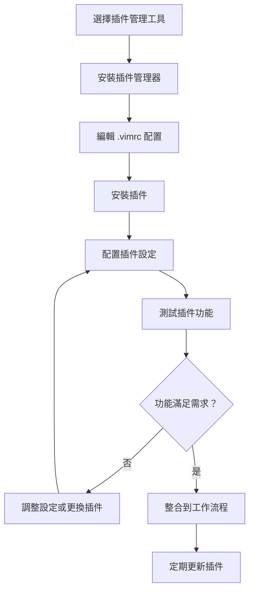

#### Linux 認證考試重點 ⭐
- **LPIC-1**: 編輯器客製化和擴充（102.1）
- **RHCE**: 開發工具整合
- **CompTIA Linux+**: 編輯器進階功能

#### 注意事項
- 插件過多會影響 Vim 啟動速度，建議精選必要插件
- 定期更新插件，但要注意相容性問題
- 備份 `.vimrc` 設定檔，便於環境重建

---

### 12. Git 與版本控制整合

#### 簡介

在現代軟體開發中，版本控制是不可或缺的工具。將 Vim 與 Git 整合能大幅提升開發效率。

#### 學習目標
- 掌握 Vim 與 Git 的基本整合
- 學會使用 Fugitive.vim 插件
- 熟練檔案比對和版本差異檢視

#### 內容教學

##### Vim 與 Git 基本操作

**在 Vim 中執行 Git 命令**：
```vim
:!git status        " 查看 Git 狀態
:!git add %         " 將目前檔案加入暫存區
:!git commit -m "message"   " 提交變更
:!git log --oneline " 查看提交歷史
```

**檔案狀態檢查**：
```vim
" 檢查目前檔案的 Git 狀態
:!git status %
:!git diff %        " 查看檔案變更
:!git diff --cached %   " 查看暫存區變更
```

**快速提交工作流程**：
```vim
" 設定快捷鍵
nnoremap <leader>gs :!git status<CR>
nnoremap <leader>ga :!git add %<CR>
nnoremap <leader>gc :!git commit -m ""<Left>
nnoremap <leader>gp :!git push<CR>
```

##### Fugitive.vim 插件使用

**安裝 Fugitive**：
```vim
" 使用 vim-plug 安裝
Plug 'tpope/vim-fugitive'
```

**基本 Fugitive 命令**：
```vim
:Git                " 開啟 Git 狀態視窗
:Git add %          " 暫存目前檔案
:Git commit         " 開啟提交編輯器
:Git push           " 推送到遠端
:Git pull           " 從遠端拉取
:Git log            " 查看提交歷史
:Git blame          " 查看檔案的 blame 資訊
```

**Git 狀態視窗操作**：
```vim
:Git                " 開啟狀態視窗

" 在狀態視窗中的操作
s                   " 暫存檔案
u                   " 取消暫存
-                   " 切換暫存狀態
cc                  " 建立提交
ca                  " 修改最後一次提交
D                   " 查看檔案差異
```

**分支管理**：
```vim
:Git branch         " 列出分支
:Git checkout -b feature-branch " 建立新分支
:Git checkout main  " 切換分支
:Git merge feature-branch   " 合併分支
```

##### 比對檔案與版本差異

**使用 Vim 內建 diff 功能**：
```vim
:vertical diffsplit file2   " 垂直分割比對檔案
:diffthis           " 設定目前視窗為 diff 模式
:diffoff            " 關閉 diff 模式
```

**Git diff 整合**：
```vim
:Gdiff              " 比對工作目錄與暫存區
:Gdiff HEAD         " 比對工作目錄與最後提交
:Gdiff branch-name  " 比對與指定分支
```

**diff 導覽命令**：
```vim
]c                  " 下一個差異
[c                  " 上一個差異
do                  " 取得差異（diff obtain）
dp                  " 放置差異（diff put）
```

**三方合併**：
```vim
:Gmerge             " 處理合併衝突
" 三個視窗：LOCAL | MERGED | REMOTE
" 在 MERGED 視窗中：
:diffget LOCAL      " 取得左邊的變更
:diffget REMOTE     " 取得右邊的變更
```

##### Git 工作流程最佳實務

**Feature Branch 工作流程**：
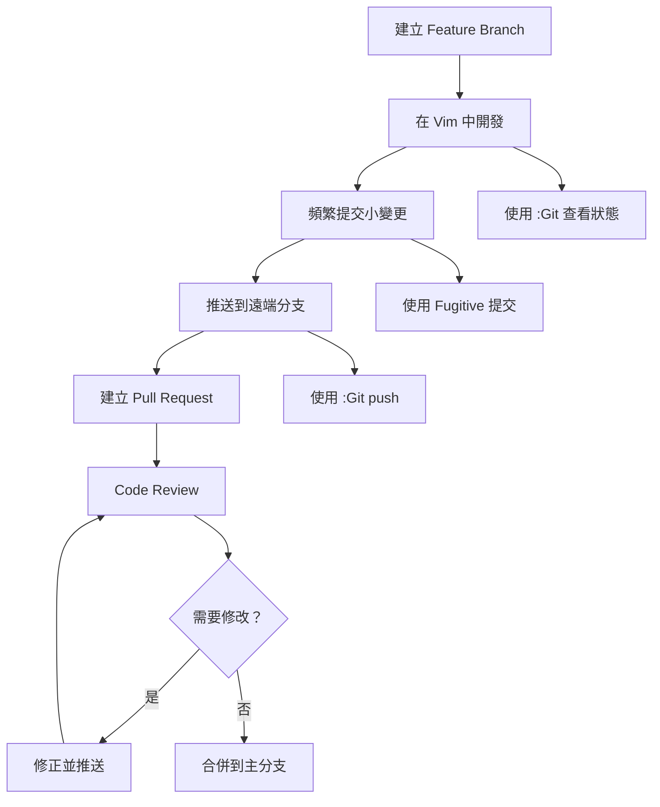

#### 實務練習

1. **基本 Git 整合練習**

   ```bash
   # 建立測試專案
   mkdir vim-git-practice
   cd vim-git-practice
   git init
   ```

   在 Vim 中練習：
   ```vim
   " 建立檔案
   vim README.md
   
   " 在 Vim 中執行 Git 命令
   :!git status
   :!git add %
   :!git commit -m "Initial commit"
   ```

2. **Fugitive 插件練習**

   安裝並使用 Fugitive：
   ```vim
   " 安裝插件後重啟 Vim
   vim practice.java
   
   " 使用 Fugitive 命令
   :Git                " 查看狀態
   s                   " 暫存檔案
   cc                  " 建立提交
   ```

3. **檔案比對練習**

   ```vim
   " 修改檔案後查看差異
   :Gdiff
   
   " 練習 diff 導覽
   ]c                  " 下一個差異
   [c                  " 上一個差異
   ```

#### 專案應用案例

**Java 專案的 Git 整合工作流程**：

1. **專案初始設定**：
```vim
" .vimrc 中的 Git 設定
" Git 快捷鍵
nnoremap <leader>gs :Git<CR>
nnoremap <leader>gc :Git commit<CR>
nnoremap <leader>gp :Git push<CR>
nnoremap <leader>gl :Git log --oneline<CR>
nnoremap <leader>gb :Git blame<CR>
nnoremap <leader>gd :Gdiff<CR>

" 自動命令
autocmd FileType gitcommit setlocal spell
autocmd FileType gitcommit setlocal textwidth=72
```

2. **日常開發流程**：
```vim
" 1. 開啟 Java 檔案
vim src/main/java/com/tutorial/Student.java

" 2. 開發過程中查看狀態
<leader>gs

" 3. 查看變更
<leader>gd

" 4. 提交變更
<leader>gc

" 5. 推送到遠端
<leader>gp
```

3. **處理合併衝突**：
```vim
" 當遇到合併衝突時
:Git merge feature-branch

" 開啟有衝突的檔案
vim src/main/java/com/tutorial/Student.java

" 解決衝突標記
" <<<<<<< HEAD
" =======
" >>>>>>> feature-branch

" 使用三方合併
:Gmerge

" 在 MERGED 視窗選擇要保留的內容
:diffget LOCAL      " 或 :diffget REMOTE

" 解決後提交
:Git add %
:Git commit
```

**Git Hook 整合**：
```bash
# .git/hooks/pre-commit
#!/bin/bash
# 提交前自動格式化 Java 檔案
find . -name "*.java" -exec vim -c "normal gg=G" -c "wq" {} \;
```

**多人協作專案設定**：
```vim
" 團隊專用 .vimrc 設定
" 提交訊息範本
autocmd FileType gitcommit 0r ~/.vim/templates/commit-template.txt

" 自動設定作者資訊檢查
function! CheckGitConfig()
    let l:name = system('git config user.name')
    let l:email = system('git config user.email')
    if empty(l:name) || empty(l:email)
        echo "請設定 Git 使用者資訊: git config user.name/user.email"
    endif
endfunction

autocmd VimEnter * call CheckGitConfig()
```

#### Linux 認證考試重點 ⭐
- **LPIC-1**: 版本控制工具使用（102.2）
- **RHCE**: Git 版本控制整合
- **CompTIA Linux+**: 開發工具與版本控制

#### 注意事項
- 大型檔案或二進位檔案不適合在 Vim 中進行 diff 比對
- 提交訊息應該遵循團隊約定的格式
- 使用 `.gitignore` 排除 Vim 暫存檔案（如 `*.swp`, `*.swo`）

---

### 13. 日常開發案例

#### 簡介

將前面學到的 Vim 技巧應用到實際開發場景中，掌握常見開發任務的高效處理方法。

#### 學習目標
- 快速尋找和跳轉到函數定義
- 高效處理多檔案同時修改
- 使用目錄導覽工具提升開發效率

#### 內容教學

##### 快速尋找函數定義

**使用內建功能**：
```vim
gd                  " 跳到區域變數定義
gD                  " 跳到全域變數定義
*                   " 搜尋游標下的單字
#                   " 向上搜尋游標下的單字
```

**使用 tags 檔案**：
```bash
# 產生 tags 檔案
ctags -R .          # 為整個專案產生 tags

# 或針對 Java 專案
ctags -R --languages=java --exclude=.git --exclude=target .
```

```vim
" 使用 tags 跳轉
Ctrl+]              " 跳到函數定義
Ctrl+T              " 返回上一個位置
:tag functionName   " 跳到指定函數
:tags               " 查看 tag 堆疊
```

**全域搜尋函數**：
```vim
:vimgrep /public.*functionName/ **/*.java
:copen              " 開啟結果視窗
:cnext              " 下一個結果
:cprev              " 上一個結果
```

##### 多檔案同時修改

**批次開啟相關檔案**：
```bash
# 開啟所有相關的 Java 檔案
vim src/**/*Student*.java

# 或使用萬用字元
vim {src/main,src/test}/**/*.java
```

**使用參數列表**：
```vim
:args src/**/*.java " 設定參數列表
:argdo %s/oldName/newName/ge | update   " 批次替換並儲存
```

**使用緩衝區列表**：
```vim
:bufdo %s/oldPattern/newPattern/ge | update
```

**quickfix 工作流程**：
```vim
" 1. 搜尋需要修改的內容
:vimgrep /pattern/ **/*.java

" 2. 開啟 quickfix 視窗
:copen

" 3. 逐一處理搜尋結果
:cnext              " 下一個結果
" 進行修改
:cnext              " 繼續下一個
```

##### 專案目錄快速導覽

**NERDTree 進階使用**：
```vim
" 安裝和設定
Plug 'preservim/nerdtree'

let NERDTreeShowHidden=1
let NERDTreeIgnore=['\.git$', '\.class$', '\.jar$', '\.war$']
map <C-n> :NERDTreeToggle<CR>
map <leader>nf :NERDTreeFind<CR>    " 在樹中找到目前檔案
```

**NERDTree 快捷鍵**：
```vim
" 在 NERDTree 視窗中
o                   " 開啟檔案或展開目錄
t                   " 在新分頁開啟檔案
i                   " 水平分割開啟檔案
s                   " 垂直分割開啟檔案
m                   " 顯示檔案操作選單
C                   " 將目錄設為根目錄
cd                  " 將目錄設為 Vim 工作目錄
```

**Telescope（Neovim 用戶）**：
```vim
" 安裝 Telescope
Plug 'nvim-telescope/telescope.nvim'

" 快捷鍵設定
nnoremap <leader>ff <cmd>Telescope find_files<cr>
nnoremap <leader>fg <cmd>Telescope live_grep<cr>
nnoremap <leader>fb <cmd>Telescope buffers<cr>
```

**檔案跳轉策略**：
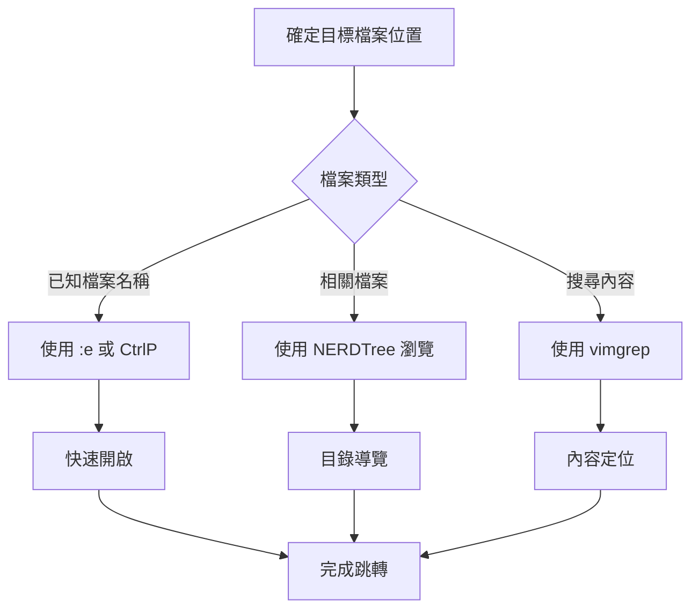

#### 實務練習

1. **函數定義搜尋練習**

   建立測試專案：
   ```bash
   mkdir java-practice
   cd java-practice
   # 建立多個 Java 檔案
   ```

   練習跳轉：
   ```vim
   " 1. 產生 tags
   :!ctags -R .
   
   " 2. 在程式碼中跳轉
   " 將游標放在函數名稱上
   Ctrl+]              " 跳到定義
   Ctrl+T              " 返回
   ```

2. **批次修改練習**

   假設需要重新命名變數：
   ```vim
   " 1. 開啟多個檔案
   :args **/*.java
   
   " 2. 批次替換
   :argdo %s/oldVariableName/newVariableName/ge | update
   
   " 3. 檢查結果
   :first
   :next
   ```

3. **專案導覽練習**

   ```vim
   " 安裝 NERDTree 後
   " 1. 開啟檔案樹
   Ctrl+N
   
   " 2. 在樹中導覽
   " 3. 使用各種開啟方式
   t                   " 新分頁開啟
   i                   " 分割視窗開啟
   ```

#### 專案應用案例

**大型 Java 專案重構案例**：

假設需要重構一個包含多個模組的 Java 專案：

1. **專案結構分析**：
```
project/
├── core/
│   ├── src/main/java/com/example/core/
│   └── src/test/java/com/example/core/
├── web/
│   ├── src/main/java/com/example/web/
│   └── src/test/java/com/example/web/
└── api/
    ├── src/main/java/com/example/api/
    └── src/test/java/com/example/api/
```

2. **重構工作流程**：
```vim
" 1. 產生整個專案的 tags
:!find . -name "*.java" | xargs ctags

" 2. 搜尋需要重構的類別
:vimgrep /class.*OldClassName/ **/*.java

" 3. 開啟搜尋結果
:copen

" 4. 逐一處理每個檔案
:cnext
" 進行重構...
:cnext

" 5. 批次更新相關引用
:args **/*.java
:argdo %s/com\.example\.core\.OldClassName/com.example.core.NewClassName/ge | update
```

3. **使用 Vim 腳本自動化**：
```vim
" refactor.vim - 重構輔助腳本
function! RefactorClassName(oldName, newName)
    " 更新類別定義
    execute '%s/class\s\+' . a:oldName . '/class ' . a:newName . '/g'
    
    " 更新建構子
    execute '%s/public\s\+' . a:oldName . '(/public ' . a:newName . '(/g'
    
    " 更新檔案名稱提示
    echo "記得重新命名檔案: " . a:oldName . ".java -> " . a:newName . ".java"
endfunction

" 使用方法
" :call RefactorClassName('OldStudent', 'NewStudent')
```

**微服務專案開發工作流程**：

```vim
" .vimrc 中的專案特定設定
function! SetupMicroserviceProject()
    " 設定專案根目錄
    let g:project_root = getcwd()
    
    " 快捷鍵設定
    nnoremap <leader>fc :e core/src/main/java/
    nnoremap <leader>fw :e web/src/main/java/
    nnoremap <leader>fa :e api/src/main/java/
    nnoremap <leader>tc :e core/src/test/java/
    nnoremap <leader>tw :e web/src/test/java/
    nnoremap <leader>ta :e api/src/test/java/
    
    " 設定 tags 檔案路徑
    set tags=./tags,tags,./core/tags,./web/tags,./api/tags
endfunction

" 專案啟動時自動執行
autocmd VimEnter * if isdirectory('core') && isdirectory('web') && isdirectory('api') | call SetupMicroserviceProject() | endif
```

**日常開發工作流程圖**：
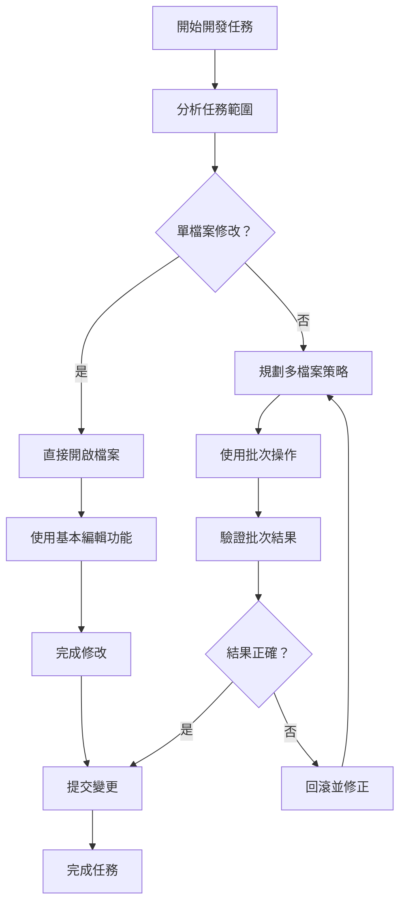

#### Linux 認證考試重點 ⭐
- **LPIC-1**: 檔案系統操作和文字處理（103.1, 103.2）
- **RHCE**: 實務開發環境操作
- **CompTIA Linux+**: 開發工具整合應用

#### 注意事項
- 大型專案建議定期重新產生 tags 檔案
- 批次操作前建議先備份或使用版本控制
- 複雜的重構任務可以結合 IDE 工具輔助

---

## 第四篇：考試與認證準備

### 14. Vim 認證簡介

#### 簡介

雖然沒有專門的 Vim 認證，但 Vim 技能是許多 Linux 認證考試的重要組成部分。本章介紹相關認證和考試重點。

#### 學習目標
- 了解包含 Vim 技能的認證種類
- 掌握各種認證的考試範圍
- 準備認證考試的策略

#### 內容教學

##### 常見 Vim 認證種類

**Linux 專業認證包含 Vim 技能**：

1. **LPIC-1 (Linux Professional Institute Certification Level 1)**
   - 考試編號：101-500, 102-500
   - Vim 相關主題：
     - 102.1 設計硬碟配置
     - 102.2 安裝開機管理程式
     - 102.3 管理共享函式庫
     - 102.4 使用 Debian 套件管理
     - 102.5 使用 RPM 和 YUM 套件管理

2. **RHCE (Red Hat Certified Engineer)**
   - 考試編號：EX294
   - Vim 技能要求：
     - 編輯設定檔
     - 建立和修改腳本
     - 系統管理任務

3. **CompTIA Linux+**
   - 考試編號：XK0-004
   - 涵蓋範圍：
     - 文字編輯器使用
     - 系統設定管理
     - 腳本編寫

##### 認證考試範圍

**LPIC-1 中的 Vim 技能要求**：

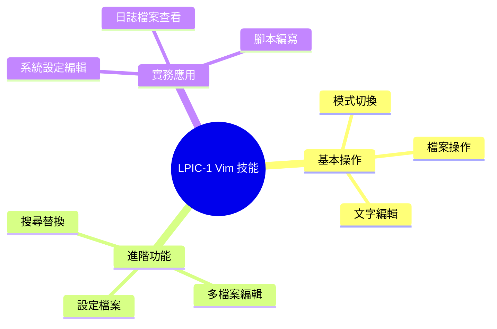

**具體技能清單**：
- 啟動和退出 vi/vim
- 在不同模式間切換
- 移動游標和導覽
- 插入、刪除、修改文字
- 搜尋和替換文字
- 儲存和載入檔案
- 使用基本設定選項

**RHCE 中的 Vim 應用**：
- 編輯 Ansible playbooks
- 修改系統設定檔
- 建立和編輯 shell 腳本
- 管理 systemd 服務檔案

**實際考試情境**：
```yaml
# 考試可能出現的任務範例
tasks:
  - name: "編輯 /etc/hosts 檔案"
    description: "使用 vi 在 /etc/hosts 中加入新的主機記錄"
    time_limit: "5分鐘"
    
  - name: "建立設定檔案"
    description: "建立 Apache 虛擬主機設定檔"
    time_limit: "10分鐘"
    
  - name: "修改啟動腳本"
    description: "編輯 /etc/rc.local 加入自定義命令"
    time_limit: "3分鐘"
```

#### 實務練習

1. **LPIC-1 模擬練習**

   模擬考試環境操作：
   ```bash
   # 情境：需要編輯網路設定檔
   sudo vim /etc/network/interfaces
   ```

   考試技巧：
   ```vim
   " 1. 快速進入插入模式
   i
   
   " 2. 加入設定內容
   auto eth0
   iface eth0 inet static
   address 192.168.1.100
   netmask 255.255.255.0
   
   " 3. 快速儲存退出
   <ESC>
   :wq
   ```

2. **RHCE 模擬練習**

   Ansible playbook 編輯：
   ```yaml
   # playbook.yml
   ---
   - hosts: all
     tasks:
       - name: Install Apache
         yum:
           name: httpd
           state: present
   ```

   練習任務：
   ```vim
   " 1. 開啟檔案
   vim playbook.yml
   
   " 2. 快速跳到特定行
   /tasks
   
   " 3. 加入新任務
   o
   " 輸入新任務內容
   
   " 4. 檢查語法（視覺檢查）
   :set syntax=yaml
   ```

3. **時間壓力下的編輯練習**

   設定計時器練習：
   ```bash
   # 3分鐘內完成以下任務
   timeout 180 vim practice.conf
   ```

   任務列表：
   - 開啟檔案
   - 找到特定設定行
   - 修改參數值
   - 加入新的設定項目
   - 儲存並退出

#### 專案應用案例

**認證考試準備策略**：

1. **建立練習環境**：
```bash
# 建立模擬考試環境
mkdir certification-practice
cd certification-practice

# 建立各種練習檔案
echo "ServerRoot /etc/httpd" > apache.conf
echo "127.0.0.1 localhost" > hosts
echo "#!/bin/bash" > startup.sh
```

2. **制定練習計畫**：


3. **考試技巧整理**：
```vim
" 考試快速操作備忘錄
" 
" 最常用的快捷鍵：
" i    - 插入模式
" ESC  - 一般模式  
" :wq  - 儲存退出
" :q!  - 強制退出
" /    - 搜尋
" dd   - 刪除行
" yy   - 複製行
" p    - 貼上
" u    - 復原
" 
" 考試注意事項：
" 1. 確認模式狀態
" 2. 操作前先備份
" 3. 完成後檢查結果
" 4. 注意檔案權限
```

#### Linux 認證考試重點 ⭐

**LPIC-1 重點整理**：
- **102.1**: 文字編輯器使用（權重：2）
  - vi/vim 基本操作
  - 模式切換
  - 基本編輯命令

**RHCE 重點整理**：
- 系統設定檔編輯
- Ansible playbook 編寫
- 服務設定檔修改

**CompTIA Linux+ 重點整理**：
- 文字編輯器選擇和使用
- 設定檔案管理
- 基本文字處理

#### 注意事項
- 考試環境可能只有基本的 vi，不是完整的 vim
- 熟練基本操作比掌握進階功能更重要
- 練習在時間壓力下保持準確性

---

### 15. 模擬練習題

#### 簡介

通過實際的模擬練習題來檢驗 Vim 技能，涵蓋從基礎操作到進階編輯技巧的各個層面。

#### 學習目標
- 通過實際練習鞏固 Vim 技能
- 熟悉認證考試的題目類型
- 提升在壓力下的操作效率

#### 內容教學

##### 基礎操作練習

**練習題 1：檔案基本操作**
```
任務：編輯系統設定檔
時間限制：5分鐘
難度：★☆☆

步驟：
1. 使用 vim 開啟 /etc/hostname 檔案
2. 將主機名稱改為 "webserver01"
3. 儲存檔案並退出
4. 重新開啟檔案確認修改成功
```

標準答案：
```bash
# 步驟 1
sudo vim /etc/hostname

# 在 vim 中執行步驟 2-3
i
webserver01
<ESC>
:wq

# 步驟 4
cat /etc/hostname
```

**練習題 2：文字搜尋與替換**
```
任務：修改設定檔參數
時間限制：3分鐘
難度：★★☆

給定檔案內容：
# Apache Configuration
ServerRoot /var/www
DocumentRoot /var/www/html
Port 80
MaxClients 150

要求：
1. 將 Port 80 改為 Port 8080
2. 將 MaxClients 150 改為 MaxClients 300
3. 在檔案結尾加入 "# Modified for production"
```

標準答案：
```vim
vim config.txt
/Port
cw8080<ESC>
/MaxClients
cw300<ESC>
Go
# Modified for production<ESC>
:wq
```

**練習題 3：多行編輯**
```
任務：批次註解程式碼
時間限制：4分鐘
難度：★★☆

給定 Java 程式碼：
System.out.println("Debug 1");
System.out.println("Debug 2");
System.out.println("Debug 3");
int result = calculate();
System.out.println("Debug 4");

要求：
1. 將所有 System.out.println 行註解掉（加上 // ）
2. 保持其他行不變
```

標準答案：
```vim
vim debug.java
/System
I// <ESC>
n
I// <ESC>
n
I// <ESC>
/Debug 4
I// <ESC>
:wq
```

##### 進階編輯技巧題目

**練習題 4：正規表示式搜尋替換**
```
任務：標準化日誌格式
時間限制：8分鐘
難度：★★★

給定日誌檔案內容：
2024-01-15 ERROR: Connection failed
2024-01-15 WARN: Low memory
2024-01-15 INFO: Service started
2024-01-15 ERROR: Database timeout

要求：
1. 將所有 ERROR 替換為 [ERROR]
2. 將所有 WARN 替換為 [WARNING]  
3. 將所有 INFO 替換為 [INFO]
4. 在每行開頭加上行號
```

標準答案：
```vim
vim logfile.txt
:%s/ERROR/[ERROR]/g
:%s/WARN/[WARNING]/g
:%s/INFO/[INFO]/g
:%s/^/\=line('.') . ': '/g
:wq
```

**練習題 5：多檔案操作**
```
任務：批次更新版權資訊
時間限制：10分鐘
難度：★★★

情境：有多個 Java 檔案需要更新版權年份
檔案：Student.java, Teacher.java, Course.java

要求：
1. 同時開啟所有檔案
2. 將所有檔案中的 "Copyright 2023" 改為 "Copyright 2024"
3. 儲存所有檔案
```

標準答案：
```vim
vim *.java
:args *.java
:argdo %s/Copyright 2023/Copyright 2024/ge | update
:wa
```

##### 專案實務題目

**練習題 6：設定檔案管理**
```
任務：Apache 虛擬主機設定
時間限制：15分鐘
難度：★★★

要求建立以下設定檔案：
檔案名稱：/etc/apache2/sites-available/example.conf

內容：
<VirtualHost *:80>
    ServerName example.com
    ServerAlias www.example.com
    DocumentRoot /var/www/example
    ErrorLog ${APACHE_LOG_DIR}/example.error.log
    CustomLog ${APACHE_LOG_DIR}/example.access.log combined
</VirtualHost>

額外要求：
1. 建立目錄結構 /var/www/example
2. 在該目錄建立簡單的 index.html
```

標準答案：
```bash
# 建立目錄
sudo mkdir -p /var/www/example

# 建立設定檔
sudo vim /etc/apache2/sites-available/example.conf
```

```vim
i
<VirtualHost *:80>
    ServerName example.com
    ServerAlias www.example.com
    DocumentRoot /var/www/example
    ErrorLog ${APACHE_LOG_DIR}/example.error.log
    CustomLog ${APACHE_LOG_DIR}/example.access.log combined
</VirtualHost>
<ESC>
:wq
```

```bash
# 建立 index.html
sudo vim /var/www/example/index.html
```

```vim
i
<!DOCTYPE html>
<html>
<head>
    <title>Example Site</title>
</head>
<body>
    <h1>Welcome to Example.com</h1>
</body>
</html>
<ESC>
:wq
```

#### 實務練習

**綜合練習：Web 伺服器設定**

模擬 RHCE 考試情境：
```
情境：需要設定一個 Web 伺服器來提供靜態網站服務

任務清單：
1. 編輯 httpd.conf，修改監聽埠為 8080
2. 建立虛擬主機設定檔
3. 建立網站內容檔案
4. 設定正確的檔案權限

時間限制：30分鐘
```

詳細步驟：
```bash
# 1. 編輯主設定檔
sudo vim /etc/httpd/conf/httpd.conf

# 在 vim 中
/Listen
c$Listen 8080<ESC>
:wq

# 2. 建立虛擬主機設定
sudo vim /etc/httpd/conf.d/vhost.conf

# 3. 建立網站目錄和檔案
sudo mkdir -p /var/www/mysite
sudo vim /var/www/mysite/index.html

# 4. 設定權限
sudo chown -R apache:apache /var/www/mysite
sudo chmod -R 755 /var/www/mysite
```

**計分標準**：


#### 專案應用案例

**考試準備工作流程**：

1. **每日練習計畫**：
```vim
" daily-practice.vim
" 每日 30 分鐘 Vim 練習腳本

" 第一週：基礎操作
" - 檔案開啟/儲存/關閉
" - 模式切換
" - 基本移動和編輯

" 第二週：搜尋和替換
" - 基本搜尋
" - 正規表示式
" - 全域替換

" 第三週：多檔案操作
" - 緩衝區管理
" - 批次操作
" - 分割視窗

" 第四週：綜合實務
" - 系統設定檔編輯
" - 腳本建立
" - 實際場景模擬
```

2. **錯誤分析與改進**：
```vim
" 常見錯誤記錄
" 
" 錯誤 1: 忘記切換模式
" 解決: 養成按 ESC 的習慣
" 
" 錯誤 2: 搜尋替換語法錯誤
" 解決: 多練習正規表示式
" 
" 錯誤 3: 多檔案操作混淆
" 解決: 使用 :ls 確認緩衝區狀態
```

#### Linux 認證考試重點 ⭐

**考試策略**：
1. **時間管理**：為每個任務分配合理時間
2. **操作確認**：完成後檢查結果
3. **備份習慣**：重要操作前先備份
4. **錯誤處理**：遇到問題保持冷靜

#### 注意事項
- 練習時使用計時器模擬考試壓力
- 記錄常犯錯誤並針對性練習
- 熟悉不同版本 vi/vim 的差異

---

### 16. 學習路線圖

#### 簡介

提供完整的 Vim 學習路徑，從初學者到進階使用者的系統性學習建議。

#### 學習目標
- 制定個人化的 Vim 學習計畫
- 了解不同階段的學習重點
- 掌握學習資源和實務建議

#### 內容教學

##### 從初學者到進階使用者

**學習階段劃分**：

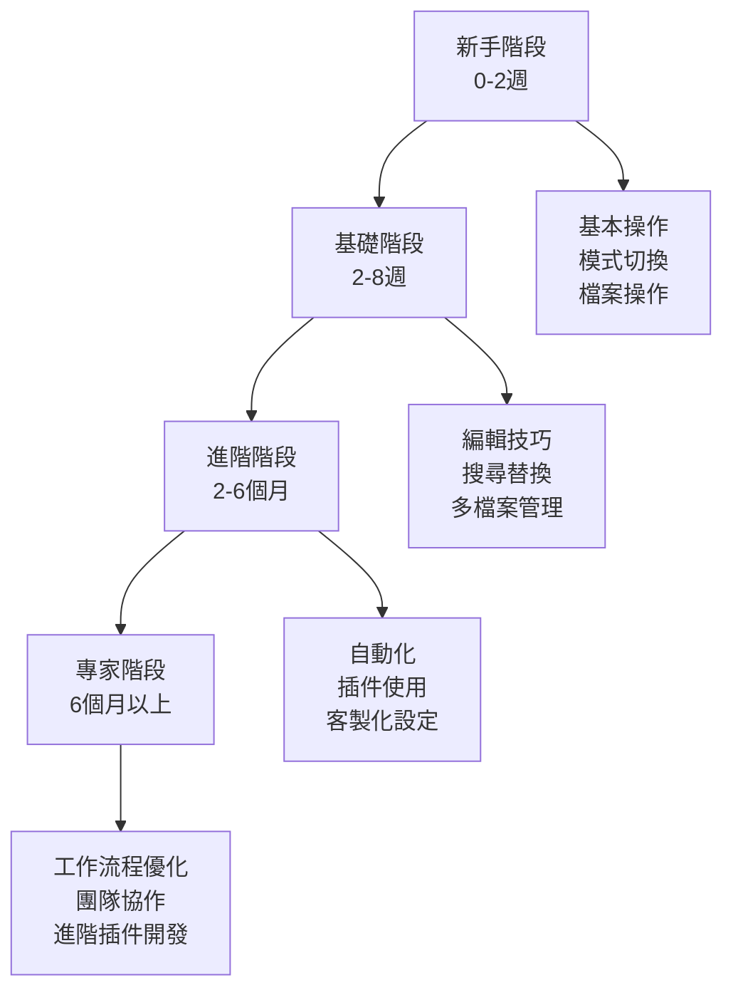

**第一階段：新手入門（0-2週）**

學習目標：
- 能夠基本操作 Vim 進行文字編輯
- 不再害怕使用 Vim
- 掌握最基本的生存技能

每日學習計畫：
```
第1-3天：模式操作
- 理解四種主要模式
- 練習模式切換
- 學會如何退出 Vim

第4-7天：基本編輯
- 游標移動
- 插入和刪除文字
- 檔案儲存

第8-14天：鞏固練習
- 每天編輯不同類型的檔案
- 逐漸減少對滑鼠的依賴
- 建立肌肉記憶
```

必須掌握的命令：
```vim
" 模式切換
i, a, o          " 進入插入模式
ESC              " 回到一般模式
:                " 進入命令列模式

" 基本移動
h, j, k, l       " 基本方向移動
w, b             " 單字移動
0, $             " 行首行尾

" 檔案操作
:w               " 儲存
:q               " 退出
:wq, ZZ          " 儲存並退出
:q!              " 強制退出
```

**第二階段：基礎熟練（2-8週）**

學習目標：
- 提升編輯效率
- 掌握搜尋和替換
- 能夠處理多檔案編輯

學習計畫：
```
第3-4週：進階移動和編輯
- 快速移動命令
- 複製、貼上、刪除
- Undo/Redo

第5-6週：搜尋和替換
- 基本搜尋
- 正規表示式入門
- 全域替換

第7-8週：多檔案管理
- 緩衝區操作
- 分割視窗
- 分頁管理
```

**第三階段：進階應用（2-6個月）**

學習目標：
- 自動化重複任務
- 客製化 Vim 環境
- 整合開發工作流程

重點領域：
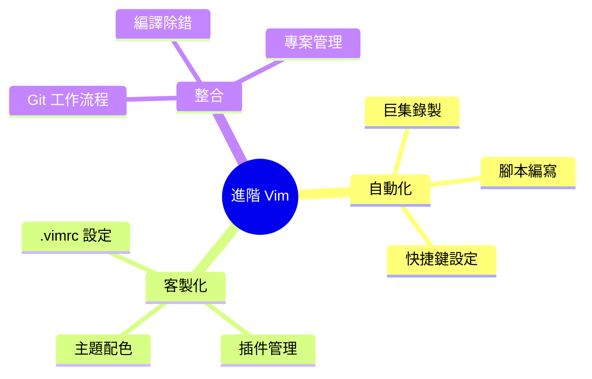

**第四階段：專家級別（6個月以上）**

特點：
- Vim 成為思維的延伸
- 能夠指導他人
- 貢獻開源專案

進階技能：
- 編寫 Vim 插件
- 深度客製化
- 效能調優
- 跨平台使用

##### 推薦學習資源

**書籍推薦**：

1. **《Practical Vim》** by Drew Neil
   - 進階技巧全面指南
   - 實用案例豐富
   - 適合已有基礎的學習者

2. **《Learning the vi and Vim Editors》** by Arnold Robbins
   - 從 vi 到 vim 的完整教程
   - 歷史背景和深度解析
   - 適合系統管理員

3. **《Modern Vim》** by Drew Neil
   - 現代 Vim 特性介紹
   - Neovim 相關內容
   - 插件生態系統

**線上資源**：

1. **Vim Adventures** (vim-adventures.com)
   - 遊戲化學習
   - 互動式教學
   - 適合初學者

2. **Vimcasts** (vimcasts.org)
   - 影片教學
   - 實用技巧分享
   - Drew Neil 主持

3. **Vim Golf** (www.vimgolf.com)
   - 挑戰最少按鍵完成任務
   - 學習高效操作
   - 社群互動

**練習平台**：

```vim
" 推薦練習網站
" 
" 1. Vim Genius (vimgenius.com)
"    - 快捷鍵練習
"    - 進度追蹤
" 
" 2. OpenVim (openvim.com)
"    - 線上 Vim 模擬器
"    - 互動式教學
" 
" 3. Vim Snake (github.com/johngrib/vim-game-snake)
"    - 遊戲中學習 Vim
"    - 寓教於樂
```

##### 考試準備建議

**Linux 認證考試準備路線**：


**考試準備檢查清單**：
```
□ 基本操作無需思考（肌肉記憶）
□ 能在 5 分鐘內完成基本檔案編輯任務
□ 熟悉正規表示式基本語法
□ 掌握多檔案批次操作
□ 了解系統設定檔編輯注意事項
□ 練習過時間限制下的操作
□ 熟悉考試環境可能的 vi/vim 版本差異
```

#### 實務練習

**個人學習計畫制定**：

1. **技能評估**：
```vim
" 自我評估表（1-5分）
" 
" 基本操作        [1][2][3][4][5]
" 檔案管理        [1][2][3][4][5]
" 搜尋替換        [1][2][3][4][5]
" 多檔案編輯      [1][2][3][4][5]
" 正規表示式      [1][2][3][4][5]
" 巨集自動化      [1][2][3][4][5]
" 插件使用        [1][2][3][4][5]
" 客製化設定      [1][2][3][4][5]
```

2. **學習追蹤表**：
```
週別 | 學習內容 | 練習時間 | 完成度 | 備註
-----|----------|----------|--------|------
1    | 模式操作 | 7小時    | 100%   | 已熟練
2    | 基本編輯 | 10小時   | 90%    | 需加強正規表示式
3    | 搜尋替換 | 8小時    | 70%    | 繼續練習
```

#### 專案應用案例

**企業內部 Vim 培訓計畫**：

```vim
" 團隊 Vim 培訓大綱
" 
" 第一階段：全員基礎培訓（2週）
" 目標：所有開發人員都能基本使用 Vim
" 
" 第二階段：進階選修（4週）
" 目標：有興趣的同事深入學習
" 
" 第三階段：內部分享（持續）
" 目標：建立學習社群，互相交流
```

**學習成效評估**：
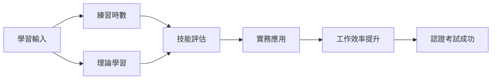

#### Linux 認證考試重點 ⭐

**各階段認證建議**：
- **初學者**：先熟練基本操作，不急於考證
- **基礎階段**：可考慮 CompTIA Linux+
- **進階階段**：準備 LPIC-1 認證
- **專家階段**：挑戰 RHCE 等高階認證

#### 注意事項
- 學習進度因人而異，不要過度比較
- 定期回顧和鞏固已學技能
- 將 Vim 技能應用到實際工作中
- 參與社群討論，學習他人經驗

---

## 附錄

### Vim 常用快捷鍵速查表

#### 模式切換
| 快捷鍵 | 說明 |
|--------|------|
| `i` | 在游標位置插入 |
| `a` | 在游標後插入 |
| `o` | 在下一行插入 |
| `O` | 在上一行插入 |
| `ESC` | 回到一般模式 |
| `:` | 進入命令列模式 |
| `v` | 視覺模式（字元選取） |
| `V` | 視覺模式（行選取） |
| `Ctrl+v` | 視覺模式（區塊選取） |

#### 游標移動
| 快捷鍵 | 說明 |
|--------|------|
| `h` | 左移 |
| `j` | 下移 |
| `k` | 上移 |
| `l` | 右移 |
| `w` | 下一個字首 |
| `b` | 上一個字首 |
| `e` | 字尾 |
| `0` | 行首 |
| `$` | 行尾 |
| `gg` | 檔案開頭 |
| `G` | 檔案結尾 |
| `Ctrl+f` | 向下翻頁 |
| `Ctrl+b` | 向上翻頁 |

#### 編輯操作
| 快捷鍵 | 說明 |
|--------|------|
| `x` | 刪除游標處字元 |
| `dd` | 刪除整行 |
| `dw` | 刪除單字 |
| `yy` | 複製整行 |
| `yw` | 複製單字 |
| `p` | 在游標後貼上 |
| `P` | 在游標前貼上 |
| `u` | 復原 |
| `Ctrl+r` | 重做 |
| `r` | 取代單一字元 |
| `cw` | 變更單字 |

#### 搜尋與替換
| 快捷鍵 | 說明 |
|--------|------|
| `/pattern` | 向下搜尋 |
| `?pattern` | 向上搜尋 |
| `n` | 下一個匹配項 |
| `N` | 上一個匹配項 |
| `*` | 搜尋游標下的單字 |
| `#` | 向上搜尋游標下的單字 |
| `:s/old/new/` | 替換目前行第一個 |
| `:s/old/new/g` | 替換目前行所有 |
| `:%s/old/new/g` | 替換全檔所有 |

#### 檔案操作
| 快捷鍵 | 說明 |
|--------|------|
| `:w` | 儲存 |
| `:q` | 退出 |
| `:wq` | 儲存並退出 |
| `:q!` | 強制退出 |
| `ZZ` | 儲存並退出 |
| `:e filename` | 開啟檔案 |
| `:split` | 水平分割 |
| `:vsplit` | 垂直分割 |
| `Ctrl+w w` | 切換視窗 |

#### 進階操作
| 快捷鍵 | 說明 |
|--------|------|
| `q{register}` | 開始錄製巨集 |
| `@{register}` | 執行巨集 |
| `m{mark}` | 設定標記 |
| `'{mark}` | 跳到標記 |
| `>>` | 向右縮排 |
| `<<` | 向左縮排 |
| `=` | 自動縮排 |
| `Ctrl+]` | 跳到標籤定義 |

### 常見錯誤排解

#### 問題 1：無法退出 Vim
**症狀**：按任何鍵都無效，無法退出編輯器
**原因**：可能在插入模式或其他模式
**解決方法**：
```vim
ESC          " 先按 ESC 回到一般模式
:q           " 然後輸入 :q 退出
```

#### 問題 2：意外進入取代模式
**症狀**：輸入文字會覆蓋原有內容
**原因**：按到 `R` 進入取代模式
**解決方法**：
```vim
ESC          " 按 ESC 回到一般模式
u            " 如需要，按 u 復原變更
```

#### 問題 3：畫面顯示亂碼
**症狀**：中文或特殊字元顯示為亂碼
**原因**：編碼設定不正確
**解決方法**：
```vim
:set encoding=utf-8
:set fileencoding=utf-8
```

#### 問題 4：無法使用方向鍵
**症狀**：方向鍵輸入字母而非移動游標
**原因**：在插入模式下使用方向鍵
**解決方法**：
```vim
ESC          " 先退到一般模式
h j k l      " 使用 vim 標準移動鍵
```

#### 問題 5：搜尋沒有結果
**症狀**：明明存在的內容搜尋不到
**原因**：大小寫敏感或搜尋模式問題
**解決方法**：
```vim
:set ignorecase     " 忽略大小寫
:set smartcase      " 智慧大小寫
/\cpattern         " 強制忽略大小寫搜尋
```

#### 問題 6：無法儲存檔案
**症狀**：提示 "Permission denied" 或無法寫入
**原因**：檔案權限不足
**解決方法**：
```vim
:w !sudo tee %     " 使用 sudo 權限儲存
```

### 推薦書籍與網站

#### 書籍推薦

**入門級**：
1. **《Learning the vi and Vim Editors》** - Arnold Robbins, Elbert Hannah
   - 適合完全初學者
   - 從 vi 基礎到 vim 進階
   - 包含歷史背景和基本概念

2. **《vi and Vim Editors Pocket Reference》** - Arnold Robbins
   - 便攜式參考手冊
   - 快速查詢常用命令
   - 適合已有基礎的使用者

**進階級**：
3. **《Practical Vim》** - Drew Neil
   - 實用技巧導向
   - 豐富的實際案例
   - 提升工作效率的最佳實務

4. **《Modern Vim》** - Drew Neil
   - 現代 Vim 特性
   - Neovim 相關內容
   - 插件生態系統介紹

#### 網站資源

**學習網站**：
1. **Vim Adventures** (https://vim-adventures.com/)
   - 遊戲化學習體驗
   - 互動式教學
   - 適合初學者建立興趣

2. **Vimcasts** (http://vimcasts.org/)
   - 高品質影片教學
   - Drew Neil 主持
   - 定期更新實用技巧

3. **OpenVim** (https://www.openvim.com/)
   - 線上 Vim 練習平台
   - 無需安裝軟體
   - 步驟式教學指導

**參考資源**：
4. **Vim 官方文件** (https://www.vim.org/docs.php)
   - 權威參考資料
   - 完整功能說明
   - 持續更新維護

5. **Vim Wiki** (https://vim.fandom.com/)
   - 社群維護的知識庫
   - 豐富的使用技巧
   - 問題解決方案

**練習平台**：
6. **Vim Golf** (https://www.vimgolf.com/)
   - 挑戰最少按鍵完成任務
   - 學習高效操作方法
   - 社群競賽平台

7. **Vim Genius** (http://vimgenius.com/)
   - 快捷鍵記憶練習
   - 進度追蹤功能
   - 系統化學習路徑

### 練習建議

#### 日常練習計畫

**初學者（第1-2週）**：
```
每日 30 分鐘練習
- 10 分鐘：基本操作練習（模式切換、移動）
- 15 分鐘：實際檔案編輯
- 5 分鐘：複習前一天學習內容
```

**基礎階段（第3-8週）**：
```
每日 45 分鐘練習
- 15 分鐘：新技能學習
- 20 分鐘：實務專案應用
- 10 分鐘：速度和準確性訓練
```

**進階階段（2-6個月）**：
```
每週安排
- 2-3次：深度學習新功能（巨集、插件等）
- 每日：將 Vim 融入日常工作
- 週末：參與社群討論或貢獻開源專案
```

#### 練習技巧

1. **建立習慣**：
   - 每天固定時間練習
   - 從簡單任務開始
   - 逐步增加複雜度

2. **實戰應用**：
   - 使用 Vim 處理真實工作任務
   - 避免只做練習題
   - 記錄使用心得和問題

3. **社群參與**：
   - 加入 Vim 相關論壇或群組
   - 分享學習經驗
   - 向專家請教問題

4. **定期回顧**：
   - 每週檢視學習進度
   - 重複練習薄弱環節
   - 更新學習目標

---

## 檢查清單（Checklist）

### 新進成員 Vim 技能檢查清單

#### 基礎操作檢查

**模式操作**：
- [ ] 能夠順利啟動 Vim
- [ ] 理解四種主要模式的用途
- [ ] 熟練在模式間切換
- [ ] 知道如何安全退出 Vim（:q, :wq, :q!）
- [ ] 能識別目前處於哪種模式

**檔案操作**：
- [ ] 能開啟指定檔案
- [ ] 能儲存檔案修改
- [ ] 能另存新檔
- [ ] 能在不儲存的情況下退出
- [ ] 了解備份檔案機制

**基本編輯**：
- [ ] 熟練使用 h, j, k, l 移動
- [ ] 能使用 w, b 在單字間移動
- [ ] 能快速移動到行首（0）行尾（$）
- [ ] 能跳到檔案開頭（gg）和結尾（G）
- [ ] 能插入（i）、附加（a）、新行（o）文字
- [ ] 能刪除字元（x）、單字（dw）、整行（dd）
- [ ] 能複製（yy）和貼上（p）文字
- [ ] 能使用復原（u）和重做（Ctrl+r）

#### 進階功能檢查

**搜尋與替換**：
- [ ] 能使用 / 和 ? 進行基本搜尋
- [ ] 能使用 n 和 N 在搜尋結果間移動
- [ ] 能使用 * 和 # 搜尋游標下的單字
- [ ] 能進行基本的文字替換（:s///）
- [ ] 能進行全檔替換（:%s///g）
- [ ] 了解正規表示式的基本概念

**多檔案操作**：
- [ ] 能同時開啟多個檔案
- [ ] 能在檔案間切換（:bn, :bp）
- [ ] 能使用分割視窗（:split, :vsplit）
- [ ] 能在視窗間移動（Ctrl+w w）
- [ ] 了解緩衝區的概念

**實務應用**：
- [ ] 能編輯系統設定檔
- [ ] 能處理程式碼檔案
- [ ] 能進行基本的日誌檔案分析
- [ ] 能使用 Vim 進行簡單的文字處理任務

#### 專案開發檢查

**程式開發環境**：
- [ ] 能設定基本的 .vimrc 配置
- [ ] 了解語法高亮的使用
- [ ] 能進行程式碼自動縮排
- [ ] 能使用基本的摺疊功能
- [ ] 了解如何整合編譯工具

**版本控制整合**：
- [ ] 能在 Vim 中執行基本 Git 命令
- [ ] 了解如何查看檔案差異
- [ ] 能使用 Vim 編寫提交訊息
- [ ] 了解基本的合併衝突處理

**效率提升**：
- [ ] 能錄製和執行簡單巨集
- [ ] 能使用標記進行快速跳轉
- [ ] 能進行批次檔案操作
- [ ] 了解如何客製化快捷鍵

#### 認證準備檢查

**LPIC-1 準備**：
- [ ] 能在時間壓力下完成基本編輯任務
- [ ] 熟悉 vi 和 vim 的差異
- [ ] 能處理系統管理相關的檔案編輯
- [ ] 了解檔案權限對編輯的影響

**RHCE 準備**：
- [ ] 能編輯 Ansible playbook
- [ ] 能修改系統服務設定檔
- [ ] 能建立和編輯 shell 腳本
- [ ] 能處理複雜的設定檔案結構

### 團隊協作檢查清單

#### 代碼風格一致性

**格式設定**：
- [ ] 團隊成員使用統一的縮排設定
- [ ] 統一的行尾符號處理
- [ ] 一致的字元編碼設定（UTF-8）
- [ ] 統一的分頁寬度設定

**最佳實務**：
- [ ] 遵循專案的程式碼風格指南
- [ ] 使用版本控制忽略 Vim 暫存檔
- [ ] 建立團隊共用的 .vimrc 範本
- [ ] 定期分享 Vim 使用技巧

#### 知識分享

**文件維護**：
- [ ] 更新團隊 Vim 設定說明
- [ ] 記錄常用的專案特定操作
- [ ] 維護常見問題解決方案
- [ ] 分享實用插件和設定

**培訓支援**：
- [ ] 為新人提供 Vim 入門指導
- [ ] 組織內部 Vim 技巧分享會
- [ ] 建立內部 Vim 學習資源
- [ ] 提供實務問題的支援管道

### 系統管理檢查清單

#### 環境設定

**基本環境**：
- [ ] 確認 Vim 版本和功能支援
- [ ] 設定適當的終端機顏色支援
- [ ] 配置正確的語言和編碼環境
- [ ] 建立個人和系統範本設定

**安全考量**：
- [ ] 了解編輯系統檔案的風險
- [ ] 知道如何安全地使用 sudo 編輯
- [ ] 熟悉檔案備份和恢復程序
- [ ] 了解權限對編輯操作的影響

#### 效能優化

**大檔案處理**：
- [ ] 了解大檔案編輯的限制
- [ ] 知道如何關閉不必要的功能
- [ ] 能使用適當的記憶體設定
- [ ] 了解何時使用其他工具替代

**插件管理**：
- [ ] 定期更新和清理插件
- [ ] 監控插件對效能的影響
- [ ] 備份重要的設定和插件
- [ ] 了解插件間的相容性問題

### 持續改進檢查清單

#### 技能提升

**定期評估**：
- [ ] 每月檢視 Vim 使用效率
- [ ] 識別重複性任務自動化機會
- [ ] 學習新的 Vim 功能和技巧
- [ ] 參與 Vim 社群活動

**知識更新**：
- [ ] 關注 Vim 新版本特性
- [ ] 學習相關工具的整合方法
- [ ] 了解行業最佳實務的變化
- [ ] 分享經驗並學習他人技巧

這份完整的 Vim 使用教學手冊提供了從基礎到進階的全面指導，包含實務案例、認證準備、和實用的檢查清單，適合不同層級的學習者使用。

---

**📝 文件資訊**
- 建立日期：2024年1月
- 最後更新：2024年1月
- 版本：v1.0
- 作者：專案團隊
- 適用範圍：Java 開發專案團隊

**🔗 相關資源**
- [專案開發規範](../../../.github/指引/設計開發/)
- [工具使用指引](../../../.github/指引/)
- [認證考試資源](https://www.lpi.org/)

**💡 意見回饋**
如有任何問題或建議，請透過專案 Issue 系統提出，或聯繫專案維護團隊。
