+++
date = '2026-06-25T18:32:14+08:00'
draft = false
title = 'Codebase Memory Mcp 教學手冊'
tags = ['教學', '工具','AI開發']
categories = ['教學']
+++

# codebase-memory-mcp 教學手冊

## AI Coding Agent 知識圖譜引擎與超大型專案程式碼理解平台

---

## 文件版本控制表

| 項目 | 內容 |
|---|---|
| 文件版本 | v1.1 |
| 撰寫/修訂日期 | 2026-06-25 |
| 依據官方專案版本 | [DeusData/codebase-memory-mcp](https://github.com/DeusData/codebase-memory-mcp) **v0.8.1**（官方發布日 2026-06-12） |
| 主要參考來源 | 官方 README／Releases／SECURITY.md、[GitHub Pages 文件](https://deusdata.github.io/codebase-memory-mcp/)、論文 *Codebase-Memory: Tree-Sitter-Based Knowledge Graphs for LLM Code Exploration via MCP*（[arXiv:2603.27277](https://arxiv.org/html/2603.27277v1)） |
| 授權 | codebase-memory-mcp 本體為 MIT License 開源專案 |
| 適用對象 | 系統分析師、系統架構師、軟體架構師、後端工程師、前端工程師、DevOps / DevSecOps 工程師、AI Engineer、Claude Code 使用者、GitHub Copilot 使用者、MCP 開發者 |
| 閱讀建議 | 本手冊偏向「實戰與維運」，建議依角色挑選章節 —— 架構師優先看第 2、3、20 章；導入負責人優先看第 19、22 章；第一線工程師優先看第 4～10 章；維運人員優先看第 16、17、18 章 |
| v1.1 修訂摘要 | 對照官方 v0.8.1 補充環境變數、安裝參數、壓縮格式、安全機制（SLSA／cosign／CodeQL）細節；新增 Tree-sitter 語言分級、Leiden 社群偵測說明；對 `ingest_traces` 全文加註實驗性（Stub）警語；新增第 18 章已知限制小節；補充專案活躍度數據；目錄擴充為章/節兩層並修正簡體字與誤字 |

> ⚠️ **時效性聲明**：codebase-memory-mcp 為快速迭代的開源專案，本手冊內容以撰寫當下查證到的 v0.8.1 為準，使用前請以官方最新 [Releases](https://github.com/DeusData/codebase-memory-mcp/releases) 與文件為最終依據，特別留意標註「實驗性／Stub」的功能是否已在更新版本中完整實作。

---

## 為什麼需要這份手冊？

當 AI Coding Agent（Claude Code、GitHub Copilot、Cursor…）面對一個數十萬行、甚至數百萬行的超大型程式碼庫時，最常見的工作模式是：先 `grep` 找關鍵字，再一個個 `read file`，最後在腦中（或上下文視窗中）拼湊出整個呼叫關係與架構圖。這種「逐檔探索」的方式有三個致命傷：

1. **Token 消耗爆炸**：每多讀一個檔案，就多燒一份 Context Window，大型專案動輒消耗數十萬 Token 才能回答一個簡單的「這個函式被誰呼叫？」。
2. **理解片段化**：AI 看到的永遠是「片段」，無法掌握跨檔案、跨服務、跨語言的全局關係。
3. **重複勞動**：同一個專案，每次新對話都要重新探索一次，沒有「記憶」可以延續。

`codebase-memory-mcp` 正是為了解決這個問題而生：它把整個程式碼庫**一次性解析成持久化的知識圖譜（Knowledge Graph）**，存放在本機 SQLite 資料庫中，之後 AI Agent 只需要對圖譜下查詢（Graph Query），就能在毫秒級時間內取得結構化答案 —— 而不需要再次讀取原始檔案。官方數據顯示，5 個典型結構性查詢，傳統 grep/read file 方式約消耗 412,000 Token，透過知識圖譜查詢僅需約 3,400 Token，**減少達 99.2%**。

本手冊將從架構原理、安裝整合、實戰案例、維運故障排除到企業導入策略，完整帶你掌握這套工具。

---

## 目錄

> 💡 以下為章／節兩層目錄，點擊章節標題可直接跳轉至對應正文。

- [第 1 章 codebase-memory-mcp 概述](#第-1-章-codebase-memory-mcp-概述)
  - [1.1 專案背景](#11-專案背景)
  - [1.2 設計目標](#12-設計目標)
  - [1.3 解決的問題](#13-解決的問題)
  - [1.4 與傳統 grep / read file 方式的差異](#14-與傳統-grep--read-file-方式的差異)
  - [1.5 為何能大幅降低 Token 消耗](#15-為何能大幅降低-token-消耗)
  - [1.6 適用情境](#16-適用情境)
  - [1.7 不適用情境](#17-不適用情境)
- [第 2 章 核心架構](#第-2-章-核心架構)
  - [2.1 Knowledge Graph Architecture](#21-knowledge-graph-architecture)
  - [2.2 Graph Storage（圖譜儲存）](#22-graph-storage圖譜儲存)
  - [2.3 Tree-sitter Parser](#23-tree-sitter-parser)
  - [2.4 Hybrid LSP Resolution](#24-hybrid-lsp-resolution)
- [第 3 章 系統架構圖](#第-3-章-系統架構圖)
  - [3.1 整體架構圖](#31-整體架構圖)
  - [3.2 MCP 架構圖](#32-mcp-架構圖)
  - [3.3 Knowledge Graph 架構圖](#33-knowledge-graph-架構圖)
  - [3.4 索引流程圖](#34-索引流程圖)
  - [3.5 查詢流程圖](#35-查詢流程圖)
  - [3.6 AI Agent 呼叫流程圖](#36-ai-agent-呼叫流程圖)
- [第 4 章 安裝指南](#第-4-章-安裝指南)
  - [4.1 Windows](#41-windows)
  - [4.2 Linux](#42-linux)
  - [4.3 macOS](#43-macos)
  - [4.4 WSL（Windows Subsystem for Linux）](#44-wslwindows-subsystem-for-linux)
  - [4.5 Docker](#45-docker)
  - [4.6 Podman](#46-podman)
  - [4.7 環境變數總覽](#47-環境變數總覽)
- [第 5 章 MCP 整合](#第-5-章-mcp-整合)
  - [5.1 自動整合（建議方式）](#51-自動整合建議方式)
  - [5.2 Claude Code](#52-claude-code)
  - [5.3 GitHub Copilot](#53-github-copilot)
  - [5.4 VS Code](#54-vs-code)
  - [5.5 Cline](#55-cline)
  - [5.6 Roo Code](#56-roo-code)
  - [5.7 Gemini CLI](#57-gemini-cli)
  - [5.8 Codex CLI](#58-codex-cli)
  - [5.9 Cursor](#59-cursor)
  - [5.10 Windsurf](#510-windsurf)
- [第 6 章 建立知識圖譜](#第-6-章-建立知識圖譜)
  - [6.1 初始化專案](#61-初始化專案)
  - [6.2 建立索引](#62-建立索引)
  - [6.3 增量索引](#63-增量索引)
  - [6.4 自動同步](#64-自動同步)
  - [6.5 Graph Refresh](#65-graph-refresh)
  - [6.6 Graph Rebuild](#66-graph-rebuild)
  - [6.7 圖譜快照壓縮格式](#67-圖譜快照壓縮格式)
- [第 7 章 MCP Tool 詳解](#第-7-章-mcp-tool-詳解)
  - [7.1 index_repository](#71-index_repository)
  - [7.2 list_projects](#72-list_projects)
  - [7.3 delete_project](#73-delete_project)
  - [7.4 index_status](#74-index_status)
  - [7.5 search_graph](#75-search_graph)
  - [7.6 trace_path](#76-trace_path)
  - [7.7 detect_changes](#77-detect_changes)
  - [7.8 query_graph](#78-query_graph)
  - [7.9 get_graph_schema](#79-get_graph_schema)
  - [7.10 get_code_snippet](#710-get_code_snippet)
  - [7.11 get_architecture](#711-get_architecture)
  - [7.12 search_code](#712-search_code)
  - [7.13 manage_adr](#713-manage_adr)
  - [7.14 ingest_traces（實驗性／Stub）](#714-ingest_traces實驗性stub)
- [第 8 章 Claude Code 整合實戰](#第-8-章-claude-code-整合實戰)
  - [8.1 新專案開發](#81-新專案開發)
  - [8.2 微服務架構](#82-微服務架構)
  - [8.3 單體架構](#83-單體架構)
  - [8.4 Clean Architecture](#84-clean-architecture)
  - [8.5 DDD（Domain-Driven Design）](#85-ddddomain-driven-design)
  - [8.6 Hexagonal Architecture（六角架構）](#86-hexagonal-architecture六角架構)
- [第 9 章 GitHub Copilot 整合實戰](#第-9-章-github-copilot-整合實戰)
  - [9.1 Code Review](#91-code-review)
  - [9.2 Refactoring](#92-refactoring)
  - [9.3 Unit Test](#93-unit-test)
  - [9.4 Integration Test](#94-integration-test)
  - [9.5 Security Scan](#95-security-scan)
  - [9.6 Performance Tuning](#96-performance-tuning)
- [第 10 章 Web Application 開發實戰](#第-10-章-web-application-開發實戰)
  - [10.1 專案分析](#101-專案分析)
  - [10.2 架構分析](#102-架構分析)
  - [10.3 API 分析](#103-api-分析)
  - [10.4 Dependency 分析](#104-dependency-分析)
- [第 11 章 Legacy System 逆向工程](#第-11-章-legacy-system-逆向工程)
  - [11.1 案例背景](#111-案例背景)
  - [11.2 系統架構還原](#112-系統架構還原)
  - [11.3 Call Graph 分析](#113-call-graph-分析)
  - [11.4 Dependency 分析](#114-dependency-分析)
  - [11.5 Batch Flow 分析](#115-batch-flow-分析)
  - [11.6 Database Flow 分析](#116-database-flow-分析)
- [第 12 章 Framework 升級](#第-12-章-framework-升級)
  - [12.1 Spring Boot 2 → 3](#121-spring-boot-2--3)
  - [12.2 Java 8 → 21](#122-java-8--21)
  - [12.3 Struts → Spring MVC](#123-struts--spring-mvc)
  - [12.4 JSP → Vue](#124-jsp--vue)
  - [12.5 Impact / Dependency / Risk Analysis 整合流程](#125-impact--dependency--risk-analysis-整合流程)
- [第 13 章 Token 最佳化](#第-13-章-token-最佳化)
  - [13.1 傳統方式：grep / glob / read file](#131-傳統方式grep--glob--read-file)
  - [13.2 codebase-memory-mcp：Graph Query / Architecture Query / Call Chain Query](#132-codebase-memory-mcpgraph-query--architecture-query--call-chain-query)
  - [13.3 對照表](#133-對照表)
  - [13.4 成本比較試算（示意，需依實際 LLM 定價調整）](#134-成本比較試算示意需依實際-llm-定價調整)
- [第 14 章 AI 開發最佳實務](#第-14-章-ai-開發最佳實務)
  - [14.1 Prompt Engineering](#141-prompt-engineering)
  - [14.2 Context Engineering](#142-context-engineering)
  - [14.3 MCP Engineering](#143-mcp-engineering)
  - [14.4 Loop Engineering](#144-loop-engineering)
  - [14.5 Agentic Coding](#145-agentic-coding)
  - [14.6 Multi-Agent](#146-multi-agent)
- [第 15 章 DevSecOps 整合](#第-15-章-devsecops-整合)
  - [15.1 GitHub Actions](#151-github-actions)
  - [15.2 GitLab CI/CD](#152-gitlab-cicd)
  - [15.3 Jenkins](#153-jenkins)
  - [15.4 SonarQube](#154-sonarqube)
  - [15.5 SAST](#155-sast)
  - [15.6 DAST](#156-dast)
- [第 16 章 系統維運](#第-16-章-系統維運)
  - [16.1 Backup（備份）](#161-backup備份)
  - [16.2 Recovery（復原）](#162-recovery復原)
  - [16.3 Reindex（重新索引）](#163-reindex重新索引)
  - [16.4 Monitoring（監控）](#164-monitoring監控)
  - [16.5 Log Management（日誌管理）](#165-log-management日誌管理)
- [第 17 章 效能調校](#第-17-章-效能調校)
  - [17.1 Large Repository（超大型單一專案）](#171-large-repository超大型單一專案)
  - [17.2 Monorepo](#172-monorepo)
  - [17.3 Microservices（多 Repo 微服務）](#173-microservices多-repo-微服務)
  - [17.4 Index Tuning（索引調校）](#174-index-tuning索引調校)
  - [17.5 Query Tuning（查詢調校）](#175-query-tuning查詢調校)
  - [17.6 Cache Tuning（快取調校）](#176-cache-tuning快取調校)
- [第 18 章 故障排除](#第-18-章-故障排除)
  - [18.1 安裝與環境類](#181-安裝與環境類)
  - [18.2 索引相關類](#182-索引相關類)
  - [18.3 查詢相關類](#183-查詢相關類)
  - [18.4 MCP 整合類](#184-mcp-整合類)
  - [18.5 效能類](#185-效能類)
  - [18.6 安全與權限類](#186-安全與權限類)
  - [18.7 團隊協作類](#187-團隊協作類)
  - [18.8 已知限制與實驗性功能](#188-已知限制與實驗性功能)
- [第 19 章 導入企業最佳實務](#第-19-章-導入企業最佳實務)
  - [19.1 銀行](#191-銀行)
  - [19.2 保險](#192-保險)
  - [19.3 政府機關](#193-政府機關)
  - [19.4 製造業](#194-製造業)
  - [19.5 電商](#195-電商)
  - [19.6 企業導入路線圖](#196-企業導入路線圖)
- [第 20 章 與其他工具比較](#第-20-章-與其他工具比較)
  - [20.1 比較對象總覽](#201-比較對象總覽)
  - [20.2 架構比較](#202-架構比較)
  - [20.3 Token / 效能 / 成本比較](#203-token--效能--成本比較)
  - [20.4 維護性比較](#204-維護性比較)
  - [20.5 選型建議](#205-選型建議)
  - [20.6 專案活躍度與成熟度](#206-專案活躍度與成熟度)
- [第 21 章 實戰 Prompt 範本](#第-21-章-實戰-prompt-範本)
  - [21.1 系統分析 Prompt](#211-系統分析-prompt)
  - [21.2 架構分析 Prompt](#212-架構分析-prompt)
  - [21.3 Dependency 分析 Prompt](#213-dependency-分析-prompt)
  - [21.4 Framework 升級 Prompt](#214-framework-升級-prompt)
  - [21.5 Legacy System Reverse Engineering Prompt](#215-legacy-system-reverse-engineering-prompt)
  - [21.6 API 分析 Prompt](#216-api-分析-prompt)
  - [21.7 Security Review Prompt](#217-security-review-prompt)
  - [21.8 Performance Review Prompt](#218-performance-review-prompt)
  - [21.9 Refactoring Prompt](#219-refactoring-prompt)
  - [21.10 Unit Test Prompt](#2110-unit-test-prompt)
  - [21.11 Integration Test Prompt](#2111-integration-test-prompt)
  - [21.12 SSDLC Prompt](#2112-ssdlc-prompt)
- [第 22 章 結論](#第-22-章-結論)
  - [22.1 導入效益](#221-導入效益)
  - [22.2 ROI 評估框架](#222-roi-評估框架)
  - [22.3 風險](#223-風險)
  - [22.4 建議導入策略](#224-建議導入策略)
  - [22.5 未來發展趨勢](#225-未來發展趨勢)
- [附錄：全書 Checklist 總覽](#附錄全書-checklist-總覽)
- [參考資料](#參考資料)

---

# 第 1 章 codebase-memory-mcp 概述

## 1.1 專案背景

`codebase-memory-mcp` 是由 DeusData 開發的開源專案，定位為「**AI Coding Agent 的程式碼智能後端**」。它本身不是聊天機器人、不內建 LLM、不需要任何 API Key —— 它是一個**結構分析引擎（Structural Analysis Backend）**：把程式碼解析成知識圖譜，並透過 [Model Context Protocol（MCP）](https://modelcontextprotocol.io/) 把查詢能力開放給任何相容的 AI Agent（Claude Code、Codex CLI、Gemini CLI、Cursor、Windsurf 等）。本手冊撰寫基準為官方 **v0.8.1**（2026-06-12 發布），版本號快速迭代中，詳見文件最前方的版本控制表。

> 📌 **活躍度速覽**：截至撰寫當下，官方 repo 約 **14.4k GitHub Star**、累積 **35 個 Release**、開放中約 **103 個 Issue／40 個 PR**，主要實作語言為 C（約 88%）與 C++（約 11%）。這代表專案社群關注度高、迭代速度快，但版本號仍停留在 0.x 系列，部分功能（如 `ingest_traces`，見第 7.14 節）仍屬實驗性質，詳見第 20.6 節與第 22.3 節風險說明。

整套工具以 C 語言實作，編譯成**單一靜態執行檔（Single Static Binary）**，零執行期相依套件，可以直接放進企業內網、離線環境、甚至 Air-gapped 環境執行 —— 這對金融、政府等高合規要求產業特別重要：**程式碼 100% 留在本機處理，不會上傳到任何雲端服務**。

## 1.2 設計目標

| 設計目標 | 說明 |
|---|---|
| **極致效能** | 用 C 語言 + tree-sitter，索引 Linux Kernel（2,800 萬行、7.5 萬檔案）僅需約 3 分鐘 |
| **大幅降低 Token 成本** | 查詢圖譜取代讀檔，單一查詢情境下可降低約 99% Token 用量 |
| **零依賴部署** | 單一執行檔，無需安裝 Python/Node.js runtime、無需資料庫伺服器 |
| **多語言泛用** | 支援 158 種程式語言的 tree-sitter 語法解析 |
| **語意級理解** | 透過 Hybrid LSP 對 9 種主流語言提供型別解析、跨檔案符號解析 |
| **可持久化記憶** | 圖譜以 SQLite 落地存檔，AI Agent 換對話、換 Session 都能延續理解 |
| **可團隊共享** | 圖譜可壓縮為 `.codebase-memory/graph.db.zst` 提交進版控，新成員免重新索引 |

## 1.3 解決的問題

1. **「AI 看不到全局」問題**：傳統 AI Agent 透過 grep/read file 探索程式碼，只能看到「樹葉」，看不到「森林」。知識圖譜讓 Agent 一次就能拿到「這個函式的呼叫鏈、被誰使用、屬於哪個模組」的結構化答案。
2. **「每次都要重新探索」問題**：沒有記憶的 AI Agent，每次新對話都要重新 grep 一輪。知識圖譜持久化在 `~/.cache/codebase-memory-mcp/`，索引一次，永久查詢（直到下次增量更新）。
3. **「跨服務追蹤困難」問題**：微服務架構下，一個 HTTP 請求可能橫跨 5、6 個服務。`HTTP_CALLS`、`ASYNC_CALLS` 等邊（Edge）讓 Agent 能夠跨專案追蹤呼叫鏈。
4. **「Legacy 系統沒人看得懂」問題**：對於 10 年以上的 Struts / EJB / JSP 系統，知識圖譜可以快速重建 Call Graph、Dependency Graph，大幅縮短「讀懂老系統」的時間。

## 1.4 與傳統 grep / read file 方式的差異

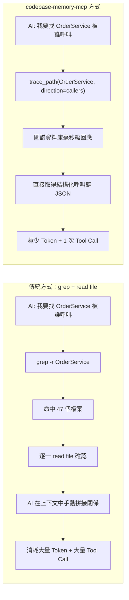

| 比較維度 | grep / read file | codebase-memory-mcp |
|---|---|---|
| 理解層級 | 文字比對（字串層級） | 語意結構（AST + 型別解析層級） |
| 跨檔案關係 | 需 AI 自行拼接、容易遺漏 | 圖譜原生支援（CALLS、IMPORTS、IMPLEMENTS…） |
| Token 消耗 | 高（需讀取大量原始碼） | 低（僅回傳結構化查詢結果） |
| Tool Call 次數 | 多（每個檔案一次） | 少（一次圖查詢可涵蓋多檔案） |
| 重複利用性 | 無記憶，每次重來 | 持久化，可增量更新延續使用 |
| 適合場景 | 找特定字串、單檔修改 | 架構理解、影響分析、跨服務追蹤 |

## 1.5 為何能大幅降低 Token 消耗

關鍵原因有三：

1. **查詢結果是結構化資料，不是原始碼**：例如 `trace_path` 回傳的是「函式名稱 + 呼叫關係」的 JSON，而不是整份原始檔案內容。
2. **圖譜預先計算好關係**：呼叫鏈、依賴鏈在索引階段就已經建好邊（Edge），查詢時是 O(1)～O(log n) 級的圖遍歷，不需要 AI 自己「猜」或「重新分析」。
3. **一次查詢取代多次來回**：傳統方式常需要「grep → 開檔 → 再 grep → 再開檔」多輪來回；圖查詢往往一次就能取得完整答案，省下大量 Tool Call 的往返開銷（每次 Tool Call 都會有 System Prompt + 上下文重複帶入的隱性成本）。

> 💡 **實務案例**：官方文件以「5 個結構性查詢」為例做對照測試：傳統 grep/read file 方式累積消耗約 **412,000 Token**，改用 codebase-memory-mcp 查詢圖譜僅消耗約 **3,400 Token**，降幅達 **99.2%**。在學術論文評測（涵蓋 31 個真實開源 repo）中，平均可達到 **83% 答案品質、10 倍 Token 節省、2.1 倍工具呼叫次數減少**的效果。兩組數據因測試情境不同（單一場景 vs. 大規模平均），企業導入時應以「平均 10 倍、極端情境可達 99%」的保守說法對內溝通，避免過度承諾。

## 1.6 適用情境

- ✅ 超大型 Monorepo / 多模組專案，AI 難以一次掌握全貌
- ✅ 微服務架構，需要跨服務追蹤 HTTP 呼叫鏈
- ✅ Legacy 系統逆向工程（Struts、EJB、JSP、老舊 Java 8 專案）
- ✅ Framework / 語言版本升級前的影響分析（Impact Analysis）
- ✅ 長期維運的程式碼庫，需要「持久記憶」避免每次重新探索
- ✅ 對 Token 成本敏感的企業（大量呼叫 LLM API 的場景）
- ✅ 需要在地端／離線環境運作、程式碼不可外流的高合規產業

## 1.7 不適用情境

- ❌ 小型專案（數千行以內），grep/read file 已經足夠快速，導入圖譜反而增加維運負擔
- ❌ 一次性、短期的腳本專案，沒有長期維護需求
- ❌ 需要「語意理解程式碼意圖」而非「結構關係」的任務（例如：這段程式碼的商業邏輯是否正確）——這類任務仍須 LLM 閱讀程式碼本身，圖譜只能輔助定位範圍
- ❌ 動態語言中大量使用 `eval`、反射、Metaprogramming 導致呼叫關係在執行期才能確定的場景，靜態圖譜的準確度會下降
- ❌ 圖譜尚未支援 Hybrid LSP 語意解析的語言（目前僅 9 種語言有完整型別解析），對這些語言僅能取得結構層級（非語意層級）的關係

### ✅ 第 1 章 Checklist

- [ ] 已理解 codebase-memory-mcp 是「結構分析引擎」而非「LLM」
- [ ] 已理解知識圖譜如何降低 Token 消耗的三個關鍵原因
- [ ] 已確認專案規模、語言、合規需求符合「適用情境」
- [ ] 已對內部團隊說明 Token 節省數據的測試情境前提，避免誤用單一極端數據做為承諾

---

# 第 2 章 核心架構

## 2.1 Knowledge Graph Architecture

知識圖譜由 **Node（節點）** 與 **Edge（邊）** 組成，這是理解整套工具的核心心智模型。

### 2.1.1 Node Labels（節點類型）

| Node Label | 說明 | 範例 |
|---|---|---|
| `Project` | 整個被索引的專案 | `order-service` |
| `Package` | 程式語言的套件/命名空間 | `com.iisigroup.order` |
| `Folder` | 實體資料夾 | `src/main/java/service` |
| `File` | 單一原始碼檔案 | `OrderService.java` |
| `Module` | 模組（依語言而定，如 Go module、NPM package） | `order-api` |
| `Class` | 類別 | `OrderService` |
| `Function` | 函式（自由函式，非類別成員） | `calculateTotal()` |
| `Method` | 類別方法 | `OrderService.createOrder()` |
| `Interface` | 介面 | `PaymentGateway` |
| `Enum` | 列舉 | `OrderStatus` |
| `Type` | 自訂型別/別名 | `OrderId` |
| `Route` | HTTP API 路由 | `POST /api/orders` |
| `Resource` | 外部資源（資料表、設定檔等） | `orders` 資料表 |

### 2.1.2 Edge Types（關係類型）

| Edge Type | 說明 |
|---|---|
| `CONTAINS_PACKAGE` / `CONTAINS_FOLDER` / `CONTAINS_FILE` | 容器包含關係（專案 → 套件 → 檔案） |
| `DEFINES` / `DEFINES_METHOD` | 檔案定義了類別/函式/方法 |
| `IMPORTS` | 模組匯入關係 |
| `CALLS` | 函式/方法呼叫關係（同步、同程序內） |
| `HTTP_CALLS` | 跨服務 HTTP 呼叫關係（微服務追蹤核心） |
| `ASYNC_CALLS` | 非同步呼叫（如訊息佇列、事件驅動） |
| `IMPLEMENTS` | 類別實作介面 |
| `HANDLES` | 路由由哪個方法處理 |
| `USAGE` | 一般使用關係 |
| `CONFIGURES` | 設定檔與程式碼的關聯 |
| `WRITES` | 寫入資源（如資料表） |
| `MEMBER_OF` | 成員關係（方法屬於類別） |
| `TESTS` | 測試案例與被測對象的關聯 |
| `USES_TYPE` | 型別使用關係（Hybrid LSP 產出） |
| `FILE_CHANGES_WITH` | Git Co-change 關係（哪些檔案常一起被修改） |

> 💡 **重點理解**：`Function`、`Class`、`Interface`、`Route`、`Module`、`Service` 等使用者熟悉的概念，在圖譜中都只是「貼了標籤的節點」；而它們之間的關係（呼叫、實作、依賴）才是這套工具真正的價值所在 —— **AI 要理解的從來不是單一程式碼片段，而是片段之間的關係網**。

## 2.2 Graph Storage（圖譜儲存）

### 2.2.1 SQLite

整個知識圖譜落地存放在 **SQLite** 資料庫檔案中（預設路徑 `~/.cache/codebase-memory-mcp/`），原因：

- 零伺服器：不需要額外部署 Neo4j、PostgreSQL 等資料庫服務
- 單檔案可攜：方便備份、複製、團隊共享（搭配 zstd 壓縮成 `graph.db.zst`）
- 索引建置採用「記憶體中流水線（In-Memory Pipeline）+ LZ4 壓縮」加速寫入，最終落盤為 SQLite

### 2.2.2 Graph Traversal（圖遍歷）

查詢時透過 SQL 預過濾 + BFS（廣度優先搜尋）等圖遍歷演算法，在 Edge 表上做關係追蹤。例如 `trace_path` 工具支援 1～5 層深度的呼叫鏈追蹤，底層即是對 `CALLS` / `HTTP_CALLS` 邊做 BFS。

### 2.2.3 Full Text Search

`search_code` 工具提供類似 grep 的全文檢索能力，但運作在已索引的檔案內容上，搭配 SQL 預過濾，速度遠快於即時掃描整個檔案系統。

### 2.2.4 Semantic Search

透過 `search_graph` 的 `name_pattern`（正規表達式）、`label`、`degree`（節點的連線數，用於找出「熱點」函式）等過濾條件，做語意導向（非純文字比對）的結構查詢，例如「找出所有實作了某介面、且呼叫次數超過 20 次的類別」。

### 2.2.5 Community Detection（社群偵測）

官方 v0.8.0 引入**多層級 Leiden 社群偵測演算法**，在索引階段對呼叫圖／依賴圖額外做一次社群分群計算，自動將高度互相呼叫、低度對外耦合的節點群組歸類為同一個「模組叢集（Module Cluster）」。這項能力直接強化了 `get_architecture` 回傳的模組叢集準確度（見第 7.11 節），也是第 8.3 節「單體拆分優先順序」分析的底層依據——比起單純用 `degree`（連線數）找熱點，Leiden 分群能進一步抓出「這群節點彼此緊密耦合，適合一起拆成同一個微服務」的群組邊界，而非僅是個別熱點節點。

## 2.3 Tree-sitter Parser

### 2.3.1 AST（Abstract Syntax Tree）

`codebase-memory-mcp` 內建 158 種語言的 **vendored tree-sitter grammar**（已編譯進執行檔，不需額外下載），對每個檔案產生 AST，作為後續所有分析的基礎。官方依語法覆蓋完整度將這 158 種語言分為三級，企業導入前應先確認主力語言落在哪一級：

| 支援等級 | 覆蓋率 | 說明 |
|---|---|---|
| 完整支援 | 90% 以上 | 主流語言（Java、Python、TypeScript/JavaScript、Go、Rust、C/C++、C#、PHP、Kotlin 等），符號萃取與呼叫圖準確度最高 |
| 良好支援 | 75–89% | 次主流語言，結構符號萃取大致完整，但部分語法糖或新版語言特性可能未涵蓋 |
| 基礎支援 | 低於 75% | 冷門或語法快速演進中的語言，僅能取得較粗略的結構關係，建議搭配人工複核（呼應第 18.2 節問題 11） |

> ⚠️ 9 種 Hybrid LSP 完整支援語言（見 2.4 節）皆落在「完整支援」等級，但「完整支援」等級不等於有 Hybrid LSP——兩者是獨立的兩個維度，前者衡量 Tree-sitter 語法解析覆蓋率，後者衡量是否有額外的型別/符號語意解析。

### 2.3.2 Symbol Extraction（符號萃取）

從 AST 中萃取出 Function、Class、Interface、Enum、Type 等符號，並記錄其所在檔案、行號、所屬命名空間。

### 2.3.3 Call Graph（呼叫圖）

解析函式呼叫語法節點，建立 `CALLS` 邊，形成完整的呼叫圖。這是 `trace_path` 工具的資料來源。

### 2.3.4 Dependency Graph（依賴圖）

解析 `import` / `require` / `use` 等語法節點，建立 `IMPORTS` 邊，形成模組依賴圖。這是 `detect_changes`（變更影響分析）的核心依據。

## 2.4 Hybrid LSP Resolution

純 tree-sitter 只能做到「語法層級」的解析（看得懂程式碼長什麼樣子），但看不懂「型別」。`codebase-memory-mcp` 額外實作一套輕量級的 **Hybrid LSP**（混合式語言伺服器協定解析），用 C 語言實作各語言的型別解析演算法子集，提供語意層級理解：

| 語言 | Hybrid LSP 涵蓋能力 |
|---|---|
| Python | imports、dataclass、`Self` 回傳型別、generics、`@property`、match/case、SQLAlchemy/Pydantic 模型識別 |
| TypeScript/JavaScript/JSX/TSX | generics、JSX dispatch、JSDoc 型別推論、`.d.ts` 宣告檔、模組 re-export |
| Go | 預建跨檔案符號表、generics、interface 滿足關係判定 |
| Rust | use 宣告、impl block、trait 方法、generic bounds、UFCS 靜態路徑 |
| Java | imports、類別繼承鏈、generics、overload 匹配、lambda |
| C# | global usings、file-scoped namespace、record、LINQ、async 展開 |
| C/C++ | typedef 鏈、template、namespace、auto 型別推論 |
| PHP | namespace、trait、late-static-binding、PHPDoc 推論 |
| Kotlin | extension function、data class、scope function、operator-trait 去糖 |

> 💡 **版本演進備註**：Java、Kotlin、Rust 三個 LSP 引擎是官方 v0.8.0 才新增的能力（先前版本僅 Python、PHP、TypeScript/JavaScript、C#、C/C++、Go 六種語言有完整 Hybrid LSP）。對 Java 系團隊而言，這代表型別感知的呼叫追蹤（Type-aware Call Tracing）是相對新近才成熟的功能，建議導入前用熟悉的小型模組先驗證解析準確度，再擴大到核心系統。

### 2.4.1 Type Resolution（型別解析）

判斷一個變數、回傳值的實際型別，例如 Python 的 `Self` 回傳型別、TypeScript 的 generics 實例化型別。

### 2.4.2 Symbol Resolution（符號解析）

把程式碼中「看起來像呼叫」的語法（例如 `order.save()`）正確對應到「實際定義」的符號（`OrderRepository.save()` 而非同名的其他 `save()`），避免誤判。

### 2.4.3 Cross File Analysis（跨檔案分析）

Go 語言的「預建跨檔案符號表」是典型範例：在索引階段先掃過整個專案建立全域符號表，查詢時才能正確解析跨檔案、跨套件的呼叫關係，而不會被同名函式混淆。

> ⚠️ **注意事項**：Hybrid LSP 不是完整的 LSP 實作（不提供 IDE 等級的即時診斷、重構建議），它的目標是「**足夠精準到讓圖譜的關係正確**」，在效能與精準度之間取得平衡。對於 Hybrid LSP 未涵蓋的語言（例如純 C++ 樣板高度複雜的場景），仍可拿到結構層級（語法）關係，但語意層級（型別）關係的準確度會下降，使用時建議搭配人工複核關鍵路徑。

### ✅ 第 2 章 Checklist

- [ ] 理解 Node / Edge 是知識圖譜的兩大基本元素
- [ ] 熟悉常用 Edge Type（CALLS、HTTP_CALLS、IMPORTS、IMPLEMENTS）的語意
- [ ] 理解 SQLite 作為圖譜儲存層的優缺點與適用規模
- [ ] 理解 Tree-sitter（語法層）與 Hybrid LSP（語意層）的分工
- [ ] 確認專案使用的語言是否落在 Hybrid LSP 完整支援的 9 種語言內

---

# 第 3 章 系統架構圖

本章使用 Mermaid 圖表，從整體到細節依序呈現 codebase-memory-mcp 的運作架構。

## 3.1 整體架構圖

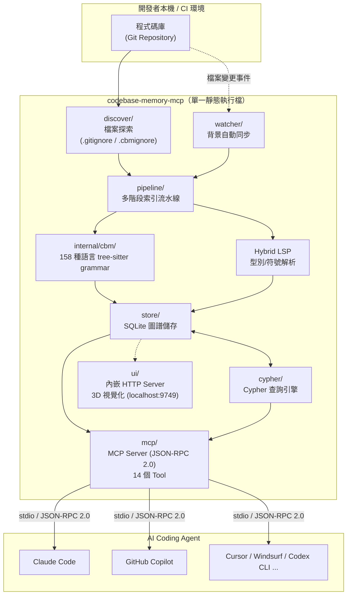

## 3.2 MCP 架構圖

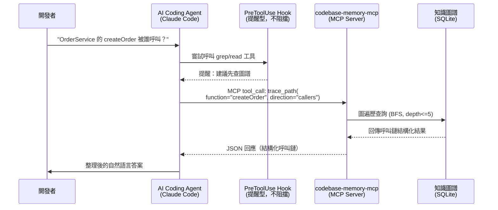

## 3.3 Knowledge Graph 架構圖

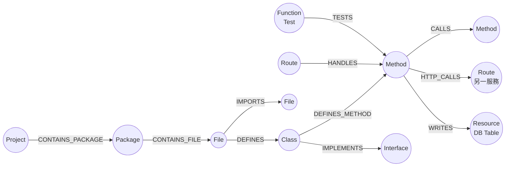

## 3.4 索引流程圖

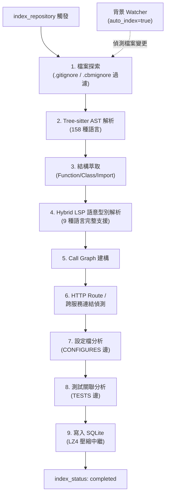

## 3.5 查詢流程圖

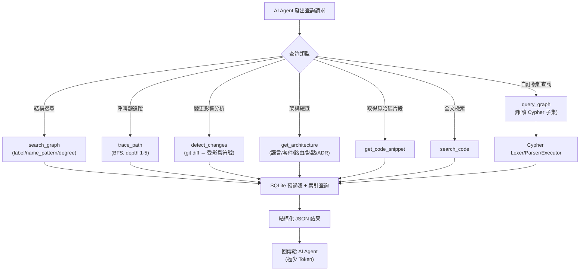

## 3.6 AI Agent 呼叫流程圖

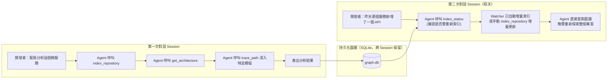

> 💡 **實務案例**：在多人協作的團隊中，第一位成員執行 `index_repository` 並提交壓縮後的 `.codebase-memory/graph.db.zst` 進版控，其他成員 clone 專案後只需解壓縮 + 增量索引補上自己尚未提交的本機變更，**全團隊免去重複的「冷啟動索引」時間**。

### ✅ 第 3 章 Checklist

- [ ] 能畫出（或口頭描述）codebase-memory-mcp 的整體資料流：Repo → 索引 → 圖譜 → MCP → Agent
- [ ] 理解 PreToolUse Hook 是「提醒型」而非「強制阻擋」
- [ ] 理解索引流程的 9 個階段順序
- [ ] 理解查詢時依「查詢類型」會走向不同 MCP Tool
- [ ] 理解圖譜的持久化特性如何支援跨 Session 記憶

---

# 第 4 章 安裝指南

> ⚠️ **安裝前須知**：codebase-memory-mcp 為單一靜態執行檔，**不需要**安裝 Python、Node.js、JVM 等執行環境；建置原始碼則需要 C/C++ 編譯器與 zlib。企業內網若無法存取 GitHub，可改用「手動下載＋內部檔案伺服器轉發」或「從原始碼建置」的方式部署。

## 4.1 Windows

### 4.1.1 一行指令安裝（PowerShell）

```powershell
Invoke-WebRequest -Uri https://raw.githubusercontent.com/DeusData/codebase-memory-mcp/main/install.ps1 -OutFile install.ps1
.\install.ps1
```

啟用 3D 視覺化 UI：

```powershell
.\install.ps1 -ui
```

略過自動設定（僅安裝執行檔，不動到既有 MCP 設定檔，適合企業統一管理設定的場景）：

```powershell
.\install.ps1 -skip-config
```

自訂安裝路徑（適合無系統管理員權限、或企業規定軟體須安裝於特定目錄的場景）：

```powershell
.\install.ps1 -dir "D:\tools\codebase-memory-mcp"
```

### 4.1.2 安裝路徑驗證

```powershell
codebase-memory-mcp --version
codebase-memory-mcp config list
```

> 💡 **實務案例**：企業內部若有 Proxy / Firewall 限制，建議先用瀏覽器或內部 Artifact Server 下載 `install.ps1` 與對應版本的執行檔，再離線執行安裝腳本並加上 `-skip-config`，最後由 DevOps 團隊統一透過 Group Policy 或設定管理工具（Ansible/Puppet）分發 `.mcp.json` 設定，確保所有開發機的設定一致。

## 4.2 Linux

```bash
curl -fsSL https://raw.githubusercontent.com/DeusData/codebase-memory-mcp/main/install.sh | bash
```

啟用 UI：

```bash
curl -fsSL https://raw.githubusercontent.com/DeusData/codebase-memory-mcp/main/install.sh | bash -s -- --ui
```

自訂安裝路徑：

```bash
curl -fsSL https://raw.githubusercontent.com/DeusData/codebase-memory-mcp/main/install.sh | bash -s -- --dir=/opt/codebase-memory-mcp
```

Arch Linux 可直接用 AUR：

```bash
yay -S codebase-memory-mcp-bin
# 或
paru -S codebase-memory-mcp-bin
```

> ⚠️ **安全建議**：企業 CI/CD Runner 或正式環境執行 `curl | bash` 前，務必先審查腳本內容，並比對官方提供的 SHA-256 checksum；亦可改用「先下載腳本 → 校驗 → 再執行」的兩步驟方式，避免供應鏈攻擊風險：

```bash
curl -fsSL -o install.sh https://raw.githubusercontent.com/DeusData/codebase-memory-mcp/main/install.sh
sha256sum install.sh   # 與官方公告的 checksum 比對
bash install.sh
```

## 4.3 macOS

安裝方式與 Linux 相同（官方腳本同時支援兩種平台）：

```bash
curl -fsSL https://raw.githubusercontent.com/DeusData/codebase-memory-mcp/main/install.sh | bash
```

Apple Silicon（M 系列晶片）與 Intel Mac 皆由安裝腳本自動偵測對應的執行檔架構。

## 4.4 WSL（Windows Subsystem for Linux）

在 WSL 內視為標準 Linux 環境，直接套用 4.2 的安裝方式即可：

```bash
# 於 WSL (Ubuntu/Debian) 內執行
curl -fsSL https://raw.githubusercontent.com/DeusData/codebase-memory-mcp/main/install.sh | bash
```

> 💡 **實務案例**：許多企業開發者習慣在 WSL 內開發、Windows 端使用 VS Code 透過 Remote-WSL 連線。此時建議**在 WSL 內安裝 codebase-memory-mcp**，並讓 MCP 設定檔（`.mcp.json`）也指向 WSL 內的執行檔路徑，確保索引到的檔案路徑與 IDE 開啟的路徑一致，避免 Windows/Linux 路徑格式（`C:\` vs `/mnt/c/`）混淆導致的查詢結果路徑對不上的問題。

## 4.5 Docker

官方未提供正式 Docker Image，但因執行檔零依賴的特性，可自行包裝最小化映像檔：

```dockerfile
FROM alpine:3.20
RUN apk add --no-cache curl ca-certificates
RUN curl -fsSL https://raw.githubusercontent.com/DeusData/codebase-memory-mcp/main/install.sh \
    | bash -s -- --skip-config --dir=/usr/local/bin
WORKDIR /workspace
ENTRYPOINT ["codebase-memory-mcp"]
```

建置與啟動：

```bash
docker build -t codebase-memory-mcp:local .
docker run --rm -v "$(pwd)":/workspace codebase-memory-mcp:local cli index_repository '{"repo_path": "/workspace"}'
```

> ⚠️ **注意事項**：以 Docker 容器執行時，索引資料庫預設寫在容器內的 `~/.cache/codebase-memory-mcp/`，容器銷毀後會遺失。正式使用時務必掛載持久化 Volume：

```bash
docker run --rm \
  -v "$(pwd)":/workspace \
  -v cbm-cache:/root/.cache/codebase-memory-mcp \
  codebase-memory-mcp:local cli index_repository '{"repo_path": "/workspace"}'
```

## 4.6 Podman

Podman 與 Docker 指令幾乎一致，僅需替換指令前綴，且 Podman 預設以 Rootless 模式執行，更符合企業安全規範：

```bash
podman build -t codebase-memory-mcp:local .
podman run --rm \
  -v "$(pwd)":/workspace:Z \
  -v cbm-cache:/root/.cache/codebase-memory-mcp:Z \
  codebase-memory-mcp:local cli index_repository '{"repo_path": "/workspace"}'
```

> 💡 在 SELinux 啟用的 RHEL/CentOS 環境下，掛載參數務必加上 `:Z`（私有標籤）或 `:z`（共享標籤），否則容器內程序會因 SELinux 拒絕存取而索引失敗。

## 4.7 環境變數總覽

除安裝參數外，codebase-memory-mcp 另提供以下環境變數調整執行期行為：

| 環境變數 | 用途 | 適用情境 |
|---|---|---|
| `CBM_WORKERS` | 設定索引平行處理的 Worker 數量 | 大型專案調校索引效能（見第 17.4 節） |
| `CBM_LOG_LEVEL` | 設定日誌等級（`debug`/`info`/`warn`/`error`/`none`） | 排查問題或降低正式環境日誌量（見第 16.5 節） |
| `CBM_CACHE_DIR` | 覆寫圖譜資料庫的快取目錄路徑（預設 `~/.cache/codebase-memory-mcp/`） | 多租戶 CI 環境需要為每個 Job 隔離快取目錄時使用（見第 18.6 節問題 46） |
| `CBM_DIAGNOSTICS` | 啟用診斷模式，將執行期診斷資訊輸出至 `/tmp/cbm-diagnostics-<pid>.json` | 回報 Issue 或排查疑似效能/索引異常時，附上診斷檔案協助官方除錯 |
| `CBM_DOWNLOAD_URL` | 覆寫執行檔更新時的下載來源網址 | 企業內網改用內部 Artifact Repository（Nexus/Artifactory）鏡像官方發布檔案時使用 |
| `CBM_DUMP_VERIFY_MIN_RATIO` | 設定索引完成後「節點計數驗證」的最低比例閾值 | 懷疑索引結果不完整（如第 18.2 節問題 9）時，可調高此閾值讓索引流程更早偵測異常並失敗，而非靜默產出不完整的圖譜 |

> 💡 **實務案例**：企業內網無法存取 GitHub 時，可將 `CBM_DOWNLOAD_URL` 指向內部鏡像伺服器，搭配第 4.2 節「下載＋校驗＋執行」的安裝流程，讓版本升級（`codebase-memory-mcp update`）也能在隔離網段中運作。

### ✅ 第 4 章 Checklist

- [ ] 確認團隊主要開發平台（Windows/Linux/macOS/WSL）已完成安裝驗證
- [ ] 確認是否需要 3D 視覺化 UI（`--ui` 參數），評估 `localhost:9749` 是否需要對內網開放
- [ ] CI/CD 環境採用容器化部署時，已掛載持久化 Volume 避免圖譜每次重建
- [ ] 已建立內部 checksum 校驗流程，降低供應鏈風險
- [ ] WSL 使用者已確認路徑一致性，避免 Windows/Linux 路徑混用問題
- [ ] 已熟悉 6 個環境變數（`CBM_WORKERS`／`CBM_LOG_LEVEL`／`CBM_CACHE_DIR`／`CBM_DIAGNOSTICS`／`CBM_DOWNLOAD_URL`／`CBM_DUMP_VERIFY_MIN_RATIO`）的用途，而非僅知道前三個

---

# 第 5 章 MCP 整合

## 5.1 自動整合（建議方式）

官方安裝腳本內建 `install` 流程，會**自動偵測並設定 11 種 Agent**：Claude Code、Codex CLI、Gemini CLI、Zed、OpenCode、Antigravity、Aider、KiloCode、VS Code、OpenClaw、Kiro。自動設定內容包含：MCP Server 連線設定、Agent 專用的指令說明檔（Instruction File）、以及（部分 Agent 支援）PreToolUse Hook。

| Agent | MCP 設定檔 | 說明檔 | Hook 支援 |
|---|---|---|---|
| Claude Code | `.claude/.mcp.json` | 4 個 Skills（Exploring／Tracing／Quality／Reference） | ✅ PreToolUse |
| Codex CLI | `.codex/config.toml` | `.codex/AGENTS.md` | SessionStart 提醒 |
| Gemini CLI | `.gemini/settings.json` | `.gemini/GEMINI.md` | BeforeTool + SessionStart |
| Zed | `settings.json` | — | — |
| VS Code | `.vscode/mcp.json`（或使用者設定） | — | — |

## 5.2 Claude Code

安裝完成後，Claude Code 會自動取得：

1. **MCP Server 連線**：`.claude/.mcp.json` 內新增 `codebase-memory-mcp` 條目
2. **4 個 Skills**：
   - **Exploring**：codebase 方向感建立、結構總覽、找函式/類別/路由
   - **Tracing**：呼叫鏈、依賴分析、跨服務 HTTP 呼叫追蹤
   - **Quality**：死碼偵測、扇出（fan-out）分析、重構候選
   - **Reference**：工具語法、Cypher 查詢範例、邊類型、常見陷阱
3. **PreToolUse Hook**：當 Claude Code 準備呼叫 `Grep`/`Glob` 工具前，Hook 會攔截該次工具呼叫並注入 `additionalContext`（內容來自即時的 `search_graph` 查詢結果），藉此提示模型「圖譜中已有相關結構資訊」。機制上此 Hook **永遠以 exit code 0 回傳**，技術上不具備阻擋能力，且設計上**永不攔截 `Read` 操作**（保留 Claude Code「先讀後改」的安全慣例）——換言之它是「插入額外上下文」而非單純的文字提醒，但效果上仍是「提醒型」：最終是否採用圖譜查詢結果，仍由模型自行判斷。

手動設定範例（若需要自訂路徑或在受限環境下手動配置）：

```json
{
  "mcpServers": {
    "codebase-memory-mcp": {
      "command": "/usr/local/bin/codebase-memory-mcp",
      "args": []
    }
  }
}
```

> 💡 **實務案例**：在 `CLAUDE.md` 中明確寫上「本專案已索引 codebase-memory-mcp，請優先使用 `search_graph` / `trace_path` 等工具理解架構，避免大量 `grep`」，可進一步強化 Claude Code 主動使用圖譜工具的傾向（這也回應了社群常見問題 —— 模型有時仍會「忘記」優先使用圖譜，需要在專案說明檔中明文提示）。

## 5.3 GitHub Copilot

GitHub Copilot（Copilot Chat / Copilot Workspace）支援透過 MCP 設定檔連接外部工具。於 VS Code 的 `settings.json` 或工作區 `.vscode/mcp.json` 加入：

```json
{
  "mcp": {
    "servers": {
      "codebase-memory-mcp": {
        "command": "codebase-memory-mcp",
        "args": []
      }
    }
  }
}
```

設定完成後，於 Copilot Chat 中即可透過 `#codebase-memory-mcp` 或工具選取面板呼叫對應工具（例如先呼叫 `get_architecture` 取得專案總覽，再針對特定模組呼叫 `trace_path`）。

## 5.4 VS Code

VS Code 原生支援 MCP（透過內建 MCP 用戶端或擴充套件）。設定方式與 5.3 相同，差異在於 VS Code 可在「MCP: List Servers」面板中檢視連線狀態、手動重啟 Server、查看工具呼叫紀錄，便於除錯。

## 5.5 Cline

Cline 透過其專屬的 MCP 設定介面（`cline_mcp_settings.json`）整合：

```json
{
  "mcpServers": {
    "codebase-memory-mcp": {
      "command": "codebase-memory-mcp",
      "args": [],
      "disabled": false,
      "autoApprove": ["search_graph", "trace_path", "get_architecture"]
    }
  }
}
```

> 💡 `autoApprove` 建議僅列入**唯讀型**工具（查詢類），`index_repository`、`delete_project` 等具狀態變更性質的工具應保留人工核准，避免 Agent 在背景誤觸發大規模重新索引。

## 5.6 Roo Code

Roo Code 為 Cline 的 Fork 專案，MCP 設定方式與 Cline 幾乎一致，設定檔位置為 `roo_mcp_settings.json`，欄位結構相同，可直接套用 5.5 的設定範例。

## 5.7 Gemini CLI

安裝腳本會自動產生 `.gemini/settings.json` 與 `.gemini/GEMINI.md`：

```json
{
  "mcpServers": {
    "codebase-memory-mcp": {
      "command": "codebase-memory-mcp",
      "args": []
    }
  }
}
```

`GEMINI.md` 內會附上工具使用提示，並透過 `BeforeTool` + `SessionStart` Hook 在每次新對話開始時提醒模型「本專案已有知識圖譜可查詢」。

## 5.8 Codex CLI

設定檔位於 `.codex/config.toml`：

```toml
[mcp_servers.codebase-memory-mcp]
command = "codebase-memory-mcp"
args = []
```

並會產生 `.codex/AGENTS.md` 作為專案級指令說明，搭配 `SessionStart` 提醒。

## 5.9 Cursor

Cursor 支援 `.cursor/mcp.json`（專案級）或全域設定：

```json
{
  "mcpServers": {
    "codebase-memory-mcp": {
      "command": "codebase-memory-mcp",
      "args": []
    }
  }
}
```

設定完成後於 Cursor 的 Composer/Chat 面板可直接呼叫工具；建議在 `.cursorrules` 或 `.cursor/rules/` 中加入與 Claude Code `CLAUDE.md` 類似的提示文字，引導模型優先使用圖譜工具。

## 5.10 Windsurf

Windsurf 透過 `~/.codeium/windsurf/mcp_config.json` 設定 MCP Server：

```json
{
  "mcpServers": {
    "codebase-memory-mcp": {
      "command": "codebase-memory-mcp",
      "args": []
    }
  }
}
```

### ✅ 第 5 章 Checklist

- [ ] 確認團隊使用的 Agent 是否落在「自動偵測設定」的 11 種清單內
- [ ] 已在專案說明檔（CLAUDE.md / GEMINI.md / .cursorrules 等）明確引導模型優先用圖譜工具
- [ ] 唯讀查詢工具已加入 `autoApprove`／信任清單，狀態變更工具保留人工核准
- [ ] 已確認 PreToolUse / SessionStart Hook 是否正確生效（可用 `--debug` 或檢視 Agent 日誌確認）
- [ ] 多 Agent 並用的團隊已確認設定檔不互相衝突（同一專案可同時存在多套 Agent 設定）

---

# 第 6 章 建立知識圖譜

## 6.1 初始化專案

第一次對新專案建立圖譜，使用 `index_repository`：

```bash
codebase-memory-mcp cli index_repository '{"repo_path": "/d/developer/repos/java_tutorial"}'
```

或在 AI Agent 對話中直接請求：「請對這個 repo 執行 index_repository」，Agent 會透過 MCP 呼叫對應工具。索引完成後可用 `list_projects` 確認：

```bash
codebase-memory-mcp cli list_projects
```

回傳範例：

```json
{
  "projects": [
    {
      "name": "java_tutorial",
      "path": "/d/developer/repos/java_tutorial",
      "nodes": 18342,
      "edges": 41027,
      "languages": ["java", "markdown", "yaml"],
      "last_indexed": "2026-06-25T09:12:00Z"
    }
  ]
}
```

## 6.2 建立索引

索引建置採用第 3.4 節描述的 9 階段流水線。對於大型專案，建議先確認索引進度：

```bash
codebase-memory-mcp cli index_status '{"project": "java_tutorial"}'
```

```json
{
  "status": "indexing",
  "progress": 0.62,
  "files_processed": 8200,
  "files_total": 13225,
  "current_stage": "call_graph_construction"
}
```

## 6.3 增量索引

當檔案異動時，無需重新索引整個專案，再次呼叫 `index_repository` 時工具會自動偵測差異（依檔案修改時間 / hash），僅重新解析變更的檔案並更新對應的 Node/Edge：

```bash
codebase-memory-mcp cli index_repository '{"repo_path": "/d/developer/repos/java_tutorial", "incremental": true}'
```

## 6.4 自動同步

啟用背景監看（Watcher），檔案一有變更就自動觸發增量索引，無需手動重跑指令：

```bash
codebase-memory-mcp config set auto_index true
codebase-memory-mcp config set auto_index_limit 50000
```

> ⚠️ `auto_index_limit` 是檔案數量上限保護機制——超過此數量的專案不會自動觸發背景索引（避免在超大型 Monorepo 上無限制佔用 CPU/IO 資源），此時應改為排程式（CI 排程、Cron Job）手動觸發增量索引。

## 6.5 Graph Refresh

「Refresh」指在不改變圖譜結構定義的前提下，重新跑一次索引讓圖譜內容與目前程式碼同步，等同於增量索引的全量版本：

```bash
codebase-memory-mcp cli index_repository '{"repo_path": "/d/developer/repos/java_tutorial", "incremental": false}'
```

## 6.6 Graph Rebuild

當圖譜資料庫疑似損毀、或升級 codebase-memory-mcp 版本後 Schema 有變動時，需要「重建」—— 先刪除既有專案再重新索引：

```bash
codebase-memory-mcp cli delete_project '{"project": "java_tutorial"}'
codebase-memory-mcp cli index_repository '{"repo_path": "/d/developer/repos/java_tutorial"}'
```

> 💡 **實務案例**：團隊共用 `.codebase-memory/graph.db.zst` 快照時，建議在 CI Pipeline 中加入一個排程 Job，**每日凌晨對主分支做一次完整 Graph Rebuild 並重新壓縮提交**，確保快照不會隨著增量索引次數累積而產生誤差飄移（Schema drift），同一份快照也能讓新加入的同事在 10 分鐘內完成環境設置，而不必等待 28 萬行專案從零索引 20～30 分鐘。

## 6.7 圖譜快照壓縮格式

`.codebase-memory/graph.db.zst` 快照的產生流程並非單純把 `graph.db` 直接壓縮，而是經過三個步驟：

1. **移除索引（Drop Index）**：先移除 SQLite 內部用於加速查詢的輔助索引，減少需要壓縮的資料量
2. **VACUUM**：執行 SQLite 的 `VACUUM` 操作整理資料庫檔案、去除空白頁面
3. **zstd 壓縮**：使用 zstd（目前對應版本約 1.5.7）壓縮成 `.zst` 檔案，典型壓縮比約 **8–13:1**

新成員或 CI 環境取得快照後，需要先解壓縮並重建索引（解壓縮後的 `graph.db` 不含查詢加速索引），再執行一次增量索引補上快照產生後的差異（呼應第 18.7 節問題 49）。

> 💡 **實務案例**：以一個 1.2 GB 的原始 `graph.db` 為例，移除索引＋VACUUM 後可能降到約 900 MB，再經 zstd 壓縮後常見落在 70–110 MB 區間（依程式碼重複度與符號命名多樣性而異），相較直接對原始 `graph.db` 做 zstd 壓縮，此三步驟流程通常能再縮小 30–50% 的最終檔案大小，對於版控倉儲體積（呼應第 18.7 節問題 48）有實質幫助。

### ✅ 第 6 章 Checklist

- [ ] 已對主要專案執行過一次完整 `index_repository`
- [ ] 已確認 `list_projects` 顯示正確的 Node/Edge 數量（數量為 0 通常代表索引失敗或路徑錯誤）
- [ ] 已視專案規模決定是否啟用 `auto_index`，並設定合理的 `auto_index_limit`
- [ ] 已建立定期 Graph Rebuild 機制（避免增量索引長期累積誤差）
- [ ] 團隊共用圖譜快照的提交頻率已有共識（避免快照與主分支落差過大）
- [ ] 已理解 `graph.db.zst` 的「移除索引＋VACUUM＋zstd 壓縮」三步驟流程，解壓縮後會先執行一次增量索引補差異

---

# 第 7 章 MCP Tool 詳解

codebase-memory-mcp 共提供 **14 個 MCP Tool**，依用途分為「索引管理」與「查詢分析」兩大類。以下逐一說明功能、使用時機、範例與最佳實務。

## 7.1 index_repository

- **功能**：將指定路徑的程式碼庫解析並寫入知識圖譜，支援全量與增量模式
- **使用時機**：第一次導入專案、或大規模重構後需要全量 Rebuild
- **範例**：
  ```json
  {"repo_path": "/workspace/order-service", "incremental": true}
  ```
- **最佳實務**：CI Pipeline 中於合併到主分支後自動觸發增量索引，確保圖譜永遠反映最新主分支狀態

## 7.2 list_projects

- **功能**：列出所有已索引專案及其 Node/Edge 統計數量
- **使用時機**：確認索引是否成功、盤點目前管理了哪些專案的圖譜
- **範例**：`codebase-memory-mcp cli list_projects`
- **最佳實務**：將此指令納入健康檢查腳本，Node 數量為 0 或長期未更新（`last_indexed` 過舊）應觸發告警

## 7.3 delete_project

- **功能**：刪除指定專案及其圖譜資料
- **使用時機**：專案下架、或需要 Graph Rebuild 前的清空步驟
- **範例**：`{"project": "legacy-billing"}`
- **最佳實務**：刪除前建議先備份 `graph.db`（特別是已累積大量 `manage_adr` 紀錄的專案，ADR 是團隊資產，刪除圖譜等同刪除這些決策記錄）

## 7.4 index_status

- **功能**：查詢指定專案的索引進度與狀態（`indexing` / `completed` / `failed`）
- **使用時機**：大型專案索引耗時較長時，輪詢確認進度；CI Pipeline 中作為「等待索引完成」的判斷依據
- **範例**：`{"project": "java_tutorial"}`
- **最佳實務**：在 CI Script 中用迴圈輪詢 `index_status` 直到 `completed`，避免索引未完成就開始查詢導致結果不完整

## 7.5 search_graph

- **功能**：依 `label`（節點類型）、`name_pattern`（正規表達式）、`file_pattern`、`degree`（連線數過濾）做結構化搜尋
- **使用時機**：「找出所有名稱包含 Handler 的 Class」「找出連線數最高的前 10 個函式（熱點分析）」
- **範例**：
  ```json
  {"label": "Function", "name_pattern": ".*Handler.*"}
  ```
- **最佳實務**：搜尋範圍過廣時務必加上 `file_pattern` 限縮模組範圍，避免回傳結果過多反而增加 Token 負擔

## 7.6 trace_path

- **功能**：以 BFS 追蹤函式的呼叫者（callers）或被呼叫者（callees），深度 1～5 層
- **使用時機**：影響分析（這個函式改了會影響誰）、理解某段邏輯的完整呼叫鏈
- **範例**：
  ```json
  {"function_name": "calculateTotal", "direction": "both", "depth": 3}
  ```
- **最佳實務**：深度預設不要超過 3，超過 5 層的呼叫鏈通常代表架構上已存在過度耦合，應視為重構訊號而非單純加大查詢深度

## 7.7 detect_changes

- **功能**：將 `git diff` 對應到圖譜中受影響的符號，並給出風險分類
- **使用時機**：PR Review 前自動分析「這次改動實際影響範圍」，特別適合用於 Code Review 自動化與 Release 前的 Regression 範圍評估
- **範例**：
  ```json
  {"base_ref": "main", "head_ref": "feature/order-refund"}
  ```
- **最佳實務**：整合進 GitHub Actions / GitLab CI 的 PR 流程，自動在 PR 留言摘要「本次變更影響的下游模組清單」（詳見第 15 章）

## 7.8 query_graph

- **功能**：執行唯讀 Cypher 子集查詢，支援 MATCH / WHERE / RETURN / ORDER BY / LIMIT 等子句
- **使用時機**：前述工具無法滿足的客製化複合查詢
- **範例**：
  ```json
  {"query": "MATCH (f:Function)-[:CALLS]->(g:Function) WHERE g.name = 'save' RETURN f.name, f.file LIMIT 20"}
  ```
- **最佳實務**：複雜查詢先用 `get_graph_schema` 確認可用的 Node Label 與 Edge Type，避免查詢條件寫錯導致空結果

## 7.9 get_graph_schema

- **功能**：回傳目前圖譜的 Node/Edge 統計與關係模式總覽
- **使用時機**：撰寫 `query_graph` 自訂查詢前的探勘步驟
- **範例**：`{"project": "java_tutorial"}`
- **最佳實務**：團隊新成員上手第一步，建議先呼叫此工具建立「這個專案的圖譜長什麼樣子」的心智模型

## 7.10 get_code_snippet

- **功能**：依完整限定名稱（Qualified Name）取得函式/方法的原始碼片段
- **使用時機**：圖譜查詢定位到目標符號後，需要看實際程式碼內容做進一步分析
- **範例**：
  ```json
  {"qualified_name": "com.iisigroup.order.service.OrderService.createOrder"}
  ```
- **最佳實務**：先用 `search_graph` / `trace_path` 定位範圍，**只在最後一步**才用此工具取得原始碼，避免一開始就大量讀檔失去圖譜查詢省 Token 的優勢

## 7.11 get_architecture

- **功能**：回傳整個專案的架構總覽——語言分佈、套件結構、API 路由清單、複雜度熱點、模組叢集（Cluster）、已記錄的 ADR
- **使用時機**：第一次接觸陌生專案、撰寫架構文件、向新人介紹系統
- **範例**：`{"project": "java_tutorial"}`
- **最佳實務**：作為每次新對話的「破冰」第一步查詢，比起讓 AI 自己用 `ls -R` 探索目錄結構快上數十倍

## 7.12 search_code

- **功能**：在已索引的檔案內容中做類似 grep 的全文檢索
- **使用時機**：尋找特定字串（如錯誤訊息文字、設定 Key 名稱）而非結構符號
- **範例**：
  ```json
  {"pattern": "TODO|FIXME", "file_pattern": "*.java"}
  ```
- **最佳實務**：純文字搜尋（如找註解、字串常數）用 `search_code`；找「符號關係」用 `search_graph`/`trace_path`，兩者互補不互斥

## 7.13 manage_adr

- **功能**：對 Architecture Decision Record（架構決策紀錄）做 CRUD 操作，紀錄與圖譜一起持久化
- **使用時機**：團隊做出重大架構決策（如「為何選擇 Kafka 而非 RabbitMQ」）時，讓決策脈絡跟著程式碼一起留存，供未來新成員與 AI Agent 查閱
- **範例**：
  ```json
  {"action": "create", "title": "採用 Kafka 取代 RabbitMQ", "context": "需要支援高吞吐量事件溯源", "decision": "...", "status": "accepted"}
  ```
- **最佳實務**：重大技術選型決議後，由架構師在 PR 中順手呼叫 `manage_adr` 留下紀錄，避免決策脈絡只存在於會議記錄或某人的記憶裡

## 7.14 ingest_traces（實驗性／Stub）

> ⚠️ **實驗性功能警語**：根據查證，官方專案目前（v0.8.1）的 `ingest_traces` 在實作上仍屬於 **Stub（存根）**——介面與工具定義已存在，但執行期資料攝入的完整邏輯尚未實作完成。以下功能說明與最佳實務，是**假設此功能未來完整實作後的預期用法**，提供團隊預先規劃；正式導入前務必先以官方最新 [Releases](https://github.com/DeusData/codebase-memory-mcp/releases) 確認該版本的實際實作狀態，避免誤判為已可生產使用的功能。

- **功能（設計目標）**：匯入執行期（Runtime）的追蹤資料（如 OpenTelemetry Trace），驗證靜態分析推測出的 `HTTP_CALLS` 邊是否真實發生
- **使用時機（功能成熟後）**：微服務架構中，靜態分析可能因動態路由、Feature Flag 等原因產生「假陽性」的服務呼叫關係，需要用實際執行資料校正
- **範例（介面格式，實際資料處理邏輯待官方完整實作）**：
  ```json
  {"trace_format": "otlp", "trace_data": "<base64-encoded otlp payload>"}
  ```
- **最佳實務（功能成熟後可採用）**：搭配第 15 章的可觀測性（Observability）平台（如 OpenTelemetry + Jaeger），定期匯入生產環境的 Trace 樣本，讓圖譜的跨服務關係從「推測」進化為「實證」

> 📌 **工具選用速查表**

| 我想要... | 該用哪個工具 |
|---|---|
| 第一次認識這個專案 | `get_architecture` |
| 找特定名稱的函式/類別 | `search_graph` |
| 找特定字串/註解 | `search_code` |
| 看某函式被誰呼叫、呼叫誰 | `trace_path` |
| 評估這次改動的影響範圍 | `detect_changes` |
| 自訂複雜查詢條件 | `query_graph`（先用 `get_graph_schema` 探勘） |
| 看實際原始碼 | `get_code_snippet` |
| 記錄架構決策 | `manage_adr` |
| 驗證跨服務呼叫是否真實發生 | `ingest_traces`（⚠️ 實驗性／Stub，見 7.14 節） |
| 管理索引生命週期 | `index_repository` / `index_status` / `list_projects` / `delete_project` |

### ✅ 第 7 章 Checklist

- [ ] 團隊已熟悉 14 個工具各自的定位，不會用 `search_code` 取代 `search_graph`
- [ ] 已建立「先查圖譜、後讀原始碼」的查詢順序習慣
- [ ] 重大架構決策已開始用 `manage_adr` 留存
- [ ] 已確認 `ingest_traces` 目前為實驗性／Stub 功能，微服務團隊已將其列為「待功能成熟後評估導入」而非「立即可用」
- [ ] 自訂 Cypher 查詢前已養成先呼叫 `get_graph_schema` 的習慣

---

# 第 8 章 Claude Code 整合實戰

## 8.1 新專案開發

**情境**：團隊啟動一個全新的訂單管理服務，從零開始開發。

```text
開發者：幫我建立一個訂單服務的專案骨架，採用 Spring Boot 3.5 + Java 21
Claude Code：
  1. 建立專案骨架（pom.xml、目錄結構、基礎 Controller/Service/Repository）
  2. 呼叫 index_repository 建立初始圖譜（此時圖譜很小，主要是骨架程式碼）
  3. 後續每次新增模組，圖譜自動（或手動）增量更新
```

> 💡 **實務案例**：新專案初期圖譜價值有限（程式碼量小），但隨著專案成長到數百個檔案後，**圖譜帶來的效益會隨規模呈非線性增長**——這也是為什麼建議「從第一天就索引」，而不是等專案變大才導入，避免日後補課時才發現團隊已經習慣了沒有圖譜輔助的低效率探索方式。

## 8.2 微服務架構

**情境**：一個由 12 個微服務組成的電商系統，需要追蹤「下單」流程橫跨哪些服務。

```text
開發者：請追蹤一次完整下單流程會經過哪些微服務？
Claude Code：
  1. 呼叫 get_architecture 取得整體服務清單與路由總覽
  2. 呼叫 trace_path(function="POST /api/orders", direction="callees", depth=5)
  3. 圖譜回傳跨服務 HTTP_CALLS 邊：
     order-service -> payment-service -> ledger-service
     order-service -> inventory-service
     order-service -> notification-service (ASYNC_CALLS via Kafka)
  4. 產出文字版流程說明 + 可選擇繪製 Mermaid sequence diagram
```

對應的 Cypher 查詢範例：

```cypher
MATCH (r:Route {path: "/api/orders"})-[:HANDLES]->(f:Function)
MATCH p = (f)-[:HTTP_CALLS|ASYNC_CALLS*1..5]->(g:Function)
RETURN p
```

## 8.3 單體架構

**情境**：一個 80 萬行的單體 Java 應用，需要評估「拆分微服務」的可行性。

```text
開發者：這個單體系統裡，哪些模組之間耦合度最高？適合先拆？
Claude Code：
  1. 呼叫 get_architecture 取得 Module Cluster（模組叢集）總覽
  2. 呼叫 search_graph(label="Class", degree>50) 找出高耦合的「上帝類別」
  3. 結合 detect_changes 過去歷史 Co-change 資料（FILE_CHANGES_WITH 邊），
     找出「經常一起被修改」但「邏輯上應該獨立」的模組
  4. 產出模組拆分建議優先順序
```

## 8.4 Clean Architecture

**情境**：驗證專案是否真的遵守 Clean Architecture 的依賴方向（外層只能依賴內層，不可反向）。

```cypher
MATCH (domain:Class)-[:IMPORTS]->(infra:Class)
WHERE domain.package CONTAINS "domain"
  AND infra.package CONTAINS "infrastructure"
RETURN domain.name, infra.name
```

> ⚠️ 若此查詢回傳非空結果，代表 Domain 層違規依賴了 Infrastructure 層，這是 Clean Architecture 最常見的腐化模式（Architecture Erosion）。建議將此查詢納入 CI Pipeline 的架構守門（Architecture Fitness Function），詳見第 15 章。

## 8.5 DDD（Domain-Driven Design）

**情境**：確認 Bounded Context 之間是否有不該存在的直接依賴。

```text
開發者：請列出 order 與 inventory 兩個 Bounded Context 之間的所有跨界依賴
Claude Code：
  1. 呼叫 search_graph(file_pattern="**/order/**") 取得 order context 所有符號
  2. 呼叫 search_graph(file_pattern="**/inventory/**") 取得 inventory context 所有符號
  3. 呼叫 query_graph 找出兩組符號之間的 CALLS/IMPORTS 邊
  4. 比對是否都經過正式定義的 Application Service / Anti-Corruption Layer，
     而非 Domain Model 直接互相引用
```

## 8.6 Hexagonal Architecture（六角架構）

**情境**：確認 Port/Adapter 模式是否被正確實作——Domain 邏輯不應該知道任何具體的 Adapter（如 JPA、Kafka Client）實作細節。

```cypher
MATCH (port:Interface)
WHERE port.package CONTAINS "domain.port"
MATCH (adapter:Class)-[:IMPLEMENTS]->(port)
RETURN port.name, collect(adapter.name) AS adapters
```

此查詢可快速確認每個 Port 介面有多少個 Adapter 實作，若某個 Port 只有 1 個實作卻被到處直接 new 出來使用（而非透過依賴注入），則代表六角架構的「依賴反轉」並未真正落實。

### ✅ 第 8 章 Checklist

- [ ] 新專案已從第一天開始建立索引習慣
- [ ] 微服務團隊已能用 `trace_path` + `HTTP_CALLS`/`ASYNC_CALLS` 追蹤跨服務流程
- [ ] 已將架構守門查詢（Clean Architecture 依賴方向檢查）納入定期稽核
- [ ] DDD 團隊已能用圖譜驗證 Bounded Context 邊界是否被尊重
- [ ] 六角架構團隊已能用圖譜驗證 Port/Adapter 依賴反轉是否落實

---

# 第 9 章 GitHub Copilot 整合實戰

## 9.1 Code Review

```text
開發者（於 PR 中）：@copilot 這個 PR 改了 PaymentService，幫我看有沒有風險
Copilot：
  1. 呼叫 detect_changes(base_ref="main", head_ref="feature/payment-retry")
  2. 取得受影響符號清單，依風險分類（高風險：被 50+ 處呼叫的核心方法；
     低風險：僅內部私有方法）
  3. 呼叫 trace_path 針對高風險符號做完整呼叫鏈展開
  4. 產出 Review 意見：「此次修改的 retryPayment() 被 ledger-service 的
     3 個排程任務呼叫，建議補充對應的整合測試」
```

## 9.2 Refactoring

```text
開發者：幫我把 OrderService 裡這個 200 行的方法拆成幾個小方法
Copilot：
  1. 呼叫 get_code_snippet 取得目標方法原始碼
  2. 呼叫 trace_path 確認此方法目前的呼叫者，評估拆分後簽章是否需要保留相容性
  3. 進行拆分重構
  4. 重構後呼叫 index_repository（incremental）更新圖譜
  5. 再次呼叫 search_graph 確認新拆出的方法沒有與既有命名衝突
```

## 9.3 Unit Test

```text
開發者：幫 OrderService.cancelOrder() 補單元測試
Copilot：
  1. 呼叫 trace_path(function="cancelOrder", direction="callees") 了解內部依賴
     哪些 Repository/外部 Service，決定需要 Mock 哪些物件
  2. 呼叫 search_graph(label="Function", file_pattern="**/OrderServiceTest.java")
     確認既有測試的命名慣例與風格
  3. 產出符合專案慣例的測試程式碼
```

## 9.4 Integration Test

```text
開發者：幫下單到付款的完整流程寫一個整合測試
Copilot：
  1. 呼叫 trace_path 取得 POST /api/orders 的完整跨服務呼叫鏈
  2. 依呼叫鏈判斷需要啟動哪些測試替身（Testcontainers：PostgreSQL、Kafka、Redis）
  3. 產出整合測試骨架，涵蓋呼叫鏈上的每一個關鍵節點
```

## 9.5 Security Scan

```text
開發者：幫我找出所有直接組合 SQL 字串的地方（SQL Injection 風險）
Copilot：
  1. 呼叫 search_code(pattern="\"SELECT .* \\+ ", file_pattern="*.java")
     做全文檢索找出可疑的字串拼接 SQL
  2. 針對命中結果，呼叫 trace_path 確認這些方法是否暴露在外部可控的輸入路徑上
     （例如：是否被某個 Controller 的方法參數直接傳入）
  3. 依「外部可控輸入 + 字串拼接 SQL」的組合產出高風險清單
```

> ⚠️ 圖譜分析可以快速「縮小範圍」，但仍須搭配專業 SAST 工具（如 SonarQube、Semgrep）做完整的資料流（Taint Analysis）驗證，圖譜本身的 Hybrid LSP 並非設計為資安掃描引擎，詳見第 15 章。

## 9.6 Performance Tuning

```text
開發者：這個 API 回應很慢，幫我看可能是哪裡的問題
Copilot：
  1. 呼叫 trace_path 展開該 API 的完整呼叫鏈
  2. 呼叫 search_graph(label="Method", degree>30) 找出呼叫鏈中「扇出」過高的方法
     （可能是 N+1 查詢的徵兆：一個方法呼叫了大量資料庫存取方法）
  3. 呼叫 get_code_snippet 取得可疑方法的原始碼，確認是否有迴圈內查詢資料庫的模式
  4. 產出效能優化建議（如改用批次查詢、加上快取）
```

### ✅ 第 9 章 Checklist

- [ ] PR Review 流程已整合 `detect_changes` 自動標註影響範圍
- [ ] 重構前已養成先 `trace_path` 確認呼叫者範圍的習慣
- [ ] 整合測試撰寫已能依跨服務呼叫鏈自動判斷需要的測試替身
- [ ] 安全掃描已理解圖譜僅做「縮小範圍」，仍需專業 SAST 工具做完整驗證
- [ ] 效能調校已能用 `degree` 過濾找出「扇出過高」的疑似 N+1 查詢熱點

---

# 第 10 章 Web Application 開發實戰

本章以一個完整的大型 Web 應用案例，示範 codebase-memory-mcp 在真實技術棧中的應用。

**案例專案技術棧**：

| 層級 | 技術選型 |
|---|---|
| Frontend | Vue 3 + TypeScript + Tailwind CSS |
| Backend | Java 21 + Spring Boot 3.5（Clean Architecture） |
| Database | Oracle（核心交易資料）+ PostgreSQL（報表/分析資料） |
| Cache | Redis |
| MQ | Kafka |

## 10.1 專案分析

導入第一步，先建立前後端兩個專案的圖譜（codebase-memory-mcp 同時支援 TypeScript/Vue 與 Java，可在同一個 Monorepo 或分別索引兩個 Repo）：

```bash
codebase-memory-mcp cli index_repository '{"repo_path": "/workspace/order-web-frontend"}'
codebase-memory-mcp cli index_repository '{"repo_path": "/workspace/order-web-backend"}'
```

呼叫 `get_architecture` 取得兩端總覽：

```json
{
  "languages": {"typescript": "62%", "vue": "28%", "css": "10%"},
  "packages": ["src/views", "src/components", "src/stores", "src/api"],
  "routes": [],
  "hotspots": [{"name": "OrderListView.vue", "degree": 34}]
}
```

```json
{
  "languages": {"java": "100%"},
  "packages": ["domain", "application", "infrastructure", "presentation"],
  "routes": [
    {"method": "POST", "path": "/api/v1/orders"},
    {"method": "GET", "path": "/api/v1/orders/{id}"}
  ],
  "hotspots": [{"name": "OrderApplicationService", "degree": 47}]
}
```

## 10.2 架構分析

驗證 Clean Architecture 分層是否正確（呼應 8.4 節手法，套用到實際技術棧）：

```cypher
MATCH (p:Class)-[:IMPORTS]->(i:Class)
WHERE p.package CONTAINS "presentation" AND i.package CONTAINS "infrastructure"
RETURN p.name, i.name
```

若發現 `presentation` 層直接依賴 `infrastructure` 層（跳過 `application` 層），即代表分層被破壞，應在 Code Review 中擋下。

## 10.3 API 分析

確認前端呼叫的 API 是否都有對應的後端路由實作（避免前後端契約漂移）：

```text
開發者：前端有沒有呼叫到後端不存在的 API？
Claude Code：
  1. 呼叫 search_graph(label="Function", file_pattern="src/api/**") 取得前端所有 API 呼叫定義
  2. 呼叫 get_architecture 取得後端 Route 清單
  3. 比對兩份清單，列出前端呼叫了但後端沒有對應 Route 的項目（契約落差）
```

範例輸出：

```text
⚠️ 契約落差：
  前端呼叫 DELETE /api/v1/orders/{id}/items/{itemId}
  後端未找到對應 Route（可能是尚未實作，或路徑拼字不一致）
```

## 10.4 Dependency 分析

分析後端對 Oracle / PostgreSQL / Redis / Kafka 四個外部依賴的耦合面：

```cypher
MATCH (f:Function)-[:WRITES]->(r:Resource)
WHERE r.type = "oracle_table"
RETURN r.name, count(f) AS writer_count
ORDER BY writer_count DESC
```

此查詢可找出「被最多函式寫入」的資料表——這些往往是交易系統中最關鍵、也最容易因為多處寫入邏輯不一致而產生資料完整性問題的資料表，應優先納入程式碼審查與測試覆蓋的重點。

對 Kafka 主題的扇出分析：

```cypher
MATCH (f:Function)-[:ASYNC_CALLS]->(topic:Resource {type: "kafka_topic"})
RETURN topic.name, collect(f.name) AS producers
```

> 💡 **實務案例**：某保險公司核心保單系統導入後發現，`POLICY_MASTER` 資料表被 **23 個不同模組**直接寫入，其中 6 個模組是近 3 年內新增、且彼此互不知道對方存在的「平行開發」程式碼。透過圖譜的 `WRITES` 邊分析在一次架構健檢中就找出此風險，過去靠人工 Code Review 累積 3 年都未曾被完整盤點過。

### ✅ 第 10 章 Checklist

- [ ] 前後端（甚至多 Repo）皆已分別建立索引
- [ ] 已建立 Clean Architecture 分層違規的定期查核機制
- [ ] 已建立前後端 API 契約落差的自動比對流程
- [ ] 已盤點核心資料表的寫入扇出，識別高風險共用資料表
- [ ] 已盤點 Kafka 主題的 Producer/Consumer 對應關係，避免訊息格式變更時遺漏下游影響

---

# 第 11 章 Legacy System 逆向工程

許多企業核心系統仍運行在 **IBM WebSphere Application Server（傳統 WAS）/ IBM HTTP Server（IHS）/ WebSphere Liberty / DB2 / Java 8 / EJB / JSP / Struts** 這套十年以上歷史的技術棧上。原始開發者多已離職，文件多半過時或不存在，新進工程師往往要花數週甚至數月才能摸清楚一個模組的全貌。這正是 codebase-memory-mcp 最具價值的應用場景之一。

## 11.1 案例背景

假設某金融機構的保單核心系統：

- Web 層：IHS（反向代理）→ WebSphere Liberty（取代傳統 WAS 的輕量化執行環境）
- 應用層：Struts 1.x Action + EJB 2.1 Session Bean
- 展示層：JSP + Struts Tag Library
- 資料層：DB2，透過 EJB Entity Bean 與少量原生 JDBC 混用
- 語言：Java 8（部分模組甚至殘留 Java 1.4 語法風格）

## 11.2 系統架構還原

```bash
codebase-memory-mcp cli index_repository '{"repo_path": "/legacy/policy-core"}'
codebase-memory-mcp cli get_architecture '{"project": "policy-core"}'
```

回傳範例（精簡示意）：

```json
{
  "languages": {"java": "71%", "jsp": "19%", "xml": "10%"},
  "packages": ["com.company.policy.action", "com.company.policy.ejb", "com.company.policy.dao"],
  "frameworks_detected": ["struts-1.x", "ejb-2.1"],
  "hotspots": [
    {"name": "PolicyMaintAction", "degree": 88},
    {"name": "PolicyEJBHome", "degree": 64}
  ]
}
```

`hotspots` 中連線數異常高的節點，往往就是系統的「核心控制器」——這類 Legacy 系統常見的「上帝物件（God Object）」反模式，是逆向工程時優先要看懂的對象。

## 11.3 Call Graph 分析

Struts 1.x 的請求流程是「`struts-config.xml` 路由 → Action → Form Bean → EJB → DAO」，圖譜可還原完整鏈路：

```text
開發者：PolicyMaintAction 的 execute() 完整呼叫鏈是什麼？
Claude Code：
  1. trace_path(function="PolicyMaintAction.execute", direction="callees", depth=5)
  2. 圖譜回傳：
     PolicyMaintAction.execute()
       -> PolicyMaintForm.validate()
       -> PolicyEJBHome.create()
       -> PolicyEJBBean.updatePolicy()
       -> PolicyDAO.update()
       -> (WRITES) DB2 資料表 POLICY_MASTER
```

## 11.4 Dependency 分析

EJB 系統常見問題是「Local/Remote Interface 與實作分散在不同檔案，難以追蹤」，可用 `IMPLEMENTS` 邊一次列出：

```cypher
MATCH (impl:Class)-[:IMPLEMENTS]->(iface:Interface)
WHERE iface.name CONTAINS "EJB"
RETURN iface.name, collect(impl.name) AS implementations
```

## 11.5 Batch Flow 分析

許多核心系統的夜間批次（Batch Job）邏輯藏在獨立的排程程式中，但仍會呼叫共用的 EJB/DAO 邏輯，容易與線上交易邏輯產生「隱性耦合」：

```text
開發者：夜間批次 PolicyRenewalBatch 有沒有呼叫到跟線上交易共用的方法？
Claude Code：
  1. trace_path(function="PolicyRenewalBatch.run", direction="callees", depth=5)
  2. trace_path(function="PolicyMaintAction.execute", direction="callees", depth=5)
  3. 比對兩條呼叫鏈的交集 -> 找出共用方法（例如 PolicyDAO.update()）
  4. 若共用方法內有「未考慮批次大量資料情境」的邏輯（如逐筆 commit），
     即為效能與資料一致性的雙重風險點
```

## 11.6 Database Flow 分析

```cypher
MATCH (f:Function)-[:WRITES]->(t:Resource {type: "db2_table"})
RETURN t.name, collect(f.name) AS writers
ORDER BY size(writers) DESC
LIMIT 10
```

找出「被最多程式路徑寫入」的 DB2 資料表，這些資料表在後續的 Framework 升級或資料庫遷移專案中，需要最高規格的回歸測試覆蓋。

> ⚠️ **注意事項**：Struts 1.x 的路由定義在 XML（`struts-config.xml`）而非程式碼中，codebase-memory-mcp 的 tree-sitter 解析對 XML 設定檔僅能做到結構層級的關聯（`CONFIGURES` 邊），不會自動把 Action 與其在 `struts-config.xml` 中定義的 URL 路徑完全對應。建議搭配 `search_code` 搜尋 XML 中的 `<action path="...">` 設定，人工建立路徑與 Action 類別的對照表，作為圖譜分析的補充。

> 💡 **實務案例**：某政府機關的戶政整合系統（Struts + EJB，超過 15 年歷史），導入 codebase-memory-mcp 後，3 位新進工程師原本預估需要 6 週才能完成「系統盤點報告」，實際透過 `get_architecture` + `trace_path` + 批次/資料流分析，**縮短至 8 個工作日**完成同等深度的盤點，且產出內容比過去純靠人工閱讀更完整（過去人工盤點常因人力有限而漏掉冷門但關鍵的批次模組）。

### ✅ 第 11 章 Checklist

- [ ] 已建立 Legacy 系統的完整索引，並用 `get_architecture` 確認框架偵測結果（Struts/EJB）正確
- [ ] 已用 `degree` 找出系統中的「上帝物件」熱點
- [ ] 已用 `trace_path` 還原至少 1 條核心交易的完整呼叫鏈
- [ ] 已盤點批次作業與線上交易共用的方法與資料表
- [ ] 已建立 XML 設定檔（struts-config.xml 等）與程式碼的人工對照補充文件

---

# 第 12 章 Framework 升級

Framework / 語言版本升級最大的風險不是「改寫程式碼」本身，而是**不知道改了會影響誰**。本章示範如何用知識圖譜做系統化的升級前影響分析。

## 12.1 Spring Boot 2 → 3

Spring Boot 3 最大的破壞性變更之一是 `javax.*` 命名空間全面改為 `jakarta.*`。升級前先用圖譜盤點影響範圍：

```cypher
MATCH (f:File)-[:IMPORTS]->(m:Module)
WHERE m.name STARTS WITH "javax."
RETURN f.path, m.name
ORDER BY f.path
```

搭配 `detect_changes` 在升級 PR 中自動列出「這次依賴升級具體改動到哪些檔案，以及這些檔案被多少其他模組依賴」：

```text
開發者：升級到 Spring Boot 3 後，哪些模組風險最高？
Claude Code：
  1. query_graph 找出所有 import javax.* 的檔案清單（如上）
  2. 對每個受影響檔案，呼叫 trace_path(direction="callers") 計算「上游依賴數」
  3. 依「上游依賴數」排序，依賴數最高的檔案列為「升級高風險項目」，
     需要最多回歸測試覆蓋
```

## 12.2 Java 8 → 21

Java 8 → 21 跨度極大，常見風險點包含：移除的 API（如部分 `sun.misc.*` 內部 API）、`SecurityManager` 棄用、模組化（JPMS）邊界檢查趨嚴。圖譜可協助盤點：

```cypher
MATCH (f:Function)-[:CALLS]->(api:Function)
WHERE api.qualified_name STARTS WITH "sun.misc."
   OR api.qualified_name CONTAINS "SecurityManager"
RETURN f.qualified_name, api.qualified_name
```

## 12.3 Struts → Spring MVC

這是典型的「Legacy 現代化」專案。先用圖譜建立 Struts Action 與目標 Spring Controller 的對照盤點表：

```text
開發者：列出所有 Struts Action，並標註對應的 HTTP 方法與路徑
Claude Code：
  1. search_graph(label="Class", name_pattern=".*Action$")
  2. 對每個 Action，trace_path 取得其呼叫的 Service/DAO 層方法
  3. 產出「Action 名稱、業務邏輯依賴、建議對應的 Spring @RestController 設計」清單
```

> 💡 升級策略建議採用「絞殺者模式（Strangler Fig Pattern）」：新功能直接用 Spring MVC 開發，舊 Action 逐步用 Spring Controller 取代並透過 IHS/Reverse Proxy 層做路由切換，圖譜中的 `degree`（呼叫者數量）可作為「優先絞殺哪個 Action」的客觀依據——**優先處理依賴關係簡單（degree 低）、價值高的模組**，降低單次升級的風險半徑。

## 12.4 JSP → Vue

JSP 轉前後端分離（Vue + REST API）的核心工作是「把畫面渲染邏輯與業務邏輯解耦」。圖譜可協助找出 JSP 中混雜的 Java Scriptlet 業務邏輯：

```cypher
MATCH (jsp:File)
WHERE jsp.extension = "jsp"
MATCH (jsp)-[:CALLS]->(f:Function)
WHERE NOT f.qualified_name CONTAINS ".tag."
RETURN jsp.path, collect(f.qualified_name) AS embedded_logic
```

命中結果代表 JSP 檔案中直接呼叫了非標籤函式庫的業務邏輯方法——這些是轉換到 REST API 時，**必須先抽出到後端 Service 層**的程式碼，而不能只是單純把畫面換成 Vue Component。

## 12.5 Impact / Dependency / Risk Analysis 整合流程

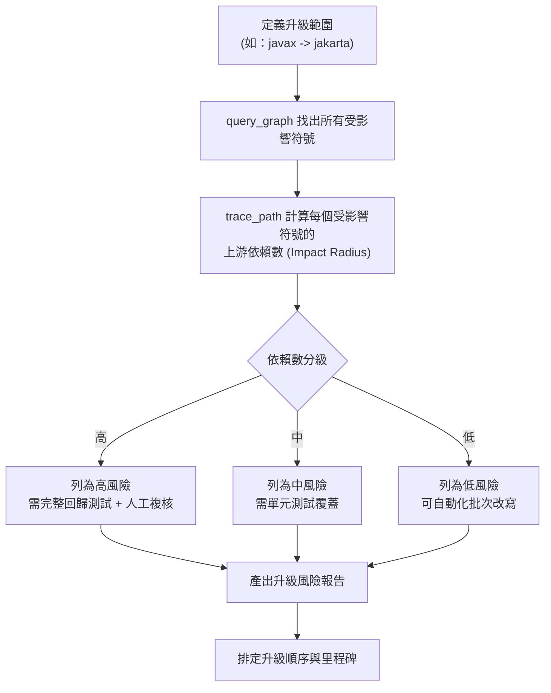

### ✅ 第 12 章 Checklist

- [ ] 升級前已用圖譜量化「受影響檔案數」與「上游依賴數」，而非憑感覺評估風險
- [ ] 已建立 Impact/Dependency/Risk 三層級分類機制
- [ ] Legacy 現代化專案已採用「絞殺者模式」並用 `degree` 排定模組優先順序
- [ ] JSP → Vue 專案已先盤點 Scriptlet 中混雜的業務邏輯，避免「假遷移」（只換外觀不換架構）
- [ ] 升級風險報告已產出並交付給專案關係人作為里程碑排程依據

---

# 第 13 章 Token 最佳化

## 13.1 傳統方式：grep / glob / read file

典型的 AI Agent 探索流程：

```text
1. glob "**/*Service.java"           -> 命中 120 個檔案
2. grep "calculateTotal" -r .        -> 命中 8 個檔案
3. read file (8 次)                  -> 每個檔案平均 300 行，約 3,000 tokens/檔
4. AI 在上下文中手動拼接呼叫關係
```

粗估 Token 消耗：8 次 read file × 約 3,000 tokens ≈ **24,000 tokens**，且這只是「找到呼叫者」這一個子問題，若要再往下追第二層呼叫鏈，又要重複一輪 grep + read file。

## 13.2 codebase-memory-mcp：Graph Query / Architecture Query / Call Chain Query

同樣的問題改用圖譜查詢：

```json
{"tool": "trace_path", "args": {"function_name": "calculateTotal", "direction": "callers", "depth": 2}}
```

回傳結構化 JSON（僅函式名稱、檔案路徑、行號等中繼資料，無需原始碼全文），粗估 **數百 tokens 以內**即可完成同一問題。

## 13.3 對照表

| 比較項目 | 傳統方式（grep/glob/read file） | codebase-memory-mcp（Graph Query） |
|---|---|---|
| Token 使用量（單一結構性查詢） | 約數萬至數十萬 token（依檔案大小與數量） | 約數百至數千 token |
| Tool Call 數量 | 多（glob → grep → 多次 read file） | 少（通常 1～2 次） |
| Latency | 高（多次來回 + 大量內容傳輸） | 低（毫秒級圖查詢） |
| 結果完整性 | 依賴 AI 自行拼接，容易遺漏深層呼叫 | 圖遍歷天然涵蓋多層深度 |
| 重複利用 | 每次重新探索 | 索引後持久重複利用 |

> 📌 **官方數據引用**：5 個典型結構性查詢，傳統方式約消耗 **412,000 tokens**，codebase-memory-mcp 約消耗 **3,400 tokens**，降幅 **99.2%**。學術論文（涵蓋 31 個真實 repo 的平均評測）則呈現較保守但仍顯著的成效：**10 倍 Token 節省、2.1 倍工具呼叫次數減少、83% 答案品質**。企業內部溝通時建議引用「論文平均值」作為穩健的保守估計，「99% 案例」作為「最佳情境上限」說明，避免讓團隊產生不切實際的期望。

## 13.4 成本比較試算（示意，需依實際 LLM 定價調整）

假設某團隊每月有 5,000 次「架構理解類」AI Agent 查詢，每次傳統方式平均消耗 50,000 input tokens：

| 項目 | 傳統方式 | codebase-memory-mcp（保守估計：10 倍節省） |
|---|---|---|
| 每次平均 Token 消耗 | 50,000 | 5,000 |
| 每月總 Token 消耗 | 250,000,000 | 25,000,000 |
| 相對成本 | 基準 100% | 約 10% |

> ⚠️ 此試算僅為示意，實際節省幅度高度依賴「查詢類型」——單純找字串（如找特定錯誤訊息文字）圖譜的優勢有限（`search_code` 本質仍是全文檢索），**結構性查詢**（呼叫鏈、依賴分析、架構總覽）才是圖譜方法相對傳統方式優勢最大的場景。企業導入 ROI 試算時，務必先盤點團隊「查詢類型的分佈」，避免一律套用最佳情境數據。

### ✅ 第 13 章 Checklist

- [ ] 已理解 Token 節省幅度高度依賴查詢類型，不可一概而論
- [ ] 已用團隊實際查詢類型分佈做出合理的 ROI 估算，而非直接套用官方最佳情境數字
- [ ] 已識別出團隊中「架構理解類」查詢的頻率，作為導入優先順序的依據
- [ ] 已將「找字串」與「找結構關係」兩類任務分流給 `search_code` 與 `search_graph`/`trace_path`，避免用錯工具反而沒省到 Token

---

# 第 14 章 AI 開發最佳實務

## 14.1 Prompt Engineering

針對搭配 codebase-memory-mcp 的 Prompt 設計，核心原則是**引導模型「先查圖譜、再下結論」**：

```text
❌ 不好的 Prompt：
「OrderService 有什麼問題？」
（模型可能憑空猜測，或漫無目的地 grep 全專案）

✅ 好的 Prompt：
「請先呼叫 get_architecture 了解整體結構，再用 trace_path 追蹤
OrderService.createOrder 的完整呼叫鏈，最後根據呼叫鏈深度與扇出
數量，評估是否有重構必要，並說明依據。」
```

> 💡 明確要求模型「說明依據」（cite which tool/query produced this conclusion）可大幅降低幻覺風險，因為圖譜查詢結果是可驗證的結構化資料，而非模型憑記憶生成。

## 14.2 Context Engineering

知識圖譜本質上是一種「外部記憶（External Memory）」，是 Context Engineering 的具體實踐：

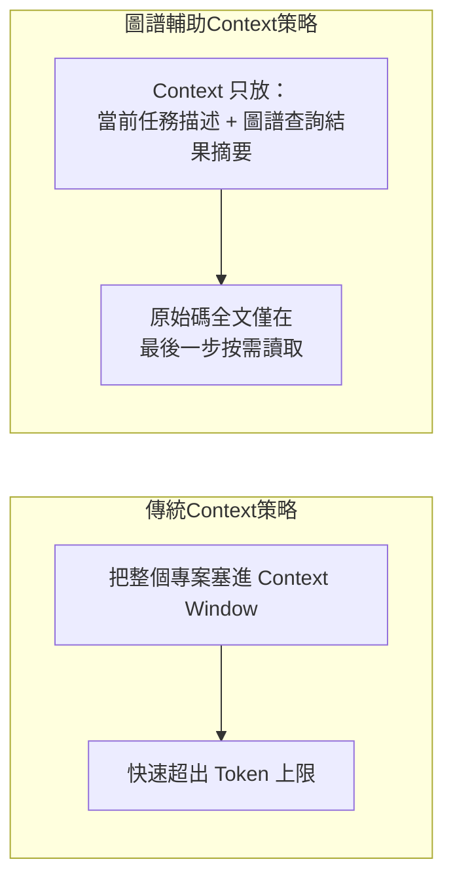

最佳實務：將圖譜查詢結果視為「壓縮後的上下文」，只在真正需要看程式碼細節時才呼叫 `get_code_snippet`，讓 Context Window 留給「推理」而非「資料搬運」。

## 14.3 MCP Engineering

設計多個 MCP Server 協作時的考量：

- **職責分離**：codebase-memory-mcp 負責「結構理解」，其他 MCP（如 Git MCP、Jira MCP、資料庫 MCP）各自負責自己的領域，避免一個 MCP Server 職責過重
- **工具粒度**：避免暴露過於「萬能」的單一工具給模型，14 個工具各司其職的設計值得參考——每個工具輸入輸出明確，模型更容易正確呼叫
- **唯讀優先**：`query_graph` 限定唯讀 Cypher 子集，是 MCP 設計上「最小權限原則」的良好範例——分析類工具不應該有寫入能力

## 14.4 Loop Engineering

Agentic Coding 常見的「探索 → 假設 → 驗證 → 修正」迴圈，圖譜可以加速「探索」與「驗證」兩個階段：

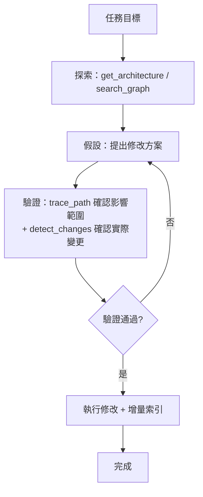

## 14.5 Agentic Coding

自主性較高的 Coding Agent（如長時間自動執行多步驟任務）特別容易因為「探索成本過高」而提早放棄完整探索、改用猜測完成任務。圖譜降低探索成本後，可以讓 Agent **更願意做完整的影響分析**，而不是為了節省 Token 抄捷徑。

## 14.6 Multi-Agent

多 Agent 協作場景下（例如一個 Agent 負責前端、一個負責後端、一個負責測試），知識圖譜可作為**共享的「世界模型（World Model）」**：

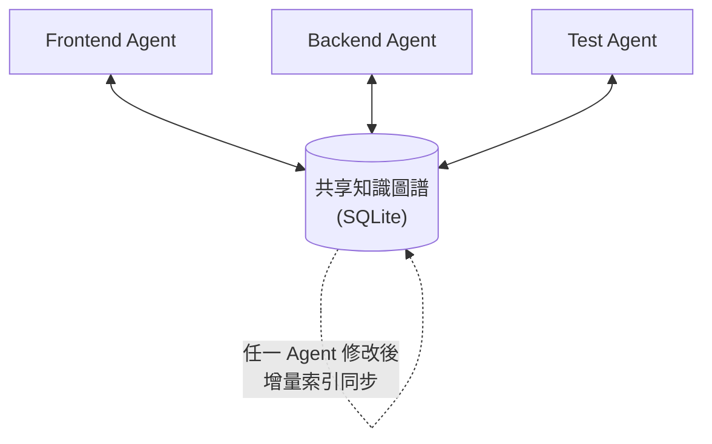

由於圖譜是持久化、可共享的單一事實來源，多個 Agent 不需要各自重新探索整個專案，也降低了「不同 Agent 對架構理解不一致」導致的衝突修改風險。

### ✅ 第 14 章 Checklist

- [ ] Prompt 設計已要求模型明確說明結論的查詢依據
- [ ] 已建立「圖譜查詢優先、原始碼讀取在後」的 Context 配置策略
- [ ] 多 MCP Server 協作已遵循職責分離與最小權限原則
- [ ] Agentic 任務已驗證「探索-假設-驗證-修正」迴圈確實有效縮短迭代次數
- [ ] 多 Agent 協作場景已確認共享圖譜的增量同步機制不會產生競態問題

---

# 第 15 章 DevSecOps 整合

## 15.1 GitHub Actions

將 `detect_changes` 整合進 PR 流程，自動於 PR 留言摘要影響範圍：

```yaml
name: Impact Analysis
on: [pull_request]
jobs:
  impact-analysis:
    runs-on: ubuntu-latest
    steps:
      - uses: actions/checkout@v4
        with:
          fetch-depth: 0
      - name: Install codebase-memory-mcp
        run: curl -fsSL https://raw.githubusercontent.com/DeusData/codebase-memory-mcp/main/install.sh | bash -s -- --skip-config
      - name: Index repository
        run: codebase-memory-mcp cli index_repository '{"repo_path": "${{ github.workspace }}"}'
      - name: Detect changes
        run: |
          codebase-memory-mcp cli detect_changes \
            '{"base_ref": "${{ github.event.pull_request.base.sha }}", "head_ref": "${{ github.event.pull_request.head.sha }}"}' \
            > impact.json
      - name: Comment on PR
        uses: actions/github-script@v7
        with:
          script: |
            const fs = require('fs');
            const impact = JSON.parse(fs.readFileSync('impact.json', 'utf8'));
            github.rest.issues.createComment({
              issue_number: context.issue.number,
              owner: context.repo.owner,
              repo: context.repo.repo,
              body: `### 🔍 影響範圍分析\n受影響符號數：${impact.affected_symbols.length}\n高風險項目：${impact.high_risk?.length ?? 0}`
            });
```

## 15.2 GitLab CI/CD

```yaml
impact-analysis:
  stage: analysis
  image: alpine:3.20
  before_script:
    - apk add --no-cache curl ca-certificates
    - curl -fsSL https://raw.githubusercontent.com/DeusData/codebase-memory-mcp/main/install.sh | bash -s -- --skip-config --dir=/usr/local/bin
  script:
    - codebase-memory-mcp cli index_repository "{\"repo_path\": \"$CI_PROJECT_DIR\"}"
    - codebase-memory-mcp cli detect_changes "{\"base_ref\": \"$CI_MERGE_REQUEST_DIFF_BASE_SHA\", \"head_ref\": \"$CI_COMMIT_SHA\"}" > impact.json
  artifacts:
    paths:
      - impact.json
  rules:
    - if: '$CI_PIPELINE_SOURCE == "merge_request_event"'
```

## 15.3 Jenkins

```groovy
pipeline {
    agent any
    stages {
        stage('Install codebase-memory-mcp') {
            steps {
                sh 'curl -fsSL https://raw.githubusercontent.com/DeusData/codebase-memory-mcp/main/install.sh | bash -s -- --skip-config'
            }
        }
        stage('Index & Impact Analysis') {
            steps {
                sh 'codebase-memory-mcp cli index_repository \'{"repo_path": "' + env.WORKSPACE + '"}\''
                sh 'codebase-memory-mcp cli detect_changes \'{"base_ref": "origin/main", "head_ref": "HEAD"}\' > impact.json'
            }
        }
        stage('Archive Report') {
            steps {
                archiveArtifacts artifacts: 'impact.json'
            }
        }
    }
}
```

## 15.4 SonarQube

codebase-memory-mcp 與 SonarQube 並非互相取代，而是互補：SonarQube 偏向「規則式靜態分析」（Code Smell、複雜度門檻、安全漏洞規則庫），知識圖譜偏向「結構關係查詢」。建議的整合方式是**用圖譜的 `degree`（連線數）作為 SonarQube Quality Gate 的補充指標**：

```text
治理規則範例：
若 SonarQube 回報某 Class 的 Cyclomatic Complexity > 30
且圖譜回報該 Class 的 degree（被呼叫次數）> 50
則標記為「最高優先重構項目」（高複雜度 + 高影響面 = 高風險）
```

## 15.5 SAST

知識圖譜可作為 SAST 工具的「範圍縮減（Scope Reduction）」前置步驟：先用 `search_code` + `trace_path` 找出「外部輸入可達的程式碼路徑」，再讓 SAST 工具（如 Semgrep、Checkmarx）集中火力分析這些高風險路徑，而非對整個程式碼庫做無差別全量掃描，可有效縮短 SAST 掃描時間。

## 15.6 DAST

DAST（動態應用程式安全測試）的測試案例設計，可參考圖譜的 `Route` 節點與 `HANDLES` 邊，自動產生「所有已知 API 端點清單」，確保 DAST 掃描範圍涵蓋全部已暴露的路由，避免因人工維護的 API 清單過時而漏測新增端點：

```cypher
MATCH (r:Route)-[:HANDLES]->(f:Function)
RETURN r.method, r.path
ORDER BY r.path
```

> ⚠️ **注意事項**：第 15 章所有 CI/CD 範例皆假設 Runner 環境可存取 GitHub 安裝腳本網路位置；企業內網隔離環境應改為**將安裝腳本與執行檔放入內部 Artifact Repository**（如 Nexus、Artifactory），CI 設定改抓內部位置，避免 CI 對外網路依賴造成的供應鏈與穩定性風險。

### ✅ 第 15 章 Checklist

- [ ] PR/MR 流程已自動產出影響範圍分析留言
- [ ] CI Runner 已改用內部 Artifact Repository 而非直接依賴外部網路下載
- [ ] 已建立「高複雜度 + 高影響面」的雙指標重構優先順序規則
- [ ] SAST 掃描已導入圖譜輔助的範圍縮減，降低掃描耗時
- [ ] DAST 測試案例清單已改為自動依圖譜 Route 節點產生，避免人工維護過時

---

# 第 16 章 系統維運

## 16.1 Backup（備份）

圖譜資料庫本質是單一 SQLite 檔案，備份策略相對簡單：

```bash
# 備份（建議排程每日執行）
sqlite3 ~/.cache/codebase-memory-mcp/java_tutorial.db ".backup '/backup/java_tutorial-$(date +%Y%m%d).db'"

# 或使用官方的壓縮快照機制
codebase-memory-mcp cli list_projects   # 確認專案路徑後手動壓縮 .codebase-memory/ 目錄
```

> 💡 對於已啟用團隊共享圖譜快照（`.codebase-memory/graph.db.zst`）的專案，**版控本身就是一種備份**——每次 commit 都留有歷史版本，可直接用 `git checkout <commit> -- .codebase-memory/graph.db.zst` 回溯。

## 16.2 Recovery（復原）

```bash
# 從備份復原
cp /backup/java_tutorial-20260624.db ~/.cache/codebase-memory-mcp/java_tutorial.db

# 確認復原後狀態
codebase-memory-mcp cli list_projects
codebase-memory-mcp cli get_graph_schema '{"project": "java_tutorial"}'
```

若備份損毀或不存在，最終手段永遠是 Graph Rebuild（見 6.6 節）——這也是為什麼圖譜資料庫應視為「可重建的快取」而非「不可遺失的主資料」，備份的目的是**省下重建時間**，而非資料保存本身的必要性。

## 16.3 Reindex（重新索引）

| 情境 | 建議動作 |
|---|---|
| 日常檔案異動 | 增量索引（`auto_index` 自動處理，或手動 `index_repository --incremental`） |
| 版本升級後 Schema 變動 | 完整 Graph Rebuild（先 `delete_project` 再 `index_repository`） |
| 圖譜查詢結果與實際程式碼不一致 | 完整 Graph Rebuild |
| 大規模重構（檔案大量搬移/重新命名） | 完整 Graph Rebuild（增量索引對大量檔案路徑變更的追蹤準確度較低） |

## 16.4 Monitoring（監控）

建議監控指標：

```bash
# 定期（如每小時）檢查所有專案的索引健康度
codebase-memory-mcp cli list_projects --raw | jq '.projects[] | {name, last_indexed, nodes, edges}'
```

| 監控指標 | 告警條件 |
|---|---|
| `last_indexed` 距今時間 | 超過合理閾值（如 24 小時，視 `auto_index` 啟用情況調整）應告警 |
| Node/Edge 數量驟降 | 可能代表索引異常或程式碼大量被誤刪/忽略，應告警 |
| `index_status` 長時間停滯在 `indexing` | 可能卡住或資源不足，應告警並檢查 Worker 資源 |
| MCP Server 程序存活狀態 | 標準的程序健康檢查（liveness probe） |

## 16.5 Log Management（日誌管理）

透過環境變數調整日誌等級：

```bash
export CBM_LOG_LEVEL=debug   # 除錯時使用，正式環境建議 info 或 warn
codebase-memory-mcp config set auto_index true
```

| Log Level | 適用場景 |
|---|---|
| `debug` | 排查索引失敗、查詢異常等問題時暫時開啟 |
| `info`（預設） | 一般營運環境 |
| `warn` | 僅關注潛在問題，降低日誌量 |
| `error` | 僅關注錯誤，適合長期穩定運行的環境 |
| `none` | 完全關閉日誌（不建議正式環境使用，除錯困難） |

> ⚠️ 建議將日誌統一收集進企業既有的日誌平台（如 ELK Stack、Splunk），並針對 `index_status: failed` 等關鍵事件設定告警規則，避免索引悄悄失效而沒人發現，導致 AI Agent 查詢到過時資料卻渾然不知。

### ✅ 第 16 章 Checklist

- [ ] 已建立定期備份排程，且驗證過備份檔案實際可復原
- [ ] 已明確團隊共識：圖譜是「可重建快取」而非「不可遺失主資料」
- [ ] 已針對不同情境（日常異動/版本升級/大規模重構）建立對應的 Reindex SOP
- [ ] 已建立 `last_indexed` 過期、Node/Edge 異常驟降的監控告警
- [ ] 日誌已接入企業既有日誌平台並設定關鍵事件告警

---

# 第 17 章 效能調校

## 17.1 Large Repository（超大型單一專案）

官方數據：Linux Kernel（28M LOC、75K 檔案）索引耗時約 3 分鐘，產生 481 萬節點、772 萬邊。對於這種規模的專案：

- 索引時建議提高 `CBM_WORKERS` 善用多核心平行解析
- 避免在索引尚未完成時就發起大量查詢（可用 `index_status` 確認 `completed` 狀態）
- `.cbmignore` 排除非必要目錄（如產生的程式碼、第三方 vendor 目錄、測試資料 fixture）可顯著縮短索引時間

```bash
export CBM_WORKERS=16
codebase-memory-mcp cli index_repository '{"repo_path": "/workspace/huge-monorepo"}'
```

## 17.2 Monorepo

Monorepo 常見問題是「單一巨大圖譜中查詢結果包含太多不相關模組」。建議：

- 善用 `file_pattern` 過濾參數限縮查詢範圍到特定子模組
- 評估是否需要拆成多個獨立索引專案（`index_repository` 可指定子目錄路徑分別索引），犧牲跨模組查詢能力換取查詢效能與結果精確度

```cypher
-- 限定特定子模組範圍的查詢
MATCH (f:Function)
WHERE f.file STARTS WITH "packages/order-service/"
RETURN f.name
LIMIT 50
```

## 17.3 Microservices（多 Repo 微服務）

每個微服務各自獨立索引，但需要跨服務查詢時（如追蹤跨服務呼叫鏈），需確保：

1. 各服務的圖譜資料庫版本（Schema）一致
2. 待 `ingest_traces`（目前為實驗性／Stub，見 7.14 節）功能成熟後，定期匯入實際執行期 Trace 校正跨服務 `HTTP_CALLS` 邊的準確度（純靜態分析容易因動態路由設定而失準）；在此之前，建議改以人工抽樣比對日誌或 APM 平台資料作為過渡方案
3. 若需要「全局視角」，可考慮建立一個「彙總索引」涵蓋所有微服務 Repo（前提：CI 資源允許，且確實有跨服務分析的高頻需求）

## 17.4 Index Tuning（索引調校）

| 調校項目 | 建議 |
|---|---|
| `.cbmignore` | 排除 `node_modules`、`vendor`、`dist`、`build`、產生的程式碼目錄 |
| `CBM_WORKERS` | 設為實體核心數，避免過度設定導致 Context Switch 開銷反而拖慢速度 |
| `auto_index_limit` | 依硬體資源調整，避免在資源不足的開發機上自動觸發大規模背景索引影響其他作業 |
| 增量索引頻率 | 一般開發機可即時（Watcher），CI 環境建議改為排程批次（如每次合併到主分支才觸發） |

## 17.5 Query Tuning（查詢調校）

- `search_graph` / `query_graph` 務必加上 `LIMIT`，避免單次查詢回傳結果過多反而增加 Token 與處理時間
- `trace_path` 的 `depth` 參數預設不要超過 3，深度越高查詢時間與結果量都呈指數增長
- 自訂 Cypher 查詢避免在大型圖譜上做無限定條件的 `MATCH (n) RETURN n`（全圖掃描），務必先用 `WHERE` 縮限範圍

## 17.6 Cache Tuning（快取調校）

索引流水線本身已採用 LZ4 壓縮中繼快取加速寫入；對查詢端，若團隊有「重複查詢相同問題」的模式（如固定的架構健檢腳本每日執行），可在應用層自行加一層結果快取（例如把 `get_architecture` 的每日健檢結果快取 24 小時），避免重複對圖譜資料庫發起相同查詢造成不必要的 IO 負擔（雖然單次查詢已是毫秒級，但累積大量重複查詢仍有優化空間）。

> 💡 **實務案例**：某電商團隊的 Monorepo 含 40 個微服務套件，初期將所有套件全部索引進同一張圖譜，查詢時常因為「同名函式」（如各服務都有自己的 `validate()`）造成搜尋結果混淆，改為「每個套件獨立索引 + 用 `file_pattern` 限縮查詢範圍」後，查詢精確度與速度都明顯改善。

### ✅ 第 17 章 Checklist

- [ ] 超大型專案已設定 `.cbmignore` 排除非必要目錄
- [ ] `CBM_WORKERS` 已依實體核心數調整，而非預設值照單全收
- [ ] Monorepo 查詢已善用 `file_pattern` 限縮範圍，避免同名符號混淆
- [ ] 微服務團隊已知悉 `ingest_traces` 目前仍為實驗性／Stub 功能，已制定過渡期的人工校正方案
- [ ] 自訂 Cypher 查詢已養成加 `LIMIT` 與明確 `WHERE` 條件的習慣，避免全圖掃描

---

# 第 18 章 故障排除

本章彙整 57 個常見問題，依「安裝與環境」「索引相關」「查詢相關」「MCP 整合」「效能」「安全與權限」「團隊協作」「已知限制與實驗性功能」八大類整理，格式統一為「問題 / 原因 / 解決方案」。

## 18.1 安裝與環境類

**問題 1：執行 `install.sh` 後找不到 `codebase-memory-mcp` 指令**
原因：安裝目錄未加入 `PATH`。
解決方案：確認安裝腳本輸出的安裝路徑（預設常為 `~/.local/bin`），手動加入 shell 設定檔（`~/.bashrc` / `~/.zshrc`）並 `source` 重新載入。

**問題 2：Windows PowerShell 執行 `install.ps1` 出現「無法載入，因為在此系統上已停用執行指令碼」**
原因：PowerShell 執行原則（Execution Policy）限制。
解決方案：以系統管理員身分執行 `Set-ExecutionPolicy -Scope CurrentUser RemoteSigned`，或單次執行時加上 `-ExecutionPolicy Bypass`。

**問題 3：企業 Proxy 環境下 `curl` 安裝指令逾時**
原因：未設定 Proxy 環境變數。
解決方案：執行前設定 `export https_proxy=http://proxy.company.com:8080`，或改用手動下載執行檔的方式安裝。

**問題 4：從原始碼建置時出現 `zlib.h: No such file or directory`**
原因：缺少 zlib 開發套件。
解決方案：依平台安裝對應套件，如 Ubuntu/Debian 執行 `apt install zlib1g-dev`，RHEL/CentOS 執行 `yum install zlib-devel`。

**問題 5：macOS 執行檔被 Gatekeeper 擋下，顯示「無法驗證開發者」**
原因：macOS 對未經 Apple 公證的執行檔預設攔截。
解決方案：確認執行檔的 Sigstore cosign 簽章與官方公告一致後，於「系統設定 > 隱私權與安全性」中允許執行，或執行 `xattr -d com.apple.quarantine <path>` 移除隔離標記。

**問題 6：WSL 內安裝成功，但 Windows 端 IDE 找不到 MCP Server**
原因：MCP 設定檔指向的執行檔路徑使用了 Windows 路徑格式，但實際執行環境是 WSL。
解決方案：確認 `.mcp.json` 中的 `command` 路徑與實際執行環境（WSL `/usr/local/bin/...` 或 Windows `C:\...`）一致，避免混用。

**問題 7：Docker 容器內索引完成，但容器重啟後圖譜消失**
原因：未掛載持久化 Volume，圖譜寫在容器可寫層（Container Writable Layer）。
解決方案：掛載 Volume 至 `~/.cache/codebase-memory-mcp`，並確認容器使用者對該路徑有寫入權限。

**問題 8：AUR 安裝後版本落後官方最新 Release**
原因：AUR 套件更新由社群維護者人工觸發，可能有延遲。
解決方案：急需最新版本時改用官方手動安裝方式，或執行 `codebase-memory-mcp update` 觸發內建更新機制。

## 18.2 索引相關類

**問題 9：`index_repository` 執行完成，但 `list_projects` 顯示 Node 數量為 0**
原因：`repo_path` 路徑錯誤，或目標路徑被 `.gitignore`/`.cbmignore` 整個排除。
解決方案：確認路徑為絕對路徑且存在，檢查 `.cbmignore` 規則是否誤排除整個專案目錄。

**問題 10：索引大型專案時程序被作業系統 OOM Killer 終止**
原因：可用記憶體不足，索引流水線的記憶體用量隨專案規模增加。
解決方案：降低 `CBM_WORKERS` 平行度、增加可用記憶體，或先用 `.cbmignore` 排除非核心目錄分階段索引。

**問題 11：索引完成後，部分檔案的符號完全沒有出現在圖譜中**
原因：該語言的 tree-sitter grammar 支援度較低（屬於 Functional <75% 等級），或檔案副檔名未被識別。
解決方案：確認語言落在官方支援清單中的等級；自訂副檔名（如 `.blade.php`）需在 `.codebase-memory.json` 中以 `extra_extensions` 設定對應語言。

**問題 12：增量索引後，已刪除的函式仍出現在查詢結果中**
原因：增量索引在特定情境下（如大量檔案搬移、重新命名）對「刪除」的偵測不如「新增/修改」可靠。
解決方案：執行完整 Graph Rebuild（`delete_project` + `index_repository`）。

**問題 13：`auto_index` 啟用後，開發機 CPU 使用率長時間偏高**
原因：`auto_index_limit` 設定過高，或專案檔案異動過於頻繁（如建置產出物被誤判為原始碼變更）。
解決方案：降低 `auto_index_limit`，並確認 `.cbmignore` 已排除 `build`/`dist`/`target` 等建置輸出目錄。

**問題 14：`index_status` 長時間停滯在同一個 `current_stage` 不再前進**
原因：可能卡在 Hybrid LSP 對某個異常龐大或語法極端複雜的檔案做型別解析。
解決方案：開啟 `CBM_LOG_LEVEL=debug` 重新索引以定位卡住的檔案，必要時將該檔案加入 `.cbmignore` 暫時排除並回報 Issue。

**問題 15：團隊共用的 `.codebase-memory/graph.db.zst` 解壓後查詢報錯版本不相容**
原因：產生快照與目前安裝的 codebase-memory-mcp 版本之間有 Schema 不相容的更動。
解決方案：統一團隊安裝版本，或重新以目前版本產生快照並通知團隊更新。

**問題 16：Monorepo 中某個子套件索引後完全沒有產生 `Route` 節點**
原因：該子套件使用的 Web Framework 路由定義方式（如非標準的動態路由註冊）超出目前路由偵測規則的覆蓋範圍。
解決方案：改用 `search_code` 搭配關鍵字（如框架特定的路由註冊語法）人工定位，並可考慮回報 Issue 請求擴充偵測規則。

**問題 17：索引 Git Submodule 時內容沒有被涵蓋**
原因：Submodule 路徑可能被 `.gitignore` 規則間接排除，或 Submodule 尚未初始化（目錄為空）。
解決方案：確認 `git submodule update --init --recursive` 已執行，且 `.cbmignore` 未誤排除 Submodule 路徑。

**問題 18：索引含符號連結（Symlink）的目錄時內容遺失**
原因：官方設計刻意「永遠跳過 Symlink」，避免循環連結造成無限遍歷。
解決方案：若 Symlink 指向的內容也需要被索引，改為將實際目錄路徑單獨加入索引範圍，而非依賴 Symlink。

## 18.3 查詢相關類

**問題 19：`search_graph` 用 `name_pattern` 查詢完全沒有結果，但確定符號存在**
原因：`name_pattern` 為正規表達式，常見錯誤是把正規表達式特殊字元（`.`、`*`）當作純文字輸入。
解決方案：確認正規表達式語法正確，特殊字元需要時應加上轉義（如要比對字面上的點號需寫成 `\.`）。

**問題 20：`trace_path` 回傳的呼叫鏈缺少某一段已知存在的呼叫關係**
原因：該呼叫透過動態反射、依賴注入框架的執行期綁定、或函式指標/Lambda 間接呼叫，靜態分析無法 100% 還原。
解決方案：待 `ingest_traces`（目前為實驗性／Stub，見 7.14 節）功能成熟後可匯入實際執行期 Trace 補強；目前階段建議改用人工標註已知的動態呼叫關係。

**問題 21：`query_graph` 的 Cypher 查詢回傳語法錯誤**
原因：使用了不在唯讀子集支援範圍內的子句或函式。
解決方案：參考第 7.8 節列出的支援子句與函式清單，或先用 `get_graph_schema` 確認可用欄位名稱拼字正確。

**問題 22：`get_code_snippet` 找不到指定的 Qualified Name**
原因：Qualified Name 拼字錯誤，或該符號實際上是私有/匿名（無正式命名）符號。
解決方案：先用 `search_graph` 確認符號的正確 Qualified Name 格式（不同語言命名慣例不同，如 Java 用點號分隔，Go 用斜線+點號混合）。

**問題 23：跨服務的 `HTTP_CALLS` 邊數量遠少於預期**
原因：純靜態分析無法偵測「URL 是從設定檔/環境變數動態組裝」的呼叫情境。
解決方案：對於高度動態的服務發現機制（如透過 Service Mesh、Consul），待 `ingest_traces`（實驗性／Stub，見 7.14 節）成熟後可用實際流量驗證；現階段靜態分析結果僅作為初步線索，仍須人工核對關鍵跨服務路徑。

**問題 24：`search_code` 全文檢索速度明顯比預期慢**
原因：`pattern` 使用了效能不佳的正規表達式（如過度使用 `.*` 造成回溯爆炸）。
解決方案：盡量使用更精確、錯誤回溯較少的正規表達式，並搭配 `file_pattern` 縮小搜尋範圍。

**問題 25：`detect_changes` 的風險分類結果與團隊主觀判斷不一致**
原因：風險分類主要依據「圖譜連線數（影響面）」這項客觀指標，未涵蓋業務邏輯的重要性權重。
解決方案：將圖譜的風險分類視為「客觀的影響面參考」，仍應搭配人工對業務重要性的判斷做最終決策，兩者互補而非取代。

**問題 26：同一個查詢在不同時間執行回傳不同結果**
原因：背景 Watcher 在查詢期間觸發了增量索引，圖譜資料正在變更中。
解決方案：對結果一致性要求高的場景（如 CI Pipeline 內），建議先暫停 `auto_index` 或確保查詢前已完成一次明確的索引動作，避免查詢時資料正在變動。

**問題 27：`manage_adr` 建立的記錄在 UI 視覺化介面中看不到**
原因：UI 視覺化功能（3D 圖譜瀏覽）主要聚焦於程式碼結構節點，ADR 記錄目前可能僅透過 MCP 工具或 CLI 查詢呈現，未必有對應的 UI 視覺化入口。
解決方案：以 CLI 或 MCP 工具呼叫 `manage_adr` 的查詢功能取得記錄內容，不依賴 UI 介面確認。

**問題 28：Cypher 查詢中使用 `UNION` 後欄位對應錯亂**
原因：`UNION` 要求兩側 `RETURN` 的欄位數量與型別需一致，欄位命名或順序不一致會造成結果錯亂。
解決方案：確保 `UNION` 兩側 `RETURN` 子句的欄位數、型別、別名命名完全一致。

## 18.4 MCP 整合類

**問題 29：Claude Code 沒有自動使用圖譜工具，仍頻繁呼叫 grep/read**
原因：PreToolUse Hook 僅為「提醒型」，最終仍由模型自主決策；模型可能因 Prompt 設計不夠明確而忽略提示。
解決方案：在 `CLAUDE.md` 中明確要求「優先使用 codebase-memory-mcp 工具」，並在任務 Prompt 中明確指名工具（如「請用 trace_path 追蹤」）。

**問題 30：GitHub Copilot Chat 看不到 codebase-memory-mcp 工具選項**
原因：MCP 設定檔位置錯誤，或 VS Code / Copilot 擴充套件版本過舊未支援 MCP。
解決方案：確認設定檔位於正確路徑（工作區 `.vscode/mcp.json` 或對應的全域設定），並更新 VS Code 與 Copilot 擴充套件至支援 MCP 的版本。

**問題 31：MCP Server 啟動後立即崩潰，Agent 顯示連線失敗**
原因：執行檔權限不足（Linux/macOS 缺少執行權限），或執行檔架構與作業系統不符（如 ARM 執行檔誤裝在 x86 機器）。
解決方案：確認執行權限（`chmod +x`）與下載的執行檔架構正確對應目標平台。

**問題 32：多個 Agent（Claude Code + Cursor）同時連接，圖譜查詢互相干擾**
原因：若兩者皆觸發 `index_repository` 寫入操作，SQLite 在高併發寫入情境下可能產生鎖定（Lock）等待。
解決方案：避免多個 Agent 同時對同一專案發起索引寫入操作，查詢類操作（唯讀）通常不受影響；可考慮約定僅由一個固定角色負責觸發索引。

**問題 33：自動偵測安裝流程未涵蓋團隊使用的 Agent（如自架的內部工具）**
原因：官方自動偵測清單為固定的 11 種 Agent，未涵蓋所有可能的 MCP 用戶端。
解決方案：手動撰寫該 Agent 對應的 MCP 設定檔（格式通常遵循標準 MCP JSON-RPC 規範），參考第 5 章已支援 Agent 的設定格式類比撰寫。

**問題 34：PreToolUse Hook 設定後，Claude Code 啟動變慢**
原因：Hook 在每次工具呼叫前都會執行一次檢查邏輯，理論上有微小的額外開銷。
解決方案：此開銷通常極小且可忽略；若懷疑是其他原因（如其他 Hook 衝突），可暫時停用單一 Hook 逐一排查。

**問題 35：Codex CLI 設定 `.codex/config.toml` 後仍找不到工具**
原因：TOML 語法錯誤（如表格鍵名拼字錯誤）導致設定未被正確解析。
解決方案：用 TOML Linter 驗證語法正確性，並確認鍵名與官方範例完全一致（`mcp_servers.codebase-memory-mcp`）。

**問題 36：3D 視覺化 UI（`localhost:9749`）無法從其他機器存取**
原因：UI 服務預設僅綁定本機（`localhost`/`127.0.0.1`），未對外網卡開放。
解決方案：依官方 UI 啟動參數確認是否有提供綁定位址的設定選項；若無，建議透過 SSH Port Forwarding 存取，而非直接修改綁定位址暴露到內網（避免未授權存取風險）。

## 18.5 效能類

**問題 37：超大型 Monorepo 索引耗時遠超預期**
原因：未設定 `.cbmignore` 排除 `node_modules`、`vendor` 等大量非自有程式碼目錄。
解決方案：建立完整的 `.cbmignore` 規則，並考慮拆分為多個獨立索引的子專案。

**問題 38：`trace_path` 深度設為 5 時查詢時間明顯變長**
原因：深度越高，BFS 遍歷的節點與邊數量呈指數成長，屬預期行為。
解決方案：深度需求超過 3 時，建議先評估是否真的需要這麼深的呼叫鏈（往往代表架構耦合問題），或分段查詢逐層展開。

**問題 39：圖譜查詢效能隨專案規模增長逐漸下降**
原因：SQLite 在極大規模資料下，若缺乏適當索引或統計資訊過時，查詢計畫可能不理想。
解決方案：確認使用官方建議的最新版本（索引與查詢最佳化通常隨版本迭代持續改進），必要時執行 Graph Rebuild 重新整理統計資訊。

**問題 40：CI Pipeline 中每次 PR 都重新完整索引導致 Pipeline 變慢**
原因：未善用增量索引或團隊共享快照機制。
解決方案：CI 改用增量索引（基於上次主分支索引結果），或直接下載/解壓團隊共享的 `.codebase-memory/graph.db.zst` 快照再做增量更新。

**問題 41：背景 Watcher 在 IDE 大量觸發儲存（如 Auto Save）時造成 CPU 飆高**
原因：頻繁的小幅檔案異動觸發大量短時間內的重新索引請求。
解決方案：確認背景索引機制有適當的防抖（Debounce）處理；若問題持續，考慮關閉 `auto_index`，改為手動或排程觸發增量索引。

**問題 42：3D 視覺化 UI 在大型圖譜上載入緩慢甚至瀏覽器當機**
原因：一次性載入數十萬節點的視覺化渲染對瀏覽器是沉重負擔。
解決方案：使用 UI 提供的篩選/聚焦功能（如僅載入特定模組叢集），避免一次性渲染整個超大圖譜。

## 18.6 安全與權限類

**問題 43：企業資安團隊質疑程式碼是否會被上傳到外部伺服器**
原因：對工具運作方式不熟悉產生的合理疑慮。
解決方案：說明 codebase-memory-mcp 為 100% 本機處理架構，無內建 LLM、無 API Key、無對外資料傳輸，圖譜資料庫僅存在本機 `~/.cache/` 路徑。可向資安團隊提供以下具體佐證機制，逐一對應其稽核要求：

| 安全機制 | 說明 |
|---|---|
| SLSA Level 3 | 透過 GitHub Actions 產生密碼學建構出處（Provenance），可驗證發布的執行檔確實由官方 CI 流程建置，未被中途竄改 |
| Sigstore cosign 無鑰簽章 | 所有發布成品皆以 cosign 進行無鑰簽章，發布頁附帶簽章檔供驗證 |
| GitHub Attestation 驗證 | 可用官方 GitHub CLI 指令驗證下載檔案的建構來源：`gh attestation verify <下載的執行檔> --repo DeusData/codebase-memory-mcp` |
| CodeQL SAST | 程式碼合併前自動跑 CodeQL 靜態分析，若有安全性警告會直接擋下發布管道 |
| 60 秒 Fuzzing | 發布前對解析器執行短時間模糊測試，降低惡意輸入觸發記憶體安全問題的風險 |
| 多防毒引擎掃描 | 發布的執行檔會送交 70+ 家防毒引擎（VirusTotal 等）掃描，採零容忍政策，任何一個引擎判定為惡意即擋下發布 |
| SHA-256 Checksum | 安裝腳本提取執行檔前先校驗官方公告的雜湊值，防止傳輸過程被竄改 |

> 💡 上述機制合稱官方所稱的「多層安全稽核套件」，企業可將 `gh attestation verify` 的驗證結果納入內部軟體供應鏈（SBOM/SLSA）稽核紀錄，作為通過內部資安審查的具體佐證文件。

**問題 44：CI Runner 下載安裝腳本時資安掃描工具誤判為惡意行為**
原因：`curl | bash` 模式本身屬於資安掃描工具常見的高風險行為模式特徵。
解決方案：改用「先下載、校驗 SHA-256 checksum、再執行」的兩步驟方式，並將該行為加入資安掃描工具的允許清單（White List），同時保留校驗步驟作為實質防護。

**問題 45：`autoApprove` 設定中誤將 `delete_project` 列入自動核准清單**
原因：設定時未區分唯讀與寫入/破壞性工具。
解決方案：檢視第 5.5 節建議，僅將查詢類唯讀工具（`search_graph`、`trace_path`、`get_architecture` 等）列入自動核准，狀態變更類工具（`index_repository`、`delete_project`）保留人工核准。

**問題 46：多租戶（Multi-tenant）CI 環境下，不同專案的圖譜資料疑似互相污染**
原因：`CBM_CACHE_DIR` 環境變數未針對不同 CI Job 隔離，共用同一快取目錄。
解決方案：為每個 CI Job 設定獨立的 `CBM_CACHE_DIR`（如以 Job ID 命名子目錄），確保資料隔離。

## 18.7 團隊協作類

**問題 47：團隊成員各自索引同一專案，圖譜內容互不一致**
原因：未建立共享圖譜快照機制，各自的索引時間點與本機異動不同步。
解決方案：建立第 6.6 節所述的團隊共享 `.codebase-memory/graph.db.zst` 快照機制，並訂定更新頻率規範（如每日或每次合併主分支後更新）。

**問題 48：圖譜快照檔案造成版控儲存庫（Repository）體積快速膨脹**
原因：每次更新快照都是一份新的二進位檔案，Git 歷史會持續累積各版本的完整副本。
解決方案：評估改用 Git LFS 管理快照檔案，或調整快照更新頻率（不必每次 commit 都更新），並定期執行 Git 歷史清理（需謹慎評估對協作者的影響）。

**問題 49：新成員 clone 專案後解壓快照，但圖譜內容與其本機程式碼版本不符**
原因：快照產生時的 commit 與新成員 checkout 的 commit 不一致。
解決方案：解壓快照後務必執行一次增量索引，讓圖譜同步補上快照產生後到目前 commit 之間的差異。

**問題 50：跨團隊（前端/後端團隊各自獨立 Repo）對同一份 ADR 決策記錄各自維護版本不同步**
原因：`manage_adr` 的記錄與各自 Repo 的圖譜資料庫綁定，沒有天然的跨 Repo 同步機制。
解決方案：對於需要跨團隊共識的架構決策，建議仍以一份「主 ADR 文件」（可放在共用文件平台或其中一個 Repo）為準，各 Repo 的 `manage_adr` 記錄僅作該團隊視角的本地註記，並在記錄中標註指向主文件的連結。

## 18.8 已知限制與實驗性功能

以下為對照官方近期版本與社群回報整理出的已知限制，多數短期內仍會存在，建議導入前讓團隊有心理預期，而非視為手冊或操作上的疏失。

**問題 51：大型圖譜上的複雜查詢（如含多層 `OPTIONAL MATCH` 的 `query_graph` 查詢）長時間無回應**
原因：`query_graph` 目前對複雜查詢沒有內建逾時（Timeout）機制，極端情況下可能造成查詢行程卡住。
解決方案：自訂查詢務必加上明確 `WHERE` 條件與 `LIMIT`（呼應第 17.5 節），CI/CD 等自動化流程呼叫 `query_graph` 時應在外層自行包一層逾時控制（如 Shell `timeout` 指令），避免單一查詢卡死整條 Pipeline。

**問題 52：PHP 專案中出現明顯錯誤的 `CALLS` 邊**
原因：PHP 對同名方法（不同類別、不同 namespace 下的同名方法）的符號解析仍可能誤判，產生指向錯誤目標的 `CALLS` 邊，與部分動態語言常見的同名符號混淆問題類似。
解決方案：PHP 專案的呼叫鏈分析結果建議搭配 `get_code_snippet` 人工確認關鍵路徑，不要完全依賴自動產生的呼叫鏈做高風險判斷（如安全審查、升級影響分析）。

**問題 53：物件導向繼承中的 `super()` / 父類別方法呼叫被重複或誤判為額外呼叫**
原因：遞迴呼叫偵測邏輯對「子類別呼叫父類別同名方法」（如 Python 的 `super().save()`）這類繼承模式的識別仍不完全精準。
解決方案：涉及繼承鏈的呼叫鏈分析結果，建議交叉比對 `trace_path` 與實際原始碼，特別留意繼承層數較深的類別。

**問題 54：`get_architecture` 回傳的 Route 清單中出現明顯不是真實 API 路徑的項目（如 GraphQL 欄位字面值、設定檔內容、正規表達式字串）**
原因：路由偵測規則目前可能誤判某些語法模式（GraphQL Schema 定義、組態檔字串、正規表達式）為 HTTP Route。
解決方案：將 `get_architecture` 回傳的 Route 清單視為「候選清單」而非絕對正確的最終結果，對外部安全掃描（如第 15.6 節 DAST）等高風險用途，建議先人工過濾掉明顯不合理的項目。

**問題 55：Windows 環境下，部分路徑相關功能（如路徑增強器）行為與 Linux/macOS 不一致**
原因：Windows 路徑防護機制與 Unix 風格路徑解析邏輯存在差異，可能導致部分路徑增強功能在 Windows 上無法正常運作。
解決方案：Windows 上的關鍵索引/查詢結果建議與 WSL 或 Linux 環境的結果交叉驗證；若團隊以 Windows 為主要開發環境，建議優先在 WSL 內安裝執行（呼應第 4.4 節）。

**問題 56：Django REST Framework 的 ViewSet 路由沒有對應產生 `HANDLES` 邊**
原因：目前的路由偵測規則尚未涵蓋 Django REST Framework ViewSet 這類透過 Router 自動產生 URL 的模式。
解決方案：此類專案的路由清單建議搭配 `search_code` 搜尋 `ViewSet`／`router.register` 等關鍵字人工補充，作為圖譜路由清單的補充文件。

**問題 57：重新安裝（Reinstall）或版本升級後，索引功能異常或既有圖譜被誤刪**
原因：部分版本的安裝/升級流程在偵測到既有安裝時，可能觸發索引刪除而非單純更新執行檔；版本間 Schema 變動也可能導致升級後相容性問題。
解決方案：升級或重新安裝前，務必先備份 `.codebase-memory/` 與 `~/.cache/codebase-memory-mcp/`（呼應第 16.1 節），升級完成後用 `list_projects` 確認既有專案的 Node/Edge 數量無異常驟降，若有異常立即執行 Graph Rebuild（第 6.6 節）。

> ⚠️ 本節所列限制反映撰寫當下（v0.8.1）的已知狀態，官方迭代速度快，建議定期回頭核對 [Releases](https://github.com/DeusData/codebase-memory-mcp/releases) 與 [Issues](https://github.com/DeusData/codebase-memory-mcp/issues) 確認是否已修復。

### ✅ 第 18 章 Checklist

- [ ] 已建立內部故障排除知識庫，將本章節內容依團隊實際遇到的情境持續補充
- [ ] 安裝與 CI 整合已採用「下載+校驗+執行」而非直接 `curl | bash` 的安全模式
- [ ] 已明確區分唯讀工具與寫入/破壞性工具的核准權限設定
- [ ] 已建立團隊共享圖譜快照的更新規範與儲存策略（含 Git LFS 評估）
- [ ] 資安團隊已完成對 codebase-memory-mcp 本機處理架構的理解與背書，並已知悉 SLSA/cosign/CodeQL 等具體佐證機制與 `gh attestation verify` 驗證方式
- [ ] 已將第 18.8 節 7 項已知限制納入導入溝通材料，避免團隊對準確度與功能完整度有過高期待

---

# 第 19 章 導入企業最佳實務

## 19.1 銀行

**核心考量**：法規遵循（如個資法、金融監理要求）、程式碼不可外流、核心交易系統高度耦合的 Legacy 程式碼（COBOL/Java 混合）。

**導入建議**：
- 優先強調 100% 本機處理特性，作為說服資安與法遵部門的關鍵賣點
- 第一波導入聚焦「核心交易系統的逆向工程與盤點」（呼應第 11 章），而非急著要求 AI Agent 自動修改核心程式碼
- 建立 ADR（架構決策記錄）機制，滿足金融監理常見的「決策可追溯性」稽核要求
- 索引環境建議部署在隔離的開發網段，不與生產環境網路相通

## 19.2 保險

**核心考量**：保單核心系統歷史悠久（常見 Struts/EJB），跨部門（核保、理賠、再保）系統高度交織，資料表共用情況嚴重。

**導入建議**：
- 優先用 Database Flow 分析（10.4 / 11.6 節）盤點高風險共用資料表，作為資料治理專案的前期調查工具
- Framework 升級（如 Struts → Spring MVC）建議採絞殺者模式，搭配圖譜的 `degree` 排定優先順序
- 批次作業（夜間結算、續保通知）與線上交易共用邏輯的風險盤點（11.5 節）應列為高優先項目

## 19.3 政府機關

**核心考量**：採購與委外開發模式下，原始開發團隊可能已撤離，文件交接品質不一，且常涉及多次轉包與系統介接。

**導入建議**：
- 將 `get_architecture` 產出的架構總覽，納入系統驗收文件的標準附件，降低未來交接斷層風險
- 要求委外廠商在專案結案時，連同程式碼一併交付已索引完成的圖譜快照（`.codebase-memory/graph.db.zst`），作為知識傳承的具體產出
- 涉及機密等級資料的系統，安裝與索引應在已通過資安認證的隔離環境中進行，禁止透過網路下載安裝腳本，改用內部驗證後的離線安裝包

## 19.4 製造業

**核心考量**：MES（製造執行系統）、ERP 整合系統常見多種語言混合（Java、C#、PLC 介接的 C/C++），且常有客製化程度極高、文件稀缺的中介系統。

**導入建議**：
- 善用 158 種語言的廣泛支援，對異質系統（Java 應用層 + C/C++ 設備介接層）建立統一的跨語言架構視圖
- 設備介接層常見的非同步訊息（MQTT、OPC-UA）呼叫關係，靜態分析對工業通訊協定的辨識能力有限，待 `ingest_traces`（目前為實驗性／Stub，見 7.14 節）成熟後可用實際運行資料校正；現階段建議搭配設備端既有的監控/日誌資料人工比對
- 導入初期聚焦「找出哪些客製化模組與標準模組耦合過深」，作為後續模組化改造的依據

## 19.5 電商

**核心考量**：流量尖峰（如促銷檔期）對系統穩定性要求高，微服務數量龐大，團隊迭代速度快、人員流動率相對較高。

**導入建議**：
- 微服務跨服務追蹤（8.2 節）作為新人 Onboarding 的標準教材，大幅縮短新人理解系統的時間
- 效能調校（17 章）搭配 `degree` 找出高扇出方法，作為大促前效能健檢的標準檢查項目
- 高頻迭代團隊建議啟用 `auto_index`，確保圖譜與快速變動的程式碼保持同步，避免 AI Agent 依賴過時的架構資訊做出錯誤建議

## 19.6 企業導入路線圖

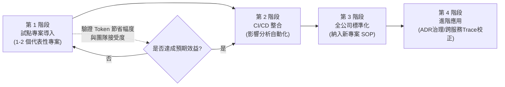

> 💡 **實務案例**：建議第 1 階段試點時間控制在 4～6 週內，並明確定義「成功標準」（如：新人 Onboarding 時間縮短 X%、PR Review 平均耗時縮短 X%），避免試點期間因缺乏量化指標而難以向管理層證明導入價值。

### ✅ 第 19 章 Checklist

- [ ] 已依產業特性（法規/Legacy程度/異質系統/流量特性）調整導入優先順序
- [ ] 高合規產業已完成資安與法遵部門的背書
- [ ] 已建立試點專案的量化成功標準，而非僅憑主觀感受評估導入效益
- [ ] 委外/採購模式的機關已將圖譜快照納入驗收交付標準
- [ ] 已規劃從試點到全公司標準化的明確路線圖與里程碑

---

# 第 20 章 與其他工具比較

> ⚠️ **資料時效性說明**：本章比較資訊主要依據公開資訊與各工具官方文件的一般性特徵整理而成，僅 codebase-memory-mcp 部分數據可追溯至官方 README 與論文（已於本手冊各章節標明來源）。其餘工具的效能與成本數據隨版本迭代可能變化，企業選型時應以實際 POC（概念驗證）測試結果為最終依據，本表僅供初步篩選參考。

## 20.1 比較對象總覽

| 工具 | 定位 |
|---|---|
| codebase-memory-mcp | 本機知識圖譜 MCP Server，結構分析後端 |
| CodeGraph | 程式碼圖譜類分析工具（依專案而異，常見於程式碼視覺化/依賴分析領域） |
| tokensave | Token 用量優化類輔助工具（依專案而異，常聚焦於上下文精簡策略） |
| Sourcegraph | 企業級程式碼搜尋與智能導覽平台，通常以伺服器/雲端服務形式部署 |
| Continue | 開源 AI 編碼助手（IDE 擴充套件），聚焦於整合多種 LLM 的編碼輔助體驗 |
| OpenGrep | 開源靜態分析/規則式程式碼掃描工具（Semgrep 生態系相關） |
| OpenCode | 開源終端機 AI 編碼助手，本身也是 codebase-memory-mcp 官方自動偵測支援的 11 種 Agent之一 |

## 20.2 架構比較

| 維度 | codebase-memory-mcp | Sourcegraph | OpenGrep | Continue |
|---|---|---|---|---|
| 部署形態 | 單一靜態執行檔，本機運行 | 通常需伺服器部署（企業版） | 命令列工具，本機運行 | IDE 擴充套件 |
| 核心技術 | Tree-sitter + Hybrid LSP + 知識圖譜 | 程式碼索引 + 搜尋引擎 | 規則式靜態分析（AST Pattern Matching） | LLM 整合層，本身不含程式碼分析引擎 |
| 資料持久化 | SQLite 本機檔案 | 伺服器端索引資料庫 | 通常無持久化（每次掃描即時執行） | 依賴底層 LLM 與外部工具 |
| 是否需要網路 | 否（索引與查詢皆本機） | 通常需要（企業版伺服器架構） | 否 | 視所串接的 LLM 而定 |

## 20.3 Token / 效能 / 成本比較

| 維度 | codebase-memory-mcp | 傳統 grep/read file 類方案 |
|---|---|---|
| 結構性查詢 Token 消耗 | 低（官方數據：可降低約 99%／論文平均約 10 倍） | 高 |
| 部署成本 | 低（零依賴單一執行檔，免授權費） | 視工具而定 |
| 學習曲線 | 中（需理解圖譜概念與 Cypher 查詢語法） | 低（grep/glob 為通用技能） |
| 適合規模 | 中大型至超大型專案效益最明顯 | 小型專案已足夠 |

Sourcegraph 等企業級程式碼搜尋平台通常在「跨團隊、跨 Repo 大規模搜尋」與「程式碼導覽 UI 體驗」上有優勢，但部署與授權成本通常高於零依賴的單一執行檔方案；OpenGrep 類規則式掃描工具則專精於「已知模式（漏洞、Code Smell）的快速比對」，與知識圖譜聚焦的「結構關係查詢」屬於互補而非競爭關係。

## 20.4 維護性比較

| 維度 | codebase-memory-mcp | 需伺服器部署的方案（如企業級程式碼搜尋平台） |
|---|---|---|
| 維運負擔 | 低（無伺服器、無資料庫服務需維護） | 中至高（需維運伺服器、資料庫、權限系統） |
| 版本升級 | 簡單（替換單一執行檔 + 必要時 Graph Rebuild） | 通常涉及伺服器端升級流程，較複雜 |
| 多人協作 | 透過共享快照檔案（需團隊自行建立流程） | 通常原生支援多人協作（伺服器架構天然共享） |

## 20.5 選型建議

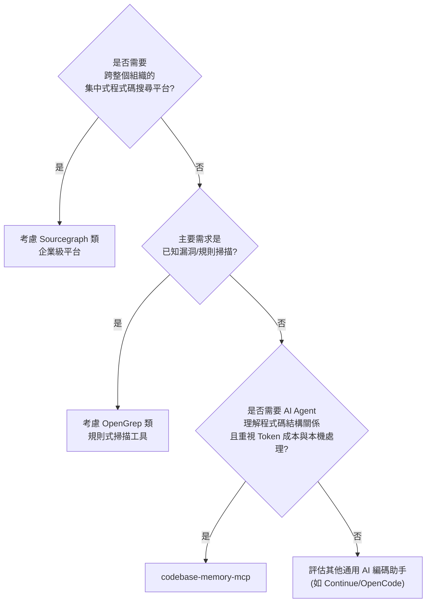

> 💡 **實務案例**：多數企業實務上並非「二選一」，而是**組合使用**——例如：用 Sourcegraph 做跨組織的程式碼搜尋與合規盤點，用 codebase-memory-mcp 作為 AI Coding Agent 的結構理解後端，用 OpenGrep/SonarQube 做安全與品質規則掃描，三者各司其職、互不取代。

## 20.6 專案活躍度與成熟度

選型決策除了功能比較，也應評估開源專案本身的**社群活躍度與成熟度**，這直接影響長期維護風險。以下為查證當下的概況：

| 指標 | 數值 | 解讀 |
|---|---|---|
| GitHub Star | 約 14.4k | 社群關注度高，相對小型專案而言已具一定知名度 |
| 累積 Release 數 | 35 個 | 版本迭代頻繁，功能演進速度快 |
| 開放中 Issue | 約 103 個 | 仍在積極處理使用者回報，但也代表存在一定量的已知問題（呼應第 18.8 節） |
| 開放中 PR | 約 40 個 | 社群貢獻活躍 |
| 版本號 | v0.x 系列 | **尚未到達 1.0**，依語意化版本慣例，API／工具介面仍可能有非相容變更，企業導入應留意版本升級的相容性測試 |
| 主要實作語言 | C（約 88%）、C++（約 11%） | 效能導向的底層實作，與「單一靜態執行檔、極致效能」的設計目標一致 |

> ⚠️ **風險揭露**：版本號停留在 0.x 系列，意味著官方尚未宣告 API／工具介面穩定；部分功能（如 Windows 路徑增強器、`ingest_traces`）仍不成熟（見第 18.8 節、第 7.14 節）。企業導入時建議：① 將工具版本鎖定在已驗證過的特定版本，不自動跟隨最新版；② 升級前先在非生產環境驗證；③ 將「功能邊界快速變動」本身列為第 22.3 節風險表的常態項目，而非一次性風險。

### ✅ 第 20 章 Checklist

- [ ] 已理解 codebase-memory-mcp 與比較對象的核心定位差異（結構分析後端 vs. 搜尋平台 vs. 規則掃描）
- [ ] 選型決策已基於實際 POC 測試結果，而非僅憑公開資訊比較
- [ ] 已評估是否需要「組合使用」多個工具而非單一工具取代所有需求
- [ ] 已將比較表中標註的資料時效性限制傳達給決策關係人
- [ ] 已將「版本仍在 0.x 系列」的成熟度現況納入導入風險評估，並訂定版本鎖定與升級驗證流程

---

# 第 21 章 實戰 Prompt 範本

本章提供 12 種常見場景的實戰 Prompt 範本，皆已內建「引導模型優先使用 codebase-memory-mcp 工具」的設計原則（呼應第 14.1 節 Prompt Engineering 最佳實務）。

## 21.1 系統分析 Prompt

```text
請對這個專案進行系統分析：
1. 先呼叫 get_architecture 取得語言分佈、套件結構、API 路由與複雜度熱點
2. 針對複雜度熱點（degree 最高的前 5 個節點），分別說明其角色與重要性
3. 總結這個系統的整體架構風格（單體/微服務/分層架構等）
4. 以結構化清單方式輸出，不要只憑檔名臆測，所有結論需附上對應的查詢依據
```

## 21.2 架構分析 Prompt

```text
請分析這個專案是否遵守 Clean Architecture 的依賴方向原則：
1. 用 query_graph 找出 domain 套件是否有任何 IMPORTS 指向 infrastructure 套件
2. 用 query_graph 找出 application 套件是否有任何 IMPORTS 指向 presentation 套件
3. 列出所有違規項目（檔案、違規的 import 對象）
4. 針對每個違規項目，評估修正的影響範圍（trace_path 確認上游依賴數）
```

## 21.3 Dependency 分析 Prompt

```text
請分析 [模組名稱] 對外部資源的依賴情況：
1. 用 query_graph 找出該模組所有 WRITES 與 USES_TYPE 邊
2. 統計被寫入次數最高的資料表/外部資源
3. 找出該模組 IMPORTS 了哪些第三方套件，並標註版本資訊（如可從設定檔取得）
4. 輸出依賴關係的優先風險排序，以「被多少其他模組依賴」與「依賴的外部資源數量」雙指標排序
```

## 21.4 Framework 升級 Prompt

```text
我們計畫將這個專案從 [舊框架/版本] 升級到 [新框架/版本]，請協助評估：
1. 用 search_code 或 query_graph 找出所有使用舊框架特定 API/命名空間的程式碼位置
2. 對每個受影響檔案，用 trace_path 計算上游依賴數，作為風險分級依據
3. 將結果分為「高風險（需完整回歸測試）」「中風險（需單元測試）」「低風險（可自動化批次處理）」
4. 提出建議的升級順序與里程碑劃分
```

## 21.5 Legacy System Reverse Engineering Prompt

```text
這是一個沒有完整文件的 Legacy 系統（[技術棧描述，如 Struts 1.x + EJB 2.1 + JSP]），請協助逆向工程：
1. 先用 get_architecture 確認偵測到的框架與整體語言分佈
2. 用 search_graph 找出 degree 最高的前 10 個類別/方法（潛在的核心控制器）
3. 對每個核心節點，用 trace_path 還原完整呼叫鏈（含資料庫 WRITES 邊）
4. 整理成一份「系統運作說明書」草稿，包含主要業務流程的呼叫鏈圖
```

## 21.6 API 分析 Prompt

```text
請比對前端與後端的 API 契約是否一致：
1. 用 search_graph 取得前端所有 API 呼叫定義（file_pattern 限定 src/api/** 或對應目錄）
2. 用 get_architecture 取得後端所有 Route 清單
3. 列出「前端呼叫但後端無對應 Route」與「後端有 Route 但前端未使用」兩類落差
4. 針對落差項目，標註可能的拼字錯誤或版本不一致線索
```

## 21.7 Security Review Prompt

```text
請協助初步安全審查，聚焦在外部輸入可達的高風險路徑：
1. 用 get_architecture 取得所有 Route 清單（這些是外部輸入的進入點）
2. 對每個 Route，用 trace_path 展開完整呼叫鏈
3. 用 search_code 在呼叫鏈涵蓋的檔案中搜尋常見風險模式
   （如字串拼接 SQL、未過濾的檔案路徑操作、反序列化呼叫）
4. 輸出「外部可控輸入 + 高風險操作」交集的清單，供進一步用專業 SAST 工具深入掃描
   （請註明此結果僅為範圍縮減參考，非完整安全審查結論）
```

## 21.8 Performance Review Prompt

```text
請協助分析這個 API 的潛在效能瓶頸：
1. 用 trace_path 展開 [API 路由] 的完整呼叫鏈
2. 用 search_graph 找出呼叫鏈中 degree（扇出）異常高的方法
3. 用 get_code_snippet 檢視這些方法的原始碼，確認是否有迴圈內資料庫查詢
   （N+1 查詢模式）或缺乏快取的重複計算
4. 提出具體優化建議，並說明每項建議對應的程式碼位置
```

## 21.9 Refactoring Prompt

```text
請協助評估 [類別/方法名稱] 的重構方案：
1. 用 get_code_snippet 取得目前原始碼
2. 用 trace_path(direction="callers") 確認所有呼叫者，評估修改簽章的相容性風險
3. 用 trace_path(direction="callees") 確認內部依賴，評估拆分的合理邊界
4. 提出重構方案，並說明重構後需要同步更新的呼叫端清單
```

## 21.10 Unit Test Prompt

```text
請協助為 [函式/方法名稱] 撰寫單元測試：
1. 用 get_code_snippet 取得目標方法原始碼
2. 用 trace_path(direction="callees") 確認需要 Mock 的外部依賴
   （Repository、外部 Service Client 等）
3. 用 search_graph 找出同模組既有測試檔案，確認專案慣用的測試框架與命名風格
4. 產出涵蓋正常路徑、邊界條件、異常路徑的測試案例
```

## 21.11 Integration Test Prompt

```text
請協助設計 [業務流程，如「下單到付款」] 的整合測試：
1. 用 trace_path 取得該流程入口 API 的完整跨模組/跨服務呼叫鏈
2. 依呼叫鏈識別需要的測試替身（資料庫、訊息佇列、快取等 Testcontainers 設定）
3. 列出每個關鍵節點應驗證的斷言項目
4. 產出整合測試骨架程式碼
```

## 21.12 SSDLC Prompt

```text
請協助將 codebase-memory-mcp 的影響分析整合進本專案的 SSDLC（安全軟體開發生命週期）流程：
1. 說明在「需求分析」階段如何用 get_architecture 評估新功能對既有架構的衝擊面
2. 說明在「設計」階段如何用 query_graph 驗證設計是否符合既定的架構治理規則
   （如分層依賴方向）
3. 說明在「實作」階段如何用 detect_changes 自動產出 PR 影響範圍摘要
4. 說明在「測試」階段如何依呼叫鏈深度決定回歸測試覆蓋範圍
5. 說明在「維運」階段如何用 manage_adr 持續累積架構決策紀錄
請以本專案實際技術棧為例，產出具體可執行的 SSDLC 整合步驟，並標註對應到 SSDLC 哪個階段。
```

### ✅ 第 21 章 Checklist

- [ ] 已將本章 Prompt 範本依團隊實際技術棧調整並納入內部 Prompt 範本庫
- [ ] 所有範本皆已內建「要求模型附上查詢依據」的設計，降低幻覺風險
- [ ] 安全審查類 Prompt 已明確標註「範圍縮減參考」而非完整安全結論，避免誤用
- [ ] SSDLC 範本已對應到實際五階段流程並指派負責角色

---

# 第 22 章 結論

## 22.1 導入效益

codebase-memory-mcp 為「AI Coding Agent 理解超大型程式碼庫」這個長期痛點，提供了一個**零依賴、本機處理、效益可量化**的解決方案。綜整本手冊各章節，核心效益可歸納為四點：

1. **Token 成本大幅下降**：保守估計（論文 31 個真實 repo 平均值）約 10 倍，最佳情境（官方單一場景測試）可達 99% 降幅
2. **理解深度提升**：從「文字比對」躍升至「語意結構關係」，特別在跨服務、跨檔案的架構理解上效益顯著
3. **知識可持久化、可傳承**：圖譜快照讓「系統理解」這項過去依賴特定人員腦中記憶的無形資產，變成可版控、可交接的具體產出
4. **零基礎設施負擔**：單一靜態執行檔、SQLite 落地，不需要額外的伺服器維運投入

## 22.2 ROI 評估框架

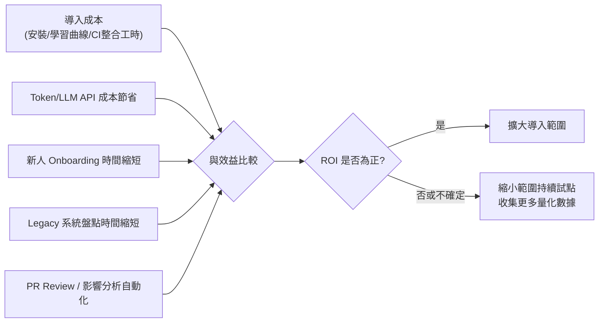

> ⚠️ ROI 評估務必基於團隊**實際查詢類型分佈**做試算（呼應 13.4 節），單純套用官方最佳情境數據容易高估效益，反而在後續向管理層報告實際成果時產生落差。

## 22.3 風險

| 風險項目 | 說明與緩解方式 |
|---|---|
| 過度依賴圖譜，忽略動態行為 | 靜態分析無法 100% 還原反射、動態路由等執行期行為；`ingest_traces` 目前仍為實驗性／Stub 功能（見 7.14 節），現階段務必以人工複核關鍵路徑為主，不可假設動態行為已被自動校正 |
| 圖譜與實際程式碼產生落差 | 需建立明確的 Reindex SOP 與監控告警（第 16 章），避免 AI Agent 依賴過時資訊做出錯誤建議 |
| 團隊過度信任「結構正確」等同「邏輯正確」 | 圖譜驗證的是結構關係（如分層依賴方向），不驗證業務邏輯正確性，兩者需求不同的驗證手段 |
| 供應鏈安全風險 | 安裝與更新流程務必校驗官方提供的 SHA-256 checksum 與簽章，CI 環境建議改用內部 Artifact Repository（詳見第 18.8 節安全機制） |
| 工具版本快速迭代帶來的學習成本 | 建立內部知識庫（如本手冊）並指定維護負責人，隨官方版本更新同步檢視內容；版本仍在 0.x 系列，部分功能邊界尚在變動（見第 20.6 節） |

## 22.4 建議導入策略

1. **由小到大**：先在 1～2 個代表性專案試點，避免一次性全公司導入帶來的變革阻力與風險
2. **量化先行**：試點前明確定義可量化的成功指標（Token 節省幅度、Onboarding 時間、PR Review 耗時）
3. **與既有工具整合，而非取代**：搭配 SonarQube、SAST、Sourcegraph 等既有工具治理體系協同運作，發揮第 20 章所述的互補效益
4. **建立內部 SOP 與知識庫**：維運（備份/監控/Reindex）、故障排除、Prompt 範本三項內容應沉澱為團隊內部文件，降低關鍵人員依賴
5. **持續關注官方版本演進**：作為相對年輕的開源專案，工具本身的功能邊界（如 Hybrid LSP 語言覆蓋率、路由偵測規則）仍在快速擴展中，建議指派專人定期檢視 Release Notes

## 22.5 未來發展趨勢

- **語意理解持續深化**：Hybrid LSP 對更多語言的完整型別解析支援，將進一步提升查詢準確度
- **執行期資料融合**：`ingest_traces` 機制的成熟，預期會讓「靜態圖譜 + 動態追蹤」的混合模式成為微服務架構理解的標準作法
- **多 Agent 協作的共享記憶層**：隨著 Multi-Agent 開發模式普及，知識圖譜作為多個 Agent 共享的「世界模型」這一定位（14.6 節）預期會更受重視
- **與可觀測性平台的深度整合**：架構理解（靜態結構）與可觀測性（動態行為）兩個過去分離的領域，透過 MCP 協定與知識圖譜逐漸產生交集，是值得持續關注的技術方向

> 📌 **結語**：知識圖譜不是要取代工程師對程式碼的理解，而是把「建立理解」這件耗時又難以傳承的工作，轉換成一份可查詢、可版控、可持續累積的結構化資產——這正是 AI 時代軟體工程「知識管理」應有的樣貌。

### ✅ 第 22 章 Checklist

- [ ] 已完成內部 ROI 評估，並基於實際查詢類型分佈而非最佳情境數據
- [ ] 已識別並建立五項風險的緩解機制
- [ ] 已制定由小到大的導入策略與量化成功指標
- [ ] 已指派專人持續關注官方版本演進與 Release Notes

---

# 附錄：全書 Checklist 總覽

| 章節 | Checklist 重點 |
|---|---|
| 第 1 章 概述 | 確認適用情境、理解 Token 節省原理與數據前提 |
| 第 2 章 核心架構 | 理解 Node/Edge/Tree-sitter/Hybrid LSP 分工 |
| 第 3 章 系統架構圖 | 掌握整體資料流與索引/查詢流程 |
| 第 4 章 安裝指南 | 完成各平台安裝驗證、建立 checksum 校驗流程 |
| 第 5 章 MCP 整合 | 完成 Agent 設定、區分唯讀/寫入工具權限 |
| 第 6 章 建立知識圖譜 | 完成首次索引、建立增量/Rebuild SOP |
| 第 7 章 MCP Tool 詳解 | 熟悉 14 個工具定位與選用速查表，留意 `ingest_traces` 為實驗性／Stub |
| 第 8 章 Claude Code 實戰 | 各架構風格（微服務/單體/Clean/DDD/六角）的查詢手法 |
| 第 9 章 Copilot 實戰 | Code Review/重構/測試/安全/效能六大場景應用 |
| 第 10 章 Web App 實戰 | 前後端契約比對、資料表寫入扇出盤點 |
| 第 11 章 Legacy 逆向工程 | 還原 Call Graph/Batch Flow/Database Flow |
| 第 12 章 Framework 升級 | Impact/Dependency/Risk 三層分級機制 |
| 第 13 章 Token 最佳化 | 基於實際查詢分佈的合理 ROI 試算 |
| 第 14 章 AI 開發最佳實務 | Prompt/Context/MCP/Loop Engineering 整合 |
| 第 15 章 DevSecOps 整合 | CI/CD 自動化影響分析、內部 Artifact 部署 |
| 第 16 章 系統維運 | 備份/復原/Reindex SOP、監控告警建立 |
| 第 17 章 效能調校 | .cbmignore/Worker/查詢 LIMIT 等調校項目 |
| 第 18 章 故障排除 | 57 個常見問題的對應解決方案，含已知限制與實驗性功能警語 |
| 第 19 章 企業導入 | 依產業特性調整導入優先順序與路線圖 |
| 第 20 章 工具比較 | 理解互補定位、基於 POC 而非公開資訊決策、納入專案活躍度與成熟度評估 |
| 第 21 章 Prompt 範本 | 12 種場景範本納入內部範本庫 |
| 第 22 章 結論 | ROI/風險/導入策略/未來趨勢的管理層溝通材料 |

---

# 參考資料

- [DeusData/codebase-memory-mcp — GitHub Repository](https://github.com/DeusData/codebase-memory-mcp)
- [codebase-memory-mcp — 官方文件網站](https://deusdata.github.io/codebase-memory-mcp/)
- [DeusData/codebase-memory-mcp — Releases](https://github.com/DeusData/codebase-memory-mcp/releases)
- [DeusData/codebase-memory-mcp — README.md](https://github.com/DeusData/codebase-memory-mcp/blob/main/README.md)
- [DeusData/codebase-memory-mcp — Issues](https://github.com/DeusData/codebase-memory-mcp/issues)
- [DeusData/codebase-memory-mcp — SECURITY.md](https://github.com/DeusData/codebase-memory-mcp/blob/main/SECURITY.md)
- [Codebase-Memory: Tree-Sitter-Based Knowledge Graphs for LLM Code Exploration via MCP（arXiv:2603.27277）](https://arxiv.org/html/2603.27277v1)
- [Model Context Protocol 官方規範](https://modelcontextprotocol.io/)
- [codebase-memory-mcp: Giving Claude Code (and Codex) a Map](https://www.russ.cloud/2026/05/10/codebase-memory-mcp-giving-claude-code-and-codex-a-map/)
- [How I Cut My AI Coding Agent's Token Usage by 120x With a Code Knowledge Graph — DEV Community](https://dev.to/deusdata/how-i-cut-my-ai-coding-agents-token-usage-by-120x-with-a-code-knowledge-graph-4a3d)

> 📌 **數據來源對照說明**：第 1.5 節「412,000 → 3,400 token、降幅 99.2%」與第 13.3 節數據出自 russ.cloud 文章中對五個代表性結構性查詢的單次基準測試；dev.to 文章標題的「120x」（精確值約 121x）是同一組基準測試的整體平均倍數，個別查詢倍數區間約 67x（架構總覽類查詢）至 225x（依模式查找函式類查詢）；論文 arXiv:2603.27277 的「31 個 repo、10 倍 Token 節省、2.1 倍工具呼叫減少、83% 答案品質」則是另一組獨立、規模更大的平均評測。三組數據情境不同但方向一致，企業溝通建議以論文的「10 倍」作保守基準，russ.cloud／dev.to 的「99%／120x」作最佳情境參考，避免混用造成誤解（呼應第 1.5 節與第 13.3 節說明）。
>
> 📌 本手冊所有指令範例、設定檔格式、效能數據均以撰寫當下（2026 年 6 月，對應官方 v0.8.1）官方公開資訊為準，工具版本快速迭代，使用前請以官方最新文件為最終依據。

