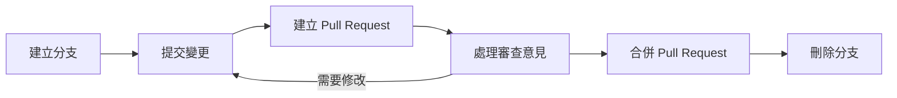
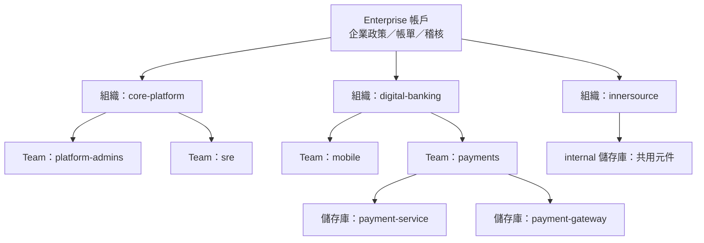
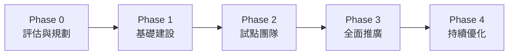

+++
date = '2025-10-31T00:00:00+08:00'
draft = false
title = 'github使用教學'
tags = ['教學', '工具', 'GitHub']
categories = ['教學']
+++

# GitHub 使用教學手冊

| 項目 | 內容 |
| --- | --- |
| **文件版本** | 3.0 |
| **最後更新** | 2026 年 9 月 29 日 |
| **查證基準** | docs.github.com（Get started 文件樹與各產品文件）、GitHub Changelog（2026 年 1–9 月）；Git 2.56.0／Git for Windows 2.56.0、GitHub CLI 2.101.0、Git LFS 3.8.0、GitHub Desktop 3.6.6、VS Code 1.139 |
| **適用平台** | GitHub.com（Free／Pro／Team／Enterprise Cloud），GitHub Enterprise Cloud with data residency（GHE.com）；GitHub Enterprise Server 3.20–3.22 可參考但功能以各版本文件為準 |
| **適用對象** | 新進開發同仁、團隊協作開發者、Tech Lead、DevOps／平台工程、資安與稽核人員 |
| **文件定位** | 企業標準技術白皮書／內部 GitHub 標準教材 |
| **姊妹文件** | [git使用教學](../git使用教學/)（Git 指令與內部原理深入說明） |
| **文件維護** | 專案開發團隊 |
| **Created by** | Eric Cheng |

> ⚠️ **v3.0 重大改版說明**：本版以 2026-09-29 的 GitHub 官方文件與 Changelog 為基準逐章查證改寫。v2.1 內容中程式碼區塊註解被誤轉為標題（`###`）、指令內 URL 被加上角括號、已退場的 Projects (classic) 自動化、不存在的 `pull_request` 事件類型 `merged`、虛構的分支保護／環境 YAML、Dependabot 已移除的 `reviewers` 選項、全面過時的 Actions 版本（Node 20 已於 2026-09-23 停用）、以明文 `credential.helper store` 儲存權杖、已停止服務的學習資源等均已更正；並新增帳號與方案、存取權限、GitHub Advanced Security 產品線、官方入門路徑、Commit 簽署、Rulesets、Merge queue、Codespaces、Packages、Pages、Writing on GitHub、Actions 供應鏈安全與**企業治理與導入藍圖**等章節。完整更正清單請見[附錄 B：版本更新紀錄](#附錄-b版本更新紀錄)，查證來源請見[附錄 C：查證紀錄](#附錄-c查證紀錄)。

<!-- TOC-AUTO-BEGIN -->

## 目錄

- [執行摘要](#執行摘要)
- [1. Git/GitHub 基礎概念](#1-gitgithub-基礎概念)
  - [1.1 什麼是 Git？](#11-什麼是-git)
  - [1.2 什麼是 GitHub？](#12-什麼是-github)
  - [1.3 為何要使用？](#13-為何要使用)
  - [1.4 版本控制的重要性](#14-版本控制的重要性)
  - [1.5 團隊開發的挑戰](#15-團隊開發的挑戰)
  - [1.6 Git 的解決方案](#16-git-的解決方案)
  - [1.7 GitHub 的附加價值](#17-github-的附加價值)
  - [1.8 帳號類型與方案](#18-帳號類型與方案)
  - [1.9 存取權限模型](#19-存取權限模型)
  - [1.10 GitHub Advanced Security 產品線](#110-github-advanced-security-產品線)
  - [1.11 官方入門學習路徑](#111-官方入門學習路徑)
  - [1.12 💡 本章實務建議](#112--本章實務建議)
- [2. 環境設定](#2-環境設定)
  - [2.1 安裝 Git](#21-安裝-git)
  - [2.2 設定個人資訊](#22-設定個人資訊)
  - [2.3 GitHub 帳號設定](#23-github-帳號設定)
  - [2.4 Personal Access Token 設定（替代方案）](#24-personal-access-token-設定替代方案)
  - [2.5 Git 效能優化設定](#25-git-效能優化設定)
  - [2.6 Commit 簽署設定](#26-commit-簽署設定)
  - [2.7 受限網路與連線疑難排解](#27-受限網路與連線疑難排解)
  - [2.8 💡 本章實務建議](#28--本章實務建議)
- [3. 基本操作流程](#3-基本操作流程)
  - [3.1 Clone 專案](#31-clone-專案)
  - [3.2 建立 Feature Branch](#32-建立-feature-branch)
  - [3.3 Commit Message 撰寫規範](#33-commit-message-撰寫規範)
  - [3.4 Push 到 Remote](#34-push-到-remote)
  - [3.5 建立 Pull Request (PR)](#35-建立-pull-request-pr)
  - [3.6 Code Review 流程](#36-code-review-流程)
  - [3.7 Merge 規範](#37-merge-規範)
  - [3.8 GitHub flow 官方流程](#38-github-flow-官方流程)
  - [3.9 💡 本章實務建議](#39--本章實務建議)
- [4. Git 進階操作](#4-git-進階操作)
  - [4.1 Interactive Rebase](#41-interactive-rebase)
  - [4.2 Cherry-pick 操作](#42-cherry-pick-操作)
  - [4.3 Git Bisect 除錯](#43-git-bisect-除錯)
  - [4.4 Stash 暫存操作](#44-stash-暫存操作)
  - [4.5 Submodule 子模組管理](#45-submodule-子模組管理)
  - [4.6 Git Hooks 自動化](#46-git-hooks-自動化)
  - [4.7 大型檔案處理 (LFS)](#47-大型檔案處理-lfs)
  - [4.8 💡 本章實務建議](#48--本章實務建議)
- [5. 日常工作流程建議](#5-日常工作流程建議)
  - [5.1 每日工作開始前](#51-每日工作開始前)
  - [5.2 避免衝突的最佳實務](#52-避免衝突的最佳實務)
  - [5.3 分支管理策略](#53-分支管理策略)
  - [5.4 工作流程檢查清單](#54-工作流程檢查清單)
  - [5.5 團隊協作最佳實務](#55-團隊協作最佳實務)
  - [5.6 💡 本章實務建議](#56--本章實務建議)
- [6. 常見錯誤與解決方式](#6-常見錯誤與解決方式)
  - [6.1 Merge Conflict（合併衝突）](#61-merge-conflict合併衝突)
  - [6.2 錯誤的 Commit](#62-錯誤的-commit)
  - [6.3 誤刪檔案恢復](#63-誤刪檔案恢復)
  - [6.4 Push 被拒絕](#64-push-被拒絕)
  - [6.5 忘記切換分支](#65-忘記切換分支)
  - [6.6 Git 狀態混亂](#66-git-狀態混亂)
  - [6.7 效能問題排除](#67-效能問題排除)
  - [6.8 網路連線問題](#68-網路連線問題)
  - [6.9 💡 本章實務建議](#69--本章實務建議)
- [7. 專案專屬規範](#7-專案專屬規範)
  - [7.1 分支命名規則](#71-分支命名規則)
  - [7.2 Commit Message 標準](#72-commit-message-標準)
  - [7.3 Pull Request 規範](#73-pull-request-規範)
  - [7.4 Code Review 標準](#74-code-review-標準)
  - [7.5 分支保護規則](#75-分支保護規則)
  - [7.6 儲存庫標準檔案](#76-儲存庫標準檔案)
  - [7.7 💡 本章實務建議](#77--本章實務建議)
- [8. GitHub 進階功能與協作工具](#8-github-進階功能與協作工具)
  - [8.1 Issue 管理](#81-issue-管理)
  - [8.2 Project 專案管理](#82-project-專案管理)
  - [8.3 Wiki 文件系統](#83-wiki-文件系統)
  - [8.4 Releases 版本發布](#84-releases-版本發布)
  - [8.5 Discussions 社群討論](#85-discussions-社群討論)
  - [8.6 Security 安全功能](#86-security-安全功能)
  - [8.7 GitHub CLI 進階應用](#87-github-cli-進階應用)
  - [8.8 GitHub Apps 與整合](#88-github-apps-與整合)
  - [8.9 GitHub Copilot 整合](#89-github-copilot-整合)
  - [8.10 GitHub Codespaces 雲端開發環境](#810-github-codespaces-雲端開發環境)
  - [8.11 GitHub Packages 與 Container Registry](#811-github-packages-與-container-registry)
  - [8.12 GitHub Pages 靜態網站](#812-github-pages-靜態網站)
  - [8.13 Writing on GitHub：Markdown 與格式化](#813-writing-on-githubmarkdown-與格式化)
  - [8.14 💡 本章實務建議](#814--本章實務建議)
- [9. CI/CD 持續整合與部署](#9-cicd-持續整合與部署)
  - [9.1 CI/CD 基礎概念](#91-cicd-基礎概念)
  - [9.2 工作流程設定](#92-工作流程設定)
  - [9.3 進階 CI 配置](#93-進階-ci-配置)
  - [9.4 持續部署 (CD)](#94-持續部署-cd)
  - [9.5 分支保護與自動化](#95-分支保護與自動化)
  - [9.6 監控與通知](#96-監控與通知)
  - [9.7 Secrets 與環境變數管理](#97-secrets-與環境變數管理)
  - [9.8 最佳實務與注意事項](#98-最佳實務與注意事項)
  - [9.9 💡 本章實務建議](#99--本章實務建議)
- [10. 安全最佳實務](#10-安全最佳實務)
  - [10.1 認證與授權](#101-認證與授權)
  - [10.2 機密資訊管理](#102-機密資訊管理)
  - [10.3 程式碼安全掃描](#103-程式碼安全掃描)
  - [10.4 依賴套件安全](#104-依賴套件安全)
  - [10.5 分支保護規則](#105-分支保護規則)
  - [10.6 審計與監控](#106-審計與監控)
  - [10.7 💡 本章實務建議](#107--本章實務建議)
- [11. VS Code Git 整合深度應用](#11-vs-code-git-整合深度應用)
  - [11.1 Source Control 面板詳解](#111-source-control-面板詳解)
  - [11.2 Git Graph 擴充功能](#112-git-graph-擴充功能)
  - [11.3 GitLens 進階功能](#113-gitlens-進階功能)
  - [11.4 Merge Conflict 解決工具](#114-merge-conflict-解決工具)
  - [11.5 自動化工作流程設定](#115-自動化工作流程設定)
  - [11.6 💡 本章實務建議](#116--本章實務建議)
- [12. 常用指令清單](#12-常用指令清單)
  - [12.1 基本指令](#121-基本指令)
  - [12.2 分支操作](#122-分支操作)
  - [12.3 提交操作](#123-提交操作)
  - [12.4 同步操作](#124-同步操作)
  - [12.5 檢查與比較](#125-檢查與比較)
  - [12.6 復原操作](#126-復原操作)
  - [12.7 進階操作指令](#127-進階操作指令)
  - [12.8 CI/CD 相關指令](#128-cicd-相關指令)
  - [12.9 💡 本章實務建議](#129--本章實務建議)
- [13. 檢查清單](#13-檢查清單)
  - [13.1 新進員工設定檢查清單](#131-新進員工設定檢查清單)
  - [13.2 日常開發檢查清單](#132-日常開發檢查清單)
  - [13.3 Code Review 檢查清單](#133-code-review-檢查清單)
  - [13.4 合併前檢查清單](#134-合併前檢查清單)
  - [13.5 CI/CD 檢查清單](#135-cicd-檢查清單)
  - [13.6 GitHub 功能使用檢查清單](#136-github-功能使用檢查清單)
  - [13.7 緊急情況檢查清單](#137-緊急情況檢查清單)
  - [13.8 安全檢查清單](#138-安全檢查清單)
  - [13.9 企業導入檢查清單](#139-企業導入檢查清單)
- [14. 疑難排解與支援](#14-疑難排解與支援)
  - [14.1 常見問題 FAQ](#141-常見問題-faq)
  - [14.2 效能優化指南](#142-效能優化指南)
  - [14.3 技術支援聯絡方式](#143-技術支援聯絡方式)
  - [14.4 學習資源推薦](#144-學習資源推薦)
  - [14.5 💡 本章實務建議](#145--本章實務建議)
- [15. 企業治理與導入藍圖](#15-企業治理與導入藍圖)
  - [15.1 企業帳戶架構](#151-企業帳戶架構)
  - [15.2 身分管理：EMU 與 SAML SSO](#152-身分管理emu-與-saml-sso)
  - [15.3 政策層級與繼承](#153-政策層級與繼承)
  - [15.4 儲存庫治理：Rulesets 與 Custom properties](#154-儲存庫治理rulesets-與-custom-properties)
  - [15.5 稽核、合規與資料落地](#155-稽核合規與資料落地)
  - [15.6 成本管理](#156-成本管理)
  - [15.7 分階段導入路線圖](#157-分階段導入路線圖)
  - [15.8 成熟度評估](#158-成熟度評估)
  - [15.9 💡 本章實務建議](#159--本章實務建議)
- [結語](#結語)
  - [學習成效評估](#學習成效評估)
  - [支援與回饋](#支援與回饋)
- [附錄 A：詞彙表](#附錄-a詞彙表)
- [附錄 B：版本更新紀錄](#附錄-b版本更新紀錄)
  - [B.1 版本歷程](#b1-版本歷程)
  - [B.2 v2.1 → v3.0 更正表](#b2-v21--v30-更正表)
  - [B.3 v3.0 新增章節](#b3-v30-新增章節)
  - [B.4 v2.x 更新內容回顧](#b4-v2x-更新內容回顧)
- [附錄 C：查證紀錄](#附錄-c查證紀錄)
  - [C.1 待確認事項](#c1-待確認事項)
- [附錄 D：參考資料](#附錄-d參考資料)
  - [D.1 GitHub 官方文件](#d1-github-官方文件)
  - [D.2 平台動態與工具](#d2-平台動態與工具)
  - [D.3 規範與延伸閱讀](#d3-規範與延伸閱讀)

<!-- TOC-AUTO-END -->

## 執行摘要

GitHub 已從「Git 程式碼託管服務」演進為涵蓋**規劃、撰寫、審查、測試、部署、營運**整個軟體開發生命週期（SDLC）的平台。對企業而言，導入 GitHub 的關鍵不在於學會按鈕位置，而在於建立一致的**身分與存取控制、協作流程、自動化品質閘門、供應鏈安全與稽核治理**。本手冊將 GitHub 的使用分為四個層次：

| 層次 | 目標 | 對應章節 |
| --- | --- | --- |
| **平台認識與個人設定** | 理解帳號／方案／權限模型，完成安全的身分驗證與本機環境設定 | 第 1–2 章 |
| **日常協作** | GitHub flow、分支與 Commit 規範、Pull Request、Code Review、合併策略 | 第 3–7 章 |
| **平台功能與自動化** | Issues、Projects、Releases、Codespaces、Packages、GitHub Actions CI/CD | 第 8–9、11 章 |
| **安全與企業治理** | 帳號安全、秘密防護、程式碼掃描、Rulesets、稽核、企業政策與導入藍圖 | 第 10、13–15 章 |

**本版六大重點建議：**

1. **以 Rulesets 取代傳統分支保護**：Rulesets 可疊加、可先以「Evaluate」模式試行，且可由具讀取權限者檢視；GitHub 已提供一鍵「Convert to ruleset」（2026-08）。見 [10.5](#105-分支保護規則)。
2. **身分驗證全面升級**：GitHub.com 貢獻者已強制 2FA；建議以 TOTP 為主、passkey／安全金鑰為備援；HTTPS 使用 Git Credential Manager 或 `gh auth login`，權杖改用 fine-grained PAT 並設定期限。見 [2.3](#23-github-帳號設定)、[2.4](#24-personal-access-token-設定替代方案)。
3. **Actions 供應鏈安全**：第三方 Action 一律以完整 commit SHA 釘選（2026-03 Trivy 事件中 76 個版本標籤遭改寫），`GITHUB_TOKEN` 權限最小化，雲端部署改用 OIDC；Node 20 已停用，請升級至支援 Node 24 的 Action 版本。見 [9.8](#98-最佳實務與注意事項)。
4. **秘密零落地**：啟用 Secret scanning 與 Push protection，並以 Ruleset「Require secret scanning alerts are resolved」阻擋含秘密的 PR 合併（2026-09）。見 [10.2](#102-機密資訊管理)。
5. **以 Merge queue 與自動合併穩定主幹**：高流量倉庫以 merge queue 避免「各自綠燈、合併後紅燈」，CI 必須監聽 `merge_group` 事件。見 [3.7](#37-merge-規範)。
6. **分階段企業導入**：依[第 15 章](#15-企業治理與導入藍圖)的路線圖，先完成身分（SSO／EMU）、組織結構與基準政策，再擴展 GHAS、Copilot 與稽核串流。

---

## 1. Git/GitHub 基礎概念

> 📌 **本章摘要**：說明 Git 與 GitHub 的分工、GitHub 在 SDLC 各階段提供的能力，以及企業導入前必須先釐清的帳號類型、方案、權限模型與 GitHub Advanced Security 產品線，最後提供對應官方「Get started」文件樹的學習路徑。

### 1.1 什麼是 Git？

Git 是一個**分散式版本控制系統**（Distributed Version Control System, DVCS），由 Linus Torvalds 於 2005 年為 Linux 核心開發而建立，目前由開源社群維護（本版基準 Git 2.56.0，2026-09-28 發布）。Git 幫助開發團隊：

- 追蹤程式碼的變更歷史（誰、何時、為何修改）
- 支援多人同時開發並安全地合併彼此的變更
- 以輕量分支隔離功能開發、修復與實驗
- 回復到任何歷史版本，或比對任意兩個版本的差異

> 💡 Git 的物件模型、`switch`／`restore` 指令、Git 3.0 升級準備等深入內容，請參考姊妹文件 [git使用教學](../git使用教學/)。

### 1.2 什麼是 GitHub？

> ⚠️ **v3.0 更正**：v2.1 將 GitHub 定義為「雲端程式碼託管平台」。依官方 [What is GitHub?](https://docs.github.com/en/get-started/start-your-journey/about-github-and-git) 最新定義，GitHub 是**支援整個軟體開發流程（從規劃工作到部署與營運軟體）的平台**。

GitHub 以開源的 Git 為基礎，將 Git 專案（稱為 **repository／儲存庫**）託管於雲端，並加上規劃、協作、自動化、安全與 AI 輔助工具。官方以 SDLC 六個階段說明 GitHub 的能力：

| SDLC 階段 | GitHub 提供的能力 | 代表功能 |
| --- | --- | --- |
| **Plan（規劃）** | 追蹤工作、設定里程碑、組織長期專案 | Issues、sub-issues、issue fields、Projects、Milestones |
| **Create（撰寫）** | 撰寫並儲存程式碼、安全開發新功能、建立清楚的變更時間軸 | Repositories、分支、Codespaces、GitHub Copilot |
| **Review（審查）** | 提出變更建議、與審查者討論、套用回饋 | Pull Requests、Code review、CODEOWNERS、Copilot code review |
| **Test（測試）** | 在合併前自動驗證每一個變更 | GitHub Actions、狀態檢查、Merge queue |
| **Deploy（部署）** | 以自動化部署流程與版本管理交付軟體 | Actions、Environments、Releases、Packages、Pages |
| **Operate（營運）** | 監控應用、管理相依套件、找出並修復安全問題 | Dependabot、Code scanning、Secret scanning、Security overview |

官方也強調：**不需要一次使用所有階段**。多數團隊從一個儲存庫與幾個 Issue 開始，再隨專案成長逐步擴大使用範圍。

### 1.3 為何要使用？

#### 🔍 版本控制的好處

- **追溯性**: 知道誰在什麼時候修改了什麼，以及為什麼（Commit 訊息與關聯 Issue／PR）
- **備份性**: 程式碼安全存放在雲端，每位開發者本機也有完整副本
- **協作性**: 多人可同時開發，透過 Pull Request 有序整合
- **實驗性**: 可建立分支測試新功能，不影響主幹

#### 💼 團隊協作優勢

- 統一的程式碼審查流程與可稽核的核准紀錄
- 清楚的變更歷史記錄，與 Issue、部署紀錄互相連結
- 自動化測試與安全掃描整合於 PR 流程
- 專案進度可視化（Projects 看板、表格、路線圖）

### 1.4 版本控制的重要性

版本控制系統是現代軟體開發不可或缺的工具：

- **歷史追蹤**: 完整記錄每次變更，可追溯任何時間點的程式碼狀態
- **協同合作**: 多人可同時在不同功能上開發，避免互相覆蓋
- **分支管理**: 可建立獨立分支進行實驗性開發，不影響主要程式碼
- **錯誤復原**: 當發現問題時，可快速回復到穩定版本
- **合規稽核**: 金融、醫療等受監管產業需證明「每一個上線變更都經過審查與測試」，版本控制與 PR 紀錄是最直接的證據

### 1.5 團隊開發的挑戰

沒有版本控制時，團隊開發會遇到許多問題：

- 💥 **程式碼衝突**: 多人同時修改同一檔案，容易互相覆蓋
- 📁 **版本混亂**: 資料夾堆滿 `專案_v1`, `專案_final`, `專案_final_真的最終版`
- ❓ **追蹤困難**: 不知道誰在什麼時候改了什麼，為什麼要改
- 🐛 **問題定位**: 當發現 bug 時，難以確定是哪次修改造成的
- 🔓 **權限失控**: 無法控管誰能修改正式環境程式碼，也無法證明變更經過審查

### 1.6 Git 的解決方案

Git 透過以下機制解決團隊開發挑戰：

#### 分散式架構

- 每個開發者都有完整的程式碼庫副本
- 不依賴中央伺服器即可進行版本控制
- 離線也能提交變更和查看歷史

#### 分支策略

- 輕量級分支，建立和切換快速
- 支援多種合併策略（merge、squash、rebase）
- 可並行開發多個功能

#### 變更追蹤

- 每次提交都有唯一識別碼（目前為 SHA-1；Git 3.0 規劃改以 SHA-256 作為新儲存庫預設，GitHub 平台支援時程待官方公布）
- 記錄誰、何時、為何做了變更
- 可輕鬆比較不同版本的差異

### 1.7 GitHub 的附加價值

GitHub 在 Git 基礎上提供了豐富的協作功能：

#### 協作工具

- **Pull Request**: 程式碼審查、討論與合併的單一入口
- **Issues**: 問題追蹤和任務管理（支援 sub-issues、issue types、issue fields、相依關係）
- **Projects**: 看板、表格、路線圖與階層檢視的專案管理
- **Discussions**: 問答與社群討論
- **Wiki**: 協作文件撰寫

#### 自動化功能

- **GitHub Actions**: CI/CD 與任何事件驅動的工作流程
- **Dependabot**: 相依套件弱點警示與自動更新 PR
- **Code scanning（CodeQL）**: 程式碼安全弱點掃描與 Copilot Autofix
- **Secret scanning**: 秘密外洩偵測與推送保護

#### AI 輔助

- **GitHub Copilot**: 程式碼補全、Chat、agent mode、cloud agent（可指派 Issue 由 Copilot 開 PR）、Copilot code review

#### 社群生態

- 開源專案託管與 Marketplace（Actions、Apps）
- 程式碼分享、Stars 與追蹤機制
- 開發者社群互動與 GitHub Certifications 認證

### 📝 實務案例

```text
情境：小明要修改登入功能
傳統方式：複製整個專案資料夾 → 容易混亂、無法審查、無法追溯
Git 方式：建立 feature/login-improvement 分支 → 清楚管理
GitHub 方式：分支 → Pull Request → CI 自動測試 → 同事審查 → 合併 → 自動部署
          全程留下可稽核紀錄，並與 Issue #123 互相連結
```

### 1.8 帳號類型與方案

> 🆕 **v3.0 新增**

#### 三種帳號類型

依官方 [Types of GitHub accounts](https://docs.github.com/en/get-started/learning-about-github/types-of-github-accounts)，GitHub 有三種帳號：

| 帳號類型 | 說明 | 企業使用重點 |
| --- | --- | --- |
| **使用者帳號（User account）** | 每個人登入 GitHub 的身分；分為**個人帳號（personal account）** 與**受管理使用者帳號（managed user account）** | 所有操作都歸屬於使用者帳號；自動化可使用 machine user，但建議優先改用 GitHub App |
| **組織帳號（Organization account）** | 多人共享的帳號，擁有儲存庫、套件、專案；無法直接登入 | 以 Teams 組織成員權限；單一組織最多擁有 100,000 個儲存庫 |
| **企業帳號（Enterprise account）** | GitHub Enterprise Cloud／Server 提供，集中管理多個組織的政策與帳單 | 啟用企業層級政策、稽核、SSO、Rulesets 與 Copilot 管理 |

**個人帳號 vs 受管理使用者帳號（Enterprise Managed Users, EMU）：**

- **個人帳號**：自行註冊，建議「一人一帳號」同時用於開源與公司工作；公司若啟用 SAML SSO，個人帳號會連結至公司 IdP 身分。
- **受管理使用者帳號**：由企業透過 IdP 建立與管理，只能存取企業內資源，**無法建立公開內容或貢獻企業外的儲存庫**，適合高度監管產業（詳見 [15.2](#152-身分管理emu-與-saml-sso)）。

#### GitHub 方案比較

| 方案 | 適用 | 重點功能（摘錄官方 [GitHub's plans](https://docs.github.com/en/get-started/learning-about-github/githubs-plans)） |
| --- | --- | --- |
| **GitHub Free（個人）** | 個人 | 無限公開／私有儲存庫；Dependabot alerts；2FA；Actions 每月 2,000 分鐘；Packages 500 MB；Codespaces 每月 120 core hours |
| **GitHub Pro** | 個人 | 私有儲存庫完整功能（必要審查者、保護分支、CODEOWNERS、Wiki、Pages）；Actions 3,000 分鐘；Packages 2 GB |
| **GitHub Free（組織）** | 小型團隊、開源組織 | Team 存取控制；Actions 2,000 分鐘；私有儲存庫功能受限 |
| **GitHub Team** | 中小型企業 | 私有儲存庫完整協作功能、Team reviewers、排程提醒、Security overview；**可加購 GitHub Secret Protection／Code Security 與 Code Quality** |
| **GitHub Enterprise Cloud（GHEC）** | 大型企業 | SAML SSO、SCIM、EMU、企業帳號、稽核串流、IP allow list、Rulesets 進階規則、internal 儲存庫、Actions 50,000 分鐘、Packages 50 GB、99.9% SLA、可選資料落地（GHE.com） |
| **GitHub Enterprise Server（GHES）** | 需自建機房者 | 自行部署與維運；功能依版本（本版參考 3.20–3.22） |

> 💡 **計費提醒（2026）**：GitHub-hosted runner 自 2026-01-01 起降價最高 39%；公開儲存庫使用標準 runner 與所有 self-hosted runner 目前**免費**（原訂 2026-03 對 self-hosted runner 收取平台費已延後）。Actions 詳細計費見 [9.8](#98-最佳實務與注意事項)。

### 1.9 存取權限模型

> 🆕 **v3.0 新增**

GitHub 以「**角色（role）= 一組權限（permission）**」控管存取。不同帳號類型的角色設計不同（官方 [Access permissions on GitHub](https://docs.github.com/en/get-started/learning-about-github/access-permissions-on-github)）：

| 範圍 | 角色 | 說明 |
| --- | --- | --- |
| **個人帳號的儲存庫** | Owner、Collaborator | 只有兩種層級，適合個人專案 |
| **組織** | Owner、Member、Billing manager、Security manager 等 | Owner 擁有完整管理權；可建立自訂組織角色（custom organization roles） |
| **組織儲存庫** | Read、Triage、Write、Maintain、Admin | 可透過 Team 批次授權，亦可建立自訂儲存庫角色（Enterprise Cloud） |
| **企業** | Enterprise owner、Billing manager 等 | 另可建立自訂企業角色（fine-grained permissions） |

**儲存庫角色建議對應：**

| 角色 | 能做什麼 | 建議對象 |
| --- | --- | --- |
| **Read** | 檢視、clone、開 Issue、留言 | 跨部門檢視者、稽核人員 |
| **Triage** | 管理 Issue／PR 標籤、指派，不能推送 | PM、QA、社群維護者 |
| **Write** | 推送分支、合併 PR（受規則限制） | 一般開發者 |
| **Maintain** | 管理儲存庫設定（不含危險操作） | Tech Lead |
| **Admin** | 完整權限含刪除、變更可見性、管理 Rulesets | 儲存庫負責人（人數應最小化） |

> ⚠️ **最小權限原則**：以 Team 而非個人授權；Admin 角色應有明確名單並每季審查（見 [13.9](#139-企業導入檢查清單)）。

### 1.10 GitHub Advanced Security 產品線

> 🆕 **v3.0 新增**

自 2025 年起，GitHub Advanced Security（GHAS）拆分為兩個可獨立購買的產品，且 **GitHub Team 方案也可購買**（官方 [About GitHub Advanced Security](https://docs.github.com/en/get-started/learning-about-github/about-github-advanced-security)）：

| 產品 | 包含功能 | 公開儲存庫 |
| --- | --- | --- |
| **GitHub Secret Protection** | Secret scanning、Push protection、自訂秘密樣式、委派繞過（delegated bypass）、秘密有效性檢查 | Secret scanning 與 push protection 預設可用 |
| **GitHub Code Security** | Code scanning（CodeQL）、Copilot Autofix、Dependency review、進階 Dependabot 功能、Security campaigns | Code scanning 可免費使用 |
| **GitHub Code Quality**（另購） | 程式碼品質與覆蓋率問題的偵測與修正建議 | — |

> 💡 自 2026-04 起，儲存庫／組織／企業的 **Security** 分頁已更名為 **Security & quality**，原「Vulnerability alerts」側欄改名為「Findings」；既有 URL 與 API 不變。

### 1.11 官方入門學習路徑

> 🆕 **v3.0 新增**

官方 [Get started](https://docs.github.com/en/get-started) 文件樹是新進人員最佳的系統化教材，建議依下列順序對照本手冊學習：

| 官方分類 | 主要內容 | 本手冊對應 |
| --- | --- | --- |
| **Start your journey** | What is GitHub、學習資源、建立儲存庫、規劃工作、連線到本機、撰寫與儲存程式碼、審查變更、自動部署網站 | 第 1、3、8 章 |
| **Onboarding** | 個人帳號、GitHub Team、Enterprise Cloud（含試用）、Enterprise Server 入門 | 第 1.8、15 章 |
| **Using GitHub** | Hello World、GitHub flow、連線工具、溝通方式、功能預覽、GitHub Mobile、受限網路、連線疑難 | 第 2.7、3 章 |
| **Learning about GitHub** | 方案、語言支援、帳號類型、存取權限、GHAS、詞彙表 | 第 1.8–1.10 章、附錄 A |
| **Learning to code** | 以 Copilot 學寫程式、Git 入門、安全儲存秘密、修復第一個弱點 | 第 8.9、10 章 |
| **Accessibility** | 主題設定、鍵盤快捷鍵、Command Palette | 第 14.1 章 |
| **Writing on GitHub** | Markdown 語法、表格、摺疊區塊、程式碼區塊、圖表、數學式、自動連結、Saved replies、Gists | 第 8.13 章 |
| **Exploring projects** | 探索專案、貢獻開源、Stars 與追蹤 | 第 14.4 章 |
| **Git basics／Using Git** | 設定 Git、使用者名稱、憑證快取、行尾設定、忽略檔案、遠端、rebase、non-fast-forward 錯誤 | 第 2、4、6 章 |
| **Archiving** | 帳號資料封存、GitHub Archive Program | 第 14.1 章 |
| **GitHub Certifications** | 認證介紹與報名 | 第 14.4 章 |

### 1.12 💡 本章實務建議

- **先定帳號策略再開儲存庫**：決定採用「個人帳號 + SAML SSO」或 EMU，並建立組織命名規則（例如 `公司-事業群`），避免日後搬遷。
- **一人一帳號**：不要為公司另開個人帳號；若已有多個帳號，依官方說明合併。
- **權限以 Team 管理**：避免直接把個人加為 Collaborator；Admin 角色最小化。
- **公開 vs 私有**：公開儲存庫可免費使用 Secret scanning、Code scanning 與標準 runner，但內部程式碼一律使用 private／internal。
- **新進人員第一週**：完成 [13.1](#131-新進員工設定檢查清單) 檢查清單，並閱讀官方 Start your journey 系列文章。

---

## 2. 環境設定

> 📌 **本章摘要**：完成 Git、GitHub CLI 與 GitHub Desktop 安裝；設定 Commit 身分與隱私信箱；啟用強制性雙因素驗證；設定 SSH 或 HTTPS（Git Credential Manager）連線；以 fine-grained PAT 取代傳統權杖；設定 Commit 簽署；並處理公司網路（Proxy、防火牆）的連線問題。

### 2.1 安裝 Git

> 本版基準：**Git 2.56.0**（2026-09-28）／**Git for Windows 2.56.0.windows.1**。企業端點與 CI Runner 建議維持在最新穩定版，並於 Git 安全性公告發布後 7–14 天內完成更新。

#### Windows 系統

##### 方式一：安裝程式（建議新進人員使用）

1. 下載 Git for Windows：[https://git-scm.com/install/windows](https://git-scm.com/install/windows)（亦可至 [Git for Windows releases](https://github.com/git-for-windows/git/releases/latest)）
2. 執行安裝檔，建議選項：
   - ✅ Git Bash Here／Git GUI Here（檔案總管右鍵選單）
   - ✅ Associate .git* configuration files with the default text editor
   - ✅ Default branch name：**Override → `main`**
   - ✅ Credential helper：**Git Credential Manager**（預設即是）
   - ✅ Line endings：**Checkout Windows-style, commit Unix-style**（實際以儲存庫 `.gitattributes` 為準）
3. 完成後開啟 PowerShell 驗證：

```powershell
git --version
# git version 2.56.0.windows.1
```

##### 方式二：winget（適合 IT 大量部署）

```powershell
# 安裝或升級 Git for Windows
winget install --id Git.Git -e --source winget
winget upgrade --id Git.Git -e

# 同時安裝 GitHub CLI
winget install --id GitHub.cli -e
```

#### macOS 系統

```bash
# 使用 Homebrew（建議，版本較新）
brew install git
brew install gh

# 或使用 Xcode Command Line Tools（版本通常較舊，僅適合臨時使用）
xcode-select --install
```

#### Linux 系統

```bash
# Debian / Ubuntu
sudo apt update && sudo apt install -y git

# 需要最新版時可使用官方維護的 PPA（Ubuntu）
sudo add-apt-repository ppa:git-core/ppa && sudo apt update && sudo apt install -y git

# RHEL / Fedora
sudo dnf install -y git
```

#### GitHub CLI 與 GitHub Desktop

| 工具 | 版本基準 | 用途 | 安裝 |
| --- | --- | --- | --- |
| **GitHub CLI（`gh`）** | 2.101.0 | 在終端機操作 PR、Issue、Actions、Releases、Rulesets；亦可作為 Git 的 HTTPS 憑證協助程式 | `winget install --id GitHub.cli`、`brew install gh`，Linux 見 [cli.github.com](https://cli.github.com/) |
| **GitHub Desktop** | 3.6.6 | 圖形化介面完成 clone、commit、分支、PR；自 3.5.5 起支援 Git hooks | [github.com/apps/desktop](https://github.com/apps/desktop) |

> ⚠️ GitHub CLI 的 Linux 套件庫簽章金鑰已於 2026-09-05 輪替，若 `apt update` 出現簽章錯誤，請依 [cli.github.com](https://cli.github.com/) 重新匯入金鑰。

### 2.2 設定個人資訊

```bash
# 設定使用者名稱（顯示在 commit 中）
git config --global user.name "您的姓名"

# 設定電子郵件（必須是 GitHub 帳號已驗證的信箱，commit 才會連結到您的帳號）
git config --global user.email "your.email@company.com"

# 新儲存庫預設分支名稱
git config --global init.defaultBranch main

# 驗證設定（顯示設定來源檔案，方便除錯）
git config --list --show-origin
```

#### 使用 GitHub 隱私信箱（noreply）

若不希望在公開儲存庫的 commit 中暴露個人信箱，可使用 GitHub 提供的 noreply 信箱：

1. GitHub → **Settings → Emails**，勾選 **Keep my email addresses private**。
2. 複製頁面顯示的 `ID+USERNAME@users.noreply.github.com`。
3. 在需要的儲存庫設定：`git config user.email "ID+USERNAME@users.noreply.github.com"`。
4. 建議同時勾選 **Block command line pushes that expose my email**，避免誤推送含私人信箱的 commit。

#### 公司與個人專案自動切換身分

```ini
# ~/.gitconfig
[user]
    name = 王小明
    email = xiaoming@personal.example
[includeIf "gitdir:~/work/"]
    path = ~/.gitconfig-work

# ~/.gitconfig-work
[user]
    email = xiaoming.wang@company.com
```

### 2.3 GitHub 帳號設定

#### 建立 GitHub 帳號

1. 前往 <https://github.com/signup> 註冊。
2. 使用者名稱建議遵循公司命名規則（例如 `firstname-lastname-公司縮寫`）；若公司採用 **Enterprise Managed Users（EMU）**，帳號由 IdP 自動建立，**不需自行註冊**。
3. 完成信箱驗證後，於 **Settings → Emails** 加入公司信箱並驗證。
4. 加入公司組織：接受邀請；若組織啟用 SAML SSO，需先完成 SSO 登入。

#### 雙因素驗證（2FA）

> ⚠️ **v3.0 更正**：自 2023 年 3 月起，GitHub.com 已**強制所有貢獻程式碼的使用者啟用 2FA**（EMU 與 GHES 使用者除外，由 IdP／管理員控管）。

| 驗證方式 | 建議 | 說明 |
| --- | --- | --- |
| **TOTP 驗證器 App** | ✅ **主要方式** | 官方建議的主要 2FA 方式（Microsoft Authenticator、Google Authenticator、1Password 等 RFC 6238 相容 App） |
| **Passkey** | ✅ 建議加入 | 可同時滿足密碼與 2FA，一步登入；目前不能作為唯一的主要 2FA 方式 |
| **安全金鑰（FIDO2）** | ✅ 建議作為備援 | YubiKey、Windows Hello、Touch ID |
| **GitHub Mobile** | ✅ 可選 | 設定 TOTP 或簡訊後可加入，以推播核准登入 |
| **簡訊（SMS）** | ⚠️ 不建議 | 部分地區不提供，且易受 SIM 劫持攻擊 |

設定步驟：**Settings → Password and authentication → Two-factor authentication → Enable**，完成後**務必下載並離線保存 Recovery codes**。

#### SSH 金鑰設定（推薦）

```bash
# 1. 產生 SSH 金鑰（Ed25519，務必設定 passphrase）
ssh-keygen -t ed25519 -C "your.email@company.com"

# 2. 啟動 SSH agent（Linux / Git Bash）
eval "$(ssh-agent -s)"

# 3. 新增金鑰到 agent
ssh-add ~/.ssh/id_ed25519

# 4. 複製公鑰內容
cat ~/.ssh/id_ed25519.pub
```

**Windows（PowerShell，以系統管理員執行一次）：**

```powershell
# 讓 OpenSSH Authentication Agent 服務自動啟動
Get-Service -Name ssh-agent | Set-Service -StartupType Automatic
Start-Service ssh-agent

# 一般權限的 PowerShell 視窗加入金鑰
ssh-add $env:USERPROFILE\.ssh\id_ed25519
```

**macOS：** 在 `~/.ssh/config` 設定自動載入並把 passphrase 存入鑰匙圈：

```text
Host github.com
  AddKeysToAgent yes
  UseKeychain yes
  IdentityFile ~/.ssh/id_ed25519
```

```bash
ssh-add --apple-use-keychain ~/.ssh/id_ed25519
```

> ⚠️ **2026 SSH 安全強化**：GitHub 已宣布移除 `ssh-rsa`（SHA-1 簽章）與 `diffie-hellman-group-exchange-sha256` 金鑰交換；**2026-10-14 之後上傳的 RSA 金鑰必須至少 3072 bits**，並新增後量子金鑰交換 `mlkem768x25519-sha256`。新金鑰一律使用 Ed25519；既有 RSA 2048 金鑰請盡早汰換。

#### 在 GitHub 新增 SSH 金鑰

1. 登入 GitHub → **Settings → SSH and GPG keys**
2. 點選 **New SSH key**，Key type 選 **Authentication Key**
3. 貼上公鑰內容並儲存
4. 若組織啟用 SAML SSO，在金鑰旁點選 **Configure SSO → Authorize**
5. 測試連線（第一次連線請核對主機指紋）：

```bash
ssh -T git@github.com
# Hi USERNAME! You've successfully authenticated, but GitHub does not provide shell access.
```

GitHub 官方 SSH 主機指紋（[GitHub's SSH key fingerprints](https://docs.github.com/en/authentication/keeping-your-account-and-data-secure/githubs-ssh-key-fingerprints)）：

| 演算法 | 指紋 |
| --- | --- |
| Ed25519 | `SHA256:+DiY3wvvV6TuJJhbpZisF/zLDA0zPMSvHdkr4UvCOqU` |
| ECDSA | `SHA256:p2QAMXNIC1TJYWeIOttrVc98/R1BUFWu3/LiyKgUfQM` |
| RSA | `SHA256:uNiVztksCsDhcc0u9e8BujQXVUpKZIDTMczCvj3tD2s` |

### 2.4 Personal Access Token 設定（替代方案）

> ⚠️ **v3.0 更正**：v2.1 建議建立 classic token 並勾選 `repo`、`workflow` 範圍。官方目前**建議優先使用 fine-grained personal access token**；而且日常 HTTPS 操作**不需要手動建立 PAT**——使用 Git Credential Manager 或 `gh auth login` 即可透過瀏覽器 OAuth 安全取得並保存憑證。

#### 建議的 HTTPS 驗證方式

```bash
# 方式一：GitHub CLI（會一併設定 Git 的 credential helper）
gh auth login
# ? Where do you use GitHub? GitHub.com
# ? What is your preferred protocol for Git operations? HTTPS
# ? Authenticate Git with your GitHub credentials? Yes
# ? How would you like to authenticate GitHub CLI? Login with a web browser

# 方式二：Git Credential Manager（Git for Windows 已內建；macOS 以 Homebrew 安裝）
brew install --cask git-credential-manager
git config --global credential.helper manager   # Windows 安裝程式已自動設定
```

GCM 會將憑證存放於作業系統的安全儲存區（Windows 認證管理員、macOS 鑰匙圈、Linux Secret Service），**不會以明文寫入磁碟**。

#### Fine-grained PAT vs Classic PAT

| 比較 | Fine-grained PAT（建議） | Classic PAT |
| --- | --- | --- |
| 資源範圍 | 限定**單一**使用者或組織，並可限定特定儲存庫 | 使用者可存取的所有儲存庫 |
| 權限粒度 | 逐項權限（Contents、Pull requests、Actions…）讀／寫 | 粗略 scopes（`repo`、`workflow`…） |
| 組織核准 | 組織可要求 Owner 核准後才生效 | 組織只能全面允許或禁止 |
| 有效期限 | 必須設定（組織可限制最長期限） | 可設定為永不過期（不建議） |
| 主要限制 | 無法貢獻非成員的公開儲存庫、外部協作者、跨多組織、Packages、Checks API、使用者擁有的 Projects | — |

#### 建立 Fine-grained PAT

1. GitHub → **Settings → Developer settings → Personal access tokens → Fine-grained tokens**
2. 點選 **Generate new token**
3. 設定 **Token name**、**Expiration**（建議 ≤ 90 天）、**Resource owner**（公司組織）
4. **Repository access** 選擇 **Only select repositories**
5. 在 **Permissions** 只勾選需要的權限（例如 Contents: Read and write）
6. 產生後立即複製（⚠️ 只會顯示一次），存入密碼管理器或 CI Secret

### 📝 注意事項

- SSH 金鑰與 GCM 皆比手動 PAT 更安全且方便，建議優先使用
- 權杖請妥善保存，**絕不提交到程式碼中**；一旦外洩立即至 Settings 撤銷
- CI/CD 自動化優先使用 `GITHUB_TOKEN`、GitHub App 安裝權杖或 OIDC，而非個人 PAT（見 [9.7](#97-secrets-與環境變數管理)）
- 定期更新 Git 版本以確保安全性

### 2.5 Git 效能優化設定

> ⚠️ **v3.0 更正**：v2.1 將 `pack.packSizeLimit 2g`、`http.postBuffer 524288000` 列為效能設定。前者只會把 pack 檔切小，並不會加速；後者官方文件明確指出**只有在遠端不支援 chunked transfer 時才需要**，盲目調大只會浪費記憶體。本節已改為逐項說明。

#### 基本效能設定

```bash
# 讓 Git 自動依 CPU 核心數平行處理（0 = 自動偵測）
git config --global pack.threads 0
git config --global index.threads true

# 啟用內建檔案系統監控（Windows / macOS），大幅加速 git status
git config --global core.fsmonitor true
git config --global core.untrackedCache true

# 啟用背景維護（commit-graph、prefetch、loose objects、incremental repack）
git maintenance start
```

| 設定 | 效果 | 建議 |
| --- | --- | --- |
| `core.fsmonitor=true` | 使用內建 FSMonitor daemon 追蹤檔案變更 | 大型儲存庫（>10 萬檔）強烈建議 |
| `core.untrackedCache=true` | 快取未追蹤檔案的目錄掃描結果 | 建議 |
| `index.threads=true` | 平行讀取 index | 建議（預設已啟用） |
| `git maintenance start` | 註冊排程背景維護 | 建議取代手動 `git gc --aggressive` |
| `http.postBuffer` | 調整 HTTP 傳送緩衝 | ⚠️ 僅在特定 Proxy 不支援 chunked 時才調整 |

#### 大型專案優化

```bash
# Partial clone：先不下載檔案內容（blob），需要時再抓取（推薦開發者使用）
git clone --filter=blob:none <url>

# Shallow clone：只取最近 1 個 commit（適合 CI，不適合日常開發）
git clone --depth 1 <url>

# 僅下載指定分支
git clone --single-branch --branch <branch> <url>

# 超大型 monorepo：使用 scalar（Git 內建）自動套用最佳設定
scalar clone <url>
```

#### 網路連線優化

```bash
# 低速逾時：連續 300 秒低於 1000 bytes/s 才中止（避免大型 clone 被誤判逾時）
git config --global http.lowSpeedLimit 1000
git config --global http.lowSpeedTime 300

# HTTP/2（預設已會自動協商，僅在需要強制時設定）
git config --global http.version HTTP/2
```

### 2.6 Commit 簽署設定

> 🆕 **v3.0 新增**

簽署 commit 可證明變更確實來自該開發者，GitHub 會顯示 **Verified** 標章；Rulesets 可設定「Require signed commits」強制要求。GitHub 支援 **GPG、SSH、S/MIME** 三種簽署方式，其中 **SSH 簽署**最容易導入（可沿用既有 SSH 金鑰）。

```bash
# 使用 SSH 金鑰簽署 commit 與 tag
git config --global gpg.format ssh
git config --global user.signingkey ~/.ssh/id_ed25519.pub
git config --global commit.gpgsign true
git config --global tag.gpgsign true

# 驗證
git commit -m "chore: test signed commit"
git log --show-signature -1
```

在 GitHub 註冊簽署金鑰：**Settings → SSH and GPG keys → New SSH key → Key type 選 Signing Key**（同一把金鑰需分別以 Authentication 與 Signing 各新增一次）。

| 項目 | 說明 |
| --- | --- |
| **Vigilant mode** | Settings → SSH and GPG keys → 勾選 **Flag unsigned commits as unverified**，未簽署的 commit 會標示為 Unverified；由他人代為提交的 commit 會顯示 Partially verified |
| **網頁上的 commit** | 在 GitHub 網頁建立的 commit（含 Merge commit、Squash merge）由 GitHub 自動簽署 |
| **Rebase and merge** | ⚠️ 官方說明：以 **Rebase and merge** 合併時，head 分支的 commit 會在**不驗證簽章**的情況下加入 base 分支；若 Ruleset 要求簽署，請改用 Squash／Merge commit，或在本機 rebase 後推送 |
| **簽章有效範圍** | 一旦 commit 簽章驗證成功，在該儲存庫網路（含 fork）內會持續維持 Verified |

### 2.7 受限網路與連線疑難排解

> 🆕 **v3.0 新增**

企業網路常見的 DNS 過濾、Proxy、防火牆會阻擋 GitHub。依官方 [Troubleshooting connectivity problems](https://docs.github.com/en/get-started/using-github/troubleshooting-connectivity-problems) 與 [Allowing access from a restricted network](https://docs.github.com/en/get-started/using-github/allowing-access-to-githubs-services-from-a-restricted-network)：

1. **取得 GitHub 網域與 IP 清單**：網管可透過 `https://api.github.com/meta` 取得（官方提醒此清單並非完整，僅放行部分網域可能導致部分功能無法使用）。
2. **SSH 22 埠被擋**：改走 443 埠（主機名稱是 `ssh.github.com`，不是 `github.com`）。
3. **HTTPS 需經 Proxy**：設定 Git 的 Proxy。
4. **仍無法解決**：使用 [GitHub Debug](https://github-debug.com/) 產生報告給 GitHub Support。

```bash
# 測試 443 埠的 SSH
ssh -T -p 443 git@ssh.github.com
```

```text
# ~/.ssh/config：讓所有 github.com 的 SSH 連線改走 443 埠
Host github.com
  Hostname ssh.github.com
  Port 443
  User git
```

```bash
# 公司 Proxy（HTTP / HTTPS）
git config --global http.proxy http://proxy.company.com:8080
# 只對 github.com 使用 Proxy
git config --global http.https://github.com.proxy http://proxy.company.com:8080
# 取消 Proxy
git config --global --unset http.proxy
```

> ⚠️ GitHub 已於 **2026-09-15 停用 HTTPS 的 SHA-1** 憑證簽章支援。老舊作業系統、Java 或中介 Proxy（TLS 檢查設備）若仍依賴 SHA-1，會出現 TLS 交握失敗，請更新憑證鏈與客戶端。

### 2.8 💡 本章實務建議

- **標準化安裝**：IT 以 winget／Intune／Jamf 推送 Git、GCM、GitHub CLI 並統一版本；CI Runner 映像同步更新。
- **只選一種 HTTPS 驗證**：`gh auth login` 或 GCM 擇一，並禁止 `credential.helper store`（明文）。
- **SSH 金鑰規範**：Ed25519 + passphrase；離職或換機時刪除舊金鑰；企業版可改用 **SSH 憑證授權（SSH CA）** 集中簽發短期憑證。
- **2FA 雙重備援**：TOTP 為主，passkey／安全金鑰為備援，Recovery codes 離線保存。
- **簽署先行**：先啟用 SSH 簽署與 Vigilant mode，再於 Ruleset 要求簽署，避免一次性阻擋所有推送。

---

## 3. 基本操作流程

> 📌 **本章摘要**：以官方 **GitHub flow** 為主軸，說明從 clone、建立分支、撰寫 commit、推送、開 Pull Request、Code Review 到合併與清理分支的完整流程，並補充 Draft PR、PR 範本位置、關鍵字自動關閉 Issue、Suggested changes、Auto-merge、Merge queue 與 Stacked PRs 等 GitHub 平台功能。

### 3.1 Clone 專案

#### 第一次取得專案

```bash
# 使用 SSH（推薦）
git clone git@github.com:your-organization/project-name.git

# 使用 HTTPS（搭配 GCM 或 gh auth login）
git clone https://github.com/your-organization/project-name.git

# 使用 GitHub CLI（自動依 gh 設定的協定 clone）
gh repo clone your-organization/project-name

# 進入專案目錄
cd project-name
```

#### 設定遠端倉庫別名

```bash
# 查看目前遠端設定
git remote -v

# Fork 工作流程：新增上游倉庫（用於同步主分支）
git remote add upstream git@github.com:main-organization/project-name.git

# 或以 gh 一次完成 fork + clone + upstream 設定
gh repo fork main-organization/project-name --clone
```

> 💡 **企業內部是否需要 Fork？** 同一組織內協作通常直接在同一儲存庫開分支（shared repository model）；Fork 模式適用於開源專案或跨組織協作（fork and pull model）。組織可在設定中禁止私有儲存庫被 fork。

### 3.2 建立 Feature Branch

#### 分支命名規範

我們專案採用以下命名規範（完整強制規則見 [7.1](#71-分支命名規則)）：

```text
# 功能開發
feature/功能名稱-簡短描述
feature/user-login-validation
feature/payment-integration

# 錯誤修復
bugfix/錯誤描述
bugfix/login-session-timeout
bugfix/payment-calculation-error

# 熱修復
hotfix/緊急修復描述
hotfix/security-vulnerability

# 文件更新
docs/文件類型
docs/api-documentation
docs/user-guide
```

> ⚠️ 分支名稱請只使用小寫英數字、`-`、`/`；避免空白、中文與 `#`、`~`、`^`、`:` 等特殊字元（官方 [Dealing with special characters in branch and tag names](https://docs.github.com/en/get-started/using-git/dealing-with-special-characters-in-branch-and-tag-names)），以免在 Shell、CI 與 URL 中出錯。

#### 建立分支流程

```bash
# 1. 確保在主分支並取得最新版本
git switch main
git pull --ff-only origin main

# 2. 建立並切換到新分支（git switch -c 為 git checkout -b 的新語法）
git switch -c feature/user-profile-update

# 3. 確認目前分支
git branch --show-current
```

> 💡 也可以直接從 Issue 頁面右側的 **Development → Create a branch** 建立分支，GitHub 會自動把分支與 Issue 關聯。

### 3.3 Commit Message 撰寫規範

#### 格式標準

我們採用 **Conventional Commits 1.0.0** 格式：

```text
<類型>[可選範圍]: <描述>

[可選本文]

[可選註腳]
```

#### 類型定義

| 類型 | 說明 | 範例 |
| --- | --- | --- |
| `feat` | 新功能 | `feat: 新增使用者登入功能` |
| `fix` | 錯誤修復 | `fix: 修復登入頁面驗證問題` |
| `docs` | 文件變更 | `docs: 更新 API 文件` |
| `style` | 程式碼格式（不影響邏輯） | `style: 調整縮排格式` |
| `refactor` | 重構 | `refactor: 重構使用者服務邏輯` |
| `perf` | 效能改善 | `perf: 以批次查詢取代 N+1 查詢` |
| `test` | 測試相關 | `test: 新增登入功能測試` |
| `build` | 建置系統或外部相依 | `build: 升級 Spring Boot 至 4.0.x` |
| `ci` | CI 設定 | `ci: 新增 CodeQL 掃描工作流程` |
| `chore` | 雜項任務 | `chore: 更新 .gitignore` |
| `revert` | 還原先前 commit | `revert: feat: 新增使用者登入功能` |

破壞性變更：在類型後加 `!`（例如 `feat(api)!:`）或在註腳寫 `BREAKING CHANGE:`。

#### 撰寫範例

```bash
# ✅ 良好的 commit message
git commit -m "feat: 新增使用者密碼強度驗證功能

- 實作密碼複雜度檢查
- 新增密碼強度指示器
- 更新相關測試案例

Closes #123"

# ❌ 不良的 commit message
git commit -m "修改"
git commit -m "update code"
git commit -m "fix bug"
```

> 💡 GitHub 會把 commit 訊息與 PR 描述中的 `#123`、`org/repo#123`、commit SHA 自動轉為連結（Autolinked references）；組織也可設定自訂 autolink（例如 `JIRA-123` 連到 Jira）。

### 3.4 Push 到 Remote

#### 基本推送流程

```bash
# 1. 檢查工作目錄狀態
git status

# 2. 新增變更檔案（建議逐一或以 -p 互動式挑選，避免誤加檔案）
git add src/main/User.java   # 新增特定檔案
git add -p                   # 互動式挑選變更區塊

# 3. 提交變更
git commit -m "feat: 新增使用者註冊功能"

# 4. 首次推送並設定上游分支
git push -u origin feature/user-registration

# 5. 之後直接推送
git push
```

> 💡 設定 `git config --global push.autoSetupRemote true` 後，首次推送新分支不需再加 `-u origin <branch>`。

#### 推送前檢查清單

- [ ] 程式碼已通過本地測試
- [ ] Commit message 符合規範
- [ ] 沒有包含敏感資訊（密碼、API key）——若誤推，Push protection 會阻擋並提示
- [ ] 程式碼已經過 lint 檢查
- [ ] 單一檔案未超過 100 MiB（GitHub 硬性上限，超過 50 MiB 會警告）

### 3.5 建立 Pull Request (PR)

#### PR 建立步驟

1. **推送分支後，GitHub 會在儲存庫首頁顯示「Compare & pull request」提示**
2. **選擇 base 分支（通常是 `main`）與 compare 分支**
3. **尚未完成時建立為 Draft pull request**：Draft PR 不會通知 CODEOWNERS、不能合併，完成後點選 **Ready for review**
4. **填寫 PR 資訊**（儲存庫可提供 PR 範本自動帶入，範例如下）
5. **指派 Reviewers、Assignees、Labels、Projects、Milestone**

PR 描述範本：

```markdown
## 📋 變更摘要
簡述這個 PR 的目的和主要變更

## 🔧 變更內容
- [ ] 新增使用者註冊 API
- [ ] 實作 email 驗證功能
- [ ] 新增相關單元測試
- [ ] 更新 API 文件

## 🧪 測試
- [ ] 單元測試已通過
- [ ] 整合測試已通過
- [ ] 手動測試已完成

## 📸 截圖/影片
（如果是 UI 變更，請附上截圖）

## 🔗 相關 Issue
Closes #123
Related to #456
```

以 GitHub CLI 建立：

```bash
# 以範本建立 Draft PR，並指派審查者與標籤
gh pr create --draft --base main \
  --title "feat: 新增使用者註冊功能" \
  --body-file .github/pull_request_template.md \
  --reviewer my-org/backend-team --label enhancement

# 標記為可審查
gh pr ready
```

#### PR 範本放置位置

| 檔案位置 | 說明 |
| --- | --- |
| `.github/pull_request_template.md` | 最常用，儲存庫預設範本 |
| `pull_request_template.md`（根目錄）或 `docs/` | 亦可被識別 |
| `.github/PULL_REQUEST_TEMPLATE/*.md` | 多個範本，以 URL 參數 `?template=xxx.md` 選用 |
| 組織的 `.github` 儲存庫 | 作為組織內所有儲存庫的**預設**範本（儲存庫自有範本優先） |

#### 以關鍵字自動關閉 Issue

在 PR 描述（或合併到預設分支的 commit 訊息）中使用下列關鍵字，PR 合併到**預設分支**時會自動關閉 Issue：

```text
close / closes / closed
fix / fixes / fixed
resolve / resolves / resolved

範例：Closes #123、Fixes my-org/other-repo#45、Resolves #10, resolves #11
```

#### PR 標題規範

本專案 PR 標題與 Squash merge 後的 commit 訊息一致，採 Conventional Commits 格式（見 [7.3](#73-pull-request-規範)）：

```text
<type>(<scope>): <描述>

範例：
feat(auth): 新增使用者註冊功能
fix(login): 修復登入驗證錯誤
docs(api): 更新 API 使用說明
```

> ⚠️ **v3.0 更正**：v2.1 的 PR 標題採 `[Feature] 描述 (#123)` 格式，與 Commit 規範不一致；在 Squash merge 模式下，PR 標題會成為主幹上的 commit 訊息，因此統一為 Conventional Commits 格式。

### 3.6 Code Review 流程

#### 提交者責任

1. **自我檢查**：
   - 程式碼符合專案規範
   - 測試覆蓋率充足
   - 文件已更新
   - 先以 **Files changed** 頁面自我審查一次

2. **指派審查者**：
   - 至少 2 位審查者（受 Ruleset「Required approvals」強制）
   - 由 **CODEOWNERS** 自動指派該路徑的負責人
   - 可選擇請 **Copilot code review** 先做一輪自動審查；其「approval assessment」預設**不計入**必要核准人數（2026-09 起管理員可於公開預覽中授權 Copilot 送出計入規則的核准，本專案**不啟用**，維持人工四眼原則）

#### 審查者責任

**檢查重點：**

- 功能邏輯正確性
- 程式碼品質與可讀性
- 安全性考量
- 效能影響

**審查結果三選一：**

| 選項 | 意義 |
| --- | --- |
| **Comment** | 只提供意見，不表態 |
| **Approve** | 核准合併 |
| **Request changes** | 要求修改；在該審查者重新核准或審查被撤銷前，受保護分支無法合併 |

**善用 Suggested changes：**在行內留言點選 ± 圖示插入 `suggestion` 區塊，作者可直接 **Commit suggestion** 或批次套用：

````markdown
建議改用 Optional 避免 NPE：
```suggestion
return Optional.ofNullable(user).map(User::getEmail).orElse("");
```
````

**回饋方式：**

```markdown
# ✅ 建設性回饋
建議將這個方法拆分為更小的函數，提高可讀性（見 suggestion）

# ❌ 非建設性回饋
這段程式碼不好
```

### 3.7 Merge 規範

#### Merge 方式選擇

| 方式 | 使用時機 | 優點 | 缺點 |
| --- | --- | --- | --- |
| **Merge Commit** | 需保留完整分支歷史（例如 release 分支回併） | 保留分支歷史與上下文 | 歷史較複雜 |
| **Squash and merge** | 一般功能分支（本專案預設） | 主幹一個 PR 一個 commit，歷史簡潔 | 失去分支內細部 commit |
| **Rebase and merge** | 每個 commit 都經過整理、需線性歷史 | 線性歷史，保留每個 commit | GitHub 會改寫 commit SHA；⚠️ 不驗證簽章 |

#### 專案預設設定

我們專案採用 **Squash Merge**：

- 保持主分支歷史簡潔
- 每個功能一個提交
- 便於回溯、revert 和 cherry-pick

建議在 **Settings → General → Pull Requests** 只勾選「Allow squash merging」，並將預設 commit 訊息設為 **Pull request title and description**；同時勾選 **Automatically delete head branches**。

#### Auto-merge（自動合併）

PR 作者可在 PR 頁面點選 **Enable auto-merge**，當所有必要審查與狀態檢查通過後自動合併：

```bash
gh pr merge --auto --squash
```

#### Merge queue（合併佇列）

當多個 PR 各自通過 CI、但合併後互相衝突導致主幹紅燈時，應啟用 merge queue：

- PR 加入佇列後，GitHub 會以「最新主幹 + 佇列中前面的 PR + 本 PR」建立暫存分支重新驗證，全部通過才合併。
- **CI 工作流程必須加入 `merge_group` 觸發事件**，否則必要檢查不會執行，PR 會卡在佇列中：

```yaml
on:
  pull_request:
  merge_group:
```

- **可用範圍**：組織擁有的公開儲存庫，或使用 **GitHub Enterprise Cloud** 的組織之私有儲存庫；GHES 則為組織擁有的儲存庫。

#### Stacked pull requests（預覽）

2026-07 起公開預覽的 **Stacked PRs** 可將大型變更拆成一系列有順序的小 PR，逐層審查、最後一鍵合併整個堆疊；適合重構類大型變更，正式導入前建議先小範圍試用。

### 📝 完整開發流程範例

```text
完整開發流程範例（GitHub flow）：

1. 接到任務：Issue #321 開發使用者頭像上傳功能
2. 建立分支：git switch -c feature/user-avatar-upload（或自 Issue 頁面建立）
3. 開發程式碼：實作上傳邏輯、API、測試，小步提交
4. 提交變更：git commit -m "feat(user): 新增使用者頭像上傳功能"
5. 推送分支：git push -u origin feature/user-avatar-upload
6. 建立 Draft PR：gh pr create --draft，描述中寫 Closes #321
7. CI 通過後 Ready for review，CODEOWNERS 自動被指派
8. 程式碼審查：套用 Suggested changes、回應所有對話
9. 合併到主分支：Squash and merge（或加入 Merge queue）
10. 刪除分支：GitHub 自動刪除遠端分支；本機執行 git fetch --prune 並刪除本機分支
11. 部署：主幹合併觸發 CD 工作流程，Issue #321 自動關閉
```

### 3.8 GitHub flow 官方流程

> 🆕 **v3.0 新增**

官方 [GitHub flow](https://docs.github.com/en/get-started/using-github/github-flow) 是輕量、以分支為基礎的工作流程，適合持續部署的團隊：



| 步驟 | 官方建議重點 |
| --- | --- |
| **1. Create a branch** | 分支名稱簡短且具描述性；一個分支只做一組相關變更 |
| **2. Make changes** | 每個 commit 只包含一個獨立、完整的變更，並寫清楚 commit 訊息；持續推送到遠端以備份並讓他人看到進度 |
| **3. Create a pull request** | 說明變更內容與要解決的問題；可附圖片、連結 Issue；可 @ 提及特定人或團隊請求回饋 |
| **4. Address review comments** | 審查者留言、提問、建議；持續提交修正，PR 會自動更新 |
| **5. Merge your pull request** | 合併後 GitHub 會保留 PR 與 commit 紀錄，未來可追溯 |
| **6. Delete your branch** | 合併後刪除分支，代表工作已完成，避免他人誤用舊分支 |

> 💡 GitHub flow 與 Git Flow（develop／release 分支）的選型比較，請參考 [git使用教學](../git使用教學/) 第 3 章「分支策略選型」。

### 3.9 💡 本章實務建議

- **小 PR 原則**：單一 PR 建議 ≤ 400 行變更；大型需求拆成多個 PR 或 Stacked PRs。
- **Draft 先行**：開發初期就開 Draft PR，讓 CI 與同事提早回饋。
- **PR 與 Issue 雙向連結**：描述中使用 `Closes #123`，並於 Projects 追蹤狀態。
- **合併方式單一化**：儲存庫只允許一種合併方式，並自動刪除已合併分支。
- **高流量主幹啟用 Merge queue**，所有必要檢查的工作流程都要監聽 `merge_group`。

---

## 4. Git 進階操作

> 📌 **本章摘要**：整理日常協作最常用的 Git 進階操作——Interactive rebase、Cherry-pick、Bisect、Stash、Submodule、Hooks 與 Git LFS，並補充與 GitHub 平台的搭配方式（例如 PR 更新後的 force push、LFS 儲存與頻寬限制）。更完整的原理與參數說明請參考 [git使用教學](../git使用教學/) 第 8、9 章。

### 4.1 Interactive Rebase

#### 什麼是 Interactive Rebase？

Interactive Rebase 是一個強大的 Git 功能，允許你在**推送或合併前**重新整理 commit 歷史（合併、改寫訊息、調整順序、刪除）。

```bash
# 重新整理最近 3 個 commit
git rebase -i HEAD~3

# 重新整理到指定 commit
git rebase -i <commit-hash>

# 以 main 為基準整理整個功能分支
git rebase -i main
```

#### 常用操作

```text
pick    - 保留 commit
reword  - 修改 commit message
edit    - 修改 commit 內容
squash  - 合併到前一個 commit（合併訊息）
fixup   - 合併到前一個 commit（不保留 message；fixup -C 改用此 commit 的訊息）
drop    - 刪除 commit
exec    - 在該位置執行 shell 指令（例如跑測試）
```

#### 實務範例

```bash
# 情境：合併多個小 commit 成一個功能 commit
git rebase -i HEAD~4

# 編輯器會開啟，修改為：
# pick 1234567 feat: 新增登入功能框架
# squash 2345678 feat: 加入密碼驗證
# squash 3456789 feat: 加入錯誤處理
# squash 4567890 feat: 新增單元測試
```

#### Fixup commit 與 autosquash

```bash
# 發現某個先前 commit 有錯，建立指向它的 fixup commit
git commit --fixup=<commit-hash>

# 整理時自動把 fixup commit 排到正確位置並合併
git rebase -i --autosquash main

# 建議設為預設
git config --global rebase.autoSquash true
```

#### 堆疊分支：--update-refs

當多個分支彼此堆疊（例如 `feature/a` ← `feature/b`）時，rebase 底層分支可自動更新上層分支指標：

```bash
git rebase --update-refs main
git config --global rebase.updateRefs true
```

> ⚠️ **只 rebase 尚未分享的 commit**。若分支已推送且 PR 審查中，rebase 後需使用 `git push --force-with-lease`，並在 PR 留言告知審查者；絕不 rebase 主幹等共享分支。

### 4.2 Cherry-pick 操作

#### 基本概念

Cherry-pick 可以選擇性地將某個 commit 應用到當前分支。

```bash
# 將特定 commit 應用到當前分支（-x 會在訊息中註記來源 commit，方便追溯）
git cherry-pick -x <commit-hash>

# 應用多個 commit
git cherry-pick <commit1> <commit2>

# 應用一個範圍的 commit（不含 commit1，含 commit2）
git cherry-pick <commit1>..<commit2>

# 發生衝突時
git cherry-pick --continue
git cherry-pick --abort
```

#### 實務應用場景

```bash
# 場景1：緊急修復需要回補到維護中的 release 分支
git switch release/2.3
git cherry-pick -x <hotfix-commit-hash>
git push origin release/2.3

# 場景2：選擇性合併功能
git switch feature-branch
git cherry-pick -x <specific-feature-commit>
```

> 💡 在受保護的 release 分支上，應建立 `backport/...` 分支後開 PR，而不是直接推送。

### 4.3 Git Bisect 除錯

#### 自動化問題定位

Git Bisect 使用二分搜尋法快速定位引入問題的 commit。

```bash
# 開始 bisect
git bisect start

# 標記當前版本為有問題的版本
git bisect bad

# 標記某個已知正常的版本
git bisect good <good-commit-hash>

# Git 會自動切換到中間的 commit
# 測試後標記結果
git bisect good  # 或 git bisect bad

# 重複直到找到問題 commit
# 結束 bisect
git bisect reset
```

#### 自動化測試腳本

```bash
# 使用腳本自動化 bisect（腳本結束碼 0 = good、1–127（125 除外）= bad、125 = 跳過）
git bisect start HEAD <good-commit>
git bisect run ./test-script.sh
```

```bash
#!/bin/bash
# test-script.sh 範例
mvn -q -Dtest=LoginServiceTest test
```

> 💡 腳本直接回傳測試指令的結束碼即可，不需要再用 `if [ $? -eq 0 ]` 轉換。

### 4.4 Stash 暫存操作

#### 基本 Stash 操作

```bash
# 暫存當前變更
git stash

# 暫存包含新檔案（untracked）
git stash -u

# 暫存並添加訊息
git stash push -m "暫存登入功能開發中的變更"

# 查看 stash 列表
git stash list

# 應用最近的 stash 並刪除
git stash pop

# 應用特定的 stash（保留在列表中）
git stash apply stash@{1}

# 刪除 stash
git stash drop stash@{0}
```

#### 進階 Stash 技巧

```bash
# 僅 stash 特定檔案
git stash push -m "僅暫存設定檔" -- config.js

# 只暫存已 staged 的變更
git stash push --staged -m "只暫存已加入 index 的部分"

# 建立新分支並應用 stash
git stash branch new-feature-branch stash@{0}

# 查看 stash 的差異
git stash show -p stash@{0}
```

> 💡 需要同時處理兩個分支時，`git worktree add ../hotfix hotfix/login` 通常比反覆 stash 更安全。

### 4.5 Submodule 子模組管理

#### 新增子模組

```bash
# 添加子模組
git submodule add <repository-url> <path>

# 例如
git submodule add https://github.com/user/library.git lib/library
```

#### 使用子模組

```bash
# Clone 包含子模組的專案
git clone --recurse-submodules <repository-url>

# 或先 clone 再初始化子模組
git clone <repository-url>
git submodule update --init --recursive

# 將子模組更新到其遠端追蹤分支的最新版本
git submodule update --remote

# 更新特定子模組
git submodule update --remote lib/library
```

#### 子模組最佳實務

```bash
# 總是記錄子模組的具體版本
cd lib/library
git switch --detach v1.2.3
cd ../..
git add lib/library
git commit -m "build: 更新 library 到 v1.2.3"

# 移除子模組
git submodule deinit -f lib/library
git rm -f lib/library
rm -rf .git/modules/lib/library
```

> ⚠️ **GitHub Actions 注意**：`actions/checkout` 預設**不會**抓取子模組，需設定 `with: submodules: recursive`；私有子模組還需提供具讀取權限的權杖（例如 GitHub App 安裝權杖）。Dependabot 可透過 `package-ecosystem: "gitsubmodule"` 自動更新子模組版本。

### 4.6 Git Hooks 自動化

> ⚠️ **v3.0 更正**：v2.1 的 pre-push 範例以 `#!/bin/sh` 執行卻使用 Bash 專屬的 `[[ ... =~ ... ]]` 語法，在 Debian/Ubuntu（`sh` = dash）會直接失敗；且 hook 放在 `.git/hooks/` 不會隨儲存庫版控分發。本節已改為可攜寫法並說明團隊分發方式。

#### Pre-commit Hook

```bash
#!/bin/sh
# .githooks/pre-commit

# 檢查程式碼格式
if ! npm run lint; then
    echo "程式碼格式檢查失敗，請修正後再 commit"
    exit 1
fi

# 執行快速單元測試
if ! npm run test:unit; then
    echo "測試失敗，請修正後再 commit"
    exit 1
fi

echo "Pre-commit 檢查通過"
```

#### Pre-push Hook

```bash
#!/bin/sh
# .githooks/pre-push

# 檢查分支命名規範（POSIX 相容寫法）
branch=$(git rev-parse --abbrev-ref HEAD)

if ! printf '%s\n' "$branch" | grep -Eq '^(main|(feature|bugfix|hotfix|docs|refactor|test)/[a-z0-9._-]+)$'; then
    echo "分支名稱不符合規範: $branch"
    echo "請使用格式: feature/feature-name"
    exit 1
fi

echo "Pre-push 檢查通過"
```

#### 團隊分發 Hooks

```bash
# 將 hooks 放在版控目錄 .githooks/，並指定 Git 使用該目錄
git config core.hooksPath .githooks
chmod +x .githooks/*
```

| 方案 | 適用 | 說明 |
| --- | --- | --- |
| `core.hooksPath` | 任何專案 | 最輕量，需在 onboarding 腳本中設定 |
| [pre-commit](https://pre-commit.com/) framework | 多語言專案 | 以 `.pre-commit-config.yaml` 宣告；Dependabot 自 2026-03 起可更新 pre-commit hooks 版本 |
| Husky（v9） | Node.js 專案 | `npx husky init` 建立 `.husky/`；v9 已無 `husky install`／`husky add` |

> ⚠️ **Hooks 只是提早回饋**：開發者可用 `--no-verify` 略過，強制性檢查必須放在伺服器端（Rulesets 必要狀態檢查、Push protection）。

### 4.7 大型檔案處理 (LFS)

> 本版基準：**Git LFS 3.8.0**（2026-08-28）。GitHub 會阻擋超過 **100 MiB** 的一般 Git 檔案，超過 50 MiB 會警告；以網頁上傳的檔案上限為 25 MiB。

#### 安裝和設定 Git LFS

```bash
# 安裝 Git LFS（Git for Windows 已內建；每個使用者執行一次）
git lfs install

# 追蹤特定類型的檔案
git lfs track "*.psd"
git lfs track "*.mp4"
git lfs track "*.zip"

# 查看追蹤的檔案類型
git lfs track

# 提交 .gitattributes（必須先提交追蹤規則，再加入大型檔案）
git add .gitattributes
git commit -m "chore: 設定 Git LFS 追蹤規則"
```

#### LFS 日常操作

```bash
# 查看 LFS 檔案
git lfs ls-files

# 檢查 LFS 狀態
git lfs status

# 新增大型檔案到 LFS
git lfs track "large-file.zip"
git add .gitattributes large-file.zip
git commit -m "chore: 新增大型檔案"

# Clone 時不下載 LFS 檔案內容（只取指標檔），需要時再下載
GIT_LFS_SKIP_SMUDGE=1 git clone <url>
git lfs pull --include="assets/**"

# 將既有歷史中的大檔案轉為 LFS（會改寫歷史，需協調團隊）
git lfs migrate import --include="*.zip,*.pdf" --everything
```

> ⚠️ **v3.0 更正**：v2.1 以 `git clone --filter=blob:none` 跳過 LFS 下載，這是 Git 的 partial clone，**不會**阻止 LFS 在 checkout 時下載檔案；正確做法是設定 `GIT_LFS_SKIP_SMUDGE=1`。

#### GitHub 上的 LFS 限制

| 項目 | 說明 |
| --- | --- |
| 單檔上限 | 依方案不同（Free／Pro 2 GB、Team 4 GB、Enterprise Cloud 5 GB） |
| 儲存與頻寬 | 每個帳號有免費額度（GitHub Free 為 10 GiB 儲存＋10 GiB 頻寬），超過部分依預算設定計費；每次推送新版本都會再占用一次完整檔案大小的儲存 |
| Fork | 儲存與頻寬一律計入儲存庫擁有者；fork 與 pull 會消耗**上游**儲存庫的頻寬 |
| Actions | `actions/checkout` 需設定 `with: lfs: true` 才會下載 LFS 檔案內容 |

### 4.8 💡 本章實務建議

- **rebase 只用於自己的分支**，推送後的改寫一律用 `--force-with-lease`，並設定 Ruleset 禁止主幹 force push。
- **cherry-pick 加 `-x`**，讓回補修正可追溯。
- **Hooks 以 `core.hooksPath` 或 pre-commit framework 版控分發**，但真正的品質閘門放在 CI 與 Rulesets。
- **二進位大檔案一開始就用 LFS**，事後 `migrate` 需要改寫歷史，成本高。
- **Submodule 謹慎使用**；能以套件管理（Maven、npm、GitHub Packages）取代時優先使用套件。

---

## 5. 日常工作流程建議

> 📌 **本章摘要**：提供每日同步、避免衝突、分支生命週期與團隊規模化的具體做法，並補充 GitHub 平台上的日常工具（通知收件匣、Pull requests 儀表板、saved views、GitHub Mobile）。

### 5.1 每日工作開始前

#### 同步主分支

```bash
# 1. 切換到主分支
git switch main

# 2. 拉取最新變更（只允許 fast-forward，避免意外產生 merge commit）
git pull --ff-only origin main

# 3. Fork 工作流程：同步上游
git fetch upstream
git merge --ff-only upstream/main
git push origin main
```

> 💡 Fork 也可在 GitHub 網頁點選 **Sync fork**，或執行 `gh repo sync owner/fork -b main`。

#### 更新功能分支

```bash
# 1. 切換到功能分支
git switch feature/your-feature

# 2a. 合併主分支最新變更（分支已分享給他人時使用）
git merge main

# 2b. 或使用 rebase（分支僅自己使用時，保持線性歷史）
git rebase main
git push --force-with-lease
```

> 💡 PR 頁面若顯示「This branch is out-of-date with the base branch」，可直接點選 **Update branch**（可選 merge 或 rebase 方式）。

#### 查看待辦事項

| 入口 | 用途 |
| --- | --- |
| [github.com/notifications](https://github.com/notifications) | 通知收件匣：審查請求、@提及、指派；可依儲存庫、原因篩選 |
| [github.com/pulls](https://github.com/pulls) | Pull requests 儀表板（2026-07 GA）：我建立的、待我審查的、被提及的 PR |
| [github.com/issues](https://github.com/issues) | 跨儲存庫的 Issue 儀表板與 saved views |
| GitHub Mobile | 行動裝置上審查 PR、回覆留言、核准部署與 2FA 登入 |

### 5.2 避免衝突的最佳實務

#### 頻繁同步

```bash
# 建議每天至少執行一次
git fetch origin
git switch feature/your-feature
git merge origin/main   # 或 git rebase origin/main
```

#### 小批次提交

```bash
# ✅ 好的實務：小而頻繁的提交
git add src/user/UserService.java
git commit -m "feat: 新增使用者驗證方法"

git add src/user/UserController.java
git commit -m "feat: 新增使用者 API 端點"

# ❌ 避免：一次大量提交
git add .
git commit -m "完成所有功能"
```

### 5.3 分支管理策略

#### 分支生命週期

```text
1. 建立分支    ←── 從最新的 main 分支建立（或自 Issue 頁面建立）
2. 開發階段    ←── 頻繁提交，定期同步 main，儘早開 Draft PR
3. 完成開發    ←── 最終測試，Ready for review
4. Code Review ←── 修正建議，可能需要額外提交
5. 合併主分支  ←── Squash merge 到 main（或經 Merge queue）
6. 清理分支    ←── GitHub 自動刪除遠端分支，本機 fetch --prune 後刪除
```

#### 分支清理

```bash
# 查看所有分支
git branch -a

# 刪除已合併的本地分支
git branch -d feature/completed-feature

# 強制刪除本地分支（squash merge 後本機分支不會被判定為已合併，需用 -D）
git branch -D feature/abandoned-feature

# 刪除遠端分支
git push origin --delete feature/completed-feature

# 清理已刪除的遠端分支參考（建議設為預設）
git fetch --prune
git config --global fetch.prune true
```

### 5.4 工作流程檢查清單

#### 開始新功能前

- [ ] 已同步最新的 main 分支
- [ ] 從 main 建立新的功能分支
- [ ] 分支名稱符合命名規範
- [ ] 已確認對應的 Issue 並指派給自己

#### 開發過程中

- [ ] 定期提交小批次變更
- [ ] Commit message 符合規範
- [ ] 定期同步 main 分支變更
- [ ] 程式碼通過本地測試

#### 提交 PR 前

- [ ] 所有測試通過
- [ ] 程式碼符合風格指南
- [ ] 已更新相關文件
- [ ] PR 描述完整清楚，並以關鍵字連結 Issue

### 5.5 團隊協作最佳實務

#### 溝通規範

```markdown
📢 **團隊溝通原則**

1. **透明化**: 所有變更都應在相關的 Issue 或 PR 中討論，避免只在私訊決策
2. **文件化**: 重要決策應記錄在 Wiki、Discussions 或 ADR（Architecture Decision Record）
3. **及時反應**: 一個工作天內回應 PR review 請求（可設定組織 Scheduled reminders）
4. **建設性回饋**: 提供具體、可行的改進建議
```

#### 程式碼品質維護

```bash
# 每日程式碼品質檢查（本機）
# 1. 執行靜態分析
npm run lint
mvn -q checkstyle:check spotbugs:check

# 2. 檢查測試覆蓋率
npm run test:coverage

# 3. 依賴套件安全檢查
npm audit
gh api repos/{owner}/{repo}/dependabot/alerts --jq '.[] | select(.state=="open") | .security_advisory.summary'
```

#### 分支生命週期管理

| 分支類型 | 生命週期 | 規則 |
| --- | --- | --- |
| **功能分支** (`feature/*`) | 1–2 週 | 定期與 main 同步；完成後立即刪除 |
| **修復分支** (`bugfix/*`) | 3–5 天 | 從 main 建立 |
| **熱修復分支** (`hotfix/*`) | 當日 | 從線上版本 tag 建立，修正後回併 main |
| **發布分支** (`release/*`) | 1–3 天（或維護期） | 僅允許 bug 修復與文件更新 |

#### 團隊規模化策略

| 團隊規模 | 建議工作流程 | 必要核准數 | 合併方式 | 平台設定重點 |
| --- | --- | --- | --- | --- |
| **小型（2–5 人）** | GitHub flow | 1 | Squash and merge | 基本 Ruleset、CI 必要檢查 |
| **中型（6–15 人）** | GitHub flow（需維護多版本時加 release 分支） | 2 | Squash and merge | CODEOWNERS、Required status checks、Auto-merge |
| **大型（15 人以上）** | GitHub flow + Feature flags + Merge queue | 2–3 | Squash（經 Merge queue） | 組織層級 Rulesets、Merge queue、Security campaigns |

> ⚠️ **v3.0 更正**：v2.1 以 YAML 表示團隊設定並建議中型團隊採用 Git Flow 與 Merge commit；該 YAML 並非任何工具可讀取的設定檔，已改為表格。持續交付團隊建議以 GitHub flow 為主，僅在需要同時維護多個線上版本時加入 release 分支。

#### 知識分享機制

```markdown
📚 **團隊學習計畫**

- **Code Review 學習**
  - 每週輪流擔任 review 導師
  - 分享最佳實務和常見問題

- **技術分享會**
  - 每月技術主題分享
  - Git／GitHub 進階技巧工作坊

- **文件維護**
  - 每季更新開發指南（本手冊）
  - 新人 onboarding 流程優化
  - 鼓勵考取 GitHub Certifications（Foundations、Actions、Advanced Security、Administration、Copilot）
```

### 5.6 💡 本章實務建議

- **每日開工三件事**：同步 main、看通知收件匣、清空待審 PR。
- **`pull --ff-only` + `fetch.prune`** 設為全域預設，減少意外 merge commit 與殭屍分支。
- **Squash merge 後本機分支用 `-D` 刪除**，這是正常現象。
- **用 Issue／PR 取代私訊決策**，讓決策可搜尋、可稽核。
- **規模變大時先加平台控制（Rulesets、Merge queue），再加流程文件**。

---

## 6. 常見錯誤與解決方式

> 📌 **本章摘要**：整理合併衝突、錯誤 commit、誤刪檔案、推送被拒（non-fast-forward、Ruleset、Push protection、檔案大小、2 GiB 推送上限）、忘記切換分支、工作區混亂、效能與網路問題的標準處理步驟。指令全面改用 `git switch`／`git restore`。

### 6.1 Merge Conflict（合併衝突）

#### 發生原因

```text
當兩個分支修改了同一個檔案的同一區塊（或一方刪除、另一方修改）時，Git 無法自動合併
```

#### 解決步驟

```bash
# 1. 拉取最新變更時發生衝突
git pull origin main
# 輸出：CONFLICT (content): Merge conflict in src/User.java
#       Automatic merge failed; fix conflicts and then commit the result.

# 2. 查看衝突檔案
git status
# 輸出：Unmerged paths: both modified: src/User.java

# 3. 編輯衝突檔案，檔案中會顯示（建議設定 merge.conflictStyle=zdiff3 以同時顯示共同祖先）：
# <<<<<<< HEAD
# 您的變更
# ||||||| base
# 原始內容
# =======
# 其他人的變更
# >>>>>>> origin/main

# 4. 手動解決衝突：刪除衝突標記，保留正確的程式碼

# 5. 標記衝突已解決
git add src/User.java

# 6. 完成合併（使用預設的合併訊息）
git commit --no-edit
```

> 💡 簡單衝突可直接在 PR 頁面點選 **Resolve conflicts** 以網頁編輯器處理；GitHub 亦提供「Ask Copilot to resolve merge conflicts」（2026-03 起）。複雜衝突請在本機搭配 VS Code 三方合併編輯器處理（見 [11.4](#114-merge-conflict-解決工具)）。

#### 預防衝突的方法

```bash
# 方法1：頻繁以 rebase 同步主分支（僅限自己的分支）
git switch feature/your-feature
git fetch origin
git rebase origin/main

# 方法2：頻繁合併主分支
git fetch origin
git merge origin/main

# 方法3：協調開發範圍
# 團隊內溝通避免同時修改相同檔案；以 CODEOWNERS 明確負責人

# 方法4：讓 Git 記住解法（重複衝突自動套用）
git config --global rerere.enabled true
```

### 6.2 錯誤的 Commit

#### 修改最後一次 commit message

```bash
# 如果還沒 push
git commit --amend -m "正確的 commit message"

# 如果已經 push 到自己的功能分支（需要 force push，要小心）
git commit --amend -m "正確的 commit message"
git push --force-with-lease origin feature/your-branch
```

#### 取消最後一次 commit

```bash
# 保留變更（仍在暫存區），只取消 commit
git reset --soft HEAD~1

# 保留變更（移出暫存區）
git reset HEAD~1

# 完全取消變更和 commit（⚠️ 無法從工作目錄復原，但可從 reflog 找回 commit）
git reset --hard HEAD~1

# 取消多次 commit
git reset --soft HEAD~3  # 取消最近 3 次
```

#### 已推送到共享分支的錯誤 commit

```bash
# 不改寫歷史，建立一個反向 commit（主幹上唯一安全的做法）
git revert <commit-hash>
git push origin main   # 實務上應透過 PR 合併 revert
```

> 💡 已合併的 PR 可直接在 PR 頁面點選 **Revert**，GitHub 會自動建立還原 PR。

#### 從 commit 中移除檔案

```bash
# 從最後一次 commit 中移除檔案（檔案保留在工作目錄）
git reset --soft HEAD~1
git restore --staged path/to/unwanted/file
git commit -m "正確的 commit message"
```

> ⚠️ 若誤提交的是**密碼、權杖等秘密**，移除 commit 並不足夠——必須**立即撤銷並輪替該秘密**，再依 [10.2](#102-機密資訊管理) 處理歷史紀錄。

### 6.3 誤刪檔案恢復

#### 恢復已刪除但未 commit 的檔案

```bash
# 查看被刪除的檔案
git status

# 恢復特定檔案
git restore path/to/deleted/file

# 恢復所有被刪除的檔案
git restore .
```

#### 恢復已 commit 的刪除

```bash
# 查找檔案被刪除的 commit
git log --oneline --diff-filter=D -- path/to/deleted/file

# 從該 commit 的前一版本恢復檔案
git restore --source=<commit-hash>~1 -- path/to/deleted/file

# 提交恢復的檔案
git add path/to/deleted/file
git commit -m "fix: 恢復意外刪除的檔案"
```

#### 恢復誤刪的遠端分支

GitHub 會在 PR 頁面保留 **Restore branch** 按鈕（PR 合併或關閉後刪除的分支可一鍵還原）；本機則可透過 `git reflog` 找回（見 [14.1](#141-常見問題-faq)）。

### 6.4 Push 被拒絕

#### 原因與解決

| 錯誤訊息 | 原因 | 解決 |
| --- | --- | --- |
| `! [rejected] main -> main (fetch first)`／`(non-fast-forward)` | 遠端分支有你本機沒有的新 commit | `git pull --rebase`（或 fetch + merge）後再推送 |
| `GH013: Repository rule violations found` | 違反 Ruleset（例如禁止直接推送、必須簽署、檔案路徑限制） | 改開 PR；或依訊息修正（簽署 commit、移除受限檔案） |
| 訊息含 `GITHUB PUSH PROTECTION`／`Push cannot contain secrets` | Push protection 偵測到秘密（訊息會列出秘密類型、commit 與檔案行號） | 從**所有**含秘密的 commit 中移除（最新 commit 用 `git commit --amend --all`，較早的 commit 用 interactive rebase）；若確認為誤判或測試資料，依訊息連結申請繞過 |
| `remote: error: File xxx is 123.45 MB; this exceeds GitHub's file size limit of 100.00 MB` | 單檔超過 100 MiB | 改用 Git LFS；已在歷史中需 `git lfs migrate import` |
| `remote: fatal: pack exceeds maximum allowed size` | 單次推送超過 **2 GiB** | 分段推送（見下方） |
| `Permission to org/repo.git denied` | 無寫入權限、SSO 未授權、權杖權限不足 | 確認角色；SSH 金鑰／PAT 完成 SSO 授權；fine-grained PAT 勾選 Contents: write |

```bash
# 常見錯誤訊息
# ! [rejected]        main -> main (non-fast-forward)

# 解決方法：先整合遠端變更
git pull --rebase origin main
git push origin main

# 如果有衝突，先解決衝突（git rebase --continue）再 push
```

#### 超過 2 GiB 推送上限（大型儲存庫搬遷）

```bash
# 每 1000 個 commit 取一個點，分批推送（官方建議做法）
git log --oneline --reverse refs/heads/main | awk 'NR % 1000 == 0'
git push origin <commit-sha>:refs/heads/main
# 重複直到最新 commit，最後推送完整分支
git push origin main
```

#### Force Push 的正確使用

```bash
# ❌ 危險：可能覆蓋他人變更（主幹應以 Ruleset 禁止）
git push --force origin main

# ✅ 安全：只在遠端未被他人更新時才強制推送
git push --force-with-lease origin feature/your-branch

# ✅ 更嚴格：同時確認遠端追蹤分支已整合到本機（Git 2.30+）
git push --force-with-lease --force-if-includes origin feature/your-branch
```

### 6.5 忘記切換分支

#### 在錯誤分支上開發

```bash
# 情況：在 main 分支上做了變更，但還沒 commit
# 解決：直接帶著未提交的變更切換到新分支（git switch 會保留工作目錄變更）
git switch -c feature/correct-branch

# 若目標分支已存在且會發生衝突，才使用 stash
git stash push -m "wip"
git switch feature/correct-branch
git stash pop
```

#### 在錯誤分支上 commit

```bash
# 情況：已經在 main 分支上 commit（尚未 push）
# 解決：移動 commit 到正確分支

# 1. 建立新分支（包含錯誤的 commit）
git branch feature/correct-branch

# 2. 將 main 重置回遠端狀態
git reset --hard origin/main

# 3. 切換到正確分支
git switch feature/correct-branch
```

### 6.6 Git 狀態混亂

#### 重置到乾淨狀態

```bash
# 查看目前狀態
git status

# 取消所有未暫存的變更
git restore .

# 取消已暫存的變更（保留工作目錄內容）
git restore --staged .

# 移除未追蹤的檔案（先用 -n 預覽！）
git clean -nd
git clean -fd

# 完全重置到最後一次 commit
git reset --hard HEAD

# 中止進行中的操作
git merge --abort
git rebase --abort
git cherry-pick --abort
```

### 📝 緊急求救指令

```bash
# 當一切都亂了，想回到安全狀態
git reflog                    # 查看 HEAD 的所有移動紀錄（預設保留 90 天）
git reset --hard HEAD@{n}     # 回到特定操作前的狀態

# 備份目前狀態再進行危險操作
git branch backup-$(date +%Y%m%d-%H%M%S)

# 查看誰修改了什麼
git blame path/to/file        # 查看每行的修改者
git log -p path/to/file       # 查看檔案的修改歷史
```

### 6.7 效能問題排除

#### Git 操作緩慢

```bash
# 診斷 Git 效能問題
git count-objects -vH         # 檢查物件數量與大小
git maintenance run --auto    # 依需要執行維護工作（取代手動 gc --aggressive）
GIT_TRACE_PERFORMANCE=1 git status   # 顯示各階段耗時
```

#### 大型儲存庫優化

```bash
# 檢查大型檔案
git rev-list --objects --all | \
  git cat-file --batch-check='%(objecttype) %(objectname) %(objectsize) %(rest)' | \
  awk '/^blob/ {print substr($0,6)}' | \
  sort --numeric-sort --key=2 | \
  tail -20

# 清理無用的遠端參考
git remote prune origin

# 使用 partial clone 減少下載大小
git clone --filter=blob:limit=100k <url>

# 只檢出需要的目錄（cone mode）
git sparse-checkout set services/payment docs
```

#### 網路連線問題診斷

```bash
# 測試連線
ssh -T git@github.com
curl -sI https://github.com | head -1

# 顯示 HTTPS 詳細交握過程
GIT_CURL_VERBOSE=1 GIT_TRACE=1 git ls-remote https://github.com/org/repo.git

# Windows 使用系統憑證存放區（公司有 TLS 檢查設備時常用）
git config --global http.sslBackend schannel

# 改用 HTTPS 替代 SSH（臨時）
git remote set-url origin https://github.com/user/repo.git
```

> ⚠️ **v3.0 更正**：v2.1 將 `git config --global http.sslVerify false` 列為「臨時解決方案」。關閉憑證驗證會讓所有 HTTPS 連線暴露於中間人攻擊，**企業環境禁止使用**；應改為安裝公司根憑證（`http.sslCAInfo`）或在 Windows 使用 `schannel`。

### 6.8 網路連線問題

#### SSH 連線問題

```bash
# 檢查 SSH 金鑰
ssh-add -l
ssh -vT git@github.com   # -v 顯示詳細過程，確認使用了哪把金鑰

# 重新生成 SSH 金鑰
ssh-keygen -t ed25519 -C "your.email@example.com"
ssh-add ~/.ssh/id_ed25519
```

```text
# SSH 設定檔 (~/.ssh/config)
Host github.com
  HostName github.com
  User git
  IdentityFile ~/.ssh/id_ed25519
  IdentitiesOnly yes
```

#### 代理伺服器設定

```bash
# HTTP 代理設定（Git 只需設定 http.proxy，同時適用 https:// URL）
git config --global http.proxy http://proxy.company.com:8080

# 需要帳密的代理（建議改由 GCM 或環境變數處理，避免明文寫入設定檔）
export HTTPS_PROXY=http://proxy.company.com:8080

# SOCKS 代理設定
git config --global http.proxy socks5h://localhost:1080

# 取消代理設定
git config --global --unset http.proxy
```

> ⚠️ **v3.0 更正**：Git 沒有 `https.proxy` 設定鍵，v2.1 的 `git config --global https.proxy ...` 不會生效；`http.proxy` 已同時套用於 HTTPS 連線。

#### 防火牆問題解決

```bash
# 使用 HTTPS 替代 SSH（將所有 git@github.com: 網址自動改寫為 HTTPS）
git config --global url."https://github.com/".insteadOf git@github.com:

# 測試 443 埠的 SSH
ssh -T -p 443 git@ssh.github.com
```

```text
# SSH 設定使用 443 埠（~/.ssh/config）
Host github.com
  Hostname ssh.github.com
  Port 443
  User git
```

### 6.9 💡 本章實務建議

- **先備份再動手**：任何 reset、rebase、clean 前先 `git branch backup-...`。
- **主幹只用 revert，不改寫歷史**；功能分支改寫一律 `--force-with-lease`。
- **看懂錯誤訊息**：`GH013`＝Ruleset 違規、`PUSH PROTECTION`＝偵測到秘密、`non-fast-forward`＝需先整合遠端。
- **秘密外洩先輪替再清理**，清理歷史只是次要步驟。
- **禁止 `http.sslVerify false`**，網路問題以公司根憑證與 Proxy 設定解決。

---

## 7. 專案專屬規範

> 📌 **本章摘要**：定義本專案強制遵循的分支命名、Commit 訊息、Pull Request、Code Review 與主幹保護規則，並說明如何把這些規範落實為 GitHub 平台上的 Rulesets、PR 範本、CODEOWNERS 與 CI 檢查，而不是只停留在文件。

### 7.1 分支命名規則

#### 強制規範

```text
格式：<類型>/<簡短描述>-<票號>

範例：
✅ feature/user-authentication-123
✅ bugfix/login-timeout-456
✅ hotfix/security-patch-789
✅ docs/api-documentation-012

❌ my-feature
❌ fix
❌ temp-branch
❌ test123
```

> 💡 **落實方式**：以 Ruleset 的 **Restrict creations** 搭配分支名稱樣式（fnmatch），或在 CI／pre-push hook 檢查名稱（見 [4.6](#46-git-hooks-自動化)）。

#### 分支類型定義

| 類型 | 用途 | 生命週期 | 合併目標 |
| --- | --- | --- | --- |
| `feature/*` | 新功能開發 | 中長期 | main |
| `bugfix/*` | 錯誤修復 | 短期 | main |
| `hotfix/*` | 緊急修復 | 即時 | main（必要時 cherry-pick 至 release） |
| `docs/*` | 文件更新 | 短期 | main |
| `refactor/*` | 程式碼重構 | 中期 | main |
| `test/*` | 測試相關 | 短期 | main |
| `release/*` | 版本維護 | 維護期 | 不合併回 main（修正以 backport 處理） |

### 7.2 Commit Message 標準

#### 強制格式

```text
<type>(<scope>): <subject>

<body>

<footer>
```

#### 詳細規範

```text
# 標題行（必須）
# - 類型：feat, fix, docs, style, refactor, perf, test, build, ci, chore, revert
# - 範圍：可選，如 auth, payment, user
# - 主旨：簡潔描述，使用祈使句／現在式，不超過 50 字元，結尾不加句號

# 內容（可選）
# - 詳細說明變更內容
# - 說明「為什麼」而非「怎麼做」
# - 每行不超過 72 字元

# 註腳（可選）
# - 破壞性變更：BREAKING CHANGE: 描述
# - 關閉 Issue：Closes #123, Fixes #456
# - 相關 Issue：Refs #789
# - 共同作者：Co-authored-by: 姓名 <email>
```

> 💡 `Co-authored-by:` 註腳會讓 GitHub 在 commit 上同時顯示多位作者，適合結對程式設計。

#### 範例集

```text
# 新功能
feat(auth): 新增 JWT token 驗證機制

實作基於 JWT 的使用者驗證系統：
- 新增 token 生成和驗證邏輯
- 整合到現有的登入流程
- 新增相關的單元測試

Closes #123

# 錯誤修復
fix(payment): 修復信用卡驗證邏輯錯誤

修正信用卡號碼驗證演算法，解決 Visa 卡無法通過驗證的問題

Fixes #456

# 文件更新
docs(api): 更新使用者 API 文件

- 新增新端點的說明
- 修正回應格式範例
- 更新錯誤代碼說明

# 重構
refactor(user): 重構使用者服務層邏輯

將使用者相關邏輯從控制器移至服務層，提高程式碼的可維護性和可測試性

# 破壞性變更
feat(api)!: 更新使用者 API 回應格式

BREAKING CHANGE: 使用者 API 的回應格式已改變，
請更新客戶端程式碼以配合新的格式
```

#### 以工具強制檢查

| 層級 | 工具 | 說明 |
| --- | --- | --- |
| 本機 | commitlint + commit-msg hook | 提交當下即時回饋 |
| PR | CI 檢查 PR 標題（Squash merge 時 PR 標題即為主幹 commit 訊息） | 作為 Ruleset 必要狀態檢查 |
| 平台 | Ruleset **Metadata restrictions**（Commit message pattern，GitHub Enterprise） | 伺服器端以正規表示式強制；Squash merge 時只驗證最終的合併 commit；不符合時推送不會被拒絕，但目標分支不會更新 |

### 7.3 Pull Request 規範

#### PR 標題格式

```text
<type>(<scope>): <簡短描述>

範例：
feat(auth): 新增使用者二步驗證
fix(login): 修復登入逾時問題
fix(payment)!: 修補支付安全漏洞並調整 API 參數
```

> ⚠️ **v3.0 更正**：與 [3.5](#35-建立-pull-request-pr) 一致，PR 標題改採 Conventional Commits 格式；Issue 編號寫在描述的 `Closes #123`，由 GitHub 自動連結與關閉。

#### PR 描述模板

將下列內容存為 `.github/pull_request_template.md`：

```markdown
## 📋 變更摘要
<!-- 簡述這個 PR 的目的和主要變更 -->

## 🎯 相關 Issue
<!-- 例如：Closes #123, Fixes #456, Refs #789 -->

## 🔧 變更內容
<!-- 詳細列出所有變更 -->
- [ ] 新增功能 A
- [ ] 修改功能 B
- [ ] 移除功能 C
- [ ] 更新文件 D

## 🧪 測試
<!-- 說明如何測試這些變更 -->
- [ ] 單元測試已通過
- [ ] 整合測試已通過
- [ ] 手動測試已完成
- [ ] 效能測試已通過（如適用）

## 📱 截圖/影片
<!-- 如果是 UI 變更，請附上截圖或影片 -->

## ⚠️ 注意事項
<!-- 任何需要特別注意的事項 -->
- [ ] 需要資料庫遷移
- [ ] 需要環境變數配置
- [ ] 有破壞性變更
- [ ] 需要更新部署流程

## ✅ 檢查清單
- [ ] 程式碼符合專案編碼規範
- [ ] 已新增或更新相關測試
- [ ] 已更新相關文件
- [ ] 已通過所有 CI 檢查
- [ ] 已自我審查程式碼
- [ ] 若使用 AI 產生程式碼，已人工審查並理解每一行
```

### 7.4 Code Review 標準

#### 審查者檢查清單

#### 功能性檢查

- [ ] 程式碼邏輯正確
- [ ] 測試覆蓋率充足
- [ ] 錯誤處理適當
- [ ] 邊界條件考慮周全

#### 程式碼品質

- [ ] 命名清楚有意義
- [ ] 函數長度適中
- [ ] 重複程式碼已抽取
- [ ] 註解清楚有用

#### 安全性檢查

- [ ] 輸入驗證充分
- [ ] 沒有硬編碼敏感資訊
- [ ] 權限控制正確
- [ ] SQL 注入防護（使用參數化查詢）
- [ ] 已處理 Code scanning 在 PR 上的警示

#### 效能考量

- [ ] 沒有明顯效能問題
- [ ] 資料庫查詢優化
- [ ] 記憶體使用合理
- [ ] 非同步處理適當

#### 回饋規範

> ⚠️ **v3.0 更正**：v2.1 此處的範例在 markdown 程式碼區塊中又嵌入 Java 程式碼區塊，造成區塊提早結束、版面錯亂。本版改以外層四個反引號包覆，確保顯示正確。

良好的回饋範例（可直接作為 Saved replies）：

````markdown
### 💡 建議
這個方法有點長，建議拆分為更小的函數提高可讀性：

```java
// 建議拆分
public void processUser(User user) {
    validateUser(user);
    saveUser(user);
    sendNotification(user);
}
```

### ⚠️ 問題
這裡可能會有 NPE 的風險，建議加上 null 檢查：

```java
if (user != null && user.getEmail() != null) {
    // 處理邏輯
}
```

### 🔒 安全性
這個 SQL 查詢容易受到 SQL 注入攻擊，請使用 PreparedStatement
````

應避免的回饋方式：

- 「這段程式碼不好」
- 「重寫」
- 「錯誤」

#### 留言標籤慣例

| 前綴 | 意義 | 是否阻擋合併 |
| --- | --- | --- |
| `blocking:` | 必須修正 | 是（搭配 Request changes） |
| `suggestion:` | 建議修改 | 否 |
| `nit:` | 小細節（命名、格式） | 否 |
| `question:` | 需要作者說明 | 視回答而定 |
| `praise:` | 值得肯定的寫法 | 否 |

### 7.5 分支保護規則

#### main 分支保護

```text
強制規則（以 Ruleset 設定，Enforcement status = Active）：
✅ 需要 Pull Request 才能合併（Require a pull request before merging）
✅ 需要至少 2 位審查者同意，且推送新 commit 後撤銷舊核准
✅ 需要 CODEOWNERS 核准，最後一次推送需由他人核准
✅ 所有對話必須解決
✅ 所有必要 CI 檢查必須通過，且分支必須是最新版本
✅ 需要已簽署的 commit（Require signed commits）
✅ 需要線性歷史（搭配 Squash merge）
✅ Code scanning 結果不得有高風險警示；秘密掃描警示必須解決
✅ 管理員也需要遵循規則（Bypass list 僅保留緊急用的 GitHub App 或特定團隊）

禁止操作：
❌ 直接推送到 main
❌ 強制推送（Block force pushes）
❌ 刪除分支（Restrict deletions）
```

> 💡 Ruleset 的完整設定方式、與傳統分支保護的差異及 API 範例請見 [10.5](#105-分支保護規則)。

#### CI/CD 整合

> ⚠️ **v3.0 更正**：v2.1 範例使用 `actions/checkout@v3`、`actions/setup-java@v3`，其 Node 16／20 執行環境已從 GitHub Actions 移除（Node 20 於 2026-09-23 停用）。以下範例已更新，並加入 `permissions`、`merge_group` 與 Maven 快取。

```yaml
# .github/workflows/ci.yml 範例
name: CI

on:
  pull_request:
    branches: [ main ]
  push:
    branches: [ main ]
  merge_group:

permissions:
  contents: read

jobs:
  test:
    runs-on: ubuntu-latest
    steps:
      - uses: actions/checkout@v7
      - name: Set up JDK 21
        uses: actions/setup-java@v6
        with:
          java-version: '21'
          distribution: 'temurin'
          cache: maven
      - name: Run tests
        run: mvn -B verify
      - name: Check code style
        run: mvn -B checkstyle:check
```

> 💡 範例為了易讀以主版本標籤（`@v7`）引用 GitHub 官方 Action；**第三方 Action 請改以完整 commit SHA 釘選**（見 [9.8](#98-最佳實務與注意事項)）。

### 7.6 儲存庫標準檔案

> 🆕 **v3.0 新增**

每個專案儲存庫應具備下列社群健康檔案（community health files）；放在組織的 `.github` 公開儲存庫中可作為所有儲存庫的預設值：

| 檔案 | 位置 | 用途 |
| --- | --- | --- |
| `README.md` | 根目錄、`.github/` 或 `docs/` | 專案說明、建置與執行方式 |
| `CONTRIBUTING.md` | 同上 | 貢獻流程、分支與 Commit 規範連結 |
| `SECURITY.md` | 同上 | 弱點回報方式（搭配 Private vulnerability reporting） |
| `CODE_OF_CONDUCT.md` | 同上 | 行為準則（開源專案必備） |
| `SUPPORT.md` | 同上 | 取得協助的管道 |
| `CODEOWNERS` | `.github/`、根目錄或 `docs/` | 自動指派審查者（見 [10.5](#105-分支保護規則)） |
| `.github/ISSUE_TEMPLATE/*.yml` | `.github/` | Issue forms（見 [8.1](#81-issue-管理)） |
| `.github/pull_request_template.md` | `.github/` | PR 範本 |
| `.github/dependabot.yml` | `.github/` | 相依套件更新設定 |
| `.github/release.yml` | `.github/` | 自動產生 Release notes 的分類設定 |
| `.github/copilot-instructions.md` | `.github/` | 提供 Copilot 專案層級自訂指示 |
| `LICENSE` | 根目錄 | 授權條款（內部專案標示「Proprietary」） |

### 7.7 💡 本章實務建議

- **規範要能被機器檢查**：分支名稱、Commit 格式、PR 標題都應有 CI 檢查或 Ruleset，文件只是說明。
- **PR 標題＝主幹 commit 訊息**：Squash merge 下，把關 PR 標題就是把關主幹歷史。
- **Review 留言加前綴**，讓作者分辨必改與建議。
- **組織 `.github` 儲存庫統一範本**，新專案自動繼承。
- **先試行再強制**：Enterprise 方案可將 Ruleset 設為 **Evaluate** 模式，於 Rule insights 觀察一至兩週後再切換為 Active；Team 方案只有 Active／Disabled，建議先套用在少數試點儲存庫。

---

## 8. GitHub 進階功能與協作工具

> 📌 **本章摘要**：介紹 GitHub 平台的協作與交付功能——Issues（issue forms、issue types、sub-issues、issue fields、相依關係）、Projects、Wiki、Releases（自動 Release notes、Immutable releases）、Discussions、安全通報、GitHub CLI、GitHub Apps、GitHub Copilot，以及 v3.0 新增的 Codespaces、Packages、Pages 與 Writing on GitHub。

### 8.1 Issue 管理

#### 什麼是 Issue？

Issue 是 GitHub 的工作追蹤單位，用於：

- 報告 Bug 和問題
- 請求新功能
- 討論改善建議
- 指派任務給團隊成員（也可指派給 Copilot cloud agent 自動開 PR）

> 🆕 **v3.0 新增**：GitHub Issues 已大幅強化，下列功能皆已 GA：

| 功能 | 說明 |
| --- | --- |
| **Issue types** | 組織層級定義（例如 Bug、Feature、Task），跨儲存庫統一分類 |
| **Sub-issues** | 將大型工作拆解為子 Issue，形成階層並顯示完成進度 |
| **Issue dependencies** | 標記「blocked by／blocking」相依關係 |
| **Issue fields**（2026-07 GA） | 組織層級的結構化欄位（優先度、工作量、日期、自訂值），可搜尋與報表 |
| **Saved views** | 儲存庫 Issue 清單的個人／共享檢視 |
| **進階搜尋** | 支援 `AND`／`OR` 與括號的搜尋語法 |

#### 建立 Issue：使用 Issue forms

> ⚠️ **v3.0 更正**：v2.1 以一段 Markdown 作為「Issue 範本」，但未說明放置位置。GitHub 建議使用 **Issue forms（YAML）**，可設定必填欄位、下拉選單並自動套用 issue type、標籤與專案。

```yaml
# .github/ISSUE_TEMPLATE/bug_report.yml
name: 錯誤回報
description: 回報系統錯誤或非預期行為
title: "[Bug]: "
type: Bug
labels: ["triage"]
projects: ["my-org/12"]
body:
  - type: markdown
    attributes:
      value: 感謝回報！請先搜尋是否已有相同的 Issue。
  - type: textarea
    id: description
    attributes:
      label: 問題描述
      description: 清楚描述遇到的問題
    validations:
      required: true
  - type: textarea
    id: steps
    attributes:
      label: 重現步驟
      placeholder: |
        1. 進入登入頁面
        2. 輸入錯誤密碼
        3. 點選登入按鈕
    validations:
      required: true
  - type: textarea
    id: expected
    attributes:
      label: 預期結果與實際結果
  - type: dropdown
    id: env
    attributes:
      label: 環境
      options:
        - 開發（DEV）
        - 測試（SIT/UAT）
        - 正式（PROD）
    validations:
      required: true
  - type: checkboxes
    id: checks
    attributes:
      label: 確認事項
      options:
        - label: 已檢查是否為重複問題
          required: true
        - label: 這是安全性相關問題（請改用 Security → Report a vulnerability）
```

```yaml
# .github/ISSUE_TEMPLATE/config.yml：停用空白 Issue 並提供外部連結
blank_issues_enabled: false
contact_links:
  - name: 內部技術支援
    url: https://support.example.com
    about: 帳號、權限與環境問題請至內部支援平台
```

#### Issue 標籤系統

```text
標籤分類（Issue types 已承擔「Bug／Feature／Task」分類時，標籤專注於領域與狀態）：

📝 documentation - 文件相關
❓ question - 問題詢問
🔧 maintenance - 維護工作
🔒 security - 安全性問題
⚡ performance - 效能改善
🎨 ui/ux - 使用者介面
🧪 testing - 測試相關
🧹 good first issue - 適合新人的議題

優先度（建議改用 Issue fields 的「Priority」欄位）：
🔴 priority:high - 高優先度
🟡 priority:medium - 中優先度
🟢 priority:low - 低優先度

狀態（建議改由 Projects 的 Status 欄位管理）：
🚧 in progress - 進行中
👀 needs review - 需要審查
❌ won't fix - 不予修復
```

#### Issue 指派與里程碑

```bash
# GitHub CLI 操作 Issues（gh 2.94 起支援 issue types、sub-issues、相依關係）
gh issue create --title "修復登入錯誤" --body "詳細描述..." --label triage --type Bug

# 建立子 Issue 並關聯父 Issue
gh issue create --title "撰寫登入錯誤的單元測試" --parent 120

# 標記相依關係
gh issue edit 123 --add-blocked-by 118

# 附加截圖（gh 2.99 起）
gh issue comment 123 --body "錯誤畫面如下" --attach ./screenshot.png

gh issue list --state open --assignee @me
gh issue view 123
gh issue close 123 --reason "not planned"
gh issue reopen 123
```

### 8.2 Project 專案管理

#### GitHub Projects 介紹

> ⚠️ **v3.0 更正**：Projects (classic) 已於 2024 年退場，v2.1 使用的 `alex-page/github-project-automation-plus`（操作 classic 看板欄位）已不適用。現行 GitHub Projects 是與 Issues／PR 深度整合的表格式規劃工具。

GitHub Projects 提供多種檢視（views）：

- **Board（看板）**：類似 Kanban 的工作流程管理
- **Table（表格）**：類似試算表，可分組、排序、篩選、加總
- **Roadmap（路線圖）**：以日期欄位或 Iteration 呈現時程
- **Hierarchy（階層）**：顯示 Issue 與 sub-issues 的樹狀結構（2026-03 GA）

自訂欄位類型：Text、Number、Date、Single select、Iteration；另可顯示 Issue fields、Labels、Milestone、Linked pull requests 等。

#### 建立專案看板

```text
標準 Status 欄位設定：

📋 Backlog (待辦事項)
- 新建立的 Issues
- 尚未排入 Iteration 的任務

🚧 In Progress (進行中)
- 正在開發的功能
- 已指派給開發者的任務

👀 In Review (審查中)
- 已開 PR 等待 Code Review
- 需要測試的功能

✅ Done (完成)
- 已合併的 PR
- 已關閉的 Issues

🚀 Released (已發布)
- 已部署到生產環境的功能
```

#### 自動化工作流程

**方式一：內建 Workflows（建議優先使用）**

在專案右上角 **⋯ → Workflows** 啟用，新專案預設已啟用「Item closed → Done」與「Pull request merged → Done」：

| 內建 Workflow | 行為 |
| --- | --- |
| Item added to project | 新加入的項目設定 Status（例如 Backlog） |
| Item reopened | 重新開啟時設定 Status |
| Item closed／Pull request merged | 設定為 Done |
| Auto-add to project | 依篩選條件自動加入儲存庫中符合的 Issue／PR |
| Auto-archive items | 依條件自動封存（例如 Done 超過 14 天） |
| Auto-close issue | Status 改為 Done 時自動關閉 Issue |

**方式二：GitHub Actions（跨組織或需要自訂邏輯時）**

```yaml
# .github/workflows/add-to-project.yml
name: 加入專案看板

on:
  issues:
    types: [opened, transferred]
  pull_request:
    types: [opened]

permissions: {}

jobs:
  add-to-project:
    runs-on: ubuntu-latest
    steps:
      - uses: actions/add-to-project@v2
        with:
          project-url: https://github.com/orgs/my-org/projects/12
          github-token: ${{ secrets.ADD_TO_PROJECT_TOKEN }}  # 具 Projects 寫入權限的 GitHub App 權杖或 PAT
          labeled: bug, enhancement
          label-operator: OR
```

> ⚠️ **v3.0 更正**：`pull_request` 事件**沒有 `merged` 活動類型**。判斷 PR 是否已合併，應監聽 `closed` 並檢查 `github.event.pull_request.merged == true`。

### 8.3 Wiki 文件系統

#### 設定專案 Wiki

Wiki 是專案的知識庫，用於：

- API 文件
- 開發指南
- 部署說明
- 常見問題 FAQ

> 💡 **Wiki vs 儲存庫內 `docs/`**：Wiki 本身也是一個 Git 儲存庫（`<repo>.wiki.git`），但**不經 PR 審查**。需要審查與版本對應的技術文件（API、架構決策 ADR）建議放在主儲存庫的 `docs/`，並可用 GitHub Pages 發布；Wiki 適合較非正式的知識分享。私有儲存庫的 Wiki 需要 Pro、Team 或 Enterprise 方案。

#### Wiki 頁面結構

```markdown
# 專案 Wiki 首頁

## 📚 文件導航

### 開發相關
- [開發環境設定](開發環境設定)
- [程式碼風格指南](程式碼風格指南)
- [API 文件](API-文件)

### 部署運維
- [部署指南](部署指南)
- [監控設定](監控設定)
- [故障排除](故障排除)

### 專案管理
- [發布流程](發布流程)
- [會議記錄](會議記錄)
- [決策紀錄](決策紀錄)

## 🔗 外部連結
- [線上 Demo](https://demo.example.com)
- [API 文件](https://api.example.com/docs)
- [監控面板](https://monitoring.example.com)
```

#### Wiki 最佳實務

```markdown
# Wiki 撰寫指南

## 結構化內容
- 使用清楚的標題階層
- 以 _Sidebar.md 提供導覽、_Footer.md 放置共用頁尾
- 加入相關連結

## 保持更新
- 定期檢查內容正確性
- 版本發布時更新文件
- 移除過時資訊

## 協作編輯
- 使用 Markdown 格式
- 可 clone <repo>.wiki.git 在本機批次編輯
- 鼓勵團隊貢獻
```

### 8.4 Releases 版本發布

#### 語義化版本管理

```text
版本號格式：主版本.次版本.修補版本（Semantic Versioning 2.0.0）

範例：v2.1.3

主版本 (Major)：不相容的 API 變更
次版本 (Minor)：向下相容的功能新增
修補版本 (Patch)：向下相容的問題修正

標籤範例：
v1.0.0 - 第一個穩定版本
v1.1.0 - 新增功能
v1.1.1 - 錯誤修復
v2.0.0 - 重大更新
v2.1.0-rc.1 - 預發布版本（標記為 Pre-release）
```

#### 建立 Release

```bash
# 建立附註標籤（建議簽署）
git tag -s v1.2.0 -m "Release version 1.2.0"
git push origin v1.2.0

# 使用 GitHub CLI 建立草稿 Release，並自動產生 Release notes
gh release create v1.2.0 \
  --title "v1.2.0" \
  --generate-notes \
  --notes-start-tag v1.1.0 \
  --draft \
  ./target/app-1.2.0.jar

# 確認內容後發布
gh release edit v1.2.0 --draft=false
```

#### 自動產生 Release notes

在 `.github/release.yml` 定義分類，GitHub 會依 PR 標籤自動整理 Release notes（含新貢獻者、完整變更連結）：

```yaml
# .github/release.yml
changelog:
  exclude:
    labels:
      - ignore-for-release
    authors:
      - dependabot
  categories:
    - title: 💥 重大變更 (Breaking Changes)
      labels:
        - breaking-change
    - title: 🚀 新功能 (Features)
      labels:
        - enhancement
    - title: 🐛 錯誤修復 (Bug Fixes)
      labels:
        - bug
    - title: 📚 文件更新
      labels:
        - documentation
    - title: 其他變更
      labels:
        - "*"
```

#### Immutable releases（不可變發布）

> 🆕 **v3.0 新增**

啟用 **Immutable releases**（儲存庫或組織設定）後：

- 發布後的 **Git 標籤不可移動或刪除**（刪除 Release 後可刪除標籤，但**不能重複使用同名標籤**）
- **Release 資產不可修改或刪除**
- 發布時自動產生 **Release attestation**（包含標籤、commit SHA 與資產的可驗證紀錄），使用者可用 `gh release verify`／`gh release verify-asset` 驗證

建議流程：先以 **Draft** 上傳所有資產並驗證，最後才發布，因為發布後就無法再補資產。

#### Release Notes 最佳實務

```markdown
# Release Notes 範本

## 版本 v2.1.0 (2026-09-29)

### 🚀 新功能 (Features)
- **使用者管理**: 新增批次使用者匯入功能 (#123)
- **報表系統**: 新增自訂報表產生器 (#124)

### 🐛 錯誤修復 (Bug Fixes)
- **登入系統**: 修復 OAuth 登入逾時問題 (#125)
- **檔案上傳**: 修復大檔案上傳失敗問題 (#126)

### 🔧 改善項目 (Improvements)
- **效能優化**: 資料庫查詢效能提升 30% (#127)
- **使用者體驗**: 簡化設定流程 (#128)

### 💥 重大變更 (Breaking Changes)
- **API**: 移除 v1 API 支援，請升級到 v2 API
- **設定格式**: 配置檔案格式已更新，請參考遷移指南

### 🔗 相關連結
- [完整變更清單](https://github.com/owner/repo/compare/v2.0.0...v2.1.0)
- [遷移指南](https://github.com/owner/repo/wiki/Migration-Guide-v2.1)

### 👥 貢獻者
感謝 @developer1、@developer2、@tester1 的參與
```

### 8.5 Discussions 社群討論

#### 啟用 Discussions

Discussions 提供開放式討論空間（**Settings → General → Features → Discussions**），適合不屬於明確工作項目的對話：

- 功能建議討論
- 技術問題問答（可標記「Mark as answer」）
- 公告與更新
- 社群互動交流

| 使用 Issues | 使用 Discussions |
| --- | --- |
| 有明確待辦、可指派、可關閉的工作 | 開放式問題、想法、公告 |
| 需要追蹤進度與連結 PR | 需要投票、標記最佳解答 |

> 💡 討論可一鍵轉為 Issue（反之亦然）；組織層級也可啟用 Discussions，作為全公司的技術論壇。

#### 討論分類設定

```text
分類架構：

💡 Ideas (想法建議) - Open-ended discussion
- 新功能建議
- 改善提案

❓ Q&A (問題解答) - Question / Answer 格式
- 技術問題
- 最佳實務詢問

📢 Announcements (公告) - 僅維護者可發文
- 版本發布
- 重要更新與政策變更

🗳️ Polls (投票)
- 技術選型意見調查

🗣️ General (一般討論)
- 經驗分享
- 社群交流
```

### 8.6 Security 安全功能

> 💡 儲存庫的 **Security** 分頁自 2026-04 起更名為 **Security & quality**。

#### Security Advisories 與私人弱點回報

```markdown
# 安全性公告管理

## 啟用私人弱點回報（Private vulnerability reporting）
1. Repository → Settings →（側欄「Security and quality」）Advanced Security → Private vulnerability reporting → Enable
2. 回報者即可在 Security & quality 分頁點選「Report a vulnerability」私下提交
3. 維護者在私密的 draft advisory 中討論與協作修正

## 建立安全性公告（Repository security advisory）
1. Repository → Security & quality → Advisories → New draft security advisory
2. 填寫受影響版本、修補版本與弱點描述
3. 評估嚴重程度（CVSS）並可申請 CVE ID
4. 可建立 temporary private fork 私下開發修正
5. 發布公告，公開儲存庫的公告會進入 GitHub Advisory Database 並觸發 Dependabot alerts
```

#### Dependabot 依賴更新

```yaml
# .github/dependabot.yml
version: 2
updates:
  - package-ecosystem: "maven"
    directory: "/"
    schedule:
      interval: "weekly"
    assignees:
      - "security-lead"
    commit-message:
      prefix: "deps"
      include: "scope"
```

> ⚠️ **v3.0 更正**：Dependabot 設定檔已**移除 `reviewers` 選項**，審查者改由 `CODEOWNERS` 自動指派。完整設定（groups、cooldown、registries）見 [10.4](#104-依賴套件安全)。

#### 程式碼掃描設定

建議大多數儲存庫直接使用 **CodeQL default setup**（**Settings → Advanced Security → Code scanning → CodeQL analysis → Set up → Default**），不需維護工作流程檔案；需要自訂查詢或特殊建置時再使用 advanced setup（見 [10.3](#103-程式碼安全掃描)）。

### 8.7 GitHub CLI 進階應用

> 本版基準：**GitHub CLI 2.101.0**（2026-09-15）。

#### 常用指令

```bash
# 登入與狀態
gh auth login
gh auth status

# Pull Request
gh pr create --draft --fill
gh pr checkout 123
gh pr diff 123
gh pr review 123 --approve --body "LGTM"
gh pr checks 123 --watch
gh pr merge 123 --squash --auto --delete-branch

# Actions
gh run list --workflow ci.yml --limit 5
gh run watch
gh run view <run-id> --log-failed
gh run rerun <run-id> --failed

# Rulesets 與安全
gh ruleset list
gh ruleset check main            # 查看套用在 main 的規則
gh attestation verify ./app.jar --owner my-org
```

#### 批次操作範例

```bash
# 批次為標題含 bug 的 Issue 加上優先度標籤
gh issue list --state open --search "bug in:title" --json number --jq '.[].number' | \
  xargs -I {} gh issue edit {} --add-label "priority:high"

# 為自己所有通過檢查的 PR 啟用自動合併（仍需符合審查規則）
gh pr list --state open --author "@me" --json number --jq '.[].number' | \
  xargs -I {} gh pr merge {} --auto --squash

# 專案統計
gh issue list --state all --limit 1000 --json state | \
  jq 'group_by(.state) | map({state: .[0].state, count: length})'
```

> ⚠️ **v3.0 更正**：v2.1 的批次合併範例直接執行 `gh pr merge {} --squash`，會略過審查意圖一次合併所有 PR；已改為 `--auto`，僅在符合 Ruleset 條件時才合併。

#### gh 擴充與 API

```bash
# 以 gh api 呼叫 REST／GraphQL（自動帶入認證）
gh api repos/{owner}/{repo}/rulesets --jq '.[] | {name, enforcement}'
gh api graphql -f query='query { viewer { login } }'

# 安裝擴充（例如 Stacked PRs 預覽的 CLI 擴充）
gh extension list
gh extension install <owner>/<gh-extension-repo>
```

### 8.8 GitHub Apps 與整合

#### GitHub App vs OAuth App vs PAT

| 比較 | GitHub App（建議） | OAuth App | Personal access token |
| --- | --- | --- | --- |
| 身分 | 以 App 自己的身分或代表使用者 | 代表使用者 | 代表使用者 |
| 權限 | 細粒度權限，安裝時限定儲存庫 | 粗略 scopes | fine-grained 或 classic |
| 權杖壽命 | 安裝權杖 1 小時自動過期 | 長期 | 依設定 |
| 離職影響 | 不受個人帳號影響 | 使用者離開即失效 | 使用者離開即失效 |
| 適用 | 企業自動化、CI 機器人、整合服務 | 需要「以 GitHub 登入」的第三方服務 | 個人腳本 |

> 💡 在 Actions 中以 GitHub App 取得權杖：使用官方 `actions/create-github-app-token`，取代共用的 machine user PAT。

#### 推薦的 GitHub Apps 與整合

```text
開發工具：
- SonarQube Cloud - 程式碼品質分析
- Codecov - 測試覆蓋率
- Snyk - 安全漏洞掃描

專案管理：
- Jira（GitHub for Jira）- 企業專案管理，以 Issue key 關聯 commit／PR
- Linear - 現代化問題追蹤

通訊協作：
- Slack（GitHub app for Slack）- 訂閱儲存庫通知、在 Slack 建立 Issue
- Microsoft Teams（GitHub app for Teams）- 企業協作

部署監控：
- Vercel / Netlify - 前端預覽部署
- Datadog / New Relic - 應用程式監控與部署追蹤
```

> ⚠️ 組織應啟用「**GitHub App／OAuth App 存取政策**」，第三方應用需經 Owner 核准才能存取組織資料；並定期檢視已安裝的 App 與其權限。

### 📝 GitHub 功能使用建議

| 團隊規模 | 建議啟用的功能 |
| --- | --- |
| **小型團隊（2–5 人）** | Issues + Issue forms、簡單的 Project 看板、`docs/` 或 Wiki、定期 Releases（自動 Release notes） |
| **中型團隊（6–20 人）** | Issue types／sub-issues、Project 內建自動化與 Iteration、Discussions、Dependabot、CodeQL default setup |
| **大型團隊（20 人以上）** | Issue fields 與跨儲存庫 Project、組織 Rulesets、Private vulnerability reporting、Immutable releases、GitHub App 整合、Security campaigns |

### 8.9 GitHub Copilot 整合

#### GitHub Copilot 概述

> ⚠️ **v3.0 更正**：v2.1 將 Copilot 描述為「由 GitHub 和 OpenAI 開發」的程式碼補全工具。現行 Copilot 是**支援多家模型供應商**的 AI 開發平台，涵蓋補全、Chat、agent mode、cloud agent、code review、CLI 與安全修補（Copilot Autofix）。詳細內容請參考本部落格的 GitHub Copilot 專書。

| 能力 | 說明 |
| --- | --- |
| **Inline suggestions／Next edit suggestions** | 編輯器內即時補全與下一步編輯建議 |
| **Copilot Chat** | IDE、GitHub.com、GitHub Mobile 中的對話式協助（2026-09-28 起 github.com 上的 Chat 與 cloud agent 整合為統一體驗） |
| **Agent mode** | 在 IDE 中自主規劃、修改多個檔案並執行指令 |
| **Copilot cloud agent**（原 coding agent） | 將 Issue 指派給 Copilot，由其在 GitHub Actions 環境中開發並開 PR |
| **Copilot code review** | 自動審查 PR，可設定為開 PR 時自動請求 |
| **Copilot CLI** | 終端機中的 agent |

#### 方案（2026-09）

| 方案 | 價格 | 說明 |
| --- | --- | --- |
| Copilot Free | 免費 | 補全每月 2,000 次等限制 |
| Copilot Pro | US$10／月 | 個人；AI credits 1,000 base |
| Copilot Pro+ | US$39／月 | 個人；可使用進階模型 |
| Copilot Max | US$100／月 | 個人；進階模型優先存取 |
| **Copilot Business** | US$19／使用者／月 | 組織；集中政策管理、內容排除、稽核 |
| **Copilot Enterprise** | US$39／使用者／月 | 企業；進階模型與企業功能 |

> 💡 Copilot 以 **AI credits** 計量（用量型計費），超出授權池的用量以每 credit US$0.01 計費；程式碼補全與 next edit suggestions 不計入。Copilot code review 在私有儲存庫會另外消耗 Actions 分鐘數（2026-06-01 起）。

#### 安裝和設定

```text
VS Code：
1. 開啟 VS Code（Copilot 功能已整合於編輯器，登入 GitHub 帳號即可啟用）
2. 以公司 GitHub 帳號登入（組織需先指派 Copilot Business／Enterprise 授權）
3. 狀態列點選 Copilot 圖示確認狀態與目前模型

JetBrains／Visual Studio／Xcode／Eclipse：安裝官方 GitHub Copilot 外掛後登入
```

#### 基本使用技巧

```javascript
// 範例：Copilot 協助生成函數
// 輸入註解，Copilot 會建議實作
// Calculate the area of a circle given radius
function calculateCircleArea(radius) {
    // Copilot 會自動建議: return Math.PI * radius * radius;
}

// 生成測試案例：在 Chat 輸入「/tests 為 calculateCircleArea 產生單元測試」
```

#### 最佳實務

```markdown
✅ **有效使用 Copilot**

1. **清楚的註解與命名**: 詳細描述需求，使用有意義的變數和函數名稱
2. **提供上下文**: 開啟相關檔案；以 `.github/copilot-instructions.md` 提供專案規範
3. **審查建議**: 所有 AI 產生的程式碼都必須經過人工審查與測試
4. **善用 Copilot code review**: 作為第一輪自動審查，但不取代人工核准

❌ **避免事項**

1. 不要完全依賴 Copilot
2. 不要跳過程式碼審查
3. 不要忽略安全性考量（啟用 Code scanning 與 Secret scanning 作為防線）
4. 不要忘記測試生成的程式碼
```

#### 團隊使用規範

| 政策 | 建議設定 | 設定位置 |
| --- | --- | --- |
| 授權指派 | 以 Team 指派 Copilot Business／Enterprise 授權 | 組織 → Copilot → Access |
| 內容排除（Content exclusions） | 排除 `**/*.env`、`**/secrets/**`、金鑰與憑證檔（2026-09 起 Copilot app 與 CLI 也遵循） | 組織／儲存庫 → Copilot → Content exclusion |
| 公開程式碼比對 | 封鎖與公開程式碼相符的建議 | 組織 → Copilot → Policies |
| 模型政策 | 僅啟用經核准的模型 | 企業／組織 → Copilot → Models |
| 新功能預設 | 2026-10-22 起新功能預設啟用，需事先檢視政策 | 企業 → Copilot → Policies |
| 稽核 | 以 Audit log 與 Copilot usage metrics API 追蹤使用 | 企業／組織 → Insights |

> ⚠️ **v3.0 更正**：v2.1 以 YAML 表示的 `copilot_usage`／`file_restrictions` 並非任何 Copilot 設定格式，已改為實際可設定的政策對照表。

### 8.10 GitHub Codespaces 雲端開發環境

> 🆕 **v3.0 新增**

**Codespaces** 是 GitHub 託管的雲端開發環境（容器），可從瀏覽器或 VS Code／JetBrains 連線，適合快速 onboarding、統一開發環境與臨時審查 PR。

| 項目 | 說明 |
| --- | --- |
| 環境定義 | 儲存庫 `.devcontainer/devcontainer.json`（Dev Container 規格） |
| 預建（Prebuilds） | 事先建置映像，大幅縮短啟動時間 |
| 計費 | 依運算時間（core hours）與儲存空間；個人帳號每月有免費額度（Free 120 core hours） |
| 組織控管 | 可限制可用機型、閒置逾時、保留期限；設定支出上限 |
| 秘密 | Codespaces 專用 secrets（使用者／儲存庫／組織層級） |
| 資料落地 | GHE.com（data residency）自 2026-04 起 GA |

```json
// .devcontainer/devcontainer.json
{
  "name": "Java 21 開發環境",
  "image": "mcr.microsoft.com/devcontainers/java:21",
  "features": {
    "ghcr.io/devcontainers/features/github-cli:1": {}
  },
  "customizations": {
    "vscode": {
      "extensions": ["vscjava.vscode-java-pack", "GitHub.vscode-pull-request-github"]
    }
  },
  "postCreateCommand": "mvn -q -DskipTests dependency:go-offline"
}
```

```bash
gh codespace create --repo my-org/project --branch main --machine basicLinux32gb
gh codespace list
gh codespace code        # 以本機 VS Code 開啟
gh codespace stop
```

### 8.11 GitHub Packages 與 Container Registry

> 🆕 **v3.0 新增**

**GitHub Packages** 是與儲存庫權限整合的套件託管服務，支援 **Container registry（`ghcr.io`）、npm、Maven、Gradle、NuGet、RubyGems**。

```yaml
# 在 Actions 中發布容器映像到 ghcr.io（使用 GITHUB_TOKEN，不需額外 PAT）
permissions:
  contents: read
  packages: write
  id-token: write
  attestations: write

steps:
  - uses: actions/checkout@v7
  - uses: docker/login-action@v4
    with:
      registry: ghcr.io
      username: ${{ github.actor }}
      password: ${{ secrets.GITHUB_TOKEN }}
  - name: Build and push
    id: push
    uses: docker/build-push-action@v7
    with:
      push: true
      tags: ghcr.io/${{ github.repository }}:${{ github.sha }}
  - name: 產生建置來源證明
    uses: actions/attest-build-provenance@v4
    with:
      subject-name: ghcr.io/${{ github.repository }}
      subject-digest: ${{ steps.push.outputs.digest }}
      push-to-registry: true
```

```xml
<!-- Maven：pom.xml 發布到 GitHub Packages -->
<distributionManagement>
  <repository>
    <id>github</id>
    <url>https://maven.pkg.github.com/my-org/my-repo</url>
  </repository>
</distributionManagement>
```

> 💡 Packages 儲存空間與 Actions artifacts 共用額度（GitHub Free 500 MB、Pro／Team 2 GB、Enterprise Cloud 50 GB）；公開套件免費。Fine-grained PAT 目前無法存取 Packages，本機發布請使用 classic PAT（`write:packages`）或改由 Actions 發布。

### 8.12 GitHub Pages 靜態網站

> 🆕 **v3.0 新增**

**GitHub Pages** 可直接從儲存庫發布靜態網站，適合專案文件、API 文件、設計系統展示。

| 項目 | 說明 |
| --- | --- |
| 網站類型 | 使用者／組織網站（`<owner>.github.io`）、專案網站（`<owner>.github.io/<repo>`） |
| 發布來源 | 指定分支／資料夾，或**以 GitHub Actions 自訂建置**（建議，可用 Hugo、MkDocs、Docusaurus 等） |
| 可用方案 | 公開儲存庫：所有方案；私有儲存庫：Pro、Team、Enterprise |
| 私有發布 | 只有 Enterprise Cloud 組織可設定僅限成員存取的 Pages |
| 自訂網域 | 支援，建議先在帳號／組織層級**驗證網域**以防網域劫持，並強制 HTTPS |

```yaml
# .github/workflows/pages.yml（以 Hugo 為例的核心步驟）
permissions:
  contents: read
  pages: write
  id-token: write

jobs:
  build:
    runs-on: ubuntu-latest
    steps:
      - uses: actions/checkout@v7
      - name: 安裝 Hugo（runner 映像未內建，可改用 Snap 或固定版本的 .deb）
        run: sudo snap install hugo
      - run: hugo --minify
      - uses: actions/upload-pages-artifact@v5
        with:
          path: ./public
  deploy:
    needs: build
    runs-on: ubuntu-latest
    environment:
      name: github-pages
      url: ${{ steps.deployment.outputs.page_url }}
    steps:
      - id: deployment
        uses: actions/deploy-pages@v5
```

> ⚠️ GitHub Pages 為公開網際網路服務（Enterprise Cloud 私有 Pages 除外），**不可發布含機密或個資的內容**，也不適合作為商業交易網站。

### 8.13 Writing on GitHub：Markdown 與格式化

> 🆕 **v3.0 新增**

Issue、PR、Discussions、Wiki 與儲存庫中的 `.md` 檔都使用 **GitHub Flavored Markdown（GFM）**。除基本語法外，常用的進階格式：

| 功能 | 語法重點 |
| --- | --- |
| **Alerts（提示框）** | `> [!NOTE]`、`> [!TIP]`、`> [!IMPORTANT]`、`> [!WARNING]`、`> [!CAUTION]` |
| **Task lists** | `- [ ] 待辦`、`- [x] 完成` |
| **表格** | `\| 欄位 \| 欄位 \|` 與 `\| --- \| --- \|`（`:---:` 置中） |
| **摺疊區塊** | `<details><summary>標題</summary> 內容 </details>` |
| **程式碼區塊** | 三個反引號 + 語言名稱；PR 審查中使用 `suggestion` |
| **圖表** | ` ```mermaid `、` ```geojson `、` ```topojson `、` ```stl ` |
| **數學式** | 行內 `$...$`，區塊 `$$...$$` |
| **自動連結** | `#123`、`org/repo#123`、`@user`、`@org/team`、commit SHA |
| **永久連結** | 在檔案檢視按 `y` 取得固定 commit 的 permalink，可框選行號嵌入程式碼片段 |
| **附件** | 拖放圖片、影片、PDF 等檔案到留言框 |

```markdown
> [!IMPORTANT]
> 部署前請先確認資料庫遷移腳本已通過 UAT 驗證。

<details>
<summary>展開完整錯誤日誌</summary>

（貼上日誌內容）

</details>
```

**Saved replies**：常用的審查回覆可存為 Saved replies（**Settings → Saved replies**），在留言框以 `Ctrl + .` 插入。

**Gists**：分享程式碼片段或設定檔；**Secret gist 只是不被搜尋，擁有網址者仍可存取**，不可用於存放機密。

### 8.14 💡 本章實務建議

- **Issue forms + Issue types + Projects 內建 Workflows**，取代自行撰寫的看板自動化。
- **Release 一律先 Draft 再發布**，並啟用 Immutable releases 與 attestations 保護供應鏈。
- **自動化身分用 GitHub App**，不要共用個人 PAT 或 machine user。
- **Copilot 以政策先行**：先設定內容排除、模型與新功能預設政策，再大規模指派授權。
- **Codespaces 作為標準開發環境**：以 `devcontainer.json` 版控開發環境，新人第一天即可開發。

---

## 9. CI/CD 持續整合與部署

> 📌 **本章摘要**：以 GitHub Actions 建立企業級 CI/CD：工作流程結構、Java 專案 CI 範本、多環境矩陣、安全掃描、以 Environments 與 OIDC 進行持續部署、Dependabot 自動合併、通知、Secrets 管理，以及 2026 年必須掌握的供應鏈安全（SHA 釘選、`GITHUB_TOKEN` 最小權限、`pull_request_target` 風險、cache-mode）與計費規則。
>
> ⚠️ **v3.0 重大更正**：Node 20 已於 **2026-09-23** 自 GitHub Actions 移除（無法再以環境變數例外啟用），所有範例已升級為支援 Node 24 的 Action 版本：`actions/checkout@v7`、`actions/setup-java@v6`、`actions/cache@v6`、`actions/upload-artifact@v7`、`github/codeql-action@v4`、`codecov/codecov-action@v7`、`dorny/test-reporter@v3`、`docker/login-action@v4`、`Azure/k8s-deploy@v7`、`slackapi/slack-github-action@v4`。

### 9.1 CI/CD 基礎概念

#### 什麼是 CI/CD？

CI/CD 是透過自動化，讓程式碼變更能**頻繁、可靠、可追溯**地整合、驗證並交付到使用者手上的工程實務。

#### 持續整合 (Continuous Integration, CI)

- 開發者頻繁將程式碼整合到主分支
- 每次整合都會觸發自動化建置與測試
- 快速發現和修復整合問題

#### 持續交付／持續部署 (Continuous Delivery / Deployment, CD)

- **持續交付**：每個通過測試的版本都**可以**隨時部署，正式環境部署需人工核准
- **持續部署**：通過所有檢查後**自動**部署到生產環境
- 減少人為錯誤和部署時間，提高軟體交付速度

> 💡 金融等受監管產業通常採用「持續交付 + Environments 必要審查者」，兼顧速度與職責分離。

#### GitHub Actions 簡介

GitHub Actions 是 GitHub 內建的自動化平台：

| 元件 | 說明 |
| --- | --- |
| **Workflow** | `.github/workflows/*.yml`，由事件觸發 |
| **Event** | `push`、`pull_request`、`merge_group`、`schedule`、`workflow_dispatch`、`release` 等 |
| **Job** | 在同一個 runner 上執行的一組步驟；不同 job 預設平行執行 |
| **Step** | 執行指令（`run`）或 Action（`uses`）；2026-06 起可用 `background: true` 平行執行步驟 |
| **Runner** | GitHub-hosted（Ubuntu、Windows、macOS、ARM64、larger runners）或 self-hosted |
| **Action** | 可重用的步驟單元，來自 Marketplace 或自己的儲存庫 |

### 9.2 工作流程設定

#### 基本目錄結構

```text
.github/
├── workflows/
│   ├── ci.yml              # 持續整合（PR、merge_group、push）
│   ├── codeql.yml          # 程式碼掃描（若未使用 default setup）
│   ├── deploy.yml          # 持續部署
│   ├── dependabot-automerge.yml
│   └── reusable-build.yml  # 可重用工作流程（on: workflow_call）
├── actions/
│   └── setup-env/action.yml  # 自訂 composite action
├── dependabot.yml
└── CODEOWNERS
```

#### 基本 CI 工作流程

```yaml
# .github/workflows/ci.yml
name: Continuous Integration

on:
  push:
    branches: [ main ]
  pull_request:
    branches: [ main ]
  merge_group:

permissions:
  contents: read

concurrency:
  group: ${{ github.workflow }}-${{ github.event.pull_request.number || github.ref }}
  cancel-in-progress: true

jobs:
  test:
    name: 測試與品質檢查
    runs-on: ubuntu-latest
    timeout-minutes: 30
    permissions:
      contents: read
      checks: write          # dorny/test-reporter 建立 check run 需要

    strategy:
      matrix:
        java-version: [21, 25]

    steps:
      - name: 檢出程式碼
        uses: actions/checkout@v7

      - name: 設定 Java ${{ matrix.java-version }}
        uses: actions/setup-java@v6
        with:
          java-version: ${{ matrix.java-version }}
          distribution: 'temurin'
          cache: maven            # 內建 Maven 快取，不需另外設定 actions/cache

      - name: 執行測試與覆蓋率
        run: mvn -B clean verify

      - name: 生成測試報告
        uses: dorny/test-reporter@v3
        if: ${{ !cancelled() }}
        with:
          name: Maven Tests (Java ${{ matrix.java-version }})
          path: target/surefire-reports/*.xml
          reporter: java-junit

      - name: 上傳覆蓋率到 Codecov
        uses: codecov/codecov-action@v7
        with:
          files: target/site/jacoco/jacoco.xml
          token: ${{ secrets.CODECOV_TOKEN }}

  code-quality:
    name: 程式碼品質檢查
    runs-on: ubuntu-latest
    timeout-minutes: 20

    steps:
      - uses: actions/checkout@v7
        with:
          fetch-depth: 0          # SonarQube 需要完整歷史以計算新程式碼

      - name: 設定 Java
        uses: actions/setup-java@v6
        with:
          java-version: '21'
          distribution: 'temurin'
          cache: maven

      - name: 執行 Checkstyle 與 SpotBugs
        run: mvn -B checkstyle:check spotbugs:check

      - name: SonarQube 分析
        env:
          SONAR_TOKEN: ${{ secrets.SONAR_TOKEN }}
        run: mvn -B verify org.sonarsource.scanner.maven:sonar-maven-plugin:sonar
```

> ⚠️ **v3.0 更正**：`codecov/codecov-action` 的 `file` 參數已改為 `files`；`if: success() || failure()` 建議改為 `if: ${{ !cancelled() }}`；`concurrency` 必須放在 workflow 或 job 層級（v2.1「成本控制」範例將其放在 `jobs:` 之下與 job 並列，會被當成名為 concurrency 的 job 而驗證失敗）。

### 9.3 進階 CI 配置

#### 多環境測試

```yaml
# .github/workflows/multi-env.yml
name: 多環境測試

on:
  pull_request:
    branches: [ main ]

permissions:
  contents: read

jobs:
  test:
    name: ${{ matrix.os }} - Java ${{ matrix.java }}
    runs-on: ${{ matrix.os }}

    strategy:
      fail-fast: false
      matrix:
        os: [ubuntu-latest, windows-latest, macos-latest]
        java: [21, 25]
        exclude:
          - os: macos-latest
            java: 25

    steps:
      - uses: actions/checkout@v7

      - name: 設定 Java ${{ matrix.java }}
        uses: actions/setup-java@v6
        with:
          java-version: ${{ matrix.java }}
          distribution: 'temurin'
          cache: maven

      - name: 執行測試
        run: mvn -B clean test

      - name: 整合測試
        run: mvn -B verify -P integration-tests
```

#### 平行步驟（背景執行）

> 🆕 **v3.0 新增**（2026-06 起）

```yaml
steps:
  - uses: actions/checkout@v7
  - name: 啟動測試用資料庫
    id: db
    run: docker run --rm -p 5432:5432 -e POSTGRES_PASSWORD=test postgres:17
    background: true

  - name: 同時建置前端
    id: frontend
    run: npm ci && npm run build
    background: true

  - name: 等待前端建置完成
    wait: frontend

  - name: 執行整合測試
    run: mvn -B verify -P integration-tests
```

#### 可重用工作流程（Reusable workflows）

```yaml
# .github/workflows/reusable-build.yml
on:
  workflow_call:
    inputs:
      java-version:
        type: string
        default: '21'
    secrets:
      SONAR_TOKEN:
        required: false

jobs:
  build:
    runs-on: ubuntu-latest
    steps:
      - uses: actions/checkout@v7
      - uses: actions/setup-java@v6
        with:
          java-version: ${{ inputs.java-version }}
          distribution: temurin
          cache: maven
      - run: mvn -B verify
```

```yaml
# 呼叫端：同一儲存庫可用 ./ 或 2026-07 起的 $/ 語法（自動對應目前執行的 commit）
jobs:
  build:
    uses: ./.github/workflows/reusable-build.yml
    with:
      java-version: '21'
    secrets: inherit
```

> 💡 企業可將共用工作流程集中於一個 internal 儲存庫，並以 Ruleset「Require workflows to pass before merging」強制所有儲存庫執行。

#### 安全檢查工作流程

```yaml
# .github/workflows/security.yml
name: 安全檢查

on:
  push:
    branches: [ main ]
  pull_request:
    branches: [ main ]
  schedule:
    - cron: '17 6 * * 1'      # 每週一 06:17（避開整點尖峰）
      timezone: 'Asia/Taipei'

permissions:
  contents: read

jobs:
  dependency-review:
    if: github.event_name == 'pull_request'
    runs-on: ubuntu-latest
    permissions:
      contents: read
      pull-requests: write
    steps:
      - uses: actions/checkout@v7
      - name: 相依套件審查（阻擋引入高風險弱點的 PR）
        uses: actions/dependency-review-action@v5.0.0
        with:
          fail-on-severity: high
          comment-summary-in-pr: on-failure

  owasp:
    runs-on: ubuntu-latest
    steps:
      - uses: actions/checkout@v7
      - uses: actions/setup-java@v6
        with:
          java-version: '21'
          distribution: 'temurin'
          cache: maven
      - name: OWASP 依賴檢查
        env:
          NVD_API_KEY: ${{ secrets.NVD_API_KEY }}
        run: mvn -B org.owasp:dependency-check-maven:check -DnvdApiKey="$NVD_API_KEY"
      - name: 上傳安全報告
        uses: actions/upload-artifact@v7
        if: ${{ !cancelled() }}
        with:
          name: security-reports
          path: target/dependency-check-report.html
          retention-days: 14
```

> 💡 CodeQL 建議使用 default setup（不需工作流程檔）；需要 advanced setup 時見 [10.3](#103-程式碼安全掃描)。v2.1 在同一 job 中混合 OWASP 與 CodeQL 初始化步驟，CodeQL 的 `init` 必須在建置**之前**執行，否則無法分析 Java 程式碼。

### 9.4 持續部署 (CD)

#### 以 OIDC 取代長期雲端金鑰

> 🆕 **v3.0 新增**

GitHub Actions 可向雲端供應商（AWS、Azure、GCP、HashiCorp Vault 等）以 **OpenID Connect（OIDC）** 交換**僅在該 job 有效的短期憑證**，不必在 Secrets 中存放長期存取金鑰。雲端端的信任政策應限制 `sub` 宣告，例如只允許 `repo:my-org/my-repo:environment:production`。

```yaml
permissions:
  id-token: write     # 允許請求 OIDC token
  contents: read

steps:
  - uses: aws-actions/configure-aws-credentials@v6
    with:
      role-to-assume: arn:aws:iam::123456789012:role/github-deploy-prod
      aws-region: ap-northeast-1
```

#### 部署到測試環境

```yaml
# .github/workflows/deploy-staging.yml
name: 部署到測試環境

on:
  push:
    branches: [ main ]

permissions:
  contents: read
  packages: write

concurrency:
  group: deploy-staging
  cancel-in-progress: false      # 部署不應被中途取消

jobs:
  deploy:
    name: 部署測試環境
    runs-on: ubuntu-latest
    environment:
      name: staging
      url: ${{ vars.STAGING_URL }}

    steps:
      - uses: actions/checkout@v7

      - name: 設定 Java
        uses: actions/setup-java@v6
        with:
          java-version: '21'
          distribution: 'temurin'
          cache: maven

      - name: 建構應用程式
        run: mvn -B clean package -DskipTests

      - name: 登入 Container Registry
        uses: docker/login-action@v4
        with:
          registry: ghcr.io
          username: ${{ github.actor }}
          password: ${{ secrets.GITHUB_TOKEN }}

      - name: 建構並推送映像
        run: |
          IMAGE=ghcr.io/${{ github.repository }}/app:staging-${{ github.sha }}
          docker build -t "$IMAGE" .
          docker push "$IMAGE"

      - name: 設定 kubeconfig
        uses: azure/k8s-set-context@v5
        with:
          method: kubeconfig
          kubeconfig: ${{ secrets.KUBE_CONFIG_STAGING }}

      - name: 部署到 Kubernetes
        uses: azure/k8s-deploy@v7
        with:
          action: deploy
          manifests: |
            k8s/staging/deployment.yaml
            k8s/staging/service.yaml
          images: ghcr.io/${{ github.repository }}/app:staging-${{ github.sha }}
```

> ⚠️ **v3.0 更正**：`azure/k8s-deploy` 新版已不接受 `kubeconfig` 參數，需先以 `azure/k8s-set-context` 設定叢集連線；以不可變的 commit SHA 標籤部署，不再推送 `latest` 標籤。

#### 生產環境部署

```yaml
# .github/workflows/deploy-production.yml
name: 部署到生產環境

on:
  release:
    types: [published]

permissions:
  contents: read
  packages: write
  security-events: write
  id-token: write
  attestations: write

concurrency:
  group: deploy-production
  cancel-in-progress: false

jobs:
  deploy:
    name: 生產環境部署
    runs-on: ubuntu-latest
    environment:
      name: production          # 設定必要審查者、部署分支／標籤限制與等待時間
      url: ${{ vars.PRODUCTION_URL }}

    steps:
      - uses: actions/checkout@v7

      - name: 設定 Java
        uses: actions/setup-java@v6
        with:
          java-version: '21'
          distribution: 'temurin'
          cache: maven

      - name: 執行完整測試並建構
        run: mvn -B clean verify

      - name: 登入 Container Registry
        uses: docker/login-action@v4
        with:
          registry: ghcr.io
          username: ${{ github.actor }}
          password: ${{ secrets.GITHUB_TOKEN }}

      - name: 建構並推送映像
        id: image
        run: |
          IMAGE=ghcr.io/${{ github.repository }}/app:${{ github.ref_name }}
          docker build -t "$IMAGE" .
          docker push "$IMAGE"
          echo "digest=$(docker inspect --format='{{index .RepoDigests 0}}' "$IMAGE" | cut -d@ -f2)" >> "$GITHUB_OUTPUT"

      - name: 安全掃描映像（第三方 Action 以完整 SHA 釘選）
        uses: aquasecurity/trivy-action@ed142fd0673e97e23eac54620cfb913e5ce36c25 # v0.36.0
        with:
          image-ref: ghcr.io/${{ github.repository }}/app:${{ github.ref_name }}
          format: 'sarif'
          output: 'trivy-results.sarif'
          severity: 'CRITICAL,HIGH'

      - name: 上傳安全掃描結果
        uses: github/codeql-action/upload-sarif@v4
        with:
          sarif_file: 'trivy-results.sarif'

      - name: 產生建置來源證明（SLSA provenance）
        uses: actions/attest-build-provenance@v4
        with:
          subject-name: ghcr.io/${{ github.repository }}/app
          subject-digest: ${{ steps.image.outputs.digest }}
          push-to-registry: true

      - name: 設定 kubeconfig
        uses: azure/k8s-set-context@v5
        with:
          method: kubeconfig
          kubeconfig: ${{ secrets.KUBE_CONFIG_PRODUCTION }}

      - name: 藍綠部署
        uses: azure/k8s-deploy@v7
        with:
          action: deploy
          strategy: blue-green
          manifests: |
            k8s/production/deployment.yaml
            k8s/production/service.yaml
          images: ghcr.io/${{ github.repository }}/app:${{ github.ref_name }}

      - name: 健康檢查
        run: |
          for i in $(seq 1 10); do
            curl -fsS "${{ vars.PRODUCTION_URL }}/health" && exit 0
            sleep 10
          done
          exit 1
```

> 💡 藍綠部署在驗證通過後，需要另一個步驟以 `action: promote` 切換流量，失敗時以 `action: reject` 回復；實務上常拆成需要人工核准的第二個 job。

#### Environments 設定（取代 v2.1 的虛構 YAML）

> ⚠️ **v3.0 更正**：v2.1 的 `environments:`／`protection_rules:` YAML 並非 GitHub 支援的設定格式。Environments 需在 **Settings → Environments** 或透過 REST API 設定：

| 保護規則 | 說明 | 可用範圍 |
| --- | --- | --- |
| **Required reviewers** | 最多 6 位使用者或團隊，其中一人核准即可；可勾選「Prevent self-review」 | 公開儲存庫：所有方案；私有／internal：**GitHub Enterprise** |
| **Wait timer** | 觸發後延遲 1–43,200 分鐘（30 天） | 同上 |
| **Deployment branches and tags** | 只允許受保護分支或指定樣式（例如 `v*` 標籤）部署 | 同上 |
| **Custom deployment protection rules** | 以 GitHub App 串接外部核准（ServiceNow、Datadog 等） | 同上 |
| **Environment secrets／variables** | 只有引用該環境的 job 可取得；需核准時，核准後才會提供 | 所有方案 |

```bash
# 以 REST API 建立 production 環境（需 Admin 權限）
cat > env.json <<'JSON'
{
  "wait_timer": 0,
  "prevent_self_review": true,
  "reviewers": [{ "type": "Team", "id": 1234567 }],
  "deployment_branch_policy": { "protected_branches": false, "custom_branch_policies": true }
}
JSON
gh api -X PUT repos/{owner}/{repo}/environments/production --input env.json

# 只允許 v* 標籤部署到 production
gh api -X POST repos/{owner}/{repo}/environments/production/deployment-branch-policies \
  -f name='v*' -f type=tag
```

### 9.5 分支保護與自動化

#### 分支保護規則設定

必要狀態檢查的名稱必須與工作流程中的 **job 名稱**（含矩陣參數）完全一致，例如：

```text
Ruleset「Require status checks to pass」建議必要檢查：
✅ 測試與品質檢查 (21)
✅ 測試與品質檢查 (25)
✅ 程式碼品質檢查
✅ dependency-review
✅ CodeQL（Code scanning results，另以「Require code scanning results」規則設定門檻）
```

> 💡 可指定每個檢查的**來源 GitHub App**（例如 GitHub Actions），防止他人以相同名稱偽造狀態。完整 Ruleset 設定見 [10.5](#105-分支保護規則)。

#### Dependabot PR 自動合併

> ⚠️ **v3.0 更正**：v2.1 以 `hmarr/auto-approve-action` 自動核准並以 `github.actor == 'dependabot[bot]'` 判斷，後者在他人重新觸發工作流程時可能被誤判。官方建議以 `dependabot/fetch-metadata` 取得更新類型，再用 `gh pr merge --auto` 啟用自動合併（仍需通過所有必要檢查與審查規則）。

```yaml
# .github/workflows/dependabot-automerge.yml
name: Dependabot 自動合併

on: pull_request

permissions:
  contents: write
  pull-requests: write

jobs:
  auto-merge:
    runs-on: ubuntu-latest
    if: github.event.pull_request.user.login == 'dependabot[bot]' && github.repository == 'my-org/my-repo'
    steps:
      - name: 取得 Dependabot 更新資訊
        id: metadata
        uses: dependabot/fetch-metadata@v3
        with:
          github-token: "${{ secrets.GITHUB_TOKEN }}"

      - name: Patch／Minor 更新啟用自動合併
        if: steps.metadata.outputs.update-type != 'version-update:semver-major'
        run: gh pr merge --auto --squash "$PR_URL"
        env:
          PR_URL: ${{ github.event.pull_request.html_url }}
          GH_TOKEN: ${{ secrets.GITHUB_TOKEN }}
```

> ⚠️ 若 Ruleset 要求人工核准，自動合併仍會等待核准；**不建議以 `GITHUB_TOKEN` 自動核准 PR** 來規避四眼原則。Major 版本更新一律人工審查。

### 9.6 監控與通知

> ⚠️ **v3.0 更正**：v2.1 以每 5 分鐘的 `schedule` 工作流程做生產健康檢查。官方明確說明排程事件在尖峰時段（特別是整點）**可能延遲甚至被丟棄**，公開儲存庫在 60 天無活動後會自動停用排程，因此 **GitHub Actions 不適合作為生產監控系統**。生產監控請使用 APM／合成監控（Datadog、New Relic、Grafana、Azure Monitor 等），Actions 僅負責**部署後冒煙測試**與**事件通知**。

#### 部署結果通知

```yaml
      - name: 通知部署結果到 Slack
        if: ${{ always() }}
        uses: slackapi/slack-github-action@v4
        with:
          webhook: ${{ secrets.SLACK_WEBHOOK_URL }}
          webhook-type: incoming-webhook
          payload: |
            text: "${{ job.status == 'success' && '✅' || '🚨' }} ${{ github.repository }} ${{ github.ref_name }} 部署結果：${{ job.status }}\n${{ github.server_url }}/${{ github.repository }}/actions/runs/${{ github.run_id }}"
```

> ⚠️ **v3.0 更正**：`8398a7/action-slack` 已長期未維護，改用 Slack 官方 `slackapi/slack-github-action`。亦可安裝 **GitHub app for Slack／Microsoft Teams**，以 `/github subscribe org/repo workflows` 訂閱工作流程通知，無需在每個工作流程加步驟。

#### 效能監控

```yaml
# .github/workflows/performance.yml
name: 效能基準測試

on:
  workflow_dispatch:
  schedule:
    - cron: '23 2 * * 1'       # 每週一 02:23
      timezone: 'Asia/Taipei'

permissions:
  contents: read

jobs:
  performance:
    name: 效能基準測試
    runs-on: ubuntu-latest
    timeout-minutes: 60

    steps:
      - uses: actions/checkout@v7

      - name: 設定 Java
        uses: actions/setup-java@v6
        with:
          java-version: '21'
          distribution: 'temurin'
          cache: maven

      - name: 建構應用程式
        run: mvn -B clean package -DskipTests

      - name: 背景啟動應用程式
        id: app
        run: java -jar target/app.jar
        background: true

      - name: 執行 JMeter 測試（jmeter-maven-plugin，於 performance profile 設定）
        run: |
          timeout 120 bash -c 'until curl -fsS http://localhost:8080/actuator/health; do sleep 3; done'
          mvn -B verify -P performance

      - name: 上傳效能報告
        uses: actions/upload-artifact@v7
        if: ${{ !cancelled() }}
        with:
          name: performance-reports
          path: target/jmeter/reports/

      - name: 效能回歸檢查
        run: |
          python scripts/performance-regression-check.py \
            --current target/jmeter/results \
            --baseline performance-baseline.json \
            --threshold 10
```

### 9.7 Secrets 與環境變數管理

#### Secrets 設定指南

```text
設定位置：Settings → Secrets and variables → Actions
層級：Organization（可限定儲存庫）→ Repository → Environment（優先序由低到高）

🔑 Secrets（加密，日誌中自動遮罩）：
- SONAR_TOKEN: SonarQube 存取權杖
- CODECOV_TOKEN: Codecov 上傳權杖
- SLACK_WEBHOOK_URL: Slack Incoming Webhook URL
- KUBE_CONFIG_STAGING / KUBE_CONFIG_PRODUCTION: 放在對應 Environment 中
- NVD_API_KEY: OWASP Dependency-Check 使用的 NVD API 金鑰

🌍 Variables（明文設定值，vars.*）：
- STAGING_URL / PRODUCTION_URL: 各環境 URL（放在對應 Environment）
```

> 💡 容器 Registry 優先使用 `ghcr.io` + `GITHUB_TOKEN`；雲端部署優先使用 OIDC；需要跨儲存庫權限時使用 GitHub App 安裝權杖（`actions/create-github-app-token@v3`），最後才考慮 fine-grained PAT。

#### Secrets 使用守則

| 守則 | 說明 |
| --- | --- |
| 不在 `run:` 中直接插入 `${{ secrets.X }}` | 先放入 `env:` 再以 `$X` 引用，避免指令注入與意外輸出 |
| 衍生值要遮罩 | 由 secret 衍生的字串以 `echo "::add-mask::$VALUE"` 遮罩 |
| Fork PR 取不到 secrets | `pull_request` 來自 fork 時不提供 secrets；不要為此改用 `pull_request_target` 執行 PR 程式碼 |
| 最小範圍 | 生產環境 secrets 只放在 production Environment，搭配必要審查者 |
| 定期輪替 | 以組織 secrets 集中管理並記錄到期日 |

### 9.8 最佳實務與注意事項

#### CI/CD 最佳實務

#### ✅ 建議做法

1. **快速回饋**：使用 `setup-java` 等內建快取（`cache: maven`），PR 只跑必要的測試集

   ```yaml
   - uses: actions/setup-java@v6
     with:
       distribution: temurin
       java-version: '21'
       cache: maven
   ```

2. **失敗快速／避免重複執行**

   ```yaml
   concurrency:
     group: ${{ github.workflow }}-${{ github.ref }}
     cancel-in-progress: true
   ```

3. **並行執行與相依**

   ```yaml
   jobs:
     test:
       runs-on: ubuntu-latest
       steps: [ { run: mvn -B test } ]
     security:
       runs-on: ubuntu-latest
       steps: [ { run: mvn -B org.owasp:dependency-check-maven:check } ]
     build:
       needs: [test, security]   # 等待前置工作完成
       runs-on: ubuntu-latest
       steps: [ { run: mvn -B package } ]
   ```

4. **每個 job 設定 `timeout-minutes`**，避免卡住的 job 耗盡分鐘數（預設上限 360 分鐘）

#### ❌ 避免做法

- 不要在 CI 中執行不必要的長時間任務
- 不要忽略失敗的測試或以 `continue-on-error` 掩蓋問題
- 不要在公開倉庫中暴露機密資訊
- 不要跳過程式碼審查流程
- 不要重複執行失敗工作流程來「碰運氣」（2026-04 起單一工作流程最多重新執行 50 次）

#### 安全性考量（供應鏈安全）

```yaml
# 1. 權限最小化：workflow 層級預設唯讀，job 層級按需提升
permissions:
  contents: read

jobs:
  release:
    permissions:
      contents: write
      id-token: write

# 2. 優先使用 GITHUB_TOKEN（每個 job 自動產生、結束即失效），而非個人存取權杖
env:
  GH_TOKEN: ${{ secrets.GITHUB_TOKEN }}

# 3. 第三方 Action 以完整 commit SHA 釘選，並以註解標示版本
steps:
  - uses: actions/checkout@v7                                            # ✅ GitHub 官方 Action 可用主版本
  - uses: aquasecurity/trivy-action@ed142fd0673e97e23eac54620cfb913e5ce36c25 # ✅ v0.36.0（第三方以 SHA 釘選）
  - uses: some-vendor/some-action@main                                   # ❌ 避免使用分支
  - uses: some-vendor/some-action@v1                                     # ⚠️ 標籤可被改寫
```

> 🔥 **真實案例：2026-03 Trivy 供應鏈攻擊**。攻擊者取得具標籤寫入權限的憑證後，**強制改寫 `aquasecurity/trivy-action` 77 個版本標籤中的 76 個**與 `setup-trivy` 全部 7 個標籤，使所有以標籤（如 `@0.28.0`）引用的工作流程在不知情下執行竊取 CI 憑證的惡意程式。**以完整 commit SHA 釘選是目前唯一能把 Action 當作不可變版本使用的方法**（官方 Secure use reference），並可交由 Dependabot（`package-ecosystem: github-actions`）自動更新 SHA。

| 風險 | 建議控制措施 |
| --- | --- |
| Action 標籤被改寫 | 第三方 Action 以 SHA 釘選；組織政策「Require actions to be pinned to a full-length commit SHA」；只允許經核准的 Action |
| `pull_request_target` 執行不受信任程式碼（pwn request） | 避免在 `pull_request_target` 中 checkout PR 的 head；2025-12 起該事件一律使用預設分支的工作流程；**2026-11-02 起公開儲存庫若無事件政策將預設停用 `pull_request_target`** |
| Script injection | 不在 `run:` 直接插入 `${{ github.event.pull_request.title }}` 等使用者可控字串，改用 `env:` |
| 快取投毒 | 以 `cache-mode` 限制快取存取（2026-09 GA）：低信任事件預設 `read`，只有受信任的工作流程才 `write` |
| 誰能觸發工作流程 | **Workflow execution protections**（2026-09 GA）以 actor／event 規則與工作流程檔案範圍限制觸發者 |
| 惡意推送的工作流程 | 公開儲存庫中被判定可疑的工作流程會自動暫停等待核准（2026-07 起） |
| Self-hosted runner | 不要用於公開儲存庫；使用短暫（ephemeral）runner；**GitHub Enterprise Cloud 自 2026-09-29 起強制最低版本**（低於 2.329.0 無法註冊） |

```yaml
# cache-mode：整個工作流程只允許讀取快取，僅 build job 可寫入
cache-mode: read

jobs:
  build:
    cache-mode: write
    runs-on: ubuntu-latest
    steps:
      - uses: actions/checkout@v7
      - uses: actions/setup-java@v6
        with:
          distribution: temurin
          java-version: '21'
          cache: maven
```

#### 成本控制

```yaml
# 條件執行以節省資源
on:
  push:
    branches: [ main ]
    paths-ignore:
      - 'docs/**'
      - '**.md'

concurrency:                     # ✅ 放在 workflow 層級
  group: ${{ github.workflow }}-${{ github.ref }}
  cancel-in-progress: true

jobs:
  expensive-job:
    if: github.event_name == 'push' && github.ref == 'refs/heads/main'
    runs-on: ubuntu-latest
    timeout-minutes: 30
    steps:
      - run: echo "僅在 main 推送時執行"
```

**GitHub Actions 計費重點（2026-09）：**

| 項目 | 規則 |
| --- | --- |
| 免費範圍 | 公開儲存庫使用標準 GitHub-hosted runner、以及**所有 self-hosted runner** 目前免費 |
| 私有儲存庫 | 依方案每月免費分鐘數（Free 2,000、Pro／Team 3,000、Enterprise Cloud 50,000，限標準 runner），超出依 runner 規格計費 |
| 2026 價格調整 | 2026-01-01 起 GitHub-hosted runner 降價最高 39%；原訂 2026-03 對 self-hosted runner 收取平台費已**延後** |
| 儲存 | Artifacts 與 Packages 共用儲存額度，按小時累計；Actions cache 每儲存庫另有 10 GB |
| Copilot code review | 自 2026-06-01 起在私有儲存庫會消耗 Actions 分鐘數 |
| 預算控管 | 於 Billing 設定預算與警示；Enterprise 可建立成本中心（cost centers） |

### 📝 CI/CD 實施檢查清單

#### 設定階段

- [ ] 建立 `.github/workflows/` 目錄
- [ ] 設定基本 CI 工作流程（含 `merge_group`）
- [ ] 所有工作流程宣告 `permissions`
- [ ] 配置必要的 Secrets 與 Environments
- [ ] 設定 Ruleset 必要狀態檢查
- [ ] 整合程式碼品質工具

#### 測試階段

- [ ] 多版本 Java 測試（LTS：21、25）
- [ ] 跨平台相容性測試
- [ ] 安全漏洞掃描（Dependency review、CodeQL、容器掃描）
- [ ] 效能基準測試
- [ ] 整合測試自動化

#### 部署階段

- [ ] 測試環境自動部署
- [ ] 生產環境必要審查者與部署標籤限制
- [ ] 以 OIDC 取得雲端憑證
- [ ] 回滾機制設定
- [ ] 部署後冒煙測試自動化
- [ ] 監控與告警串接外部監控平台

### 9.9 💡 本章實務建議

- **第三方 Action 一律 SHA 釘選 + Dependabot 更新**，組織層級只允許核准清單內的 Action。
- **每個工作流程開頭寫 `permissions: contents: read`**，再於 job 層級按需提升。
- **雲端部署全面改用 OIDC**，Secrets 中不再存放長期雲端金鑰。
- **生產部署以 Environments 控制**：必要審查者、僅允許版本標籤、Prevent self-review。
- **盤點仍使用 Node 20 的自有 JavaScript Action**，改為 `runs.using: node24` 並發布新版。
- **2026-11-02 前檢查所有 `pull_request_target` 工作流程**，必要時建立明確的事件政策。

---

## 10. 安全最佳實務

> 📌 **本章摘要**：從帳號認證、機密管理、程式碼掃描、相依套件安全、Rulesets 與 CODEOWNERS，到稽核與監控，建立 GitHub 上的縱深防禦。本版大幅修正 v2.1 的不安全建議（明文憑證儲存、虛構的分支保護 YAML、過時的秘密掃描工具語法），並加入 GitHub Secret Protection／Code Security、Push protection、Copilot Autofix 與 Audit log streaming。

### 10.1 認證與授權

#### SSH 金鑰管理

```bash
# 生成 SSH 金鑰（-a 100 提高 passphrase 的 KDF 回合數）
ssh-keygen -t ed25519 -a 100 -C "your.email@example.com"

# 設定或變更 SSH 金鑰密碼
ssh-keygen -p -f ~/.ssh/id_ed25519

# 使用 FIDO2 硬體金鑰產生不可匯出的 SSH 金鑰（需 OpenSSH 8.2+ 與安全金鑰）
ssh-keygen -t ed25519-sk -C "your.email@example.com"
```

> ⚠️ **v3.0 更正**：v2.1 提到「在 GitHub 設定中選擇 Restrict to specific repositories」限制 SSH 金鑰範圍——**使用者帳號的 SSH 金鑰沒有這個選項**，它可存取該使用者有權限的所有儲存庫。需要限定單一儲存庫時應使用：
>
> - **Deploy key**：綁定單一儲存庫的 SSH 金鑰（預設唯讀，可選擇允許寫入），適合部署伺服器
> - **GitHub App**：以細粒度權限安裝在指定儲存庫
> - **SSH certificate authority（Enterprise Cloud）**：組織以 CA 簽發短期 SSH 憑證，可要求成員只能以憑證存取

#### Personal Access Token 管理

**Token 最佳實務：**

- ✅ 優先使用 **fine-grained PAT**，只授權特定儲存庫與最小權限
- ✅ 一律設定有效期限（組織可強制最長期限並要求核准）
- ✅ 定期輪替，並在不再使用時立即撤銷
- ✅ 以環境變數或密碼管理器傳遞，不寫入程式碼與設定檔
- ✅ 組織啟用 SAML SSO 時，classic PAT 需完成 SSO 授權（2026-09 起企業可透過 API 批次授權）

```bash
# 以環境變數提供給 GitHub CLI（僅在自動化腳本中使用）
export GH_TOKEN="github_pat_xxxxxxxx"

# Git 的 HTTPS 憑證交由 Git Credential Manager 保存（作業系統安全儲存區）
git config --global credential.helper manager
```

> ⚠️ **v3.0 更正**：v2.1 建議 `git config --global credential.helper store`，此設定會把權杖**以明文**寫入 `~/.git-credentials`，任何能讀取該檔案的程式或惡意套件都能竊取，**企業環境禁止使用**。

#### 雙因素驗證 (2FA)

```markdown
🔒 **啟用 2FA 步驟**

1. GitHub → Settings → Password and authentication
2. 選擇 "Enable two-factor authentication"
3. 以 TOTP Authenticator App 作為主要方式（官方建議），再加入 passkey 或安全金鑰作為備援
4. 下載並離線保存 Recovery codes

⚠️ **注意事項**
- 2FA 只影響網頁與 API 登入；Git over HTTPS 使用 GCM／gh 的 OAuth 憑證或 PAT，Git over SSH 使用 SSH 金鑰
- 妥善保管 Recovery codes，遺失所有 2FA 方式且無 Recovery codes 時可能永久無法存取帳號
- 定期檢查 Settings → Applications 與 Sessions 中已授權的應用程式與登入工作階段
- 組織應啟用「Require two-factor authentication」，未啟用者會被移出組織
```

#### 存取權限治理

| 控制措施 | 說明 |
| --- | --- |
| 組織基本權限（Base permissions） | 設為 **No permission** 或 **Read**，其餘以 Team 授權 |
| 外部協作者（Outside collaborators） | 限制只有 Owner 可邀請，並定期審查 |
| 自訂角色 | Enterprise Cloud 可建立自訂儲存庫角色與組織角色，實現職責分離 |
| Sudo mode／Proof of presence | 敏感操作需重新驗證；EMU + Entra ID 企業可要求回到 IdP 進行 MFA（2026-09 公開預覽） |
| 權杖政策 | 限制 classic PAT、要求 fine-grained PAT 核准、設定最長有效期限 |

### 10.2 機密資訊管理

#### .gitignore 設定

```gitignore
# 機密檔案
*.key
*.pem
*.p12
*.pfx
*.jks
.env
.env.local
.env.*.local
!.env.example

# 配置檔案
config/secrets.yml
application-prod.properties
application-*.local.properties

# IDE 設定（保留團隊共用的 .vscode/extensions.json）
.vscode/*
!.vscode/extensions.json
.idea/

# OS 檔案
.DS_Store
Thumbs.db

# 日誌檔案
*.log
logs/

# 建置產出與依賴套件
node_modules/
target/
build/
```

> 💡 `.gitignore` 只能防止**未追蹤**的檔案被加入；已提交的檔案需 `git rm --cached` 才會停止追蹤，且歷史中仍存在。

#### GitHub Secret scanning 與 Push protection

> 🆕 **v3.0 新增**

| 功能 | 說明 | 可用範圍 |
| --- | --- | --- |
| **Secret scanning** | 掃描整個 Git 歷史、Issue、PR、Discussions、Wiki 中的秘密，發現後建立警示並通知供應商 | 公開儲存庫免費；私有需 **GitHub Secret Protection** |
| **Push protection** | 在推送當下阻擋含秘密的 commit（CLI、網頁編輯器、API） | 同上；個人帳號亦可為自己的推送啟用 |
| **Generic／Non-provider patterns** | 偵測私鑰、連線字串、一般 API key | Secret Protection |
| **Custom patterns** | 以正規表示式定義公司內部秘密格式（可用 AI 產生規則） | Secret Protection |
| **Validity checks** | 檢查外洩的秘密是否仍有效，協助排定處理優先序 | Secret Protection |
| **Delegated bypass** | 繞過 Push protection 需經指定審核者核准 | Secret Protection |
| **Ruleset：Require secret scanning alerts are resolved**（2026-09） | PR 引入的秘密警示未解決前禁止合併 | Secret Protection |

**秘密外洩處理 SOP：**

1. **立即撤銷並輪替**該秘密（這是唯一真正有效的補救）。
2. 檢查存取日誌，評估是否已被濫用。
3. 在 Secret scanning 警示中記錄處理結果並關閉（Revoked／False positive／Used in tests）。
4. 視需要以 `git filter-repo` 自歷史移除並協調所有人重新 clone（GitHub 上的 PR 參照與快取可能仍保留，必要時聯繫 GitHub Support）。

#### Git-secrets 工具

```bash
# 安裝 git-secrets
# macOS
brew install git-secrets

# Windows (使用 Git Bash)
git clone https://github.com/awslabs/git-secrets.git
cd git-secrets
make install

# 在儲存庫中安裝 hooks
git secrets --install
git secrets --register-aws

# 掃描現有儲存庫
git secrets --scan
git secrets --scan-history

# 自訂規則
git secrets --add 'password\s*=\s*.+'
git secrets --add 'api[_-]?key\s*=\s*.+'
```

#### 環境變數管理

```bash
# .env.example（提交到版控，只放範例值）
DATABASE_URL=postgresql://localhost:5432/dbname
API_KEY=your_api_key_here
SECRET_KEY=your_secret_key_here
SMTP_PASSWORD=your_smtp_password
```

```bash
# 使用 direnv 管理本機環境變數
# 安裝 direnv
brew install direnv

# 在 .envrc 中設定（.envrc 需加入 .gitignore）
export DATABASE_URL="postgresql://..."
export API_KEY="..."

# 啟用 direnv
direnv allow
```

> 💡 正式環境的秘密應存放在秘密管理系統（HashiCorp Vault、AWS Secrets Manager、Azure Key Vault），由應用程式或 CI 以 OIDC 動態取得。

#### Secrets 掃描工具

> ⚠️ **v3.0 更正**：v2.1 的 `pip install truffleHog` 與 `trufflehog --regex --entropy=True` 為已淘汰的 v2 語法；`curl -sSL https://api.gitguardian.com/v1/scan | bash` 並非 GitGuardian 提供的安裝方式。以下為目前的正確用法（TruffleHog 3.97、ggshield 1.55）：

```bash
# TruffleHog v3：掃描本機 Git 歷史，只顯示經驗證仍有效的秘密
trufflehog git file://. --results=verified,unknown

# 掃描整個 GitHub 組織（需權杖）
trufflehog github --org=my-org --token="$GITHUB_TOKEN" --results=verified

# GitGuardian ggshield：掃描目前儲存庫與作為 pre-commit hook
pipx install ggshield
ggshield auth login
ggshield secret scan repo .
ggshield secret scan pre-commit

# Yelp detect-secrets：建立基準檔並審核
pip install detect-secrets
detect-secrets scan > .secrets.baseline
detect-secrets audit .secrets.baseline
```

| 工具 | 定位 | 建議用途 |
| --- | --- | --- |
| GitHub Push protection | 伺服器端強制 | **主要防線**，所有儲存庫啟用 |
| gitleaks／ggshield／git-secrets | 本機 pre-commit | 提早回饋 |
| TruffleHog | 歷史與跨平台稽核 | 定期稽核、併購或搬遷時盤點 |

### 10.3 程式碼安全掃描

#### CodeQL：Default setup（建議）

> 🆕 **v3.0 新增**

大多數儲存庫使用 **default setup** 即可，不需維護工作流程檔：

- 啟用位置：**Settings → Advanced Security → Code scanning → CodeQL analysis → Set up → Default**；組織可透過 **Security configurations** 一次套用到所有儲存庫（2026-09 起可強制套用設定）
- 觸發時機：推送到預設分支與受保護分支、對其開啟的 PR，以及每週排程
- 建置模式：Java、C#、C/C++、Rust 使用 `none`（不需建置即可分析），其他編譯語言使用 `autobuild`
- 6 個月沒有推送或 PR 的儲存庫會停用每週排程以節省分鐘數

#### CodeQL：Advanced setup

需要自訂查詢套件、特殊建置步驟或 monorepo 分目錄分析時使用：

```yaml
# .github/workflows/codeql.yml
name: "CodeQL 安全分析"

on:
  push:
    branches: [ main ]
  pull_request:
    branches: [ main ]
  merge_group:
  schedule:
    - cron: '31 1 * * 1'

permissions:
  contents: read

jobs:
  analyze:
    name: 分析程式碼 (${{ matrix.language }})
    runs-on: ubuntu-latest
    permissions:
      contents: read
      security-events: write
      actions: read

    strategy:
      fail-fast: false
      matrix:
        include:
          - language: java-kotlin
            build-mode: manual
          - language: javascript-typescript
            build-mode: none
          - language: actions
            build-mode: none

    steps:
      - name: 檢出程式碼
        uses: actions/checkout@v7

      - name: 設定 Java
        if: matrix.language == 'java-kotlin'
        uses: actions/setup-java@v6
        with:
          java-version: '21'
          distribution: 'temurin'
          cache: maven

      - name: 初始化 CodeQL
        uses: github/codeql-action/init@v4
        with:
          languages: ${{ matrix.language }}
          build-mode: ${{ matrix.build-mode }}
          queries: security-extended

      - name: 建置（manual build mode）
        if: matrix.build-mode == 'manual'
        run: mvn -B -DskipTests package

      - name: 執行 CodeQL 分析
        uses: github/codeql-action/analyze@v4
        with:
          category: "/language:${{ matrix.language }}"
```

> ⚠️ **v3.0 更正**：`github/codeql-action@v3` 已屬舊版，請使用 `@v4`；語言代碼應使用 `java-kotlin`、`javascript-typescript`；新增 `actions` 語言可掃描工作流程本身的安全問題（例如 script injection）。

#### Copilot Autofix

Code scanning 發現弱點時，**Copilot Autofix** 會在 PR 中直接提出修正建議與說明，開發者檢視後即可套用；組織也可透過 **Security campaigns** 批次修復既有技術債。Autofix 屬 GitHub Code Security 功能，產生的修正仍需人工審查與測試。

#### SonarQube 整合

```properties
# sonar-project.properties（非 Maven 專案使用；Maven 專案可直接在 pom.xml 設定）
sonar.projectKey=your-project-key
sonar.organization=your-organization
sonar.sources=src/main
sonar.tests=src/test
sonar.java.binaries=target/classes
sonar.coverage.jacoco.xmlReportPaths=target/site/jacoco/jacoco.xml
```

```yaml
# .github/workflows/sonar.yml
name: SonarQube 分析

on:
  push:
    branches: [ main ]
  pull_request:
    branches: [ main ]

permissions:
  contents: read

jobs:
  sonarqube:
    runs-on: ubuntu-latest
    steps:
      - uses: actions/checkout@v7
        with:
          fetch-depth: 0

      - name: 設定 Java
        uses: actions/setup-java@v6
        with:
          java-version: '21'
          distribution: 'temurin'
          cache: maven

      - name: 執行測試和分析
        env:
          SONAR_TOKEN: ${{ secrets.SONAR_TOKEN }}
        run: mvn -B clean verify org.sonarsource.scanner.maven:sonar-maven-plugin:sonar
```

#### SAST 工具整合

```yaml
# 多種靜態分析工具
jobs:
  static-analysis:
    runs-on: ubuntu-latest
    steps:
      - uses: actions/checkout@v7
      - uses: actions/setup-java@v6
        with:
          java-version: '21'
          distribution: 'temurin'
          cache: maven

      # 編譯後執行 SpotBugs、PMD、Checkstyle
      - name: 靜態分析
        run: mvn -B compile spotbugs:check pmd:check checkstyle:check

      # OWASP Dependency Check
      - name: OWASP 依賴檢查
        env:
          NVD_API_KEY: ${{ secrets.NVD_API_KEY }}
        run: mvn -B org.owasp:dependency-check-maven:check -DnvdApiKey="$NVD_API_KEY"
```

> 💡 第三方工具產生的 SARIF 檔可用 `github/codeql-action/upload-sarif@v4` 上傳，統一在 Security & quality 分頁檢視。

### 10.4 依賴套件安全

#### Dependabot 三大功能

| 功能 | 說明 | 設定 |
| --- | --- | --- |
| **Dependabot alerts** | 依 GitHub Advisory Database 通知相依套件弱點（2026 起可偵測 npm 等生態系的惡意套件） | Settings → Advanced Security |
| **Dependabot security updates** | 自動開 PR 升級到修補版本 | 同上 |
| **Dependabot version updates** | 依排程保持相依套件最新 | `.github/dependabot.yml` |

#### Dependabot 設定

```yaml
# .github/dependabot.yml
version: 2
updates:
  # Maven 依賴更新
  - package-ecosystem: "maven"
    directory: "/"
    schedule:
      interval: "weekly"
      day: "monday"
      time: "09:00"
      timezone: "Asia/Taipei"
    open-pull-requests-limit: 10
    assignees:
      - "security-lead"
    commit-message:
      prefix: "deps"
      prefix-development: "deps(dev)"
      include: "scope"
    labels:
      - "dependencies"
    groups:
      spring:
        patterns: ["org.springframework*"]
      minor-and-patch:
        update-types: ["minor", "patch"]
    cooldown:
      default-days: 5
      semver-major-days: 14

  # npm 依賴更新
  - package-ecosystem: "npm"
    directory: "/frontend"
    schedule:
      interval: "weekly"
    versioning-strategy: increase

  # Docker 基礎映像更新
  - package-ecosystem: "docker"
    directory: "/"
    schedule:
      interval: "weekly"

  # GitHub Actions 版本（含 SHA 釘選的 Action）
  - package-ecosystem: "github-actions"
    directory: "/"
    schedule:
      interval: "weekly"
```

> ⚠️ **v3.0 更正**：
>
> - Dependabot 已**移除 `reviewers` 選項**，請以 `CODEOWNERS` 指派審查者（v2.1 範例會導致設定檔驗證錯誤）。
> - 2026-07 起 Dependabot version updates **預設有 3 天冷卻期（cooldown）**，新版本發布滿 3 天才開 PR，以降低供應鏈攻擊風險；security updates 不受影響。可用 `cooldown` 自訂或關閉。
> - 以 `groups` 合併相關更新，可大幅減少 PR 數量。

#### 依賴套件審計

```bash
# Maven 依賴安全檢查
mvn dependency:tree
mvn versions:display-dependency-updates
mvn org.owasp:dependency-check-maven:check

# npm 依賴安全檢查
npm audit
npm audit fix
# ⚠️ npm audit fix --force 可能升級 major 版本造成破壞，僅在評估後使用

# 以 GitHub API 匯出 Dependabot 警示
gh api repos/{owner}/{repo}/dependabot/alerts --paginate \
  --jq '.[] | select(.state=="open") | [.security_advisory.severity, .dependency.package.name, .security_advisory.ghsa_id] | @tsv'

# 匯出 SBOM（SPDX 格式，非同步 API：先請求產生，再以回傳的 sbom_url 輪詢下載）
# 舊的同步端點 /dependency-graph/sbom 將於 2026-11-13 移除
gh api repos/{owner}/{repo}/dependency-graph/sbom/generate-report --jq '.sbom_url'
```

#### Snyk 整合

```yaml
# .github/workflows/snyk.yml
name: Snyk 安全掃描

on:
  push:
    branches: [ main ]
  pull_request:
    branches: [ main ]

permissions:
  contents: read
  security-events: write

jobs:
  snyk:
    runs-on: ubuntu-latest
    steps:
      - uses: actions/checkout@v7

      - name: 執行 Snyk 測試（第三方 Action 請以完整 SHA 釘選）
        uses: snyk/actions/maven@v1.0.0
        continue-on-error: true   # 讓 SARIF 仍能上傳；是否阻擋合併由 Code scanning 規則決定
        env:
          SNYK_TOKEN: ${{ secrets.SNYK_TOKEN }}
        with:
          args: --severity-threshold=high --sarif-file-output=snyk.sarif

      - name: 上傳結果到 GitHub
        uses: github/codeql-action/upload-sarif@v4
        if: ${{ !cancelled() }}
        with:
          sarif_file: snyk.sarif
```

> ⚠️ **v3.0 更正**：v2.1 未指定 `--sarif-file-output`，後續上傳步驟會因找不到 `snyk.sarif` 而失敗；`@master` 改為固定版本。

### 10.5 分支保護規則

#### Rulesets vs 傳統分支保護

> ⚠️ **v3.0 更正**：v2.1 以 `branch_protection:` YAML 表示設定，該格式並不存在。GitHub 目前以 **Rulesets** 作為儲存庫治理的主要框架（2026-08 起可在 Settings → Branches 將既有規則一鍵 **Convert to ruleset**）。

| 比較 | Rulesets（建議） | 傳統分支保護 |
| --- | --- | --- |
| 疊加 | 多個 Ruleset 可同時套用在同一分支，所有規則皆會強制 | 一個分支只套用一條規則 |
| 停用 | 可切換 Active／Disabled（Enterprise 另有 Evaluate） | 只能刪除 |
| 可見性 | 有讀取權限者即可查看生效規則 | 僅管理員可見 |
| 範圍 | 分支、標籤、推送（push rulesets）；組織層級可跨儲存庫（GitHub Enterprise） | 僅分支 |
| 進階規則 | Metadata 限制、檔案路徑／副檔名／大小限制、Code scanning／Code quality 結果、Merge queue、必要工作流程 | 無 |
| 數量上限 | 每儲存庫 75 個、組織 75 個 | — |

#### 常用規則對照

| 規則 | 效果 |
| --- | --- |
| Restrict creations／updates／deletions | 限制誰能建立、更新、刪除符合條件的分支 |
| Require a pull request before merging | 必要核准數、撤銷過期核准、CODEOWNERS 核准、最後推送需他人核准、對話須解決、允許的合併方式 |
| Require status checks to pass | 必要檢查（可指定來源 App）、分支須為最新 |
| Require signed commits | 必須已簽署 |
| Require linear history | 禁止 merge commit |
| Require merge queue | 經合併佇列合併 |
| Require deployments to succeed | 必須先成功部署到指定環境 |
| Require code scanning results | 指定工具的警示門檻（例如 High 以上阻擋） |
| Require secret scanning alerts are resolved | PR 引入的秘密警示需先處理 |
| Block force pushes | 禁止 force push |
| Restrict file paths／extensions／size（push ruleset） | 阻擋推送特定路徑、副檔名或大型檔案（適用整個 fork 網路） |

#### 以 API 建立 main 分支 Ruleset

```bash
cat > ruleset-main.json <<'JSON'
{
  "name": "main-protection",
  "target": "branch",
  "enforcement": "active",
  "conditions": {
    "ref_name": { "include": ["~DEFAULT_BRANCH"], "exclude": [] }
  },
  "bypass_actors": [
    { "actor_id": 5, "actor_type": "RepositoryRole", "bypass_mode": "pull_request" }
  ],
  "rules": [
    { "type": "deletion" },
    { "type": "non_fast_forward" },
    { "type": "required_linear_history" },
    { "type": "required_signatures" },
    {
      "type": "pull_request",
      "parameters": {
        "required_approving_review_count": 2,
        "dismiss_stale_reviews_on_push": true,
        "require_code_owner_review": true,
        "require_last_push_approval": true,
        "required_review_thread_resolution": true,
        "allowed_merge_methods": ["squash"]
      }
    },
    {
      "type": "required_status_checks",
      "parameters": {
        "strict_required_status_checks_policy": true,
        "required_status_checks": [
          { "context": "測試與品質檢查 (21)", "integration_id": 15368 },
          { "context": "程式碼品質檢查", "integration_id": 15368 }
        ]
      }
    },
    {
      "type": "code_scanning",
      "parameters": {
        "code_scanning_tools": [
          { "tool": "CodeQL", "alerts_threshold": "errors", "security_alerts_threshold": "high_or_higher" }
        ]
      }
    }
  ]
}
JSON

gh api -X POST repos/{owner}/{repo}/rulesets --input ruleset-main.json

# 檢視與驗證
gh ruleset list
gh ruleset check main
```

> 💡 `integration_id: 15368` 為 GitHub Actions 的 App ID，用於確保狀態檢查確實來自 Actions。`bypass_actors` 中 `actor_id: 5` 代表 Repository admin 角色，`bypass_mode: pull_request` 表示僅能在 PR 中繞過（留下紀錄）；正式環境建議將緊急繞過權限只給專責團隊或 GitHub App。

#### CODEOWNERS 設定

```text
# .github/CODEOWNERS
# 規則由上而下比對，最後符合的規則優先

# 預設所有檔案的擁有者
*                           @organization/core-team

# 特定目錄的擁有者
/src/main/java/security/    @organization/security-team
/src/main/resources/db/     @organization/database-team
/.github/                   @organization/devops-team

# 特定檔案類型
*.sql                       @organization/database-team
Dockerfile                  @organization/devops-team

# 文件維護
/docs/                      @organization/tech-writers
README.md                   @organization/product-team
```

> 💡 CODEOWNERS 檔案本身應由 DevOps 或架構團隊擁有（上例的 `/.github/`），避免任何人自行修改審查者；團隊必須對儲存庫具 **Write** 權限才會被自動指派。

#### 保護規則自動化

```yaml
# .github/workflows/pr-lint.yml
name: PR 規範檢查

on:
  pull_request:
    types: [opened, edited, synchronize, reopened, labeled, unlabeled]

permissions:
  pull-requests: read

jobs:
  pr-lint:
    runs-on: ubuntu-latest
    steps:
      - name: 檢查 PR 標題符合 Conventional Commits
        env:
          TITLE: ${{ github.event.pull_request.title }}
        run: |
          echo "$TITLE" | grep -Eq '^(feat|fix|docs|style|refactor|perf|test|build|ci|chore|revert)(\([a-z0-9-]+\))?!?: .+' \
            || { echo "::error::PR 標題不符合 Conventional Commits 格式"; exit 1; }

      - name: 檢查 PR 描述包含變更摘要
        env:
          BODY: ${{ github.event.pull_request.body }}
        run: |
          printf '%s' "$BODY" | grep -q '變更摘要' \
            || { echo "::error::請使用 PR 範本填寫變更摘要"; exit 1; }
```

> ⚠️ **v3.0 更正**：v2.1 使用多個以 `@master` 引用且已停止維護的第三方 Action 檢查 PR 標題；本版改以不需第三方 Action 的 shell 檢查，並示範以 `env:` 傳遞使用者可控字串以避免 script injection。

### 10.6 審計與監控

#### 審計日誌收集

> ⚠️ **v3.0 更正**：v2.1 以工作流程在每次 push 時把事件 POST 到外部端點作為「審計日誌」，這只能記錄觸發工作流程的事件、可被略過且會外洩資訊。GitHub 原生提供完整的 **Audit log**：

| 層級 | 內容 | 保留與匯出 |
| --- | --- | --- |
| 組織 Audit log | 成員、權限、儲存庫、設定、Actions、秘密存取等事件 | 網頁查詢、REST API（Enterprise Cloud）、匯出 CSV／JSON |
| 企業 Audit log | 全企業事件，含 Git 事件（clone、fetch、push）與 API 請求 | **Audit log streaming** 到 Splunk、Azure Event Hubs、Azure Blob Storage、Amazon S3、Google Cloud Storage、Datadog、Microsoft Purview |
| 使用者 Security log | 個人帳號的登入、2FA、權杖事件 | Settings → Security log |

```bash
# 查詢組織最近的 Ruleset 與權限變更（Enterprise Cloud）
gh api "orgs/{org}/audit-log?phrase=action:repository_ruleset+action:org.update_member_repository_permission&per_page=50" \
  --jq '.[] | [.["@timestamp"], .actor, .action, .repo] | @tsv'
```

> 💡 串流時可同時啟用「API 請求事件」與「Copilot agent session 事件」，並設定 health check 警示；建議保存於 SIEM 至少一年以符合稽核要求。

#### 安全事件監控

| 事件 | 監控方式 |
| --- | --- |
| 秘密外洩 | Secret scanning 警示 → Webhook／SIEM；validity check 顯示仍有效時列為 P1 |
| 高風險弱點 | Security overview 儀表板、Dependabot／Code scanning 警示通知 |
| 權限異動 | Audit log：`org.add_member`、`team.add_repository`、`repo.update_member` |
| 規則變更或繞過 | Audit log：`repository_ruleset.*`、`protected_branch.policy_override`；Rule insights 儀表板 |
| 可疑登入 | Security log、IdP 條件式存取 |

#### 存取權限審計

```bash
# 定期檢查存取權限
gh api repos/{owner}/{repo}/collaborators --paginate --jq '.[] | [.login, .role_name] | @tsv'

# 檢查團隊成員
gh api orgs/{org}/teams/{team_slug}/members --paginate --jq '.[].login'

# 檢查外部協作者
gh api orgs/{org}/outside_collaborators --paginate --jq '.[].login'

# 檢查部署金鑰
gh api repos/{owner}/{repo}/keys

# 檢查 Webhooks
gh api repos/{owner}/{repo}/hooks

# 檢查 Actions Secrets（只列名稱與更新時間，不會顯示值）
gh secret list
gh secret list --org {org}

# 檢查組織內的 fine-grained PAT 核准狀態
gh api orgs/{org}/personal-access-tokens --paginate --jq '.[] | [.owner.login, .token_name, .token_expires_at] | @tsv'
```

> 💡 `gh api` 會自動把路徑中的 `{owner}`、`{repo}` 替換為目前儲存庫；`{org}`、`{team_slug}` 需自行替換。

#### 安全儀表板

```markdown
📊 **安全監控指標（Security overview → Overview／Coverage／Risk）**

### 關鍵指標
- ✅ 依賴套件漏洞: 0 個 Critical／High 開啟中
- ✅ 程式碼掃描問題: 2 中風險, 5 低風險（平均修復時間 < 14 天）
- ✅ 秘密掃描: 0 個有效秘密未處理；Push protection 繞過次數
- ✅ Ruleset 覆蓋率: 100% 生產儲存庫
- ✅ 雙因素驗證: 100% 成員（組織強制）
- ✅ 權杖治理: 無永不過期的 PAT；最後輪替 < 90 天

### 審計檢查
- [ ] 每月存取權限審查
- [ ] 每季安全政策與 Ruleset 審查
- [ ] 每年滲透測試
- [ ] 持續依賴套件監控
```

### 10.7 💡 本章實務建議

- **Push protection 全面啟用**，並以 Ruleset 阻擋含未處理秘密警示的 PR 合併。
- **CodeQL 以組織 Security configuration 統一套用 default setup**，並納入 `actions` 語言掃描工作流程。
- **Dependabot 開啟 alerts + security updates + grouped version updates**，保留預設 cooldown。
- **所有生產儲存庫以組織層級 Ruleset 保護**，繞過權限最小化並監控 `policy_override` 事件。
- **Audit log 串流至 SIEM**，把 GitHub 納入公司資安監控範圍。
- **禁止 `credential.helper store` 與永不過期權杖**，以 GCM、fine-grained PAT、GitHub App 與 OIDC 取代。

---

## 11. VS Code Git 整合深度應用

> 📌 **本章摘要**：以 VS Code 1.139 為基準，說明內建 Source Control 面板、Source Control Graph、行內 Blame、三方合併編輯器、GitHub Pull Requests 擴充與 Copilot 輔助 commit 訊息，並提供團隊共用的工作區設定。第三方擴充（GitLens 19、Git Graph）作為補充。

### 11.1 Source Control 面板詳解

#### 基本操作界面

```markdown
📁 **Source Control 面板功能（Ctrl+Shift+G）**

🔄 **Changes 區域**
- 顯示所有修改的檔案（M 修改／A 新增／D 刪除／U 未追蹤）
- 可切換清單或樹狀檢視
- 一鍵 stage/unstage 操作，亦可只 stage 選取的行（Stage Selected Ranges）

📝 **Commit 區域**
- 快速提交訊息輸入；✨ 圖示可由 Copilot 依變更內容產生 commit 訊息
- Commit、Commit & Push、Commit & Sync 按鈕
- 可設定 git.postCommitCommand 於提交後自動 push 或 sync

🌿 **Branch 管理**
- 狀態列顯示目前分支與同步狀態（↓ 待拉取 ↑ 待推送）
- 分支切換、建立、從 PR 或 Issue 建立分支
- Merge／Rebase、Stash、Tags、Worktrees 操作（⋯ 選單）

📊 **Source Control Graph（內建）**
- 面板下方的 Graph 檢視以圖形顯示提交歷史與分支
- 可比較任兩個 commit、檢視檔案變更
```

#### 進階檔案操作

```markdown
🔧 **右鍵選單功能**

- **Open File**: 開啟檔案查看完整內容
- **Open Changes**: 並排比較修改前後
- **Stage Changes**: 將檔案加入暫存區
- **Discard Changes**: 捨棄檔案修改（⚠️ 無法復原）
- **Add to .gitignore**: 將檔案加入 .gitignore
- **Open Timeline**: 在 Explorer 的 Timeline 檢視檔案的 commit 歷史
```

#### 行內 Blame（內建）

VS Code 已內建 Git blame 顯示，不需額外擴充：

- `git.blame.editorDecoration.enabled`：在目前行尾顯示作者與時間
- `git.blame.statusBarItem.enabled`：在狀態列顯示目前行的 blame 資訊

### 11.2 Git Graph 擴充功能

> ⚠️ **v3.0 更正**：VS Code 自 1.93 起內建 **Source Control Graph**，一般需求已不必安裝擴充。第三方 **Git Graph**（mhutchie.git-graph）自 2021 年後即未再更新，僅在需要其特定功能（例如圖形化 cherry-pick、比較任意分支）時使用；v2.1 的設定鍵名（`git-graph.showTags` 等）已淘汰，正確鍵名如下。

#### 安裝和基本設定

```json
// settings.json（Git Graph 擴充）
{
  "git-graph.repository.showTags": true,
  "git-graph.repository.showRemoteBranches": true,
  "git-graph.repository.fetchAndPrune": true,
  "git-graph.repository.commits.showSignatureStatus": true
}
```

#### 視覺化分支管理

```markdown
📊 **圖形化歷史功能（內建 Graph 或 Git Graph 擴充）**

🌐 **圖形化歷史**
- 清楚的分支和合併視圖
- 顏色區分不同分支
- 滑鼠懸停顯示詳細資訊

🔍 **進階篩選**
- 按作者、日期範圍、檔案路徑篩選提交

⚡ **快速操作**
- 右鍵建立分支、建立標籤
- 直接 cherry-pick、revert 提交
- 比較兩個 commit 或分支
```

### 11.3 GitLens 進階功能

#### 程式碼註解和歷史

```markdown
👁️ **GitLens 核心功能（v19，部分功能需 GitLens Pro）**

📝 **Blame 註解**
- 每行程式碼的作者和時間
- 懸停顯示完整提交資訊與關聯的 PR
- 快速跳轉到相關提交

🔍 **檔案歷史**
- 完整的檔案修改歷史與視覺化時間軸
- 快速比較不同版本

🌿 **分支比較與協作**
- 分支間的差異檢視
- Commit Graph、Launchpad（彙整待處理的 PR）
- 貢獻者分析
```

#### 自定義設定

```json
{
  "gitlens.blame.format": "${author} • ${date} • ${message}",
  "gitlens.blame.highlight.enabled": true,
  "gitlens.currentLine.enabled": true,
  "gitlens.hovers.currentLine.over": "line",
  "gitlens.codeLens.enabled": false,
  "gitlens.views.commitDetails.files.layout": "tree"
}
```

> 💡 若已啟用 VS Code 內建 blame，建議關閉其中一方的行尾註解（`git.blame.editorDecoration.enabled` 或 `gitlens.currentLine.enabled`），避免重複顯示。

### 11.4 Merge Conflict 解決工具

#### 三方合併編輯器

VS Code 內建 **Merge Editor**（`git.mergeEditor: true`），在衝突檔案點選 **Resolve in Merge Editor** 開啟：

```markdown
⚔️ **衝突解決界面**

📍 **Incoming（上方左側）**
- 要合併進來的變更（theirs）

📍 **Current（上方右側）**
- 當前分支的變更（ours / HEAD）

📍 **Result（下方）**
- 最終合併結果，可手動編輯調整
- 可切換顯示共同祖先（Base）
- 完成後點選 Complete Merge
```

> ⚠️ **注意 rebase 時的方向相反**：在 `git rebase` 過程中，Current 是「你正在 rebase 到的目標分支」，Incoming 才是「你自己的 commit」。

#### 快速解決按鈕

```markdown
🔧 **一鍵解決選項（衝突區塊上方的 CodeLens）**

- **Accept Current Change**: 保留當前分支的變更
- **Accept Incoming Change**: 採用傳入的變更
- **Accept Both Changes**: 保留雙方的變更
- **Compare Changes**: 詳細比較差異
```

#### 設定 VS Code 為 Git 的合併工具

```bash
git config --global merge.tool vscode
git config --global mergetool.vscode.cmd 'code --wait --merge "$REMOTE" "$LOCAL" "$BASE" "$MERGED"'
git config --global core.editor "code --wait"
```

### 11.5 自動化工作流程設定

#### GitHub Pull Requests 擴充

> 🆕 **v3.0 新增**

官方 **GitHub Pull Requests**（`GitHub.vscode-pull-request-github`）擴充可在 VS Code 內完成大部分 GitHub 協作：

- 檢視、checkout、審查 PR（行內留言、Suggested changes、核准／要求修改）
- 建立 PR（自動帶入 PR 範本）、檢視 CI 狀態
- 瀏覽與建立 Issue，從 Issue 建立分支
- 指派 Copilot 處理 Issue、檢視 Copilot cloud agent 工作階段

#### Git Hooks 整合

```bash
#!/bin/sh
# .githooks/pre-commit
# VS Code 的提交（包含 Source Control 面板）同樣會執行 Git Hooks

# 程式碼格式檢查
npm run lint || exit 1

# 執行快速測試
npm run test:unit || exit 1

echo "Pre-commit 檢查完成 ✅"
```

> ⚠️ **v3.0 更正**：v2.1 在 pre-commit 中執行 `npm run format` 自動格式化，但格式化後的變更不會自動加入本次 commit，容易造成「提交內容與工作目錄不一致」；建議改用 lint-staged 只處理已暫存檔案，或在 pre-commit 僅做檢查。

#### 工作區設定範本

```json
// .vscode/settings.json
{
  "git.confirmSync": false,
  "git.autofetch": true,
  "git.pruneOnFetch": true,
  "git.rebaseWhenSync": true,
  "git.branchProtection": ["main", "release/*"],
  "git.enableSmartCommit": false,
  "git.blame.editorDecoration.enabled": true,

  "files.trimTrailingWhitespace": true,
  "files.insertFinalNewline": true,
  "files.trimFinalNewlines": true,

  "editor.formatOnSave": true,
  "editor.codeActionsOnSave": {
    "source.organizeImports": "explicit"
  }
}
```

```json
// .vscode/extensions.json：建議團隊安裝的擴充
{
  "recommendations": [
    "GitHub.vscode-pull-request-github",
    "GitHub.vscode-github-actions",
    "GitHub.copilot-chat",
    "eamodio.gitlens"
  ]
}
```

> ⚠️ **v3.0 更正**：`editor.codeActionsOnSave` 的值自 VS Code 1.85 起應使用 `"explicit"`／`"always"`／`"never"`，布林值 `true` 已淘汰。新增 `git.branchProtection` 可在 VS Code 中對 `main` 直接提交時提示改建分支。

### 11.6 💡 本章實務建議

- **優先使用內建功能**：Source Control Graph、行內 Blame、Merge Editor 已足以應付日常需求。
- **團隊共用 `.vscode/settings.json` 與 `extensions.json`**，並把個人偏好留在使用者設定。
- **啟用 `git.branchProtection`**，在編輯器端也提醒不要直接提交到 main。
- **PR 審查可在 VS Code 內完成**，但核准前務必在本機執行測試。
- **Copilot 產生的 commit 訊息需人工確認**符合 Conventional Commits 規範。

---

## 12. 常用指令清單

> 📌 **本章摘要**：Git 與 GitHub CLI 的常用指令速查。Git 指令以 2.56 為基準，改用 `switch`／`restore` 新語法；GitHub CLI 以 2.101 為基準，涵蓋 PR、Issue、Actions、Release、Ruleset 與供應鏈驗證。

### 12.1 基本指令

#### 設定與查看

```bash
# 查看設定（含來源檔案）
git config --list --show-origin
git config user.name
git config user.email

# 設定別名
git config --global alias.st status
git config --global alias.sw switch
git config --global alias.br branch
git config --global alias.cm commit
git config --global alias.lg "log --oneline --graph --decorate --all"

# 查看說明
git help <command>
git <command> --help
```

#### 倉庫操作

```bash
# 初始化倉庫（預設分支依 init.defaultBranch）
git init

# 複製倉庫
git clone <url>
git clone <url> <directory>
gh repo clone owner/repo

# 查看遠端倉庫
git remote -v
git remote show origin

# 新增遠端倉庫
git remote add upstream <url>

# 建立 GitHub 儲存庫並推送目前目錄
gh repo create my-org/new-repo --private --source=. --push
```

### 12.2 分支操作

```bash
# 查看分支
git branch                    # 本地分支
git branch -r                 # 遠端分支
git branch -a                 # 所有分支
git branch --show-current     # 目前分支

# 建立分支
git branch <branch-name>      # 建立但不切換
git switch -c <branch-name>   # 建立並切換（取代 git checkout -b）

# 切換分支
git switch <branch-name>
git switch -                  # 切回上一個分支

# 刪除分支
git branch -d <branch-name>   # 安全刪除
git branch -D <branch-name>   # 強制刪除
git push origin --delete <branch-name>  # 刪除遠端分支

# 重新命名分支
git branch -m <new-name>      # 重新命名目前分支
git branch -m <old> <new>     # 重新命名指定分支
```

> 💡 GitHub 上重新命名預設分支（Settings → Branches）會自動轉址舊名稱的 URL，並更新以其為目標的 PR 與 Ruleset；本機需執行 `git branch -m old new && git fetch origin && git branch -u origin/new new`。

### 12.3 提交操作

```bash
# 查看狀態
git status
git status -s                 # 簡短格式

# 新增檔案
git add <file>                # 新增特定檔案
git add .                     # 新增目前目錄下所有變更
git add -A                    # 新增所有變更（包含刪除）
git add -p                    # 互動式新增

# 提交變更
git commit -m "message"       # 提交並附訊息
git commit -am "message"      # 新增並提交已追蹤檔案
git commit --amend            # 修改最後一次提交
git commit --fixup=<commit>   # 建立 fixup commit
git commit -S -m "message"    # 簽署提交

# 查看歷史
git log                       # 詳細歷史
git log --oneline             # 簡潔歷史
git log --graph --oneline --all  # 圖形化歷史
git log -p                    # 顯示變更內容
git log --author="name"       # 特定作者
git log --since="2 weeks ago" # 時間範圍
git log --show-signature -1   # 顯示簽章
```

### 12.4 同步操作

```bash
# 拉取變更
git fetch                     # 取得遠端變更（不合併）
git fetch --prune             # 同時清除已刪除的遠端分支
git pull --ff-only            # 只允許 fast-forward
git pull --rebase             # 取得並 rebase

# 推送變更
git push                      # 推送到上游分支
git push origin <branch>      # 推送到特定分支
git push -u origin <branch>   # 推送並設定上游
git push --force-with-lease   # 安全的強制推送

# 合併分支
git merge <branch>            # 合併指定分支
git merge --no-ff <branch>    # 強制建立合併提交
git merge --squash <branch>   # 壓縮合併（需再 commit）
```

### 12.5 檢查與比較

```bash
# 檢查差異
git diff                      # 工作目錄 vs 暫存區
git diff --staged             # 暫存區 vs 最後提交
git diff HEAD                 # 工作目錄 vs 最後提交
git diff <branch1>...<branch2>  # 比較 branch2 自分岔點後的變更（等同 PR 顯示）

# 檢查檔案
git show <commit>             # 顯示特定提交
git show <commit>:<file>      # 顯示特定版本的檔案
git blame <file>              # 顯示每行的作者
git blame -w -C <file>        # 忽略空白並追蹤搬移的程式碼
```

### 12.6 復原操作

```bash
# 取消變更
git restore <file>            # 復原工作目錄的檔案（取代 git checkout -- <file>）
git restore --staged <file>   # 取消暫存（取代 git reset HEAD <file>）
git restore --source=<commit> <file>  # 還原為指定版本
git reset --soft HEAD~1       # 取消提交（保留變更）
git reset --hard HEAD~1       # 取消提交（刪除變更）

# 回復提交
git revert <commit>           # 建立新提交來復原
git revert --no-commit <commit>  # 復原但不提交
git revert -m 1 <merge-commit>   # 復原合併提交

# 暫存變更
git stash                     # 暫存變更
git stash pop                 # 恢復暫存
git stash list                # 查看暫存清單
git stash drop                # 刪除暫存

# 找回遺失的 commit
git reflog
```

### 12.7 進階操作指令

```bash
# Rebase
git rebase <branch>           # 重新基於指定分支
git rebase -i HEAD~3          # 互動式 rebase
git rebase --continue         # 繼續 rebase
git rebase --abort            # 中止 rebase

# Cherry-pick
git cherry-pick -x <commit>   # 套用特定提交並註記來源
git cherry-pick <start>..<end>  # 套用提交範圍

# 標籤
git tag                       # 查看標籤
git tag -a v1.2.0 -m "msg"    # 建立附註標籤
git tag -s v1.2.0 -m "msg"    # 建立簽署標籤
git tag -d <tag-name>         # 刪除本機標籤
git push origin <tag-name>    # 推送標籤

# Worktree（同時處理多個分支）
git worktree add ../hotfix hotfix/login
git worktree list
git worktree remove ../hotfix

# 清理與維護
git clean -nd                 # 預覽將刪除的未追蹤檔案
git clean -fd                 # 刪除未追蹤檔案和目錄
git maintenance start         # 啟用背景維護
```

### 12.8 CI/CD 相關指令

```bash
# GitHub CLI (gh) — 帳號與儲存庫
gh auth login                 # 登入 GitHub
gh auth status                # 查看登入狀態與權杖範圍
gh repo view --web            # 以瀏覽器開啟儲存庫

# Pull Request
gh pr list                    # 列出 Pull Requests
gh pr create --draft --fill   # 建立 Draft PR
gh pr checks --watch          # 監看 PR 檢查
gh pr merge --auto --squash   # 啟用自動合併

# Actions
gh workflow list              # 列出工作流程
gh workflow run deploy.yml -f environment=staging  # 手動觸發（workflow_dispatch）
gh run list                   # 列出執行記錄
gh run watch                  # 監看執行狀態
gh run view <run-id> --log-failed  # 只看失敗步驟的日誌
gh run rerun <run-id> --failed     # 只重新執行失敗的 job
gh cache list                 # 列出 Actions 快取
gh secret set SONAR_TOKEN     # 設定 Secret（互動輸入，不留在 shell 歷史）
gh variable set STAGING_URL --env staging --body "https://staging.example.com"

# Release 與供應鏈
gh release create v1.2.0 --generate-notes --draft
gh release verify v1.2.0                     # 驗證 Immutable release 的 attestation
gh attestation verify ./app.jar --owner my-org

# Rulesets
gh ruleset list
gh ruleset check main

# Actions 本地測試 (act，第三方工具，與 GitHub-hosted runner 環境不完全相同)
act -l                        # 列出可用工作
act pull_request              # 模擬 PR 事件
act -n                        # 乾運行模式

# Docker 相關
docker build -t app:local .   # 建構映像
docker run -p 8080:8080 app:local  # 執行容器
docker logs <container-id>    # 查看日誌
docker exec -it <container> sh     # 進入容器
```

### 12.9 💡 本章實務建議

- **新舊指令對照要熟**：`switch`／`restore` 取代多用途的 `checkout`，指令意圖更明確。
- **自動化腳本優先用 `gh`**：自動處理認證、分頁與 JSON 輸出（`--json`、`--jq`）。
- **Secret 用 `gh secret set` 互動輸入**，避免出現在 shell 歷史。
- **`act` 只作為快速驗證**，最終以 GitHub 上實際執行結果為準。

---

## 13. 檢查清單

> 📌 **本章摘要**：彙整新進人員、日常開發、Code Review、合併、CI/CD、GitHub 功能、緊急情況、安全與企業導入等九份檢查清單，可直接複製到 Issue 或 PR 範本中使用。

### 13.1 新進員工設定檢查清單

#### 環境設定

- [ ] 已安裝 Git（版本 2.50 以上，建議最新 2.56.x）、GitHub CLI、Git Credential Manager
- [ ] 已設定 `user.name`、`user.email`（公司信箱且已在 GitHub 驗證）與 `init.defaultBranch main`
- [ ] 已建立 GitHub 帳號（或已由 IdP 佈建 EMU 帳號）
- [ ] 已啟用 2FA（TOTP + passkey／安全金鑰備援），Recovery codes 已離線保存
- [ ] 已設定 SSH 金鑰（Ed25519 + passphrase）或 `gh auth login`／GCM
- [ ] 已設定 Commit 簽署（SSH signing）並在 GitHub 註冊 Signing key
- [ ] 已測試 GitHub 連線（`ssh -T git@github.com`）
- [ ] 已加入專案組織／團隊並完成 SAML SSO 授權
- [ ] 已取得專案倉庫存取權限

#### 專案設定

- [ ] 已 clone 專案倉庫
- [ ] 已設定 hooks（`git config core.hooksPath .githooks` 或 pre-commit）
- [ ] 已閱讀 README.md、CONTRIBUTING.md、SECURITY.md
- [ ] 已設定本地開發環境（或使用 Codespaces）
- [ ] 已執行初始測試確認環境正常

#### CI/CD 環境

- [ ] 已了解專案的 CI/CD 流程與必要狀態檢查
- [ ] 已安裝必要的本地工具（Docker、kubectl 等）
- [ ] 已取得必要的環境存取權限
- [ ] 已了解部署流程和回滾機制

### 13.2 日常開發檢查清單

#### 開始新功能開發前

- [ ] 已同步最新的 main 分支
- [ ] 分支名稱符合命名規範
- [ ] 已確認相關 Issue 或需求並指派給自己
- [ ] 已規劃開發範圍和時程

#### 開發進行過程中

- [ ] 頻繁提交小批次變更
- [ ] Commit message 符合規範
- [ ] 定期同步 main 分支
- [ ] 程式碼通過本地測試
- [ ] 遵循程式碼風格指南

#### 提交 PR 之前

- [ ] 所有測試通過
- [ ] 程式碼已自我審查
- [ ] 已更新相關文件
- [ ] PR 標題與描述完整（`Closes #123`）
- [ ] CODEOWNERS 已自動指派或已手動指派審查者
- [ ] CI 檢查通過

### 13.3 Code Review 檢查清單

#### 審查者職責

- [ ] 程式碼邏輯正確性
- [ ] 測試覆蓋率充足
- [ ] 程式碼可讀性和可維護性
- [ ] 效能考量
- [ ] 安全性檢查（含 Code scanning、Dependency review 結果）
- [ ] 是否遵循專案規範
- [ ] 文件是否更新
- [ ] AI 產生的程式碼已被作者理解並測試

#### 提供建設性回饋

- [ ] 指出具體問題位置
- [ ] 說明問題原因
- [ ] 提供改善建議（善用 Suggested changes）
- [ ] 語氣友善專業
- [ ] 以 `blocking:`／`nit:` 等前綴區分意見和必要修改

### 13.4 合併前檢查清單

#### 最終確認

- [ ] 所有必要狀態檢查通過
- [ ] 至少 2 位審查者核准（含 CODEOWNERS）
- [ ] 沒有未解決的對話
- [ ] 分支已更新到最新版本（或使用 Merge queue）
- [ ] 沒有合併衝突
- [ ] 相關 Issue 已連結

#### 合併後清理

- [ ] 確認合併成功（若使用 Merge queue，確認已離開佇列）
- [ ] 遠端分支已自動刪除；本機分支已刪除
- [ ] 更新本地 main 分支
- [ ] 相關 Issue 已自動關閉
- [ ] 專案看板狀態已更新為 Done

### 13.5 CI/CD 檢查清單

#### CI/CD 設定階段

- [ ] 建立 `.github/workflows/` 目錄
- [ ] 設定基本 CI 工作流程（含 `merge_group`）
- [ ] 每個工作流程宣告最小 `permissions`
- [ ] 第三方 Action 以完整 SHA 釘選並由 Dependabot 更新
- [ ] 配置必要的 Secrets、Variables 與 Environments
- [ ] 設定 Ruleset 必要狀態檢查
- [ ] 整合程式碼品質工具

#### CI/CD 測試階段

- [ ] 多版本 Java 測試
- [ ] 跨平台相容性測試
- [ ] 安全漏洞掃描
- [ ] 效能基準測試
- [ ] 整合測試自動化

#### CI/CD 部署階段

- [ ] 測試環境自動部署
- [ ] 生產環境必要審查者、Prevent self-review、部署標籤限制
- [ ] 雲端憑證改用 OIDC
- [ ] 建置來源證明（attestations）
- [ ] 回滾機制設定
- [ ] 部署後冒煙測試自動化
- [ ] 監控與告警設定

### 13.6 GitHub 功能使用檢查清單

#### Issue 管理

- [ ] 已設定 Issue forms 與 `config.yml`
- [ ] 組織已定義 Issue types 與 Issue fields
- [ ] 建立標籤分類系統
- [ ] 指派責任人和里程碑
- [ ] 定期檢查和更新狀態

#### Project 專案管理

- [ ] 建立專案並設定 Board／Table／Roadmap 檢視
- [ ] 啟用內建 Workflows（auto-add、auto-archive）
- [ ] 定義 Status 與 Iteration 欄位
- [ ] 定期更新進度

#### Wiki 文件維護

- [ ] 建立文件架構（或改用 `docs/` + GitHub Pages）
- [ ] 定期更新內容
- [ ] 檢查連結有效性
- [ ] 版本發布時同步更新

#### Release 發布管理

- [ ] 遵循語義化版本規範
- [ ] 設定 `.github/release.yml` 自動產生 Release notes
- [ ] 啟用 Immutable releases
- [ ] 測試發布流程（先 Draft）
- [ ] 通知相關使用者

### 13.7 緊急情況檢查清單

#### 發現重大問題時

- [ ] 立即通知團隊並指定事件負責人
- [ ] 評估影響範圍
- [ ] 暫停相關部署（停用工作流程或 Environment 拒絕核准）
- [ ] 評估以 PR 頁面 **Revert** 快速回復
- [ ] 需修正時建立 hotfix 分支並快速修復
- [ ] 加速 review 流程（仍需至少一位核准）
- [ ] 部署修復版本
- [ ] 撰寫事後分析報告（Postmortem）

#### 程式碼遺失或損壞時

- [ ] 不要恐慌，先停止進一步的破壞性操作
- [ ] 檢查 `git reflog`
- [ ] 檢查 PR 頁面的 **Restore branch** 或其他成員的本機副本
- [ ] 尋求資深同事協助
- [ ] 記錄問題和解決過程
- [ ] 檢討預防措施（Ruleset 禁止刪除與 force push）

#### CI/CD 流程失敗時

- [ ] 檢查失敗原因和日誌（`gh run view --log-failed`）
- [ ] 查看 [githubstatus.com](https://www.githubstatus.com/) 確認是否為平台事件
- [ ] 評估是否需要手動部署（依變更管理程序核准）
- [ ] 通知相關團隊
- [ ] 記錄故障處理過程
- [ ] 優化 CI/CD 流程防止再次發生

#### 秘密外洩時

- [ ] 立即撤銷並輪替外洩的秘密
- [ ] 檢查該秘密的存取紀錄
- [ ] 關閉 Secret scanning 警示並註明處理方式
- [ ] 評估是否需要清理 Git 歷史
- [ ] 通報資安團隊

### 13.8 安全檢查清單

#### 程式碼安全

- [ ] 無硬編碼密碼或 API 金鑰
- [ ] 機密檔案已加入 .gitignore
- [ ] Secret scanning 與 Push protection 已啟用
- [ ] 依賴套件安全掃描通過（Dependabot、Dependency review）
- [ ] 程式碼掃描無高風險漏洞

#### 存取控制

- [ ] SSH 金鑰使用 passphrase 保護
- [ ] Personal Access Token 為 fine-grained、權限最小化且有到期日
- [ ] 主幹 Ruleset 已啟用（必要審查、狀態檢查、禁止 force push）
- [ ] 二階段認證已開啟（組織強制）
- [ ] 外部協作者與 GitHub App 權限已審查

#### 審計合規

- [ ] 所有變更都有 PR 與核准紀錄
- [ ] 敏感操作需要多人審核（Environments 必要審查者、Prevent self-review）
- [ ] 定期檢查存取權限
- [ ] Audit log 已串流至 SIEM
- [ ] 安全事件回應流程已建立

### 13.9 企業導入檢查清單

> 🆕 **v3.0 新增**

#### 身分與組織

- [ ] 決定帳號模式：個人帳號 + SAML SSO，或 Enterprise Managed Users
- [ ] 設定 SCIM 自動佈建／撤銷
- [ ] 規劃組織結構與命名規則、Team 階層
- [ ] 組織基本權限設為 No permission 或 Read
- [ ] 強制 2FA（非 EMU）；IdP 端條件式存取

#### 政策與治理

- [ ] 企業／組織層級 Rulesets（主幹保護、標籤保護、push rules）
- [ ] Custom properties 標記儲存庫（例如 `data-classification`、`business-unit`）並作為 Ruleset 目標
- [ ] 儲存庫建立政策（可見性、fork、刪除與轉移限制）
- [ ] Actions 政策（允許的 Action 清單、SHA 釘選、預設 `GITHUB_TOKEN` 唯讀、Workflow execution protections）
- [ ] PAT 政策（限制 classic、核准 fine-grained、最長期限）
- [ ] GitHub App／OAuth App 存取政策

#### 安全與稽核

- [ ] GitHub Secret Protection／Code Security 授權與 Security configurations
- [ ] Audit log streaming 與 API 請求事件
- [ ] IP allow list（如適用）
- [ ] 每季權限與政策審查排程

#### 成本與支援

- [ ] 預算、成本中心與用量警示（Actions、Packages、Codespaces、Copilot、GHAS）
- [ ] Copilot 政策（內容排除、模型、新功能預設）
- [ ] 內部支援窗口、教育訓練與認證計畫

---

## 14. 疑難排解與支援

> 📌 **本章摘要**：常見問題 FAQ、效能優化指南、內部與 GitHub 官方支援管道，以及經查證仍有效的學習資源（v2.1 所列的 GitHub Learning Lab、Katacoda、guides.github.com 皆已停止服務，本版已更換）。

### 14.1 常見問題 FAQ

#### Q: Git 操作很慢怎麼辦？

#### A: 效能優化步驟

```bash
# 1. 檢查儲存庫大小
git count-objects -vH

# 2. 啟用背景維護與檔案系統監控（取代頻繁的 gc --aggressive）
git maintenance start
git config core.fsmonitor true
git config core.untrackedCache true

# 3. 檢查是否有大型檔案
git rev-list --objects --all | \
  git cat-file --batch-check='%(objecttype) %(objectname) %(objectsize) %(rest)' | \
  awk '/^blob/ {print substr($0,6)}' | \
  sort --numeric-sort --key=2 | \
  tail -10

# 4. 考慮使用 Git LFS（會改寫歷史，需團隊協調）
git lfs migrate import --include="*.zip,*.pdf,*.png" --everything
```

#### Q: 如何恢復誤刪的分支？

#### A: 分支恢復方法

```bash
# 1. 查看所有操作歷史
git reflog

# 2. 找到分支刪除前的 commit
git reflog | grep "分支名稱"

# 3. 從 commit 重新建立分支
git switch -c 分支名稱 <commit-hash>

# 4. 推送恢復的分支
git push -u origin 分支名稱
```

> 💡 若分支是在 PR 合併或關閉後被刪除，直接在該 PR 頁面點選 **Restore branch** 最快。

#### Q: 合併衝突太複雜怎麼處理？

#### A: 複雜衝突處理策略

```bash
# 1. 中止當前合併，回到合併前狀態
git merge --abort

# 2. 使用工具輔助合併（已設定 VS Code 為 mergetool）
git mergetool

# 3. 整個檔案直接採用某一方版本
git checkout --theirs <檔案>  # 使用對方版本（git restore --theirs 亦可）
git checkout --ours <檔案>    # 使用我方版本

# 4. 手動編輯後標記為已解決
git add <已解決的檔案>
git commit --no-edit
```

#### Q: 推送時出現 `GH013: Repository rule violations found`？

#### A: 違反 Ruleset

錯誤訊息會列出違反的規則。常見原因：直接推送到受保護分支（請改開 PR）、commit 未簽署、分支名稱不符規則、推送了受限制的檔案路徑或副檔名。執行 `gh ruleset check <branch>` 可查看該分支套用的所有規則。

#### Q: 為什麼 Git 一直要求輸入帳號密碼？

#### A: 憑證未被快取

GitHub 自 2021 年起已不接受以帳號密碼進行 Git 操作。請執行 `gh auth login` 或安裝 Git Credential Manager；若使用 SSH，確認遠端 URL 是 `git@github.com:` 而非 `https://`（`git remote -v`）。macOS 若鑰匙圈中存有舊密碼，需先刪除該項目。

#### Q: 組織要求 SAML SSO，clone 時出現 403？

#### A: 憑證未完成 SSO 授權

到 **Settings → SSH and GPG keys**（或 Personal access tokens）在該金鑰／權杖旁點選 **Configure SSO → Authorize**；使用 `gh auth login` 取得的 OAuth 權杖則需在瀏覽器完成 SSO 登入。

#### Q: 如何取得自己帳號的資料副本或封存公開儲存庫？

#### A: 帳號資料匯出與封存

**Settings → Account → Export account data** 可請求個人帳號資料封存；公開儲存庫可選擇加入或退出 **GitHub Archive Program**（Settings → General）。

#### Q: 有哪些鍵盤快捷鍵可以提升效率？

#### A: 常用快捷鍵

| 快捷鍵 | 功能 |
| --- | --- |
| `?` | 顯示目前頁面可用的所有快捷鍵 |
| `Ctrl + K`（macOS `Cmd + K`） | 開啟 Command Palette |
| `/` 或 `s` | 聚焦搜尋列 |
| `t` | 檔案搜尋（File finder） |
| `.` | 以 github.dev 網頁版 VS Code 開啟儲存庫 |
| `y` | 將網址轉為固定 commit 的永久連結 |
| `g` `i`／`g` `p` | 前往 Issues／Pull requests |

### 14.2 效能優化指南

#### 大型儲存庫克隆優化

```bash
# 部分克隆（減少初始下載時間，開發者推薦）
git clone --filter=blob:none <url>
git clone --filter=tree:0 <url>      # 更精簡，適合只需最新版本的 CI

# 淺層克隆（僅下載最近的歷史，適合 CI）
git clone --depth 1 <url>

# 僅克隆單一分支
git clone --single-branch --branch main <url>

# 超大型 monorepo
scalar clone <url>
```

#### 日常操作優化

```bash
# 啟用檔案系統監控
git config core.fsmonitor true
git config core.untrackedCache true

# 啟用背景維護（commit-graph、prefetch、增量 repack）
git maintenance start

# 啟用平行處理
git config pack.threads 0
git config index.threads true

# 只檢出需要的目錄
git sparse-checkout set --cone services/payment docs
```

#### GitHub Actions 中的 clone 優化

```yaml
- uses: actions/checkout@v7
  with:
    fetch-depth: 1          # 預設即為 1；需要完整歷史（版本計算、SonarQube）時設為 0
    filter: blob:none       # 搭配 fetch-depth: 0 使用 partial clone
    sparse-checkout: |
      services/payment
```

### 14.3 技術支援聯絡方式

#### 內部支援

| 議題 | 窗口 |
| --- | --- |
| Git／GitHub 使用問題 | 資深開發工程師、各團隊 GitHub Champion |
| 組織、權限、Ruleset、授權 | GitHub 管理員（DevOps／平台工程團隊） |
| 秘密外洩、弱點、稽核 | 資安團隊 |
| 帳號、SSO、裝置與網路 | IT 支援部門 |

#### 聯絡資訊

- **技術主管**: [聯絡資訊]
- **資深開發者**: [聯絡資訊]
- **DevOps 團隊**: [聯絡資訊]
- **系統管理員**: [聯絡資訊]

#### GitHub 官方支援

| 管道 | 說明 |
| --- | --- |
| [GitHub Status](https://www.githubstatus.com/) | 平台服務狀態與事件通報 |
| [GitHub Support](https://support.github.com/) | 依方案提供（Free：社群支援；Pro／Team：Email；Enterprise：Enterprise Support 與 SLA） |
| [GitHub Community](https://github.com/orgs/community/discussions) | 社群問答 |
| [GitHub Changelog](https://github.blog/changelog/) | 功能更新與停用公告 |
| [GitHub public roadmap](https://github.com/github/roadmap) | 規劃中的功能 |

#### 常見問題快速解決

```bash
# Git 問題：查看操作歷史並恢復
git reflog
git reset --hard HEAD@{n}

# 強制讓本機分支與遠端一致（⚠️ 會丟棄本機未推送的變更，請先建立備份分支）
git branch backup-before-reset
git fetch origin
git reset --hard origin/main
```

```bash
# CI/CD 問題
gh run list --limit 10                 # 檢查工作流程狀態
gh run view <run-id> --log-failed      # 查看失敗日誌
gh run rerun <run-id> --failed         # 重新執行失敗的 job
act -l                                 # 本地檢查工作流程結構
```

#### 緊急支援

```markdown
🚨 **緊急情況聯絡方式**

- 生產環境問題: 值班工程師 (24/7)
- 安全事件（含秘密外洩）: 資安事件回應小組
- 系統故障: 基礎設施團隊
- GitHub 平台事件: 先查 githubstatus.com，Enterprise 客戶可開立 Urgent 支援單
```

### 14.4 學習資源推薦

#### 官方文件

- [GitHub Docs：Get started](https://docs.github.com/en/get-started)
- [What is GitHub?](https://docs.github.com/en/get-started/start-your-journey/about-github-and-git)
- [GitHub flow](https://docs.github.com/en/get-started/using-github/github-flow)
- [GitHub Actions 文件](https://docs.github.com/en/actions)
- [GitHub glossary](https://docs.github.com/en/get-started/learning-about-github/github-glossary)
- [Git 官方文件](https://git-scm.com/docs)

#### 進階學習

- [Pro Git 書籍](https://git-scm.com/book)（免費線上版，含繁體中文）
- [Git Guides](https://github.com/git-guides)
- [GitHub Well-Architected](https://wellarchitected.github.com/)（企業架構與治理最佳實務）
- [GitHub Blog](https://github.blog/)

#### 實作練習

- [GitHub Skills](https://skills.github.com/)：內建於 GitHub 的免費互動課程（取代已停止的 GitHub Learning Lab）
- [GitHub Learn](https://learn.github.com/)：課程、GitHub Skills、影片與認證的統一入口
- [Microsoft Learn：GitHub 訓練](https://learn.microsoft.com/en-us/training/github/)
- [Learn Git Branching](https://learngitbranching.js.org/)：互動式 Git 分支練習
- [GitHub for Beginners（YouTube）](https://www.youtube.com/playlist?list=PL0lo9MOBetEFcp4SCWinBdpml9B2U25-f)

> ⚠️ **v3.0 更正**：v2.1 列出的 GitHub Learning Lab（lab.github.com，已於 2022 年停止並由 GitHub Skills 取代）、Katacoda（2022 年停止服務）、guides.github.com（已併入 docs.github.com）皆已失效，已移除。GitHub Classroom 亦已於 2026-08-28 停止服務。

#### GitHub Certifications

| 認證 | 涵蓋範圍 | 建議對象 |
| --- | --- | --- |
| **GitHub Foundations** | 協作、GitHub 產品、Git 基礎、儲存庫操作 | 所有開發者 |
| **GitHub Actions** | 工作流程、自動化、管線優化 | DevOps、Tech Lead |
| **GitHub Advanced Security** | 弱點識別、工作流程安全、安全實作 | 資安、Tech Lead |
| **GitHub Administration** | 儲存庫管理、工作流程優化、協作治理 | 平台管理員 |
| **GitHub Copilot** | 負責任 AI、方案與功能、提示工程、隱私與排除 | 所有使用 Copilot 的開發者 |

報名與準備課程：[learn.github.com/credentials](https://learn.github.com/credentials)。

#### 團隊分享

```markdown
📚 **內部學習計畫**

- 每月技術分享會
- Git／GitHub 進階工作坊（Rulesets、Actions 安全、Copilot）
- Code Review 最佳實務討論
- 新工具和功能介紹（每月整理 GitHub Changelog 重點）
- 認證讀書會（Foundations → Actions／Advanced Security）
```

### 14.5 💡 本章實務建議

- **先查 githubstatus.com 再排錯**，避免把平台事件當成本機問題。
- **錯誤訊息是最好的線索**：`GH013`、`non-fast-forward`、`403`（SSO）各有標準處理方式。
- **建立內部 GitHub Champion 網絡**，讓第一線問題在團隊內解決。
- **每月追蹤 GitHub Changelog**，特別是「Retired」與「Deprecation」類公告，並更新本手冊。

---

## 15. 企業治理與導入藍圖

> 🆕 **v3.0 新增**
>
> 📌 **本章摘要**：說明企業導入 GitHub Enterprise 時的帳戶架構、身分管理（EMU／SAML SSO／SCIM）、政策層級、儲存庫治理（Rulesets、Custom properties）、稽核與資料落地、成本管理，以及分階段導入路線圖與成熟度評估。

### 15.1 企業帳戶架構



| 設計原則 | 說明 |
| --- | --- |
| **組織數量適中** | 以「治理邊界」切分組織（例如事業群、法規隔離需求），而不是每個專案一個組織；組織過多會增加政策與帳單管理成本 |
| **Team 反映權責** | Team 對應實際團隊，巢狀 Team 繼承父 Team 權限；以 IdP 群組同步 Team 成員 |
| **Internal 儲存庫** | Enterprise 專屬可見性，企業內所有成員可讀，適合 InnerSource 共用元件 |
| **Enterprise teams**（2026-06 GA） | 企業層級團隊，可跨組織指派角色與成本中心 |

### 15.2 身分管理：EMU 與 SAML SSO

| 比較 | 個人帳號 + SAML SSO | Enterprise Managed Users（EMU） |
| --- | --- | --- |
| 帳號擁有者 | 員工自己 | 企業（由 IdP 建立、更新、停用） |
| 使用者名稱 | 員工自選 | 由 IdP 帶入並加上企業短碼（例如 `jdoe_acme`） |
| 公開內容 | 可建立公開儲存庫、參與開源 | **不能建立公開內容或與企業外協作** |
| 身分提供者 | 支援 SAML 的 IdP | 合作 IdP：**Microsoft Entra ID、Okta、PingFederate**（SAML 或 OIDC＋SCIM）；**Okta 與 Entra ID 混用不支援** |
| 條件式存取 | IdP 登入時套用 | 使用 OIDC（Entra ID）時 GitHub 會持續驗證 IdP 的 Conditional Access Policy |
| 2FA | GitHub 強制 2FA | 由 IdP 負責 MFA |
| 適用 | 需參與開源、外部協作多的組織 | 金融、醫療等高度監管、需完整帳號生命週期控管的企業 |

> 💡 **帳號生命週期**：無論哪種模式，都應以 **SCIM** 自動佈建與撤銷；員工離職時在 IdP 停用即可同步移除存取。2026-09 起 EMU + Entra ID 企業可啟用 **Proof of presence**，在建立權杖、修改 Webhook、變更安全設定等高影響操作前要求回到 IdP 重新驗證（公開預覽）。

### 15.3 政策層級與繼承

GitHub 的設定由上而下套用：**Enterprise → Organization → Repository**。上層設為「強制（Enforced）」時，下層無法覆寫；設為「No policy」時由下層自行決定。

| 政策領域 | 建議在企業層級強制的項目 |
| --- | --- |
| 儲存庫 | 基本權限、可見性變更、刪除／轉移、fork 私有儲存庫 |
| Actions | 允許的 Action 清單、SHA 釘選要求、`GITHUB_TOKEN` 預設唯讀、self-hosted runner 使用範圍、Workflow execution protections |
| 程式碼安全 | Security configurations（Secret scanning、Push protection、CodeQL default setup、Dependabot） |
| 權杖 | 限制 classic PAT、fine-grained PAT 需核准、最長有效期限 |
| Copilot | 授權指派方式、模型、內容排除、新功能預設、公開程式碼比對 |
| 驗證 | SAML／OIDC SSO、IP allow list、SSH CA |

> 💡 2026 年起 GitHub 推出 **Enterprise managed settings**（以 JSON 集中管理 Copilot 於 VS Code、JetBrains、CLI 的設定），適合需要統一開發者端設定的企業。

### 15.4 儲存庫治理：Rulesets 與 Custom properties

**Custom properties** 可為儲存庫加上結構化中繼資料（例如 `data-classification: confidential`、`business-unit: payments`、`tier: production`），並作為**組織／企業層級 Ruleset 的套用條件**：

```text
範例治理模型：

Ruleset「prod-main-protection」
  目標：custom property tier = production 的所有儲存庫的預設分支
  規則：PR 必要核准 2 人、CODEOWNERS、必要狀態檢查、簽署、禁止 force push、
        Code scanning High 以上阻擋、秘密警示須解決

Ruleset「release-tags」
  目標：所有儲存庫的 v* 標籤
  規則：僅 release-managers 可建立、禁止更新與刪除

Push ruleset「block-binaries」
  目標：data-classification = confidential 的儲存庫
  規則：禁止推送 *.jks、*.pfx、*.p12、*.pem；單檔上限 10 MB
```

> 💡 2026-08 起 Rule insights 儀表板（GA）可檢視組織內規則評估與繞過紀錄；OIDC token 也可帶入儲存庫 custom properties（2026-03），讓雲端信任政策依儲存庫分類授權。

### 15.5 稽核、合規與資料落地

| 需求 | GitHub 對應功能 |
| --- | --- |
| 變更可追溯 | PR、審查核准、簽署 commit、部署紀錄（Environments） |
| 職責分離（四眼原則） | Ruleset 必要審查、`require_last_push_approval`、Environments Prevent self-review |
| 稽核軌跡保存 | Audit log streaming 至 SIEM（Splunk、Azure Event Hubs、S3、Azure Blob、GCS、Datadog、Microsoft Purview） |
| 憑證盤點 | 企業 credential inventory 匯出（2026-09）、PAT 與 SSH 金鑰 API |
| 供應鏈安全 | Artifact attestations（SLSA provenance）、Immutable releases、Dependabot、SBOM |
| 資料落地 | **GitHub Enterprise Cloud with data residency（GHE.com）**：可選 **EU、Australia、US、Japan**，使用專屬子網域，一律採用 EMU；IP 範圍與 SSH 指紋與 GitHub.com 不同 |
| 自建機房 | GitHub Enterprise Server（本版參考 3.22） |

> ⚠️ GHE.com 部分功能的可用性與 GitHub.com 不同，導入前請核對官方「Feature overview for GitHub Enterprise Cloud with data residency」。2026-09 起支援從 GHES **即時遷移（live migrations）**到 GHE.com（GA）。

### 15.6 成本管理

| 項目 | 計費方式 | 控管建議 |
| --- | --- | --- |
| GitHub Enterprise 授權 | 每使用者（授權席位） | 以 SCIM 自動回收離職帳號席位 |
| GitHub Secret Protection／Code Security | 依有提交的活躍提交者（active committers） | 以 Security configurations 選擇性啟用；2026-05 起支援硬性預算上限 |
| Copilot | 每席位 + AI credits 用量 | 以 Team 指派授權；設定預算與用量警示 |
| Actions | 私有儲存庫 GitHub-hosted runner 分鐘數與儲存 | 超時設定、concurrency、快取；大型工作負載評估 larger runners 或 self-hosted |
| Packages／LFS／Codespaces | 儲存與傳輸、運算時間 | 保留政策、Codespaces 閒置逾時與機型限制 |
| 管理工具 | Budgets、Cost centers（每企業最多 1,000 個） | 依事業單位歸屬成本並定期檢視 |

### 15.7 分階段導入路線圖



| 階段 | 期間（參考） | 主要工作 | 完成標準 |
| --- | --- | --- | --- |
| **Phase 0 評估與規劃** | 2–4 週 | 選定方案（GHEC／GHE.com／GHES）、帳號模式（EMU 或 SSO）、組織架構、法規與資料落地需求 | 架構決策紀錄（ADR）核准 |
| **Phase 1 基礎建設** | 4–6 週 | IdP 整合（SSO＋SCIM）、企業政策、組織與 Team、基準 Rulesets、Audit log streaming、Security configurations | 平台可讓試點團隊上線 |
| **Phase 2 試點團隊** | 4–8 週 | 2–3 個團隊搬遷（GitHub Enterprise Importer）、CI/CD 範本、CODEOWNERS、教育訓練 | 試點團隊 DORA 指標與回饋達標 |
| **Phase 3 全面推廣** | 3–6 個月 | 分批搬遷、共用 reusable workflows、GHAS 全面啟用、Copilot 分批授權 | 90% 以上儲存庫受 Ruleset 保護 |
| **Phase 4 持續優化** | 持續 | 季度政策審查、成本優化、InnerSource、認證計畫、追蹤 Changelog | 年度成熟度評估提升 |

### 15.8 成熟度評估

| 面向 | Level 1 起步 | Level 2 標準化 | Level 3 最佳化 |
| --- | --- | --- | --- |
| **身分** | 個人帳號、手動邀請 | SAML SSO + SCIM | EMU、條件式存取、Proof of presence |
| **協作** | 直接推送主幹 | PR + 必要審查 + CODEOWNERS | Merge queue、Stacked PRs、InnerSource |
| **自動化** | 手動建置部署 | CI 必要檢查、Environments | Reusable workflows、OIDC、attestations |
| **安全** | 無掃描 | Dependabot + Push protection | 全面 GHAS、Security campaigns、Autofix |
| **治理** | 儲存庫各自設定 | 組織 Rulesets | 企業 Rulesets + Custom properties + Rule insights |
| **可觀測性** | 無稽核 | Audit log 查詢 | 串流至 SIEM、自動告警與定期稽核 |

### 15.9 💡 本章實務建議

- **身分先行**：帳號模式（EMU vs SSO）一旦決定難以更改，務必在 Phase 0 與資安、法遵共同決策。
- **以 Custom properties 驅動政策**：新儲存庫建立時即標記分類，自動套用對應 Rulesets 與安全設定。
- **政策即程式碼**：以 REST API／Terraform 管理 Rulesets 與組織設定，變更經 PR 審查。
- **先試點再推廣**：用試點團隊驗證範本與流程，再擴大；每階段設定明確完成標準。
- **持續追蹤平台變化**：指定專人每月檢視 GitHub Changelog 的停用與強制變更（例如 2026-11-02 `pull_request_target` 預設政策、2026-11-13 同步 SBOM API 移除）。

---

## 結語

GitHub 的功能每週都在更新，但企業導入成功的關鍵始終不變：**一致的身分與權限、可稽核的協作流程、平台端強制的品質與安全閘門、以及持續學習的團隊文化**。本手冊的每一章都以「先理解原理 → 再落實為平台設定 → 最後以檢查清單驗證」的方式撰寫，建議：

1. **新進人員**：依第 1–3 章完成設定與第一個 PR，並完成 [13.1](#131-新進員工設定檢查清單) 檢查清單。
2. **Tech Lead**：依第 7、9、10 章為專案建立 Rulesets、CI 範本與安全設定。
3. **平台團隊**：依第 15 章規劃治理架構，並每季依附錄 C 的待確認事項與 GitHub Changelog 更新本手冊。

### 學習成效評估

| 等級 | 能力指標 |
| --- | --- |
| **初級** | 能 clone、建立分支、提交符合規範的 commit、開 PR 並回應審查意見 |
| **中級** | 能處理衝突與 rebase、撰寫 CI 工作流程、設定 CODEOWNERS 與 Issue forms |
| **高級** | 能設計 Rulesets 與 Environments、以 OIDC 部署、處理秘密外洩與供應鏈風險 |
| **專家** | 能規劃企業治理架構、政策即程式碼、推動 GHAS 與 Copilot 的全面導入 |

### 支援與回饋

對本手冊內容有任何建議或發現錯誤，請在內部文件儲存庫開立 Issue（標籤 `docs:github-handbook`），或聯絡平台工程團隊。

---

**版權聲明**：本文件為內部使用，請勿外流。如有問題請聯絡技術團隊。

---

## 附錄 A：詞彙表

| 詞彙 | 說明 |
| --- | --- |
| **Actions** | GitHub 內建的自動化與 CI/CD 平台 |
| **Artifact attestation** | 以 Sigstore 簽署、可驗證建置來源的證明（SLSA provenance） |
| **Auto-merge** | 所有必要條件滿足後自動合併 PR |
| **Branch protection rule** | 傳統的分支保護規則（建議改用 Rulesets） |
| **Codespaces** | GitHub 託管的雲端開發環境 |
| **CODEOWNERS** | 定義路徑負責人並自動請求其審查的檔案 |
| **Copilot cloud agent** | 可被指派 Issue、在 Actions 環境中開發並開 PR 的 Copilot 代理（原 coding agent） |
| **Custom properties** | 儲存庫的結構化中繼資料，可作為 Ruleset 目標條件 |
| **Dependabot** | 相依套件弱點警示與自動更新服務 |
| **Deploy key** | 綁定單一儲存庫的 SSH 金鑰 |
| **Draft pull request** | 尚未準備好審查的 PR，無法合併 |
| **EMU（Enterprise Managed Users）** | 由企業 IdP 建立與管理的受管理使用者帳號 |
| **Environment** | Actions 部署目標，可設定保護規則與專屬 secrets |
| **Fine-grained PAT** | 可限定資源擁有者、儲存庫與細部權限的個人存取權杖 |
| **Fork** | 儲存庫的個人／組織副本，與上游共享網路 |
| **GHAS** | GitHub Advanced Security，現分為 Secret Protection 與 Code Security |
| **GHE.com** | GitHub Enterprise Cloud with data residency 的專屬網域 |
| **GHEC／GHES** | GitHub Enterprise Cloud／GitHub Enterprise Server |
| **GitHub App** | 以自身身分、細粒度權限整合 GitHub 的應用程式 |
| **GitHub flow** | 以分支與 PR 為核心的輕量工作流程 |
| **`GITHUB_TOKEN`** | 每個 Actions job 自動產生、結束即失效的權杖 |
| **Immutable release** | 發布後標籤與資產不可變更的 Release |
| **Issue fields／types** | 組織層級的結構化 Issue 欄位與分類 |
| **Merge queue** | 以最新主幹重新驗證後依序合併 PR 的佇列 |
| **OIDC** | OpenID Connect，Actions 以短期憑證存取雲端資源 |
| **Push protection** | 推送時阻擋含秘密的 commit |
| **Ruleset** | 可疊加、可檢視的分支／標籤／推送規則集合 |
| **SAML SSO** | 以企業 IdP 進行單一登入 |
| **SCIM** | 跨網域身分管理協定，自動佈建與撤銷帳號 |
| **Secret scanning** | 掃描儲存庫與協作內容中外洩的秘密 |
| **Security configuration** | 組織層級可批次套用的安全功能組合 |
| **Stacked pull requests** | 有順序的一系列小 PR，可逐層審查、一次合併（預覽） |
| **Sub-issue** | 父 Issue 之下的子工作項目 |

> 💡 完整官方詞彙請參考 [GitHub glossary](https://docs.github.com/en/get-started/learning-about-github/github-glossary)。

## 附錄 B：版本更新紀錄

### B.1 版本歷程

| 版本 | 日期 | 更新者 | 主要更新內容 |
| --- | --- | --- | --- |
| 1.0 | 2025-06-01 | 專案開發團隊 | 初始版本發布 |
| 2.0 | 2025-08-29 | 專案開發團隊 | 新增 Git 進階操作、擴充 CI/CD 與安全內容、VS Code 整合、Copilot 使用規範 |
| 2.1 | 2025-10-17 | GitHub Copilot | 補充第 10 章安全最佳實務，修正目錄對應 |
| **3.0** | **2026-09-29** | 專案開發團隊 | 以 2026-09-29 官方文件與 Changelog 逐章查證改寫；修正全文格式；新增帳號／方案／權限、GHAS、入門路徑、Commit 簽署、受限網路、GitHub flow、Codespaces、Packages、Pages、Writing on GitHub、Actions 供應鏈安全、企業治理與導入藍圖、附錄 A–D |

### B.2 v2.1 → v3.0 更正表

| # | 位置（v3.0） | v2.1 內容 | 更正後 |
| --- | --- | --- | --- |
| 1 | 全文 | 程式碼區塊中的 `#` 註解被轉成 `###`，並被誤判為標題 | 還原為 `#` 註解 |
| 2 | 全文 | 指令中的 URL 被加上角括號（如 `git clone <https://...>`、`url."<https://github.com/".insteadOf>`），指令無法執行 | 移除角括號 |
| 3 | 1.5、1.7 | 含亂碼字元（U+FFFD） | 修正 |
| 4 | 目錄 | 手寫目錄缺 7.5、13.8 位置錯亂、無附錄 | 依標題自動產生兩層目錄，全部可連結 |
| 5 | 1.2 | GitHub 為「雲端程式碼託管平台」 | 依官方 What is GitHub 以 SDLC 六階段說明 |
| 6 | 2.1 | 只提供下載連結 | 補充 winget、Linux、GitHub CLI、GitHub Desktop 與版本基準 |
| 7 | 2.4 | 建議建立 classic PAT 並勾選 `repo`、`workflow` | 優先 GCM／`gh auth login`；需要 PAT 時使用 fine-grained PAT |
| 8 | 2.5 | `pack.packSizeLimit`、`http.postBuffer 500MB` 作為效能設定 | 移除或加註副作用；改用 `git maintenance`、FSMonitor、scalar |
| 9 | 3.2–3.6 | 使用 `git checkout`；PR 標題 `[Feature] ...`；未說明 Draft PR 與範本位置 | 改用 `git switch`；PR 標題採 Conventional Commits；補充 Draft PR、範本位置、關閉關鍵字、Suggested changes |
| 10 | 3.7 | 只有三種合併方式比較 | 新增 Auto-merge、Merge queue（需 `merge_group`）、Stacked PRs |
| 11 | 4.3 | bisect 測試腳本以 `if [ $? -eq 0 ]` 轉換結束碼 | 直接回傳測試指令結束碼，並說明 125 為跳過 |
| 12 | 4.6 | `#!/bin/sh` 卻使用 Bash 的 `[[ =~ ]]`；hooks 放 `.git/hooks` 無法分發 | 改為 POSIX 寫法；以 `core.hooksPath`／pre-commit／Husky v9 分發 |
| 13 | 4.7 | 以 `git clone --filter=blob:none` 跳過 LFS 下載 | 改為 `GIT_LFS_SKIP_SMUDGE=1`；補充 LFS 方案上限與計費 |
| 14 | 6.2–6.6 | 使用 `git checkout --`、`git reset HEAD <file>` | 改用 `git restore`／`git restore --staged` |
| 15 | 6.4 | 只說明 non-fast-forward | 新增 GH013（Ruleset）、Push protection、100 MiB 檔案與 2 GiB 推送上限 |
| 16 | 6.7 | `http.sslVerify false` 列為臨時解法 | 禁止使用，改以公司根憑證或 `schannel` |
| 17 | 6.8 | `git config https.proxy`（不存在的設定鍵） | 只需 `http.proxy`；補充單一網域 Proxy |
| 18 | 7.4 | 回饋範例巢狀程式碼區塊破版 | 外層改用四個反引號 |
| 19 | 7.5、9.x | `actions/checkout@v3`、`setup-java@v3`、`cache@v4`、`upload-artifact@v4`、`codeql-action@v3`、`codecov-action@v3` 等 | 全面升級至支援 Node 24 的版本（Node 20 已於 2026-09-23 停用） |
| 20 | 8.1 | Markdown Issue 範本未說明位置 | 改用 Issue forms（YAML）與 `config.yml`；補充 issue types、sub-issues、issue fields |
| 21 | 8.2 | 使用 Projects (classic) 的 `alex-page/github-project-automation-plus`；`pull_request` 類型 `merged` | 改用 Projects 內建 Workflows 與 `actions/add-to-project@v2`；說明 `merged` 不存在 |
| 22 | 8.6、10.4 | Dependabot 設定使用 `reviewers` | 該選項已移除，改由 CODEOWNERS；補充 groups、cooldown（2026-07 預設 3 天） |
| 23 | 8.7 | 批次 `gh pr merge --squash` 直接合併所有 PR | 改為 `--auto` 依規則合併 |
| 24 | 8.9 | Copilot 為「GitHub 與 OpenAI 開發」；虛構的使用規範 YAML | 更新為多模型平台、方案與 AI credits；改為實際政策對照表 |
| 25 | 9.2 | `codecov` 使用 `file` 參數；`concurrency` 放錯層級 | 改為 `files`；`concurrency` 放在 workflow／job 層級 |
| 26 | 9.3 | 同一 job 中先建置再初始化 CodeQL | CodeQL 建議 default setup；advanced setup 須先 `init` |
| 27 | 9.4 | `azure/k8s-deploy@v1` 搭配 `kubeconfig` 參數、推送 `latest`、`trivy-action@master` | 改用 `k8s-set-context@v5` + `k8s-deploy@v7`；不可變標籤；Trivy 以 SHA 釘選 |
| 28 | 9.5 | `hmarr/auto-approve-action` 自動核准 Dependabot PR | 改用 `dependabot/fetch-metadata@v3` + `gh pr merge --auto`，不自動核准 |
| 29 | 9.6 | 以每 5 分鐘排程工作流程做生產監控；`8398a7/action-slack` | 說明排程可能延遲或丟棄，改用外部監控；改用 `slackapi/slack-github-action@v4` |
| 30 | 9.7、9.4 | 虛構的 `environments:`／`protection_rules:` YAML | 改為 Environments 實際設定與 REST API 範例，並註明私有儲存庫保護規則需 Enterprise |
| 31 | 10.1 | 「SSH 金鑰 Restrict to specific repositories」 | 該選項不存在，改以 Deploy key、GitHub App、SSH CA |
| 32 | 10.1 | `credential.helper store` | 明文儲存，禁止使用，改用 GCM |
| 33 | 10.1 | 「啟用 2FA 後 Git 操作需使用 PAT」；SMS 作為選項 | 說明 2FA 與 Git 驗證的關係；TOTP 為主、passkey 為備援、不建議 SMS |
| 34 | 10.2 | `pip install truffleHog`、`--regex --entropy=True`；GitGuardian `curl \| bash` | 改為 TruffleHog v3 與 ggshield 正確用法 |
| 35 | 10.4 | Snyk 未輸出 SARIF 卻上傳 `snyk.sarif`；`@master` | 加上 `--sarif-file-output`，固定版本 |
| 36 | 10.5 | 虛構的 `branch_protection:` YAML | 改為 Rulesets 說明與 REST API JSON 範例 |
| 37 | 10.5 | 以 `@master` 第三方 Action 檢查 PR 標題 | 改以 shell 檢查並用 `env:` 防範 script injection |
| 38 | 10.6 | 以工作流程 POST 事件作為審計日誌 | 改用原生 Audit log 與 Audit log streaming |
| 39 | 11.2、11.5 | Git Graph 舊設定鍵；`source.organizeImports: true`；pre-commit 自動格式化 | 改用內建 Source Control Graph 與正確鍵名；改為 `"explicit"`；改用 lint-staged |
| 40 | 14.4 | GitHub Learning Lab、Katacoda、guides.github.com | 已停止服務，改為 GitHub Skills、GitHub Learn、Microsoft Learn、Certifications |
| 41 | 頁尾 | 兩段重複的版本頁尾（v2.0／v2.1）與維護記錄散落 | 合併為本附錄 |

### B.3 v3.0 新增章節

| 章節 | 內容 |
| --- | --- |
| [執行摘要](#執行摘要) | 四個層次與六大重點建議 |
| [1.8](#18-帳號類型與方案)–[1.12](#112--本章實務建議) | 帳號類型與方案、存取權限模型、GHAS 產品線、官方入門學習路徑 |
| [2.6](#26-commit-簽署設定)–[2.7](#27-受限網路與連線疑難排解) | Commit 簽署、受限網路與連線疑難排解 |
| [3.8](#38-github-flow-官方流程) | GitHub flow 官方流程 |
| [7.6](#76-儲存庫標準檔案) | 儲存庫標準檔案 |
| [8.10](#810-github-codespaces-雲端開發環境)–[8.13](#813-writing-on-githubmarkdown-與格式化) | Codespaces、Packages、Pages、Writing on GitHub |
| [9.4](#94-持續部署-cd) OIDC、[9.8](#98-最佳實務與注意事項) 供應鏈安全 | OIDC 部署、SHA 釘選、cache-mode、Workflow execution protections、計費 |
| [13.9](#139-企業導入檢查清單) | 企業導入檢查清單 |
| [第 15 章](#15-企業治理與導入藍圖) | 企業治理與導入藍圖 |
| 附錄 A–D | 詞彙表、版本紀錄、查證紀錄、參考資料 |

### B.4 v2.x 更新內容回顧

- v2.1（2025-10-17）：補充完整第 10 章安全最佳實務所有子章節（10.1–10.6），修正目錄與內容對應。
- v2.0（2025-08-29）：新增 Git 進階操作章節（Interactive Rebase、Cherry-pick、Bisect 等）；擴充安全最佳實務和機密資訊管理；詳細的 VS Code Git 整合應用指南；加入 GitHub Copilot 使用規範；增強效能優化和疑難排解章節；更新團隊協作最佳實務。

## 附錄 C：查證紀錄

以下事實於 **2026-09-29** 依官方來源查證：

| # | 查證項目 | 結果 | 來源 |
| --- | --- | --- | --- |
| 1 | GitHub 定義與 SDLC 六階段 | Plan／Create／Review／Test／Deploy／Operate | docs：What is GitHub? |
| 2 | Get started 文件樹 | 12 個分類（Start your journey … Certifications） | docs.github.com/en/get-started |
| 3 | 帳號類型 | User（personal／managed）、Organization、Enterprise；組織上限 100,000 儲存庫 | docs：Types of GitHub accounts |
| 4 | 方案內容 | Free／Pro／Team／Enterprise；Team 可購 Secret Protection、Code Security、Code Quality | docs：GitHub's plans |
| 5 | GHAS 產品 | Secret Protection、Code Security；需 Team 或 Enterprise | docs：About GitHub Advanced Security |
| 6 | 強制 2FA | 2023-03 起；TOTP 為建議主要方式；passkey 不能為唯一主要方式 | docs：About mandatory 2FA |
| 7 | PAT | 建議 fine-grained；限制清單（Packages、Checks API、外部協作者等） | docs：Managing your personal access tokens |
| 8 | 憑證快取 | 建議 GitHub CLI 或 GCM | docs：Caching your GitHub credentials in Git |
| 9 | SSH 主機指紋 | Ed25519 `SHA256:+DiY3w…`、ECDSA `SHA256:p2QAMX…`、RSA `SHA256:uNiVzt…` | docs：GitHub's SSH key fingerprints |
| 10 | SSH 安全強化 | 移除 ssh-rsa（SHA-1）與 DH group exchange；2026-10-14 後 RSA ≥ 3072 bits；新增 ML-KEM | Changelog 2026-09-22 |
| 11 | HTTPS SHA-1 | 2026-09-15 停用 | Changelog 2026-09-15 |
| 12 | 檔案大小 | > 50 MiB 警告、> 100 MiB 阻擋、網頁上傳 25 MiB；單次推送 2 GiB | docs：About large files、2 GiB push limit |
| 13 | Git LFS 上限 | Free／Pro 2 GB、Team 4 GB、GHEC 5 GB；Free 10 GiB 儲存／頻寬 | docs：About Git LFS、Git LFS billing |
| 14 | 簽署 | GPG／SSH／S/MIME；Rebase and merge 不驗證簽章 | docs：About commit signature verification |
| 15 | Rulesets | 每儲存庫／組織 75 個；Evaluate 模式與 metadata 限制為 Enterprise 功能 | docs：About rulesets、Available rules |
| 16 | 分支保護轉換 | Settings → Branches「Convert to ruleset」 | Changelog 2026-08-11 |
| 17 | 秘密警示合併規則 | Ruleset 可阻擋含未解決秘密警示的 PR | Changelog 2026-09-09 |
| 18 | Merge queue | 需 `merge_group` 事件；公開組織儲存庫或 GHEC 私有儲存庫 | docs：Managing a merge queue、gated-features |
| 19 | Stacked PRs | 2026-07-30 公開預覽 | Changelog |
| 20 | `pull_request` 活動類型 | 無 `merged`；預設 opened／synchronize／reopened | docs：Events that trigger workflows |
| 21 | Dependabot 選項 | 無 `reviewers`；有 `groups`、`cooldown`；預設 3 天 cooldown | docs：Dependabot options reference；Changelog 2026-07-14 |
| 22 | Projects 內建 Workflows | 預設啟用 closed／merged → Done；auto-add、auto-archive | docs：Using the built-in automations |
| 23 | Issue forms | 支援 `type`、`projects` 頂層鍵 | docs：Syntax for issue forms |
| 24 | Immutable releases | 標籤與資產鎖定、release attestation；`gh release verify` | docs：Immutable releases |
| 25 | Actions 版本 | checkout v7.0.1、setup-java v6.0.1、cache v6.1.0、upload-artifact v7.0.1、codeql-action v4、codecov v7.1.1、test-reporter v3.0.0、login-action v4.6.0、k8s-deploy v7.0.1、slack v4.0.0、fetch-metadata v3.1.0、add-to-project v2.0.0 | GitHub Releases API |
| 26 | Node 20 | 2026-09-23 自 Actions 移除，改用 Node 24 | Changelog 2026-09-23 |
| 27 | Self-hosted runner 最低版本 | GHEC 自 2026-09-29 全面強制（低於 2.329.0 無法註冊） | Changelog 2026-09-28 |
| 28 | Actions 計費 | 公開儲存庫標準 runner 與 self-hosted 免費；2026-01 降價最高 39%；self-hosted 平台費延後 | docs：GitHub Actions billing；Changelog 2026-01-01 |
| 29 | 新工作流程語法 | `background`／`wait`／`wait-all`、`cache-mode`、schedule `timezone`、`$/` 自身儲存庫參照 | docs：Workflow syntax；Changelog 2026-06-25、07-30、09-10 |
| 30 | Environments | 必要審查者最多 6 位；私有儲存庫保護規則需 Enterprise | docs：Deployments and environments |
| 31 | Trivy 事件 | 2026-03-19，trivy-action 77 個標籤中 76 個遭改寫 | Aqua Security 公告、Microsoft Security Blog |
| 32 | `pull_request_target` | 2025-12-08 起一律用預設分支；2026-11-02 公開儲存庫預設停用 | Changelog 2025-11-07、2026-06-18 |
| 33 | Security 分頁更名 | Security & quality（2026-04-02） | Changelog |
| 34 | Copilot 方案 | Free、Pro $10、Pro+ $39、Max $100、Business $19、Enterprise $39；AI credits | docs：Plans for GitHub Copilot |
| 35 | Copilot code review 核准 | 2026-09-01 公開預覽，預設關閉 | Changelog |
| 36 | EMU | 合作 IdP：Entra ID、Okta、PingFederate；Okta + Entra ID 混用不支援 | docs：About Enterprise Managed Users |
| 37 | 資料落地地區 | EU、Australia、US、Japan | docs：About GHEC with data residency |
| 38 | Audit log streaming 目的地 | S3、Azure Blob、Azure Event Hubs、Datadog、GCS、Microsoft Purview、Splunk | docs：Streaming the audit log |
| 39 | 同步 SBOM API | 2026-11-13 移除，改用 generate-report | Changelog 2026-05-12 |
| 40 | 學習資源 | GitHub Skills、GitHub Learn、Microsoft Learn、Learn Git Branching；5 種 Certifications | docs：Git and GitHub learning resources、About GitHub Certifications |
| 41 | 工具版本 | Git 2.56.0、GitHub CLI 2.101.0、Git LFS 3.8.0、GCM 2.9.1、GitHub Desktop 3.6.6、TruffleHog 3.97.9、ggshield 1.55.0、GitLens 19.2.0 | GitHub Releases API |

### C.1 待確認事項

| # | 項目 | 說明 | 建議追蹤時間 |
| --- | --- | --- | --- |
| 1 | `pull_request_target` 預設停用 | 2026-11-02 生效後確認公開儲存庫的實際行為與事件政策設定方式 | 2026-11 |
| 2 | 同步 SBOM API 移除 | 確認內部腳本已改用 `generate-report` | 2026-11-13 前 |
| 3 | RSA SSH 金鑰 3072 bits 要求 | 2026-10-14 生效後確認既有 2048 bits 金鑰的處理方式 | 2026-10 |
| 4 | Copilot 新功能預設啟用政策 | 2026-10-22 生效，確認企業政策設定 | 2026-10 |
| 5 | Stacked PRs、Copilot 核准 PR | 目前為公開預覽，GA 後再評估是否納入標準流程 | 每季 |
| 6 | `actions/dependency-review-action` | 目前僅有 `v5.0.0` 完整版本標籤，待主版本標籤 `v5` 發布後更新範例 | 2026-Q4 |
| 7 | Git 3.0 與 SHA-256 | GitHub 平台對 SHA-256 儲存庫的支援時程 | 依官方公告 |
| 8 | Self-hosted runner 平台費 | 延後後的新方案與生效日期 | 依官方公告 |
| 9 | GHES 3.23 | Dependabot 預設 cooldown、Issue fields 等功能將隨 3.23 提供 | GHES 3.23 發布時 |

## 附錄 D：參考資料

### D.1 GitHub 官方文件

| 主題 | 連結 |
| --- | --- |
| Get started | <https://docs.github.com/en/get-started> |
| What is GitHub? | <https://docs.github.com/en/get-started/start-your-journey/about-github-and-git> |
| GitHub flow | <https://docs.github.com/en/get-started/using-github/github-flow> |
| GitHub's plans | <https://docs.github.com/en/get-started/learning-about-github/githubs-plans> |
| Types of GitHub accounts | <https://docs.github.com/en/get-started/learning-about-github/types-of-github-accounts> |
| About GitHub Advanced Security | <https://docs.github.com/en/get-started/learning-about-github/about-github-advanced-security> |
| Authentication | <https://docs.github.com/en/authentication> |
| Rulesets | <https://docs.github.com/en/repositories/configuring-branches-and-merges-in-your-repository/managing-rulesets/about-rulesets> |
| Merge queue | <https://docs.github.com/en/repositories/configuring-branches-and-merges-in-your-repository/configuring-pull-request-merges/managing-a-merge-queue> |
| Issues／Projects | <https://docs.github.com/en/issues> |
| GitHub Actions | <https://docs.github.com/en/actions> |
| Secure use reference（Actions） | <https://docs.github.com/en/actions/reference/security/secure-use> |
| Code security | <https://docs.github.com/en/code-security> |
| Dependabot options reference | <https://docs.github.com/en/code-security/dependabot/working-with-dependabot/dependabot-options-reference> |
| GitHub Copilot | <https://docs.github.com/en/copilot> |
| Enterprise administration | <https://docs.github.com/en/enterprise-cloud@latest/admin> |
| GitHub glossary | <https://docs.github.com/en/get-started/learning-about-github/github-glossary> |

### D.2 平台動態與工具

| 資源 | 連結 |
| --- | --- |
| GitHub Changelog | <https://github.blog/changelog/> |
| GitHub public roadmap | <https://github.com/github/roadmap> |
| GitHub Status | <https://www.githubstatus.com/> |
| GitHub CLI | <https://cli.github.com/> |
| Git 官方網站 | <https://git-scm.com/> |
| Git Credential Manager | <https://github.com/git-ecosystem/git-credential-manager> |
| Git LFS | <https://git-lfs.com/> |

### D.3 規範與延伸閱讀

| 資源 | 連結 |
| --- | --- |
| Conventional Commits 1.0.0 | <https://www.conventionalcommits.org/> |
| Semantic Versioning 2.0.0 | <https://semver.org/> |
| SLSA（供應鏈安全框架） | <https://slsa.dev/> |
| OpenSSF Scorecard | <https://github.com/ossf/scorecard> |
| GitHub Well-Architected | <https://wellarchitected.github.com/> |
| Pro Git | <https://git-scm.com/book> |
| 姊妹文件：git使用教學 | [git使用教學](../git使用教學/) |
