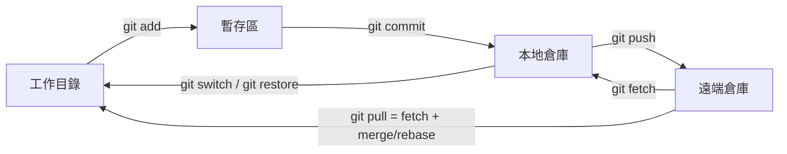
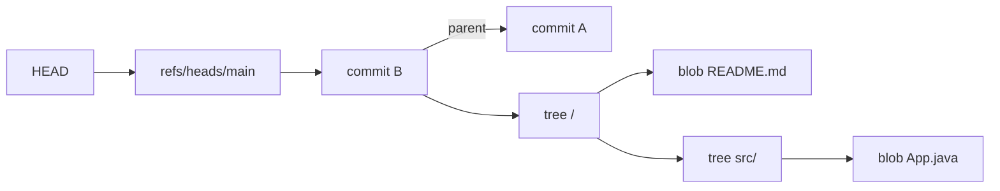
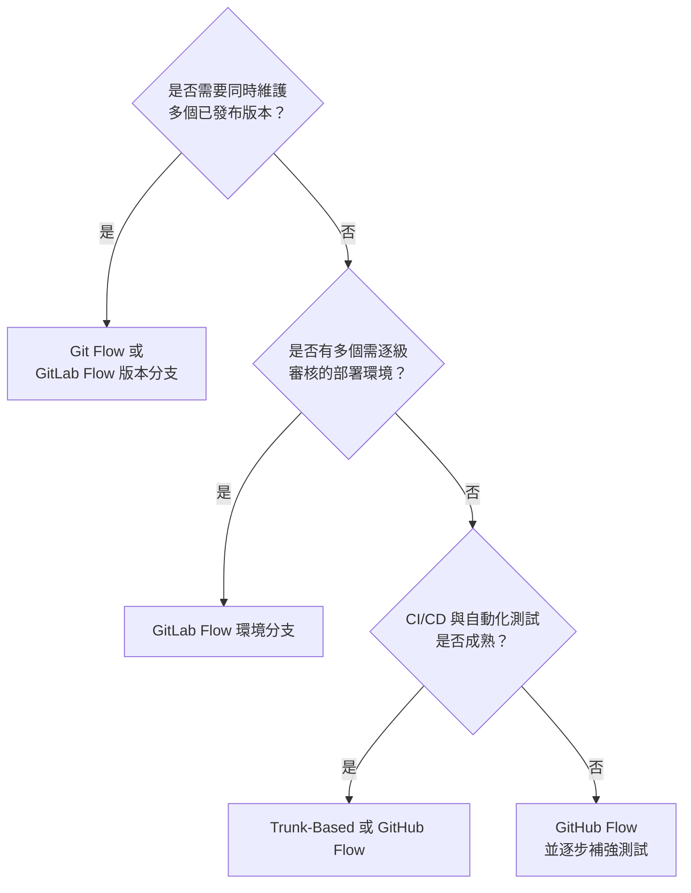
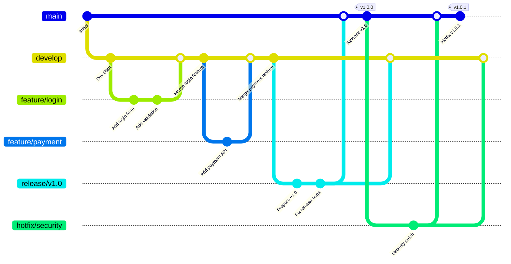
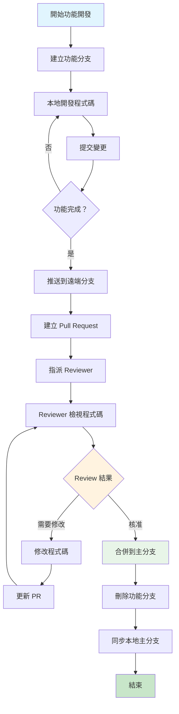
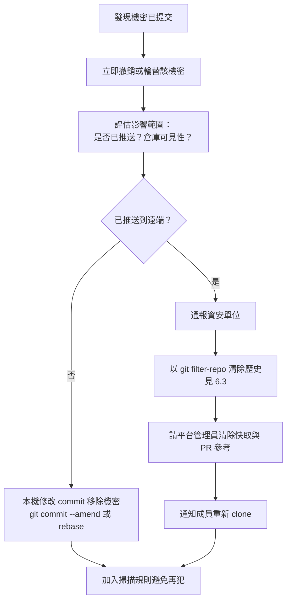
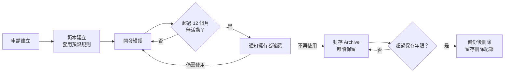

+++
date = '2025-10-31T00:00:00+08:00'
draft = false
title = 'git使用教學'
tags = ['教學', '工具', 'Git']
categories = ['教學']
+++

# 專案 Git 教學手冊

| 項目 | 內容 |
| --- | --- |
| **文件版本** | 3.0 |
| **最後更新** | 2026 年 9 月 29 日 |
| **適用版本** | Git 2.56.x（2026-09-28 發布）；Git for Windows 2.56.0；向下相容 Git 2.40 以上 |
| **適用對象** | 新進與資深開發人員、Tech Lead、DevOps／平台工程、資安與稽核人員 |
| **文件定位** | 企業標準技術白皮書／內部 Git 標準教材 |
| **使用情境** | 大型企業、金融業（銀行、證券、保險）內部 Java 專案與多團隊協作 |
| **文件維護** | 內部技術團隊 |
| **Created by** | Eric Cheng |

> ⚠️ **v3.0 重大改版說明**：本版以 Git 2.56（2026-09-28）與 git-scm.com 官方文件為基準逐章查證改寫。v2.0 內容中已淘汰的 Husky `husky install`／`husky add` 用法、`git filter-branch` 移除敏感資料、舊式 `core.sparseCheckout` 設定、過時的 Maven 外掛座標與版本、錯誤的 `gh api` 分支保護範例等均已更正；並新增 Git 物件模型、分支策略選型、Rulesets、SSH 簽署、秘密掃描、`git maintenance`／`scalar`、企業治理與 **Git 3.0 升級準備** 等章節。完整更正清單請見[附錄 D：版本更新紀錄](#附錄-d版本更新紀錄)，查證來源請見[附錄 E：查證紀錄](#附錄-e查證紀錄)。

<!-- TOC-AUTO-BEGIN -->

## 目錄

- [執行摘要](#執行摘要)
- [1. Git 基本觀念](#1-git-基本觀念)
  - [1.1 什麼是版本控制？](#11-什麼是版本控制)
  - [1.2 為什麼使用 Git？](#12-為什麼使用-git)
  - [1.3 Git 基本概念](#13-git-基本概念)
  - [1.4 Git 物件模型與內部原理](#14-git-物件模型與內部原理)
  - [1.5 Git 版本演進與近期重點](#15-git-版本演進與近期重點)
  - [1.6 官方資源地圖](#16-官方資源地圖)
  - [1.7 💡 本章實務建議](#17--本章實務建議)
  - [1.8 第1章實作練習](#18-第1章實作練習)
- [2. 環境設定](#2-環境設定)
  - [2.1 Git 安裝](#21-git-安裝)
  - [2.2 基本設定](#22-基本設定)
  - [2.3 行尾與檔案屬性（.gitattributes）](#23-行尾與檔案屬性gitattributes)
  - [2.4 個人與公司帳號區隔](#24-個人與公司帳號區隔)
  - [2.5 SSH 金鑰設定](#25-ssh-金鑰設定)
  - [2.6 HTTPS、Git Credential Manager 與權杖管理](#26-httpsgit-credential-manager-與權杖管理)
  - [2.7 Java 開發環境整合配置](#27-java-開發環境整合配置)
  - [2.8 💡 本章實務建議](#28--本章實務建議)
  - [2.9 第2章實作練習](#29-第2章實作練習)
- [3. 專案流程](#3-專案流程)
  - [3.1 如何 Clone 專案](#31-如何-clone-專案)
  - [3.2 日常指令：switch 與 restore](#32-日常指令switch-與-restore)
  - [3.3 分支策略選型](#33-分支策略選型)
  - [3.4 分支結構與命名規範](#34-分支結構與命名規範)
  - [3.5 Commit Message 規範](#35-commit-message-規範)
  - [3.6 Fetch / Pull / Merge / Rebase 使用時機](#36-fetch--pull--merge--rebase-使用時機)
  - [3.7 Push 前檢查事項](#37-push-前檢查事項)
  - [3.8 衝突處理](#38-衝突處理)
  - [3.9 💡 本章實務建議](#39--本章實務建議)
- [4. 團隊協作](#4-團隊協作)
  - [4.1 Pull Request (PR) / Merge Request (MR) 流程](#41-pull-request-pr--merge-request-mr-流程)
  - [4.2 Code Review 規範](#42-code-review-規範)
  - [4.3 分支保護與 Rulesets](#43-分支保護與-rulesets)
  - [4.4 CODEOWNERS 程式碼擁有者](#44-codeowners-程式碼擁有者)
  - [4.5 工作流程最佳實務](#45-工作流程最佳實務)
  - [4.6 💡 本章實務建議](#46--本章實務建議)
- [5. 常見錯誤排解](#5-常見錯誤排解)
  - [5.1 誤 Push 的處理](#51-誤-push-的處理)
  - [5.2 Commit 錯誤訊息修正](#52-commit-錯誤訊息修正)
  - [5.3 Reset、Revert 與 Restore 使用時機](#53-resetrevert-與-restore-使用時機)
  - [5.4 分支相關問題](#54-分支相關問題)
  - [5.5 合併問題解決](#55-合併問題解決)
  - [5.6 遠端倉庫問題](#56-遠端倉庫問題)
  - [5.7 以 reflog 救援遺失的工作](#57-以-reflog-救援遺失的工作)
  - [5.8 以 git bisect 找出問題 commit](#58-以-git-bisect-找出問題-commit)
  - [5.9 常見錯誤訊息對照表](#59-常見錯誤訊息對照表)
  - [5.10 💡 本章實務建議](#510--本章實務建議)
- [6. 最佳實務](#6-最佳實務)
  - [6.1 保持 Commit 歷史乾淨](#61-保持-commit-歷史乾淨)
  - [6.2 同步 Main 分支策略](#62-同步-main-分支策略)
  - [6.3 Force Push 準則](#63-force-push-準則)
  - [6.4 檔案和目錄管理](#64-檔案和目錄管理)
  - [6.5 大檔案管理：Git LFS](#65-大檔案管理git-lfs)
  - [6.6 效能入門](#66-效能入門)
  - [6.7 💡 本章實務建議](#67--本章實務建議)
- [7. 專案專屬規範](#7-專案專屬規範)
  - [7.1 Java 專案特殊要求](#71-java-專案特殊要求)
  - [7.2 分支命名公司規範](#72-分支命名公司規範)
  - [7.3 Code Review 檢查點](#73-code-review-檢查點)
  - [7.4 版本與標籤規範](#74-版本與標籤規範)
  - [7.5 發布分支流程](#75-發布分支流程)
  - [7.6 💡 本章實務建議](#76--本章實務建議)
- [8. 進階 Git 功能](#8-進階-git-功能)
  - [8.1 Git 別名 (Aliases)](#81-git-別名-aliases)
  - [8.2 Git 子模組 (Submodules) 與 Subtree](#82-git-子模組-submodules-與-subtree)
  - [8.3 Git Worktree](#83-git-worktree)
  - [8.4 Stash 進階](#84-stash-進階)
  - [8.5 Cherry-pick 進階](#85-cherry-pick-進階)
  - [8.6 Sparse-checkout 與 Partial Clone](#86-sparse-checkout-與-partial-clone)
  - [8.7 Git Bundle 與離線傳輸](#87-git-bundle-與離線傳輸)
  - [8.8 新一代歷史改寫工具：git replay 與 git history](#88-新一代歷史改寫工具git-replay-與-git-history)
  - [8.9 進階 Git 配置](#89-進階-git-配置)
  - [8.10 💡 本章實務建議](#810--本章實務建議)
- [9. Git Hooks 自動化](#9-git-hooks-自動化)
  - [9.1 什麼是 Git Hooks](#91-什麼是-git-hooks)
  - [9.2 Hook 管理策略比較](#92-hook-管理策略比較)
  - [9.3 實用的 Pre-commit Hook](#93-實用的-pre-commit-hook)
  - [9.4 Commit Message Hook](#94-commit-message-hook)
  - [9.5 Pre-push Hook](#95-pre-push-hook)
  - [9.6 使用 Husky v9 管理 Hooks（Node.js 專案）](#96-使用-husky-v9-管理-hooksnodejs-專案)
  - [9.7 使用 pre-commit 框架（多語言專案）](#97-使用-pre-commit-框架多語言專案)
  - [9.8 Git 2.54+ 設定檔式 Hooks](#98-git-254-設定檔式-hooks)
  - [9.9 Maven 專案 Git Hooks 實戰範例](#99-maven-專案-git-hooks-實戰範例)
  - [9.10 Hooks 與 CI 的分工](#910-hooks-與-ci-的分工)
  - [9.11 💡 本章實務建議](#911--本章實務建議)
- [10. 效能優化與故障排除](#10-效能優化與故障排除)
  - [10.1 倉庫健康度檢查](#101-倉庫健康度檢查)
  - [10.2 背景維護：git maintenance](#102-背景維護git-maintenance)
  - [10.3 大型倉庫加速](#103-大型倉庫加速)
  - [10.4 網路與傳輸優化](#104-網路與傳輸優化)
  - [10.5 倉庫瘦身與歷史清理](#105-倉庫瘦身與歷史清理)
  - [10.6 深度故障排除](#106-深度故障排除)
  - [10.7 修復損壞的倉庫](#107-修復損壞的倉庫)
  - [10.8 大型專案最佳實務](#108-大型專案最佳實務)
  - [10.9 💡 本章實務建議](#109--本章實務建議)
- [11. IDE 整合與工具](#11-ide-整合與工具)
  - [11.1 VS Code Git 整合](#111-vs-code-git-整合)
  - [11.2 JetBrains IntelliJ IDEA 整合](#112-jetbrains-intellij-idea-整合)
  - [11.3 命令列工具](#113-命令列工具)
  - [11.4 Git GUI 工具選型](#114-git-gui-工具選型)
  - [11.5 外部 diff/merge 工具設定](#115-外部-diffmerge-工具設定)
  - [11.6 Git 託管平台概覽](#116-git-託管平台概覽)
  - [11.7 💡 本章實務建議](#117--本章實務建議)
- [12. Git 安全性](#12-git-安全性)
  - [12.1 簽署 Commits 與 Tags](#121-簽署-commits-與-tags)
  - [12.2 秘密資訊防護](#122-秘密資訊防護)
  - [12.3 .gitignore 安全模式](#123-gitignore-安全模式)
  - [12.4 倉庫信任與 safe.directory](#124-倉庫信任與-safedirectory)
  - [12.5 Git 版本與漏洞管理](#125-git-版本與漏洞管理)
  - [12.6 憑證與存取權杖管理](#126-憑證與存取權杖管理)
  - [12.7 存取控制](#127-存取控制)
  - [12.8 💡 本章實務建議](#128--本章實務建議)
- [13. 企業治理與 Git 3.0 準備](#13-企業治理與-git-30-準備)
  - [13.1 Git 平台治理架構](#131-git-平台治理架構)
  - [13.2 倉庫生命週期管理](#132-倉庫生命週期管理)
  - [13.3 稽核與合規](#133-稽核與合規)
  - [13.4 備份、鏡像與災難復原](#134-備份鏡像與災難復原)
  - [13.5 Git 3.0 升級準備](#135-git-30-升級準備)
  - [13.6 預設分支更名（master → main）](#136-預設分支更名master--main)
  - [13.7 💡 本章實務建議](#137--本章實務建議)
- [14. 檢查清單](#14-檢查清單)
  - [14.1 新進成員入職檢查清單](#141-新進成員入職檢查清單)
  - [14.2 每日工作檢查清單](#142-每日工作檢查清單)
  - [14.3 Pull Request 檢查清單](#143-pull-request-檢查清單)
  - [14.4 發布前檢查清單](#144-發布前檢查清單)
  - [14.5 緊急情況檢查清單](#145-緊急情況檢查清單)
  - [14.6 平台治理季度檢查清單](#146-平台治理季度檢查清單)
- [結語](#結語)
  - [學習成效評估](#學習成效評估)
  - [支援與回饋](#支援與回饋)
- [附錄 A：常用指令速查](#附錄-a常用指令速查)
  - [A.1 情境速查](#a1-情境速查)
- [附錄 B：企業建議設定範本](#附錄-b企業建議設定範本)
  - [B.1 ~/.gitconfig](#b1-gitconfig)
  - [B.2 .gitattributes（Java 專案）](#b2-gitattributesjava-專案)
  - [B.3 ~/.ssh/config](#b3-sshconfig)
- [附錄 C：詞彙表](#附錄-c詞彙表)
- [附錄 D：版本更新紀錄](#附錄-d版本更新紀錄)
  - [D.1 版本歷程](#d1-版本歷程)
  - [D.2 v2.0 → v3.0 更正表](#d2-v20--v30-更正表)
  - [D.3 v3.0 新增章節](#d3-v30-新增章節)
  - [D.4 v2.0 更新內容回顧（2025 年 8 月）](#d4-v20-更新內容回顧2025-年-8-月)
- [附錄 E：查證紀錄](#附錄-e查證紀錄)
  - [E.1 待確認事項](#e1-待確認事項)
- [附錄 F：參考資料](#附錄-f參考資料)
  - [F.1 Git 官方資源](#f1-git-官方資源)
  - [F.2 平台與工具文件](#f2-平台與工具文件)
  - [F.3 規範與延伸閱讀](#f3-規範與延伸閱讀)

<!-- TOC-AUTO-END -->

## 執行摘要

Git 是當今軟體產業的事實標準版本控制系統。對企業而言，Git 不只是開發工具，更承載了**程式碼資產保全、變更可追溯性、職責分離（四眼原則）與供應鏈安全**等治理要求。本手冊將 Git 的使用分為四個層次：

| 層次 | 目標 | 對應章節 |
| --- | --- | --- |
| **個人操作** | 正確安裝與設定、理解資料模型、熟練日常指令 | 第 1–3 章 |
| **團隊協作** | 一致的分支策略、Commit 規範、PR／Code Review 流程 | 第 3–7 章 |
| **工程效能** | 自動化 Hooks、大型倉庫效能、工具整合 | 第 8–11 章 |
| **企業治理** | 簽署、秘密防護、存取控制、稽核、備份、版本升級 | 第 12–14 章 |

**本版五大重點建議：**

1. **統一 Git 版本基線**：全公司端點與 CI Runner 應維持在最新穩定版（本版基準 2.56.x），並建立漏洞通報後 7–14 天內完成更新的流程（見 [12.5](#125-git-版本與漏洞管理)）。
2. **統一全域設定**：以附錄 B 的企業建議 `.gitconfig` 與 `.gitattributes` 作為新進人員標準配置，避免換行字元、預設分支、Pull 策略等差異造成的協作問題。
3. **伺服器端強制、用戶端輔助**：分支保護／Rulesets、必要檢查、簽署驗證與秘密掃描應在平台端強制執行；本機 Hooks 僅作為提早回饋的輔助（見 [9.10](#910-hooks-與-ci-的分工)）。
4. **以 SSH 簽署或 GPG 簽署建立可驗證的提交來源**，並於受保護分支要求已簽署提交（見 [12.1](#121-簽署-commits-與-tags)）。
5. **提早準備 Git 3.0**：預設分支 `main`、SHA-256、reftable 與 `safe.bareRepository` 等預設值將改變，請依 [13.5](#135-git-30-升級準備) 盤點工具鏈相容性。

---

## 1. Git 基本觀念

### 1.1 什麼是版本控制？

版本控制是一套系統，用來記錄檔案內容的變化，讓您可以隨時回到特定版本的檔案狀態。想像您在寫一份重要文件，每次修改都另存新檔，最後桌面上可能有：

```text
報告_初稿.docx
報告_修正版.docx
報告_最終版.docx
報告_真正最終版.docx
報告_老闆修改版.docx
```

這就是最原始的版本控制概念，但手動管理非常容易出錯。

版本控制系統（Version Control System, VCS）自動記錄「誰、在何時、為什麼、改了什麼」，並能在任何時間點還原或比較版本。依架構可分為三代：

| 類型 | 代表工具 | 特性 | 主要限制 |
| --- | --- | --- | --- |
| 本機版本控制 | RCS | 在單一電腦記錄檔案差異 | 無法協作 |
| 集中式（CVCS） | SVN、TFVC、Perforce | 單一中央伺服器保存完整歷史 | 伺服器故障即無法提交；離線無法查歷史 |
| 分散式（DVCS） | **Git**、Mercurial | 每個 clone 都是完整倉庫 | 需要理解本機與遠端的同步概念 |

### 1.2 為什麼使用 Git？

Git 由 Linus Torvalds 於 2005 年為 Linux 核心開發而建立，以 GPLv2 授權釋出，目前是 Software Freedom Conservancy 的成員專案。它具有以下優點：

- **分散式架構**：每個開發者都有完整的專案歷史，可離線提交、查詢與比較
- **分支成本極低**：建立分支只是新增一個指向 commit 的參考，適合平行開發
- **資料完整性**：所有內容以雜湊值（SHA-1，未來預設 SHA-256）定址，任何竄改都會被偵測
- **暫存區（Staging Area）**：可精準挑選要提交的變更，組成語意清楚的 commit
- **效能**：絕大多數操作在本機完成，不依賴網路
- **生態系完整**：GitHub、GitLab、Azure Repos、Gitea 等平台與各大 IDE 均原生支援

### 1.3 Git 基本概念

#### 工作區域

- **工作目錄（Working Directory / Working Tree）**：您實際編輯檔案的地方
- **暫存區（Staging Area / Index）**：準備提交的檔案快照
- **本地倉庫（Local Repository）**：`.git` 目錄中完整的專案歷史
- **遠端倉庫（Remote Repository）**：存放在伺服器上的共享副本，預設名稱為 `origin`



#### 檔案的四種狀態

| 狀態 | 說明 | 常用指令 |
| --- | --- | --- |
| Untracked（未追蹤） | 新檔案，Git 尚未納管 | `git add <file>` |
| Unmodified（未修改） | 與最新 commit 相同 | — |
| Modified（已修改） | 已變更但未加入暫存區 | `git add`、`git restore <file>` |
| Staged（已暫存） | 已加入暫存區，下次 commit 會包含 | `git commit`、`git restore --staged <file>` |

#### 基本術語

- **Repository（倉庫）**：包含專案所有檔案和版本歷史的容器
- **Commit（提交）**：一次完整的專案快照，含作者、時間、訊息與父提交
- **Branch（分支）**：指向某個 commit 的可移動指標，代表一條獨立開發線
- **HEAD**：目前所在位置的指標，通常指向目前分支
- **Merge（合併）**：將不同分支的變更整合在一起
- **Rebase（重定基底）**：將一串 commit 重新套用到另一個基底上
- **Tag（標籤）**：標記特定 commit（通常是版本發布點）的固定參考
- **Remote（遠端）**：遠端倉庫的別名與 URL
- **Pull Request／Merge Request（PR／MR）**：託管平台提供的「請求合併並審查」機制（非 Git 原生功能）

### 1.4 Git 物件模型與內部原理

> 🆕 **v3.0 新增**

理解 Git 的資料模型，是正確判斷 `reset`、`rebase`、`reflog` 等操作影響範圍的基礎。Git 本質上是一個**以內容定址（content-addressable）的鍵值資料庫**，外加一組指向物件的參考（refs）。

#### 四種物件

| 物件 | 內容 | 類比 |
| --- | --- | --- |
| **blob** | 檔案內容（不含檔名） | 檔案本體 |
| **tree** | 目錄清單：檔名、權限、指向的 blob 或子 tree | 資料夾 |
| **commit** | 指向一個根 tree，加上父 commit、作者、提交者、時間與訊息 | 專案快照 |
| **tag**（annotated） | 指向某物件，並附帶標籤者、訊息與可選簽章 | 發布標記 |



#### 參考（refs）與 HEAD

- `refs/heads/<name>`：本地分支
- `refs/remotes/<remote>/<name>`：遠端追蹤分支（例如 `origin/main`）
- `refs/tags/<name>`：標籤
- `HEAD`：通常是「符號參考」指向目前分支；若直接指向 commit 即為 **detached HEAD** 狀態

#### 動手觀察

```bash
# 查看物件類型與內容
git cat-file -t HEAD            # commit
git cat-file -p HEAD            # 顯示 tree、parent、author、message
git cat-file -p 'HEAD^{tree}'   # 顯示根目錄 tree

# 查看參考指向
git rev-parse HEAD
git symbolic-ref HEAD           # refs/heads/main

# 查看倉庫格式（Git 2.52+）
git repo info
git rev-parse --show-object-format   # sha1 或 sha256
git rev-parse --show-ref-format      # files 或 reftable
```

#### 雜湊演算法與儲存格式

| 項目 | 目前預設 | Git 3.0 預設（規劃） | 說明 |
| --- | --- | --- | --- |
| 物件雜湊 | SHA-1（含碰撞偵測強化） | SHA-256 | 新倉庫可用 `git init --object-format=sha256` 試用；託管平台支援度需先確認 |
| 參考儲存 | `files`（loose refs + packed-refs） | `reftable` | reftable 支援原子多參考更新、大量分支時效能更好 |
| 物件儲存 | loose object + packfile | 同左 | `git gc`／`git maintenance` 會將 loose object 打包 |

### 1.5 Git 版本演進與近期重點

> 🆕 **v3.0 新增**

Git 約每 8–12 週發布一個次版本。下表整理與企業日常使用最相關的近期變化（完整內容請參閱各版 Release Notes）：

| 版本 | 發布時間 | 對企業使用者的重點 |
| --- | --- | --- |
| 2.50 | 2025-06-16 | `recursive` 合併策略移除，ORT 成為唯一合併引擎；新增 `git reflog drop`；`git maintenance` 新增 `worktree-prune`、`rerere-gc`、`reflog-expire` 任務 |
| 2.50.1 | 2025-07-08 | 安全性修補（CVE-2025-48384／48385／48386 等，見 [12.5](#125-git-版本與漏洞管理)） |
| 2.52 | 2025-11-17 | 新增 `git last-modified`、`git repo info`／`git repo structure`、`git refs list`／`exists`、`git sparse-checkout clean`；Rust 支援可選 |
| 2.54 | 2026-04-20 | 實驗性 `git history`（`reword`、`split`）；**設定檔式 Hooks**（`hook.<name>.command`／`event`）與 `git hook list`；`git maintenance` 手動執行預設採 geometric 策略；HTTP 429 自動重試（`http.maxRetries` 等） |
| 2.55 | 2026-06-29 | `git history fixup`；Hooks 可設定平行執行；`git push` 可推送到 remote group；Rust 預設啟用 |
| **2.56** | **2026-09-28** | `git add --resolved`、`git branch --delete-merged`、`git history drop`、`git bisect --reset-when-found`、`fetch.followRemoteHEAD`、`includeIf "worktree:"`；`-h`／`--help` 結束碼改為 0 |

> 💡 表中未列出的 2.51（2025-08-18）、2.53（2026-02-02）等版本亦有許多改進，完整內容請參閱 [Release Notes](https://gitlab.com/git-scm/git/-/tree/master/Documentation/RelNotes) 或 GitHub Blog 的「Highlights from Git 2.xx」系列文章。

**Git 3.0 路線（尚無發布日期）**：預設分支改為 `main`、預設雜湊改為 SHA-256、預設參考格式改為 reftable、Rust 成為必要建置元件、`safe.bareRepository` 預設改為 `explicit`，並移除 `git whatchanged`、`git pack-redundant`、grafts 等舊功能。詳見 [13.5 Git 3.0 升級準備](#135-git-30-升級準備)。

### 1.6 官方資源地圖

> 🆕 **v3.0 新增**

[git-scm.com](https://git-scm.com/) 是 Git 專案的官方網站，主要分為六大區塊：

| 區塊 | 網址 | 內容 | 建議用途 |
| --- | --- | --- | --- |
| About | <https://git-scm.com/about> | Git 的設計特色、商標政策 | 向非技術主管說明 Git 價值 |
| Learn | <https://git-scm.com/learn> | Pro Git 電子書、入門影片、Cheat Sheet、外部資源連結 | 新人自學教材 |
| Tools | <https://git-scm.com/tools> | 命令列工具、GUI 用戶端、託管服務清單 | 工具選型（見第 11 章） |
| Reference | <https://git-scm.com/docs> | 每個指令與設定的權威參考文件 | 查指令選項與行為的第一手來源 |
| Install | <https://git-scm.com/install> | 各平台安裝方式與最新版本 | 安裝與升級（見 2.1） |
| Community | <https://git-scm.com/community> | 郵件論壇、IRC／Discord、錯誤回報、資安通報、貢獻方式 | 問題回報與追蹤 |

**Learn 區塊的四類資源：**

- **Pro Git（第 2 版）**：Scott Chacon 與 Ben Straub 著，可免費線上閱讀，涵蓋基礎到內部原理
- **Videos**：「什麼是版本控制」「什麼是 Git」「Get Going with Git」「Quick Wins with Git」四支入門短片
- **Cheat Sheet**：常用指令速查，並以圖解說明 merge 與 rebase 的差異
- **External Links**：社群整理的教學、書籍與影片

**Community 區塊的重要管道：**

| 需求 | 管道 |
| --- | --- |
| 一般問題討論 | 郵件論壇 `git@vger.kernel.org`（純文字郵件，不需訂閱）；封存於 <https://lore.kernel.org/git/> |
| 即時討論 | Libera Chat IRC `#git`、`#git-devel`；Git Community Discord |
| Windows 版問題 | Git for Windows GitHub Discussions |
| 回報錯誤 | 使用 `git bugreport` 產生報告後寄至郵件論壇 |
| **資安漏洞通報** | `git-security@googlegroups.com`（私下揭露，勿公開張貼） |
| 開發動態 | 月刊 **Git Rev News** |

**離線查詢內建說明：**

```bash
git help <command>        # 開啟完整說明（Windows 預設開啟 HTML）
git <command> -h          # 簡短用法（Git 2.56 起結束碼為 0）
git help -g               # 列出概念指南，例如 giteveryday、gitworkflows、gitfaq
git help -a               # 列出所有指令
git help everyday         # 「每日 Git 必備的 20 個指令」
```

### 1.7 💡 本章實務建議

- Git 以快照（snapshot）而非差異（diff）儲存每個版本；commit 一旦建立即不可變，「修改歷史」實際上是建立新的 commit
- 每個 commit 都有唯一雜湊值作為識別；分支與標籤只是指向 commit 的名稱
- 刪除或修改已 push 的 commit 會影響他人，務必遵循第 5、6 章的準則
- 遇到指令疑問，優先查閱 `git help <command>` 或 git-scm.com/docs，而非過時的部落格文章
- 將 Git 版本納入端點管理，定期更新以取得安全修補

### 1.8 第1章實作練習

#### 練習1：概念理解 📚

**目標**：確保理解 Git 基本概念

**任務**：

1. 用自己的話解釋什麼是「版本控制」
2. 列出 Git 的三個主要優點
3. 畫出工作區域的流程圖（工作目錄 → 暫存區 → 本地倉庫 → 遠端倉庫）

**預期結果**：

- 能清楚說明版本控制的目的
- 理解 Git 相對於其他版本控制系統的優勢
- 掌握 Git 的基本工作流程

#### 練習2：實際操作 💻

**目標**：初步體驗 Git 操作

**任務**：

1. 在桌面建立一個測試資料夾 `git-practice`
2. 建立一個 `README.md` 檔案，寫入今天的學習心得
3. 使用命令列查看目前的檔案狀態
4. 思考：如果沒有 Git，你會如何管理這個檔案的版本？

**指令提示**：

```bash
mkdir git-practice
cd git-practice
echo "# Git 學習筆記" > README.md
# 這時還沒有 Git，所以無法使用 git status
```

**反思問題**：

- 手動版本管理會遇到什麼問題？
- Git 如何解決這些問題？

#### 練習3：案例分析 🔍

**目標**：理解 Git 在團隊協作中的價值

**情境**：
你和2位同事要一起開發一個 Java 專案，專案包含：

- `User.java` - 使用者類別
- `UserService.java` - 使用者服務
- `UserController.java` - 控制器

**思考題**：

1. 如果沒有版本控制，如何分工？會遇到什麼問題？
2. 使用 Git 後，工作流程會如何改善？
3. 如果兩個人同時修改 `UserService.java`，應該如何處理？

**答案要點**：

- 檔案衝突問題
- 程式碼同步困難
- 版本追蹤不易
- Git 分支解決並行開發
- 合併機制處理衝突

#### 練習4：觀察物件模型 🔬

**目標**：親手驗證 1.4 節的物件模型

**任務**：

```bash
git init object-lab && cd object-lab
echo "hello" > a.txt
git add a.txt
git commit -m "chore: first commit"

git cat-file -p HEAD                 # 找出 tree 雜湊
git cat-file -p 'HEAD^{tree}'        # 找出 a.txt 的 blob 雜湊
git cat-file -p <blob-hash>          # 應顯示 hello
git hash-object a.txt                # 與上方 blob 雜湊相同
```

**反思問題**：

- 修改 `a.txt` 再 commit 後，舊的 blob 還在嗎？如何證明？
- 為什麼兩個內容相同但檔名不同的檔案只會產生一個 blob？

---

## 2. 環境設定

### 2.1 Git 安裝

> ⚠️ **v3.0 更正**：v2.0 僅說明「到官網下載最新版」。本版補充 Windows 各種安裝方式、安裝精靈選項建議、企業大量部署與升級方式，以及 macOS／Linux 安裝。

#### Windows 環境

截至 2026-09-29，Git for Windows 最新版為 **2.56.0**（2026-09-28 發布，內含 Git LFS 3.8.0）。自 2.56.0 起已**停止支援 Windows 8.1**，內部執行檔路徑由 `/mingw64/bin` 改為 `/ucrt64/bin`，但對外的 `C:\Program Files\Git\cmd\git.exe` 路徑維持不變。

| 安裝方式 | 適用情境 | 取得方式 |
| --- | --- | --- |
| 標準安裝檔（x64） | 一般開發機 | <https://git-scm.com/install/windows> 下載 `Git-2.56.0-64-bit.exe` |
| 標準安裝檔（ARM64） | Windows on ARM 筆電 | 同上，`Git-2.56.0-arm64.exe` |
| 可攜版（Portable） | 無管理員權限、隨身碟、跳板機 | `PortableGit-2.56.0-64-bit.7z.exe`（自解壓縮） |
| winget | 開發者自行安裝、腳本化 | `winget install --id Git.Git -e --source winget` |
| 企業大量部署 | Intune／SCCM／GPO 派送 | 標準安裝檔搭配靜默參數（見下方） |

##### 安裝精靈重要選項建議

| 安裝精靈頁面 | 企業建議選擇 | 理由 |
| --- | --- | --- |
| Select Components | 保留預設；勾選「Check daily for Git for Windows updates」視公司政策 | 由端點管理統一更新時可不勾 |
| Choosing the default editor | Visual Studio Code | 與 `core.editor` 設定一致 |
| Adjusting the name of the initial branch | **Override → `main`** | 與主流平台及 Git 3.0 預設一致 |
| Adjusting your PATH environment | Git from the command line and also from 3rd-party software（預設） | IDE、PowerShell 皆可呼叫 `git` |
| Choosing the SSH executable | Use bundled OpenSSH | 若公司統一使用 Windows 內建 OpenSSH 或 PuTTY，再改選外部 |
| Choosing HTTPS transport backend | **Use the native Windows Secure Channel library** | 可直接信任公司以 GPO 派送的內部 CA 憑證，避免 `SSL certificate problem` |
| Configuring the line ending conversions | Checkout Windows-style, commit Unix-style | 等同 `core.autocrlf=true`；仍建議以 `.gitattributes` 為準（見 2.3） |
| Configuring the terminal emulator | MinTTY（預設） | Git Bash 體驗較佳 |
| Default behavior of `git pull` | Fast-forward or merge（預設），之後以 `pull.rebase` 統一設定 | 見 2.2 企業建議設定 |
| Credential helper | **Git Credential Manager** | 支援 OAuth、SSO 與 Windows 憑證管理員 |
| Extra options | 勾選 Enable file system caching | 對應 `core.fscache=true`，提升 `git status` 速度 |

##### 企業靜默安裝

Git for Windows 安裝檔基於 Inno Setup，可先在一台參考機器匯出選項，再以相同設定大量派送：

```powershell
# 1. 在參考機器以互動方式安裝，並將選擇存成設定檔
.\Git-2.56.0-64-bit.exe /SAVEINF=git_options.ini

# 2. 在目標機器以相同設定靜默安裝
.\Git-2.56.0-64-bit.exe /VERYSILENT /NORESTART /NOCANCEL /SP- `
  /CLOSEAPPLICATIONS /RESTARTAPPLICATIONS /LOADINF=git_options.ini
```

| 參數 | 說明 |
| --- | --- |
| `/VERYSILENT` | 完全不顯示安裝畫面 |
| `/NORESTART` | 安裝後不自動重新開機 |
| `/NOCANCEL` | 停用取消按鈕 |
| `/SP-` | 不顯示「是否開始安裝」提示 |
| `/CLOSEAPPLICATIONS`、`/RESTARTAPPLICATIONS` | 自動關閉並重啟佔用檔案的應用程式 |
| `/SAVEINF=`、`/LOADINF=` | 匯出／載入安裝選項設定檔 |
| `/COMPONENTS=` | 指定安裝元件 |
| `/o:<Key>=<Value>` | 個別覆寫選項，例如 `CRLFOption`、`SSHOption`、`UseCredentialManager` |

##### 升級方式

```bash
# Git Bash 內建的更新指令
git update-git-for-windows

# 或透過 winget
winget upgrade --id Git.Git -e --source winget
```

#### macOS 與 Linux 環境

```bash
# macOS：Xcode Command Line Tools 內建的版本通常落後，建議改用 Homebrew
brew install git

# Debian / Ubuntu（發行版套件庫版本可能較舊）
sudo apt-get install git

# Fedora / RHEL 系列
sudo dnf install git
```

> 💡 Linux 發行版內建的 Git 版本常落後數個次版本。伺服器與 CI Runner 若需較新版本，可使用發行版的官方更新套件庫、容器映像檔或自行編譯；Git 3.0 起自行編譯將需要 Rust 工具鏈。

#### 驗證安裝

```bash
git --version                  # 例：git version 2.56.0.windows.1
git version --build-options    # 顯示編譯選項、SHA 實作、cURL／OpenSSL 版本
where git                      # Windows：確認實際執行的是哪一個 git.exe
```

### 2.2 基本設定

#### 設定層級

Git 設定分為四個層級，後者覆蓋前者：

| 層級 | 參數 | 檔案位置（Windows） | 用途 |
| --- | --- | --- | --- |
| system | `--system` | `C:\Program Files\Git\etc\gitconfig` | 全機預設，由安裝程式或 IT 管理 |
| global | `--global` | `%USERPROFILE%\.gitconfig` | 個人所有倉庫 |
| local | `--local`（預設） | `<repo>\.git\config` | 單一倉庫 |
| worktree | `--worktree` | `<repo>\.git\worktrees\<name>\config.worktree` | 單一工作樹（需啟用 `extensions.worktreeConfig`） |

```bash
# 檢視所有設定及其來源檔案與層級
git config --list --show-origin --show-scope
```

#### 設定使用者資訊

```bash
# 設定姓名（會顯示在 commit 記錄中）
git config --global user.name "您的姓名"

# 設定 Email（建議使用公司 Email，並與託管平台帳號綁定的 Email 一致）
git config --global user.email "your.email@company.com"
```

#### 設定預設編輯器

```bash
# 設定 VS Code 為預設編輯器
git config --global core.editor "code --wait"
```

#### 企業建議全域設定

> 🆕 **v3.0 新增**

以下設定經評估可降低協作摩擦，建議納入新進人員標準配置（完整範本見[附錄 B](#附錄-b企業建議設定範本)）：

```bash
git config --global init.defaultBranch main        # 新倉庫預設分支
git config --global pull.rebase true               # pull 時以 rebase 取代 merge，保持線性歷史
git config --global fetch.prune true               # fetch 時自動清除已刪除的遠端分支
git config --global push.autoSetupRemote true      # 首次 push 自動設定上游，不必再打 -u
git config --global rebase.autoStash true          # rebase 前自動 stash 未提交變更
git config --global rebase.autoSquash true         # 自動整理 fixup!/squash! commit
git config --global rebase.updateRefs true         # rebase 時一併更新堆疊分支
git config --global merge.conflictStyle zdiff3     # 衝突標記包含共同祖先，較易判斷
git config --global rerere.enabled true            # 記住衝突解法，重複衝突自動套用
git config --global diff.algorithm histogram       # 產生較易閱讀的 diff
git config --global help.autocorrect prompt        # 打錯指令時詢問是否執行建議指令
git config --global branch.sort -committerdate     # git branch 依最近提交排序
git config --global tag.sort version:refname       # 標籤依版本號排序
git config --global core.longpaths true            # Windows：允許超過 260 字元的路徑
```

| 設定 | 預設值 | 建議值 | 影響 |
| --- | --- | --- | --- |
| `init.defaultBranch` | `master`（會提示） | `main` | Git 3.0 將改為 `main` |
| `pull.rebase` | `false` | `true` | 避免無意義的 merge commit；若團隊偏好合併，可改用 `pull.ff=only` |
| `fetch.prune` | `false` | `true` | 本機遠端分支清單與伺服器一致 |
| `push.autoSetupRemote` | `false` | `true` | 簡化首次推送 |
| `merge.conflictStyle` | `merge` | `zdiff3` | 衝突區塊多顯示 base 版本 |
| `rerere.enabled` | `false` | `true` | 長期分支反覆 rebase 時特別有效 |

#### 設定行尾字元處理

```bash
# Windows 環境建議設定（checkout 轉 CRLF、commit 轉 LF）
git config --global core.autocrlf true

# macOS / Linux 環境建議設定（commit 時將 CRLF 轉 LF，checkout 不轉換）
git config --global core.autocrlf input
```

> ⚠️ `core.autocrlf` 是**個人**設定，無法保證團隊一致。專案應以 `.gitattributes` 明確宣告，見下一節。

### 2.3 行尾與檔案屬性（.gitattributes）

> 🆕 **v3.0 新增**

`.gitattributes` 隨倉庫提交，對所有成員一致生效，優先於個人的 `core.autocrlf`。

```gitattributes
# 預設：由 Git 自動判斷文字檔，倉庫內一律以 LF 儲存
* text=auto eol=lf

# Windows 專用腳本需保留 CRLF
*.bat  text eol=crlf
*.cmd  text eol=crlf
*.ps1  text eol=crlf

# Shell 腳本必須是 LF，否則在 Linux 容器內會執行失敗
*.sh   text eol=lf

# 二進位檔：不轉換、不做文字 diff
*.jar  binary
*.png  binary
*.jpg  binary
*.pdf  binary
*.zip  binary

# 語言感知的 diff 標頭（顯示變更所在的方法名稱）
*.java diff=java
*.md   diff=markdown
```

既有倉庫導入 `.gitattributes` 後，需重新正規化一次：

```bash
git add --renormalize .
git status                       # 檢查被重新正規化的檔案
git commit -m "chore: normalize line endings via .gitattributes"
```

### 2.4 個人與公司帳號區隔

#### 全域設定 vs 專案設定

```bash
# 檢視目前設定
git config --list

# 專案特定設定（在專案目錄下執行）
git config user.name "工作用姓名"
git config user.email "work@company.com"

# 全域設定
git config --global user.name "個人姓名"
git config --global user.email "personal@gmail.com"
```

#### 以條件式引入自動切換身分

> 🆕 **v3.0 新增**

手動在每個專案設定容易遺漏。建議以 `includeIf` 依目錄或遠端網址自動套用不同身分：

```ini
# ~/.gitconfig
[user]
    name = 個人姓名
    email = personal@example.com

# 位於 D:/work/ 下的所有倉庫使用公司身分（路徑結尾的 / 代表含子目錄）
[includeIf "gitdir/i:D:/work/"]
    path = ~/.gitconfig-work

# 遠端網址指向公司 GitLab 的倉庫也使用公司身分
[includeIf "hasconfig:remote.*.url:https://gitlab.company.com/**"]
    path = ~/.gitconfig-work
```

```ini
# ~/.gitconfig-work
[user]
    name = 王小明
    email = xiaoming.wang@company.com
    signingkey = ~/.ssh/id_ed25519_work.pub
[commit]
    gpgsign = true
```

| 條件 | 說明 |
| --- | --- |
| `gitdir:` ／ `gitdir/i:` | 依 `.git` 目錄位置比對；`/i` 不分大小寫（Windows 建議使用） |
| `onbranch:` | 依目前分支名稱比對 |
| `hasconfig:remote.*.url:` | 依任一遠端網址比對 |
| `worktree:` ／ `worktree/i:` | 依工作樹位置比對（Git 2.56 新增） |

```bash
# 驗證目前倉庫實際套用的 Email 及其來源檔案
git config --show-origin user.email
```

### 2.5 SSH 金鑰設定

#### 產生 SSH 金鑰

```bash
# 產生新的 Ed25519 SSH 金鑰（建議設定 passphrase）
ssh-keygen -t ed25519 -C "your.email@company.com"

# 僅在舊系統不支援 Ed25519 時才使用 RSA（至少 4096 位元）
ssh-keygen -t rsa -b 4096 -C "your.email@company.com"
```

#### 啟用 ssh-agent（Windows）

設定 passphrase 後，可交由 ssh-agent 記住解鎖後的金鑰：

```powershell
# 以系統管理員身分執行 PowerShell：將 OpenSSH Authentication Agent 設為自動啟動
Get-Service ssh-agent | Set-Service -StartupType Automatic
Start-Service ssh-agent

# 以一般使用者身分加入金鑰
ssh-add $env:USERPROFILE\.ssh\id_ed25519
```

> 💡 Windows 內建 OpenSSH 與 Git for Windows 內附的 OpenSSH 是兩套 agent。若要共用 Windows 服務版 agent，請在安裝精靈選擇「Use external OpenSSH」，或設定 `git config --global core.sshCommand "C:/Windows/System32/OpenSSH/ssh.exe"`。

#### 將公鑰新增到 GitHub/GitLab

1. 複製公鑰內容：

   ```bash
   # Git Bash（Windows）
   cat ~/.ssh/id_ed25519.pub | clip

   # 或直接檢視
   cat ~/.ssh/id_ed25519.pub
   ```

2. 登入 GitHub → Settings → SSH and GPG keys → New SSH key（GitLab：User Settings → SSH Keys）
3. 貼上公鑰內容，Key type 選擇 Authentication Key 並儲存
4. 若組織啟用 SAML SSO，需在金鑰旁點選「Configure SSO」授權該組織

#### 多帳號與多主機設定

```text
# ~/.ssh/config
Host github.com
    HostName github.com
    User git
    IdentityFile ~/.ssh/id_ed25519
    IdentitiesOnly yes

# 公司自建 GitLab
Host gitlab.company.com
    HostName gitlab.company.com
    User git
    Port 22
    IdentityFile ~/.ssh/id_ed25519_work
    IdentitiesOnly yes
```

#### 測試 SSH 連線

```bash
# 測試 GitHub 連線（首次連線請核對官方公布的主機指紋）
ssh -T git@github.com

# 測試 GitLab 連線
ssh -T git@gitlab.com

# 連線失敗時輸出詳細除錯資訊
ssh -vT git@github.com
```

### 2.6 HTTPS、Git Credential Manager 與權杖管理

#### HTTPS 與 SSH 比較

| 面向 | HTTPS | SSH |
| --- | --- | --- |
| 設定難度 | 低，搭配 GCM 可用瀏覽器登入 | 中，需產生並上傳金鑰 |
| 防火牆 | 使用 443 埠，幾乎都可通過 | 使用 22 埠，部分企業網路封鎖（GitHub 可改用 `ssh.github.com:443`） |
| 認證方式 | OAuth、個人存取權杖（PAT）、SSO | 金鑰對，可加 passphrase 與硬體金鑰（`ed25519-sk`） |
| 雙因素驗證 | 由 OAuth／SSO 流程處理 | 金鑰本身即為持有因子 |
| 企業代理伺服器 | 支援 `http.proxy` | 需額外設定 `ProxyCommand` |

#### Git Credential Manager（GCM）

GCM 是 Git for Windows 預設的憑證輔助程式，截至 2026-09-29 穩定版為 **2.9.1**；**3.0.0** 已以預覽版（pre-release）發布，改用 .NET 10 與原生 AOT 編譯，並預設使用作業系統驗證代理（broker）進行 Microsoft 帳號 SSO。

```bash
# 確認使用中的憑證輔助程式與 GCM 版本
git config --show-origin --get-all credential.helper
git credential-manager --version

# 手動指定使用 GCM（Git for Windows 安裝時已設定）
git config --global credential.helper manager

# 清除某主機已儲存的憑證（例如密碼或權杖已更換）
printf "protocol=https\nhost=github.com\n\n" | git credential reject
```

#### 權杖使用原則

- 優先使用 **OAuth／SSO 登入**（由 GCM 處理），其次才是個人存取權杖
- 若必須使用 PAT，GitHub 請使用 **fine-grained PAT**，限定倉庫與權限並設定到期日
- **不要**把權杖寫在遠端網址中（例如 `https://<token>@github.com/...`），會以明文留在 `.git/config` 與 shell 歷史
- **不要**使用 `credential.helper store`，它以明文儲存於 `~/.git-credentials`
- CI 環境使用平台提供的短效權杖（如 GitHub Actions 的 `GITHUB_TOKEN`、GitLab 的 `CI_JOB_TOKEN`）

### 2.7 Java 開發環境整合配置

#### 🔧 IntelliJ IDEA 整合設定

##### 1. Git 設定檢查

```bash
# 確認 IntelliJ 可以找到 Git
git --version
```

##### 2. IntelliJ Git 配置

- File → Settings → Version Control → Git
- Path to Git executable: `C:\Program Files\Git\cmd\git.exe`
- 勾選 "Use credential helper"

##### 3. 專案初始化設定

```bash
# 在專案根目錄建立 .gitignore
cat > .gitignore << EOF
# IntelliJ IDEA
.idea/
*.iml
*.iws
*.ipr
out/

# Maven
target/
pom.xml.tag
pom.xml.releaseBackup
pom.xml.versionsBackup

# Java
*.class
*.jar
*.war
*.ear
hs_err_pid*

# 日誌
*.log
logs/

# 作業系統
.DS_Store
Thumbs.db
EOF
```

#### 🛠️ VS Code Java 整合

##### 1. 必要擴充功能安裝

```json
{
  "recommendations": [
    "vscjava.vscode-java-pack",
    "eamodio.gitlens",
    "github.vscode-pull-request-github"
  ]
}
```

##### 2. VS Code 設定檔 (.vscode/settings.json)

```json
{
  "java.jdt.ls.java.home": "C:\\Program Files\\Java\\jdk-21",
  "java.configuration.runtimes": [
    {
      "name": "JavaSE-21",
      "path": "C:\\Program Files\\Java\\jdk-21"
    }
  ],
  "git.enableSmartCommit": false,
  "git.confirmSync": false,
  "git.autofetch": true,
  "java.compile.nullAnalysis.mode": "automatic",
  "java.checkstyle.configuration": "${workspaceFolder}/checkstyle.xml"
}
```

#### 📋 Maven 專案 Git 初始化模板

##### 1. 標準 Maven 專案結構

```bash
# 建立標準 Maven 專案
mvn archetype:generate \
  -DgroupId=com.tutorial.java \
  -DartifactId=git-demo-project \
  -DarchetypeArtifactId=maven-archetype-quickstart \
  -DinteractiveMode=false

cd git-demo-project

# 初始化 Git
git init
git add .
git commit -m "chore: initial Maven project setup

- Add standard Maven directory structure
- Include basic pom.xml configuration
- Add sample App.java and AppTest.java"
```

##### 2. 專案專用 Git 配置

```bash
# 設定專案特定的 Git 配置
git config user.name "Java Developer"
git config user.email "java.dev@company.com"

# 設定 commit template
git config commit.template .gitmessage

# 建立 commit message 模板
cat > .gitmessage << 'EOF'
# <type>(<scope>): <subject>
#
# <body>
#
# <footer>
#
# 類型說明：
# feat: 新功能
# fix: 錯誤修復
# docs: 文件變更
# style: 格式調整（不影響程式邏輯）
# refactor: 重構
# perf: 效能改善
# test: 測試相關
# chore: 建置工具或輔助工具的變動
#
# 範例：
# feat(user): add user registration API
# fix(auth): resolve token expiration issue
# docs(readme): update installation instructions
EOF
```

#### 🚀 Java 專案 Git Workflow 自動化

##### 1. 將 Git 資訊寫入建置產物

在 `pom.xml` 中加入 git-commit-id 外掛，讓應用程式可在執行期回報建置來源的 commit：

```xml
<plugin>
    <groupId>io.github.git-commit-id</groupId>
    <artifactId>git-commit-id-maven-plugin</artifactId>
    <version>10.0.1</version>
    <executions>
        <execution>
            <id>get-the-git-infos</id>
            <goals>
                <goal>revision</goal>
            </goals>
            <phase>initialize</phase>
        </execution>
    </executions>
    <configuration>
        <generateGitPropertiesFile>true</generateGitPropertiesFile>
        <includeOnlyProperties>
            <includeOnlyProperty>^git.commit.id.abbrev$</includeOnlyProperty>
            <includeOnlyProperty>^git.commit.time$</includeOnlyProperty>
            <includeOnlyProperty>^git.branch$</includeOnlyProperty>
        </includeOnlyProperties>
    </configuration>
</plugin>
```

> ⚠️ **v3.0 更正**：外掛的 groupId 已由 `pl.project13.maven`／`com.github.git-commit-id` 遷移為 `io.github.git-commit-id`，v2.0 使用的 4.9.10 為舊版，Maven Central 目前最新版為 10.0.1。Spring Boot 專案可直接由 Actuator 的 `/actuator/info` 顯示 `git.properties` 內容。

##### 2. 建立 Git 別名 for Java 開發

```bash
# Java 專案常用 Git 別名
git config --global alias.java-status '!git status && echo "--- Maven Dependencies ---" && mvn -q dependency:tree | head -20'
git config --global alias.java-clean '!mvn -q clean && git clean -fd'
git config --global alias.feature-start '!f() { git switch -c "feature/$1" && git push -u origin "feature/$1"; }; f'
git config --global alias.feature-finish '!f() { git switch develop && git merge --no-ff "feature/$1" && git branch -d "feature/$1"; }; f'
```

> ⚠️ `git clean -fd` 會永久刪除未追蹤檔案，執行前可先用 `git clean -nd` 預覽。

### 2.8 💡 本章實務建議

- 公司專案建議使用 SSH（金鑰設定 passphrase）或 HTTPS + GCM 的 SSO 登入，避免密碼或權杖外洩
- 透過端點管理統一 Git 版本，並定期更新以取得最新功能和安全修正
- 以 `includeIf` 自動切換公司與個人身分，避免以個人 Email 提交公司程式碼
- 新專案一律提交 `.gitattributes`，不要只依賴個人的 `core.autocrlf`
- 企業內部 CA 環境優先選擇 Secure Channel（`http.sslBackend=schannel`），不要用 `http.sslVerify=false` 繞過憑證驗證

### 2.9 第2章實作練習

#### 練習1：環境設定檢查 ✅

**目標**：確保 Git 和 Java 開發環境正確設定

**任務**：

1. 驗證 Git 安裝和版本
2. 設定個人 Git 配置
3. 產生 SSH 金鑰並測試連線
4. 設定 IDE 的 Git 整合

**檢查清單**：

```bash
# 1. 檢查 Git 版本
git --version

# 2. 檢查使用者設定
git config user.name
git config user.email

# 3. 檢查 SSH 設定
ssh -T git@github.com

# 4. 檢查全域設定
git config --list --global
```

#### 練習2：Java 專案初始化 🏗️

**目標**：建立標準的 Java Git 專案

**任務**：

1. 建立新的 Maven 專案
2. 初始化 Git 倉庫
3. 建立適當的 .gitignore
4. 進行第一次提交

**完整流程**：

```bash
# 1. 建立 Maven 專案
mvn archetype:generate \
  -DgroupId=com.tutorial.practice \
  -DartifactId=git-java-practice \
  -DarchetypeArtifactId=maven-archetype-quickstart \
  -DinteractiveMode=false

# 2. 進入專案目錄
cd git-java-practice

# 3. 建立 .gitignore
curl -o .gitignore https://raw.githubusercontent.com/github/gitignore/main/Java.gitignore

# 4. 初始化 Git
git init
git add .
git commit -m "chore: initial project setup"

# 5. 檢查結果
git log --oneline
git status
```

#### 練習3：團隊環境模擬 👥

**目標**：模擬團隊開發環境設定

**情境**：
假設你要加入一個現有的 Java 團隊專案

**任務**：

1. Clone 一個範例專案（可以用自己的）
2. 設定專案特定的 Git 配置
3. 建立開發分支
4. 進行簡單修改並提交

**實作步驟**：

```bash
# 1. Clone 專案
git clone https://github.com/username/java-demo-project.git
cd java-demo-project

# 2. 設定專案配置
git config user.name "Team Member"
git config user.email "member@team.com"

# 3. 檢查專案狀態
git status
git branch -a
mvn compile

# 4. 建立開發分支
git switch -c feature/setup-environment

# 5. 修改 README 添加自己的設定筆記
echo "## 我的環境設定筆記" >> README.md
echo "- Java 版本：$(java -version 2>&1 | head -1)" >> README.md
echo "- Maven 版本：$(mvn -version | head -1)" >> README.md
echo "- Git 版本：$(git --version)" >> README.md

# 6. 提交變更
git add README.md
git commit -m "docs: add personal environment setup notes"

# 7. 推送分支（如果有遠端倉庫）
git push -u origin feature/setup-environment
```

**驗證標準**：

- 專案可以正常編譯
- Git 配置正確
- 分支建立成功
- 提交訊息符合規範

---

## 3. 專案流程

### 3.1 如何 Clone 專案

#### 基本 Clone 操作

```bash
# 使用 HTTPS
git clone https://github.com/username/repository.git

# 使用 SSH（推薦）
git clone git@github.com:username/repository.git

# Clone 到指定目錄
git clone git@github.com:username/repository.git my-project

# 同時取得子模組
git clone --recurse-submodules git@github.com:username/repository.git
```

#### 大型倉庫的 Clone 選擇

| 方式 | 指令 | 下載內容 | 適用情境 | 注意事項 |
| --- | --- | --- | --- | --- |
| 完整 clone | `git clone <url>` | 全部歷史與檔案 | 一般開發 | — |
| **Blobless partial clone** | `git clone --filter=blob:none <url>` | 全部 commit 與 tree，檔案內容按需下載 | **大型倉庫日常開發（推薦）** | 查看舊版本檔案時需連線 |
| Treeless partial clone | `git clone --filter=tree:0 <url>` | 僅 commit，tree 與檔案按需下載 | CI 單次建置 | 不適合長期開發 |
| Shallow clone | `git clone --depth 1 <url>` | 僅最新快照 | CI 一次性建置 | `git log`、`blame`、`merge-base` 受限；不建議用於開發 |

#### Clone 後的初始化

```bash
# 進入專案目錄
cd repository

# 檢查遠端倉庫
git remote -v

# 檢查當前分支與上游
git branch -vv

# 檢查專案狀態
git status
```

### 3.2 日常指令：switch 與 restore

> 🆕 **v3.0 新增**

`git checkout` 同時負責「切換分支」與「還原檔案」，容易誤用而遺失變更。Git 2.23 起將其拆分為兩個語意清楚的指令，**官方文件已不再標示為實驗性**，建議作為團隊標準用法。

| 目的 | 舊指令 | 新指令 |
| --- | --- | --- |
| 切換分支 | `git checkout main` | `git switch main` |
| 建立並切換分支 | `git checkout -b feature/x` | `git switch -c feature/x` |
| 從遠端分支建立追蹤分支 | `git checkout -b x origin/x` | `git switch x`（自動猜測並追蹤） |
| 切換到特定 commit（detached） | `git checkout <commit>` | `git switch --detach <commit>` |
| 回到上一個分支 | `git checkout -` | `git switch -` |
| 捨棄工作目錄的修改 | `git checkout -- file` | `git restore file` |
| 取消暫存 | `git reset HEAD file` | `git restore --staged file` |
| 取消暫存並捨棄修改 | `git checkout HEAD -- file` | `git restore --staged --worktree file` |
| 從其他版本取回檔案 | `git checkout <commit> -- file` | `git restore --source=<commit> file` |

> ⚠️ `git restore <file>` 會**永久捨棄**未提交的修改，執行前請先 `git diff <file>` 確認。

### 3.3 分支策略選型

> 🆕 **v3.0 新增**

分支策略沒有絕對好壞，應依**發布頻率、環境數量、法規要求與團隊成熟度**選擇。以下比較四種主流策略：

| 策略 | 長期分支 | 發布方式 | 優點 | 缺點 | 適用情境 |
| --- | --- | --- | --- | --- | --- |
| **Git Flow** | `main`、`develop` | `release/*` 分支凍結後發布 | 版本界線清楚、可同時維護多版本 | 分支多、合併成本高、整合延遲 | 有固定版本週期的套裝軟體、需維護多個版本的核心系統 |
| **GitHub Flow** | `main` | `main` 隨時可部署 | 簡單、回饋快 | 需要成熟的 CI/CD 與功能開關 | SaaS、內部 Web 服務 |
| **GitLab Flow** | `main` + 環境分支（`staging`、`production`）或版本分支 | 依環境逐級合併 | 對應多環境部署與變更核准 | 環境分支可能漂移 | **需逐級上版審核的企業系統（金融業常見）** |
| **Trunk-Based** | `main`（trunk） | 由 trunk 或短期 release 分支發布 | 整合衝突最少、支撐高頻部署 | 需高度自動化測試與功能開關 | 高成熟度 DevOps 團隊 |



**本手冊預設採用 Git Flow**（與 v2.0 一致，適合本公司 Java 專案的版本化發布），但新專案應依上表重新評估。不論採用哪一種，都應遵守：

- 功能分支**短生命週期**（建議 3 天內合併，最長不超過 2 週）
- 所有合併經由 PR／MR 與 CI 檢查
- 受保護分支禁止直接推送與 force push（見 [4.3](#43-分支保護與-rulesets)）

### 3.4 分支結構與命名規範

#### 主要分支結構

```text
main (或 master)     ← 生產環境分支，絕對穩定
├── develop          ← 開發整合分支
├── feature/xxx      ← 功能開發分支
├── release/x.x.x    ← 發布準備分支
└── hotfix/xxx       ← 緊急修復分支
```

#### 🔄 Git Flow 視覺化流程圖



#### 🌊 分支流程說明

**1. 日常開發流程：**

```text
develop ← feature/user-auth ← 你的工作分支
   ↓
main (透過 release 分支)
```

**2. 緊急修復流程：**

```text
main ← hotfix/critical-bug ← 緊急修復
   ↓
develop (同步修復)
```

**3. 發布流程：**

```text
develop → release/v1.2.0 → main (標籤 v1.2.0)
                    ↓
                 develop (同步最終版本)
```

#### 分支命名規範

```bash
# 功能開發
feature/user-authentication
feature/payment-integration
feature/JIRA-123-user-profile

# 錯誤修復
fix/login-error
fix/memory-leak
hotfix/critical-security-patch

# 文件更新
docs/api-documentation
docs/readme-update

# 重構
refactor/database-optimization
refactor/code-cleanup
```

#### 建立和切換分支

```bash
# 檢視所有分支
git branch -a

# 建立新分支並切換過去
git switch -c feature/new-login-system

# 舊式寫法（仍可使用）
git checkout -b feature/new-login-system

# 切換到現有分支
git switch main
git switch develop

# 從遠端分支建立本地追蹤分支（自動對應 origin/feature/user-profile）
git switch feature/user-profile
```

> 💡 分支名稱建議只使用小寫英數字、`-`、`/` 與 `.`，避免空白與中文，以免在不同作業系統、CI 工具與 URL 中出現編碼問題。命名規則可由平台的 Rulesets 或 push rules 強制檢查（見 [7.2](#72-分支命名公司規範)）。

### 3.5 Commit Message 規範

> ⚠️ **v3.0 更正**：本版明確採用 [Conventional Commits 1.0.0](https://www.conventionalcommits.org/zh-hant/v1.0.0/) 規範，補充 `build`、`ci`、`revert` 類型與破壞性變更（Breaking Change）標示。

#### 標準格式

```text
<type>(<scope>)!: <subject>

<body>

<footer>
```

- **subject**：祈使句、首字小寫、結尾不加句號，**建議 50 字元內、最多 72 字元**
- **body**：說明「為什麼」而非「做了什麼」，每行不超過 72 字元
- **footer**：關聯議題、破壞性變更說明與 trailer（如 `Refs:`、`Co-authored-by:`、`Signed-off-by:`）
- **`!`**：放在 type／scope 後代表破壞性變更，對應語意化版本的 MAJOR

#### Type 類型

| Type | 說明 | 對應 SemVer |
| --- | --- | --- |
| `feat` | 新功能 | MINOR |
| `fix` | 錯誤修復 | PATCH |
| `docs` | 文件變更 | — |
| `style` | 格式調整（不影響程式邏輯） | — |
| `refactor` | 重構（既不是新功能也不是修復） | — |
| `perf` | 效能改善 | PATCH |
| `test` | 測試相關 | — |
| `build` | 建置系統或外部相依（Maven、npm） | — |
| `ci` | CI 設定與腳本 | — |
| `chore` | 其他雜項（不修改 src 或 test） | — |
| `revert` | 還原先前的 commit | 視還原內容 |

#### 實際範例

```bash
# 好的 commit message
git commit -m "feat(auth): add user login validation"
git commit -m "fix(api): resolve null pointer exception in user service"
git commit -m "docs(readme): update installation instructions"
git commit -m "refactor(utils): simplify date formatting functions"
git commit -m "feat(api)!: remove deprecated v1 endpoints"

# 不好的 commit message
git commit -m "fix bug"
git commit -m "update code"
git commit -m "commit"
```

#### 詳細 commit message 範例

```text
feat(user): add password strength validation

Weak passwords were the top finding in the Q3 security audit.
Enforce the policy at the service layer so every client is covered.

- Require at least 12 characters
- Require upper-case, lower-case and digit
- Return field-level error codes for the UI

BREAKING CHANGE: /api/users now rejects passwords shorter than 12 chars
Refs: USER-123
Co-authored-by: Lin Mei <mei.lin@company.com>
```

```bash
# 以 --trailer 加入結構化資訊（避免手打格式錯誤）
git commit -m "fix(order): handle empty cart" --trailer "Refs: ORD-456"

# 以 -s 加入 Signed-off-by（採用 DCO 的開源專案需要）
git commit -s -m "docs: fix typo"
```

### 3.6 Fetch / Pull / Merge / Rebase 使用時機

#### Fetch vs Pull

```bash
# Fetch：只下載遠端變更，不影響工作目錄
git fetch origin

# Pull：下載並整合遠端變更（依 pull.rebase 設定決定 merge 或 rebase）
git pull

# 明確指定以 rebase 整合（保持線性歷史）
git pull --rebase origin main

# 只允許快轉，否則失敗（最安全，適合 main 分支）
git pull --ff-only
```

#### Merge vs Rebase 決策表

| 情境 | 建議 | 理由 |
| --- | --- | --- |
| 個人功能分支同步最新 `main` | `git rebase origin/main` | 保持線性、PR 差異乾淨 |
| 多人共用的功能分支同步 | `git merge origin/main` | 不改寫他人依賴的歷史 |
| 功能分支合併回 `main` | 由平台以 PR 合併（merge／squash／rebase 依團隊規範） | 保留審查紀錄 |
| 發布分支合併回 `main` 與 `develop` | `git merge --no-ff` | 保留發布節點 |
| 已推送到共享分支的 commit | **禁止** rebase | 會造成他人歷史分歧 |

**Merge 適用時機：**

- 功能分支合併回主分支
- 保留完整的分支歷史
- 多人協作的功能分支

```bash
# 合併分支
git switch main
git merge feature/user-login

# 一律建立 merge commit（保留分支拓樸）
git merge --no-ff feature/user-login

# 將分支所有變更壓成一個 commit（不建立 merge 關係）
git merge --squash feature/user-login
git commit
```

**Rebase 適用時機：**

- 整理 commit 歷史
- 將功能分支的變更基於最新的主分支
- 個人開發分支的整理

```bash
# 將當前分支 rebase 到最新的 origin/main
git fetch origin
git rebase origin/main

# 互動式 rebase，整理 commit
git rebase -i HEAD~3
```

#### PR 合併方式比較

| 合併方式 | 結果 | 優點 | 缺點 |
| --- | --- | --- | --- |
| Merge commit | 保留所有 commit + 一個 merge commit | 完整保留脈絡 | 歷史較雜 |
| Squash merge | 整個 PR 變成一個 commit | `main` 歷史乾淨、易於 revert | 失去個別 commit 細節 |
| Rebase merge | 逐一重放 commit，無 merge commit | 線性且保留細節 | commit 雜湊改變，需每個 commit 皆可建置 |

> 💡 自 Git 2.50 起，舊的 `recursive` 合併策略已移除，**ORT** 是唯一的合併引擎；指定 `-s recursive` 會被視為 `ort`。

### 3.7 Push 前檢查事項

#### 推送前清單

```bash
# 1. 檢查當前狀態
git status

# 2. 檢查暫存區內容
git diff --cached

# 3. 檢查即將推送、但遠端尚未有的 commit
git fetch
git log --oneline @{upstream}..HEAD

# 4. 確認要推送的分支與上游
git branch -vv

# 5. 同步最新變更
git pull --rebase origin main

# 6. 執行測試（如果有）
mvn -q verify   # 或 npm test、pytest 等

# 7. 推送變更
git push origin feature/your-branch
```

#### 首次推送分支

```bash
# 首次推送新分支並設定上游
git push -u origin feature/new-feature

# 若已設定 push.autoSetupRemote=true，首次也可直接使用
git push
```

### 3.8 衝突處理

#### 合併衝突的識別

```text
# 出現衝突時會看到類似訊息
Auto-merging file.txt
CONFLICT (content): Merge conflict in file.txt
Automatic merge failed; fix conflicts and then commit the result.
```

#### 衝突標記說明

預設（`merge.conflictStyle=merge`）的標記只顯示雙方內容：

```text
<<<<<<< HEAD
這是當前分支的內容
=======
這是要合併進來的內容
>>>>>>> feature/new-feature
```

建議改用 `zdiff3`，會額外顯示**共同祖先（base）**的內容，讓您判斷雙方各自改了什麼：

```text
<<<<<<< HEAD
timeout = 30
||||||| base
timeout = 10
=======
timeout = 10
retries = 3
>>>>>>> feature/retry
```

上例可看出：目前分支把 `timeout` 從 10 改為 30，對方新增了 `retries`，正確結果應為兩者皆保留。

#### 解決衝突步驟

```bash
# 1. 檢視衝突檔案
git status

# 2. 編輯衝突檔案，移除標記並保留正確內容

# 3. 標記衝突已解決
git add conflicted-file.txt

#    Git 2.56+：只暫存「已無衝突標記」的衝突檔案；若仍有殘留標記會拒絕暫存
git add --resolved

# 4. 完成合併（rebase 時改用 git rebase --continue）
git commit

# 5. 推送結果
git push
```

#### 整檔採用某一方版本

```bash
# 衝突檔案整檔採用目前分支的版本
git checkout --ours path/to/file

# 衝突檔案整檔採用合併進來的版本
git checkout --theirs path/to/file

# 將檔案還原為衝突狀態，重新解一次
git restore --merge path/to/file
```

> ⚠️ 在 **rebase** 過程中，`--ours` 指的是「上游（被 rebase 到的基底）」，`--theirs` 才是「您自己的 commit」，與 merge 時相反。

#### 使用工具解決衝突

```bash
# 使用設定好的合併工具
git mergetool

# 設定 VS Code 為合併工具（使用三方合併編輯器）
git config --global merge.tool vscode
git config --global mergetool.vscode.cmd 'code --wait --merge "$REMOTE" "$LOCAL" "$BASE" "$MERGED"'
git config --global mergetool.keepBackup false
```

#### 以 rerere 重複利用衝突解法

長期分支反覆 rebase 時，同樣的衝突可能出現多次。啟用 `rerere`（reuse recorded resolution）後，Git 會記錄您的解法並在下次自動套用：

```bash
git config --global rerere.enabled true

# 查看 rerere 已記錄、目前可套用的解法
git rerere status
git rerere diff
```

### 3.9 💡 本章實務建議

- 每天開始工作前先 `git pull --rebase`（或 `git fetch` 後 `git rebase origin/main`）更新程式碼
- 以 `git switch`／`git restore` 取代多用途的 `git checkout`，降低誤操作
- 功能完成後立即發出 Pull Request，不要累積太多變更（建議單一 PR 少於 400 行實質變更）
- Commit 要小而頻繁，每個 commit 都應該是可建置、可測試的狀態
- 發生衝突時，先了解衝突的原因（以 `zdiff3` 看 base）再解決，不要盲目選擇某一方
- 分支策略一經決定，應寫入專案 `CONTRIBUTING.md` 並以平台規則強制

---

## 4. 團隊協作

### 4.1 Pull Request (PR) / Merge Request (MR) 流程

#### 🔄 Pull Request 完整流程圖



#### 📋 PR 狀態追蹤表

| 階段 | 狀態 | 負責人 | 行動項目 | 預計時間 |
| --- | --- | --- | --- | --- |
| 1 | 開發中 | 開發者 | 實作功能 | 2-5 天 |
| 2 | 待審查 | 開發者 | 建立 PR，等待 Review | 0.5 天 |
| 3 | 審查中 | Reviewer | 檢視程式碼，提供意見 | 1-2 天 |
| 4 | 修改中 | 開發者 | 根據 Review 意見修改 | 0.5-1 天 |
| 5 | 待合併 | Team Lead | 最終檢查並合併 | 0.5 天 |
| 6 | 已完成 | 開發者 | 清理分支，同步程式碼 | 0.1 天 |

#### 建立 Pull Request 前準備

```bash
# 1. 確保功能分支是最新的
git switch feature/user-authentication
git pull --rebase origin main

# 2. 推送到遠端倉庫
git push -u origin feature/user-authentication

# 3. 在 GitHub/GitLab 上建立 PR/MR
```

#### PR 標題和描述範本

```markdown
## 功能描述
簡短描述這個 PR 實現了什麼功能或修復了什麼問題。

## 變更內容
- [ ] 新增使用者登入驗證功能
- [ ] 修改密碼加密演算法
- [ ] 更新相關測試案例
- [ ] 更新 API 文件

## 測試
- [ ] 單元測試通過
- [ ] 整合測試通過
- [ ] 手動測試完成

## 影響範圍
說明這個變更可能影響的其他模組或功能。

## 截圖 (如適用)
如果是 UI 相關變更，請提供截圖。

## 相關 Issue
Closes #123
Related to #456

## 檢查清單
- [ ] 程式碼符合專案風格指南
- [ ] 已添加必要的測試
- [ ] 文件已更新
- [ ] 變更已經過自我檢視
```

#### PR 範本放置位置

| 平台 | 範本路徑 | 說明 |
| --- | --- | --- |
| GitHub | `.github/pull_request_template.md` | 亦可放在根目錄或 `docs/`；多範本放在 `.github/PULL_REQUEST_TEMPLATE/` |
| GitLab | `.gitlab/merge_request_templates/<名稱>.md` | 建立 MR 時可從下拉選單選擇 |
| Azure Repos | `.azuredevops/pull_request_template.md` | 也支援 `.vsts/` 與 `docs/` |

#### 以命令列建立 PR／MR

```bash
# GitHub CLI：以範本建立草稿 PR 並指定審查者
gh pr create --draft --base main --fill --reviewer team-lead,qa-owner

# 檢視 PR 的 CI 檢查狀態
gh pr checks

# GitLab CLI：建立 MR 並於合併後刪除來源分支
glab mr create --target-branch main --fill --remove-source-branch
```

> 💡 尚未完成的工作請以 **Draft PR／Draft MR** 發出，可提早取得 CI 回饋與設計討論，又不會誤觸合併。

### 4.2 Code Review 規範

#### Reviewer 責任

**技術面檢查：**

- 程式邏輯是否正確
- 是否遵循設計模式和最佳實務
- 錯誤處理是否完善
- 效能是否有問題

**品質面檢查：**

- 程式碼可讀性
- 變數和函數命名是否清楚
- 註解是否充足且正確
- 測試覆蓋率是否足夠

#### Review 評論範例

建議以「標籤 + 具體建議 + 理由」的格式撰寫評論，讓作者清楚區分必改與建議事項（參考 Conventional Comments 慣例）：

| 標籤 | 意義 | 範例 |
| --- | --- | --- |
| `issue:` | 必須修正的問題 | issue: `findById` 可能回傳 null，呼叫端會 NPE，請改回傳 `Optional<User>`。 |
| `suggestion:` | 建議改善，作者可決定 | suggestion: 這個方法做了三件事，建議拆成驗證、轉換、儲存三個私有方法，提高可測試性。 |
| `question:` | 需要作者說明 | question: 這裡改用 `REQUIRES_NEW` 交易傳播的原因是什麼？ |
| `nitpick:` | 細節，不阻擋合併 | nitpick: 變數名稱 `tmp` 建議改為 `pendingOrders`。 |
| `praise:` | 正面回饋 | praise: 錯誤處理設計得很好，使用者能清楚知道問題所在。 |

```java
// suggestion: 以 Optional 明確表達「可能不存在」
Optional<User> user = userService.findById(id);
user.ifPresent(this::sendWelcomeMail);
```

#### Review 時效與規模

| 項目 | 建議標準 |
| --- | --- |
| 首次回應時間 | 1 個工作天內 |
| 單一 PR 規模 | 少於 400 行實質變更；超過請拆分 |
| 審查人數 | 一般變更 1 人；核心模組、資安相關 2 人（含 CODEOWNER） |
| 作者自我審查 | 發出 PR 前先自行檢視一次 diff |

#### Review 狀態管理

```bash
# 請求變更後，作者修改程式碼並推送
git add .
git commit -m "fix(auth): address code review comments"
git push

# 若團隊偏好在合併前整理歷史，可使用 fixup commit
git commit --fixup=<被修正的 commit>
git rebase -i --autosquash origin/main
git push --force-with-lease

# Reviewer 再次檢視並核准後，由平台合併 PR
```

### 4.3 分支保護與 Rulesets

> ⚠️ **v3.0 更正**：v2.0 的 `gh api ... --field required_status_checks='{...}'` 會把 JSON 當成字串送出，API 將拒絕請求；本版改以 `--input` 傳送 JSON 本文，並補充 GitHub Rulesets、merge queue 與 GitLab 的對應設定。

#### 建議的保護設定

| 規則 | `main` | `develop` | `release/*` |
| --- | --- | --- | --- |
| 必須透過 PR 合併 | ✅ | ✅ | ✅ |
| 最少核准人數 | 2 | 1 | 2 |
| 需 CODEOWNERS 核准 | ✅ | 選用 | ✅ |
| 新推送後撤銷舊核准 | ✅ | ✅ | ✅ |
| 必要狀態檢查（建置、測試、掃描） | ✅ | ✅ | ✅ |
| 需與目標分支同步後才能合併 | ✅（或改用 merge queue） | 選用 | ✅ |
| 需已簽署的 commit | ✅ | 選用 | ✅ |
| 需線性歷史 | 依合併方式 | 依合併方式 | — |
| 禁止 force push 與刪除 | ✅ | ✅ | ✅ |
| 管理員亦須遵守 | ✅（僅緊急 bypass 名單例外） | ✅ | ✅ |

#### GitHub：分支保護規則 vs Rulesets

| 比較項目 | 分支保護規則（Branch protection rules） | Rulesets |
| --- | --- | --- |
| 同一分支可套用數量 | 一條 | 多個 ruleset 疊加，取最嚴格者 |
| 暫停規則 | 需刪除規則 | 可切換 Active／Disabled，不必刪除 |
| 可見性 | 需管理權限才看得到 | 具讀取權限者即可查看生效規則 |
| 適用對象 | 分支 | 分支、標籤；另有 **push rulesets** 可限制檔案路徑、副檔名與大小 |
| 例外（bypass） | 有限 | 可指定角色、團隊或 GitHub App 為 bypass 名單 |
| 組織層級統一套用 | 不支援 | 支援（依方案而定） |
| 可管理 commit 中繼資料 | 否 | 可限制 commit 訊息、作者 Email 格式等 |

> 💡 新專案建議直接使用 **Rulesets**；既有分支保護規則可與 Rulesets 並存，兩者規則會疊加。

#### 設定範例（GitHub CLI）

```bash
# 以 JSON 本文設定傳統分支保護規則
cat > protection.json <<'EOF'
{
  "required_status_checks": { "strict": true, "contexts": ["build", "test"] },
  "enforce_admins": true,
  "required_pull_request_reviews": {
    "required_approving_review_count": 2,
    "dismiss_stale_reviews": true,
    "require_code_owner_reviews": true
  },
  "restrictions": null,
  "required_linear_history": false,
  "allow_force_pushes": false,
  "allow_deletions": false
}
EOF

gh api --method PUT \
  -H "Accept: application/vnd.github+json" \
  repos/{owner}/{repo}/branches/main/protection \
  --input protection.json

# 查看與檢查 Rulesets
gh ruleset list
gh ruleset view <ruleset-id>
gh ruleset check main        # 列出套用在 main 分支的所有規則
```

#### Merge Queue（合併佇列）

當 `main` 合併頻繁、又要求「與最新 `main` 同步後才能合併」時，開發者會不斷重新 rebase。**Merge queue** 會把排隊中的 PR 與最新目標分支組合後再跑一次必要檢查，通過才依序合併。

- GitHub Actions 工作流程需加入 `merge_group` 觸發事件，否則佇列中的檢查永遠不會回報
- 第三方 CI 需對 `gh-readonly-queue/{base_branch}` 開頭的分支推送執行檢查
- 可設定合併方式、同時建置數、每批最少／最多 PR 數與逾時時間

```yaml
# .github/workflows/ci.yml
on:
  pull_request:
  merge_group:
  push:
    branches: [main]
```

#### GitLab 對應設定

| 需求 | GitLab 功能 | 位置 |
| --- | --- | --- |
| 禁止直接推送、限制合併者 | Protected branches | Settings → Repository → Protected branches |
| 最少核准人數與指定核准者 | Merge request approvals（Approval rules） | Settings → Merge requests |
| 程式碼擁有者核准 | Code Owners + 「Require approval from code owners」 | 同上 |
| 必須通過 Pipeline | Pipelines must succeed | Settings → Merge requests |
| Commit 訊息、分支名稱、檔案大小檢查 | Push rules（部分方案） | Settings → Repository → Push rules |
| 禁止 force push | Protected branches 的「Allowed to force push」關閉 | 同第一列 |

### 4.4 CODEOWNERS 程式碼擁有者

> 🆕 **v3.0 新增**（由 v2.0 第 12.3 節移入並擴充）

`CODEOWNERS` 檔案定義「哪些路徑由誰負責審查」，搭配分支保護的「需 CODEOWNERS 核准」即可落實職責分離。

| 平台 | 檔案位置（依優先順序） |
| --- | --- |
| GitHub | `.github/CODEOWNERS` → 根目錄 `CODEOWNERS` → `docs/CODEOWNERS` |
| GitLab | 根目錄 `CODEOWNERS` → `docs/CODEOWNERS` → `.gitlab/CODEOWNERS` |

```text
# .github/CODEOWNERS
# 規則由上而下比對，最後一條符合的規則生效

# 全域擁有者
*                       @company/core-team

# 特定目錄的擁有者
/src/main/java/com/company/security/  @company/security-team @lead-developer
/docs/                  @company/documentation-team
*.md                    @company/documentation-team

# 特定檔案的擁有者
pom.xml                 @company/backend-leads
package.json            @company/frontend-team
/.github/               @company/devops-team
/CODEOWNERS             @company/devops-team
```

> 💡 務必把 `CODEOWNERS` 檔案本身與 CI 設定（`.github/`、`.gitlab-ci.yml`）指派給平台團隊，避免有人透過修改規則繞過審查。

### 4.5 工作流程最佳實務

#### 日常工作流程

```bash
# 每日開始工作
git switch main
git pull

# 建立功能分支
git switch -c feature/JIRA-123-user-profile

# 開發過程中定期 commit
git add -p                       # 逐段挑選要提交的變更
git commit -m "feat(profile): add basic user profile structure"

# 推送到遠端（首次）
git push -u origin feature/JIRA-123-user-profile

# 功能完成後建立 PR
# 經過 code review 後由平台合併

# 清理已合併的分支
git switch main
git pull
git branch -d feature/JIRA-123-user-profile
git push origin --delete feature/JIRA-123-user-profile   # 若平台未設定自動刪除
```

#### 團隊同步策略

```bash
# 每週同步會議前更新
git switch main
git pull

# 檢查所有分支狀態（ahead／behind 與上游）
git branch -vv

# 清理已合併進 main 的本地分支（排除 main 與 develop）
git branch --merged main | grep -vE '^\*|^\s*(main|develop)$' | xargs -r git branch -d
```

> 💡 **Git 2.56 新功能**：`git branch --delete-merged <upstream-pattern>` 可刪除「上游符合指定模式、且 tip 已可由該上游抵達」的本地分支，例如 `git branch --dry-run --delete-merged 'origin/*'`。此指令以**分支設定的上游**判斷，適合本地分支追蹤整合分支的工作方式；請務必先加 `--dry-run` 預覽。

### 4.6 💡 本章實務建議

- PR 描述要回答「為什麼改、改了什麼、如何驗證、影響範圍」四個問題
- 伺服器端規則（Rulesets／Protected branches）才是強制力的來源，用戶端 Hooks 只是提早回饋
- 以 CODEOWNERS 落實核心模組與資安相關程式碼的雙人審查
- 合併頻繁的主幹分支導入 merge queue，減少「一直 rebase」的浪費
- 平台設定「合併後自動刪除來源分支」，保持遠端分支清單整潔

---

## 5. 常見錯誤排解

### 5.1 誤 Push 的處理

#### 撤銷最後一次 commit（未 push）

```bash
# 撤銷 commit 但保留變更
git reset --soft HEAD~1

# 撤銷 commit 和變更
git reset --hard HEAD~1

# 修改最後一次 commit message
git commit --amend -m "correct commit message"
```

#### 撤銷已 push 的 commit

```bash
# 方法 1：使用 revert（推薦，安全）
git revert HEAD
git push origin main

# 方法 2：force push（危險，需要團隊同意）
git reset --hard HEAD~1
git push --force-with-lease origin main
```

> ⚠️ 對 `main` 等受保護分支，平台通常禁止 force push；此時只能使用 `git revert`。若誤推的是機密資訊，revert 無法消除歷史中的內容，請依 [12.2](#122-秘密資訊防護) 的外洩處置流程處理。

### 5.2 Commit 錯誤訊息修正

#### 修改最近的 commit message

```bash
# 修改最後一次 commit
git commit --amend -m "correct message"

# 如果已經 push，需要 force push
git push --force-with-lease origin branch-name
```

#### 修改歷史 commit message

```bash
# 互動式 rebase 修改最近 3 個 commit
git rebase -i HEAD~3

# 在編輯器中將要修改的 commit 前的 'pick' 改為 'reword'
# 儲存後會逐一開啟編輯器讓你修改 commit message
```

#### 使用 git history 改寫（Git 2.54+，實驗性）

> 🆕 **v3.0 新增**

`git history` 是 Git 2.54 起加入的實驗性指令，可在**不使用互動式 rebase、不觸碰工作目錄**的情況下改寫歷史，並預設同步更新所有後代分支：

```bash
# 修改某個舊 commit 的訊息
git history reword <commit>

# 將暫存區的變更併入某個舊 commit（Git 2.55+）
git add fixed-file.java
git history fixup <commit>

# 移除某個 commit，其後代自動重放（Git 2.56+）
git history drop <commit>

# 互動式將一個 commit 拆成兩個
git history split <commit>

# 所有子指令都可先以 --dry-run 預覽
git history reword <commit> --dry-run
```

| 限制 | 說明 |
| --- | --- |
| 實驗性 | 官方文件標示「行為可能變更」，建議僅用於個人分支 |
| 不支援含 merge 的歷史 | 需改用 `git rebase --rebase-merges` |
| 不處理衝突 | 會產生衝突的操作會直接拒絕 |
| 不執行 Hooks | commit-msg 等檢查不會被觸發，需依賴 CI 把關 |

### 5.3 Reset、Revert 與 Restore 使用時機

#### 三者比較

| 指令 | 作用對象 | 是否改寫歷史 | 適用情境 |
| --- | --- | --- | --- |
| `git restore` | 工作目錄／暫存區中的**檔案** | 否 | 捨棄未提交的修改、取消暫存 |
| `git reset` | **分支指標**（可連帶暫存區與工作目錄） | 是 | 整理尚未推送的本地 commit |
| `git revert` | 建立一個**反向的新 commit** | 否 | 撤銷已推送到共享分支的 commit |

#### Git Reset（修改歷史）

```bash
# 軟重設：保留變更在暫存區
git reset --soft HEAD~1

# 混合重設：保留變更在工作目錄
git reset --mixed HEAD~1  # 或 git reset HEAD~1

# 硬重設：完全刪除變更
git reset --hard HEAD~1
```

**使用時機：**

- 本地 commit 尚未 push
- 需要重新整理 commit 歷史
- 個人分支的清理

#### Git Revert（建立新 commit）

```bash
# 撤銷指定 commit
git revert <commit-hash>

# 撤銷 merge commit
git revert -m 1 <merge-commit-hash>

# 撤銷多個 commit
git revert HEAD~3..HEAD
```

**使用時機：**

- commit 已經 push 到共享分支
- 需要保留完整歷史
- 生產環境的緊急回滾

### 5.4 分支相關問題

#### 切換分支時有未提交變更

```bash
# 暫存變更（-u 一併暫存未追蹤檔案，-m 加上說明）
git stash push -u -m "WIP: user form validation"
git switch other-branch

# 回到原分支恢復變更
git switch original-branch
git stash pop

# 或者提交變更後再切換（之後可用 git commit --amend 或 git reset --soft HEAD~1 整理）
git add .
git commit -m "WIP: temporary commit"
git switch other-branch
```

#### 誤刪分支恢復

```bash
# 查看 HEAD 移動記錄，找出被刪分支最後的 commit
git reflog

# 以該 commit 重建分支
git branch recovered-branch <commit-hash>

# 或直接使用 reflog 語法
git branch recovered-branch HEAD@{2}
```

### 5.5 合併問題解決

#### 取消正在進行的 merge

```bash
# 取消 merge
git merge --abort

# 取消 rebase
git rebase --abort

# 取消 cherry-pick
git cherry-pick --abort

# 取消 revert
git revert --abort
```

#### 解決複雜衝突

```bash
# 使用三方合併工具
git mergetool

# 衝突區塊自動偏好某一方（非衝突部分仍會正常合併）
git merge -X ours feature-branch    # 衝突時優先選擇當前分支
git merge -X theirs feature-branch  # 衝突時優先選擇合併進來的分支
```

> ⚠️ `-X ours`（策略選項）與 `-s ours`（合併策略）不同：`-s ours` 會**完全忽略**對方分支的所有變更，只留下合併紀錄，極少使用，請勿混淆。

### 5.6 遠端倉庫問題

#### 更新遠端分支資訊

```bash
# 清理已刪除的遠端分支參考
git fetch --prune              # 或 git remote prune origin

# 查看所有遠端分支
git branch -r

# 重新設定遠端倉庫 URL（例如從 HTTPS 改為 SSH）
git remote set-url origin git@github.com:username/repo.git

# 遠端預設分支改名後，更新本機的 origin/HEAD
git remote set-head origin --auto
```

#### 處理 "Your branch is ahead/behind" 訊息

```bash
# 分支領先（ahead）
git push origin main

# 分支落後（behind）
git pull origin main

# 分支分歧（diverged）
git pull --rebase origin main
# 或
git merge origin/main
```

> 💡 Git 2.56 起，輸入 `git push origin/main` 這類把「遠端/分支」寫在一起的常見錯字時，Git 會提示正確寫法 `git push origin main`。

### 5.7 以 reflog 救援遺失的工作

> 🆕 **v3.0 新增**

`reflog` 記錄了本機每個參考（分支、HEAD）的移動歷程，預設保留可達項目 90 天、不可達項目 30 天，是「後悔藥」的核心。

```bash
# 查看 HEAD 的移動紀錄
git reflog
# 範例輸出：
# a1b2c3d HEAD@{0}: reset: moving to HEAD~3
# 9f8e7d6 HEAD@{1}: commit: feat(order): add discount rule

# 情境一：誤用 git reset --hard，回到 reset 前的狀態
git reset --hard HEAD@{1}

# 情境二：rebase 後發現結果錯誤，回到 rebase 前
git reset --hard ORIG_HEAD

# 情境三：找回被刪除的 stash 或孤立 commit
git fsck --lost-found
git show <dangling-commit-hash>
```

| 可救回 | 無法救回 |
| --- | --- |
| 曾經 commit 過的內容（即使分支被刪、被 reset） | 從未 `git add` 過的檔案修改 |
| 曾經 `git add` 過的內容（以 dangling blob 存在，直到被 gc） | `git restore` 或 `git clean` 刪除的未追蹤檔案 |
| 被 drop 的 stash（在 gc 前） | 已執行 `git gc --prune=now` 清除的物件 |

### 5.8 以 git bisect 找出問題 commit

> 🆕 **v3.0 新增**

當「上週還正常、現在壞了」卻不知道是哪個 commit 造成時，`git bisect` 以二分搜尋快速定位：1,000 個 commit 最多只需約 10 次測試。

```bash
# 手動模式
git bisect start
git bisect bad                  # 目前版本有問題
git bisect good v1.4.0          # 這個版本是好的
# Git 會切到中間的 commit，測試後回報：
git bisect good                 # 或 git bisect bad
# ...重複直到 Git 印出第一個有問題的 commit
git bisect reset                # 結束並回到原本的分支

# 自動模式：以測試指令的結束碼判斷好壞（0 = good，1–127 = bad，125 = 跳過）
git bisect start HEAD v1.4.0
git bisect run mvn -q -Dtest=OrderServiceTest test

# Git 2.56+：找到後自動回到原本的 commit（或以 =found 停在問題 commit）
git bisect run --reset-when-found mvn -q -Dtest=OrderServiceTest test
```

### 5.9 常見錯誤訊息對照表

> 🆕 **v3.0 新增**

| 錯誤訊息 | 原因 | 處理方式 |
| --- | --- | --- |
| `fatal: not a git repository` | 不在 Git 倉庫目錄內 | `cd` 到專案目錄，或確認 `.git` 是否存在 |
| `fatal: detected dubious ownership in repository` | 倉庫目錄擁有者與目前使用者不同（常見於共用磁碟、容器掛載） | 確認來源可信後執行 `git config --global --add safe.directory <path>`（見 [12.4](#124-倉庫信任與-safedirectory)） |
| `! [rejected] main -> main (non-fast-forward)` | 遠端有您本機沒有的 commit | `git pull --rebase` 後再推送；不要直接 force push |
| `Permission denied (publickey)` | SSH 金鑰未載入或未綁定帳號 | `ssh -vT git@github.com` 除錯；確認 `ssh-add -l` 與平台金鑰設定 |
| `warning: in the working copy of 'x', LF will be replaced by CRLF` | 換行字元轉換提示 | 以 `.gitattributes` 統一規則（見 2.3） |
| `fatal: refusing to merge unrelated histories` | 兩個倉庫沒有共同祖先 | 確認確實要合併後加上 `--allow-unrelated-histories` |
| `error: unable to create file ...: Filename too long` | Windows 路徑超過 260 字元 | `git config --global core.longpaths true` |
| `SSL certificate problem: unable to get local issuer certificate` | 公司代理或內部 CA 未被信任 | Windows 使用 `http.sslBackend=schannel`；或以 `http.sslCAInfo` 指定公司 CA；**勿**關閉 `http.sslVerify` |
| `error: RPC failed; HTTP 413` 或 `curl 56` | 單次推送過大或代理伺服器限制 | 拆分推送、以 LFS 管理大檔；確認代理上限，而非盲目加大 `http.postBuffer` |
| `You are in 'detached HEAD' state` | 直接切到 commit 或標籤 | 若要保留修改：`git switch -c <new-branch>` |
| `error: Your local changes would be overwritten by checkout` | 未提交變更與目標分支衝突 | 先 `git stash push -u` 或 commit |
| `CONFLICT (modify/delete)` | 一方修改、另一方刪除同一檔案 | 決定保留（`git add`）或刪除（`git rm`）後繼續 |

### 5.10 💡 本章實務建議

- 發生問題時先用 `git status` 了解目前狀態，Git 的提示訊息通常已包含下一步建議
- 使用 `git log --oneline --graph --all` 檢視歷史全貌
- 重要操作前先備份當前狀態：`git branch backup/$(date +%Y%m%d-%H%M)`
- 不確定時寧可建立新 commit 也不要 force push 到共享分支
- 團隊協作時優先使用 `revert` 而非 `reset`
- 記住 `git reflog`：只要 commit 過，幾乎都救得回來

---

## 6. 最佳實務

### 6.1 保持 Commit 歷史乾淨

#### 理想的 commit 歷史特徵

- 每個 commit 都有明確的目的
- Commit message 描述清楚
- 沒有無意義的 merge commit
- 功能相關的 commit 集中在一起

#### 使用 Interactive Rebase 整理歷史

```bash
# 整理最近 3 個 commit
git rebase -i HEAD~3

# 常用操作：
# pick = 保留 commit
# reword = 修改 commit message
# edit = 修改 commit 內容
# squash = 合併到前一個 commit
# fixup = 合併到前一個 commit（不保留 message）
# drop = 刪除 commit
```

#### 範例：整理開發歷史

```bash
# 開發過程中的 commit（較雜亂）
git log --oneline
abc123 fix typo
def456 add user service
ghi789 fix bug in user service
jkl012 add user controller
mno345 update readme

# 使用 interactive rebase 整理
git rebase -i HEAD~5

# 整理後的歷史（較清楚）
feat(user): implement user management system
docs(readme): update project documentation
```

#### Fixup 工作流程（推薦）

與其事後手動調整 `pick`／`squash`，不如在修正時就標記要併入哪個 commit，讓 rebase 自動整理：

```bash
# 發現 def456 有 bug，修正後建立 fixup commit
git add src/main/java/com/company/user/UserService.java
git commit --fixup=def456          # 產生訊息為 "fixup! add user service" 的 commit

# 整理時自動把 fixup commit 移到目標後面並合併
git rebase -i --autosquash origin/main
# 若已設定 rebase.autoSquash=true，一般的 git rebase -i 也會自動套用
```

#### 堆疊分支（Stacked Branches）

當 PR B 建立在 PR A 之上時，rebase A 會讓 B 失去基準。使用 `--update-refs`（或設定 `rebase.updateRefs=true`）可在一次 rebase 中同步更新所有中間分支：

```bash
git switch feature/b              # b 建立在 feature/a 之上
git rebase --update-refs origin/main
git push --force-with-lease origin feature/a feature/b
```

### 6.2 同步 Main 分支策略

#### 定期同步策略

```bash
# 方法 1：rebase 到最新的遠端 main（推薦，個人分支）
git fetch origin
git switch feature/your-branch
git rebase origin/main

# 方法 2：使用 merge（多人共用分支，保留分支歷史）
git fetch origin
git switch feature/your-branch
git merge origin/main
```

> 💡 直接對 `origin/main` rebase，可省去先切到本地 `main` 再 pull 的步驟，也避免本地 `main` 落後造成誤判。

#### 長期分支維護

```bash
# 檢查分支的同步狀態
git branch -vv

# 清理已合併的本地分支
git branch --merged main | grep -vE '^\*|^\s*(main|develop)$' | xargs -r -n 1 git branch -d

# 清理遠端已刪除的分支引用
git fetch --prune
```

### 6.3 Force Push 準則

#### 絕對不能 Force Push 的情況

- `main` 或 `develop` 等共享分支
- 已經被其他人基於開發的分支
- 生產環境相關的分支與已發布的標籤

#### 安全的 Force Push 做法

```bash
# 使用 --force-with-lease：只有在遠端仍是您上次看到的狀態時才覆蓋
git push --force-with-lease origin feature/your-branch

# 再加上 --force-if-includes：確認您已整合過遠端最新的變更（防止背景 fetch 讓 lease 失效）
git push --force-with-lease --force-if-includes origin feature/your-branch

# 而不是 --force（危險，會無條件覆蓋他人推送的 commit）
git push --force origin feature/your-branch
```

#### 需要 Force Push 的合理情況

```bash
# 1. 整理個人功能分支的歷史
git rebase -i origin/main
git push --force-with-lease origin feature/cleanup-branch

# 2. 修正 commit message
git commit --amend -m "correct message"
git push --force-with-lease origin feature/your-branch
```

#### 從歷史中移除敏感資訊

> ⚠️ **v3.0 更正**：v2.0 使用 `git filter-branch`。Git 官方文件已明確不建議使用 filter-branch（速度慢且容易產生錯誤結果），應改用 **git-filter-repo**。

```bash
# 安裝 git-filter-repo（Python 腳本）
pip install git-filter-repo

# 在「全新的 mirror clone」上操作，避免破壞工作副本
git clone --mirror git@github.com:company/project.git
cd project.git

# 從所有歷史中移除特定檔案
git filter-repo --invert-paths --path config/secrets.yml

# 或將特定字串替換為 ***REMOVED***
echo 'SuperSecretPassword123==>***REMOVED***' > ../replacements.txt
git filter-repo --replace-text ../replacements.txt
```

**重要提醒**：

1. **先撤銷／輪替外洩的密碼與金鑰**，改寫歷史無法保證外洩的資訊未被複製
2. 改寫後需協調平台管理員強制推送、清除 PR 參考與快取，並通知所有成員重新 clone
3. 所有 commit 雜湊都會改變，已簽署的 commit 簽章也會失效

### 6.4 檔案和目錄管理

#### .gitignore 最佳實務

```gitignore
# ===== Java / Maven =====
*.class
*.war
*.ear
target/
# 注意：Maven Wrapper（.mvn/wrapper/ 與 mvnw）必須提交，不可忽略整個 .mvn/
.mvn/timing.properties

# ===== Node.js =====
node_modules/
npm-debug.log*
dist/

# ===== IDE =====
.idea/
*.iml
.vscode/*
!.vscode/extensions.json
!.vscode/settings.json.example

# ===== 作業系統 =====
.DS_Store
Thumbs.db

# ===== 環境設定 =====
.env
.env.*
!.env.example
config/local.properties

# ===== 日誌和暫存檔 =====
*.log
*.tmp
*.cache
```

> ⚠️ **v3.0 更正**：v2.0 範本忽略整個 `.mvn/` 與所有 `*.jar`，會導致 Maven Wrapper 無法提交。應只忽略 `.mvn/timing.properties` 等本機產物；若專案仍提交 `.mvn/wrapper/maven-wrapper.jar`，請勿全域忽略 `*.jar`。

#### .gitignore 管理技巧

```bash
# 個人專屬的忽略規則（編輯器暫存檔等）放在全域設定，不要污染專案 .gitignore
git config --global core.excludesFile ~/.gitignore_global

# 只影響本機、不提交的忽略規則
echo "scratch/" >> .git/info/exclude

# 查詢某檔案被哪一條規則忽略
git check-ignore -v path/to/file

# 已被追蹤的檔案加入 .gitignore 後，需從索引移除才會生效
git rm --cached path/to/file
```

> 💡 GitHub 維護的 [github/gitignore](https://github.com/github/gitignore) 提供各語言與框架的範本，可作為起點。

### 6.5 大檔案管理：Git LFS

Git 對大型二進位檔（設計稿、影音、模型檔）的處理效率差，且每個版本都會永久留在歷史中。Git LFS（Large File Storage）把實際內容存到 LFS 伺服器，倉庫中只保留指標檔。截至 2026-09-29，Git LFS 最新版為 **3.8.0**（Git for Windows 2.56.0 已內附）。

```bash
# 首次使用：安裝 Git LFS 的全域 Hooks 與設定
git lfs install

# 指定要由 LFS 管理的檔案類型（寫入 .gitattributes）
git lfs track "*.pdf"
git lfs track "*.zip"
git add .gitattributes
git commit -m "chore: setup Git LFS for large files"

# 檢視目前由 LFS 管理的檔案
git lfs ls-files

# 將既有歷史中的大檔案遷移到 LFS（會改寫歷史）
git lfs migrate import --include="*.zip" --everything

# 二進位檔無法合併，可啟用檔案鎖定避免同時編輯
git lfs track "*.psd" --lockable
git lfs lock design/banner.psd
git lfs unlock design/banner.psd
```

| 評估項目 | 說明 |
| --- | --- |
| 儲存與流量配額 | 各託管平台對 LFS 儲存與頻寬另有配額或計費，導入前先確認 |
| CI 建置 | CI 需安裝 Git LFS，並視需要以 `GIT_LFS_SKIP_SMUDGE=1` 略過下載 |
| 替代方案 | 建置產物應放 Artifact Repository（Nexus、Artifactory）而非 Git；超大型單一倉庫可評估 partial clone（見 10.3） |

### 6.6 效能入門

> ⚠️ **v3.0 更正**：v2.0 將 `git clean -fdx` 列為「效能優化」，但該指令會永久刪除所有未追蹤與被忽略的檔案（含 IDE 設定與本機環境檔）；並使用已過時的 `core.sparseCheckout` + `read-tree` 手動設定。本版改為下列做法，進階內容移至[第 10 章](#10-效能優化與故障排除)。

#### 加速 Git 操作

```bash
# 啟用背景維護（自動執行 commit-graph、prefetch、打包等任務）
git maintenance start

# Windows：檔案系統快取（Git for Windows 預設已啟用）
git config --global core.fscache true

# 大型倉庫：啟用內建檔案系統監控與未追蹤檔案快取
git config core.fsmonitor true
git config core.untrackedCache true
```

#### 減少網路傳輸

```bash
# 只抓取指定分支
git fetch origin main

# 使用 partial clone：先下載歷史，檔案內容按需下載
git clone --filter=blob:none <url>

# 使用 sparse-checkout 只簽出需要的目錄（cone 模式）
git sparse-checkout set src/main services/order
git sparse-checkout list
git sparse-checkout disable     # 恢復完整簽出
```

### 6.7 💡 本章實務建議

- 每個 commit 都應有單一目的，並能獨立建置與測試
- 以 `git commit --fixup` + `--autosquash` 取代手動整理，降低出錯機率
- Force push 一律使用 `--force-with-lease --force-if-includes`，並只用於個人分支
- 機密一旦提交，**先輪替、再清歷史**，並以秘密掃描預防再次發生（見 12.2）
- 建置產物與大型二進位檔不要放進 Git 歷史

---

## 7. 專案專屬規範

### 7.1 Java 專案特殊要求

#### Maven 專案 Git 設定

```gitignore
# Maven 特定忽略規則
target/
pom.xml.tag
pom.xml.releaseBackup
pom.xml.versionsBackup
pom.xml.next
release.properties
dependency-reduced-pom.xml
buildNumber.properties
.mvn/timing.properties
.mvn/wrapper/maven-wrapper.jar

# IDE 產生的檔案
.idea/
.vscode/settings.json
*.iml
.project
.classpath
.settings/

# 日誌和暫存檔
*.log
logs/
*.tmp
*.cache

# 測試覆蓋率報告
jacoco.exec
target/site/jacoco/
```

#### 🚀 Java 專案實戰工作流程

##### 情境1：新增 User Service 功能

```bash
# 1. 從最新的 develop 分支開始
git switch develop
git pull origin develop

# 2. 建立功能分支
git switch -c feature/USER-123-add-user-service

# 3. 建立基本的 Java 類別結構
mkdir -p src/main/java/com/tutorial/user/service
mkdir -p src/test/java/com/tutorial/user/service

# 4. 實作 UserService
# 編輯 src/main/java/com/tutorial/user/service/UserService.java
```

**UserService.java 範例：**

> ⚠️ **v3.0 更正**：v2.0 範例在檢查 `user == null` 之前就呼叫 `user.getEmail()` 寫入日誌，傳入 null 時會先拋出 NullPointerException；並使用欄位注入（`@Autowired` on field）。本版改為建構子注入並調整檢查順序，符合 Spring 官方建議。

```java
package com.tutorial.user.service;

import com.tutorial.user.model.User;
import com.tutorial.user.repository.UserRepository;
import org.slf4j.Logger;
import org.slf4j.LoggerFactory;
import org.springframework.stereotype.Service;

import java.util.Optional;

/**
 * 使用者服務類別
 *
 * @author 開發者姓名
 * @version 1.1
 * @since 2025-08-31
 */
@Service
public class UserService {

    private static final Logger logger = LoggerFactory.getLogger(UserService.class);

    private final UserRepository userRepository;

    /** 建構子注入：依賴明確、欄位可為 final、單元測試不需 Spring 容器 */
    public UserService(UserRepository userRepository) {
        this.userRepository = userRepository;
    }

    /**
     * 建立新使用者
     *
     * @param user 使用者物件
     * @return 建立的使用者
     * @throws IllegalArgumentException 當使用者資料無效或 Email 重複時
     */
    public User createUser(User user) {
        if (user == null || user.getEmail() == null) {
            throw new IllegalArgumentException("使用者資料不能為空");
        }
        logger.info("建立新使用者: {}", user.getEmail());

        // 檢查 Email 是否已存在
        if (userRepository.findByEmail(user.getEmail()).isPresent()) {
            throw new IllegalArgumentException("Email 已存在: " + user.getEmail());
        }

        User savedUser = userRepository.save(user);
        logger.info("使用者建立成功，ID: {}", savedUser.getId());
        return savedUser;
    }

    /**
     * 根據 ID 查詢使用者
     *
     * @param id 使用者 ID
     * @return 使用者物件，如果不存在則為空
     */
    public Optional<User> findUserById(Long id) {
        logger.debug("查詢使用者 ID: {}", id);
        return userRepository.findById(id);
    }
}
```

**UserServiceTest.java 範例：**

```java
package com.tutorial.user.service;

import com.tutorial.user.model.User;
import com.tutorial.user.repository.UserRepository;
import org.junit.jupiter.api.BeforeEach;
import org.junit.jupiter.api.Test;
import org.junit.jupiter.api.extension.ExtendWith;
import org.mockito.InjectMocks;
import org.mockito.Mock;
import org.mockito.junit.jupiter.MockitoExtension;

import java.util.Optional;

import static org.junit.jupiter.api.Assertions.*;
import static org.mockito.ArgumentMatchers.any;
import static org.mockito.Mockito.*;

/**
 * UserService 測試類別
 */
@ExtendWith(MockitoExtension.class)
class UserServiceTest {

    @Mock
    private UserRepository userRepository;

    @InjectMocks
    private UserService userService;

    private User testUser;

    @BeforeEach
    void setUp() {
        testUser = new User();
        testUser.setId(1L);
        testUser.setEmail("test@example.com");
        testUser.setName("測試使用者");
    }

    @Test
    void createUser_ValidUser_ShouldReturnSavedUser() {
        // Arrange
        when(userRepository.findByEmail(testUser.getEmail())).thenReturn(Optional.empty());
        when(userRepository.save(any(User.class))).thenReturn(testUser);

        // Act
        User result = userService.createUser(testUser);

        // Assert
        assertNotNull(result);
        assertEquals(testUser.getEmail(), result.getEmail());
        verify(userRepository).findByEmail(testUser.getEmail());
        verify(userRepository).save(testUser);
    }

    @Test
    void createUser_DuplicateEmail_ShouldThrowException() {
        // Arrange
        when(userRepository.findByEmail(testUser.getEmail())).thenReturn(Optional.of(testUser));

        // Act & Assert
        IllegalArgumentException exception = assertThrows(
            IllegalArgumentException.class,
            () -> userService.createUser(testUser)
        );

        assertTrue(exception.getMessage().contains("Email 已存在"));
        verify(userRepository).findByEmail(testUser.getEmail());
        verify(userRepository, never()).save(any(User.class));
    }
}
```

#### 🔧 完整開發流程實例

```bash
# 5. 提交初始實作
git add src/main/java/com/tutorial/user/service/UserService.java
git commit -m "feat(user): add UserService with create and find methods

- Add UserService class with user creation functionality
- Implement email validation and duplicate checking
- Add comprehensive JavaDoc documentation
- Include proper error handling and logging

Refs: USER-123"

# 6. 添加測試
git add src/test/java/com/tutorial/user/service/UserServiceTest.java
git commit -m "test(user): add comprehensive UserService unit tests

- Add tests for user creation with valid data
- Add tests for duplicate email validation
- Use Mockito for repository mocking
- Achieve 95%+ test coverage

Refs: USER-123"

# 7. 執行測試確保品質
mvn clean test

# 8. 檢查程式碼覆蓋率
mvn jacoco:report

# 9. 推送到遠端
git push -u origin feature/USER-123-add-user-service

# 10. 建立 Pull Request
# 在 GitHub/GitLab 介面上建立 PR，使用以下範本：
```

#### 📝 Java 專案 Pull Request 範本

```markdown
## 🚀 功能描述
實作 UserService 類別，提供使用者建立和查詢功能。

## 📋 變更內容
- [x] 新增 UserService 類別
- [x] 實作使用者建立功能（含驗證）
- [x] 實作使用者查詢功能
- [x] 添加完整的單元測試
- [x] 添加 JavaDoc 文件

## 🧪 測試
- [x] 單元測試覆蓋率：96%
- [x] 所有測試通過
- [x] Checkstyle 檢查通過
- [x] SpotBugs 檢查通過

## 📊 效能影響
- 無明顯效能影響
- 記憶體使用正常
- 資料庫查詢最佳化

## 🔍 檢查清單
- [x] 程式碼符合 Google Java Style Guide
- [x] 異常處理適當
- [x] 日誌記錄完整
- [x] 安全性考量充足
- [x] 文件已更新

## 🔗 相關連結
- Jira Ticket: USER-123
- API 文件: [待更新]
- 設計文件: [link]

## 🖼️ 截圖
N/A（後端 API 功能）

## 📝 審查注意事項
請特別注意：
1. Email 驗證邏輯是否合理
2. 異常處理是否完整
3. 測試案例是否涵蓋所有分支
```

#### Java 程式碼提交前檢查

> ⚠️ **v3.0 更正**：v2.0 腳本在 pre-commit 階段以 `git log -1` 檢查 commit message，但此時新訊息尚未產生，實際檢查的是**上一個** commit。訊息格式檢查應放在 `commit-msg` Hook（見 [9.4](#94-commit-message-hook)）。

```bash
#!/bin/bash
# scripts/pre-commit-java.sh：提交前執行的檢查腳本
set -uo pipefail
echo "🔍 執行 Java 專案提交前檢查..."

run_step() {
    local title="$1"; shift
    echo "▶ ${title}"
    if ! "$@"; then
        echo "❌ ${title} 失敗"
        exit 1
    fi
}

# 1. 程式碼格式檢查（可改用 spotless:check）
run_step "Checkstyle 程式碼格式檢查" mvn -q checkstyle:check

# 2. 靜態程式碼分析
run_step "SpotBugs 靜態分析" mvn -q spotbugs:check

# 3. 單元測試與覆蓋率（jacoco:check 需在 pom.xml 設定門檻）
run_step "單元測試與覆蓋率" mvn -q verify -DskipITs

# 4. 依賴安全性掃描屬耗時作業，建議放在 CI，不在本機每次提交時執行
echo "ℹ️  依賴漏洞掃描（OWASP Dependency-Check）由 CI 執行"

echo "✅ 所有檢查通過，可以提交！"
```

### 7.2 分支命名公司規範

#### 專案特定前綴

```text
# 功能開發
feature/PROJ-123-user-authentication
feature/PROJ-456-payment-gateway

# 錯誤修復
bugfix/PROJ-789-login-timeout
hotfix/PROJ-999-security-patch

# 發布分支
release/v1.2.0
release/v2.0.0-beta

# 實驗性功能
experiment/ai-integration
experiment/performance-test
```

#### 以正規表示式強制檢查

```text
^(feature|bugfix|hotfix|docs|refactor|experiment)/[A-Z]+-[0-9]+-[a-z0-9-]+$|^release/v[0-9]+\.[0-9]+\.[0-9]+(-[a-z0-9.]+)?$
```

此規則可設定在：

- GitHub Rulesets 的「Restrict branch names」（metadata restrictions）
- GitLab Push rules 的「Branch name」
- 用戶端 `pre-push` Hook（提早提醒，但不可取代伺服器端規則）

### 7.3 Code Review 檢查點

#### Java 特定檢查項目

- **程式碼風格**：是否符合 Google Java Style Guide 或公司 Checkstyle 規則
- **異常處理**：是否適當使用 try-catch 和自定義異常，避免吞掉例外
- **測試覆蓋**：是否有對應的 JUnit 5 測試，邊界條件是否涵蓋
- **效能考量**：是否有 N+1 查詢、記憶體洩漏或不必要的同步
- **安全性**：是否有 SQL 注入、XSS、不安全的反序列化或機密寫死在程式碼中
- **相依套件**：新增的相依是否經過授權與漏洞審查

#### 自動化檢查工具

> ⚠️ **v3.0 更正**：v2.0 將 Checkstyle 外掛寫成不存在的 `org.checkstyle:checkstyle-maven-plugin`，且版本過舊。正確座標與 Maven Central 截至 2026-09-29 的最新版本如下：

```xml
<!-- pom.xml 中的程式碼品質檢查 -->
<plugin>
    <groupId>org.apache.maven.plugins</groupId>
    <artifactId>maven-checkstyle-plugin</artifactId>
    <version>3.6.0</version>
</plugin>

<plugin>
    <groupId>com.github.spotbugs</groupId>
    <artifactId>spotbugs-maven-plugin</artifactId>
    <version>4.10.4.1</version>
</plugin>

<plugin>
    <groupId>org.jacoco</groupId>
    <artifactId>jacoco-maven-plugin</artifactId>
    <version>0.8.15</version>
</plugin>

<plugin>
    <groupId>com.diffplug.spotless</groupId>
    <artifactId>spotless-maven-plugin</artifactId>
    <version>3.10.3</version>
</plugin>
```

| 工具 | 用途 | 建議執行時機 |
| --- | --- | --- |
| Spotless／Checkstyle | 格式與風格 | pre-commit（僅變更檔）＋ CI |
| SpotBugs | 靜態缺陷分析 | CI（本機可選） |
| JaCoCo | 測試覆蓋率門檻 | CI |
| OWASP Dependency-Check（最新 13.0.0） | 相依套件漏洞 | CI 每日排程 |
| gitleaks | 秘密掃描 | pre-commit ＋ CI（見 12.2） |

### 7.4 版本與標籤規範

#### 語意化版本（SemVer 2.0.0）

版本號格式為 `MAJOR.MINOR.PATCH`：

- **MAJOR**：不相容的 API 變更（對應 commit 的 `!` 或 `BREAKING CHANGE`）
- **MINOR**：向下相容的新功能（`feat`）
- **PATCH**：向下相容的錯誤修復（`fix`）
- 預發布版本以 `-` 附加，例如 `1.3.0-beta.1`、`2.0.0-rc.1`

#### 標籤類型

| 類型 | 指令 | 內容 | 建議用途 |
| --- | --- | --- | --- |
| 輕量標籤（lightweight） | `git tag v1.2.3` | 只是一個指向 commit 的名稱 | 本機暫時標記 |
| 附註標籤（annotated） | `git tag -a v1.2.3 -m "..."` | 包含標籤者、時間、訊息 | **正式發布（必要）** |
| 簽署標籤（signed） | `git tag -s v1.2.3 -m "..."` | 附註標籤＋GPG／SSH 簽章 | 金融等需驗證發布來源的場景 |

#### 標籤管理

```bash
# 語義化版本標籤（附註標籤）
git tag -a v1.2.3 -m "Release version 1.2.3"
git push origin v1.2.3

# 簽署標籤並驗證
git tag -s v1.2.3 -m "Release version 1.2.3"
git tag -v v1.2.3

# 預發布版本
git tag -a v1.3.0-beta.1 -m "Beta release for v1.3.0"
git push origin v1.3.0-beta.1

# 推送 commit 時一併推送與其相關的附註標籤
git push --follow-tags
```

> ⚠️ 已發布的標籤**不可移動或重建**，否則下游已抓取的使用者會得到不一致的版本。請以平台的標籤保護規則（GitHub tag rulesets／GitLab protected tags）防止刪除與覆寫。

### 7.5 發布分支流程

```bash
# 建立發布分支
git switch -c release/v1.2.0 develop

# 更新版本號
mvn versions:set -DnewVersion=1.2.0 -DgenerateBackupPoms=false

# 提交版本變更
git commit -am "chore(release): bump version to 1.2.0"

# 合併到 main 並建立附註標籤（實務上建議透過 PR 合併）
git switch main
git merge --no-ff release/v1.2.0
git tag -a v1.2.0 -m "Release v1.2.0"
git push --follow-tags origin main

# 合併回 develop
git switch develop
git merge --no-ff release/v1.2.0
git push origin develop

# 清理發布分支
git branch -d release/v1.2.0
git push origin --delete release/v1.2.0
```

### 7.6 💡 本章實務建議

- 專案層級的規範（分支命名、Commit 格式、覆蓋率門檻）要寫進 `CONTRIBUTING.md`，並由工具自動檢查
- 耗時的檢查（整合測試、依賴漏洞掃描）放在 CI，本機 Hooks 只做快速檢查，避免開發者習慣性 `--no-verify`
- 正式發布一律使用附註或簽署標籤，並保護標籤不被刪除
- Maven 外掛版本每季檢視一次，或以 Dependabot／Renovate 自動提出升級 PR

---

## 8. 進階 Git 功能

### 8.1 Git 別名 (Aliases)

#### 設定常用別名

```bash
# 設定別名讓指令更簡潔
git config --global alias.sw switch
git config --global alias.co checkout
git config --global alias.br branch
git config --global alias.ci commit
git config --global alias.st "status -sb"

# 更複雜的別名
git config --global alias.unstage "restore --staged"
git config --global alias.last "log -1 HEAD --stat"
git config --global alias.visual "!gitk"

# 實用的 log 別名
git config --global alias.lg "log --color --graph --pretty=format:'%Cred%h%Creset -%C(yellow)%d%Creset %s %Cgreen(%cr) %C(bold blue)<%an>%Creset' --abbrev-commit"
git config --global alias.ll "log --oneline --graph --decorate --all"
```

#### 專案常用別名設定

```bash
# 一鍵建立並切換分支
git config --global alias.cob "switch -c"

# 推送並設定上游分支
git config --global alias.pushup "push -u origin HEAD"

# 安全的強制推送
git config --global alias.pushf "push --force-with-lease --force-if-includes"

# 刪除已合併的分支
git config --global alias.cleanup "!git branch --merged main | grep -vE '^\*|^\s*(main|develop)$' | xargs -r -n 1 git branch -d"

# 快速修正最後一次 commit
git config --global alias.fix "commit --amend --no-edit"

# 查看誰修改了某個檔案（忽略空白與跨檔搬移）
git config --global alias.who "blame -w -C -C -C"
```

> 💡 Git 2.54 起別名名稱可使用非 ASCII 字元（以 `[alias "名稱"]` 子區段語法定義），但為了跨平台與腳本相容性，仍建議使用英文別名。

### 8.2 Git 子模組 (Submodules) 與 Subtree

#### 什麼時候使用子模組

- 需要在專案中包含其他 Git 倉庫，且要**鎖定在特定版本**
- 共享程式庫或組件，由另一個團隊獨立維護
- 無法透過套件管理器（Maven、npm）發布的相依

> 💡 Java 專案的共用程式庫**優先以 Maven 套件發布**到內部 Artifact Repository；子模組適合設定檔、IaC 模組、前端設計系統原始碼等無法封裝成套件的情境。

#### 新增子模組

```bash
# 新增子模組
git submodule add https://github.com/user/shared-library.git libs/shared-library

# 初始化子模組
git submodule init

# 更新子模組
git submodule update

# 一次完成初始化和更新
git submodule update --init --recursive
```

#### 管理子模組

```bash
# 更新所有子模組到最新版本
git submodule update --remote

# 更新特定子模組
git submodule update --remote libs/shared-library

# 在子模組中工作
cd libs/shared-library
git switch main
# 進行變更...
git commit -am "update shared library"
cd ../..
git add libs/shared-library
git commit -m "update shared library reference"
```

#### Clone 包含子模組的專案

```bash
# Clone 時一併取得子模組
git clone --recursive https://github.com/user/main-project.git

# 或先 clone 再初始化子模組
git clone https://github.com/user/main-project.git
cd main-project
git submodule update --init --recursive
```

```bash
# 讓 pull、switch 等指令自動遞迴更新子模組
git config --global submodule.recurse true

# 查看各子模組目前鎖定的 commit
git submodule status
```

> ⚠️ **資安提醒**：CVE-2025-48384 等漏洞可讓惡意倉庫在 `git clone --recurse-submodules` 時執行任意程式碼。請保持 Git 為最新版本，且**不要對來源不明的倉庫遞迴 clone 子模組**。

#### Submodule vs Subtree 比較

| 面向 | Submodule | Subtree |
| --- | --- | --- |
| 儲存方式 | 父倉庫只記錄子倉庫的 commit 指標 | 子專案檔案直接併入父倉庫歷史 |
| Clone 後 | 需要 `--recurse-submodules` 或額外初始化 | 直接可用，使用者無感 |
| 版本鎖定 | 明確鎖定到 commit | 以合併時的內容為準 |
| 回推上游 | 在子模組目錄內正常 commit／push | `git subtree push`，較繁瑣 |
| 學習成本 | 較高，常見「子模組未更新」問題 | 較低 |
| 適用 | 需精確版本控管、獨立權限的共用元件 | 很少回推上游的第三方程式碼 |

```bash
# Subtree：將外部倉庫併入 vendor/lib 目錄
git subtree add --prefix=vendor/lib https://github.com/org/lib.git main --squash

# 之後更新
git subtree pull --prefix=vendor/lib https://github.com/org/lib.git main --squash
```

### 8.3 Git Worktree

#### 什麼是 Worktree

Worktree 允許您在同一個倉庫中同時處理多個分支，每個分支都有自己的工作目錄。

#### 基本使用

```bash
# 建立新的 worktree
git worktree add ../project-feature feature/new-login

# 建立新分支的 worktree
git worktree add -b hotfix/security-patch ../project-hotfix main

# 列出所有 worktree
git worktree list

# 移除 worktree
git worktree remove ../project-feature

# 清理無效的 worktree 參考
git worktree prune
```

#### 實際應用場景

```bash
# 場景：同時進行功能開發和 bug 修復
git worktree add ../project-main main          # 主分支用於緊急修復
git worktree add ../project-feature feature/payment  # 功能開發
git worktree add ../project-review review-branch     # 程式碼審查

# 在不同目錄中獨立工作
cd ../project-feature
# 開發新功能...

cd ../project-main
# 修復緊急 bug...

cd ../project-review
# 檢視他人的程式碼...
```

#### 進階用法

```bash
# 鎖定 worktree（例如放在可移除磁碟上），避免被 prune 清掉
git worktree lock ../project-hotfix --reason "on USB drive"
git worktree unlock ../project-hotfix

# 手動搬移 worktree 目錄後修復連結
git worktree repair

# 在 worktree 中建立 detached HEAD 以檢視某個標籤
git worktree add --detach ../project-v1.2 v1.2.0
```

> 💡 **Git 2.56 新功能**：`includeIf` 支援 `worktree:` 條件，可依 worktree 位置套用不同設定，例如建置專用的 worktree 關閉 fsmonitor：
>
> ```ini
> [includeIf "worktree:D:/work/project-build"]
>     path = ~/.gitconfig-build
> ```

> 💡 **AI 程式助理平行開發**：多個 AI 代理或開發者同時處理不同任務時，為每個任務建立獨立 worktree，可避免互相覆蓋工作目錄，同時共用同一份物件資料庫、節省磁碟空間。

### 8.4 Stash 進階

> 🆕 **v3.0 新增**

```bash
# 帶說明的 stash，並包含未追蹤檔案
git stash push -u -m "WIP: refactor payment client"

# 只 stash 暫存區的內容（-S / --staged）
git stash push --staged -m "staged part only"

# 只 stash 特定路徑
git stash push -m "only config" -- src/main/resources/application.yml

# 列出並檢視 stash 內容
git stash list
git stash show -p stash@{1}

# 套用但保留（apply）vs 套用並刪除（pop）
git stash apply stash@{1}
git stash pop

# 以 stash 建立新分支（stash 的基底與目前分支差太多時最安全）
git stash branch feature/from-stash stash@{0}

# 刪除
git stash drop stash@{1}
git stash clear                  # ⚠️ 清除全部
```

**跨機器搬移 stash**：較新版本的 Git 提供 `git stash export`／`git stash import`，可把 stash 匯出為一串 commit，再透過一般的 push／fetch 傳遞：

```bash
# 來源機器：匯出所有 stash 到一個參考並推送
git stash export --to-ref refs/stashes/wip
git push origin refs/stashes/wip

# 目標機器：抓取後匯入
git fetch origin refs/stashes/wip:refs/stashes/wip
git stash import refs/stashes/wip
```

### 8.5 Cherry-pick 進階

> 🆕 **v3.0 新增**

`cherry-pick` 會把指定 commit 的變更「複製」到目前分支，常用於將 hotfix 回補到維護中的版本分支。

```bash
# 挑選單一 commit，並在訊息中記錄來源（-x，建議回補時一律使用）
git cherry-pick -x a1b2c3d

# 挑選一段範圍（不含 A，含 B）
git cherry-pick A..B

# 只套用變更、先不 commit（可合併多個 commit 後一次提交）
git cherry-pick --no-commit a1b2c3d e4f5a6b

# 挑選 merge commit 時需指定主線父節點
git cherry-pick -m 1 <merge-commit>

# 衝突處理
git cherry-pick --continue
git cherry-pick --skip
git cherry-pick --abort
```

> ⚠️ 大量 cherry-pick 會造成同一變更在多個分支有不同雜湊，日後合併時可能重複衝突。長期應以「先修在最舊的維護分支，再往新版本合併」的方式降低成本。

### 8.6 Sparse-checkout 與 Partial Clone

> 🆕 **v3.0 新增**

在 Monorepo 或大型倉庫中，開發者通常只需要部分目錄。**Partial clone** 減少下載的物件，**sparse-checkout** 減少簽出的檔案，兩者可搭配使用：

```bash
# 以 blobless partial clone 搭配 sparse-checkout 起步（只簽出根目錄檔案）
git clone --filter=blob:none --sparse git@github.com:company/monorepo.git
cd monorepo

# cone 模式（預設且效能最好）：以目錄為單位設定
git sparse-checkout set services/order libs/common
git sparse-checkout add services/payment
git sparse-checkout list

# 修改 sparse 規則後，清除殘留在工作目錄、已不在範圍內的檔案（Git 2.52+）
git sparse-checkout clean

# 回到完整簽出
git sparse-checkout disable

# 在 partial clone 中批次補抓需要的檔案內容，避免逐一按需下載（Git 2.49+；2.54 起可指定範圍）
git backfill
```

### 8.7 Git Bundle 與離線傳輸

> 🆕 **v3.0 新增**

金融業常見的隔離網段（air-gapped）環境無法直接連線到 Git 伺服器。`git bundle` 可把倉庫或部分歷史打包成單一檔案，經核准的媒介傳遞後再還原：

```bash
# 打包完整倉庫（所有分支與標籤）
git bundle create project-full.bundle --all

# 只打包自上次交付以來的增量（v1.2.0 之後的 main）
git bundle create project-incr.bundle v1.2.0..main

# 在目標環境驗證 bundle 完整性與前置條件
git bundle verify project-full.bundle

# 從 bundle clone 或 fetch
git clone project-full.bundle project
git fetch ../project-incr.bundle main:refs/remotes/bundle/main
```

> 💡 Bundle 檔可搭配 SHA-256 雜湊值與簽章一併交付，確保傳遞過程未被竄改。

### 8.8 新一代歷史改寫工具：git replay 與 git history

> 🆕 **v3.0 新增**

| 指令 | 狀態 | 特色 | 主要使用者 |
| --- | --- | --- | --- |
| `git rebase` | 穩定 | 在工作目錄中逐一重放 commit，支援互動、衝突處理、Hooks | 一般開發者 |
| `git history` | 實驗性（2.54+） | `reword`／`split`／`fixup`／`drop` 等針對性改寫，不碰工作目錄，自動更新後代分支 | 想快速修改舊 commit 的開發者（見 5.2） |
| `git replay` | 實驗性 | 不使用工作目錄、可在 bare 倉庫執行的高效能重放；2.54 起預設原子更新參考，2.56 新增 `--linearize` | 伺服器端、平台工具、自動化腳本 |

> 💡 實驗性指令的行為可能在後續版本變更，企業腳本若要使用，請固定 Git 版本並於升級時回歸測試。

### 8.9 進階 Git 配置

> ⚠️ **v3.0 更正**：v2.0 將 `core.fscache`、`pack.threads`、`pack.packSizeLimit` 等設定列為一般建議，但未說明適用平台與副作用；`color.*` 自 Git 1.8.4 起預設即為 `auto`，無需設定。本版逐項說明如下。

#### 改善 Git 效能的配置

| 設定 | 建議值 | 說明 | 適用 |
| --- | --- | --- | --- |
| `core.fscache` | `true` | 快取檔案系統中繼資料，加速 `status` | **僅 Windows**；Git for Windows 預設已啟用 |
| `core.preloadindex` | `true` | 平行讀取索引 | 預設已為 `true` |
| `core.fsmonitor` | `true` | 啟用內建檔案系統監控 daemon，`status` 不必掃描整個工作目錄 | Windows、macOS 大型倉庫 |
| `core.untrackedCache` | `true` | 快取未追蹤檔案清單 | 大型倉庫（Scalar 在 Windows 上預設關閉此項） |
| `feature.manyFiles` | `true` | 一次啟用 index v4、untracked cache 等適合大量檔案的設定 | 檔案數 10 萬以上的倉庫 |
| `pack.threads` | 不設定 | 預設即依 CPU 核心數自動決定；手動設為 4 反而可能變慢 | — |
| `pack.packSizeLimit` | 不設定 | 限制單一 pack 大小會產生多個 pack，通常只在檔案系統有限制時才需要 | — |
| `gc.auto` | 預設 6700 | 改用 `git maintenance start` 背景維護，比調整 `gc.auto` 更有效 | — |

```bash
# 大型倉庫的建議組合（於倉庫內執行）
git config core.fsmonitor true
git config core.untrackedCache true
git config feature.manyFiles true
git maintenance start
```

#### 改善使用體驗的配置

```bash
# 設定差異比較工具（VS Code）
git config --global diff.tool vscode
git config --global difftool.vscode.cmd 'code --wait --diff "$LOCAL" "$REMOTE"'

# 設定合併工具（VS Code 三方合併編輯器）
git config --global merge.tool vscode
git config --global mergetool.vscode.cmd 'code --wait --merge "$REMOTE" "$LOCAL" "$BASE" "$MERGED"'

# 設定推送行為
git config --global push.default simple          # 預設值，只推送同名上游分支
git config --global push.followTags true          # 推送時一併推送相關的附註標籤
git config --global push.autoSetupRemote true

# 其他提升可讀性的設定
git config --global diff.colorMoved zebra         # 以不同顏色標示被搬移的程式碼
git config --global commit.verbose true           # 撰寫 commit 訊息時顯示 diff
git config --global column.ui auto                # branch、tag 清單以多欄顯示
git config --global log.date iso                  # 日期以 ISO 格式顯示
```

### 8.10 💡 本章實務建議

- 別名與個人化設定集中在 `~/.gitconfig`，團隊共用的設定以附錄 B 範本發布
- 共用程式庫優先使用套件管理；確實需要子模組時，於 README 說明初始化與更新方式
- 以 worktree 取代「同一專案 clone 多份」，節省空間並共用設定
- 實驗性指令（`git history`、`git replay`）只用於個人分支或已固定 Git 版本的自動化
- 效能設定要「量測後再調整」，不要盲目套用網路上的參數

---

## 9. Git Hooks 自動化

### 9.1 什麼是 Git Hooks

Git Hooks 是在特定 Git 事件發生時自動執行的腳本或指令，可以用來自動化工作流程、檢查程式碼品質、或執行測試。

#### Hook 類型

| 類別 | Hook | 觸發時機 | 常見用途 | 可中止操作 |
| --- | --- | --- | --- | --- |
| 提交流程 | `pre-commit` | 撰寫訊息前 | 格式化、Lint、秘密掃描 | ✅ |
| 提交流程 | `prepare-commit-msg` | 開啟編輯器前 | 自動帶入分支上的議題編號 | ✅ |
| 提交流程 | `commit-msg` | 訊息撰寫完成後 | 驗證 Conventional Commits 格式 | ✅ |
| 提交流程 | `post-commit` | commit 完成後 | 通知、統計 | ❌ |
| 其他用戶端 | `pre-rebase` | rebase 前 | 禁止 rebase 已發布分支 | ✅ |
| 其他用戶端 | `post-checkout`、`post-merge` | 切換分支、合併後 | 自動安裝相依、重建索引 | ❌ |
| 其他用戶端 | `pre-push` | 推送前 | 執行測試、阻擋推送到受保護分支 | ✅ |
| 伺服器端 | `pre-receive` | 接收推送前 | 強制政策（平台多以 Rulesets／Push rules 提供） | ✅ |
| 伺服器端 | `update` | 每個參考更新前 | 分支層級權限 | ✅ |
| 伺服器端 | `post-receive` | 接收推送後 | 觸發 CI、通知 | ❌ |

> ⚠️ **用戶端 Hooks 的限制**：`.git/hooks/` 不會隨 clone 散布，且可用 `git commit --no-verify`、`git push --no-verify` 略過。因此用戶端 Hooks 只能作為「提早回饋」，強制性檢查必須放在 CI 與伺服器端規則（見 [9.10](#910-hooks-與-ci-的分工)）。

### 9.2 Hook 管理策略比較

> 🆕 **v3.0 新增**

| 方式 | 散布方式 | 跨語言 | 優點 | 缺點 | 建議情境 |
| --- | --- | --- | --- | --- | --- |
| 手動複製到 `.git/hooks/` | 腳本複製 | ✅ | 無額外相依 | 容易忘記安裝與更新 | 個人實驗 |
| **`core.hooksPath`** | Hooks 放在倉庫目錄，設定一次 | ✅ | 版本控管、零相依 | 仍需每人執行一次設定 | **Java／Maven 專案（推薦）** |
| **設定檔式 Hooks（Git 2.54+）** | 以 `hook.<name>.*` 設定 | ✅ | 同一事件可掛多個 Hook、可個別停用、可平行執行 | 需 Git 2.54 以上 | 個人或組織統一的全域 Hooks |
| Husky | `npm install` 時自動設定 | 以 Node 專案為主 | 前端生態系標準 | 需 Node.js | 前端／Node.js 專案 |
| pre-commit 框架 | `pre-commit install` | ✅（Python 管理） | 大量現成 Hooks、版本鎖定 | 需 Python | 多語言 Monorepo、需秘密掃描 |
| lefthook | 單一執行檔 | ✅ | 快速、支援平行 | 另需安裝 | 對效能敏感的大型專案 |

### 9.3 實用的 Pre-commit Hook

#### 程式碼品質檢查

```bash
#!/bin/sh
# .githooks/pre-commit

echo "執行 pre-commit 檢查..."

# 檢查 Java 程式碼格式
if [ -f "pom.xml" ]; then
    echo "檢查 Java 程式碼格式..."
    mvn checkstyle:check
    if [ $? -ne 0 ]; then
        echo "❌ Checkstyle 檢查失敗"
        exit 1
    fi
fi

# 執行測試
echo "執行單元測試..."
mvn test -q
if [ $? -ne 0 ]; then
    echo "❌ 測試失敗，無法提交"
    exit 1
fi

# 檢查是否包含 TODO 或 FIXME
if git diff --cached | grep -E "TODO|FIXME" > /dev/null; then
    echo "⚠️  警告：程式碼中包含 TODO 或 FIXME"
    echo "   （僅提醒，不阻擋提交；Hook 中請勿使用互動式 read）"
fi

echo "✅ 所有檢查通過"
```

#### 防止敏感資訊提交

```bash
#!/bin/sh
# .githooks/pre-commit

# 檢查敏感檔案
sensitive_files=".env .env.local config/database.yml"
for file in $sensitive_files; do
    if git diff --cached --name-only | grep -q "$file"; then
        echo "❌ 錯誤：嘗試提交敏感檔案 $file"
        exit 1
    fi
done

# 檢查敏感資訊模式
if git diff --cached | grep -E "(password|secret|key|token)\s*=\s*['\"][^'\"]+['\"]" > /dev/null; then
    echo "❌ 錯誤：程式碼中包含可能的敏感資訊"
    echo "請檢查並移除密碼、金鑰等敏感資訊"
    exit 1
fi
```

> 💡 上例的正規表示式只能攔截最明顯的寫法，正式環境請改用 gitleaks 等專業秘密掃描工具（見 [9.7](#97-使用-pre-commit-框架多語言專案) 與 [12.2](#122-秘密資訊防護)）。

### 9.4 Commit Message Hook

#### 檢查 Commit Message 格式

```bash
#!/bin/sh
# .githooks/commit-msg

msg_file="$1"
first_line=$(head -n1 "$msg_file")

# 允許 Git 自動產生的訊息
case "$first_line" in
    Merge*|Revert*|fixup!*|squash!*|amend!*) exit 0 ;;
esac

commit_regex='^(feat|fix|docs|style|refactor|perf|test|build|ci|chore|revert)(\([a-z0-9._-]+\))?!?: .+'

if ! echo "$first_line" | grep -qE "$commit_regex"; then
    echo "❌ 不合法的 commit message 格式"
    echo "正確格式: <type>(<scope>)!: <subject>"
    echo "範例: feat(auth): add user login validation"
    echo "允許的 type: feat, fix, docs, style, refactor, perf, test, build, ci, chore, revert"
    exit 1
fi

# 檢查標題長度（以字元計，支援中文）
if [ "$(printf '%s' "$first_line" | wc -m)" -gt 72 ]; then
    echo "❌ Commit message 標題不能超過 72 個字元"
    exit 1
fi

echo "✅ Commit message 格式正確"
```

> 💡 Node.js 專案可改用 commitlint（`@commitlint/cli` 與 `@commitlint/config-conventional`，截至 2026-09-29 最新為 21.2.3）。

### 9.5 Pre-push Hook

#### 推送前的最終檢查

> ⚠️ **v3.0 更正**：v2.0 以「目前所在分支」判斷是否推送到受保護分支，但 `git push origin HEAD:main` 或在其他分支執行 `git push origin main` 都能繞過。正確做法是讀取 Git 由標準輸入傳入的「本地參考 → 遠端參考」清單。

```bash
#!/bin/sh
# .githooks/pre-push
# 標準輸入每行格式：<local ref> <local oid> <remote ref> <remote oid>

protected='refs/heads/main refs/heads/master refs/heads/develop'

while read -r local_ref local_oid remote_ref remote_oid; do
    for branch in $protected; do
        if [ "$remote_ref" = "$branch" ]; then
            echo "❌ 不允許直接推送到 ${branch#refs/heads/} 分支，請使用 Pull Request 流程"
            exit 1
        fi
    done
done

# 確保推送前已通過測試
echo "執行推送前檢查..."
if ! mvn -q test; then
    echo "❌ 測試失敗，無法推送"
    exit 1
fi

echo "✅ 推送前檢查通過"
```

### 9.6 使用 Husky v9 管理 Hooks（Node.js 專案）

> ⚠️ **v3.0 更正**：`husky install` 與 `husky add` 是 Husky v8 以前的用法，v9 起已移除。截至 2026-09-29，Husky 最新版為 **9.1.7**（需 Node.js 18+）；lint-staged 最新版為 **17.6.0**（需 Node.js 22.22.1+），且會自動將修正後的檔案加回暫存區，設定中**不需要**再寫 `git add`。

#### 安裝和設定

```bash
# 安裝 Husky 與 lint-staged
npm install --save-dev husky lint-staged

# 初始化：建立 .husky/pre-commit，並在 package.json 加入 "prepare": "husky"
npx husky init

# Hook 就是 .husky/ 目錄下的一般 shell 腳本，直接寫入指令即可
echo "npx lint-staged" > .husky/pre-commit
echo 'npx --no -- commitlint --edit "$1"' > .husky/commit-msg
```

#### Package.json 配置

```json
{
  "scripts": {
    "prepare": "husky"
  },
  "lint-staged": {
    "*.{js,ts,tsx}": ["eslint --fix", "prettier --write"],
    "*.{css,md,json}": "prettier --write"
  }
}
```

> 💡 CI 或正式環境安裝相依時若不需要 Hooks，可設定環境變數 `HUSKY=0` 停用。

### 9.7 使用 pre-commit 框架（多語言專案）

> 🆕 **v3.0 新增**

[pre-commit](https://pre-commit.com/)（截至 2026-09-29 最新 4.6.2）以 YAML 宣告 Hooks 並鎖定版本，適合 Java、Python、前端混合的 Monorepo。

```yaml
# .pre-commit-config.yaml
repos:
  - repo: https://github.com/pre-commit/pre-commit-hooks
    rev: v6.0.0
    hooks:
      - id: trailing-whitespace
      - id: end-of-file-fixer
      - id: check-yaml
      - id: check-merge-conflict
      - id: check-added-large-files
        args: ["--maxkb=1024"]

  - repo: https://github.com/gitleaks/gitleaks
    rev: v8.30.1
    hooks:
      - id: gitleaks
```

```bash
pip install pre-commit
pre-commit install                      # 安裝 pre-commit hook
pre-commit install --hook-type commit-msg
pre-commit run --all-files              # 對全部檔案執行一次（導入時）
pre-commit autoupdate                   # 更新各 Hook 到最新版本
```

### 9.8 Git 2.54+ 設定檔式 Hooks

> 🆕 **v3.0 新增**

Git 2.54 起，除了 `.git/hooks/` 目錄下的腳本，也可以直接在設定檔中宣告 Hooks。優點是**同一個事件可以掛多個 Hook**、可在全域或系統層級統一設定，並能個別停用；Git 2.55 起還可設定平行執行。

```ini
# ~/.gitconfig 或 /etc/gitconfig
[hook "gitleaks"]
    event = pre-commit
    command = gitleaks git --pre-commit --staged --no-banner

[hook "conventional-msg"]
    event = commit-msg
    command = ~/.githooks/commit-msg

[hook "unit-test"]
    event = pre-push
    command = mvn -q test
    parallel = false
```

```bash
# 列出某事件實際會執行的 Hooks 與其設定來源
git hook list pre-commit

# 手動執行某事件的 Hooks（除錯用）
git hook run pre-commit

# 暫時停用單一 Hook（不刪除設定）
git config hook.unit-test.enabled false

# 允許同一事件的多個 Hook 平行執行（預設 1 = 依序）
git config --global hook.jobs 4
```

| 設定鍵 | 說明 |
| --- | --- |
| `hook.<名稱>.command` | 要執行的指令 |
| `hook.<名稱>.event` | 觸發事件，可重複設定多個 |
| `hook.<名稱>.enabled` | 是否啟用，預設 `true` |
| `hook.<名稱>.parallel` | 是否允許與其他 Hook 平行執行，預設 `false` |
| `hook.jobs`、`hook.<事件>.jobs` | 平行執行的數量上限 |

> 💡 傳統 `.git/hooks/<事件>` 腳本仍會執行，並與設定檔式 Hooks 並存。

### 9.9 Maven 專案 Git Hooks 實戰範例

#### 🚀 完整的 Maven 專案 Hook 設定

建議將 Hooks 放在倉庫的 `.githooks/` 目錄納入版本控管，再以 `core.hooksPath` 指向該目錄。

##### 1. Pre-commit Hook for Java 專案

```bash
#!/bin/bash
# .githooks/pre-commit

echo "🔍 執行 Java 專案提交前檢查..."

# 檢查是否為 Maven 專案
if [ ! -f "pom.xml" ]; then
    echo "❌ 未找到 pom.xml，這不是 Maven 專案"
    exit 1
fi

# 設定 JAVA_HOME 如果未設定
if [ -z "$JAVA_HOME" ]; then
    echo "⚠️  JAVA_HOME 未設定，嘗試自動偵測..."
    export JAVA_HOME=$(dirname $(dirname $(readlink -f $(which java))))
fi

echo "☕ 使用 Java: $(java -version 2>&1 | head -1)"
echo "🔧 使用 Maven: $(mvn -version | head -1)"

# 1. 編譯檢查
echo "🔨 檢查程式碼編譯..."
mvn compile -q
if [ $? -ne 0 ]; then
    echo "❌ 編譯失敗，請修復編譯錯誤後再提交"
    exit 1
fi

# 2. 程式碼格式檢查
echo "📝 檢查程式碼格式（Checkstyle）..."
mvn checkstyle:check -q
if [ $? -ne 0 ]; then
    echo "❌ 程式碼格式檢查失敗"
    echo "💡 執行 'mvn checkstyle:checkstyle' 查看詳細報告"
    echo "💡 或執行 'mvn spotless:apply' 自動修正格式"
    exit 1
fi

# 3. 靜態程式碼分析
echo "🔍 執行靜態程式碼分析（SpotBugs）..."
mvn spotbugs:check -q
if [ $? -ne 0 ]; then
    echo "❌ 靜態程式碼分析發現問題"
    echo "💡 執行 'mvn spotbugs:gui' 查看問題詳情"
    exit 1
fi

# 4. 單元測試
echo "🧪 執行單元測試..."
mvn test -q
if [ $? -ne 0 ]; then
    echo "❌ 單元測試失敗"
    echo "💡 執行 'mvn test' 查看失敗詳情"
    exit 1
fi

# 5. 測試覆蓋率檢查
echo "📊 檢查測試覆蓋率..."
mvn jacoco:prepare-agent test jacoco:report jacoco:check -q
if [ $? -ne 0 ]; then
    echo "⚠️  測試覆蓋率不足（要求 80%）"
    echo "💡 執行 'mvn jacoco:report' 然後檢視 target/site/jacoco/index.html"

    # 如果是新功能分支，允許較低覆蓋率但給出警告
    current_branch=$(git symbolic-ref --short HEAD)
    if [[ $current_branch == feature/* ]]; then
        echo "🔄 由於是功能分支，允許提交但請記得改善覆蓋率"
    else
        exit 1
    fi
fi

# 6. 依賴漏洞檢查
echo "🛡️  檢查依賴安全性..."
mvn org.owasp:dependency-check-maven:check -q
if [ $? -ne 0 ]; then
    echo "⚠️  發現依賴安全性問題"
    echo "💡 檢視 target/dependency-check-report.html 了解詳情"
    echo "🔄 繼續提交但請儘快處理安全性問題"
fi

# 7. 檢查提交檔案
echo "📁 檢查提交檔案..."

# 檢查是否提交了不應該的檔案
if git diff --cached --name-only | grep -E "(\.class$|\.jar$|\.war$|target/)" > /dev/null; then
    echo "❌ 不應該提交編譯後的檔案或 target 目錄"
    git diff --cached --name-only | grep -E "(\.class$|\.jar$|\.war$|target/)"
    exit 1
fi

# 檢查敏感資訊
if git diff --cached | grep -iE "(password|secret|key|token)\s*[=:]\s*['\"][^'\"]*['\"]" > /dev/null; then
    echo "❌ 程式碼中可能包含敏感資訊"
    echo "請檢查並移除密碼、金鑰等敏感資訊"
    exit 1
fi

echo "✅ 所有檢查通過，準備提交！"
```

> 💡 此腳本會在每次 commit 時執行完整測試與覆蓋率檢查，大型專案可能需要數分鐘。建議本機只保留步驟 1、2、7，其餘交由 CI 執行（見 9.10）。

##### 2. Pre-push Hook for CI/CD 整合

```bash
#!/bin/bash
# .githooks/pre-push

protected='refs/heads/main refs/heads/master refs/heads/develop'

while read -r local_ref local_oid remote_ref remote_oid; do
    for branch in $protected; do
        if [ "$remote_ref" = "$branch" ]; then
            echo "❌ 不允許直接推送到 ${branch#refs/heads/} 分支"
            echo "💡 請使用 Pull Request 流程"
            exit 1
        fi
    done
done

echo "🔍 執行推送前完整檢查..."

# 整合測試
echo "🧪 執行整合測試..."
if ! mvn -q verify -P integration-test; then
    echo "❌ 整合測試失敗"
    exit 1
fi

# 效能測試（如果有）
if find src/test/java -name "*PerformanceTest.java" -print -quit | grep -q .; then
    echo "⚡ 執行效能測試..."
    if ! mvn -q test -Dtest="*PerformanceTest"; then
        echo "⚠️  效能測試失敗，但允許推送，請關注效能測試結果"
    fi
fi

# 檢查分支是否落後遠端 main
echo "🔄 檢查與主分支的同步狀態..."
git fetch -q origin main
commits_behind=$(git rev-list --count HEAD..origin/main)
if [ "$commits_behind" -gt 0 ]; then
    echo "⚠️  當前分支落後 origin/main $commits_behind 個提交"
    echo "💡 建議先執行：git rebase origin/main"
fi

echo "✅ 推送前檢查完成"
```

> ⚠️ **v3.0 更正**：v2.0 以 `git fetch origin main:main` 更新本地 `main`，若目前正位於 `main` 分支會失敗；`[ -f "src/test/java/**/*PerformanceTest.java" ]` 在 sh 中不會展開萬用字元，永遠為假；且在 Hook 中以 `read` 詢問使用者，於 IDE 或 GUI 中會卡住。本版已修正。

##### 3. Commit-msg Hook with JIRA 整合

```bash
#!/bin/bash
# .githooks/commit-msg

commit_msg_file="$1"
commit_msg=$(cat "$commit_msg_file")

echo "📝 檢查 commit message 格式..."

# 基本格式檢查
commit_regex='^(feat|fix|docs|style|refactor|perf|test|build|ci|chore|revert)(\(.+\))?!?: .{1,72}'
if ! echo "$commit_msg" | grep -qE "$commit_regex"; then
    echo "❌ Commit message 格式不正確"
    echo ""
    echo "正確格式："
    echo "  <type>(<scope>): <subject>"
    echo ""
    echo "類型 (type)："
    echo "  feat     新功能"
    echo "  fix      錯誤修復"
    echo "  docs     文件變更"
    echo "  style    格式調整（不影響程式邏輯）"
    echo "  refactor 重構"
    echo "  perf     效能改善"
    echo "  test     測試相關"
    echo "  chore    建置工具或輔助工具的變動"
    echo ""
    echo "範例："
    echo "  feat(user): add user registration API"
    echo "  fix(auth): resolve token expiration issue"
    echo "  docs(readme): update installation instructions"
    exit 1
fi

# JIRA ticket 檢查（可選）
current_branch=$(git symbolic-ref --short HEAD)
if [[ $current_branch =~ ^feature/([A-Z]+-[0-9]+) ]]; then
    jira_ticket="${BASH_REMATCH[1]}"
    if ! echo "$commit_msg" | grep -q "$jira_ticket"; then
        echo "⚠️  建議在 commit message 中包含 JIRA ticket: $jira_ticket"
        echo "範例：feat(user): add login API for $jira_ticket"

        # 自動添加 JIRA ticket 到 commit message
        echo "" >> "$commit_msg_file"
        echo "Refs: $jira_ticket" >> "$commit_msg_file"
        echo "✅ 已自動添加 JIRA ticket 參考"
    fi
fi

# 檢查 commit message 長度
if [ ${#commit_msg} -gt 100 ]; then
    echo "⚠️  Commit message 總長度較長，考慮簡化"
fi

# 禁止的關鍵字檢查
if echo "$commit_msg" | grep -iE "(wip|todo|fixme|hack)"; then
    echo "⚠️  Commit message 包含臨時性關鍵字"
    echo "請確認這是最終版本再提交"
fi

echo "✅ Commit message 格式檢查通過"
```

#### 🔧 Hook 安裝腳本

```bash
#!/bin/bash
# scripts/setup-git-hooks.sh

echo "🔧 設定 Java 專案 Git Hooks..."

# 讓 Git 直接使用倉庫內版本控管的 .githooks/ 目錄
git config core.hooksPath .githooks

# 設定執行權限（Windows 上由 Git Bash 執行時可略過）
chmod +x .githooks/*

# 在 Git 索引中記錄可執行位元，讓 macOS／Linux 成員 clone 後即可執行
git update-index --chmod=+x .githooks/pre-commit .githooks/pre-push .githooks/commit-msg

echo "✅ Git Hooks 設定完成！"
echo ""
echo "已啟用的 hooks："
echo "  - pre-commit: 程式碼品質檢查"
echo "  - pre-push: 推送前完整測試"
echo "  - commit-msg: 提交訊息格式檢查"
echo ""
echo "如需跳過 hooks 檢查（僅限緊急情況，CI 仍會把關）："
echo "  git commit --no-verify"
echo "  git push --no-verify"
```

> 💡 Maven 專案也可以在 `pom.xml` 的 `initialize` 階段自動執行 `git config core.hooksPath .githooks`（例如透過 exec-maven-plugin），讓成員第一次建置時自動完成設定。

#### 📋 Maven 專案 Hook 配置檢查清單

**專案初始化時需要確保：**

- [ ] `pom.xml` 包含必要的品質檢查插件
- [ ] `checkstyle.xml` 配置檔存在
- [ ] `spotbugs-exclude.xml` 過濾配置存在
- [ ] JaCoCo 測試覆蓋率配置正確
- [ ] Git hooks 腳本已安裝並可執行
- [ ] CI/CD 管道與 hooks 檢查一致

**建議的 pom.xml 插件配置：**

```xml
<plugin>
    <groupId>org.apache.maven.plugins</groupId>
    <artifactId>maven-checkstyle-plugin</artifactId>
    <version>3.6.0</version>
    <configuration>
        <configLocation>checkstyle.xml</configLocation>
        <includeTestSourceDirectory>true</includeTestSourceDirectory>
        <violationSeverity>warning</violationSeverity>
    </configuration>
</plugin>

<plugin>
    <groupId>com.github.spotbugs</groupId>
    <artifactId>spotbugs-maven-plugin</artifactId>
    <version>4.10.4.1</version>
    <configuration>
        <excludeFilterFile>spotbugs-exclude.xml</excludeFilterFile>
    </configuration>
</plugin>

<plugin>
    <groupId>org.jacoco</groupId>
    <artifactId>jacoco-maven-plugin</artifactId>
    <version>0.8.15</version>
    <executions>
        <execution>
            <id>prepare-agent</id>
            <goals>
                <goal>prepare-agent</goal>
            </goals>
        </execution>
        <execution>
            <id>check</id>
            <goals>
                <goal>check</goal>
            </goals>
            <configuration>
                <rules>
                    <rule>
                        <element>BUNDLE</element>
                        <limits>
                            <limit>
                                <counter>LINE</counter>
                                <value>COVEREDRATIO</value>
                                <minimum>0.80</minimum>
                            </limit>
                        </limits>
                    </rule>
                </rules>
            </configuration>
        </execution>
    </executions>
</plugin>
```

### 9.10 Hooks 與 CI 的分工

> 🆕 **v3.0 新增**

| 檢查項目 | 本機 Hook | CI Pipeline | 平台規則 |
| --- | --- | --- | --- |
| 格式化、Lint（僅變更檔） | ✅ pre-commit | ✅ 全量 | — |
| 秘密掃描 | ✅ pre-commit（gitleaks） | ✅ 全量 | ✅ Push protection |
| Commit 訊息格式 | ✅ commit-msg | ✅（PR 標題或全部 commit） | ✅ Rulesets metadata 規則 |
| 單元測試 | 選用（pre-push） | ✅ 必要檢查 | ✅ Required status checks |
| 整合測試、依賴漏洞掃描、SAST | — | ✅ | ✅ Required status checks |
| 禁止推送受保護分支 | 選用（pre-push 提醒） | — | ✅ **強制** |
| 已簽署 commit | — | 選用驗證 | ✅ Require signed commits |

**原則**：本機 Hooks 要「快」（建議 10 秒內），讓開發者願意保留；所有強制性檢查以 CI 與平台規則為準，確保即使有人使用 `--no-verify` 也無法繞過。

### 9.11 💡 本章實務建議

- Hooks 納入版本控管（`.githooks/` + `core.hooksPath`、Husky 或 pre-commit），不要只放在 `.git/hooks/`
- 本機 Hook 以快速檢查為主，耗時檢查放在 CI
- Hook 腳本不要互動式詢問使用者（`read`），在 IDE 與 GUI 中會卡住
- 秘密掃描是最值得在本機提早執行的檢查，建議全公司統一導入 gitleaks
- 升級到 Git 2.54+ 後，可評估以設定檔式 Hooks 在組織層級統一掛載秘密掃描

---

## 10. 效能優化與故障排除

### 10.1 倉庫健康度檢查

> 🆕 **v3.0 新增**

調整效能前應先量測。以下指令可快速了解倉庫規模與瓶頸：

```bash
# 物件數量與大小（-H 以人類可讀單位顯示）
git count-objects -vH

# 倉庫格式與結構統計（Git 2.52+）
git repo info                    # 物件格式、參考格式、是否為 bare／shallow
git repo structure               # 參考數、commit 數、物件組成等統計

# 找出歷史中最大的 10 個檔案
git rev-list --objects --all \
  | git cat-file --batch-check='%(objecttype) %(objectname) %(objectsize) %(rest)' \
  | awk '$1 == "blob"' | sort -k3 -n | tail -10

# 列出各檔案最後修改的 commit（Git 2.52+，比逐檔 git log 快得多）
git last-modified -- src/
```

| 指標 | 注意門檻（經驗值） | 常見原因 | 對策 |
| --- | --- | --- | --- |
| `.git` 大小 | > 1 GB | 提交過大型二進位檔 | Git LFS、`git filter-repo` 清理（10.5） |
| 工作目錄檔案數 | > 10 萬 | Monorepo | sparse-checkout、fsmonitor、`feature.manyFiles`（10.3） |
| 參考（分支＋標籤）數 | > 1 萬 | 自動化產生的分支或標籤 | 定期清理、reftable（見 13.5） |
| `git status` 耗時 | > 2 秒 | 檔案多、磁碟慢、防毒掃描 | fsmonitor、untracked cache、將工作目錄排除於即時掃描外 |

### 10.2 背景維護：git maintenance

> 🆕 **v3.0 新增**

`git maintenance` 取代過去手動執行 `git gc` 的做法，以排程方式在背景維護倉庫，避免在開發者操作時觸發耗時的自動 GC。

```bash
# 註冊目前倉庫並啟用排程（Windows 使用工作排程器、macOS 使用 launchd、Linux 使用 systemd／cron）
git maintenance start

# 立即手動執行（Git 2.54 起手動執行預設採 geometric 策略）
git maintenance run

# 只執行特定任務
git maintenance run --task=commit-graph --task=loose-objects

# 停止排程（倉庫仍保持註冊）／取消註冊
git maintenance stop
git maintenance unregister
```

| 任務 | 說明 |
| --- | --- |
| `commit-graph` | 增量更新 commit-graph，加速 `log`、`merge-base` 等歷史查詢 |
| `prefetch` | 背景抓取遠端物件（存放在 `refs/prefetch/`，不影響遠端追蹤分支），讓前景 `fetch` 更快 |
| `loose-objects` | 將鬆散物件打包 |
| `incremental-repack` | 以 multi-pack-index 增量整併 pack 檔 |
| `geometric-repack` | 以幾何級數策略整併 pack，避免大型倉庫全量重新打包 |
| `pack-refs` | 將鬆散參考收整成單一檔案 |
| `gc` | 傳統垃圾回收（大型倉庫不建議頻繁執行） |
| `reflog-expire`、`rerere-gc`、`worktree-prune` | 清理過期 reflog、rerere 記錄與失效的 worktree（Git 2.50+） |

| 策略（`maintenance.strategy`） | 內容 | 適用 |
| --- | --- | --- |
| `incremental` | 每小時 commit-graph、prefetch；每日 loose-objects、incremental-repack；每週 pack-refs | `maintenance start`／`register` 後預設採用 |
| `geometric` | geometric repack 與輔助資料更新 | 大型倉庫；Git 2.54 起為手動執行的預設 |
| `gc` | 只執行 gc | 小型倉庫 |
| `none` | 不啟用任何排程任務 | — |

### 10.3 大型倉庫加速

#### 本機設定

```bash
# 內建檔案系統監控（Windows、macOS 原生支援）
git config core.fsmonitor true

# 快取未追蹤檔案清單
git config core.untrackedCache true

# 一次套用大量檔案倉庫的建議設定（index v4 等）
git config feature.manyFiles true

# 手動產生含 changed-path Bloom filter 的 commit-graph，加速 git log -- <path>
git commit-graph write --reachable --changed-paths
```

#### Scalar：一鍵最佳化大型倉庫

Scalar 隨 Git 一起發布，會自動套用 partial clone、sparse-checkout、背景維護與多項效能設定，適合 Monorepo：

```bash
# 以 Scalar clone：建立 <enlistment>/src 工作目錄，預設只簽出根目錄檔案
scalar clone https://github.com/company/monorepo.git monorepo
cd monorepo/src
git sparse-checkout set services/order

# 將既有倉庫納入 Scalar 管理（套用設定並啟動背景維護）
scalar register

# 升級 Git 後重新套用所有 Scalar 倉庫的建議設定
scalar reconfigure --all

# 收集診斷資訊（產生 .zip 供支援人員分析）
scalar diagnose

# 列出與取消註冊
scalar list
scalar unregister
```

> 💡 Scalar 會設定 `gc.auto=0`、`index.version=4`、`commitGraph.changedPaths=true` 等值；在 Windows 上會停用 `core.untrackedCache` 並使用 `http.sslBackend=schannel`。

### 10.4 網路與傳輸優化

> ⚠️ **v3.0 更正**：v2.0 建議全域設定 `http.postBuffer 524288000`。依官方文件，此設定只在伺服器或代理**不支援 chunked 傳輸編碼**時才需要；全域加大會使每次 HTTP 推送都預先配置大量記憶體，且無法解決多數「推送失敗」問題。請僅在確認原因後、針對特定倉庫設定。

```bash
# HTTP/2（Git 使用 cURL 時可協商；遇到代理相容性問題再改回 HTTP/1.1）
git config --global http.version HTTP/2

# 連線過慢時中止：30 秒內傳輸速率低於 1000 bytes/s 即中止
git config --global http.lowSpeedLimit 1000
git config --global http.lowSpeedTime 30

# Git 2.54+：遇到 HTTP 429（請求過多）時自動重試
git config --global http.maxRetries 3
git config --global http.maxRetryTime 300

# 企業代理伺服器
git config --global http.proxy http://proxy.company.com:8080
git config --global http.https://gitlab.company.com/.proxy ""   # 內網主機不經代理

# 僅在確認伺服器不支援 chunked encoding 時，針對特定倉庫設定
git config http.postBuffer 157286400
```

| 技巧 | 指令 | 效果 |
| --- | --- | --- |
| Partial clone | `git clone --filter=blob:none <url>` | 大幅減少初次下載量 |
| 批次補抓 | `git backfill` | 在 partial clone 中一次補齊所需檔案，避免逐一按需下載 |
| 只抓特定分支 | `git fetch origin main` | 減少參考協商與物件傳輸 |
| 單一分支 clone | `git clone --single-branch --branch main <url>` | 只追蹤單一分支 |
| 背景 prefetch | `git maintenance start` | 前景 `fetch` 只需下載少量增量 |

### 10.5 倉庫瘦身與歷史清理

```bash
# 清理不需要的物件（一般情況交給 git maintenance 即可）
git gc --prune=now

# 清理 reflog 後再回收（會失去 reflog 救援能力，謹慎使用）
git reflog expire --expire=now --all
git gc --prune=now

# 使用 git-filter-repo 從歷史移除大檔案（需要安裝，會改寫所有 commit 雜湊）
git filter-repo --path large-file.zip --invert-paths

# 移除歷史中所有超過 10MB 的檔案
git filter-repo --strip-blobs-bigger-than 10M

# 將大型檔案類型遷移到 Git LFS（同樣會改寫歷史）
git lfs migrate import --include="*.iso,*.zip" --everything
```

> ⚠️ `--aggressive` 會以極高的 CPU 與記憶體成本重新計算差異，通常只在大規模歷史改寫後才需要，日常不建議使用。改寫歷史前務必先以 `git clone --mirror` 備份，並依 [6.3](#63-force-push-準則) 的流程協調團隊。

### 10.6 深度故障排除

#### 診斷 Git 問題

```bash
# 傳統追蹤輸出
GIT_TRACE=1 git status
GIT_TRACE_PACK_ACCESS=1 git log
GIT_CURL_VERBOSE=1 git push           # 會輸出 HTTP 標頭，分享前請移除權杖

# Trace2：結構化效能追蹤（推薦）
GIT_TRACE2_PERF=1 git status          # 各階段耗時
GIT_TRACE2_EVENT=/tmp/trace.json git fetch   # 輸出 JSON 事件，可交給支援團隊分析

# SSH 連線除錯
GIT_SSH_COMMAND="ssh -vvv" git fetch

# 檢查 Git 設定與來源
git config --list --show-origin --show-scope

# 檢查 Git 版本和支援功能
git version --build-options

# 檢查 .git 目錄完整性
git fsck --full
```

#### 回報問題

```bash
# 產生包含系統資訊、設定與重現步驟範本的報告（Git 2.27+）
git bugreport

# 大型倉庫可再附上 Scalar 診斷包
scalar diagnose
```

> 💡 PowerShell 設定環境變數的寫法為 `$env:GIT_TRACE2_PERF=1; git status`；或在 Git Bash 中使用上述語法。

### 10.7 修復損壞的倉庫

> ⚠️ 修復前請先**完整複製整個專案目錄（含 `.git`）**作為備份，避免修復操作造成二次損害。若遠端倉庫完好，重新 clone 通常是最快、最安全的做法。

```bash
# 檢查並列出問題
git fsck --full --strict

# 刪除損壞、無法修復的分支參考
git update-ref -d refs/heads/broken-branch

# 重建索引（index 損壞時）
rm .git/index
git reset

# 從 reflog 或 fsck 找回遺失的 commit
git reflog
git fsck --lost-found
git branch recovery-branch <commit-hash>

# 從遠端補回缺少的物件
git fetch --refetch origin
```

### 10.8 大型專案最佳實務

#### 使用 Partial Clone

```bash
# 只下載需要的 blob
git clone --filter=blob:none <url>

# 只下載指定大小以下的檔案
git clone --filter=blob:limit=1m <url>

# 組合使用 sparse-checkout（cone 模式為預設）
git clone --filter=blob:none --sparse <url>
cd <repo>
git sparse-checkout set src/main
```

#### 分割大型倉庫

```bash
# 使用 git subtree 將子目錄的歷史分離成獨立分支
git subtree split --prefix=subfolder -b subfolder-only
git push git@github.com:company/new-repo.git subfolder-only:main

# 或使用 git filter-repo 在副本中只保留子目錄並提升為根目錄
git clone --no-local . ../new-repo && cd ../new-repo
git filter-repo --subdirectory-filter subfolder
```

> ⚠️ **v3.0 更正**：v2.0 的 `git subtree push --prefix=subfolder origin new-repo-branch` 會把子目錄推到**原倉庫**的新分支，並非建立新倉庫；`git sparse-checkout init --cone` 在新版中已不必要（cone 模式為預設，直接 `set` 即可）。

### 10.9 💡 本章實務建議

- 先量測（`git repo structure`、`GIT_TRACE2_PERF`），再決定要調整哪一項
- 所有開發機統一執行 `git maintenance start`，取代手動 `git gc`
- Monorepo 或檔案數超過 10 萬的倉庫，優先評估 Scalar
- 不要全域設定 `http.postBuffer`、`--aggressive` 等「看起來有效」的參數
- 請 IT 將開發工作目錄排除在防毒即時掃描之外（依資安政策評估），可顯著改善 Windows 上的 Git 效能

---

## 11. IDE 整合與工具

git-scm.com 的 [Tools](https://git-scm.com/tools) 頁面將周邊工具分為**命令列工具**、**GUI 用戶端**與**託管服務**三大類，本章依此架構整理企業常用選項。

### 11.1 VS Code Git 整合

> ⚠️ **v3.0 更正**：VS Code 近年已內建多項原本需要擴充套件的功能（Source Control Graph、三方合併編輯器、行內 blame、worktree 管理）。v2.0 推薦的 `donjayamanne.githistory`、`waderyan.gitblame` 功能已被內建或 GitLens 涵蓋，不再列為必裝。

#### 內建功能

| 功能 | 說明 | 開啟方式／設定 |
| --- | --- | --- |
| Source Control 檢視 | 檢視變更、逐段暫存、提交、同步 | `Ctrl+Shift+G` |
| Source Control Graph | 視覺化 commit、分支與遠端同步狀態 | Source Control 檢視中的 Graph 區塊 |
| 三方合併編輯器 | 以 Incoming／Current／Result 三欄解決衝突 | 開啟衝突檔案時點選「Resolve in Merge Editor」 |
| 行內 Blame | 在游標所在行顯示最後修改者與 commit | `git.blame.editorDecoration.enabled: true` |
| Timeline | 單一檔案的 commit 與本機儲存歷程 | Explorer 下方 Timeline 面板 |
| Stash、Worktree | 暫存變更、在獨立資料夾簽出其他分支 | 命令選擇區（`Ctrl+Shift+P`）搜尋 Git |

#### 建議擴充功能

```json
{
  "recommendations": [
    "eamodio.gitlens",
    "github.vscode-pull-request-github",
    "gitlab.gitlab-workflow",
    "vscjava.vscode-java-pack"
  ]
}
```

| 擴充功能 | 用途 |
| --- | --- |
| GitLens（`eamodio.gitlens`） | 進階 blame、歷史比較、互動式 rebase 編輯器 |
| GitHub Pull Requests（`github.vscode-pull-request-github`） | 在編輯器中建立、審查、合併 PR |
| GitLab Workflow（`gitlab.gitlab-workflow`） | GitLab MR、Pipeline、議題整合 |
| Extension Pack for Java（`vscjava.vscode-java-pack`） | Java 開發必備 |

#### VS Code Git 設定

```json
{
  "git.autofetch": true,
  "git.pruneOnFetch": true,
  "git.confirmSync": false,
  "git.enableSmartCommit": false,
  "git.enableCommitSigning": true,
  "git.mergeEditor": true,
  "git.blame.editorDecoration.enabled": true,
  "git.defaultCloneDirectory": "D:\\work",
  "gitlens.defaultDateFormat": "YYYY-MM-DD HH:mm"
}
```

> 💡 `git.enableSmartCommit` 會在未暫存任何檔案時自動提交**所有**變更，容易把不該提交的檔案帶進去，企業環境建議關閉。`git.alwaysSignOff` 只在專案要求 DCO 時才開啟。

#### 自訂 Git 工作流程任務

```json
// .vscode/tasks.json
{
  "version": "2.0.0",
  "tasks": [
    {
      "label": "Git: 同步主分支",
      "type": "shell",
      "command": "git",
      "args": ["pull", "--rebase", "origin", "main"],
      "group": "build",
      "presentation": {
        "echo": true,
        "reveal": "always",
        "panel": "new"
      }
    },
    {
      "label": "Git: 建立功能分支",
      "type": "shell",
      "command": "git",
      "args": ["switch", "-c", "feature/${input:branchName}"],
      "group": "build"
    }
  ],
  "inputs": [
    {
      "id": "branchName",
      "description": "輸入分支名稱",
      "default": "new-feature",
      "type": "promptString"
    }
  ]
}
```

### 11.2 JetBrains IntelliJ IDEA 整合

> 🆕 **v3.0 新增**

| 功能 | 位置 | 說明 |
| --- | --- | --- |
| Git 執行檔設定 | Settings → Version Control → Git | 指向 `C:\Program Files\Git\cmd\git.exe`，按 Test 確認版本 |
| Commit 工具視窗 | `Alt+0` | 逐段選取變更、提交前自動執行程式碼分析與格式化 |
| Git 工具視窗 | `Alt+9` | Log 圖形、分支比較、cherry-pick、互動式 rebase |
| 分支快顯選單 | 右下角狀態列分支名稱 | 切換、建立、比較、更新分支 |
| 合併衝突解決 | 衝突時自動開啟 | 三欄式合併視窗，支援「套用所有非衝突變更」 |
| Shelve | Commit 工具視窗 | IntelliJ 專屬的暫存機制；與 `git stash` 不互通，需要與命令列共用時請改用 Stash |
| GPG 簽署 | Settings → Version Control → Git → Configure GPG Key | 設定後 commit 自動簽署 |

> 💡 IntelliJ 內建的 Git 整合會呼叫系統安裝的 Git，因此全域設定（`.gitconfig`、Hooks、`core.hooksPath`）同樣生效。若 Hooks 需要 Bash，請確認 IDE 能找到 Git for Windows 內附的 `sh.exe`。

### 11.3 命令列工具

| 類別 | 工具 | 用途 |
| --- | --- | --- |
| 文字介面（TUI） | lazygit、tig、gitui | 在終端機中以選單操作 Git |
| 歷史管理 | git-filter-repo、git-absorb | 改寫歷史；自動產生 fixup commit |
| Diff 工具 | delta、difftastic | 語法高亮 diff；語法結構感知的 diff |
| Hooks 管理 | pre-commit、lefthook | 見第 9 章 |
| 大檔案 | git-lfs | 見 6.5 |
| 殼層提示 | Starship、`git-prompt.sh` | 在提示字元顯示分支與狀態 |
| 平台 CLI | `gh`（GitHub）、`glab`（GitLab） | 在終端機操作 PR／MR、Issue、CI |
| 秘密防護 | gitleaks、git-secrets | 見 12.2 |

#### 安裝實用工具

```powershell
# Windows（winget）
winget install --id GitHub.cli -e            # gh
winget install --id JesseDuffield.lazygit -e # lazygit
winget install --id dandavison.delta -e      # delta

# 或使用 Scoop
scoop install gh lazygit delta
```

截至 2026-09-29 各工具最新版本：GitHub CLI 2.101.0、lazygit 0.65.1、delta 0.19.2。企業環境請透過內部軟體中心派送，並由資安單位審核。

#### 設定 Delta 作為 diff 工具

```bash
# 設定 delta 為預設 diff 分頁器
git config --global core.pager delta
git config --global interactive.diffFilter "delta --color-only"
git config --global delta.navigate true
git config --global delta.side-by-side false
git config --global merge.conflictStyle zdiff3
git config --global diff.colorMoved default
```

### 11.4 Git GUI 工具選型

Git 本身內建兩個 GUI：**gitk**（瀏覽歷史）與 **git-gui**（提交）。git-scm.com 列出 40 多款第三方 GUI，下表整理企業常見選項：

| 工具 | 平台 | 授權／價格 | 特色 |
| --- | --- | --- | --- |
| GitHub Desktop | Windows、macOS | 免費 | 與 GitHub 深度整合，適合入門 |
| Sourcetree | Windows、macOS | 免費 | Atlassian 出品，支援 Git Flow |
| GitKraken Desktop | Windows、macOS、Linux | 免費／商業訂閱 | 圖形化分支視圖、整合多平台 |
| Fork | Windows、macOS | 商業授權（可試用） | 輕量快速、互動式 rebase 介面佳 |
| Tower | Windows、macOS | 商業訂閱 | 專業級、支援復原多數操作 |
| Sublime Merge | Windows、macOS、Linux | 商業授權（可試用） | 效能極佳、三方合併檢視 |
| SmartGit | Windows、macOS、Linux | 非商業免費／商業訂閱 | 功能完整，支援多平台 PR |
| TortoiseGit | Windows | 免費 | 檔案總管右鍵選單整合 |
| Git Extensions | Windows | 免費 | 開源、功能完整 |
| lazygit | 跨平台 | 免費 | 終端機介面 |

**企業選型考量：**

- **授權合規**：商業 GUI 需確認授權數量與用途，「非商業免費」版本不可用於公司專案
- **資料外流**：部分 GUI 需要登入雲端帳號或上傳使用數據，導入前需經資安審查
- **版本相容**：GUI 內附的 Git 版本可能落後，建議設定為使用系統安裝的 Git
- **安全性**：gitk、git-gui 曾有 CVE-2025-27613／27614／46334／46835 等漏洞（已於 2.50.1 修補），請勿在來源不明的倉庫中執行

### 11.5 外部 diff/merge 工具設定

```bash
# Beyond Compare（Git 內建支援 bc 工具名稱，只需指定路徑）
git config --global diff.tool bc
git config --global difftool.bc.path "C:/Program Files/Beyond Compare 5/bcomp.exe"
git config --global merge.tool bc
git config --global mergetool.bc.path "C:/Program Files/Beyond Compare 5/bcomp.exe"

# WinMerge
git config --global diff.tool winmerge
git config --global difftool.winmerge.cmd '"C:/Program Files/WinMerge/WinMergeU.exe" -e -u "$LOCAL" "$REMOTE"'

# 列出 Git 內建支援的所有工具名稱
git difftool --tool-help
git mergetool --tool-help
```

> ⚠️ **v3.0 更正**：v2.0 以 `opendiff` 設定 Sourcetree 外部工具，但 `opendiff` 是 macOS Xcode 的 FileMerge 工具，在 Windows 上不存在。Sourcetree 應在其自身的「偏好設定 → Diff」中選擇外部工具。

### 11.6 Git 託管平台概覽

> 🆕 **v3.0 新增**

| 平台 | 部署方式 | 特色 | 企業考量 |
| --- | --- | --- | --- |
| GitHub | SaaS、Enterprise Cloud（含資料駐留選項）、Enterprise Server（自建） | 生態系最大、Actions、Advanced Security、Copilot | 資料駐留、SSO／SCIM、稽核日誌串流 |
| GitLab | SaaS、Self-Managed、Dedicated | 單一平台涵蓋 DevSecOps 全流程 | 自建維運成本、版本升級節奏 |
| Azure Repos | SaaS（Azure DevOps Services）、Server | 與 Azure Boards／Pipelines、Entra ID 整合 | 微軟生態系企業 |
| Bitbucket | Cloud、Data Center | 與 Jira、Confluence 整合 | Atlassian 生態系企業 |
| Gitea／Forgejo | 自建 | 輕量、開源 | 功能較少、需自行強化安全 |
| Gerrit | 自建 | 以單一 commit 為審查單位 | 大型開源與嵌入式專案常見 |

> 💡 金融業導入託管平台時，應評估：資料存放地點與跨境傳輸、與既有 AD／SSO 整合、稽核日誌保存年限、備份與災難復原能力、以及主管機關對雲端委外的要求（見第 13 章）。

### 11.7 💡 本章實務建議

- 以團隊共用的 `.vscode/extensions.json` 推薦擴充功能，而非強制安裝
- 關閉 VS Code 的 `git.enableSmartCommit`，避免意外提交所有檔案
- GUI 工具可提升效率，但仍應理解其背後的 Git 指令，遇到問題時才能正確判斷
- 工具導入前確認授權、資料外流與安全性，並納入軟體資產清冊

---

## 12. Git 安全性

### 12.1 簽署 Commits 與 Tags

Git 的 `user.name`／`user.email` 可由任何人任意設定，**無法證明 commit 真的是本人提交**。數位簽章可驗證提交來源並偵測竄改，是軟體供應鏈安全的基礎。

#### 簽署方式比較

| 方式 | 需求 | 優點 | 缺點 | 建議 |
| --- | --- | --- | --- | --- |
| **SSH 簽署** | Git 2.34+ | 設定最簡單，可沿用 SSH 金鑰 | 無到期與撤銷機制，需以金鑰輪替管理 | **一般開發者（推薦）** |
| GPG 簽署 | GnuPG | 支援到期、撤銷、信任網 | 設定與金鑰管理較複雜 | 發布管理者、簽署正式標籤 |
| S/MIME（X.509） | Git 2.19+、`smimesign` 等工具 | 可使用組織 PKI 發放的憑證 | 需企業 PKI 支援 | 已有內部 CA 的組織 |

#### 設定 SSH 簽署

> 🆕 **v3.0 新增**

```bash
# 使用 SSH 金鑰簽署
git config --global gpg.format ssh
git config --global user.signingkey ~/.ssh/id_ed25519.pub
git config --global commit.gpgsign true
git config --global tag.gpgsign true

# 本機驗證用的「允許簽署者」清單（格式：email + 公鑰）
echo "your.email@company.com $(cat ~/.ssh/id_ed25519.pub)" >> ~/.ssh/allowed_signers
git config --global gpg.ssh.allowedSignersFile ~/.ssh/allowed_signers
```

接著到 GitHub → Settings → SSH and GPG keys → New SSH key，**Key type 選擇 Signing Key** 上傳同一把公鑰（驗證用金鑰與簽署用金鑰需分別新增）。GitLab 則在 User Settings → SSH Keys 的 Usage type 選擇「Authentication & Signing」。

#### 設定 GPG 簽署

```bash
# 產生 GPG 金鑰（建議 ed25519 或 RSA 4096，並設定到期日）
gpg --full-generate-key

# 列出 GPG 金鑰
gpg --list-secret-keys --keyid-format LONG

# 設定 Git 使用 GPG 金鑰
git config --global gpg.format openpgp
git config --global user.signingkey YOUR_KEY_ID
git config --global commit.gpgsign true
git config --global tag.gpgsign true

# 匯出公鑰上傳到 GitHub／GitLab
gpg --armor --export YOUR_KEY_ID
```

#### 驗證簽署

```bash
# 檢視簽署資訊
git log --show-signature -3

# 以格式化輸出快速檢查（G = 有效簽章，N = 未簽署，B = 無效）
git log --format='%h %G? %an %s' -10

# 驗證標籤簽署
git tag -v v1.0.0

# 檢查特定 commit 的簽署
git verify-commit HEAD
```

#### 平台端強制

- **GitHub**：分支保護或 Rulesets 啟用「Require signed commits」；個人可啟用 **Vigilant mode**，讓未簽署或他人冒名的 commit 顯示為 Unverified
- **GitLab**：Push rules 啟用「Reject unsigned commits」
- 透過網頁介面合併或編輯時，平台會以自己的金鑰簽署，顯示為 Verified

> ⚠️ 啟用「需已簽署 commit」前，請確認 CI 自動產生的 commit（版本號更新、機器人 PR）也已設定簽署，否則流程會中斷。

### 12.2 秘密資訊防護

> ⚠️ **v3.0 更正**：v2.0 以 git-secrets 為主要工具。git-secrets 仍列於 git-scm.com 工具清單，但規則需自行維護；本版改以規則庫完整、持續更新的 **gitleaks** 為主，並搭配平台端的 Push protection。

#### 多層防護架構

| 層次 | 工具 | 時機 | 強制力 |
| --- | --- | --- | --- |
| 開發者本機 | gitleaks（pre-commit Hook） | commit 前 | 可被 `--no-verify` 略過 |
| 平台推送端 | GitHub Secret Protection 的 Push protection、GitLab Secret push protection | push 時 | 強制（可設定例外核准流程） |
| CI Pipeline | gitleaks 全量或增量掃描 | PR 與定期排程 | 強制（必要檢查） |
| 歷史稽核 | gitleaks 掃描完整歷史、平台 Secret scanning 告警 | 導入時與定期 | 事後偵測 |

#### 使用 gitleaks

截至 2026-09-29，gitleaks 最新版為 **8.30.1**。自 8.19 起改用 `git`、`dir`、`stdin` 子指令，舊的 `detect`、`protect` 已淘汰（仍可隱藏使用）。

```bash
# 掃描整個倉庫的 Git 歷史
gitleaks git -v .

# 只掃描暫存區（適合 pre-commit）
gitleaks git --pre-commit --staged -v

# 掃描目錄或檔案（不看 Git 歷史，例如設定檔目錄）
gitleaks dir -v ./config

# 產生 SARIF 報告供 CI 上傳
gitleaks git --report-format sarif --report-path gitleaks.sarif .
```

搭配 pre-commit 框架的設定見 [9.7](#97-使用-pre-commit-框架多語言專案)。

#### 使用 git-secrets（既有導入者）

```bash
# 在倉庫安裝 git-secrets hooks
git secrets --install
git secrets --register-aws

# 設定自訂模式
git secrets --add 'password\s*=\s*.+'
git secrets --add 'api[_-]?key\s*=\s*.+'

# 掃描歷史記錄
git secrets --scan-history
```

#### 機密外洩處置流程



> ⚠️ **第一步永遠是撤銷／輪替機密**。一旦推送到遠端，就必須假設機密已被他人取得，清除歷史只是降低後續風險。

### 12.3 .gitignore 安全模式

```gitignore
# 環境變數和設定檔
.env*
config/secrets.yml
config/database.yml
*.pem
*.key
*.p12

# 日誌檔案
*.log
logs/

# 快取和暫存檔
*.cache
*.tmp
node_modules/
.DS_Store

# IDE 設定（可能包含敏感路徑）
.vscode/settings.json
.idea/

# 專案特定的敏感檔案
credentials.json
secrets/
private/
```

> 💡 `.gitignore` 只能防止「未追蹤」的檔案被加入，已被追蹤的檔案不受影響。請搭配 12.2 的秘密掃描，並以 `.env.example` 提供不含真實值的設定範本。

### 12.4 倉庫信任與 safe.directory

> 🆕 **v3.0 新增**

Git 倉庫的 `.git/config` 可以設定在特定操作時執行外部程式（例如 `core.fsmonitor`、`core.sshCommand`、各種 helper）。為避免在他人擁有的目錄中誤觸惡意設定，Git 會拒絕操作「擁有者不是目前使用者」的倉庫。

```text
fatal: detected dubious ownership in repository at 'D:/shared/project'
```

```bash
# 確認倉庫來源可信後，將特定路徑加入信任清單（只能寫在 global 或 system 層級）
git config --global --add safe.directory D:/shared/project

# 查看目前信任的路徑
git config --global --get-all safe.directory
```

> ⚠️ **不要**設定 `safe.directory '*'` 信任所有目錄，這會完全停用此保護。CI 容器內若因 UID 不同而出現此錯誤，應只信任工作目錄路徑（例如 GitHub Actions 的 `actions/checkout` 會自動處理）。

| 設定 | 目前預設 | Git 3.0 預設 | 說明 |
| --- | --- | --- | --- |
| `safe.directory` | 空（只信任自己擁有的倉庫） | 同左 | 信任的倉庫路徑清單 |
| `safe.bareRepository` | `all` | **`explicit`** | 設為 `explicit` 時，只允許以 `--git-dir` 或 `GIT_DIR` 明確指定的 bare 倉庫，防止被嵌入在工作目錄中的惡意 bare 倉庫利用 |
| `protocol.file.allow` | `user` | 同左 | 限制子模組以 `file://` 協定存取本機倉庫 |

**處理來源不明的倉庫時：**

- 不要使用 `--recurse-submodules` clone
- 不要在其中執行 gitk、git-gui 或會觸發 Hooks 的操作後才檢查內容
- 可設定 `transfer.bundleURI=false` 停用自動抓取 bundle URI
- 優先在隔離環境（容器、VM）中檢視

### 12.5 Git 版本與漏洞管理

> 🆕 **v3.0 新增**

Git 本身也會有安全漏洞，且常以「clone 惡意倉庫即觸發」的形式出現，因此**Git 版本必須納入企業弱點管理**。

#### 近期重大漏洞範例（2025-07-08 公告，修補版本 2.50.1）

| CVE | 影響元件 | 說明 |
| --- | --- | --- |
| CVE-2025-48384 | Git 核心（子模組） | 子模組路徑結尾的 CR 字元處理不一致，可導致任意程式碼執行 |
| CVE-2025-48385 | Git 核心（bundle-uri） | bundle URI 協定注入，可在 clone 時寫入任意檔案 |
| CVE-2025-48386 | Git for Windows（wincred） | wincred 憑證輔助程式緩衝區溢位 |
| CVE-2025-27613、CVE-2025-27614 | gitk | 可截斷任意檔案、執行任意腳本 |
| CVE-2025-46334、CVE-2025-46835 | git-gui | Windows 上可執行任意程式、建立或覆寫任意檔案 |

#### 企業漏洞管理流程

| 步驟 | 作法 |
| --- | --- |
| 資訊來源 | 追蹤 git-scm.com、Git for Windows Releases 與 Security Advisories、GitHub Blog「Git security vulnerabilities announced」系列、各 Linux 發行版安全公告 |
| 資產盤點 | 透過端點管理收集所有開發機、CI Runner、容器映像檔的 `git --version` |
| 修補時限 | 高風險（可遠端執行程式碼）建議 7 天內、其他 30 天內完成更新 |
| 暫時緩解 | 依公告建議，例如避免對不信任倉庫 `--recurse-submodules`、設定 `transfer.bundleURI=false` |
| 驗證 | 更新後再次盤點版本；CI 映像檔重新建置 |

> 💡 託管平台本身也可能出現漏洞，例如 GitHub 於 2026-03-04 修補的 CVE-2026-3854（git push 管線的遠端程式碼執行問題，影響 GitHub Enterprise Server 等），使用自建平台者應同步追蹤平台的安全公告並及時升級。

### 12.6 憑證與存取權杖管理

> 🆕 **v3.0 新增**

| 項目 | 建議做法 | 避免 |
| --- | --- | --- |
| HTTPS 憑證 | Git Credential Manager + SSO／OAuth | `credential.helper store`（明文） |
| 個人存取權杖 | Fine-grained、最小權限、設定到期日（建議 ≤ 90 天） | 無期限、全權限的 classic token |
| SSH 金鑰 | Ed25519 + passphrase；或硬體金鑰 `ed25519-sk` | 無 passphrase 的私鑰、多人共用金鑰 |
| 金鑰輪替 | 每年或人員異動時輪替；離職當日撤銷 | 離職人員金鑰長期有效 |
| CI 憑證 | 平台短效權杖、OIDC 聯合身分、Deploy key（唯讀、單一倉庫） | 在 CI 使用個人帳號權杖 |
| 大規模管理 | SSH 憑證授權（SSH CA）、組織層級 PAT 核准政策 | 無法盤點的金鑰散落各處 |

### 12.7 存取控制

#### 權限分級建議

| 角色 | GitHub 對應 | GitLab 對應 | 權限 |
| --- | --- | --- | --- |
| 訪客／稽核 | Read | Reporter | 檢視程式碼與議題 |
| 開發者 | Write | Developer | 推送功能分支、建立 PR |
| 維護者 | Maintain | Maintainer | 管理議題、合併 PR（受規則限制） |
| 管理員 | Admin | Owner | 變更設定、規則與權限（應限制人數） |

#### 分支保護策略

分支保護與 Rulesets 的設定方式見 [4.3](#43-分支保護與-rulesets)，程式碼擁有者設定見 [4.4](#44-codeowners-程式碼擁有者)。存取控制的原則如下：

- **最小權限**：以團隊（Team／Group）授權，不直接授權個人
- **職責分離**：程式碼作者不可核准自己的 PR；受保護分支的 bypass 名單僅限緊急應變角色，並留下稽核紀錄
- **定期覆核**：每季檢視倉庫成員與外部協作者，移除不再需要的權限
- **SSO 與 SCIM**：以企業身分提供者（AD／Entra ID 等）集中管理帳號生命週期

### 12.8 💡 本章實務建議

- 受保護分支要求已簽署 commit，並以 SSH 簽署降低導入門檻
- 秘密防護採「本機 gitleaks + 平台 Push protection + CI 掃描」三層架構
- 機密外洩時，第一步永遠是撤銷／輪替
- Git 版本納入弱點管理，重大漏洞 7 天內完成修補
- 不要以 `safe.directory '*'`、`http.sslVerify=false` 等方式繞過安全機制

---

## 13. 企業治理與 Git 3.0 準備

> 🆕 **v3.0 新增章節**

### 13.1 Git 平台治理架構

企業導入 Git 不只是安裝工具，更需要明確的治理架構，確保程式碼資產「有人負責、有規可循、有跡可查」。

| 角色 | 職責 |
| --- | --- |
| 平台管理團隊 | 平台維運與升級、組織層級規則（Rulesets、Push rules）、SSO／SCIM 整合、備份 |
| 資安團隊 | 秘密掃描與漏洞告警處理、簽署政策、稽核日誌檢視、漏洞通報窗口 |
| 專案技術負責人 | 倉庫層級設定、CODEOWNERS、分支策略、成員權限申請審核 |
| 開發人員 | 遵循本手冊規範、保護個人憑證、即時回報異常 |
| 稽核單位 | 定期抽查變更紀錄、權限與例外（bypass）使用情形 |

#### 組織與倉庫結構建議

```text
GitHub Organization / GitLab Top-level Group：company
├── team-payment/          ← 依業務領域或團隊分群
│   ├── payment-api
│   ├── payment-batch
│   └── payment-config
├── team-channel/
│   └── mobile-banking-web
├── platform/              ← 共用元件、CI 範本、IaC
│   ├── ci-templates
│   └── java-parent-pom
└── archive/               ← 已封存專案（唯讀）
```

#### 倉庫命名與基本檔案

| 項目 | 規範 |
| --- | --- |
| 命名 | 小寫英數字與 `-`，格式 `<系統代碼>-<元件>`，例如 `pay-api`、`pay-batch` |
| 可見性 | 預設 Private／Internal，公開需經核准 |
| 必要檔案 | `README.md`、`CODEOWNERS`、`.gitignore`、`.gitattributes`、`CONTRIBUTING.md`、PR 範本 |
| 建立方式 | 由範本倉庫（template repository）或平台自動化建立，確保預設規則一致 |

### 13.2 倉庫生命週期管理



- **建立**：經申請與核准，由範本建立並自動套用分支規則、CODEOWNERS、CI 範本
- **維護**：每季覆核成員權限與擁有者，擁有者離職時需指定接手人
- **封存**：長期無活動的倉庫轉為唯讀封存，保留歷史供稽核查詢
- **刪除**：依公司文件保存政策，備份後才可刪除，並保留刪除紀錄

### 13.3 稽核與合規

| 控制目標 | Git／平台機制 | 證據 |
| --- | --- | --- |
| 變更可追溯 | 每個變更都有 commit、PR 與議題編號關聯 | PR 紀錄、commit trailer（`Refs:`） |
| 四眼原則（職責分離） | 受保護分支需他人核准、禁止自我核准、CODEOWNERS | PR 核准紀錄 |
| 提交者身分可驗證 | SSO 帳號 + 已簽署 commit | 簽章驗證結果 |
| 變更經過測試 | 必要狀態檢查 | CI 執行紀錄 |
| 例外有紀錄 | Rulesets bypass 需有權限且留下紀錄 | 稽核日誌 |
| 權限最小化 | 團隊授權、定期覆核 | 權限覆核紀錄 |
| 日誌保存 | 平台稽核日誌串流至 SIEM，依法規保存 | SIEM 保存紀錄 |

> 💡 上述控制可對應 ISO/IEC 27001 的變更管理與存取控制要求，以及金融主管機關對資訊系統變更管理的規範；實際條文對應請洽法遵與稽核單位確認。

### 13.4 備份、鏡像與災難復原

Git 的分散式特性讓每個 clone 都是一份副本，但**開發者的 clone 不是備份**：它可能缺少部分分支、標籤，也不包含 PR、議題、Wiki 與平台設定。

```bash
# 建立完整鏡像（包含所有分支、標籤與其他參考）
git clone --mirror git@github.com:company/payment-api.git payment-api.git

# 定期更新鏡像
cd payment-api.git
git remote update --prune

# 驗證鏡像完整性
git fsck --full

# 產生可離線保存的單一檔案備份
git bundle create ../backup/payment-api-$(date +%Y%m%d).bundle --all
git bundle verify ../backup/payment-api-$(date +%Y%m%d).bundle
```

| 備份層次 | 內容 | 方式 |
| --- | --- | --- |
| Git 資料 | 所有分支、標籤、歷史 | `git clone --mirror` 定期同步、`git bundle` 離線保存 |
| 平台資料 | PR、議題、Wiki、設定、權限 | 平台原生備份（GitHub Enterprise Server Backup Utilities、GitLab backup）或 API 匯出 |
| LFS 物件 | 大型檔案 | `git lfs fetch --all` 後備份 |
| 設定即程式碼 | Rulesets、CI 範本 | 以 Terraform 等 IaC 管理並存於 Git |

**災難復原演練**：每年至少一次，從備份還原一個代表性倉庫到隔離環境，驗證建置可成功，並記錄實際的 RTO（復原時間）與 RPO（資料遺失範圍）。

### 13.5 Git 3.0 升級準備

Git 專案已公布 Git 3.0 的破壞性變更（BreakingChanges 文件），**目前尚無發布日期**，但多數變更已可在 2.x 版本中預先試用。建議企業現在就開始盤點。

#### 預定的預設值變更

| 變更 | 現行預設 | 3.0 預設 | 影響 | 建議行動 |
| --- | --- | --- | --- | --- |
| 新倉庫預設分支 | `master`（會提示） | `main` | 依賴 `master` 名稱的腳本與 CI | 現在就設定 `init.defaultBranch=main`，並改寫腳本改用 `origin/HEAD` 判斷 |
| 物件雜湊演算法 | SHA-1 | SHA-256 | 新倉庫無法直接推送到不支援 SHA-256 的平台；雜湊長度由 40 變 64 字元 | 確認託管平台與工具（CI、掃描、IDE）支援度；解析雜湊的程式不要寫死 40 字元 |
| 參考儲存格式 | `files` | `reftable` | 直接讀寫 `.git/refs/` 檔案的腳本失效 | 改用 `git for-each-ref`、`git update-ref`、`git refs` 等指令存取參考 |
| `safe.bareRepository` | `all` | `explicit` | 在工作目錄中直接操作嵌入式 bare 倉庫的流程失效 | 以 `--git-dir` 明確指定 |
| Rust 建置需求 | 預設啟用、可停用 | 必要 | 自行編譯 Git 的環境需 Rust 工具鏈 | 評估改用官方或發行版套件 |

#### 預定移除的功能

| 移除項目 | 替代方案 |
| --- | --- |
| `git whatchanged` | `git log --raw` |
| `git pack-redundant` | `git gc`、`git maintenance` |
| Grafts（`.git/info/grafts`） | `git replace` |
| `.git/branches/`、`.git/remotes/` 簡寫 | `git remote` 設定 |
| `git name-rev --stdin` | `git name-rev --annotate-stdin` |
| `core.commentString=auto` | 明確指定註解字元 |
| `core.preferSymlinkRefs=true` | 無（使用一般符號參考） |

#### 相容性檢查指令

```bash
# 目前倉庫使用的雜湊與參考格式
git rev-parse --show-object-format
git rev-parse --show-ref-format
git repo info

# 預設分支設定
git config --get init.defaultBranch

# 在測試環境試用 3.0 的預設值
git init --object-format=sha256 --ref-format=reftable sha256-test

# 將既有倉庫的參考格式轉為 reftable（先在副本上測試）
git refs migrate --ref-format=reftable

# 搜尋腳本中直接存取 .git/refs 或寫死 40 字元雜湊的程式
git grep -nE '\.git/refs|[0-9a-f]{40}' -- '*.sh' '*.ps1' '*.py' '*.groovy' '*.yml'
```

#### 升級準備時程建議

| 階段 | 時間點 | 工作項目 |
| --- | --- | --- |
| 盤點 | 現在 | 盤點依賴 `master`、`.git/refs`、40 字元雜湊、`whatchanged` 的腳本與工具 |
| 預先調整 | 現在 | 設定 `init.defaultBranch=main`；腳本改用 plumbing 指令 |
| 驗證 | 3.0 RC 發布後 | 在 CI 以 3.0 RC 建置與測試；確認託管平台支援狀況 |
| 導入 | 3.0 正式版＋平台支援確認後 | 分批更新開發機與 CI；新倉庫是否採用 SHA-256 需另行評估 |

### 13.6 預設分支更名（master → main）

```bash
# 1. 本機改名並推送
git branch -m master main
git push -u origin main

# 2. 在平台將預設分支改為 main（GitHub：Settings → Branches；GitLab：Settings → Repository）
#    並將 master 的保護規則移轉到 main

# 3. 更新 CI／CD 設定、文件與腳本中的分支名稱

# 4. 確認無誤後刪除遠端 master
git push origin --delete master
```

其他成員的本機倉庫更新方式：

```bash
git branch -m master main
git fetch origin
git branch -u origin/main main
git remote set-head origin --auto
```

> 💡 GitHub 在平台上更名預設分支時，會自動轉址既有網址、更新開啟中的 PR 目標分支，並提示協作者更新本機設定。

### 13.7 💡 本章實務建議

- 以範本倉庫與組織層級規則確保每個新倉庫「出生即合規」
- 開發者的 clone 不是備份；應建立鏡像、bundle 與平台層級備份，並定期演練還原
- 稽核所需的證據（PR 核准、CI 紀錄、稽核日誌）應自動保存，而非事後收集
- Git 3.0 尚未發布，但現在就應消除對 `master`、`.git/refs` 與 40 字元雜湊的依賴

---

## 14. 檢查清單

### 14.1 新進成員入職檢查清單

#### 環境設定檢查

- [ ] Git 已安裝並設定使用者資訊
- [ ] SSH 金鑰已產生並新增到 GitHub/GitLab
- [ ] 可以成功 clone 專案倉庫
- [ ] IDE 已安裝並設定 Git 整合
- [ ] 已了解專案的分支策略

#### 基本操作測試

- [ ] 可以建立新分支並切換
- [ ] 可以提交變更並撰寫正確的 commit message
- [ ] 可以推送分支到遠端倉庫
- [ ] 可以建立 Pull Request
- [ ] 了解如何解決基本的合併衝突

#### 安全與規範設定

- [ ] Git 版本符合公司基線（`git --version` ≥ 2.56 或公司公告版本）
- [ ] 已套用附錄 B 的企業建議 `.gitconfig`
- [ ] 以 `includeIf` 設定公司身分，`git config user.email` 顯示公司 Email
- [ ] 已設定 commit 簽署（SSH 或 GPG），並上傳簽署金鑰到平台
- [ ] 已安裝 gitleaks，或專案的 pre-commit／Husky Hooks 已生效
- [ ] 託管平台帳號已啟用雙因素驗證並完成 SSO 綁定

### 14.2 每日工作檢查清單

#### 開始工作前

- [ ] `git status` 檢查工作目錄狀態
- [ ] `git pull --rebase origin main` 更新主分支
- [ ] 切換到正確的功能分支
- [ ] 確認要開發的功能需求

#### 提交程式碼前

- [ ] 程式碼已通過本地測試
- [ ] Commit message 符合規範
- [ ] 已檢查 `git diff` 確認變更內容
- [ ] 敏感資訊未被提交（密碼、金鑰等）
- [ ] 已執行程式碼格式化

#### 推送程式碼前

- [ ] 本地分支已與 main 同步
- [ ] 衝突已解決
- [ ] 功能已完整實作
- [ ] 相關測試已撰寫並通過
- [ ] 準備建立 Pull Request

### 14.3 Pull Request 檢查清單

#### 建立 PR 前

- [ ] PR 標題清楚描述變更內容
- [ ] PR 描述包含背景、變更和測試資訊
- [ ] 已指派適當的 Reviewer
- [ ] 已標註相關的 Issue 或 Ticket
- [ ] CI/CD 檢查通過

#### Code Review 檢查

- [ ] 程式邏輯正確無誤
- [ ] 程式碼符合專案風格指南
- [ ] 錯誤處理適當
- [ ] 效能沒有明顯問題
- [ ] 安全性考量充足
- [ ] 測試覆蓋率足夠
- [ ] 文件已更新
- [ ] Commit 均已簽署，訊息符合 Conventional Commits
- [ ] 秘密掃描、依賴漏洞掃描無新增告警

### 14.4 發布前檢查清單

#### 版本準備

- [ ] 所有功能分支已合併
- [ ] 版本號已正確更新
- [ ] CHANGELOG 已更新
- [ ] 所有測試通過
- [ ] 效能測試通過
- [ ] 安全掃描通過

#### 發布執行

- [ ] 發布分支已建立
- [ ] 標籤已正確建立
- [ ] 生產環境部署成功
- [ ] 煙霧測試通過
- [ ] 監控指標正常
- [ ] 回滾計畫已準備
- [ ] 發布標籤為附註或簽署標籤，且已受標籤保護規則保護

### 14.5 緊急情況檢查清單

#### 生產環境問題

- [ ] 問題已被識別和定位
- [ ] 影響範圍已評估
- [ ] Hotfix 分支已建立
- [ ] 修復方案已測試
- [ ] 變更已經過快速 Review
- [ ] 部署計畫已確認
- [ ] 監控和警報已設定

#### 回滾計畫

- [ ] 回滾條件已定義
- [ ] 回滾步驟已測試
- [ ] 資料庫變更可逆
- [ ] 相關團隊已通知
- [ ] 回滾腳本已準備
- [ ] 驗證步驟已定義

#### 機密外洩

- [ ] 已撤銷／輪替外洩的機密
- [ ] 已通報資安單位並評估影響範圍
- [ ] 已依 12.2 流程清除歷史並通知成員重新 clone
- [ ] 已新增掃描規則避免再次發生

### 14.6 平台治理季度檢查清單

> 🆕 **v3.0 新增**

- [ ] 端點與 CI Runner 的 Git 版本已盤點，無已知高風險漏洞版本
- [ ] 倉庫成員與外部協作者權限已覆核
- [ ] Rulesets／保護規則與 bypass 名單已覆核，bypass 使用紀錄已檢視
- [ ] 長期無活動倉庫已通知擁有者並處理（封存或刪除）
- [ ] 鏡像與 bundle 備份正常，本季還原演練已完成
- [ ] 秘密掃描與 Push protection 告警均已處理
- [ ] 過期或即將過期的權杖、部署金鑰已處理
- [ ] Git 3.0 相容性盤點進度已更新

---

## 結語

這份 Git 教學手冊涵蓋了從基礎概念到企業治理的完整內容：

| 部分 | 章節 | 重點 |
| --- | --- | --- |
| 基礎 | 第 1–3 章 | 版本控制觀念、物件模型、安裝設定、日常流程與分支策略 |
| 協作 | 第 4–7 章 | PR 與 Code Review、分支保護、錯誤排解、最佳實務、專案規範 |
| 進階 | 第 8–11 章 | 進階功能、Hooks 自動化、效能與故障排除、工具整合 |
| 治理 | 第 12–14 章 | 簽署與秘密防護、漏洞管理、企業治理、Git 3.0 準備、檢查清單 |

**學習建議時程：**

1. **第一週**：熟悉基本概念和環境設定（第 1–2 章）＋ 實作練習
2. **第二週**：掌握日常工作流程、分支策略與 Commit 規範（第 3 章）＋ Java 實戰案例（第 7 章）
3. **第三週**：學習團隊協作和 Code Review（第 4 章）＋ PR 流程實習
4. **第四週**：了解錯誤排解和最佳實務（第 5–6 章），練習 reflog 救援與 bisect
5. **第五週**：探索進階功能和自動化（第 8–9 章）＋ Hooks 設定
6. **第六週以後**：依職責深入效能、工具、安全與治理（第 10–13 章）

**實務應用重點：**

- **日常開發**：重點掌握第 3–4 章的工作流程和第 7 章的 Java 實戰案例
- **團隊管理**：注重第 4 章協作規則和第 9 章自動化 Hooks
- **問題解決**：參考第 5 章和第 10 章的故障排除
- **安全與治理**：遵循第 12–13 章的安全最佳實務與治理要求

### 學習成效評估

完成本教學後，您應該能夠：

**基礎能力**：

- [ ] 說明 Git 的物件模型，並判斷 reset、revert、restore 的影響範圍
- [ ] 熟練使用 `switch`、`restore` 等日常指令
- [ ] 理解分支策略和工作流程
- [ ] 撰寫符合 Conventional Commits 的 commit message
- [ ] 獨立解決常見的 Git 問題與合併衝突

**進階能力**：

- [ ] 為團隊選擇合適的分支策略並以平台規則落實
- [ ] 實作自動化的程式碼品質與秘密掃描檢查
- [ ] 以 reflog、bisect 快速救援與定位問題
- [ ] 優化大型倉庫的 Git 效能

**Java 專案特定能力**：

- [ ] 建立標準的 Maven 專案 Git 配置
- [ ] 整合 IDE 的 Git 功能
- [ ] 以 `core.hooksPath` 管理團隊共用 Hooks
- [ ] 設定企業級的程式碼審查流程

**治理能力**：

- [ ] 設定並驗證 commit 簽署
- [ ] 處理機密外洩事件
- [ ] 規劃 Git 3.0 升級準備

記住，Git 是一個強大但複雜的工具，持續實作和學習是掌握它的關鍵。當遇到問題時，不要害怕尋求團隊成員的幫助，團隊協作正是 Git 的核心價值所在。

**重要提醒：**

- 重要操作前先備份（建立備份分支或 mirror clone）
- 團隊協作時優先考慮他人的工作，不改寫共享歷史
- 保持 commit 歷史的整潔和可讀性
- 伺服器端規則強制、用戶端工具輔助
- 注重安全性，保護憑證與敏感資訊，並保持 Git 為最新版本

### 支援與回饋

如果您在學習過程中遇到問題或有改進建議，歡迎透過以下方式聯繫：

- 建立內部 Issue 回報問題
- 提交 Pull Request 貢獻改進
- 參與團隊內部的 Git 分享會
- 加入公司的開發者社群討論
- Git 本身的錯誤請依 [1.6](#16-官方資源地圖) 的官方管道回報；資安漏洞請私下通報 `git-security@googlegroups.com`

祝您在專案開發中順利使用 Git！🎉

---

## 附錄 A：常用指令速查

依 git-scm.com/docs 的指令分類整理：

| 分類 | 常用指令 | 說明 |
| --- | --- | --- |
| 設定 | `git config`、`git help`、`git bugreport` | 設定、說明、回報問題 |
| 取得與建立專案 | `git init`、`git clone` | 建立或複製倉庫 |
| 基本快照 | `git add`、`git status`、`git diff`、`git commit`、`git restore`、`git reset`、`git rm`、`git mv` | 暫存與提交 |
| 分支與合併 | `git branch`、`git switch`、`git merge`、`git mergetool`、`git log`、`git stash`、`git tag`、`git worktree` | 分支管理 |
| 分享與更新 | `git fetch`、`git pull`、`git push`、`git remote`、`git submodule` | 與遠端同步 |
| 檢視與比較 | `git show`、`git log`、`git diff`、`git difftool`、`git range-diff`、`git shortlog`、`git describe` | 查看歷史 |
| 修補 | `git apply`、`git cherry-pick`、`git rebase`、`git revert` | 套用與改寫變更 |
| 除錯 | `git bisect`、`git blame`、`git grep` | 定位問題 |
| 管理 | `git clean`、`git gc`、`git fsck`、`git reflog`、`git maintenance`、`git archive`、`git bundle` | 倉庫維護 |
| 新一代指令 | `git repo`、`git refs`、`git last-modified`、`git history`、`git replay`、`git backfill` | 見第 1.5、8.8、10.1 節 |

### A.1 情境速查

| 我想要… | 指令 |
| --- | --- |
| 捨棄某檔案的未提交修改 | `git restore <file>` |
| 取消暫存 | `git restore --staged <file>` |
| 修改最後一次 commit | `git commit --amend` |
| 撤銷已推送的 commit | `git revert <commit>` |
| 找回誤刪的分支或 reset 前的狀態 | `git reflog` → `git branch <name> <hash>` |
| 暫時保存目前工作 | `git stash push -u -m "說明"` |
| 查看某行程式是誰改的 | `git blame -w -C <file>` |
| 找出哪個 commit 造成錯誤 | `git bisect start` → `git bisect run <test>` |
| 把 main 最新變更併入我的分支 | `git fetch` → `git rebase origin/main` |
| 安全地強制推送 | `git push --force-with-lease --force-if-includes` |
| 刪除已合併的本地分支 | `git branch --merged main`（2.56+：`git branch --dry-run --delete-merged 'origin/*'`） |
| 查看兩個分支的差異 | `git diff main...feature/x` |

## 附錄 B：企業建議設定範本

### B.1 `~/.gitconfig`

```ini
[user]
    name = 王小明
    email = xiaoming.wang@company.com
    signingkey = ~/.ssh/id_ed25519.pub

[init]
    defaultBranch = main

[core]
    editor = code --wait
    autocrlf = true            # macOS / Linux 改為 input
    longpaths = true           # Windows
    fscache = true             # Windows
    excludesFile = ~/.gitignore_global

[pull]
    rebase = true

[fetch]
    prune = true

[push]
    default = simple
    autoSetupRemote = true
    followTags = true

[rebase]
    autoStash = true
    autoSquash = true
    updateRefs = true

[merge]
    conflictStyle = zdiff3
    tool = vscode

[mergetool "vscode"]
    cmd = code --wait --merge \"$REMOTE\" \"$LOCAL\" \"$BASE\" \"$MERGED\"

[mergetool]
    keepBackup = false

[diff]
    algorithm = histogram
    colorMoved = zebra

[rerere]
    enabled = true

[gpg]
    format = ssh

[gpg "ssh"]
    allowedSignersFile = ~/.ssh/allowed_signers

[commit]
    gpgsign = true
    verbose = true

[tag]
    gpgsign = true
    sort = version:refname

[branch]
    sort = -committerdate

[help]
    autocorrect = prompt

[credential]
    helper = manager

[http]
    sslBackend = schannel      # Windows：信任公司內部 CA

[includeIf "gitdir/i:D:/personal/"]
    path = ~/.gitconfig-personal
```

### B.2 `.gitattributes`（Java 專案）

```gitattributes
* text=auto eol=lf

*.java  text diff=java
*.xml   text
*.yml   text
*.yaml  text
*.properties text
*.md    text diff=markdown
*.sh    text eol=lf
*.bat   text eol=crlf
*.cmd   text eol=crlf
*.ps1   text eol=crlf
mvnw    text eol=lf

*.jar   binary
*.png   binary
*.jpg   binary
*.gif   binary
*.ico   binary
*.pdf   binary
*.zip   binary
```

### B.3 `~/.ssh/config`

```text
Host github.com
    HostName github.com
    User git
    IdentityFile ~/.ssh/id_ed25519
    IdentitiesOnly yes

Host gitlab.company.com
    HostName gitlab.company.com
    User git
    IdentityFile ~/.ssh/id_ed25519_work
    IdentitiesOnly yes
```

## 附錄 C：詞彙表

| 英文 | 中文 | 說明 |
| --- | --- | --- |
| Repository | 倉庫 | 包含專案檔案與完整歷史的容器 |
| Working tree | 工作目錄 | 實際編輯檔案的目錄 |
| Index／Staging area | 索引／暫存區 | 下一次 commit 的內容 |
| Commit | 提交 | 一次專案快照 |
| Blob／Tree | — | 分別代表檔案內容與目錄結構的 Git 物件 |
| Ref | 參考 | 指向物件的名稱，如分支、標籤 |
| HEAD | — | 目前所在位置的指標 |
| Detached HEAD | 分離 HEAD | HEAD 直接指向 commit 而非分支 |
| Upstream | 上游 | 本地分支所追蹤的遠端分支 |
| Fast-forward | 快轉 | 不需建立 merge commit，直接移動分支指標 |
| Rebase | 重定基底 | 將 commit 重新套用到新的基底上 |
| Cherry-pick | 揀選 | 複製特定 commit 的變更 |
| Reflog | 參考日誌 | 本機參考的移動紀錄 |
| Stash | 暫存堆疊 | 暫時保存未提交變更 |
| Worktree | 工作樹 | 同一倉庫的額外工作目錄 |
| Submodule | 子模組 | 嵌入在倉庫中的另一個倉庫 |
| Partial clone | 部分複製 | 按需下載物件的 clone 方式 |
| Sparse-checkout | 稀疏簽出 | 只簽出部分目錄 |
| Packfile | 封包檔 | 壓縮儲存多個物件的檔案 |
| Commit-graph | 提交圖 | 加速歷史查詢的輔助索引 |
| Reftable | — | 新一代參考儲存格式（Git 3.0 預設） |
| Hook | 掛鉤 | 特定事件觸發的腳本 |
| Pull Request／Merge Request | 合併請求 | 平台上請求審查與合併的機制 |
| Ruleset | 規則集 | GitHub 的分支與標籤規則集合 |
| CODEOWNERS | 程式碼擁有者 | 定義路徑審查責任人的檔案 |
| Signed commit | 已簽署提交 | 附有數位簽章、可驗證來源的 commit |
| Push protection | 推送保護 | 推送時即時攔截機密的平台功能 |

## 附錄 D：版本更新紀錄

### D.1 版本歷程

| 版本 | 日期 | 說明 |
| --- | --- | --- |
| v1.0 | — | 初版：Git 基本觀念至檢查清單 |
| v2.0 | 2025-08-31 | 新增 Git Flow／PR 流程圖、Java 實戰案例、Maven Hooks、各章實作練習 |
| **v3.0** | **2026-09-29** | 以 Git 2.56 為基準逐章查證改寫；新增物件模型、分支策略選型、Rulesets、SSH 簽署、秘密掃描、`git maintenance`／Scalar、企業治理與 Git 3.0 準備、附錄 A–F |

### D.2 v2.0 → v3.0 更正表

| # | 位置（v3.0） | v2.0 內容 | 更正後 |
| --- | --- | --- | --- |
| 1 | 2.1 | 只寫「到官網下載最新版」 | 補充 x64／ARM64、Portable、winget、靜默安裝參數、升級方式；註明 2.56 起停止支援 Windows 8.1 |
| 2 | 2.2 | 缺少預設分支、pull 策略等團隊一致性設定 | 新增企業建議全域設定與說明表 |
| 3 | 2.3 | 只用 `core.autocrlf` 處理換行 | 以 `.gitattributes` 為準，補充 `git add --renormalize` |
| 4 | 2.4 | 帳號區隔只能手動逐專案設定 | 新增 `includeIf`（gitdir、hasconfig、2.56 worktree） |
| 5 | 2.5 | 編號清單中斷（1. 1. 2.）；缺 ssh-agent 與多主機設定 | 修正清單；新增 Windows ssh-agent 與 `~/.ssh/config` |
| 6 | 2.6 | 未說明 GCM 與權杖管理 | 新增 GCM 2.9.1／3.0.0 預覽版說明與權杖原則 |
| 7 | 2.7 | IntelliJ Git 路徑為 `bin\git.exe` | 改為 `cmd\git.exe` |
| 8 | 2.7 | VS Code 推薦不存在的 `ms-vscode.vscode-json`；`java.home` 已淘汰；JDK 17 | 移除該擴充；改用 `java.jdt.ls.java.home`；範例改為 JDK 21 |
| 9 | 2.7 | git-commit-id 外掛 `com.github.git-commit-id` 4.9.10 | 改為 `io.github.git-commit-id` 10.0.1 |
| 10 | 2.7 | `java-test` 別名定義無效（shell 函式未加 `!`） | 移除，其餘別名改用 `git switch` |
| 11 | 3.2 | 以 `git checkout` 同時切換分支與還原檔案 | 新增 `switch`／`restore` 對照表，全文範例改用新指令 |
| 12 | 3.3 | 只介紹 Git Flow | 新增四種分支策略比較與選型流程圖 |
| 13 | 3.4、3.8 | 多個程式碼區塊使用無效語言標籤 `n` | 改為 `text` |
| 14 | 3.5 | Type 清單缺 `build`、`ci`、`revert`，未說明破壞性變更 | 採用 Conventional Commits 1.0.0 完整規範 |
| 15 | 3.6 | 未說明 ORT 已為唯一合併引擎 | 補充 2.50 起 `recursive` 已移除 |
| 16 | 3.8 | 衝突處理缺 base 資訊與 rerere | 新增 `zdiff3`、rerere、`git add --resolved`（2.56）、rebase 時 ours／theirs 相反的提醒 |
| 17 | 3.8、8.9 | `mergetool.vscode.cmd 'code --wait $MERGED'` 無法顯示三方比較 | 改為 `code --wait --merge "$REMOTE" "$LOCAL" "$BASE" "$MERGED"` |
| 18 | 4.2 | Review 評論範例的程式碼區塊巢狀錯誤，造成版面破損 | 改為表格與獨立程式碼區塊 |
| 19 | 4.3 | `gh api --field required_status_checks='{...}'` 會把 JSON 當字串送出 | 改用 `--input protection.json`；新增 Rulesets、merge queue、GitLab 對應 |
| 20 | 4.4 | CODEOWNERS 位於安全性章節且未說明檔案位置 | 移至協作章節並補充各平台位置與優先順序 |
| 21 | 6.3 | 以 `git filter-branch` 移除敏感資訊 | 改用 `git filter-repo`，並強調先輪替機密 |
| 22 | 6.4 | `.gitignore` 忽略整個 `.mvn/` | 只忽略 `.mvn/timing.properties`，保留 Maven Wrapper |
| 23 | 6.6 | `git clean -fdx` 列為效能優化；舊式 `core.sparseCheckout` + `read-tree` | 移除 `clean -fdx`；改用 `git sparse-checkout set` |
| 24 | 7.1 | `UserService` 在 null 檢查前呼叫 `user.getEmail()`；欄位注入 | 調整檢查順序；改為建構子注入 |
| 25 | 7.1 | pre-commit 腳本以 `git log -1` 檢查「新」commit 訊息（實際檢查的是上一個） | 移除，改由 commit-msg Hook 負責 |
| 26 | 7.3 | Checkstyle 外掛寫成 `org.checkstyle:checkstyle-maven-plugin` 3.1.2 | 改為 `org.apache.maven.plugins:maven-checkstyle-plugin` 3.6.0，並更新 SpotBugs 4.10.4.1、JaCoCo 0.8.15 |
| 27 | 8.9 | `pack.threads 4`、`pack.packSizeLimit 2g`、`color.*` 等設定未說明副作用 | 改為逐項說明表，移除無必要的設定 |
| 28 | 9.5 | pre-push 以「目前分支」判斷受保護分支，可被繞過 | 改讀取標準輸入的遠端參考 |
| 29 | 9.6 | Husky `husky install`／`husky add`（v9 已移除）；lint-staged 設定含多餘 `git add` | 改為 `npx husky init`；移除 `git add` |
| 30 | 9.9 | pre-push 使用 `git fetch origin main:main`（在 main 上會失敗）、`[ -f "**/*..." ]` 萬用字元無效、Hook 中互動式 `read` | 改用 `origin/main` 比較、`find` 偵測、移除互動 |
| 31 | 9.9 | 以複製檔案方式安裝 Hooks | 改用 `core.hooksPath .githooks` |
| 32 | 10.4 | 全域設定 `http.postBuffer 524288000` | 說明僅於伺服器不支援 chunked encoding 時針對倉庫設定 |
| 33 | 10.8 | `git subtree push` 被描述為分割到新倉庫；`sparse-checkout init --cone` | 改用 `git subtree split` 與 `git filter-repo --subdirectory-filter`；cone 模式為預設 |
| 34 | 11.1 | 推薦已被內建功能取代的擴充；`git.enableSmartCommit: true` | 改為內建功能說明與精簡擴充清單；建議關閉 Smart Commit |
| 35 | 11.5 | Windows 上以 macOS 專用的 `opendiff` 設定 Sourcetree | 移除，改為 Beyond Compare 5、WinMerge 範例 |
| 36 | 12.1 | 只有 GPG 簽署 | 新增 SSH 簽署（推薦）、S/MIME 與平台強制 |
| 37 | 12.2 | 以 git-secrets 為主要工具 | 改以 gitleaks 8.30.1 為主，並新增 Push protection 與外洩處置流程 |
| 38 | 12.7 | 分支保護 YAML 範例並非任何平台的實際格式 | 改為權限分級表，並連結 4.3 的正確設定方式 |
| 39 | 全文 | 目錄未涵蓋未編號標題（實務提醒、實務建議、練習）；缺結語入口 | 所有章節標題編號化，目錄改為自動產生並涵蓋全部章節 |
| 40 | 全文 | 程式碼區塊結尾多一行空白、標題前缺空行、行尾空白 | 統一修正 Markdown 格式 |

### D.3 v3.0 新增章節

| 章節 | 內容 |
| --- | --- |
| 執行摘要 | 四個使用層次與五大重點建議 |
| 1.4–1.6 | Git 物件模型、版本演進（2.50–2.56 與 3.0 路線）、官方資源地圖 |
| 2.3、2.6 | `.gitattributes`；HTTPS、GCM 與權杖管理 |
| 3.2、3.3 | `switch`／`restore`；分支策略選型 |
| 4.4 | CODEOWNERS |
| 5.7–5.9 | reflog 救援、git bisect、常見錯誤訊息對照表 |
| 6.5 | Git LFS 3.8.0 與 `lfs migrate` |
| 7.4 | 語意化版本與標籤類型 |
| 8.4–8.8 | Stash 進階、Cherry-pick、Sparse-checkout／Partial clone、Bundle、`git replay`／`git history` |
| 9.2、9.7、9.8、9.10 | Hook 管理策略比較、pre-commit 框架、設定檔式 Hooks、Hooks 與 CI 分工 |
| 10.1–10.3 | 倉庫健康度、`git maintenance`、Scalar |
| 11.2、11.6 | IntelliJ IDEA 整合、託管平台概覽 |
| 12.4–12.6 | `safe.directory`、Git 漏洞管理、憑證與權杖管理 |
| 第 13 章 | 企業治理與 Git 3.0 準備 |
| 14.6 | 平台治理季度檢查清單 |
| 附錄 A–F | 指令速查、設定範本、詞彙表、版本紀錄、查證紀錄、參考資料 |

### D.4 v2.0 更新內容回顧（2025 年 8 月）

v2.0 的主要貢獻已保留並於 v3.0 更新：

- **視覺化改進**：Git Flow 分支策略圖、Pull Request 流程圖、PR 狀態追蹤表
- **Java 專案實戰案例**：UserService 實作與測試範例、Maven 工作流程、IntelliJ IDEA 與 VS Code 整合、Java 專案 PR 範本
- **進階自動化工具**：Maven Git Hooks 套件、Checkstyle／SpotBugs／JaCoCo 整合、JIRA 關聯
- **互動式學習體驗**：各章實作練習、情境模擬、檢查清單
- **企業級最佳實務**：分支保護、Code Review 標準、GPG 簽署

## 附錄 E：查證紀錄

以下事實均於 **2026-09-29** 查證。

| # | 項目 | 查證結果 | 來源 |
| --- | --- | --- | --- |
| 1 | Git 最新版本 | 2.56.0，2026-09-28 發布 | git-scm.com 首頁、kernel.org 發布檔 |
| 2 | 近期版本發布日 | 2.50.0 2025-06-16；2.50.1 2025-07-08；2.51.0 2025-08-18；2.52.0 2025-11-17；2.53.0 2026-02-02；2.54.0 2026-04-20；2.55.0 2026-06-29 | mirrors.edge.kernel.org/pub/software/scm/git |
| 3 | Git for Windows 2.56.0 | x64／ARM64 安裝檔、PortableGit、winget `Git.Git`；內含 Git LFS 3.8.0；停止支援 Windows 8.1；路徑改為 `/ucrt64` | git-scm.com/install/windows、git-for-windows Releases |
| 4 | 靜默安裝參數 | `/VERYSILENT /NORESTART /NOCANCEL /SP- /CLOSEAPPLICATIONS /RESTARTAPPLICATIONS /LOADINF /SAVEINF /COMPONENTS /o:` | gitforwindows.org Silent-or-Unattended-Installation |
| 5 | Git 2.56 新功能 | `add --resolved`、`branch --delete-merged`、`history drop`、`bisect --reset-when-found`、`fetch.followRemoteHEAD`、`includeIf worktree:`、`-h` 結束碼 0 | RelNotes 2.56.0、GitHub Blog Highlights from Git 2.56 |
| 6 | Git 2.55 新功能 | `history fixup`、Hooks 平行執行、push remote group、Rust 預設啟用 | RelNotes 2.55.0、GitHub Blog |
| 7 | Git 2.54 新功能 | `history reword/split`、設定檔式 Hooks、`git hook list`、maintenance geometric 預設、HTTP 429 重試 | GitHub Blog Highlights from Git 2.54 |
| 8 | Git 2.52 新功能 | `last-modified`、`repo info/structure`、`refs list/exists`、`sparse-checkout clean` | GitHub Blog Highlights from Git 2.52 |
| 9 | Git 2.50 | `recursive` 移除、ORT 為唯一引擎、`reflog drop`、maintenance 新任務 | GitHub Blog Highlights from Git 2.50 |
| 10 | Git 3.0 破壞性變更 | SHA-256、reftable、`main`、Rust 必要、`safe.bareRepository=explicit`、移除清單；尚無發布日期 | Documentation/BreakingChanges.adoc |
| 11 | `git switch` 狀態 | 官方文件已無「EXPERIMENTAL」標示 | git-scm.com/docs/git-switch |
| 12 | `git history` 語法與限制 | 實驗性；不支援 merge、不處理衝突、不執行 Hooks | git-scm.com/docs/git-history |
| 13 | `git bisect --reset-when-found` | 可用於 `start` 與 `run`，值為 `original`（預設）或 `found` | git-scm.com/docs/git-bisect |
| 14 | `git branch --delete-merged` | 依設定的上游比對，支援 `--dry-run` | git-scm.com/docs/git-branch |
| 15 | `git stash export/import`、`--staged` | 存在 | git-scm.com/docs/git-stash |
| 16 | 設定檔式 Hooks 設定鍵 | `hook.<name>.command/event/enabled/parallel`、`hook.jobs` | git-scm.com/docs/git-hook |
| 17 | `git maintenance` 任務與策略 | 見 10.2 表 | git-scm.com/docs/git-maintenance |
| 18 | Scalar 子指令與設定 | 見 10.3 | git-scm.com/docs/scalar |
| 19 | `includeIf` 條件 | gitdir、gitdir/i、onbranch、hasconfig:remote.*.url、worktree、worktree/i | git-scm.com/docs/git-config |
| 20 | Community 管道 | 郵件論壇、lore 封存、Libera `#git`、Discord、`git bugreport`、git-security@googlegroups.com、Git Rev News | git-scm.com/community |
| 21 | Tools 分類 | 命令列工具、GUI（40+ 款）、託管服務 | git-scm.com/tools |
| 22 | GCM 版本 | 穩定版 2.9.1（2026-07-14）；3.0.0 預覽版（2026-09-24） | GitHub git-ecosystem/git-credential-manager Releases |
| 23 | Git LFS | 3.8.0（2026-08-28） | GitHub git-lfs/git-lfs Releases |
| 24 | gitleaks | 8.30.1；`detect`／`protect` 自 8.19 起淘汰 | GitHub gitleaks/gitleaks |
| 25 | Husky／lint-staged／commitlint | Husky 9.1.7（Node 18+）；lint-staged 17.6.0（Node 22.22.1+）；commitlint 21.2.3 | npm registry |
| 26 | pre-commit／pre-commit-hooks | 4.6.2／v6.0.0 | GitHub Releases |
| 27 | Maven 外掛 | checkstyle-plugin 3.6.0、spotbugs-maven-plugin 4.10.4.1、jacoco 0.8.15、git-commit-id 10.0.1、dependency-check 13.0.0、spotless 3.10.3 | Maven Central maven-metadata.xml |
| 28 | CLI 工具 | GitHub CLI 2.101.0、lazygit 0.65.1、delta 0.19.2 | GitHub Releases |
| 29 | 2025-07 Git 漏洞 | CVE-2025-48384／48385／48386、27613／27614、46334／46835，修補版 2.50.1 | GitHub Blog Git security vulnerabilities announced |
| 30 | CVE-2026-3854 | GitHub git push 管線 RCE，2026-03-04 修補，影響 GitHub 平台而非 Git 本身 | GitHub Blog |
| 31 | GitHub Rulesets | 可疊加、可停用、bypass 名單、push rulesets | docs.github.com About rulesets |
| 32 | Merge queue | 需 `merge_group` 事件；第三方 CI 監看 `gh-readonly-queue/*` | docs.github.com Managing a merge queue |
| 33 | 簽署方式 | SSH（Git 2.34+）、GPG、S/MIME（Git 2.19+）、Vigilant mode | docs.github.com About commit signature verification |
| 34 | Conventional Commits | 1.0.0 為最新正式版 | conventionalcommits.org |
| 35 | VS Code blame | `git.blame.editorDecoration.enabled`，1.96 起提供 | code.visualstudio.com 更新說明 |

### E.1 待確認事項

| # | 項目 | 說明 |
| --- | --- | --- |
| 1 | Git 3.0 發布時程 | BreakingChanges 文件未列日期，需持續追蹤 |
| 2 | 託管平台 SHA-256 支援 | GitHub、GitLab、Azure Repos 對 SHA-256 倉庫的正式支援狀態需於導入前個別確認 |
| 3 | GCM 3.0 正式版 | 目前為預覽版，正式發布後需評估 .NET 10 需求與 Azure Repos OAuth 預設值變更的影響 |
| 4 | 2026 年 Git 核心漏洞 | 截至查證日未檢索到 2026 年 Git 核心的重大 CVE 公告，需持續追蹤 Git for Windows Security Advisories |
| 5 | `git stash export/import` 引入版本 | 官方文件已列出，確切引入版本（推測為 2.51）待確認 |
| 6 | `git backfill` 引入版本 | 推測為 2.49，2.54 起可指定範圍，待以 RelNotes 確認 |
| 7 | gitleaks `git --pre-commit --staged` 旗標 | 依 8.19 後的遷移說明撰寫，建議以 `gitleaks git --help` 於實際環境確認 |
| 8 | GitHub Rulesets 分支名稱限制 | 「Restrict branch names」等 metadata 規則的方案可用性需依公司訂閱方案確認 |

## 附錄 F：參考資料

### F.1 Git 官方資源

- [Git 官方網站](https://git-scm.com/)
- [Git 參考文件](https://git-scm.com/docs)
- [Pro Git 電子書](https://git-scm.com/book)
- [Git 學習資源](https://git-scm.com/learn)
- [Git 工具清單](https://git-scm.com/tools)
- [Git 安裝（Windows）](https://git-scm.com/install/windows)
- [Git 社群](https://git-scm.com/community)
- [Git Release Notes](https://gitlab.com/git-scm/git/-/tree/master/Documentation/RelNotes)
- [Git BreakingChanges（Git 3.0）](https://gitlab.com/git-scm/git/-/blob/master/Documentation/BreakingChanges.adoc)
- [Git for Windows](https://gitforwindows.org/)
- [Git Rev News](https://git.github.io/rev_news/)

### F.2 平台與工具文件

- [GitHub Blog：Git 系列文章](https://github.blog/open-source/git/)
- [GitHub Docs：Rulesets](https://docs.github.com/en/repositories/configuring-branches-and-merges-in-your-repository/managing-rulesets/about-rulesets)
- [GitHub Docs：Merge queue](https://docs.github.com/en/repositories/configuring-branches-and-merges-in-your-repository/configuring-pull-request-merges/managing-a-merge-queue)
- [GitHub Docs：Commit 簽章驗證](https://docs.github.com/en/authentication/managing-commit-signature-verification/about-commit-signature-verification)
- [GitLab Docs：Protected branches](https://docs.gitlab.com/user/project/repository/branches/protected/)
- [Git Credential Manager](https://github.com/git-ecosystem/git-credential-manager)
- [Git LFS](https://git-lfs.com/)
- [git-filter-repo](https://github.com/newren/git-filter-repo)
- [gitleaks](https://github.com/gitleaks/gitleaks)
- [pre-commit](https://pre-commit.com/)
- [Husky](https://typicode.github.io/husky/)
- [VS Code 原始碼控制](https://code.visualstudio.com/docs/sourcecontrol/overview)
- [IntelliJ IDEA Git 整合](https://www.jetbrains.com/help/idea/using-git-integration.html)

### F.3 規範與延伸閱讀

- [Conventional Commits 1.0.0](https://www.conventionalcommits.org/zh-hant/v1.0.0/)
- [語意化版本 2.0.0](https://semver.org/lang/zh-TW/)
- [github/gitignore 範本](https://github.com/github/gitignore)
- [Atlassian Git 教學](https://www.atlassian.com/git/tutorials)
- [Trunk-Based Development](https://trunkbaseddevelopment.com/)
