+++
date = '2026-01-30T19:40:14+08:00'
draft = false
title = '雲端原生運算生態系教學手冊'
tags = ['教學', '工具', '雲端原生']
categories = ['教學']
+++

# 雲端原生運算生態系教學手冊

> **版本**：1.0  
> **最後更新**：2026 年 1 月  
> **適用對象**：資深工程師、系統架構師、SRE / DevOps 工程師、技術主管   
> **定位**：企業內部標準教材 
> **文件維護**：內部技術團隊
> **使用情境**：大型企業 / 銀行內部系統
> **最後更新**: 2026年1月30日  
> **適用於**: 雲端原生運算生態系
> **Created by**: Eric Cheng


## 目錄

### 1. [雲端原生運算概論](#1-雲端原生運算概論)
   - 1.1 [什麼是 Cloud Native](#11-什麼是-cloud-native)
   - 1.2 [與傳統架構的差異](#12-與傳統架構的差異)
   - 1.3 [CNCF 的角色與定位](#13-cncf-的角色與定位)
   - 1.4 [CNCF Landscape 全景圖說明](#14-cncf-landscape-全景圖說明)
   - 1.5 [雲端原生帶來的價值與挑戰](#15-雲端原生帶來的價值與挑戰)

### 2. [雲端原生系統整體架構](#2-雲端原生系統整體架構)
   - 2.1 [典型雲端原生參考架構](#21-典型雲端原生參考架構)
   - 2.2 [核心分層說明](#22-核心分層說明)
     - 2.2.1 [基礎設施層（Infrastructure Layer）](#221-基礎設施層infrastructure-layer)
     - 2.2.2 [容器層（Container Runtime Layer）](#222-容器層container-runtime-layer)
     - 2.2.3 [編排層（Orchestration Layer）](#223-編排層orchestration-layer)
     - 2.2.4 [平台層（Platform Layer）](#224-平台層platform-layer)
     - 2.2.5 [可觀測性（Observability Layer）](#225-可觀測性observability-layer)
     - 2.2.6 [安全層（Security Layer）](#226-安全層security-layer)
   - 2.3 [微服務與事件驅動架構](#23-微服務與事件驅動架構)

### 3. [CNCF 核心專案分類與說明](#3-cncf-核心專案分類與說明)
   - 3.1 [Container & Runtime](#31-container--runtime)
   - 3.2 [Orchestration & Management](#32-orchestration--management)
   - 3.3 [Networking](#33-networking)
   - 3.4 [Service Mesh](#34-service-mesh)
   - 3.5 [API Gateway & Ingress](#35-api-gateway--ingress)
   - 3.6 [Observability](#36-observability)
   - 3.7 [Logging](#37-logging)
   - 3.8 [Security](#38-security)
   - 3.9 [CI/CD](#39-cicd)
   - 3.10 [Storage](#310-storage)
   - 3.11 [Messaging & Streaming](#311-messaging--streaming)

### 4. [系統安裝與基礎環境建置](#4-系統安裝與基礎環境建置)
   - 4.1 [雲端原生平台建置方式比較](#41-雲端原生平台建置方式比較)
   - 4.2 [Managed Kubernetes 比較](#42-managed-kubernetes-比較)
   - 4.3 [Self-Managed Kubernetes 安裝（kubeadm）](#43-self-managed-kubernetes-安裝kubeadm)
   - 4.4 [必要 Add-ons 安裝建議](#44-必要-add-ons-安裝建議)
   - 4.5 [開發、測試、正式環境差異設計](#45-開發測試正式環境差異設計)

### 5. [系統設定與組態管理](#5-系統設定與組態管理)
   - 5.1 [Kubernetes Namespace 與 RBAC 設計](#51-kubernetes-namespace-與-rbac-設計)
   - 5.2 [ConfigMap / Secret 使用方式](#52-configmap--secret-使用方式)
   - 5.3 [Helm 與 Kustomize 的角色](#53-helm-與-kustomize-的角色)
   - 5.4 [GitOps 架構（以 Argo CD 為例）](#54-gitops-架構以-argo-cd-為例)
   - 5.5 [環境參數與設定管理策略](#55-環境參數與設定管理策略)

### 6. [雲端原生系統使用方式](#6-雲端原生系統使用方式)
   - 6.1 [應用程式容器化流程](#61-應用程式容器化流程)
   - 6.2 [Deployment / StatefulSet 使用情境](#62-deployment--statefulset-使用情境)
   - 6.3 [Service / Ingress / Gateway 設計](#63-service--ingress--gateway-設計)
   - 6.4 [自動擴縮（HPA / VPA）](#64-自動擴縮hpa--vpa)
   - 6.5 [Rolling Update 與 Zero Downtime Deployment](#65-rolling-update-與-zero-downtime-deployment)

### 7. [系統維運與可觀測性](#7-系統維運與可觀測性)
   - 7.1 [Metrics、Logs、Traces 的角色](#71-metricslogs-traces-的角色)
   - 7.2 [Prometheus + Grafana 架構](#72-prometheus--grafana-架構)
   - 7.3 [OpenTelemetry 導入方式](#73-opentelemetry-導入方式)
   - 7.4 [告警（Alerting）設計原則](#74-告警alerting設計原則)
   - 7.5 [SRE 常用監控指標（SLI / SLO / SLA）](#75-sre-常用監控指標sli--slo--sla)

### 8. [系統安全與治理](#8-系統安全與治理)
   - 8.1 [雲端原生安全風險概覽](#81-雲端原生安全風險概覽)
   - 8.2 [Kubernetes Security Best Practices](#82-kubernetes-security-best-practices)
   - 8.3 [Image Security 與 Supply Chain Security](#83-image-security-與-supply-chain-security)
   - 8.4 [Policy as Code（OPA / Kyverno）](#84-policy-as-codeopa--kyverno)
   - 8.5 [零信任（Zero Trust）在雲端原生的應用](#85-零信任zero-trust在雲端原生的應用)

### 9. [系統升級與版本管理](#9-系統升級與版本管理)
   - 9.1 [Kubernetes 升級策略](#91-kubernetes-升級策略)
   - 9.2 [CNCF 元件相容性考量](#92-cncf-元件相容性考量)
   - 9.3 [滾動升級與回滾機制](#93-滾動升級與回滾機制)
   - 9.4 [升級風險與因應方式](#94-升級風險與因應方式)

### 10. [應用系統如何串接雲端原生平台](#10-應用系統如何串接雲端原生平台)
   - 10.1 [傳統系統（Legacy System）上雲策略](#101-傳統系統legacy-system上雲策略)
   - 10.2 [API-based 系統整合](#102-api-based-系統整合)
   - 10.3 [Event-driven 架構串接方式](#103-event-driven-架構串接方式)
   - 10.4 [Database、MQ、外部系統整合模式](#104-databasemq外部系統整合模式)
   - 10.5 [金融/企業系統常見整合案例](#105-金融企業系統常見整合案例)

### 11. [企業實務建議與最佳實踐](#11-企業實務建議與最佳實踐)
   - 11.1 [雲端原生導入常見地雷](#111-雲端原生導入常見地雷)
   - 11.2 [組織與流程調整建議](#112-組織與流程調整建議)
   - 11.3 [開發、維運、資安協作模式](#113-開發維運資安協作模式)
   - 11.4 [技術選型建議](#114-技術選型建議)
   - 11.5 [成熟度模型（Cloud Native Maturity Model）](#115-成熟度模型cloud-native-maturity-model)

### 12. [檢查清單（Checklist）](#12-檢查清單checklist)
   - 12.1 [叢集建置檢查清單](#121-叢集建置檢查清單)
   - 12.2 [應用部署檢查清單](#122-應用部署檢查清單)
   - 12.3 [可觀測性檢查清單](#123-可觀測性檢查清單)
   - 12.4 [安全檢查清單](#124-安全檢查清單)
   - 12.5 [維運檢查清單](#125-維運檢查清單)

### 附錄
   - [附錄 A：常用 kubectl 指令速查](#附錄-a常用-kubectl-指令速查)
   - [附錄 B：參考資源](#附錄-b參考資源)

---

## 1. 雲端原生運算概論

### 1.1 什麼是 Cloud Native

**Cloud Native（雲端原生）** 是一種建構和運行應用程式的方法，充分利用雲端運算模型的優勢。根據 CNCF（Cloud Native Computing Foundation）的定義：

> Cloud Native 技術使組織能夠在現代動態環境（如公有雲、私有雲和混合雲）中建構和運行可擴展的應用程式。容器、服務網格、微服務、不可變基礎設施和宣告式 API 是這種方法的典型代表。

#### 核心特徵

| 特徵 | 說明 |
|------|------|
| **容器化（Containerization）** | 應用程式與其相依性打包在容器中，確保環境一致性 |
| **動態編排（Dynamic Orchestration）** | 透過 Kubernetes 等工具自動管理容器的部署、擴展與生命週期 |
| **微服務架構（Microservices）** | 將應用拆分為小型、獨立部署的服務 |
| **宣告式配置（Declarative Configuration）** | 透過宣告式 API 描述期望狀態，系統自動達成 |
| **不可變基礎設施（Immutable Infrastructure）** | 基礎設施一旦部署不再修改，透過替換實現更新 |

#### Cloud Native 的核心價值

```
┌─────────────────────────────────────────────────────────────┐
│                    Cloud Native 價值                         │
├─────────────────┬─────────────────┬─────────────────────────┤
│    敏捷性        │    彈性         │      韌性               │
│  快速迭代部署    │  自動擴縮容量   │  故障自動恢復           │
├─────────────────┼─────────────────┼─────────────────────────┤
│    可觀測性      │    可移植性     │      成本效益           │
│  全面監控追蹤    │  跨雲端部署     │  資源按需使用           │
└─────────────────┴─────────────────┴─────────────────────────┘
```

---

### 1.2 與傳統架構的差異

#### 傳統架構 vs 雲端原生架構比較

| 面向 | 傳統架構（Monolith / VM） | 雲端原生架構 |
|------|---------------------------|--------------|
| **部署單位** | 整個應用程式 / VM | 容器 / Pod |
| **擴展方式** | 垂直擴展（加大機器規格） | 水平擴展（增加實例數） |
| **部署頻率** | 數週到數月 | 數次/天 |
| **恢復時間** | 數小時到數天 | 秒到分鐘 |
| **基礎設施** | 可變、手動管理 | 不可變、自動化管理 |
| **狀態管理** | 有狀態為主 | 無狀態優先 |
| **配置方式** | 命令式（Imperative） | 宣告式（Declarative） |
| **團隊結構** | 功能導向（開發/維運分離） | 產品導向（DevOps） |

#### 架構演進圖

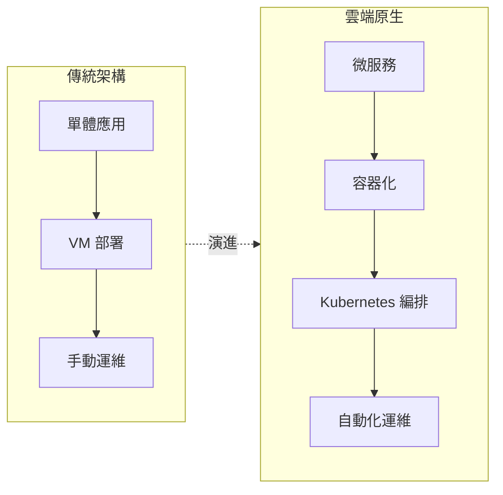
```mermaid
graph LR
    subgraph 傳統架構
        A[單體應用] --> B[VM 部署]
        B --> C[手動運維]
    end
    
    subgraph 雲端原生
        D[微服務] --> E[容器化]
        E --> F[Kubernetes 編排]
        F --> G[自動化運維]
    end
    
    傳統架構 -.->|演進| 雲端原生
```

---

### 1.3 CNCF 的角色與定位

#### 什麼是 CNCF

**CNCF（Cloud Native Computing Foundation）** 成立於 2015 年，是 Linux Foundation 旗下的非營利組織，致力於推動雲端原生技術的發展與標準化。

#### CNCF 的使命

1. **孵化與推廣** 開源雲端原生專案
2. **建立標準** 促進技術互通性
3. **培育社群** 匯聚開發者與企業
4. **認證培訓** 提供 CKA/CKAD/CKS 等認證

#### 專案成熟度等級

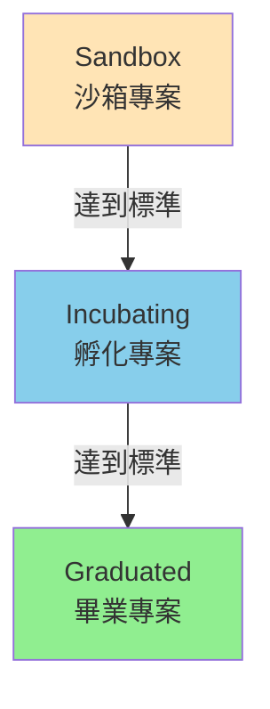
```mermaid
graph TD
    A[Sandbox<br/>沙箱專案] -->|達到標準| B[Incubating<br/>孵化專案]
    B -->|達到標準| C[Graduated<br/>畢業專案]
    
    style A fill:#FFE4B5
    style B fill:#87CEEB
    style C fill:#90EE90
```

| 等級 | 說明 | 代表專案 |
|------|------|----------|
| **Graduated** | 成熟穩定，廣泛採用 | Kubernetes, Prometheus, Envoy, containerd |
| **Incubating** | 積極發展，社群活躍 | Argo, Cilium, Flux, OpenTelemetry |
| **Sandbox** | 早期階段，實驗性質 | 眾多新興專案 |

---

### 1.4 CNCF Landscape 全景圖說明

CNCF Landscape 是一張涵蓋所有雲端原生相關專案與產品的全景圖，可在 [landscape.cncf.io](https://landscape.cncf.io) 查看。

#### 主要分類

```
CNCF Landscape 主要分類
├── App Definition & Development（應用定義與開發）
│   ├── Database
│   ├── Streaming & Messaging
│   ├── Application Definition & Image Build
│   └── CI/CD
├── Orchestration & Management（編排與管理）
│   ├── Scheduling & Orchestration
│   ├── Coordination & Service Discovery
│   ├── Service Proxy
│   └── API Gateway
├── Runtime（執行環境）
│   ├── Container Runtime
│   ├── Cloud Native Network
│   └── Cloud Native Storage
├── Provisioning（基礎設施供應）
│   ├── Automation & Configuration
│   ├── Container Registry
│   ├── Security & Compliance
│   └── Key Management
├── Observability & Analysis（可觀測性與分析）
│   ├── Monitoring
│   ├── Logging
│   ├── Tracing
│   └── Chaos Engineering
└── Platform（平台）
    ├── Certified Kubernetes Distribution
    ├── Certified Kubernetes Platform
    └── PaaS/Container Service
```

#### 如何使用 Landscape

1. **技術選型參考**：了解各領域有哪些可選方案
2. **生態系評估**：評估專案的成熟度與社群活躍度
3. **趨勢追蹤**：掌握雲端原生技術發展方向

---

### 1.5 雲端原生帶來的價值與挑戰

#### 價值

| 價值面向 | 具體效益 |
|----------|----------|
| **業務敏捷** | 加速產品上市時間，快速回應市場需求 |
| **成本優化** | 資源按需使用，提高利用率 |
| **高可用性** | 自動故障轉移與恢復，減少停機時間 |
| **規模彈性** | 自動擴縮容，應對流量波動 |
| **創新加速** | 降低試錯成本，鼓勵創新實驗 |

#### 挑戰

| 挑戰面向 | 說明 | 因應策略 |
|----------|------|----------|
| **學習曲線** | 技術棧複雜，需要時間學習 | 分階段導入，建立培訓機制 |
| **架構複雜度** | 分散式系統除錯困難 | 導入可觀測性工具 |
| **安全風險** | 攻擊面擴大，容器安全議題 | 落實 DevSecOps，安全左移 |
| **組織變革** | 需要 DevOps 文化轉型 | 高層支持，漸進式推動 |
| **技術債務** | 既有系統改造成本 | 制定遷移策略，優先處理關鍵系統 |

#### 實務案例：金融業導入雲端原生

某大型銀行導入雲端原生的效益：
- 部署頻率：從每月 1 次提升至每日多次
- 部署時間：從 4 小時縮短至 15 分鐘
- 故障恢復：從數小時縮短至分鐘級
- 資源利用率：提升 40%

> ⚠️ **注意事項**：金融業導入雲端原生需特別關注合規要求（如個資保護、稽核軌跡），並確保與監理機關充分溝通。

---

## 2. 雲端原生系統整體架構

### 2.1 典型雲端原生參考架構

#### 整體架構圖

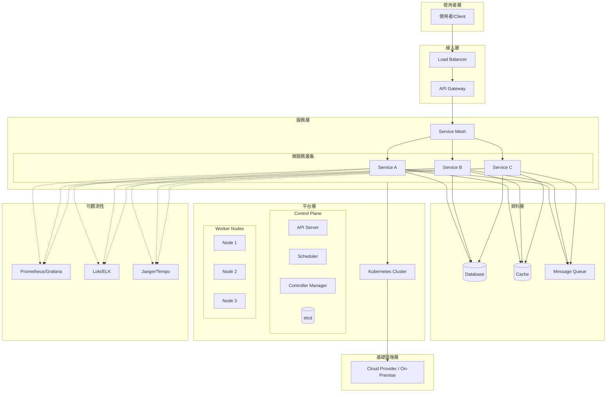
```mermaid
graph TB
    subgraph 使用者層
        U[使用者/Client]
    end
    
    subgraph 接入層
        LB[Load Balancer]
        APIGW[API Gateway]
    end
    
    subgraph 服務層
        SM[Service Mesh]
        subgraph 微服務叢集
            S1[Service A]
            S2[Service B]
            S3[Service C]
        end
    end
    
    subgraph 資料層
        DB[(Database)]
        CACHE[(Cache)]
        MQ[Message Queue]
    end
    
    subgraph 平台層
        K8S[Kubernetes Cluster]
        subgraph Control Plane
            API[API Server]
            SCHED[Scheduler]
            CM[Controller Manager]
            ETCD[(etcd)]
        end
        subgraph Worker Nodes
            N1[Node 1]
            N2[Node 2]
            N3[Node 3]
        end
    end
    
    subgraph 可觀測性
        MON[Prometheus/Grafana]
        LOG[Loki/ELK]
        TRACE[Jaeger/Tempo]
    end
    
    subgraph 基礎設施層
        CLOUD[Cloud Provider / On-Premise]
    end
    
    U --> LB
    LB --> APIGW
    APIGW --> SM
    SM --> S1 & S2 & S3
    S1 & S2 & S3 --> DB & CACHE & MQ
    S1 & S2 & S3 -.-> MON & LOG & TRACE
    微服務叢集 --> K8S
    K8S --> CLOUD
```

---

### 2.2 核心分層說明

#### 2.2.1 基礎設施層（Infrastructure Layer）

負責提供底層運算、儲存、網路資源。

| 選項 | 說明 | 適用場景 |
|------|------|----------|
| **公有雲 IaaS** | AWS、Azure、GCP | 快速啟動、彈性擴展 |
| **私有雲** | OpenStack、VMware | 資料主權要求、合規需求 |
| **裸金屬** | Bare Metal Server | 高效能運算、特殊硬體需求 |
| **混合雲** | 公有雲 + 私有雲 | 兼顧彈性與安全 |

#### 2.2.2 容器層（Container Runtime Layer）

負責容器的建立、執行與管理。

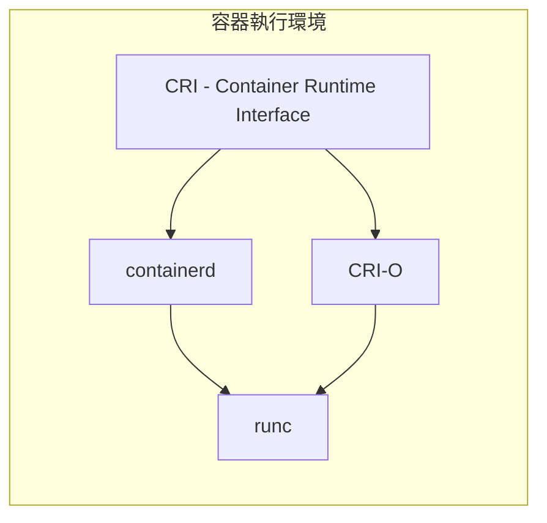
```mermaid
graph LR
    subgraph 容器執行環境
        CRI[CRI - Container Runtime Interface]
        CRI --> containerd
        CRI --> CRI-O
        containerd --> runc
        CRI-O --> runc
    end
```

**主要元件**：
- **containerd**：CNCF 畢業專案，業界標準容器執行環境
- **CRI-O**：專為 Kubernetes 設計的輕量級容器執行環境
- **runc**：OCI 標準容器執行工具

#### 2.2.3 編排層（Orchestration Layer）

Kubernetes 作為容器編排的事實標準，負責：

| 功能 | 說明 |
|------|------|
| **調度（Scheduling）** | 決定 Pod 在哪個 Node 上執行 |
| **自動修復（Self-healing）** | 自動重啟失敗的容器 |
| **擴縮容（Scaling）** | 根據負載自動調整實例數 |
| **服務發現（Service Discovery）** | 自動註冊與發現服務 |
| **負載平衡（Load Balancing）** | 分配流量到多個實例 |
| **配置管理（Configuration）** | 管理應用配置與密鑰 |

#### 2.2.4 平台層（Platform Layer）

提供更高階的平台能力。

**Service Mesh（服務網格）**：
- 處理服務間通訊
- 流量管理、熔斷、重試
- mTLS 加密通訊
- 代表專案：Istio、Linkerd

**API Gateway（API 閘道）**：
- 統一入口點
- 認證授權
- 限流、熔斷
- 代表專案：Kong、Ambassador、APISIX

#### 2.2.5 可觀測性（Observability Layer）

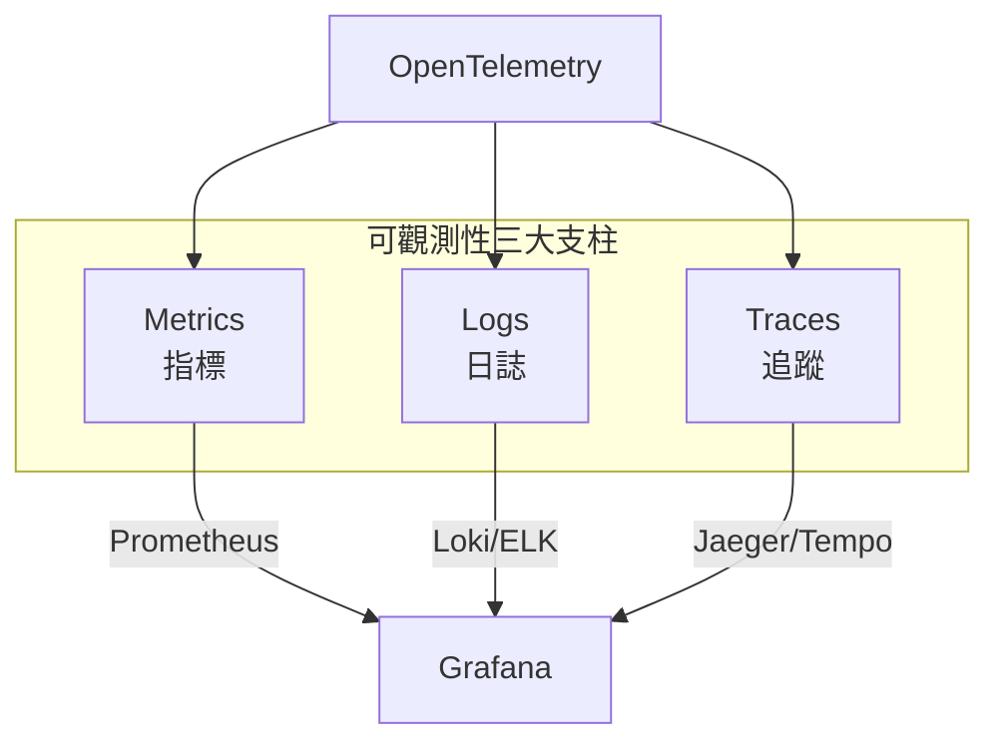
```mermaid
graph TB
    subgraph 可觀測性三大支柱
        M[Metrics<br/>指標]
        L[Logs<br/>日誌]
        T[Traces<br/>追蹤]
    end
    
    M --> |Prometheus| G[Grafana]
    L --> |Loki/ELK| G
    T --> |Jaeger/Tempo| G
    
    OT[OpenTelemetry] --> M & L & T
```

| 支柱 | 用途 | 工具 |
|------|------|------|
| **Metrics** | 量化系統狀態，用於告警與趨勢分析 | Prometheus, Grafana |
| **Logs** | 記錄事件詳情，用於除錯與稽核 | Loki, ELK, Fluent Bit |
| **Traces** | 追蹤請求在分散式系統中的路徑 | Jaeger, Zipkin, Tempo |

#### 2.2.6 安全層（Security Layer）

```
安全層面向
├── 身份與存取管理
│   ├── RBAC（Role-Based Access Control）
│   ├── Service Account
│   └── OIDC 整合
├── 網路安全
│   ├── Network Policy
│   ├── Service Mesh mTLS
│   └── Pod Security Standards
├── 供應鏈安全
│   ├── Image Scanning
│   ├── Image Signing
│   └── SBOM（Software Bill of Materials）
└── 執行時期安全
    ├── Falco（異常偵測）
    ├── OPA/Kyverno（Policy Enforcement）
    └── Secrets Management
```

---

### 2.3 微服務與事件驅動架構

#### 微服務架構在雲端原生中的角色

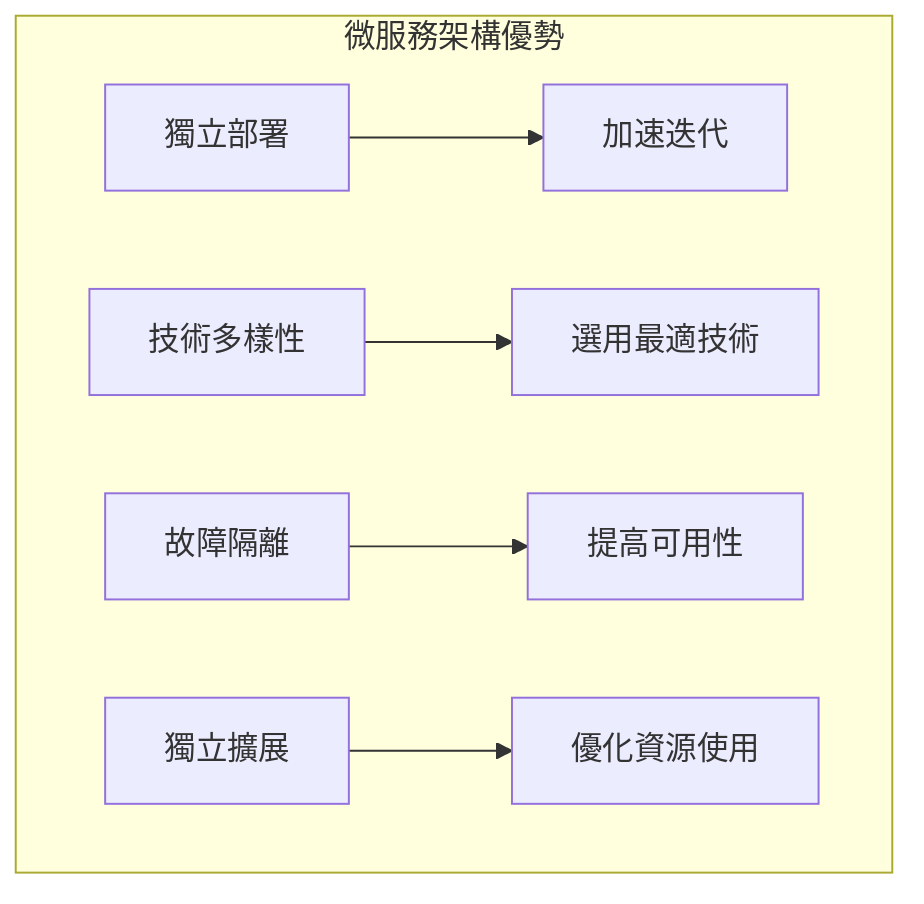
```mermaid
graph TB
    subgraph 微服務架構優勢
        A[獨立部署] --> E[加速迭代]
        B[技術多樣性] --> F[選用最適技術]
        C[故障隔離] --> G[提高可用性]
        D[獨立擴展] --> H[優化資源使用]
    end
```

**微服務設計原則**：
1. **單一職責**：每個服務只做一件事
2. **鬆耦合**：服務間透過 API 通訊
3. **高內聚**：相關功能集中在同一服務
4. **獨立部署**：服務可獨立發布與擴展

#### 事件驅動架構（Event-Driven Architecture）

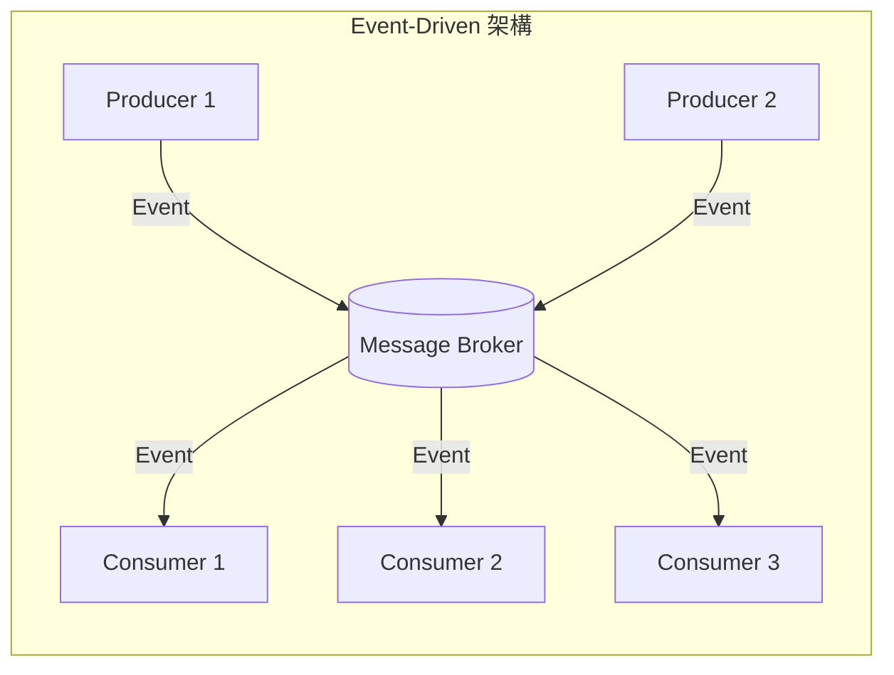
```mermaid
graph LR
    subgraph Event-Driven 架構
        P1[Producer 1] --> |Event| MQ[(Message Broker)]
        P2[Producer 2] --> |Event| MQ
        MQ --> |Event| C1[Consumer 1]
        MQ --> |Event| C2[Consumer 2]
        MQ --> |Event| C3[Consumer 3]
    end
```

**適用場景**：
- 非同步處理需求
- 服務解耦
- 事件溯源（Event Sourcing）
- CQRS 模式

**常用技術**：
- Apache Kafka
- NATS
- RabbitMQ
- Cloud Events

> ⚠️ **實務建議**：微服務不是萬靈丹，建議先從 Monolith 開始，當團隊規模與業務複雜度達到一定程度再逐步拆分。過早拆分可能導致不必要的複雜度。

---

## 3. CNCF 核心專案分類與說明

### 3.1 Container & Runtime

#### containerd

**定位**：業界標準容器執行環境，CNCF 畢業專案

**主要功能**：
- 容器生命週期管理（建立、啟動、停止、刪除）
- 映像檔管理（拉取、推送、儲存）
- 網路與儲存整合

**使用範例**：
```bash
# 使用 ctr（containerd CLI）操作容器
# 拉取映像檔
ctr images pull docker.io/library/nginx:latest

# 建立並啟動容器
ctr run -d docker.io/library/nginx:latest nginx-container

# 列出執行中的容器
ctr containers list
```

#### CRI-O

**定位**：專為 Kubernetes 設計的輕量級容器執行環境

**特點**：
- 完全符合 CRI 規範
- 比 containerd 更輕量
- 專注於 Kubernetes 使用場景

---

### 3.2 Orchestration & Management

#### Kubernetes

**定位**：容器編排的事實標準，CNCF 旗艦專案

**核心概念**：

| 概念 | 說明 |
|------|------|
| **Pod** | 最小部署單位，一或多個容器的集合 |
| **Deployment** | 管理 Pod 的副本數與更新策略 |
| **Service** | 提供穩定的網路端點 |
| **Namespace** | 資源隔離與多租戶支援 |
| **ConfigMap/Secret** | 配置與機密管理 |

**基本操作**：
```bash
# 部署應用
kubectl apply -f deployment.yaml

# 查看 Pod 狀態
kubectl get pods -n <namespace>

# 查看服務
kubectl get svc -n <namespace>

# 查看日誌
kubectl logs -f <pod-name> -n <namespace>

# 進入容器
kubectl exec -it <pod-name> -n <namespace> -- /bin/sh
```

---

### 3.3 Networking

#### CNI（Container Network Interface）

**定位**：容器網路標準介面

**常見 CNI 插件**：

| 插件 | 特點 | 適用場景 |
|------|------|----------|
| **Calico** | 支援 Network Policy，高效能 | 生產環境首選 |
| **Cilium** | eBPF 技術，進階安全功能 | 需要 L7 Policy 的場景 |
| **Flannel** | 簡單易用 | 開發測試環境 |
| **Weave** | 支援加密通訊 | 需要網路加密的場景 |

#### CoreDNS

**定位**：Kubernetes 預設 DNS 服務，CNCF 畢業專案

**功能**：
- 服務發現
- DNS-based 負載平衡
- 可擴展的插件架構

**配置範例**：
```yaml
apiVersion: v1
kind: ConfigMap
metadata:
  name: coredns
  namespace: kube-system
data:
  Corefile: |
    .:53 {
        errors
        health {
          lameduck 5s
        }
        ready
        kubernetes cluster.local in-addr.arpa ip6.arpa {
          pods insecure
          fallthrough in-addr.arpa ip6.arpa
        }
        prometheus :9153
        forward . /etc/resolv.conf
        cache 30
        loop
        reload
        loadbalance
    }
```

#### Cilium

**定位**：基於 eBPF 的高效能網路與安全方案

**特點**：
- eBPF 實現，核心層級效能
- L3-L7 網路策略
- 透明加密（WireGuard）
- Hubble 可觀測性

---

### 3.4 Service Mesh

#### Istio

**定位**：功能最完整的服務網格，社群最活躍

**架構**：
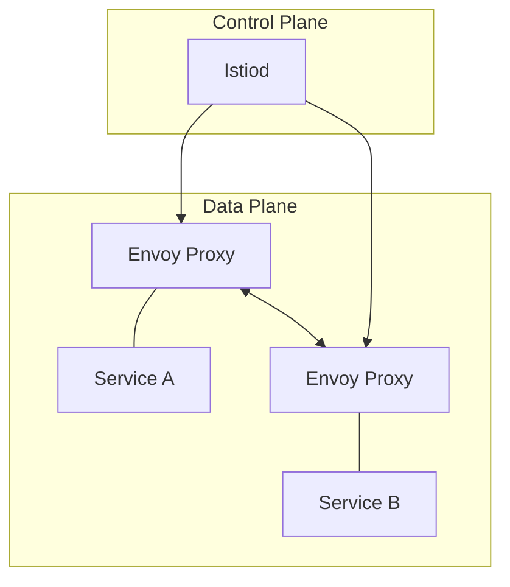
```mermaid
graph TB
    subgraph Data Plane
        E1[Envoy Proxy] --- S1[Service A]
        E2[Envoy Proxy] --- S2[Service B]
        E1 <--> E2
    end
    
    subgraph Control Plane
        IS[Istiod]
    end
    
    IS --> E1 & E2
```

**核心功能**：
- 流量管理（路由、負載平衡、熔斷）
- 安全（mTLS、認證授權）
- 可觀測性（Metrics、Traces、Access Logs）

**VirtualService 範例**：
```yaml
apiVersion: networking.istio.io/v1beta1
kind: VirtualService
metadata:
  name: my-service
spec:
  hosts:
  - my-service
  http:
  - match:
    - headers:
        x-version:
          exact: v2
    route:
    - destination:
        host: my-service
        subset: v2
  - route:
    - destination:
        host: my-service
        subset: v1
      weight: 90
    - destination:
        host: my-service
        subset: v2
      weight: 10
```

#### Linkerd

**定位**：輕量級服務網格，易於上手

**特點**：
- 資源消耗低
- 安裝簡單
- Rust 實現的 micro-proxy

---

### 3.5 API Gateway & Ingress

#### Envoy

**定位**：高效能 L7 代理，多個專案的基礎

**特點**：
- C++ 實現，高效能
- 豐富的可觀測性
- 動態配置更新
- 被 Istio、Ambassador 等專案採用

#### Kong

**定位**：企業級 API Gateway

**功能**：
- 認證授權（API Key、JWT、OAuth）
- 限流與熔斷
- 請求/回應轉換
- 插件生態系豐富

**配置範例**：
```yaml
apiVersion: configuration.konghq.com/v1
kind: KongPlugin
metadata:
  name: rate-limiting
config:
  minute: 100
  policy: local
plugin: rate-limiting
---
apiVersion: networking.k8s.io/v1
kind: Ingress
metadata:
  name: my-api
  annotations:
    konghq.com/plugins: rate-limiting
spec:
  ingressClassName: kong
  rules:
  - host: api.example.com
    http:
      paths:
      - path: /
        pathType: Prefix
        backend:
          service:
            name: my-service
            port:
              number: 80
```

---

### 3.6 Observability

#### Prometheus

**定位**：雲端原生監控的事實標準，CNCF 第二個畢業專案

**架構**：
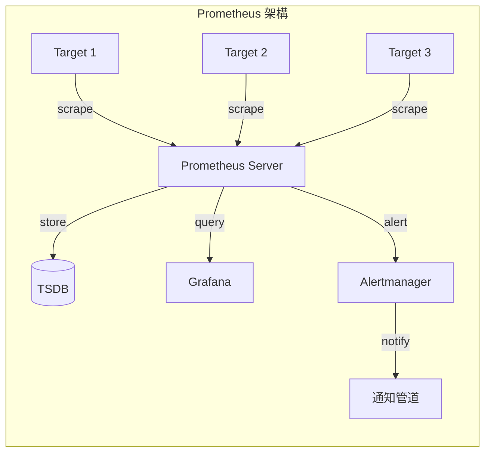
```mermaid
graph LR
    subgraph Prometheus 架構
        T1[Target 1] --> |scrape| P[Prometheus Server]
        T2[Target 2] --> |scrape| P
        T3[Target 3] --> |scrape| P
        P --> |store| TSDB[(TSDB)]
        P --> |query| G[Grafana]
        P --> |alert| AM[Alertmanager]
        AM --> |notify| N[通知管道]
    end
```

**PromQL 範例**：
```promql
# CPU 使用率
100 - (avg by (instance) (rate(node_cpu_seconds_total{mode="idle"}[5m])) * 100)

# 記憶體使用率
(1 - node_memory_MemAvailable_bytes / node_memory_MemTotal_bytes) * 100

# HTTP 請求速率
rate(http_requests_total[5m])

# P99 延遲
histogram_quantile(0.99, rate(http_request_duration_seconds_bucket[5m]))
```

#### Grafana

**定位**：可視化與儀表板平台

**功能**：
- 多資料來源支援
- 豐富的視覺化元件
- 告警功能
- 儀表板分享

#### OpenTelemetry

**定位**：可觀測性資料收集的統一標準

**組成**：
- **API**：定義 Traces、Metrics、Logs 的標準介面
- **SDK**：各語言的實作
- **Collector**：資料收集、處理、匯出

**Java Agent 使用範例**：
```bash
java -javaagent:opentelemetry-javaagent.jar \
     -Dotel.service.name=my-service \
     -Dotel.exporter.otlp.endpoint=http://otel-collector:4317 \
     -jar my-app.jar
```

#### Jaeger

**定位**：分散式追蹤系統

**功能**：
- 追蹤請求在微服務間的路徑
- 分析效能瓶頸
- 根因分析

---

### 3.7 Logging

#### Fluent Bit

**定位**：輕量級日誌收集器

**特點**：
- 資源消耗極低
- 支援多種輸入/輸出
- 適合作為 DaemonSet 部署

**配置範例**：
```ini
[SERVICE]
    Flush         1
    Log_Level     info
    Daemon        off

[INPUT]
    Name              tail
    Path              /var/log/containers/*.log
    Parser            docker
    Tag               kube.*
    Refresh_Interval  5

[FILTER]
    Name                kubernetes
    Match               kube.*
    Kube_URL            https://kubernetes.default.svc:443
    Kube_CA_File        /var/run/secrets/kubernetes.io/serviceaccount/ca.crt
    Kube_Token_File     /var/run/secrets/kubernetes.io/serviceaccount/token

[OUTPUT]
    Name            loki
    Match           *
    Host            loki
    Port            3100
    Labels          job=fluent-bit
```

#### Loki

**定位**：專為雲端原生設計的日誌聚合系統

**特點**：
- 不索引日誌內容，只索引標籤
- 與 Prometheus 相似的標籤模型
- 儲存成本低

---

### 3.8 Security

#### Falco

**定位**：執行時期安全監控

**功能**：
- 偵測容器異常行為
- Syscall 層級監控
- 自訂規則

**規則範例**：
```yaml
- rule: Terminal shell in container
  desc: A shell was spawned in a container
  condition: >
    spawned_process and container and shell_procs
  output: >
    Shell spawned in container (user=%user.name container=%container.name 
    shell=%proc.name parent=%proc.pname cmdline=%proc.cmdline)
  priority: WARNING
```

#### OPA（Open Policy Agent）

**定位**：通用政策引擎

**使用場景**：
- Kubernetes Admission Control
- API 授權
- 資料過濾

**Rego 政策範例**：
```rego
package kubernetes.admission

deny[msg] {
    input.request.kind.kind == "Pod"
    container := input.request.object.spec.containers[_]
    not container.securityContext.runAsNonRoot
    msg := sprintf("Container %s must run as non-root", [container.name])
}

deny[msg] {
    input.request.kind.kind == "Pod"
    container := input.request.object.spec.containers[_]
    not container.resources.limits.memory
    msg := sprintf("Container %s must have memory limits", [container.name])
}
```

#### Kyverno

**定位**：Kubernetes 原生政策管理

**特點**：
- 使用 YAML 定義政策
- 不需學習新語言
- 支援 Validation、Mutation、Generation

**政策範例**：
```yaml
apiVersion: kyverno.io/v1
kind: ClusterPolicy
metadata:
  name: require-labels
spec:
  validationFailureAction: Enforce
  rules:
  - name: check-team-label
    match:
      any:
      - resources:
          kinds:
          - Pod
    validate:
      message: "Label 'team' is required"
      pattern:
        metadata:
          labels:
            team: "?*"
```

---

### 3.9 CI/CD

#### Argo CD

**定位**：Kubernetes 原生 GitOps 持續交付工具

**核心概念**：
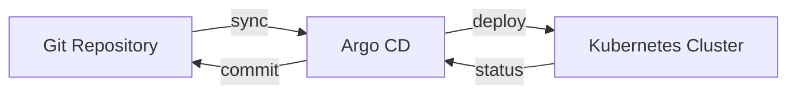
```mermaid
graph LR
    G[Git Repository] --> |sync| A[Argo CD]
    A --> |deploy| K[Kubernetes Cluster]
    K --> |status| A
    A --> |commit| G
```

**Application 範例**：
```yaml
apiVersion: argoproj.io/v1alpha1
kind: Application
metadata:
  name: my-app
  namespace: argocd
spec:
  project: default
  source:
    repoURL: https://github.com/org/repo.git
    targetRevision: HEAD
    path: k8s/overlays/production
  destination:
    server: https://kubernetes.default.svc
    namespace: production
  syncPolicy:
    automated:
      prune: true
      selfHeal: true
    syncOptions:
    - CreateNamespace=true
```

#### Tekton

**定位**：Kubernetes 原生 CI/CD Pipeline

**特點**：
- 宣告式 Pipeline 定義
- 可重用的 Task
- 與 Kubernetes 深度整合

---

### 3.10 Storage

#### Rook

**定位**：Kubernetes 儲存編排平台

**支援儲存系統**：
- Ceph（最成熟）
- NFS
- Cassandra

#### CSI（Container Storage Interface）

**定位**：容器儲存標準介面

**常見 CSI Driver**：
- AWS EBS CSI Driver
- Azure Disk CSI Driver
- GCE PD CSI Driver
- NFS CSI Driver

---

### 3.11 Messaging & Streaming

#### Apache Kafka

**定位**：分散式串流平台

**使用場景**：
- 事件串流
- 日誌聚合
- 事件溯源

#### NATS

**定位**：輕量級訊息系統

**特點**：
- 極低延遲
- 簡單易用
- 支援多種模式（Pub/Sub、Request/Reply、Queue）

> ⚠️ **實務建議**：選擇 CNCF 專案時，優先考慮 Graduated 專案，其次是 Incubating 專案。Sandbox 專案可用於技術研究，但生產環境需謹慎評估。

---

## 4. 系統安裝與基礎環境建置

### 4.1 雲端原生平台建置方式比較

| 建置方式 | 適用場景 | 優點 | 缺點 |
|----------|----------|------|------|
| **Managed Kubernetes** | 快速啟動、生產環境 | 省去維運負擔、自動升級 | 成本較高、彈性受限 |
| **Self-Managed（kubeadm）** | 私有雲、客製需求 | 完全控制、彈性高 | 維運負擔重 |
| **本地開發（kind/minikube）** | 開發測試 | 快速啟動、資源消耗低 | 僅適合本地使用 |

### 4.2 Managed Kubernetes 比較

| 平台 | 服務名稱 | 特點 |
|------|----------|------|
| **AWS** | EKS | 與 AWS 生態系深度整合 |
| **Azure** | AKS | 企業整合佳、AD 整合 |
| **GCP** | GKE | 技術領先、Autopilot 模式 |

### 4.3 Self-Managed Kubernetes 安裝（kubeadm）

#### 環境準備

**系統需求**：
- OS：Ubuntu 22.04 / RHEL 8 / Rocky Linux 8
- CPU：Control Plane 2 核心以上、Worker 1 核心以上
- RAM：Control Plane 2GB 以上、Worker 1GB 以上
- 網路：節點間可互相通訊

**前置準備**：
```bash
# 關閉 swap
sudo swapoff -a
sudo sed -i '/ swap / s/^/#/' /etc/fstab

# 載入必要模組
cat <<EOF | sudo tee /etc/modules-load.d/k8s.conf
overlay
br_netfilter
EOF

sudo modprobe overlay
sudo modprobe br_netfilter

# 設定 sysctl
cat <<EOF | sudo tee /etc/sysctl.d/k8s.conf
net.bridge.bridge-nf-call-iptables  = 1
net.bridge.bridge-nf-call-ip6tables = 1
net.ipv4.ip_forward                 = 1
EOF

sudo sysctl --system
```

#### 安裝 containerd

```bash
# 安裝 containerd
sudo apt-get update
sudo apt-get install -y containerd

# 產生預設配置
sudo mkdir -p /etc/containerd
containerd config default | sudo tee /etc/containerd/config.toml

# 啟用 SystemdCgroup
sudo sed -i 's/SystemdCgroup = false/SystemdCgroup = true/g' /etc/containerd/config.toml

# 重啟 containerd
sudo systemctl restart containerd
sudo systemctl enable containerd
```

#### 安裝 kubeadm、kubelet、kubectl

```bash
# 新增 Kubernetes apt 倉庫
sudo apt-get update
sudo apt-get install -y apt-transport-https ca-certificates curl gpg

curl -fsSL https://pkgs.k8s.io/core:/stable:/v1.29/deb/Release.key | sudo gpg --dearmor -o /etc/apt/keyrings/kubernetes-apt-keyring.gpg

echo 'deb [signed-by=/etc/apt/keyrings/kubernetes-apt-keyring.gpg] https://pkgs.k8s.io/core:/stable:/v1.29/deb/ /' | sudo tee /etc/apt/sources.list.d/kubernetes.list

# 安裝
sudo apt-get update
sudo apt-get install -y kubelet kubeadm kubectl
sudo apt-mark hold kubelet kubeadm kubectl
```

#### 初始化 Control Plane

```bash
# 初始化叢集
sudo kubeadm init \
  --pod-network-cidr=10.244.0.0/16 \
  --apiserver-advertise-address=<CONTROL_PLANE_IP>

# 設定 kubectl
mkdir -p $HOME/.kube
sudo cp -i /etc/kubernetes/admin.conf $HOME/.kube/config
sudo chown $(id -u):$(id -g) $HOME/.kube/config
```

#### 安裝 CNI（以 Calico 為例）

```bash
# 安裝 Calico
kubectl apply -f https://raw.githubusercontent.com/projectcalico/calico/v3.27.0/manifests/calico.yaml

# 驗證安裝
kubectl get pods -n kube-system
```

#### 加入 Worker Node

```bash
# 在 Worker Node 執行（使用 kubeadm init 輸出的指令）
sudo kubeadm join <CONTROL_PLANE_IP>:6443 \
  --token <TOKEN> \
  --discovery-token-ca-cert-hash sha256:<HASH>
```

### 4.4 必要 Add-ons 安裝建議

| Add-on | 用途 | 建議工具 |
|--------|------|----------|
| **CNI** | 容器網路 | Calico / Cilium |
| **Ingress Controller** | HTTP 路由 | NGINX Ingress / Kong |
| **Metrics Server** | 資源監控 | metrics-server |
| **DNS** | 服務發現 | CoreDNS（預設） |
| **Dashboard** | Web UI | Kubernetes Dashboard |
| **Storage** | 持久化儲存 | 依環境選擇 CSI Driver |

**安裝 Metrics Server**：
```bash
kubectl apply -f https://github.com/kubernetes-sigs/metrics-server/releases/latest/download/components.yaml
```

**安裝 NGINX Ingress Controller**：
```bash
kubectl apply -f https://raw.githubusercontent.com/kubernetes/ingress-nginx/controller-v1.9.5/deploy/static/provider/cloud/deploy.yaml
```

### 4.5 開發、測試、正式環境差異設計

| 面向 | 開發環境 | 測試環境 | 正式環境 |
|------|----------|----------|----------|
| **叢集規模** | 單節點 / kind | 3 節點 | 多節點 HA |
| **資源配置** | 最小化 | 接近生產 | 依需求規劃 |
| **HA 設計** | 否 | 選配 | 必要 |
| **監控告警** | 基本 | 完整 | 完整 + 值班 |
| **備份策略** | 無 | 定期 | 定期 + 異地 |
| **安全措施** | 寬鬆 | 中等 | 嚴格 |
| **部署方式** | 手動 / CI | CI/CD | GitOps |

> ⚠️ **實務建議**：生產環境建議使用 Managed Kubernetes 或具備維運能力的團隊自建。Control Plane 至少 3 節點以確保 etcd 高可用。

---

## 5. 系統設定與組態管理

### 5.1 Kubernetes Namespace 與 RBAC 設計

#### Namespace 設計原則

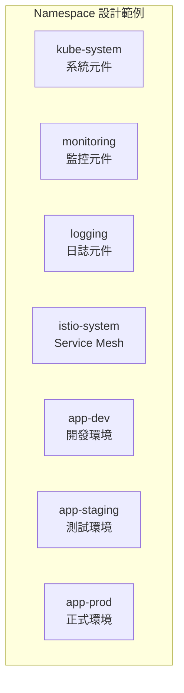
```mermaid
graph TB
    subgraph Namespace 設計範例
        NS1[kube-system<br/>系統元件]
        NS2[monitoring<br/>監控元件]
        NS3[logging<br/>日誌元件]
        NS4[istio-system<br/>Service Mesh]
        NS5[app-dev<br/>開發環境]
        NS6[app-staging<br/>測試環境]
        NS7[app-prod<br/>正式環境]
    end
```

**Namespace 規劃策略**：

| 策略 | 說明 | 適用場景 |
|------|------|----------|
| **依環境區分** | dev / staging / prod | 小型團隊 |
| **依團隊區分** | team-a / team-b | 多團隊組織 |
| **依應用區分** | app-frontend / app-backend | 微服務架構 |
| **混合策略** | team-a-prod / team-a-dev | 大型組織 |

**建立 Namespace**：
```yaml
apiVersion: v1
kind: Namespace
metadata:
  name: app-prod
  labels:
    env: production
    team: platform
```

#### RBAC 設計

**核心概念**：
- **Role / ClusterRole**：定義權限
- **RoleBinding / ClusterRoleBinding**：綁定權限到使用者/群組

**Role 範例**：
```yaml
apiVersion: rbac.authorization.k8s.io/v1
kind: Role
metadata:
  namespace: app-prod
  name: developer
rules:
- apiGroups: [""]
  resources: ["pods", "pods/log", "services", "configmaps"]
  verbs: ["get", "list", "watch"]
- apiGroups: ["apps"]
  resources: ["deployments"]
  verbs: ["get", "list", "watch"]
```

**RoleBinding 範例**：
```yaml
apiVersion: rbac.authorization.k8s.io/v1
kind: RoleBinding
metadata:
  name: developer-binding
  namespace: app-prod
subjects:
- kind: User
  name: john@example.com
  apiGroup: rbac.authorization.k8s.io
roleRef:
  kind: Role
  name: developer
  apiGroup: rbac.authorization.k8s.io
```

---

### 5.2 ConfigMap / Secret 使用方式

#### ConfigMap

用於儲存非機密的配置資料。

**建立 ConfigMap**：
```yaml
apiVersion: v1
kind: ConfigMap
metadata:
  name: app-config
  namespace: app-prod
data:
  # 單一值
  LOG_LEVEL: "INFO"
  DATABASE_HOST: "db.example.com"
  
  # 檔案內容
  application.properties: |
    server.port=8080
    spring.datasource.url=jdbc:postgresql://db:5432/mydb
```

**使用 ConfigMap**：
```yaml
apiVersion: apps/v1
kind: Deployment
metadata:
  name: my-app
spec:
  template:
    spec:
      containers:
      - name: app
        image: my-app:1.0
        # 環境變數方式
        envFrom:
        - configMapRef:
            name: app-config
        # 掛載為檔案
        volumeMounts:
        - name: config-volume
          mountPath: /app/config
      volumes:
      - name: config-volume
        configMap:
          name: app-config
```

#### Secret

用於儲存機密資料（密碼、金鑰等）。

**建立 Secret**：
```bash
# 命令列方式
kubectl create secret generic db-credentials \
  --from-literal=username=admin \
  --from-literal=password=secretpassword \
  -n app-prod
```

```yaml
# YAML 方式（需 base64 編碼）
apiVersion: v1
kind: Secret
metadata:
  name: db-credentials
  namespace: app-prod
type: Opaque
data:
  username: YWRtaW4=  # echo -n 'admin' | base64
  password: c2VjcmV0cGFzc3dvcmQ=  # echo -n 'secretpassword' | base64
```

**使用 Secret**：
```yaml
apiVersion: apps/v1
kind: Deployment
metadata:
  name: my-app
spec:
  template:
    spec:
      containers:
      - name: app
        image: my-app:1.0
        env:
        - name: DB_USERNAME
          valueFrom:
            secretKeyRef:
              name: db-credentials
              key: username
        - name: DB_PASSWORD
          valueFrom:
            secretKeyRef:
              name: db-credentials
              key: password
```

> ⚠️ **安全建議**：Secret 在 etcd 中預設僅 base64 編碼，非加密。生產環境建議啟用 etcd 加密或使用外部密鑰管理系統（如 HashiCorp Vault、AWS Secrets Manager）。

---

### 5.3 Helm 與 Kustomize 的角色

#### Helm

**定位**：Kubernetes 的套件管理器

**核心概念**：
- **Chart**：應用的打包格式
- **Release**：Chart 的部署實例
- **Repository**：Chart 的儲存庫

**常用指令**：
```bash
# 新增 Repository
helm repo add bitnami https://charts.bitnami.com/bitnami
helm repo update

# 搜尋 Chart
helm search repo nginx

# 安裝 Chart
helm install my-nginx bitnami/nginx \
  --namespace web \
  --set replicaCount=3

# 升級 Release
helm upgrade my-nginx bitnami/nginx \
  --namespace web \
  --set replicaCount=5

# 查看已安裝的 Release
helm list -n web

# 解除安裝
helm uninstall my-nginx -n web
```

**建立自訂 Chart**：
```bash
# 建立 Chart 骨架
helm create my-chart

# Chart 目錄結構
my-chart/
├── Chart.yaml          # Chart 元資料
├── values.yaml         # 預設配置值
├── templates/          # Kubernetes 資源模板
│   ├── deployment.yaml
│   ├── service.yaml
│   └── ingress.yaml
└── charts/             # 相依 Chart
```

#### Kustomize

**定位**：Kubernetes 原生配置管理工具

**核心概念**：
- **Base**：基礎配置
- **Overlay**：環境特定的覆蓋配置

**目錄結構範例**：
```
k8s/
├── base/
│   ├── kustomization.yaml
│   ├── deployment.yaml
│   └── service.yaml
├── overlays/
│   ├── dev/
│   │   ├── kustomization.yaml
│   │   └── replica-patch.yaml
│   └── prod/
│       ├── kustomization.yaml
│       └── replica-patch.yaml
```

**base/kustomization.yaml**：
```yaml
apiVersion: kustomize.config.k8s.io/v1beta1
kind: Kustomization
resources:
- deployment.yaml
- service.yaml
```

**overlays/prod/kustomization.yaml**：
```yaml
apiVersion: kustomize.config.k8s.io/v1beta1
kind: Kustomization
resources:
- ../../base
namespace: production
patches:
- path: replica-patch.yaml
images:
- name: my-app
  newTag: v1.2.3
```

**使用 Kustomize**：
```bash
# 查看產生的 YAML
kubectl kustomize overlays/prod

# 直接部署
kubectl apply -k overlays/prod
```

#### Helm vs Kustomize 比較

| 面向 | Helm | Kustomize |
|------|------|-----------|
| **配置方式** | 模板化（Go template） | 覆蓋式（Patch） |
| **學習曲線** | 較陡 | 較平緩 |
| **套件管理** | 支援（Repository） | 不支援 |
| **版本管理** | 有 Release 概念 | 依賴 Git |
| **適用場景** | 複雜應用、第三方應用 | 自有應用、多環境配置 |

---

### 5.4 GitOps 架構（以 Argo CD 為例）

#### GitOps 核心原則

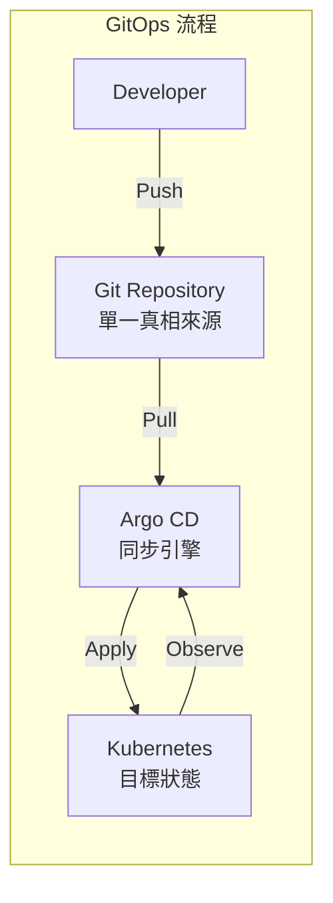
```mermaid
graph LR
    subgraph GitOps 流程
        G[Git Repository<br/>單一真相來源] --> |Pull| A[Argo CD<br/>同步引擎]
        A --> |Apply| K[Kubernetes<br/>目標狀態]
        K --> |Observe| A
        D[Developer] --> |Push| G
    end
```

**GitOps 四大原則**：
1. **宣告式配置**：所有配置以宣告式方式描述
2. **版本控制**：所有配置存放於 Git
3. **自動同步**：自動將 Git 狀態同步到叢集
4. **持續協調**：持續監控並修復偏移

#### Argo CD 安裝

```bash
# 建立 namespace
kubectl create namespace argocd

# 安裝 Argo CD
kubectl apply -n argocd -f https://raw.githubusercontent.com/argoproj/argo-cd/stable/manifests/install.yaml

# 取得初始密碼
kubectl -n argocd get secret argocd-initial-admin-secret -o jsonpath="{.data.password}" | base64 -d

# 存取 UI
kubectl port-forward svc/argocd-server -n argocd 8080:443
```

#### Argo CD Application 設定

```yaml
apiVersion: argoproj.io/v1alpha1
kind: Application
metadata:
  name: my-app
  namespace: argocd
spec:
  project: default
  source:
    repoURL: https://github.com/myorg/my-app-config.git
    targetRevision: main
    path: k8s/overlays/production
  destination:
    server: https://kubernetes.default.svc
    namespace: production
  syncPolicy:
    automated:
      prune: true       # 刪除不在 Git 中的資源
      selfHeal: true    # 自動修復手動變更
    syncOptions:
    - CreateNamespace=true
    retry:
      limit: 5
      backoff:
        duration: 5s
        factor: 2
        maxDuration: 3m
```

---

### 5.5 環境參數與設定管理策略

#### 推薦的配置管理策略

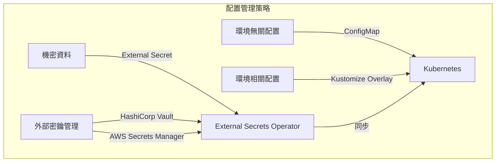
```mermaid
graph TB
    subgraph 配置管理策略
        A[環境無關配置] --> |ConfigMap| K8S[Kubernetes]
        B[環境相關配置] --> |Kustomize Overlay| K8S
        C[機密資料] --> |External Secret| ESO[External Secrets Operator]
        ESO --> |同步| K8S
        D[外部密鑰管理] --> |HashiCorp Vault| ESO
        D --> |AWS Secrets Manager| ESO
    end
```

#### 配置管理最佳實踐

1. **分離關注點**：
   - 應用程式碼與配置分開
   - 機密與非機密分開

2. **配置層級**：
   ```
   配置優先級（由低到高）
   ├── 預設配置（程式內建）
   ├── ConfigMap（環境無關）
   ├── Kustomize Overlay（環境相關）
   └── Secret / 外部密鑰（機密）
   ```

3. **版本控制**：
   - 所有配置納入 Git 版本控制
   - 使用 Git Tag 標記發布版本

4. **審計追蹤**：
   - 記錄配置變更歷史
   - 實施變更審批流程

> ⚠️ **實務建議**：避免在程式碼中硬編碼配置，使用 12-Factor App 原則，透過環境變數注入配置。

---

## 6. 雲端原生系統使用方式

### 6.1 應用程式容器化流程

#### Dockerfile 最佳實踐

**Java 應用範例**：
```dockerfile
# === 建置階段 ===
FROM eclipse-temurin:21-jdk AS builder
WORKDIR /app
COPY pom.xml .
COPY src ./src
RUN --mount=type=cache,target=/root/.m2 \
    mvn clean package -DskipTests

# === 執行階段 ===
FROM eclipse-temurin:21-jre
WORKDIR /app

# 使用非 root 使用者
RUN groupadd -r appgroup && useradd -r -g appgroup appuser
USER appuser

# 複製應用
COPY --from=builder /app/target/*.jar app.jar

# 健康檢查
HEALTHCHECK --interval=30s --timeout=3s \
  CMD curl -f http://localhost:8080/actuator/health || exit 1

# 啟動應用
EXPOSE 8080
ENTRYPOINT ["java", "-jar", "app.jar"]
```

**容器化檢查清單**：
- [ ] 使用多階段建置
- [ ] 指定明確的基礎映像檔版本
- [ ] 使用非 root 使用者執行
- [ ] 設定健康檢查
- [ ] 最小化映像檔大小
- [ ] 掃描安全漏洞

---

### 6.2 Deployment / StatefulSet 使用情境

#### Deployment

適用於**無狀態應用**。

```yaml
apiVersion: apps/v1
kind: Deployment
metadata:
  name: web-app
  namespace: production
spec:
  replicas: 3
  selector:
    matchLabels:
      app: web-app
  template:
    metadata:
      labels:
        app: web-app
    spec:
      containers:
      - name: app
        image: myregistry/web-app:v1.2.3
        ports:
        - containerPort: 8080
        resources:
          requests:
            cpu: "100m"
            memory: "256Mi"
          limits:
            cpu: "500m"
            memory: "512Mi"
        livenessProbe:
          httpGet:
            path: /health/live
            port: 8080
          initialDelaySeconds: 30
          periodSeconds: 10
        readinessProbe:
          httpGet:
            path: /health/ready
            port: 8080
          initialDelaySeconds: 5
          periodSeconds: 5
        env:
        - name: SPRING_PROFILES_ACTIVE
          value: "production"
        envFrom:
        - configMapRef:
            name: web-app-config
```

#### StatefulSet

適用於**有狀態應用**（如資料庫、訊息佇列）。

```yaml
apiVersion: apps/v1
kind: StatefulSet
metadata:
  name: postgresql
  namespace: database
spec:
  serviceName: postgresql
  replicas: 3
  selector:
    matchLabels:
      app: postgresql
  template:
    metadata:
      labels:
        app: postgresql
    spec:
      containers:
      - name: postgresql
        image: postgres:16
        ports:
        - containerPort: 5432
        volumeMounts:
        - name: data
          mountPath: /var/lib/postgresql/data
        env:
        - name: POSTGRES_PASSWORD
          valueFrom:
            secretKeyRef:
              name: postgresql-secret
              key: password
  volumeClaimTemplates:
  - metadata:
      name: data
    spec:
      accessModes: ["ReadWriteOnce"]
      storageClassName: fast-ssd
      resources:
        requests:
          storage: 100Gi
```

#### Deployment vs StatefulSet 比較

| 特性 | Deployment | StatefulSet |
|------|------------|-------------|
| **Pod 識別** | 隨機名稱 | 固定序號（pod-0, pod-1） |
| **網路身份** | 無固定 | 固定 DNS（pod-0.svc） |
| **儲存** | 共用或無 | 獨立 PVC |
| **擴縮順序** | 並行 | 有序（建立順序、逆序刪除） |
| **適用場景** | Web 應用、API | 資料庫、Kafka、Zookeeper |

---

### 6.3 Service / Ingress / Gateway 設計

#### Service 類型

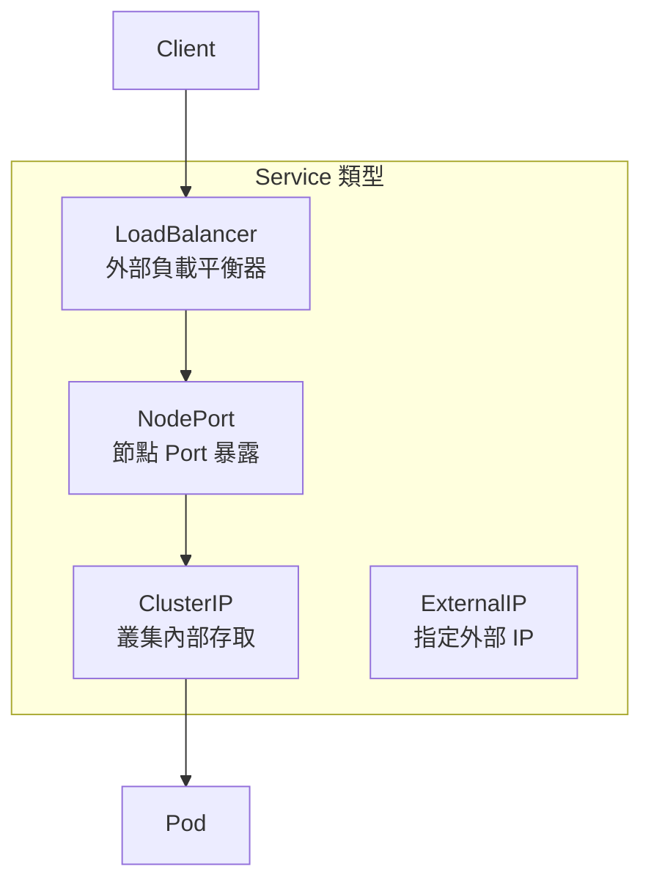
```mermaid
graph TB
    subgraph Service 類型
        CIP[ClusterIP<br/>叢集內部存取]
        NP[NodePort<br/>節點 Port 暴露]
        LB[LoadBalancer<br/>外部負載平衡器]
        EIP[ExternalIP<br/>指定外部 IP]
    end
    
    Client --> LB --> NP --> CIP --> Pod
```

**ClusterIP Service**：
```yaml
apiVersion: v1
kind: Service
metadata:
  name: web-app
spec:
  type: ClusterIP
  selector:
    app: web-app
  ports:
  - port: 80
    targetPort: 8080
```

**LoadBalancer Service**：
```yaml
apiVersion: v1
kind: Service
metadata:
  name: web-app-lb
  annotations:
    # 雲端供應商特定註解
    service.beta.kubernetes.io/aws-load-balancer-type: nlb
spec:
  type: LoadBalancer
  selector:
    app: web-app
  ports:
  - port: 443
    targetPort: 8080
```

#### Ingress

```yaml
apiVersion: networking.k8s.io/v1
kind: Ingress
metadata:
  name: web-ingress
  annotations:
    nginx.ingress.kubernetes.io/rewrite-target: /
    nginx.ingress.kubernetes.io/ssl-redirect: "true"
spec:
  ingressClassName: nginx
  tls:
  - hosts:
    - app.example.com
    secretName: app-tls-secret
  rules:
  - host: app.example.com
    http:
      paths:
      - path: /api
        pathType: Prefix
        backend:
          service:
            name: api-service
            port:
              number: 80
      - path: /
        pathType: Prefix
        backend:
          service:
            name: web-service
            port:
              number: 80
```

#### Gateway API（新一代標準）

```yaml
apiVersion: gateway.networking.k8s.io/v1
kind: Gateway
metadata:
  name: main-gateway
spec:
  gatewayClassName: istio
  listeners:
  - name: https
    port: 443
    protocol: HTTPS
    tls:
      mode: Terminate
      certificateRefs:
      - name: app-tls-secret
---
apiVersion: gateway.networking.k8s.io/v1
kind: HTTPRoute
metadata:
  name: app-route
spec:
  parentRefs:
  - name: main-gateway
  hostnames:
  - "app.example.com"
  rules:
  - matches:
    - path:
        type: PathPrefix
        value: /api
    backendRefs:
    - name: api-service
      port: 80
```

---

### 6.4 自動擴縮（HPA / VPA）

#### Horizontal Pod Autoscaler（HPA）

```yaml
apiVersion: autoscaling/v2
kind: HorizontalPodAutoscaler
metadata:
  name: web-app-hpa
spec:
  scaleTargetRef:
    apiVersion: apps/v1
    kind: Deployment
    name: web-app
  minReplicas: 3
  maxReplicas: 20
  metrics:
  - type: Resource
    resource:
      name: cpu
      target:
        type: Utilization
        averageUtilization: 70
  - type: Resource
    resource:
      name: memory
      target:
        type: Utilization
        averageUtilization: 80
  behavior:
    scaleDown:
      stabilizationWindowSeconds: 300  # 縮容穩定期
      policies:
      - type: Percent
        value: 10
        periodSeconds: 60
    scaleUp:
      stabilizationWindowSeconds: 0
      policies:
      - type: Percent
        value: 100
        periodSeconds: 15
      - type: Pods
        value: 4
        periodSeconds: 15
      selectPolicy: Max
```

#### Vertical Pod Autoscaler（VPA）

```yaml
apiVersion: autoscaling.k8s.io/v1
kind: VerticalPodAutoscaler
metadata:
  name: web-app-vpa
spec:
  targetRef:
    apiVersion: apps/v1
    kind: Deployment
    name: web-app
  updatePolicy:
    updateMode: "Auto"  # Off, Initial, Auto
  resourcePolicy:
    containerPolicies:
    - containerName: app
      minAllowed:
        cpu: 100m
        memory: 128Mi
      maxAllowed:
        cpu: 2
        memory: 4Gi
```

> ⚠️ **注意事項**：HPA 與 VPA 同時使用時，避免兩者同時管理同一資源（如 CPU），以免產生衝突。

---

### 6.5 Rolling Update 與 Zero Downtime Deployment

#### 滾動更新策略

```yaml
apiVersion: apps/v1
kind: Deployment
metadata:
  name: web-app
spec:
  replicas: 10
  strategy:
    type: RollingUpdate
    rollingUpdate:
      maxSurge: 25%        # 最多超出 25% 副本數
      maxUnavailable: 25%  # 最多 25% 不可用
  template:
    spec:
      containers:
      - name: app
        image: myregistry/web-app:v1.2.3
        # Readiness Probe 確保新 Pod 就緒
        readinessProbe:
          httpGet:
            path: /health/ready
            port: 8080
          initialDelaySeconds: 10
          periodSeconds: 5
          successThreshold: 1
          failureThreshold: 3
```

#### Zero Downtime Deployment 檢查清單

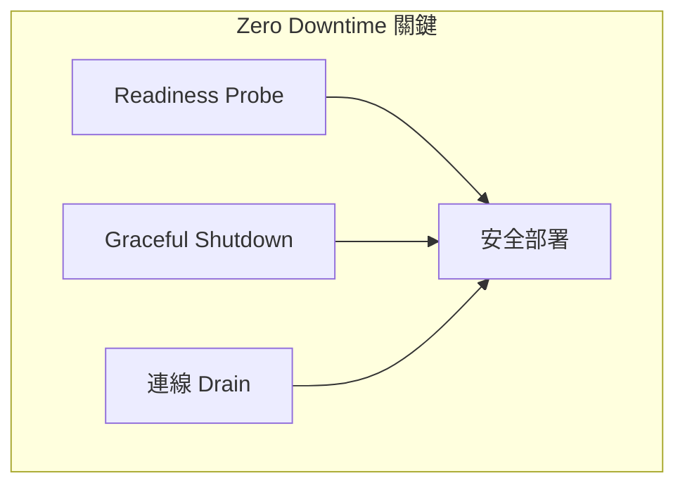
```mermaid
graph TB
    subgraph Zero Downtime 關鍵
        A[Readiness Probe] --> D[安全部署]
        B[Graceful Shutdown] --> D
        C[連線 Drain] --> D
    end
```

**Graceful Shutdown 設定**：
```yaml
spec:
  terminationGracePeriodSeconds: 60  # 給予足夠時間完成處理
  containers:
  - name: app
    lifecycle:
      preStop:
        exec:
          command: ["/bin/sh", "-c", "sleep 10"]  # 等待負載平衡器更新
```

**Spring Boot Graceful Shutdown**：
```yaml
# application.yaml
server:
  shutdown: graceful
spring:
  lifecycle:
    timeout-per-shutdown-phase: 30s
```

#### 藍綠部署 / 金絲雀部署

**金絲雀部署（使用 Argo Rollouts）**：
```yaml
apiVersion: argoproj.io/v1alpha1
kind: Rollout
metadata:
  name: web-app
spec:
  replicas: 10
  strategy:
    canary:
      steps:
      - setWeight: 10
      - pause: {duration: 5m}
      - setWeight: 30
      - pause: {duration: 5m}
      - setWeight: 60
      - pause: {duration: 5m}
      - setWeight: 100
      analysis:
        templates:
        - templateName: success-rate
        startingStep: 2
  selector:
    matchLabels:
      app: web-app
  template:
    # ... pod template
```

> ⚠️ **實務建議**：部署前務必確認 Readiness Probe 正確設定，並在非尖峰時段進行部署。建議先在 Staging 環境驗證部署流程。

---

## 7. 系統維運與可觀測性

### 7.1 Metrics、Logs、Traces 的角色

#### 可觀測性三大支柱

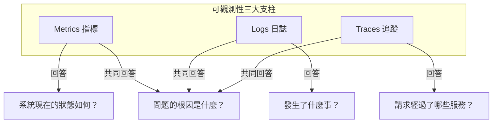
```mermaid
graph TB
    subgraph 可觀測性三大支柱
        M[Metrics 指標]
        L[Logs 日誌]
        T[Traces 追蹤]
    end
    
    M --> |回答| Q1[系統現在的狀態如何？]
    L --> |回答| Q2[發生了什麼事？]
    T --> |回答| Q3[請求經過了哪些服務？]
    
    M & L & T --> |共同回答| Q4[問題的根因是什麼？]
```

| 支柱 | 特性 | 典型用途 |
|------|------|----------|
| **Metrics** | 數值化、可聚合、低成本 | 監控、告警、趨勢分析 |
| **Logs** | 文字化、詳細、成本較高 | 除錯、稽核、事件分析 |
| **Traces** | 跨服務關聯、請求路徑 | 效能分析、瓶頸定位 |

---

### 7.2 Prometheus + Grafana 架構

#### 架構圖

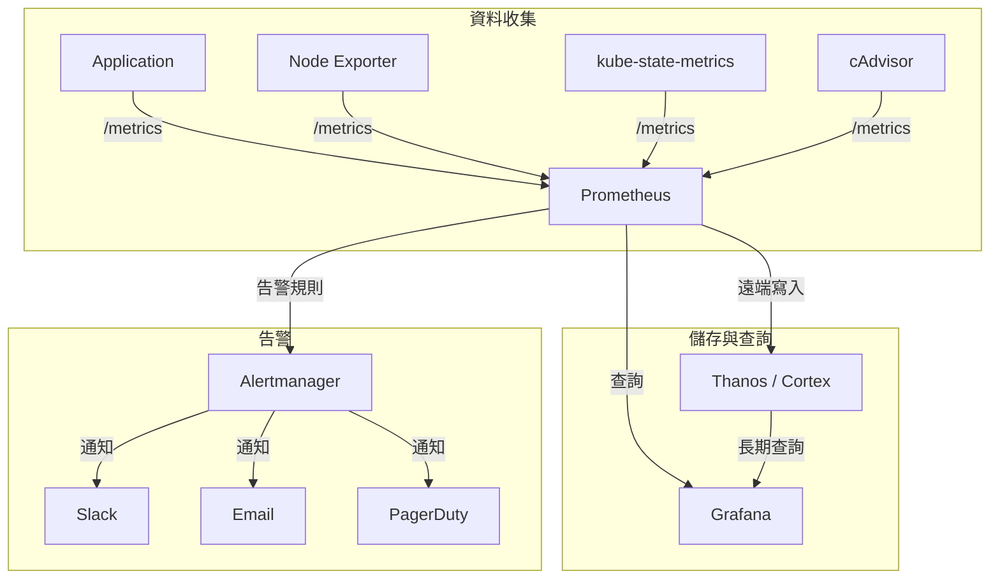
```mermaid
graph TB
    subgraph 資料收集
        A1[Application] --> |/metrics| P[Prometheus]
        A2[Node Exporter] --> |/metrics| P
        A3[kube-state-metrics] --> |/metrics| P
        A4[cAdvisor] --> |/metrics| P
    end
    
    subgraph 儲存與查詢
        P --> |遠端寫入| T[Thanos / Cortex]
        P --> |查詢| G[Grafana]
        T --> |長期查詢| G
    end
    
    subgraph 告警
        P --> |告警規則| AM[Alertmanager]
        AM --> |通知| S1[Slack]
        AM --> |通知| S2[Email]
        AM --> |通知| S3[PagerDuty]
    end
```

#### Prometheus 安裝（使用 kube-prometheus-stack）

```bash
# 新增 Helm Repository
helm repo add prometheus-community https://prometheus-community.github.io/helm-charts
helm repo update

# 安裝 kube-prometheus-stack
helm install prometheus prometheus-community/kube-prometheus-stack \
  --namespace monitoring \
  --create-namespace \
  --set prometheus.prometheusSpec.retention=30d \
  --set prometheus.prometheusSpec.storageSpec.volumeClaimTemplate.spec.resources.requests.storage=100Gi
```

#### 告警規則範例

```yaml
apiVersion: monitoring.coreos.com/v1
kind: PrometheusRule
metadata:
  name: app-alerts
  namespace: monitoring
spec:
  groups:
  - name: application
    rules:
    - alert: HighErrorRate
      expr: |
        sum(rate(http_requests_total{status=~"5.."}[5m])) 
        / sum(rate(http_requests_total[5m])) > 0.05
      for: 5m
      labels:
        severity: critical
      annotations:
        summary: "High error rate detected"
        description: "Error rate is {{ $value | humanizePercentage }}"
        
    - alert: HighLatency
      expr: |
        histogram_quantile(0.99, 
          sum(rate(http_request_duration_seconds_bucket[5m])) by (le)
        ) > 1
      for: 5m
      labels:
        severity: warning
      annotations:
        summary: "High latency detected"
        description: "P99 latency is {{ $value }}s"
        
    - alert: PodCrashLooping
      expr: |
        rate(kube_pod_container_status_restarts_total[15m]) * 60 * 15 > 0
      for: 5m
      labels:
        severity: critical
      annotations:
        summary: "Pod is crash looping"
        description: "Pod {{ $labels.namespace }}/{{ $labels.pod }} is restarting"
```

---

### 7.3 OpenTelemetry 導入方式

#### OpenTelemetry Collector 部署

```yaml
apiVersion: opentelemetry.io/v1alpha1
kind: OpenTelemetryCollector
metadata:
  name: otel-collector
  namespace: monitoring
spec:
  mode: deployment
  config: |
    receivers:
      otlp:
        protocols:
          grpc:
            endpoint: 0.0.0.0:4317
          http:
            endpoint: 0.0.0.0:4318
    
    processors:
      batch:
        timeout: 10s
      memory_limiter:
        check_interval: 1s
        limit_mib: 1000
    
    exporters:
      prometheus:
        endpoint: 0.0.0.0:8889
      otlp:
        endpoint: tempo.monitoring:4317
        tls:
          insecure: true
      loki:
        endpoint: http://loki.monitoring:3100/loki/api/v1/push
    
    service:
      pipelines:
        traces:
          receivers: [otlp]
          processors: [memory_limiter, batch]
          exporters: [otlp]
        metrics:
          receivers: [otlp]
          processors: [memory_limiter, batch]
          exporters: [prometheus]
        logs:
          receivers: [otlp]
          processors: [memory_limiter, batch]
          exporters: [loki]
```

#### Java 應用整合

```bash
# 使用 Java Agent 自動注入
java -javaagent:opentelemetry-javaagent.jar \
     -Dotel.service.name=my-service \
     -Dotel.exporter.otlp.endpoint=http://otel-collector:4317 \
     -Dotel.metrics.exporter=otlp \
     -Dotel.logs.exporter=otlp \
     -jar my-app.jar
```

**Spring Boot 設定**：
```yaml
# application.yaml
otel:
  exporter:
    otlp:
      endpoint: http://otel-collector:4317
  resource:
    attributes:
      service.name: my-service
      service.namespace: production
      deployment.environment: prod
```

---

### 7.4 告警（Alerting）設計原則

#### 告警分級

| 等級 | 說明 | 回應時間 | 通知管道 |
|------|------|----------|----------|
| **P1 Critical** | 服務完全中斷 | 立即 | 電話 + Slack + Email |
| **P2 High** | 服務嚴重降級 | 30 分鐘內 | Slack + Email |
| **P3 Medium** | 部分功能異常 | 4 小時內 | Slack |
| **P4 Low** | 非緊急問題 | 下個工作日 | Email |

#### 告警設計原則

1. **告警應可行動**：收到告警後應有明確的處理步驟
2. **避免告警疲勞**：減少無效告警，避免狼來了效應
3. **設定合理閾值**：基於歷史數據與業務需求
4. **告警應有 Context**：包含足夠資訊以快速定位問題

#### Alertmanager 配置範例

```yaml
global:
  resolve_timeout: 5m
  slack_api_url: 'https://hooks.slack.com/services/xxx'

route:
  receiver: 'default'
  group_by: ['alertname', 'namespace']
  group_wait: 30s
  group_interval: 5m
  repeat_interval: 12h
  routes:
  - match:
      severity: critical
    receiver: 'critical-alerts'
    continue: true
  - match:
      severity: warning
    receiver: 'warning-alerts'

receivers:
- name: 'default'
  slack_configs:
  - channel: '#alerts'

- name: 'critical-alerts'
  slack_configs:
  - channel: '#alerts-critical'
    send_resolved: true
  pagerduty_configs:
  - service_key: '<pagerduty-key>'

- name: 'warning-alerts'
  slack_configs:
  - channel: '#alerts-warning'
    send_resolved: true
```

---

### 7.5 SRE 常用監控指標（SLI / SLO / SLA）

#### 概念定義

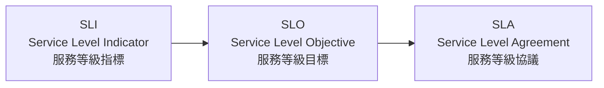
```mermaid
graph LR
    SLI[SLI<br/>Service Level Indicator<br/>服務等級指標] --> SLO[SLO<br/>Service Level Objective<br/>服務等級目標]
    SLO --> SLA[SLA<br/>Service Level Agreement<br/>服務等級協議]
```

| 概念 | 定義 | 範例 |
|------|------|------|
| **SLI** | 衡量服務品質的指標 | 請求成功率、延遲 P99 |
| **SLO** | 服務品質的目標 | 成功率 > 99.9%、P99 < 200ms |
| **SLA** | 與客戶的服務協議 | 每月可用性 99.9%，否則賠償 |

#### 常見 SLI 指標

**可用性（Availability）**：
```promql
# 成功率 SLI
sum(rate(http_requests_total{status!~"5.."}[5m])) 
/ sum(rate(http_requests_total[5m]))
```

**延遲（Latency）**：
```promql
# P99 延遲 SLI
histogram_quantile(0.99, 
  sum(rate(http_request_duration_seconds_bucket[5m])) by (le)
)
```

**錯誤預算（Error Budget）**：
```promql
# 過去 30 天的錯誤預算消耗
1 - (
  sum(increase(http_requests_total{status!~"5.."}[30d]))
  / sum(increase(http_requests_total[30d]))
) / (1 - 0.999)  # 0.999 是 SLO 目標
```

#### SLO Dashboard 建議

| 面板 | 說明 |
|------|------|
| **SLI 現況** | 當前成功率、延遲等指標 |
| **Error Budget** | 錯誤預算消耗情況 |
| **SLO 達成趨勢** | 過去 7 天 / 30 天的達成率 |
| **Top 5 錯誤** | 最常見的錯誤類型 |

> ⚠️ **實務建議**：從最核心的 3-5 個 SLI 開始，避免過度監控。SLO 應由產品與工程團隊共同制定，並定期回顧調整。

---

## 8. 系統安全與治理

### 8.1 雲端原生安全風險概覽

#### 攻擊面分析

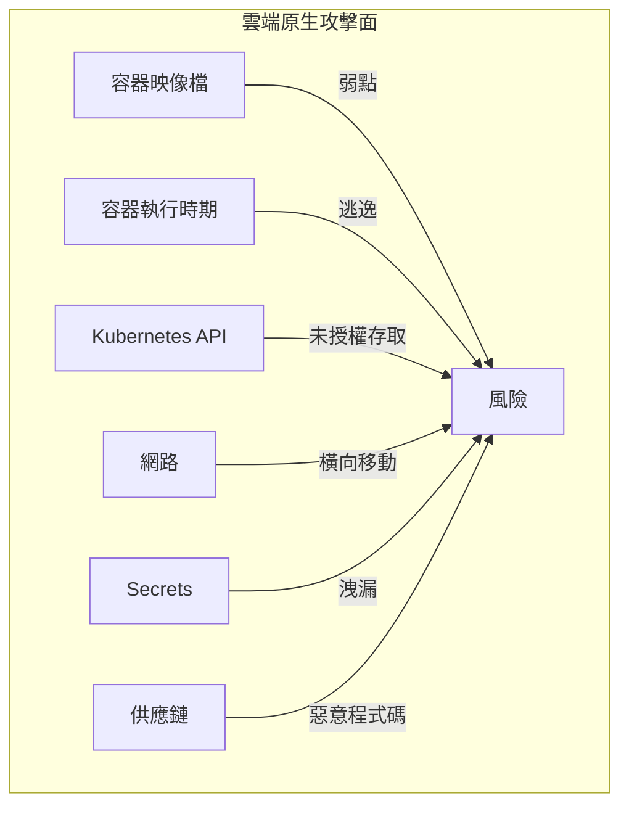
```mermaid
graph TB
    subgraph 雲端原生攻擊面
        A[容器映像檔] --> |弱點| R[風險]
        B[容器執行時期] --> |逃逸| R
        C[Kubernetes API] --> |未授權存取| R
        D[網路] --> |橫向移動| R
        E[Secrets] --> |洩漏| R
        F[供應鏈] --> |惡意程式碼| R
    end
```

#### STRIDE 威脅模型

| 威脅類型 | 說明 | 雲端原生範例 |
|----------|------|--------------|
| **Spoofing** | 身份偽造 | 偽造 Service Account |
| **Tampering** | 資料竄改 | 修改 ConfigMap |
| **Repudiation** | 否認 | 缺乏稽核日誌 |
| **Info Disclosure** | 資訊洩漏 | Secret 暴露 |
| **DoS** | 服務阻斷 | 資源耗盡攻擊 |
| **EoP** | 權限提升 | 容器逃逸 |

---

### 8.2 Kubernetes Security Best Practices

#### Pod Security Standards

Kubernetes 1.25+ 使用 Pod Security Admission 取代 PodSecurityPolicy。

**三個等級**：

| 等級 | 說明 | 適用場景 |
|------|------|----------|
| **Privileged** | 無限制 | 系統元件 |
| **Baseline** | 基本安全限制 | 一般應用 |
| **Restricted** | 嚴格限制 | 高安全需求 |

**設定 Namespace 安全等級**：
```yaml
apiVersion: v1
kind: Namespace
metadata:
  name: production
  labels:
    pod-security.kubernetes.io/enforce: restricted
    pod-security.kubernetes.io/enforce-version: latest
    pod-security.kubernetes.io/audit: restricted
    pod-security.kubernetes.io/warn: restricted
```

#### 安全 Pod 配置範例

```yaml
apiVersion: v1
kind: Pod
metadata:
  name: secure-pod
spec:
  securityContext:
    runAsNonRoot: true
    runAsUser: 1000
    runAsGroup: 3000
    fsGroup: 2000
    seccompProfile:
      type: RuntimeDefault
  containers:
  - name: app
    image: myapp:1.0
    securityContext:
      allowPrivilegeEscalation: false
      readOnlyRootFilesystem: true
      capabilities:
        drop:
        - ALL
    resources:
      limits:
        cpu: "500m"
        memory: "512Mi"
      requests:
        cpu: "100m"
        memory: "256Mi"
```

#### Network Policy

```yaml
apiVersion: networking.k8s.io/v1
kind: NetworkPolicy
metadata:
  name: api-network-policy
  namespace: production
spec:
  podSelector:
    matchLabels:
      app: api
  policyTypes:
  - Ingress
  - Egress
  ingress:
  - from:
    - namespaceSelector:
        matchLabels:
          name: frontend
    - podSelector:
        matchLabels:
          app: web
    ports:
    - protocol: TCP
      port: 8080
  egress:
  - to:
    - namespaceSelector:
        matchLabels:
          name: database
    ports:
    - protocol: TCP
      port: 5432
  - to:  # 允許 DNS
    - namespaceSelector: {}
      podSelector:
        matchLabels:
          k8s-app: kube-dns
    ports:
    - protocol: UDP
      port: 53
```

---

### 8.3 Image Security 與 Supply Chain Security

#### 容器映像檔安全措施

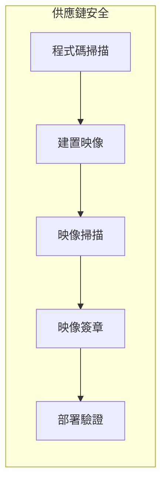
```mermaid
graph LR
    subgraph 供應鏈安全
        A[程式碼掃描] --> B[建置映像]
        B --> C[映像掃描]
        C --> D[映像簽章]
        D --> E[部署驗證]
    end
```

**映像掃描（使用 Trivy）**：
```bash
# 掃描映像弱點
trivy image myregistry/myapp:1.0

# 掃描 Kubernetes 資源
trivy k8s --report summary cluster
```

**映像簽章（使用 Cosign）**：
```bash
# 簽章映像
cosign sign --key cosign.key myregistry/myapp:1.0

# 驗證簽章
cosign verify --key cosign.pub myregistry/myapp:1.0
```

#### Admission Controller 驗證

```yaml
# Kyverno 政策：只允許已簽章的映像
apiVersion: kyverno.io/v1
kind: ClusterPolicy
metadata:
  name: verify-image-signature
spec:
  validationFailureAction: Enforce
  rules:
  - name: verify-signature
    match:
      any:
      - resources:
          kinds:
          - Pod
    verifyImages:
    - imageReferences:
      - "myregistry/*"
      attestors:
      - entries:
        - keys:
            publicKeys: |-
              -----BEGIN PUBLIC KEY-----
              ...
              -----END PUBLIC KEY-----
```

---

### 8.4 Policy as Code（OPA / Kyverno）

#### Kyverno 常用政策

**禁止使用 latest 標籤**：
```yaml
apiVersion: kyverno.io/v1
kind: ClusterPolicy
metadata:
  name: disallow-latest-tag
spec:
  validationFailureAction: Enforce
  rules:
  - name: require-image-tag
    match:
      any:
      - resources:
          kinds:
          - Pod
    validate:
      message: "Using 'latest' tag is not allowed"
      pattern:
        spec:
          containers:
          - image: "!*:latest"
```

**強制設定資源限制**：
```yaml
apiVersion: kyverno.io/v1
kind: ClusterPolicy
metadata:
  name: require-resource-limits
spec:
  validationFailureAction: Enforce
  rules:
  - name: check-limits
    match:
      any:
      - resources:
          kinds:
          - Pod
    validate:
      message: "Resource limits are required"
      pattern:
        spec:
          containers:
          - resources:
              limits:
                memory: "?*"
                cpu: "?*"
```

**自動注入標籤**：
```yaml
apiVersion: kyverno.io/v1
kind: ClusterPolicy
metadata:
  name: add-default-labels
spec:
  rules:
  - name: add-labels
    match:
      any:
      - resources:
          kinds:
          - Pod
    mutate:
      patchStrategicMerge:
        metadata:
          labels:
            +(managed-by): "platform-team"
```

---

### 8.5 零信任（Zero Trust）在雲端原生的應用

#### 零信任原則

```
零信任核心原則
├── 永不信任，始終驗證
├── 最小權限原則
├── 假設已被入侵
└── 持續驗證
```

#### 實作方式

| 層面 | 實作方式 |
|------|----------|
| **身份驗證** | Service Mesh mTLS、SPIFFE/SPIRE |
| **授權** | RBAC、OPA、Attribute-based Access Control |
| **網路** | Network Policy、Service Mesh |
| **資料** | 傳輸加密、靜態加密 |
| **監控** | 持續監控所有存取行為 |

**Service Mesh mTLS（Istio）**：
```yaml
apiVersion: security.istio.io/v1beta1
kind: PeerAuthentication
metadata:
  name: default
  namespace: production
spec:
  mtls:
    mode: STRICT  # 強制 mTLS
---
apiVersion: security.istio.io/v1beta1
kind: AuthorizationPolicy
metadata:
  name: api-authz
  namespace: production
spec:
  selector:
    matchLabels:
      app: api
  action: ALLOW
  rules:
  - from:
    - source:
        principals: ["cluster.local/ns/production/sa/web-service"]
    to:
    - operation:
        methods: ["GET", "POST"]
        paths: ["/api/*"]
```

> ⚠️ **實務建議**：零信任是一個旅程而非目的地。建議從最核心的系統開始，逐步擴展。優先實施 mTLS 與 Network Policy。

---

## 9. 系統升級與版本管理

### 9.1 Kubernetes 升級策略

#### 升級流程

```mermaid
graph TB
    A[評估新版本] --> B[測試環境驗證]
    B --> C[備份 etcd]
    C --> D[升級 Control Plane]
    D --> E[升級 Worker Nodes]
    E --> F[驗證叢集功能]
    F --> G[更新應用程式相依]
```

#### 升級原則

1. **逐版本升級**：不跳過 Minor 版本（例如 1.27 → 1.28 → 1.29）
2. **先 Control Plane 後 Worker**：Control Plane 可支援 N-2 版本的 Worker
3. **藍綠或滾動升級**：確保服務可用性
4. **測試環境先行**：充分測試後再升級生產

#### Worker Node 升級（使用 kubeadm）

```bash
# 1. 標記 Node 為不可調度
kubectl cordon <node-name>

# 2. 驅逐 Pod
kubectl drain <node-name> --ignore-daemonsets --delete-emptydir-data

# 3. 升級 kubeadm
sudo apt-get update
sudo apt-get install -y kubeadm=1.29.0-*

# 4. 升級 Node 配置
sudo kubeadm upgrade node

# 5. 升級 kubelet 和 kubectl
sudo apt-get install -y kubelet=1.29.0-* kubectl=1.29.0-*
sudo systemctl daemon-reload
sudo systemctl restart kubelet

# 6. 恢復調度
kubectl uncordon <node-name>
```

---

### 9.2 CNCF 元件相容性考量

#### 相容性矩陣

| 元件 | 與 Kubernetes 版本對應 | 注意事項 |
|------|------------------------|----------|
| **Istio** | 支援 N-1 到 N+1 版本 | 先升級 Istio 再升級 K8s |
| **Prometheus Operator** | 查閱 Release Notes | 注意 CRD 變更 |
| **Argo CD** | 支援多版本 K8s | 注意 RBAC 變更 |
| **Cert-manager** | 查閱相容性表 | API 版本變更 |

#### 升級前檢查

```bash
# 檢查棄用的 API
kubectl get --raw /metrics | grep apiserver_requested_deprecated_apis

# 使用 kubent 檢查
kubent --cluster

# 使用 Pluto 檢查
pluto detect-all-in-cluster
```

---

### 9.3 滾動升級與回滾機制

#### Deployment 回滾

```bash
# 查看 Deployment 歷史
kubectl rollout history deployment/web-app

# 回滾到前一版本
kubectl rollout undo deployment/web-app

# 回滾到特定版本
kubectl rollout undo deployment/web-app --to-revision=2

# 查看回滾狀態
kubectl rollout status deployment/web-app
```

#### Helm 回滾

```bash
# 查看 Release 歷史
helm history my-release

# 回滾到前一版本
helm rollback my-release

# 回滾到特定版本
helm rollback my-release 3
```

---

### 9.4 升級風險與因應方式

#### 常見升級風險

| 風險 | 說明 | 因應措施 |
|------|------|----------|
| **API 棄用** | 使用的 API 版本被移除 | 升級前檢查並更新 manifest |
| **相依性衝突** | Add-on 與新版本不相容 | 確認元件相容性矩陣 |
| **etcd 損壞** | 升級過程中資料損壞 | 升級前備份 etcd |
| **網路中斷** | CNI 升級導致網路問題 | 分批升級、準備回滾計畫 |
| **效能下降** | 新版本行為變更 | 壓力測試驗證 |

#### 升級前檢查清單

- [ ] 閱讀 Release Notes 與 Changelog
- [ ] 檢查 API 棄用警告
- [ ] 確認所有元件相容性
- [ ] 備份 etcd
- [ ] 測試環境完整驗證
- [ ] 準備回滾計畫
- [ ] 排定維護時段
- [ ] 通知相關團隊

> ⚠️ **實務建議**：生產環境升級務必安排在非尖峰時段，並有足夠人力待命。建議使用 Infrastructure as Code 管理叢集配置，方便重建與驗證。

---

## 10. 應用系統如何串接雲端原生平台

### 10.1 傳統系統（Legacy System）上雲策略

#### 遷移策略（6R 模型）

```mermaid
graph TB
    subgraph 6R 遷移策略
        R1[Retain<br/>保留] --> |暫不遷移| D[決策]
        R2[Retire<br/>淘汰] --> |停止使用| D
        R3[Rehost<br/>直接搬遷] --> |Lift & Shift| D
        R4[Replatform<br/>平台遷移] --> |小幅調整| D
        R5[Refactor<br/>重構] --> |大幅改造| D
        R6[Rebuild<br/>重建] --> |全新開發| D
    end
```

| 策略 | 說明 | 適用場景 | 風險/成本 |
|------|------|----------|-----------|
| **Rehost** | 直接將 VM 搬遷為容器 | 快速上雲 | 低/低 |
| **Replatform** | 小幅調整以適應雲端 | 利用雲端服務 | 中/中 |
| **Refactor** | 重構為微服務架構 | 長期演進 | 高/高 |
| **Rebuild** | 從頭重新開發 | 全新架構 | 最高/最高 |

#### Strangler Fig 模式

```mermaid
graph LR
    subgraph Strangler Fig 模式
        U[使用者] --> APIGW[API Gateway]
        APIGW --> |新功能| NEW[新系統<br/>微服務]
        APIGW --> |舊功能| OLD[舊系統<br/>Monolith]
    end
```

**實施步驟**：
1. 在舊系統前放置 API Gateway
2. 新功能用微服務開發
3. 逐步將舊功能遷移到微服務
4. 最終淘汰舊系統

---

### 10.2 API-based 系統整合

#### REST API 整合模式

```yaml
# 對外暴露 API 的 Ingress
apiVersion: networking.k8s.io/v1
kind: Ingress
metadata:
  name: external-api
  annotations:
    nginx.ingress.kubernetes.io/rate-limit: "100"
    nginx.ingress.kubernetes.io/ssl-redirect: "true"
spec:
  ingressClassName: nginx
  tls:
  - hosts:
    - api.example.com
    secretName: api-tls
  rules:
  - host: api.example.com
    http:
      paths:
      - path: /v1
        pathType: Prefix
        backend:
          service:
            name: api-service
            port:
              number: 80
```

#### gRPC 整合

```yaml
# gRPC Ingress 配置
apiVersion: networking.k8s.io/v1
kind: Ingress
metadata:
  name: grpc-api
  annotations:
    nginx.ingress.kubernetes.io/backend-protocol: "GRPC"
spec:
  ingressClassName: nginx
  tls:
  - hosts:
    - grpc.example.com
    secretName: grpc-tls
  rules:
  - host: grpc.example.com
    http:
      paths:
      - path: /
        pathType: Prefix
        backend:
          service:
            name: grpc-service
            port:
              number: 9090
```

---

### 10.3 Event-driven 架構串接方式

#### 事件驅動架構模式

```mermaid
graph TB
    subgraph 事件驅動架構
        P1[Producer<br/>訂單服務] --> |OrderCreated| K[Kafka]
        K --> |Event| C1[Consumer<br/>庫存服務]
        K --> |Event| C2[Consumer<br/>通知服務]
        K --> |Event| C3[Consumer<br/>分析服務]
    end
```

#### Kafka 在 Kubernetes 上的部署（Strimzi）

```yaml
apiVersion: kafka.strimzi.io/v1beta2
kind: Kafka
metadata:
  name: my-cluster
spec:
  kafka:
    version: 3.6.0
    replicas: 3
    listeners:
    - name: plain
      port: 9092
      type: internal
      tls: false
    - name: tls
      port: 9093
      type: internal
      tls: true
    storage:
      type: persistent-claim
      size: 100Gi
      class: fast-ssd
    config:
      offsets.topic.replication.factor: 3
      transaction.state.log.replication.factor: 3
      transaction.state.log.min.isr: 2
  zookeeper:
    replicas: 3
    storage:
      type: persistent-claim
      size: 50Gi
      class: fast-ssd
```

---

### 10.4 Database、MQ、外部系統整合模式

#### 資料庫整合模式

| 模式 | 說明 | 適用場景 |
|------|------|----------|
| **Database per Service** | 每個服務獨立資料庫 | 微服務架構 |
| **Shared Database** | 多服務共用資料庫 | 過渡期 |
| **CQRS** | 讀寫分離 | 高效能讀取需求 |
| **Event Sourcing** | 事件溯源 | 需要完整歷史記錄 |

#### 外部系統整合

**Sidecar 模式**：
```yaml
apiVersion: apps/v1
kind: Deployment
metadata:
  name: app-with-proxy
spec:
  template:
    spec:
      containers:
      - name: app
        image: my-app:1.0
      - name: proxy
        image: envoy:latest
        ports:
        - containerPort: 8080
        # Proxy 處理外部系統連線
```

**External Service 模式**：
```yaml
# 定義外部服務端點
apiVersion: v1
kind: Service
metadata:
  name: external-db
spec:
  type: ExternalName
  externalName: db.external-system.com
---
# 或使用 Endpoints
apiVersion: v1
kind: Endpoints
metadata:
  name: external-api
subsets:
- addresses:
  - ip: 10.0.0.100
  ports:
  - port: 443
```

---

### 10.5 金融/企業系統常見整合案例

#### 核心銀行系統整合

```mermaid
graph TB
    subgraph 雲端原生平台
        APIGW[API Gateway<br/>Kong]
        SVC[核心服務<br/>Microservices]
        CACHE[(Redis<br/>Cache)]
    end
    
    subgraph 企業核心系統
        CORE[Core Banking<br/>System]
        MQ[IBM MQ]
        DB[(Oracle DB)]
    end
    
    Client --> APIGW
    APIGW --> SVC
    SVC --> CACHE
    SVC --> |IBM MQ Client| MQ
    MQ --> CORE
    CORE --> DB
```

#### 整合注意事項

| 面向 | 建議 |
|------|------|
| **交易一致性** | 使用 Saga 模式處理分散式交易 |
| **資料同步** | CDC（Change Data Capture）工具 |
| **效能** | 使用快取降低核心系統壓力 |
| **可靠性** | 實施 Circuit Breaker 模式 |
| **安全** | 確保通訊加密、存取控管 |

> ⚠️ **實務建議**：與核心系統整合時，務必充分測試在高負載與故障情境下的行為。建議使用 Chaos Engineering 驗證系統韌性。

---

## 11. 企業實務建議與最佳實踐

### 11.1 雲端原生導入常見地雷

| 地雷 | 說明 | 避免方式 |
|------|------|----------|
| **過早採用微服務** | 在團隊與業務未準備好時強推 | 從 Modular Monolith 開始 |
| **忽視文化變革** | 只關注技術，忽略組織轉型 | 推動 DevOps 文化 |
| **缺乏可觀測性** | 系統上線後難以除錯 | 從 Day 1 就導入監控 |
| **過度設計** | 不必要的複雜度 | YAGNI 原則 |
| **安全後置** | 最後才考慮安全 | Shift-Left Security |
| **缺乏標準化** | 各團隊各自為政 | 建立 Platform Team |

---

### 11.2 組織與流程調整建議

#### 團隊結構

```mermaid
graph TB
    subgraph 推薦的團隊結構
        PT[Platform Team<br/>平台團隊]
        AT1[Application Team 1<br/>產品團隊]
        AT2[Application Team 2<br/>產品團隊]
        ST[Security Team<br/>資安團隊]
        
        PT --> |提供平台| AT1
        PT --> |提供平台| AT2
        ST --> |制定政策| PT
        ST --> |諮詢| AT1 & AT2
    end
```

#### Platform Team 職責

- 提供標準化的開發與部署平台
- 建立並維護 CI/CD Pipeline
- 管理 Kubernetes 叢集
- 制定技術標準與最佳實踐
- 支援應用團隊

---

### 11.3 開發、維運、資安協作模式

#### DevSecOps 流程

```mermaid
graph LR
    subgraph DevSecOps Pipeline
        P[Plan] --> C[Code]
        C --> B[Build]
        B --> T[Test]
        T --> R[Release]
        R --> D[Deploy]
        D --> O[Operate]
        O --> M[Monitor]
        M --> P
    end
    
    S[Security] -.-> |整合| P & C & B & T & R & D & O & M
```

#### 協作建議

| 階段 | 協作活動 |
|------|----------|
| **規劃** | 安全需求納入 User Story |
| **開發** | 安全程式碼審查 |
| **建置** | SAST/SCA 掃描 |
| **測試** | DAST/滲透測試 |
| **部署** | 容器掃描、合規檢查 |
| **維運** | 安全監控、事件回應 |

---

### 11.4 技術選型建議

#### 選型原則

1. **優先採用 CNCF Graduated 專案**
2. **評估社群活躍度與長期支援**
3. **考慮團隊學習曲線**
4. **評估與既有系統的整合成本**
5. **考慮營運複雜度**

#### 推薦技術棧

| 領域 | 推薦選項 | 備選 |
|------|----------|------|
| **Container Runtime** | containerd | CRI-O |
| **Orchestration** | Kubernetes | - |
| **CNI** | Calico / Cilium | Flannel |
| **Ingress** | NGINX Ingress | Kong, Envoy |
| **Service Mesh** | Istio | Linkerd |
| **Monitoring** | Prometheus + Grafana | - |
| **Logging** | Loki + Fluent Bit | ELK |
| **Tracing** | Jaeger / Tempo | Zipkin |
| **GitOps** | Argo CD | Flux |
| **Policy** | Kyverno | OPA/Gatekeeper |

---

### 11.5 成熟度模型（Cloud Native Maturity Model）

#### CNCF Cloud Native Maturity Model

```mermaid
graph LR
    L1[Level 1<br/>Build] --> L2[Level 2<br/>Operate]
    L2 --> L3[Level 3<br/>Scale]
    L3 --> L4[Level 4<br/>Improve]
    L4 --> L5[Level 5<br/>Optimize]
```

| 等級 | 說明 | 特徵 |
|------|------|------|
| **Level 1 - Build** | 起步階段 | 開始容器化、基本 CI/CD |
| **Level 2 - Operate** | 運營階段 | 生產環境部署、基本監控 |
| **Level 3 - Scale** | 規模化階段 | 多叢集、自動擴縮、進階監控 |
| **Level 4 - Improve** | 改善階段 | GitOps、Policy as Code、SRE 實踐 |
| **Level 5 - Optimize** | 優化階段 | 全面自動化、持續優化、創新驅動 |

#### 成熟度評估維度

1. **People（人員）**：技能培訓、團隊結構
2. **Process（流程）**：CI/CD、變更管理
3. **Policy（政策）**：安全、合規
4. **Technology（技術）**：平台能力、工具鏈

---

## 12. 檢查清單（Checklist）

### 12.1 叢集建置檢查清單

#### Control Plane
- [ ] API Server 高可用（至少 3 節點）
- [ ] etcd 高可用與備份機制
- [ ] 憑證管理與輪換
- [ ] 稽核日誌啟用

#### Worker Node
- [ ] 節點資源規劃（CPU、記憶體、儲存）
- [ ] 節點安全強化
- [ ] Container Runtime 配置
- [ ] kubelet 參數優化

#### 網路
- [ ] CNI 安裝與配置
- [ ] Network Policy 預設拒絕
- [ ] Ingress Controller 配置
- [ ] DNS 解析驗證

---

### 12.2 應用部署檢查清單

#### 容器映像
- [ ] 使用固定版本標籤（非 latest）
- [ ] 映像掃描通過
- [ ] 使用非 root 使用者
- [ ] 映像簽章驗證

#### Kubernetes 資源
- [ ] 設定 Resource Requests/Limits
- [ ] 配置 Liveness/Readiness Probe
- [ ] 使用 ConfigMap/Secret 管理配置
- [ ] 設定 Pod Disruption Budget

#### 安全
- [ ] 啟用 SecurityContext
- [ ] 配置 Network Policy
- [ ] RBAC 最小權限原則
- [ ] Secrets 加密儲存

---

### 12.3 可觀測性檢查清單

#### Metrics
- [ ] 應用程式暴露 /metrics 端點
- [ ] ServiceMonitor 配置
- [ ] 關鍵指標告警規則
- [ ] Grafana Dashboard 設定

#### Logs
- [ ] 結構化日誌輸出
- [ ] 日誌收集器部署
- [ ] 日誌保留策略設定
- [ ] 敏感資訊脫敏

#### Traces
- [ ] OpenTelemetry SDK 整合
- [ ] Trace Sampling 策略
- [ ] 跨服務追蹤驗證
- [ ] 效能追蹤儀表板

---

### 12.4 安全檢查清單

#### 身份與存取
- [ ] RBAC 配置審查
- [ ] Service Account 最小權限
- [ ] 密鑰管理機制
- [ ] 多因素認證（MFA）

#### 網路安全
- [ ] Network Policy 全面覆蓋
- [ ] Ingress TLS 啟用
- [ ] Service Mesh mTLS
- [ ] 防火牆規則審查

#### 供應鏈安全
- [ ] 映像掃描整合 CI/CD
- [ ] 依賴項漏洞掃描
- [ ] 軟體物料清單（SBOM）
- [ ] 映像簽章與驗證

---

### 12.5 維運檢查清單

#### 日常維運
- [ ] 監控告警有效性驗證
- [ ] 備份與還原測試
- [ ] 容量規劃與審查
- [ ] 安全補丁更新

#### 升級維運
- [ ] 閱讀 Release Notes
- [ ] 測試環境驗證
- [ ] 回滾計畫準備
- [ ] 維護窗口通知

#### 事件回應
- [ ] 事件分級定義
- [ ] 值班輪值機制
- [ ] Runbook 文件化
- [ ] 事後檢討（Postmortem）流程

---

## 附錄 A：常用 kubectl 指令速查

```bash
# 叢集資訊
kubectl cluster-info
kubectl get nodes -o wide

# 資源查詢
kubectl get all -n <namespace>
kubectl describe pod <pod-name> -n <namespace>
kubectl get events -n <namespace> --sort-by='.lastTimestamp'

# 日誌與除錯
kubectl logs -f <pod-name> -n <namespace>
kubectl logs -f <pod-name> -c <container-name> -n <namespace>
kubectl exec -it <pod-name> -n <namespace> -- /bin/sh

# 資源管理
kubectl apply -f <file.yaml>
kubectl delete -f <file.yaml>
kubectl rollout restart deployment/<name> -n <namespace>

# 網路除錯
kubectl run debug --rm -it --image=nicolaka/netshoot -- /bin/bash
kubectl port-forward svc/<service-name> 8080:80 -n <namespace>

# 資源使用量
kubectl top nodes
kubectl top pods -n <namespace>
```

---

## 附錄 B：參考資源

### 官方文件
- [Kubernetes 官方文件](https://kubernetes.io/docs/)
- [CNCF 官網](https://www.cncf.io/)
- [CNCF Landscape](https://landscape.cncf.io/)

### 認證
- CKA（Certified Kubernetes Administrator）
- CKAD（Certified Kubernetes Application Developer）
- CKS（Certified Kubernetes Security Specialist）

### 推薦書籍
- 《Kubernetes in Action》
- 《Cloud Native DevOps with Kubernetes》
- 《Production Kubernetes》

---

> **文件維護說明**  
> 本手冊應定期更新以反映最新的技術發展與最佳實踐。建議每季度檢視並更新內容。  
> 
> **聯絡方式**  
> 如有任何問題或建議，請聯繫 Platform Team。


