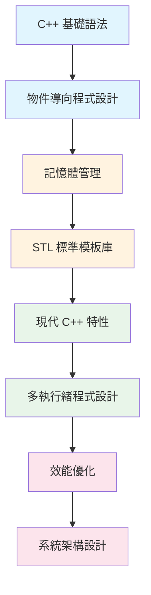
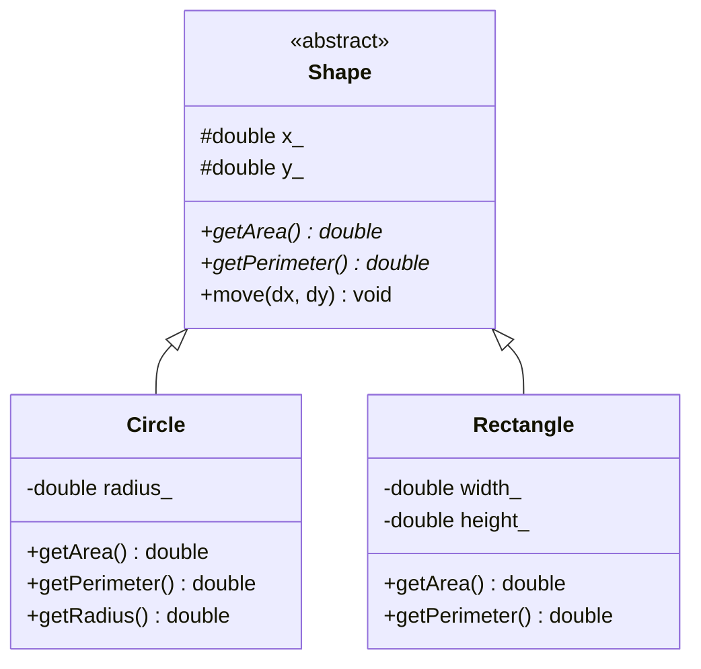
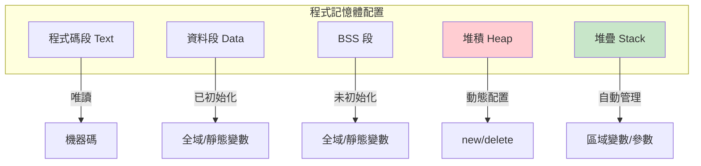
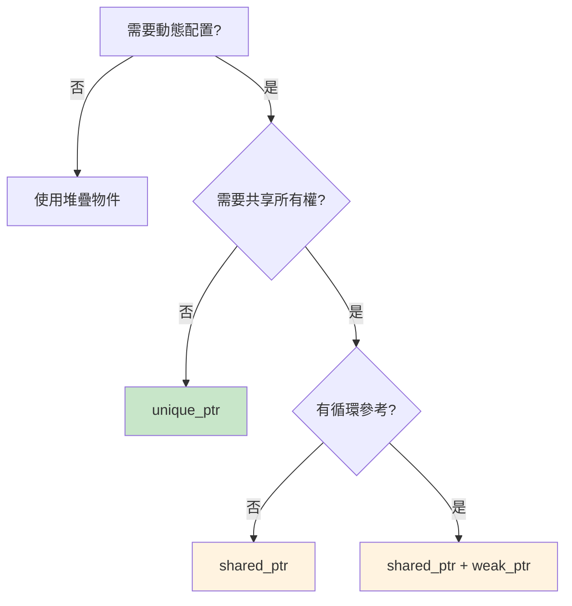
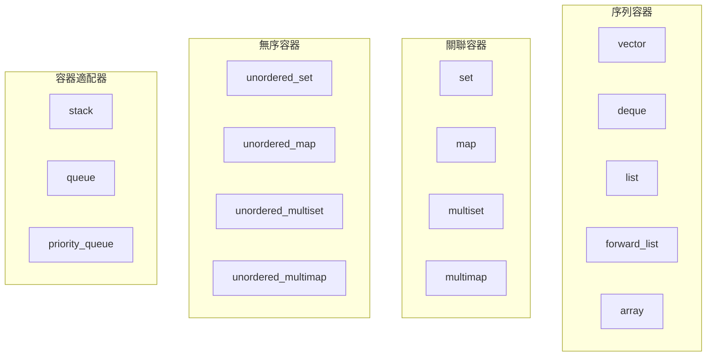
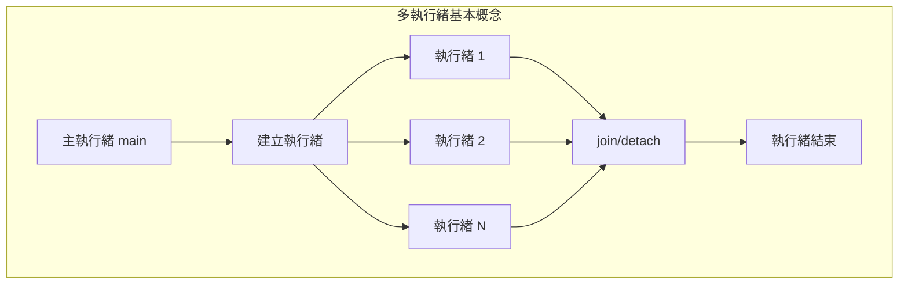
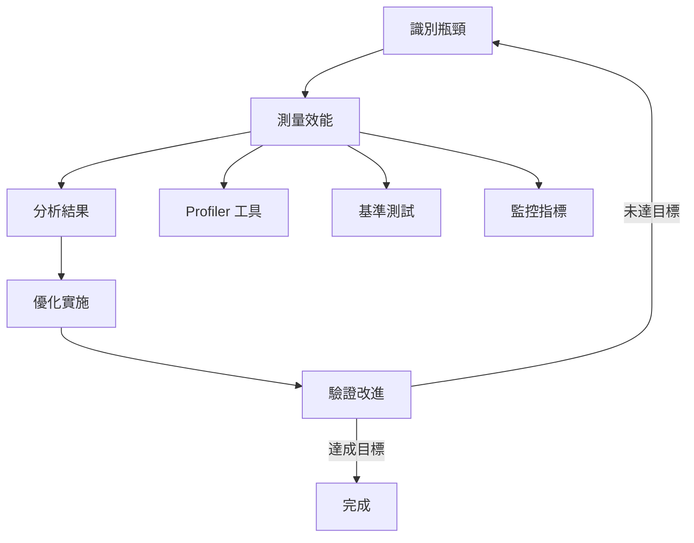
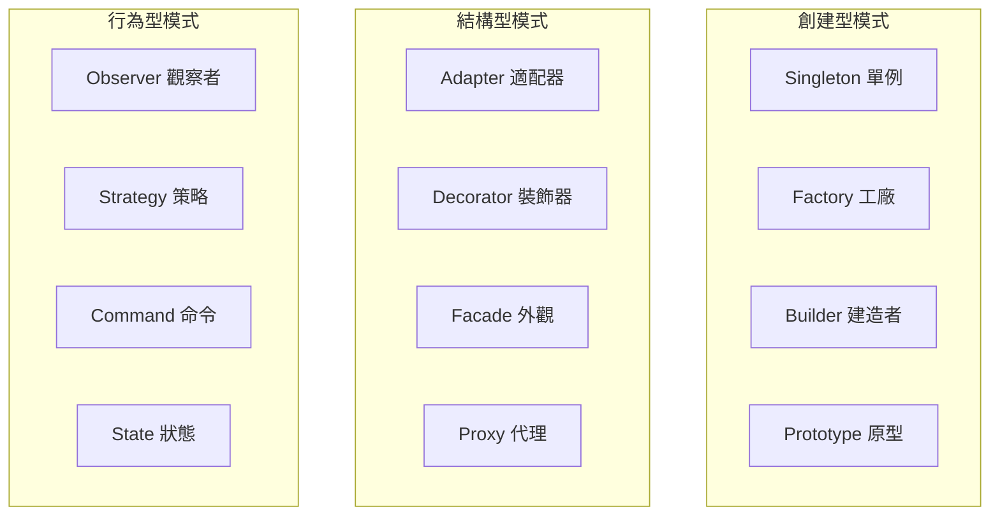
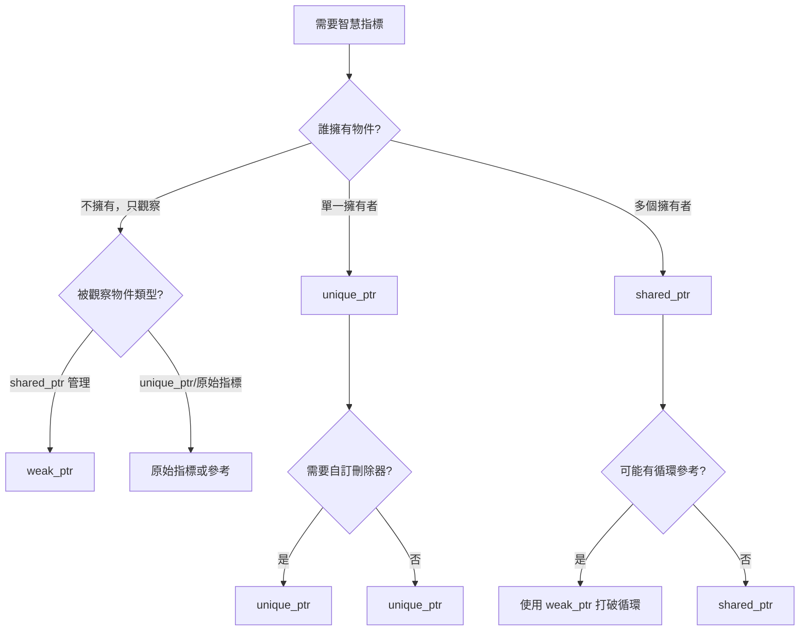

+++
date = '2026-02-03T21:21:46+08:00'
draft = false
title = 'C++語言教學手冊'
tags = ['教學', '程式語言']
categories = ['教學']
+++

# C++ 語言教學手冊

> **版本**: 1.0  
> **最後更新**: 2026年2月  
> **適用對象**: 主機系統開發團隊  
> **技術層級**: 基礎至進階

---

## 目錄

1. [前言與學習指引](#1-前言與學習指引)
   - [1.1 本手冊目的](#11-本手冊目的)
   - [1.2 學習路徑圖](#12-學習路徑圖)
   - [1.3 主機系統開發的特殊考量](#13-主機系統開發的特殊考量)

2. [C++ 基礎語法與概念](#2-c-基礎語法與概念)
   - [2.1 程式結構](#21-程式結構)
   - [2.2 基本資料型別](#22-基本資料型別)
   - [2.3 變數與常數](#23-變數與常數)
   - [2.4 運算子](#24-運算子)
   - [2.5 控制流程](#25-控制流程)
   - [2.6 函式](#26-函式)
   - [2.7 實務案例：設定檔解析器](#27-實務案例設定檔解析器)
   - [2.8 注意事項與最佳實踐](#28-注意事項與最佳實踐)

3. [物件導向程式設計 (OOP)](#3-物件導向程式設計-oop)
   - [3.1 類別基礎](#31-類別基礎)
   - [3.2 繼承](#32-繼承)
   - [3.3 多型](#33-多型)
   - [3.4 抽象類別與介面](#34-抽象類別與介面)
   - [3.5 組合優於繼承](#35-組合優於繼承)
   - [3.6 實務案例：訂單處理系統](#36-實務案例訂單處理系統)
   - [3.7 注意事項與最佳實踐](#37-注意事項與最佳實踐)

4. [記憶體管理](#4-記憶體管理)
   - [4.1 記憶體模型概觀](#41-記憶體模型概觀)
   - [4.2 指標基礎](#42-指標基礎)
   - [4.3 智慧指標](#43-智慧指標)
   - [4.4 RAII 原則](#44-raii-原則)
   - [4.5 記憶體效能優化](#45-記憶體效能優化)
   - [4.6 實務案例：連線池](#46-實務案例連線池)
   - [4.7 注意事項與最佳實踐](#47-注意事項與最佳實踐)

5. [STL 標準模板庫](#5-stl-標準模板庫)
   - [5.1 容器概觀](#51-容器概觀)
   - [5.2 序列容器](#52-序列容器)
   - [5.3 關聯容器](#53-關聯容器)
   - [5.4 迭代器](#54-迭代器)
   - [5.5 演算法](#55-演算法)
   - [5.6 實務案例：快取系統](#56-實務案例快取系統)
   - [5.7 注意事項與最佳實踐](#57-注意事項與最佳實踐)

6. [現代 C++ 特性](#6-現代-c-特性)
   - [6.1 C++11 核心特性](#61-c11-核心特性)
   - [6.2 C++14 增強](#62-c14-增強)
   - [6.3 C++17 特性](#63-c17-特性)
   - [6.4 C++20 特性](#64-c20-特性)
   - [6.5 C++23 預覽](#65-c23-預覽)
   - [6.6 注意事項與最佳實踐](#66-注意事項與最佳實踐)

7. [多執行緒與並行程式設計](#7-多執行緒與並行程式設計)
   - [7.1 執行緒基礎](#71-執行緒基礎)
   - [7.2 同步機制](#72-同步機制)
   - [7.3 高階並行工具](#73-高階並行工具)
   - [7.4 並行程式設計模式](#74-並行程式設計模式)
   - [7.5 實務案例：並行日誌系統](#75-實務案例並行日誌系統)
   - [7.6 注意事項與最佳實踐](#76-注意事項與最佳實踐)

8. [效能優化與最佳實踐](#8-效能優化與最佳實踐)
   - [8.1 效能分析方法論](#81-效能分析方法論)
   - [8.2 編譯器優化](#82-編譯器優化)
   - [8.3 記憶體優化](#83-記憶體優化)
   - [8.4 演算法優化](#84-演算法優化)
   - [8.5 基準測試](#85-基準測試)
   - [8.6 實務案例：高效能字串處理](#86-實務案例高效能字串處理)
   - [8.7 注意事項與最佳實踐](#87-注意事項與最佳實踐)

9. [系統開發常見模式與架構](#9-系統開發常見模式與架構)
   - [9.1 設計模式概觀](#91-設計模式概觀)
   - [9.2 創建型模式](#92-創建型模式)
   - [9.3 結構型模式](#93-結構型模式)
   - [9.4 行為型模式](#94-行為型模式)
   - [9.5 架構模式](#95-架構模式)
   - [9.6 注意事項與最佳實踐](#96-注意事項與最佳實踐)

10. [錯誤處理與除錯技巧](#10-錯誤處理與除錯技巧)
    - [10.1 例外處理](#101-例外處理)
    - [10.2 斷言與契約](#102-斷言與契約)
    - [10.3 除錯技巧](#103-除錯技巧)
    - [10.4 實務案例：健壯的錯誤處理](#104-實務案例健壯的錯誤處理)
    - [10.5 注意事項與最佳實踐](#105-注意事項與最佳實踐)

11. [程式碼品質與可維護性](#11-程式碼品質與可維護性)
    - [11.1 程式碼風格指南](#111-程式碼風格指南)
    - [11.2 程式碼組織](#112-程式碼組織)
    - [11.3 SOLID 原則](#113-solid-原則)
    - [11.4 單元測試](#114-單元測試)
    - [11.5 文件與註解](#115-文件與註解)
    - [11.6 注意事項與最佳實踐](#116-注意事項與最佳實踐)

12. [快速參考與開發工具](#12-快速參考與開發工具)
    - [12.1 C++ 關鍵字快速參考](#121-c-關鍵字快速參考)
    - [12.2 STL 容器比較](#122-stl-容器比較)
    - [12.3 智慧指標選擇指南](#123-智慧指標選擇指南)
    - [12.4 常用演算法參考](#124-常用演算法參考)
    - [12.5 編譯器選項參考](#125-編譯器選項參考)
    - [12.6 CMake 快速參考](#126-cmake-快速參考)
    - [12.7 開發工具推薦](#127-開發工具推薦)
    - [12.8 常用程式庫參考](#128-常用程式庫參考)

13. [新進成員檢查清單](#13-新進成員檢查清單)
    - [13.1 環境設定檢查](#131-環境設定檢查)
    - [13.2 程式碼撰寫檢查](#132-程式碼撰寫檢查)
    - [13.3 程式碼審查檢查](#133-程式碼審查檢查)
    - [13.4 發布前檢查](#134-發布前檢查)
    - [13.5 學習進度追蹤](#135-學習進度追蹤)
    - [13.6 常見問題快速解答](#136-常見問題快速解答)

14. [結語](#14-結語)
    - [14.1 持續學習資源](#141-持續學習資源)
    - [14.2 版本歷史](#142-版本歷史)
    - [14.3 貢獻者](#143-貢獻者)

---

## 1. 前言與學習指引

### 1.1 本手冊目的

本手冊專為需要使用 C++ 開發主機系統的團隊成員所設計，涵蓋從基礎語法到進階系統開發的完整知識體系。主機系統開發對效能、可靠性和資源管理有嚴格要求，因此本手冊特別強調這些面向。

### 1.2 學習路徑圖



### 1.3 主機系統開發的特殊考量

| 考量面向 | 說明 | 重要性 |
| -------- | ---- | ------ |
| **效能** | 低延遲、高吞吐量 | ⭐⭐⭐⭐⭐ |
| **穩定性** | 7x24 不間斷運行 | ⭐⭐⭐⭐⭐ |
| **資源管理** | 記憶體、檔案描述符 | ⭐⭐⭐⭐⭐ |
| **可維護性** | 長期維護與擴展 | ⭐⭐⭐⭐ |
| **安全性** | 防止漏洞與攻擊 | ⭐⭐⭐⭐ |

---

## 2. C++ 基礎語法與概念

### 2.1 程式結構

#### 2.1.1 基本程式架構

```cpp
// 檔案: main.cpp
// 說明: C++ 程式的基本結構

#include <iostream>  // 標準輸入輸出庫
#include <string>    // 字串庫

// 命名空間宣告（避免在標頭檔中使用 using namespace）
using std::cout;
using std::endl;
using std::string;

// 常數定義
constexpr int MAX_BUFFER_SIZE = 1024;

// 函式前向宣告
void processData(const string& data);

// 主程式進入點
int main(int argc, char* argv[]) {
    // 程式邏輯
    string message = "Hello, C++!";
    processData(message);
    
    return 0;  // 0 表示成功，非零表示錯誤
}

// 函式實作
void processData(const string& data) {
    cout << "處理資料: " << data << endl;
}
```

#### 2.1.2 標頭檔與實作檔分離

##### 標頭檔 (calculator.h)

```cpp
#ifndef CALCULATOR_H  // Include Guard 防止重複引入
#define CALCULATOR_H

#pragma once  // 現代編譯器支援的替代方案

namespace math {

/**
 * @brief 計算器類別
 * @details 提供基本數學運算功能
 */
class Calculator {
public:
    // 建構子與解構子
    Calculator();
    ~Calculator();
    
    // 公開方法
    double add(double a, double b) const;
    double subtract(double a, double b) const;
    double multiply(double a, double b) const;
    double divide(double a, double b) const;
    
private:
    // 私有成員
    int operationCount_;
};

}  // namespace math

#endif  // CALCULATOR_H
```

##### 實作檔 (calculator.cpp)

```cpp
#include "calculator.h"
#include <stdexcept>

namespace math {

Calculator::Calculator() : operationCount_(0) {}

Calculator::~Calculator() = default;

double Calculator::add(double a, double b) const {
    return a + b;
}

double Calculator::subtract(double a, double b) const {
    return a - b;
}

double Calculator::multiply(double a, double b) const {
    return a * b;
}

double Calculator::divide(double a, double b) const {
    if (b == 0.0) {
        throw std::invalid_argument("除數不能為零");
    }
    return a / b;
}

}  // namespace math
```

### 2.2 基本資料型別

#### 2.2.1 內建型別總覽

```cpp
#include <cstdint>   // 固定寬度整數型別
#include <limits>    // 型別限制

void demonstrateDataTypes() {
    // ===== 整數型別 =====
    // 建議使用固定寬度型別以確保跨平台一致性
    
    int8_t   tinyInt   = 127;           // 1 byte, -128 ~ 127
    int16_t  shortInt  = 32767;         // 2 bytes
    int32_t  normalInt = 2147483647;    // 4 bytes
    int64_t  longInt   = 9223372036854775807LL;  // 8 bytes
    
    // 無符號整數
    uint8_t  unsignedTiny  = 255;
    uint16_t unsignedShort = 65535;
    uint32_t unsignedInt   = 4294967295U;
    uint64_t unsignedLong  = 18446744073709551615ULL;
    
    // size_t: 用於表示大小，平台相關
    size_t arraySize = 100;
    
    // ===== 浮點數型別 =====
    float  singlePrecision = 3.14159f;   // 4 bytes, ~7 位有效數字
    double doublePrecision = 3.14159265358979;  // 8 bytes, ~15 位有效數字
    
    // ===== 字元型別 =====
    char   asciiChar = 'A';
    char16_t utf16Char = u'中';
    char32_t utf32Char = U'中';
    
    // ===== 布林型別 =====
    bool isValid = true;
    
    // ===== 取得型別資訊 =====
    std::cout << "int32_t 最大值: " 
              << std::numeric_limits<int32_t>::max() << std::endl;
    std::cout << "double 精度: " 
              << std::numeric_limits<double>::digits10 << " 位" << std::endl;
}
```

#### 2.2.2 型別選擇指南

| 用途 | 建議型別 | 說明 |
|------|---------|------|
| 迴圈計數器 | `int` 或 `size_t` | 一般情況用 `int`，陣列索引用 `size_t` |
| 陣列大小 | `size_t` | 永遠為非負數 |
| 金額計算 | `int64_t` | 使用最小單位(分)避免浮點誤差 |
| 科學計算 | `double` | 足夠精度的浮點數 |
| 位元操作 | `uint32_t` / `uint64_t` | 固定寬度無符號整數 |
| 狀態旗標 | `bool` 或 `enum class` | 語意清晰 |

### 2.3 變數與常數

#### 2.3.1 變數宣告與初始化

```cpp
#include <vector>
#include <string>

void demonstrateInitialization() {
    // ===== 初始化方式 =====
    
    // 1. 複製初始化 (Copy initialization)
    int a = 10;
    
    // 2. 直接初始化 (Direct initialization)
    int b(20);
    
    // 3. 列表初始化 (List/Brace initialization) - C++11 推薦
    int c{30};           // 窄化轉換會產生錯誤
    int d = {40};
    
    // 4. 自動型別推導 (C++11)
    auto value = 3.14;   // double
    auto name = std::string("John");  // std::string
    
    // ===== 列表初始化的優勢 =====
    // 防止窄化轉換
    // int narrowing{3.14};  // 編譯錯誤！
    
    // 統一的初始化語法
    std::vector<int> vec{1, 2, 3, 4, 5};
    
    // ===== 結構化繫結 (C++17) =====
    std::pair<std::string, int> person{"Alice", 30};
    auto [personName, age] = person;  // 解構
}
```

#### 2.3.2 常數定義

```cpp
#include <array>

// ===== 編譯期常數 =====

// constexpr: 編譯期求值（優先使用）
constexpr int MAX_CONNECTIONS = 1000;
constexpr double PI = 3.14159265358979;

// constexpr 函式
constexpr int square(int x) {
    return x * x;
}

// const: 執行期常數
const int runtimeConst = getConfigValue();  // 執行期決定

// ===== 避免使用 #define =====
// 不推薦: #define MAX_SIZE 100
// 推薦:
constexpr size_t MAX_SIZE = 100;

// ===== 常數陣列 =====
constexpr std::array<int, 5> PRIMES = {2, 3, 5, 7, 11};

// ===== 字串常數 =====
constexpr const char* APP_NAME = "HostSystem";
constexpr std::string_view VERSION = "1.0.0";  // C++17

// ===== 類別中的常數 =====
class Config {
public:
    static constexpr int DEFAULT_TIMEOUT = 30;
    static constexpr double DEFAULT_RATE = 0.05;
    
    // 內聯變數 (C++17)
    static inline const std::string DEFAULT_PATH = "/etc/config";
};
```

### 2.4 運算子

#### 2.4.1 運算子優先順序速查

```cpp
// 優先順序由高到低（常用）
// 1. :: (範圍解析)
// 2. . -> [] () (成員存取、下標、函式呼叫)
// 3. ++ -- ! ~ (一元運算子)
// 4. * / % (乘除)
// 5. + - (加減)
// 6. << >> (位元移位)
// 7. < <= > >= (比較)
// 8. == != (相等)
// 9. & (位元 AND)
// 10. ^ (位元 XOR)
// 11. | (位元 OR)
// 12. && (邏輯 AND)
// 13. || (邏輯 OR)
// 14. ?: (條件)
// 15. = += -= 等 (賦值)

void demonstrateOperators() {
    // 最佳實踐：使用括號明確優先順序
    int result = (a + b) * c;  // 清晰
    
    // 位元運算
    uint32_t flags = 0;
    flags |= (1 << 3);   // 設定第 3 位
    flags &= ~(1 << 3);  // 清除第 3 位
    bool isSet = (flags & (1 << 3)) != 0;  // 檢查第 3 位
    
    // 三元運算子
    int max = (a > b) ? a : b;
}
```

#### 2.4.2 比較運算子的陷阱

```cpp
#include <cmath>
#include <limits>

// ===== 浮點數比較 =====
bool almostEqual(double a, double b, 
                 double epsilon = std::numeric_limits<double>::epsilon()) {
    return std::abs(a - b) <= epsilon * std::max(std::abs(a), std::abs(b));
}

// 錯誤示範
// if (0.1 + 0.2 == 0.3)  // 可能為 false！

// 正確做法
if (almostEqual(0.1 + 0.2, 0.3)) {
    // 處理相等情況
}

// ===== 三向比較運算子 (C++20) =====
#include <compare>

struct Version {
    int major, minor, patch;
    
    auto operator<=>(const Version&) const = default;
};

Version v1{1, 2, 3};
Version v2{1, 2, 4};
// v1 < v2  // true
// v1 == v2 // false
```

### 2.5 控制流程

#### 2.5.1 條件判斷

```cpp
#include <optional>

void demonstrateConditionals() {
    int status = getStatus();
    
    // ===== if-else =====
    if (status == 0) {
        handleSuccess();
    } else if (status < 0) {
        handleError(status);
    } else {
        handleWarning(status);
    }
    
    // ===== if with initializer (C++17) =====
    if (auto result = compute(); result.has_value()) {
        process(*result);
    } else {
        handleMissing();
    }
    
    // ===== switch =====
    switch (status) {
        case 0:
            handleSuccess();
            break;
        case 1:
        case 2:  // 多個 case 共用
            handleMinorError();
            break;
        case 3:
            handleMajorError();
            [[fallthrough]];  // C++17: 明確表示 fallthrough
        case 4:
            logError();
            break;
        default:
            handleUnknown();
            break;
    }
    
    // ===== switch with initializer (C++17) =====
    switch (auto type = getType(); type) {
        case Type::A: /* ... */ break;
        case Type::B: /* ... */ break;
        default: break;
    }
}
```

#### 2.5.2 迴圈結構

```cpp
#include <vector>
#include <algorithm>

void demonstrateLoops() {
    std::vector<int> numbers = {1, 2, 3, 4, 5};
    
    // ===== 範圍 for 迴圈 (推薦) =====
    // 唯讀存取
    for (const auto& num : numbers) {
        std::cout << num << " ";
    }
    
    // 需要修改元素
    for (auto& num : numbers) {
        num *= 2;
    }
    
    // ===== 傳統 for 迴圈 (需要索引時使用) =====
    for (size_t i = 0; i < numbers.size(); ++i) {
        std::cout << "Index " << i << ": " << numbers[i] << std::endl;
    }
    
    // ===== while 迴圈 =====
    auto it = numbers.begin();
    while (it != numbers.end()) {
        if (*it % 2 == 0) {
            it = numbers.erase(it);  // erase 返回下一個迭代器
        } else {
            ++it;
        }
    }
    
    // ===== do-while 迴圈 =====
    int attempts = 0;
    do {
        bool success = tryOperation();
        if (success) break;
        ++attempts;
    } while (attempts < MAX_RETRIES);
    
    // ===== 使用演算法替代迴圈 (推薦) =====
    // 移除偶數
    numbers.erase(
        std::remove_if(numbers.begin(), numbers.end(),
                       [](int n) { return n % 2 == 0; }),
        numbers.end()
    );
    
    // 計算總和
    int sum = std::accumulate(numbers.begin(), numbers.end(), 0);
}
```

### 2.6 函式

#### 2.6.1 函式定義與參數傳遞

```cpp
#include <string>
#include <vector>
#include <span>

// ===== 參數傳遞方式 =====

// 1. 傳值 (小型物件或需要複製)
int processValue(int value) {
    return value * 2;
}

// 2. const 參考 (大型物件，唯讀)
void processString(const std::string& text) {
    std::cout << text << std::endl;
}

// 3. 非 const 參考 (需要修改原始物件)
void appendData(std::vector<int>& container, int value) {
    container.push_back(value);
}

// 4. 指標 (可選參數或需要 nullptr)
void optionalProcess(const Config* config = nullptr) {
    if (config) {
        // 使用 config
    }
}

// 5. 右值參考 (移動語意)
void consumeString(std::string&& text) {
    internalBuffer = std::move(text);
}

// 6. span (C++20，陣列視圖)
double calculateAverage(std::span<const int> values) {
    if (values.empty()) return 0.0;
    return std::accumulate(values.begin(), values.end(), 0.0) / values.size();
}

// ===== 參數傳遞指南 =====
/*
 * | 型別特性        | 傳遞方式                |
 * |----------------|------------------------|
 * | 內建型別        | 傳值                    |
 * | 小型物件(<16B)  | 傳值或 const&          |
 * | 大型物件        | const& (唯讀)          |
 * | 需要修改        | & (參考)               |
 * | 可選參數        | 指標或 std::optional   |
 * | 轉移所有權      | 值傳遞 + std::move     |
 */
```

#### 2.6.2 函式重載與預設參數

```cpp
#include <string>
#include <vector>

class Logger {
public:
    // ===== 函式重載 =====
    void log(const std::string& message) {
        log(LogLevel::INFO, message);
    }
    
    void log(LogLevel level, const std::string& message) {
        log(level, "DEFAULT", message);
    }
    
    void log(LogLevel level, const std::string& category, 
             const std::string& message) {
        // 實際記錄邏輯
    }
    
    // ===== 預設參數 =====
    void configure(
        const std::string& filename,
        LogLevel minLevel = LogLevel::INFO,
        bool async = false,
        size_t bufferSize = 4096
    ) {
        // 設定邏輯
    }
    
    // ===== 刪除特定重載 =====
    void process(int value);
    void process(double) = delete;  // 禁止 double 參數
};

// ===== 注意事項 =====
// 1. 預設參數只在宣告中指定，不在定義中重複
// 2. 預設參數必須從右到左連續指定
// 3. 避免重載與預設參數產生歧義
```

#### 2.6.3 Lambda 表達式

```cpp
#include <algorithm>
#include <functional>
#include <vector>

void demonstrateLambda() {
    std::vector<int> numbers = {1, 2, 3, 4, 5, 6, 7, 8, 9, 10};
    int threshold = 5;
    
    // ===== 基本語法 =====
    // [capture](parameters) -> return_type { body }
    
    // 1. 無捕獲
    auto isEven = [](int n) { return n % 2 == 0; };
    
    // 2. 值捕獲
    auto isAboveThreshold = [threshold](int n) { return n > threshold; };
    
    // 3. 參考捕獲
    int count = 0;
    std::for_each(numbers.begin(), numbers.end(), [&count](int n) {
        if (n % 2 == 0) ++count;
    });
    
    // 4. 混合捕獲
    auto processor = [threshold, &count](int n) {
        if (n > threshold) ++count;
    };
    
    // 5. 捕獲所有 (謹慎使用)
    auto captureAllByValue = [=](int n) { return n > threshold; };
    auto captureAllByRef = [&](int n) { ++count; };
    
    // ===== 進階用法 =====
    
    // mutable lambda (修改值捕獲的變數)
    auto counter = [count = 0]() mutable { return ++count; };
    
    // 泛型 lambda (C++14)
    auto genericAdd = [](auto a, auto b) { return a + b; };
    
    // 初始化捕獲 (C++14)
    auto ptr = std::make_unique<int>(42);
    auto movedCapture = [p = std::move(ptr)]() { return *p; };
    
    // constexpr lambda (C++17)
    constexpr auto square = [](int n) constexpr { return n * n; };
    static_assert(square(5) == 25);
    
    // 樣板 lambda (C++20)
    auto templateLambda = []<typename T>(std::vector<T>& vec) {
        return vec.size();
    };
}

// ===== Lambda vs std::function =====
// Lambda: 編譯期型別，零開銷，適合內聯使用
// std::function: 執行期多型，有開銷，適合儲存/傳遞

std::function<int(int)> getMultiplier(int factor) {
    return [factor](int n) { return n * factor; };
}
```

### 2.7 實務案例：設定檔解析器

```cpp
#include <string>
#include <unordered_map>
#include <fstream>
#include <sstream>
#include <stdexcept>
#include <optional>

/**
 * @brief 簡單的 key=value 設定檔解析器
 * @details 支援註解(#)、空行、字串值
 */
class ConfigParser {
public:
    /**
     * @brief 從檔案載入設定
     * @param filename 設定檔路徑
     * @throws std::runtime_error 檔案開啟失敗
     */
    void loadFromFile(const std::string& filename) {
        std::ifstream file(filename);
        if (!file.is_open()) {
            throw std::runtime_error("無法開啟設定檔: " + filename);
        }
        
        std::string line;
        int lineNumber = 0;
        
        while (std::getline(file, line)) {
            ++lineNumber;
            
            // 移除前後空白
            line = trim(line);
            
            // 跳過空行和註解
            if (line.empty() || line[0] == '#') {
                continue;
            }
            
            // 解析 key=value
            auto delimPos = line.find('=');
            if (delimPos == std::string::npos) {
                throw std::runtime_error(
                    "格式錯誤在第 " + std::to_string(lineNumber) + " 行"
                );
            }
            
            std::string key = trim(line.substr(0, delimPos));
            std::string value = trim(line.substr(delimPos + 1));
            
            if (key.empty()) {
                throw std::runtime_error(
                    "空的鍵名在第 " + std::to_string(lineNumber) + " 行"
                );
            }
            
            config_[key] = value;
        }
    }
    
    /**
     * @brief 取得字串值
     * @param key 設定鍵名
     * @return 設定值，如不存在則返回 nullopt
     */
    [[nodiscard]] std::optional<std::string> getString(
        const std::string& key
    ) const {
        auto it = config_.find(key);
        if (it != config_.end()) {
            return it->second;
        }
        return std::nullopt;
    }
    
    /**
     * @brief 取得整數值
     */
    [[nodiscard]] std::optional<int> getInt(const std::string& key) const {
        if (auto str = getString(key)) {
            try {
                return std::stoi(*str);
            } catch (const std::exception&) {
                return std::nullopt;
            }
        }
        return std::nullopt;
    }
    
    /**
     * @brief 取得布林值
     */
    [[nodiscard]] std::optional<bool> getBool(const std::string& key) const {
        if (auto str = getString(key)) {
            std::string lower = *str;
            std::transform(lower.begin(), lower.end(), lower.begin(), 
                          ::tolower);
            if (lower == "true" || lower == "1" || lower == "yes") {
                return true;
            }
            if (lower == "false" || lower == "0" || lower == "no") {
                return false;
            }
        }
        return std::nullopt;
    }

private:
    std::unordered_map<std::string, std::string> config_;
    
    static std::string trim(const std::string& str) {
        const char* whitespace = " \t\r\n";
        size_t start = str.find_first_not_of(whitespace);
        if (start == std::string::npos) return "";
        size_t end = str.find_last_not_of(whitespace);
        return str.substr(start, end - start + 1);
    }
};

// 使用範例
void useConfigParser() {
    ConfigParser config;
    
    try {
        config.loadFromFile("/etc/app/config.ini");
        
        // 使用 value_or 提供預設值
        int port = config.getInt("server.port").value_or(8080);
        bool debug = config.getBool("debug.enabled").value_or(false);
        std::string host = config.getString("server.host").value_or("localhost");
        
        std::cout << "Server: " << host << ":" << port << std::endl;
        
    } catch (const std::exception& e) {
        std::cerr << "設定載入失敗: " << e.what() << std::endl;
    }
}
```

### 2.8 注意事項與最佳實踐

> ⚠️ **常見陷阱**
> 1. 未初始化的變數含有不確定值
> 2. 整數溢位是未定義行為
> 3. 浮點數比較不可直接使用 `==`
> 4. `switch` 忘記 `break` 導致 fall-through
> 5. 迴圈中修改容器大小導致迭代器失效

> ✅ **最佳實踐**
> 1. 使用 `{}` 初始化以防止窄化轉換
> 2. 優先使用 `constexpr` 而非 `#define`
> 3. 使用範圍 for 迴圈遍歷容器
> 4. 使用 `[[nodiscard]]` 標記不應忽略返回值的函式
> 5. 變數宣告盡量靠近首次使用處

---

## 3. 物件導向程式設計 (OOP)

### 3.1 類別基礎

#### 3.1.1 類別定義

```cpp
#include <string>
#include <memory>

/**
 * @brief 銀行帳戶類別
 * @details 展示封裝、存取控制和成員初始化
 */
class BankAccount {
public:
    // ===== 型別別名 =====
    using Money = double;
    
    // ===== 建構子 =====
    
    // 預設建構子
    BankAccount() = default;
    
    // 參數化建構子
    explicit BankAccount(std::string accountNumber, std::string ownerName)
        : accountNumber_(std::move(accountNumber))
        , ownerName_(std::move(ownerName))
        , balance_(0.0)
        , transactionCount_(0) {
        // 建構子本體（盡量保持為空）
    }
    
    // 複製建構子（使用預設或自訂）
    BankAccount(const BankAccount& other) = default;
    
    // 移動建構子
    BankAccount(BankAccount&& other) noexcept = default;
    
    // ===== 解構子 =====
    ~BankAccount() = default;
    
    // ===== 賦值運算子 =====
    BankAccount& operator=(const BankAccount& other) = default;
    BankAccount& operator=(BankAccount&& other) noexcept = default;
    
    // ===== 公開方法 =====
    
    /**
     * @brief 存款
     * @param amount 存款金額（必須為正數）
     * @return 操作是否成功
     */
    bool deposit(Money amount) {
        if (amount <= 0) {
            return false;
        }
        balance_ += amount;
        ++transactionCount_;
        return true;
    }
    
    /**
     * @brief 提款
     * @param amount 提款金額
     * @return 操作是否成功
     */
    bool withdraw(Money amount) {
        if (amount <= 0 || amount > balance_) {
            return false;
        }
        balance_ -= amount;
        ++transactionCount_;
        return true;
    }
    
    // ===== Getter 方法 =====
    [[nodiscard]] const std::string& getAccountNumber() const noexcept {
        return accountNumber_;
    }
    
    [[nodiscard]] const std::string& getOwnerName() const noexcept {
        return ownerName_;
    }
    
    [[nodiscard]] Money getBalance() const noexcept {
        return balance_;
    }
    
    [[nodiscard]] int getTransactionCount() const noexcept {
        return transactionCount_;
    }

protected:
    // 子類別可存取
    void logTransaction(const std::string& type, Money amount);

private:
    // ===== 私有成員變數 =====
    std::string accountNumber_;
    std::string ownerName_;
    Money balance_{0.0};  // 類別內初始化 (C++11)
    int transactionCount_{0};
    
    // ===== 私有輔助方法 =====
    bool validateAmount(Money amount) const {
        return amount > 0;
    }
};
```

#### 3.1.2 成員初始化列表

```cpp
class DatabaseConnection {
public:
    // ===== 正確: 使用成員初始化列表 =====
    DatabaseConnection(
        std::string host,
        int port,
        std::string database
    )
        : host_(std::move(host))         // 1. 移動而非複製
        , port_(port)                     // 2. 基本型別直接初始化
        , database_(std::move(database))
        , connectionId_(generateId())     // 3. 可呼叫函式
        , isConnected_(false) {
        // 建構子本體
    }
    
    // ===== 錯誤示範（不要這樣做）=====
    /*
    DatabaseConnection(std::string host, int port) {
        host_ = host;      // 錯誤: 先預設建構再賦值
        port_ = port;      // 效率較低
    }
    */

private:
    std::string host_;
    int port_;
    std::string database_;
    const int connectionId_;  // const 成員必須在初始化列表中初始化
    bool isConnected_;
    
    static int generateId() {
        static int nextId = 0;
        return ++nextId;
    }
};

// ===== 初始化順序 =====
// 成員變數按照「宣告順序」初始化，而非初始化列表順序
// 建議: 初始化列表順序與宣告順序保持一致
```

### 3.2 繼承

#### 3.2.1 繼承類型



#### 3.5.1 抽象類別範例

```cpp
#include <cmath>
#include <memory>
#include <vector>

/**
 * @brief 抽象基底類別：形狀
 */
class Shape {
public:
    // 虛擬解構子（基底類別必須）
    virtual ~Shape() = default;
    
    // 純虛擬函式（子類別必須實作）
    [[nodiscard]] virtual double getArea() const = 0;
    [[nodiscard]] virtual double getPerimeter() const = 0;
    
    // 虛擬函式（可覆寫）
    [[nodiscard]] virtual std::string getName() const {
        return "Shape";
    }
    
    // 非虛擬函式（不應覆寫）
    void move(double dx, double dy) {
        x_ += dx;
        y_ += dy;
    }
    
    [[nodiscard]] double getX() const noexcept { return x_; }
    [[nodiscard]] double getY() const noexcept { return y_; }

protected:
    // protected 建構子：只能透過子類別建構
    Shape(double x, double y) : x_(x), y_(y) {}
    
    double x_{0.0};
    double y_{0.0};
};

/**
 * @brief 圓形類別
 */
class Circle : public Shape {
public:
    explicit Circle(double radius, double x = 0.0, double y = 0.0)
        : Shape(x, y)
        , radius_(radius) {
        if (radius <= 0) {
            throw std::invalid_argument("半徑必須為正數");
        }
    }
    
    // override: 明確標記覆寫（C++11）
    [[nodiscard]] double getArea() const override {
        return M_PI * radius_ * radius_;
    }
    
    [[nodiscard]] double getPerimeter() const override {
        return 2 * M_PI * radius_;
    }
    
    [[nodiscard]] std::string getName() const override {
        return "Circle";
    }
    
    // Circle 特有方法
    [[nodiscard]] double getRadius() const noexcept {
        return radius_;
    }

private:
    double radius_;
};

/**
 * @brief 矩形類別
 */
class Rectangle : public Shape {
public:
    Rectangle(double width, double height, double x = 0.0, double y = 0.0)
        : Shape(x, y)
        , width_(width)
        , height_(height) {}
    
    [[nodiscard]] double getArea() const override {
        return width_ * height_;
    }
    
    [[nodiscard]] double getPerimeter() const override {
        return 2 * (width_ + height_);
    }
    
    [[nodiscard]] std::string getName() const override {
        return "Rectangle";
    }

private:
    double width_;
    double height_;
};

// ===== 多型使用 =====
void demonstratePolymorphism() {
    std::vector<std::unique_ptr<Shape>> shapes;
    
    shapes.push_back(std::make_unique<Circle>(5.0));
    shapes.push_back(std::make_unique<Rectangle>(4.0, 6.0));
    
    for (const auto& shape : shapes) {
        std::cout << shape->getName() << ": "
                  << "面積 = " << shape->getArea() << ", "
                  << "周長 = " << shape->getPerimeter() << std::endl;
    }
}
```

#### 3.2.2 final 關鍵字

```cpp
// final 類別：禁止被繼承
class SecurityManager final {
public:
    static SecurityManager& getInstance();
    void authenticate(const std::string& token);
};

// final 方法：禁止被覆寫
class BaseLogger {
public:
    virtual void log(const std::string& message);
    virtual void flush() final;  // 子類別不能覆寫
};
```

### 3.3 多型

#### 3.3.1 執行期多型 vs 編譯期多型

```cpp
// ===== 執行期多型（虛擬函式）=====
// 優點：靈活、可擴展
// 缺點：虛擬函式呼叫開銷、無法內聯

class PaymentProcessor {
public:
    virtual ~PaymentProcessor() = default;
    virtual bool process(double amount) = 0;
};

class CreditCardProcessor : public PaymentProcessor {
public:
    bool process(double amount) override {
        // 信用卡處理邏輯
        return true;
    }
};

// ===== 編譯期多型（CRTP）=====
// 優點：零執行期開銷、可內聯
// 缺點：較複雜、無法動態選擇

template<typename Derived>
class PaymentProcessorCRTP {
public:
    bool process(double amount) {
        return static_cast<Derived*>(this)->processImpl(amount);
    }
};

class FastCreditCardProcessor : public PaymentProcessorCRTP<FastCreditCardProcessor> {
public:
    bool processImpl(double amount) {
        // 信用卡處理邏輯
        return true;
    }
};

// ===== 選擇指南 =====
/*
 * 使用執行期多型當：
 * - 需要在執行期決定實際型別
 * - 需要儲存異質物件的集合
 * - 擴展性比效能重要
 * 
 * 使用編譯期多型當：
 * - 型別在編譯期已知
 * - 效能是關鍵考量
 * - 不需要異質集合
 */
```

#### 3.3.2 型別轉換

```cpp
#include <typeinfo>

void demonstrateCasting() {
    std::unique_ptr<Shape> shape = std::make_unique<Circle>(5.0);
    
    // ===== dynamic_cast（執行期安全轉換）=====
    // 用於有虛擬函式的類別階層
    
    // 指標轉換：失敗返回 nullptr
    if (Circle* circle = dynamic_cast<Circle*>(shape.get())) {
        std::cout << "半徑: " << circle->getRadius() << std::endl;
    }
    
    // 參考轉換：失敗拋出 std::bad_cast
    try {
        Circle& circleRef = dynamic_cast<Circle&>(*shape);
        std::cout << "半徑: " << circleRef.getRadius() << std::endl;
    } catch (const std::bad_cast& e) {
        std::cout << "轉換失敗" << std::endl;
    }
    
    // ===== static_cast（編譯期轉換）=====
    // 較快但不安全，確定型別時使用
    double d = 3.14;
    int i = static_cast<int>(d);
    
    // ===== const_cast（移除 const）=====
    // 謹慎使用，通常用於呼叫舊式 API
    const char* constStr = "hello";
    char* mutableStr = const_cast<char*>(constStr);  // 危險！
    
    // ===== reinterpret_cast（位元重新解釋）=====
    // 最危險，僅用於底層操作
    uintptr_t addr = reinterpret_cast<uintptr_t>(shape.get());
    
    // ===== typeid（型別資訊）=====
    std::cout << "型別: " << typeid(*shape).name() << std::endl;
}
```

### 3.4 抽象類別與介面

```cpp
/**
 * @brief 介面：可序列化
 * @details 純抽象類別作為介面使用
 */
class ISerializable {
public:
    virtual ~ISerializable() = default;
    
    [[nodiscard]] virtual std::string serialize() const = 0;
    virtual void deserialize(const std::string& data) = 0;
};

/**
 * @brief 介面：可比較
 */
class IComparable {
public:
    virtual ~IComparable() = default;
    
    [[nodiscard]] virtual int compareTo(const IComparable& other) const = 0;
};

/**
 * @brief 實作多個介面
 */
class Employee : public ISerializable, public IComparable {
public:
    Employee(std::string id, std::string name, double salary)
        : id_(std::move(id))
        , name_(std::move(name))
        , salary_(salary) {}
    
    // 實作 ISerializable
    [[nodiscard]] std::string serialize() const override {
        return id_ + "," + name_ + "," + std::to_string(salary_);
    }
    
    void deserialize(const std::string& data) override {
        // 解析 CSV 格式
    }
    
    // 實作 IComparable
    [[nodiscard]] int compareTo(const IComparable& other) const override {
        const auto* otherEmp = dynamic_cast<const Employee*>(&other);
        if (!otherEmp) {
            throw std::invalid_argument("比較對象必須是 Employee");
        }
        return id_.compare(otherEmp->id_);
    }

private:
    std::string id_;
    std::string name_;
    double salary_;
};
```

### 3.5 組合優於繼承

```cpp
/**
 * @brief 日誌功能（組合）
 */
class Logger {
public:
    void log(const std::string& message) {
        std::cout << "[LOG] " << message << std::endl;
    }
};

/**
 * @brief 快取功能（組合）
 */
class Cache {
public:
    void set(const std::string& key, const std::string& value) {
        data_[key] = value;
    }
    
    std::optional<std::string> get(const std::string& key) const {
        auto it = data_.find(key);
        return (it != data_.end()) ? std::optional{it->second} : std::nullopt;
    }

private:
    std::unordered_map<std::string, std::string> data_;
};

/**
 * @brief 使用組合而非繼承
 * @details 服務類別組合多個功能模組
 */
class UserService {
public:
    UserService(std::shared_ptr<Logger> logger,
                std::shared_ptr<Cache> cache)
        : logger_(std::move(logger))
        , cache_(std::move(cache)) {}
    
    std::optional<User> getUser(const std::string& userId) {
        logger_->log("Getting user: " + userId);
        
        // 嘗試從快取取得
        if (auto cached = cache_->get("user:" + userId)) {
            return deserializeUser(*cached);
        }
        
        // 從資料庫取得
        auto user = fetchFromDatabase(userId);
        if (user) {
            cache_->set("user:" + userId, serializeUser(*user));
        }
        
        return user;
    }

private:
    std::shared_ptr<Logger> logger_;
    std::shared_ptr<Cache> cache_;
    
    // ...其他方法
};
```

### 3.6 實務案例：訂單處理系統

```cpp
#include <string>
#include <vector>
#include <memory>
#include <chrono>
#include <optional>

// ===== 值物件 =====
struct Money {
    int64_t cents;  // 使用整數避免浮點誤差
    
    static Money fromDollars(double dollars) {
        return Money{static_cast<int64_t>(dollars * 100)};
    }
    
    [[nodiscard]] double toDollars() const {
        return static_cast<double>(cents) / 100.0;
    }
    
    Money operator+(const Money& other) const {
        return Money{cents + other.cents};
    }
    
    Money operator*(int quantity) const {
        return Money{cents * quantity};
    }
};

// ===== 介面 =====
class IOrderValidator {
public:
    virtual ~IOrderValidator() = default;
    [[nodiscard]] virtual bool validate(const class Order& order) const = 0;
    [[nodiscard]] virtual std::string getValidationError() const = 0;
};

class IPaymentGateway {
public:
    virtual ~IPaymentGateway() = default;
    [[nodiscard]] virtual bool charge(const std::string& accountId, Money amount) = 0;
    virtual void refund(const std::string& transactionId) = 0;
};

// ===== 實體類別 =====
class OrderItem {
public:
    OrderItem(std::string productId, std::string name, Money price, int quantity)
        : productId_(std::move(productId))
        , name_(std::move(name))
        , price_(price)
        , quantity_(quantity) {}
    
    [[nodiscard]] Money getSubtotal() const {
        return price_ * quantity_;
    }
    
    [[nodiscard]] const std::string& getProductId() const { return productId_; }
    [[nodiscard]] int getQuantity() const { return quantity_; }

private:
    std::string productId_;
    std::string name_;
    Money price_;
    int quantity_;
};

enum class OrderStatus {
    PENDING,
    VALIDATED,
    PAID,
    SHIPPED,
    COMPLETED,
    CANCELLED
};

class Order {
public:
    explicit Order(std::string customerId)
        : customerId_(std::move(customerId))
        , status_(OrderStatus::PENDING)
        , createdAt_(std::chrono::system_clock::now()) {
        orderId_ = generateOrderId();
    }
    
    void addItem(OrderItem item) {
        items_.push_back(std::move(item));
    }
    
    [[nodiscard]] Money getTotal() const {
        Money total{0};
        for (const auto& item : items_) {
            total = total + item.getSubtotal();
        }
        return total;
    }
    
    void setStatus(OrderStatus status) { status_ = status; }
    [[nodiscard]] OrderStatus getStatus() const { return status_; }
    [[nodiscard]] const std::string& getOrderId() const { return orderId_; }
    [[nodiscard]] const std::string& getCustomerId() const { return customerId_; }
    [[nodiscard]] const std::vector<OrderItem>& getItems() const { return items_; }

private:
    std::string orderId_;
    std::string customerId_;
    std::vector<OrderItem> items_;
    OrderStatus status_;
    std::chrono::system_clock::time_point createdAt_;
    
    static std::string generateOrderId() {
        static int counter = 0;
        return "ORD-" + std::to_string(++counter);
    }
};

// ===== 服務類別 =====
class OrderService {
public:
    OrderService(
        std::unique_ptr<IOrderValidator> validator,
        std::unique_ptr<IPaymentGateway> paymentGateway
    )
        : validator_(std::move(validator))
        , paymentGateway_(std::move(paymentGateway)) {}
    
    struct ProcessResult {
        bool success;
        std::string message;
        std::optional<std::string> transactionId;
    };
    
    [[nodiscard]] ProcessResult processOrder(Order& order) {
        // 1. 驗證訂單
        if (!validator_->validate(order)) {
            return {false, validator_->getValidationError(), std::nullopt};
        }
        order.setStatus(OrderStatus::VALIDATED);
        
        // 2. 處理付款
        if (!paymentGateway_->charge(order.getCustomerId(), order.getTotal())) {
            return {false, "付款失敗", std::nullopt};
        }
        order.setStatus(OrderStatus::PAID);
        
        // 3. 記錄交易
        std::string transactionId = "TXN-" + order.getOrderId();
        
        return {true, "訂單處理成功", transactionId};
    }

private:
    std::unique_ptr<IOrderValidator> validator_;
    std::unique_ptr<IPaymentGateway> paymentGateway_;
};
```

### 3.7 注意事項與最佳實踐

> ⚠️ **常見陷阱**
> 1. 忘記將基底類別解構子宣告為 virtual
> 2. 在建構子/解構子中呼叫虛擬函式
> 3. 切片問題（Slicing）：以值傳遞多型物件
> 4. 過度使用繼承導致類別階層過深
> 5. 忘記使用 override 關鍵字

> ✅ **最佳實踐**
> 1. 優先使用組合而非繼承
> 2. 介面與實作分離
> 3. 遵循 SOLID 原則
> 4. 使用 `override` 和 `final` 關鍵字
> 5. 基底類別解構子必須是 virtual 或 protected

---

## 4. 記憶體管理

### 4.1 記憶體模型概觀



### 4.2 指標基礎

#### 4.2.1 原始指標操作

```cpp
#include <iostream>

void demonstratePointers() {
    // ===== 指標宣告與初始化 =====
    int value = 42;
    int* ptr = &value;      // ptr 指向 value
    int* nullPtr = nullptr; // 空指標（永遠用 nullptr，不用 NULL 或 0）
    
    // ===== 解參考 =====
    std::cout << "值: " << *ptr << std::endl;  // 42
    *ptr = 100;  // 修改 value 的值
    
    // ===== 指標算術 =====
    int arr[] = {10, 20, 30, 40, 50};
    int* arrPtr = arr;
    
    std::cout << *arrPtr << std::endl;       // 10
    std::cout << *(arrPtr + 1) << std::endl; // 20
    std::cout << arrPtr[2] << std::endl;     // 30 (等同於 *(arrPtr + 2))
    
    // ===== 指標的指標 =====
    int** ptrPtr = &ptr;
    std::cout << **ptrPtr << std::endl;  // 100
    
    // ===== const 與指標 =====
    const int* ptrToConst = &value;     // 指向常數的指標，不能透過指標修改值
    // *ptrToConst = 200;               // 錯誤！
    
    int* const constPtr = &value;       // 常數指標，不能改變指向
    *constPtr = 200;                    // OK，可以修改值
    // constPtr = nullptr;              // 錯誤！
    
    const int* const constPtrToConst = &value;  // 兩者皆常數
}
```

#### 4.2.2 原始指標的風險

```cpp
// ===== 常見記憶體問題 =====

// 1. 記憶體洩漏
void memoryLeak() {
    int* ptr = new int(42);
    // 忘記 delete ptr;  // 記憶體洩漏！
    
    // 或者在 delete 前發生例外
    int* ptr2 = new int(100);
    throw std::runtime_error("Error");  // ptr2 洩漏！
    delete ptr2;  // 永遠不會執行
}

// 2. 懸空指標 (Dangling Pointer)
int* danglingPointer() {
    int local = 42;
    return &local;  // 危險！返回區域變數的位址
}

// 3. 重複釋放
void doubleFree() {
    int* ptr = new int(42);
    delete ptr;
    delete ptr;  // 未定義行為！
}

// 4. 使用已釋放的記憶體
void useAfterFree() {
    int* ptr = new int(42);
    delete ptr;
    *ptr = 100;  // 未定義行為！
}

// 5. 陣列 new/delete 不匹配
void mismatchedDelete() {
    int* arr = new int[10];
    delete arr;  // 錯誤！應該用 delete[]
}
```

### 4.3 智慧指標

#### 4.3.1 unique_ptr（獨佔所有權）

```cpp
#include <memory>
#include <vector>

class Resource {
public:
    Resource(int id) : id_(id) {
        std::cout << "Resource " << id_ << " 建立" << std::endl;
    }
    ~Resource() {
        std::cout << "Resource " << id_ << " 銷毀" << std::endl;
    }
    void use() { std::cout << "使用 Resource " << id_ << std::endl; }

private:
    int id_;
};

void demonstrateUniquePtr() {
    // ===== 建立 unique_ptr =====
    
    // 推薦：使用 make_unique (C++14)
    auto ptr1 = std::make_unique<Resource>(1);
    
    // 也可以直接建構
    std::unique_ptr<Resource> ptr2(new Resource(2));
    
    // ===== 使用 =====
    ptr1->use();          // 箭頭運算子
    (*ptr1).use();        // 解參考
    Resource* raw = ptr1.get();  // 取得原始指標（不轉移所有權）
    
    // ===== 所有權轉移 =====
    std::unique_ptr<Resource> ptr3 = std::move(ptr1);
    // ptr1 現在為空
    if (!ptr1) {
        std::cout << "ptr1 已轉移所有權" << std::endl;
    }
    
    // ===== 釋放與重置 =====
    Resource* released = ptr3.release();  // 釋放所有權但不刪除
    delete released;  // 需要手動刪除
    
    ptr2.reset();           // 刪除並設為空
    ptr2.reset(new Resource(4));  // 刪除舊的，指向新的
    
    // ===== 陣列 =====
    auto arr = std::make_unique<int[]>(10);
    arr[0] = 42;
    
    // ===== 自訂刪除器 =====
    auto fileDeleter = [](FILE* fp) {
        if (fp) fclose(fp);
        std::cout << "檔案已關閉" << std::endl;
    };
    std::unique_ptr<FILE, decltype(fileDeleter)> file(
        fopen("test.txt", "r"), 
        fileDeleter
    );
    
    // ===== 在容器中使用 =====
    std::vector<std::unique_ptr<Resource>> resources;
    resources.push_back(std::make_unique<Resource>(5));
    resources.push_back(std::make_unique<Resource>(6));
    
    // 所有 Resource 在 vector 銷毀時自動釋放
}

// ===== 工廠函式模式 =====
std::unique_ptr<Resource> createResource(int id) {
    return std::make_unique<Resource>(id);  // 自動移動
}
```

#### 4.3.2 shared_ptr（共享所有權）

```cpp
#include <memory>

void demonstrateSharedPtr() {
    // ===== 建立 shared_ptr =====
    
    // 推薦：使用 make_shared（一次配置）
    auto ptr1 = std::make_shared<Resource>(1);
    
    // ===== 共享所有權 =====
    std::shared_ptr<Resource> ptr2 = ptr1;  // 複製增加引用計數
    std::shared_ptr<Resource> ptr3 = ptr1;
    
    std::cout << "引用計數: " << ptr1.use_count() << std::endl;  // 3
    
    ptr2.reset();  // ptr2 不再指向 Resource
    std::cout << "引用計數: " << ptr1.use_count() << std::endl;  // 2
    
    // ===== weak_ptr 解決循環參考 =====
    struct Node {
        std::string name;
        std::shared_ptr<Node> next;      // 強參考
        std::weak_ptr<Node> prev;        // 弱參考（不增加引用計數）
        
        Node(std::string n) : name(std::move(n)) {
            std::cout << "Node " << name << " 建立" << std::endl;
        }
        ~Node() {
            std::cout << "Node " << name << " 銷毀" << std::endl;
        }
    };
    
    auto node1 = std::make_shared<Node>("A");
    auto node2 = std::make_shared<Node>("B");
    
    node1->next = node2;
    node2->prev = node1;  // 使用 weak_ptr 避免循環
    
    // ===== 使用 weak_ptr =====
    std::weak_ptr<Node> weakPtr = node1;
    
    if (auto locked = weakPtr.lock()) {  // 嘗試取得 shared_ptr
        std::cout << "Node 仍然存在: " << locked->name << std::endl;
    }
    
    if (!weakPtr.expired()) {
        // 物件仍然存在
    }
}

// ===== 錯誤示範：循環參考 =====
/*
struct BadNode {
    std::shared_ptr<BadNode> other;  // 互相持有會導致記憶體洩漏
};

auto a = std::make_shared<BadNode>();
auto b = std::make_shared<BadNode>();
a->other = b;
b->other = a;  // 記憶體洩漏！
*/
```

#### 4.3.3 智慧指標選擇指南



| 情境 | 建議 |
|------|------|
| 獨佔所有權，工廠函式返回 | `unique_ptr` |
| 容器內存放多型物件 | `unique_ptr` |
| 多個物件共享資源 | `shared_ptr` |
| 快取、觀察者模式 | `weak_ptr` |
| 效能關鍵路徑 | `unique_ptr`（零開銷） |

### 4.4 RAII 原則

```cpp
/**
 * @brief RAII (Resource Acquisition Is Initialization)
 * @details 資源取得即初始化，利用物件生命週期管理資源
 */

// ===== 檔案處理 RAII =====
class FileHandle {
public:
    explicit FileHandle(const std::string& filename, const char* mode = "r")
        : file_(fopen(filename.c_str(), mode)) {
        if (!file_) {
            throw std::runtime_error("無法開啟檔案: " + filename);
        }
    }
    
    ~FileHandle() {
        if (file_) {
            fclose(file_);
        }
    }
    
    // 禁止複製
    FileHandle(const FileHandle&) = delete;
    FileHandle& operator=(const FileHandle&) = delete;
    
    // 允許移動
    FileHandle(FileHandle&& other) noexcept : file_(other.file_) {
        other.file_ = nullptr;
    }
    
    FileHandle& operator=(FileHandle&& other) noexcept {
        if (this != &other) {
            if (file_) fclose(file_);
            file_ = other.file_;
            other.file_ = nullptr;
        }
        return *this;
    }
    
    FILE* get() const noexcept { return file_; }

private:
    FILE* file_;
};

// ===== 鎖定 RAII =====
#include <mutex>

class LockGuard {
public:
    explicit LockGuard(std::mutex& mutex) : mutex_(mutex) {
        mutex_.lock();
    }
    
    ~LockGuard() {
        mutex_.unlock();
    }
    
    LockGuard(const LockGuard&) = delete;
    LockGuard& operator=(const LockGuard&) = delete;

private:
    std::mutex& mutex_;
};

// 實際使用標準庫的 lock_guard
void threadSafeOperation() {
    static std::mutex mtx;
    std::lock_guard<std::mutex> lock(mtx);
    // 臨界區程式碼
    // lock 離開作用域時自動解鎖
}

// ===== Scope Guard（通用 RAII）=====
template<typename Func>
class ScopeGuard {
public:
    explicit ScopeGuard(Func&& func) : func_(std::move(func)), active_(true) {}
    
    ~ScopeGuard() {
        if (active_) {
            func_();
        }
    }
    
    void dismiss() noexcept { active_ = false; }
    
    ScopeGuard(const ScopeGuard&) = delete;
    ScopeGuard& operator=(const ScopeGuard&) = delete;

private:
    Func func_;
    bool active_;
};

// 輔助函式
template<typename Func>
ScopeGuard<Func> makeScopeGuard(Func&& func) {
    return ScopeGuard<Func>(std::forward<Func>(func));
}

// 使用範例
void useScopeGuard() {
    auto connection = openDatabaseConnection();
    auto guard = makeScopeGuard([&]() { 
        closeConnection(connection); 
    });
    
    // 做一些可能拋出例外的操作
    performOperations(connection);
    
    // 即使發生例外，連線也會被關閉
}
```

### 4.5 記憶體效能優化

```cpp
#include <vector>
#include <memory>

// ===== 避免不必要的配置 =====

// 不好：頻繁配置
void badAllocation() {
    for (int i = 0; i < 1000; ++i) {
        auto ptr = std::make_unique<int>(i);  // 每次迴圈都配置
    }
}

// 好：重複使用
void goodAllocation() {
    auto ptr = std::make_unique<int>();
    for (int i = 0; i < 1000; ++i) {
        *ptr = i;
    }
}

// ===== 預先配置容器空間 =====
void efficientVector() {
    std::vector<int> vec;
    vec.reserve(1000);  // 預先配置空間
    
    for (int i = 0; i < 1000; ++i) {
        vec.push_back(i);  // 不會重新配置
    }
}

// ===== 使用 emplace 避免複製 =====
class Heavy {
public:
    Heavy(int a, std::string b) : a_(a), b_(std::move(b)) {}
private:
    int a_;
    std::string b_;
};

void efficientEmplace() {
    std::vector<Heavy> vec;
    
    // 不好：先建構再複製/移動
    vec.push_back(Heavy(1, "test"));
    
    // 好：就地建構
    vec.emplace_back(1, "test");
}

// ===== 物件池模式 =====
template<typename T, size_t PoolSize = 1024>
class ObjectPool {
public:
    T* acquire() {
        if (!freeList_.empty()) {
            T* obj = freeList_.back();
            freeList_.pop_back();
            return obj;
        }
        
        if (nextIndex_ < PoolSize) {
            return &pool_[nextIndex_++];
        }
        
        return nullptr;  // 池已滿
    }
    
    void release(T* obj) {
        freeList_.push_back(obj);
    }

private:
    std::array<T, PoolSize> pool_;
    std::vector<T*> freeList_;
    size_t nextIndex_ = 0;
};
```

### 4.6 實務案例：連線池

```cpp
#include <memory>
#include <queue>
#include <mutex>
#include <condition_variable>
#include <chrono>

/**
 * @brief 資料庫連線介面
 */
class IDatabaseConnection {
public:
    virtual ~IDatabaseConnection() = default;
    virtual bool execute(const std::string& sql) = 0;
    virtual bool isValid() const = 0;
};

/**
 * @brief 連線池實作
 * @details 使用 RAII 和智慧指標管理連線生命週期
 */
class ConnectionPool {
public:
    using ConnectionPtr = std::shared_ptr<IDatabaseConnection>;
    using PooledConnection = std::unique_ptr<IDatabaseConnection, 
                                             std::function<void(IDatabaseConnection*)>>;
    
    ConnectionPool(size_t poolSize, std::function<ConnectionPtr()> factory)
        : maxSize_(poolSize)
        , factory_(std::move(factory)) {
        // 預先建立連線
        for (size_t i = 0; i < poolSize; ++i) {
            pool_.push(factory_());
        }
    }
    
    /**
     * @brief 取得連線
     * @param timeout 等待逾時時間
     * @return 池化連線，離開作用域時自動歸還
     */
    [[nodiscard]] PooledConnection acquire(
        std::chrono::milliseconds timeout = std::chrono::milliseconds(5000)
    ) {
        std::unique_lock<std::mutex> lock(mutex_);
        
        // 等待可用連線
        if (!cv_.wait_for(lock, timeout, [this]() { return !pool_.empty(); })) {
            throw std::runtime_error("連線池逾時");
        }
        
        auto conn = std::move(pool_.front());
        pool_.pop();
        
        // 檢查連線有效性
        if (!conn->isValid()) {
            conn = factory_();
        }
        
        // 返回帶有自訂刪除器的 unique_ptr
        // 當 PooledConnection 銷毀時，連線會被歸還到池中
        auto* rawPtr = conn.get();
        return PooledConnection(rawPtr, [this, conn = std::move(conn)]
                                        (IDatabaseConnection*) mutable {
            this->release(std::move(conn));
        });
    }
    
    [[nodiscard]] size_t availableCount() const {
        std::lock_guard<std::mutex> lock(mutex_);
        return pool_.size();
    }

private:
    void release(ConnectionPtr conn) {
        std::lock_guard<std::mutex> lock(mutex_);
        pool_.push(std::move(conn));
        cv_.notify_one();
    }
    
    size_t maxSize_;
    std::function<ConnectionPtr()> factory_;
    std::queue<ConnectionPtr> pool_;
    mutable std::mutex mutex_;
    std::condition_variable cv_;
};

// 使用範例
void useConnectionPool() {
    // 建立連線池
    ConnectionPool pool(10, []() {
        return std::make_shared<MySQLConnection>("localhost", "db");
    });
    
    // 使用連線
    {
        auto conn = pool.acquire();
        conn->execute("SELECT * FROM users");
        // conn 離開作用域時自動歸還
    }
    
    // 多執行緒安全使用
    std::vector<std::thread> threads;
    for (int i = 0; i < 20; ++i) {
        threads.emplace_back([&pool, i]() {
            try {
                auto conn = pool.acquire();
                conn->execute("INSERT INTO logs VALUES(" + std::to_string(i) + ")");
            } catch (const std::exception& e) {
                std::cerr << "執行緒 " << i << " 錯誤: " << e.what() << std::endl;
            }
        });
    }
    
    for (auto& t : threads) {
        t.join();
    }
}
```

### 4.7 注意事項與最佳實踐

> ⚠️ **常見陷阱**
> 1. 混用 `new[]` 和 `delete`（應使用 `delete[]`）
> 2. 返回區域變數的指標或參考
> 3. 忘記虛擬解構子導致衍生類別未完全銷毀
> 4. `shared_ptr` 循環參考造成記憶體洩漏
> 5. 在多執行緒環境中不正確地使用智慧指標

> ✅ **最佳實踐**
> 1. 優先使用智慧指標，避免原始 `new`/`delete`
> 2. 使用 `make_unique` 和 `make_shared`
> 3. 遵循 RAII 原則管理所有資源
> 4. `unique_ptr` 優先於 `shared_ptr`
> 5. 使用 AddressSanitizer 檢測記憶體問題

---

## 5. STL 標準模板庫

### 5.1 容器概觀



### 5.2 序列容器

#### 5.2.1 vector

```cpp
#include <vector>
#include <algorithm>
#include <numeric>

void demonstrateVector() {
    // ===== 建立與初始化 =====
    std::vector<int> vec1;                    // 空 vector
    std::vector<int> vec2(10);                // 10 個 0
    std::vector<int> vec3(10, 42);            // 10 個 42
    std::vector<int> vec4{1, 2, 3, 4, 5};     // 初始化列表
    std::vector<int> vec5(vec4);              // 複製
    std::vector<int> vec6(vec4.begin(), vec4.end());  // 範圍
    
    // ===== 容量管理 =====
    vec1.reserve(100);      // 預留空間（不改變 size）
    vec1.resize(50);        // 改變大小
    vec1.shrink_to_fit();   // 釋放多餘空間
    
    std::cout << "Size: " << vec4.size() << std::endl;
    std::cout << "Capacity: " << vec4.capacity() << std::endl;
    std::cout << "Empty: " << vec4.empty() << std::endl;
    
    // ===== 元素存取 =====
    int first = vec4.front();       // 第一個元素
    int last = vec4.back();         // 最後一個元素
    int elem = vec4[2];             // 下標存取（不檢查邊界）
    int safe = vec4.at(2);          // 安全存取（檢查邊界）
    int* data = vec4.data();        // 取得底層陣列指標
    
    // ===== 修改操作 =====
    vec4.push_back(6);              // 尾部添加
    vec4.emplace_back(7);           // 就地建構（更高效）
    vec4.pop_back();                // 移除最後一個
    
    vec4.insert(vec4.begin() + 2, 100);     // 插入
    vec4.erase(vec4.begin() + 2);           // 刪除
    vec4.erase(vec4.begin(), vec4.begin() + 2);  // 範圍刪除
    
    vec4.clear();                   // 清空
    
    // ===== 迭代 =====
    // 範圍 for（推薦）
    for (const auto& elem : vec4) {
        std::cout << elem << " ";
    }
    
    // 迭代器
    for (auto it = vec4.begin(); it != vec4.end(); ++it) {
        std::cout << *it << " ";
    }
    
    // 反向迭代
    for (auto it = vec4.rbegin(); it != vec4.rend(); ++it) {
        std::cout << *it << " ";
    }
    
    // ===== 常用演算法 =====
    std::sort(vec4.begin(), vec4.end());                    // 排序
    std::reverse(vec4.begin(), vec4.end());                 // 反轉
    auto it = std::find(vec4.begin(), vec4.end(), 3);       // 搜尋
    int sum = std::accumulate(vec4.begin(), vec4.end(), 0); // 求和
    
    // 移除元素（Erase-Remove 慣用法）
    vec4.erase(
        std::remove_if(vec4.begin(), vec4.end(), 
                       [](int x) { return x % 2 == 0; }),
        vec4.end()
    );
}
```

#### 5.2.2 其他序列容器比較

```cpp
#include <vector>
#include <deque>
#include <list>
#include <forward_list>
#include <array>

// | 容器          | 隨機存取 | 頭部插入 | 尾部插入 | 中間插入 | 記憶體 |
// |--------------|---------|---------|---------|---------|--------|
// | vector       | O(1)    | O(n)    | O(1)*   | O(n)    | 連續   |
// | deque        | O(1)    | O(1)*   | O(1)*   | O(n)    | 分段   |
// | list         | O(n)    | O(1)    | O(1)    | O(1)    | 分散   |
// | forward_list | O(n)    | O(1)    | O(n)    | O(1)    | 分散   |
// | array        | O(1)    | N/A     | N/A     | N/A     | 連續   |
// * 均攤時間複雜度

void demonstrateDeque() {
    std::deque<int> dq{1, 2, 3};
    dq.push_front(0);   // 頭部插入 O(1)
    dq.push_back(4);    // 尾部插入 O(1)
    dq.pop_front();     // 頭部刪除 O(1)
}

void demonstrateList() {
    std::list<int> lst{1, 2, 3};
    auto it = std::find(lst.begin(), lst.end(), 2);
    lst.insert(it, 100);  // 迭代器位置插入 O(1)
    lst.splice(lst.begin(), lst, it);  // 移動元素（無複製）
    lst.sort();           // list 有自己的 sort（更高效）
    lst.unique();         // 移除連續重複
    lst.merge(lst);       // 合併已排序 list
}

void demonstrateArray() {
    std::array<int, 5> arr{1, 2, 3, 4, 5};  // 固定大小
    // 與 C 陣列相容，但有邊界檢查和迭代器支援
    arr.fill(0);
    std::sort(arr.begin(), arr.end());
}
```

### 5.3 關聯容器

#### 5.3.1 map 與 unordered_map

```cpp
#include <map>
#include <unordered_map>
#include <string>

void demonstrateMaps() {
    // ===== std::map（紅黑樹，有序）=====
    std::map<std::string, int> orderedMap;
    
    // 插入
    orderedMap["apple"] = 3;
    orderedMap.insert({"banana", 5});
    orderedMap.emplace("cherry", 2);
    
    // 查詢
    if (orderedMap.count("apple") > 0) {
        std::cout << "找到 apple" << std::endl;
    }
    
    // C++17: 結構化繫結
    if (auto [it, inserted] = orderedMap.insert({"date", 4}); inserted) {
        std::cout << "新增: " << it->first << std::endl;
    }
    
    // 存取（不存在會建立）
    int count = orderedMap["fig"];  // 建立 {"fig", 0}
    
    // 安全存取
    auto it = orderedMap.find("grape");
    if (it != orderedMap.end()) {
        std::cout << it->second << std::endl;
    }
    
    // C++17: try_emplace（只在不存在時插入）
    orderedMap.try_emplace("apple", 10);  // 不會更新，因為 apple 已存在
    
    // 遍歷（按鍵排序）
    for (const auto& [key, value] : orderedMap) {
        std::cout << key << ": " << value << std::endl;
    }
    
    // ===== std::unordered_map（雜湊表，無序）=====
    std::unordered_map<std::string, int> hashMap;
    
    // 操作與 map 相同，但是 O(1) 平均時間
    hashMap["apple"] = 3;
    hashMap.reserve(100);  // 預留空間避免重新雜湊
    
    // 自訂雜湊函式
    struct Point {
        int x, y;
        bool operator==(const Point& other) const {
            return x == other.x && y == other.y;
        }
    };
    
    struct PointHash {
        size_t operator()(const Point& p) const {
            return std::hash<int>()(p.x) ^ (std::hash<int>()(p.y) << 1);
        }
    };
    
    std::unordered_map<Point, std::string, PointHash> pointMap;
    pointMap[{1, 2}] = "A";
}

// ===== 選擇指南 =====
// map:
// - 需要按鍵排序遍歷
// - 需要範圍查詢（lower_bound, upper_bound）
// - 鍵的數量較少（<1000）
// 
// unordered_map:
// - 只需要查詢/插入/刪除
// - 大量資料
// - 效能優先
```

#### 5.3.2 set

```cpp
#include <set>
#include <unordered_set>

void demonstrateSets() {
    // ===== std::set（有序，唯一）=====
    std::set<int> orderedSet{3, 1, 4, 1, 5, 9, 2, 6};
    // 結果: {1, 2, 3, 4, 5, 6, 9}（自動排序，去重）
    
    // 插入
    auto [it, success] = orderedSet.insert(7);
    
    // 範圍查詢
    auto lower = orderedSet.lower_bound(3);  // >= 3 的第一個
    auto upper = orderedSet.upper_bound(6);  // > 6 的第一個
    
    // 範圍刪除
    orderedSet.erase(lower, upper);  // 刪除 [3, 6]
    
    // ===== std::multiset（有序，允許重複）=====
    std::multiset<int> mset{1, 2, 2, 3, 3, 3};
    std::cout << "3 的數量: " << mset.count(3) << std::endl;  // 3
    
    // 取得相等範圍
    auto [begin, end] = mset.equal_range(3);
    
    // ===== 自訂比較 =====
    auto cmp = [](int a, int b) { return a > b; };  // 降序
    std::set<int, decltype(cmp)> descendingSet(cmp);
    descendingSet.insert({1, 2, 3});
    // 結果: {3, 2, 1}
}
```

### 5.4 迭代器

```cpp
#include <vector>
#include <iterator>

void demonstrateIterators() {
    std::vector<int> vec{1, 2, 3, 4, 5};
    
    // ===== 迭代器類型 =====
    
    // 正向迭代器
    std::vector<int>::iterator it = vec.begin();
    std::vector<int>::const_iterator cit = vec.cbegin();
    
    // 反向迭代器
    std::vector<int>::reverse_iterator rit = vec.rbegin();
    
    // ===== 迭代器操作 =====
    
    // 移動
    std::advance(it, 2);      // it 前進 2 步
    auto next = std::next(it, 1);   // 返回 it 之後 1 位的迭代器
    auto prev = std::prev(it, 1);   // 返回 it 之前 1 位的迭代器
    
    // 距離
    auto dist = std::distance(vec.begin(), it);
    
    // ===== 插入迭代器 =====
    std::vector<int> dest;
    
    // back_inserter: 呼叫 push_back
    std::copy(vec.begin(), vec.end(), std::back_inserter(dest));
    
    // front_inserter: 呼叫 push_front（需要支援的容器如 deque）
    std::deque<int> dq;
    std::copy(vec.begin(), vec.end(), std::front_inserter(dq));
    
    // inserter: 在指定位置插入
    std::vector<int> vec2{10, 20};
    std::copy(vec.begin(), vec.end(), std::inserter(vec2, vec2.begin() + 1));
    
    // ===== 串流迭代器 =====
    // 讀取
    std::istream_iterator<int> inputIt(std::cin);
    std::istream_iterator<int> eof;
    std::vector<int> inputVec(inputIt, eof);
    
    // 輸出
    std::ostream_iterator<int> outputIt(std::cout, " ");
    std::copy(vec.begin(), vec.end(), outputIt);
}
```

### 5.5 演算法

#### 5.5.1 常用演算法

```cpp
#include <algorithm>
#include <numeric>
#include <vector>
#include <string>

void demonstrateAlgorithms() {
    std::vector<int> vec{5, 2, 8, 1, 9, 3, 7, 4, 6};
    
    // ===== 非修改演算法 =====
    
    // 查詢
    auto it = std::find(vec.begin(), vec.end(), 5);
    auto it2 = std::find_if(vec.begin(), vec.end(), 
                            [](int x) { return x > 7; });
    
    // 計數
    int count = std::count(vec.begin(), vec.end(), 5);
    int countIf = std::count_if(vec.begin(), vec.end(),
                                [](int x) { return x % 2 == 0; });
    
    // 檢查條件
    bool allPositive = std::all_of(vec.begin(), vec.end(),
                                   [](int x) { return x > 0; });
    bool anyNegative = std::any_of(vec.begin(), vec.end(),
                                   [](int x) { return x < 0; });
    bool noneZero = std::none_of(vec.begin(), vec.end(),
                                 [](int x) { return x == 0; });
    
    // ===== 修改演算法 =====
    
    // 複製
    std::vector<int> dest(vec.size());
    std::copy(vec.begin(), vec.end(), dest.begin());
    std::copy_if(vec.begin(), vec.end(), dest.begin(),
                 [](int x) { return x % 2 == 0; });
    
    // 轉換
    std::transform(vec.begin(), vec.end(), vec.begin(),
                   [](int x) { return x * 2; });
    
    // 填充
    std::fill(vec.begin(), vec.end(), 0);
    std::generate(vec.begin(), vec.end(), 
                  [n = 0]() mutable { return n++; });
    
    // 移除（需配合 erase）
    auto newEnd = std::remove(vec.begin(), vec.end(), 5);
    vec.erase(newEnd, vec.end());
    
    // 替換
    std::replace(vec.begin(), vec.end(), 0, 100);
    
    // 唯一化（需先排序）
    std::sort(vec.begin(), vec.end());
    auto uniqueEnd = std::unique(vec.begin(), vec.end());
    vec.erase(uniqueEnd, vec.end());
    
    // ===== 排序演算法 =====
    
    std::sort(vec.begin(), vec.end());                      // 升序
    std::sort(vec.begin(), vec.end(), std::greater<int>()); // 降序
    std::partial_sort(vec.begin(), vec.begin() + 3, vec.end());  // 部分排序
    std::nth_element(vec.begin(), vec.begin() + 4, vec.end());   // 第 n 元素
    std::stable_sort(vec.begin(), vec.end());               // 穩定排序
    
    // 二分搜尋（需已排序）
    bool found = std::binary_search(vec.begin(), vec.end(), 5);
    auto lower = std::lower_bound(vec.begin(), vec.end(), 5);
    auto upper = std::upper_bound(vec.begin(), vec.end(), 5);
    auto range = std::equal_range(vec.begin(), vec.end(), 5);
    
    // ===== 數值演算法 =====
    
    int sum = std::accumulate(vec.begin(), vec.end(), 0);
    int product = std::accumulate(vec.begin(), vec.end(), 1,
                                  std::multiplies<int>());
    
    // 內積
    std::vector<int> vec2{1, 2, 3};
    int dotProduct = std::inner_product(vec.begin(), vec.end(),
                                        vec2.begin(), 0);
    
    // 部分和
    std::partial_sum(vec.begin(), vec.end(), vec.begin());
    
    // 相鄰差
    std::adjacent_difference(vec.begin(), vec.end(), vec.begin());
}
```

#### 5.5.2 C++17/20 演算法增強

```cpp
#include <algorithm>
#include <execution>  // C++17 並行演算法

void demonstrateModernAlgorithms() {
    std::vector<int> vec(1000000);
    std::iota(vec.begin(), vec.end(), 0);
    
    // ===== C++17 並行演算法 =====
    
    // 順序執行
    std::sort(std::execution::seq, vec.begin(), vec.end());
    
    // 並行執行
    std::sort(std::execution::par, vec.begin(), vec.end());
    
    // 並行且向量化
    std::sort(std::execution::par_unseq, vec.begin(), vec.end());
    
    // 其他並行演算法
    std::for_each(std::execution::par, vec.begin(), vec.end(),
                  [](int& x) { x *= 2; });
    
    int sum = std::reduce(std::execution::par, vec.begin(), vec.end(), 0);
    
    // ===== C++20 Ranges =====
    #if __cplusplus >= 202002L
    #include <ranges>
    
    // 管道語法
    auto result = vec 
        | std::views::filter([](int x) { return x % 2 == 0; })
        | std::views::transform([](int x) { return x * 2; })
        | std::views::take(10);
    
    for (int x : result) {
        std::cout << x << " ";
    }
    
    // Range 演算法
    std::ranges::sort(vec);
    auto it = std::ranges::find(vec, 42);
    #endif
}
```

### 5.6 實務案例：快取系統

```cpp
#include <unordered_map>
#include <list>
#include <optional>
#include <chrono>
#include <mutex>

/**
 * @brief LRU 快取實作
 * @tparam Key 鍵類型
 * @tparam Value 值類型
 * @details 使用 unordered_map + doubly-linked list 實現 O(1) 操作
 */
template<typename Key, typename Value>
class LRUCache {
public:
    explicit LRUCache(size_t capacity) : capacity_(capacity) {}
    
    /**
     * @brief 取得值
     * @param key 鍵
     * @return 值（如存在），否則 nullopt
     */
    [[nodiscard]] std::optional<Value> get(const Key& key) {
        std::lock_guard<std::mutex> lock(mutex_);
        
        auto it = map_.find(key);
        if (it == map_.end()) {
            return std::nullopt;
        }
        
        // 移動到 list 前端（最近使用）
        list_.splice(list_.begin(), list_, it->second);
        return it->second->second;
    }
    
    /**
     * @brief 設定值
     * @param key 鍵
     * @param value 值
     */
    void put(const Key& key, Value value) {
        std::lock_guard<std::mutex> lock(mutex_);
        
        auto it = map_.find(key);
        
        if (it != map_.end()) {
            // 更新現有項目
            it->second->second = std::move(value);
            list_.splice(list_.begin(), list_, it->second);
            return;
        }
        
        // 檢查容量
        if (map_.size() >= capacity_) {
            // 移除最少使用的項目（list 尾部）
            auto& lru = list_.back();
            map_.erase(lru.first);
            list_.pop_back();
        }
        
        // 插入新項目
        list_.emplace_front(key, std::move(value));
        map_[key] = list_.begin();
    }
    
    /**
     * @brief 移除項目
     */
    void remove(const Key& key) {
        std::lock_guard<std::mutex> lock(mutex_);
        
        auto it = map_.find(key);
        if (it != map_.end()) {
            list_.erase(it->second);
            map_.erase(it);
        }
    }
    
    [[nodiscard]] size_t size() const {
        std::lock_guard<std::mutex> lock(mutex_);
        return map_.size();
    }
    
    void clear() {
        std::lock_guard<std::mutex> lock(mutex_);
        map_.clear();
        list_.clear();
    }

private:
    using ListType = std::list<std::pair<Key, Value>>;
    using MapType = std::unordered_map<Key, typename ListType::iterator>;
    
    size_t capacity_;
    ListType list_;    // front = 最近使用, back = 最少使用
    MapType map_;
    mutable std::mutex mutex_;
};

// ===== 使用範例 =====
void useLRUCache() {
    LRUCache<std::string, std::string> cache(1000);
    
    // 設定
    cache.put("user:1", "Alice");
    cache.put("user:2", "Bob");
    
    // 取得
    if (auto value = cache.get("user:1")) {
        std::cout << "找到: " << *value << std::endl;
    }
    
    // 移除
    cache.remove("user:2");
}
```

### 5.7 注意事項與最佳實踐

> ⚠️ **常見陷阱**
> 1. 迭代時修改容器導致迭代器失效
> 2. `vector` 擴容時所有迭代器失效
> 3. `map[key]` 會自動插入不存在的鍵
> 4. 對未排序容器使用二分搜尋
> 5. 忘記 `reserve()` 導致多次重新配置

> ✅ **最佳實踐**
> 1. 預先 `reserve()` 已知大小的 `vector`
> 2. 使用 `emplace` 系列函式避免不必要複製
> 3. 選擇正確的容器類型
> 4. 使用演算法而非手寫迴圈
> 5. 優先使用 `ranges`（C++20）進行資料轉換

---

## 6. 現代 C++ 特性

### 6.1 C++11 核心特性

#### 6.1.1 auto 與型別推導

```cpp
#include <vector>
#include <map>
#include <typeinfo>

void demonstrateAuto() {
    // ===== auto 基本用法 =====
    auto i = 42;           // int
    auto d = 3.14;         // double
    auto s = "hello";      // const char*
    auto str = std::string("hello");  // std::string
    
    // ===== 簡化複雜型別 =====
    std::map<std::string, std::vector<int>> complexMap;
    
    // 不使用 auto（冗長）
    std::map<std::string, std::vector<int>>::iterator it1 = complexMap.begin();
    
    // 使用 auto（簡潔）
    auto it2 = complexMap.begin();
    
    // ===== auto 與 const/reference =====
    int x = 10;
    const int& rx = x;
    
    auto a = rx;        // int（去除 const 和 &）
    auto& b = rx;       // const int&
    const auto& c = x;  // const int&
    auto&& d = x;       // int&（轉發參考）
    auto&& e = 42;      // int&&
    
    // ===== decltype =====
    // 取得表達式的型別
    decltype(x) y = 20;           // int
    decltype((x)) z = x;          // int&（加括號變參考）
    decltype(auto) w = (x);       // int&
    
    // ===== 返回型別推導 (C++14) =====
    auto add = [](auto a, auto b) { return a + b; };  // 泛型 lambda
}

// ===== 尾返回型別 =====
template<typename T, typename U>
auto multiply(T t, U u) -> decltype(t * u) {
    return t * u;
}

// C++14 簡化
template<typename T, typename U>
auto multiplyModern(T t, U u) {
    return t * u;
}
```

#### 6.1.2 移動語意與右值參考

```cpp
#include <string>
#include <vector>
#include <utility>

class Buffer {
public:
    Buffer(size_t size) : size_(size), data_(new char[size]) {
        std::cout << "建構 Buffer, size=" << size_ << std::endl;
    }
    
    // 複製建構子
    Buffer(const Buffer& other) : size_(other.size_), data_(new char[size_]) {
        std::copy(other.data_, other.data_ + size_, data_);
        std::cout << "複製 Buffer" << std::endl;
    }
    
    // 移動建構子
    Buffer(Buffer&& other) noexcept 
        : size_(other.size_), data_(other.data_) {
        other.size_ = 0;
        other.data_ = nullptr;
        std::cout << "移動 Buffer" << std::endl;
    }
    
    // 複製賦值
    Buffer& operator=(const Buffer& other) {
        if (this != &other) {
            delete[] data_;
            size_ = other.size_;
            data_ = new char[size_];
            std::copy(other.data_, other.data_ + size_, data_);
        }
        std::cout << "複製賦值 Buffer" << std::endl;
        return *this;
    }
    
    // 移動賦值
    Buffer& operator=(Buffer&& other) noexcept {
        if (this != &other) {
            delete[] data_;
            size_ = other.size_;
            data_ = other.data_;
            other.size_ = 0;
            other.data_ = nullptr;
        }
        std::cout << "移動賦值 Buffer" << std::endl;
        return *this;
    }
    
    ~Buffer() {
        delete[] data_;
    }

private:
    size_t size_;
    char* data_;
};

// ===== std::move 與 std::forward =====
void demonstrateMoveSemantics() {
    Buffer buf1(1024);
    
    // std::move: 將左值轉為右值
    Buffer buf2 = std::move(buf1);  // 呼叫移動建構子
    // buf1 現在處於有效但未定義狀態
    
    // 完美轉發
    auto wrapper = [](auto&& arg) {
        process(std::forward<decltype(arg)>(arg));
    };
}

// ===== 移動語意的最佳實踐 =====
class Resource {
public:
    // 接受值並移動（統一複製和移動）
    void setName(std::string name) {
        name_ = std::move(name);
    }
    
    // 返回值優化（RVO）- 編譯器會優化
    std::string getName() const {
        return name_;  // 不需要 std::move
    }

private:
    std::string name_;
};
```

#### 6.1.3 智慧指標（詳見第 4 章）

```cpp
// 重點回顧
#include <memory>

void smartPointerSummary() {
    // unique_ptr: 獨佔所有權
    auto uptr = std::make_unique<int>(42);
    
    // shared_ptr: 共享所有權
    auto sptr = std::make_shared<int>(42);
    
    // weak_ptr: 弱參考
    std::weak_ptr<int> wptr = sptr;
}
```

#### 6.1.4 列表初始化

```cpp
#include <vector>
#include <map>
#include <initializer_list>

class Point {
public:
    int x, y;
};

class Container {
public:
    // 支援初始化列表的建構子
    Container(std::initializer_list<int> list) 
        : data_(list) {}
    
private:
    std::vector<int> data_;
};

void demonstrateUniformInit() {
    // ===== 統一初始化語法 =====
    
    // 基本型別
    int a{42};
    double d{3.14};
    
    // 陣列
    int arr[]{1, 2, 3, 4, 5};
    
    // 結構
    Point p{10, 20};
    
    // 容器
    std::vector<int> vec{1, 2, 3};
    std::map<std::string, int> map{{"a", 1}, {"b", 2}};
    
    // 自訂類別
    Container c{1, 2, 3, 4, 5};
    
    // ===== 窄化轉換防護 =====
    // int narrow{3.14};  // 編譯錯誤！
    
    // ===== 避免 Most Vexing Parse =====
    // Widget w();    // 被解析為函式宣告！
    // Widget w{};    // 正確：預設建構
}
```

### 6.2 C++14 增強

```cpp
#include <memory>
#include <tuple>

// ===== 泛型 Lambda =====
auto genericLambda = [](auto x, auto y) {
    return x + y;
};

// ===== 變數模板 =====
template<typename T>
constexpr T pi = T(3.14159265358979);

void useVariableTemplate() {
    float piFloat = pi<float>;
    double piDouble = pi<double>;
}

// ===== 返回型別推導 =====
auto factorial(int n) {
    if (n <= 1) return 1;
    return n * factorial(n - 1);
}

// ===== make_unique =====
void makeUniqueSample() {
    auto ptr = std::make_unique<int>(42);
    auto arr = std::make_unique<int[]>(10);
}

// ===== 二進位字面值 =====
void binaryLiterals() {
    int binary = 0b1010'1010;  // 數字分隔符
    long big = 1'000'000'000;
}

// ===== constexpr 放寬 =====
constexpr int factorial14(int n) {
    int result = 1;
    for (int i = 2; i <= n; ++i) {
        result *= i;
    }
    return result;  // C++14 允許迴圈
}
```

### 6.3 C++17 特性

#### 6.3.1 結構化繫結

```cpp
#include <tuple>
#include <map>
#include <array>

void demonstrateStructuredBindings() {
    // ===== 元組 =====
    std::tuple<int, std::string, double> tuple{42, "hello", 3.14};
    auto [num, str, val] = tuple;
    
    // ===== pair =====
    std::map<std::string, int> map{{"a", 1}, {"b", 2}};
    for (const auto& [key, value] : map) {
        std::cout << key << ": " << value << std::endl;
    }
    
    // ===== 陣列 =====
    std::array<int, 3> arr{1, 2, 3};
    auto [x, y, z] = arr;
    
    // ===== 結構 =====
    struct Point { int x, y; };
    Point p{10, 20};
    auto [px, py] = p;
    
    // ===== 與 if 結合 =====
    if (auto [it, inserted] = map.insert({"c", 3}); inserted) {
        std::cout << "插入成功" << std::endl;
    }
}
```

#### 6.3.2 std::optional, std::variant, std::any

```cpp
#include <optional>
#include <variant>
#include <any>
#include <string>

// ===== std::optional =====
std::optional<int> findValue(const std::vector<int>& vec, int target) {
    auto it = std::find(vec.begin(), vec.end(), target);
    if (it != vec.end()) {
        return *it;
    }
    return std::nullopt;
}

void useOptional() {
    std::vector<int> vec{1, 2, 3, 4, 5};
    
    if (auto result = findValue(vec, 3)) {
        std::cout << "找到: " << *result << std::endl;
    }
    
    // value_or 提供預設值
    int value = findValue(vec, 10).value_or(-1);
}

// ===== std::variant =====
// 型別安全的 union
using Result = std::variant<int, std::string, std::monostate>;

Result processData(int type) {
    switch (type) {
        case 0: return 42;
        case 1: return std::string("hello");
        default: return std::monostate{};
    }
}

void useVariant() {
    Result r = processData(0);
    
    // 使用 std::visit
    std::visit([](auto&& arg) {
        using T = std::decay_t<decltype(arg)>;
        if constexpr (std::is_same_v<T, int>) {
            std::cout << "int: " << arg << std::endl;
        } else if constexpr (std::is_same_v<T, std::string>) {
            std::cout << "string: " << arg << std::endl;
        }
    }, r);
    
    // 使用 std::get
    if (std::holds_alternative<int>(r)) {
        std::cout << std::get<int>(r) << std::endl;
    }
}

// ===== std::any =====
void useAny() {
    std::any a = 42;
    std::cout << std::any_cast<int>(a) << std::endl;
    
    a = std::string("hello");
    std::cout << std::any_cast<std::string>(a) << std::endl;
    
    // 型別檢查
    if (a.type() == typeid(std::string)) {
        std::cout << "是字串" << std::endl;
    }
}
```

#### 6.3.3 if constexpr 與 constexpr lambda

```cpp
#include <type_traits>

// ===== if constexpr =====
template<typename T>
auto process(T value) {
    if constexpr (std::is_integral_v<T>) {
        return value * 2;
    } else if constexpr (std::is_floating_point_v<T>) {
        return value * 2.0;
    } else {
        return value;
    }
}

// ===== constexpr lambda =====
constexpr auto square = [](int n) constexpr {
    return n * n;
};

static_assert(square(5) == 25);

// ===== 摺疊表達式 =====
template<typename... Args>
auto sum(Args... args) {
    return (args + ...);  // 右摺疊
}

template<typename... Args>
void printAll(Args... args) {
    ((std::cout << args << " "), ...);  // 逗號摺疊
    std::cout << std::endl;
}

void useFoldExpressions() {
    int total = sum(1, 2, 3, 4, 5);  // 15
    printAll("Hello", 42, 3.14);     // Hello 42 3.14
}
```

#### 6.3.4 std::string_view

```cpp
#include <string_view>
#include <string>

// ===== std::string_view =====
// 非擁有的字串視圖，避免複製

void processString(std::string_view sv) {
    std::cout << "長度: " << sv.size() << std::endl;
    std::cout << "內容: " << sv << std::endl;
}

void demonstrateStringView() {
    // 可以從多種來源建立
    processString("字面字串");              // const char*
    processString(std::string("string"));   // std::string
    
    std::string_view sv = "Hello, World!";
    
    // 子字串視圖（不複製）
    auto hello = sv.substr(0, 5);
    auto world = sv.substr(7, 5);
    
    // 搜尋
    auto pos = sv.find("World");
    
    // ===== 注意：生命週期 =====
    // std::string_view badView;
    // {
    //     std::string temp = "temporary";
    //     badView = temp;  // 危險！temp 會被銷毀
    // }
    // std::cout << badView;  // 未定義行為！
}
```

### 6.4 C++20 特性

#### 6.4.1 Concepts

```cpp
#include <concepts>
#include <type_traits>

// ===== 定義 Concept =====
template<typename T>
concept Numeric = std::is_arithmetic_v<T>;

template<typename T>
concept Printable = requires(T t) {
    { std::cout << t } -> std::same_as<std::ostream&>;
};

template<typename T>
concept Container = requires(T t) {
    { t.begin() } -> std::input_or_output_iterator;
    { t.end() } -> std::input_or_output_iterator;
    { t.size() } -> std::convertible_to<std::size_t>;
};

// ===== 使用 Concept =====

// 方式 1: requires 子句
template<typename T>
    requires Numeric<T>
T add(T a, T b) {
    return a + b;
}

// 方式 2: 簡寫語法
template<Numeric T>
T multiply(T a, T b) {
    return a * b;
}

// 方式 3: 縮寫函式模板
auto divide(Numeric auto a, Numeric auto b) {
    return a / b;
}

// ===== 組合 Concept =====
template<typename T>
concept Hashable = requires(T t) {
    { std::hash<T>{}(t) } -> std::convertible_to<std::size_t>;
};

template<typename T>
concept MapKey = Hashable<T> && std::equality_comparable<T>;

// ===== 標準庫 Concepts =====
void standardConcepts() {
    static_assert(std::integral<int>);
    static_assert(std::floating_point<double>);
    static_assert(std::same_as<int, int>);
    static_assert(std::derived_from<std::runtime_error, std::exception>);
    static_assert(std::convertible_to<int, long>);
}
```

#### 6.4.2 Ranges

```cpp
#include <ranges>
#include <vector>
#include <algorithm>

void demonstrateRanges() {
    std::vector<int> numbers{1, 2, 3, 4, 5, 6, 7, 8, 9, 10};
    
    // ===== 管道操作 =====
    auto result = numbers 
        | std::views::filter([](int n) { return n % 2 == 0; })  // 偶數
        | std::views::transform([](int n) { return n * n; })     // 平方
        | std::views::take(3);                                    // 取前 3 個
    
    for (int n : result) {
        std::cout << n << " ";  // 4 16 36
    }
    
    // ===== Range 演算法 =====
    std::ranges::sort(numbers);
    auto it = std::ranges::find(numbers, 5);
    bool found = std::ranges::contains(numbers, 5);
    
    // ===== 常用 Views =====
    
    // iota: 生成數列
    for (int n : std::views::iota(1, 11)) {
        std::cout << n << " ";  // 1 2 3 ... 10
    }
    
    // reverse: 反轉
    for (int n : numbers | std::views::reverse) {
        std::cout << n << " ";
    }
    
    // drop / take
    auto middle = numbers | std::views::drop(2) | std::views::take(5);
    
    // keys / values (for map)
    std::map<std::string, int> map{{"a", 1}, {"b", 2}};
    for (const auto& key : map | std::views::keys) {
        std::cout << key << " ";
    }
    
    // split
    std::string_view text = "hello,world,foo,bar";
    for (auto word : text | std::views::split(',')) {
        std::cout << std::string_view(word) << std::endl;
    }
}
```

#### 6.4.3 協程 (Coroutines)

```cpp
#include <coroutine>
#include <optional>

// ===== Generator 範例 =====
template<typename T>
class Generator {
public:
    struct promise_type {
        T current_value;
        
        Generator get_return_object() {
            return Generator{
                std::coroutine_handle<promise_type>::from_promise(*this)
            };
        }
        
        std::suspend_always initial_suspend() noexcept { return {}; }
        std::suspend_always final_suspend() noexcept { return {}; }
        
        std::suspend_always yield_value(T value) {
            current_value = std::move(value);
            return {};
        }
        
        void return_void() {}
        void unhandled_exception() { std::terminate(); }
    };
    
    using Handle = std::coroutine_handle<promise_type>;
    
    explicit Generator(Handle handle) : handle_(handle) {}
    
    ~Generator() {
        if (handle_) handle_.destroy();
    }
    
    // 禁止複製
    Generator(const Generator&) = delete;
    Generator& operator=(const Generator&) = delete;
    
    // 允許移動
    Generator(Generator&& other) noexcept : handle_(other.handle_) {
        other.handle_ = nullptr;
    }
    
    bool next() {
        if (!handle_ || handle_.done()) return false;
        handle_.resume();
        return !handle_.done();
    }
    
    T value() const { return handle_.promise().current_value; }

private:
    Handle handle_;
};

// 使用協程生成器
Generator<int> range(int start, int end) {
    for (int i = start; i < end; ++i) {
        co_yield i;
    }
}

void useGenerator() {
    auto gen = range(1, 10);
    while (gen.next()) {
        std::cout << gen.value() << " ";  // 1 2 3 ... 9
    }
}
```

#### 6.4.4 三向比較運算子

```cpp
#include <compare>

struct Version {
    int major;
    int minor;
    int patch;
    
    // 自動生成所有比較運算子
    auto operator<=>(const Version&) const = default;
};

struct Product {
    std::string name;
    double price;
    
    // 自訂比較邏輯
    std::strong_ordering operator<=>(const Product& other) const {
        if (auto cmp = name <=> other.name; cmp != 0) {
            return cmp;
        }
        // double 比較返回 partial_ordering，需要轉換
        if (price < other.price) return std::strong_ordering::less;
        if (price > other.price) return std::strong_ordering::greater;
        return std::strong_ordering::equal;
    }
    
    bool operator==(const Product& other) const = default;
};

void useSpaceship() {
    Version v1{1, 2, 3};
    Version v2{1, 2, 4};
    
    std::cout << (v1 < v2) << std::endl;   // true
    std::cout << (v1 == v2) << std::endl;  // false
    std::cout << (v1 != v2) << std::endl;  // true
    std::cout << (v1 >= v2) << std::endl;  // false
}
```

### 6.5 C++23 預覽

```cpp
// ===== std::expected =====
// 錯誤處理的替代方案
#include <expected>

std::expected<int, std::string> divide(int a, int b) {
    if (b == 0) {
        return std::unexpected("除以零");
    }
    return a / b;
}

void useExpected() {
    auto result = divide(10, 2);
    if (result) {
        std::cout << "結果: " << *result << std::endl;
    } else {
        std::cout << "錯誤: " << result.error() << std::endl;
    }
}

// ===== std::print (格式化輸出) =====
#include <print>

void usePrint() {
    std::print("Hello, {}!\n", "World");
    std::println("Value: {}", 42);
}

// ===== 多維下標運算子 =====
class Matrix {
public:
    int& operator[](size_t row, size_t col) {
        return data_[row * cols_ + col];
    }
    
private:
    std::vector<int> data_;
    size_t cols_;
};

// ===== if consteval =====
consteval int compileTimeOnly(int n) {
    return n * n;
}

constexpr int maybeCompileTime(int n) {
    if consteval {
        return compileTimeOnly(n);  // 編譯期
    } else {
        return n * n;  // 執行期
    }
}
```

### 6.6 注意事項與最佳實踐

> ⚠️ **常見陷阱**
> 1. `auto` 會去除 const 和 reference
> 2. 過度使用 `auto` 降低可讀性
> 3. `std::move` 後的物件處於有效但未定義狀態
> 4. `string_view` 不擁有資料，注意生命週期
> 5. 協程的記憶體管理較複雜

> ✅ **最佳實踐**
> 1. 使用 `auto` 避免重複型別名稱
> 2. 優先使用 `std::optional` 而非指標表示可選值
> 3. 使用 Concepts 約束模板參數
> 4. 使用 Ranges 簡化資料處理流程
> 5. 逐步採用新特性，確保團隊理解

---

## 7. 多執行緒與並行程式設計

### 7.1 執行緒基礎



#### 7.1.1 std::thread

```cpp
#include <thread>
#include <iostream>
#include <vector>

// ===== 建立執行緒 =====

// 使用函式
void threadFunction(int id) {
    std::cout << "執行緒 " << id << " 執行中" << std::endl;
}

// 使用 Lambda
void demonstrateThread() {
    // 方式 1: 函式
    std::thread t1(threadFunction, 1);
    
    // 方式 2: Lambda
    std::thread t2([](int id) {
        std::cout << "Lambda 執行緒 " << id << std::endl;
    }, 2);
    
    // 方式 3: 函式物件
    struct Worker {
        void operator()(int id) const {
            std::cout << "Functor 執行緒 " << id << std::endl;
        }
    };
    std::thread t3(Worker{}, 3);
    
    // ===== join vs detach =====
    t1.join();    // 等待執行緒結束
    t2.join();
    t3.detach();  // 分離執行緒（背景執行）
    
    // ===== 執行緒屬性 =====
    std::cout << "硬體並行度: " << std::thread::hardware_concurrency() << std::endl;
    std::cout << "執行緒 ID: " << std::this_thread::get_id() << std::endl;
}

// ===== RAII 執行緒管理 =====
class ThreadGuard {
public:
    explicit ThreadGuard(std::thread& t) : thread_(t) {}
    
    ~ThreadGuard() {
        if (thread_.joinable()) {
            thread_.join();
        }
    }
    
    ThreadGuard(const ThreadGuard&) = delete;
    ThreadGuard& operator=(const ThreadGuard&) = delete;

private:
    std::thread& thread_;
};

// C++20: std::jthread（自動 join）
void demonstrateJthread() {
    std::jthread jt([](std::stop_token stoken) {
        while (!stoken.stop_requested()) {
            std::cout << "工作中..." << std::endl;
            std::this_thread::sleep_for(std::chrono::milliseconds(100));
        }
        std::cout << "收到停止請求" << std::endl;
    });
    
    std::this_thread::sleep_for(std::chrono::seconds(1));
    jt.request_stop();  // 請求停止
    // jthread 解構時自動 join
}
```

#### 7.1.2 傳遞參數給執行緒

```cpp
#include <thread>
#include <functional>

void demonstrateThreadArgs() {
    // ===== 值傳遞 =====
    int value = 42;
    std::thread t1([](int v) {
        std::cout << "值: " << v << std::endl;
    }, value);
    
    // ===== 參考傳遞（使用 std::ref）=====
    int counter = 0;
    std::thread t2([](int& c) {
        ++c;
    }, std::ref(counter));
    
    t1.join();
    t2.join();
    std::cout << "Counter: " << counter << std::endl;  // 1
    
    // ===== 移動語意 =====
    auto ptr = std::make_unique<int>(100);
    std::thread t3([](std::unique_ptr<int> p) {
        std::cout << "移動的值: " << *p << std::endl;
    }, std::move(ptr));
    
    t3.join();
    
    // ===== 成員函式 =====
    class Worker {
    public:
        void work(int id) {
            std::cout << "Worker " << id << std::endl;
        }
    };
    
    Worker w;
    std::thread t4(&Worker::work, &w, 1);
    t4.join();
}
```

### 7.2 同步機制

#### 7.2.1 互斥鎖 (Mutex)

```cpp
#include <mutex>
#include <shared_mutex>
#include <vector>

class ThreadSafeCounter {
public:
    void increment() {
        std::lock_guard<std::mutex> lock(mutex_);
        ++count_;
    }
    
    int get() const {
        std::lock_guard<std::mutex> lock(mutex_);
        return count_;
    }

private:
    mutable std::mutex mutex_;
    int count_ = 0;
};

// ===== 多種鎖類型 =====
void demonstrateLocks() {
    std::mutex mtx;
    
    // lock_guard: 最基本的 RAII 鎖
    {
        std::lock_guard<std::mutex> lock(mtx);
        // 臨界區
    }
    
    // unique_lock: 更靈活，支援延遲鎖定和手動解鎖
    {
        std::unique_lock<std::mutex> lock(mtx, std::defer_lock);
        // ... 做一些事
        lock.lock();  // 手動鎖定
        // 臨界區
        lock.unlock();  // 手動解鎖
        // ... 做其他事
    }
    
    // scoped_lock (C++17): 同時鎖定多個 mutex，避免死鎖
    std::mutex mtx1, mtx2;
    {
        std::scoped_lock lock(mtx1, mtx2);
        // 安全地存取被兩個 mutex 保護的資源
    }
}

// ===== 讀寫鎖 =====
class ThreadSafeCache {
public:
    std::optional<std::string> get(const std::string& key) const {
        std::shared_lock<std::shared_mutex> lock(mutex_);  // 共享鎖
        auto it = cache_.find(key);
        return (it != cache_.end()) ? std::optional{it->second} : std::nullopt;
    }
    
    void set(const std::string& key, const std::string& value) {
        std::unique_lock<std::shared_mutex> lock(mutex_);  // 獨佔鎖
        cache_[key] = value;
    }

private:
    mutable std::shared_mutex mutex_;
    std::unordered_map<std::string, std::string> cache_;
};

// ===== 避免死鎖 =====
class Account {
public:
    explicit Account(double balance) : balance_(balance) {}
    
    void transfer(Account& to, double amount) {
        // 使用 std::lock 同時鎖定兩個 mutex
        std::unique_lock<std::mutex> lock1(mutex_, std::defer_lock);
        std::unique_lock<std::mutex> lock2(to.mutex_, std::defer_lock);
        std::lock(lock1, lock2);  // 無死鎖鎖定
        
        if (balance_ >= amount) {
            balance_ -= amount;
            to.balance_ += amount;
        }
    }

private:
    std::mutex mutex_;
    double balance_;
};
```

#### 7.2.2 條件變數

```cpp
#include <condition_variable>
#include <queue>

// ===== 生產者-消費者模式 =====
template<typename T>
class BlockingQueue {
public:
    explicit BlockingQueue(size_t maxSize = 0) : maxSize_(maxSize) {}
    
    void push(T item) {
        std::unique_lock<std::mutex> lock(mutex_);
        
        // 等待直到有空間
        if (maxSize_ > 0) {
            notFull_.wait(lock, [this]() { 
                return queue_.size() < maxSize_; 
            });
        }
        
        queue_.push(std::move(item));
        notEmpty_.notify_one();
    }
    
    T pop() {
        std::unique_lock<std::mutex> lock(mutex_);
        
        // 等待直到有元素
        notEmpty_.wait(lock, [this]() { 
            return !queue_.empty(); 
        });
        
        T item = std::move(queue_.front());
        queue_.pop();
        
        if (maxSize_ > 0) {
            notFull_.notify_one();
        }
        
        return item;
    }
    
    std::optional<T> tryPop(std::chrono::milliseconds timeout) {
        std::unique_lock<std::mutex> lock(mutex_);
        
        if (!notEmpty_.wait_for(lock, timeout, [this]() { 
            return !queue_.empty(); 
        })) {
            return std::nullopt;
        }
        
        T item = std::move(queue_.front());
        queue_.pop();
        
        if (maxSize_ > 0) {
            notFull_.notify_one();
        }
        
        return item;
    }
    
    bool empty() const {
        std::lock_guard<std::mutex> lock(mutex_);
        return queue_.empty();
    }

private:
    std::queue<T> queue_;
    mutable std::mutex mutex_;
    std::condition_variable notEmpty_;
    std::condition_variable notFull_;
    size_t maxSize_;
};

// 使用範例
void useBlockingQueue() {
    BlockingQueue<int> queue(10);
    
    // 生產者
    std::thread producer([&queue]() {
        for (int i = 0; i < 100; ++i) {
            queue.push(i);
            std::cout << "生產: " << i << std::endl;
        }
    });
    
    // 消費者
    std::thread consumer([&queue]() {
        for (int i = 0; i < 100; ++i) {
            int value = queue.pop();
            std::cout << "消費: " << value << std::endl;
        }
    });
    
    producer.join();
    consumer.join();
}
```

#### 7.2.3 原子操作

```cpp
#include <atomic>

// ===== 基本原子操作 =====
class AtomicCounter {
public:
    void increment() {
        // 原子遞增，比 mutex 更高效
        count_.fetch_add(1, std::memory_order_relaxed);
    }
    
    void decrement() {
        count_.fetch_sub(1, std::memory_order_relaxed);
    }
    
    int get() const {
        return count_.load(std::memory_order_relaxed);
    }

private:
    std::atomic<int> count_{0};
};

// ===== 原子旗標 =====
class Spinlock {
public:
    void lock() {
        while (flag_.test_and_set(std::memory_order_acquire)) {
            // 自旋等待
        }
    }
    
    void unlock() {
        flag_.clear(std::memory_order_release);
    }

private:
    std::atomic_flag flag_ = ATOMIC_FLAG_INIT;
};

// ===== Compare-and-Swap =====
class LockFreeStack {
    struct Node {
        int data;
        Node* next;
    };
    
public:
    void push(int data) {
        Node* newNode = new Node{data, nullptr};
        newNode->next = head_.load(std::memory_order_relaxed);
        
        while (!head_.compare_exchange_weak(
            newNode->next, newNode,
            std::memory_order_release,
            std::memory_order_relaxed)) {
            // 重試
        }
    }
    
    std::optional<int> pop() {
        Node* oldHead = head_.load(std::memory_order_relaxed);
        
        while (oldHead && !head_.compare_exchange_weak(
            oldHead, oldHead->next,
            std::memory_order_acquire,
            std::memory_order_relaxed)) {
            // 重試
        }
        
        if (oldHead) {
            int data = oldHead->data;
            delete oldHead;
            return data;
        }
        return std::nullopt;
    }

private:
    std::atomic<Node*> head_{nullptr};
};

// ===== 記憶體順序 =====
/*
 * memory_order_relaxed: 只保證原子性，不保證順序
 * memory_order_acquire: 讀取操作，防止後續讀寫重排到之前
 * memory_order_release: 寫入操作，防止之前讀寫重排到之後
 * memory_order_acq_rel: acquire + release
 * memory_order_seq_cst: 最強順序保證（預設）
 */
```

### 7.3 高階並行工具

#### 7.3.1 std::future 與 std::async

```cpp
#include <future>
#include <numeric>

// ===== std::async =====
void demonstrateAsync() {
    // 非同步執行
    std::future<int> result = std::async(std::launch::async, []() {
        std::this_thread::sleep_for(std::chrono::seconds(1));
        return 42;
    });
    
    // 做其他工作...
    std::cout << "等待結果..." << std::endl;
    
    // 取得結果（會阻塞直到完成）
    int value = result.get();
    std::cout << "結果: " << value << std::endl;
    
    // ===== 啟動策略 =====
    // std::launch::async    - 立即在新執行緒執行
    // std::launch::deferred - 延遲到 get() 時執行
    // 預設                  - 由實作決定
    
    auto deferred = std::async(std::launch::deferred, []() {
        return "延遲執行";
    });
    // 直到呼叫 get() 才執行
    std::cout << deferred.get() << std::endl;
}

// ===== std::packaged_task =====
void demonstratePackagedTask() {
    std::packaged_task<int(int, int)> task([](int a, int b) {
        return a + b;
    });
    
    std::future<int> result = task.get_future();
    
    // 可以在另一個執行緒執行
    std::thread t(std::move(task), 10, 20);
    
    std::cout << "結果: " << result.get() << std::endl;
    t.join();
}

// ===== std::promise =====
void demonstratePromise() {
    std::promise<int> promise;
    std::future<int> future = promise.get_future();
    
    std::thread t([](std::promise<int>& p) {
        try {
            // 計算結果
            int result = 42;
            p.set_value(result);
        } catch (...) {
            p.set_exception(std::current_exception());
        }
    }, std::ref(promise));
    
    std::cout << "結果: " << future.get() << std::endl;
    t.join();
}

// ===== 並行演算法範例 =====
int parallelSum(const std::vector<int>& vec) {
    size_t mid = vec.size() / 2;
    
    auto sumFirst = std::async(std::launch::async, [&]() {
        return std::accumulate(vec.begin(), vec.begin() + mid, 0);
    });
    
    auto sumSecond = std::async(std::launch::async, [&]() {
        return std::accumulate(vec.begin() + mid, vec.end(), 0);
    });
    
    return sumFirst.get() + sumSecond.get();
}
```

#### 7.3.2 執行緒池

```cpp
#include <thread>
#include <queue>
#include <functional>
#include <future>
#include <vector>

class ThreadPool {
public:
    explicit ThreadPool(size_t numThreads = std::thread::hardware_concurrency()) 
        : stop_(false) {
        for (size_t i = 0; i < numThreads; ++i) {
            workers_.emplace_back([this]() {
                workerThread();
            });
        }
    }
    
    ~ThreadPool() {
        {
            std::unique_lock<std::mutex> lock(mutex_);
            stop_ = true;
        }
        cv_.notify_all();
        
        for (auto& worker : workers_) {
            worker.join();
        }
    }
    
    template<typename F, typename... Args>
    auto submit(F&& f, Args&&... args) 
        -> std::future<std::invoke_result_t<F, Args...>> {
        using ReturnType = std::invoke_result_t<F, Args...>;
        
        auto task = std::make_shared<std::packaged_task<ReturnType()>>(
            std::bind(std::forward<F>(f), std::forward<Args>(args)...)
        );
        
        std::future<ReturnType> result = task->get_future();
        
        {
            std::unique_lock<std::mutex> lock(mutex_);
            if (stop_) {
                throw std::runtime_error("ThreadPool 已停止");
            }
            tasks_.emplace([task]() { (*task)(); });
        }
        
        cv_.notify_one();
        return result;
    }

private:
    void workerThread() {
        while (true) {
            std::function<void()> task;
            
            {
                std::unique_lock<std::mutex> lock(mutex_);
                cv_.wait(lock, [this]() {
                    return stop_ || !tasks_.empty();
                });
                
                if (stop_ && tasks_.empty()) {
                    return;
                }
                
                task = std::move(tasks_.front());
                tasks_.pop();
            }
            
            task();
        }
    }
    
    std::vector<std::thread> workers_;
    std::queue<std::function<void()>> tasks_;
    std::mutex mutex_;
    std::condition_variable cv_;
    bool stop_;
};

// 使用範例
void useThreadPool() {
    ThreadPool pool(4);
    
    std::vector<std::future<int>> results;
    
    for (int i = 0; i < 10; ++i) {
        results.push_back(pool.submit([i]() {
            std::this_thread::sleep_for(std::chrono::milliseconds(100));
            return i * i;
        }));
    }
    
    for (auto& result : results) {
        std::cout << result.get() << " ";
    }
}
```

### 7.4 並行程式設計模式

#### 7.4.1 雙重檢查鎖定

```cpp
#include <mutex>
#include <atomic>

// ===== 執行緒安全的單例 =====

// 方式 1: C++11 保證的靜態區域變數（推薦）
class Singleton {
public:
    static Singleton& getInstance() {
        static Singleton instance;  // C++11 保證執行緒安全
        return instance;
    }
    
    Singleton(const Singleton&) = delete;
    Singleton& operator=(const Singleton&) = delete;

private:
    Singleton() = default;
};

// 方式 2: 雙重檢查鎖定（DCL）
class SingletonDCL {
public:
    static SingletonDCL* getInstance() {
        SingletonDCL* tmp = instance_.load(std::memory_order_acquire);
        if (tmp == nullptr) {
            std::lock_guard<std::mutex> lock(mutex_);
            tmp = instance_.load(std::memory_order_relaxed);
            if (tmp == nullptr) {
                tmp = new SingletonDCL();
                instance_.store(tmp, std::memory_order_release);
            }
        }
        return tmp;
    }

private:
    SingletonDCL() = default;
    static std::atomic<SingletonDCL*> instance_;
    static std::mutex mutex_;
};

std::atomic<SingletonDCL*> SingletonDCL::instance_{nullptr};
std::mutex SingletonDCL::mutex_;

// 方式 3: 使用 call_once
class SingletonCallOnce {
public:
    static SingletonCallOnce& getInstance() {
        std::call_once(initFlag_, []() {
            instance_.reset(new SingletonCallOnce());
        });
        return *instance_;
    }

private:
    SingletonCallOnce() = default;
    static std::unique_ptr<SingletonCallOnce> instance_;
    static std::once_flag initFlag_;
};

std::unique_ptr<SingletonCallOnce> SingletonCallOnce::instance_;
std::once_flag SingletonCallOnce::initFlag_;
```

#### 7.4.2 Active Object 模式

```cpp
#include <thread>
#include <queue>
#include <functional>
#include <future>

class ActiveObject {
public:
    ActiveObject() : done_(false) {
        worker_ = std::thread([this]() { run(); });
    }
    
    ~ActiveObject() {
        {
            std::lock_guard<std::mutex> lock(mutex_);
            done_ = true;
        }
        cv_.notify_one();
        worker_.join();
    }
    
    template<typename F, typename... Args>
    auto invoke(F&& f, Args&&... args) 
        -> std::future<std::invoke_result_t<F, Args...>> {
        using ReturnType = std::invoke_result_t<F, Args...>;
        
        auto task = std::make_shared<std::packaged_task<ReturnType()>>(
            std::bind(std::forward<F>(f), std::forward<Args>(args)...)
        );
        
        auto result = task->get_future();
        
        {
            std::lock_guard<std::mutex> lock(mutex_);
            tasks_.emplace([task]() { (*task)(); });
        }
        cv_.notify_one();
        
        return result;
    }

private:
    void run() {
        while (true) {
            std::function<void()> task;
            {
                std::unique_lock<std::mutex> lock(mutex_);
                cv_.wait(lock, [this]() {
                    return done_ || !tasks_.empty();
                });
                
                if (done_ && tasks_.empty()) break;
                
                task = std::move(tasks_.front());
                tasks_.pop();
            }
            task();
        }
    }
    
    std::thread worker_;
    std::queue<std::function<void()>> tasks_;
    std::mutex mutex_;
    std::condition_variable cv_;
    bool done_;
};

// 使用範例
class DatabaseService : public ActiveObject {
public:
    std::future<std::vector<std::string>> query(const std::string& sql) {
        return invoke([this, sql]() {
            // 模擬資料庫查詢
            std::this_thread::sleep_for(std::chrono::milliseconds(100));
            return std::vector<std::string>{"result1", "result2"};
        });
    }
    
    std::future<bool> execute(const std::string& sql) {
        return invoke([this, sql]() {
            // 模擬執行
            return true;
        });
    }
};
```

### 7.5 實務案例：並行日誌系統

```cpp
#include <thread>
#include <queue>
#include <fstream>
#include <chrono>
#include <iomanip>
#include <sstream>

enum class LogLevel {
    DEBUG, INFO, WARNING, ERROR, FATAL
};

struct LogMessage {
    LogLevel level;
    std::string message;
    std::chrono::system_clock::time_point timestamp;
    std::thread::id threadId;
};

class AsyncLogger {
public:
    static AsyncLogger& getInstance() {
        static AsyncLogger instance;
        return instance;
    }
    
    void setLogFile(const std::string& filename) {
        std::lock_guard<std::mutex> lock(mutex_);
        if (file_.is_open()) {
            file_.close();
        }
        file_.open(filename, std::ios::app);
    }
    
    void setMinLevel(LogLevel level) {
        minLevel_.store(level);
    }
    
    void log(LogLevel level, const std::string& message) {
        if (level < minLevel_.load()) return;
        
        LogMessage msg{
            level,
            message,
            std::chrono::system_clock::now(),
            std::this_thread::get_id()
        };
        
        {
            std::lock_guard<std::mutex> lock(mutex_);
            queue_.push(std::move(msg));
        }
        cv_.notify_one();
    }
    
    void debug(const std::string& msg) { log(LogLevel::DEBUG, msg); }
    void info(const std::string& msg) { log(LogLevel::INFO, msg); }
    void warning(const std::string& msg) { log(LogLevel::WARNING, msg); }
    void error(const std::string& msg) { log(LogLevel::ERROR, msg); }
    void fatal(const std::string& msg) { log(LogLevel::FATAL, msg); }
    
    void flush() {
        std::unique_lock<std::mutex> lock(mutex_);
        flushRequested_ = true;
        cv_.notify_one();
        flushComplete_.wait(lock, [this]() { 
            return queue_.empty() && !flushRequested_; 
        });
    }

private:
    AsyncLogger() : done_(false), flushRequested_(false) {
        worker_ = std::thread([this]() { processLogs(); });
    }
    
    ~AsyncLogger() {
        {
            std::lock_guard<std::mutex> lock(mutex_);
            done_ = true;
        }
        cv_.notify_one();
        worker_.join();
        
        if (file_.is_open()) {
            file_.close();
        }
    }
    
    void processLogs() {
        while (true) {
            std::unique_lock<std::mutex> lock(mutex_);
            cv_.wait(lock, [this]() {
                return done_ || !queue_.empty() || flushRequested_;
            });
            
            while (!queue_.empty()) {
                LogMessage msg = std::move(queue_.front());
                queue_.pop();
                lock.unlock();
                
                writeLog(msg);
                
                lock.lock();
            }
            
            if (flushRequested_) {
                if (file_.is_open()) {
                    file_.flush();
                }
                flushRequested_ = false;
                flushComplete_.notify_all();
            }
            
            if (done_ && queue_.empty()) break;
        }
    }
    
    void writeLog(const LogMessage& msg) {
        std::ostringstream oss;
        
        // 時間戳
        auto time = std::chrono::system_clock::to_time_t(msg.timestamp);
        auto ms = std::chrono::duration_cast<std::chrono::milliseconds>(
            msg.timestamp.time_since_epoch()) % 1000;
        oss << std::put_time(std::localtime(&time), "%Y-%m-%d %H:%M:%S")
            << "." << std::setfill('0') << std::setw(3) << ms.count();
        
        // 級別
        static const char* levelNames[] = {"DEBUG", "INFO", "WARN", "ERROR", "FATAL"};
        oss << " [" << levelNames[static_cast<int>(msg.level)] << "]";
        
        // 執行緒 ID
        oss << " [" << msg.threadId << "]";
        
        // 訊息
        oss << " " << msg.message << std::endl;
        
        std::string formatted = oss.str();
        
        // 輸出到檔案和控制台
        if (file_.is_open()) {
            file_ << formatted;
        }
        std::cout << formatted;
    }
    
    std::thread worker_;
    std::queue<LogMessage> queue_;
    std::mutex mutex_;
    std::condition_variable cv_;
    std::condition_variable flushComplete_;
    std::ofstream file_;
    std::atomic<LogLevel> minLevel_{LogLevel::DEBUG};
    bool done_;
    bool flushRequested_;
};

// 方便的巨集
#define LOG_DEBUG(msg) AsyncLogger::getInstance().debug(msg)
#define LOG_INFO(msg) AsyncLogger::getInstance().info(msg)
#define LOG_WARN(msg) AsyncLogger::getInstance().warning(msg)
#define LOG_ERROR(msg) AsyncLogger::getInstance().error(msg)
#define LOG_FATAL(msg) AsyncLogger::getInstance().fatal(msg)

// 使用範例
void useAsyncLogger() {
    auto& logger = AsyncLogger::getInstance();
    logger.setLogFile("app.log");
    logger.setMinLevel(LogLevel::INFO);
    
    // 多執行緒記錄
    std::vector<std::thread> threads;
    for (int i = 0; i < 10; ++i) {
        threads.emplace_back([i]() {
            for (int j = 0; j < 100; ++j) {
                LOG_INFO("執行緒 " + std::to_string(i) + 
                        " 訊息 " + std::to_string(j));
            }
        });
    }
    
    for (auto& t : threads) {
        t.join();
    }
    
    logger.flush();  // 確保所有日誌寫入
}
```

### 7.6 注意事項與最佳實踐

> ⚠️ **常見陷阱**
> 1. 死鎖：多個鎖的不一致獲取順序
> 2. 資料競爭：未保護的共享資料存取
> 3. 活鎖：執行緒持續重試但無進展
> 4. 虛假喚醒：條件變數需要迴圈檢查條件
> 5. 忘記 join 或 detach 執行緒

> ✅ **最佳實踐**
> 1. 優先使用高階同步工具（如 `std::async`）
> 2. 使用 RAII 管理鎖和執行緒
> 3. 最小化臨界區範圍
> 4. 優先使用 `std::atomic` 而非 mutex
> 5. 使用 ThreadSanitizer 檢測資料競爭

---

## 8. 效能優化與最佳實踐

### 8.1 效能分析方法論



### 8.2 編譯器優化

#### 8.2.1 優化等級與編譯器選項

```bash
# GCC/Clang 優化等級
g++ -O0 source.cpp  # 無優化（除錯用）
g++ -O1 source.cpp  # 基本優化
g++ -O2 source.cpp  # 標準優化（推薦生產環境）
g++ -O3 source.cpp  # 積極優化（可能增加程式碼大小）
g++ -Os source.cpp  # 優化大小
g++ -Ofast source.cpp  # 最快（可能違反標準）

# 常用優化選項
g++ -march=native    # 針對當前 CPU 優化
g++ -mtune=native    # 調整為當前 CPU
g++ -flto            # 連結時優化 (LTO)
g++ -ffast-math      # 快速數學（可能影響精度）

# Profile-Guided Optimization (PGO)
g++ -fprofile-generate source.cpp -o app
./app  # 執行產生 profile 資料
g++ -fprofile-use source.cpp -o app_optimized
```

#### 8.2.2 協助編譯器優化

```cpp
#include <cstdlib>

// ===== inline 提示 =====
// 小函式讓編譯器決定
inline int add(int a, int b) {
    return a + b;
}

// 強制內聯（謹慎使用）
[[gnu::always_inline]] inline int multiply(int a, int b) {
    return a * b;
}

// ===== noexcept 提示 =====
// 告訴編譯器函式不會拋出例外，有助於優化
void processData(int* data, size_t size) noexcept {
    // 處理資料
}

// ===== restrict 指標 (C99/編譯器擴展) =====
// 告訴編譯器指標不會別名
void vectorAdd(double* __restrict__ result,
               const double* __restrict__ a,
               const double* __restrict__ b,
               size_t n) {
    for (size_t i = 0; i < n; ++i) {
        result[i] = a[i] + b[i];
    }
}

// ===== likely/unlikely (C++20) =====
int processValue(int value) {
    if (value > 0) [[likely]] {
        return value * 2;
    } else [[unlikely]] {
        return handleError(value);
    }
}

// ===== assume (編譯器擴展) =====
void processArray(int* arr, size_t size) {
    // 告訴編譯器 size 是 4 的倍數
    #ifdef __GNUC__
    __builtin_assume(size % 4 == 0);
    #endif
    
    for (size_t i = 0; i < size; i += 4) {
        // 編譯器可以安全地展開迴圈
        arr[i] *= 2;
        arr[i+1] *= 2;
        arr[i+2] *= 2;
        arr[i+3] *= 2;
    }
}
```

### 8.3 記憶體優化

#### 8.3.1 快取友好的資料結構

```cpp
#include <vector>
#include <array>

// ===== 資料局部性 =====

// 不好：AoS (Array of Structures)
struct ParticleBad {
    float x, y, z;      // 位置
    float vx, vy, vz;   // 速度
    float mass;
    int type;
};
std::vector<ParticleBad> particlesBad;

// 好：SoA (Structure of Arrays)
struct ParticleSystemGood {
    std::vector<float> x, y, z;
    std::vector<float> vx, vy, vz;
    std::vector<float> mass;
    std::vector<int> type;
};

// 更新位置時，SoA 更快（連續存取）
void updatePositions(ParticleSystemGood& sys, float dt) {
    for (size_t i = 0; i < sys.x.size(); ++i) {
        sys.x[i] += sys.vx[i] * dt;
        sys.y[i] += sys.vy[i] * dt;
        sys.z[i] += sys.vz[i] * dt;
    }
}

// ===== 對齊 =====
struct alignas(64) CacheLineAligned {
    std::array<float, 16> data;  // 64 bytes = 一個快取行
};

// 避免 false sharing
struct alignas(64) ThreadLocalCounter {
    std::atomic<int> count;
    char padding[60];  // 填充到 64 bytes
};

// ===== 預取 =====
void processWithPrefetch(const int* data, size_t n) {
    for (size_t i = 0; i < n; ++i) {
        // 預取未來的資料
        #ifdef __GNUC__
        __builtin_prefetch(&data[i + 16], 0, 3);
        #endif
        
        processElement(data[i]);
    }
}
```

#### 8.3.2 記憶體配置優化

```cpp
#include <memory>
#include <vector>

// ===== 減少配置次數 =====
void efficientAllocation() {
    std::vector<int> vec;
    
    // 預先配置
    vec.reserve(10000);
    
    for (int i = 0; i < 10000; ++i) {
        vec.push_back(i);  // 不會重新配置
    }
    
    // 釋放多餘容量
    vec.shrink_to_fit();
}

// ===== 小物件優化 (Small Buffer Optimization) =====
// std::string 通常對短字串使用 SBO
// 短字串直接存在物件內，不需要堆積配置

// ===== 自訂配置器 =====
template<typename T, size_t PoolSize = 1024>
class PoolAllocator {
public:
    using value_type = T;
    
    T* allocate(size_t n) {
        if (n <= availableSlots()) {
            T* result = reinterpret_cast<T*>(&pool_[used_ * sizeof(T)]);
            used_ += n;
            return result;
        }
        throw std::bad_alloc();
    }
    
    void deallocate(T*, size_t) noexcept {
        // 池配置器通常不單獨釋放
    }

private:
    size_t availableSlots() const {
        return PoolSize - used_;
    }
    
    alignas(T) char pool_[PoolSize * sizeof(T)];
    size_t used_ = 0;
};

// 使用池配置器
std::vector<int, PoolAllocator<int>> vec;

// ===== pmr (Polymorphic Memory Resource) C++17 =====
#include <memory_resource>

void usePmr() {
    // 使用堆疊緩衝
    std::array<std::byte, 10000> buffer;
    std::pmr::monotonic_buffer_resource mbr{buffer.data(), buffer.size()};
    
    std::pmr::vector<int> vec{&mbr};
    for (int i = 0; i < 100; ++i) {
        vec.push_back(i);  // 從堆疊配置
    }
}
```

### 8.4 演算法優化

```cpp
#include <algorithm>
#include <vector>
#include <unordered_set>

// ===== 選擇正確的演算法 =====

// 不好: O(n²) 檢查重複
bool hasDuplicateBad(const std::vector<int>& vec) {
    for (size_t i = 0; i < vec.size(); ++i) {
        for (size_t j = i + 1; j < vec.size(); ++j) {
            if (vec[i] == vec[j]) return true;
        }
    }
    return false;
}

// 好: O(n) 使用 hash set
bool hasDuplicateGood(const std::vector<int>& vec) {
    std::unordered_set<int> seen;
    for (int val : vec) {
        if (!seen.insert(val).second) {
            return true;
        }
    }
    return false;
}

// ===== 避免不必要的計算 =====

// 快取昂貴的計算
class ExpensiveCalculation {
public:
    int getValue() const {
        if (!cached_) {
            cachedValue_ = computeExpensiveValue();
            cached_ = true;
        }
        return cachedValue_;
    }

private:
    int computeExpensiveValue() const {
        // 昂貴計算
        return 42;
    }
    
    mutable bool cached_ = false;
    mutable int cachedValue_;
};

// ===== 短路求值 =====
bool validateInput(const std::string& input) {
    // 便宜的檢查放前面
    return !input.empty() && 
           input.size() < 1000 && 
           isValidFormat(input);  // 昂貴的檢查放後面
}

// ===== 分支預測友好 =====
void processSorted(std::vector<int>& data) {
    // 先排序使分支更可預測
    std::sort(data.begin(), data.end());
    
    for (int val : data) {
        if (val > threshold) {
            // 排序後，這個分支會變得可預測
            processLarge(val);
        }
    }
}
```

### 8.5 基準測試

```cpp
#include <chrono>
#include <iostream>
#include <vector>
#include <functional>

// ===== 簡單計時 =====
template<typename Func>
auto measureTime(Func&& func, const std::string& name = "") {
    auto start = std::chrono::high_resolution_clock::now();
    
    auto result = func();
    
    auto end = std::chrono::high_resolution_clock::now();
    auto duration = std::chrono::duration_cast<std::chrono::microseconds>(
        end - start
    ).count();
    
    if (!name.empty()) {
        std::cout << name << ": " << duration << " μs" << std::endl;
    }
    
    return result;
}

// ===== 防止編譯器優化掉測試程式碼 =====
template<typename T>
void doNotOptimize(T&& value) {
    #ifdef __GNUC__
    asm volatile("" : : "g"(value) : "memory");
    #else
    static volatile T sink;
    sink = value;
    #endif
}

// ===== 基準測試框架 =====
class Benchmark {
public:
    struct Result {
        std::string name;
        double avgTime;
        double minTime;
        double maxTime;
        size_t iterations;
    };
    
    template<typename Func>
    Result run(const std::string& name, Func&& func, 
               size_t iterations = 1000, size_t warmup = 100) {
        // 暖機
        for (size_t i = 0; i < warmup; ++i) {
            doNotOptimize(func());
        }
        
        std::vector<double> times;
        times.reserve(iterations);
        
        for (size_t i = 0; i < iterations; ++i) {
            auto start = std::chrono::high_resolution_clock::now();
            doNotOptimize(func());
            auto end = std::chrono::high_resolution_clock::now();
            
            times.push_back(
                std::chrono::duration<double, std::micro>(end - start).count()
            );
        }
        
        double sum = std::accumulate(times.begin(), times.end(), 0.0);
        auto [minIt, maxIt] = std::minmax_element(times.begin(), times.end());
        
        return {
            name,
            sum / iterations,
            *minIt,
            *maxIt,
            iterations
        };
    }
    
    void printResult(const Result& result) {
        std::cout << "=== " << result.name << " ===" << std::endl;
        std::cout << "  Avg: " << result.avgTime << " μs" << std::endl;
        std::cout << "  Min: " << result.minTime << " μs" << std::endl;
        std::cout << "  Max: " << result.maxTime << " μs" << std::endl;
        std::cout << "  Iterations: " << result.iterations << std::endl;
    }
};

// 使用範例
void runBenchmarks() {
    Benchmark bench;
    
    std::vector<int> data(10000);
    std::iota(data.begin(), data.end(), 0);
    
    auto result1 = bench.run("std::sort", [&]() {
        auto copy = data;
        std::sort(copy.begin(), copy.end());
        return copy.size();
    });
    
    auto result2 = bench.run("std::stable_sort", [&]() {
        auto copy = data;
        std::stable_sort(copy.begin(), copy.end());
        return copy.size();
    });
    
    bench.printResult(result1);
    bench.printResult(result2);
}
```

### 8.6 實務案例：高效能字串處理

```cpp
#include <string>
#include <string_view>
#include <vector>
#include <charconv>

// ===== 避免字串複製 =====

// 不好：多次複製
std::string processBad(const std::string& input) {
    std::string result = input;        // 複製 1
    result = prefix + result;          // 複製 2
    result = result + suffix;          // 複製 3
    return result;
}

// 好：使用 reserve 和 append
std::string processGood(std::string_view input) {
    std::string result;
    result.reserve(prefix.size() + input.size() + suffix.size());
    result.append(prefix);
    result.append(input);
    result.append(suffix);
    return result;
}

// ===== 高效分割字串 =====
std::vector<std::string_view> split(std::string_view str, char delim) {
    std::vector<std::string_view> result;
    
    size_t start = 0;
    size_t end = str.find(delim);
    
    while (end != std::string_view::npos) {
        result.push_back(str.substr(start, end - start));
        start = end + 1;
        end = str.find(delim, start);
    }
    
    result.push_back(str.substr(start));
    return result;
}

// ===== 高效數字轉換 (C++17) =====
std::optional<int> parseIntFast(std::string_view str) {
    int value;
    auto [ptr, ec] = std::from_chars(str.data(), str.data() + str.size(), value);
    
    if (ec == std::errc{} && ptr == str.data() + str.size()) {
        return value;
    }
    return std::nullopt;
}

std::string intToStringFast(int value) {
    std::array<char, 20> buffer;
    auto [ptr, ec] = std::to_chars(buffer.data(), buffer.data() + buffer.size(), value);
    
    return std::string(buffer.data(), ptr - buffer.data());
}

// ===== 字串池 =====
class StringPool {
public:
    std::string_view intern(std::string_view str) {
        auto it = pool_.find(str);
        if (it != pool_.end()) {
            return *it;
        }
        
        auto [inserted, _] = pool_.insert(std::string(str));
        return *inserted;
    }

private:
    std::unordered_set<std::string> pool_;
};
```

### 8.7 注意事項與最佳實踐

> ⚠️ **常見陷阱**
> 1. 過早優化（先分析再優化）
> 2. 優化非瓶頸區域
> 3. 犧牲可讀性換取微小效能提升
> 4. 忽略快取效應
> 5. 基準測試方法不正確

> ✅ **最佳實踐**
> 1. 先使用 profiler 找出瓶頸
> 2. 選擇正確的資料結構和演算法
> 3. 減少記憶體配置
> 4. 利用快取局部性
> 5. 讓編譯器優化（開啟優化選項）
> 6. 使用基準測試驗證優化效果

---

## 9. 系統開發常見模式與架構

### 9.1 設計模式概觀



### 9.2 創建型模式

#### 9.2.1 Singleton（單例模式）

```cpp
#include <mutex>
#include <memory>

// ===== 現代 C++ 單例（推薦）=====
class Logger {
public:
    static Logger& getInstance() {
        static Logger instance;  // C++11 執行緒安全
        return instance;
    }
    
    void log(const std::string& message) {
        std::lock_guard<std::mutex> lock(mutex_);
        std::cout << "[LOG] " << message << std::endl;
    }
    
    // 禁止複製和移動
    Logger(const Logger&) = delete;
    Logger& operator=(const Logger&) = delete;
    Logger(Logger&&) = delete;
    Logger& operator=(Logger&&) = delete;

private:
    Logger() = default;
    ~Logger() = default;
    
    std::mutex mutex_;
};

// 使用
void useLogger() {
    Logger::getInstance().log("應用程式啟動");
}

// ===== 可測試的單例（依賴注入）=====
class ILogger {
public:
    virtual ~ILogger() = default;
    virtual void log(const std::string& msg) = 0;
};

class Application {
public:
    explicit Application(std::shared_ptr<ILogger> logger)
        : logger_(std::move(logger)) {}
    
    void run() {
        logger_->log("Running...");
    }

private:
    std::shared_ptr<ILogger> logger_;
};
```

#### 9.2.2 Factory（工廠模式）

```cpp
#include <memory>
#include <unordered_map>
#include <functional>

// ===== 產品介面 =====
class IConnection {
public:
    virtual ~IConnection() = default;
    virtual bool connect() = 0;
    virtual void disconnect() = 0;
    virtual bool execute(const std::string& query) = 0;
};

// ===== 具體產品 =====
class MySQLConnection : public IConnection {
public:
    bool connect() override { 
        std::cout << "連接 MySQL" << std::endl;
        return true; 
    }
    void disconnect() override { 
        std::cout << "斷開 MySQL" << std::endl;
    }
    bool execute(const std::string& query) override { 
        std::cout << "MySQL 執行: " << query << std::endl;
        return true; 
    }
};

class PostgreSQLConnection : public IConnection {
public:
    bool connect() override { 
        std::cout << "連接 PostgreSQL" << std::endl;
        return true; 
    }
    void disconnect() override { 
        std::cout << "斷開 PostgreSQL" << std::endl;
    }
    bool execute(const std::string& query) override { 
        std::cout << "PostgreSQL 執行: " << query << std::endl;
        return true; 
    }
};

// ===== 工廠 =====
class ConnectionFactory {
public:
    using Creator = std::function<std::unique_ptr<IConnection>()>;
    
    static ConnectionFactory& getInstance() {
        static ConnectionFactory instance;
        return instance;
    }
    
    void registerConnection(const std::string& type, Creator creator) {
        creators_[type] = std::move(creator);
    }
    
    std::unique_ptr<IConnection> create(const std::string& type) {
        auto it = creators_.find(type);
        if (it == creators_.end()) {
            throw std::invalid_argument("未知的連線類型: " + type);
        }
        return it->second();
    }

private:
    ConnectionFactory() {
        // 註冊預設類型
        registerConnection("mysql", []() {
            return std::make_unique<MySQLConnection>();
        });
        registerConnection("postgresql", []() {
            return std::make_unique<PostgreSQLConnection>();
        });
    }
    
    std::unordered_map<std::string, Creator> creators_;
};

// 使用
void useFactory() {
    auto& factory = ConnectionFactory::getInstance();
    
    auto conn = factory.create("mysql");
    conn->connect();
    conn->execute("SELECT * FROM users");
    conn->disconnect();
}
```

#### 9.2.3 Builder（建造者模式）

```cpp
#include <string>
#include <vector>
#include <optional>

// ===== 複雜物件 =====
class HttpRequest {
public:
    std::string method;
    std::string url;
    std::unordered_map<std::string, std::string> headers;
    std::optional<std::string> body;
    int timeout = 30;
    bool followRedirects = true;
};

// ===== Builder =====
class HttpRequestBuilder {
public:
    HttpRequestBuilder& setMethod(std::string method) {
        request_.method = std::move(method);
        return *this;
    }
    
    HttpRequestBuilder& setUrl(std::string url) {
        request_.url = std::move(url);
        return *this;
    }
    
    HttpRequestBuilder& addHeader(std::string key, std::string value) {
        request_.headers[std::move(key)] = std::move(value);
        return *this;
    }
    
    HttpRequestBuilder& setBody(std::string body) {
        request_.body = std::move(body);
        return *this;
    }
    
    HttpRequestBuilder& setTimeout(int seconds) {
        request_.timeout = seconds;
        return *this;
    }
    
    HttpRequestBuilder& setFollowRedirects(bool follow) {
        request_.followRedirects = follow;
        return *this;
    }
    
    HttpRequest build() {
        // 驗證必要欄位
        if (request_.method.empty()) {
            throw std::invalid_argument("Method is required");
        }
        if (request_.url.empty()) {
            throw std::invalid_argument("URL is required");
        }
        return std::move(request_);
    }

private:
    HttpRequest request_;
};

// 使用
void useBuilder() {
    auto request = HttpRequestBuilder()
        .setMethod("POST")
        .setUrl("https://api.example.com/users")
        .addHeader("Content-Type", "application/json")
        .addHeader("Authorization", "Bearer token123")
        .setBody(R"({"name": "John"})")
        .setTimeout(60)
        .build();
}
```

### 9.3 結構型模式

#### 9.3.1 Adapter（適配器模式）

```cpp
// ===== 舊介面 =====
class LegacyLogger {
public:
    void writeLog(const char* message, int level) {
        std::cout << "[LEGACY-" << level << "] " << message << std::endl;
    }
};

// ===== 新介面 =====
class IModernLogger {
public:
    virtual ~IModernLogger() = default;
    virtual void debug(const std::string& msg) = 0;
    virtual void info(const std::string& msg) = 0;
    virtual void error(const std::string& msg) = 0;
};

// ===== 適配器 =====
class LegacyLoggerAdapter : public IModernLogger {
public:
    explicit LegacyLoggerAdapter(std::shared_ptr<LegacyLogger> legacy)
        : legacy_(std::move(legacy)) {}
    
    void debug(const std::string& msg) override {
        legacy_->writeLog(msg.c_str(), 0);
    }
    
    void info(const std::string& msg) override {
        legacy_->writeLog(msg.c_str(), 1);
    }
    
    void error(const std::string& msg) override {
        legacy_->writeLog(msg.c_str(), 2);
    }

private:
    std::shared_ptr<LegacyLogger> legacy_;
};

// 使用
void useAdapter() {
    auto legacy = std::make_shared<LegacyLogger>();
    auto logger = std::make_shared<LegacyLoggerAdapter>(legacy);
    
    logger->info("系統啟動");  // 使用新介面，內部轉換為舊介面
}
```

#### 9.3.2 Decorator（裝飾器模式）

```cpp
// ===== 元件介面 =====
class IDataSource {
public:
    virtual ~IDataSource() = default;
    virtual std::string read() = 0;
    virtual void write(const std::string& data) = 0;
};

// ===== 基本實作 =====
class FileDataSource : public IDataSource {
public:
    explicit FileDataSource(std::string filename)
        : filename_(std::move(filename)) {}
    
    std::string read() override {
        std::ifstream file(filename_);
        std::stringstream buffer;
        buffer << file.rdbuf();
        return buffer.str();
    }
    
    void write(const std::string& data) override {
        std::ofstream file(filename_);
        file << data;
    }

private:
    std::string filename_;
};

// ===== 裝飾器基類 =====
class DataSourceDecorator : public IDataSource {
public:
    explicit DataSourceDecorator(std::unique_ptr<IDataSource> source)
        : source_(std::move(source)) {}

protected:
    std::unique_ptr<IDataSource> source_;
};

// ===== 加密裝飾器 =====
class EncryptionDecorator : public DataSourceDecorator {
public:
    using DataSourceDecorator::DataSourceDecorator;
    
    std::string read() override {
        return decrypt(source_->read());
    }
    
    void write(const std::string& data) override {
        source_->write(encrypt(data));
    }

private:
    std::string encrypt(const std::string& data) {
        // 簡單的 XOR 加密示範
        std::string result = data;
        for (char& c : result) {
            c ^= 0x5A;
        }
        return result;
    }
    
    std::string decrypt(const std::string& data) {
        return encrypt(data);  // XOR 是對稱的
    }
};

// ===== 壓縮裝飾器 =====
class CompressionDecorator : public DataSourceDecorator {
public:
    using DataSourceDecorator::DataSourceDecorator;
    
    std::string read() override {
        return decompress(source_->read());
    }
    
    void write(const std::string& data) override {
        source_->write(compress(data));
    }

private:
    std::string compress(const std::string& data) {
        // 簡化的壓縮示範
        return "[COMPRESSED]" + data;
    }
    
    std::string decompress(const std::string& data) {
        if (data.substr(0, 12) == "[COMPRESSED]") {
            return data.substr(12);
        }
        return data;
    }
};

// 使用：組合多個裝飾器
void useDecorator() {
    // 建立帶加密和壓縮的資料來源
    auto source = std::make_unique<CompressionDecorator>(
        std::make_unique<EncryptionDecorator>(
            std::make_unique<FileDataSource>("data.txt")
        )
    );
    
    source->write("敏感資料");
    std::string data = source->read();
}
```

### 9.4 行為型模式

#### 9.4.1 Observer（觀察者模式）

```cpp
#include <vector>
#include <algorithm>
#include <functional>

// ===== 使用函式的現代觀察者 =====
template<typename... Args>
class Signal {
public:
    using Slot = std::function<void(Args...)>;
    using SlotId = size_t;
    
    SlotId connect(Slot slot) {
        SlotId id = nextId_++;
        slots_.emplace_back(id, std::move(slot));
        return id;
    }
    
    void disconnect(SlotId id) {
        slots_.erase(
            std::remove_if(slots_.begin(), slots_.end(),
                          [id](const auto& pair) { return pair.first == id; }),
            slots_.end()
        );
    }
    
    void emit(Args... args) const {
        for (const auto& [id, slot] : slots_) {
            slot(args...);
        }
    }
    
    void operator()(Args... args) const {
        emit(args...);
    }

private:
    std::vector<std::pair<SlotId, Slot>> slots_;
    SlotId nextId_ = 0;
};

// ===== 使用範例 =====
class Button {
public:
    Signal<> clicked;
    Signal<int, int> positionChanged;
    
    void click() {
        clicked.emit();
    }
    
    void moveTo(int x, int y) {
        x_ = x;
        y_ = y;
        positionChanged.emit(x, y);
    }

private:
    int x_ = 0, y_ = 0;
};

void useObserver() {
    Button button;
    
    // 連接信號
    auto id1 = button.clicked.connect([]() {
        std::cout << "按鈕被點擊" << std::endl;
    });
    
    auto id2 = button.positionChanged.connect([](int x, int y) {
        std::cout << "按鈕移動到 (" << x << ", " << y << ")" << std::endl;
    });
    
    button.click();
    button.moveTo(100, 200);
    
    // 斷開連接
    button.clicked.disconnect(id1);
}
```

#### 9.4.2 Strategy（策略模式）

```cpp
#include <memory>
#include <functional>

// ===== 使用 std::function 的策略 =====
class PaymentProcessor {
public:
    using PaymentStrategy = std::function<bool(double amount)>;
    
    void setStrategy(PaymentStrategy strategy) {
        strategy_ = std::move(strategy);
    }
    
    bool processPayment(double amount) {
        if (!strategy_) {
            throw std::runtime_error("未設定付款策略");
        }
        return strategy_(amount);
    }

private:
    PaymentStrategy strategy_;
};

// 策略函式
bool creditCardPayment(double amount) {
    std::cout << "信用卡付款: $" << amount << std::endl;
    return true;
}

bool paypalPayment(double amount) {
    std::cout << "PayPal 付款: $" << amount << std::endl;
    return true;
}

// 使用
void useStrategy() {
    PaymentProcessor processor;
    
    processor.setStrategy(creditCardPayment);
    processor.processPayment(100.0);
    
    processor.setStrategy(paypalPayment);
    processor.processPayment(50.0);
    
    // 使用 Lambda
    processor.setStrategy([](double amount) {
        std::cout << "銀行轉帳: $" << amount << std::endl;
        return true;
    });
    processor.processPayment(200.0);
}
```

#### 9.4.3 Command（命令模式）

```cpp
#include <memory>
#include <stack>
#include <vector>

// ===== 命令介面 =====
class ICommand {
public:
    virtual ~ICommand() = default;
    virtual void execute() = 0;
    virtual void undo() = 0;
};

// ===== 接收者 =====
class TextEditor {
public:
    void insertText(size_t position, const std::string& text) {
        content_.insert(position, text);
    }
    
    void deleteText(size_t position, size_t length) {
        content_.erase(position, length);
    }
    
    const std::string& getContent() const { return content_; }

private:
    std::string content_;
};

// ===== 具體命令 =====
class InsertCommand : public ICommand {
public:
    InsertCommand(TextEditor& editor, size_t position, std::string text)
        : editor_(editor), position_(position), text_(std::move(text)) {}
    
    void execute() override {
        editor_.insertText(position_, text_);
    }
    
    void undo() override {
        editor_.deleteText(position_, text_.length());
    }

private:
    TextEditor& editor_;
    size_t position_;
    std::string text_;
};

// ===== 命令管理器（支援 Undo/Redo）=====
class CommandManager {
public:
    void execute(std::unique_ptr<ICommand> command) {
        command->execute();
        undoStack_.push(std::move(command));
        
        // 清空 redo 堆疊
        while (!redoStack_.empty()) {
            redoStack_.pop();
        }
    }
    
    void undo() {
        if (undoStack_.empty()) return;
        
        auto command = std::move(undoStack_.top());
        undoStack_.pop();
        command->undo();
        redoStack_.push(std::move(command));
    }
    
    void redo() {
        if (redoStack_.empty()) return;
        
        auto command = std::move(redoStack_.top());
        redoStack_.pop();
        command->execute();
        undoStack_.push(std::move(command));
    }

private:
    std::stack<std::unique_ptr<ICommand>> undoStack_;
    std::stack<std::unique_ptr<ICommand>> redoStack_;
};

// 使用
void useCommand() {
    TextEditor editor;
    CommandManager manager;
    
    manager.execute(std::make_unique<InsertCommand>(editor, 0, "Hello "));
    manager.execute(std::make_unique<InsertCommand>(editor, 6, "World"));
    
    std::cout << editor.getContent() << std::endl;  // "Hello World"
    
    manager.undo();
    std::cout << editor.getContent() << std::endl;  // "Hello "
    
    manager.redo();
    std::cout << editor.getContent() << std::endl;  // "Hello World"
}
```

### 9.5 架構模式

#### 9.5.1 依賴注入

```cpp
#include <memory>
#include <unordered_map>
#include <typeindex>

// ===== 簡單的 DI 容器 =====
class Container {
public:
    template<typename Interface, typename Implementation>
    void registerType() {
        factories_[typeid(Interface)] = []() -> std::shared_ptr<void> {
            return std::make_shared<Implementation>();
        };
    }
    
    template<typename Interface, typename Implementation>
    void registerSingleton() {
        singletons_[typeid(Interface)] = std::make_shared<Implementation>();
    }
    
    template<typename Interface>
    void registerInstance(std::shared_ptr<Interface> instance) {
        singletons_[typeid(Interface)] = instance;
    }
    
    template<typename T>
    std::shared_ptr<T> resolve() {
        // 先找單例
        auto singletonIt = singletons_.find(typeid(T));
        if (singletonIt != singletons_.end()) {
            return std::static_pointer_cast<T>(singletonIt->second);
        }
        
        // 再找工廠
        auto factoryIt = factories_.find(typeid(T));
        if (factoryIt != factories_.end()) {
            return std::static_pointer_cast<T>(factoryIt->second());
        }
        
        throw std::runtime_error("Type not registered");
    }

private:
    std::unordered_map<std::type_index, std::function<std::shared_ptr<void>()>> factories_;
    std::unordered_map<std::type_index, std::shared_ptr<void>> singletons_;
};

// ===== 使用範例 =====
class IRepository {
public:
    virtual ~IRepository() = default;
    virtual std::vector<std::string> getAll() = 0;
};

class SqlRepository : public IRepository {
public:
    std::vector<std::string> getAll() override {
        return {"item1", "item2"};
    }
};

class IService {
public:
    virtual ~IService() = default;
    virtual void process() = 0;
};

class UserService : public IService {
public:
    explicit UserService(std::shared_ptr<IRepository> repo)
        : repo_(std::move(repo)) {}
    
    void process() override {
        for (const auto& item : repo_->getAll()) {
            std::cout << item << std::endl;
        }
    }

private:
    std::shared_ptr<IRepository> repo_;
};

void useDependencyInjection() {
    Container container;
    
    // 註冊
    container.registerSingleton<IRepository, SqlRepository>();
    
    // 解析與使用
    auto repo = container.resolve<IRepository>();
    auto service = std::make_shared<UserService>(repo);
    service->process();
}
```

#### 9.5.2 事件驅動架構

```cpp
#include <queue>
#include <unordered_map>
#include <functional>
#include <any>
#include <typeindex>

// ===== 事件基類 =====
struct IEvent {
    virtual ~IEvent() = default;
};

// ===== 具體事件 =====
struct UserCreatedEvent : IEvent {
    std::string userId;
    std::string userName;
};

struct OrderPlacedEvent : IEvent {
    std::string orderId;
    double amount;
};

// ===== 事件匯流排 =====
class EventBus {
public:
    template<typename EventType>
    using Handler = std::function<void(const EventType&)>;
    
    template<typename EventType>
    void subscribe(Handler<EventType> handler) {
        auto wrapper = [handler](const IEvent& event) {
            handler(static_cast<const EventType&>(event));
        };
        handlers_[typeid(EventType)].push_back(wrapper);
    }
    
    template<typename EventType>
    void publish(const EventType& event) {
        auto it = handlers_.find(typeid(EventType));
        if (it != handlers_.end()) {
            for (const auto& handler : it->second) {
                handler(event);
            }
        }
    }
    
    // 非同步發布（加入佇列）
    void publishAsync(std::unique_ptr<IEvent> event) {
        std::lock_guard<std::mutex> lock(mutex_);
        eventQueue_.push(std::move(event));
    }
    
    // 處理佇列中的事件
    void processEvents() {
        while (true) {
            std::unique_ptr<IEvent> event;
            {
                std::lock_guard<std::mutex> lock(mutex_);
                if (eventQueue_.empty()) break;
                event = std::move(eventQueue_.front());
                eventQueue_.pop();
            }
            dispatchEvent(*event);
        }
    }

private:
    void dispatchEvent(const IEvent& event) {
        auto it = handlers_.find(typeid(event));
        if (it != handlers_.end()) {
            for (const auto& handler : it->second) {
                handler(event);
            }
        }
    }
    
    std::unordered_map<std::type_index, 
                       std::vector<std::function<void(const IEvent&)>>> handlers_;
    std::queue<std::unique_ptr<IEvent>> eventQueue_;
    std::mutex mutex_;
};

// 使用
void useEventBus() {
    EventBus bus;
    
    // 訂閱事件
    bus.subscribe<UserCreatedEvent>([](const UserCreatedEvent& e) {
        std::cout << "使用者建立: " << e.userName << std::endl;
    });
    
    bus.subscribe<OrderPlacedEvent>([](const OrderPlacedEvent& e) {
        std::cout << "訂單建立: " << e.orderId << ", 金額: " << e.amount << std::endl;
    });
    
    // 發布事件
    UserCreatedEvent userEvent{"1", "Alice"};
    bus.publish(userEvent);
    
    OrderPlacedEvent orderEvent{"ORD-001", 99.99};
    bus.publish(orderEvent);
}
```

### 9.6 注意事項與最佳實踐

> ⚠️ **常見陷阱**
> 1. 過度使用設計模式增加複雜度
> 2. 單例模式導致測試困難
> 3. 觀察者模式的記憶體洩漏
> 4. 過深的繼承階層

> ✅ **最佳實踐**
> 1. 依據需求選擇適當模式
> 2. 優先使用組合而非繼承
> 3. 使用依賴注入提高可測試性
> 4. 保持介面簡單明確
> 5. 遵循 SOLID 原則

---

## 10. 錯誤處理與除錯技巧

### 10.1 例外處理

#### 10.1.1 例外基礎

```cpp
#include <stdexcept>
#include <system_error>

// ===== 標準例外階層 =====
/*
 * std::exception
 * ├── std::logic_error
 * │   ├── std::invalid_argument
 * │   ├── std::domain_error
 * │   ├── std::length_error
 * │   └── std::out_of_range
 * ├── std::runtime_error
 * │   ├── std::range_error
 * │   ├── std::overflow_error
 * │   ├── std::underflow_error
 * │   └── std::system_error
 * └── std::bad_*（bad_alloc, bad_cast 等）
 */

// ===== 拋出與捕獲例外 =====
void demonstrateExceptions() {
    try {
        // 可能拋出例外的程式碼
        throw std::runtime_error("發生錯誤");
        
    } catch (const std::runtime_error& e) {
        // 捕獲特定例外
        std::cerr << "Runtime error: " << e.what() << std::endl;
        
    } catch (const std::exception& e) {
        // 捕獲所有標準例外
        std::cerr << "Exception: " << e.what() << std::endl;
        
    } catch (...) {
        // 捕獲所有例外
        std::cerr << "Unknown exception" << std::endl;
        throw;  // 重新拋出
    }
}

// ===== 自訂例外 =====
class DatabaseException : public std::runtime_error {
public:
    DatabaseException(const std::string& message, int errorCode)
        : std::runtime_error(message)
        , errorCode_(errorCode) {}
    
    int getErrorCode() const noexcept { return errorCode_; }

private:
    int errorCode_;
};

// ===== noexcept 規範 =====
// 保證不拋出例外
void safeFuncion() noexcept {
    // 不會拋出例外
}

// 條件性 noexcept
template<typename T>
void process(T& value) noexcept(noexcept(value.process())) {
    value.process();
}

// ===== 例外安全等級 =====
/*
 * 1. 無保證 (No guarantee): 可能洩漏資源
 * 2. 基本保證 (Basic guarantee): 無資源洩漏，物件處於有效狀態
 * 3. 強保證 (Strong guarantee): 操作要麼成功，要麼無任何效果
 * 4. 無拋出保證 (No-throw guarantee): 保證不拋出例外
 */

// 強保證範例（copy-and-swap）
class SafeContainer {
public:
    SafeContainer& operator=(SafeContainer other) noexcept {
        swap(*this, other);
        return *this;
    }
    
    friend void swap(SafeContainer& a, SafeContainer& b) noexcept {
        using std::swap;
        swap(a.data_, b.data_);
    }

private:
    std::vector<int> data_;
};
```

#### 10.1.2 錯誤處理策略

```cpp
#include <optional>
#include <variant>
#include <expected>  // C++23

// ===== 使用 std::optional（無錯誤資訊）=====
std::optional<int> findUser(const std::string& name) {
    if (auto it = users.find(name); it != users.end()) {
        return it->second;
    }
    return std::nullopt;
}

// ===== 使用 std::variant（帶錯誤資訊）=====
struct Error {
    int code;
    std::string message;
};

template<typename T>
using Result = std::variant<T, Error>;

Result<int> divide(int a, int b) {
    if (b == 0) {
        return Error{1, "除以零"};
    }
    return a / b;
}

void useResult() {
    auto result = divide(10, 0);
    
    std::visit([](auto&& arg) {
        using T = std::decay_t<decltype(arg)>;
        if constexpr (std::is_same_v<T, int>) {
            std::cout << "結果: " << arg << std::endl;
        } else {
            std::cerr << "錯誤: " << arg.message << std::endl;
        }
    }, result);
}

// ===== 使用 std::expected (C++23) =====
#if __cplusplus >= 202302L
std::expected<int, std::string> safeDivide(int a, int b) {
    if (b == 0) {
        return std::unexpected("除以零");
    }
    return a / b;
}

void useExpected() {
    auto result = safeDivide(10, 2);
    if (result) {
        std::cout << "結果: " << *result << std::endl;
    } else {
        std::cerr << "錯誤: " << result.error() << std::endl;
    }
}
#endif

// ===== 錯誤碼 vs 例外選擇指南 =====
/*
 * 使用例外當：
 * - 錯誤罕見且無法就地處理
 * - 建構子中發生錯誤
 * - 運算子重載中發生錯誤
 * - 呼叫者預期會處理錯誤
 * 
 * 使用錯誤碼/optional/expected 當：
 * - 錯誤是預期行為的一部分
 * - 效能關鍵路徑
 * - 與 C 程式碼互動
 * - 需要在呼叫處立即處理
 */
```

### 10.2 斷言與契約

```cpp
#include <cassert>
#include <source_location>

// ===== 標準斷言 =====
void processData(int* data, size_t size) {
    assert(data != nullptr && "data 不能為空");
    assert(size > 0 && "size 必須大於 0");
    
    // 處理資料
}

// ===== 自訂斷言（帶更多資訊）=====
#define ASSERT_MSG(condition, message) \
    do { \
        if (!(condition)) { \
            std::cerr << "Assertion failed: " << #condition << "\n" \
                      << "Message: " << message << "\n" \
                      << "File: " << __FILE__ << "\n" \
                      << "Line: " << __LINE__ << std::endl; \
            std::abort(); \
        } \
    } while (false)

// ===== 契約式設計（手動實現）=====
class BankAccount {
public:
    void deposit(double amount) {
        // 前置條件
        PRECONDITION(amount > 0, "存款金額必須為正數");
        
        double oldBalance = balance_;
        balance_ += amount;
        
        // 後置條件
        POSTCONDITION(balance_ == oldBalance + amount, "餘額更新錯誤");
    }
    
    void withdraw(double amount) {
        PRECONDITION(amount > 0, "提款金額必須為正數");
        PRECONDITION(amount <= balance_, "餘額不足");
        
        balance_ -= amount;
        
        // 類別不變量
        INVARIANT(balance_ >= 0, "餘額不能為負數");
    }

private:
    double balance_ = 0.0;
};

// 契約巨集定義
#ifdef NDEBUG
    #define PRECONDITION(cond, msg)
    #define POSTCONDITION(cond, msg)
    #define INVARIANT(cond, msg)
#else
    #define PRECONDITION(cond, msg) ASSERT_MSG(cond, "Precondition: " msg)
    #define POSTCONDITION(cond, msg) ASSERT_MSG(cond, "Postcondition: " msg)
    #define INVARIANT(cond, msg) ASSERT_MSG(cond, "Invariant: " msg)
#endif
```

### 10.3 除錯技巧

#### 10.3.1 日誌記錄

```cpp
#include <iostream>
#include <sstream>
#include <chrono>
#include <source_location>

// ===== 簡單日誌系統 =====
enum class LogLevel { DEBUG, INFO, WARNING, ERROR };

class SimpleLogger {
public:
    template<typename... Args>
    static void log(LogLevel level, 
                    const std::source_location& loc,
                    Args&&... args) {
        if (level < minLevel_) return;
        
        std::ostringstream oss;
        oss << "[" << getLevelString(level) << "] ";
        oss << loc.file_name() << ":" << loc.line() << " ";
        oss << loc.function_name() << ": ";
        (oss << ... << std::forward<Args>(args));
        
        std::cout << oss.str() << std::endl;
    }
    
    static void setMinLevel(LogLevel level) { minLevel_ = level; }

private:
    static const char* getLevelString(LogLevel level) {
        switch (level) {
            case LogLevel::DEBUG: return "DEBUG";
            case LogLevel::INFO: return "INFO";
            case LogLevel::WARNING: return "WARN";
            case LogLevel::ERROR: return "ERROR";
        }
        return "UNKNOWN";
    }
    
    static inline LogLevel minLevel_ = LogLevel::DEBUG;
};

// 方便的巨集
#define LOG_DEBUG(...) SimpleLogger::log(LogLevel::DEBUG, \
    std::source_location::current(), __VA_ARGS__)
#define LOG_INFO(...) SimpleLogger::log(LogLevel::INFO, \
    std::source_location::current(), __VA_ARGS__)
#define LOG_WARN(...) SimpleLogger::log(LogLevel::WARNING, \
    std::source_location::current(), __VA_ARGS__)
#define LOG_ERROR(...) SimpleLogger::log(LogLevel::ERROR, \
    std::source_location::current(), __VA_ARGS__)

// 使用
void someFunction() {
    LOG_DEBUG("進入函式");
    LOG_INFO("處理中, value=", 42);
    LOG_WARN("可能的問題");
    LOG_ERROR("發生錯誤, code=", -1);
}
```

#### 10.3.2 除錯工具

```cpp
// ===== GDB/LLDB 常用命令 =====
/*
 * 執行控制:
 *   run (r)          - 開始執行
 *   continue (c)     - 繼續執行
 *   next (n)         - 單步執行（不進入函式）
 *   step (s)         - 單步執行（進入函式）
 *   finish           - 執行到當前函式結束
 * 
 * 中斷點:
 *   break (b) file:line  - 設定中斷點
 *   break func           - 在函式設定中斷點
 *   delete N             - 刪除中斷點
 *   disable/enable N     - 停用/啟用中斷點
 * 
 * 檢查:
 *   print (p) expr   - 印出表達式值
 *   display expr     - 每步自動印出
 *   backtrace (bt)   - 顯示呼叫堆疊
 *   info locals      - 顯示區域變數
 *   watch expr       - 監視變數變化
 */

// ===== Sanitizer =====
/*
 * 編譯選項:
 *   -fsanitize=address   - AddressSanitizer (ASan)
 *   -fsanitize=thread    - ThreadSanitizer (TSan)
 *   -fsanitize=undefined - UndefinedBehaviorSanitizer (UBSan)
 *   -fsanitize=memory    - MemorySanitizer (MSan)
 *   -fsanitize=leak      - LeakSanitizer (LSan)
 * 
 * 範例:
 *   g++ -fsanitize=address -g source.cpp -o program
 *   ./program
 */

// ===== Valgrind =====
/*
 * 記憶體檢查:
 *   valgrind --leak-check=full ./program
 * 
 * 效能分析:
 *   valgrind --tool=callgrind ./program
 *   kcachegrind callgrind.out.*
 */
```

#### 10.3.3 核心轉儲分析

```cpp
#include <csignal>
#include <execinfo.h>
#include <cstdlib>

// ===== 堆疊追蹤 =====
void printStackTrace() {
    constexpr int maxFrames = 64;
    void* frames[maxFrames];
    
    int numFrames = backtrace(frames, maxFrames);
    char** symbols = backtrace_symbols(frames, numFrames);
    
    std::cerr << "Stack trace:" << std::endl;
    for (int i = 0; i < numFrames; ++i) {
        std::cerr << "  " << symbols[i] << std::endl;
    }
    
    free(symbols);
}

// ===== 信號處理 =====
void signalHandler(int signal) {
    std::cerr << "收到信號: " << signal << std::endl;
    printStackTrace();
    std::exit(signal);
}

void setupSignalHandlers() {
    std::signal(SIGSEGV, signalHandler);
    std::signal(SIGABRT, signalHandler);
    std::signal(SIGFPE, signalHandler);
}

// ===== 啟用核心轉儲 =====
/*
 * Linux:
 *   ulimit -c unlimited  # 允許產生核心轉儲
 *   ./program            # 執行程式
 *   gdb ./program core   # 分析核心轉儲
 * 
 * Windows:
 *   使用 WER (Windows Error Reporting) 或 ProcDump
 */
```

### 10.4 實務案例：健壯的錯誤處理

```cpp
#include <string>
#include <optional>
#include <variant>
#include <functional>

// ===== 錯誤類型定義 =====
enum class ErrorCode {
    OK = 0,
    NOT_FOUND,
    INVALID_INPUT,
    PERMISSION_DENIED,
    NETWORK_ERROR,
    INTERNAL_ERROR
};

struct AppError {
    ErrorCode code;
    std::string message;
    std::optional<std::string> details;
    
    static AppError notFound(const std::string& resource) {
        return {ErrorCode::NOT_FOUND, 
                "資源未找到: " + resource, 
                std::nullopt};
    }
    
    static AppError invalidInput(const std::string& field, 
                                 const std::string& reason) {
        return {ErrorCode::INVALID_INPUT,
                "無效的輸入",
                field + ": " + reason};
    }
};

// ===== Result 類型 =====
template<typename T>
class Result {
public:
    static Result<T> ok(T value) {
        Result<T> r;
        r.data_ = std::move(value);
        return r;
    }
    
    static Result<T> error(AppError err) {
        Result<T> r;
        r.data_ = std::move(err);
        return r;
    }
    
    bool isOk() const { return std::holds_alternative<T>(data_); }
    bool isError() const { return std::holds_alternative<AppError>(data_); }
    
    const T& value() const { return std::get<T>(data_); }
    T& value() { return std::get<T>(data_); }
    
    const AppError& error() const { return std::get<AppError>(data_); }
    
    // 函數式操作
    template<typename F>
    auto map(F&& f) -> Result<decltype(f(std::declval<T>()))> {
        using U = decltype(f(std::declval<T>()));
        if (isOk()) {
            return Result<U>::ok(f(value()));
        }
        return Result<U>::error(error());
    }
    
    template<typename F>
    auto flatMap(F&& f) -> decltype(f(std::declval<T>())) {
        if (isOk()) {
            return f(value());
        }
        return decltype(f(std::declval<T>()))::error(error());
    }
    
    T valueOr(T defaultValue) const {
        return isOk() ? value() : defaultValue;
    }

private:
    std::variant<T, AppError> data_;
};

// ===== 使用範例 =====
struct User {
    std::string id;
    std::string name;
    std::string email;
};

class UserService {
public:
    Result<User> findById(const std::string& id) {
        auto it = users_.find(id);
        if (it == users_.end()) {
            return Result<User>::error(AppError::notFound("User:" + id));
        }
        return Result<User>::ok(it->second);
    }
    
    Result<User> create(const std::string& name, const std::string& email) {
        if (name.empty()) {
            return Result<User>::error(
                AppError::invalidInput("name", "不能為空"));
        }
        
        if (email.find('@') == std::string::npos) {
            return Result<User>::error(
                AppError::invalidInput("email", "格式無效"));
        }
        
        User user{generateId(), name, email};
        users_[user.id] = user;
        return Result<User>::ok(user);
    }

private:
    std::unordered_map<std::string, User> users_;
    
    std::string generateId() {
        static int counter = 0;
        return "user_" + std::to_string(++counter);
    }
};

void useResultPattern() {
    UserService service;
    
    // 建立使用者
    auto createResult = service.create("Alice", "alice@example.com");
    if (createResult.isOk()) {
        std::cout << "建立成功: " << createResult.value().id << std::endl;
    } else {
        std::cerr << "建立失敗: " << createResult.error().message << std::endl;
    }
    
    // 鏈式操作
    auto result = service.findById("user_1")
        .map([](const User& u) { return u.name; });
    
    std::cout << "使用者名稱: " << result.valueOr("未知") << std::endl;
}
```

### 10.5 注意事項與最佳實踐

> ⚠️ **常見陷阱**
> 1. 捕獲例外後忽略不處理
> 2. 拋出原始指標（應使用 std::exception 派生類別）
> 3. 解構子中拋出例外
> 4. 過度使用例外處理控制流程
> 5. 忽略編譯器警告

> ✅ **最佳實踐**
> 1. 使用 RAII 確保資源安全
> 2. 優先使用 noexcept 標記
> 3. 使用適當的錯誤處理策略
> 4. 提供有意義的錯誤訊息
> 5. 使用 Sanitizer 和靜態分析工具

---

## 11. 程式碼品質與可維護性

### 11.1 程式碼風格指南

#### 11.1.1 命名規範

```cpp
// ===== 命名慣例 =====

// 類別/結構: PascalCase
class UserAccount { };
struct ConnectionSettings { };

// 函式/方法: camelCase 或 snake_case（保持一致）
void processData();
void calculateTotalAmount();

// 變數: camelCase
int itemCount;
std::string userName;

// 成員變數: 加底線後綴
class User {
private:
    std::string name_;
    int age_;
};

// 常數: UPPER_SNAKE_CASE 或 kPascalCase
constexpr int MAX_CONNECTIONS = 100;
constexpr int kDefaultTimeout = 30;

// 命名空間: lowercase
namespace myproject {
namespace utils { }
}

// 模板參數: 單字母大寫或 PascalCase
template<typename T>
template<typename ValueType>

// 列舉: PascalCase 或 UPPER_SNAKE_CASE
enum class Color { Red, Green, Blue };
enum class Status { PENDING, ACTIVE, COMPLETED };

// ===== 命名建議 =====
// 1. 使用有意義的名稱
// 不好: int d;
// 好:   int elapsedDays;

// 2. 避免縮寫（除非廣為人知）
// 不好: usrMgr, calcAvg
// 好:   userManager, calculateAverage

// 3. 布林變數使用 is/has/can 前綴
bool isValid;
bool hasPermission;
bool canExecute;

// 4. 動詞開頭的函式名
void sendMessage();
int calculateSum();
bool validateInput();
```

#### 11.1.2 格式化規範

```cpp
// ===== 縮排與空格 =====
// 使用 4 空格縮排（或一致的 Tab）

// 函式定義
void processData(const std::string& input, int count) {
    if (count > 0) {
        for (int i = 0; i < count; ++i) {
            // 處理邏輯
        }
    }
}

// ===== 大括號位置 =====
// K&R 風格（推薦）
if (condition) {
    // ...
} else {
    // ...
}

// 或 Allman 風格
if (condition)
{
    // ...
}

// ===== 行長度 =====
// 建議不超過 100 字元

// 長行換行
void veryLongFunctionName(
    const std::string& firstParameter,
    const std::string& secondParameter,
    int thirdParameter
) {
    // ...
}

// ===== 空行使用 =====
class User {
public:
    // 建構子
    User(std::string name);
    
    // Getter
    const std::string& getName() const;
    
    // Setter
    void setName(std::string name);

private:
    std::string name_;
};

// ===== 註解格式 =====
// 單行註解
int count = 0;  // 行尾註解

// 多行註解
/*
 * 這是一個多行註解
 * 說明複雜的邏輯
 */

// 文件註解（Doxygen 格式）
/**
 * @brief 計算兩數之和
 * @param a 第一個數
 * @param b 第二個數
 * @return 兩數之和
 */
int add(int a, int b);
```

### 11.2 程式碼組織

#### 11.2.1 標頭檔最佳實踐

```cpp
// ===== user.h =====

#ifndef USER_H  // Include Guard
#define USER_H

// 或使用 #pragma once（大多數編譯器支援）
#pragma once

// ===== 引入順序 =====
// 1. C++ 標準庫
#include <string>
#include <vector>
#include <memory>

// 2. 第三方庫
#include <boost/optional.hpp>

// 3. 專案標頭（按字母順序）
#include "core/base.h"
#include "utils/logger.h"

// ===== 前向宣告 =====
// 盡量使用前向宣告減少編譯依賴
namespace db {
class Connection;  // 前向宣告而非 #include "connection.h"
}

namespace myapp {

/**
 * @brief 使用者類別
 */
class User {
public:
    // 型別別名
    using Id = std::string;
    using Ptr = std::shared_ptr<User>;
    
    // 建構子/解構子
    explicit User(std::string name);
    ~User();
    
    // 公開方法
    [[nodiscard]] const std::string& getName() const noexcept;
    void setName(std::string name);

private:
    // 私有成員
    std::string name_;
    
    // Pimpl idiom（減少編譯依賴）
    class Impl;
    std::unique_ptr<Impl> pImpl_;
};

}  // namespace myapp

#endif  // USER_H
```

#### 11.2.2 Pimpl 慣用法

```cpp
// ===== widget.h =====
#pragma once
#include <memory>
#include <string>

class Widget {
public:
    Widget();
    ~Widget();
    
    // 移動操作
    Widget(Widget&& other) noexcept;
    Widget& operator=(Widget&& other) noexcept;
    
    // 禁止複製
    Widget(const Widget&) = delete;
    Widget& operator=(const Widget&) = delete;
    
    void doSomething();
    [[nodiscard]] std::string getData() const;

private:
    class Impl;
    std::unique_ptr<Impl> pImpl_;
};

// ===== widget.cpp =====
#include "widget.h"
#include <vector>
#include <algorithm>
// 其他需要的標頭...

class Widget::Impl {
public:
    void doSomething() {
        // 實際實作
    }
    
    std::string getData() const {
        return data_;
    }

private:
    std::vector<int> data_;
    // 其他私有成員...
};

Widget::Widget() : pImpl_(std::make_unique<Impl>()) {}
Widget::~Widget() = default;

Widget::Widget(Widget&& other) noexcept = default;
Widget& Widget::operator=(Widget&& other) noexcept = default;

void Widget::doSomething() {
    pImpl_->doSomething();
}

std::string Widget::getData() const {
    return pImpl_->getData();
}
```

### 11.3 SOLID 原則

```cpp
// ===== S: Single Responsibility Principle =====
// 每個類別只有一個改變的理由

// 不好：類別有多個職責
class UserBad {
public:
    void save();           // 資料存取
    void sendEmail();      // 郵件發送
    void generateReport(); // 報表生成
};

// 好：職責分離
class User {
public:
    std::string getName() const;
    void setName(std::string name);
};

class UserRepository {
public:
    void save(const User& user);
    User findById(const std::string& id);
};

class EmailService {
public:
    void sendEmail(const User& user, const std::string& message);
};

// ===== O: Open/Closed Principle =====
// 對擴展開放，對修改關閉

// 使用多型擴展功能
class Shape {
public:
    virtual double area() const = 0;
};

class Circle : public Shape {
    double area() const override { return 3.14 * r_ * r_; }
private:
    double r_;
};

// 新增形狀不需要修改現有程式碼
class Triangle : public Shape {
    double area() const override { return 0.5 * base_ * height_; }
private:
    double base_, height_;
};

// ===== L: Liskov Substitution Principle =====
// 子類別必須能夠替換父類別

// 不好：違反 LSP
class Rectangle {
public:
    virtual void setWidth(int w) { width_ = w; }
    virtual void setHeight(int h) { height_ = h; }
    int area() const { return width_ * height_; }
protected:
    int width_, height_;
};

class SquareBad : public Rectangle {
public:
    void setWidth(int w) override { width_ = height_ = w; }
    void setHeight(int h) override { width_ = height_ = h; }
};

// 好：使用組合或獨立類別
class Square {
public:
    void setSide(int s) { side_ = s; }
    int area() const { return side_ * side_; }
private:
    int side_;
};

// ===== I: Interface Segregation Principle =====
// 不應強迫客戶依賴不需要的介面

// 不好：胖介面
class IWorkerBad {
public:
    virtual void work() = 0;
    virtual void eat() = 0;
    virtual void sleep() = 0;
};

// 好：分離介面
class IWorkable {
public:
    virtual void work() = 0;
};

class IFeedable {
public:
    virtual void eat() = 0;
};

// ===== D: Dependency Inversion Principle =====
// 高層模組不應依賴低層模組，兩者都應依賴抽象

// 不好：直接依賴具體實作
class ServiceBad {
    MySQLDatabase db_;  // 直接依賴具體類別
};

// 好：依賴抽象
class IDatabase {
public:
    virtual void query(const std::string& sql) = 0;
};

class Service {
public:
    explicit Service(std::shared_ptr<IDatabase> db)
        : db_(std::move(db)) {}
private:
    std::shared_ptr<IDatabase> db_;
};
```

### 11.4 單元測試

```cpp
#include <gtest/gtest.h>
#include <gmock/gmock.h>

// ===== 基本測試 =====
class Calculator {
public:
    int add(int a, int b) { return a + b; }
    int divide(int a, int b) {
        if (b == 0) throw std::invalid_argument("除以零");
        return a / b;
    }
};

TEST(CalculatorTest, AddPositiveNumbers) {
    Calculator calc;
    EXPECT_EQ(calc.add(2, 3), 5);
}

TEST(CalculatorTest, AddNegativeNumbers) {
    Calculator calc;
    EXPECT_EQ(calc.add(-2, -3), -5);
}

TEST(CalculatorTest, DivideByZeroThrows) {
    Calculator calc;
    EXPECT_THROW(calc.divide(10, 0), std::invalid_argument);
}

// ===== 測試 Fixture =====
class BankAccountTest : public ::testing::Test {
protected:
    void SetUp() override {
        account_ = std::make_unique<BankAccount>(1000.0);
    }
    
    void TearDown() override {
        // 清理
    }
    
    std::unique_ptr<BankAccount> account_;
};

TEST_F(BankAccountTest, DepositIncreasesBalance) {
    account_->deposit(500.0);
    EXPECT_DOUBLE_EQ(account_->getBalance(), 1500.0);
}

TEST_F(BankAccountTest, WithdrawDecreasesBalance) {
    account_->withdraw(300.0);
    EXPECT_DOUBLE_EQ(account_->getBalance(), 700.0);
}

// ===== Mock 物件 =====
class IEmailSender {
public:
    virtual ~IEmailSender() = default;
    virtual bool send(const std::string& to, const std::string& message) = 0;
};

class MockEmailSender : public IEmailSender {
public:
    MOCK_METHOD(bool, send, (const std::string&, const std::string&), (override));
};

class UserNotifier {
public:
    explicit UserNotifier(std::shared_ptr<IEmailSender> sender)
        : sender_(std::move(sender)) {}
    
    bool notifyUser(const std::string& email) {
        return sender_->send(email, "通知訊息");
    }

private:
    std::shared_ptr<IEmailSender> sender_;
};

TEST(UserNotifierTest, SendsEmailToUser) {
    auto mockSender = std::make_shared<MockEmailSender>();
    
    EXPECT_CALL(*mockSender, send("user@example.com", "通知訊息"))
        .Times(1)
        .WillOnce(::testing::Return(true));
    
    UserNotifier notifier(mockSender);
    EXPECT_TRUE(notifier.notifyUser("user@example.com"));
}

// ===== 參數化測試 =====
class FizzBuzzTest : public ::testing::TestWithParam<std::pair<int, std::string>> { };

TEST_P(FizzBuzzTest, ReturnsCorrectString) {
    auto [input, expected] = GetParam();
    EXPECT_EQ(fizzBuzz(input), expected);
}

INSTANTIATE_TEST_SUITE_P(
    FizzBuzzValues,
    FizzBuzzTest,
    ::testing::Values(
        std::make_pair(1, "1"),
        std::make_pair(3, "Fizz"),
        std::make_pair(5, "Buzz"),
        std::make_pair(15, "FizzBuzz")
    )
);
```

### 11.5 文件與註解

```cpp
/**
 * @file user_service.h
 * @brief 使用者服務定義
 * @author Your Name
 * @date 2024-01-15
 * @version 1.0
 */

#pragma once

#include <string>
#include <optional>
#include <vector>

namespace myapp {

/**
 * @brief 使用者服務類別
 * 
 * 提供使用者相關的業務邏輯操作，包括建立、查詢、更新和刪除使用者。
 * 
 * @note 此類別是執行緒安全的
 * 
 * @example
 * @code
 * UserService service(repository);
 * auto user = service.createUser("Alice", "alice@example.com");
 * if (user) {
 *     std::cout << "User created: " << user->name << std::endl;
 * }
 * @endcode
 */
class UserService {
public:
    /**
     * @brief 建構 UserService
     * @param repository 使用者資料儲存庫
     * @throws std::invalid_argument 如果 repository 為空
     */
    explicit UserService(std::shared_ptr<IUserRepository> repository);
    
    /**
     * @brief 建立新使用者
     * 
     * @param name 使用者名稱，不能為空
     * @param email 電子郵件地址，必須是有效格式
     * @return 建立的使用者，如果失敗則返回 nullopt
     * 
     * @pre name 不能為空字串
     * @pre email 必須包含 '@' 字元
     * @post 如果成功，使用者會被儲存到資料庫
     * 
     * @throws std::invalid_argument 如果輸入無效
     * 
     * @see User
     * @see IUserRepository::save
     */
    [[nodiscard]] std::optional<User> createUser(
        std::string name,
        std::string email
    );
    
    /**
     * @brief 根據 ID 查詢使用者
     * @param id 使用者 ID
     * @return 使用者物件，如果不存在則返回 nullopt
     */
    [[nodiscard]] std::optional<User> findById(const std::string& id) const;
    
    /**
     * @brief 取得所有使用者
     * @return 使用者列表
     * @warning 大量資料時可能影響效能
     */
    [[nodiscard]] std::vector<User> findAll() const;
    
    /**
     * @brief 刪除使用者
     * @param id 要刪除的使用者 ID
     * @return true 如果刪除成功，false 如果使用者不存在
     * @deprecated 請使用 softDelete() 代替
     */
    [[deprecated("Use softDelete() instead")]]
    bool deleteUser(const std::string& id);

private:
    std::shared_ptr<IUserRepository> repository_;
};

}  // namespace myapp
```

### 11.6 注意事項與最佳實踐

> ⚠️ **常見陷阱**
> 1. 過度註解顯而易見的程式碼
> 2. 註解與程式碼不同步
> 3. 過長的函式和類別
> 4. 魔法數字（未命名常數）
> 5. 深層巢狀結構

> ✅ **最佳實踐**
> 1. 程式碼即文件：寫自解釋的程式碼
> 2. 保持函式簡短（單一職責）
> 3. 使用有意義的命名
> 4. 撰寫單元測試
> 5. 定期程式碼審查
> 6. 使用靜態分析工具

---

## 12. 快速參考與開發工具

### 12.1 C++ 關鍵字快速參考

| 類別 | 關鍵字 |
|------|--------|
| **資料型別** | `bool`, `char`, `int`, `float`, `double`, `void`, `wchar_t`, `char8_t`, `char16_t`, `char32_t` |
| **型別修飾** | `const`, `volatile`, `mutable`, `signed`, `unsigned`, `short`, `long` |
| **儲存類別** | `auto`, `register`, `static`, `extern`, `thread_local` |
| **流程控制** | `if`, `else`, `switch`, `case`, `default`, `for`, `while`, `do`, `break`, `continue`, `goto`, `return` |
| **類別相關** | `class`, `struct`, `union`, `enum`, `public`, `private`, `protected`, `friend`, `virtual`, `override`, `final` |
| **例外處理** | `try`, `catch`, `throw`, `noexcept` |
| **模板** | `template`, `typename`, `concept`, `requires` |
| **記憶體** | `new`, `delete`, `sizeof`, `alignof`, `alignas` |
| **其他** | `namespace`, `using`, `typedef`, `static_assert`, `decltype`, `constexpr`, `consteval`, `constinit`, `nullptr`, `co_await`, `co_yield`, `co_return` |

### 12.2 STL 容器比較

| 容器 | 隨機存取 | 插入/刪除前端 | 插入/刪除後端 | 插入/刪除中間 | 記憶體 |
|------|:--------:|:-------------:|:-------------:|:-------------:|:------:|
| `vector` | O(1) | O(n) | O(1)* | O(n) | 連續 |
| `deque` | O(1) | O(1)* | O(1)* | O(n) | 分段 |
| `list` | O(n) | O(1) | O(1) | O(1)** | 分散 |
| `forward_list` | O(n) | O(1) | O(n) | O(1)** | 分散 |
| `array` | O(1) | N/A | N/A | N/A | 連續 |
| `set` | O(log n) | - | - | O(log n) | 樹狀 |
| `unordered_set` | O(1)* | - | - | O(1)* | 雜湊 |
| `map` | O(log n) | - | - | O(log n) | 樹狀 |
| `unordered_map` | O(1)* | - | - | O(1)* | 雜湊 |

\* 攤銷時間複雜度
\** 需要已知迭代器位置

### 12.3 智慧指標選擇指南



### 12.4 常用演算法參考

```cpp
#include <algorithm>
#include <numeric>

std::vector<int> v = {3, 1, 4, 1, 5, 9, 2, 6};

// ===== 搜尋 =====
auto it = std::find(v.begin(), v.end(), 5);      // 線性搜尋
auto it = std::find_if(v.begin(), v.end(), pred); // 條件搜尋
bool found = std::binary_search(v.begin(), v.end(), 5); // 二分搜尋（需排序）

// ===== 排序 =====
std::sort(v.begin(), v.end());                    // 排序
std::stable_sort(v.begin(), v.end());             // 穩定排序
std::partial_sort(v.begin(), v.begin()+3, v.end()); // 部分排序
std::nth_element(v.begin(), v.begin()+n, v.end()); // 第 n 小元素

// ===== 修改 =====
std::copy(src.begin(), src.end(), dst.begin());   // 複製
std::transform(v.begin(), v.end(), v.begin(), f); // 轉換
std::replace(v.begin(), v.end(), old, new);       // 替換
std::fill(v.begin(), v.end(), value);             // 填充
std::reverse(v.begin(), v.end());                 // 反轉
std::rotate(v.begin(), v.begin()+n, v.end());     // 旋轉

// ===== 移除 =====
auto newEnd = std::remove(v.begin(), v.end(), val);  // 移除元素
v.erase(newEnd, v.end());                            // 配合 erase
auto newEnd = std::unique(v.begin(), v.end());       // 移除連續重複

// ===== 數值 =====
int sum = std::accumulate(v.begin(), v.end(), 0);    // 累加
std::iota(v.begin(), v.end(), 0);                    // 填入遞增序列
int product = std::reduce(v.begin(), v.end(), 1, std::multiplies<>{}); // 並行歸約

// ===== 查詢 =====
int cnt = std::count(v.begin(), v.end(), val);       // 計數
int cnt = std::count_if(v.begin(), v.end(), pred);   // 條件計數
auto [min, max] = std::minmax_element(v.begin(), v.end()); // 最小最大
bool all = std::all_of(v.begin(), v.end(), pred);    // 全部滿足
bool any = std::any_of(v.begin(), v.end(), pred);    // 任一滿足
bool none = std::none_of(v.begin(), v.end(), pred);  // 全不滿足
```

### 12.5 編譯器選項參考

#### GCC/Clang

```bash
# ===== 基本編譯 =====
g++ -std=c++20 source.cpp -o program

# ===== 優化等級 =====
-O0     # 無優化（預設，適合除錯）
-O1     # 基本優化
-O2     # 推薦的優化等級
-O3     # 最大優化（可能增加程式碼大小）
-Os     # 優化程式碼大小
-Ofast  # O3 + 不嚴格遵守標準的優化

# ===== 除錯資訊 =====
-g      # 產生除錯資訊
-g3     # 最大除錯資訊

# ===== 警告 =====
-Wall           # 啟用大多數警告
-Wextra         # 額外警告
-Wpedantic      # 嚴格 ISO C++ 警告
-Werror         # 視警告為錯誤
-Wconversion    # 類型轉換警告
-Wshadow        # 變數遮蔽警告

# ===== 推薦組合 =====
# 開發階段
g++ -std=c++20 -Wall -Wextra -Wpedantic -g -O0 source.cpp

# 發布階段
g++ -std=c++20 -O2 -DNDEBUG source.cpp

# ===== Sanitizers =====
-fsanitize=address          # 記憶體錯誤偵測
-fsanitize=thread           # 資料競爭偵測
-fsanitize=undefined        # 未定義行為偵測
-fsanitize=leak             # 記憶體洩漏偵測

# ===== 連結 =====
-l<library>     # 連結程式庫（如 -lpthread）
-L<path>        # 程式庫搜尋路徑
-I<path>        # 標頭檔搜尋路徑
-static         # 靜態連結
-shared         # 建立共享程式庫
-fPIC           # 位置獨立程式碼

# ===== 其他實用選項 =====
-E              # 僅預處理
-S              # 輸出組合語言
-c              # 僅編譯（不連結）
-v              # 顯示詳細編譯過程
-dM -E          # 顯示所有預定義巨集
```

#### MSVC

```powershell
# ===== 基本編譯 =====
cl /std:c++20 source.cpp

# ===== 優化 =====
/Od     # 停用優化
/O1     # 最小化大小
/O2     # 最大化速度（推薦）
/Ox     # 最大優化

# ===== 除錯 =====
/Zi     # 產生 PDB 除錯資訊
/DEBUG  # 連結時產生除錯資訊

# ===== 警告 =====
/W0-/W4 # 警告等級（/W4 最嚴格）
/WX     # 視警告為錯誤
/analyze # 靜態程式碼分析

# ===== 推薦組合 =====
# 開發
cl /std:c++20 /W4 /Zi /Od source.cpp

# 發布
cl /std:c++20 /O2 /DNDEBUG source.cpp
```

### 12.6 CMake 快速參考

```cmake
# ===== 基本結構 =====
cmake_minimum_required(VERSION 3.16)
project(MyProject VERSION 1.0.0 LANGUAGES CXX)

# C++ 標準
set(CMAKE_CXX_STANDARD 20)
set(CMAKE_CXX_STANDARD_REQUIRED ON)
set(CMAKE_CXX_EXTENSIONS OFF)

# ===== 建立目標 =====
# 可執行檔
add_executable(myapp main.cpp utils.cpp)

# 靜態程式庫
add_library(mylib STATIC lib.cpp)

# 共享程式庫
add_library(mylib SHARED lib.cpp)

# 僅標頭程式庫
add_library(myheader INTERFACE)

# ===== 連結 =====
target_link_libraries(myapp PRIVATE mylib)
target_link_libraries(myapp PUBLIC pthread)

# ===== 包含目錄 =====
target_include_directories(mylib PUBLIC include)
target_include_directories(mylib PRIVATE src)

# ===== 編譯選項 =====
target_compile_options(myapp PRIVATE
    $<$<CXX_COMPILER_ID:GNU>:-Wall -Wextra>
    $<$<CXX_COMPILER_ID:MSVC>:/W4>
)

# ===== 編譯定義 =====
target_compile_definitions(myapp PRIVATE
    DEBUG_MODE
    VERSION="${PROJECT_VERSION}"
)

# ===== 尋找套件 =====
find_package(Boost REQUIRED COMPONENTS filesystem system)
target_link_libraries(myapp PRIVATE Boost::filesystem Boost::system)

find_package(GTest REQUIRED)
target_link_libraries(mytests PRIVATE GTest::gtest GTest::gtest_main)

# ===== 測試 =====
enable_testing()
add_test(NAME unit_tests COMMAND mytests)

# ===== 安裝 =====
install(TARGETS myapp DESTINATION bin)
install(FILES include/mylib.h DESTINATION include)

# ===== 常用變數 =====
message("Source dir: ${CMAKE_SOURCE_DIR}")
message("Binary dir: ${CMAKE_BINARY_DIR}")
message("Build type: ${CMAKE_BUILD_TYPE}")
```

### 12.7 開發工具推薦

#### IDE 與編輯器

| 工具 | 平台 | 特點 |
|------|------|------|
| Visual Studio | Windows | 完整 IDE，優秀的除錯器 |
| CLion | 跨平台 | JetBrains IDE，智慧提示強 |
| VS Code + C++ 擴充 | 跨平台 | 輕量，高度可訂製 |
| Qt Creator | 跨平台 | Qt 開發首選 |
| Xcode | macOS | Apple 平台開發 |

#### 建置工具

| 工具 | 說明 |
|------|------|
| CMake | 跨平台建置系統（推薦） |
| Meson | 現代建置系統，語法簡潔 |
| Bazel | Google 開源，適合大型專案 |
| Ninja | 快速的低階建置工具 |

#### 靜態分析

| 工具 | 說明 |
|------|------|
| Clang-Tidy | LLVM 靜態分析器 |
| Cppcheck | 開源靜態分析 |
| PVS-Studio | 商業靜態分析 |
| SonarQube | 程式碼品質平台 |

#### 除錯與分析

| 工具 | 說明 |
|------|------|
| GDB | GNU 除錯器 |
| LLDB | LLVM 除錯器 |
| Valgrind | 記憶體分析（Linux） |
| perf | Linux 效能分析 |
| Intel VTune | 效能分析（商業） |
| Tracy | 遊戲開發效能分析 |

#### 文件生成

| 工具 | 說明 |
|------|------|
| Doxygen | C++ 文件生成標準 |
| Sphinx + Breathe | 整合 Doxygen 與 Sphinx |

### 12.8 常用程式庫參考

| 類別 | 程式庫 | 說明 |
|------|--------|------|
| **通用** | Boost | 準標準庫，涵蓋廣泛 |
| | Abseil | Google 開源基礎程式庫 |
| **JSON** | nlohmann/json | 現代 C++ JSON 程式庫 |
| | RapidJSON | 高效能 JSON |
| | simdjson | SIMD 加速 JSON |
| **網路** | Boost.Asio | 非同步 I/O |
| | cpr | 現代 HTTP 客戶端 |
| | libcurl | 多協議支援 |
| **資料庫** | SQLite | 嵌入式資料庫 |
| | SOCI | 資料庫抽象層 |
| **日誌** | spdlog | 高效能日誌 |
| | glog | Google 日誌 |
| **測試** | Google Test | 單元測試框架 |
| | Catch2 | 現代測試框架 |
| | doctest | 輕量測試框架 |
| **序列化** | protobuf | Google 序列化 |
| | flatbuffers | 零複製序列化 |
| | cereal | 純 C++ 序列化 |
| **數學** | Eigen | 線性代數 |
| | GLM | 圖形數學 |
| **GUI** | Qt | 跨平台 GUI |
| | Dear ImGui | 即時模式 GUI |
| **並行** | Intel TBB | 執行緒建構區塊 |
| | OpenMP | 平行程式設計 |

---

## 13. 新進成員檢查清單

### 13.1 環境設定檢查

```markdown
## 開發環境設定檢查清單

### 編譯器與工具鏈
- [ ] 安裝 C++ 編譯器（GCC 11+/Clang 14+/MSVC 2022+）
- [ ] 確認支援 C++17/20 標準
- [ ] 安裝 CMake（3.16 以上版本）
- [ ] 安裝 Ninja 或 Make

### IDE/編輯器
- [ ] 安裝 IDE（推薦：VS Code / CLion / Visual Studio）
- [ ] 設定 C++ 語言支援擴充
- [ ] 設定程式碼格式化工具（clang-format）
- [ ] 設定靜態分析工具（clang-tidy）

### 版本控制
- [ ] 安裝 Git
- [ ] 設定 Git 使用者名稱和郵件
- [ ] 取得專案存取權限
- [ ] 複製專案儲存庫

### 測試編譯
- [ ] 成功編譯專案
- [ ] 執行單元測試（全部通過）
- [ ] 執行範例程式
```

### 13.2 程式碼撰寫檢查

```markdown
## 提交程式碼前檢查清單

### 程式碼品質
- [ ] 遵循專案命名規範
- [ ] 程式碼已格式化（clang-format）
- [ ] 無編譯器警告
- [ ] 靜態分析無重大問題
- [ ] 複雜邏輯有適當註解

### 記憶體管理
- [ ] 使用智慧指標管理動態記憶體
- [ ] 無原始的 new/delete（除非必要）
- [ ] 確認無記憶體洩漏（使用 Sanitizer 測試）
- [ ] RAII 正確實作

### 錯誤處理
- [ ] 適當處理可能的錯誤
- [ ] 使用例外或 Result 類型
- [ ] 提供有意義的錯誤訊息
- [ ] noexcept 標記正確使用

### 執行緒安全（如適用）
- [ ] 共享資源有適當同步
- [ ] 無資料競爭（使用 ThreadSanitizer 測試）
- [ ] 無死鎖風險
- [ ] 使用 RAII 管理鎖

### 測試
- [ ] 撰寫單元測試
- [ ] 測試覆蓋主要路徑
- [ ] 測試邊界條件
- [ ] 測試錯誤情況
- [ ] 所有測試通過

### 文件
- [ ] 公開 API 有 Doxygen 註解
- [ ] 更新相關文件
- [ ] README 更新（如需要）
```

### 13.3 程式碼審查檢查

```markdown
## 程式碼審查檢查清單

### 設計
- [ ] 類別職責單一
- [ ] 介面設計合理
- [ ] 依賴注入正確使用
- [ ] 無不必要的耦合

### 正確性
- [ ] 邏輯正確
- [ ] 邊界條件處理
- [ ] 空值/空容器處理
- [ ] 資源正確釋放

### 效能
- [ ] 無明顯效能問題
- [ ] 避免不必要的複製
- [ ] 適當使用 move 語義
- [ ] 容器選擇適當

### 安全性
- [ ] 輸入驗證
- [ ] 緩衝區溢位防護
- [ ] 無硬編碼敏感資訊

### 可維護性
- [ ] 程式碼易讀易懂
- [ ] 無魔法數字
- [ ] 無重複程式碼
- [ ] 適當的抽象層級
```

### 13.4 發布前檢查

```markdown
## 發布前檢查清單

### 建置
- [ ] Release 模式建置成功
- [ ] 所有目標平台建置通過
- [ ] 無編譯器警告

### 測試
- [ ] 單元測試全部通過
- [ ] 整合測試通過
- [ ] 效能測試達標
- [ ] 記憶體測試無問題

### 文件
- [ ] API 文件更新
- [ ] 變更日誌更新
- [ ] 部署文件更新

### 版本
- [ ] 版本號更新
- [ ] Git 標籤建立
- [ ] 相依性版本確認
```

### 13.5 學習進度追蹤

```markdown
## C++ 學習進度追蹤

### 基礎階段（1-2 個月）
- [ ] 基本語法（變數、運算子、流程控制）
- [ ] 函式與參數傳遞
- [ ] 陣列與字串
- [ ] 指標基礎
- [ ] 結構體基礎

### 物件導向（2-3 個月）
- [ ] 類別與物件
- [ ] 建構子與解構子
- [ ] 繼承與多型
- [ ] 虛擬函式
- [ ] 抽象類別與介面

### 進階特性（3-4 個月）
- [ ] 模板基礎
- [ ] 智慧指標
- [ ] 移動語義
- [ ] Lambda 表達式
- [ ] RAII 慣用法

### STL（2-3 個月）
- [ ] 容器（vector, map, set 等）
- [ ] 迭代器
- [ ] 演算法
- [ ] 字串操作

### 現代 C++（持續學習）
- [ ] C++17 特性
- [ ] C++20 特性（concepts, ranges, coroutines）
- [ ] C++23 新特性

### 專業技能
- [ ] 多執行緒程式設計
- [ ] 網路程式設計
- [ ] 效能優化
- [ ] 除錯技巧

### 軟體工程
- [ ] 設計模式
- [ ] 單元測試
- [ ] 版本控制
- [ ] 程式碼審查
```

### 13.6 常見問題快速解答

#### Q1: 何時使用智慧指標 vs 原始指標？

```cpp
// 使用智慧指標：擁有資源時
std::unique_ptr<Resource> owner = std::make_unique<Resource>();
std::shared_ptr<Resource> shared = std::make_shared<Resource>();

// 使用原始指標/參考：不擁有資源時
void process(Resource* ptr);      // 可能為空
void process(Resource& ref);      // 保證非空
void process(std::span<Resource>); // 範圍觀察
```

#### Q2: 何時使用 const？

```cpp
// 盡可能使用 const
const int value = 42;                    // 常數
const std::string& getName() const;      // const 成員函式
void process(const std::string& str);    // const 參考參數
```

#### Q3: 何時使用 auto？

```cpp
// 推薦使用 auto 的情況
auto iter = container.begin();           // 迭代器
auto ptr = std::make_unique<Type>();     // 智慧指標
auto [key, value] = *map.begin();        // 結構化綁定

// 避免使用 auto 的情況
auto value = calculate();  // 如果返回類型不明顯
```

#### Q4: 值傳遞 vs 參考傳遞？

```cpp
// 小型類型：值傳遞
void process(int value);
void process(double value);

// 大型類型：const 參考
void process(const std::string& str);
void process(const std::vector<int>& vec);

// 需要修改：非 const 參考
void modify(std::string& str);

// Sink 參數：值傳遞 + move
void store(std::string str) {
    data_ = std::move(str);
}
```

#### Q5: 如何選擇容器？

```cpp
// 需要隨機存取 → vector
// 需要兩端操作 → deque
// 需要頻繁中間插入刪除 → list
// 需要唯一值集合 → set/unordered_set
// 需要鍵值對應 → map/unordered_map
// 固定大小 → array
// 效能關鍵優先 → unordered_* (O(1))
// 需要排序 → set/map (O(log n))
```

---

## 14. 結語

### 14.1 持續學習資源

#### 書籍推薦
1. **《Effective Modern C++》** - Scott Meyers
2. **《C++ Primer》** - Stanley B. Lippman
3. **《The C++ Programming Language》** - Bjarne Stroustrup
4. **《C++ Concurrency in Action》** - Anthony Williams
5. **《Clean Code》** - Robert C. Martin

#### 線上資源
- [cppreference.com](https://cppreference.com) - C++ 參考文件
- [C++ Core Guidelines](https://isocpp.github.io/CppCoreGuidelines/) - C++ 核心指南
- [Compiler Explorer](https://godbolt.org) - 線上編譯器
- [C++ Insights](https://cppinsights.io) - 程式碼轉換視覺化
- [Quick C++ Benchmark](https://quick-bench.com) - 效能測試

#### 社群
- Stack Overflow - C++ 標籤
- Reddit r/cpp
- C++ Slack/Discord 社群

### 14.2 版本歷史

| 版本 | 日期 | 說明 |
|------|------|------|
| 1.0 | 2024-01 | 初版發布 |

### 14.3 貢獻者

感謝所有為本手冊貢獻的團隊成員。

---

> 💡 **記住**
> 
> 「程式設計是一門藝術，也是一門科學。好的程式碼不僅能夠正確運作，還要清晰易讀、易於維護。持續學習，不斷進步！」
> 
> — C++ 教學手冊編輯團隊

