+++
date = '2026-02-03T21:21:14+08:00'
draft = false
title = 'Cobol教學手冊(2)'
tags = ['教學', '程式語言']
categories = ['教學']
+++

# Cobol教學手冊(2)

> **版本**：2.0  
> **最後更新**：2026 年 2 月  
> **適用對象**：具備基礎程式設計經驗的開發人員、需要轉換到主機 COBOL 開發的工程師、團隊新進成員

---

## 📚 目錄

- [第一章：COBOL 概述](#第一章cobol-概述)
  - [1.1 COBOL 歷史與發展](#11-cobol-歷史與發展)
  - [1.2 COBOL 在現代企業系統中的角色](#12-cobol-在現代企業系統中的角色)
  - [1.3 COBOL 與其他語言的比較](#13-cobol-與其他語言的比較)
  - [1.4 主機環境介紹](#14-主機環境介紹)
- [第二章：開發環境設置](#第二章開發環境設置)
  - [2.1 主機連線與登入](#21-主機連線與登入)
  - [2.2 TSO/ISPF 基本操作](#22-tsoispf-基本操作)
  - [2.3 JCL 基礎](#23-jcl-基礎)
  - [2.4 開發工具介紹](#24-開發工具介紹)
  - [2.5 現代開發環境設置](#25-現代開發環境設置)
- [第三章：COBOL 語法基礎](#第三章cobol-語法基礎)
  - [3.1 程式結構](#31-程式結構)
  - [3.2 資料型別與變數宣告](#32-資料型別與變數宣告)
  - [3.3 PICTURE 子句詳解](#33-picture-子句詳解)
  - [3.4 LEVEL 編號系統](#34-level-編號系統)
- [第四章：基本程式設計](#第四章基本程式設計)
  - [4.1 資料處理](#41-資料處理)
  - [4.2 條件判斷](#42-條件判斷)
  - [4.3 迴圈控制](#43-迴圈控制)
  - [4.4 字串處理](#44-字串處理)
- [第五章：檔案處理](#第五章檔案處理)
  - [5.1 循序檔案（Sequential File）](#51-循序檔案sequential-file)
  - [5.2 索引檔案（INDEXED File / VSAM KSDS）](#52-索引檔案indexed-file--vsam-ksds)
  - [5.3 相對檔案（Relative File）](#53-相對檔案relative-file)
  - [5.4 檔案操作](#54-檔案操作)
- [第六章：進階主題](#第六章進階主題)
  - [6.1 COPYBOOK 的使用與管理](#61-copybook-的使用與管理)
  - [6.2 副程式呼叫](#62-副程式呼叫)
  - [6.3 資料庫存取](#63-資料庫存取)
  - [6.4 CICS 交易處理基礎](#64-cics-交易處理基礎)
  - [6.5 錯誤處理與除錯技巧](#65-錯誤處理與除錯技巧)
- [第七章：最佳實踐](#第七章最佳實踐)
  - [7.1 程式碼撰寫規範](#71-程式碼撰寫規範)
  - [7.2 命名慣例](#72-命名慣例)
  - [7.3 註解撰寫標準](#73-註解撰寫標準)
  - [7.4 效能優化建議](#74-效能優化建議)
  - [7.5 維護性考量](#75-維護性考量)
- [第八章：實戰範例](#第八章實戰範例)
  - [8.1 簡單報表程式](#81-簡單報表程式)
  - [8.2 檔案更新程式](#82-檔案更新程式)
  - [8.3 批次處理程式](#83-批次處理程式)
  - [8.4 線上交易程式（CICS）](#84-線上交易程式cics)
- [第九章：故障排除](#第九章故障排除)
  - [9.1 常見編譯錯誤](#91-常見編譯錯誤)
  - [9.2 執行時期錯誤](#92-執行時期錯誤)
  - [9.3 除錯技巧與工具](#93-除錯技巧與工具)
- [附錄](#附錄)
  - [附錄 A：COBOL 保留字清單](#附錄-acobol-保留字清單)
  - [附錄 B：常用 JCL 範例](#附錄-b常用-jcl-範例)
  - [附錄 C：錯誤訊息對照表](#附錄-c錯誤訊息對照表)
  - [附錄 D：學習資源與參考文獻](#附錄-d學習資源與參考文獻)
- [檢查清單](#檢查清單)

---

## 第一章：COBOL 概述

### 學習目標

完成本章後，您將能夠：
- 了解 COBOL 的歷史背景與發展歷程
- 理解 COBOL 在現代企業系統中的重要性
- 比較 COBOL 與其他程式語言的差異
- 熟悉 IBM z/OS 主機環境的基本概念

---

### 1.1 COBOL 歷史與發展

#### 1.1.1 COBOL 的誕生

**COBOL**（**CO**mmon **B**usiness-**O**riented **L**anguage，通用商業導向語言）誕生於 1959 年，是世界上最早的高階程式語言之一。

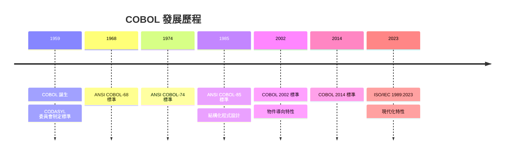

#### 1.1.2 COBOL 的設計理念

COBOL 的設計有以下核心理念：

| 設計理念 | 說明 |
|---------|------|
| **可讀性** | 使用類似英文的語法，讓非程式設計師也能理解程式邏輯 |
| **商業導向** | 專為商業資料處理設計，擅長處理大量交易資料 |
| **可攜性** | 跨平台標準化，程式碼可在不同系統間移植 |
| **自我描述** | 程式碼本身即文件，資料定義清晰明確 |

#### 1.1.3 為什麼 COBOL 至今仍被使用

> **重要觀念**：全球約有 2,200 億行 COBOL 程式碼仍在運行，每天處理超過 3 兆美元的商業交易。

COBOL 持續被使用的原因：

1. **穩定性**：經過 60 多年驗證，極度穩定可靠
2. **效能**：在批次處理大量資料方面效能卓越
3. **投資保護**：企業已投入大量資源在現有系統
4. **人才傳承**：核心商業邏輯已經過長期驗證
5. **整合成本**：重寫系統的風險與成本過高

---

### 1.2 COBOL 在現代企業系統中的角色

#### 1.2.1 COBOL 的應用領域

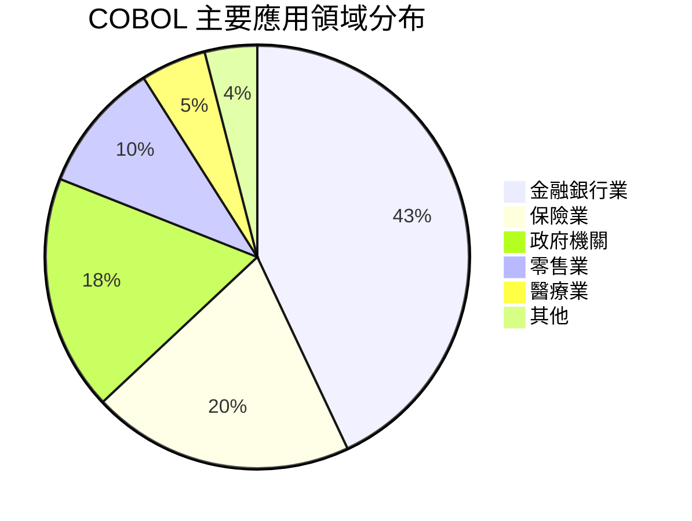

#### 1.2.2 典型應用場景

| 應用場景 | 說明 | 特點 |
|---------|------|------|
| **核心銀行系統** | 存款、放款、匯款等核心業務 | 高可靠性、大量交易 |
| **保險理賠系統** | 保單管理、理賠處理 | 複雜業務邏輯 |
| **薪資系統** | 薪資計算、稅務處理 | 精確數值運算 |
| **庫存管理** | 進銷存管理 | 大量資料處理 |
| **報表系統** | 財務報表、統計分析 | 格式化輸出 |

#### 1.2.3 COBOL 與現代系統整合

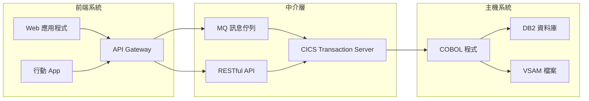

---

### 1.3 COBOL 與其他語言的比較

#### 1.3.1 語言特性比較

| 特性 | COBOL | Java | Python | C |
|------|-------|------|--------|---|
| **語法風格** | 類英文描述式 | 物件導向 | 簡潔動態 | 程序式 |
| **數值精度** | 極高（定點小數） | 中等 | 中等 | 低 |
| **檔案處理** | 原生支援 | 需要 I/O 類別 | 需要函式庫 | 需要函式庫 |
| **批次處理** | 極優 | 良好 | 一般 | 良好 |
| **學習曲線** | 平緩 | 中等 | 平緩 | 陡峭 |
| **記憶體管理** | 自動 | 自動（GC） | 自動（GC） | 手動 |

#### 1.3.2 程式碼風格比較

**計算員工薪資的範例：**

**COBOL 版本：**
```cobol
       IDENTIFICATION DIVISION.
       PROGRAM-ID. SALARY-CALC.
       
       DATA DIVISION.
       WORKING-STORAGE SECTION.
       01  WS-BASE-SALARY    PIC 9(7)V99  VALUE 50000.00.
       01  WS-BONUS-RATE     PIC V99      VALUE 0.10.
       01  WS-TOTAL-SALARY   PIC 9(8)V99  VALUE 0.
       
       PROCEDURE DIVISION.
           COMPUTE WS-TOTAL-SALARY = 
               WS-BASE-SALARY * (1 + WS-BONUS-RATE)
           DISPLAY "TOTAL SALARY: " WS-TOTAL-SALARY
           STOP RUN.
```

**Java 版本：**
```java
public class SalaryCalc {
    public static void main(String[] args) {
        double baseSalary = 50000.00;
        double bonusRate = 0.10;
        double totalSalary = baseSalary * (1 + bonusRate);
        System.out.println("Total Salary: " + totalSalary);
    }
}
```

---

### 1.4 主機環境介紹

#### 1.4.1 IBM z/OS 系統架構

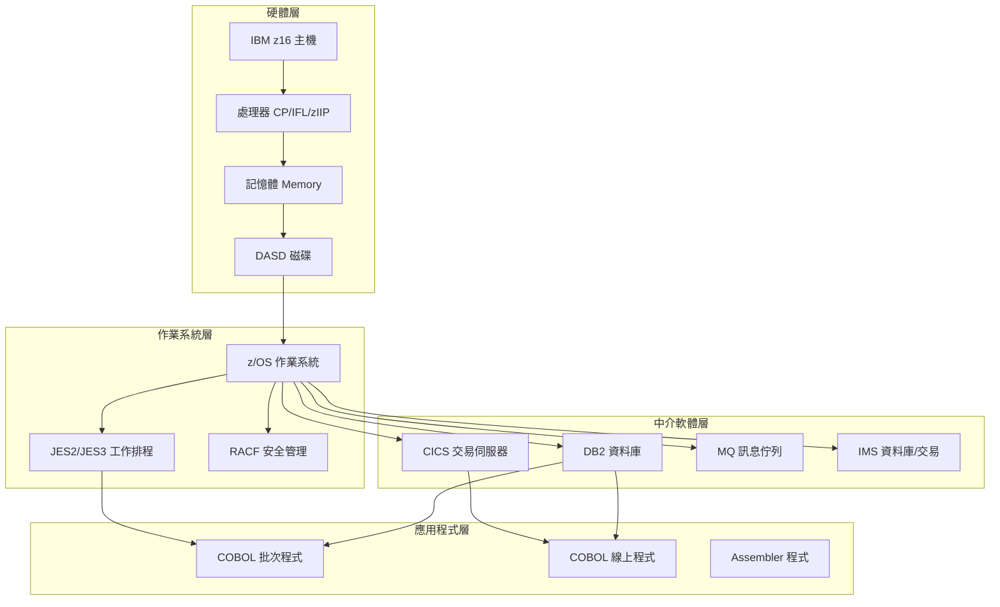

#### 1.4.2 主機環境關鍵元件

| 元件 | 說明 | 用途 |
|------|------|------|
| **TSO** | Time Sharing Option | 互動式登入環境 |
| **ISPF** | Interactive System Productivity Facility | 開發與管理介面 |
| **JES** | Job Entry Subsystem | 批次工作排程管理 |
| **CICS** | Customer Information Control System | 線上交易處理 |
| **DB2** | IBM 關聯式資料庫 | 資料儲存與查詢 |
| **VSAM** | Virtual Storage Access Method | 檔案存取方法 |
| **RACF** | Resource Access Control Facility | 安全與權限管理 |

#### 1.4.3 批次處理 vs 線上處理

| 處理類型 | 批次處理（Batch） | 線上處理（Online） |
|---------|------------------|-------------------|
| **執行方式** | 排程執行 | 即時互動 |
| **使用者** | 系統自動執行 | 終端使用者 |
| **回應時間** | 分鐘到小時 | 秒級 |
| **資料量** | 大量資料 | 單筆交易 |
| **典型應用** | 日結、月結報表 | 存款、轉帳交易 |
| **環境** | JCL + COBOL | CICS + COBOL |

---

### 📝 第一章重點摘要

1. COBOL 是 1959 年誕生的商業導向程式語言，至今仍廣泛使用
2. COBOL 的設計強調可讀性、商業導向、可攜性與自我描述
3. 金融、保險、政府是 COBOL 的主要應用領域
4. 主機環境包含 z/OS、TSO/ISPF、JES、CICS、DB2 等關鍵元件
5. COBOL 適合批次處理大量資料與精確數值運算

### 🔖 練習題

1. 說明 COBOL 至今仍被企業使用的三個主要原因
2. 比較批次處理與線上處理的差異
3. 列出主機環境中五個關鍵元件及其用途

---

## 第二章：開發環境設置

### 學習目標

完成本章後，您將能夠：
- 透過終端機連線到主機系統
- 熟練操作 TSO/ISPF 介面
- 撰寫基本的 JCL 工作控制語言
- 選擇並設置適合的開發工具

---

### 2.1 主機連線與登入

#### 2.1.1 連線方式

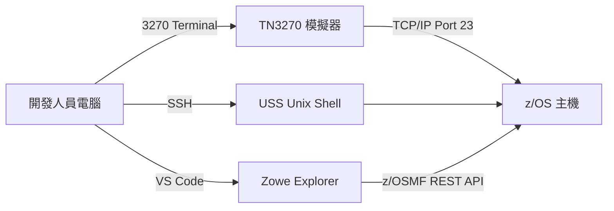

#### 2.1.2 TN3270 終端機模擬器

常用的 TN3270 模擬器：

| 模擬器 | 平台 | 特點 | 費用 |
|--------|------|------|------|
| **IBM Personal Communications** | Windows | 功能完整、企業標準 | 商業授權 |
| **x3270** | Linux/Mac | 開源、輕量 | 免費 |
| **wc3270** | Windows | x3270 Windows 版 | 免費 |
| **Mocha TN3270** | iOS/Android | 行動裝置使用 | 付費 |
| **Vista TN3270** | Windows | 功能豐富 | 商業授權 |

#### 2.1.3 登入流程

```
================================================================================
                          歡迎使用 z/OS 系統
================================================================================
 
 ENTER USERID   ===> DEVUSER1
 ENTER PASSWORD ===> ********
 
 ENTER NEW PASSWORD ===>
 VERIFY NEW PASSWORD ===>
 
================================================================================
```

> **⚠️ 注意事項**：
> - 密碼通常有複雜度要求（大小寫、數字、特殊字元）
> - 密碼有效期限通常為 30-90 天
> - 連續輸入錯誤密碼會導致帳號鎖定

---

### 2.2 TSO/ISPF 基本操作

#### 2.2.1 TSO 與 ISPF 的關係

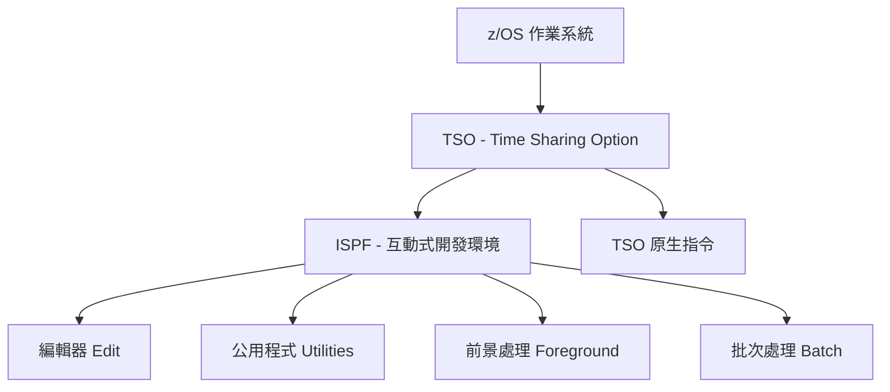

#### 2.2.2 ISPF 主功能表

```
------------------- ISPF 主功能表 -------------------
選項 ===>

   0  Settings      - 設定偏好設定
   1  View          - 檢視資料集或檔案
   2  Edit          - 編輯資料集或檔案
   3  Utilities     - 公用程式功能
   4  Foreground    - 前景處理
   5  Batch         - 批次處理
   6  Command       - TSO 或 Workstation 命令
   7  Dialog Test   - 對話測試
   S  SDSF          - 系統顯示與搜尋功能
   M  More          - 更多功能選項
   
   Enter X to Terminate
```

#### 2.2.3 常用 ISPF 快速鍵

| 按鍵 | 功能 | 說明 |
|------|------|------|
| **PF1** | Help | 顯示說明 |
| **PF3** | Exit/End | 離開/結束 |
| **PF5** | Rfind | 重複搜尋 |
| **PF7** | Up | 向上捲動 |
| **PF8** | Down | 向下捲動 |
| **PF10** | Left | 向左捲動 |
| **PF11** | Right | 向右捲動 |
| **PF12** | Retrieve | 取回上一個指令 |

#### 2.2.4 編輯器基本操作

**常用行指令（Line Command）：**

| 指令 | 功能 | 範例 |
|------|------|------|
| `I` | 插入一行 | 在該行後插入空行 |
| `In` | 插入 n 行 | `I5` 插入 5 行 |
| `D` | 刪除一行 | 刪除該行 |
| `Dn` | 刪除 n 行 | `D3` 刪除 3 行 |
| `C` | 複製一行 | 需配合 A 或 B 使用 |
| `M` | 移動一行 | 需配合 A 或 B 使用 |
| `A` | 貼上在此行之後 | After |
| `B` | 貼上在此行之前 | Before |
| `R` | 重複一行 | 複製該行在下方 |
| `Rn` | 重複 n 次 | `R5` 重複 5 次 |

**常用主要指令（Primary Command）：**

| 指令 | 功能 | 範例 |
|------|------|------|
| `SAVE` | 儲存 | 儲存目前編輯內容 |
| `CANCEL` | 取消 | 放棄變更並離開 |
| `FIND` | 搜尋 | `FIND 'CUSTOMER'` |
| `CHANGE` | 取代 | `CHANGE 'OLD' 'NEW' ALL` |
| `COPY` | 複製成員 | `COPY MEMBER1 AFTER .A` |
| `SUBMIT` | 提交 JCL | 將 JCL 提交執行 |
| `COLS` | 顯示欄位尺 | 顯示欄位編號 |
| `RESET` | 重設顯示 | 清除標記與錯誤訊息 |
| `NUMBER` | 行號設定 | `NUMBER ON/OFF` |

---

### 2.3 JCL 基礎

#### 2.3.1 JCL 是什麼

**JCL（Job Control Language）** 是告訴 z/OS 如何執行批次工作的控制語言。

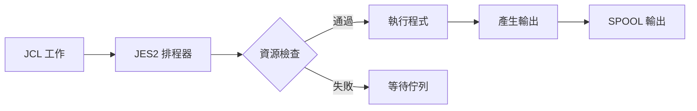

#### 2.3.2 JCL 基本結構

```jcl
//JOBNAME  JOB  (ACCT),'PROGRAMMER NAME',CLASS=A,
//             MSGCLASS=X,NOTIFY=&SYSUID
//*------------------------------------------------------------
//* 這是註解行，說明工作用途
//*------------------------------------------------------------
//STEP01   EXEC PGM=MYPROG
//STEPLIB  DD   DSN=MY.LOAD.LIBRARY,DISP=SHR
//INPUT    DD   DSN=MY.INPUT.FILE,DISP=SHR
//OUTPUT   DD   DSN=MY.OUTPUT.FILE,
//              DISP=(NEW,CATLG,DELETE),
//              SPACE=(CYL,(10,5),RLSE),
//              DCB=(RECFM=FB,LRECL=80,BLKSIZE=0)
//SYSOUT   DD   SYSOUT=*
//SYSPRINT DD   SYSOUT=*
//
```

#### 2.3.3 JCL 語句詳解

**JOB 語句：**

```jcl
//MYJOB    JOB  (ACCT001),'JOHN DOE',
//              CLASS=A,           執行類別
//              MSGCLASS=X,        訊息輸出類別
//              MSGLEVEL=(1,1),    訊息詳細程度
//              TIME=(5,0),        最大執行時間 5 分鐘
//              REGION=0M,         記憶體區域大小
//              NOTIFY=&SYSUID     完成時通知使用者
```

**EXEC 語句：**

```jcl
//STEP01   EXEC PGM=IEFBR14           執行程式 IEFBR14
//STEP02   EXEC PGM=MYCOBOL,          執行 COBOL 程式
//              PARM='PARAM1,PARAM2'   傳遞參數
//STEP03   EXEC PROC=MYPROC           執行 Procedure
```

**DD 語句：**

```jcl
//* 讀取現有資料集
//INPUT    DD   DSN=MY.INPUT.FILE,DISP=SHR

//* 建立新資料集
//OUTPUT   DD   DSN=MY.OUTPUT.FILE,
//              DISP=(NEW,CATLG,DELETE),
//              SPACE=(TRK,(100,50),RLSE),
//              DCB=(RECFM=FB,LRECL=100,BLKSIZE=27900)

//* 輸出到 SPOOL
//SYSPRINT DD   SYSOUT=*

//* 內嵌資料
//SYSIN    DD   *
THIS IS INLINE DATA
/*

//* 串接多個資料集
//INPUT    DD   DSN=FILE1,DISP=SHR
//         DD   DSN=FILE2,DISP=SHR
//         DD   DSN=FILE3,DISP=SHR
```

#### 2.3.4 DISP 參數詳解

| DISP 值 | 說明 |
|---------|------|
| `(NEW,CATLG,DELETE)` | 新建、正常結束時編目、異常時刪除 |
| `(NEW,CATLG,KEEP)` | 新建、正常結束時編目、異常時保留 |
| `(OLD,KEEP,KEEP)` | 獨佔現有檔案、結束後保留 |
| `(SHR,KEEP,KEEP)` | 共享現有檔案、結束後保留 |
| `(MOD,CATLG,DELETE)` | 附加到現有檔案或新建 |

#### 2.3.5 編譯 COBOL 程式的 JCL

```jcl
//COMPILE  JOB  (ACCT),'COMPILE COBOL',CLASS=A,MSGCLASS=X,
//              NOTIFY=&SYSUID
//*------------------------------------------------------------
//* COBOL 程式編譯 JCL
//*------------------------------------------------------------
//STEP01   EXEC IGYWCL,
//              PARM.COBOL='LIB,OBJECT,RENT,APOST,DBCS'
//*
//COBOL.SYSIN DD DSN=MY.COBOL.SOURCE(MYPGM),DISP=SHR
//*
//COBOL.SYSLIB DD DSN=MY.COPYBOOK.LIBRARY,DISP=SHR
//*
//LKED.SYSLMOD DD DSN=MY.LOAD.LIBRARY(MYPGM),DISP=SHR
//*
//LKED.SYSLIB  DD DSN=CEE.SCEELKED,DISP=SHR
//             DD DSN=MY.LOAD.LIBRARY,DISP=SHR
//
```

---

### 2.4 開發工具介紹

#### 2.4.1 傳統開發工具

| 工具 | 用途 | 說明 |
|------|------|------|
| **ISPF Editor** | 程式碼編輯 | 主機原生編輯器 |
| **SDSF** | 工作監控 | 查看工作狀態與輸出 |
| **File Manager** | 檔案管理 | 瀏覽、編輯資料檔案 |
| **Debug Tool** | 除錯 | 互動式程式除錯 |
| **Fault Analyzer** | 錯誤分析 | 分析 Abend dump |

#### 2.4.2 SDSF 基本操作

```
SDSF PRIMARY OPTION MENU

COMMAND INPUT ===>

DA    - 顯示作用中的工作
I     - 顯示輸入佇列
O     - 顯示輸出佇列
H     - 顯示保留的輸出
ST    - 顯示狀態
LOG   - 顯示系統日誌
```

**常用 SDSF 操作：**

| 指令 | 功能 |
|------|------|
| `?` | 檢視工作輸出 |
| `S` | 選擇檢視詳細 |
| `P` | 清除工作 |
| `C` | 取消執行中的工作 |
| `/` | 捲動到頂端 |

---

### 2.5 現代開發環境設置

#### 2.5.1 VS Code + Zowe 設置

**步驟 1：安裝必要擴充套件**

```bash
# 在 VS Code 中安裝以下擴充套件
- Zowe Explorer
- IBM Z Open Editor (COBOL 語法支援)
- COBOL Language Support
```

**步驟 2：設定 Zowe 連線**

```json
// ~/.zowe/zowe.config.json
{
    "profiles": {
        "zosmf": {
            "type": "zosmf",
            "properties": {
                "host": "your.mainframe.host",
                "port": 443,
                "user": "your_userid",
                "password": "your_password",
                "rejectUnauthorized": false
            }
        }
    },
    "defaults": {
        "zosmf": "zosmf"
    }
}
```

**步驟 3：連線並瀏覽資料集**

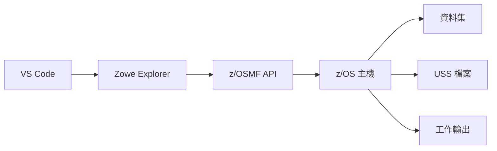

#### 2.5.2 GnuCOBOL 本機開發環境

**Windows 安裝：**

```powershell
# 使用 Chocolatey 安裝
choco install gnucobol

# 或下載 Arnold Trembley 的 Windows 版本
# https://www.arnoldtrembley.com/GnuCOBOL.htm
```

**Mac 安裝：**

```bash
# 使用 Homebrew 安裝
brew install gnu-cobol
```

**Linux 安裝：**

```bash
# Ubuntu/Debian
sudo apt-get install gnucobol

# CentOS/RHEL
sudo yum install gnucobol

# Fedora
sudo dnf install gnucobol
```

**驗證安裝：**

```bash
cobc --version
# GnuCOBOL 3.2.0

# 編譯並執行範例程式
cobc -x -o hello hello.cob
./hello
```

#### 2.5.3 Git 版本管理整合

**COBOL 專案的 .gitignore 範例：**

```gitignore
# 編譯產出
*.o
*.obj
*.exe
*.dll
*.so
*.dylib

# GnuCOBOL 產出
*.c.h
*.c.l*

# IDE 設定
.vscode/
.idea/
*.swp

# 系統檔案
.DS_Store
Thumbs.db

# 測試輸出
test-output/
*.log
```

**Git 分支策略建議：**

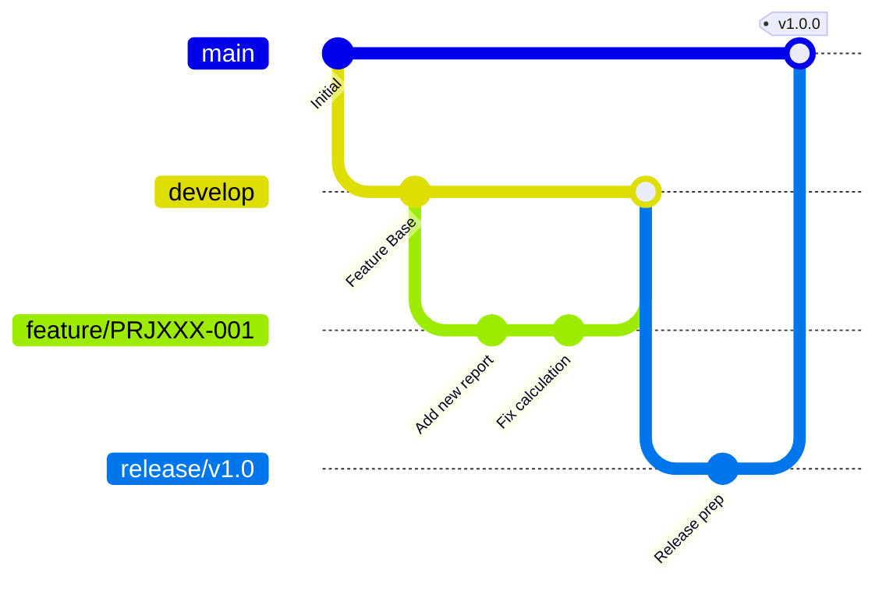

---

### 📝 第二章重點摘要

1. 透過 TN3270 模擬器連線到主機系統
2. ISPF 是主機上的互動式開發環境，熟悉常用快速鍵可提升效率
3. JCL 是批次工作的控制語言，包含 JOB、EXEC、DD 三種主要語句
4. 現代開發可使用 VS Code + Zowe Explorer 或 GnuCOBOL 本機環境
5. 建議使用 Git 進行版本管理

### 🔖 練習題

1. 撰寫一個 JCL，建立一個新的循序資料集
2. 使用 ISPF 編輯器的行指令，將某五行程式碼移動到另一位置
3. 設置 VS Code + Zowe Explorer 並成功連線到主機

---

### ⚠️ 注意事項

> **實務提醒**：
> - JCL 的 JOB 名稱通常有命名規範，請遵循組織規定
> - 確保 REGION 參數足夠，避免 S878 ABEND
> - DD 語句的 DCB 參數應與實際資料格式一致
> - 使用 `NOTIFY=&SYSUID` 可在工作完成時收到通知

---

## 第三章：COBOL 語法基礎

### 學習目標

完成本章後，您將能夠：
- 理解 COBOL 程式的四大 DIVISION 結構
- 正確使用各種資料型別與變數宣告
- 熟練運用 PICTURE 子句定義資料格式
- 掌握 LEVEL 編號系統的使用方式

---

### 3.1 程式結構

#### 3.1.1 COBOL 程式的欄位規則

> **⚠️ 重要**：傳統 COBOL 使用**固定格式（Fixed Format）**，欄位位置有嚴格規定。

```
欄位 1-6   : 序號區（Sequence Number Area）
欄位 7    : 指示區（Indicator Area）
欄位 8-11 : A 區（Area A）- DIVISION、SECTION、段落名稱
欄位 12-72: B 區（Area B）- 程式敘述
欄位 73-80: 識別區（Identification Area）- 通常忽略
```

**指示區（欄位 7）的意義：**

| 字元 | 意義 |
|------|------|
| `*` | 註解行 |
| `/` | 註解行，換頁 |
| `-` | 接續前一行 |
| `D` | 除錯行（僅在 DEBUG 模式執行） |
| 空白 | 一般程式碼 |

```cobol
      * 這是註解行（欄位 7 是星號）
      * 欄位 1-6 是序號，可以空白或編號
       IDENTIFICATION DIVISION.
      *                ^ 欄位 8 開始（A 區）
       PROGRAM-ID. SAMPLE.
                   ^ 欄位 12 開始（B 區）
```

#### 3.1.2 四大 DIVISION 結構

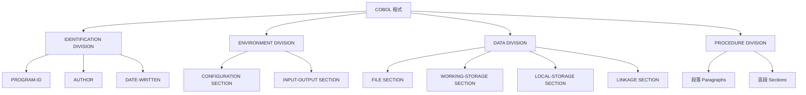

#### 3.1.3 完整程式範例

```cobol
      ******************************************************************
      * 程式名稱：HELLO-WORLD
      * 程式說明：基本 COBOL 程式範例
      * 作    者：開發團隊
      * 建立日期：2026-02-03
      ******************************************************************
       IDENTIFICATION DIVISION.
      *-----------------------------------------------------------------
      * IDENTIFICATION DIVISION：程式識別區
      * 定義程式基本資訊
      *-----------------------------------------------------------------
       PROGRAM-ID.    HELLO-WORLD.
       AUTHOR.        DEVELOPMENT-TEAM.
       DATE-WRITTEN.  2026-02-03.
       DATE-COMPILED.
      
       ENVIRONMENT DIVISION.
      *-----------------------------------------------------------------
      * ENVIRONMENT DIVISION：環境區
      * 定義程式執行環境與檔案關聯
      *-----------------------------------------------------------------
       CONFIGURATION SECTION.
       SOURCE-COMPUTER. IBM-Z16.
       OBJECT-COMPUTER. IBM-Z16.
      
       INPUT-OUTPUT SECTION.
       FILE-CONTROL.
           SELECT REPORT-FILE ASSIGN TO RPTFILE
               ORGANIZATION IS SEQUENTIAL
               FILE STATUS IS WS-FILE-STATUS.
      
       DATA DIVISION.
      *-----------------------------------------------------------------
      * DATA DIVISION：資料區
      * 定義程式使用的所有資料項目
      *-----------------------------------------------------------------
       FILE SECTION.
       FD  REPORT-FILE
           RECORDING MODE IS F
           BLOCK CONTAINS 0 RECORDS
           RECORD CONTAINS 132 CHARACTERS.
       01  REPORT-RECORD              PIC X(132).
      
       WORKING-STORAGE SECTION.
      *-----------------------------------------------------------------
      * 工作儲存區：程式執行期間的暫存資料
      *-----------------------------------------------------------------
       01  WS-FILE-STATUS             PIC XX     VALUE SPACES.
       01  WS-GREETING                PIC X(30)  VALUE 
           'HELLO, COBOL WORLD!'.
       01  WS-DATE.
           05  WS-YEAR                PIC 9(4).
           05  WS-MONTH               PIC 9(2).
           05  WS-DAY                 PIC 9(2).
       01  WS-TIME.
           05  WS-HOUR                PIC 9(2).
           05  WS-MINUTE              PIC 9(2).
           05  WS-SECOND              PIC 9(2).
           05  WS-HUNDREDTH           PIC 9(2).
      
       PROCEDURE DIVISION.
      *-----------------------------------------------------------------
      * PROCEDURE DIVISION：程序區
      * 定義程式執行邏輯
      *-----------------------------------------------------------------
       0000-MAIN-PROCESS.
           PERFORM 1000-INITIALIZE
           PERFORM 2000-PROCESS
           PERFORM 9000-FINALIZE
           STOP RUN.
      
       1000-INITIALIZE.
      *-----------------------------------------------------------------
      * 初始化處理
      *-----------------------------------------------------------------
           MOVE FUNCTION CURRENT-DATE TO WS-DATE WS-TIME
           DISPLAY '程式開始執行...'
           DISPLAY '日期：' WS-YEAR '/' WS-MONTH '/' WS-DAY
           .
      
       2000-PROCESS.
      *-----------------------------------------------------------------
      * 主要處理邏輯
      *-----------------------------------------------------------------
           DISPLAY WS-GREETING
           .
      
       9000-FINALIZE.
      *-----------------------------------------------------------------
      * 結束處理
      *-----------------------------------------------------------------
           DISPLAY '程式執行完畢'
           .
```

**輸出結果：**

```
程式開始執行...
日期：2026/02/03
HELLO, COBOL WORLD!
程式執行完畢
```

---

### 3.2 資料型別與變數宣告

#### 3.2.1 COBOL 資料型別概覽

| 類別 | PIC 語法 | 說明 | 範例 |
|------|----------|------|------|
| **字母** | `A` | 只能包含字母與空白 | `PIC A(10)` |
| **數值** | `9` | 只能包含數字 | `PIC 9(5)` |
| **英數混合** | `X` | 任意字元 | `PIC X(20)` |
| **符號數值** | `S9` | 有正負號的數值 | `PIC S9(7)` |
| **小數** | `V` | 隱含小數點位置 | `PIC 9(5)V99` |
| **編輯格式** | `Z,9,.` | 報表輸出格式 | `PIC ZZ,ZZ9.99` |

#### 3.2.2 資料宣告範例

```cobol
       WORKING-STORAGE SECTION.
      *-----------------------------------------------------------------
      * 基本資料型別宣告
      *-----------------------------------------------------------------
      
      * 字母型（只能放字母和空白）
       01  WS-ALPHA-FIELD            PIC A(10).
      
      * 英數混合型（可以放任何字元）
       01  WS-ALPHANUM-FIELD         PIC X(20).
      
      * 數值型（無正負號）
       01  WS-NUMERIC-FIELD          PIC 9(7).
      
      * 有號數值型
       01  WS-SIGNED-FIELD           PIC S9(7).
      
      * 帶小數的數值
       01  WS-DECIMAL-FIELD          PIC S9(7)V99.
      
      * 初始值宣告
       01  WS-COUNTER                PIC 9(5)    VALUE 0.
       01  WS-NAME                   PIC X(30)   VALUE SPACES.
       01  WS-AMOUNT                 PIC S9(9)V99 VALUE ZERO.
      
      *-----------------------------------------------------------------
      * 群組項目宣告（Group Item）
      *-----------------------------------------------------------------
       01  WS-CUSTOMER-INFO.
           05  WS-CUST-ID            PIC 9(10).
           05  WS-CUST-NAME          PIC X(50).
           05  WS-CUST-ADDRESS.
               10  WS-ADDR-LINE1     PIC X(40).
               10  WS-ADDR-LINE2     PIC X(40).
               10  WS-CITY           PIC X(20).
               10  WS-STATE          PIC X(2).
               10  WS-ZIP-CODE       PIC 9(5).
           05  WS-CUST-PHONE         PIC 9(10).
           05  WS-CUST-BALANCE       PIC S9(9)V99.
```

#### 3.2.3 USAGE 子句

```cobol
      *-----------------------------------------------------------------
      * USAGE 子句：定義資料的內部儲存格式
      *-----------------------------------------------------------------
      
      * DISPLAY（預設）- 每個字元佔 1 byte
       01  WS-DISPLAY-NUM           PIC 9(5)    USAGE DISPLAY.
      
      * COMP / BINARY - 二進位格式，適合運算
       01  WS-BINARY-NUM            PIC S9(9)   USAGE COMP.
      
      * COMP-3 / PACKED-DECIMAL - 壓縮十進位，節省空間
       01  WS-PACKED-NUM            PIC S9(7)V99 USAGE COMP-3.
      
      * COMP-5 - 原生二進位（與 C 語言相容）
       01  WS-NATIVE-BINARY         PIC S9(9)   USAGE COMP-5.
```

**各種 USAGE 的儲存空間比較：**

| USAGE | PIC 9(9) 佔用空間 | 說明 |
|-------|------------------|------|
| DISPLAY | 9 bytes | 每位數 1 byte |
| COMP/BINARY | 4 bytes | 二進位整數 |
| COMP-3 | 5 bytes | 壓縮十進位 `(n+1)/2` |
| COMP-5 | 4 bytes | 原生二進位 |

---

### 3.3 PICTURE 子句詳解

#### 3.3.1 基本 PICTURE 字元

| 字元 | 意義 | 範例 |
|------|------|------|
| `9` | 數字 0-9 | `PIC 9(5)` = 00000-99999 |
| `X` | 任意字元 | `PIC X(10)` |
| `A` | 字母或空白 | `PIC A(5)` |
| `V` | 隱含小數點 | `PIC 9(5)V99` |
| `S` | 正負號 | `PIC S9(7)` |
| `P` | 假設小數位 | `PIC 999PPP` = 值 * 1000 |

#### 3.3.2 編輯 PICTURE 字元（報表用）

| 字元 | 意義 | 範例 |
|------|------|------|
| `Z` | 前導零替換為空白 | `PIC ZZ,ZZ9` |
| `.` | 小數點插入 | `PIC 9(5).99` |
| `,` | 千位分隔符 | `PIC Z,ZZZ,ZZ9` |
| `$` | 貨幣符號 | `PIC $ZZ,ZZ9.99` |
| `+` | 正負號（正顯示+） | `PIC +ZZ,ZZ9.99` |
| `-` | 正負號（正不顯示） | `PIC -ZZ,ZZ9.99` |
| `CR` | 貸方符號 | `PIC ZZ,ZZ9.99CR` |
| `DB` | 借方符號 | `PIC ZZ,ZZ9.99DB` |
| `*` | 前導零替換為星號 | `PIC **,**9.99` |
| `B` | 插入空白 | `PIC 9(3)B9(2)` |
| `0` | 插入零 | `PIC 9(3)09(2)` |
| `/` | 插入斜線 | `PIC 99/99/9999` |

#### 3.3.3 PICTURE 範例程式

```cobol
       IDENTIFICATION DIVISION.
       PROGRAM-ID. PIC-DEMO.
      
       DATA DIVISION.
       WORKING-STORAGE SECTION.
      
      * 數值來源
       01  WS-SOURCE-NUM             PIC S9(7)V99 VALUE -12345.67.
       01  WS-POSITIVE-NUM           PIC S9(7)V99 VALUE +98765.43.
      
      * 各種編輯格式
       01  WS-EDIT-1                 PIC ZZZ,ZZ9.99.
       01  WS-EDIT-2                 PIC $$$,$$9.99.
       01  WS-EDIT-3                 PIC ++++,++9.99.
       01  WS-EDIT-4                 PIC ----,--9.99.
       01  WS-EDIT-5                 PIC ZZZ,ZZ9.99CR.
       01  WS-EDIT-6                 PIC ***,**9.99.
      
      * 日期格式
       01  WS-DATE-NUM               PIC 9(8) VALUE 20260203.
       01  WS-DATE-EDIT              PIC 9999/99/99.
       01  WS-DATE-EDIT2             PIC 99/99/9999.
      
       PROCEDURE DIVISION.
           DISPLAY '=== PICTURE 子句範例 ==='
           DISPLAY ' '
      
      * 數值編輯展示
           MOVE WS-SOURCE-NUM TO WS-EDIT-1
           DISPLAY '原始值：' WS-SOURCE-NUM
           DISPLAY 'ZZZ,ZZ9.99  --> ' WS-EDIT-1
      
           MOVE WS-SOURCE-NUM TO WS-EDIT-2
           DISPLAY '$$$,$$9.99  --> ' WS-EDIT-2
      
           MOVE WS-SOURCE-NUM TO WS-EDIT-3
           DISPLAY '++++,++9.99 --> ' WS-EDIT-3
      
           MOVE WS-SOURCE-NUM TO WS-EDIT-4
           DISPLAY '----,--9.99 --> ' WS-EDIT-4
      
           MOVE WS-SOURCE-NUM TO WS-EDIT-5
           DISPLAY 'ZZZ,ZZ9.99CR -> ' WS-EDIT-5
      
           MOVE WS-POSITIVE-NUM TO WS-EDIT-6
           DISPLAY '***,**9.99  --> ' WS-EDIT-6
      
      * 日期格式展示
           MOVE WS-DATE-NUM TO WS-DATE-EDIT
           DISPLAY '日期格式1：' WS-DATE-EDIT
      
           MOVE WS-DATE-NUM(1:4) TO WS-DATE-EDIT2(7:4)
           MOVE WS-DATE-NUM(5:2) TO WS-DATE-EDIT2(1:2)
           MOVE WS-DATE-NUM(7:2) TO WS-DATE-EDIT2(4:2)
           DISPLAY '日期格式2：' WS-DATE-EDIT2
      
           STOP RUN.
```

**輸出結果：**

```
=== PICTURE 子句範例 ===
 
原始值：-0012345.67
ZZZ,ZZ9.99  -->  12,345.67
$$$,$$9.99  --> $12,345.67
++++,++9.99 --> -12,345.67
----,--9.99 --> -12,345.67
ZZZ,ZZ9.99CR ->  12,345.67CR
***,**9.99  --> *98,765.43
日期格式1：2026/02/03
日期格式2：02/03/2026
```

---

### 3.4 LEVEL 編號系統

#### 3.4.1 LEVEL 編號說明

| 層級 | 用途 |
|------|------|
| `01` | 記錄層級（最高層） |
| `02-49` | 群組或基本項目 |
| `66` | RENAMES 子句使用 |
| `77` | 獨立基本項目 |
| `88` | 條件名稱（布林值） |

#### 3.4.2 群組結構範例

```cobol
       WORKING-STORAGE SECTION.
      *-----------------------------------------------------------------
      * 層級編號範例
      *-----------------------------------------------------------------
      
      * 01 層級：記錄的最高層
       01  WS-EMPLOYEE-RECORD.
      
      *     05 層級：第一層子項目
           05  WS-EMP-ID            PIC 9(6).
           05  WS-EMP-NAME.
      
      *         10 層級：第二層子項目
               10  WS-LAST-NAME     PIC X(20).
               10  WS-FIRST-NAME    PIC X(15).
               10  WS-MIDDLE-INIT   PIC X(1).
      
           05  WS-EMP-DEPT          PIC X(4).
           05  WS-EMP-SALARY        PIC S9(7)V99.
           05  WS-EMP-STATUS        PIC X(1).
      
      *         88 層級：條件名稱
               88  STATUS-ACTIVE    VALUE 'A'.
               88  STATUS-INACTIVE  VALUE 'I'.
               88  STATUS-TERMINATED VALUE 'T'.
      
           05  WS-HIRE-DATE.
               10  WS-HIRE-YEAR     PIC 9(4).
               10  WS-HIRE-MONTH    PIC 9(2).
               10  WS-HIRE-DAY      PIC 9(2).
      
      * 77 層級：獨立項目（不屬於任何群組）
       77  WS-COUNTER               PIC 9(5)    VALUE ZERO.
       77  WS-TOTAL                 PIC S9(9)V99 VALUE ZERO.
      
      * 66 層級：RENAMES（重新定義資料範圍）
       66  WS-FULL-NAME RENAMES WS-LAST-NAME THRU WS-MIDDLE-INIT.
```

#### 3.4.3 88 層級條件名稱的使用

```cobol
       IDENTIFICATION DIVISION.
       PROGRAM-ID. LEVEL88-DEMO.
      
       DATA DIVISION.
       WORKING-STORAGE SECTION.
      
       01  WS-TRANSACTION-TYPE       PIC X(1).
           88  TXN-DEPOSIT           VALUE 'D'.
           88  TXN-WITHDRAWAL        VALUE 'W'.
           88  TXN-TRANSFER          VALUE 'T'.
           88  TXN-INQUIRY           VALUE 'I'.
           88  TXN-VALID             VALUE 'D' 'W' 'T' 'I'.
      
       01  WS-ACCOUNT-STATUS         PIC X(2).
           88  ACCT-ACTIVE           VALUE 'AC'.
           88  ACCT-FROZEN           VALUE 'FZ'.
           88  ACCT-CLOSED           VALUE 'CL'.
           88  ACCT-CAN-TRANSACT     VALUE 'AC'.
      
       01  WS-BALANCE                PIC S9(9)V99.
           88  BALANCE-NEGATIVE      VALUE -999999999.99
                                     THRU -0.01.
           88  BALANCE-ZERO          VALUE ZERO.
           88  BALANCE-POSITIVE      VALUE 0.01
                                     THRU 999999999.99.
      
       PROCEDURE DIVISION.
           MOVE 'D' TO WS-TRANSACTION-TYPE
           MOVE 'AC' TO WS-ACCOUNT-STATUS
           MOVE 1500.00 TO WS-BALANCE
      
      * 使用 88 層級進行條件判斷
           IF TXN-VALID
               DISPLAY '交易類型有效'
           ELSE
               DISPLAY '交易類型無效'
           END-IF
      
           IF TXN-DEPOSIT
               DISPLAY '這是存款交易'
           END-IF
      
           IF ACCT-CAN-TRANSACT
               DISPLAY '帳戶可以交易'
           END-IF
      
           IF BALANCE-POSITIVE
               DISPLAY '帳戶餘額為正'
           END-IF
      
      * 使用 SET 設定 88 層級
           SET TXN-WITHDRAWAL TO TRUE
           DISPLAY '交易類型：' WS-TRANSACTION-TYPE
      
           STOP RUN.
```

**輸出結果：**

```
交易類型有效
這是存款交易
帳戶可以交易
帳戶餘額為正
交易類型：W
```

---

### 📝 第三章重點摘要

1. COBOL 程式分為四大 DIVISION：IDENTIFICATION、ENVIRONMENT、DATA、PROCEDURE
2. 固定格式 COBOL 有嚴格的欄位限制（A 區從第 8 欄、B 區從第 12 欄開始）
3. PICTURE 子句定義資料的型別與格式，包含基本型態與編輯型態
4. LEVEL 編號系統定義資料的層次結構（01-49、66、77、88）
5. 88 層級是條件名稱，可簡化條件判斷的撰寫

### 🔖 練習題

1. 設計一個客戶資料結構，包含姓名、地址、電話、餘額等欄位
2. 使用 88 層級為帳戶狀態設計條件名稱
3. 撰寫程式將數值 -987654.32 以各種編輯格式輸出

---

## 第四章：基本程式設計

### 學習目標

完成本章後，您將能夠：
- 使用各種資料處理敘述（MOVE、COMPUTE 等）
- 撰寫條件判斷邏輯（IF、EVALUATE）
- 使用 PERFORM 控制程式流程
- 處理字串操作（STRING、UNSTRING、INSPECT）

---

### 4.1 資料處理

#### 4.1.1 MOVE 敘述

```cobol
       WORKING-STORAGE SECTION.
       01  WS-SOURCE-ALPHA           PIC X(10)   VALUE 'HELLO'.
       01  WS-SOURCE-NUM             PIC 9(5)    VALUE 12345.
       01  WS-TARGET-ALPHA           PIC X(15).
       01  WS-TARGET-NUM             PIC 9(7).
      
       PROCEDURE DIVISION.
      *-----------------------------------------------------------------
      * 基本 MOVE
      *-----------------------------------------------------------------
           MOVE WS-SOURCE-ALPHA TO WS-TARGET-ALPHA
           MOVE WS-SOURCE-NUM TO WS-TARGET-NUM
      
      * 結果：WS-TARGET-ALPHA = 'HELLO          ' (左對齊，補空白)
      * 結果：WS-TARGET-NUM = 0012345 (右對齊，補零)
      
      *-----------------------------------------------------------------
      * MOVE 常數
      *-----------------------------------------------------------------
           MOVE SPACES TO WS-TARGET-ALPHA
           MOVE ZEROS TO WS-TARGET-NUM
           MOVE 'ABC' TO WS-TARGET-ALPHA
           MOVE 999 TO WS-TARGET-NUM
      
      *-----------------------------------------------------------------
      * MOVE CORRESPONDING（移動對應名稱的欄位）
      *-----------------------------------------------------------------
       01  WS-SOURCE-REC.
           05  CUST-ID               PIC 9(5).
           05  CUST-NAME             PIC X(20).
           05  CUST-AMT              PIC 9(7)V99.
      
       01  WS-TARGET-REC.
           05  CUST-ID               PIC 9(10).
           05  CUST-NAME             PIC X(30).
           05  CUST-PHONE            PIC 9(10).
      
       PROCEDURE DIVISION.
           MOVE CORRESPONDING WS-SOURCE-REC TO WS-TARGET-REC
      * 只有 CUST-ID 和 CUST-NAME 會被移動（名稱相同的欄位）
```

#### 4.1.2 算術運算敘述

```cobol
       WORKING-STORAGE SECTION.
       01  WS-NUM-A                  PIC 9(5)    VALUE 100.
       01  WS-NUM-B                  PIC 9(5)    VALUE 25.
       01  WS-RESULT                 PIC 9(7)    VALUE 0.
       01  WS-REMAINDER              PIC 9(3)    VALUE 0.
      
       PROCEDURE DIVISION.
      *-----------------------------------------------------------------
      * ADD 加法
      *-----------------------------------------------------------------
           ADD WS-NUM-A TO WS-NUM-B
           * WS-NUM-B = 100 + 25 = 125
      
           ADD WS-NUM-A WS-NUM-B GIVING WS-RESULT
           * WS-RESULT = 100 + 125 = 225，原值不變
      
           ADD 1 TO WS-RESULT
           * WS-RESULT = WS-RESULT + 1
      
      *-----------------------------------------------------------------
      * SUBTRACT 減法
      *-----------------------------------------------------------------
           SUBTRACT WS-NUM-B FROM WS-NUM-A
           * WS-NUM-A = 100 - 125 = -25（注意負數處理）
      
           SUBTRACT WS-NUM-A FROM WS-NUM-B GIVING WS-RESULT
           * WS-RESULT = WS-NUM-B - WS-NUM-A
      
      *-----------------------------------------------------------------
      * MULTIPLY 乘法
      *-----------------------------------------------------------------
           MULTIPLY WS-NUM-A BY WS-NUM-B
           * WS-NUM-B = WS-NUM-A * WS-NUM-B
      
           MULTIPLY WS-NUM-A BY WS-NUM-B GIVING WS-RESULT
           * WS-RESULT = WS-NUM-A * WS-NUM-B
      
      *-----------------------------------------------------------------
      * DIVIDE 除法
      *-----------------------------------------------------------------
           DIVIDE WS-NUM-A INTO WS-NUM-B
           * WS-NUM-B = WS-NUM-B / WS-NUM-A
      
           DIVIDE WS-NUM-A INTO WS-NUM-B GIVING WS-RESULT
               REMAINDER WS-REMAINDER
           * WS-RESULT = 商，WS-REMAINDER = 餘數
      
           DIVIDE WS-NUM-B BY WS-NUM-A GIVING WS-RESULT
           * WS-RESULT = WS-NUM-B / WS-NUM-A
```

#### 4.1.3 COMPUTE 敘述

```cobol
       WORKING-STORAGE SECTION.
       01  WS-PRICE                  PIC 9(5)V99  VALUE 100.00.
       01  WS-QUANTITY               PIC 9(3)     VALUE 5.
       01  WS-TAX-RATE               PIC V99      VALUE 0.05.
       01  WS-DISCOUNT               PIC V99      VALUE 0.10.
       01  WS-SUBTOTAL               PIC 9(7)V99.
       01  WS-TAX                    PIC 9(7)V99.
       01  WS-TOTAL                  PIC 9(7)V99.
       01  WS-FINAL                  PIC 9(7)V99.
      
       PROCEDURE DIVISION.
      *-----------------------------------------------------------------
      * COMPUTE：支援複雜數學運算式
      *-----------------------------------------------------------------
      
      * 基本運算
           COMPUTE WS-SUBTOTAL = WS-PRICE * WS-QUANTITY
           * 500.00
      
      * 複合運算式
           COMPUTE WS-TAX = WS-SUBTOTAL * WS-TAX-RATE
           * 25.00
      
      * 括號運算
           COMPUTE WS-TOTAL = WS-SUBTOTAL + WS-TAX
           * 525.00
      
      * 複雜運算式
           COMPUTE WS-FINAL = 
               (WS-PRICE * WS-QUANTITY) * (1 - WS-DISCOUNT)
               * (1 + WS-TAX-RATE)
           * 100 * 5 * 0.90 * 1.05 = 472.50
      
      * 使用 ROUNDED 四捨五入
           COMPUTE WS-FINAL ROUNDED = 
               WS-SUBTOTAL * 1.055
      
      * 錯誤處理
           COMPUTE WS-RESULT = WS-NUM-A / WS-NUM-B
               ON SIZE ERROR
                   DISPLAY '運算溢位或除以零'
               NOT ON SIZE ERROR
                   DISPLAY '運算成功：' WS-RESULT
           END-COMPUTE
```

**COMPUTE 支援的運算子：**

| 運算子 | 意義 | 範例 |
|--------|------|------|
| `+` | 加法 | `A + B` |
| `-` | 減法 | `A - B` |
| `*` | 乘法 | `A * B` |
| `/` | 除法 | `A / B` |
| `**` | 次方 | `A ** 2` |
| `( )` | 括號 | `(A + B) * C` |

---

### 4.2 條件判斷

#### 4.2.1 IF-THEN-ELSE 敘述

```cobol
       WORKING-STORAGE SECTION.
       01  WS-AGE                    PIC 9(3).
       01  WS-SCORE                  PIC 9(3).
       01  WS-STATUS                 PIC X(1).
           88  IS-ACTIVE             VALUE 'A'.
           88  IS-INACTIVE           VALUE 'I'.
       01  WS-AMOUNT                 PIC S9(7)V99.
      
       PROCEDURE DIVISION.
      *-----------------------------------------------------------------
      * 基本 IF
      *-----------------------------------------------------------------
           IF WS-AGE >= 18
               DISPLAY '成年人'
           ELSE
               DISPLAY '未成年'
           END-IF
      
      *-----------------------------------------------------------------
      * 巢狀 IF
      *-----------------------------------------------------------------
           IF WS-SCORE >= 90
               DISPLAY '優等'
           ELSE
               IF WS-SCORE >= 80
                   DISPLAY '甲等'
               ELSE
                   IF WS-SCORE >= 70
                       DISPLAY '乙等'
                   ELSE
                       IF WS-SCORE >= 60
                           DISPLAY '丙等'
                       ELSE
                           DISPLAY '不及格'
                       END-IF
                   END-IF
               END-IF
           END-IF
      
      *-----------------------------------------------------------------
      * 使用 88 層級條件
      *-----------------------------------------------------------------
           IF IS-ACTIVE
               DISPLAY '帳戶啟用中'
           END-IF
      
      *-----------------------------------------------------------------
      * 複合條件
      *-----------------------------------------------------------------
           IF WS-AGE >= 18 AND WS-STATUS = 'A'
               DISPLAY '成年且帳戶啟用'
           END-IF
      
           IF WS-SCORE < 60 OR WS-STATUS = 'I'
               DISPLAY '需要關注'
           END-IF
      
           IF NOT (WS-AMOUNT < 0)
               DISPLAY '餘額非負數'
           END-IF
      
      *-----------------------------------------------------------------
      * 字串比較
      *-----------------------------------------------------------------
       01  WS-NAME                   PIC X(20).
      
           IF WS-NAME = SPACES
               DISPLAY '姓名為空'
           END-IF
      
           IF WS-NAME EQUAL 'JOHN'
               DISPLAY '姓名是 JOHN'
           END-IF
      
      *-----------------------------------------------------------------
      * 類別測試
      *-----------------------------------------------------------------
           IF WS-AMOUNT IS NUMERIC
               DISPLAY '是數值'
           END-IF
      
           IF WS-NAME IS ALPHABETIC
               DISPLAY '只有字母'
           END-IF
```

#### 4.2.2 EVALUATE 敘述（類似 Switch/Case）

```cobol
       WORKING-STORAGE SECTION.
       01  WS-GRADE                  PIC X(1).
       01  WS-MONTH                  PIC 9(2).
       01  WS-DAY-TYPE               PIC X(10).
       01  WS-WEEKDAY                PIC 9(1).
       01  WS-SHIFT                  PIC X(1).
      
       PROCEDURE DIVISION.
      *-----------------------------------------------------------------
      * 基本 EVALUATE（單一條件）
      *-----------------------------------------------------------------
           EVALUATE WS-GRADE
               WHEN 'A'
                   DISPLAY '優秀 (90-100)'
               WHEN 'B'
                   DISPLAY '良好 (80-89)'
               WHEN 'C'
                   DISPLAY '普通 (70-79)'
               WHEN 'D'
                   DISPLAY '及格 (60-69)'
               WHEN 'F'
                   DISPLAY '不及格 (<60)'
               WHEN OTHER
                   DISPLAY '無效等級'
           END-EVALUATE
      
      *-----------------------------------------------------------------
      * 範圍條件
      *-----------------------------------------------------------------
           EVALUATE TRUE
               WHEN WS-MONTH >= 1 AND WS-MONTH <= 3
                   DISPLAY '第一季'
               WHEN WS-MONTH >= 4 AND WS-MONTH <= 6
                   DISPLAY '第二季'
               WHEN WS-MONTH >= 7 AND WS-MONTH <= 9
                   DISPLAY '第三季'
               WHEN WS-MONTH >= 10 AND WS-MONTH <= 12
                   DISPLAY '第四季'
               WHEN OTHER
                   DISPLAY '無效月份'
           END-EVALUATE
      
      *-----------------------------------------------------------------
      * 多重條件（ALSO）
      *-----------------------------------------------------------------
           EVALUATE WS-WEEKDAY ALSO WS-SHIFT
               WHEN 1 THRU 5 ALSO 'D'
                   MOVE 'WEEKDAY-DAY' TO WS-DAY-TYPE
               WHEN 1 THRU 5 ALSO 'N'
                   MOVE 'WEEKDAY-NGT' TO WS-DAY-TYPE
               WHEN 6 THRU 7 ALSO ANY
                   MOVE 'WEEKEND' TO WS-DAY-TYPE
               WHEN OTHER
                   MOVE 'UNKNOWN' TO WS-DAY-TYPE
           END-EVALUATE
      
      *-----------------------------------------------------------------
      * THRU 範圍
      *-----------------------------------------------------------------
           EVALUATE WS-MONTH
               WHEN 1 THRU 3
                   DISPLAY '冬季'
               WHEN 4 THRU 6
                   DISPLAY '春季'
               WHEN 7 THRU 9
                   DISPLAY '夏季'
               WHEN 10 THRU 12
                   DISPLAY '秋季'
           END-EVALUATE
```

---

### 4.3 迴圈控制

#### 4.3.1 PERFORM 敘述

```cobol
       WORKING-STORAGE SECTION.
       01  WS-COUNTER                PIC 9(3)    VALUE 0.
       01  WS-TOTAL                  PIC 9(7)    VALUE 0.
       01  WS-INDEX                  PIC 9(3).
      
       PROCEDURE DIVISION.
      *-----------------------------------------------------------------
      * 基本 PERFORM（執行一次）
      *-----------------------------------------------------------------
           PERFORM 1000-PROCESS-PARAGRAPH
      
      *-----------------------------------------------------------------
      * PERFORM TIMES（執行固定次數）
      *-----------------------------------------------------------------
           PERFORM 2000-ADD-ONE 5 TIMES
           * 執行 5 次
      
      *-----------------------------------------------------------------
      * PERFORM UNTIL（條件迴圈）
      *-----------------------------------------------------------------
           MOVE 1 TO WS-COUNTER
           PERFORM 3000-ACCUMULATE
               UNTIL WS-COUNTER > 100
      
      *-----------------------------------------------------------------
      * PERFORM VARYING（計數迴圈）
      *-----------------------------------------------------------------
           PERFORM 4000-PRINT-LINE
               VARYING WS-INDEX FROM 1 BY 1
               UNTIL WS-INDEX > 10
      
      *-----------------------------------------------------------------
      * PERFORM WITH TEST BEFORE/AFTER
      *-----------------------------------------------------------------
      * TEST BEFORE（預設）：先測試條件再執行
           PERFORM WITH TEST BEFORE
               UNTIL WS-COUNTER > 100
               ADD 1 TO WS-COUNTER
           END-PERFORM
      
      * TEST AFTER：先執行再測試條件（至少執行一次）
           PERFORM WITH TEST AFTER
               UNTIL WS-COUNTER > 100
               ADD 1 TO WS-COUNTER
           END-PERFORM
      
      *-----------------------------------------------------------------
      * Inline PERFORM（不呼叫段落）
      *-----------------------------------------------------------------
           PERFORM VARYING WS-INDEX FROM 1 BY 1
               UNTIL WS-INDEX > 5
               DISPLAY 'Index: ' WS-INDEX
               ADD WS-INDEX TO WS-TOTAL
           END-PERFORM
      
           STOP RUN.
      
       1000-PROCESS-PARAGRAPH.
           DISPLAY 'Processing...'
           .
      
       2000-ADD-ONE.
           ADD 1 TO WS-COUNTER
           .
      
       3000-ACCUMULATE.
           ADD WS-COUNTER TO WS-TOTAL
           ADD 1 TO WS-COUNTER
           .
      
       4000-PRINT-LINE.
           DISPLAY 'Line ' WS-INDEX
           .
```

#### 4.3.2 巢狀迴圈與陣列處理

```cobol
       WORKING-STORAGE SECTION.
      *-----------------------------------------------------------------
      * 一維陣列
      *-----------------------------------------------------------------
       01  WS-SCORE-TABLE.
           05  WS-SCORE              PIC 9(3) OCCURS 10 TIMES.
      
      *-----------------------------------------------------------------
      * 二維陣列
      *-----------------------------------------------------------------
       01  WS-MATRIX.
           05  WS-ROW OCCURS 5 TIMES.
               10  WS-CELL           PIC 9(3) OCCURS 5 TIMES.
      
       01  WS-I                      PIC 9(2).
       01  WS-J                      PIC 9(2).
       01  WS-SUM                    PIC 9(7)    VALUE 0.
      
       PROCEDURE DIVISION.
      *-----------------------------------------------------------------
      * 一維陣列處理
      *-----------------------------------------------------------------
           PERFORM VARYING WS-I FROM 1 BY 1 UNTIL WS-I > 10
               MOVE WS-I TO WS-SCORE(WS-I)
           END-PERFORM
      
      *-----------------------------------------------------------------
      * 二維陣列處理（巢狀迴圈）
      *-----------------------------------------------------------------
           PERFORM VARYING WS-I FROM 1 BY 1 UNTIL WS-I > 5
               PERFORM VARYING WS-J FROM 1 BY 1 UNTIL WS-J > 5
                   COMPUTE WS-CELL(WS-I, WS-J) = WS-I * WS-J
               END-PERFORM
           END-PERFORM
      
      *-----------------------------------------------------------------
      * 計算陣列總和
      *-----------------------------------------------------------------
           MOVE 0 TO WS-SUM
           PERFORM VARYING WS-I FROM 1 BY 1 UNTIL WS-I > 10
               ADD WS-SCORE(WS-I) TO WS-SUM
           END-PERFORM
           DISPLAY '總分：' WS-SUM
      
           STOP RUN.
```

---

### 4.4 字串處理

#### 4.4.1 STRING 敘述（字串串接）

```cobol
       WORKING-STORAGE SECTION.
       01  WS-FIRST-NAME             PIC X(10)   VALUE 'JOHN'.
       01  WS-LAST-NAME              PIC X(15)   VALUE 'DOE'.
       01  WS-FULL-NAME              PIC X(30)   VALUE SPACES.
       01  WS-POINTER                PIC 9(3)    VALUE 1.
       01  WS-OVERFLOW               PIC X(1)    VALUE 'N'.
      
       PROCEDURE DIVISION.
      *-----------------------------------------------------------------
      * 基本 STRING
      *-----------------------------------------------------------------
           STRING WS-FIRST-NAME DELIMITED BY SPACE
                  ', '          DELIMITED BY SIZE
                  WS-LAST-NAME  DELIMITED BY SPACE
                  INTO WS-FULL-NAME
           END-STRING
           * 結果：'JOHN, DOE'
      
      *-----------------------------------------------------------------
      * 使用 POINTER
      *-----------------------------------------------------------------
           MOVE 1 TO WS-POINTER
           MOVE SPACES TO WS-FULL-NAME
      
           STRING WS-FIRST-NAME DELIMITED BY SPACE
                  INTO WS-FULL-NAME
                  WITH POINTER WS-POINTER
           END-STRING
      
           STRING ' ' DELIMITED BY SIZE
                  WS-LAST-NAME DELIMITED BY SPACE
                  INTO WS-FULL-NAME
                  WITH POINTER WS-POINTER
           END-STRING
           * 結果：'JOHN DOE'
      
      *-----------------------------------------------------------------
      * 溢位處理
      *-----------------------------------------------------------------
           STRING WS-FIRST-NAME DELIMITED BY SPACE
                  ' '          DELIMITED BY SIZE
                  WS-LAST-NAME DELIMITED BY SPACE
                  ' EXTRA DATA THAT MIGHT OVERFLOW'
                  DELIMITED BY SIZE
                  INTO WS-FULL-NAME
                  WITH POINTER WS-POINTER
                  ON OVERFLOW
                      MOVE 'Y' TO WS-OVERFLOW
                      DISPLAY '字串溢位！'
           END-STRING
```

#### 4.4.2 UNSTRING 敘述（字串分割）

```cobol
       WORKING-STORAGE SECTION.
       01  WS-INPUT-LINE             PIC X(50) 
               VALUE 'JOHN,DOE,30,ENGINEER'.
       01  WS-NAME-1                 PIC X(15).
       01  WS-NAME-2                 PIC X(15).
       01  WS-AGE                    PIC X(5).
       01  WS-TITLE                  PIC X(20).
       01  WS-COUNT                  PIC 9(2).
       01  WS-DELIM                  PIC X(1).
      
       PROCEDURE DIVISION.
      *-----------------------------------------------------------------
      * 基本 UNSTRING
      *-----------------------------------------------------------------
           UNSTRING WS-INPUT-LINE DELIMITED BY ','
               INTO WS-NAME-1
                    WS-NAME-2
                    WS-AGE
                    WS-TITLE
           END-UNSTRING
           * WS-NAME-1 = 'JOHN'
           * WS-NAME-2 = 'DOE'
           * WS-AGE = '30'
           * WS-TITLE = 'ENGINEER'
      
      *-----------------------------------------------------------------
      * 使用 TALLYING 計數
      *-----------------------------------------------------------------
           MOVE 0 TO WS-COUNT
           UNSTRING WS-INPUT-LINE DELIMITED BY ','
               INTO WS-NAME-1
                    WS-NAME-2
                    WS-AGE
                    WS-TITLE
               TALLYING IN WS-COUNT
           END-UNSTRING
           DISPLAY '欄位數：' WS-COUNT
           * 輸出：欄位數：04
      
      *-----------------------------------------------------------------
      * 取得分隔符號
      *-----------------------------------------------------------------
           UNSTRING WS-INPUT-LINE 
               DELIMITED BY ',' OR ';' OR '|'
               INTO WS-NAME-1 DELIMITER IN WS-DELIM
                    WS-NAME-2
           END-UNSTRING
```

#### 4.4.3 INSPECT 敘述（字串檢查與替換）

```cobol
       WORKING-STORAGE SECTION.
       01  WS-STRING                 PIC X(30) VALUE 'HELLO WORLD'.
       01  WS-COUNT                  PIC 9(3)  VALUE 0.
       01  WS-RESULT                 PIC X(30).
      
       PROCEDURE DIVISION.
      *-----------------------------------------------------------------
      * INSPECT TALLYING（計數）
      *-----------------------------------------------------------------
           MOVE 0 TO WS-COUNT
           INSPECT WS-STRING
               TALLYING WS-COUNT FOR ALL 'L'
           DISPLAY 'L 出現次數：' WS-COUNT
           * 輸出：L 出現次數：003
      
           MOVE 0 TO WS-COUNT
           INSPECT WS-STRING
               TALLYING WS-COUNT FOR LEADING SPACES
           DISPLAY '前導空白數：' WS-COUNT
      
           MOVE 0 TO WS-COUNT
           INSPECT WS-STRING
               TALLYING WS-COUNT FOR CHARACTERS BEFORE ' '
           DISPLAY 'WORLD 前的字元數：' WS-COUNT
           * 輸出：5（'HELLO' 的長度）
      
      *-----------------------------------------------------------------
      * INSPECT REPLACING（替換）
      *-----------------------------------------------------------------
           MOVE 'HELLO WORLD' TO WS-STRING
           INSPECT WS-STRING
               REPLACING ALL 'L' BY 'X'
           DISPLAY WS-STRING
           * 輸出：HEXXO WORXD
      
           MOVE 'HELLO WORLD' TO WS-STRING
           INSPECT WS-STRING
               REPLACING FIRST 'O' BY '*'
           DISPLAY WS-STRING
           * 輸出：HELL* WORLD
      
           MOVE '   HELLO' TO WS-STRING
           INSPECT WS-STRING
               REPLACING LEADING SPACES BY ZEROS
           DISPLAY WS-STRING
           * 輸出：000HELLO
      
      *-----------------------------------------------------------------
      * INSPECT CONVERTING（字元轉換）
      *-----------------------------------------------------------------
           MOVE 'hello world' TO WS-STRING
           INSPECT WS-STRING
               CONVERTING 'abcdefghijklmnopqrstuvwxyz'
               TO         'ABCDEFGHIJKLMNOPQRSTUVWXYZ'
           DISPLAY WS-STRING
           * 輸出：HELLO WORLD（轉大寫）
      
      *-----------------------------------------------------------------
      * INSPECT TALLYING 與 REPLACING 同時使用
      *-----------------------------------------------------------------
           MOVE 0 TO WS-COUNT
           MOVE 'AAABBBCCC' TO WS-STRING
           INSPECT WS-STRING
               TALLYING WS-COUNT FOR ALL 'A'
               REPLACING ALL 'A' BY 'X'
           DISPLAY 'A 的數量：' WS-COUNT
           DISPLAY '替換後：' WS-STRING
           * 輸出：A 的數量：003
           * 輸出：替換後：XXXBBBCCC
```

#### 4.4.4 參考修改（Reference Modification）

```cobol
       WORKING-STORAGE SECTION.
       01  WS-STRING                 PIC X(20) VALUE 'ABCDEFGHIJKLMNOPQRST'.
       01  WS-DATE                   PIC 9(8)  VALUE 20260203.
       01  WS-YEAR                   PIC 9(4).
       01  WS-MONTH                  PIC 9(2).
       01  WS-DAY                    PIC 9(2).
      
       PROCEDURE DIVISION.
      *-----------------------------------------------------------------
      * 基本參考修改：變數名(起始位置:長度)
      *-----------------------------------------------------------------
           DISPLAY WS-STRING(1:5)
           * 輸出：ABCDE
      
           DISPLAY WS-STRING(6:5)
           * 輸出：FGHIJ
      
      *-----------------------------------------------------------------
      * 應用：日期分割
      *-----------------------------------------------------------------
           MOVE WS-DATE(1:4) TO WS-YEAR
           MOVE WS-DATE(5:2) TO WS-MONTH
           MOVE WS-DATE(7:2) TO WS-DAY
           DISPLAY WS-YEAR '/' WS-MONTH '/' WS-DAY
           * 輸出：2026/02/03
      
      *-----------------------------------------------------------------
      * 動態參考修改
      *-----------------------------------------------------------------
       01  WS-POS                    PIC 9(2) VALUE 3.
       01  WS-LEN                    PIC 9(2) VALUE 4.
      
           DISPLAY WS-STRING(WS-POS:WS-LEN)
           * 輸出：CDEF（從第 3 位開始，取 4 個字元）
      
      *-----------------------------------------------------------------
      * 省略長度（取到結尾）
      *-----------------------------------------------------------------
           DISPLAY WS-STRING(15:)
           * 輸出：OPQRST（從第 15 位取到結尾）
```

---

### 📝 第四章重點摘要

1. MOVE 用於資料搬移，注意對齊方式（文字左對齊、數值右對齊）
2. COMPUTE 支援複雜數學運算式，使用 ROUNDED 進行四捨五入
3. IF-THEN-ELSE 處理條件判斷，EVALUATE 類似 switch-case
4. PERFORM 是 COBOL 的迴圈控制核心，支援 TIMES、UNTIL、VARYING
5. STRING/UNSTRING/INSPECT 提供強大的字串處理能力
6. 參考修改 `(start:length)` 可直接存取字串的部分內容

### 🔖 練習題

1. 撰寫程式計算 1 到 100 的累加總和
2. 使用 EVALUATE 判斷輸入的月份屬於哪一季
3. 將 "LAST,FIRST,MIDDLE" 格式的姓名拆解成三個欄位
4. 計算字串中母音字母（A,E,I,O,U）的出現次數

---

### ⚠️ 注意事項

> **實務提醒**：
> - 使用 COMPUTE 時注意 SIZE ERROR 處理，避免資料溢位
> - PERFORM VARYING 的 BY 值可以是負數（倒數迴圈）
> - STRING 操作需注意目標欄位長度，避免資料截斷
> - 參考修改的起始位置從 1 開始（不是 0）

---

## 第五章：檔案處理

### 學習目標

完成本章後，您將能夠：
- 了解 COBOL 支援的各種檔案組織類型
- 設計與定義檔案記錄格式
- 撰寫循序檔案、索引檔案、相對檔案的讀寫程式
- 處理檔案狀態碼與例外情況

---

### 5.1 循序檔案（Sequential File）

#### 5.1.1 循序檔案概念


**循序檔案特點：**
- 記錄按順序排列，只能從頭到尾依序存取
- 新增記錄只能加在檔案尾端
- 適合批次處理大量資料
- 主機上最常見的檔案類型

#### 5.1.2 循序檔案完整範例

```cobol
       IDENTIFICATION DIVISION.
       PROGRAM-ID. SEQ-FILE-DEMO.
      ******************************************************************
      * 程式說明：循序檔案讀寫範例
      * 功    能：讀取輸入檔，處理後寫入輸出檔
      ******************************************************************
      
       ENVIRONMENT DIVISION.
       CONFIGURATION SECTION.
       SOURCE-COMPUTER. IBM-Z16.
       OBJECT-COMPUTER. IBM-Z16.
      
       INPUT-OUTPUT SECTION.
       FILE-CONTROL.
      *-----------------------------------------------------------------
      * 輸入檔案定義
      *-----------------------------------------------------------------
           SELECT INPUT-FILE 
               ASSIGN TO INFILE
               ORGANIZATION IS SEQUENTIAL
               ACCESS MODE IS SEQUENTIAL
               FILE STATUS IS WS-INPUT-STATUS.
      
      *-----------------------------------------------------------------
      * 輸出檔案定義
      *-----------------------------------------------------------------
           SELECT OUTPUT-FILE
               ASSIGN TO OUTFILE
               ORGANIZATION IS SEQUENTIAL
               ACCESS MODE IS SEQUENTIAL
               FILE STATUS IS WS-OUTPUT-STATUS.
      
       DATA DIVISION.
       FILE SECTION.
      *-----------------------------------------------------------------
      * 輸入檔案記錄格式
      *-----------------------------------------------------------------
       FD  INPUT-FILE
           RECORDING MODE IS F
           BLOCK CONTAINS 0 RECORDS
           RECORD CONTAINS 100 CHARACTERS.
       01  INPUT-RECORD.
           05  IN-EMPLOYEE-ID        PIC 9(6).
           05  IN-EMPLOYEE-NAME      PIC X(30).
           05  IN-DEPARTMENT         PIC X(10).
           05  IN-SALARY             PIC 9(7)V99.
           05  IN-HIRE-DATE          PIC 9(8).
           05  FILLER                PIC X(37).
      
      *-----------------------------------------------------------------
      * 輸出檔案記錄格式
      *-----------------------------------------------------------------
       FD  OUTPUT-FILE
           RECORDING MODE IS F
           BLOCK CONTAINS 0 RECORDS
           RECORD CONTAINS 120 CHARACTERS.
       01  OUTPUT-RECORD.
           05  OUT-EMPLOYEE-ID       PIC 9(6).
           05  OUT-EMPLOYEE-NAME     PIC X(30).
           05  OUT-DEPARTMENT        PIC X(10).
           05  OUT-SALARY-EDIT       PIC $$$,$$$,$$9.99.
           05  FILLER                PIC X(1) VALUE SPACE.
           05  OUT-HIRE-DATE-EDIT    PIC 9999/99/99.
           05  FILLER                PIC X(1) VALUE SPACE.
           05  OUT-YEARS-SERVICE     PIC Z9.
           05  FILLER                PIC X(43).
      
       WORKING-STORAGE SECTION.
      *-----------------------------------------------------------------
      * 檔案狀態碼
      *-----------------------------------------------------------------
       01  WS-INPUT-STATUS           PIC XX.
           88  INPUT-OK              VALUE '00'.
           88  INPUT-EOF             VALUE '10'.
      
       01  WS-OUTPUT-STATUS          PIC XX.
           88  OUTPUT-OK             VALUE '00'.
      
      *-----------------------------------------------------------------
      * 工作變數
      *-----------------------------------------------------------------
       01  WS-RECORD-COUNT           PIC 9(7)    VALUE 0.
       01  WS-CURRENT-DATE           PIC 9(8).
       01  WS-HIRE-YEAR              PIC 9(4).
       01  WS-CURRENT-YEAR           PIC 9(4).
       01  WS-YEARS-SERVICE          PIC 99.
       01  WS-EOF-FLAG               PIC X(1)    VALUE 'N'.
           88  END-OF-FILE           VALUE 'Y'.
      
       PROCEDURE DIVISION.
      *-----------------------------------------------------------------
      * 主程式
      *-----------------------------------------------------------------
       0000-MAIN-PROCESS.
           PERFORM 1000-INITIALIZE
           PERFORM 2000-PROCESS-FILE
               UNTIL END-OF-FILE
           PERFORM 9000-FINALIZE
           STOP RUN.
      
      *-----------------------------------------------------------------
      * 初始化處理
      *-----------------------------------------------------------------
       1000-INITIALIZE.
           OPEN INPUT INPUT-FILE
           IF NOT INPUT-OK
               DISPLAY '無法開啟輸入檔案，狀態碼：' WS-INPUT-STATUS
               STOP RUN
           END-IF
      
           OPEN OUTPUT OUTPUT-FILE
           IF NOT OUTPUT-OK
               DISPLAY '無法開啟輸出檔案，狀態碼：' WS-OUTPUT-STATUS
               CLOSE INPUT-FILE
               STOP RUN
           END-IF
      
           MOVE FUNCTION CURRENT-DATE(1:8) TO WS-CURRENT-DATE
           MOVE WS-CURRENT-DATE(1:4) TO WS-CURRENT-YEAR
      
           PERFORM 2100-READ-INPUT
           .
      
      *-----------------------------------------------------------------
      * 處理檔案
      *-----------------------------------------------------------------
       2000-PROCESS-FILE.
           PERFORM 2200-TRANSFORM-RECORD
           PERFORM 2300-WRITE-OUTPUT
           ADD 1 TO WS-RECORD-COUNT
           PERFORM 2100-READ-INPUT
           .
      
      *-----------------------------------------------------------------
      * 讀取輸入記錄
      *-----------------------------------------------------------------
       2100-READ-INPUT.
           READ INPUT-FILE
               AT END
                   SET END-OF-FILE TO TRUE
               NOT AT END
                   CONTINUE
           END-READ
           .
      
      *-----------------------------------------------------------------
      * 轉換記錄
      *-----------------------------------------------------------------
       2200-TRANSFORM-RECORD.
           INITIALIZE OUTPUT-RECORD
           
           MOVE IN-EMPLOYEE-ID TO OUT-EMPLOYEE-ID
           MOVE IN-EMPLOYEE-NAME TO OUT-EMPLOYEE-NAME
           MOVE IN-DEPARTMENT TO OUT-DEPARTMENT
           MOVE IN-SALARY TO OUT-SALARY-EDIT
           MOVE IN-HIRE-DATE TO OUT-HIRE-DATE-EDIT
      
      * 計算年資
           MOVE IN-HIRE-DATE(1:4) TO WS-HIRE-YEAR
           COMPUTE WS-YEARS-SERVICE = 
               WS-CURRENT-YEAR - WS-HIRE-YEAR
           MOVE WS-YEARS-SERVICE TO OUT-YEARS-SERVICE
           .
      
      *-----------------------------------------------------------------
      * 寫入輸出記錄
      *-----------------------------------------------------------------
       2300-WRITE-OUTPUT.
           WRITE OUTPUT-RECORD
           IF NOT OUTPUT-OK
               DISPLAY '寫入錯誤，狀態碼：' WS-OUTPUT-STATUS
           END-IF
           .
      
      *-----------------------------------------------------------------
      * 結束處理
      *-----------------------------------------------------------------
       9000-FINALIZE.
           CLOSE INPUT-FILE OUTPUT-FILE
           DISPLAY '處理完成，共 ' WS-RECORD-COUNT ' 筆記錄'
           .
```

**對應的 JCL：**

```jcl
//SEQFILE  JOB (ACCT),'SEQ FILE DEMO',CLASS=A,MSGCLASS=X,
//             NOTIFY=&SYSUID
//*------------------------------------------------------------
//STEP01   EXEC PGM=SEQFILEDEMO
//STEPLIB  DD DSN=MY.LOAD.LIBRARY,DISP=SHR
//INFILE   DD DSN=MY.INPUT.DATA,DISP=SHR
//OUTFILE  DD DSN=MY.OUTPUT.DATA,
//            DISP=(NEW,CATLG,DELETE),
//            SPACE=(CYL,(10,5),RLSE),
//            DCB=(RECFM=FB,LRECL=120,BLKSIZE=0)
//SYSOUT   DD SYSOUT=*
//
```

---

### 5.2 索引檔案（INDEXED File / VSAM KSDS）

#### 5.2.1 索引檔案概念

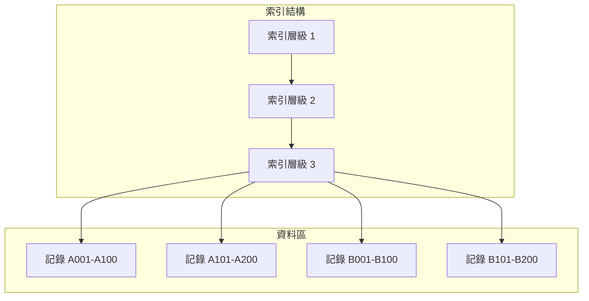

**索引檔案特點：**
- 透過索引（Key）直接存取記錄
- 支援循序存取與隨機存取
- 可以讀取、新增、修改、刪除記錄
- 主機上通常是 VSAM KSDS（Key Sequenced Data Set）

#### 5.2.2 索引檔案完整範例

```cobol
       IDENTIFICATION DIVISION.
       PROGRAM-ID. INDEXED-FILE-DEMO.
      ******************************************************************
      * 程式說明：索引檔案 CRUD 操作範例
      * 功    能：展示索引檔案的新增、查詢、修改、刪除
      ******************************************************************
      
       ENVIRONMENT DIVISION.
       INPUT-OUTPUT SECTION.
       FILE-CONTROL.
           SELECT CUSTOMER-FILE
               ASSIGN TO CUSTFILE
               ORGANIZATION IS INDEXED
               ACCESS MODE IS DYNAMIC
               RECORD KEY IS CUST-ID
               ALTERNATE RECORD KEY IS CUST-NAME
                   WITH DUPLICATES
               FILE STATUS IS WS-FILE-STATUS.
      
       DATA DIVISION.
       FILE SECTION.
       FD  CUSTOMER-FILE
           RECORD CONTAINS 200 CHARACTERS.
       01  CUSTOMER-RECORD.
           05  CUST-ID               PIC X(10).
           05  CUST-NAME             PIC X(50).
           05  CUST-ADDRESS          PIC X(100).
           05  CUST-PHONE            PIC X(15).
           05  CUST-BALANCE          PIC S9(9)V99.
           05  CUST-STATUS           PIC X(1).
               88  CUST-ACTIVE       VALUE 'A'.
               88  CUST-INACTIVE     VALUE 'I'.
           05  FILLER                PIC X(12).
      
       WORKING-STORAGE SECTION.
       01  WS-FILE-STATUS            PIC XX.
           88  STATUS-OK             VALUE '00'.
           88  STATUS-NOT-FOUND      VALUE '23'.
           88  STATUS-DUP-KEY        VALUE '22'.
           88  STATUS-EOF            VALUE '10'.
      
       01  WS-OPERATION              PIC X(1).
           88  OP-READ               VALUE 'R'.
           88  OP-ADD                VALUE 'A'.
           88  OP-UPDATE             VALUE 'U'.
           88  OP-DELETE             VALUE 'D'.
           88  OP-BROWSE             VALUE 'B'.
           88  OP-EXIT               VALUE 'X'.
      
       PROCEDURE DIVISION.
      *-----------------------------------------------------------------
      * 主程式
      *-----------------------------------------------------------------
       0000-MAIN-PROCESS.
           OPEN I-O CUSTOMER-FILE
           IF NOT STATUS-OK
               DISPLAY '無法開啟檔案，狀態碼：' WS-FILE-STATUS
               STOP RUN
           END-IF
      
           PERFORM UNTIL OP-EXIT
               PERFORM 1000-MENU
               EVALUATE TRUE
                   WHEN OP-READ
                       PERFORM 2000-READ-RECORD
                   WHEN OP-ADD
                       PERFORM 3000-ADD-RECORD
                   WHEN OP-UPDATE
                       PERFORM 4000-UPDATE-RECORD
                   WHEN OP-DELETE
                       PERFORM 5000-DELETE-RECORD
                   WHEN OP-BROWSE
                       PERFORM 6000-BROWSE-RECORDS
                   WHEN OP-EXIT
                       CONTINUE
                   WHEN OTHER
                       DISPLAY '無效的操作選項'
               END-EVALUATE
           END-PERFORM
      
           CLOSE CUSTOMER-FILE
           STOP RUN.
      
      *-----------------------------------------------------------------
      * 顯示選單
      *-----------------------------------------------------------------
       1000-MENU.
           DISPLAY '================================'
           DISPLAY ' 客戶資料管理系統'
           DISPLAY '================================'
           DISPLAY ' R - 查詢客戶'
           DISPLAY ' A - 新增客戶'
           DISPLAY ' U - 修改客戶'
           DISPLAY ' D - 刪除客戶'
           DISPLAY ' B - 瀏覽全部'
           DISPLAY ' X - 離開'
           DISPLAY '================================'
           ACCEPT WS-OPERATION
           .
      
      *-----------------------------------------------------------------
      * 查詢記錄（隨機讀取）
      *-----------------------------------------------------------------
       2000-READ-RECORD.
           DISPLAY '請輸入客戶 ID：'
           ACCEPT CUST-ID
      
           READ CUSTOMER-FILE
               INVALID KEY
                   DISPLAY '找不到客戶 ID：' CUST-ID
               NOT INVALID KEY
                   PERFORM 2100-DISPLAY-RECORD
           END-READ
           .
      
       2100-DISPLAY-RECORD.
           DISPLAY '------------------------'
           DISPLAY '客戶 ID：' CUST-ID
           DISPLAY '姓    名：' CUST-NAME
           DISPLAY '地    址：' CUST-ADDRESS
           DISPLAY '電    話：' CUST-PHONE
           DISPLAY '餘    額：' CUST-BALANCE
           DISPLAY '狀    態：' CUST-STATUS
           DISPLAY '------------------------'
           .
      
      *-----------------------------------------------------------------
      * 新增記錄
      *-----------------------------------------------------------------
       3000-ADD-RECORD.
           INITIALIZE CUSTOMER-RECORD
      
           DISPLAY '請輸入客戶 ID：'
           ACCEPT CUST-ID
           DISPLAY '請輸入客戶姓名：'
           ACCEPT CUST-NAME
           DISPLAY '請輸入客戶地址：'
           ACCEPT CUST-ADDRESS
           DISPLAY '請輸入客戶電話：'
           ACCEPT CUST-PHONE
           MOVE ZERO TO CUST-BALANCE
           SET CUST-ACTIVE TO TRUE
      
           WRITE CUSTOMER-RECORD
               INVALID KEY
                   IF STATUS-DUP-KEY
                       DISPLAY '客戶 ID 已存在：' CUST-ID
                   ELSE
                       DISPLAY '新增失敗，狀態碼：' WS-FILE-STATUS
                   END-IF
               NOT INVALID KEY
                   DISPLAY '客戶新增成功'
           END-WRITE
           .
      
      *-----------------------------------------------------------------
      * 修改記錄
      *-----------------------------------------------------------------
       4000-UPDATE-RECORD.
           DISPLAY '請輸入要修改的客戶 ID：'
           ACCEPT CUST-ID
      
           READ CUSTOMER-FILE
               INVALID KEY
                   DISPLAY '找不到客戶 ID：' CUST-ID
                   GO TO 4000-EXIT
           END-READ
      
           PERFORM 2100-DISPLAY-RECORD
           DISPLAY '請輸入新的電話號碼（空白跳過）：'
           ACCEPT CUST-PHONE
      
           REWRITE CUSTOMER-RECORD
               INVALID KEY
                   DISPLAY '修改失敗，狀態碼：' WS-FILE-STATUS
               NOT INVALID KEY
                   DISPLAY '客戶資料已更新'
           END-REWRITE
           .
      
       4000-EXIT.
           EXIT.
      
      *-----------------------------------------------------------------
      * 刪除記錄
      *-----------------------------------------------------------------
       5000-DELETE-RECORD.
           DISPLAY '請輸入要刪除的客戶 ID：'
           ACCEPT CUST-ID
      
           READ CUSTOMER-FILE
               INVALID KEY
                   DISPLAY '找不到客戶 ID：' CUST-ID
                   GO TO 5000-EXIT
           END-READ
      
           PERFORM 2100-DISPLAY-RECORD
           DISPLAY '確定要刪除嗎？(Y/N)'
           ACCEPT WS-OPERATION
      
           IF WS-OPERATION = 'Y' OR 'y'
               DELETE CUSTOMER-FILE
                   INVALID KEY
                       DISPLAY '刪除失敗，狀態碼：' WS-FILE-STATUS
                   NOT INVALID KEY
                       DISPLAY '客戶已刪除'
               END-DELETE
           END-IF
           .
      
       5000-EXIT.
           EXIT.
      
      *-----------------------------------------------------------------
      * 瀏覽全部記錄（循序讀取）
      *-----------------------------------------------------------------
       6000-BROWSE-RECORDS.
           MOVE LOW-VALUES TO CUST-ID
           START CUSTOMER-FILE KEY >= CUST-ID
               INVALID KEY
                   DISPLAY '檔案為空或無法開始瀏覽'
                   GO TO 6000-EXIT
           END-START
      
           DISPLAY '========== 客戶清單 =========='
           PERFORM UNTIL STATUS-EOF
               READ CUSTOMER-FILE NEXT
                   AT END
                       CONTINUE
                   NOT AT END
                       DISPLAY CUST-ID ' | ' CUST-NAME ' | '
                               CUST-BALANCE
               END-READ
           END-PERFORM
           DISPLAY '=============================='
           .
      
       6000-EXIT.
           EXIT.
```

---

### 5.3 相對檔案（Relative File）

#### 5.3.1 相對檔案概念

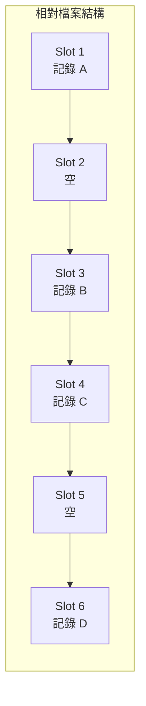

**相對檔案特點：**
- 記錄位置由相對記錄號（Relative Record Number）決定
- 可以直接存取任何位置的記錄
- 適合記錄號與資料有對應關係的情境
- 主機上是 VSAM RRDS（Relative Record Data Set）

#### 5.3.2 相對檔案範例

```cobol
       IDENTIFICATION DIVISION.
       PROGRAM-ID. RELATIVE-FILE-DEMO.
      
       ENVIRONMENT DIVISION.
       INPUT-OUTPUT SECTION.
       FILE-CONTROL.
           SELECT INVENTORY-FILE
               ASSIGN TO INVFILE
               ORGANIZATION IS RELATIVE
               ACCESS MODE IS DYNAMIC
               RELATIVE KEY IS WS-SLOT-NUMBER
               FILE STATUS IS WS-FILE-STATUS.
      
       DATA DIVISION.
       FILE SECTION.
       FD  INVENTORY-FILE
           RECORD CONTAINS 80 CHARACTERS.
       01  INVENTORY-RECORD.
           05  INV-PRODUCT-ID        PIC 9(5).
           05  INV-PRODUCT-NAME      PIC X(30).
           05  INV-QUANTITY          PIC 9(7).
           05  INV-UNIT-PRICE        PIC 9(5)V99.
           05  INV-LAST-UPDATE       PIC 9(8).
           05  FILLER                PIC X(23).
      
       WORKING-STORAGE SECTION.
       01  WS-FILE-STATUS            PIC XX.
           88  STATUS-OK             VALUE '00'.
           88  STATUS-NOT-FOUND      VALUE '23'.
      
       01  WS-SLOT-NUMBER            PIC 9(5).
      
       PROCEDURE DIVISION.
       0000-MAIN-PROCESS.
           OPEN I-O INVENTORY-FILE
      
      * 直接存取第 100 號位置
           MOVE 100 TO WS-SLOT-NUMBER
           READ INVENTORY-FILE
               INVALID KEY
                   DISPLAY '位置 100 無資料'
               NOT INVALID KEY
                   DISPLAY '產品：' INV-PRODUCT-NAME
           END-READ
      
      * 寫入第 200 號位置
           MOVE 200 TO WS-SLOT-NUMBER
           INITIALIZE INVENTORY-RECORD
           MOVE 200 TO INV-PRODUCT-ID
           MOVE 'TEST PRODUCT' TO INV-PRODUCT-NAME
           WRITE INVENTORY-RECORD
               INVALID KEY
                   DISPLAY '寫入失敗'
           END-WRITE
      
           CLOSE INVENTORY-FILE
           STOP RUN.
```

---

### 5.4 檔案操作

#### 5.4.1 檔案狀態碼一覽表

| 狀態碼 | 意義 | 處理建議 |
|--------|------|----------|
| `00` | 操作成功 | 正常繼續 |
| `02` | 重複鍵（允許重複時） | 檢查是否預期 |
| `10` | 檔案結束（EOF） | 結束讀取迴圈 |
| `21` | 順序錯誤 | 檢查排序 |
| `22` | 重複主鍵 | 鍵值已存在 |
| `23` | 記錄不存在 | 查無此記錄 |
| `24` | 磁碟空間不足 | 擴充空間 |
| `30` | 永久 I/O 錯誤 | 檢查硬體/檔案 |
| `34` | 記錄長度超出 | 檢查 LRECL |
| `35` | 檔案不存在 | 檢查 DD/檔案名稱 |
| `37` | 開啟模式錯誤 | 檢查 OPEN 方式 |
| `39` | 檔案屬性不符 | 檢查 DCB 參數 |
| `41` | 檔案已開啟 | 重複 OPEN |
| `42` | 檔案未開啟 | 漏了 OPEN |
| `43` | 刪除前未讀取 | DELETE 前需 READ |
| `44` | 更新前未讀取 | REWRITE 前需 READ |
| `46` | 循序讀取失敗 | START 後再 READ NEXT |
| `47` | 非輸入模式讀取 | 檢查 OPEN 模式 |
| `48` | 非輸出模式寫入 | 檢查 OPEN 模式 |

#### 5.4.2 檔案狀態碼處理範例

```cobol
       WORKING-STORAGE SECTION.
       01  WS-FILE-STATUS            PIC XX.
       01  WS-FILE-STATUS-1          PIC X.
       01  WS-FILE-STATUS-2          PIC X.
      
       01  WS-ERROR-MESSAGE          PIC X(50).
      
       PROCEDURE DIVISION.
      *-----------------------------------------------------------------
      * 通用檔案狀態檢查
      *-----------------------------------------------------------------
       9100-CHECK-FILE-STATUS.
           IF WS-FILE-STATUS = '00'
               CONTINUE
           ELSE
               PERFORM 9200-GET-ERROR-MESSAGE
               DISPLAY WS-ERROR-MESSAGE
               DISPLAY '檔案狀態碼：' WS-FILE-STATUS
           END-IF
           .
      
       9200-GET-ERROR-MESSAGE.
           EVALUATE WS-FILE-STATUS
               WHEN '00'
                   MOVE '操作成功' TO WS-ERROR-MESSAGE
               WHEN '10'
                   MOVE '已到達檔案結尾' TO WS-ERROR-MESSAGE
               WHEN '22'
                   MOVE '主鍵重複，記錄已存在' TO WS-ERROR-MESSAGE
               WHEN '23'
                   MOVE '記錄不存在' TO WS-ERROR-MESSAGE
               WHEN '24'
                   MOVE '磁碟空間不足' TO WS-ERROR-MESSAGE
               WHEN '30'
                   MOVE '永久性 I/O 錯誤' TO WS-ERROR-MESSAGE
               WHEN '34'
                   MOVE '記錄長度超出限制' TO WS-ERROR-MESSAGE
               WHEN '35'
                   MOVE '檔案不存在' TO WS-ERROR-MESSAGE
               WHEN '39'
                   MOVE '檔案屬性不符' TO WS-ERROR-MESSAGE
               WHEN '41'
                   MOVE '檔案已經開啟' TO WS-ERROR-MESSAGE
               WHEN '42'
                   MOVE '檔案尚未開啟' TO WS-ERROR-MESSAGE
               WHEN '43'
                   MOVE '刪除前必須先讀取記錄' TO WS-ERROR-MESSAGE
               WHEN '44'
                   MOVE '更新前必須先讀取記錄' TO WS-ERROR-MESSAGE
               WHEN '47'
                   MOVE '嘗試讀取非輸入模式檔案' TO WS-ERROR-MESSAGE
               WHEN '48'
                   MOVE '嘗試寫入非輸出模式檔案' TO WS-ERROR-MESSAGE
               WHEN OTHER
                   STRING '未知錯誤碼：' DELIMITED SIZE
                          WS-FILE-STATUS DELIMITED SIZE
                          INTO WS-ERROR-MESSAGE
           END-EVALUATE
           .
```

#### 5.4.3 OPEN 模式說明

| OPEN 模式 | 用途 | 允許的操作 |
|-----------|------|------------|
| `INPUT` | 只讀 | READ、START |
| `OUTPUT` | 只寫（新建/覆蓋） | WRITE |
| `I-O` | 讀寫 | READ、WRITE、REWRITE、DELETE、START |
| `EXTEND` | 附加 | WRITE（加在檔尾） |

---

### 📝 第五章重點摘要

1. 循序檔案適合批次處理，只能依序存取
2. 索引檔案透過主鍵存取，支援隨機與循序存取
3. 相對檔案透過相對記錄號存取，適合固定位置資料
4. 檔案狀態碼是檢查檔案操作結果的重要依據
5. OPEN 模式決定可以對檔案執行的操作

### 🔖 練習題

1. 撰寫程式讀取員工循序檔，計算所有員工的薪資總和
2. 設計一個索引檔案程式，實作客戶資料的 CRUD 功能
3. 撰寫完整的檔案狀態碼處理程式

---

## 第六章：進階主題

### 學習目標

完成本章後，您將能夠：
- 使用 COPYBOOK 管理共用資料結構
- 撰寫與呼叫副程式
- 存取 DB2 資料庫
- 了解 CICS 線上交易處理基礎
- 運用除錯技巧解決問題

---

### 6.1 COPYBOOK 的使用與管理

#### 6.1.1 COPYBOOK 概念

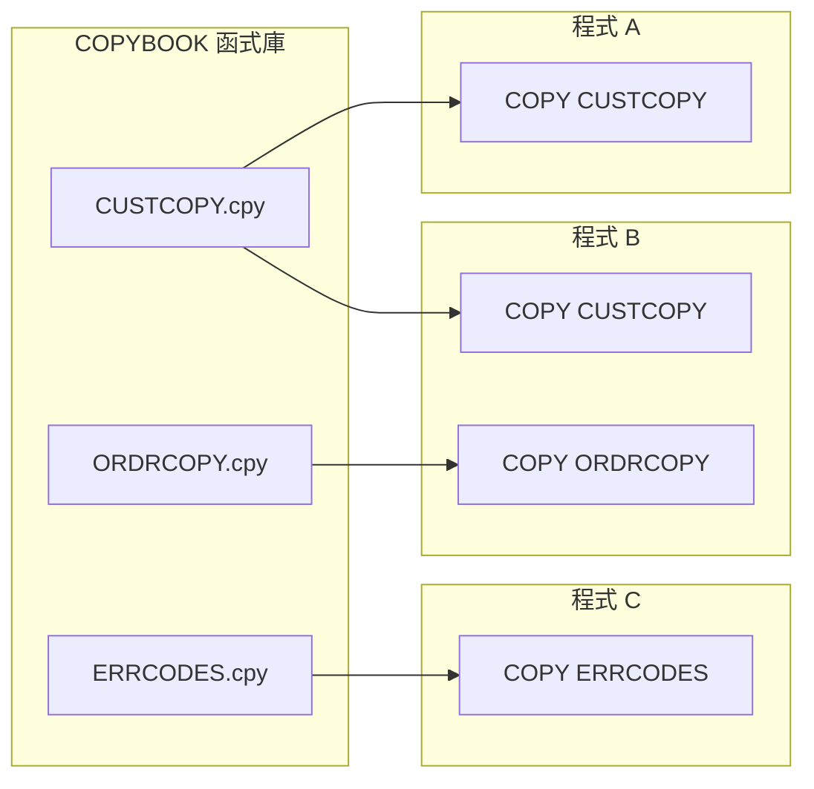

**COPYBOOK 優點：**
- 資料結構集中管理，確保一致性
- 修改一處，所有引用處自動更新（重新編譯後）
- 減少重複程式碼
- 符合 DRY（Don't Repeat Yourself）原則

#### 6.1.2 COPYBOOK 範例

**CUSTCOPY.cpy（客戶資料結構）：**

```cobol
      ******************************************************************
      * COPYBOOK：CUSTCOPY
      * 說    明：客戶主檔記錄格式
      * 最後更新：2026-02-03
      ******************************************************************
       01  CUSTOMER-RECORD.
           05  CUST-ID               PIC X(10).
           05  CUST-NAME.
               10  CUST-LAST-NAME    PIC X(20).
               10  CUST-FIRST-NAME   PIC X(15).
           05  CUST-ADDRESS.
               10  CUST-STREET       PIC X(30).
               10  CUST-CITY         PIC X(20).
               10  CUST-STATE        PIC X(2).
               10  CUST-ZIP          PIC X(10).
           05  CUST-PHONE            PIC X(15).
           05  CUST-EMAIL            PIC X(50).
           05  CUST-BALANCE          PIC S9(9)V99 COMP-3.
           05  CUST-CREDIT-LIMIT     PIC S9(9)V99 COMP-3.
           05  CUST-STATUS           PIC X(1).
               88  CUST-ACTIVE       VALUE 'A'.
               88  CUST-SUSPENDED    VALUE 'S'.
               88  CUST-CLOSED       VALUE 'C'.
           05  CUST-OPEN-DATE        PIC 9(8).
           05  CUST-LAST-ACTIVITY    PIC 9(8).
```

**ERRCODES.cpy（錯誤代碼）：**

```cobol
      ******************************************************************
      * COPYBOOK：ERRCODES
      * 說    明：系統錯誤代碼定義
      ******************************************************************
       01  WS-RETURN-CODE            PIC S9(4) COMP.
           88  RC-SUCCESS            VALUE 0.
           88  RC-WARNING            VALUE 4.
           88  RC-ERROR              VALUE 8.
           88  RC-SEVERE             VALUE 12.
           88  RC-FATAL              VALUE 16.
      
       01  WS-ERROR-CODES.
           05  ERR-NONE              PIC X(4) VALUE '0000'.
           05  ERR-FILE-NOT-FOUND    PIC X(4) VALUE 'F001'.
           05  ERR-RECORD-NOT-FOUND  PIC X(4) VALUE 'R001'.
           05  ERR-DUPLICATE-KEY     PIC X(4) VALUE 'R002'.
           05  ERR-INVALID-DATA      PIC X(4) VALUE 'D001'.
           05  ERR-DB-ERROR          PIC X(4) VALUE 'B001'.
```

**使用 COPYBOOK 的程式：**

```cobol
       IDENTIFICATION DIVISION.
       PROGRAM-ID. USE-COPYBOOK.
      
       DATA DIVISION.
       WORKING-STORAGE SECTION.
      
      * 引入 COPYBOOK
           COPY CUSTCOPY.
           COPY ERRCODES.
      
      * 使用 REPLACING 替換名稱
           COPY CUSTCOPY REPLACING 
               ==CUSTOMER-RECORD== BY ==INPUT-CUSTOMER==
               ==CUST-== BY ==IN-CUST-==.
      
           COPY CUSTCOPY REPLACING 
               ==CUSTOMER-RECORD== BY ==OUTPUT-CUSTOMER==
               ==CUST-== BY ==OUT-CUST-==.
      
       PROCEDURE DIVISION.
           MOVE 'C0001' TO CUST-ID
           SET CUST-ACTIVE TO TRUE
           IF RC-SUCCESS
               DISPLAY '處理成功'
           END-IF
           STOP RUN.
```

---

### 6.2 副程式呼叫

#### 6.2.1 CALL 敘述

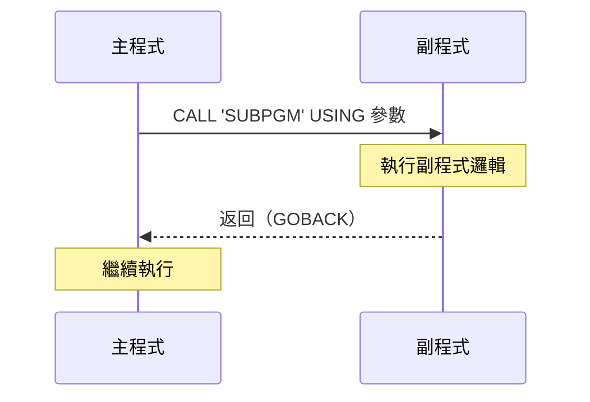

#### 6.2.2 主程式範例

```cobol
       IDENTIFICATION DIVISION.
       PROGRAM-ID. MAIN-PROGRAM.
      
       DATA DIVISION.
       WORKING-STORAGE SECTION.
      
      * 傳遞給副程式的參數
       01  WS-INPUT-DATA.
           05  WS-EMPLOYEE-ID        PIC 9(6).
           05  WS-REQUEST-TYPE       PIC X(1).
      
       01  WS-OUTPUT-DATA.
           05  WS-EMPLOYEE-NAME      PIC X(30).
           05  WS-EMPLOYEE-DEPT      PIC X(10).
           05  WS-EMPLOYEE-SALARY    PIC S9(7)V99.
           05  WS-RETURN-CODE        PIC S9(4) COMP.
      
       PROCEDURE DIVISION.
       0000-MAIN-PROCESS.
      * 設定輸入參數
           MOVE 123456 TO WS-EMPLOYEE-ID
           MOVE 'R' TO WS-REQUEST-TYPE
      
      * 呼叫副程式
           CALL 'EMPINQ' USING WS-INPUT-DATA
                               WS-OUTPUT-DATA
      
      * 檢查返回碼
           EVALUATE WS-RETURN-CODE
               WHEN 0
                   DISPLAY '員工姓名：' WS-EMPLOYEE-NAME
                   DISPLAY '部    門：' WS-EMPLOYEE-DEPT
                   DISPLAY '薪    資：' WS-EMPLOYEE-SALARY
               WHEN 4
                   DISPLAY '員工不存在'
               WHEN OTHER
                   DISPLAY '發生錯誤，RC=' WS-RETURN-CODE
           END-EVALUATE
      
           STOP RUN.
```

#### 6.2.3 副程式範例

```cobol
       IDENTIFICATION DIVISION.
       PROGRAM-ID. EMPINQ.
      
       DATA DIVISION.
       WORKING-STORAGE SECTION.
       01  WS-FILE-STATUS            PIC XX.
      
      * LINKAGE SECTION 定義接收參數
       LINKAGE SECTION.
       01  LS-INPUT-DATA.
           05  LS-EMPLOYEE-ID        PIC 9(6).
           05  LS-REQUEST-TYPE       PIC X(1).
      
       01  LS-OUTPUT-DATA.
           05  LS-EMPLOYEE-NAME      PIC X(30).
           05  LS-EMPLOYEE-DEPT      PIC X(10).
           05  LS-EMPLOYEE-SALARY    PIC S9(7)V99.
           05  LS-RETURN-CODE        PIC S9(4) COMP.
      
       PROCEDURE DIVISION USING LS-INPUT-DATA
                                LS-OUTPUT-DATA.
       0000-MAIN-PROCESS.
           INITIALIZE LS-OUTPUT-DATA
           MOVE 0 TO LS-RETURN-CODE
      
           EVALUATE LS-REQUEST-TYPE
               WHEN 'R'
                   PERFORM 1000-READ-EMPLOYEE
               WHEN OTHER
                   MOVE 8 TO LS-RETURN-CODE
           END-EVALUATE
      
      * 使用 GOBACK 返回主程式
           GOBACK.
      
       1000-READ-EMPLOYEE.
      * 模擬查詢員工資料
           IF LS-EMPLOYEE-ID = 123456
               MOVE 'JOHN DOE' TO LS-EMPLOYEE-NAME
               MOVE 'IT' TO LS-EMPLOYEE-DEPT
               MOVE 75000.00 TO LS-EMPLOYEE-SALARY
               MOVE 0 TO LS-RETURN-CODE
           ELSE
               MOVE 4 TO LS-RETURN-CODE
           END-IF
           .
```

#### 6.2.4 靜態呼叫與動態呼叫

| 特性 | 靜態呼叫（Static） | 動態呼叫（Dynamic） |
|------|-------------------|-------------------|
| **語法** | `CALL 'SUBPGM'` | `CALL WS-PGM-NAME` |
| **連結時機** | 編譯時 | 執行時 |
| **載入方式** | 與主程式綁定 | 需要時才載入 |
| **記憶體** | 常駐 | 可釋放 |
| **彈性** | 較低 | 較高 |
| **效能** | 較快 | 稍慢（首次載入） |

```cobol
      * 動態呼叫範例
       WORKING-STORAGE SECTION.
       01  WS-PROGRAM-NAME           PIC X(8).
      
       PROCEDURE DIVISION.
           MOVE 'EMPINQ' TO WS-PROGRAM-NAME
           CALL WS-PROGRAM-NAME USING WS-INPUT WS-OUTPUT
      
      * 釋放動態載入的程式
           CANCEL WS-PROGRAM-NAME
```

---

### 6.3 資料庫存取

#### 6.3.1 Embedded SQL 基礎

```cobol
       IDENTIFICATION DIVISION.
       PROGRAM-ID. DB2-DEMO.
      
       DATA DIVISION.
       WORKING-STORAGE SECTION.
      
      * DB2 通訊區
           EXEC SQL INCLUDE SQLCA END-EXEC.
      
      * 主機變數（Host Variables）
       01  HV-EMPLOYEE-ID            PIC 9(6).
       01  HV-EMPLOYEE-NAME          PIC X(30).
       01  HV-DEPARTMENT             PIC X(10).
       01  HV-SALARY                 PIC S9(7)V99 COMP-3.
       01  HV-HIRE-DATE              PIC X(10).
      
      * 指標變數（Null Indicator）
       01  IND-EMPLOYEE-NAME         PIC S9(4) COMP.
       01  IND-SALARY                PIC S9(4) COMP.
      
       PROCEDURE DIVISION.
       0000-MAIN-PROCESS.
      *-----------------------------------------------------------------
      * SELECT 查詢
      *-----------------------------------------------------------------
           MOVE 123456 TO HV-EMPLOYEE-ID
      
           EXEC SQL
               SELECT EMPLOYEE_NAME,
                      DEPARTMENT,
                      SALARY,
                      HIRE_DATE
               INTO   :HV-EMPLOYEE-NAME :IND-EMPLOYEE-NAME,
                      :HV-DEPARTMENT,
                      :HV-SALARY :IND-SALARY,
                      :HV-HIRE-DATE
               FROM   EMPLOYEE
               WHERE  EMPLOYEE_ID = :HV-EMPLOYEE-ID
           END-EXEC
      
           PERFORM 9000-CHECK-SQLCODE
           IF SQLCODE = 0
               DISPLAY '員工姓名：' HV-EMPLOYEE-NAME
               DISPLAY '部    門：' HV-DEPARTMENT
               DISPLAY '薪    資：' HV-SALARY
           END-IF
      
           STOP RUN.
      
      *-----------------------------------------------------------------
      * SQLCODE 檢查
      *-----------------------------------------------------------------
       9000-CHECK-SQLCODE.
           EVALUATE SQLCODE
               WHEN 0
                   CONTINUE
               WHEN 100
                   DISPLAY '查無資料'
               WHEN -803
                   DISPLAY '主鍵重複'
               WHEN -904
                   DISPLAY '資源不可用'
               WHEN -911
                   DISPLAY '發生 Deadlock'
               WHEN OTHER
                   DISPLAY 'SQL 錯誤碼：' SQLCODE
           END-EVALUATE
           .
```

#### 6.3.2 常用 SQL 操作

```cobol
      *-----------------------------------------------------------------
      * INSERT 新增
      *-----------------------------------------------------------------
           EXEC SQL
               INSERT INTO EMPLOYEE
                   (EMPLOYEE_ID, EMPLOYEE_NAME, DEPARTMENT, SALARY)
               VALUES
                   (:HV-EMPLOYEE-ID, :HV-EMPLOYEE-NAME,
                    :HV-DEPARTMENT, :HV-SALARY)
           END-EXEC
      
      *-----------------------------------------------------------------
      * UPDATE 修改
      *-----------------------------------------------------------------
           EXEC SQL
               UPDATE EMPLOYEE
               SET    SALARY = :HV-SALARY
               WHERE  EMPLOYEE_ID = :HV-EMPLOYEE-ID
           END-EXEC
      
      *-----------------------------------------------------------------
      * DELETE 刪除
      *-----------------------------------------------------------------
           EXEC SQL
               DELETE FROM EMPLOYEE
               WHERE  EMPLOYEE_ID = :HV-EMPLOYEE-ID
           END-EXEC
      
      *-----------------------------------------------------------------
      * CURSOR 游標（處理多筆資料）
      *-----------------------------------------------------------------
           EXEC SQL
               DECLARE EMPCURSOR CURSOR FOR
               SELECT EMPLOYEE_ID, EMPLOYEE_NAME, SALARY
               FROM   EMPLOYEE
               WHERE  DEPARTMENT = :HV-DEPARTMENT
               ORDER BY EMPLOYEE_ID
           END-EXEC
      
           EXEC SQL OPEN EMPCURSOR END-EXEC
      
           PERFORM UNTIL SQLCODE NOT = 0
               EXEC SQL
                   FETCH EMPCURSOR
                   INTO :HV-EMPLOYEE-ID,
                        :HV-EMPLOYEE-NAME,
                        :HV-SALARY
               END-EXEC
               IF SQLCODE = 0
                   DISPLAY HV-EMPLOYEE-ID ' ' HV-EMPLOYEE-NAME
               END-IF
           END-PERFORM
      
           EXEC SQL CLOSE EMPCURSOR END-EXEC
      
      *-----------------------------------------------------------------
      * COMMIT 與 ROLLBACK
      *-----------------------------------------------------------------
           EXEC SQL COMMIT END-EXEC
           
           IF SQLCODE NOT = 0
               EXEC SQL ROLLBACK END-EXEC
           END-IF
```

#### 6.3.3 常見 SQLCODE 對照表

| SQLCODE | 意義 |
|---------|------|
| `0` | 成功 |
| `100` | 查無資料（NOT FOUND） |
| `-803` | 主鍵重複 |
| `-805` | 找不到 PACKAGE |
| `-811` | SELECT 返回多筆（應只有一筆） |
| `-818` | TIMESTAMP 不符 |
| `-904` | 資源不可用 |
| `-911` | Deadlock / Timeout |
| `-922` | 授權錯誤 |

---

### 6.4 CICS 交易處理基礎

#### 6.4.1 CICS 程式結構

```cobol
       IDENTIFICATION DIVISION.
       PROGRAM-ID. CICDEMO.
      
       DATA DIVISION.
       WORKING-STORAGE SECTION.
      
      * CICS 通訊區
           COPY DFHAID.    *> AID 按鍵定義
           COPY DFHBMSCA.  *> 螢幕屬性定義
      
       01  WS-COMMAREA.
           05  WS-TRANS-CODE         PIC X(4).
           05  WS-USER-ID            PIC X(8).
      
       01  WS-RESPONSE               PIC S9(8) COMP.
      
      * BMS 畫面定義（通常用 COPY）
       01  DEMOMAPI.
           05  FILLER                PIC X(12).
           05  MSGL                  PIC S9(4) COMP.
           05  MSGF                  PIC X.
           05  MSGI                  PIC X(50).
           05  MSGO REDEFINES MSGI   PIC X(50).
      
       LINKAGE SECTION.
       01  DFHCOMMAREA               PIC X(100).
      
       PROCEDURE DIVISION.
      *-----------------------------------------------------------------
      * CICS 程式主邏輯
      *-----------------------------------------------------------------
       0000-MAIN-PROCESS.
           EVALUATE TRUE
               WHEN EIBCALEN = 0
                   PERFORM 1000-FIRST-TIME
               WHEN EIBAID = DFHENTER
                   PERFORM 2000-PROCESS-ENTER
               WHEN EIBAID = DFHPF3
                   PERFORM 9000-END-PROGRAM
               WHEN OTHER
                   PERFORM 3000-INVALID-KEY
           END-EVALUATE
           
           EXEC CICS RETURN
               TRANSID('DEMO')
               COMMAREA(WS-COMMAREA)
               LENGTH(LENGTH OF WS-COMMAREA)
           END-EXEC.
      
      *-----------------------------------------------------------------
      * 首次進入
      *-----------------------------------------------------------------
       1000-FIRST-TIME.
           EXEC CICS SEND MAP('DEMOMAP')
                          MAPSET('DEMOS')
                          ERASE
           END-EXEC
           .
      
      *-----------------------------------------------------------------
      * 處理 ENTER 鍵
      *-----------------------------------------------------------------
       2000-PROCESS-ENTER.
           EXEC CICS RECEIVE MAP('DEMOMAP')
                             MAPSET('DEMOS')
           END-EXEC
      
           MOVE 'PROCESSING COMPLETE' TO MSGO
      
           EXEC CICS SEND MAP('DEMOMAP')
                          MAPSET('DEMOS')
                          DATAONLY
           END-EXEC
           .
      
      *-----------------------------------------------------------------
      * 無效按鍵
      *-----------------------------------------------------------------
       3000-INVALID-KEY.
           MOVE 'INVALID KEY PRESSED' TO MSGO
           EXEC CICS SEND MAP('DEMOMAP')
                          MAPSET('DEMOS')
                          DATAONLY
           END-EXEC
           .
      
      *-----------------------------------------------------------------
      * 結束程式
      *-----------------------------------------------------------------
       9000-END-PROGRAM.
           EXEC CICS SEND TEXT
                     FROM('GOODBYE')
                     ERASE
           END-EXEC
           EXEC CICS RETURN END-EXEC.
```

#### 6.4.2 常用 CICS 指令

| 指令 | 用途 |
|------|------|
| `SEND MAP` | 發送 BMS 畫面 |
| `RECEIVE MAP` | 接收 BMS 輸入 |
| `READ` | 讀取 VSAM/DB2 |
| `WRITE` | 寫入資料 |
| `REWRITE` | 更新資料 |
| `DELETE` | 刪除資料 |
| `RETURN` | 返回 CICS |
| `XCTL` | 程式轉移 |
| `LINK` | 呼叫子程式 |
| `SYNCPOINT` | 同步點（Commit） |

---

### 6.5 錯誤處理與除錯技巧

#### 6.5.1 常見 ABEND 代碼

| ABEND | 說明 | 常見原因 |
|-------|------|----------|
| `S0C1` | 非法操作 | CALL 不存在的程式 |
| `S0C4` | 保護例外 | 存取未配置記憶體 |
| `S0C7` | 資料例外 | 數值欄位含非數字 |
| `S0CB` | 除以零 | DIVIDE 或 COMPUTE 除零 |
| `S222` | 操作員取消 | 使用者手動取消 |
| `S322` | 執行時間超時 | 超過 JCL TIME 限制 |
| `S722` | 輸出超出限制 | SYSOUT 行數過多 |
| `S806` | 找不到模組 | CALL 的程式不在 STEPLIB |
| `S878` | 虛擬儲存不足 | REGION 太小 |
| `S913` | 權限不足 | 無資料集存取權限 |

#### 6.5.2 除錯技巧

```cobol
      *-----------------------------------------------------------------
      * 1. DISPLAY 追蹤
      *-----------------------------------------------------------------
       DEBUG-SECTION.
           DISPLAY '*** DEBUG START ***'
           DISPLAY 'WS-COUNTER = ' WS-COUNTER
           DISPLAY 'WS-AMOUNT  = ' WS-AMOUNT
           DISPLAY 'WS-STATUS  = ' WS-STATUS
           DISPLAY '*** DEBUG END ***'
           .
      
      *-----------------------------------------------------------------
      * 2. 使用 DEBUG 行（欄位 7 放 D）
      *-----------------------------------------------------------------
      D    DISPLAY 'DEBUG: 進入段落 1000'
      D    DISPLAY 'DEBUG: WS-INPUT = ' WS-INPUT
      
      *-----------------------------------------------------------------
      * 3. 數值驗證
      *-----------------------------------------------------------------
       VALIDATE-NUMERIC.
           IF WS-AMOUNT IS NUMERIC
               CONTINUE
           ELSE
               DISPLAY 'ERROR: WS-AMOUNT 非數值 = ' WS-AMOUNT
               MOVE ZERO TO WS-AMOUNT
           END-IF
           .
      
      *-----------------------------------------------------------------
      * 4. 邊界條件檢查
      *-----------------------------------------------------------------
       VALIDATE-INDEX.
           IF WS-INDEX < 1 OR WS-INDEX > 100
               DISPLAY 'ERROR: 索引超出範圍 = ' WS-INDEX
               MOVE 1 TO WS-INDEX
           END-IF
           .
```

#### 6.5.3 IBM Debug Tool 使用

```jcl
//DEBUG    JOB  (ACCT),'DEBUG SESSION',CLASS=A,MSGCLASS=X
//*
//STEP01   EXEC PGM=EQANMDBG,
//             PARM='TEST(,,,INSPCOB%MYPGM:*)'
//STEPLIB  DD DSN=DEBUG.SEQAMOD,DISP=SHR
//         DD DSN=MY.LOAD.LIBRARY,DISP=SHR
//INSPLOG  DD SYSOUT=*
//INSPIN   DD *
  AT 1000-PROCESS
  LIST WS-AMOUNT
  GO
/*
//
```

---

### 📝 第六章重點摘要

1. COPYBOOK 用於共用資料結構，確保一致性
2. CALL 敘述用於呼叫副程式，GOBACK 用於返回
3. Embedded SQL 透過 EXEC SQL 存取 DB2 資料庫
4. CICS 是線上交易處理系統，使用 BMS 畫面
5. 熟悉常見 ABEND 代碼有助於快速定位問題

### 🔖 練習題

1. 建立客戶資料 COPYBOOK 並在主程式中使用
2. 撰寫一個副程式計算兩數相加並返回結果
3. 撰寫 DB2 程式查詢員工資料並處理 SQLCODE

---

## 第七章：最佳實踐

### 學習目標

完成本章後，您將能夠：
- 遵循團隊程式碼撰寫規範
- 使用一致的命名慣例
- 撰寫有價值的程式註解
- 應用效能優化技巧
- 設計易於維護的程式結構

---

### 7.1 程式碼撰寫規範

#### 7.1.1 程式結構規範

```cobol
      ******************************************************************
      * 程式標頭（必須包含以下資訊）
      ******************************************************************
      * 程式名稱：PGMXXXXX
      * 程式說明：[簡要說明程式功能]
      * 作    者：[撰寫者姓名]
      * 建立日期：YYYY-MM-DD
      * 修改歷程：
      *   YYYY-MM-DD  作者  修改說明
      *   YYYY-MM-DD  作者  修改說明
      ******************************************************************
       IDENTIFICATION DIVISION.
       PROGRAM-ID. PGMXXXXX.
       AUTHOR.     DEVELOPMENT-TEAM.
       DATE-WRITTEN. 2026-02-03.
      
       ENVIRONMENT DIVISION.
      * [環境相關設定]
      
       DATA DIVISION.
       FILE SECTION.
      * [檔案定義 - 按 INPUT、OUTPUT、I-O 順序]
      
       WORKING-STORAGE SECTION.
      * [工作區定義 - 按邏輯分類]
      * 1. 常數定義
      * 2. 開關與標記
      * 3. 計數器與累加器
      * 4. 工作變數
      * 5. 輸入/輸出結構
      
       LINKAGE SECTION.
      * [外部參數定義]
      
       PROCEDURE DIVISION.
      * [程式邏輯 - 遵循段落命名規範]
      * 0000 - 主控程式
      * 1000-1999 - 初始化
      * 2000-8999 - 主要處理邏輯
      * 9000-9999 - 結束處理
```

#### 7.1.2 縮排與對齊規則

```cobol
      * 正確範例：使用一致的縮排
       PROCEDURE DIVISION.
       0000-MAIN-PROCESS.
           PERFORM 1000-INITIALIZE
           PERFORM 2000-PROCESS
               UNTIL WS-EOF-FLAG = 'Y'
           PERFORM 9000-FINALIZE
           STOP RUN.
      
       2000-PROCESS.
           IF WS-AMOUNT > 1000
               PERFORM 2100-LARGE-AMOUNT
           ELSE
               IF WS-AMOUNT > 100
                   PERFORM 2200-MEDIUM-AMOUNT
               ELSE
                   PERFORM 2300-SMALL-AMOUNT
               END-IF
           END-IF
           .
      
      * 錯誤範例：縮排不一致
       2000-PROCESS.
           IF WS-AMOUNT > 1000
           PERFORM 2100-LARGE-AMOUNT
               ELSE
           IF WS-AMOUNT > 100
                   PERFORM 2200-MEDIUM-AMOUNT
           ELSE
           PERFORM 2300-SMALL-AMOUNT
           END-IF
           END-IF
           .
```

#### 7.1.3 使用 END 終止詞

```cobol
      * 推薦：使用明確的 END 終止詞
           IF WS-CONDITION
               PERFORM PROCESS-A
           ELSE
               PERFORM PROCESS-B
           END-IF
      
           EVALUATE WS-TYPE
               WHEN 'A'
                   PERFORM TYPE-A-PROCESS
               WHEN 'B'
                   PERFORM TYPE-B-PROCESS
               WHEN OTHER
                   PERFORM DEFAULT-PROCESS
           END-EVALUATE
      
           PERFORM VARYING WS-INDEX FROM 1 BY 1
               UNTIL WS-INDEX > 10
               ADD WS-VALUE(WS-INDEX) TO WS-TOTAL
           END-PERFORM
      
           READ INPUT-FILE
               AT END
                   SET END-OF-FILE TO TRUE
               NOT AT END
                   PERFORM PROCESS-RECORD
           END-READ
```

---

### 7.2 命名慣例

#### 7.2.1 前綴命名規則

| 前綴 | 用途 | 範例 |
|------|------|------|
| `WS-` | Working-Storage 變數 | `WS-COUNTER` |
| `LS-` | Linkage Section 變數 | `LS-INPUT-DATA` |
| `FD-` | 檔案記錄 | `FD-CUSTOMER-REC` |
| `IN-` | 輸入欄位 | `IN-EMPLOYEE-ID` |
| `OUT-` | 輸出欄位 | `OUT-REPORT-LINE` |
| `HV-` | DB2 主機變數 | `HV-CUST-NAME` |
| `IND-` | DB2 指標變數 | `IND-CUST-NAME` |
| `CT-` | 計數器 | `CT-RECORDS` |
| `SW-` | 開關/標記 | `SW-EOF` |
| `AC-` | 累加器 | `AC-TOTAL-AMT` |
| `K-` | 常數 | `K-MAX-RECORDS` |

#### 7.2.2 段落命名規則

```cobol
      * 段落命名格式：NNNN-動詞-名詞
      * NNNN 為四位數字，代表邏輯順序
      
       0000-MAIN-PROCESS.           *> 主控制
       1000-INITIALIZE.             *> 初始化
       1100-OPEN-FILES.             *> 開啟檔案
       1200-INIT-VARIABLES.         *> 初始變數
       
       2000-PROCESS-LOOP.           *> 主處理迴圈
       2100-READ-INPUT.             *> 讀取輸入
       2200-VALIDATE-DATA.          *> 驗證資料
       2300-CALCULATE-AMOUNT.       *> 計算金額
       2400-WRITE-OUTPUT.           *> 寫入輸出
       
       3000-PROCESS-CUSTOMER.       *> 處理客戶
       3100-GET-CUSTOMER-INFO.      *> 取得客戶資訊
       3200-UPDATE-BALANCE.         *> 更新餘額
       
       9000-FINALIZE.               *> 結束處理
       9100-CLOSE-FILES.            *> 關閉檔案
       9200-PRINT-TOTALS.           *> 列印總計
       9900-ABEND-ROUTINE.          *> 異常處理
```

#### 7.2.3 變數命名範例

```cobol
       WORKING-STORAGE SECTION.
      *-----------------------------------------------------------------
      * 常數定義（使用 K- 前綴）
      *-----------------------------------------------------------------
       01  K-CONSTANTS.
           05  K-MAX-RECORDS         PIC 9(5)   VALUE 99999.
           05  K-TAX-RATE            PIC V99    VALUE 0.05.
           05  K-BLANK-LINE          PIC X(132) VALUE SPACES.
      
      *-----------------------------------------------------------------
      * 開關與標記（使用 SW- 前綴）
      *-----------------------------------------------------------------
       01  SW-FLAGS.
           05  SW-EOF-INPUT          PIC X(1)   VALUE 'N'.
               88  EOF-INPUT         VALUE 'Y'.
               88  NOT-EOF-INPUT     VALUE 'N'.
           05  SW-FIRST-RECORD       PIC X(1)   VALUE 'Y'.
               88  IS-FIRST-RECORD   VALUE 'Y'.
           05  SW-ERROR-FOUND        PIC X(1)   VALUE 'N'.
               88  ERROR-FOUND       VALUE 'Y'.
      
      *-----------------------------------------------------------------
      * 計數器（使用 CT- 前綴）
      *-----------------------------------------------------------------
       01  CT-COUNTERS.
           05  CT-RECORDS-READ       PIC 9(7)   VALUE 0.
           05  CT-RECORDS-WRITTEN    PIC 9(7)   VALUE 0.
           05  CT-ERROR-RECORDS      PIC 9(7)   VALUE 0.
      
      *-----------------------------------------------------------------
      * 累加器（使用 AC- 前綴）
      *-----------------------------------------------------------------
       01  AC-ACCUMULATORS.
           05  AC-TOTAL-AMOUNT       PIC S9(11)V99 VALUE 0.
           05  AC-TOTAL-TAX          PIC S9(11)V99 VALUE 0.
```

---

### 7.3 註解撰寫標準

#### 7.3.1 註解類型與用途

```cobol
      ******************************************************************
      * 1. 程式標頭註解（檔案開頭必須有）
      ******************************************************************
      * 程式名稱：CUSTPROC
      * 程式說明：處理客戶每日交易資料
      * 輸入檔案：CUSTINP - 客戶交易檔
      * 輸出檔案：CUSTRPT - 客戶報表檔
      * 作    者：開發團隊
      * 建立日期：2026-02-03
      ******************************************************************
      
      *-----------------------------------------------------------------
      * 2. 區段註解（說明大區塊功能）
      *-----------------------------------------------------------------
       WORKING-STORAGE SECTION.
      *-----------------------------------------------------------------
      * 檔案狀態碼定義
      *-----------------------------------------------------------------
       01  WS-FILE-STATUS            PIC XX.
      
      *-----------------------------------------------------------------
      * 3. 段落註解（說明段落用途）
      *-----------------------------------------------------------------
       2000-VALIDATE-TRANSACTION.
      *-----------------------------------------------------------------
      * 驗證交易資料的完整性與正確性
      * 檢查項目：
      *   1. 客戶 ID 是否存在
      *   2. 交易金額是否在允許範圍
      *   3. 交易日期是否有效
      *-----------------------------------------------------------------
      
      * 4. 行內註解（解釋複雜邏輯）
           COMPUTE WS-TAX = WS-AMOUNT * K-TAX-RATE
               * 計算 5% 營業稅
      
           IF WS-BALANCE < 0
               SET ACCOUNT-OVERDRAWN TO TRUE
               * 餘額為負，設定透支標記
           END-IF
```

#### 7.3.2 修改歷程記錄

```cobol
      ******************************************************************
      * 修改歷程：
      *-----------------------------------------------------------------
      * 日期        版本    作者      修改說明
      *-----------------------------------------------------------------
      * 2026-02-03  1.0.0   DEVTEAM   初版建立
      * 2026-03-15  1.1.0   JOHN      新增信用檢查功能
      * 2026-04-20  1.2.0   MARY      修正金額計算錯誤 (Issue #123)
      * 2026-05-10  1.2.1   JOHN      效能優化：改用 SEARCH ALL
      ******************************************************************
```

#### 7.3.3 註解禁忌

```cobol
      * ❌ 不良註解範例
      
      * 加一（毫無意義的註解）
           ADD 1 TO WS-COUNTER
      
      * 這是 IF（只說明語法，沒有說明邏輯）
           IF WS-AMOUNT > 1000
      
      * TODO: 待修正（沒有說明要修正什麼）
           MOVE WS-VALUE TO WS-RESULT
      
      * ✅ 良好註解範例
      
      * 增加處理筆數計數
           ADD 1 TO WS-COUNTER
      
      * 大額交易（超過 1000 元）需要額外審核
           IF WS-AMOUNT > 1000
      
      * TODO: Issue #456 - 需處理閏年日期計算問題
           MOVE WS-VALUE TO WS-RESULT
```

---

### 7.4 效能優化建議

#### 7.4.1 資料定義優化

```cobol
      *-----------------------------------------------------------------
      * 1. 使用適當的 USAGE 子句
      *-----------------------------------------------------------------
      
      * 用於運算的數值 → 使用 COMP 或 COMP-3
       01  WS-CALC-AMOUNT            PIC S9(9)V99 COMP-3.
       01  WS-INDEX                  PIC S9(4)    COMP.
      
      * 用於顯示或輸出 → 使用 DISPLAY
       01  WS-DISPLAY-AMOUNT         PIC Z,ZZZ,ZZ9.99.
      
      *-----------------------------------------------------------------
      * 2. 適當的欄位長度
      *-----------------------------------------------------------------
      
      * ❌ 不良：過大的欄位
       01  WS-NAME                   PIC X(500).
      
      * ✅ 良好：適當的欄位長度
       01  WS-NAME                   PIC X(50).
      
      *-----------------------------------------------------------------
      * 3. 群組項目對齊（避免 SYNC 開銷）
      *-----------------------------------------------------------------
       01  WS-RECORD.
           05  WS-CHAR-1             PIC X(1).
           05  WS-BINARY-1           PIC S9(8) COMP.  *> 可能產生 Slack
           
      * 改為
       01  WS-RECORD.
           05  WS-BINARY-1           PIC S9(8) COMP.  *> 先放 COMP
           05  WS-CHAR-1             PIC X(1).
```

#### 7.4.2 程式邏輯優化

```cobol
      *-----------------------------------------------------------------
      * 1. 使用 SEARCH ALL 取代 SEARCH（有序表格）
      *-----------------------------------------------------------------
       01  WS-CODE-TABLE.
           05  WS-CODE-ENTRY OCCURS 1000 TIMES
               ASCENDING KEY IS WS-CODE
               INDEXED BY WS-CODE-IDX.
               10  WS-CODE           PIC X(5).
               10  WS-DESCRIPTION    PIC X(30).
      
      * 效能較佳的二分搜尋
           SEARCH ALL WS-CODE-ENTRY
               AT END
                   MOVE 'NOT FOUND' TO WS-RESULT
               WHEN WS-CODE(WS-CODE-IDX) = WS-INPUT-CODE
                   MOVE WS-DESCRIPTION(WS-CODE-IDX) TO WS-RESULT
           END-SEARCH
      
      *-----------------------------------------------------------------
      * 2. 避免在迴圈中做不必要的運算
      *-----------------------------------------------------------------
      
      * ❌ 不良：每次迴圈都計算
           PERFORM VARYING WS-I FROM 1 BY 1
               UNTIL WS-I > WS-MAX-COUNT
               COMPUTE WS-TAX = WS-AMOUNT * K-TAX-RATE  *> 固定值重複計算
               ADD WS-TAX TO WS-ITEM-TAX(WS-I)
           END-PERFORM
      
      * ✅ 良好：迴圈外先計算
           COMPUTE WS-TAX = WS-AMOUNT * K-TAX-RATE  *> 只計算一次
           PERFORM VARYING WS-I FROM 1 BY 1
               UNTIL WS-I > WS-MAX-COUNT
               ADD WS-TAX TO WS-ITEM-TAX(WS-I)
           END-PERFORM
      
      *-----------------------------------------------------------------
      * 3. 條件判斷的順序（高機率的放前面）
      *-----------------------------------------------------------------
      
      * 假設 90% 是 'A'，8% 是 'B'，2% 是其他
           EVALUATE WS-TYPE
               WHEN 'A'              *> 90% 的情況放第一
                   PERFORM PROCESS-TYPE-A
               WHEN 'B'              *> 8% 的情況放第二
                   PERFORM PROCESS-TYPE-B
               WHEN OTHER
                   PERFORM PROCESS-OTHER
           END-EVALUATE
```

#### 7.4.3 檔案處理優化

```cobol
      *-----------------------------------------------------------------
      * 1. 使用適當的 BLOCK SIZE
      *-----------------------------------------------------------------
       FD  INPUT-FILE
           BLOCK CONTAINS 0 RECORDS    *> 讓系統決定最佳值
           RECORD CONTAINS 100 CHARACTERS.
      
      *-----------------------------------------------------------------
      * 2. 減少 I/O 次數（批次處理）
      *-----------------------------------------------------------------
      
      * ❌ 不良：每筆都 WRITE
           PERFORM VARYING WS-I FROM 1 BY 1 UNTIL WS-I > 1000
               MOVE WS-DATA(WS-I) TO OUTPUT-RECORD
               WRITE OUTPUT-RECORD
           END-PERFORM
      
      * ✅ 良好：累積後批次 WRITE
           PERFORM VARYING WS-I FROM 1 BY 1 UNTIL WS-I > 1000
               MOVE WS-DATA(WS-I) TO WS-BUFFER(WS-BUFFER-IDX)
               ADD 1 TO WS-BUFFER-IDX
               IF WS-BUFFER-IDX > 100
                   PERFORM WRITE-BUFFER
                   MOVE 1 TO WS-BUFFER-IDX
               END-IF
           END-PERFORM
```

---

### 7.5 維護性考量

#### 7.5.1 模組化設計

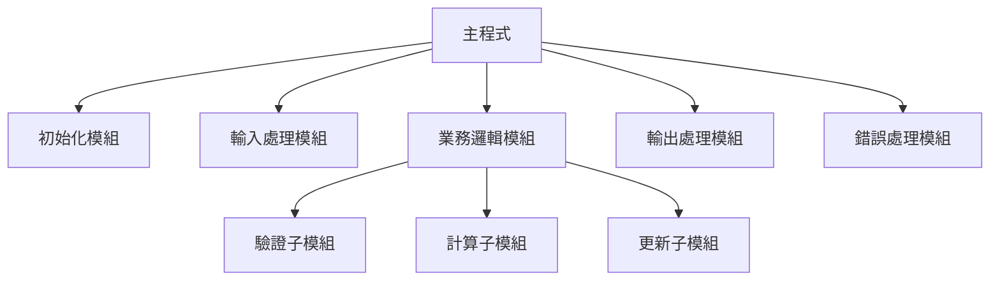

#### 7.5.2 避免魔術數字

```cobol
      * ❌ 不良：魔術數字
           IF WS-STATUS = '1'
               MOVE 100 TO WS-LIMIT
           END-IF
      
      * ✅ 良好：使用常數和 88 層級
       01  WS-STATUS                 PIC X(1).
           88  STATUS-ACTIVE         VALUE '1'.
           88  STATUS-INACTIVE       VALUE '2'.
           88  STATUS-SUSPENDED      VALUE '3'.
      
       01  K-DEFAULT-LIMIT           PIC 9(3) VALUE 100.
      
           IF STATUS-ACTIVE
               MOVE K-DEFAULT-LIMIT TO WS-LIMIT
           END-IF
```

#### 7.5.3 單一職責原則

```cobol
      * ❌ 不良：段落做太多事
       2000-PROCESS-EVERYTHING.
           READ INPUT-FILE ...
           MOVE ... TO ...
           COMPUTE ... 
           IF ...
               WRITE OUTPUT-FILE ...
           END-IF
           UPDATE DATABASE ...
           .
      
      * ✅ 良好：每個段落只做一件事
       2000-PROCESS-RECORD.
           PERFORM 2100-READ-INPUT
           PERFORM 2200-TRANSFORM-DATA
           PERFORM 2300-VALIDATE-DATA
           IF NOT ERROR-FOUND
               PERFORM 2400-WRITE-OUTPUT
               PERFORM 2500-UPDATE-DATABASE
           END-IF
           .
```

---

### 📝 第七章重點摘要

1. 遵循一致的程式結構與縮排規則
2. 使用有意義的前綴命名變數和段落
3. 撰寫有價值的註解，避免無意義的說明
4. 選擇適當的 USAGE 子句以提升效能
5. 設計模組化、低耦合的程式結構

### 🔖 練習題

1. 重構一段程式碼，使其符合本章的命名規範
2. 為一個複雜的業務邏輯撰寫適當的註解
3. 找出程式中的效能問題並提出改善方案

---

## 第八章：實戰範例

### 學習目標

完成本章後，您將能夠：
- 撰寫完整的報表程式
- 實作檔案更新程式
- 設計批次處理流程
- 了解 CICS 線上交易程式

---

### 8.1 簡單報表程式

```cobol
       IDENTIFICATION DIVISION.
       PROGRAM-ID. RPT-SALES.
      ******************************************************************
      * 程式名稱：RPT-SALES
      * 程式說明：銷售日報表
      * 輸入檔案：SALESIN - 銷售交易檔
      * 輸出檔案：SALESRPT - 銷售報表
      ******************************************************************
      
       ENVIRONMENT DIVISION.
       INPUT-OUTPUT SECTION.
       FILE-CONTROL.
           SELECT SALES-FILE ASSIGN TO SALESIN
               FILE STATUS IS WS-SALES-STATUS.
           SELECT REPORT-FILE ASSIGN TO SALESRPT
               FILE STATUS IS WS-REPORT-STATUS.
      
       DATA DIVISION.
       FILE SECTION.
      
       FD  SALES-FILE
           RECORD CONTAINS 80 CHARACTERS.
       01  SALES-RECORD.
           05  SR-DATE               PIC 9(8).
           05  SR-STORE-ID           PIC X(5).
           05  SR-PRODUCT-ID         PIC X(10).
           05  SR-PRODUCT-NAME       PIC X(30).
           05  SR-QUANTITY           PIC 9(5).
           05  SR-UNIT-PRICE         PIC 9(5)V99.
           05  SR-AMOUNT             PIC 9(7)V99.
           05  FILLER                PIC X(8).
      
       FD  REPORT-FILE
           RECORD CONTAINS 132 CHARACTERS.
       01  REPORT-LINE               PIC X(132).
      
       WORKING-STORAGE SECTION.
      *-----------------------------------------------------------------
      * 檔案狀態
      *-----------------------------------------------------------------
       01  WS-SALES-STATUS           PIC XX.
       01  WS-REPORT-STATUS          PIC XX.
       01  WS-EOF-FLAG               PIC X VALUE 'N'.
           88  END-OF-FILE           VALUE 'Y'.
      
      *-----------------------------------------------------------------
      * 計數器與累加器
      *-----------------------------------------------------------------
       01  WS-LINE-COUNT             PIC 9(3) VALUE 99.
       01  WS-PAGE-COUNT             PIC 9(3) VALUE 0.
       01  WS-RECORD-COUNT           PIC 9(7) VALUE 0.
       01  WS-TOTAL-AMOUNT           PIC S9(11)V99 VALUE 0.
       01  WS-STORE-AMOUNT           PIC S9(9)V99 VALUE 0.
       01  WS-PREV-STORE             PIC X(5) VALUE SPACES.
      
      *-----------------------------------------------------------------
      * 報表標題行
      *-----------------------------------------------------------------
       01  WS-HEADER-1.
           05  FILLER                PIC X(50) VALUE SPACES.
           05  FILLER                PIC X(30) VALUE 
               '銷售日報表'.
           05  FILLER                PIC X(42) VALUE SPACES.
           05  FILLER                PIC X(6) VALUE '第'.
           05  WS-H1-PAGE            PIC ZZ9.
           05  FILLER                PIC X(1) VALUE '頁'.
      
       01  WS-HEADER-2.
           05  FILLER                PIC X(50) VALUE SPACES.
           05  FILLER                PIC X(10) VALUE '報表日期：'.
           05  WS-H2-DATE            PIC 9999/99/99.
           05  FILLER                PIC X(62) VALUE SPACES.
      
       01  WS-HEADER-3.
           05  FILLER                PIC X(5) VALUE '門市'.
           05  FILLER                PIC X(3) VALUE SPACES.
           05  FILLER                PIC X(10) VALUE '產品代號'.
           05  FILLER                PIC X(2) VALUE SPACES.
           05  FILLER                PIC X(30) VALUE '產品名稱'.
           05  FILLER                PIC X(2) VALUE SPACES.
           05  FILLER                PIC X(8) VALUE '數量'.
           05  FILLER                PIC X(2) VALUE SPACES.
           05  FILLER                PIC X(10) VALUE '單價'.
           05  FILLER                PIC X(2) VALUE SPACES.
           05  FILLER                PIC X(15) VALUE '金額'.
           05  FILLER                PIC X(43) VALUE SPACES.
      
       01  WS-HEADER-4.
           05  FILLER                PIC X(132) VALUE ALL '-'.
      
      *-----------------------------------------------------------------
      * 明細行
      *-----------------------------------------------------------------
       01  WS-DETAIL-LINE.
           05  WS-DL-STORE           PIC X(5).
           05  FILLER                PIC X(3) VALUE SPACES.
           05  WS-DL-PRODUCT-ID      PIC X(10).
           05  FILLER                PIC X(2) VALUE SPACES.
           05  WS-DL-PRODUCT-NAME    PIC X(30).
           05  FILLER                PIC X(2) VALUE SPACES.
           05  WS-DL-QUANTITY        PIC ZZ,ZZ9.
           05  FILLER                PIC X(2) VALUE SPACES.
           05  WS-DL-UNIT-PRICE      PIC ZZ,ZZ9.99.
           05  FILLER                PIC X(2) VALUE SPACES.
           05  WS-DL-AMOUNT          PIC ZZZ,ZZZ,ZZ9.99.
           05  FILLER                PIC X(43) VALUE SPACES.
      
      *-----------------------------------------------------------------
      * 小計行
      *-----------------------------------------------------------------
       01  WS-SUBTOTAL-LINE.
           05  FILLER                PIC X(70) VALUE SPACES.
           05  FILLER                PIC X(15) VALUE '門市小計：'.
           05  WS-ST-AMOUNT          PIC ZZZ,ZZZ,ZZ9.99.
           05  FILLER                PIC X(32) VALUE SPACES.
      
      *-----------------------------------------------------------------
      * 總計行
      *-----------------------------------------------------------------
       01  WS-TOTAL-LINE.
           05  FILLER                PIC X(70) VALUE SPACES.
           05  FILLER                PIC X(15) VALUE '總    計：'.
           05  WS-TL-AMOUNT          PIC $$$,$$$,$$9.99.
           05  FILLER                PIC X(32) VALUE SPACES.
      
       01  WS-CURRENT-DATE           PIC 9(8).
      
       PROCEDURE DIVISION.
      *-----------------------------------------------------------------
      * 主程式
      *-----------------------------------------------------------------
       0000-MAIN-PROCESS.
           PERFORM 1000-INITIALIZE
           PERFORM 2000-PROCESS-RECORDS
               UNTIL END-OF-FILE
           PERFORM 9000-FINALIZE
           STOP RUN.
      
      *-----------------------------------------------------------------
      * 初始化
      *-----------------------------------------------------------------
       1000-INITIALIZE.
           OPEN INPUT SALES-FILE
                OUTPUT REPORT-FILE
           MOVE FUNCTION CURRENT-DATE(1:8) TO WS-CURRENT-DATE
           MOVE WS-CURRENT-DATE TO WS-H2-DATE
           PERFORM 2100-READ-SALES
           IF NOT END-OF-FILE
               MOVE SR-STORE-ID TO WS-PREV-STORE
           END-IF
           .
      
      *-----------------------------------------------------------------
      * 處理記錄
      *-----------------------------------------------------------------
       2000-PROCESS-RECORDS.
      * 門市異動時印小計
           IF SR-STORE-ID NOT = WS-PREV-STORE
               PERFORM 2500-PRINT-SUBTOTAL
               MOVE SR-STORE-ID TO WS-PREV-STORE
               MOVE ZERO TO WS-STORE-AMOUNT
           END-IF
      
           PERFORM 2200-CHECK-PAGE-BREAK
           PERFORM 2300-FORMAT-DETAIL
           PERFORM 2400-WRITE-DETAIL
      
           ADD SR-AMOUNT TO WS-STORE-AMOUNT
           ADD SR-AMOUNT TO WS-TOTAL-AMOUNT
           ADD 1 TO WS-RECORD-COUNT
      
           PERFORM 2100-READ-SALES
           .
      
      *-----------------------------------------------------------------
      * 讀取銷售記錄
      *-----------------------------------------------------------------
       2100-READ-SALES.
           READ SALES-FILE
               AT END SET END-OF-FILE TO TRUE
           END-READ
           .
      
      *-----------------------------------------------------------------
      * 檢查換頁
      *-----------------------------------------------------------------
       2200-CHECK-PAGE-BREAK.
           IF WS-LINE-COUNT > 55
               PERFORM 2210-PRINT-HEADERS
           END-IF
           .
      
       2210-PRINT-HEADERS.
           ADD 1 TO WS-PAGE-COUNT
           MOVE WS-PAGE-COUNT TO WS-H1-PAGE
           
           IF WS-PAGE-COUNT > 1
               WRITE REPORT-LINE FROM SPACES AFTER PAGE
           END-IF
           
           WRITE REPORT-LINE FROM WS-HEADER-1 AFTER 1
           WRITE REPORT-LINE FROM WS-HEADER-2 AFTER 1
           WRITE REPORT-LINE FROM SPACES AFTER 1
           WRITE REPORT-LINE FROM WS-HEADER-3 AFTER 1
           WRITE REPORT-LINE FROM WS-HEADER-4 AFTER 1
           MOVE 6 TO WS-LINE-COUNT
           .
      
      *-----------------------------------------------------------------
      * 格式化明細行
      *-----------------------------------------------------------------
       2300-FORMAT-DETAIL.
           INITIALIZE WS-DETAIL-LINE
           MOVE SR-STORE-ID TO WS-DL-STORE
           MOVE SR-PRODUCT-ID TO WS-DL-PRODUCT-ID
           MOVE SR-PRODUCT-NAME TO WS-DL-PRODUCT-NAME
           MOVE SR-QUANTITY TO WS-DL-QUANTITY
           MOVE SR-UNIT-PRICE TO WS-DL-UNIT-PRICE
           MOVE SR-AMOUNT TO WS-DL-AMOUNT
           .
      
      *-----------------------------------------------------------------
      * 寫入明細行
      *-----------------------------------------------------------------
       2400-WRITE-DETAIL.
           WRITE REPORT-LINE FROM WS-DETAIL-LINE AFTER 1
           ADD 1 TO WS-LINE-COUNT
           .
      
      *-----------------------------------------------------------------
      * 印小計
      *-----------------------------------------------------------------
       2500-PRINT-SUBTOTAL.
           MOVE WS-STORE-AMOUNT TO WS-ST-AMOUNT
           WRITE REPORT-LINE FROM WS-HEADER-4 AFTER 1
           WRITE REPORT-LINE FROM WS-SUBTOTAL-LINE AFTER 1
           WRITE REPORT-LINE FROM SPACES AFTER 1
           ADD 3 TO WS-LINE-COUNT
           .
      
      *-----------------------------------------------------------------
      * 結束處理
      *-----------------------------------------------------------------
       9000-FINALIZE.
      * 印最後一個門市的小計
           PERFORM 2500-PRINT-SUBTOTAL
           
      * 印總計
           MOVE WS-TOTAL-AMOUNT TO WS-TL-AMOUNT
           WRITE REPORT-LINE FROM WS-HEADER-4 AFTER 2
           WRITE REPORT-LINE FROM WS-TOTAL-LINE AFTER 1
      
           DISPLAY '處理完成，共 ' WS-RECORD-COUNT ' 筆記錄'
           
           CLOSE SALES-FILE REPORT-FILE
           .
```

---

### 8.2 檔案更新程式

```cobol
       IDENTIFICATION DIVISION.
       PROGRAM-ID. FILE-UPDATE.
      ******************************************************************
      * 程式說明：主檔更新程式（Match-Merge 技術）
      * 輸入檔案：MASTER - 客戶主檔（KSDS）
      *           TRANS  - 交易檔（循序檔，已依客戶 ID 排序）
      * 輸出檔案：MASTER - 更新後的主檔
      ******************************************************************
      
       ENVIRONMENT DIVISION.
       INPUT-OUTPUT SECTION.
       FILE-CONTROL.
           SELECT MASTER-FILE ASSIGN TO MASTER
               ORGANIZATION IS INDEXED
               ACCESS MODE IS DYNAMIC
               RECORD KEY IS MF-CUST-ID
               FILE STATUS IS WS-MASTER-STATUS.
           
           SELECT TRANS-FILE ASSIGN TO TRANS
               FILE STATUS IS WS-TRANS-STATUS.
      
       DATA DIVISION.
       FILE SECTION.
      
       FD  MASTER-FILE RECORD CONTAINS 200 CHARACTERS.
       01  MASTER-RECORD.
           05  MF-CUST-ID            PIC X(10).
           05  MF-CUST-NAME          PIC X(50).
           05  MF-BALANCE            PIC S9(9)V99 COMP-3.
           05  MF-LAST-TRANS-DATE    PIC 9(8).
           05  FILLER                PIC X(127).
      
       FD  TRANS-FILE RECORD CONTAINS 80 CHARACTERS.
       01  TRANS-RECORD.
           05  TR-CUST-ID            PIC X(10).
           05  TR-TRANS-TYPE         PIC X(1).
               88  TRANS-ADD         VALUE 'A'.
               88  TRANS-UPDATE      VALUE 'U'.
               88  TRANS-DELETE      VALUE 'D'.
           05  TR-CUST-NAME          PIC X(50).
           05  TR-AMOUNT             PIC S9(9)V99 COMP-3.
           05  FILLER                PIC X(12).
      
       WORKING-STORAGE SECTION.
       01  WS-MASTER-STATUS          PIC XX.
           88  MASTER-OK             VALUE '00'.
           88  MASTER-NOT-FOUND      VALUE '23'.
           88  MASTER-DUP-KEY        VALUE '22'.
      
       01  WS-TRANS-STATUS           PIC XX.
       01  WS-EOF-TRANS              PIC X VALUE 'N'.
           88  END-OF-TRANS          VALUE 'Y'.
      
       01  WS-COUNTERS.
           05  CT-ADDED              PIC 9(5) VALUE 0.
           05  CT-UPDATED            PIC 9(5) VALUE 0.
           05  CT-DELETED            PIC 9(5) VALUE 0.
           05  CT-ERRORS             PIC 9(5) VALUE 0.
      
       01  WS-CURRENT-DATE           PIC 9(8).
      
       PROCEDURE DIVISION.
       0000-MAIN-PROCESS.
           PERFORM 1000-INITIALIZE
           PERFORM 2000-PROCESS-TRANSACTIONS
               UNTIL END-OF-TRANS
           PERFORM 9000-FINALIZE
           STOP RUN.
      
       1000-INITIALIZE.
           OPEN I-O MASTER-FILE
                INPUT TRANS-FILE
           MOVE FUNCTION CURRENT-DATE(1:8) TO WS-CURRENT-DATE
           PERFORM 2100-READ-TRANS
           .
      
       2000-PROCESS-TRANSACTIONS.
           EVALUATE TRUE
               WHEN TRANS-ADD
                   PERFORM 3000-ADD-RECORD
               WHEN TRANS-UPDATE
                   PERFORM 4000-UPDATE-RECORD
               WHEN TRANS-DELETE
                   PERFORM 5000-DELETE-RECORD
               WHEN OTHER
                   ADD 1 TO CT-ERRORS
                   DISPLAY 'ERROR: 無效交易類型 ' TR-TRANS-TYPE
                           ' 客戶 ' TR-CUST-ID
           END-EVALUATE
           PERFORM 2100-READ-TRANS
           .
      
       2100-READ-TRANS.
           READ TRANS-FILE
               AT END SET END-OF-TRANS TO TRUE
           END-READ
           .
      
       3000-ADD-RECORD.
           INITIALIZE MASTER-RECORD
           MOVE TR-CUST-ID TO MF-CUST-ID
           MOVE TR-CUST-NAME TO MF-CUST-NAME
           MOVE TR-AMOUNT TO MF-BALANCE
           MOVE WS-CURRENT-DATE TO MF-LAST-TRANS-DATE
      
           WRITE MASTER-RECORD
               INVALID KEY
                   IF MASTER-DUP-KEY
                       ADD 1 TO CT-ERRORS
                       DISPLAY 'ERROR: 客戶已存在 ' TR-CUST-ID
                   END-IF
               NOT INVALID KEY
                   ADD 1 TO CT-ADDED
           END-WRITE
           .
      
       4000-UPDATE-RECORD.
           MOVE TR-CUST-ID TO MF-CUST-ID
           READ MASTER-FILE
               INVALID KEY
                   ADD 1 TO CT-ERRORS
                   DISPLAY 'ERROR: 客戶不存在 ' TR-CUST-ID
                   GO TO 4000-EXIT
           END-READ
      
           ADD TR-AMOUNT TO MF-BALANCE
           MOVE WS-CURRENT-DATE TO MF-LAST-TRANS-DATE
      
           REWRITE MASTER-RECORD
               INVALID KEY
                   ADD 1 TO CT-ERRORS
                   DISPLAY 'ERROR: 更新失敗 ' TR-CUST-ID
               NOT INVALID KEY
                   ADD 1 TO CT-UPDATED
           END-REWRITE
           .
       4000-EXIT. EXIT.
      
       5000-DELETE-RECORD.
           MOVE TR-CUST-ID TO MF-CUST-ID
           READ MASTER-FILE
               INVALID KEY
                   ADD 1 TO CT-ERRORS
                   DISPLAY 'ERROR: 客戶不存在 ' TR-CUST-ID
                   GO TO 5000-EXIT
           END-READ
      
           DELETE MASTER-FILE
               INVALID KEY
                   ADD 1 TO CT-ERRORS
               NOT INVALID KEY
                   ADD 1 TO CT-DELETED
           END-DELETE
           .
       5000-EXIT. EXIT.
      
       9000-FINALIZE.
           CLOSE MASTER-FILE TRANS-FILE
           DISPLAY '======== 處理結果 ========'
           DISPLAY '新增筆數：' CT-ADDED
           DISPLAY '更新筆數：' CT-UPDATED
           DISPLAY '刪除筆數：' CT-DELETED
           DISPLAY '錯誤筆數：' CT-ERRORS
           DISPLAY '=========================='
           .
```

---

### 8.3 批次處理程式

```cobol
       IDENTIFICATION DIVISION.
       PROGRAM-ID. BATCH-PROCESS.
      ******************************************************************
      * 程式說明：每日批次結算程式
      * 處理流程：
      *   1. 讀取當日交易
      *   2. 彙總各分行業績
      *   3. 更新分行主檔
      *   4. 產生結算報表
      ******************************************************************
      
       ENVIRONMENT DIVISION.
       INPUT-OUTPUT SECTION.
       FILE-CONTROL.
           SELECT TRANSACTION-FILE ASSIGN TO TRANSIN
               FILE STATUS IS WS-TRANS-STATUS.
           SELECT BRANCH-FILE ASSIGN TO BRANCHFL
               ORGANIZATION IS INDEXED
               ACCESS MODE IS RANDOM
               RECORD KEY IS BF-BRANCH-ID
               FILE STATUS IS WS-BRANCH-STATUS.
           SELECT SUMMARY-FILE ASSIGN TO SUMMOUT
               FILE STATUS IS WS-SUMMARY-STATUS.
      
       DATA DIVISION.
       FILE SECTION.
      
       FD  TRANSACTION-FILE RECORD CONTAINS 100 CHARACTERS.
       01  TRANS-RECORD.
           05  TR-TRANS-DATE         PIC 9(8).
           05  TR-BRANCH-ID          PIC X(5).
           05  TR-TRANS-TYPE         PIC X(2).
           05  TR-ACCOUNT-NO         PIC X(15).
           05  TR-AMOUNT             PIC S9(11)V99 COMP-3.
           05  FILLER                PIC X(63).
      
       FD  BRANCH-FILE RECORD CONTAINS 150 CHARACTERS.
       01  BRANCH-RECORD.
           05  BF-BRANCH-ID          PIC X(5).
           05  BF-BRANCH-NAME        PIC X(30).
           05  BF-DAILY-DEPOSIT      PIC S9(13)V99 COMP-3.
           05  BF-DAILY-WITHDRAW     PIC S9(13)V99 COMP-3.
           05  BF-DAILY-TRANS-COUNT  PIC 9(7) COMP-3.
           05  BF-LAST-UPDATE        PIC 9(8).
           05  FILLER                PIC X(89).
      
       FD  SUMMARY-FILE RECORD CONTAINS 80 CHARACTERS.
       01  SUMMARY-RECORD            PIC X(80).
      
       WORKING-STORAGE SECTION.
      *-----------------------------------------------------------------
      * 檔案狀態
      *-----------------------------------------------------------------
       01  WS-TRANS-STATUS           PIC XX.
       01  WS-BRANCH-STATUS          PIC XX.
           88  BRANCH-OK             VALUE '00'.
           88  BRANCH-NOT-FOUND      VALUE '23'.
       01  WS-SUMMARY-STATUS         PIC XX.
      
       01  WS-EOF-FLAG               PIC X VALUE 'N'.
           88  END-OF-FILE           VALUE 'Y'.
      
      *-----------------------------------------------------------------
      * 分行彙總表（記憶體中累計）
      *-----------------------------------------------------------------
       01  WS-BRANCH-TABLE.
           05  WS-BRANCH-ENTRY OCCURS 100 TIMES
               INDEXED BY WS-BRANCH-IDX.
               10  WS-BT-BRANCH-ID   PIC X(5).
               10  WS-BT-DEPOSIT     PIC S9(13)V99 COMP-3.
               10  WS-BT-WITHDRAW    PIC S9(13)V99 COMP-3.
               10  WS-BT-COUNT       PIC 9(7) COMP-3.
      
       01  WS-BRANCH-COUNT           PIC 9(3) VALUE 0.
       01  WS-FOUND-FLAG             PIC X VALUE 'N'.
           88  BRANCH-FOUND          VALUE 'Y'.
      
       01  WS-CURRENT-DATE           PIC 9(8).
       01  WS-I                      PIC 9(3).
      
       PROCEDURE DIVISION.
       0000-MAIN-PROCESS.
           PERFORM 1000-INITIALIZE
           PERFORM 2000-ACCUMULATE-TRANSACTIONS
               UNTIL END-OF-FILE
           PERFORM 3000-UPDATE-BRANCH-FILE
           PERFORM 4000-GENERATE-SUMMARY
           PERFORM 9000-FINALIZE
           STOP RUN.
      
       1000-INITIALIZE.
           OPEN INPUT TRANSACTION-FILE
                I-O BRANCH-FILE
                OUTPUT SUMMARY-FILE
      
           MOVE FUNCTION CURRENT-DATE(1:8) TO WS-CURRENT-DATE
           INITIALIZE WS-BRANCH-TABLE
           PERFORM 1100-READ-TRANS
           .
      
       1100-READ-TRANS.
           READ TRANSACTION-FILE
               AT END SET END-OF-FILE TO TRUE
           END-READ
           .
      
      *-----------------------------------------------------------------
      * 累計交易到記憶體表格
      *-----------------------------------------------------------------
       2000-ACCUMULATE-TRANSACTIONS.
           PERFORM 2100-FIND-OR-ADD-BRANCH
           
           EVALUATE TR-TRANS-TYPE
               WHEN 'DP'    *> Deposit
                   ADD TR-AMOUNT TO WS-BT-DEPOSIT(WS-BRANCH-IDX)
               WHEN 'WD'    *> Withdraw
                   ADD TR-AMOUNT TO WS-BT-WITHDRAW(WS-BRANCH-IDX)
           END-EVALUATE
           ADD 1 TO WS-BT-COUNT(WS-BRANCH-IDX)
      
           PERFORM 1100-READ-TRANS
           .
      
       2100-FIND-OR-ADD-BRANCH.
           SET WS-BRANCH-IDX TO 1
           MOVE 'N' TO WS-FOUND-FLAG
      
           PERFORM VARYING WS-I FROM 1 BY 1
               UNTIL WS-I > WS-BRANCH-COUNT OR BRANCH-FOUND
               IF WS-BT-BRANCH-ID(WS-I) = TR-BRANCH-ID
                   SET WS-BRANCH-IDX TO WS-I
                   SET BRANCH-FOUND TO TRUE
               END-IF
           END-PERFORM
      
           IF NOT BRANCH-FOUND
               ADD 1 TO WS-BRANCH-COUNT
               SET WS-BRANCH-IDX TO WS-BRANCH-COUNT
               MOVE TR-BRANCH-ID TO WS-BT-BRANCH-ID(WS-BRANCH-IDX)
               MOVE ZERO TO WS-BT-DEPOSIT(WS-BRANCH-IDX)
               MOVE ZERO TO WS-BT-WITHDRAW(WS-BRANCH-IDX)
               MOVE ZERO TO WS-BT-COUNT(WS-BRANCH-IDX)
           END-IF
           .
      
      *-----------------------------------------------------------------
      * 更新分行主檔
      *-----------------------------------------------------------------
       3000-UPDATE-BRANCH-FILE.
           PERFORM VARYING WS-I FROM 1 BY 1
               UNTIL WS-I > WS-BRANCH-COUNT
               MOVE WS-BT-BRANCH-ID(WS-I) TO BF-BRANCH-ID
               READ BRANCH-FILE
                   INVALID KEY
                       DISPLAY 'WARN: 分行不存在 ' BF-BRANCH-ID
                       GO TO 3000-CONTINUE
               END-READ
      
               ADD WS-BT-DEPOSIT(WS-I) TO BF-DAILY-DEPOSIT
               ADD WS-BT-WITHDRAW(WS-I) TO BF-DAILY-WITHDRAW
               ADD WS-BT-COUNT(WS-I) TO BF-DAILY-TRANS-COUNT
               MOVE WS-CURRENT-DATE TO BF-LAST-UPDATE
      
               REWRITE BRANCH-RECORD
           END-PERFORM
           .
       3000-CONTINUE. EXIT.
      
      *-----------------------------------------------------------------
      * 產生摘要報表
      *-----------------------------------------------------------------
       4000-GENERATE-SUMMARY.
           MOVE '========== 每日分行彙總 ==========' 
               TO SUMMARY-RECORD
           WRITE SUMMARY-RECORD
      
           PERFORM VARYING WS-I FROM 1 BY 1
               UNTIL WS-I > WS-BRANCH-COUNT
               STRING '分行: ' DELIMITED SIZE
                      WS-BT-BRANCH-ID(WS-I) DELIMITED SIZE
                      ' 存款: ' DELIMITED SIZE
                      WS-BT-DEPOSIT(WS-I) DELIMITED SIZE
                      INTO SUMMARY-RECORD
               WRITE SUMMARY-RECORD
           END-PERFORM
           .
      
       9000-FINALIZE.
           CLOSE TRANSACTION-FILE BRANCH-FILE SUMMARY-FILE
           DISPLAY '批次處理完成，處理 ' WS-BRANCH-COUNT ' 個分行'
           .
```

---

### 8.4 線上交易程式（CICS）

```cobol
       IDENTIFICATION DIVISION.
       PROGRAM-ID. INQCUST.
      ******************************************************************
      * 程式說明：CICS 客戶查詢交易
      * 交易代碼：CINQ
      * 功    能：依客戶 ID 查詢客戶資料
      ******************************************************************
      
       DATA DIVISION.
       WORKING-STORAGE SECTION.
      
      * CICS 定義
           COPY DFHAID.
           COPY DFHBMSCA.
      
       01  WS-COMMAREA.
           05  WS-COMM-FLAG          PIC X(1).
           05  WS-COMM-CUST-ID       PIC X(10).
      
       01  WS-RESPONSE               PIC S9(8) COMP.
       01  WS-RESP2                  PIC S9(8) COMP.
      
      * 畫面欄位
       01  WS-MAP-DATA.
           05  WS-MSG                PIC X(50).
           05  WS-CUST-ID-IN         PIC X(10).
           05  WS-CUST-NAME          PIC X(50).
           05  WS-CUST-ADDR          PIC X(100).
           05  WS-CUST-BALANCE       PIC Z,ZZZ,ZZ9.99-.
      
      * 檔案記錄
       01  WS-CUSTOMER-REC.
           05  WS-CR-ID              PIC X(10).
           05  WS-CR-NAME            PIC X(50).
           05  WS-CR-ADDR            PIC X(100).
           05  WS-CR-BALANCE         PIC S9(9)V99 COMP-3.
           05  FILLER                PIC X(33).
      
       LINKAGE SECTION.
       01  DFHCOMMAREA               PIC X(11).
      
       PROCEDURE DIVISION.
      *-----------------------------------------------------------------
      * 主程式邏輯
      *-----------------------------------------------------------------
       0000-MAIN-PROCESS.
           EVALUATE TRUE
               WHEN EIBCALEN = 0
                   PERFORM 1000-FIRST-TIME
               WHEN EIBAID = DFHENTER
                   PERFORM 2000-PROCESS-ENTER
               WHEN EIBAID = DFHCLEAR
                   PERFORM 1000-FIRST-TIME
               WHEN EIBAID = DFHPF3
                   PERFORM 9000-END-TRANSACTION
               WHEN OTHER
                   MOVE 'INVALID KEY - USE ENTER OR PF3' TO WS-MSG
                   PERFORM 8000-SEND-MAP-DATAONLY
           END-EVALUATE
      
           EXEC CICS RETURN
               TRANSID('CINQ')
               COMMAREA(WS-COMMAREA)
               LENGTH(LENGTH OF WS-COMMAREA)
           END-EXEC.
      
      *-----------------------------------------------------------------
      * 首次進入 - 顯示空白畫面
      *-----------------------------------------------------------------
       1000-FIRST-TIME.
           INITIALIZE WS-MAP-DATA
           MOVE 'ENTER CUSTOMER ID AND PRESS ENTER' TO WS-MSG
      
           EXEC CICS SEND MAP('CUSTMAP')
                          MAPSET('CUSTSET')
                          ERASE
                          CURSOR
               RESP(WS-RESPONSE)
           END-EXEC
           .
      
      *-----------------------------------------------------------------
      * 處理 ENTER 鍵 - 查詢客戶
      *-----------------------------------------------------------------
       2000-PROCESS-ENTER.
           EXEC CICS RECEIVE MAP('CUSTMAP')
                             MAPSET('CUSTSET')
               RESP(WS-RESPONSE)
           END-EXEC
      
           IF WS-CUST-ID-IN = SPACES OR LOW-VALUES
               MOVE 'PLEASE ENTER CUSTOMER ID' TO WS-MSG
               PERFORM 8000-SEND-MAP-DATAONLY
               GO TO 2000-EXIT
           END-IF
      
           PERFORM 2100-READ-CUSTOMER
           .
       2000-EXIT. EXIT.
      
      *-----------------------------------------------------------------
      * 讀取客戶資料
      *-----------------------------------------------------------------
       2100-READ-CUSTOMER.
           EXEC CICS READ FILE('CUSTFILE')
                          INTO(WS-CUSTOMER-REC)
                          RIDFLD(WS-CUST-ID-IN)
               RESP(WS-RESPONSE)
               RESP2(WS-RESP2)
           END-EXEC
      
           EVALUATE WS-RESPONSE
               WHEN DFHRESP(NORMAL)
                   PERFORM 2200-DISPLAY-CUSTOMER
               WHEN DFHRESP(NOTFND)
                   MOVE 'CUSTOMER NOT FOUND' TO WS-MSG
                   PERFORM 8000-SEND-MAP-DATAONLY
               WHEN OTHER
                   STRING 'FILE ERROR: RESP=' DELIMITED SIZE
                          WS-RESPONSE DELIMITED SIZE
                          INTO WS-MSG
                   PERFORM 8000-SEND-MAP-DATAONLY
           END-EVALUATE
           .
      
      *-----------------------------------------------------------------
      * 顯示客戶資料
      *-----------------------------------------------------------------
       2200-DISPLAY-CUSTOMER.
           MOVE WS-CR-NAME TO WS-CUST-NAME
           MOVE WS-CR-ADDR TO WS-CUST-ADDR
           MOVE WS-CR-BALANCE TO WS-CUST-BALANCE
           MOVE 'CUSTOMER FOUND' TO WS-MSG
           PERFORM 8000-SEND-MAP-DATAONLY
           .
      
      *-----------------------------------------------------------------
      * 只送資料（不清除畫面）
      *-----------------------------------------------------------------
       8000-SEND-MAP-DATAONLY.
           EXEC CICS SEND MAP('CUSTMAP')
                          MAPSET('CUSTSET')
                          DATAONLY
                          CURSOR
               RESP(WS-RESPONSE)
           END-EXEC
           .
      
      *-----------------------------------------------------------------
      * 結束交易
      *-----------------------------------------------------------------
       9000-END-TRANSACTION.
           EXEC CICS SEND TEXT
                     FROM('TRANSACTION ENDED')
                     ERASE
           END-EXEC
           EXEC CICS RETURN END-EXEC.
```

---

### 📝 第八章重點摘要

1. 報表程式需要處理換頁、標題行、明細行、小計、總計
2. 檔案更新程式使用 Match-Merge 技術處理異動
3. 批次處理程式通常先累計到記憶體，再批次更新檔案
4. CICS 程式使用 COMMAREA 在交易間傳遞資料

---

## 第九章：故障排除

### 學習目標

完成本章後，您將能夠：
- 識別常見的編譯錯誤並修正
- 分析執行時期錯誤（ABEND）
- 使用除錯工具追蹤問題

---

### 9.1 常見編譯錯誤

| 錯誤代碼 | 說明 | 解決方式 |
|----------|------|----------|
| `IGYDS1089` | PICTURE 語法錯誤 | 檢查 PIC 子句格式 |
| `IGYPS2121` | 未定義的資料名稱 | 檢查變數是否宣告 |
| `IGYPS2074` | 期望句點 | 加上遺漏的句點 |
| `IGYPS2051` | 期望 END-IF | 加上 END-IF |
| `IGYDS1050` | LEVEL 編號錯誤 | 檢查層級編號順序 |
| `IGYPS0119` | COPY 成員找不到 | 檢查 SYSLIB 設定 |

### 9.2 執行時期錯誤

| ABEND | 說明 | 檢查項目 |
|-------|------|----------|
| `S0C7` | 資料例外 | 數值欄位是否含非數字 |
| `S0C4` | 保護例外 | 陣列索引是否超出範圍 |
| `S0CB` | 除以零 | DIVIDE/COMPUTE 檢查 |
| `S806` | 找不到模組 | STEPLIB 是否正確 |
| `S913` | 權限不足 | 資料集權限檢查 |

### 9.3 除錯技巧與工具

#### 9.3.1 DISPLAY 除錯法

```cobol
      * 加入除錯顯示
       DEBUG-DISPLAY.
           DISPLAY '>>> 進入段落 2000'
           DISPLAY '>>> WS-INPUT = [' WS-INPUT ']'
           DISPLAY '>>> WS-AMOUNT = ' WS-AMOUNT
           .
      
      * 數值驗證
           IF WS-AMOUNT IS NOT NUMERIC
               DISPLAY 'ERROR: 非數值 ' WS-AMOUNT
               INITIALIZE WS-AMOUNT
           END-IF
```

#### 9.3.2 使用 DEBUG 行

在欄位 7 放置 `D` 可以標記為除錯行，只有在啟用 DEBUG 模式時才會執行：

```cobol
      * 在欄位 7 放 D 表示除錯行
      D    DISPLAY 'DEBUG: 進入 PROCESS-CUSTOMER'
      D    DISPLAY 'DEBUG: CUSTOMER-ID = ' WS-CUST-ID
      D    DISPLAY 'DEBUG: BALANCE = ' WS-BALANCE
```

編譯時加上 `SOURCE,DEBUG` 參數即可啟用。

#### 9.3.3 IBM Debug Tool

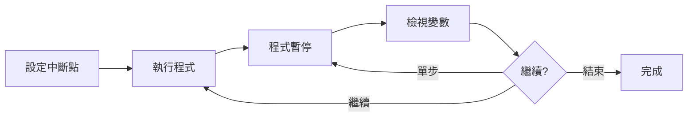

**常用 Debug Tool 指令：**

| 指令 | 功能 |
|------|------|
| `AT` | 設定中斷點 |
| `GO` | 繼續執行 |
| `STEP` | 單步執行 |
| `LIST` | 顯示變數值 |
| `SET` | 修改變數值 |
| `QUIT` | 結束除錯 |

#### 9.3.4 Fault Analyzer

當程式發生 ABEND 時，Fault Analyzer 可以幫助分析原因：

1. 查看 ABEND 發生的程式位置
2. 檢視當時的變數值
3. 追蹤呼叫堆疊
4. 分析記憶體內容

---

### 📝 第九章重點摘要

1. 熟悉常見的編譯錯誤碼（IGY 系列）可加速問題定位
2. ABEND 代碼（如 S0C7、S0C4）是執行時期錯誤的重要線索
3. DISPLAY 是最簡單但有效的除錯方法
4. Debug Tool 提供互動式除錯能力
5. Fault Analyzer 可協助分析 ABEND dump

### 🔖 練習題

1. 撰寫一個故意引發 S0C7 的程式，並使用 DISPLAY 找出問題
2. 設計一個完整的錯誤處理框架，包含錯誤代碼和訊息
3. 練習使用 Debug Tool 追蹤程式執行流程

---

## 附錄

### 附錄 A：COBOL 保留字清單

| 類別 | 保留字 |
|------|--------|
| **Division** | IDENTIFICATION, ENVIRONMENT, DATA, PROCEDURE |
| **Section** | CONFIGURATION, INPUT-OUTPUT, FILE, WORKING-STORAGE |
| **動詞** | ACCEPT, ADD, CALL, CLOSE, COMPUTE, DELETE, DISPLAY |
| **動詞** | DIVIDE, EVALUATE, GO, IF, INITIALIZE, INSPECT |
| **動詞** | MOVE, MULTIPLY, OPEN, PERFORM, READ, REWRITE |
| **動詞** | SEARCH, SET, START, STOP, STRING, SUBTRACT |
| **動詞** | UNSTRING, WRITE |
| **子句** | PIC/PICTURE, USAGE, VALUE, OCCURS, REDEFINES |
| **條件** | AT END, INVALID KEY, ON SIZE ERROR |

### 附錄 B：常用 JCL 範例

```jcl
//* 編譯 COBOL 程式
//COMPILE  EXEC IGYWCL
//COBOL.SYSIN DD DSN=source.lib(pgm),DISP=SHR
//LKED.SYSLMOD DD DSN=load.lib(pgm),DISP=SHR

//* 執行程式
//RUN      EXEC PGM=MYPGM
//STEPLIB  DD DSN=load.lib,DISP=SHR
//INPUT    DD DSN=input.file,DISP=SHR
//OUTPUT   DD DSN=output.file,DISP=(NEW,CATLG,DELETE),
//            SPACE=(CYL,(10,5)),DCB=(RECFM=FB,LRECL=80)
```

### 附錄 C：錯誤訊息對照表

| 訊息代碼 | 意義 |
|----------|------|
| `IGY` | COBOL 編譯器訊息 |
| `IEW` | 連結器訊息 |
| `IEC` | 資料管理訊息 |
| `DSN` | DB2 訊息 |
| `DFH` | CICS 訊息 |

### 附錄 D：學習資源與參考文獻

1. **IBM Enterprise COBOL for z/OS Documentation**
2. **GnuCOBOL Programmer's Guide**
3. **VS Code COBOL Extension Pack**
4. **Zowe Documentation**

---

## 檢查清單

### ✅ COBOL 開發檢查清單

#### 程式撰寫前
- [ ] 確認需求文件與規格
- [ ] 確認輸入/輸出檔案格式
- [ ] 設計資料結構與流程圖
- [ ] 確認 COPYBOOK 是否存在

#### 程式撰寫中
- [ ] 程式標頭資訊完整
- [ ] 使用一致的命名規範
- [ ] 每個段落有適當註解
- [ ] 使用 END 終止詞
- [ ] 處理所有檔案狀態碼
- [ ] 處理 SQLCODE（DB2 程式）
- [ ] 處理 RESP（CICS 程式）

#### 程式撰寫後
- [ ] 編譯無錯誤、無嚴重警告
- [ ] 單元測試通過
- [ ] 程式碼已經 Code Review
- [ ] 文件已更新

#### JCL 檢查
- [ ] JOB 卡資訊正確
- [ ] STEPLIB 包含必要程式庫
- [ ] DD 語句 DSN 名稱正確
- [ ] DCB 參數與實際檔案一致
- [ ] REGION 大小足夠
- [ ] TIME 限制合理

#### 上線前
- [ ] 整合測試通過
- [ ] UAT 測試通過
- [ ] 程式碼已提交版本控制
- [ ] 部署文件準備完成
- [ ] 回滾計畫已準備

---

> **文件版本**：2.0  
> **最後更新**：2026 年 2 月 3 日  
> **維護團隊**：開發團隊

