+++
date = '2026-02-03T21:20:15+08:00'
draft = false
title = 'Cobol教學手冊'
tags = ['教學', '程式語言']
categories = ['教學']
+++

# COBOL 教學手冊

> **版本**：1.0  
> **最後更新**：2026 年 2 月  
> **適用對象**：新進工程師、有現代語言背景但未接觸主機系統的工程師  
> **定位**：企業內部實務教學手冊

---

## 目錄

- [第一章：COBOL 與主機系統概覽](#第一章cobol-與主機系統概覽)
  - [1.1 為什麼 COBOL 至今仍被大量使用](#11-為什麼-cobol-至今仍被大量使用)
  - [1.2 COBOL 在大型主機系統中的角色](#12-cobol-在大型主機系統中的角色)
  - [1.3 Batch 系統 vs Online 系統（CICS）](#13-batch-系統-vs-online-系統cics)
  - [1.4 COBOL 與資料庫（DB2）/ 檔案系統的關係](#14-cobol-與資料庫db2-檔案系統的關係)
- [第二章：COBOL 程式基本結構](#第二章cobol-程式基本結構)
  - [2.1 COBOL Program Structure 總覽](#21-cobol-program-structure-總覽)
  - [2.2 IDENTIFICATION DIVISION](#22-identification-division)
  - [2.3 ENVIRONMENT DIVISION](#23-environment-division)
  - [2.4 DATA DIVISION](#24-data-division)
  - [2.5 PROCEDURE DIVISION](#25-procedure-division)
  - [2.6 基本程式範例（可編譯）](#26-基本程式範例可編譯)
- [第三章：資料型態與資料結構](#第三章資料型態與資料結構)
  - [3.1 PIC 語法完整說明](#31-pic-語法完整說明)
  - [3.2 數值型、文字型、符號位（SIGN）](#32-數值型文字型符號位sign)
  - [3.3 REDEFINES 與 OCCURS](#33-redefines-與-occurs)
  - [3.4 Working-Storage vs Linkage Section](#34-working-storage-vs-linkage-section)
  - [3.5 常見錯誤與陷阱](#35-常見錯誤與陷阱)
  - [第三章小結](#第三章小結)
- [第四章：檔案處理（主機實務重點）](#第四章檔案處理主機實務重點)
  - [4.1 Sequential File 基本操作](#41-sequential-file-基本操作)
  - [4.2 READ / WRITE / OPEN / CLOSE](#42-read--write--open--close)
  - [4.3 EOF 控制寫法](#43-eof-控制寫法)
  - [4.4 檔案 Layout（Record Layout）設計原則](#44-檔案-layoutrecord-layout設計原則)
  - [4.5 實務範例（Batch 檔案讀寫）](#45-實務範例batch-檔案讀寫)
- [第五章：批次程式（Batch Job）設計](#第五章批次程式batch-job設計)
  - [5.1 Batch 程式生命週期](#51-batch-程式生命週期)
  - [5.2 Return Code（RC）設計原則](#52-return-coderc設計原則)
  - [5.3 程式錯誤處理與異常控制](#53-程式錯誤處理與異常控制)
  - [5.4 批次程式撰寫範例](#54-批次程式撰寫範例)
  - [5.5 可維運的 Batch 設計 Best Practice](#55-可維運的-batch-設計-best-practice)
- [第六章：與資料庫（DB2）互動](#第六章與資料庫db2互動)
  - [6.1 Embedded SQL 基本概念](#61-embedded-sql-基本概念)
  - [6.2 SELECT / INSERT / UPDATE / DELETE 範例](#62-select--insert--update--delete-範例)
  - [6.3 SQLCODE / SQLSTATE 處理方式](#63-sqlcode--sqlstate-處理方式)
  - [6.4 資料一致性的觀念（Commit / Rollback）](#64-資料一致性的觀念commit--rollback)
- [第七章：COBOL 程式設計規範](#第七章cobol-程式設計規範)
  - [7.1 命名規則（Program / Variable / Paragraph）](#71-命名規則program--variable--paragraph)
  - [7.2 排版與可讀性原則](#72-排版與可讀性原則)
  - [7.3 註解撰寫建議](#73-註解撰寫建議)
  - [7.4 避免「維護地獄」的寫法](#74-避免維護地獄的寫法)
  - [7.5 常見 Anti-pattern](#75-常見-anti-pattern)
- [第八章：舊系統維護與現代化觀點](#第八章舊系統維護與現代化觀點)
  - [8.1 如何「讀懂」舊 COBOL 程式](#81-如何讀懂舊-cobol-程式)
  - [8.2 如何安全修改老程式](#82-如何安全修改老程式)
  - [8.3 與現代系統整合概念](#83-與現代系統整合概念)
  - [8.4 COBOL 在未來系統中的定位](#84-cobol-在未來系統中的定位)
- [第九章：新手常見問題（FAQ）](#第九章新手常見問題faq)
  - [Q1：為什麼 COBOL 看起來這麼冗長？](#q1為什麼-cobol-看起來這麼冗長)
  - [Q2：為什麼不把 COBOL 改成 Java？](#q2為什麼不把-cobol-改成-java)
  - [Q3：初學者最容易踩的雷？](#q3初學者最容易踩的雷)
  - [Q4：如何有效學習與除錯 COBOL？](#q4如何有效學習與除錯-cobol)
  - [Q5：主機環境和 PC 開發有什麼不同？](#q5主機環境和-pc-開發有什麼不同)
  - [Q6：COBOL 還有未來嗎？](#q6cobol-還有未來嗎)
- [附錄 A：COBOL 開發檢查清單（Checklist）](#附錄-acobol-開發檢查清單checklist)
  - [程式開發前檢查](#程式開發前檢查)
  - [程式撰寫檢查](#程式撰寫檢查)
  - [檔案處理檢查](#檔案處理檢查)
  - [資料庫處理檢查](#資料庫處理檢查)
  - [錯誤處理檢查](#錯誤處理檢查)
  - [測試前檢查](#測試前檢查)
  - [上線前檢查](#上線前檢查)
- [附錄 B：常用 COBOL 關鍵字速查表](#附錄-b常用-cobol-關鍵字速查表)
  - [資料定義關鍵字](#資料定義關鍵字)
  - [流程控制關鍵字](#流程控制關鍵字)
  - [資料操作關鍵字](#資料操作關鍵字)
  - [檔案操作關鍵字](#檔案操作關鍵字)
- [附錄 C：SQLCODE 常見錯誤碼對照表](#附錄-csqlcode-常見錯誤碼對照表)
  - [成功與警告代碼](#成功與警告代碼)
  - [常見錯誤代碼](#常見錯誤代碼)
  - [錯誤處理範例](#錯誤處理範例)
- [結語](#結語)

---

## 第一章：COBOL 與主機系統概覽

### 1.1 為什麼 COBOL 至今仍被大量使用

#### COBOL 的歷史地位

COBOL（**CO**mmon **B**usiness-**O**riented **L**anguage）誕生於 1959 年，是專為商業應用設計的程式語言。至今已超過 65 年歷史，但仍在全球金融、保險、政府機構中扮演核心角色。

#### 為什麼不淘汰 COBOL？

| 原因 | 說明 |
|------|------|
| **穩定性** | 經過數十年驗證，穩定度極高，核心系統不輕易更動 |
| **效能** | 主機系統上的 COBOL 程式執行效率極高 |
| **資料量** | 全球每日超過 3 兆美元的金融交易由 COBOL 處理 |
| **轉換成本** | 改寫成本極高，風險大，可能影響核心業務 |
| **人才斷層** | 雖然新人少，但系統仍需維護，反而成為稀缺技能 |

#### 哪些產業仍大量使用 COBOL？

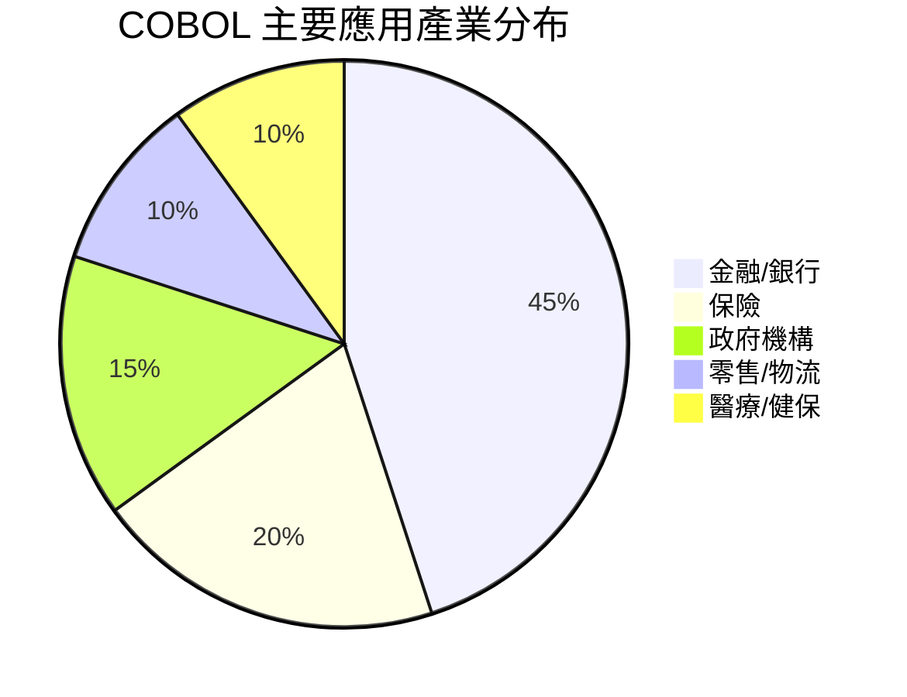

> **💡 實務提醒**  
> 在台灣，幾乎所有銀行的核心帳務系統（Core Banking System）都是 COBOL 撰寫。  
> 即使前端已現代化，後端批次處理仍以 COBOL 為主。

---

### 1.2 COBOL 在大型主機系統中的角色

#### 主機系統架構概覽

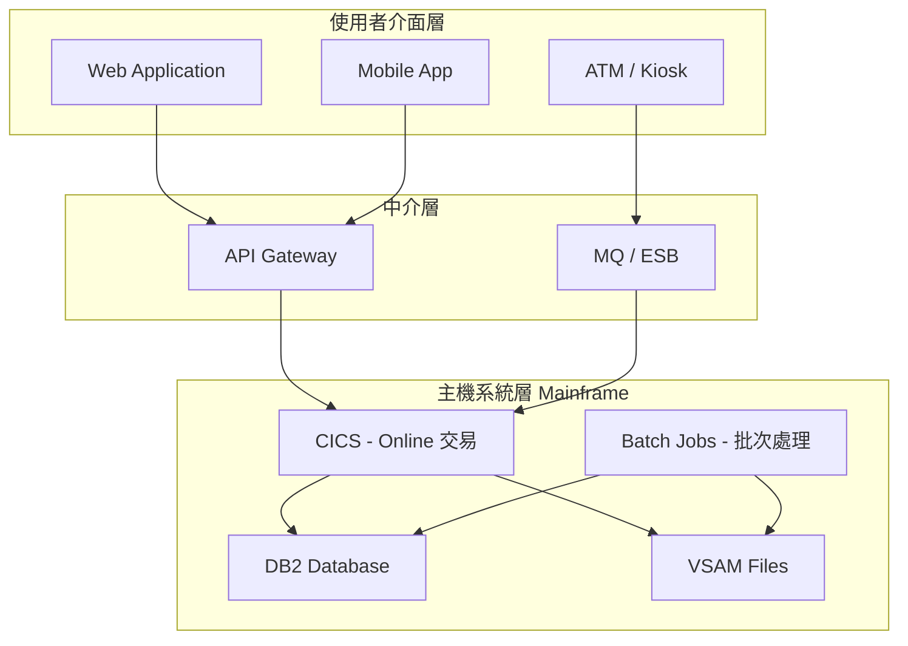

#### COBOL 在主機中的角色定位

| 角色 | 說明 |
|------|------|
| **批次處理核心** | 日結、月結、利息計算、報表產生等 |
| **線上交易處理** | 透過 CICS 處理即時查詢與交易 |
| **資料轉換** | 檔案格式轉換、資料清洗 |
| **介面程式** | 與外部系統的資料交換 |

---

### 1.3 Batch 系統 vs Online 系統（CICS）

#### 什麼是 Batch（批次）系統？

批次系統是指 **預先排程、無人工介入、大量處理資料** 的程式。

**特性**：
- 通常在營業時間外執行（夜間批次）
- 處理大量資料（數百萬筆記錄）
- 依序執行，有明確的開始與結束
- 失敗時需要重跑機制

**常見批次作業**：
- 日終結帳（End of Day）
- 利息計算
- 對帳檔產生
- 報表產製

#### 什麼是 Online（CICS）系統？

CICS（Customer Information Control System）是 IBM 主機上的 **交易處理監控器**，提供即時線上交易處理能力。

**特性**：
- 即時回應（Response Time 要求嚴格）
- 處理單筆或少量資料
- 24/7 運行
- 需要高可用性

**常見線上交易**：
- 帳戶餘額查詢
- 轉帳交易
- 客戶資料維護

#### Batch vs Online 比較表

| 比較項目 | Batch | Online (CICS) |
|----------|-------|---------------|
| 執行時機 | 排程執行 | 即時觸發 |
| 資料量 | 大量（百萬筆以上） | 單筆或少量 |
| 回應時間 | 可接受較長時間 | 必須快速（秒級） |
| 使用者介入 | 無 | 有（操作員或系統觸發） |
| 錯誤處理 | 可中斷重跑 | 必須即時處理 |
| 程式結構 | 相對單純 | 需處理多工、併發 |

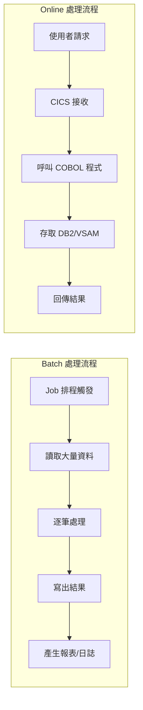

> **⚠️ 注意事項**  
> 新手常見誤解：以為 Batch 程式比較簡單。  
> 實際上，Batch 程式的 **錯誤處理、重跑機制、效能調校** 都是極大的挑戰。

---

### 1.4 COBOL 與資料庫（DB2）/ 檔案系統的關係

#### 主機系統的資料存取方式

在主機環境中，COBOL 程式主要透過兩種方式存取資料：

1. **檔案系統（File System）**
   - Sequential File（循序檔）
   - VSAM（Virtual Storage Access Method）
   - QSAM（Queued Sequential Access Method）

2. **關聯式資料庫**
   - DB2（IBM 主機資料庫）
   - IMS DB（較舊的階層式資料庫）

#### 檔案系統 vs DB2 比較

| 特性 | 檔案系統 | DB2 |
|------|----------|-----|
| 資料結構 | 固定格式記錄 | 表格（Table） |
| 存取方式 | 循序/索引 | SQL 查詢 |
| 交易控制 | 程式自行處理 | 資料庫提供 |
| 適用場景 | 大量批次處理 | 複雜查詢、線上交易 |
| 效能 | 批次處理效能佳 | 靈活但需調校 |

#### 資料存取架構圖

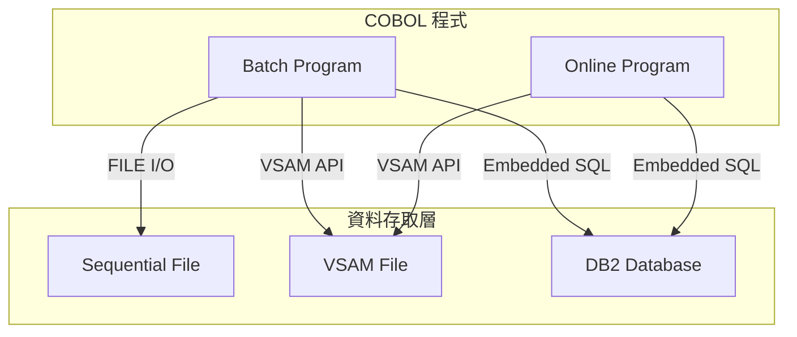

> **💡 實務建議**  
> - **大量資料處理**：優先考慮檔案系統，效能較佳
> - **複雜查詢需求**：使用 DB2
> - **混合使用**：批次程式讀檔處理後寫入 DB2 是常見模式

---

## 第二章：COBOL 程式基本結構

### 2.1 COBOL Program Structure 總覽

COBOL 程式由四個 **DIVISION（區段）** 組成，每個 DIVISION 有其特定用途：

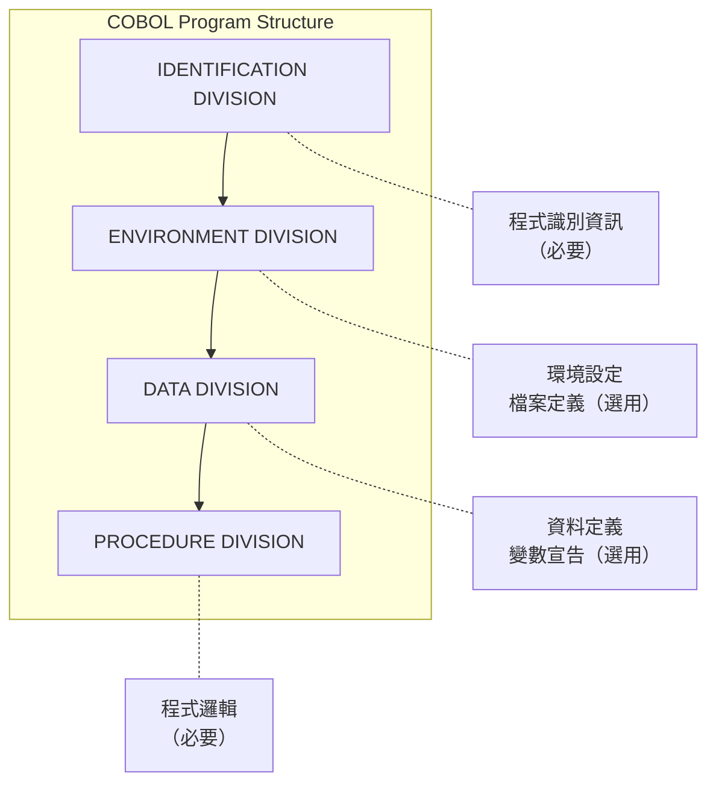

#### 四大 DIVISION 概覽

| DIVISION | 用途 | 必要性 |
|----------|------|--------|
| IDENTIFICATION | 程式名稱與基本資訊 | **必要** |
| ENVIRONMENT | 環境設定、檔案對應 | 選用 |
| DATA | 變數、結構、檔案 Layout 定義 | 選用 |
| PROCEDURE | 程式執行邏輯 | **必要** |

#### COBOL 程式碼區域（Column）規則

COBOL 是 **固定格式** 語言，每一行有特定的欄位意義：

```text
欄位  1-6   : 行號（Sequence Number）- 可選
欄位  7     : 指示欄（Indicator）
              * 表示註解
              - 表示續行
              / 表示換頁
欄位  8-11  : A 區（Area A）- DIVISION、SECTION、段落名稱
欄位  12-72 : B 區（Area B）- 一般程式碼
欄位  73-80 : 識別欄（Identification）- 通常忽略
```

**範例**：
```cobol
      *----------------------------------------------------------------*
      * 這是註解，第 7 欄是星號                                         *
      *----------------------------------------------------------------*
       IDENTIFICATION DIVISION.
       PROGRAM-ID. SAMPLE01.
       
       PROCEDURE DIVISION.
           DISPLAY "HELLO WORLD".
           STOP RUN.
```

> **⚠️ 重要提醒**  
> - **Area A** 起始於第 8 欄
> - **Area B** 起始於第 12 欄
> - 現代編輯器可設定自動對齊，但理解規則很重要

---

### 2.2 IDENTIFICATION DIVISION

IDENTIFICATION DIVISION 是程式的 **身份證**，用於識別程式。

#### 基本語法

```cobol
       IDENTIFICATION DIVISION.
       PROGRAM-ID. 程式名稱.
      *-----------------------
      * 選用項目（建議填寫）
      *-----------------------
       AUTHOR. 作者姓名.
       DATE-WRITTEN. 撰寫日期.
       DATE-COMPILED. 編譯日期.
      *-----------------------
      * 程式說明（強烈建議）
      *-----------------------
      * 程式名稱：ACCT0100
      * 功能說明：帳戶餘額計算批次程式
      * 輸入檔案：ACCT-INPUT
      * 輸出檔案：ACCT-OUTPUT
      * 修改紀錄：
      *   2026/02/01 - 初版建立 - 王小明
      *-----------------------
```

#### PROGRAM-ID 命名規則

| 規則 | 說明 |
|------|------|
| 長度限制 | 最多 30 字元（建議 8 字元以內） |
| 起始字元 | 必須是英文字母 |
| 允許字元 | 英文字母、數字、連字號（-） |
| 不可使用 | 底線、特殊符號、空格 |

**常見命名慣例**：

```text
ACCT0100  - ACCT=帳戶模組, 01=子系統, 00=序號
TXFR2010  - TXFR=轉帳模組, 20=線上, 10=序號
RPTM0001  - RPTM=報表模組, 00=批次, 01=序號
```

---

### 2.3 ENVIRONMENT DIVISION

ENVIRONMENT DIVISION 定義程式與外部環境的關係，主要用於 **檔案對應**。

#### ENVIRONMENT DIVISION 基本結構

```cobol
       ENVIRONMENT DIVISION.
      *-----------------------
      * 配置段落
      *-----------------------
       CONFIGURATION SECTION.
       SOURCE-COMPUTER. IBM-370.
       OBJECT-COMPUTER. IBM-370.
       
      *-----------------------
      * 輸入輸出段落
      *-----------------------
       INPUT-OUTPUT SECTION.
       FILE-CONTROL.
           SELECT INPUT-FILE
               ASSIGN TO INFILE
               ORGANIZATION IS SEQUENTIAL
               FILE STATUS IS WS-INPUT-STATUS.
               
           SELECT OUTPUT-FILE
               ASSIGN TO OUTFILE
               ORGANIZATION IS SEQUENTIAL
               FILE STATUS IS WS-OUTPUT-STATUS.
```

#### FILE-CONTROL 關鍵字說明

| 關鍵字 | 說明 |
|--------|------|
| `SELECT` | 定義程式內使用的邏輯檔案名稱 |
| `ASSIGN TO` | 對應到 JCL 中的 DD 名稱 |
| `ORGANIZATION` | 檔案組織方式（SEQUENTIAL/INDEXED/RELATIVE） |
| `ACCESS MODE` | 存取模式（SEQUENTIAL/RANDOM/DYNAMIC） |
| `FILE STATUS` | 接收檔案操作結果代碼的變數 |

#### 檔案組織類型

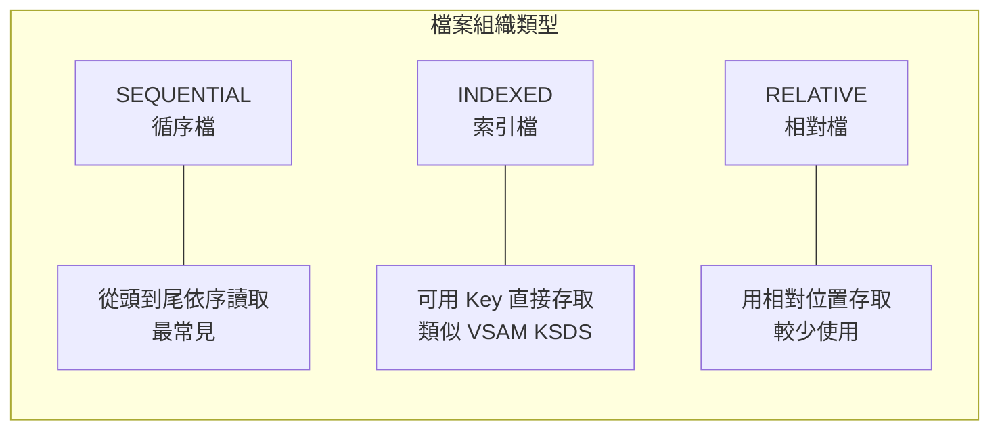

---

### 2.4 DATA DIVISION

DATA DIVISION 是 COBOL 程式中 **最重要的部分之一**，用於定義所有資料結構。

#### DATA DIVISION 的段落（SECTION）

```cobol
       DATA DIVISION.
      *-----------------------
      * 檔案段落 - 定義檔案 Record Layout
      *-----------------------
       FILE SECTION.
       
      *-----------------------
      * 工作儲存段落 - 程式內部變數
      *-----------------------
       WORKING-STORAGE SECTION.
       
      *-----------------------
      * 區域儲存段落 - 每次呼叫重新初始化
      *-----------------------
       LOCAL-STORAGE SECTION.
       
      *-----------------------
      * 連結段落 - 接收外部傳入參數
      *-----------------------
       LINKAGE SECTION.
```

#### FILE SECTION 範例

```cobol
       FILE SECTION.
      *-----------------------
      * 輸入檔案記錄定義
      *-----------------------
       FD  INPUT-FILE
           RECORDING MODE IS F
           BLOCK CONTAINS 0 RECORDS
           RECORD CONTAINS 100 CHARACTERS.
       01  INPUT-RECORD.
           05  IN-ACCT-NO        PIC X(10).
           05  IN-ACCT-NAME      PIC X(30).
           05  IN-BALANCE        PIC S9(13)V99 COMP-3.
           05  FILLER            PIC X(52).
```

#### WORKING-STORAGE SECTION 範例

```cobol
       WORKING-STORAGE SECTION.
      *-----------------------
      * 檔案狀態變數
      *-----------------------
       01  WS-FILE-STATUS.
           05  WS-INPUT-STATUS   PIC XX VALUE SPACES.
           05  WS-OUTPUT-STATUS  PIC XX VALUE SPACES.
           
      *-----------------------
      * 處理旗標
      *-----------------------
       01  WS-FLAGS.
           05  WS-EOF-FLAG       PIC X VALUE 'N'.
               88  EOF-REACHED   VALUE 'Y'.
               88  NOT-EOF       VALUE 'N'.
               
      *-----------------------
      * 計數器
      *-----------------------
       01  WS-COUNTERS.
           05  WS-READ-CNT       PIC 9(9) VALUE 0.
           05  WS-WRITE-CNT      PIC 9(9) VALUE 0.
           05  WS-ERROR-CNT      PIC 9(9) VALUE 0.
```

> **💡 命名慣例**  
> - `WS-` 前綴：Working-Storage 變數
> - `IN-` 前綴：輸入檔案欄位
> - `OUT-` 前綴：輸出檔案欄位
> - `LS-` 前綴：Linkage Section 變數

---

### 2.5 PROCEDURE DIVISION

PROCEDURE DIVISION 是程式的 **執行邏輯區域**，包含所有程式碼。

#### PROCEDURE DIVISION 基本結構

```cobol
       PROCEDURE DIVISION.
      *=======================================================
      * 主程式段落
      *=======================================================
       0000-MAIN-PROCESS.
           PERFORM 1000-INITIALIZE
           PERFORM 2000-PROCESS-LOOP
               UNTIL EOF-REACHED
           PERFORM 3000-TERMINATE
           STOP RUN.
           
      *=======================================================
      * 初始化段落
      *=======================================================
       1000-INITIALIZE.
           OPEN INPUT  INPUT-FILE
           OPEN OUTPUT OUTPUT-FILE
           PERFORM 1100-READ-INPUT.
           
       1100-READ-INPUT.
           READ INPUT-FILE
               AT END SET EOF-REACHED TO TRUE
           END-READ.
           
      *=======================================================
      * 主要處理迴圈
      *=======================================================
       2000-PROCESS-LOOP.
           PERFORM 2100-VALIDATE-DATA
           PERFORM 2200-PROCESS-DATA
           PERFORM 2300-WRITE-OUTPUT
           PERFORM 1100-READ-INPUT.
           
      *=======================================================
      * 結束處理
      *=======================================================
       3000-TERMINATE.
           CLOSE INPUT-FILE
           CLOSE OUTPUT-FILE
           DISPLAY "處理完成"
           DISPLAY "讀取筆數: " WS-READ-CNT
           DISPLAY "寫出筆數: " WS-WRITE-CNT.
```

#### 段落（Paragraph）命名慣例

| 編號範圍 | 用途 |
|----------|------|
| 0000-0999 | 主控段落 |
| 1000-1999 | 初始化相關 |
| 2000-2999 | 主要處理邏輯 |
| 3000-3999 | 結束處理 |
| 8000-8999 | 共用子程序 |
| 9000-9999 | 錯誤處理 |

---

### 2.6 基本程式範例（可編譯）

以下是一個完整、可編譯的 COBOL 程式範例：

```cobol
      *================================================================*
      * 程式名稱：HELLO001
      * 功能說明：COBOL Hello World 範例程式
      * 作    者：Tutorial Team
      * 建立日期：2026/02/01
      *================================================================*
       IDENTIFICATION DIVISION.
       PROGRAM-ID. HELLO001.
       AUTHOR. TUTORIAL-TEAM.
       
       ENVIRONMENT DIVISION.
       CONFIGURATION SECTION.
       
       DATA DIVISION.
       WORKING-STORAGE SECTION.
      *-----------------------
      * 常數定義
      *-----------------------
       01  WS-CONSTANTS.
           05  WS-PROGRAM-NAME   PIC X(10) VALUE 'HELLO001'.
           05  WS-VERSION        PIC X(05) VALUE '1.0.0'.
           
      *-----------------------
      * 工作變數
      *-----------------------
       01  WS-WORK-AREAS.
           05  WS-CURRENT-DATE   PIC 9(08) VALUE 0.
           05  WS-CURRENT-TIME   PIC 9(06) VALUE 0.
           05  WS-DISPLAY-DATE.
               10  WS-DD-YYYY    PIC 9(04).
               10  FILLER        PIC X VALUE '/'.
               10  WS-DD-MM      PIC 9(02).
               10  FILLER        PIC X VALUE '/'.
               10  WS-DD-DD      PIC 9(02).
               
       PROCEDURE DIVISION.
      *=======================================================
      * 主程式
      *=======================================================
       0000-MAIN.
           PERFORM 1000-INITIALIZE
           PERFORM 2000-DISPLAY-INFO
           PERFORM 3000-TERMINATE
           STOP RUN.
           
      *=======================================================
      * 初始化處理
      *=======================================================
       1000-INITIALIZE.
           ACCEPT WS-CURRENT-DATE FROM DATE YYYYMMDD
           ACCEPT WS-CURRENT-TIME FROM TIME
           
           MOVE WS-CURRENT-DATE(1:4) TO WS-DD-YYYY
           MOVE WS-CURRENT-DATE(5:2) TO WS-DD-MM
           MOVE WS-CURRENT-DATE(7:2) TO WS-DD-DD.
           
      *=======================================================
      * 顯示資訊
      *=======================================================
       2000-DISPLAY-INFO.
           DISPLAY "=================================="
           DISPLAY "  COBOL Hello World Program"
           DISPLAY "=================================="
           DISPLAY " "
           DISPLAY "程式名稱: " WS-PROGRAM-NAME
           DISPLAY "版    本: " WS-VERSION
           DISPLAY "執行日期: " WS-DISPLAY-DATE
           DISPLAY " "
           DISPLAY "Hello, COBOL World!"
           DISPLAY " "
           DISPLAY "==================================".
           
      *=======================================================
      * 結束處理
      *=======================================================
       3000-TERMINATE.
           DISPLAY "程式正常結束".
```

**執行結果**：
```
==================================
  COBOL Hello World Program
==================================
 
程式名稱: HELLO001
版    本: 1.0.0
執行日期: 2026/02/01
 
Hello, COBOL World!
 
==================================
程式正常結束
```

---

## 第三章：資料型態與資料結構

### 3.1 PIC 語法完整說明

PIC（PICTURE）是 COBOL 中定義資料格式的關鍵字，它決定了變數的 **類型、長度、顯示格式**。

#### PIC 符號說明

| 符號 | 說明 | 範例 |
|------|------|------|
| `9` | 數字（0-9） | `PIC 9(5)` = 5 位數字 |
| `X` | 任意字元 | `PIC X(10)` = 10 位字元 |
| `A` | 字母（A-Z, a-z） | `PIC A(5)` = 5 位字母 |
| `V` | 隱含小數點 | `PIC 9(5)V99` = 5 位整數 + 2 位小數 |
| `S` | 符號（正負） | `PIC S9(5)` = 帶符號的 5 位數字 |
| `.` | 實際小數點 | `PIC 9(5).99` = 顯示用 |
| `,` | 千位分隔符 | `PIC 9(3),9(3)` = 顯示用 |
| `Z` | 前導零抑制 | `PIC Z(5)9` = 前面零不顯示 |
| `*` | 前導星號填充 | `PIC *(5)9` = 前面填 * |
| `-` | 浮動負號 | `PIC -(5)9` = 負數時顯示 |
| `+` | 浮動正負號 | `PIC +(5)9` = 正負都顯示 |

#### 常見 PIC 定義範例

```cobol
      *-----------------------
      * 數字型態
      *-----------------------
       01  WS-NUMERIC-EXAMPLES.
      *    5 位整數
           05  WS-INT-5         PIC 9(5).
      *    帶符號的 9 位整數
           05  WS-SIGNED-INT    PIC S9(9).
      *    7 位整數 + 2 位小數
           05  WS-DECIMAL       PIC S9(7)V99.
      *    壓縮十進位（COMP-3）
           05  WS-PACKED        PIC S9(7)V99 COMP-3.
      *    二進位（COMP）
           05  WS-BINARY        PIC S9(9) COMP.
           
      *-----------------------
      * 文字型態
      *-----------------------
       01  WS-TEXT-EXAMPLES.
      *    10 位字元
           05  WS-TEXT-10       PIC X(10).
      *    固定值
           05  WS-CONSTANT      PIC X(05) VALUE 'HELLO'.
      *    30 位字元，初始為空白
           05  WS-NAME          PIC X(30) VALUE SPACES.
           
      *-----------------------
      * 顯示格式（編輯型）
      *-----------------------
       01  WS-DISPLAY-EXAMPLES.
      *    金額顯示：$12,345.67
           05  WS-AMT-DISPLAY   PIC $ZZ,ZZ9.99.
      *    日期顯示：2026/02/01
           05  WS-DATE-DISPLAY  PIC 9(4)/99/99.
      *    百分比：99.99%
           05  WS-PCT-DISPLAY   PIC Z9.99%.
```

#### USAGE 子句說明

| USAGE | 說明 | 適用場景 |
|-------|------|----------|
| `DISPLAY`（預設） | 每位數佔 1 byte | 顯示、報表輸出 |
| `COMP` / `BINARY` | 二進位格式 | 計算、索引 |
| `COMP-3` / `PACKED-DECIMAL` | 壓縮十進位 | 金額、大量數值 |
| `COMP-1` | 單精度浮點數 | 科學計算（少用） |
| `COMP-2` | 雙精度浮點數 | 科學計算（少用） |

#### COMP-3 佔用空間計算

COMP-3 是主機系統最常用的數值格式，計算公式：

```
佔用 bytes = (位數 + 1) / 2 （無條件進位）

範例：
PIC S9(7)V99  總位數 = 9
佔用 bytes = (9 + 1) / 2 = 5 bytes
```

> **💡 實務建議**  
> - **金額欄位** 一律使用 `COMP-3`，節省空間且計算準確
> - **索引、計數器** 使用 `COMP`，運算效能較佳
> - **要顯示的資料** 使用 `DISPLAY`

---

### 3.2 數值型、文字型、符號位（SIGN）

#### 數值型態深入說明

```cobol
       01  WS-NUMERIC-DETAIL.
      *-----------------------
      * 無符號數值
      *-----------------------
           05  WS-UNSIGNED      PIC 9(5).
      *    可存：00000 ~ 99999
      *    不可存負數
      
      *-----------------------
      * 帶符號數值（預設 TRAILING）
      *-----------------------
           05  WS-SIGNED-DEF    PIC S9(5).
      *    符號位在最後一個 byte
      
      *-----------------------
      * 符號位在前（LEADING）
      *-----------------------
           05  WS-SIGNED-LEAD   PIC S9(5) SIGN IS LEADING.
      *    符號位在第一個 byte
      
      *-----------------------
      * 分離符號（SEPARATE）
      *-----------------------
           05  WS-SIGNED-SEP    PIC S9(5) SIGN IS LEADING
                                          SEPARATE CHARACTER.
      *    符號獨立佔一個 byte（+ 或 -）
      *    總長度 = 6 bytes
```

#### 符號位（SIGN）詳解

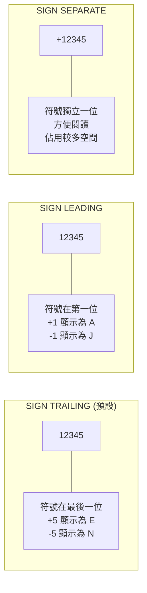

#### 文字型態說明

```cobol
       01  WS-TEXT-DETAIL.
      *-----------------------
      * 一般文字（最常用）
      *-----------------------
           05  WS-TEXT          PIC X(20).
      *    可存任何字元
      
      *-----------------------
      * 純字母
      *-----------------------
           05  WS-ALPHA         PIC A(10).
      *    只能存字母，較少使用
      
      *-----------------------
      * 初始值設定
      *-----------------------
           05  WS-INIT-SPACE    PIC X(10) VALUE SPACES.
           05  WS-INIT-ZERO     PIC X(10) VALUE ZEROS.
           05  WS-INIT-TEXT     PIC X(10) VALUE 'INITIAL'.
           05  WS-INIT-LOW      PIC X(10) VALUE LOW-VALUES.
           05  WS-INIT-HIGH     PIC X(10) VALUE HIGH-VALUES.
```

#### Figurative Constants（特殊常數）

| 常數 | 說明 | 用途 |
|------|------|------|
| `SPACES` / `SPACE` | 空白字元 | 初始化文字欄位 |
| `ZEROS` / `ZERO` | 零 | 初始化數值欄位 |
| `LOW-VALUES` | 最小值（X'00'） | 比較、排序 |
| `HIGH-VALUES` | 最大值（X'FF'） | 比較、排序 |
| `QUOTES` | 引號 | 字串處理 |
| `ALL 'x'` | 重複字元 | 填充特定字元 |

---

### 3.3 REDEFINES 與 OCCURS

#### REDEFINES（重新定義）

REDEFINES 允許同一塊記憶體用不同的格式來解讀：

```cobol
       01  WS-REDEFINES-EXAMPLE.
      *-----------------------
      * 範例 1：日期欄位多種解讀
      *-----------------------
           05  WS-DATE-NUM      PIC 9(8).
      *        數值格式：20260201
           05  WS-DATE-CHAR REDEFINES WS-DATE-NUM.
               10  WS-YYYY      PIC X(4).
               10  WS-MM        PIC X(2).
               10  WS-DD        PIC X(2).
      *        可用 WS-YYYY 取得 "2026"
      
      *-----------------------
      * 範例 2：記錄類型判斷
      *-----------------------
       01  WS-RECORD-AREA.
           05  WS-REC-TYPE      PIC X(1).
      *        H = Header, D = Detail, T = Trailer
           05  WS-REC-DATA      PIC X(99).
           
       01  WS-HEADER-REC REDEFINES WS-RECORD-AREA.
           05  FILLER           PIC X(1).
           05  WS-HDR-DATE      PIC 9(8).
           05  WS-HDR-TIME      PIC 9(6).
           05  FILLER           PIC X(85).
           
       01  WS-DETAIL-REC REDEFINES WS-RECORD-AREA.
           05  FILLER           PIC X(1).
           05  WS-DTL-ACCT      PIC X(10).
           05  WS-DTL-AMT       PIC S9(13)V99 COMP-3.
           05  FILLER           PIC X(80).
```

#### REDEFINES 規則

| 規則 | 說明 |
|------|------|
| 長度限制 | REDEFINES 長度不可大於被重定義項目 |
| 層級限制 | 必須在同一層級 |
| 順序限制 | 必須緊接在被重定義項目之後 |
| 不可使用 | 01 層級不可 REDEFINES |

#### OCCURS（陣列）

OCCURS 用於定義重複出現的資料項目（類似陣列）：

```cobol
       01  WS-OCCURS-EXAMPLE.
      *-----------------------
      * 固定長度陣列
      *-----------------------
           05  WS-MONTH-NAME.
               10  WS-MONTH     PIC X(10) OCCURS 12 TIMES.
      *        WS-MONTH(1) ~ WS-MONTH(12)
      
      *-----------------------
      * 二維陣列
      *-----------------------
           05  WS-MATRIX.
               10  WS-ROW OCCURS 10 TIMES.
                   15  WS-COL   PIC 9(3) OCCURS 5 TIMES.
      *        WS-COL(3, 2) 表示第 3 列第 2 行
      
      *-----------------------
      * DEPENDING ON（變動長度）
      *-----------------------
           05  WS-ITEM-COUNT    PIC 9(3).
           05  WS-ITEMS.
               10  WS-ITEM      PIC X(20) 
                                OCCURS 1 TO 100 TIMES
                                DEPENDING ON WS-ITEM-COUNT.
```

#### INDEXED BY（索引）

```cobol
       01  WS-INDEXED-TABLE.
           05  WS-ENTRY OCCURS 100 TIMES
                        INDEXED BY WS-IDX.
               10  WS-ENT-KEY   PIC X(10).
               10  WS-ENT-DATA  PIC X(50).
               
       PROCEDURE DIVISION.
      *    使用 SET 設定索引
           SET WS-IDX TO 1
           
      *    使用 SEARCH 搜尋
           SEARCH WS-ENTRY
               AT END
                   DISPLAY "NOT FOUND"
               WHEN WS-ENT-KEY(WS-IDX) = "SEARCH-KEY"
                   DISPLAY "FOUND AT " WS-IDX
           END-SEARCH
```

---

### 3.4 Working-Storage vs Linkage Section

#### Working-Storage Section

- **用途**：程式內部使用的變數
- **生命週期**：程式執行期間持續存在
- **初始化**：可使用 VALUE 子句設定初始值
- **可見性**：僅限本程式

```cobol
       WORKING-STORAGE SECTION.
       01  WS-INTERNAL-DATA.
           05  WS-COUNTER       PIC 9(5) VALUE 0.
           05  WS-TOTAL-AMT     PIC S9(13)V99 COMP-3 VALUE 0.
           05  WS-STATUS-FLAG   PIC X VALUE 'N'.
```

#### Linkage Section

- **用途**：接收外部傳入的參數（CALL BY REFERENCE）
- **生命週期**：呼叫期間有效
- **初始化**：**不可使用 VALUE**（資料來自外部）
- **可見性**：呼叫端與被呼叫端共享

```cobol
      *=======================================================
      * 被呼叫程式（SUBPROG1）
      *=======================================================
       LINKAGE SECTION.
       01  LS-INPUT-PARM.
           05  LS-ACCT-NO       PIC X(10).
           05  LS-AMOUNT        PIC S9(13)V99 COMP-3.
       01  LS-OUTPUT-PARM.
           05  LS-RETURN-CODE   PIC 9(4).
           05  LS-MESSAGE       PIC X(50).
           
       PROCEDURE DIVISION USING LS-INPUT-PARM
                                LS-OUTPUT-PARM.
```

```cobol
      *=======================================================
      * 呼叫端程式（MAINPROG）
      *=======================================================
       WORKING-STORAGE SECTION.
       01  WS-CALL-INPUT.
           05  WS-ACCT-NO       PIC X(10).
           05  WS-AMOUNT        PIC S9(13)V99 COMP-3.
       01  WS-CALL-OUTPUT.
           05  WS-RETURN-CODE   PIC 9(4).
           05  WS-MESSAGE       PIC X(50).
           
       PROCEDURE DIVISION.
           MOVE "1234567890" TO WS-ACCT-NO
           MOVE 1000.50 TO WS-AMOUNT
           
           CALL "SUBPROG1" USING WS-CALL-INPUT
                                 WS-CALL-OUTPUT
           
           IF WS-RETURN-CODE NOT = 0
               DISPLAY "ERROR: " WS-MESSAGE
           END-IF.
```

#### Local-Storage Section（補充）

- **用途**：類似 Working-Storage，但每次呼叫都會重新初始化
- **適用**：遞迴呼叫、多執行緒環境

```cobol
       LOCAL-STORAGE SECTION.
       01  LS-TEMP-DATA.
           05  LS-WORK-AREA     PIC X(100) VALUE SPACES.
```

---

### 3.5 常見錯誤與陷阱

#### 陷阱 1：數值溢位

```cobol
      * 錯誤示範
       01  WS-SMALL-NUM        PIC 9(3).
       
       PROCEDURE DIVISION.
           MOVE 1500 TO WS-SMALL-NUM.
      *    結果：WS-SMALL-NUM = 500（高位被截斷！）
      
      * 正確做法：使用足夠大的欄位
       01  WS-SAFE-NUM         PIC 9(5).
```

#### 陷阱 2：COMP-3 計算精度

```cobol
      * 錯誤示範：除法後小數被截斷
       01  WS-AMT-1            PIC S9(7)V99 COMP-3.
       01  WS-AMT-2            PIC S9(7)V99 COMP-3.
       01  WS-RESULT           PIC S9(7)V99 COMP-3.
       
           MOVE 100.00 TO WS-AMT-1
           MOVE 3 TO WS-AMT-2
           DIVIDE WS-AMT-1 BY WS-AMT-2 GIVING WS-RESULT.
      *    結果：33.33（正確，但要注意四捨五入）
      
      * 建議：使用 ROUNDED
           DIVIDE WS-AMT-1 BY WS-AMT-2 
               GIVING WS-RESULT ROUNDED.
```

#### 陷阱 3：REDEFINES 長度錯誤

```cobol
      * 錯誤示範
       01  WS-ORIGINAL         PIC X(10).
       01  WS-REDEF REDEFINES WS-ORIGINAL.
           05  WS-PART-1       PIC X(5).
           05  WS-PART-2       PIC X(8).
      *    編譯錯誤：REDEFINES 長度(13) > 原長度(10)
      
      * 正確做法
       01  WS-REDEF REDEFINES WS-ORIGINAL.
           05  WS-PART-1       PIC X(5).
           05  WS-PART-2       PIC X(5).
```

#### 陷阱 4：未初始化變數

```cobol
      * 危險：Working-Storage 未給初始值
       01  WS-COUNTER          PIC 9(5).
       
       PROCEDURE DIVISION.
           ADD 1 TO WS-COUNTER.
      *    結果不可預期！可能是垃圾值
      
      * 正確做法
       01  WS-COUNTER          PIC 9(5) VALUE 0.
      * 或在程式開始時
           INITIALIZE WS-COUNTER.
```

#### 陷阱 5：文字與數值混淆

```cobol
      * 錯誤示範
       01  WS-NUM-CHAR         PIC X(5) VALUE "123".
       01  WS-RESULT           PIC 9(5).
       
           ADD WS-NUM-CHAR TO WS-RESULT.
      *    可能導致 DATA EXCEPTION（S0C7）
      
      * 正確做法：使用 NUMVAL 函數或確保資料乾淨
       01  WS-NUM-CLEAN        PIC 9(5).
       
           IF WS-NUM-CHAR IS NUMERIC
               MOVE WS-NUM-CHAR TO WS-NUM-CLEAN
               ADD WS-NUM-CLEAN TO WS-RESULT
           ELSE
               DISPLAY "非數字資料"
           END-IF.
```

> **⚠️ 常見錯誤代碼**  
> - **S0C7**（Data Exception）：數值欄位包含非數字
> - **S0CB**（Divide by Zero）：除以零
> - **S0C4**（Protection Exception）：存取非法記憶體

---

### 第三章小結

| 要點 | 說明 |
|------|------|
| PIC 是基礎 | 理解 PIC 語法是 COBOL 的第一步 |
| COMP-3 最常用 | 金融系統幾乎都用 COMP-3 存金額 |
| REDEFINES 要小心 | 長度必須正確，用途要清楚 |
| 初始化很重要 | 所有變數都應該有明確初始值 |
| 符號位要注意 | 金額計算必須用帶符號的數值 |

---

## 第四章：檔案處理（主機實務重點）

### 4.1 Sequential File 基本操作

#### 什麼是 Sequential File（循序檔）？

循序檔是主機系統中 **最基本、最常見** 的檔案類型，記錄依序排列，只能從頭到尾依序讀取。

**特性**：
- 結構簡單，效能優異
- 適合大量資料批次處理
- 不支援隨機存取
- 每筆記錄長度固定或變動

#### 檔案類型比較

| 類型 | 說明 | 適用場景 |
|------|------|----------|
| **Sequential** | 循序存取 | 批次處理、報表 |
| **VSAM KSDS** | Key 索引存取 | 需要查詢的主檔 |
| **VSAM ESDS** | 循序 + 相對位置 | 日誌檔 |
| **VSAM RRDS** | 相對記錄存取 | 固定編號存取 |

#### 檔案定義完整範例

```cobol
       ENVIRONMENT DIVISION.
       INPUT-OUTPUT SECTION.
       FILE-CONTROL.
      *-----------------------
      * 輸入檔案定義
      *-----------------------
           SELECT INPUT-FILE
               ASSIGN TO INFILE
               ORGANIZATION IS SEQUENTIAL
               ACCESS MODE IS SEQUENTIAL
               FILE STATUS IS WS-INPUT-STATUS.
               
      *-----------------------
      * 輸出檔案定義
      *-----------------------
           SELECT OUTPUT-FILE
               ASSIGN TO OUTFILE
               ORGANIZATION IS SEQUENTIAL
               FILE STATUS IS WS-OUTPUT-STATUS.
               
      *-----------------------
      * 報表輸出定義
      *-----------------------
           SELECT REPORT-FILE
               ASSIGN TO RPTFILE
               ORGANIZATION IS SEQUENTIAL
               FILE STATUS IS WS-REPORT-STATUS.
```

```cobol
       DATA DIVISION.
       FILE SECTION.
      *-----------------------
      * 輸入檔案記錄（固定長度 100 bytes）
      *-----------------------
       FD  INPUT-FILE
           RECORDING MODE IS F
           BLOCK CONTAINS 0 RECORDS
           RECORD CONTAINS 100 CHARACTERS
           LABEL RECORDS ARE STANDARD.
       01  INPUT-RECORD.
           05  IN-ACCT-NO       PIC X(10).
           05  IN-ACCT-NAME     PIC X(30).
           05  IN-BALANCE       PIC S9(13)V99 COMP-3.
           05  IN-LAST-DATE     PIC 9(8).
           05  IN-STATUS        PIC X(1).
           05  FILLER           PIC X(43).
           
      *-----------------------
      * 輸出檔案記錄
      *-----------------------
       FD  OUTPUT-FILE
           RECORDING MODE IS F
           BLOCK CONTAINS 0 RECORDS
           RECORD CONTAINS 120 CHARACTERS.
       01  OUTPUT-RECORD        PIC X(120).
```

#### FD（File Description）子句說明

| 子句 | 說明 |
|------|------|
| `RECORDING MODE` | F=固定長度, V=變動長度, U=未定義 |
| `BLOCK CONTAINS` | 區塊大小，0 表示由系統決定 |
| `RECORD CONTAINS` | 記錄長度（bytes） |
| `LABEL RECORDS` | STANDARD=標準標籤, OMITTED=無標籤 |

---

### 4.2 READ / WRITE / OPEN / CLOSE

#### OPEN 語法

```cobol
      *-----------------------
      * OPEN 模式說明
      *-----------------------
      * INPUT  - 唯讀
      * OUTPUT - 覆寫（新建或清空）
      * I-O    - 讀寫
      * EXTEND - 附加（寫在檔案尾端）
      
       PROCEDURE DIVISION.
       1000-OPEN-FILES.
           OPEN INPUT  INPUT-FILE
           OPEN OUTPUT OUTPUT-FILE
           OPEN EXTEND LOG-FILE
           
      *    檢查開檔狀態
           IF WS-INPUT-STATUS NOT = "00"
               DISPLAY "INPUT FILE OPEN ERROR: " WS-INPUT-STATUS
               MOVE 8 TO RETURN-CODE
               STOP RUN
           END-IF.
```

#### READ 語法

```cobol
       1100-READ-INPUT.
      *-----------------------
      * 基本 READ
      *-----------------------
           READ INPUT-FILE
               AT END
                   SET EOF-REACHED TO TRUE
               NOT AT END
                   ADD 1 TO WS-READ-CNT
           END-READ.
           
      *-----------------------
      * READ INTO（讀入工作區）
      *-----------------------
           READ INPUT-FILE INTO WS-WORK-RECORD
               AT END
                   SET EOF-REACHED TO TRUE
           END-READ.
```

#### WRITE 語法

```cobol
       2100-WRITE-OUTPUT.
      *-----------------------
      * 基本 WRITE
      *-----------------------
           WRITE OUTPUT-RECORD.
           ADD 1 TO WS-WRITE-CNT.
           
      *-----------------------
      * WRITE FROM（從工作區寫出）
      *-----------------------
           WRITE OUTPUT-RECORD FROM WS-WORK-RECORD.
           
      *-----------------------
      * 報表換行控制
      *-----------------------
           WRITE REPORT-LINE AFTER ADVANCING 1 LINE.
           WRITE REPORT-LINE AFTER ADVANCING PAGE.
```

#### CLOSE 語法

```cobol
       3000-CLOSE-FILES.
           CLOSE INPUT-FILE
           CLOSE OUTPUT-FILE
           CLOSE REPORT-FILE
           
      *    檢查關檔狀態
           IF WS-OUTPUT-STATUS NOT = "00"
               DISPLAY "OUTPUT FILE CLOSE ERROR: " WS-OUTPUT-STATUS
           END-IF.
```

---

### 4.3 EOF 控制寫法

#### 方法一：使用 88 層級（推薦）

```cobol
       WORKING-STORAGE SECTION.
       01  WS-FLAGS.
           05  WS-EOF-SW        PIC X(1) VALUE 'N'.
               88  EOF-REACHED  VALUE 'Y'.
               88  NOT-EOF      VALUE 'N'.
               
       PROCEDURE DIVISION.
       0000-MAIN.
           PERFORM 1000-INITIALIZE
           PERFORM 2000-PROCESS UNTIL EOF-REACHED
           PERFORM 3000-TERMINATE
           STOP RUN.
           
       1100-READ-INPUT.
           READ INPUT-FILE
               AT END
                   SET EOF-REACHED TO TRUE
           END-READ.
```

#### 方法二：使用 FILE STATUS

```cobol
       WORKING-STORAGE SECTION.
       01  WS-INPUT-STATUS      PIC XX VALUE SPACES.
       
       PROCEDURE DIVISION.
       0000-MAIN.
           PERFORM 1000-INITIALIZE
           PERFORM 2000-PROCESS UNTIL WS-INPUT-STATUS = "10"
           PERFORM 3000-TERMINATE
           STOP RUN.
```

#### FILE STATUS 常見代碼

| 代碼 | 說明 |
|------|------|
| `00` | 成功 |
| `10` | 檔案結束（EOF） |
| `23` | 記錄不存在（VSAM） |
| `35` | 檔案不存在 |
| `37` | 開檔模式錯誤 |
| `39` | 檔案屬性不符 |
| `41` | 檔案已開啟 |
| `42` | 檔案未開啟 |
| `46` | 讀取失敗 |
| `47` | 讀取模式錯誤 |
| `48` | 寫入模式錯誤 |

> **⚠️ 重要提醒**  
> **永遠檢查 FILE STATUS！** 這是主機程式穩定的關鍵。

---

### 4.4 檔案 Layout（Record Layout）設計原則

#### Record Layout 設計要點

1. **對齊原則**
   - COMP/COMP-3 欄位要對齊適當邊界
   - 盡量將同類型欄位放在一起

2. **預留欄位**
   - 使用 FILLER 預留擴充空間
   - 記錄長度設計要考慮未來需求

3. **文件化**
   - Layout 必須有完整文件
   - 版本控管很重要

#### 標準 Layout 範例

```cobol
      *================================================================*
      * 檔案名稱：ACCT-MASTER-FILE
      * 記錄長度：200 bytes
      * 版    本：1.0
      * 說    明：帳戶主檔記錄格式
      *================================================================*
       01  ACCT-MASTER-RECORD.
      *-----------------------
      * 識別區（20 bytes）
      *-----------------------
           05  AMR-RECORD-TYPE  PIC X(1).
      *        H=Header, D=Detail, T=Trailer
           05  AMR-ACCT-NO      PIC X(10).
           05  AMR-BRANCH-CODE  PIC X(4).
           05  FILLER           PIC X(5).
           
      *-----------------------
      * 帳戶資訊區（60 bytes）
      *-----------------------
           05  AMR-ACCT-INFO.
               10  AMR-ACCT-NAME    PIC X(30).
               10  AMR-ACCT-TYPE    PIC X(2).
      *            01=活存, 02=定存, 03=外幣
               10  AMR-CURRENCY     PIC X(3).
               10  FILLER           PIC X(25).
               
      *-----------------------
      * 金額區（40 bytes）
      *-----------------------
           05  AMR-AMOUNTS.
               10  AMR-BALANCE      PIC S9(13)V99 COMP-3.
               10  AMR-AVAIL-BAL    PIC S9(13)V99 COMP-3.
               10  AMR-HOLD-AMT     PIC S9(13)V99 COMP-3.
               10  FILLER           PIC X(16).
               
      *-----------------------
      * 日期區（30 bytes）
      *-----------------------
           05  AMR-DATES.
               10  AMR-OPEN-DATE    PIC 9(8).
               10  AMR-LAST-TXN     PIC 9(8).
               10  AMR-CLOSE-DATE   PIC 9(8).
               10  FILLER           PIC X(6).
               
      *-----------------------
      * 狀態區（20 bytes）
      *-----------------------
           05  AMR-STATUS-INFO.
               10  AMR-STATUS       PIC X(1).
      *            A=Active, C=Closed, F=Frozen
               10  AMR-FLAGS        PIC X(4).
               10  FILLER           PIC X(15).
               
      *-----------------------
      * 保留區（30 bytes）
      *-----------------------
           05  FILLER               PIC X(30).
```

#### Layout 文件化範例

```
+--------+--------------------+------+------+---------+------------------+
| 起始位 | 欄位名稱           | 長度 | 類型 | 格式    | 說明             |
+--------+--------------------+------+------+---------+------------------+
|   1    | AMR-RECORD-TYPE    |   1  | X    |         | H/D/T            |
|   2    | AMR-ACCT-NO        |  10  | X    |         | 帳號             |
|  12    | AMR-BRANCH-CODE    |   4  | X    |         | 分行代碼         |
|  16    | FILLER             |   5  | X    |         | 保留             |
|  21    | AMR-ACCT-NAME      |  30  | X    |         | 戶名             |
|  51    | AMR-ACCT-TYPE      |   2  | X    |         | 帳戶類型         |
|  53    | AMR-CURRENCY       |   3  | X    |         | 幣別             |
|  56    | FILLER             |  25  | X    |         | 保留             |
|  81    | AMR-BALANCE        |   8  | P    | S9(13)V99 | 帳戶餘額       |
|  89    | AMR-AVAIL-BAL      |   8  | P    | S9(13)V99 | 可用餘額       |
|  97    | AMR-HOLD-AMT       |   8  | P    | S9(13)V99 | 圈存金額       |
| ...    | ...                | ...  | ...  | ...     | ...              |
+--------+--------------------+------+------+---------+------------------+
```

---

### 4.5 實務範例（Batch 檔案讀寫）

#### 完整批次檔案處理範例

```cobol
      *================================================================*
      * 程式名稱：FILECOPY
      * 功能說明：讀取輸入檔，過濾有效記錄後寫出
      * 輸入檔案：INFILE (100 bytes/record)
      * 輸出檔案：OUTFILE (100 bytes/record)
      *================================================================*
       IDENTIFICATION DIVISION.
       PROGRAM-ID. FILECOPY.
       
       ENVIRONMENT DIVISION.
       INPUT-OUTPUT SECTION.
       FILE-CONTROL.
           SELECT INPUT-FILE
               ASSIGN TO INFILE
               ORGANIZATION IS SEQUENTIAL
               FILE STATUS IS WS-IN-STAT.
               
           SELECT OUTPUT-FILE
               ASSIGN TO OUTFILE
               ORGANIZATION IS SEQUENTIAL
               FILE STATUS IS WS-OUT-STAT.
               
       DATA DIVISION.
       FILE SECTION.
       FD  INPUT-FILE
           RECORDING MODE IS F
           RECORD CONTAINS 100 CHARACTERS.
       01  IN-RECORD.
           05  IN-ACCT-NO       PIC X(10).
           05  IN-NAME          PIC X(30).
           05  IN-BALANCE       PIC S9(13)V99 COMP-3.
           05  IN-STATUS        PIC X(1).
           05  FILLER           PIC X(51).
           
       FD  OUTPUT-FILE
           RECORDING MODE IS F
           RECORD CONTAINS 100 CHARACTERS.
       01  OUT-RECORD           PIC X(100).
       
       WORKING-STORAGE SECTION.
      *-----------------------
      * 常數
      *-----------------------
       01  WS-CONSTANTS.
           05  WS-PROG-NAME     PIC X(10) VALUE 'FILECOPY'.
           
      *-----------------------
      * 檔案狀態
      *-----------------------
       01  WS-FILE-STATUS.
           05  WS-IN-STAT       PIC XX VALUE SPACES.
           05  WS-OUT-STAT      PIC XX VALUE SPACES.
           
      *-----------------------
      * 處理旗標
      *-----------------------
       01  WS-FLAGS.
           05  WS-EOF-FLAG      PIC X VALUE 'N'.
               88  EOF-REACHED  VALUE 'Y'.
               88  NOT-EOF      VALUE 'N'.
               
      *-----------------------
      * 計數器
      *-----------------------
       01  WS-COUNTERS.
           05  WS-READ-CNT      PIC 9(9) VALUE 0.
           05  WS-WRITE-CNT     PIC 9(9) VALUE 0.
           05  WS-SKIP-CNT      PIC 9(9) VALUE 0.
           
      *-----------------------
      * 工作區
      *-----------------------
       01  WS-WORK-AREAS.
           05  WS-CURR-DATE     PIC 9(8).
           05  WS-CURR-TIME     PIC 9(6).
           
       PROCEDURE DIVISION.
      *=======================================================
      * 主程式
      *=======================================================
       0000-MAIN.
           PERFORM 1000-INITIALIZE
           PERFORM 2000-PROCESS UNTIL EOF-REACHED
           PERFORM 3000-TERMINATE
           
           IF WS-READ-CNT > 0
               MOVE 0 TO RETURN-CODE
           ELSE
               MOVE 4 TO RETURN-CODE
           END-IF
           
           STOP RUN.
           
      *=======================================================
      * 初始化
      *=======================================================
       1000-INITIALIZE.
           DISPLAY "========================================"
           DISPLAY " PROGRAM " WS-PROG-NAME " START"
           DISPLAY "========================================"
           
           ACCEPT WS-CURR-DATE FROM DATE YYYYMMDD
           ACCEPT WS-CURR-TIME FROM TIME
           DISPLAY "執行日期: " WS-CURR-DATE
           DISPLAY "執行時間: " WS-CURR-TIME
           
           PERFORM 1100-OPEN-FILES
           PERFORM 1200-READ-INPUT.
           
       1100-OPEN-FILES.
           OPEN INPUT  INPUT-FILE
           IF WS-IN-STAT NOT = "00"
               DISPLAY "*** INPUT FILE OPEN ERROR: " WS-IN-STAT
               MOVE 16 TO RETURN-CODE
               STOP RUN
           END-IF
           
           OPEN OUTPUT OUTPUT-FILE
           IF WS-OUT-STAT NOT = "00"
               DISPLAY "*** OUTPUT FILE OPEN ERROR: " WS-OUT-STAT
               MOVE 16 TO RETURN-CODE
               STOP RUN
           END-IF.
           
       1200-READ-INPUT.
           READ INPUT-FILE
               AT END
                   SET EOF-REACHED TO TRUE
               NOT AT END
                   ADD 1 TO WS-READ-CNT
           END-READ.
           
      *=======================================================
      * 主要處理迴圈
      *=======================================================
       2000-PROCESS.
           EVALUATE TRUE
               WHEN IN-STATUS = 'A'
                   PERFORM 2100-WRITE-ACTIVE-RECORD
               WHEN IN-STATUS = 'C'
                   PERFORM 2200-SKIP-CLOSED-RECORD
               WHEN OTHER
                   PERFORM 2300-HANDLE-INVALID-STATUS
           END-EVALUATE
           
           PERFORM 1200-READ-INPUT.
           
       2100-WRITE-ACTIVE-RECORD.
           WRITE OUT-RECORD FROM IN-RECORD
           IF WS-OUT-STAT = "00"
               ADD 1 TO WS-WRITE-CNT
           ELSE
               DISPLAY "*** WRITE ERROR: " WS-OUT-STAT
               DISPLAY "    ACCT: " IN-ACCT-NO
           END-IF.
           
       2200-SKIP-CLOSED-RECORD.
           ADD 1 TO WS-SKIP-CNT.
           
       2300-HANDLE-INVALID-STATUS.
           DISPLAY "*** INVALID STATUS: " IN-STATUS
           DISPLAY "    ACCT: " IN-ACCT-NO
           ADD 1 TO WS-SKIP-CNT.
           
      *=======================================================
      * 結束處理
      *=======================================================
       3000-TERMINATE.
           PERFORM 3100-CLOSE-FILES
           PERFORM 3200-DISPLAY-SUMMARY.
           
       3100-CLOSE-FILES.
           CLOSE INPUT-FILE
           CLOSE OUTPUT-FILE.
           
       3200-DISPLAY-SUMMARY.
           DISPLAY " "
           DISPLAY "========================================"
           DISPLAY " 處理摘要"
           DISPLAY "========================================"
           DISPLAY " 讀取筆數: " WS-READ-CNT
           DISPLAY " 寫出筆數: " WS-WRITE-CNT
           DISPLAY " 略過筆數: " WS-SKIP-CNT
           DISPLAY "========================================"
           DISPLAY " PROGRAM " WS-PROG-NAME " END"
           DISPLAY "========================================".
```

#### 對應的 JCL 範例

```jcl
//FILECOPY JOB (ACCT),'FILE COPY JOB',CLASS=A,MSGCLASS=X
//STEP1    EXEC PGM=FILECOPY
//STEPLIB  DD DSN=YOUR.LOADLIB,DISP=SHR
//INFILE   DD DSN=YOUR.INPUT.FILE,DISP=SHR
//OUTFILE  DD DSN=YOUR.OUTPUT.FILE,
//            DISP=(NEW,CATLG,DELETE),
//            SPACE=(CYL,(10,5),RLSE),
//            DCB=(RECFM=FB,LRECL=100,BLKSIZE=0)
//SYSOUT   DD SYSOUT=*
//SYSPRINT DD SYSOUT=*
```

> **💡 實務建議**  
> 1. **永遠檢查 FILE STATUS** - 不要假設檔案操作一定成功
> 2. **記錄處理統計** - 方便追蹤和驗證
> 3. **設定適當的 RETURN-CODE** - 讓 JCL 可以判斷處理結果
> 4. **錯誤時顯示詳細資訊** - 包含發生問題的資料

---

## 第五章：批次程式（Batch Job）設計

### 5.1 Batch 程式生命週期

#### 批次程式執行流程

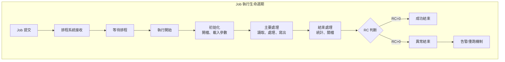

#### 批次程式標準結構

```cobol
       PROCEDURE DIVISION.
      *=======================================================
      * 主控程式 - 標準三段式結構
      *=======================================================
       0000-MAIN.
      *    第一段：初始化
           PERFORM 1000-INITIALIZE
           
      *    第二段：主要處理迴圈
           PERFORM 2000-PROCESS-LOOP
               UNTIL EOF-REACHED OR FATAL-ERROR
               
      *    第三段：結束處理
           PERFORM 3000-TERMINATE
           
      *    設定回傳碼
           MOVE WS-RETURN-CODE TO RETURN-CODE
           STOP RUN.
```

### 5.2 Return Code（RC）設計原則

#### 標準 Return Code 定義

| RC | 意義 | 說明 |
|----|------|------|
| 0 | 成功 | 程式正常結束，無任何問題 |
| 4 | 警告 | 有警告訊息，但不影響後續作業 |
| 8 | 錯誤 | 發生錯誤，需要人工介入 |
| 12 | 嚴重錯誤 | 嚴重錯誤，後續 Job 應停止 |
| 16 | 致命錯誤 | 程式無法繼續，立即終止 |

#### Return Code 設定範例

```cobol
       WORKING-STORAGE SECTION.
       01  WS-RETURN-CODE       PIC 9(4) VALUE 0.
       01  WS-ERROR-COUNT       PIC 9(5) VALUE 0.
       01  WS-WARNING-COUNT     PIC 9(5) VALUE 0.
       
       PROCEDURE DIVISION.
       3000-TERMINATE.
      *    根據處理結果設定 RC
           EVALUATE TRUE
               WHEN WS-ERROR-COUNT > 0
                   MOVE 8 TO WS-RETURN-CODE
                   DISPLAY "*** JOB ENDED WITH ERRORS"
               WHEN WS-WARNING-COUNT > 0
                   MOVE 4 TO WS-RETURN-CODE
                   DISPLAY "*** JOB ENDED WITH WARNINGS"
               WHEN WS-READ-CNT = 0
                   MOVE 4 TO WS-RETURN-CODE
                   DISPLAY "*** NO DATA PROCESSED"
               WHEN OTHER
                   MOVE 0 TO WS-RETURN-CODE
                   DISPLAY "*** JOB COMPLETED SUCCESSFULLY"
           END-EVALUATE.
```

#### JCL 中的 RC 判斷

```jcl
//STEP01   EXEC PGM=PROGRAM1
//...
//STEP02   EXEC PGM=PROGRAM2,COND=(8,LT,STEP01)
//*        只有當 STEP01 的 RC < 8 時才執行 STEP02
//...
//STEP03   EXEC PGM=PROGRAM3,COND=((8,LT,STEP01),(4,LT,STEP02))
//*        STEP01 RC < 8 且 STEP02 RC < 4 時才執行
```

---

### 5.3 程式錯誤處理與異常控制

#### 錯誤處理策略

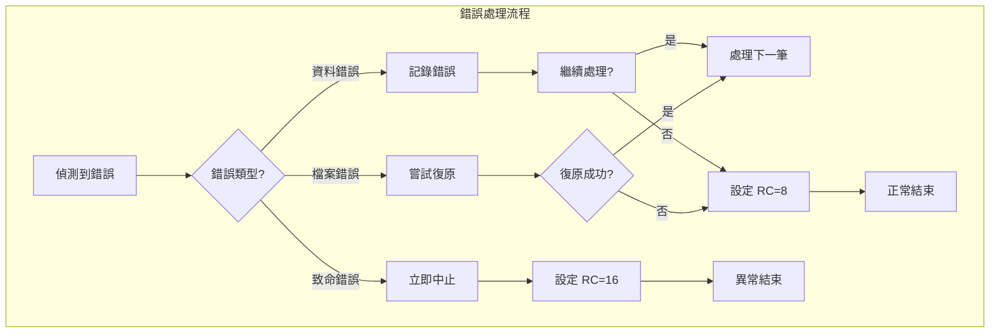

#### 資料驗證與錯誤處理範例

```cobol
       WORKING-STORAGE SECTION.
       01  WS-ERROR-RECORD.
           05  WS-ERR-ACCT      PIC X(10).
           05  WS-ERR-CODE      PIC X(4).
           05  WS-ERR-MSG       PIC X(50).
           05  WS-ERR-DATA      PIC X(36).
           
       PROCEDURE DIVISION.
       2100-VALIDATE-DATA.
           MOVE SPACES TO WS-ERROR-RECORD
           
      *    檢查帳號格式
           IF IN-ACCT-NO = SPACES
               MOVE "E001" TO WS-ERR-CODE
               MOVE "帳號不可為空白" TO WS-ERR-MSG
               PERFORM 9100-WRITE-ERROR
               EXIT PARAGRAPH
           END-IF
           
      *    檢查帳號是否為數字
           IF IN-ACCT-NO IS NOT NUMERIC
               MOVE "E002" TO WS-ERR-CODE
               MOVE "帳號必須為數字" TO WS-ERR-MSG
               PERFORM 9100-WRITE-ERROR
               EXIT PARAGRAPH
           END-IF
           
      *    檢查金額合理性
           IF IN-BALANCE < -999999999999.99
           OR IN-BALANCE > 999999999999.99
               MOVE "E003" TO WS-ERR-CODE
               MOVE "金額超出合理範圍" TO WS-ERR-MSG
               PERFORM 9100-WRITE-ERROR
               EXIT PARAGRAPH
           END-IF
           
      *    通過驗證
           SET DATA-VALID TO TRUE.
           
       9100-WRITE-ERROR.
           MOVE IN-ACCT-NO TO WS-ERR-ACCT
           WRITE ERROR-RECORD FROM WS-ERROR-RECORD
           ADD 1 TO WS-ERROR-COUNT
           SET DATA-INVALID TO TRUE.
```

#### Abend 處理（非正常中斷）

```cobol
      *================================================================*
      * 使用 DECLARATIVES 處理檔案錯誤
      *================================================================*
       PROCEDURE DIVISION.
       DECLARATIVES.
       INPUT-ERROR SECTION.
           USE AFTER STANDARD ERROR PROCEDURE ON INPUT-FILE.
       INPUT-ERROR-HANDLER.
           DISPLAY "*** FILE I/O ERROR ON INPUT-FILE"
           DISPLAY "*** FILE STATUS: " WS-IN-STAT
           MOVE 16 TO WS-RETURN-CODE
           SET FATAL-ERROR TO TRUE.
           
       OUTPUT-ERROR SECTION.
           USE AFTER STANDARD ERROR PROCEDURE ON OUTPUT-FILE.
       OUTPUT-ERROR-HANDLER.
           DISPLAY "*** FILE I/O ERROR ON OUTPUT-FILE"
           DISPLAY "*** FILE STATUS: " WS-OUT-STAT
           MOVE 16 TO WS-RETURN-CODE
           SET FATAL-ERROR TO TRUE.
       END DECLARATIVES.
```

---

### 5.4 批次程式撰寫範例

#### 完整的日結批次程式範例

```cobol
      *================================================================*
      * 程式名稱：DAYJOB01
      * 功能說明：帳戶餘額日結計算
      * 執行時機：每日營業結束後
      * 輸入檔案：TXNFILE - 當日交易檔
      * 輸出檔案：BALFILE - 餘額更新檔
      * 報表輸出：RPTFILE - 日結報表
      *================================================================*
       IDENTIFICATION DIVISION.
       PROGRAM-ID. DAYJOB01.
       AUTHOR. SYSTEM-TEAM.
       
       ENVIRONMENT DIVISION.
       INPUT-OUTPUT SECTION.
       FILE-CONTROL.
           SELECT TXN-FILE
               ASSIGN TO TXNFILE
               FILE STATUS IS WS-TXN-STAT.
           SELECT BAL-FILE
               ASSIGN TO BALFILE
               FILE STATUS IS WS-BAL-STAT.
           SELECT RPT-FILE
               ASSIGN TO RPTFILE
               FILE STATUS IS WS-RPT-STAT.
               
       DATA DIVISION.
       FILE SECTION.
       FD  TXN-FILE
           RECORDING MODE IS F
           RECORD CONTAINS 150 CHARACTERS.
       01  TXN-RECORD.
           05  TXN-DATE         PIC 9(8).
           05  TXN-TIME         PIC 9(6).
           05  TXN-ACCT-NO      PIC X(10).
           05  TXN-TYPE         PIC X(2).
      *        DR=扣款, CR=入款
           05  TXN-AMOUNT       PIC S9(13)V99 COMP-3.
           05  TXN-DESC         PIC X(30).
           05  FILLER           PIC X(86).
           
       FD  BAL-FILE
           RECORDING MODE IS F
           RECORD CONTAINS 80 CHARACTERS.
       01  BAL-RECORD.
           05  BAL-ACCT-NO      PIC X(10).
           05  BAL-DATE         PIC 9(8).
           05  BAL-OPENING      PIC S9(13)V99 COMP-3.
           05  BAL-DEBIT        PIC S9(13)V99 COMP-3.
           05  BAL-CREDIT       PIC S9(13)V99 COMP-3.
           05  BAL-CLOSING      PIC S9(13)V99 COMP-3.
           05  FILLER           PIC X(30).
           
       FD  RPT-FILE
           RECORDING MODE IS F
           RECORD CONTAINS 132 CHARACTERS.
       01  RPT-LINE             PIC X(132).
       
       WORKING-STORAGE SECTION.
      *-----------------------
      * 程式常數
      *-----------------------
       01  WS-CONSTANTS.
           05  WS-PROG-NAME     PIC X(10) VALUE 'DAYJOB01'.
           05  WS-PROG-VERSION  PIC X(5)  VALUE '1.0.0'.
           
      *-----------------------
      * 系統日期時間
      *-----------------------
       01  WS-SYSTEM-INFO.
           05  WS-PROCESS-DATE  PIC 9(8).
           05  WS-PROCESS-TIME  PIC 9(6).
           
      *-----------------------
      * 檔案狀態
      *-----------------------
       01  WS-FILE-STATUS.
           05  WS-TXN-STAT      PIC XX VALUE SPACES.
           05  WS-BAL-STAT      PIC XX VALUE SPACES.
           05  WS-RPT-STAT      PIC XX VALUE SPACES.
           
      *-----------------------
      * 處理旗標
      *-----------------------
       01  WS-FLAGS.
           05  WS-EOF-FLAG      PIC X VALUE 'N'.
               88  EOF-REACHED  VALUE 'Y'.
               88  NOT-EOF      VALUE 'N'.
           05  WS-ERROR-FLAG    PIC X VALUE 'N'.
               88  FATAL-ERROR  VALUE 'Y'.
               88  NO-ERROR     VALUE 'N'.
               
      *-----------------------
      * 計數器
      *-----------------------
       01  WS-COUNTERS.
           05  WS-TXN-READ      PIC 9(9) VALUE 0.
           05  WS-TXN-PROCESS   PIC 9(9) VALUE 0.
           05  WS-TXN-ERROR     PIC 9(9) VALUE 0.
           05  WS-BAL-WRITE     PIC 9(9) VALUE 0.
           
      *-----------------------
      * 累計金額
      *-----------------------
       01  WS-TOTALS.
           05  WS-TOTAL-DEBIT   PIC S9(15)V99 COMP-3 VALUE 0.
           05  WS-TOTAL-CREDIT  PIC S9(15)V99 COMP-3 VALUE 0.
           
      *-----------------------
      * 工作區域
      *-----------------------
       01  WS-CURRENT-ACCT      PIC X(10) VALUE SPACES.
       01  WS-ACCT-DEBIT        PIC S9(13)V99 COMP-3 VALUE 0.
       01  WS-ACCT-CREDIT       PIC S9(13)V99 COMP-3 VALUE 0.
       01  WS-RETURN-CODE       PIC 9(4) VALUE 0.
       
      *-----------------------
      * 報表標題
      *-----------------------
       01  WS-RPT-HEADER-1.
           05  FILLER           PIC X(50) VALUE SPACES.
           05  FILLER           PIC X(30) VALUE
               '日    結    報    表'.
           05  FILLER           PIC X(52) VALUE SPACES.
           
       01  WS-RPT-HEADER-2.
           05  FILLER           PIC X(10) VALUE '處理日期: '.
           05  WS-RPT-DATE      PIC 9(4)/99/99.
           05  FILLER           PIC X(20) VALUE SPACES.
           05  FILLER           PIC X(10) VALUE '頁    次: '.
           05  WS-RPT-PAGE      PIC ZZ,ZZ9.
           05  FILLER           PIC X(74) VALUE SPACES.
           
       PROCEDURE DIVISION.
      *=======================================================
      * 主程式
      *=======================================================
       0000-MAIN.
           PERFORM 1000-INITIALIZE
           
           IF NOT FATAL-ERROR
               PERFORM 2000-PROCESS-LOOP
                   UNTIL EOF-REACHED OR FATAL-ERROR
           END-IF
           
           PERFORM 3000-TERMINATE
           
           MOVE WS-RETURN-CODE TO RETURN-CODE
           STOP RUN.
           
      *=======================================================
      * 初始化
      *=======================================================
       1000-INITIALIZE.
           DISPLAY "========================================"
           DISPLAY " " WS-PROG-NAME " VERSION " WS-PROG-VERSION
           DISPLAY " STARTING..."
           DISPLAY "========================================"
           
           ACCEPT WS-PROCESS-DATE FROM DATE YYYYMMDD
           ACCEPT WS-PROCESS-TIME FROM TIME
           
           MOVE WS-PROCESS-DATE TO WS-RPT-DATE
           
           PERFORM 1100-OPEN-FILES
           
           IF NOT FATAL-ERROR
               PERFORM 1200-WRITE-REPORT-HEADER
               PERFORM 1300-READ-TXN
           END-IF.
           
       1100-OPEN-FILES.
           OPEN INPUT TXN-FILE
           IF WS-TXN-STAT NOT = "00"
               DISPLAY "*** TXN FILE OPEN ERROR: " WS-TXN-STAT
               SET FATAL-ERROR TO TRUE
               MOVE 16 TO WS-RETURN-CODE
               EXIT PARAGRAPH
           END-IF
           
           OPEN OUTPUT BAL-FILE
           IF WS-BAL-STAT NOT = "00"
               DISPLAY "*** BAL FILE OPEN ERROR: " WS-BAL-STAT
               SET FATAL-ERROR TO TRUE
               MOVE 16 TO WS-RETURN-CODE
               EXIT PARAGRAPH
           END-IF
           
           OPEN OUTPUT RPT-FILE
           IF WS-RPT-STAT NOT = "00"
               DISPLAY "*** RPT FILE OPEN ERROR: " WS-RPT-STAT
               SET FATAL-ERROR TO TRUE
               MOVE 16 TO WS-RETURN-CODE
           END-IF.
           
       1200-WRITE-REPORT-HEADER.
           MOVE 1 TO WS-RPT-PAGE
           WRITE RPT-LINE FROM WS-RPT-HEADER-1
               AFTER ADVANCING PAGE
           WRITE RPT-LINE FROM WS-RPT-HEADER-2
               AFTER ADVANCING 2 LINES.
           
       1300-READ-TXN.
           READ TXN-FILE
               AT END
                   SET EOF-REACHED TO TRUE
               NOT AT END
                   ADD 1 TO WS-TXN-READ
           END-READ.
           
      *=======================================================
      * 主要處理迴圈
      *=======================================================
       2000-PROCESS-LOOP.
           PERFORM 2100-VALIDATE-TXN
           
           IF WS-TXN-ERROR = 0
               PERFORM 2200-ACCUMULATE-TXN
               ADD 1 TO WS-TXN-PROCESS
           END-IF
           
           PERFORM 1300-READ-TXN.
           
       2100-VALIDATE-TXN.
           IF TXN-TYPE NOT = "DR" AND TXN-TYPE NOT = "CR"
               DISPLAY "*** INVALID TXN TYPE: " TXN-TYPE
               DISPLAY "    ACCT: " TXN-ACCT-NO
               ADD 1 TO WS-TXN-ERROR
           END-IF.
           
       2200-ACCUMULATE-TXN.
           EVALUATE TXN-TYPE
               WHEN "DR"
                   ADD TXN-AMOUNT TO WS-TOTAL-DEBIT
               WHEN "CR"
                   ADD TXN-AMOUNT TO WS-TOTAL-CREDIT
           END-EVALUATE.
           
      *=======================================================
      * 結束處理
      *=======================================================
       3000-TERMINATE.
           PERFORM 3100-WRITE-SUMMARY
           PERFORM 3200-CLOSE-FILES
           PERFORM 3300-SET-RETURN-CODE
           PERFORM 3400-DISPLAY-STATS.
           
       3100-WRITE-SUMMARY.
      *    寫出摘要到報表
           MOVE SPACES TO RPT-LINE
           WRITE RPT-LINE AFTER ADVANCING 2 LINES
           STRING "總借方金額: " DELIMITED BY SIZE
                  WS-TOTAL-DEBIT DELIMITED BY SIZE
                  INTO RPT-LINE
           END-STRING
           WRITE RPT-LINE AFTER ADVANCING 1 LINE.
           
       3200-CLOSE-FILES.
           CLOSE TXN-FILE
           CLOSE BAL-FILE
           CLOSE RPT-FILE.
           
       3300-SET-RETURN-CODE.
           EVALUATE TRUE
               WHEN FATAL-ERROR
                   MOVE 16 TO WS-RETURN-CODE
               WHEN WS-TXN-ERROR > 0
                   MOVE 8 TO WS-RETURN-CODE
               WHEN WS-TXN-READ = 0
                   MOVE 4 TO WS-RETURN-CODE
               WHEN OTHER
                   MOVE 0 TO WS-RETURN-CODE
           END-EVALUATE.
           
       3400-DISPLAY-STATS.
           DISPLAY " "
           DISPLAY "========================================"
           DISPLAY " 處理統計"
           DISPLAY "========================================"
           DISPLAY " 讀取筆數: " WS-TXN-READ
           DISPLAY " 處理筆數: " WS-TXN-PROCESS
           DISPLAY " 錯誤筆數: " WS-TXN-ERROR
           DISPLAY " RETURN CODE: " WS-RETURN-CODE
           DISPLAY "========================================"
           DISPLAY " " WS-PROG-NAME " ENDED"
           DISPLAY "========================================".
```

---

### 5.5 可維運的 Batch 設計 Best Practice

#### 設計原則清單

| 原則 | 說明 |
|------|------|
| **可追蹤** | 輸出足夠的日誌，方便問題追蹤 |
| **可重跑** | 設計支援重跑機制，避免資料重複 |
| **可監控** | Return Code 設計明確，便於監控 |
| **可擴展** | 模組化設計，便於功能擴展 |
| **可測試** | 單元清楚，易於測試 |

#### 日誌輸出標準

```cobol
      *-----------------------
      * 標準日誌輸出
      *-----------------------
       9000-LOG-INFO.
           DISPLAY WS-LOG-TIMESTAMP " [INFO ] " WS-LOG-MSG.
           
       9010-LOG-WARNING.
           DISPLAY WS-LOG-TIMESTAMP " [WARN ] " WS-LOG-MSG.
           
       9020-LOG-ERROR.
           DISPLAY WS-LOG-TIMESTAMP " [ERROR] " WS-LOG-MSG.
           
      *-----------------------
      * 取得時間戳記
      *-----------------------
       9030-GET-TIMESTAMP.
           ACCEPT WS-CURR-DATE FROM DATE YYYYMMDD
           ACCEPT WS-CURR-TIME FROM TIME
           STRING WS-CURR-DATE "-" WS-CURR-TIME
               DELIMITED BY SIZE INTO WS-LOG-TIMESTAMP
           END-STRING.
```

#### Checkpoint / Restart 設計概念

```cobol
      *-----------------------
      * Checkpoint 記錄
      *-----------------------
       01  WS-CHECKPOINT-RECORD.
           05  WS-CKP-PROG-NAME PIC X(10).
           05  WS-CKP-DATE      PIC 9(8).
           05  WS-CKP-TIME      PIC 9(6).
           05  WS-CKP-ACCT-NO   PIC X(10).
           05  WS-CKP-READ-CNT  PIC 9(9).
           05  WS-CKP-WRITE-CNT PIC 9(9).
           
       PROCEDURE DIVISION.
       8100-WRITE-CHECKPOINT.
      *    每處理 10000 筆記錄一次 Checkpoint
           IF FUNCTION MOD(WS-READ-CNT, 10000) = 0
               MOVE WS-PROG-NAME  TO WS-CKP-PROG-NAME
               MOVE WS-CURR-DATE  TO WS-CKP-DATE
               MOVE WS-CURR-TIME  TO WS-CKP-TIME
               MOVE IN-ACCT-NO    TO WS-CKP-ACCT-NO
               MOVE WS-READ-CNT   TO WS-CKP-READ-CNT
               MOVE WS-WRITE-CNT  TO WS-CKP-WRITE-CNT
               WRITE CHECKPOINT-RECORD FROM WS-CHECKPOINT-RECORD
               DISPLAY "CHECKPOINT AT RECORD: " WS-READ-CNT
           END-IF.
```

> **💡 實務提醒**
> 1. **日誌很重要**：沒有日誌的程式，維運時會很痛苦
> 2. **設計重跑機制**：批次程式必須考慮「如果失敗要怎麼重跑」
> 3. **驗證輸入資料**：永遠假設輸入資料可能有問題
> 4. **統計數字要核對**：讀入筆數 vs 寫出筆數 vs 錯誤筆數應該要對得上

---

## 第六章：與資料庫（DB2）互動

### 6.1 Embedded SQL 基本概念

#### 什麼是 Embedded SQL？

Embedded SQL（嵌入式 SQL）是在 COBOL 程式中直接撰寫 SQL 語句的技術。SQL 語句被嵌入在 COBOL 程式碼中，經過預編譯後成為可執行程式。

#### 編譯流程

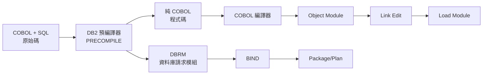

#### SQL 語句基本格式

```cobol
      *-----------------------
      * SQL 語句必須包在 EXEC SQL ... END-EXEC 中
      *-----------------------
           EXEC SQL
               SELECT ACCT_NAME, BALANCE
               INTO :WS-ACCT-NAME, :WS-BALANCE
               FROM ACCOUNT_TABLE
               WHERE ACCT_NO = :WS-ACCT-NO
           END-EXEC.
```

#### Host Variable（主機變數）

Host Variable 是 COBOL 變數，用於在 COBOL 和 SQL 之間傳遞資料。在 SQL 中使用時，前面加上冒號（:）。

```cobol
       WORKING-STORAGE SECTION.
      *-----------------------
      * 宣告為 Host Variable
      *-----------------------
       01  WS-HOST-VARS.
           05  WS-ACCT-NO       PIC X(10).
           05  WS-ACCT-NAME     PIC X(30).
           05  WS-BALANCE       PIC S9(13)V99 COMP-3.
           
      *-----------------------
      * SQL 通訊區（必要）
      *-----------------------
           EXEC SQL
               INCLUDE SQLCA
           END-EXEC.
```

#### SQLCA（SQL Communication Area）

SQLCA 是 DB2 與程式之間的通訊區域，包含 SQL 執行結果。

```cobol
      *-----------------------
      * SQLCA 重要欄位
      *-----------------------
      * SQLCODE   - SQL 執行結果代碼
      *   0       - 成功
      *   100     - 查無資料（NOT FOUND）
      *   < 0     - 錯誤
      *
      * SQLERRD(3) - INSERT/UPDATE/DELETE 影響的筆數
      * SQLWARN0  - 警告旗標
```

---

### 6.2 SELECT / INSERT / UPDATE / DELETE 範例

#### SELECT - 單筆查詢

```cobol
       2100-SELECT-ACCOUNT.
           EXEC SQL
               SELECT ACCT_NAME,
                      BALANCE,
                      STATUS
               INTO :WS-ACCT-NAME,
                    :WS-BALANCE,
                    :WS-STATUS
               FROM ACCOUNT_TABLE
               WHERE ACCT_NO = :WS-ACCT-NO
           END-EXEC
           
           EVALUATE SQLCODE
               WHEN 0
                   SET RECORD-FOUND TO TRUE
               WHEN 100
                   SET RECORD-NOT-FOUND TO TRUE
                   DISPLAY "帳號不存在: " WS-ACCT-NO
               WHEN OTHER
                   PERFORM 9200-SQL-ERROR
           END-EVALUATE.
```

#### SELECT - 多筆查詢（CURSOR）

```cobol
      *-----------------------
      * 宣告 CURSOR
      *-----------------------
           EXEC SQL
               DECLARE ACCT_CURSOR CURSOR FOR
               SELECT ACCT_NO,
                      ACCT_NAME,
                      BALANCE
               FROM ACCOUNT_TABLE
               WHERE STATUS = 'A'
               ORDER BY ACCT_NO
           END-EXEC.
           
      *-----------------------
      * 使用 CURSOR
      *-----------------------
       2100-OPEN-CURSOR.
           EXEC SQL
               OPEN ACCT_CURSOR
           END-EXEC
           IF SQLCODE NOT = 0
               PERFORM 9200-SQL-ERROR
           END-IF.
           
       2200-FETCH-CURSOR.
           EXEC SQL
               FETCH ACCT_CURSOR
               INTO :WS-ACCT-NO,
                    :WS-ACCT-NAME,
                    :WS-BALANCE
           END-EXEC
           
           EVALUATE SQLCODE
               WHEN 0
                   CONTINUE
               WHEN 100
                   SET CURSOR-END TO TRUE
               WHEN OTHER
                   PERFORM 9200-SQL-ERROR
           END-EVALUATE.
           
       2300-CLOSE-CURSOR.
           EXEC SQL
               CLOSE ACCT_CURSOR
           END-EXEC.
```

#### INSERT - 新增記錄

```cobol
       2400-INSERT-ACCOUNT.
           EXEC SQL
               INSERT INTO ACCOUNT_TABLE
               (ACCT_NO,
                ACCT_NAME,
                BALANCE,
                OPEN_DATE,
                STATUS)
               VALUES
               (:WS-ACCT-NO,
                :WS-ACCT-NAME,
                :WS-BALANCE,
                :WS-OPEN-DATE,
                'A')
           END-EXEC
           
           EVALUATE SQLCODE
               WHEN 0
                   ADD 1 TO WS-INSERT-CNT
               WHEN -803
                   DISPLAY "帳號已存在: " WS-ACCT-NO
                   ADD 1 TO WS-DUP-CNT
               WHEN OTHER
                   PERFORM 9200-SQL-ERROR
           END-EVALUATE.
```

#### UPDATE - 更新記錄

```cobol
       2500-UPDATE-BALANCE.
           EXEC SQL
               UPDATE ACCOUNT_TABLE
               SET BALANCE = :WS-NEW-BALANCE,
                   LAST_UPDATE = CURRENT TIMESTAMP
               WHERE ACCT_NO = :WS-ACCT-NO
           END-EXEC
           
           EVALUATE SQLCODE
               WHEN 0
                   IF SQLERRD(3) = 0
                       DISPLAY "查無更新對象: " WS-ACCT-NO
                   ELSE
                       ADD 1 TO WS-UPDATE-CNT
                   END-IF
               WHEN OTHER
                   PERFORM 9200-SQL-ERROR
           END-EVALUATE.
```

#### DELETE - 刪除記錄

```cobol
       2600-DELETE-ACCOUNT.
           EXEC SQL
               DELETE FROM ACCOUNT_TABLE
               WHERE ACCT_NO = :WS-ACCT-NO
                 AND STATUS = 'C'
           END-EXEC
           
           EVALUATE SQLCODE
               WHEN 0
                   MOVE SQLERRD(3) TO WS-DELETE-CNT
                   DISPLAY "刪除筆數: " WS-DELETE-CNT
               WHEN OTHER
                   PERFORM 9200-SQL-ERROR
           END-EVALUATE.
```

---

### 6.3 SQLCODE / SQLSTATE 處理方式

#### 常見 SQLCODE 對照表

| SQLCODE | 說明 | 處理建議 |
|---------|------|----------|
| 0 | 成功 | 正常處理 |
| 100 | 查無資料 | 非錯誤，正常情況 |
| -180 | 日期/時間格式錯誤 | 檢查輸入資料格式 |
| -204 | 物件不存在 | 檢查表格/索引名稱 |
| -501 | Cursor 未開啟 | 檢查程式邏輯 |
| -803 | 重複 Key | 資料已存在 |
| -805 | Package 不存在 | 需要重新 BIND |
| -811 | SELECT 回傳多筆 | 改用 CURSOR 或加條件 |
| -904 | 資源不可用 | 等待後重試 |
| -911 | Deadlock/Timeout | 交易被回滾 |
| -913 | Deadlock | 重新執行交易 |

#### 標準 SQL 錯誤處理程序

```cobol
       9200-SQL-ERROR.
           MOVE SQLCODE TO WS-SQLCODE-DISPLAY
           DISPLAY "************************************"
           DISPLAY "* SQL ERROR OCCURRED"
           DISPLAY "************************************"
           DISPLAY "* SQLCODE : " WS-SQLCODE-DISPLAY
           DISPLAY "* SQLSTATE: " SQLSTATE
           DISPLAY "* SQLERRM : " SQLERRMC(1:70)
           DISPLAY "************************************"
           
      *    決定是否繼續或中止
           EVALUATE TRUE
               WHEN SQLCODE = -911 OR SQLCODE = -913
      *            Deadlock - 可考慮重試
                   ADD 1 TO WS-DEADLOCK-CNT
                   IF WS-DEADLOCK-CNT < 3
                       DISPLAY "* DEADLOCK DETECTED, RETRY..."
                       EXEC SQL ROLLBACK END-EXEC
                       PERFORM 2000-RETRY-PROCESS
                   ELSE
                       SET FATAL-ERROR TO TRUE
                       MOVE 16 TO WS-RETURN-CODE
                   END-IF
               WHEN SQLCODE = -904
      *            資源暫時不可用
                   SET FATAL-ERROR TO TRUE
                   MOVE 12 TO WS-RETURN-CODE
               WHEN OTHER
      *            其他錯誤
                   SET FATAL-ERROR TO TRUE
                   MOVE 16 TO WS-RETURN-CODE
           END-EVALUATE.
```

#### 使用 SQLSTATE

SQLSTATE 是標準化的 5 位代碼，比 SQLCODE 更具可攜性：

```cobol
       WORKING-STORAGE SECTION.
       01  WS-SQLSTATE          PIC X(5).
           88  SQL-SUCCESS      VALUE '00000'.
           88  SQL-NOT-FOUND    VALUE '02000'.
           88  SQL-DUP-KEY      VALUE '23505'.
           
       PROCEDURE DIVISION.
           ...
           MOVE SQLSTATE TO WS-SQLSTATE
           
           EVALUATE TRUE
               WHEN SQL-SUCCESS
                   CONTINUE
               WHEN SQL-NOT-FOUND
                   DISPLAY "查無資料"
               WHEN SQL-DUP-KEY
                   DISPLAY "資料重複"
               WHEN OTHER
                   PERFORM 9200-SQL-ERROR
           END-EVALUATE.
```

---

### 6.4 資料一致性的觀念（Commit / Rollback）

#### 交易（Transaction）概念

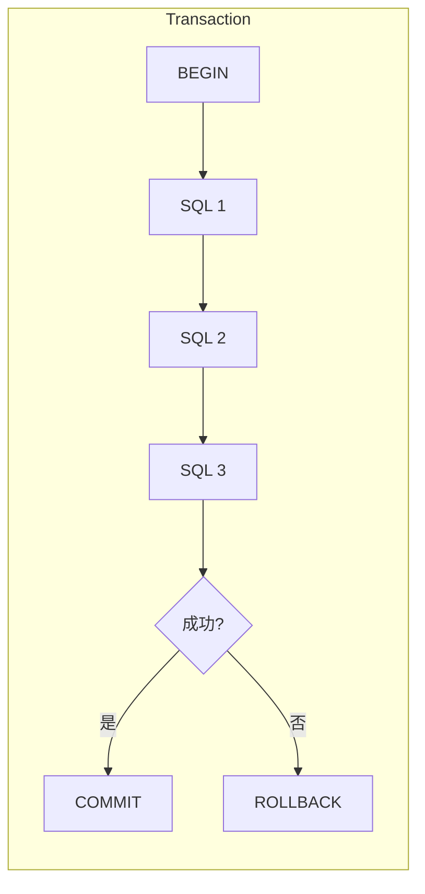

#### COMMIT 與 ROLLBACK

```cobol
      *-----------------------
      * COMMIT - 確認交易
      *-----------------------
       8100-COMMIT-TRANSACTION.
           EXEC SQL
               COMMIT
           END-EXEC
           
           IF SQLCODE NOT = 0
               DISPLAY "*** COMMIT FAILED: " SQLCODE
               PERFORM 9200-SQL-ERROR
           ELSE
               DISPLAY "TRANSACTION COMMITTED"
               ADD WS-TXN-COUNT TO WS-TOTAL-COMMITTED
               MOVE 0 TO WS-TXN-COUNT
           END-IF.
           
      *-----------------------
      * ROLLBACK - 回滾交易
      *-----------------------
       8200-ROLLBACK-TRANSACTION.
           EXEC SQL
               ROLLBACK
           END-EXEC
           
           DISPLAY "TRANSACTION ROLLED BACK"
           MOVE 0 TO WS-TXN-COUNT.
```

#### Commit 頻率設計

```cobol
       WORKING-STORAGE SECTION.
       01  WS-COMMIT-FREQ       PIC 9(5) VALUE 1000.
       01  WS-TXN-COUNT         PIC 9(5) VALUE 0.
       
       PROCEDURE DIVISION.
       2000-PROCESS-LOOP.
           PERFORM 2100-PROCESS-RECORD
           ADD 1 TO WS-TXN-COUNT
           
      *    每 1000 筆 COMMIT 一次
           IF WS-TXN-COUNT >= WS-COMMIT-FREQ
               PERFORM 8100-COMMIT-TRANSACTION
           END-IF
           
           PERFORM 1200-READ-NEXT.
           
       3000-TERMINATE.
      *    最後一批也要 COMMIT
           IF WS-TXN-COUNT > 0
               PERFORM 8100-COMMIT-TRANSACTION
           END-IF
           ...
```

> **⚠️ Commit 頻率建議**
> | 情境 | 建議頻率 | 說明 |
> |------|----------|------|
> | 一般批次 | 每 1000-5000 筆 | 平衡效能與恢復時間 |
> | 大量更新 | 每 10000 筆 | 減少 DB2 Log 壓力 |
> | 線上交易 | 每筆 | 確保即時一致性 |
> | 關鍵交易 | 每筆 | 金額交易必須每筆 Commit |

> **💡 實務提醒**
> 1. **永遠處理 SQLCODE**：不檢查 SQLCODE 是新手常見錯誤
> 2. **使用 CURSOR 處理多筆**：避免 SQLCODE -811
> 3. **適當的 Commit 頻率**：太頻繁影響效能，太少則恢復困難
> 4. **Deadlock 要有處理機制**：特別是高併發的批次作業

---

## 第七章：COBOL 程式設計規範

### 7.1 命名規則（Program / Variable / Paragraph）

#### 程式名稱（PROGRAM-ID）命名規範

| 位置 | 說明 | 範例 |
|------|------|------|
| 1-4 位 | 系統/模組代碼 | ACCT（帳務）、LOAN（放款）、CUST（客戶） |
| 5-6 位 | 功能類型 | 01=線上、02=批次、03=報表 |
| 7-8 位 | 序號 | 01-99 |

**範例**：
```
ACCT0201 = 帳務模組 + 批次程式 + 第 01 支
LOAN0101 = 放款模組 + 線上程式 + 第 01 支
CUST0301 = 客戶模組 + 報表程式 + 第 01 支
```

#### 變數命名規範

| 前綴 | 用途 | 範例 |
|------|------|------|
| `WS-` | Working-Storage 變數 | WS-COUNTER |
| `LS-` | Linkage Section 變數 | LS-INPUT-PARM |
| `IN-` | 輸入檔案欄位 | IN-ACCT-NO |
| `OUT-` | 輸出檔案欄位 | OUT-BALANCE |
| `DB-` | DB2 Host Variable | DB-ACCT-NAME |
| `SW-` | Switch / Flag | SW-EOF-FLAG |
| `CT-` | Counter（計數器） | CT-READ-CNT |
| `AC-` | Accumulator（累加器） | AC-TOTAL-AMT |
| `WK-` | 工作變數 | WK-TEMP-DATE |

#### 變數命名原則

```cobol
      *-----------------------
      * ✅ 好的命名
      *-----------------------
       01  WS-ACCOUNT-INFO.
           05  WS-ACCT-NO           PIC X(10).
           05  WS-ACCT-NAME         PIC X(30).
           05  WS-ACCT-BALANCE      PIC S9(13)V99 COMP-3.
           05  WS-ACCT-STATUS       PIC X(1).
               88  ACCT-ACTIVE      VALUE 'A'.
               88  ACCT-CLOSED      VALUE 'C'.
               88  ACCT-FROZEN      VALUE 'F'.
               
      *-----------------------
      * ❌ 不好的命名
      *-----------------------
       01  WS-DATA.
           05  A                    PIC X(10).
           05  B                    PIC X(30).
           05  AMT                  PIC S9(13)V99 COMP-3.
           05  FLG                  PIC X(1).
```

#### 段落（Paragraph）命名規範

```cobol
      *=======================================================
      * 段落編號規則
      *=======================================================
      * 0000-0999 : 主控程式
      * 1000-1999 : 初始化相關
      * 2000-2999 : 主要處理邏輯
      * 3000-3999 : 結束處理
      * 4000-4999 : 輸入處理
      * 5000-5999 : 輸出處理
      * 6000-6999 : 計算處理
      * 7000-7999 : 資料庫處理
      * 8000-8999 : 共用子程序
      * 9000-9999 : 錯誤處理
      
      *-----------------------
      * 段落命名範例
      *-----------------------
       0000-MAIN.
       1000-INITIALIZE.
       1100-OPEN-FILES.
       1200-READ-FIRST-RECORD.
       2000-PROCESS-LOOP.
       2100-VALIDATE-DATA.
       2200-CALCULATE-BALANCE.
       3000-TERMINATE.
       3100-CLOSE-FILES.
       3200-DISPLAY-SUMMARY.
       9000-ERROR-HANDLER.
       9100-ABEND-PROCESS.
```

---

### 7.2 排版與可讀性原則

#### 程式碼排版標準

```cobol
      *================================================================*
      * 程式名稱：SAMPLE01                                              *
      * 功能說明：排版範例程式                                          *
      * 作    者：SYSTEM-TEAM                                          *
      * 建立日期：2026/02/01                                           *
      *================================================================*
       IDENTIFICATION DIVISION.
       PROGRAM-ID. SAMPLE01.
       
      *================================================================*
      * 環境設定區
      *================================================================*
       ENVIRONMENT DIVISION.
       INPUT-OUTPUT SECTION.
       FILE-CONTROL.
           SELECT INPUT-FILE
               ASSIGN TO INFILE
               FILE STATUS IS WS-IN-STAT.
               
      *================================================================*
      * 資料定義區
      *================================================================*
       DATA DIVISION.
       
      *-----------------------
      * 檔案區段
      *-----------------------
       FILE SECTION.
       FD  INPUT-FILE.
       01  INPUT-RECORD         PIC X(100).
       
      *-----------------------
      * 工作儲存區段
      *-----------------------
       WORKING-STORAGE SECTION.
       
      *-----------------------
      * 檔案狀態
      *-----------------------
       01  WS-FILE-STATUS.
           05  WS-IN-STAT       PIC XX VALUE SPACES.
           
      *-----------------------
      * 處理旗標
      *-----------------------
       01  WS-FLAGS.
           05  WS-EOF-FLAG      PIC X VALUE 'N'.
               88  EOF-REACHED  VALUE 'Y'.
               
      *================================================================*
      * 程式邏輯區
      *================================================================*
       PROCEDURE DIVISION.
```

#### 縮排規則

```cobol
      *-----------------------
      * 條件判斷縮排
      *-----------------------
           IF WS-AMOUNT > 0
               IF WS-STATUS = 'A'
                   PERFORM 2100-PROCESS-ACTIVE
               ELSE
                   PERFORM 2200-PROCESS-INACTIVE
               END-IF
           ELSE
               DISPLAY "金額必須大於零"
           END-IF.
           
      *-----------------------
      * EVALUATE 縮排
      *-----------------------
           EVALUATE TRUE
               WHEN WS-TYPE = '1'
                   PERFORM 3100-TYPE-ONE
               WHEN WS-TYPE = '2'
                   PERFORM 3200-TYPE-TWO
               WHEN WS-TYPE = '3'
                   PERFORM 3300-TYPE-THREE
               WHEN OTHER
                   PERFORM 9100-INVALID-TYPE
           END-EVALUATE.
           
      *-----------------------
      * PERFORM UNTIL 縮排
      *-----------------------
           PERFORM 2000-PROCESS
               UNTIL EOF-REACHED
               OR FATAL-ERROR.
```

#### 每行長度控制

```cobol
      *-----------------------
      * 過長的語句應斷行
      *-----------------------
      * ❌ 不好的寫法（超過 72 欄）
           IF WS-ACCOUNT-NUMBER = IN-ACCOUNT-NUMBER AND WS-CUSTOMER-NAME = IN-CUSTOMER-NAME
           
      * ✅ 好的寫法
           IF WS-ACCOUNT-NUMBER = IN-ACCOUNT-NUMBER
           AND WS-CUSTOMER-NAME = IN-CUSTOMER-NAME
           
      * ✅ 使用 STRING 時的斷行
           STRING WS-FIELD-1 DELIMITED BY SPACE
                  WS-FIELD-2 DELIMITED BY SPACE
                  WS-FIELD-3 DELIMITED BY SIZE
                  INTO WS-RESULT
           END-STRING.
```

---

### 7.3 註解撰寫建議

#### 程式頭註解（必要）

```cobol
      *================================================================*
      *                                                                *
      * 程式名稱：ACCT0201                                              *
      * 功能說明：帳戶餘額日結計算批次程式                              *
      *                                                                *
      * 輸入檔案：                                                      *
      *   - TXNFILE  : 當日交易明細檔                                  *
      *   - MSTFILE  : 帳戶主檔                                        *
      *                                                                *
      * 輸出檔案：                                                      *
      *   - BALFILE  : 餘額更新檔                                      *
      *   - ERRFILE  : 錯誤記錄檔                                      *
      *                                                                *
      * 輸入參數：                                                      *
      *   - PARM 1   : 處理日期 (YYYYMMDD)                             *
      *   - PARM 2   : 執行模式 (T=測試, P=正式)                       *
      *                                                                *
      * Return Code：                                                   *
      *   - 0  : 正常結束                                              *
      *   - 4  : 警告（有跳過的記錄）                                  *
      *   - 8  : 錯誤（有處理失敗的記錄）                              *
      *   - 16 : 致命錯誤（程式中止）                                  *
      *                                                                *
      * 修改紀錄：                                                      *
      *   日期       修改者   版本  說明                               *
      *   ---------- -------- ----- ---------------------------------- *
      *   2026/02/01 王小明   1.0   初版建立                           *
      *   2026/03/15 李小華   1.1   新增外幣帳戶處理                   *
      *                                                                *
      *================================================================*
```

#### 區段註解

```cobol
      *=======================================================
      * 主控程式
      *=======================================================
       0000-MAIN.
       
      *=======================================================
      * 初始化處理
      *   - 開啟檔案
      *   - 載入參數
      *   - 初始化變數
      *=======================================================
       1000-INITIALIZE.
```

#### 行內註解

```cobol
           MOVE 0 TO WS-COUNTER             *> 重置計數器
           
           IF WS-BALANCE < 0                *> 檢查是否透支
               SET OVERDRAFT TO TRUE
           END-IF
           
      *    計算利息
      *    公式：本金 × 年利率 ÷ 365 × 天數
           COMPUTE WS-INTEREST = 
               WS-PRINCIPAL * WS-RATE / 365 * WS-DAYS.
```

#### 註解的黃金法則

| 原則 | 說明 |
|------|------|
| **解釋為什麼** | 而不是解釋做什麼（程式碼本身就說明了做什麼） |
| **解釋業務邏輯** | 說明背後的業務規則 |
| **標記重要事項** | TODO、FIXME、WARNING |
| **保持更新** | 過時的註解比沒有註解更糟糕 |

---

### 7.4 避免「維護地獄」的寫法

#### 避免 GO TO 語句

```cobol
      *-----------------------
      * ❌ 難以維護的 GO TO 寫法
      *-----------------------
       PROCESS-START.
           IF CONDITION-1
               GO TO PROCESS-A
           ELSE
               GO TO PROCESS-B
           END-IF.
       PROCESS-A.
           ...
           GO TO PROCESS-END.
       PROCESS-B.
           ...
           GO TO PROCESS-END.
       PROCESS-END.
           ...
           
      *-----------------------
      * ✅ 推薦的結構化寫法
      *-----------------------
       PROCESS-START.
           IF CONDITION-1
               PERFORM PROCESS-A
           ELSE
               PERFORM PROCESS-B
           END-IF
           PERFORM PROCESS-END.
```

#### 使用明確的範圍結束符

```cobol
      *-----------------------
      * ❌ 舊式寫法（不建議）
      *-----------------------
           IF CONDITION-1
               PERFORM PARA-A
               IF CONDITION-2
                   PERFORM PARA-B.
                   
      *-----------------------
      * ✅ 使用 END-IF（推薦）
      *-----------------------
           IF CONDITION-1
               PERFORM PARA-A
               IF CONDITION-2
                   PERFORM PARA-B
               END-IF
           END-IF.
```

#### 使用 EVALUATE 取代巢狀 IF

```cobol
      *-----------------------
      * ❌ 巢狀 IF 難以閱讀
      *-----------------------
           IF WS-TYPE = '1'
               PERFORM TYPE-1-PROCESS
           ELSE
               IF WS-TYPE = '2'
                   PERFORM TYPE-2-PROCESS
               ELSE
                   IF WS-TYPE = '3'
                       PERFORM TYPE-3-PROCESS
                   ELSE
                       PERFORM INVALID-TYPE
                   END-IF
               END-IF
           END-IF.
           
      *-----------------------
      * ✅ EVALUATE 清晰易讀
      *-----------------------
           EVALUATE WS-TYPE
               WHEN '1'
                   PERFORM TYPE-1-PROCESS
               WHEN '2'
                   PERFORM TYPE-2-PROCESS
               WHEN '3'
                   PERFORM TYPE-3-PROCESS
               WHEN OTHER
                   PERFORM INVALID-TYPE
           END-EVALUATE.
```

#### 避免過長的段落

```cobol
      *-----------------------
      * ❌ 過長的段落
      *-----------------------
       2000-PROCESS-ALL.
      *    超過 100 行的處理邏輯...
      *    難以理解、難以測試、難以維護
      
      *-----------------------
      * ✅ 分解成小段落
      *-----------------------
       2000-PROCESS-ALL.
           PERFORM 2100-VALIDATE-INPUT
           PERFORM 2200-CALCULATE-VALUES
           PERFORM 2300-UPDATE-DATABASE
           PERFORM 2400-WRITE-OUTPUT.
           
       2100-VALIDATE-INPUT.
      *    專注於輸入驗證（15-20 行）
       2200-CALCULATE-VALUES.
      *    專注於計算邏輯（15-20 行）
```

---

### 7.5 常見 Anti-pattern

#### Anti-pattern 1：魔法數字

```cobol
      *-----------------------
      * ❌ 魔法數字
      *-----------------------
           IF WS-STATUS = '1'
               MOVE 100 TO WS-LIMIT
           END-IF.
           
      *-----------------------
      * ✅ 使用有意義的常數
      *-----------------------
       01  WS-CONSTANTS.
           05  STATUS-ACTIVE     PIC X VALUE '1'.
           05  STANDARD-LIMIT    PIC 9(3) VALUE 100.
           
           IF WS-STATUS = STATUS-ACTIVE
               MOVE STANDARD-LIMIT TO WS-LIMIT
           END-IF.
```

#### Anti-pattern 2：複製貼上程式碼

```cobol
      *-----------------------
      * ❌ 重複的程式碼
      *-----------------------
       PROCESS-TYPE-A.
           OPEN INPUT FILE-A
           READ FILE-A
           MOVE IN-A-FIELD1 TO WS-FIELD1
           MOVE IN-A-FIELD2 TO WS-FIELD2
           CLOSE FILE-A.
           
       PROCESS-TYPE-B.
           OPEN INPUT FILE-B
           READ FILE-B
           MOVE IN-B-FIELD1 TO WS-FIELD1
           MOVE IN-B-FIELD2 TO WS-FIELD2
           CLOSE FILE-B.
           
      *-----------------------
      * ✅ 抽取共用程序
      *-----------------------
       PROCESS-FILE.
           OPEN INPUT WS-CURRENT-FILE
           READ WS-CURRENT-FILE INTO WS-RECORD
           PERFORM MOVE-FIELDS
           CLOSE WS-CURRENT-FILE.
```

#### Anti-pattern 3：過度使用 REDEFINES

```cobol
      *-----------------------
      * ❌ 濫用 REDEFINES（令人困惑）
      *-----------------------
       01  WS-MULTI-PURPOSE    PIC X(100).
       01  WS-AS-HEADER REDEFINES WS-MULTI-PURPOSE.
           ...
       01  WS-AS-DETAIL REDEFINES WS-MULTI-PURPOSE.
           ...
       01  WS-AS-TRAILER REDEFINES WS-MULTI-PURPOSE.
           ...
       01  WS-AS-ERROR REDEFINES WS-MULTI-PURPOSE.
           ...
           
      *-----------------------
      * ✅ 分開定義，清楚明確
      *-----------------------
       01  WS-HEADER-RECORD.
           ...
       01  WS-DETAIL-RECORD.
           ...
       01  WS-TRAILER-RECORD.
           ...
```

#### Anti-pattern 4：不處理錯誤

```cobol
      *-----------------------
      * ❌ 忽略錯誤
      *-----------------------
           OPEN INPUT INPUT-FILE.
           READ INPUT-FILE.
           
      *-----------------------
      * ✅ 完整的錯誤處理
      *-----------------------
           OPEN INPUT INPUT-FILE
           IF WS-FILE-STATUS NOT = "00"
               DISPLAY "OPEN ERROR: " WS-FILE-STATUS
               MOVE 16 TO WS-RETURN-CODE
               PERFORM 9000-ABEND-PROCESS
           END-IF.
```

#### Anti-pattern 5：硬編碼路徑或值

```cobol
      *-----------------------
      * ❌ 硬編碼
      *-----------------------
           IF WS-BRANCH = "001"
               MOVE "台北總行" TO WS-BRANCH-NAME
           END-IF.
           
      *-----------------------
      * ✅ 使用表格或外部設定
      *-----------------------
           PERFORM LOOKUP-BRANCH-NAME.
      *    從 DB 或 Table 取得分行名稱
```

---

## 第八章：舊系統維護與現代化觀點

### 8.1 如何「讀懂」舊 COBOL 程式

#### 閱讀策略

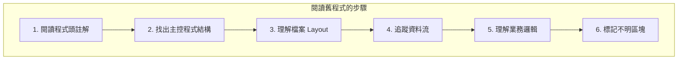

#### 步驟 1：先看程式頭

```cobol
      * 找出以下資訊：
      * - 程式名稱與功能
      * - 輸入/輸出檔案
      * - 修改歷史
      * - 相關程式
```

#### 步驟 2：找出主控結構

```cobol
      * 找到 PROCEDURE DIVISION 的第一個段落
      * 通常是 0000-MAIN 或類似名稱
      * 理解整體流程：初始化 → 處理 → 結束
```

#### 步驟 3：畫出資料流

```
輸入檔案 A ─┐
            ├──> 程式處理 ──> 輸出檔案 X
輸入檔案 B ─┘              ──> DB2 更新
                          ──> 報表輸出
```

#### 舊程式常見特徵

| 特徵 | 說明 | 處理方式 |
|------|------|----------|
| GO TO 大量使用 | 邏輯跳轉複雜 | 畫流程圖追蹤 |
| 缺乏註解 | 難以理解意圖 | 逐步加註解 |
| 變數名稱簡短 | 如 A1, X2 | 建立對照表 |
| 段落名無編號 | 如 PROCESS, CHECK | 重新編號 |
| 深層巢狀 | IF 套 IF 套 IF | 簡化或重構 |

#### 建立程式理解文件

```markdown
# OLDPROG1 程式分析

## 基本資訊
- 程式名稱：OLDPROG1
- 最後修改：2015/03/20
- 功能：帳戶利息計算

## 檔案對應
| JCL DD Name | 程式檔案名 | 用途 |
|-------------|-----------|------|
| INFILE | INPUT-FILE | 帳戶主檔 |
| OUTFILE | OUTPUT-FILE | 利息明細 |

## 主要段落
| 段落名稱 | 功能 | 呼叫關係 |
|----------|------|----------|
| MAIN-PARA | 主控 | 呼叫 INIT, PROCESS, TERM |
| INIT-PARA | 初始化 | 開檔 |
| PROCESS-PARA | 處理 | 計算利息 |

## 不明區塊
- 第 350-380 行：用途不明，似乎是舊功能
- WS-FLAG-X：旗標用途不清楚
```

---

### 8.2 如何安全修改老程式

#### 修改前檢查清單

- [ ] 理解原程式功能
- [ ] 備份原始程式碼
- [ ] 確認測試資料
- [ ] 確認相關的 JCL
- [ ] 了解上下游程式
- [ ] 評估影響範圍

#### 安全修改原則

```cobol
      *=======================================================
      * 修改原則 1：最小修改
      *=======================================================
      * 只修改必要的部分
      * 不要「順便」重構不相關的程式碼
      
      *=======================================================
      * 修改原則 2：保留原始邏輯
      *=======================================================
      * 原始程式碼：
      *    IF WS-AMT > 1000
      *        PERFORM PROCESS-A.
      *
      * 新增條件時，包住原邏輯：
           IF WS-NEW-FLAG = 'Y'
               PERFORM PROCESS-NEW
           ELSE
      *        以下為原始邏輯
               IF WS-AMT > 1000
                   PERFORM PROCESS-A
               END-IF
           END-IF.
```

#### 修改記錄格式

```cobol
      *================================================================*
      * 修改記錄                                                        *
      *================================================================*
      *  日期       修改者   需求單號  說明                            *
      *  ---------- -------- --------- ------------------------------- *
      *  2026/02/15 李小明   CR-2026001 新增外幣帳戶處理               *
      *================================================================*
      
      *-------------------------------------------------------*
      * 2026/02/15 李小明 CR-2026001 START                    *
      *-------------------------------------------------------*
           IF WS-CURRENCY NOT = "TWD"
               PERFORM 2500-PROCESS-FOREIGN-CURRENCY
           END-IF.
      *-------------------------------------------------------*
      * 2026/02/15 李小明 CR-2026001 END                      *
      *-------------------------------------------------------*
```

#### 測試策略

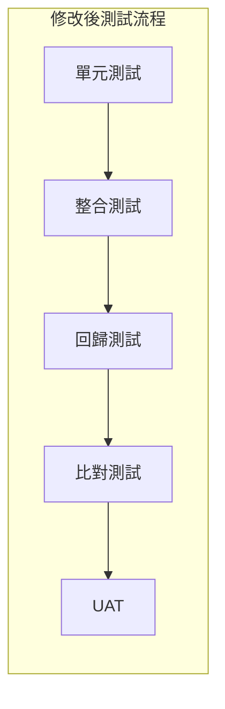

**比對測試重點**：
- 修改前後輸出檔案比對
- 記錄筆數核對
- 金額總計核對
- 特殊案例驗證

---

### 8.3 與現代系統整合概念

#### 整合方式總覽

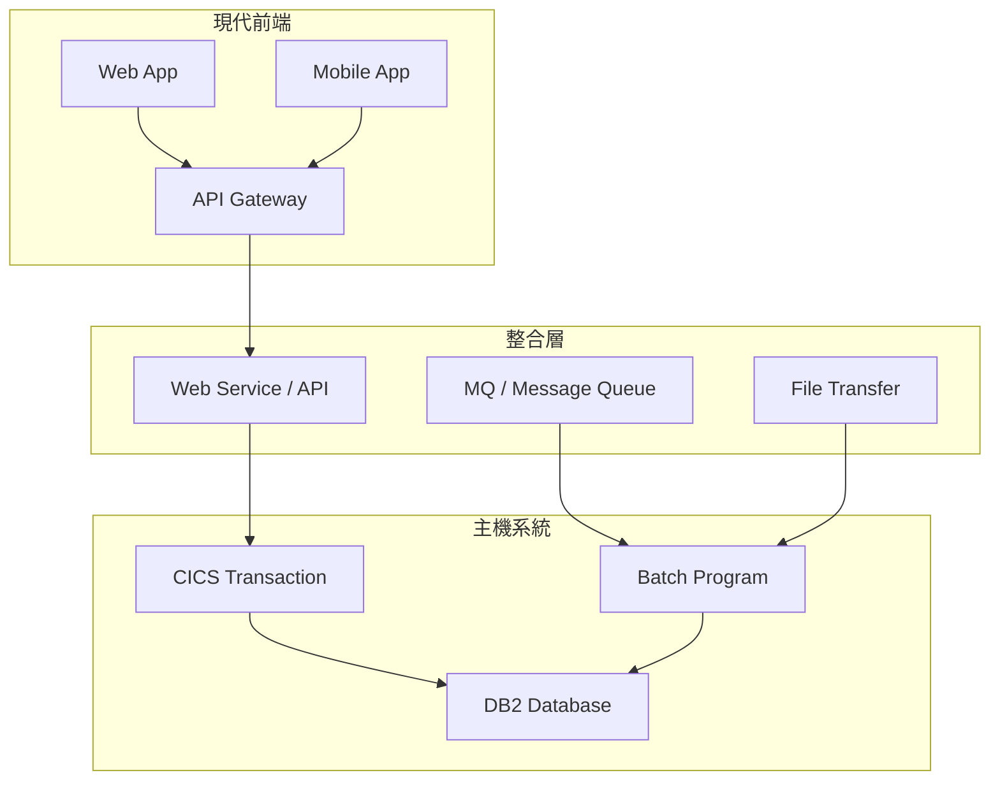

#### 整合方式比較

| 整合方式 | 適用場景 | 優點 | 缺點 |
|----------|----------|------|------|
| **MQ** | 非同步、批次觸發 | 解耦、可靠 | 非即時 |
| **Web Service** | 即時查詢/交易 | 即時、標準化 | 效能考量 |
| **檔案傳輸** | 大量資料交換 | 簡單、效能好 | 非即時 |
| **DB Link** | 資料共享 | 直接存取 | 耦合度高 |

#### COBOL 與 Java 整合範例（概念）

**方式一：透過 MQ**

```
Java App ──> MQ ──> COBOL Batch
                    │
                    v
                 處理結果
                    │
                    v
            MQ ──> Java App
```

**方式二：透過 Web Service（CICS）**

```
Java App ──> REST API ──> CICS Web Service
                              │
                              v
                         COBOL Program
                              │
                              v
                         JSON Response
                              │
                              v
                         Java App
```

#### COBOL 程式提供服務的考量

```cobol
      *=======================================================
      * 作為服務的 COBOL 程式設計考量
      *=======================================================
      * 1. 輸入/輸出使用結構化格式
      * 2. 錯誤訊息標準化
      * 3. Return Code 有意義
      * 4. 效能考量（避免大量迴圈在線上執行）
      * 5. 日誌記錄便於追蹤
```

---

### 8.4 COBOL 在未來系統中的定位

#### COBOL 不會消失的原因

1. **龐大的程式碼庫**
   - 全球超過 2200 億行 COBOL 程式碼
   - 重寫成本過高

2. **穩定性需求**
   - 核心系統不能冒險
   - COBOL 經過數十年驗證

3. **效能優勢**
   - 批次處理效能極佳
   - 數值運算精準

#### 現代化策略

| 策略 | 說明 | 適用情境 |
|------|------|----------|
| **維護現狀** | 持續維護 COBOL | 穩定運行的系統 |
| **包裝服務** | 用 API 包裝 COBOL | 需要對外開放 |
| **漸進遷移** | 逐步改寫關鍵模組 | 長期規劃 |
| **完全重寫** | 用新技術重建 | 高風險、高成本 |

#### 給 COBOL 工程師的建議

1. **持續精進 COBOL 技能**
   - 這是稀缺且有價值的技能

2. **學習整合技術**
   - 了解 MQ、Web Service、API
   - 理解現代架構

3. **理解業務領域**
   - 金融、保險業務知識
   - 這是無法被 AI 輕易取代的

4. **參與現代化專案**
   - 了解新舊系統整合
   - 成為不可或缺的橋樑

---

## 第九章：新手常見問題（FAQ）

### Q1：為什麼 COBOL 看起來這麼冗長？

**回答**：

COBOL 設計於 1959 年，當時的設計理念是：
- **可讀性優先**：程式碼要像英文文章，非技術人員也能理解
- **自我文件化**：減少對額外文件的依賴
- **明確性**：避免歧義，每個動作都明確描述

```cobol
      * COBOL 的冗長是「設計特性」而非「缺陷」
      * 比較以下兩種寫法：
      
      * Java:
      * balance += amount;
      
      * COBOL:
           ADD TRANSACTION-AMOUNT TO ACCOUNT-BALANCE.
      
      * COBOL 版本更容易理解業務含義
```

---

### Q2：為什麼不把 COBOL 改成 Java？

**回答**：

| 考量 | 說明 |
|------|------|
| **成本** | 數十年累積的程式碼，改寫成本驚人 |
| **風險** | 核心系統不能出錯，重寫風險極高 |
| **效能** | COBOL 批次處理效能可能更好 |
| **人力** | 需要同時懂 COBOL 和 Java 的人才 |
| **時間** | 重寫可能需要 5-10 年 |

**實際案例**：
- 某大型銀行曾嘗試重寫核心系統，花了 8 年、數十億預算，最終放棄
- 更務實的做法是：保留核心 COBOL，用 API 包裝對外服務

---

### Q3：初學者最容易踩的雷？

**Top 5 新手常見錯誤**：

| 排名 | 錯誤 | 後果 |
|------|------|------|
| 1 | 不檢查 FILE STATUS | 檔案錯誤不知道 |
| 2 | 數值欄位未初始化 | S0C7 Abend |
| 3 | 不檢查 SQLCODE | 資料不一致 |
| 4 | PIC 長度不夠 | 資料截斷 |
| 5 | 忘記 END-IF/END-PERFORM | 邏輯錯誤 |

---

### Q4：如何有效學習與除錯 COBOL？

**學習路徑建議**：


**除錯技巧**：

1. **善用 DISPLAY**
   ```cobol
           DISPLAY "DEBUG: WS-COUNTER = " WS-COUNTER
           DISPLAY "DEBUG: WS-AMOUNT = " WS-AMOUNT
   ```

2. **檢查 FILE STATUS**
   ```cobol
           IF WS-FILE-STATUS NOT = "00"
               DISPLAY "FILE ERROR: " WS-FILE-STATUS
           END-IF
   ```

3. **使用 Debugging Mode**
   - 編譯時加入 DEBUG 選項
   - 使用 USE FOR DEBUGGING 宣告

4. **查看 Abend Dump**
   - 學會閱讀 System Dump
   - 找出出錯的 Offset

5. **建立測試案例**
   - 正常案例
   - 邊界案例
   - 錯誤案例

---

### Q5：主機環境和 PC 開發有什麼不同？

| 項目 | PC 開發 | 主機開發 |
|------|---------|----------|
| 編輯器 | VS Code, IntelliJ | ISPF, 3270 終端機 |
| 編譯 | IDE 整合 | JCL 提交 |
| 執行 | 直接執行 | JCL 排程 |
| 除錯 | 圖形化 Debugger | Dump 分析 |
| 版控 | Git | Endevor, SCLM |

**建議**：
- 可以在 PC 上用 GnuCOBOL 練習語法
- 實際專案還是要在主機環境操作

---

### Q6：COBOL 還有未來嗎？

**回答**：**有的，但需要轉型。**

**市場現況**：
- 全球仍有數百萬 COBOL 工程師職缺
- 薪資因人才短缺而上漲
- 但新進人才不足

**建議方向**：
1. 精通 COBOL + 了解現代架構
2. 成為「老系統現代化」專家
3. 掌握業務領域知識
4. 學習 DevOps 和自動化

---

## 附錄 A：COBOL 開發檢查清單（Checklist）

### 程式開發前檢查

- [ ] 需求文件已確認
- [ ] 檔案 Layout 文件已取得
- [ ] DB2 表格結構已確認
- [ ] 相關程式已了解
- [ ] 測試資料已準備

### 程式撰寫檢查

- [ ] 程式頭註解完整
- [ ] PROGRAM-ID 符合命名規範
- [ ] 變數命名有意義
- [ ] 所有變數已初始化
- [ ] FILE STATUS 已檢查
- [ ] SQLCODE 已檢查
- [ ] 使用 END-IF/END-PERFORM 等範圍結束符
- [ ] 避免使用 GO TO
- [ ] 段落有編號且有意義
- [ ] 適當的註解

### 檔案處理檢查

- [ ] OPEN 後檢查 FILE STATUS
- [ ] READ 後處理 EOF
- [ ] WRITE 後檢查 FILE STATUS
- [ ] CLOSE 所有開啟的檔案
- [ ] 處理統計數字正確

### 資料庫處理檢查

- [ ] 包含 SQLCA
- [ ] 每個 SQL 後檢查 SQLCODE
- [ ] 適當的 COMMIT 頻率
- [ ] 處理 Deadlock 情況
- [ ] CURSOR 正確 OPEN/CLOSE

### 錯誤處理檢查

- [ ] 有錯誤處理段落
- [ ] Return Code 設計正確
- [ ] 錯誤訊息清楚
- [ ] 錯誤時記錄足夠資訊

### 測試前檢查

- [ ] 編譯無 Warning
- [ ] JCL 準備完成
- [ ] 測試資料涵蓋各種情況
- [ ] 預期結果已確認

### 上線前檢查

- [ ] 程式碼 Review 完成
- [ ] 測試報告完整
- [ ] 文件已更新
- [ ] 備份計畫已確認
- [ ] 回滾計畫已準備

---

## 附錄 B：常用 COBOL 關鍵字速查表

### 資料定義關鍵字

| 關鍵字 | 說明 | 範例 |
|--------|------|------|
| `PIC` / `PICTURE` | 定義資料格式 | `PIC X(10)` |
| `VALUE` | 設定初始值 | `VALUE SPACES` |
| `REDEFINES` | 重新定義 | `REDEFINES WS-DATA` |
| `OCCURS` | 陣列 | `OCCURS 10 TIMES` |
| `COMP` / `COMP-3` | 壓縮格式 | `COMP-3` |
| `FILLER` | 填充欄位 | `05 FILLER PIC X(10)` |

### 流程控制關鍵字

| 關鍵字 | 說明 | 範例 |
|--------|------|------|
| `IF...END-IF` | 條件判斷 | `IF A = B ... END-IF` |
| `EVALUATE` | 多重條件 | `EVALUATE TRUE...` |
| `PERFORM` | 執行段落 | `PERFORM 1000-INIT` |
| `PERFORM UNTIL` | 迴圈 | `PERFORM UNTIL EOF` |
| `STOP RUN` | 程式結束 | `STOP RUN` |

### 資料操作關鍵字

| 關鍵字 | 說明 | 範例 |
|--------|------|------|
| `MOVE` | 資料搬移 | `MOVE A TO B` |
| `ADD` | 加法 | `ADD 1 TO CNT` |
| `SUBTRACT` | 減法 | `SUBTRACT A FROM B` |
| `MULTIPLY` | 乘法 | `MULTIPLY A BY B` |
| `DIVIDE` | 除法 | `DIVIDE A BY B` |
| `COMPUTE` | 運算 | `COMPUTE C = A + B` |
| `INITIALIZE` | 初始化 | `INITIALIZE WS-REC` |
| `STRING` | 串接 | `STRING A B INTO C` |
| `UNSTRING` | 拆解 | `UNSTRING A INTO B C` |

### 檔案操作關鍵字

| 關鍵字 | 說明 | 範例 |
|--------|------|------|
| `OPEN` | 開檔 | `OPEN INPUT FILE1` |
| `CLOSE` | 關檔 | `CLOSE FILE1` |
| `READ` | 讀取 | `READ FILE1 AT END...` |
| `WRITE` | 寫入 | `WRITE REC1` |
| `REWRITE` | 更新 | `REWRITE REC1` |
| `DELETE` | 刪除 | `DELETE FILE1` |

---

## 附錄 C：SQLCODE 常見錯誤碼對照表

### 成功與警告代碼

| SQLCODE | SQLSTATE | 說明 |
|---------|----------|------|
| 0 | 00000 | 成功執行 |
| 100 | 02000 | 查無資料（NOT FOUND） |

### 常見錯誤代碼

| SQLCODE | SQLSTATE | 說明 | 處理建議 |
|---------|----------|------|----------|
| -117 | 42802 | INSERT 欄位數不符 | 檢查 SQL 語法 |
| -180 | 22007 | 日期/時間格式錯誤 | 檢查輸入資料 |
| -181 | 22007 | 日期/時間值無效 | 檢查日期有效性 |
| -204 | 42704 | 物件不存在 | 檢查表格/索引名稱 |
| -206 | 42703 | 欄位不存在 | 檢查欄位名稱 |
| -305 | 22002 | NULL 值無法放入 Host Variable | 使用 Indicator 變數 |
| -407 | 23502 | 不允許 NULL | 提供必要值 |
| -501 | 24501 | Cursor 未開啟 | 檢查 OPEN 執行 |
| -502 | 24502 | Cursor 已開啟 | 先 CLOSE 再 OPEN |
| -530 | 23503 | 外鍵限制違反 | 檢查參照完整性 |
| -532 | 23504 | 刪除限制違反 | 先刪除子記錄 |
| -803 | 23505 | 重複 Key | 資料已存在 |
| -805 | 51002 | Package 不存在 | 需要重新 BIND |
| -811 | 21000 | SELECT 回傳多筆 | 使用 CURSOR |
| -818 | 51003 | Timestamp 不符 | 重新編譯+BIND |
| -904 | 57011 | 資源不可用 | 等待後重試 |
| -911 | 40001 | Deadlock/Timeout | 交易被回滾，重試 |
| -913 | 57033 | Deadlock | 重新執行交易 |

### 錯誤處理範例

```cobol
       9200-HANDLE-SQLCODE.
           EVALUATE SQLCODE
               WHEN 0
                   CONTINUE
               WHEN 100
                   SET RECORD-NOT-FOUND TO TRUE
               WHEN -803
                   DISPLAY "資料重複: " WS-KEY-FIELD
                   ADD 1 TO WS-DUP-COUNT
               WHEN -811
                   DISPLAY "查詢回傳多筆，請使用 CURSOR"
                   SET FATAL-ERROR TO TRUE
               WHEN -911
               WHEN -913
                   DISPLAY "Deadlock 發生，嘗試重試..."
                   EXEC SQL ROLLBACK END-EXEC
                   ADD 1 TO WS-RETRY-COUNT
                   IF WS-RETRY-COUNT < 3
                       PERFORM 2000-RETRY-PROCESS
                   ELSE
                       SET FATAL-ERROR TO TRUE
                   END-IF
               WHEN OTHER
                   DISPLAY "SQL 錯誤: " SQLCODE
                   SET FATAL-ERROR TO TRUE
           END-EVALUATE.
```

---

## 結語

本手冊涵蓋了 COBOL 開發的核心知識，從基礎語法到實務應用。COBOL 雖然是一門「老」語言，但在金融、保險等關鍵領域仍然扮演著不可或缺的角色。

**給新手的話**：
- 不要被 COBOL 的冗長嚇到，這是它的特色，不是缺點
- 專注於理解業務邏輯，而非只是語法
- 建立良好的程式設計習慣，寫出可維護的程式碼

**給資深工程師的話**：
- 持續提升技能，COBOL + 現代整合技術是稀缺組合
- 傳承知識，幫助新人理解舊系統
- 參與現代化專案，成為不可替代的專家

祝各位在 COBOL 開發的道路上順利！

---

> **文件資訊**
> - 版本：1.0
> - 最後更新：2026 年 2 月
> - 維護團隊：系統開發教育訓練小組

