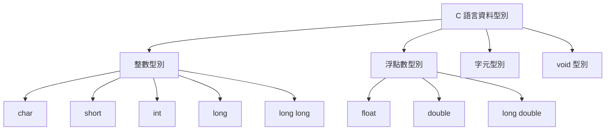
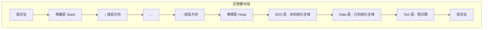
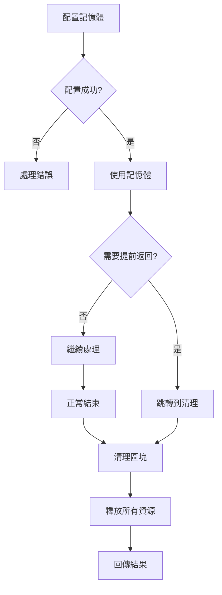
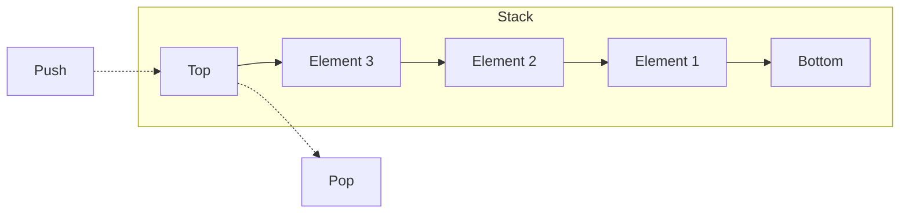
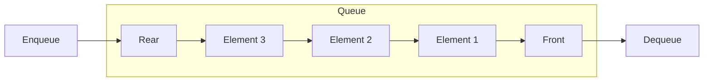
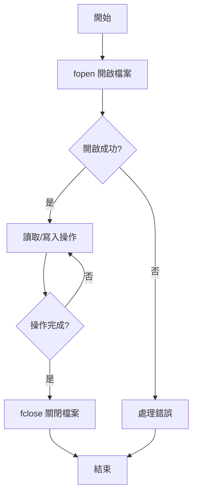
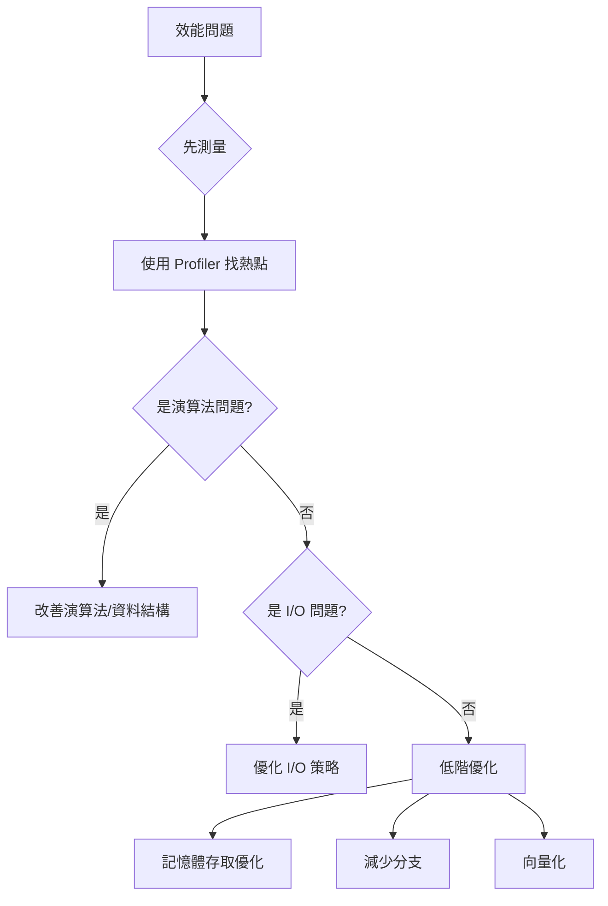

+++
date = '2026-02-03T21:20:48+08:00'
draft = false
title = 'C語言教學手冊'
tags = ['教學', '程式語言']
categories = ['教學']
+++


# C 語言教學手冊

> **版本**：1.0  
> **最後更新**：2026 年 2 月  
> **適用對象**：具備基礎程式設計概念，需進行系統層級開發的工程師


## 目錄

- [第一章：C 語言基礎](#第一章c-語言基礎)
  - [1.1 C 語言概述與開發環境](#11-c-語言概述與開發環境)
  - [1.2 資料型別與變數](#12-資料型別與變數)
  - [1.3 運算子與表達式](#13-運算子與表達式)
  - [1.4 控制流程](#14-控制流程)
  - [1.5 函數定義與呼叫](#15-函數定義與呼叫)
- [第二章：記憶體管理](#第二章記憶體管理)
  - [2.1 指標基礎與進階應用](#21-指標基礎與進階應用)
  - [2.2 動態記憶體配置](#22-動態記憶體配置)
  - [2.3 記憶體洩漏預防](#23-記憶體洩漏預防)
  - [2.4 常見陷阱與最佳實踐](#24-常見陷阱與最佳實踐)
- [第三章：資料結構](#第三章資料結構)
  - [3.1 陣列與字串處理](#31-陣列與字串處理)
  - [3.2 結構體與聯合](#32-結構體與聯合)
  - [3.3 鏈結串列](#33-鏈結串列)
  - [3.4 堆疊與佇列實作](#34-堆疊與佇列實作)
- [第四章：系統程式設計](#第四章系統程式設計)
  - [4.1 檔案 I/O 操作](#41-檔案-io-操作)
  - [4.2 錯誤處理機制](#42-錯誤處理機制)
  - [4.3 多檔案專案組織](#43-多檔案專案組織)
  - [4.4 Makefile 使用](#44-makefile-使用)
- [第五章：進階主題](#第五章進階主題)
  - [5.1 函數指標](#51-函數指標)
  - [5.2 前置處理器與巨集](#52-前置處理器與巨集)
  - [5.3 位元操作](#53-位元操作)
  - [5.4 多執行緒基礎](#54-多執行緒基礎)
- [第六章：開發規範與最佳實踐](#第六章開發規範與最佳實踐)
  - [6.1 命名規範](#61-命名規範)
  - [6.2 程式碼風格指南](#62-程式碼風格指南)
  - [6.3 除錯技巧](#63-除錯技巧)
  - [6.4 效能優化建議](#64-效能優化建議)
- [附錄：檢查清單](#附錄檢查清單)

---

## 第一章：C 語言基礎

### 1.1 C 語言概述與開發環境

#### 1.1.1 為什麼選擇 C 語言

C 語言自 1972 年由 Dennis Ritchie 在貝爾實驗室開發以來，至今仍是系統程式設計的首選語言：

| 特性 | 說明 |
|------|------|
| **高效能** | 接近硬體層級，執行速度快 |
| **可移植性** | 跨平台編譯，一次撰寫多處執行 |
| **低階存取** | 直接操作記憶體與硬體 |
| **系統基礎** | 作業系統、驅動程式、嵌入式系統的基石 |

#### 1.1.2 開發環境建置


**Linux/Unix 環境**：
```bash
# 安裝 GCC 編譯器
sudo apt-get install build-essential  # Debian/Ubuntu
sudo yum groupinstall "Development Tools"  # CentOS/RHEL

# 驗證安裝
gcc --version
```

**編譯與執行流程**：
```bash
# 基本編譯
gcc -o program program.c

# 完整編譯選項（建議用於開發）
gcc -Wall -Wextra -Werror -std=c11 -g -o program program.c

# 執行程式
./program
```

| 編譯選項 | 說明 |
|----------|------|
| `-Wall` | 啟用所有常見警告 |
| `-Wextra` | 啟用額外警告 |
| `-Werror` | 將警告視為錯誤 |
| `-std=c11` | 使用 C11 標準 |
| `-g` | 包含除錯資訊 |
| `-O2` | 啟用最佳化（正式環境） |

#### 1.1.3 第一個 C 程式

```c
/**
 * @file hello.c
 * @brief 第一個 C 語言程式範例
 * @author Your Name
 * @date 2026-02-02
 */

#include <stdio.h>   /* 標準輸入輸出函式庫 */
#include <stdlib.h>  /* 標準函式庫 */

/**
 * @brief 程式進入點
 * @param argc 命令列參數數量
 * @param argv 命令列參數陣列
 * @return 程式結束狀態碼
 */
int main(int argc, char *argv[])
{
    printf("Hello, System Programming!\n");
    return EXIT_SUCCESS;  /* 回傳 0 表示成功 */
}
```

> **💡 實務建議**：
> - 永遠使用 `-Wall -Wextra` 編譯，及早發現潛在問題
> - 正式環境使用 `-O2` 最佳化，但開發時使用 `-g` 便於除錯
> - 使用 `EXIT_SUCCESS` 和 `EXIT_FAILURE` 取代硬編碼的 0 和 1

---

### 1.2 資料型別與變數

#### 1.2.1 基本資料型別



**整數型別與大小（64 位元系統）**：

| 型別 | 大小（bytes） | 範圍 | 用途 |
|------|---------------|------|------|
| `char` | 1 | -128 ~ 127 | 字元、小整數 |
| `unsigned char` | 1 | 0 ~ 255 | 位元組資料 |
| `short` | 2 | -32,768 ~ 32,767 | 小範圍整數 |
| `int` | 4 | -2³¹ ~ 2³¹-1 | 一般整數 |
| `long` | 8 | -2⁶³ ~ 2⁶³-1 | 大範圍整數 |
| `size_t` | 8 | 0 ~ 2⁶⁴-1 | 記憶體大小 |

#### 1.2.2 固定寬度整數型別（推薦）

```c
#include <stdint.h>
#include <inttypes.h>

/* 精確寬度整數型別 - 系統程式設計首選 */
int8_t   byte_val   = -128;        /* 精確 8 位元有號 */
uint8_t  ubyte_val  = 255;         /* 精確 8 位元無號 */
int16_t  short_val  = -32768;      /* 精確 16 位元有號 */
uint16_t ushort_val = 65535;       /* 精確 16 位元無號 */
int32_t  int_val    = -2147483648; /* 精確 32 位元有號 */
uint32_t uint_val   = 4294967295U; /* 精確 32 位元無號 */
int64_t  long_val   = -9223372036854775807LL;
uint64_t ulong_val  = 18446744073709551615ULL;

/* 列印格式化 */
printf("int32: %" PRId32 "\n", int_val);
printf("uint64: %" PRIu64 "\n", ulong_val);
```

> **⚠️ 重要**：系統程式設計中，務必使用 `<stdint.h>` 定義的固定寬度型別，確保跨平台一致性。

#### 1.2.3 變數宣告與初始化

```c
/* ✅ 正確：宣告時立即初始化 */
int counter = 0;
char *buffer = NULL;
double rate = 0.0;

/* ❌ 錯誤：未初始化可能導致未定義行為 */
int value;           /* 包含垃圾值 */
char *ptr;           /* 野指標 */

/* const 修飾符 - 唯讀變數 */
const int MAX_BUFFER_SIZE = 4096;
const char *ERROR_MSG = "Operation failed";

/* static 修飾符 */
static int call_count = 0;  /* 函數內：保持值；檔案內：限制可見性 */

/* volatile 修飾符 - 防止編譯器最佳化 */
volatile int hardware_register;  /* 硬體暫存器存取 */
```

#### 1.2.4 型別轉換

```c
#include <stdio.h>
#include <stdint.h>

void demonstrate_type_conversion(void)
{
    /* 隱式轉換（自動） - 小型別轉大型別 */
    int32_t small = 100;
    int64_t large = small;  /* 安全的隱式轉換 */
    
    /* ⚠️ 危險的隱式轉換 */
    int32_t signed_val = -1;
    uint32_t unsigned_val = signed_val;  /* 變成 4294967295！ */
    
    /* ✅ 顯式轉換（明確表達意圖） */
    double pi = 3.14159;
    int32_t truncated = (int32_t)pi;  /* 截斷為 3 */
    
    /* 指標轉換（需謹慎） */
    void *generic_ptr = malloc(100);
    char *char_ptr = (char *)generic_ptr;
    
    /* 整數與指標轉換 */
    uintptr_t addr = (uintptr_t)generic_ptr;  /* 指標轉整數 */
    void *restored = (void *)addr;            /* 整數轉回指標 */
    
    free(generic_ptr);
}
```

> **💡 實務建議**：
> - 混合有號/無號運算時，務必明確轉型
> - 使用 `uintptr_t` 進行指標與整數的轉換
> - 避免隱式截斷，例如將 `long` 賦值給 `int`

---

### 1.3 運算子與表達式

#### 1.3.1 運算子優先順序

```c
/* 運算子優先順序（由高到低） */
/*
 * 1. () [] -> .                    成員存取
 * 2. ! ~ ++ -- + - * & (type) sizeof  單元運算
 * 3. * / %                         乘除
 * 4. + -                           加減
 * 5. << >>                         位移
 * 6. < <= > >=                     比較
 * 7. == !=                         相等
 * 8. &                             位元 AND
 * 9. ^                             位元 XOR
 * 10. |                            位元 OR
 * 11. &&                           邏輯 AND
 * 12. ||                           邏輯 OR
 * 13. ?:                           條件運算
 * 14. = += -= *= /= %= &= ^= |= <<= >>=  賦值
 * 15. ,                            逗號
 */
```

#### 1.3.2 常用運算子範例

```c
#include <stdio.h>
#include <stdbool.h>

void demonstrate_operators(void)
{
    /* 算術運算子 */
    int a = 17, b = 5;
    printf("17 / 5 = %d\n", a / b);   /* 整數除法：3 */
    printf("17 %% 5 = %d\n", a % b);  /* 餘數：2 */
    
    /* 位元運算子 */
    uint8_t flags = 0b00001111;
    flags |= 0b00010000;   /* 設定位元 4 */
    flags &= ~0b00000001;  /* 清除位元 0 */
    flags ^= 0b00000010;   /* 切換位元 1 */
    
    /* 邏輯運算子（短路求值） */
    int *ptr = NULL;
    if (ptr != NULL && *ptr > 0) {  /* ptr 為 NULL 時不會存取 *ptr */
        printf("Value: %d\n", *ptr);
    }
    
    /* 條件運算子 */
    int max = (a > b) ? a : b;
    
    /* sizeof 運算子 */
    printf("int size: %zu bytes\n", sizeof(int));
    
    int nums[] = {1, 2, 3, 4, 5};
    printf("array size: %zu elements\n", sizeof(nums) / sizeof(nums[0]));
    
    /* 遞增/遞減 */
    int i = 5;
    int pre = ++i;   /* i = 6, pre = 6（先遞增再取值） */
    int post = i++;  /* post = 6, i = 7（先取值再遞增） */
}
```

#### 1.3.3 安全的運算實踐

```c
#include <limits.h>
#include <stdbool.h>

/* ✅ 安全的加法（檢查溢位） */
bool safe_add_int32(int32_t a, int32_t b, int32_t *result)
{
    if ((b > 0 && a > INT32_MAX - b) ||
        (b < 0 && a < INT32_MIN - b)) {
        return false;  /* 溢位 */
    }
    *result = a + b;
    return true;
}

/* ✅ 安全的乘法（檢查溢位） */
bool safe_multiply_int32(int32_t a, int32_t b, int32_t *result)
{
    if (a > 0) {
        if (b > 0) {
            if (a > INT32_MAX / b) return false;
        } else {
            if (b < INT32_MIN / a) return false;
        }
    } else {
        if (b > 0) {
            if (a < INT32_MIN / b) return false;
        } else {
            if (a != 0 && b < INT32_MAX / a) return false;
        }
    }
    *result = a * b;
    return true;
}

/* 使用範例 */
void calculation_example(void)
{
    int32_t result;
    if (safe_add_int32(INT32_MAX, 1, &result)) {
        printf("Result: %d\n", result);
    } else {
        fprintf(stderr, "Error: Integer overflow detected\n");
    }
}
```

---

### 1.4 控制流程

#### 1.4.1 條件判斷

```c
#include <stdio.h>
#include <stdbool.h>

/* if-else 結構 */
int validate_age(int age)
{
    if (age < 0) {
        fprintf(stderr, "Error: Age cannot be negative\n");
        return -1;
    } else if (age < 18) {
        printf("Minor\n");
        return 0;
    } else if (age < 65) {
        printf("Adult\n");
        return 1;
    } else {
        printf("Senior\n");
        return 2;
    }
}

/* switch-case 結構 */
const char* get_day_name(int day)
{
    switch (day) {
        case 1:  return "Monday";
        case 2:  return "Tuesday";
        case 3:  return "Wednesday";
        case 4:  return "Thursday";
        case 5:  return "Friday";
        case 6:  return "Saturday";
        case 7:  return "Sunday";
        default: return "Invalid day";
    }
}

/* ✅ 良好實踐：處理所有可能的情況 */
typedef enum {
    STATUS_OK = 0,
    STATUS_ERROR,
    STATUS_PENDING,
    STATUS_COUNT  /* 用於計數 */
} Status;

void handle_status(Status status)
{
    switch (status) {
        case STATUS_OK:
            printf("Operation successful\n");
            break;
        case STATUS_ERROR:
            printf("Operation failed\n");
            break;
        case STATUS_PENDING:
            printf("Operation pending\n");
            break;
        default:
            /* 不應該到達這裡 */
            fprintf(stderr, "Unknown status: %d\n", status);
            break;
    }
}
```

#### 1.4.2 迴圈結構

```c
#include <stdio.h>
#include <string.h>

/* for 迴圈 */
void demonstrate_for_loop(void)
{
    /* 基本 for 迴圈 */
    for (int i = 0; i < 10; i++) {
        printf("%d ", i);
    }
    printf("\n");
    
    /* 遍歷陣列 */
    int numbers[] = {1, 2, 3, 4, 5};
    size_t count = sizeof(numbers) / sizeof(numbers[0]);
    
    for (size_t i = 0; i < count; i++) {
        printf("numbers[%zu] = %d\n", i, numbers[i]);
    }
}

/* while 迴圈 */
int read_until_eof(FILE *file)
{
    int ch;
    int count = 0;
    
    while ((ch = fgetc(file)) != EOF) {
        count++;
        /* 處理字元 */
    }
    
    return count;
}

/* do-while 迴圈（至少執行一次） */
int get_valid_input(void)
{
    int value;
    int result;
    
    do {
        printf("Enter a positive number: ");
        result = scanf("%d", &value);
        
        /* 清除輸入緩衝區 */
        while (getchar() != '\n');
        
    } while (result != 1 || value <= 0);
    
    return value;
}

/* 迴圈控制：break 與 continue */
void process_array(const int *arr, size_t size)
{
    for (size_t i = 0; i < size; i++) {
        if (arr[i] < 0) {
            continue;  /* 跳過負數 */
        }
        if (arr[i] == 0) {
            break;     /* 遇到 0 結束 */
        }
        printf("Processing: %d\n", arr[i]);
    }
}
```

#### 1.4.3 避免迴圈陷阱

```c
/* ❌ 錯誤：無限迴圈（unsigned 永遠 >= 0） */
void infinite_loop_bug(void)
{
    for (unsigned int i = 10; i >= 0; i--) {  /* 永遠不會結束！ */
        printf("%u\n", i);
    }
}

/* ✅ 正確：使用有號整數或調整邏輯 */
void correct_countdown(void)
{
    for (int i = 10; i >= 0; i--) {
        printf("%d\n", i);
    }
    
    /* 或使用 size_t 的正確方式 */
    for (size_t i = 10; i > 0; i--) {
        printf("%zu\n", i);
    }
    printf("0\n");  /* 額外處理 0 */
}

/* ❌ 錯誤：在迴圈中修改迭代變數 */
void dangerous_modification(int *arr, size_t size)
{
    for (size_t i = 0; i < size; i++) {
        if (arr[i] == 0) {
            i++;  /* 危險：可能跳過元素或越界 */
        }
    }
}
```

---

### 1.5 函數定義與呼叫

#### 1.5.1 函數宣告與定義

```c
#include <stdio.h>
#include <stdlib.h>
#include <stdbool.h>

/* 函數宣告（原型） - 通常放在標頭檔 */
int add(int a, int b);
bool is_valid(const char *str);
void process_data(int *data, size_t size);

/* 函數定義 */

/**
 * @brief 計算兩數之和
 * @param a 第一個整數
 * @param b 第二個整數
 * @return 兩數之和
 */
int add(int a, int b)
{
    return a + b;
}

/**
 * @brief 檢查字串是否有效
 * @param str 要檢查的字串（唯讀）
 * @return true 如果有效，否則 false
 */
bool is_valid(const char *str)
{
    return (str != NULL && str[0] != '\0');
}

/**
 * @brief 處理資料陣列
 * @param data 資料陣列指標（可修改）
 * @param size 陣列大小
 */
void process_data(int *data, size_t size)
{
    if (data == NULL || size == 0) {
        return;  /* 防禦性程式設計 */
    }
    
    for (size_t i = 0; i < size; i++) {
        data[i] *= 2;
    }
}
```

#### 1.5.2 參數傳遞方式

```c
#include <stdio.h>
#include <string.h>

/* 傳值呼叫（Pass by Value） */
void increment_value(int x)
{
    x++;  /* 只修改副本，原值不變 */
}

/* 傳址呼叫（Pass by Reference via Pointer） */
void increment_pointer(int *x)
{
    if (x != NULL) {
        (*x)++;  /* 修改原值 */
    }
}

/* 傳遞陣列（自動衰退為指標） */
void print_array(const int arr[], size_t size)
{
    /* arr 實際上是 const int* */
    for (size_t i = 0; i < size; i++) {
        printf("%d ", arr[i]);
    }
    printf("\n");
}

/* 輸出參數模式 */
bool divide(int dividend, int divisor, int *quotient, int *remainder)
{
    if (divisor == 0) {
        return false;  /* 除以零錯誤 */
    }
    
    if (quotient != NULL) {
        *quotient = dividend / divisor;
    }
    if (remainder != NULL) {
        *remainder = dividend % divisor;
    }
    
    return true;
}

/* 使用範例 */
void parameter_examples(void)
{
    int value = 10;
    
    /* 傳值 - 原值不變 */
    increment_value(value);
    printf("After increment_value: %d\n", value);  /* 仍為 10 */
    
    /* 傳址 - 原值改變 */
    increment_pointer(&value);
    printf("After increment_pointer: %d\n", value);  /* 變為 11 */
    
    /* 輸出參數 */
    int q, r;
    if (divide(17, 5, &q, &r)) {
        printf("17 / 5 = %d remainder %d\n", q, r);
    }
}
```

#### 1.5.3 函數設計原則

```c
#include <errno.h>
#include <string.h>

/* ✅ 良好的函數設計 */

/* 1. 單一職責：每個函數只做一件事 */
bool validate_username(const char *username);
bool validate_password(const char *password);
bool create_user(const char *username, const char *password);

/* 2. 適當的錯誤處理 */
typedef enum {
    RESULT_SUCCESS = 0,
    RESULT_NULL_POINTER,
    RESULT_INVALID_SIZE,
    RESULT_MEMORY_ERROR,
    RESULT_IO_ERROR
} ResultCode;

ResultCode read_file_content(const char *filename, char **content, size_t *size)
{
    /* 參數驗證 */
    if (filename == NULL || content == NULL || size == NULL) {
        return RESULT_NULL_POINTER;
    }
    
    FILE *file = fopen(filename, "rb");
    if (file == NULL) {
        return RESULT_IO_ERROR;
    }
    
    /* 取得檔案大小 */
    fseek(file, 0, SEEK_END);
    long file_size = ftell(file);
    fseek(file, 0, SEEK_SET);
    
    if (file_size < 0) {
        fclose(file);
        return RESULT_IO_ERROR;
    }
    
    /* 配置記憶體 */
    *content = (char *)malloc((size_t)file_size + 1);
    if (*content == NULL) {
        fclose(file);
        return RESULT_MEMORY_ERROR;
    }
    
    /* 讀取內容 */
    size_t read_size = fread(*content, 1, (size_t)file_size, file);
    (*content)[read_size] = '\0';
    *size = read_size;
    
    fclose(file);
    return RESULT_SUCCESS;
}

/* 3. 防禦性程式設計 */
void safe_strcpy(char *dest, size_t dest_size, const char *src)
{
    if (dest == NULL || dest_size == 0) {
        return;
    }
    
    if (src == NULL) {
        dest[0] = '\0';
        return;
    }
    
    size_t src_len = strlen(src);
    size_t copy_len = (src_len < dest_size - 1) ? src_len : dest_size - 1;
    
    memcpy(dest, src, copy_len);
    dest[copy_len] = '\0';
}
```

---

> **📝 第一章重點回顧**：
> 
> 1. 使用 `-Wall -Wextra -Werror` 編譯選項
> 2. 優先使用 `<stdint.h>` 的固定寬度型別
> 3. 變數宣告時立即初始化
> 4. 注意運算子優先順序，必要時加括號
> 5. 函數設計遵循單一職責原則
> 6. 永遠進行參數驗證（防禦性程式設計）

---

## 第二章：記憶體管理

> **重要性**：記憶體管理是 C 語言最核心也最容易出錯的領域。掌握它是成為合格 C 程式設計師的必要條件。

### 2.1 指標基礎與進階應用

#### 2.1.1 記憶體模型概述



| 記憶體區域 | 說明 | 生命週期 |
|------------|------|----------|
| **Stack** | 區域變數、函數參數、回傳位址 | 函數執行期間 |
| **Heap** | 動態配置的記憶體 | 手動管理 |
| **BSS** | 未初始化的全域/靜態變數 | 程式執行期間 |
| **Data** | 已初始化的全域/靜態變數 | 程式執行期間 |
| **Text** | 程式碼（唯讀） | 程式執行期間 |

#### 2.1.2 指標基礎

```c
#include <stdio.h>
#include <stdint.h>

void pointer_basics(void)
{
    /* 指標宣告與初始化 */
    int value = 42;
    int *ptr = &value;      /* ptr 指向 value 的位址 */
    int **pptr = &ptr;      /* 指向指標的指標 */
    
    printf("value = %d\n", value);           /* 42 */
    printf("&value = %p\n", (void *)&value); /* value 的位址 */
    printf("ptr = %p\n", (void *)ptr);       /* 同上 */
    printf("*ptr = %d\n", *ptr);             /* 42（解參考） */
    printf("**pptr = %d\n", **pptr);         /* 42 */
    
    /* 透過指標修改值 */
    *ptr = 100;
    printf("value = %d\n", value);           /* 100 */
    
    /* 指標算術 */
    int arr[] = {10, 20, 30, 40, 50};
    int *p = arr;  /* 陣列名稱是首元素位址 */
    
    printf("*p = %d\n", *p);         /* 10 */
    printf("*(p+1) = %d\n", *(p+1)); /* 20 */
    printf("p[2] = %d\n", p[2]);     /* 30（等同 *(p+2)） */
    
    /* 指標移動 */
    p++;  /* 移動 sizeof(int) 位元組 */
    printf("After p++: *p = %d\n", *p);  /* 20 */
}
```

#### 2.1.3 指標與 const

```c
/* const 的四種用法 */

/* 1. 指向常數的指標（資料不可改，指標可改） */
const int *ptr1;
int const *ptr1_alt;  /* 同上 */
/* *ptr1 = 10;  ❌ 錯誤 */
/* ptr1 = &other;  ✅ 可以 */

/* 2. 常數指標（指標不可改，資料可改） */
int value = 10;
int *const ptr2 = &value;
/* *ptr2 = 20;  ✅ 可以 */
/* ptr2 = &other;  ❌ 錯誤 */

/* 3. 指向常數的常數指標（都不可改） */
const int *const ptr3 = &value;
/* *ptr3 = 20;  ❌ 錯誤 */
/* ptr3 = &other;  ❌ 錯誤 */

/* 4. 函數參數中的 const（保護輸入資料） */
void print_string(const char *str)  /* 承諾不修改 str 指向的內容 */
{
    /* str[0] = 'A';  ❌ 編譯錯誤 */
    printf("%s\n", str);
}
```

#### 2.1.4 void 指標與型別轉換

```c
#include <stdio.h>
#include <stdlib.h>
#include <string.h>

/* void* 是通用指標，可指向任何型別 */
void demonstrate_void_pointer(void)
{
    int int_val = 42;
    double double_val = 3.14;
    
    void *generic_ptr;
    
    /* void* 可以接受任何型別的位址 */
    generic_ptr = &int_val;
    printf("int: %d\n", *(int *)generic_ptr);
    
    generic_ptr = &double_val;
    printf("double: %f\n", *(double *)generic_ptr);
}

/* 通用交換函數（使用 void*） */
void swap(void *a, void *b, size_t size)
{
    void *temp = malloc(size);
    if (temp == NULL) return;
    
    memcpy(temp, a, size);
    memcpy(a, b, size);
    memcpy(b, temp, size);
    
    free(temp);
}

/* 使用範例 */
void swap_example(void)
{
    int x = 10, y = 20;
    swap(&x, &y, sizeof(int));
    printf("x = %d, y = %d\n", x, y);  /* x = 20, y = 10 */
    
    double a = 1.5, b = 2.5;
    swap(&a, &b, sizeof(double));
    printf("a = %f, b = %f\n", a, b);  /* a = 2.5, b = 1.5 */
}
```

#### 2.1.5 指標陣列與陣列指標

```c
#include <stdio.h>

void pointer_array_vs_array_pointer(void)
{
    /* 指標陣列：陣列的元素是指標 */
    const char *strings[] = {"Hello", "World", "C"};
    /* strings 是一個陣列，包含 3 個 char* */
    
    for (int i = 0; i < 3; i++) {
        printf("%s\n", strings[i]);
    }
    
    /* 陣列指標：指向陣列的指標 */
    int matrix[3][4] = {
        {1, 2, 3, 4},
        {5, 6, 7, 8},
        {9, 10, 11, 12}
    };
    
    int (*row_ptr)[4] = matrix;  /* 指向「4 個 int 的陣列」的指標 */
    
    printf("matrix[1][2] = %d\n", row_ptr[1][2]);  /* 7 */
    printf("matrix[1][2] = %d\n", (*(row_ptr + 1))[2]);  /* 同上 */
}

/* 二維陣列作為函數參數 */
void print_matrix(int rows, int cols, int matrix[rows][cols])
{
    for (int i = 0; i < rows; i++) {
        for (int j = 0; j < cols; j++) {
            printf("%4d", matrix[i][j]);
        }
        printf("\n");
    }
}
```

---

### 2.2 動態記憶體配置

#### 2.2.1 記憶體配置函數

```c
#include <stdio.h>
#include <stdlib.h>
#include <string.h>

/*
 * malloc  - 配置指定大小的記憶體（未初始化）
 * calloc  - 配置並初始化為 0
 * realloc - 重新調整已配置記憶體的大小
 * free    - 釋放記憶體
 */

void memory_allocation_demo(void)
{
    /* malloc: 配置 10 個 int 的空間 */
    int *arr1 = (int *)malloc(10 * sizeof(int));
    if (arr1 == NULL) {
        fprintf(stderr, "malloc failed\n");
        exit(EXIT_FAILURE);
    }
    /* 注意：內容未初始化，可能是垃圾值 */
    
    /* calloc: 配置 10 個 int 並初始化為 0 */
    int *arr2 = (int *)calloc(10, sizeof(int));
    if (arr2 == NULL) {
        free(arr1);
        fprintf(stderr, "calloc failed\n");
        exit(EXIT_FAILURE);
    }
    /* arr2 的所有元素都是 0 */
    
    /* 使用記憶體 */
    for (int i = 0; i < 10; i++) {
        arr1[i] = i * 10;
        printf("arr1[%d] = %d, arr2[%d] = %d\n", i, arr1[i], i, arr2[i]);
    }
    
    /* realloc: 擴展到 20 個 int */
    int *new_arr1 = (int *)realloc(arr1, 20 * sizeof(int));
    if (new_arr1 == NULL) {
        /* realloc 失敗，原本的 arr1 仍然有效 */
        free(arr1);
        free(arr2);
        fprintf(stderr, "realloc failed\n");
        exit(EXIT_FAILURE);
    }
    arr1 = new_arr1;  /* 更新指標 */
    
    /* 新增的空間未初始化 */
    for (int i = 10; i < 20; i++) {
        arr1[i] = i * 10;
    }
    
    /* 釋放記憶體 */
    free(arr1);
    free(arr2);
    
    /* 設為 NULL 避免懸空指標 */
    arr1 = NULL;
    arr2 = NULL;
}
```

#### 2.2.2 安全的記憶體配置封裝

```c
#include <stdio.h>
#include <stdlib.h>
#include <string.h>
#include <stdint.h>
#include <stdbool.h>

/**
 * @brief 安全的 malloc 封裝
 * @param size 要配置的位元組數
 * @return 配置的記憶體指標，失敗時終止程式
 */
void *safe_malloc(size_t size)
{
    if (size == 0) {
        return NULL;
    }
    
    void *ptr = malloc(size);
    if (ptr == NULL) {
        fprintf(stderr, "Fatal: malloc(%zu) failed\n", size);
        exit(EXIT_FAILURE);
    }
    
    return ptr;
}

/**
 * @brief 安全的 calloc 封裝（包含溢位檢查）
 * @param count 元素數量
 * @param size 每個元素的大小
 * @return 配置的記憶體指標
 */
void *safe_calloc(size_t count, size_t size)
{
    if (count == 0 || size == 0) {
        return NULL;
    }
    
    /* 檢查乘法溢位 */
    if (count > SIZE_MAX / size) {
        fprintf(stderr, "Fatal: calloc size overflow\n");
        exit(EXIT_FAILURE);
    }
    
    void *ptr = calloc(count, size);
    if (ptr == NULL) {
        fprintf(stderr, "Fatal: calloc(%zu, %zu) failed\n", count, size);
        exit(EXIT_FAILURE);
    }
    
    return ptr;
}

/**
 * @brief 安全的 realloc 封裝
 * @param ptr 原始指標
 * @param new_size 新大小
 * @return 重新配置的記憶體指標
 */
void *safe_realloc(void *ptr, size_t new_size)
{
    if (new_size == 0) {
        free(ptr);
        return NULL;
    }
    
    void *new_ptr = realloc(ptr, new_size);
    if (new_ptr == NULL) {
        fprintf(stderr, "Fatal: realloc(%zu) failed\n", new_size);
        /* 注意：原始 ptr 仍然有效，呼叫者需要處理 */
        exit(EXIT_FAILURE);
    }
    
    return new_ptr;
}

/**
 * @brief 安全的字串複製
 * @param str 來源字串
 * @return 新配置的字串副本
 */
char *safe_strdup(const char *str)
{
    if (str == NULL) {
        return NULL;
    }
    
    size_t len = strlen(str) + 1;
    char *new_str = (char *)safe_malloc(len);
    memcpy(new_str, str, len);
    
    return new_str;
}
```

#### 2.2.3 動態陣列實作

```c
#include <stdio.h>
#include <stdlib.h>
#include <string.h>

/* 動態陣列結構 */
typedef struct {
    int *data;
    size_t size;      /* 目前使用的元素數 */
    size_t capacity;  /* 配置的容量 */
} DynamicArray;

/* 初始化動態陣列 */
bool dynamic_array_init(DynamicArray *arr, size_t initial_capacity)
{
    if (arr == NULL || initial_capacity == 0) {
        return false;
    }
    
    arr->data = (int *)malloc(initial_capacity * sizeof(int));
    if (arr->data == NULL) {
        return false;
    }
    
    arr->size = 0;
    arr->capacity = initial_capacity;
    return true;
}

/* 釋放動態陣列 */
void dynamic_array_destroy(DynamicArray *arr)
{
    if (arr != NULL) {
        free(arr->data);
        arr->data = NULL;
        arr->size = 0;
        arr->capacity = 0;
    }
}

/* 擴展容量 */
static bool dynamic_array_grow(DynamicArray *arr)
{
    size_t new_capacity = arr->capacity * 2;
    
    /* 檢查溢位 */
    if (new_capacity < arr->capacity) {
        return false;
    }
    
    int *new_data = (int *)realloc(arr->data, new_capacity * sizeof(int));
    if (new_data == NULL) {
        return false;
    }
    
    arr->data = new_data;
    arr->capacity = new_capacity;
    return true;
}

/* 新增元素 */
bool dynamic_array_push(DynamicArray *arr, int value)
{
    if (arr == NULL) {
        return false;
    }
    
    /* 需要擴展容量 */
    if (arr->size >= arr->capacity) {
        if (!dynamic_array_grow(arr)) {
            return false;
        }
    }
    
    arr->data[arr->size++] = value;
    return true;
}

/* 取得元素 */
bool dynamic_array_get(const DynamicArray *arr, size_t index, int *value)
{
    if (arr == NULL || value == NULL || index >= arr->size) {
        return false;
    }
    
    *value = arr->data[index];
    return true;
}

/* 使用範例 */
void dynamic_array_example(void)
{
    DynamicArray arr;
    
    if (!dynamic_array_init(&arr, 4)) {
        fprintf(stderr, "Failed to initialize array\n");
        return;
    }
    
    /* 新增元素 */
    for (int i = 0; i < 10; i++) {
        if (!dynamic_array_push(&arr, i * 10)) {
            fprintf(stderr, "Failed to push element\n");
            break;
        }
    }
    
    /* 印出元素 */
    printf("Array (size=%zu, capacity=%zu):\n", arr.size, arr.capacity);
    for (size_t i = 0; i < arr.size; i++) {
        int value;
        if (dynamic_array_get(&arr, i, &value)) {
            printf("  [%zu] = %d\n", i, value);
        }
    }
    
    /* 清理 */
    dynamic_array_destroy(&arr);
}
```

---

### 2.3 記憶體洩漏預防

#### 2.3.1 常見記憶體洩漏場景

```c
#include <stdio.h>
#include <stdlib.h>
#include <string.h>

/* ❌ 洩漏 1：忘記釋放 */
void leak_example_1(void)
{
    char *buffer = (char *)malloc(1024);
    if (buffer == NULL) return;
    
    strcpy(buffer, "Hello");
    printf("%s\n", buffer);
    
    /* 忘記 free(buffer); ❌ */
}

/* ❌ 洩漏 2：覆蓋指標 */
void leak_example_2(void)
{
    char *ptr = (char *)malloc(100);
    ptr = (char *)malloc(200);  /* 第一次的 100 bytes 洩漏了！ */
    free(ptr);
}

/* ❌ 洩漏 3：提前返回 */
void leak_example_3(const char *filename)
{
    char *buffer = (char *)malloc(1024);
    if (buffer == NULL) return;
    
    FILE *file = fopen(filename, "r");
    if (file == NULL) {
        return;  /* 忘記 free(buffer) ❌ */
    }
    
    /* 處理檔案... */
    
    fclose(file);
    free(buffer);
}

/* ✅ 正確：使用 goto 進行清理 */
int correct_cleanup_with_goto(const char *filename)
{
    int result = -1;
    char *buffer = NULL;
    FILE *file = NULL;
    
    buffer = (char *)malloc(1024);
    if (buffer == NULL) {
        goto cleanup;
    }
    
    file = fopen(filename, "r");
    if (file == NULL) {
        goto cleanup;
    }
    
    /* 處理檔案... */
    result = 0;
    
cleanup:
    if (file != NULL) {
        fclose(file);
    }
    free(buffer);  /* free(NULL) 是安全的 */
    
    return result;
}
```

#### 2.3.2 記憶體管理策略



```c
/* RAII 風格（Resource Acquisition Is Initialization） */
/* 使用結構體管理資源生命週期 */

typedef struct {
    FILE *file;
    char *buffer;
    size_t buffer_size;
} FileContext;

bool file_context_init(FileContext *ctx, const char *filename, size_t buf_size)
{
    if (ctx == NULL) return false;
    
    /* 初始化為 NULL */
    ctx->file = NULL;
    ctx->buffer = NULL;
    ctx->buffer_size = 0;
    
    /* 配置緩衝區 */
    ctx->buffer = (char *)malloc(buf_size);
    if (ctx->buffer == NULL) {
        return false;
    }
    ctx->buffer_size = buf_size;
    
    /* 開啟檔案 */
    ctx->file = fopen(filename, "r");
    if (ctx->file == NULL) {
        free(ctx->buffer);
        ctx->buffer = NULL;
        ctx->buffer_size = 0;
        return false;
    }
    
    return true;
}

void file_context_destroy(FileContext *ctx)
{
    if (ctx == NULL) return;
    
    if (ctx->file != NULL) {
        fclose(ctx->file);
        ctx->file = NULL;
    }
    
    free(ctx->buffer);
    ctx->buffer = NULL;
    ctx->buffer_size = 0;
}

/* 使用範例 */
void raii_style_example(const char *filename)
{
    FileContext ctx;
    
    if (!file_context_init(&ctx, filename, 4096)) {
        fprintf(stderr, "Failed to initialize context\n");
        return;
    }
    
    /* 使用 ctx... */
    while (fgets(ctx.buffer, (int)ctx.buffer_size, ctx.file) != NULL) {
        printf("%s", ctx.buffer);
    }
    
    /* 一定會被呼叫 */
    file_context_destroy(&ctx);
}
```

#### 2.3.3 使用工具檢測記憶體問題

```bash
# Valgrind - 記憶體錯誤檢測（Linux）
valgrind --leak-check=full --show-leak-kinds=all ./program

# AddressSanitizer - 編譯時啟用（GCC/Clang）
gcc -fsanitize=address -g -o program program.c
./program

# 常見 Valgrind 錯誤訊息：
# - "definitely lost" - 確定洩漏
# - "indirectly lost" - 間接洩漏（指標鏈的一部分）
# - "possibly lost" - 可能洩漏
# - "Invalid read/write" - 非法存取
# - "Use of uninitialised value" - 使用未初始化的值
```

---

### 2.4 常見陷阱與最佳實踐

#### 2.4.1 危險的記憶體操作

```c
#include <stdio.h>
#include <stdlib.h>
#include <string.h>

/* ❌ 陷阱 1：懸空指標（Dangling Pointer） */
int *dangling_pointer_bug(void)
{
    int local = 42;
    return &local;  /* 危險！回傳區域變數的位址 */
}

/* ❌ 陷阱 2：重複釋放（Double Free） */
void double_free_bug(void)
{
    char *ptr = (char *)malloc(100);
    free(ptr);
    free(ptr);  /* 未定義行為！ */
}

/* ❌ 陷阱 3：使用已釋放的記憶體（Use After Free） */
void use_after_free_bug(void)
{
    char *ptr = (char *)malloc(100);
    strcpy(ptr, "Hello");
    free(ptr);
    printf("%s\n", ptr);  /* 未定義行為！ */
}

/* ❌ 陷阱 4：緩衝區溢位（Buffer Overflow） */
void buffer_overflow_bug(void)
{
    char buffer[10];
    strcpy(buffer, "This string is too long!");  /* 溢位！ */
}

/* ❌ 陷阱 5：野指標（Wild Pointer） */
void wild_pointer_bug(void)
{
    int *ptr;  /* 未初始化 */
    *ptr = 42;  /* 未定義行為！ */
}

/* ❌ 陷阱 6：sizeof 對指標的誤用 */
void sizeof_mistake(void)
{
    char *str = (char *)malloc(100);
    
    /* ❌ 錯誤：sizeof(str) 是指標大小（8 bytes），不是 100 */
    memset(str, 0, sizeof(str));  /* 只清除 8 bytes */
    
    /* ✅ 正確 */
    memset(str, 0, 100);
    
    free(str);
}
```

#### 2.4.2 最佳實踐清單

```c
#include <stdio.h>
#include <stdlib.h>
#include <string.h>

/* ✅ 最佳實踐 1：配置後立即檢查 */
void *ptr = malloc(size);
if (ptr == NULL) {
    /* 處理錯誤 */
}

/* ✅ 最佳實踐 2：釋放後設為 NULL */
free(ptr);
ptr = NULL;

/* ✅ 最佳實踐 3：初始化所有指標 */
char *buffer = NULL;

/* ✅ 最佳實踐 4：使用安全的字串函數 */
char dest[100];
/* strncpy(dest, src, sizeof(dest) - 1); */
/* dest[sizeof(dest) - 1] = '\0'; */

/* 或者更好：使用 snprintf */
snprintf(dest, sizeof(dest), "%s", src);

/* ✅ 最佳實踐 5：明確記錄所有權 */
/**
 * @brief 建立新字串
 * @param str 來源字串
 * @return 新配置的字串，呼叫者負責釋放
 */
char *create_string(const char *str);

/**
 * @brief 處理資料（借用）
 * @param data 資料指標，函數不會釋放
 */
void process_data(const char *data);

/* ✅ 最佳實踐 6：配對的 init/destroy 函數 */
typedef struct Resource Resource;
bool resource_init(Resource *res);
void resource_destroy(Resource *res);

/* ✅ 最佳實踐 7：使用 const 保護資料 */
void read_only_operation(const char *data, size_t size);
```

#### 2.4.3 記憶體安全編碼模板

```c
/**
 * @file memory_safe_template.c
 * @brief 記憶體安全編碼模板
 */

#include <stdio.h>
#include <stdlib.h>
#include <string.h>
#include <stdbool.h>

/* 錯誤碼定義 */
typedef enum {
    ERR_SUCCESS = 0,
    ERR_NULL_PARAM,
    ERR_MEMORY,
    ERR_INVALID_SIZE
} ErrorCode;

/* 安全配置巨集 */
#define SAFE_MALLOC(ptr, size) \
    do { \
        (ptr) = malloc(size); \
        if ((ptr) == NULL) { \
            fprintf(stderr, "malloc failed at %s:%d\n", __FILE__, __LINE__); \
            goto cleanup; \
        } \
    } while (0)

#define SAFE_FREE(ptr) \
    do { \
        free(ptr); \
        (ptr) = NULL; \
    } while (0)

/* 處理函數模板 */
ErrorCode process_data_safely(const char *input, char **output)
{
    ErrorCode result = ERR_SUCCESS;
    char *buffer = NULL;
    char *temp = NULL;
    
    /* 參數驗證 */
    if (input == NULL || output == NULL) {
        return ERR_NULL_PARAM;
    }
    
    /* 初始化輸出 */
    *output = NULL;
    
    /* 配置記憶體 */
    size_t len = strlen(input);
    buffer = (char *)malloc(len + 1);
    if (buffer == NULL) {
        result = ERR_MEMORY;
        goto cleanup;
    }
    
    temp = (char *)malloc(len * 2 + 1);
    if (temp == NULL) {
        result = ERR_MEMORY;
        goto cleanup;
    }
    
    /* 處理資料 */
    strcpy(buffer, input);
    /* ... 其他處理 ... */
    
    /* 成功：轉移所有權 */
    *output = buffer;
    buffer = NULL;  /* 防止被清理 */
    
cleanup:
    free(buffer);
    free(temp);
    
    return result;
}

/* 使用範例 */
int main(void)
{
    char *result = NULL;
    
    ErrorCode err = process_data_safely("Hello", &result);
    if (err != ERR_SUCCESS) {
        fprintf(stderr, "Error: %d\n", err);
        return EXIT_FAILURE;
    }
    
    printf("Result: %s\n", result);
    
    free(result);
    return EXIT_SUCCESS;
}
```

---

> **📝 第二章重點回顧**：
> 
> 1. 理解 Stack / Heap / BSS / Data 各區域的用途
> 2. 配置記憶體後立即檢查 NULL
> 3. 使用 goto 統一處理清理邏輯
> 4. 釋放後將指標設為 NULL
> 5. 使用 Valgrind 或 AddressSanitizer 檢測問題
> 6. 明確定義指標的所有權（誰配置、誰釋放）
> 7. 使用 const 保護不應修改的資料

---

## 第三章：資料結構

### 3.1 陣列與字串處理

#### 3.1.1 陣列基礎

```c
#include <stdio.h>
#include <string.h>

void array_basics(void)
{
    /* 一維陣列宣告與初始化 */
    int numbers[5] = {1, 2, 3, 4, 5};       /* 完整初始化 */
    int zeros[10] = {0};                     /* 全部初始化為 0 */
    int partial[5] = {1, 2};                 /* 部分初始化，其餘為 0 */
    int auto_size[] = {10, 20, 30};          /* 自動計算大小：3 */
    
    /* 計算陣列大小 */
    size_t count = sizeof(numbers) / sizeof(numbers[0]);
    printf("Array size: %zu\n", count);
    
    /* 陣列存取 */
    for (size_t i = 0; i < count; i++) {
        printf("numbers[%zu] = %d\n", i, numbers[i]);
    }
    
    /* 二維陣列 */
    int matrix[3][4] = {
        {1, 2, 3, 4},
        {5, 6, 7, 8},
        {9, 10, 11, 12}
    };
    
    /* 遍歷二維陣列 */
    for (int i = 0; i < 3; i++) {
        for (int j = 0; j < 4; j++) {
            printf("%3d ", matrix[i][j]);
        }
        printf("\n");
    }
}

/* 陣列作為函數參數 */
void print_array(const int *arr, size_t size)
{
    printf("[");
    for (size_t i = 0; i < size; i++) {
        printf("%d", arr[i]);
        if (i < size - 1) printf(", ");
    }
    printf("]\n");
}

/* 計算陣列總和 */
long long array_sum(const int *arr, size_t size)
{
    long long sum = 0;
    for (size_t i = 0; i < size; i++) {
        sum += arr[i];
    }
    return sum;
}
```

#### 3.1.2 字串處理

```c
#include <stdio.h>
#include <string.h>
#include <ctype.h>
#include <stdbool.h>

/*
 * C 字串 = 字元陣列 + '\0' 結尾
 */

void string_basics(void)
{
    /* 字串宣告方式 */
    char str1[] = "Hello";                  /* 陣列，可修改 */
    char str2[20] = "World";                /* 指定大小的陣列 */
    const char *str3 = "Constant";          /* 字串常數，不可修改 */
    char str4[10] = {'H', 'i', '\0'};       /* 字元陣列初始化 */
    
    /* 字串長度 */
    printf("strlen(str1) = %zu\n", strlen(str1));  /* 5（不含 '\0'） */
    printf("sizeof(str1) = %zu\n", sizeof(str1));  /* 6（含 '\0'） */
    
    /* ⚠️ 注意：sizeof 對指標不是字串長度 */
    printf("sizeof(str3) = %zu\n", sizeof(str3));  /* 8（指標大小） */
}

/* 安全的字串複製 */
bool safe_string_copy(char *dest, size_t dest_size, const char *src)
{
    if (dest == NULL || src == NULL || dest_size == 0) {
        return false;
    }
    
    size_t src_len = strlen(src);
    if (src_len >= dest_size) {
        /* 來源太長，截斷並警告 */
        memcpy(dest, src, dest_size - 1);
        dest[dest_size - 1] = '\0';
        return false;  /* 表示發生截斷 */
    }
    
    memcpy(dest, src, src_len + 1);
    return true;
}

/* 字串連接 */
bool safe_string_concat(char *dest, size_t dest_size, const char *src)
{
    if (dest == NULL || src == NULL || dest_size == 0) {
        return false;
    }
    
    size_t dest_len = strlen(dest);
    size_t src_len = strlen(src);
    
    if (dest_len + src_len >= dest_size) {
        /* 空間不足 */
        size_t remaining = dest_size - dest_len - 1;
        if (remaining > 0) {
            memcpy(dest + dest_len, src, remaining);
            dest[dest_size - 1] = '\0';
        }
        return false;
    }
    
    memcpy(dest + dest_len, src, src_len + 1);
    return true;
}

/* 字串比較（忽略大小寫） */
int string_compare_ignore_case(const char *s1, const char *s2)
{
    if (s1 == NULL && s2 == NULL) return 0;
    if (s1 == NULL) return -1;
    if (s2 == NULL) return 1;
    
    while (*s1 && *s2) {
        int c1 = tolower((unsigned char)*s1);
        int c2 = tolower((unsigned char)*s2);
        
        if (c1 != c2) {
            return c1 - c2;
        }
        s1++;
        s2++;
    }
    
    return tolower((unsigned char)*s1) - tolower((unsigned char)*s2);
}

/* 字串分割 */
typedef struct {
    char **tokens;
    size_t count;
} StringTokens;

StringTokens *string_split(const char *str, char delimiter)
{
    if (str == NULL) return NULL;
    
    StringTokens *result = (StringTokens *)malloc(sizeof(StringTokens));
    if (result == NULL) return NULL;
    
    result->tokens = NULL;
    result->count = 0;
    
    /* 計算 token 數量 */
    size_t count = 1;
    for (const char *p = str; *p; p++) {
        if (*p == delimiter) count++;
    }
    
    /* 配置 token 陣列 */
    result->tokens = (char **)malloc(count * sizeof(char *));
    if (result->tokens == NULL) {
        free(result);
        return NULL;
    }
    
    /* 分割字串 */
    char *copy = strdup(str);
    if (copy == NULL) {
        free(result->tokens);
        free(result);
        return NULL;
    }
    
    char *token = copy;
    size_t index = 0;
    
    for (char *p = copy; ; p++) {
        if (*p == delimiter || *p == '\0') {
            char end = *p;
            *p = '\0';
            
            result->tokens[index] = strdup(token);
            if (result->tokens[index] == NULL) {
                /* 清理已配置的記憶體 */
                for (size_t i = 0; i < index; i++) {
                    free(result->tokens[i]);
                }
                free(result->tokens);
                free(result);
                free(copy);
                return NULL;
            }
            
            index++;
            token = p + 1;
            
            if (end == '\0') break;
        }
    }
    
    result->count = index;
    free(copy);
    
    return result;
}

void string_tokens_free(StringTokens *tokens)
{
    if (tokens == NULL) return;
    
    for (size_t i = 0; i < tokens->count; i++) {
        free(tokens->tokens[i]);
    }
    free(tokens->tokens);
    free(tokens);
}
```

#### 3.1.3 常用字串函數參考

| 函數 | 說明 | 安全版本 |
|------|------|----------|
| `strlen(s)` | 取得字串長度 | `strnlen(s, max)` |
| `strcpy(dst, src)` | 複製字串 | `strncpy` / `snprintf` |
| `strcat(dst, src)` | 連接字串 | `strncat` / `snprintf` |
| `strcmp(s1, s2)` | 比較字串 | `strncmp(s1, s2, n)` |
| `strchr(s, c)` | 尋找字元 | - |
| `strstr(s1, s2)` | 尋找子字串 | - |
| `sprintf(buf, fmt, ...)` | 格式化輸出 | `snprintf(buf, size, fmt, ...)` |

---

### 3.2 結構體與聯合

#### 3.2.1 結構體定義與使用

```c
#include <stdio.h>
#include <stdlib.h>
#include <string.h>

/* 結構體定義 */
typedef struct {
    char name[50];
    int age;
    double salary;
} Employee;

/* 巢狀結構體 */
typedef struct {
    int year;
    int month;
    int day;
} Date;

typedef struct {
    char name[100];
    Date birth_date;
    Date hire_date;
} Person;

/* 結構體初始化 */
void struct_initialization(void)
{
    /* 方法 1：依序初始化 */
    Employee emp1 = {"John Doe", 30, 50000.0};
    
    /* 方法 2：指定初始化（C99） */
    Employee emp2 = {
        .name = "Jane Smith",
        .age = 28,
        .salary = 55000.0
    };
    
    /* 方法 3：部分初始化（其餘為 0） */
    Employee emp3 = {.name = "Bob"};  /* age = 0, salary = 0.0 */
    
    /* 方法 4：零初始化 */
    Employee emp4 = {0};
    
    /* 巢狀結構體初始化 */
    Person person = {
        .name = "Alice",
        .birth_date = {1990, 5, 15},
        .hire_date = {.year = 2020, .month = 3, .day = 1}
    };
    
    printf("Employee: %s, Age: %d, Salary: %.2f\n", 
           emp1.name, emp1.age, emp1.salary);
}

/* 結構體指標 */
void print_employee(const Employee *emp)
{
    if (emp == NULL) return;
    
    printf("Name: %s\n", emp->name);     /* 箭頭運算子 */
    printf("Age: %d\n", emp->age);
    printf("Salary: %.2f\n", emp->salary);
    
    /* 等價寫法 */
    printf("Name: %s\n", (*emp).name);   /* 先解參考再存取 */
}

/* 動態配置結構體 */
Employee *create_employee(const char *name, int age, double salary)
{
    Employee *emp = (Employee *)malloc(sizeof(Employee));
    if (emp == NULL) return NULL;
    
    snprintf(emp->name, sizeof(emp->name), "%s", name);
    emp->age = age;
    emp->salary = salary;
    
    return emp;
}

/* 結構體陣列 */
void struct_array_example(void)
{
    Employee team[] = {
        {"Alice", 25, 45000},
        {"Bob", 30, 50000},
        {"Carol", 28, 48000}
    };
    
    size_t count = sizeof(team) / sizeof(team[0]);
    
    double total_salary = 0;
    for (size_t i = 0; i < count; i++) {
        total_salary += team[i].salary;
    }
    
    printf("Average salary: %.2f\n", total_salary / count);
}
```

#### 3.2.2 位元欄位

```c
#include <stdio.h>
#include <stdint.h>

/* 位元欄位：精確控制記憶體布局 */
typedef struct {
    uint32_t is_active : 1;     /* 1 位元 */
    uint32_t priority : 3;      /* 3 位元（0-7） */
    uint32_t status : 4;        /* 4 位元（0-15） */
    uint32_t reserved : 24;     /* 保留 */
} Flags;

/* 硬體暫存器映射範例 */
typedef struct {
    uint32_t enable : 1;
    uint32_t direction : 2;     /* 00=無, 01=輸入, 10=輸出, 11=雙向 */
    uint32_t speed : 2;         /* 00=低, 01=中, 10=高, 11=極高 */
    uint32_t pull_up : 1;
    uint32_t pull_down : 1;
    uint32_t reserved : 25;
} GpioConfig;

void bitfield_example(void)
{
    Flags flags = {0};
    
    flags.is_active = 1;
    flags.priority = 5;
    flags.status = 10;
    
    printf("Size of Flags: %zu bytes\n", sizeof(Flags));
    printf("is_active: %u, priority: %u, status: %u\n",
           flags.is_active, flags.priority, flags.status);
}
```

#### 3.2.3 聯合（Union）

```c
#include <stdio.h>
#include <stdint.h>
#include <string.h>

/* 聯合：所有成員共享同一塊記憶體 */
typedef union {
    uint32_t value;
    uint8_t bytes[4];
    struct {
        uint8_t b0;
        uint8_t b1;
        uint8_t b2;
        uint8_t b3;
    } parts;
} IntBytes;

void union_example(void)
{
    IntBytes ib;
    ib.value = 0x12345678;
    
    printf("Value: 0x%08X\n", ib.value);
    printf("Bytes: ");
    for (int i = 0; i < 4; i++) {
        printf("%02X ", ib.bytes[i]);
    }
    printf("\n");
    
    /* 檢測位元組序 */
    if (ib.bytes[0] == 0x78) {
        printf("System is Little Endian\n");
    } else {
        printf("System is Big Endian\n");
    }
}

/* 標記聯合（Tagged Union）：型別安全的變體型別 */
typedef enum {
    VALUE_INT,
    VALUE_DOUBLE,
    VALUE_STRING
} ValueType;

typedef struct {
    ValueType type;
    union {
        int int_value;
        double double_value;
        char string_value[64];
    } data;
} Value;

void print_value(const Value *v)
{
    if (v == NULL) return;
    
    switch (v->type) {
        case VALUE_INT:
            printf("Integer: %d\n", v->data.int_value);
            break;
        case VALUE_DOUBLE:
            printf("Double: %f\n", v->data.double_value);
            break;
        case VALUE_STRING:
            printf("String: %s\n", v->data.string_value);
            break;
    }
}

void tagged_union_example(void)
{
    Value values[3];
    
    values[0].type = VALUE_INT;
    values[0].data.int_value = 42;
    
    values[1].type = VALUE_DOUBLE;
    values[1].data.double_value = 3.14159;
    
    values[2].type = VALUE_STRING;
    snprintf(values[2].data.string_value, 
             sizeof(values[2].data.string_value), 
             "Hello");
    
    for (int i = 0; i < 3; i++) {
        print_value(&values[i]);
    }
}
```

---

### 3.3 鏈結串列

#### 3.3.1 單向鏈結串列

```c
#include <stdio.h>
#include <stdlib.h>
#include <stdbool.h>

/* 節點定義 */
typedef struct Node {
    int data;
    struct Node *next;
} Node;

/* 鏈結串列結構 */
typedef struct {
    Node *head;
    Node *tail;
    size_t size;
} LinkedList;

/* 初始化 */
void list_init(LinkedList *list)
{
    if (list == NULL) return;
    list->head = NULL;
    list->tail = NULL;
    list->size = 0;
}

/* 建立節點 */
static Node *create_node(int data)
{
    Node *node = (Node *)malloc(sizeof(Node));
    if (node == NULL) return NULL;
    
    node->data = data;
    node->next = NULL;
    return node;
}

/* 在尾部新增 */
bool list_append(LinkedList *list, int data)
{
    if (list == NULL) return false;
    
    Node *node = create_node(data);
    if (node == NULL) return false;
    
    if (list->tail == NULL) {
        list->head = node;
        list->tail = node;
    } else {
        list->tail->next = node;
        list->tail = node;
    }
    
    list->size++;
    return true;
}

/* 在頭部新增 */
bool list_prepend(LinkedList *list, int data)
{
    if (list == NULL) return false;
    
    Node *node = create_node(data);
    if (node == NULL) return false;
    
    node->next = list->head;
    list->head = node;
    
    if (list->tail == NULL) {
        list->tail = node;
    }
    
    list->size++;
    return true;
}

/* 在指定位置插入 */
bool list_insert(LinkedList *list, size_t index, int data)
{
    if (list == NULL || index > list->size) return false;
    
    if (index == 0) {
        return list_prepend(list, data);
    }
    
    if (index == list->size) {
        return list_append(list, data);
    }
    
    Node *node = create_node(data);
    if (node == NULL) return false;
    
    /* 找到前一個節點 */
    Node *prev = list->head;
    for (size_t i = 0; i < index - 1; i++) {
        prev = prev->next;
    }
    
    node->next = prev->next;
    prev->next = node;
    list->size++;
    
    return true;
}

/* 刪除指定位置 */
bool list_remove_at(LinkedList *list, size_t index, int *removed_value)
{
    if (list == NULL || index >= list->size) return false;
    
    Node *to_remove;
    
    if (index == 0) {
        to_remove = list->head;
        list->head = list->head->next;
        
        if (list->head == NULL) {
            list->tail = NULL;
        }
    } else {
        Node *prev = list->head;
        for (size_t i = 0; i < index - 1; i++) {
            prev = prev->next;
        }
        
        to_remove = prev->next;
        prev->next = to_remove->next;
        
        if (to_remove == list->tail) {
            list->tail = prev;
        }
    }
    
    if (removed_value != NULL) {
        *removed_value = to_remove->data;
    }
    
    free(to_remove);
    list->size--;
    
    return true;
}

/* 搜尋 */
bool list_find(const LinkedList *list, int value, size_t *index)
{
    if (list == NULL) return false;
    
    size_t i = 0;
    for (Node *current = list->head; current != NULL; current = current->next) {
        if (current->data == value) {
            if (index != NULL) *index = i;
            return true;
        }
        i++;
    }
    
    return false;
}

/* 印出串列 */
void list_print(const LinkedList *list)
{
    if (list == NULL) {
        printf("(null)\n");
        return;
    }
    
    printf("[");
    for (Node *current = list->head; current != NULL; current = current->next) {
        printf("%d", current->data);
        if (current->next != NULL) printf(" -> ");
    }
    printf("] (size: %zu)\n", list->size);
}

/* 清空並釋放 */
void list_destroy(LinkedList *list)
{
    if (list == NULL) return;
    
    Node *current = list->head;
    while (current != NULL) {
        Node *next = current->next;
        free(current);
        current = next;
    }
    
    list->head = NULL;
    list->tail = NULL;
    list->size = 0;
}

/* 使用範例 */
void linked_list_example(void)
{
    LinkedList list;
    list_init(&list);
    
    /* 新增元素 */
    list_append(&list, 10);
    list_append(&list, 20);
    list_append(&list, 30);
    list_prepend(&list, 5);
    list_insert(&list, 2, 15);
    
    list_print(&list);  /* [5 -> 10 -> 15 -> 20 -> 30] */
    
    /* 搜尋 */
    size_t index;
    if (list_find(&list, 15, &index)) {
        printf("Found 15 at index %zu\n", index);
    }
    
    /* 刪除 */
    int removed;
    if (list_remove_at(&list, 2, &removed)) {
        printf("Removed: %d\n", removed);
    }
    
    list_print(&list);  /* [5 -> 10 -> 20 -> 30] */
    
    /* 清理 */
    list_destroy(&list);
}
```

#### 3.3.2 雙向鏈結串列

```c
#include <stdio.h>
#include <stdlib.h>
#include <stdbool.h>

/* 雙向節點 */
typedef struct DNode {
    int data;
    struct DNode *prev;
    struct DNode *next;
} DNode;

/* 雙向鏈結串列 */
typedef struct {
    DNode *head;
    DNode *tail;
    size_t size;
} DoublyLinkedList;

void dlist_init(DoublyLinkedList *list)
{
    if (list == NULL) return;
    list->head = NULL;
    list->tail = NULL;
    list->size = 0;
}

static DNode *create_dnode(int data)
{
    DNode *node = (DNode *)malloc(sizeof(DNode));
    if (node == NULL) return NULL;
    
    node->data = data;
    node->prev = NULL;
    node->next = NULL;
    return node;
}

bool dlist_append(DoublyLinkedList *list, int data)
{
    if (list == NULL) return false;
    
    DNode *node = create_dnode(data);
    if (node == NULL) return false;
    
    if (list->tail == NULL) {
        list->head = node;
        list->tail = node;
    } else {
        node->prev = list->tail;
        list->tail->next = node;
        list->tail = node;
    }
    
    list->size++;
    return true;
}

/* 從尾部遍歷（雙向串列的優勢） */
void dlist_print_reverse(const DoublyLinkedList *list)
{
    if (list == NULL) return;
    
    printf("[");
    for (DNode *current = list->tail; current != NULL; current = current->prev) {
        printf("%d", current->data);
        if (current->prev != NULL) printf(" <- ");
    }
    printf("]\n");
}

void dlist_destroy(DoublyLinkedList *list)
{
    if (list == NULL) return;
    
    DNode *current = list->head;
    while (current != NULL) {
        DNode *next = current->next;
        free(current);
        current = next;
    }
    
    list->head = NULL;
    list->tail = NULL;
    list->size = 0;
}
```

---

### 3.4 堆疊與佇列實作

#### 3.4.1 堆疊（Stack）



```c
#include <stdio.h>
#include <stdlib.h>
#include <stdbool.h>

/* 陣列實作的堆疊 */
typedef struct {
    int *data;
    size_t capacity;
    size_t top;
} Stack;

bool stack_init(Stack *stack, size_t capacity)
{
    if (stack == NULL || capacity == 0) return false;
    
    stack->data = (int *)malloc(capacity * sizeof(int));
    if (stack->data == NULL) return false;
    
    stack->capacity = capacity;
    stack->top = 0;
    return true;
}

void stack_destroy(Stack *stack)
{
    if (stack == NULL) return;
    free(stack->data);
    stack->data = NULL;
    stack->capacity = 0;
    stack->top = 0;
}

bool stack_is_empty(const Stack *stack)
{
    return (stack == NULL || stack->top == 0);
}

bool stack_is_full(const Stack *stack)
{
    return (stack != NULL && stack->top >= stack->capacity);
}

size_t stack_size(const Stack *stack)
{
    return (stack != NULL) ? stack->top : 0;
}

bool stack_push(Stack *stack, int value)
{
    if (stack_is_full(stack)) return false;
    
    stack->data[stack->top++] = value;
    return true;
}

bool stack_pop(Stack *stack, int *value)
{
    if (stack_is_empty(stack)) return false;
    
    if (value != NULL) {
        *value = stack->data[stack->top - 1];
    }
    stack->top--;
    return true;
}

bool stack_peek(const Stack *stack, int *value)
{
    if (stack_is_empty(stack) || value == NULL) return false;
    
    *value = stack->data[stack->top - 1];
    return true;
}

/* 應用：括號匹配檢查 */
bool check_parentheses(const char *expr)
{
    if (expr == NULL) return false;
    
    Stack stack;
    if (!stack_init(&stack, 100)) return false;
    
    bool valid = true;
    
    for (const char *p = expr; *p && valid; p++) {
        switch (*p) {
            case '(':
            case '[':
            case '{':
                if (!stack_push(&stack, *p)) {
                    valid = false;
                }
                break;
                
            case ')':
            case ']':
            case '}': {
                int top;
                if (!stack_pop(&stack, &top)) {
                    valid = false;
                    break;
                }
                
                if ((*p == ')' && top != '(') ||
                    (*p == ']' && top != '[') ||
                    (*p == '}' && top != '{')) {
                    valid = false;
                }
                break;
            }
        }
    }
    
    /* 檢查是否還有未匹配的左括號 */
    if (valid && !stack_is_empty(&stack)) {
        valid = false;
    }
    
    stack_destroy(&stack);
    return valid;
}

/* 使用範例 */
void stack_example(void)
{
    printf("\"(a + b) * [c - d]\" is %s\n",
           check_parentheses("(a + b) * [c - d]") ? "valid" : "invalid");
    printf("\"((a + b)\" is %s\n",
           check_parentheses("((a + b)") ? "valid" : "invalid");
    printf("\"{[}]\" is %s\n",
           check_parentheses("{[}]") ? "valid" : "invalid");
}
```

#### 3.4.2 佇列（Queue）



```c
#include <stdio.h>
#include <stdlib.h>
#include <stdbool.h>

/* 環形陣列實作的佇列 */
typedef struct {
    int *data;
    size_t capacity;
    size_t front;
    size_t rear;
    size_t size;
} Queue;

bool queue_init(Queue *queue, size_t capacity)
{
    if (queue == NULL || capacity == 0) return false;
    
    queue->data = (int *)malloc(capacity * sizeof(int));
    if (queue->data == NULL) return false;
    
    queue->capacity = capacity;
    queue->front = 0;
    queue->rear = 0;
    queue->size = 0;
    return true;
}

void queue_destroy(Queue *queue)
{
    if (queue == NULL) return;
    free(queue->data);
    queue->data = NULL;
    queue->capacity = 0;
    queue->front = 0;
    queue->rear = 0;
    queue->size = 0;
}

bool queue_is_empty(const Queue *queue)
{
    return (queue == NULL || queue->size == 0);
}

bool queue_is_full(const Queue *queue)
{
    return (queue != NULL && queue->size >= queue->capacity);
}

size_t queue_size(const Queue *queue)
{
    return (queue != NULL) ? queue->size : 0;
}

bool queue_enqueue(Queue *queue, int value)
{
    if (queue_is_full(queue)) return false;
    
    queue->data[queue->rear] = value;
    queue->rear = (queue->rear + 1) % queue->capacity;
    queue->size++;
    return true;
}

bool queue_dequeue(Queue *queue, int *value)
{
    if (queue_is_empty(queue)) return false;
    
    if (value != NULL) {
        *value = queue->data[queue->front];
    }
    queue->front = (queue->front + 1) % queue->capacity;
    queue->size--;
    return true;
}

bool queue_peek(const Queue *queue, int *value)
{
    if (queue_is_empty(queue) || value == NULL) return false;
    
    *value = queue->data[queue->front];
    return true;
}

/* 印出佇列內容 */
void queue_print(const Queue *queue)
{
    if (queue == NULL) {
        printf("(null)\n");
        return;
    }
    
    printf("Queue [front -> rear]: ");
    if (queue->size == 0) {
        printf("(empty)\n");
        return;
    }
    
    size_t index = queue->front;
    for (size_t i = 0; i < queue->size; i++) {
        printf("%d", queue->data[index]);
        if (i < queue->size - 1) printf(" -> ");
        index = (index + 1) % queue->capacity;
    }
    printf("\n");
}

/* 使用範例 */
void queue_example(void)
{
    Queue queue;
    queue_init(&queue, 5);
    
    queue_enqueue(&queue, 10);
    queue_enqueue(&queue, 20);
    queue_enqueue(&queue, 30);
    queue_print(&queue);  /* 10 -> 20 -> 30 */
    
    int value;
    queue_dequeue(&queue, &value);
    printf("Dequeued: %d\n", value);  /* 10 */
    
    queue_enqueue(&queue, 40);
    queue_enqueue(&queue, 50);
    queue_print(&queue);  /* 20 -> 30 -> 40 -> 50 */
    
    queue_destroy(&queue);
}
```

---

> **📝 第三章重點回顧**：
> 
> 1. 陣列大小計算：`sizeof(arr) / sizeof(arr[0])`
> 2. 使用 `snprintf` 取代 `sprintf`、`strcpy`、`strcat`
> 3. 結構體使用指定初始化增加可讀性
> 4. Tagged Union 實現型別安全的變體型別
> 5. 鏈結串列操作記得處理邊界情況（空串列、頭尾節點）
> 6. 環形佇列有效利用空間，避免假滿問題

---

## 第四章：系統程式設計

### 4.1 檔案 I/O 操作

#### 4.1.1 檔案操作流程



#### 4.1.2 標準檔案操作

```c
#include <stdio.h>
#include <stdlib.h>
#include <string.h>
#include <errno.h>

/* 檔案開啟模式 */
/*
 * "r"  - 讀取（檔案必須存在）
 * "w"  - 寫入（建立新檔或清空現有檔案）
 * "a"  - 附加（建立新檔或附加到現有檔案）
 * "r+" - 讀寫（檔案必須存在）
 * "w+" - 讀寫（建立新檔或清空現有檔案）
 * "a+" - 讀取與附加
 * 
 * 加上 "b" 表示二進位模式，例如 "rb", "wb"
 */

/* 文字檔讀取 */
int read_text_file(const char *filename)
{
    FILE *file = fopen(filename, "r");
    if (file == NULL) {
        fprintf(stderr, "Error opening '%s': %s\n", filename, strerror(errno));
        return -1;
    }
    
    char buffer[1024];
    int line_count = 0;
    
    while (fgets(buffer, sizeof(buffer), file) != NULL) {
        line_count++;
        printf("%4d: %s", line_count, buffer);
        
        /* 如果行末沒有換行符，補上 */
        size_t len = strlen(buffer);
        if (len > 0 && buffer[len - 1] != '\n') {
            printf("\n");
        }
    }
    
    /* 檢查是否因錯誤而結束 */
    if (ferror(file)) {
        fprintf(stderr, "Error reading file: %s\n", strerror(errno));
        fclose(file);
        return -1;
    }
    
    fclose(file);
    return line_count;
}

/* 文字檔寫入 */
int write_text_file(const char *filename, const char *content)
{
    FILE *file = fopen(filename, "w");
    if (file == NULL) {
        fprintf(stderr, "Error creating '%s': %s\n", filename, strerror(errno));
        return -1;
    }
    
    int result = fputs(content, file);
    if (result == EOF) {
        fprintf(stderr, "Error writing file: %s\n", strerror(errno));
        fclose(file);
        return -1;
    }
    
    /* 確保資料寫入磁碟 */
    if (fflush(file) != 0) {
        fprintf(stderr, "Error flushing file: %s\n", strerror(errno));
        fclose(file);
        return -1;
    }
    
    fclose(file);
    return 0;
}

/* 格式化輸出到檔案 */
int write_formatted_data(const char *filename)
{
    FILE *file = fopen(filename, "w");
    if (file == NULL) {
        return -1;
    }
    
    /* 寫入標題 */
    fprintf(file, "%-20s %10s %15s\n", "Name", "Age", "Salary");
    fprintf(file, "%-20s %10s %15s\n", "----", "---", "------");
    
    /* 寫入資料 */
    fprintf(file, "%-20s %10d %15.2f\n", "Alice", 30, 55000.0);
    fprintf(file, "%-20s %10d %15.2f\n", "Bob", 25, 45000.0);
    fprintf(file, "%-20s %10d %15.2f\n", "Carol", 35, 65000.0);
    
    fclose(file);
    return 0;
}
```

#### 4.1.3 二進位檔案操作

```c
#include <stdio.h>
#include <stdlib.h>
#include <stdint.h>
#include <string.h>

/* 資料結構（固定大小，適合二進位儲存） */
typedef struct {
    uint32_t id;
    char name[32];
    double value;
} Record;

/* 寫入二進位檔案 */
int write_binary_records(const char *filename, const Record *records, size_t count)
{
    FILE *file = fopen(filename, "wb");
    if (file == NULL) {
        return -1;
    }
    
    /* 先寫入記錄數量 */
    if (fwrite(&count, sizeof(count), 1, file) != 1) {
        fclose(file);
        return -1;
    }
    
    /* 寫入所有記錄 */
    size_t written = fwrite(records, sizeof(Record), count, file);
    if (written != count) {
        fclose(file);
        return -1;
    }
    
    fclose(file);
    return 0;
}

/* 讀取二進位檔案 */
Record *read_binary_records(const char *filename, size_t *out_count)
{
    FILE *file = fopen(filename, "rb");
    if (file == NULL) {
        return NULL;
    }
    
    /* 讀取記錄數量 */
    size_t count;
    if (fread(&count, sizeof(count), 1, file) != 1) {
        fclose(file);
        return NULL;
    }
    
    /* 配置記憶體 */
    Record *records = (Record *)malloc(count * sizeof(Record));
    if (records == NULL) {
        fclose(file);
        return NULL;
    }
    
    /* 讀取所有記錄 */
    size_t read_count = fread(records, sizeof(Record), count, file);
    if (read_count != count) {
        free(records);
        fclose(file);
        return NULL;
    }
    
    fclose(file);
    *out_count = count;
    return records;
}

/* 隨機存取（Random Access） */
int update_record_at(const char *filename, size_t index, const Record *new_record)
{
    FILE *file = fopen(filename, "r+b");
    if (file == NULL) {
        return -1;
    }
    
    /* 計算偏移量（跳過記錄數量） */
    long offset = sizeof(size_t) + index * sizeof(Record);
    
    /* 移動檔案指標 */
    if (fseek(file, offset, SEEK_SET) != 0) {
        fclose(file);
        return -1;
    }
    
    /* 寫入更新的記錄 */
    if (fwrite(new_record, sizeof(Record), 1, file) != 1) {
        fclose(file);
        return -1;
    }
    
    fclose(file);
    return 0;
}

/* 使用範例 */
void binary_file_example(void)
{
    const char *filename = "data.bin";
    
    /* 建立測試資料 */
    Record records[] = {
        {1, "Record One", 100.5},
        {2, "Record Two", 200.75},
        {3, "Record Three", 300.25}
    };
    
    /* 寫入 */
    if (write_binary_records(filename, records, 3) != 0) {
        fprintf(stderr, "Failed to write\n");
        return;
    }
    
    /* 讀取 */
    size_t count;
    Record *loaded = read_binary_records(filename, &count);
    if (loaded == NULL) {
        fprintf(stderr, "Failed to read\n");
        return;
    }
    
    /* 印出 */
    for (size_t i = 0; i < count; i++) {
        printf("ID: %u, Name: %s, Value: %.2f\n",
               loaded[i].id, loaded[i].name, loaded[i].value);
    }
    
    free(loaded);
}
```

#### 4.1.4 安全的檔案操作封裝

```c
#include <stdio.h>
#include <stdlib.h>
#include <string.h>
#include <errno.h>
#include <stdbool.h>

typedef enum {
    FILE_OK = 0,
    FILE_ERR_OPEN,
    FILE_ERR_READ,
    FILE_ERR_WRITE,
    FILE_ERR_MEMORY,
    FILE_ERR_PARAM
} FileResult;

/* 讀取整個檔案到記憶體 */
FileResult read_entire_file(const char *filename, char **content, size_t *size)
{
    if (filename == NULL || content == NULL || size == NULL) {
        return FILE_ERR_PARAM;
    }
    
    *content = NULL;
    *size = 0;
    
    FILE *file = fopen(filename, "rb");
    if (file == NULL) {
        return FILE_ERR_OPEN;
    }
    
    /* 取得檔案大小 */
    if (fseek(file, 0, SEEK_END) != 0) {
        fclose(file);
        return FILE_ERR_READ;
    }
    
    long file_size = ftell(file);
    if (file_size < 0) {
        fclose(file);
        return FILE_ERR_READ;
    }
    
    if (fseek(file, 0, SEEK_SET) != 0) {
        fclose(file);
        return FILE_ERR_READ;
    }
    
    /* 配置記憶體（額外加 1 給結尾的 '\0'） */
    *content = (char *)malloc((size_t)file_size + 1);
    if (*content == NULL) {
        fclose(file);
        return FILE_ERR_MEMORY;
    }
    
    /* 讀取內容 */
    size_t read_size = fread(*content, 1, (size_t)file_size, file);
    if (read_size != (size_t)file_size && ferror(file)) {
        free(*content);
        *content = NULL;
        fclose(file);
        return FILE_ERR_READ;
    }
    
    (*content)[read_size] = '\0';
    *size = read_size;
    
    fclose(file);
    return FILE_OK;
}

/* 安全寫入檔案（先寫臨時檔再重新命名） */
FileResult write_file_safely(const char *filename, const char *content, size_t size)
{
    if (filename == NULL || content == NULL) {
        return FILE_ERR_PARAM;
    }
    
    /* 建立臨時檔名 */
    char temp_filename[256];
    snprintf(temp_filename, sizeof(temp_filename), "%s.tmp", filename);
    
    /* 寫入臨時檔 */
    FILE *file = fopen(temp_filename, "wb");
    if (file == NULL) {
        return FILE_ERR_OPEN;
    }
    
    size_t written = fwrite(content, 1, size, file);
    if (written != size) {
        fclose(file);
        remove(temp_filename);
        return FILE_ERR_WRITE;
    }
    
    if (fflush(file) != 0) {
        fclose(file);
        remove(temp_filename);
        return FILE_ERR_WRITE;
    }
    
    fclose(file);
    
    /* 重新命名（原子操作） */
    if (rename(temp_filename, filename) != 0) {
        remove(temp_filename);
        return FILE_ERR_WRITE;
    }
    
    return FILE_OK;
}
```

---

### 4.2 錯誤處理機制

#### 4.2.1 errno 與錯誤處理

```c
#include <stdio.h>
#include <stdlib.h>
#include <string.h>
#include <errno.h>

void errno_example(void)
{
    /* errno 是全域變數，需要在呼叫可能失敗的函數前清除 */
    errno = 0;
    
    FILE *file = fopen("nonexistent.txt", "r");
    if (file == NULL) {
        /* errno 包含錯誤碼 */
        int error_code = errno;
        
        /* strerror 將錯誤碼轉為人類可讀的訊息 */
        fprintf(stderr, "Error %d: %s\n", error_code, strerror(error_code));
        
        /* perror 自動加上前綴並輸出到 stderr */
        perror("fopen failed");
    }
}

/* 常見的 errno 值 */
/*
 * ENOENT  - No such file or directory
 * EACCES  - Permission denied
 * EEXIST  - File exists
 * EINVAL  - Invalid argument
 * ENOMEM  - Out of memory
 * ENOSPC  - No space left on device
 * EBUSY   - Device or resource busy
 * EINTR   - Interrupted system call
 */
```

#### 4.2.2 錯誤處理策略

```c
#include <stdio.h>
#include <stdlib.h>
#include <stdbool.h>
#include <string.h>
#include <errno.h>

/* 策略 1：回傳錯誤碼 */
typedef enum {
    SUCCESS = 0,
    ERR_INVALID_PARAM = -1,
    ERR_FILE_NOT_FOUND = -2,
    ERR_OUT_OF_MEMORY = -3,
    ERR_PERMISSION_DENIED = -4,
    ERR_UNKNOWN = -99
} ErrorCode;

const char *error_to_string(ErrorCode code)
{
    switch (code) {
        case SUCCESS:             return "Success";
        case ERR_INVALID_PARAM:   return "Invalid parameter";
        case ERR_FILE_NOT_FOUND:  return "File not found";
        case ERR_OUT_OF_MEMORY:   return "Out of memory";
        case ERR_PERMISSION_DENIED: return "Permission denied";
        default:                  return "Unknown error";
    }
}

/* 策略 2：輸出參數 + 布林回傳值 */
bool read_int_from_file(const char *filename, int *value, char *error_msg, size_t msg_size)
{
    if (filename == NULL || value == NULL) {
        if (error_msg != NULL) {
            snprintf(error_msg, msg_size, "Invalid parameter");
        }
        return false;
    }
    
    FILE *file = fopen(filename, "r");
    if (file == NULL) {
        if (error_msg != NULL) {
            snprintf(error_msg, msg_size, "Cannot open file: %s", strerror(errno));
        }
        return false;
    }
    
    if (fscanf(file, "%d", value) != 1) {
        if (error_msg != NULL) {
            snprintf(error_msg, msg_size, "Failed to read integer");
        }
        fclose(file);
        return false;
    }
    
    fclose(file);
    return true;
}

/* 策略 3：錯誤回呼函數 */
typedef void (*ErrorHandler)(const char *message, int code, void *user_data);

typedef struct {
    ErrorHandler handler;
    void *user_data;
} ErrorContext;

void default_error_handler(const char *message, int code, void *user_data)
{
    (void)user_data;  /* 未使用 */
    fprintf(stderr, "[ERROR %d] %s\n", code, message);
}

void process_with_error_context(const ErrorContext *ctx, const char *filename)
{
    FILE *file = fopen(filename, "r");
    if (file == NULL) {
        if (ctx != NULL && ctx->handler != NULL) {
            char msg[256];
            snprintf(msg, sizeof(msg), "Cannot open '%s': %s", filename, strerror(errno));
            ctx->handler(msg, errno, ctx->user_data);
        }
        return;
    }
    
    /* 處理檔案... */
    fclose(file);
}

/* 使用範例 */
void error_handling_example(void)
{
    /* 策略 1 */
    ErrorCode code = ERR_FILE_NOT_FOUND;
    printf("Error: %s\n", error_to_string(code));
    
    /* 策略 2 */
    int value;
    char error_msg[256] = {0};
    if (!read_int_from_file("test.txt", &value, error_msg, sizeof(error_msg))) {
        printf("Failed: %s\n", error_msg);
    }
    
    /* 策略 3 */
    ErrorContext ctx = {
        .handler = default_error_handler,
        .user_data = NULL
    };
    process_with_error_context(&ctx, "nonexistent.txt");
}
```

#### 4.2.3 斷言與防禦性程式設計

```c
#include <stdio.h>
#include <stdlib.h>
#include <assert.h>
#include <stdbool.h>

/* 開發階段：使用 assert 檢查假設 */
void calculate_average(const int *array, size_t size, double *result)
{
    /* 斷言：這些條件在正常使用下不應該違反 */
    assert(array != NULL);
    assert(size > 0);
    assert(result != NULL);
    
    long sum = 0;
    for (size_t i = 0; i < size; i++) {
        sum += array[i];
    }
    
    *result = (double)sum / (double)size;
}

/* 正式環境：優雅地處理錯誤 */
bool calculate_average_safe(const int *array, size_t size, double *result)
{
    /* 參數檢查：這些是「可能發生」的錯誤 */
    if (array == NULL || size == 0 || result == NULL) {
        return false;
    }
    
    long sum = 0;
    for (size_t i = 0; i < size; i++) {
        sum += array[i];
    }
    
    *result = (double)sum / (double)size;
    return true;
}

/* 自訂斷言巨集（可控制是否終止程式） */
#ifdef DEBUG
    #define VERIFY(condition, message) \
        do { \
            if (!(condition)) { \
                fprintf(stderr, "VERIFY failed: %s\n  at %s:%d\n  %s\n", \
                        #condition, __FILE__, __LINE__, message); \
                abort(); \
            } \
        } while (0)
#else
    #define VERIFY(condition, message) \
        do { \
            if (!(condition)) { \
                fprintf(stderr, "Error: %s\n", message); \
                return false; \
            } \
        } while (0)
#endif
```

---

### 4.3 多檔案專案組織

#### 4.3.1 專案結構範例

```
project/
├── include/          # 公開標頭檔
│   ├── project.h
│   ├── types.h
│   └── utils.h
├── src/              # 原始碼
│   ├── main.c
│   ├── utils.c
│   └── internal/     # 內部實作
│       └── helper.c
├── tests/            # 測試
│   ├── test_main.c
│   └── test_utils.c
├── lib/              # 外部函式庫
├── build/            # 編譯輸出
├── Makefile
└── README.md
```

#### 4.3.2 標頭檔設計

```c
/* include/types.h - 型別定義 */
#ifndef PROJECT_TYPES_H
#define PROJECT_TYPES_H

#include <stdint.h>
#include <stdbool.h>
#include <stddef.h>

/* 狀態碼 */
typedef enum {
    STATUS_OK = 0,
    STATUS_ERROR = -1,
    STATUS_NOT_FOUND = -2,
    STATUS_NO_MEMORY = -3
} Status;

/* 資料結構 */
typedef struct {
    uint32_t id;
    char name[64];
    double value;
} DataItem;

/* 回呼函數型別 */
typedef void (*DataCallback)(const DataItem *item, void *context);

#endif /* PROJECT_TYPES_H */
```

```c
/* include/utils.h - 工具函數宣告 */
#ifndef PROJECT_UTILS_H
#define PROJECT_UTILS_H

#include "types.h"

#ifdef __cplusplus
extern "C" {
#endif

/* 版本資訊 */
#define UTILS_VERSION_MAJOR 1
#define UTILS_VERSION_MINOR 0
#define UTILS_VERSION_PATCH 0

/* 字串工具 */
char *utils_string_duplicate(const char *str);
bool utils_string_starts_with(const char *str, const char *prefix);
bool utils_string_ends_with(const char *str, const char *suffix);

/* 陣列工具 */
void utils_array_sort(int *array, size_t size);
int *utils_array_search(const int *array, size_t size, int value);

/* 檔案工具 */
Status utils_file_read_all(const char *filename, char **content, size_t *size);
Status utils_file_write_all(const char *filename, const char *content, size_t size);

#ifdef __cplusplus
}
#endif

#endif /* PROJECT_UTILS_H */
```

```c
/* src/utils.c - 實作 */
#include "utils.h"
#include <stdio.h>
#include <stdlib.h>
#include <string.h>
#include <errno.h>

/* 內部（私有）函數：使用 static */
static bool is_whitespace(char c)
{
    return (c == ' ' || c == '\t' || c == '\n' || c == '\r');
}

/* 公開函數實作 */
char *utils_string_duplicate(const char *str)
{
    if (str == NULL) {
        return NULL;
    }
    
    size_t len = strlen(str) + 1;
    char *copy = (char *)malloc(len);
    if (copy != NULL) {
        memcpy(copy, str, len);
    }
    
    return copy;
}

bool utils_string_starts_with(const char *str, const char *prefix)
{
    if (str == NULL || prefix == NULL) {
        return false;
    }
    
    size_t prefix_len = strlen(prefix);
    return (strncmp(str, prefix, prefix_len) == 0);
}

bool utils_string_ends_with(const char *str, const char *suffix)
{
    if (str == NULL || suffix == NULL) {
        return false;
    }
    
    size_t str_len = strlen(str);
    size_t suffix_len = strlen(suffix);
    
    if (suffix_len > str_len) {
        return false;
    }
    
    return (strcmp(str + str_len - suffix_len, suffix) == 0);
}

/* 比較函數（供 qsort 使用） */
static int compare_ints(const void *a, const void *b)
{
    return (*(const int *)a - *(const int *)b);
}

void utils_array_sort(int *array, size_t size)
{
    if (array != NULL && size > 1) {
        qsort(array, size, sizeof(int), compare_ints);
    }
}

int *utils_array_search(const int *array, size_t size, int value)
{
    if (array == NULL || size == 0) {
        return NULL;
    }
    
    return (int *)bsearch(&value, array, size, sizeof(int), compare_ints);
}

Status utils_file_read_all(const char *filename, char **content, size_t *size)
{
    if (filename == NULL || content == NULL || size == NULL) {
        return STATUS_ERROR;
    }
    
    FILE *file = fopen(filename, "rb");
    if (file == NULL) {
        return (errno == ENOENT) ? STATUS_NOT_FOUND : STATUS_ERROR;
    }
    
    fseek(file, 0, SEEK_END);
    long file_size = ftell(file);
    fseek(file, 0, SEEK_SET);
    
    *content = (char *)malloc((size_t)file_size + 1);
    if (*content == NULL) {
        fclose(file);
        return STATUS_NO_MEMORY;
    }
    
    *size = fread(*content, 1, (size_t)file_size, file);
    (*content)[*size] = '\0';
    
    fclose(file);
    return STATUS_OK;
}

Status utils_file_write_all(const char *filename, const char *content, size_t size)
{
    if (filename == NULL || content == NULL) {
        return STATUS_ERROR;
    }
    
    FILE *file = fopen(filename, "wb");
    if (file == NULL) {
        return STATUS_ERROR;
    }
    
    size_t written = fwrite(content, 1, size, file);
    fclose(file);
    
    return (written == size) ? STATUS_OK : STATUS_ERROR;
}
```

---

### 4.4 Makefile 使用

#### 4.4.1 基本 Makefile

```makefile
# 編譯器設定
CC = gcc
CFLAGS = -Wall -Wextra -Werror -std=c11 -g
LDFLAGS = 
LIBS = -lm

# 目錄
SRCDIR = src
INCDIR = include
BUILDDIR = build
BINDIR = bin

# 檔案
SOURCES = $(wildcard $(SRCDIR)/*.c)
OBJECTS = $(patsubst $(SRCDIR)/%.c,$(BUILDDIR)/%.o,$(SOURCES))
TARGET = $(BINDIR)/program

# 預設目標
all: directories $(TARGET)

# 建立目錄
directories:
	@mkdir -p $(BUILDDIR) $(BINDIR)

# 連結
$(TARGET): $(OBJECTS)
	$(CC) $(LDFLAGS) -o $@ $^ $(LIBS)

# 編譯
$(BUILDDIR)/%.o: $(SRCDIR)/%.c
	$(CC) $(CFLAGS) -I$(INCDIR) -c -o $@ $<

# 清理
clean:
	rm -rf $(BUILDDIR) $(BINDIR)

# 重新編譯
rebuild: clean all

# 執行
run: $(TARGET)
	./$(TARGET)

# Debug 版本
debug: CFLAGS += -DDEBUG -O0
debug: clean all

# Release 版本
release: CFLAGS += -DNDEBUG -O2
release: clean all

# 顯示變數（除錯用）
info:
	@echo "Sources: $(SOURCES)"
	@echo "Objects: $(OBJECTS)"
	@echo "Target: $(TARGET)"

# 宣告偽目標
.PHONY: all clean rebuild run debug release info directories
```

#### 4.4.2 進階 Makefile（多目錄專案）

```makefile
# 專案設定
PROJECT_NAME = myproject
VERSION = 1.0.0

# 編譯器設定
CC = gcc
AR = ar
CFLAGS = -Wall -Wextra -Werror -std=c11 -fPIC
LDFLAGS = 
LIBS = -lm -lpthread

# Debug/Release 設定
ifeq ($(BUILD_TYPE),release)
    CFLAGS += -O2 -DNDEBUG
else
    CFLAGS += -g -O0 -DDEBUG
    BUILD_TYPE = debug
endif

# 目錄
SRCDIR = src
INCDIR = include
TESTDIR = tests
BUILDDIR = build/$(BUILD_TYPE)
BINDIR = $(BUILDDIR)/bin
LIBDIR = $(BUILDDIR)/lib
OBJDIR = $(BUILDDIR)/obj

# 自動尋找檔案
SOURCES = $(shell find $(SRCDIR) -name '*.c')
OBJECTS = $(patsubst $(SRCDIR)/%.c,$(OBJDIR)/%.o,$(SOURCES))
DEPS = $(OBJECTS:.o=.d)

# 輸出
EXECUTABLE = $(BINDIR)/$(PROJECT_NAME)
STATIC_LIB = $(LIBDIR)/lib$(PROJECT_NAME).a
SHARED_LIB = $(LIBDIR)/lib$(PROJECT_NAME).so

# 主要目標
all: executable

executable: directories $(EXECUTABLE)
static: directories $(STATIC_LIB)
shared: directories $(SHARED_LIB)

# 建立目錄
directories:
	@mkdir -p $(BINDIR) $(LIBDIR)
	@mkdir -p $(dir $(OBJECTS))

# 連結執行檔
$(EXECUTABLE): $(OBJECTS)
	@echo "Linking: $@"
	@$(CC) $(LDFLAGS) -o $@ $^ $(LIBS)

# 靜態函式庫
$(STATIC_LIB): $(filter-out $(OBJDIR)/main.o,$(OBJECTS))
	@echo "Creating static library: $@"
	@$(AR) rcs $@ $^

# 動態函式庫
$(SHARED_LIB): $(filter-out $(OBJDIR)/main.o,$(OBJECTS))
	@echo "Creating shared library: $@"
	@$(CC) -shared -o $@ $^

# 編譯規則（自動產生依賴）
$(OBJDIR)/%.o: $(SRCDIR)/%.c
	@echo "Compiling: $<"
	@mkdir -p $(dir $@)
	@$(CC) $(CFLAGS) -I$(INCDIR) -MMD -MP -c -o $@ $<

# 包含依賴檔案
-include $(DEPS)

# 測試
test: executable
	@echo "Running tests..."
	@./$(EXECUTABLE) --test

# 安裝
install: release
	@echo "Installing to /usr/local..."
	@install -d /usr/local/bin /usr/local/lib /usr/local/include
	@install -m 755 $(EXECUTABLE) /usr/local/bin/
	@install -m 644 $(STATIC_LIB) /usr/local/lib/
	@install -m 644 $(INCDIR)/*.h /usr/local/include/

# 清理
clean:
	@echo "Cleaning..."
	@rm -rf build

# 幫助
help:
	@echo "Usage: make [target] [BUILD_TYPE=debug|release]"
	@echo ""
	@echo "Targets:"
	@echo "  all        - Build executable (default)"
	@echo "  static     - Build static library"
	@echo "  shared     - Build shared library"
	@echo "  test       - Run tests"
	@echo "  install    - Install to /usr/local"
	@echo "  clean      - Remove build directory"
	@echo "  help       - Show this help"
	@echo ""
	@echo "Example:"
	@echo "  make BUILD_TYPE=release"

.PHONY: all executable static shared directories test install clean help
```

#### 4.4.3 Makefile 最佳實踐

| 實踐 | 說明 |
|------|------|
| 使用變數 | 將編譯器、旗標等設為變數，便於修改 |
| 自動依賴 | 使用 `-MMD -MP` 自動產生依賴檔案 |
| 分離 Debug/Release | 使用不同的編譯選項 |
| 建立目錄 | 確保輸出目錄存在 |
| 偽目標 | 使用 `.PHONY` 宣告非檔案目標 |
| 靜默輸出 | 使用 `@` 隱藏命令本身 |
| 幫助訊息 | 提供 `help` 目標說明用法 |

---

> **📝 第四章重點回顧**：
> 
> 1. 永遠檢查 `fopen` 的回傳值
> 2. 使用 `fclose` 關閉檔案，避免資源洩漏
> 3. 二進位檔案使用 `"rb"` / `"wb"` 模式
> 4. 安全寫入：先寫臨時檔再重新命名
> 5. 使用 `errno` 和 `strerror` 提供有意義的錯誤訊息
> 6. 標頭檔使用 include guard 防止重複引入
> 7. 公開 API 放在標頭檔，實作細節使用 `static`
> 8. Makefile 使用變數和自動依賴提高維護性

---

## 第五章：進階主題

### 5.1 函數指標

#### 5.1.1 函數指標基礎

```c
#include <stdio.h>
#include <stdlib.h>

/* 函數指標宣告語法 */
/* 回傳型別 (*指標名稱)(參數列表) */

/* 一般函數 */
int add(int a, int b) { return a + b; }
int subtract(int a, int b) { return a - b; }
int multiply(int a, int b) { return a * b; }
int divide(int a, int b) { return (b != 0) ? a / b : 0; }

void function_pointer_basics(void)
{
    /* 宣告函數指標 */
    int (*operation)(int, int);
    
    /* 指向 add 函數 */
    operation = add;  /* 或 operation = &add; */
    
    /* 透過函數指標呼叫 */
    int result = operation(10, 5);  /* 或 (*operation)(10, 5) */
    printf("Result: %d\n", result);  /* 15 */
    
    /* 切換到其他函數 */
    operation = subtract;
    printf("Result: %d\n", operation(10, 5));  /* 5 */
}

/* 使用 typedef 簡化 */
typedef int (*BinaryOp)(int, int);

void typedef_example(void)
{
    BinaryOp ops[] = {add, subtract, multiply, divide};
    const char *names[] = {"add", "sub", "mul", "div"};
    
    for (int i = 0; i < 4; i++) {
        printf("10 %s 5 = %d\n", names[i], ops[i](10, 5));
    }
}
```

#### 5.1.2 回呼函數（Callback）

```c
#include <stdio.h>
#include <stdlib.h>
#include <string.h>

/* 比較函數型別 */
typedef int (*CompareFunc)(const void *, const void *);

/* 排序時的回呼函數 */
int compare_int_asc(const void *a, const void *b)
{
    return (*(const int *)a - *(const int *)b);
}

int compare_int_desc(const void *a, const void *b)
{
    return (*(const int *)b - *(const int *)a);
}

int compare_string(const void *a, const void *b)
{
    return strcmp(*(const char **)a, *(const char **)b);
}

void callback_sort_example(void)
{
    int numbers[] = {5, 2, 8, 1, 9, 3};
    size_t count = sizeof(numbers) / sizeof(numbers[0]);
    
    /* 升序排序 */
    qsort(numbers, count, sizeof(int), compare_int_asc);
    printf("Ascending: ");
    for (size_t i = 0; i < count; i++) {
        printf("%d ", numbers[i]);
    }
    printf("\n");
    
    /* 降序排序 */
    qsort(numbers, count, sizeof(int), compare_int_desc);
    printf("Descending: ");
    for (size_t i = 0; i < count; i++) {
        printf("%d ", numbers[i]);
    }
    printf("\n");
    
    /* 字串排序 */
    const char *words[] = {"banana", "apple", "cherry", "date"};
    size_t word_count = sizeof(words) / sizeof(words[0]);
    qsort(words, word_count, sizeof(char *), compare_string);
    
    printf("Sorted words: ");
    for (size_t i = 0; i < word_count; i++) {
        printf("%s ", words[i]);
    }
    printf("\n");
}

/* 自訂的 foreach 函數 */
typedef void (*ElementCallback)(int value, size_t index, void *context);

void array_foreach(const int *arr, size_t size, ElementCallback callback, void *context)
{
    if (arr == NULL || callback == NULL) return;
    
    for (size_t i = 0; i < size; i++) {
        callback(arr[i], i, context);
    }
}

/* 回呼函數範例 */
void print_element(int value, size_t index, void *context)
{
    (void)context;
    printf("[%zu] = %d\n", index, value);
}

void sum_element(int value, size_t index, void *context)
{
    (void)index;
    int *sum = (int *)context;
    *sum += value;
}

void foreach_example(void)
{
    int numbers[] = {10, 20, 30, 40, 50};
    size_t count = sizeof(numbers) / sizeof(numbers[0]);
    
    /* 印出所有元素 */
    array_foreach(numbers, count, print_element, NULL);
    
    /* 計算總和 */
    int sum = 0;
    array_foreach(numbers, count, sum_element, &sum);
    printf("Sum: %d\n", sum);
}
```

#### 5.1.3 函數指標陣列（跳躍表）

```c
#include <stdio.h>
#include <stdlib.h>

/* 命令處理函數 */
typedef void (*CommandHandler)(const char *args);

void cmd_help(const char *args);
void cmd_list(const char *args);
void cmd_create(const char *args);
void cmd_delete(const char *args);
void cmd_quit(const char *args);

/* 命令結構 */
typedef struct {
    const char *name;
    const char *description;
    CommandHandler handler;
} Command;

/* 命令表 */
static const Command commands[] = {
    {"help",   "Show help message",    cmd_help},
    {"list",   "List all items",       cmd_list},
    {"create", "Create a new item",    cmd_create},
    {"delete", "Delete an item",       cmd_delete},
    {"quit",   "Exit the program",     cmd_quit},
    {NULL,     NULL,                   NULL}  /* 結束標記 */
};

void cmd_help(const char *args)
{
    (void)args;
    printf("Available commands:\n");
    for (const Command *cmd = commands; cmd->name != NULL; cmd++) {
        printf("  %-10s - %s\n", cmd->name, cmd->description);
    }
}

void cmd_list(const char *args)
{
    (void)args;
    printf("Listing items...\n");
}

void cmd_create(const char *args)
{
    printf("Creating: %s\n", args ? args : "(no args)");
}

void cmd_delete(const char *args)
{
    printf("Deleting: %s\n", args ? args : "(no args)");
}

void cmd_quit(const char *args)
{
    (void)args;
    printf("Goodbye!\n");
    exit(0);
}

/* 執行命令 */
void execute_command(const char *name, const char *args)
{
    for (const Command *cmd = commands; cmd->name != NULL; cmd++) {
        if (strcmp(name, cmd->name) == 0) {
            cmd->handler(args);
            return;
        }
    }
    printf("Unknown command: %s\n", name);
}

/* 狀態機範例 */
typedef enum {
    STATE_IDLE,
    STATE_RUNNING,
    STATE_PAUSED,
    STATE_STOPPED,
    STATE_COUNT
} State;

typedef enum {
    EVENT_START,
    EVENT_PAUSE,
    EVENT_RESUME,
    EVENT_STOP,
    EVENT_COUNT
} Event;

typedef State (*StateHandler)(Event event);

State handle_idle(Event event);
State handle_running(Event event);
State handle_paused(Event event);
State handle_stopped(Event event);

/* 狀態處理函數表 */
static StateHandler state_handlers[STATE_COUNT] = {
    [STATE_IDLE]    = handle_idle,
    [STATE_RUNNING] = handle_running,
    [STATE_PAUSED]  = handle_paused,
    [STATE_STOPPED] = handle_stopped
};

State handle_idle(Event event)
{
    if (event == EVENT_START) {
        printf("Starting...\n");
        return STATE_RUNNING;
    }
    return STATE_IDLE;
}

State handle_running(Event event)
{
    switch (event) {
        case EVENT_PAUSE:
            printf("Pausing...\n");
            return STATE_PAUSED;
        case EVENT_STOP:
            printf("Stopping...\n");
            return STATE_STOPPED;
        default:
            return STATE_RUNNING;
    }
}

State handle_paused(Event event)
{
    switch (event) {
        case EVENT_RESUME:
            printf("Resuming...\n");
            return STATE_RUNNING;
        case EVENT_STOP:
            printf("Stopping...\n");
            return STATE_STOPPED;
        default:
            return STATE_PAUSED;
    }
}

State handle_stopped(Event event)
{
    if (event == EVENT_START) {
        printf("Restarting...\n");
        return STATE_RUNNING;
    }
    return STATE_STOPPED;
}

/* 狀態機主函數 */
void process_event(State *current_state, Event event)
{
    if (*current_state < STATE_COUNT && state_handlers[*current_state] != NULL) {
        *current_state = state_handlers[*current_state](event);
    }
}
```

---

### 5.2 前置處理器與巨集

#### 5.2.1 前置處理器指令

```c
/* 1. 檔案引入 */
#include <stdio.h>      /* 系統標頭檔 */
#include "myheader.h"   /* 專案標頭檔 */

/* 2. 巨集定義 */
#define PI 3.14159265358979
#define MAX_BUFFER_SIZE 4096
#define PROJECT_NAME "MyProject"

/* 3. 條件編譯 */
#ifdef DEBUG
    #define LOG(msg) printf("[DEBUG] %s\n", msg)
#else
    #define LOG(msg) ((void)0)
#endif

#if defined(_WIN32) || defined(_WIN64)
    #define PLATFORM "Windows"
#elif defined(__linux__)
    #define PLATFORM "Linux"
#elif defined(__APPLE__)
    #define PLATFORM "macOS"
#else
    #define PLATFORM "Unknown"
#endif

/* 4. 巨集取消定義 */
#undef PI
#define PI 3.14  /* 重新定義 */

/* 5. 編譯錯誤與警告 */
#ifndef REQUIRED_HEADER
    #error "REQUIRED_HEADER must be defined"
#endif

#if BUFFER_SIZE < 256
    #warning "BUFFER_SIZE is too small"
#endif

/* 6. pragma 指令 */
#pragma once  /* 替代 include guard（非標準但廣泛支援） */

#pragma pack(push, 1)  /* 設定結構體對齊為 1 byte */
typedef struct {
    char a;
    int b;
} PackedStruct;
#pragma pack(pop)      /* 恢復預設對齊 */

/* 7. 預定義巨集 */
void print_debug_info(void)
{
    printf("File: %s\n", __FILE__);
    printf("Line: %d\n", __LINE__);
    printf("Function: %s\n", __func__);
    printf("Date: %s\n", __DATE__);
    printf("Time: %s\n", __TIME__);
    printf("C Standard: %ld\n", __STDC_VERSION__);
}
```

#### 5.2.2 函數式巨集

```c
#include <stdio.h>
#include <stdlib.h>

/* 基本函數式巨集 */
#define MAX(a, b) ((a) > (b) ? (a) : (b))
#define MIN(a, b) ((a) < (b) ? (a) : (b))
#define ABS(x) ((x) < 0 ? -(x) : (x))
#define SWAP(a, b, type) do { type temp = (a); (a) = (b); (b) = temp; } while (0)

/* ⚠️ 巨集陷阱：副作用 */
void macro_pitfalls(void)
{
    int a = 5, b = 10;
    
    /* 危險：MAX 會評估參數兩次 */
    int c = 1;
    int max = MAX(c++, 5);  /* c 可能被遞增兩次！ */
    
    /* 安全：使用臨時變數的巨集 */
    #define SAFE_MAX(a, b) ({ \
        __typeof__(a) _a = (a); \
        __typeof__(b) _b = (b); \
        _a > _b ? _a : _b; \
    })  /* GCC 擴展 */
}

/* 陣列大小巨集 */
#define ARRAY_SIZE(arr) (sizeof(arr) / sizeof((arr)[0]))

/* ✅ 更安全的版本（防止指標誤用） */
#define ARRAY_SIZE_SAFE(arr) \
    (sizeof(arr) / sizeof((arr)[0]) + \
     sizeof(typeof(int[1 - 2 * !!__builtin_types_compatible_p( \
         typeof(arr), typeof(&(arr)[0]))])))  /* GCC 擴展 */

/* 字串化運算子 (#) */
#define STRINGIFY(x) #x
#define TO_STRING(x) STRINGIFY(x)

/* 連接運算子 (##) */
#define CONCAT(a, b) a##b
#define MAKE_FUNC(name) void func_##name(void) { printf(#name "\n"); }

MAKE_FUNC(hello)  /* 產生 void func_hello(void) */
MAKE_FUNC(world)  /* 產生 void func_world(void) */

/* 可變參數巨集 */
#define DEBUG_PRINT(fmt, ...) \
    fprintf(stderr, "[%s:%d] " fmt "\n", __FILE__, __LINE__, ##__VA_ARGS__)

/* 斷言巨集 */
#define ASSERT(condition, message) \
    do { \
        if (!(condition)) { \
            fprintf(stderr, "Assertion failed: %s\n", message); \
            fprintf(stderr, "  Condition: %s\n", #condition); \
            fprintf(stderr, "  Location: %s:%d\n", __FILE__, __LINE__); \
            abort(); \
        } \
    } while (0)

/* 安全的記憶體巨集 */
#define SAFE_FREE(ptr) \
    do { \
        free(ptr); \
        (ptr) = NULL; \
    } while (0)

#define SAFE_ALLOC(ptr, size) \
    do { \
        (ptr) = malloc(size); \
        if ((ptr) == NULL) { \
            fprintf(stderr, "Memory allocation failed\n"); \
            exit(EXIT_FAILURE); \
        } \
    } while (0)
```

#### 5.2.3 X-Macro 技術

```c
#include <stdio.h>

/* X-Macro：產生相關聯的程式碼 */

/* 定義顏色列表 */
#define COLOR_LIST \
    X(RED,   0xFF0000) \
    X(GREEN, 0x00FF00) \
    X(BLUE,  0x0000FF) \
    X(WHITE, 0xFFFFFF) \
    X(BLACK, 0x000000)

/* 產生列舉 */
typedef enum {
    #define X(name, value) COLOR_##name,
    COLOR_LIST
    #undef X
    COLOR_COUNT
} ColorEnum;

/* 產生字串陣列 */
static const char *color_names[] = {
    #define X(name, value) #name,
    COLOR_LIST
    #undef X
};

/* 產生值陣列 */
static const unsigned int color_values[] = {
    #define X(name, value) value,
    COLOR_LIST
    #undef X
};

/* 使用函數 */
const char *get_color_name(ColorEnum color)
{
    if (color < COLOR_COUNT) {
        return color_names[color];
    }
    return "UNKNOWN";
}

unsigned int get_color_value(ColorEnum color)
{
    if (color < COLOR_COUNT) {
        return color_values[color];
    }
    return 0;
}

void x_macro_example(void)
{
    for (int i = 0; i < COLOR_COUNT; i++) {
        printf("%s = 0x%06X\n", color_names[i], color_values[i]);
    }
}
```

---

### 5.3 位元操作

#### 5.3.1 位元運算子

```c
#include <stdio.h>
#include <stdint.h>

/*
 * 位元運算子：
 * &  - AND（位元與）
 * |  - OR（位元或）
 * ^  - XOR（位元互斥或）
 * ~  - NOT（位元取反）
 * << - 左移
 * >> - 右移
 */

void bitwise_basics(void)
{
    uint8_t a = 0b11001100;  /* 204 */
    uint8_t b = 0b10101010;  /* 170 */
    
    printf("a = 0x%02X (%d)\n", a, a);
    printf("b = 0x%02X (%d)\n", b, b);
    
    printf("a & b = 0x%02X\n", a & b);   /* AND: 0x88 */
    printf("a | b = 0x%02X\n", a | b);   /* OR:  0xEE */
    printf("a ^ b = 0x%02X\n", a ^ b);   /* XOR: 0x66 */
    printf("~a = 0x%02X\n", (uint8_t)~a); /* NOT: 0x33 */
    printf("a << 2 = 0x%02X\n", (uint8_t)(a << 2));  /* 左移 */
    printf("a >> 2 = 0x%02X\n", a >> 2);  /* 右移 */
}
```

#### 5.3.2 位元操作常用技巧

```c
#include <stdio.h>
#include <stdint.h>
#include <stdbool.h>

/* 位元操作巨集 */
#define BIT(n)              (1U << (n))
#define SET_BIT(x, n)       ((x) |= BIT(n))
#define CLEAR_BIT(x, n)     ((x) &= ~BIT(n))
#define TOGGLE_BIT(x, n)    ((x) ^= BIT(n))
#define CHECK_BIT(x, n)     (((x) >> (n)) & 1U)

/* 多位元操作 */
#define SET_BITS(x, mask)   ((x) |= (mask))
#define CLEAR_BITS(x, mask) ((x) &= ~(mask))
#define GET_BITS(x, mask)   ((x) & (mask))

/* 位元欄位提取 */
#define EXTRACT_BITS(x, start, len) (((x) >> (start)) & ((1U << (len)) - 1))

/* 位元欄位插入 */
#define INSERT_BITS(x, val, start, len) \
    (((x) & ~(((1U << (len)) - 1) << (start))) | (((val) & ((1U << (len)) - 1)) << (start)))

void bit_manipulation_examples(void)
{
    uint32_t flags = 0;
    
    /* 設定位元 */
    SET_BIT(flags, 0);   /* flags = 0b0001 */
    SET_BIT(flags, 2);   /* flags = 0b0101 */
    printf("After SET: 0x%08X\n", flags);
    
    /* 檢查位元 */
    printf("Bit 0 is %s\n", CHECK_BIT(flags, 0) ? "set" : "clear");
    printf("Bit 1 is %s\n", CHECK_BIT(flags, 1) ? "set" : "clear");
    
    /* 清除位元 */
    CLEAR_BIT(flags, 0); /* flags = 0b0100 */
    printf("After CLEAR: 0x%08X\n", flags);
    
    /* 切換位元 */
    TOGGLE_BIT(flags, 2); /* flags = 0b0000 */
    TOGGLE_BIT(flags, 3); /* flags = 0b1000 */
    printf("After TOGGLE: 0x%08X\n", flags);
    
    /* 位元欄位操作 */
    uint32_t value = 0xABCD1234;
    uint8_t byte2 = EXTRACT_BITS(value, 8, 8);  /* 提取第 2 個位元組 */
    printf("Byte 2: 0x%02X\n", byte2);  /* 0x12 */
}

/* 判斷是否為 2 的冪次 */
bool is_power_of_two(unsigned int n)
{
    return (n != 0) && ((n & (n - 1)) == 0);
}

/* 計算最接近的 2 的冪次（向上取整） */
uint32_t next_power_of_two(uint32_t n)
{
    if (n == 0) return 1;
    n--;
    n |= n >> 1;
    n |= n >> 2;
    n |= n >> 4;
    n |= n >> 8;
    n |= n >> 16;
    return n + 1;
}

/* 計算設定的位元數（Population Count） */
int popcount(uint32_t n)
{
    int count = 0;
    while (n) {
        count += n & 1;
        n >>= 1;
    }
    return count;
}

/* 快速版本（使用查表或內建函數） */
int popcount_fast(uint32_t n)
{
    /* GCC/Clang 內建函數 */
    return __builtin_popcount(n);
}

/* 交換兩數（不使用臨時變數） */
void swap_xor(int *a, int *b)
{
    if (a != b) {  /* 避免自己與自己交換 */
        *a ^= *b;
        *b ^= *a;
        *a ^= *b;
    }
}
```

#### 5.3.3 位元欄位應用

```c
#include <stdio.h>
#include <stdint.h>

/* 網路封包標頭範例（簡化版 TCP 標頭） */
typedef struct {
    uint16_t src_port;
    uint16_t dst_port;
    uint32_t seq_number;
    uint32_t ack_number;
    uint16_t data_offset : 4;
    uint16_t reserved : 3;
    uint16_t flags : 9;
    uint16_t window_size;
    uint16_t checksum;
    uint16_t urgent_pointer;
} TcpHeader;

/* TCP 旗標定義 */
#define TCP_FLAG_FIN  BIT(0)
#define TCP_FLAG_SYN  BIT(1)
#define TCP_FLAG_RST  BIT(2)
#define TCP_FLAG_PSH  BIT(3)
#define TCP_FLAG_ACK  BIT(4)
#define TCP_FLAG_URG  BIT(5)

/* 權限旗標範例 */
typedef enum {
    PERM_READ    = BIT(0),  /* 0x01 */
    PERM_WRITE   = BIT(1),  /* 0x02 */
    PERM_EXECUTE = BIT(2),  /* 0x04 */
    PERM_DELETE  = BIT(3),  /* 0x08 */
    
    /* 組合權限 */
    PERM_NONE     = 0,
    PERM_RW       = PERM_READ | PERM_WRITE,
    PERM_RWX      = PERM_READ | PERM_WRITE | PERM_EXECUTE,
    PERM_ALL      = PERM_READ | PERM_WRITE | PERM_EXECUTE | PERM_DELETE
} Permission;

bool has_permission(Permission perms, Permission required)
{
    return (perms & required) == required;
}

void permission_example(void)
{
    Permission user_perms = PERM_READ | PERM_WRITE;
    
    if (has_permission(user_perms, PERM_READ)) {
        printf("User can read\n");
    }
    
    if (has_permission(user_perms, PERM_EXECUTE)) {
        printf("User can execute\n");
    } else {
        printf("User cannot execute\n");
    }
    
    /* 新增權限 */
    user_perms |= PERM_EXECUTE;
    
    /* 移除權限 */
    user_perms &= ~PERM_WRITE;
    
    printf("Final permissions: 0x%02X\n", user_perms);
}
```

---

### 5.4 多執行緒基礎

#### 5.4.1 POSIX 執行緒（pthread）

```c
#include <stdio.h>
#include <stdlib.h>
#include <pthread.h>
#include <unistd.h>

/* 基本執行緒建立 */
void *thread_function(void *arg)
{
    int id = *(int *)arg;
    printf("Thread %d: Starting\n", id);
    
    /* 模擬工作 */
    sleep(1);
    
    printf("Thread %d: Finishing\n", id);
    return NULL;
}

void basic_thread_example(void)
{
    pthread_t threads[5];
    int thread_ids[5];
    
    /* 建立執行緒 */
    for (int i = 0; i < 5; i++) {
        thread_ids[i] = i;
        int result = pthread_create(&threads[i], NULL, thread_function, &thread_ids[i]);
        if (result != 0) {
            fprintf(stderr, "Failed to create thread %d\n", i);
            exit(EXIT_FAILURE);
        }
    }
    
    /* 等待所有執行緒完成 */
    for (int i = 0; i < 5; i++) {
        pthread_join(threads[i], NULL);
    }
    
    printf("All threads completed\n");
}
```

#### 5.4.2 互斥鎖（Mutex）

```c
#include <stdio.h>
#include <stdlib.h>
#include <pthread.h>

/* 共享資源與互斥鎖 */
typedef struct {
    int value;
    pthread_mutex_t mutex;
} Counter;

void counter_init(Counter *counter)
{
    counter->value = 0;
    pthread_mutex_init(&counter->mutex, NULL);
}

void counter_destroy(Counter *counter)
{
    pthread_mutex_destroy(&counter->mutex);
}

void counter_increment(Counter *counter)
{
    pthread_mutex_lock(&counter->mutex);
    counter->value++;
    pthread_mutex_unlock(&counter->mutex);
}

int counter_get(Counter *counter)
{
    pthread_mutex_lock(&counter->mutex);
    int value = counter->value;
    pthread_mutex_unlock(&counter->mutex);
    return value;
}

/* 全域計數器 */
static Counter global_counter;

void *increment_thread(void *arg)
{
    int iterations = *(int *)arg;
    
    for (int i = 0; i < iterations; i++) {
        counter_increment(&global_counter);
    }
    
    return NULL;
}

void mutex_example(void)
{
    counter_init(&global_counter);
    
    pthread_t threads[4];
    int iterations = 100000;
    
    /* 建立 4 個執行緒，各遞增 100000 次 */
    for (int i = 0; i < 4; i++) {
        pthread_create(&threads[i], NULL, increment_thread, &iterations);
    }
    
    for (int i = 0; i < 4; i++) {
        pthread_join(threads[i], NULL);
    }
    
    printf("Final counter value: %d (expected: %d)\n",
           counter_get(&global_counter), 4 * iterations);
    
    counter_destroy(&global_counter);
}
```

#### 5.4.3 條件變數

```c
#include <stdio.h>
#include <stdlib.h>
#include <pthread.h>
#include <stdbool.h>

/* 生產者-消費者佇列 */
#define QUEUE_SIZE 10

typedef struct {
    int buffer[QUEUE_SIZE];
    int front;
    int rear;
    int count;
    
    pthread_mutex_t mutex;
    pthread_cond_t not_empty;
    pthread_cond_t not_full;
    
    bool shutdown;
} BlockingQueue;

void queue_init(BlockingQueue *q)
{
    q->front = 0;
    q->rear = 0;
    q->count = 0;
    q->shutdown = false;
    
    pthread_mutex_init(&q->mutex, NULL);
    pthread_cond_init(&q->not_empty, NULL);
    pthread_cond_init(&q->not_full, NULL);
}

void queue_destroy(BlockingQueue *q)
{
    pthread_mutex_destroy(&q->mutex);
    pthread_cond_destroy(&q->not_empty);
    pthread_cond_destroy(&q->not_full);
}

bool queue_put(BlockingQueue *q, int value)
{
    pthread_mutex_lock(&q->mutex);
    
    /* 等待直到有空間或關閉 */
    while (q->count == QUEUE_SIZE && !q->shutdown) {
        pthread_cond_wait(&q->not_full, &q->mutex);
    }
    
    if (q->shutdown) {
        pthread_mutex_unlock(&q->mutex);
        return false;
    }
    
    /* 放入元素 */
    q->buffer[q->rear] = value;
    q->rear = (q->rear + 1) % QUEUE_SIZE;
    q->count++;
    
    /* 通知消費者 */
    pthread_cond_signal(&q->not_empty);
    
    pthread_mutex_unlock(&q->mutex);
    return true;
}

bool queue_take(BlockingQueue *q, int *value)
{
    pthread_mutex_lock(&q->mutex);
    
    /* 等待直到有元素或關閉 */
    while (q->count == 0 && !q->shutdown) {
        pthread_cond_wait(&q->not_empty, &q->mutex);
    }
    
    if (q->count == 0) {  /* 關閉且為空 */
        pthread_mutex_unlock(&q->mutex);
        return false;
    }
    
    /* 取出元素 */
    *value = q->buffer[q->front];
    q->front = (q->front + 1) % QUEUE_SIZE;
    q->count--;
    
    /* 通知生產者 */
    pthread_cond_signal(&q->not_full);
    
    pthread_mutex_unlock(&q->mutex);
    return true;
}

void queue_shutdown(BlockingQueue *q)
{
    pthread_mutex_lock(&q->mutex);
    q->shutdown = true;
    pthread_cond_broadcast(&q->not_empty);
    pthread_cond_broadcast(&q->not_full);
    pthread_mutex_unlock(&q->mutex);
}

/* 生產者執行緒 */
void *producer(void *arg)
{
    BlockingQueue *q = (BlockingQueue *)arg;
    
    for (int i = 0; i < 20; i++) {
        if (queue_put(q, i)) {
            printf("Produced: %d\n", i);
        }
        usleep(rand() % 100000);  /* 隨機延遲 */
    }
    
    return NULL;
}

/* 消費者執行緒 */
void *consumer(void *arg)
{
    BlockingQueue *q = (BlockingQueue *)arg;
    int value;
    
    while (queue_take(q, &value)) {
        printf("Consumed: %d\n", value);
        usleep(rand() % 200000);  /* 隨機延遲 */
    }
    
    return NULL;
}

void producer_consumer_example(void)
{
    BlockingQueue queue;
    queue_init(&queue);
    
    pthread_t prod_thread, cons_thread1, cons_thread2;
    
    pthread_create(&prod_thread, NULL, producer, &queue);
    pthread_create(&cons_thread1, NULL, consumer, &queue);
    pthread_create(&cons_thread2, NULL, consumer, &queue);
    
    pthread_join(prod_thread, NULL);
    
    /* 生產完成後關閉佇列 */
    queue_shutdown(&queue);
    
    pthread_join(cons_thread1, NULL);
    pthread_join(cons_thread2, NULL);
    
    queue_destroy(&queue);
}
```

#### 5.4.4 執行緒安全最佳實踐

```c
#include <pthread.h>
#include <stdatomic.h>

/* 1. 使用 atomic 類型（C11） */
atomic_int atomic_counter = 0;

void atomic_increment(void)
{
    atomic_fetch_add(&atomic_counter, 1);
}

/* 2. 執行緒區域儲存（Thread-Local Storage） */
_Thread_local int thread_local_var = 0;

/* 3. 唯讀共享資料不需加鎖 */
const char *const CONSTANT_DATA = "This is safe";

/* 4. 避免死鎖：一致的加鎖順序 */
pthread_mutex_t lock_a, lock_b;

void safe_lock_order(void)
{
    /* 永遠先鎖 A 再鎖 B */
    pthread_mutex_lock(&lock_a);
    pthread_mutex_lock(&lock_b);
    
    /* 臨界區 */
    
    pthread_mutex_unlock(&lock_b);
    pthread_mutex_unlock(&lock_a);
}

/* 5. 使用 RAII 風格的鎖管理 */
typedef struct {
    pthread_mutex_t *mutex;
} MutexGuard;

MutexGuard mutex_guard_create(pthread_mutex_t *mutex)
{
    pthread_mutex_lock(mutex);
    return (MutexGuard){.mutex = mutex};
}

void mutex_guard_release(MutexGuard *guard)
{
    if (guard->mutex != NULL) {
        pthread_mutex_unlock(guard->mutex);
        guard->mutex = NULL;
    }
}

/* 使用巨集確保解鎖 */
#define WITH_LOCK(mutex, code) \
    do { \
        pthread_mutex_lock(mutex); \
        code \
        pthread_mutex_unlock(mutex); \
    } while (0)
```

---

> **📝 第五章重點回顧**：
> 
> 1. 函數指標可實現回呼、策略模式、狀態機
> 2. 使用 `typedef` 簡化函數指標宣告
> 3. 巨集使用 `do { } while (0)` 包裝多行敘述
> 4. 巨集參數加括號防止優先順序問題
> 5. 位元操作使用無號整數避免未定義行為
> 6. 多執行緒使用互斥鎖保護共享資源
> 7. 條件變數用於執行緒間的等待/通知
> 8. C11 的 `atomic` 類型提供無鎖並行

---

## 第六章：開發規範與最佳實踐

### 6.1 命名規範

#### 6.1.1 命名風格總覽

| 元素 | 風格 | 範例 |
|------|------|------|
| 變數 | snake_case | `user_count`, `buffer_size` |
| 函數 | snake_case | `calculate_sum`, `get_user_by_id` |
| 常數 | UPPER_SNAKE_CASE | `MAX_BUFFER_SIZE`, `PI` |
| 巨集 | UPPER_SNAKE_CASE | `ARRAY_SIZE`, `DEBUG_PRINT` |
| 型別 | PascalCase | `UserInfo`, `LinkedList` |
| 列舉值 | UPPER_SNAKE_CASE | `STATUS_OK`, `COLOR_RED` |
| 結構成員 | snake_case | `first_name`, `created_at` |
| 檔案名稱 | snake_case | `file_utils.c`, `network_handler.h` |

#### 6.1.2 命名原則

```c
/* ✅ 良好的命名 */
int user_count;                          /* 清楚表達用途 */
char *error_message;                     /* 完整的描述 */
bool is_active;                          /* 布林變數加 is/has/can 前綴 */
size_t get_string_length(const char *s); /* 動詞開頭表示動作 */

/* ❌ 不良的命名 */
int n;           /* 太短，無意義 */
int userCount;   /* 混用命名風格 */
char *errMsg;    /* 縮寫不一致 */
int data;        /* 太通用 */

/* 函數命名模式 */
/* 動作 + 名詞 */
void create_user(const char *name);
void delete_user(int id);
void update_user_info(int id, const UserInfo *info);

/* 查詢使用 get/find/is/has */
User *get_user_by_id(int id);
User *find_user_by_name(const char *name);
bool is_user_active(int id);
bool has_permission(int user_id, int permission);

/* 轉換函數使用 to */
char *int_to_string(int value);
int string_to_int(const char *str);

/* 初始化/清理配對 */
void resource_init(Resource *res);
void resource_destroy(Resource *res);

/* 或使用 create/free 配對 */
Resource *resource_create(void);
void resource_free(Resource *res);
```

#### 6.1.3 模組前綴

```c
/* 為避免命名衝突，公開 API 加上模組前綴 */

/* 字串工具模組 */
char *str_duplicate(const char *s);
int str_compare_ignore_case(const char *a, const char *b);
bool str_starts_with(const char *s, const char *prefix);

/* 網路模組 */
int net_connect(const char *host, int port);
int net_send(int socket, const void *data, size_t size);
int net_receive(int socket, void *buffer, size_t size);
void net_close(int socket);

/* 檔案模組 */
FileHandle *file_open(const char *path, const char *mode);
size_t file_read(FileHandle *fh, void *buffer, size_t size);
size_t file_write(FileHandle *fh, const void *data, size_t size);
void file_close(FileHandle *fh);
```

---

### 6.2 程式碼風格指南

#### 6.2.1 縮排與格式

```c
/* 使用 4 個空格縮排（不使用 Tab） */

/* 大括號風格：K&R 或 Allman（選擇一種並保持一致） */

/* K&R 風格 */
int function_kr(int x) {
    if (x > 0) {
        return x;
    } else {
        return -x;
    }
}

/* Allman 風格（本手冊採用） */
int function_allman(int x)
{
    if (x > 0)
    {
        return x;
    }
    else
    {
        return -x;
    }
}

/* 行寬限制：80-120 字元 */
/* 長行折行方式 */
int result = very_long_function_name(
    first_argument,
    second_argument,
    third_argument
);

/* 或對齊參數 */
int result = very_long_function_name(first_argument,
                                      second_argument,
                                      third_argument);

/* 運算子折行（運算子放在行首） */
bool condition = (very_long_condition_a
                  && very_long_condition_b
                  && very_long_condition_c);
```

#### 6.2.2 空白與排版

```c
/* 二元運算子前後加空格 */
int sum = a + b;
bool equal = (x == y);
int shifted = value << 2;

/* 逗號後加空格 */
function(arg1, arg2, arg3);
int arr[] = {1, 2, 3, 4, 5};

/* 關鍵字後加空格 */
if (condition) { }
for (int i = 0; i < n; i++) { }
while (running) { }
switch (value) { }
return result;

/* 函數名稱與括號之間不加空格 */
function(arg);  /* ✅ 正確 */
function (arg); /* ❌ 錯誤 */

/* 指標星號靠近變數名稱 */
int *ptr;       /* ✅ 偏好 */
int* ptr;       /* ❌ 避免（容易誤解） */

/* 多變數宣告時的歧義 */
int* a, b;      /* ❌ 只有 a 是指標！ */
int *a, *b;     /* ✅ 兩者都是指標 */

/* 最佳實踐：每行只宣告一個變數 */
int *a;
int *b;
```

#### 6.2.3 註解規範

```c
/**
 * @file file_utils.c
 * @brief 檔案操作工具函數
 * @author Your Name
 * @date 2026-02-02
 * @version 1.0.0
 * 
 * 詳細說明此檔案的用途和注意事項。
 */

#include <stdio.h>
#include "file_utils.h"

/**
 * @brief 讀取整個檔案內容到記憶體
 * 
 * 此函數會配置足夠的記憶體來容納整個檔案內容。
 * 呼叫者負責使用 free() 釋放回傳的緩衝區。
 * 
 * @param[in]  filename 要讀取的檔案路徑
 * @param[out] size     讀取的位元組數（可為 NULL）
 * 
 * @return 成功時回傳檔案內容的指標；失敗時回傳 NULL
 * 
 * @note 檔案內容會自動加上結尾的 '\0'
 * @warning 大檔案可能導致記憶體不足
 * 
 * @code
 * size_t size;
 * char *content = read_file("test.txt", &size);
 * if (content != NULL) {
 *     printf("Read %zu bytes\n", size);
 *     free(content);
 * }
 * @endcode
 */
char *read_file(const char *filename, size_t *size)
{
    /* 實作程式碼 */
}

/* 行內註解：解釋「為什麼」，而非「做什麼」 */
int max_retries = 3;  /* 根據網路延遲測試結果調整 */

/* TODO/FIXME/HACK 註解 */
/* TODO: 實作快取機制提升效能 */
/* FIXME: 此處有競爭條件，需加鎖 */
/* HACK: 暫時解法，待重構 */

/* 區塊註解分隔程式碼區域 */
/*===========================================================================
 * 私有函數
 *===========================================================================*/

static int helper_function(void)
{
    /* ... */
}

/*===========================================================================
 * 公開 API
 *===========================================================================*/

int public_function(void)
{
    /* ... */
}
```

#### 6.2.4 程式碼組織

```c
/* 檔案內容組織順序 */

/* 1. 檔案標頭註解 */
/**
 * @file example.c
 * @brief 範例程式
 */

/* 2. 系統標頭檔（按字母順序） */
#include <errno.h>
#include <stdint.h>
#include <stdio.h>
#include <stdlib.h>
#include <string.h>

/* 3. 專案標頭檔 */
#include "config.h"
#include "types.h"
#include "utils.h"

/* 4. 巨集定義 */
#define BUFFER_SIZE 4096
#define MAX_RETRIES 3

/* 5. 型別定義 */
typedef struct {
    int id;
    char name[64];
} Item;

/* 6. 靜態（私有）變數 */
static int initialized = 0;
static Item *items = NULL;

/* 7. 靜態（私有）函數宣告 */
static int validate_item(const Item *item);
static void cleanup_resources(void);

/* 8. 公開函數實作 */
int public_init(void)
{
    /* ... */
}

/* 9. 靜態（私有）函數實作 */
static int validate_item(const Item *item)
{
    /* ... */
}
```

---

### 6.3 除錯技巧

#### 6.3.1 GDB 除錯器

```bash
# 編譯時加上除錯資訊
gcc -g -O0 -o program program.c

# 啟動 GDB
gdb ./program

# 常用 GDB 指令
```

| 指令 | 縮寫 | 說明 |
|------|------|------|
| `run [args]` | `r` | 執行程式 |
| `break <location>` | `b` | 設定斷點 |
| `continue` | `c` | 繼續執行 |
| `next` | `n` | 執行下一行（不進入函數） |
| `step` | `s` | 執行下一行（進入函數） |
| `print <expr>` | `p` | 印出表達式的值 |
| `backtrace` | `bt` | 顯示呼叫堆疊 |
| `list` | `l` | 顯示原始碼 |
| `info locals` | | 顯示區域變數 |
| `watch <var>` | | 監視變數變化 |
| `quit` | `q` | 離開 GDB |

```bash
# GDB 使用範例
(gdb) break main           # 在 main 函數設斷點
(gdb) break file.c:42      # 在 file.c 第 42 行設斷點
(gdb) run                  # 執行程式
(gdb) print variable       # 印出變數值
(gdb) print *ptr           # 印出指標指向的值
(gdb) print array[0]@10    # 印出陣列前 10 個元素
(gdb) backtrace            # 顯示呼叫堆疊
(gdb) frame 2              # 切換到堆疊第 2 層
(gdb) info breakpoints     # 列出所有斷點
(gdb) delete 1             # 刪除第 1 個斷點
```

#### 6.3.2 日誌與追蹤

```c
#include <stdio.h>
#include <stdarg.h>
#include <time.h>

/* 日誌等級 */
typedef enum {
    LOG_DEBUG = 0,
    LOG_INFO,
    LOG_WARN,
    LOG_ERROR,
    LOG_FATAL
} LogLevel;

static const char *LOG_LEVEL_NAMES[] = {
    "DEBUG", "INFO", "WARN", "ERROR", "FATAL"
};

static LogLevel current_log_level = LOG_INFO;
static FILE *log_file = NULL;

void log_init(const char *filename, LogLevel level)
{
    current_log_level = level;
    if (filename != NULL) {
        log_file = fopen(filename, "a");
    }
}

void log_shutdown(void)
{
    if (log_file != NULL) {
        fclose(log_file);
        log_file = NULL;
    }
}

void log_message(LogLevel level, const char *file, int line, 
                 const char *func, const char *fmt, ...)
{
    if (level < current_log_level) {
        return;
    }
    
    /* 取得時間戳記 */
    time_t now = time(NULL);
    struct tm *tm_info = localtime(&now);
    char timestamp[32];
    strftime(timestamp, sizeof(timestamp), "%Y-%m-%d %H:%M:%S", tm_info);
    
    /* 格式化訊息 */
    char message[1024];
    va_list args;
    va_start(args, fmt);
    vsnprintf(message, sizeof(message), fmt, args);
    va_end(args);
    
    /* 輸出 */
    FILE *output = (log_file != NULL) ? log_file : stderr;
    fprintf(output, "[%s] [%s] %s:%d (%s): %s\n",
            timestamp, LOG_LEVEL_NAMES[level], file, line, func, message);
    fflush(output);
}

/* 日誌巨集 */
#define LOG_DEBUG(fmt, ...) \
    log_message(LOG_DEBUG, __FILE__, __LINE__, __func__, fmt, ##__VA_ARGS__)
#define LOG_INFO(fmt, ...) \
    log_message(LOG_INFO, __FILE__, __LINE__, __func__, fmt, ##__VA_ARGS__)
#define LOG_WARN(fmt, ...) \
    log_message(LOG_WARN, __FILE__, __LINE__, __func__, fmt, ##__VA_ARGS__)
#define LOG_ERROR(fmt, ...) \
    log_message(LOG_ERROR, __FILE__, __LINE__, __func__, fmt, ##__VA_ARGS__)
#define LOG_FATAL(fmt, ...) \
    log_message(LOG_FATAL, __FILE__, __LINE__, __func__, fmt, ##__VA_ARGS__)

/* 使用範例 */
void function_with_logging(int value)
{
    LOG_DEBUG("Entering function with value=%d", value);
    
    if (value < 0) {
        LOG_WARN("Negative value received: %d", value);
    }
    
    /* 處理... */
    
    LOG_INFO("Processing completed successfully");
}
```

#### 6.3.3 常見問題診斷

```c
/* 1. Segmentation Fault 除錯 */
/*
 * 常見原因：
 * - 空指標解參考
 * - 陣列越界
 * - 使用已釋放的記憶體
 * - 堆疊溢位（深度遞迴）
 */

/* 使用 Signal Handler 捕捉 */
#include <signal.h>
#include <execinfo.h>

void segfault_handler(int sig)
{
    void *array[20];
    size_t size = backtrace(array, 20);
    
    fprintf(stderr, "Error: signal %d\n", sig);
    backtrace_symbols_fd(array, size, STDERR_FILENO);
    exit(EXIT_FAILURE);
}

void setup_crash_handler(void)
{
    signal(SIGSEGV, segfault_handler);
    signal(SIGABRT, segfault_handler);
}

/* 2. 記憶體問題除錯 */
/*
 * 使用 Valgrind：
 * valgrind --leak-check=full --show-leak-kinds=all ./program
 * 
 * 使用 AddressSanitizer：
 * gcc -fsanitize=address -g -o program program.c
 */

/* 3. 未定義行為檢測 */
/*
 * 使用 UndefinedBehaviorSanitizer：
 * gcc -fsanitize=undefined -g -o program program.c
 */

/* 4. 資料競爭檢測 */
/*
 * 使用 ThreadSanitizer：
 * gcc -fsanitize=thread -g -o program program.c
 */
```

---

### 6.4 效能優化建議

#### 6.4.1 優化原則



#### 6.4.2 常見優化技巧

```c
#include <stdio.h>
#include <stdlib.h>
#include <string.h>

/* 1. 減少函數呼叫開銷 */
/* 使用 inline 提示（編譯器可能忽略） */
static inline int max(int a, int b)
{
    return (a > b) ? a : b;
}

/* 2. 快取友善的資料存取 */
/* ❌ 列優先存取二維陣列（快取不友善） */
void bad_access(int **matrix, int rows, int cols)
{
    for (int j = 0; j < cols; j++) {
        for (int i = 0; i < rows; i++) {
            matrix[i][j] = 0;  /* 跳躍存取 */
        }
    }
}

/* ✅ 行優先存取（快取友善） */
void good_access(int **matrix, int rows, int cols)
{
    for (int i = 0; i < rows; i++) {
        for (int j = 0; j < cols; j++) {
            matrix[i][j] = 0;  /* 連續存取 */
        }
    }
}

/* 3. 預先配置記憶體 */
typedef struct {
    int *data;
    size_t size;
    size_t capacity;
} DynamicArray;

void array_reserve(DynamicArray *arr, size_t capacity)
{
    if (capacity > arr->capacity) {
        arr->data = realloc(arr->data, capacity * sizeof(int));
        arr->capacity = capacity;
    }
}

/* 4. 使用適當的資料結構 */
/*
 * - 頻繁查找：使用雜湊表 O(1) 而非陣列 O(n)
 * - 頻繁插入/刪除：使用鏈結串列而非陣列
 * - 有序資料：使用二元搜尋 O(log n)
 */

/* 5. 避免不必要的複製 */
typedef struct {
    char data[4096];
    int values[1024];
} LargeStruct;

/* ❌ 傳值（複製整個結構） */
void process_bad(LargeStruct s);

/* ✅ 傳指標（只複製指標） */
void process_good(const LargeStruct *s);

/* 6. 迴圈優化 */
/* 迴圈展開 */
void sum_unrolled(const int *arr, size_t n, long *result)
{
    long sum = 0;
    size_t i = 0;
    
    /* 一次處理 4 個元素 */
    for (; i + 4 <= n; i += 4) {
        sum += arr[i] + arr[i+1] + arr[i+2] + arr[i+3];
    }
    
    /* 處理剩餘元素 */
    for (; i < n; i++) {
        sum += arr[i];
    }
    
    *result = sum;
}

/* 7. 分支預測提示 */
#define likely(x)   __builtin_expect(!!(x), 1)
#define unlikely(x) __builtin_expect(!!(x), 0)

/* 錯誤處理函數（範例） */
static void handle_error(void) {
    fprintf(stderr, "Error occurred\n");
}

void process_with_hints(int *arr, size_t n)
{
    for (size_t i = 0; i < n; i++) {
        if (unlikely(arr[i] < 0)) {  /* 很少發生 */
            handle_error();
        }
        /* 正常處理 */
    }
}

/* 8. 使用 restrict 關鍵字 */
/* 告訴編譯器指標不會重疊，允許更多優化 */
void vector_add(int * restrict a, const int * restrict b, 
                const int * restrict c, size_t n)
{
    for (size_t i = 0; i < n; i++) {
        a[i] = b[i] + c[i];
    }
}
```

#### 6.4.3 效能測量

```c
#include <stdio.h>
#include <time.h>

/* 簡單計時器 */
typedef struct {
    clock_t start;
    clock_t end;
} Timer;

void timer_start(Timer *t)
{
    t->start = clock();
}

void timer_stop(Timer *t)
{
    t->end = clock();
}

double timer_elapsed_ms(const Timer *t)
{
    return ((double)(t->end - t->start) / CLOCKS_PER_SEC) * 1000.0;
}

/* 高精度計時器（POSIX） */
#include <time.h>

double get_time_ns(void)
{
    struct timespec ts;
    clock_gettime(CLOCK_MONOTONIC, &ts);
    return ts.tv_sec * 1e9 + ts.tv_nsec;
}

/* 使用範例 */
void benchmark_function(void (*func)(void), int iterations)
{
    double start = get_time_ns();
    
    for (int i = 0; i < iterations; i++) {
        func();
    }
    
    double end = get_time_ns();
    double avg_ns = (end - start) / iterations;
    
    printf("Average time: %.2f ns (%.2f us)\n", avg_ns, avg_ns / 1000.0);
}
```

---

> **📝 第六章重點回顧**：
> 
> 1. 命名要清楚表達意圖，使用一致的風格
> 2. 公開 API 加上模組前綴避免命名衝突
> 3. 寫好的註解解釋「為什麼」，而非「做什麼」
> 4. 使用 GDB、Valgrind、Sanitizers 進行除錯
> 5. 先測量再優化，找到真正的瓶頸
> 6. 優先優化演算法和資料結構
> 7. 注意快取友善的記憶體存取模式
> 8. 使用 `restrict`、`inline`、`likely/unlikely` 協助編譯器優化

---

## 附錄：檢查清單

### A. 程式碼審查清單

#### A.1 記憶體安全

- [ ] 所有 `malloc`/`calloc`/`realloc` 的回傳值都有檢查 NULL
- [ ] 所有動態配置的記憶體都有對應的 `free`
- [ ] 沒有使用已釋放的記憶體（Use After Free）
- [ ] 沒有重複釋放（Double Free）
- [ ] 指標釋放後設為 NULL
- [ ] 陣列存取不會越界
- [ ] 字串操作不會溢位（使用 `snprintf` 而非 `sprintf`）
- [ ] 使用 `const` 保護不應修改的資料

#### A.2 錯誤處理

- [ ] 所有系統呼叫的回傳值都有檢查
- [ ] 所有檔案操作後有正確關閉檔案
- [ ] 錯誤路徑會釋放已配置的資源
- [ ] 提供有意義的錯誤訊息
- [ ] 使用適當的錯誤碼或回傳值

#### A.3 執行緒安全

- [ ] 共享資料有適當的同步機制
- [ ] 沒有資料競爭（Data Race）
- [ ] 鎖定順序一致，避免死鎖
- [ ] 關鍵區間盡可能短
- [ ] 使用 `atomic` 類型進行簡單的計數器操作

#### A.4 程式碼品質

- [ ] 命名清楚且一致
- [ ] 函數長度合理（建議 < 50 行）
- [ ] 函數只做一件事（單一職責）
- [ ] 魔術數字已定義為常數
- [ ] 複雜邏輯有適當的註解
- [ ] 沒有未使用的變數或程式碼

### B. 新專案設定清單

- [ ] 設定版本控制（Git）
- [ ] 建立目錄結構（src、include、tests、build）
- [ ] 撰寫 Makefile 或 CMakeLists.txt
- [ ] 設定編譯選項（`-Wall -Wextra -Werror`）
- [ ] 建立程式碼格式設定檔（.clang-format）
- [ ] 設定靜態分析工具
- [ ] 撰寫 README.md
- [ ] 設定 CI/CD 流程

### C. 除錯清單

當程式出現問題時：

1. [ ] 確認問題可重現
2. [ ] 使用 `-g` 重新編譯
3. [ ] 使用 Valgrind 檢查記憶體問題
4. [ ] 使用 GDB 設定斷點逐步執行
5. [ ] 檢查最近的程式碼變更
6. [ ] 加入日誌輸出縮小問題範圍
7. [ ] 檢查邊界條件和錯誤處理
8. [ ] 確認假設是否正確

### D. 效能優化清單

1. [ ] 使用 Profiler 找出熱點
2. [ ] 檢查演算法複雜度
3. [ ] 檢查不必要的記憶體配置
4. [ ] 檢查 I/O 操作（批次處理、快取）
5. [ ] 檢查記憶體存取模式（快取友善）
6. [ ] 考慮平行化可能性
7. [ ] 使用最佳化編譯選項（`-O2`）
8. [ ] 量測優化前後的效能差異

### E. 部署前檢查清單

- [ ] 所有測試通過
- [ ] 使用 Release 設定編譯
- [ ] 移除除錯程式碼和日誌
- [ ] 檢查相依性和授權
- [ ] 更新版本號碼
- [ ] 更新文件
- [ ] 建立發布說明

---

## 參考資源

### 書籍推薦

1. **《The C Programming Language》** - Brian Kernighan, Dennis Ritchie
2. **《C Primer Plus》** - Stephen Prata
3. **《Expert C Programming》** - Peter van der Linden
4. **《21st Century C》** - Ben Klemens
5. **《Effective C》** - Robert Seacord

### 線上資源

- [C 語言標準文件](https://en.cppreference.com/w/c)
- [GNU C Library 手冊](https://www.gnu.org/software/libc/manual/)
- [GDB 除錯指南](https://sourceware.org/gdb/current/onlinedocs/gdb/)
- [Valgrind 使用手冊](https://valgrind.org/docs/manual/quick-start.html)

### 編碼規範參考

- [Linux Kernel Coding Style](https://www.kernel.org/doc/html/latest/process/coding-style.html)
- [Google C++ Style Guide](https://google.github.io/styleguide/cppguide.html)
- [CERT C Coding Standard](https://wiki.sei.cmu.edu/confluence/display/c/SEI+CERT+C+Coding+Standard)

---

> **文件結束**
> 
> 如有任何問題或建議，請聯繫專案維護人員。

