+++
date = '2025-12-31T20:18:22+08:00'
draft = true
title = 'Java25升版教學'

tags = ['教學', '程式語言']
categories = ['教學']
+++
# Java25升版教學

> **版本**: 1.0  
> **最後更新**: 2025年12月31日  
> **適用於**: java 25
> **Created by**: Eric Cheng
+++
# Java 1.7 → Java 25 升版教學手冊

> **版本**：1.0  
> **最後更新**：2025 年 12 月  
> **適用對象**：具備 Java 1.7～8 基礎的開發人員  
> **目標**：企業升版實務 + Java OCP 認證準備

---

## 📋 目錄

- [前言](#前言)
- [第一章：Java 平台演進總覽（1.7 → 25）](#第一章java-平台演進總覽17--25)
  - [1.1 Java 版本生命週期說明（LTS vs 非 LTS）](#11-java-版本生命週期說明lts-vs-非-lts)
  - [1.2 為何企業應升級至 Java 17 / 21 / 25](#12-為何企業應升級至-java-17--21--25)
  - [1.3 Java 設計哲學的重大轉變](#13-java-設計哲學的重大轉變)
  - [1.4 Java 與 JVM、生態系的角色變化](#14-java-與-jvm生態系的角色變化)
  - [第一章小結](#第一章小結)
- [第二章：Java 7 → Java 8（現代 Java 的分水嶺）](#第二章java-7--java-8現代-java-的分水嶺)
  - [2.1 Lambda Expression](#21-lambda-expression)
  - [2.2 Functional Interface](#22-functional-interface)
  - [2.3 Stream API](#23-stream-api)
  - [2.4 Optional 的正確使用方式](#24-optional-的正確使用方式)
  - [2.5 Default Method](#25-default-method)
  - [2.6 實務對照：Java 7 vs Java 8](#26-實務對照java-7-vs-java-8)
  - [2.7 常見誤用與 OCP 考點](#27-常見誤用與-ocp-考點)
  - [第二章小結](#第二章小結)
- [第三章：Java 9 ～ Java 11（模組化與平台重整）](#第三章java-9--java-11模組化與平台重整)
  - [3.1 Java Platform Module System（JPMS）](#31-java-platform-module-systemjpms)
  - [3.2 jlink / jdeps 工具](#32-jlink--jdeps-工具)
  - [3.3 移除 Java EE 模組的影響](#33-移除-java-ee-模組的影響)
  - [3.4 HTTP Client API](#34-http-client-api)
  - [3.5 var（區域型別推斷）](#35-var區域型別推斷)
  - [3.6 TLS / Security 強化](#36-tls--security-強化)
  - [3.7 升版衝擊與因應策略](#37-升版衝擊與因應策略)
  - [第三章小結](#第三章小結)
- [第四章：Java 12 ～ Java 16（語言精煉期）](#第四章java-12--java-16語言精煉期)
  - [4.1 Switch Expression](#41-switch-expression)
  - [4.2 Text Blocks](#42-text-blocks)
  - [4.3 Records](#43-records)
  - [4.4 Pattern Matching for instanceof](#44-pattern-matching-for-instanceof)
  - [4.5 ZGC / Shenandoah 簡介](#45-zgc--shenandoah-簡介)
  - [4.6 Preview Feature 使用與風險](#46-preview-feature-使用與風險)
  - [第四章小結](#第四章小結)
- [第五章：Java 17（LTS，企業升版首選）](#第五章java-17lts企業升版首選)
  - [5.1 Java 17 作為企業基準版的理由](#51-java-17-作為企業基準版的理由)
  - [5.2 Sealed Class](#52-sealed-class)
  - [5.3 強封裝（Strong Encapsulation）](#53-強封裝strong-encapsulation)
  - [5.4 移除與淘汰 API 清單](#54-移除與淘汰-api-清單)
  - [5.5 與 Spring Boot / Jakarta EE 的相容性](#55-與-spring-boot--jakarta-ee-的相容性)
  - [第五章小結](#第五章小結)
- [第六章：Java 18 ～ Java 20（為並行革命鋪路）](#第六章java-18--java-20為並行革命鋪路)
  - [6.1 Foreign Function & Memory API](#61-foreign-function--memory-api)
  - [6.2 Vector API](#62-vector-api)
  - [6.3 JVM 效能最佳化重點](#63-jvm-效能最佳化重點)
  - [6.4 新 GC 行為觀察](#64-新-gc-行為觀察)
  - [第六章小結](#第六章小結)
- [第七章：Java 21（LTS，Virtual Thread 時代）](#第七章java-21ltsvirtual-thread-時代)
  - [7.1 Virtual Thread（Project Loom）](#71-virtual-threadproject-loom)
  - [7.2 Structured Concurrency](#72-structured-concurrency)
  - [7.3 Scoped Value](#73-scoped-value)
  - [7.4 傳統 Thread Pool vs Virtual Thread](#74-傳統-thread-pool-vs-virtual-thread)
  - [7.5 對 Web / Batch / MQ 系統的影響](#75-對-web--batch--mq-系統的影響)
  - [7.6 實務建議](#76-實務建議)
  - [第七章小結](#第七章小結)
- [第八章：Java 22 ～ Java 25（未來 Java 的樣貌）](#第八章java-22--java-25未來-java-的樣貌)
  - [8.1 Pattern Matching 完整體系](#81-pattern-matching-完整體系)
  - [8.2 Record Pattern](#82-record-pattern)
  - [8.3 Class File API](#83-class-file-api)
  - [8.4 最新 GC / JVM 優化](#84-最新-gc--jvm-優化)
  - [8.5 Java 在 Cloud-Native、AI、High Concurrency 的定位](#85-java-在-cloud-nativeaihigh-concurrency-的定位)
  - [第八章小結](#第八章小結)
- [第九章：舊系統升版實務指南（企業必讀）](#第九章舊系統升版實務指南企業必讀)
  - [9.1 Java 1.7 → 17 / 21 / 25 升版路線圖](#91-java-17--17--21--25-升版路線圖)
  - [9.2 常見升版風險](#92-常見升版風險)
    - [9.2.1 Unsafe API](#921-unsafe-api)
    - [9.2.2 反射存取](#922-反射存取)
    - [9.2.3 ClassLoader 問題](#923-classloader-問題)
    - [9.2.4 編碼 / TLS / 加密](#924-編碼--tls--加密)
  - [9.3 建議升版策略（分階段）](#93-建議升版策略分階段)
  - [9.4 升版 Checklist](#94-升版-checklist)
  - [第九章小結](#第九章小結)
- [第十章：Java OCP 認證對照與準備建議](#第十章java-ocp-認證對照與準備建議)
  - [10.1 Java OCP（新版）考試範圍對照](#101-java-ocp新版考試範圍對照)
  - [10.2 必考語言特性整理](#102-必考語言特性整理)
  - [10.3 常見陷阱題解析方向](#103-常見陷阱題解析方向)
  - [10.4 建議學習與實作順序](#104-建議學習與實作順序)
  - [第十章小結](#第十章小結)
- [第十一章：總結與學習地圖](#第十一章總結與學習地圖)
  - [11.1 Java 現代化能力成熟度模型](#111-java-現代化能力成熟度模型)
  - [11.2 從 Java 7 工程師 → Java 25 架構師](#112-從-java-7-工程師--java-25-架構師)
  - [11.3 持續學習建議與官方資源](#113-持續學習建議與官方資源)
  - [第十一章小結](#第十一章小結)
- [附錄：升版檢查清單（Checklist）](#附錄升版檢查清單checklist)
  - [A. 完整升版檢查清單](#a-完整升版檢查清單)
  - [B. 快速參考卡](#b-快速參考卡)
- [結語](#結語)

---

## 前言

### 為什麼需要這份手冊？

Java 自 1995 年誕生以來，已經走過近 30 年的歷程。從 Java 1.7 到 Java 25，Java 經歷了翻天覆地的變化：

- **語言層面**：Lambda、Record、Pattern Matching、Virtual Thread
- **平台層面**：模組化系統（JPMS）、新一代 GC、Foreign Function API
- **生態系**：Jakarta EE 取代 Java EE、Spring Boot 3.x、雲原生架構

對於仍在維護 Java 1.7/1.8 舊系統的企業而言，升版不僅是技術債的清償，更是擁抱現代化開發的必經之路。

### 本手冊的定位

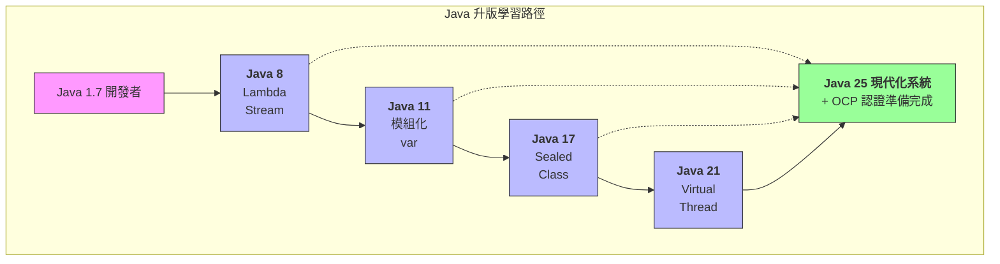

### 學習建議

| 讀者背景 | 建議閱讀順序 |
|---------|-------------|
| Java 7 開發者 | 第一章 → 第二章 → 第三章 → ... 循序漸進 |
| Java 8 開發者 | 第一章 → 第三章開始 |
| 準備 OCP 認證 | 各章「OCP 考點」+ 第十章 |
| 負責升版評估 | 第九章優先 + 各章「升版風險」段落 |

---

## 第一章：Java 平台演進總覽（1.7 → 25）

### 1.1 Java 版本生命週期說明（LTS vs 非 LTS）

#### 什麼是 LTS？

**LTS（Long-Term Support，長期支援版本）** 是 Oracle 為企業用戶設計的穩定版本，提供較長的安全更新與技術支援週期。

#### Java 版本發布時程表

自 Java 9 開始，Oracle 採用 **每 6 個月發布一個新版本** 的策略：

| 版本 | 發布日期 | 類型 | 支援結束日期（Oracle） |
|------|---------|------|----------------------|
| Java 7 | 2011-07 | LTS | 2022-07（延伸支援） |
| Java 8 | 2014-03 | LTS | 2030-12（延伸支援） |
| Java 9 | 2017-09 | 非 LTS | 2018-03 |
| Java 10 | 2018-03 | 非 LTS | 2018-09 |
| Java 11 | 2018-09 | LTS | 2032-01 |
| Java 12-16 | 2019-2021 | 非 LTS | 各 6 個月 |
| Java 17 | 2021-09 | LTS | 2029-09 |
| Java 18-20 | 2022-2023 | 非 LTS | 各 6 個月 |
| Java 21 | 2023-09 | LTS | 2031-09 |
| Java 22-24 | 2024-2025 | 非 LTS | 各 6 個月 |
| Java 25 | 2025-09 | LTS | 預計 2033+ |

#### LTS vs 非 LTS 選擇建議

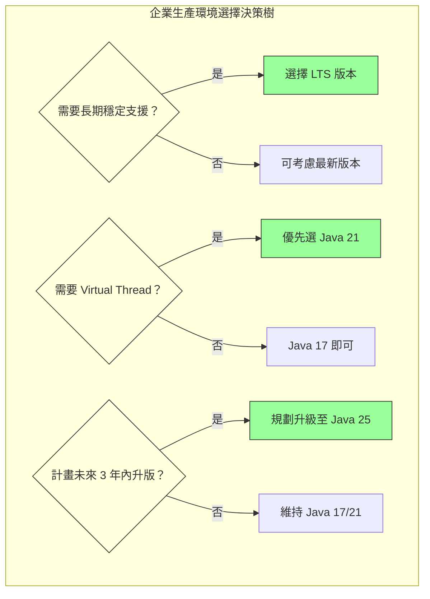

> **💡 企業實務建議**：
> - 生產環境一律使用 LTS 版本
> - 開發/測試環境可使用最新版本進行前瞻驗證
> - 金融業、銀行核心系統建議至少升級至 Java 17

---

### 1.2 為何企業應升級至 Java 17 / 21 / 25

#### 安全性考量

舊版 Java 的安全風險：

| 風險類型 | Java 7/8 狀況 | Java 17+ 改善 |
|---------|--------------|---------------|
| TLS 版本 | 預設 TLS 1.0/1.1 | 預設 TLS 1.3 |
| 加密演算法 | 支援弱加密 | 移除不安全演算法 |
| 序列化漏洞 | 高風險 | 強化過濾機制 |
| 反射存取 | 無限制 | 強封裝保護 |

#### 效能提升

```java
// 效能比較（以 GC 暫停時間為例）

Java 8 (Parallel GC)：     平均暫停 200-500ms
Java 11 (G1 GC)：          平均暫停 50-200ms  
Java 17 (ZGC)：            平均暫停 < 10ms
Java 21 (Generational ZGC)：平均暫停 < 1ms
```

#### 開發效率

| 特性 | 程式碼減少量 | 可讀性提升 |
|-----|------------|-----------|
| Lambda + Stream | 60-70% | ⭐⭐⭐⭐⭐ |
| Record | 80-90% | ⭐⭐⭐⭐⭐ |
| Pattern Matching | 40-50% | ⭐⭐⭐⭐ |
| Text Block | 50-60% | ⭐⭐⭐⭐ |

#### 生態系支援

| 框架/工具 | 最低 Java 版本要求 |
|----------|-------------------|
| Spring Boot 3.x | Java 17 |
| Spring Framework 6.x | Java 17 |
| Jakarta EE 10 | Java 11（建議 17） |
| Quarkus 3.x | Java 17 |
| Micronaut 4.x | Java 17 |

> **⚠️ 重要提醒**：
> Spring Boot 2.x 已於 2023 年 11 月停止維護，仍使用 Java 8 + Spring Boot 2.x 的系統面臨重大安全風險。

---

### 1.3 Java 設計哲學的重大轉變

#### 從「企業級重量」到「雲原生輕量」

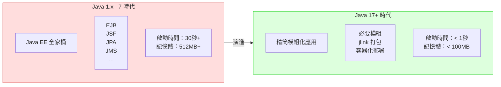

#### 設計哲學演進

| 時期 | 設計理念 | 代表特性 |
|-----|---------|---------|
| Java 1-7 | Write Once, Run Anywhere | 跨平台、穩定、向後相容 |
| Java 8 | 函數式程式設計 | Lambda、Stream、Optional |
| Java 9-16 | 模組化與語言現代化 | JPMS、Record、Pattern Matching |
| Java 17-21 | 並行革命與效能極致 | Virtual Thread、ZGC |
| Java 22-25 | AI 與雲原生整合 | Vector API、FFM API |

---

### 1.4 Java 與 JVM、生態系的角色變化

#### JVM 語言生態系

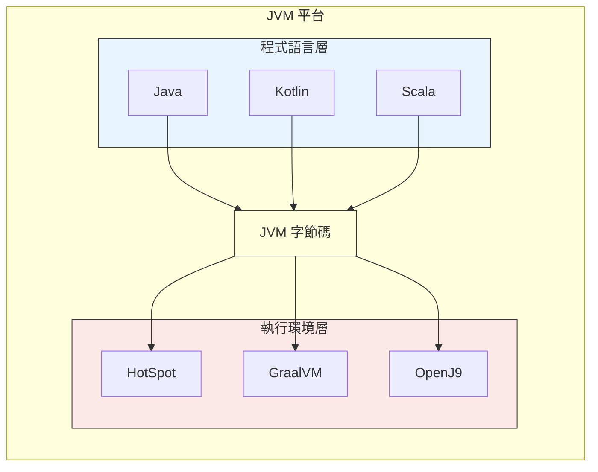

#### GraalVM 與原生編譯

Java 21+ 支援 **Native Image** 編譯，將 Java 應用編譯成原生執行檔：

```bash
# 使用 GraalVM 建立原生映像
native-image -jar myapp.jar

# 結果對比
# JAR 啟動：2-5 秒
# Native Image 啟動：< 50 毫秒
```

> **💡 企業實務建議**：
> - 微服務、Serverless 場景優先考慮 GraalVM Native Image
> - 批次系統、長時間運行服務仍建議使用 JIT 編譯

---

### 第一章小結

#### 關鍵要點回顧

1. **LTS 版本是企業首選**：Java 17、21、25 為 LTS
2. **升版帶來實質效益**：安全性、效能、開發效率全面提升
3. **設計哲學已轉變**：從重量級企業應用走向雲原生輕量化
4. **生態系要求升級**：主流框架已要求 Java 17+

#### 🎯 OCP 考點提醒

- 理解 LTS 與非 LTS 版本的差異
- 熟悉各 LTS 版本的主要特性
- 了解 JVM 與 Java 語言的關係

#### 📝 練習題

**問題 1**：以下哪些是 Java 的 LTS 版本？（多選）
- A. Java 8
- B. Java 9
- C. Java 11
- D. Java 16
- E. Java 17

<details>
<summary>點擊查看答案</summary>

**答案**：A、C、E

**解析**：Java 8、11、17、21、25 是 LTS 版本。Java 9、10、12-16、18-20、22-24 都是非 LTS 版本，僅提供 6 個月支援。
</details>

**問題 2**：為什麼 Spring Boot 3.x 要求最低 Java 17？

<details>
<summary>點擊查看答案</summary>

**答案**：
1. Spring Boot 3.x 基於 Spring Framework 6.x
2. Spring Framework 6.x 需要 Jakarta EE 9+（命名空間從 javax 改為 jakarta）
3. 為了使用 Java 17 的新語言特性（Record、Sealed Class 等）
4. Java 17 是目前企業廣泛採用的 LTS 版本
</details>

---

## 第二章：Java 7 → Java 8（現代 Java 的分水嶺）

Java 8 是 Java 歷史上最重要的版本之一，它引入了函數式程式設計範式，徹底改變了 Java 的程式設計風格。

### 2.1 Lambda Expression

#### 為何出現？

在 Java 8 之前，要實作一個簡單的事件處理或回呼函數，需要撰寫冗長的匿名內部類別：

```java
// Java 7 寫法：匿名內部類別
button.addActionListener(new ActionListener() {
    @Override
    public void actionPerformed(ActionEvent e) {
        System.out.println("按鈕被點擊");
    }
});
```

#### 解決什麼問題？

Lambda Expression 讓程式碼更簡潔、更具可讀性：

```java
// Java 8 寫法：Lambda Expression
button.addActionListener(e -> System.out.println("按鈕被點擊"));
```

#### Lambda 語法詳解

```java
// Lambda 語法結構
// (參數列表) -> { 方法主體 }

// 1. 無參數
Runnable r = () -> System.out.println("Hello");

// 2. 單一參數（可省略括號）
Consumer<String> c = s -> System.out.println(s);

// 3. 多參數
BiFunction<Integer, Integer, Integer> add = (a, b) -> a + b;

// 4. 多行語句（需要大括號和 return）
BiFunction<Integer, Integer, Integer> calculate = (a, b) -> {
    int result = a + b;
    System.out.println("計算結果：" + result);
    return result;
};

// 5. 明確指定參數型別
BiFunction<String, String, String> concat = 
    (String a, String b) -> a + b;
```

#### 方法參考（Method Reference）

```java
// 方法參考是 Lambda 的簡化寫法

// 1. 靜態方法參考
// Lambda: s -> Integer.parseInt(s)
Function<String, Integer> parser = Integer::parseInt;

// 2. 實例方法參考（特定物件）
// Lambda: s -> System.out.println(s)
Consumer<String> printer = System.out::println;

// 3. 實例方法參考（任意物件）
// Lambda: s -> s.toUpperCase()
Function<String, String> upper = String::toUpperCase;

// 4. 建構子參考
// Lambda: () -> new ArrayList<>()
Supplier<List<String>> listFactory = ArrayList::new;
```

#### 實務範例：集合處理

```java
// Java 7 寫法
List<String> names = Arrays.asList("Alice", "Bob", "Charlie");
List<String> filtered = new ArrayList<>();
for (String name : names) {
    if (name.length() > 3) {
        filtered.add(name.toUpperCase());
    }
}
Collections.sort(filtered);

// Java 8 寫法
List<String> result = names.stream()
    .filter(name -> name.length() > 3)
    .map(String::toUpperCase)
    .sorted()
    .collect(Collectors.toList());
```

> **💡 企業實務建議**：
> - Lambda 適合簡短的邏輯，複雜邏輯建議抽取成具名方法
> - 善用方法參考提升可讀性
> - 避免在 Lambda 中修改外部變數（應為 effectively final）

---

### 2.2 Functional Interface

#### 什麼是 Functional Interface？

**函數式介面** 是只有一個抽象方法的介面，可以使用 Lambda Expression 實作：

```java
// 自定義 Functional Interface
@FunctionalInterface
public interface Calculator {
    int calculate(int a, int b);
    
    // 可以有 default 方法
    default void printResult(int a, int b) {
        System.out.println("結果：" + calculate(a, b));
    }
    
    // 可以有 static 方法
    static Calculator getAdder() {
        return (a, b) -> a + b;
    }
}

// 使用
Calculator adder = (a, b) -> a + b;
Calculator multiplier = (a, b) -> a * b;
```

#### 常用內建 Functional Interface

| 介面 | 方法簽名 | 用途 | 範例 |
|-----|---------|------|------|
| `Predicate<T>` | `boolean test(T t)` | 條件判斷 | `s -> s.isEmpty()` |
| `Function<T,R>` | `R apply(T t)` | 轉換 | `s -> s.length()` |
| `Consumer<T>` | `void accept(T t)` | 消費 | `s -> System.out.println(s)` |
| `Supplier<T>` | `T get()` | 生產 | `() -> new Date()` |
| `BiFunction<T,U,R>` | `R apply(T t, U u)` | 雙參數轉換 | `(a,b) -> a + b` |
| `UnaryOperator<T>` | `T apply(T t)` | 同型別轉換 | `s -> s.trim()` |
| `BinaryOperator<T>` | `T apply(T t1, T t2)` | 同型別二元運算 | `(a,b) -> a + b` |

```java
// 實務範例：組合使用
public class FunctionalInterfaceDemo {
    
    public static void main(String[] args) {
        List<String> names = Arrays.asList("Alice", "Bob", "", "Charlie", null);
        
        // Predicate 組合
        Predicate<String> notNull = Objects::nonNull;
        Predicate<String> notEmpty = s -> !s.isEmpty();
        Predicate<String> valid = notNull.and(notEmpty);
        
        // Function 組合
        Function<String, String> trim = String::trim;
        Function<String, String> upper = String::toUpperCase;
        Function<String, String> process = trim.andThen(upper);
        
        // 完整處理流程
        List<String> result = names.stream()
            .filter(valid)
            .map(process)
            .collect(Collectors.toList());
        
        System.out.println(result); // [ALICE, BOB, CHARLIE]
    }
}
```

---

### 2.3 Stream API

#### 為何出現？

傳統的集合處理需要大量的迴圈和中間變數，程式碼冗長且容易出錯。Stream API 提供了聲明式的資料處理方式。

#### Stream 操作分類

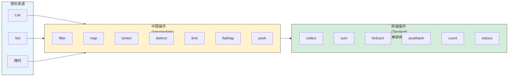

#### 常用中間操作

```java
List<Employee> employees = getEmployees();

// 1. filter - 過濾
employees.stream()
    .filter(e -> e.getSalary() > 50000)
    .forEach(System.out::println);

// 2. map - 轉換
List<String> names = employees.stream()
    .map(Employee::getName)
    .collect(Collectors.toList());

// 3. flatMap - 扁平化
List<String> allSkills = employees.stream()
    .flatMap(e -> e.getSkills().stream())
    .distinct()
    .collect(Collectors.toList());

// 4. sorted - 排序
employees.stream()
    .sorted(Comparator.comparing(Employee::getSalary).reversed())
    .forEach(System.out::println);

// 5. distinct - 去重
List<String> uniqueDepts = employees.stream()
    .map(Employee::getDepartment)
    .distinct()
    .collect(Collectors.toList());

// 6. limit / skip - 分頁
employees.stream()
    .skip(10)    // 跳過前 10 筆
    .limit(10)   // 取 10 筆
    .forEach(System.out::println);

// 7. peek - 除錯用
employees.stream()
    .filter(e -> e.getSalary() > 50000)
    .peek(e -> System.out.println("過濾後：" + e.getName()))
    .map(Employee::getName)
    .collect(Collectors.toList());
```

#### 常用終端操作

```java
// 1. collect - 收集結果
List<Employee> list = stream.collect(Collectors.toList());
Set<Employee> set = stream.collect(Collectors.toSet());
Map<String, Employee> map = stream.collect(
    Collectors.toMap(Employee::getId, Function.identity())
);

// 2. reduce - 歸納
int totalSalary = employees.stream()
    .mapToInt(Employee::getSalary)
    .reduce(0, Integer::sum);

// 3. 統計操作
long count = employees.stream().count();
Optional<Employee> max = employees.stream()
    .max(Comparator.comparing(Employee::getSalary));
    
// 4. 匹配操作
boolean anyMatch = employees.stream()
    .anyMatch(e -> e.getSalary() > 100000);
boolean allMatch = employees.stream()
    .allMatch(e -> e.getAge() >= 18);
boolean noneMatch = employees.stream()
    .noneMatch(e -> e.getName() == null);

// 5. 查找操作
Optional<Employee> first = employees.stream()
    .filter(e -> e.getDepartment().equals("IT"))
    .findFirst();
```

#### Collectors 進階用法

```java
// 1. 分組
Map<String, List<Employee>> byDept = employees.stream()
    .collect(Collectors.groupingBy(Employee::getDepartment));

// 2. 分組 + 統計
Map<String, Long> countByDept = employees.stream()
    .collect(Collectors.groupingBy(
        Employee::getDepartment,
        Collectors.counting()
    ));

// 3. 分組 + 求和
Map<String, Integer> salaryByDept = employees.stream()
    .collect(Collectors.groupingBy(
        Employee::getDepartment,
        Collectors.summingInt(Employee::getSalary)
    ));

// 4. 分割（二分）
Map<Boolean, List<Employee>> partitioned = employees.stream()
    .collect(Collectors.partitioningBy(
        e -> e.getSalary() > 50000
    ));

// 5. 字串連接
String names = employees.stream()
    .map(Employee::getName)
    .collect(Collectors.joining(", ", "[", "]"));

// 6. 統計摘要
IntSummaryStatistics stats = employees.stream()
    .collect(Collectors.summarizingInt(Employee::getSalary));
// stats.getCount(), getSum(), getMin(), getMax(), getAverage()
```

#### 平行 Stream

```java
// 平行處理（適用於大量資料、CPU 密集型操作）
long count = employees.parallelStream()
    .filter(e -> e.getSalary() > 50000)
    .count();

// 或從 stream 轉換
long count = employees.stream()
    .parallel()
    .filter(e -> e.getSalary() > 50000)
    .count();
```

> **⚠️ 平行 Stream 注意事項**：
> - 資料量小時（< 10000），平行可能更慢
> - 避免在平行 Stream 中使用有狀態的操作
> - 確保操作是執行緒安全的
> - 不適合 I/O 密集型操作

---

### 2.4 Optional 的正確使用方式

#### 為何出現？

`NullPointerException` 是 Java 中最常見的執行時期錯誤。Optional 提供了一種更明確的方式來處理可能為 null 的值。

#### 建立 Optional

```java
// 1. 建立空的 Optional
Optional<String> empty = Optional.empty();

// 2. 建立非空 Optional（值不可為 null）
Optional<String> hello = Optional.of("Hello");

// 3. 建立可能為空的 Optional
Optional<String> nullable = Optional.ofNullable(getValue());
```

#### 正確使用方式

```java
// ✅ 正確：使用 ifPresent
optional.ifPresent(value -> System.out.println(value));

// ✅ 正確：使用 map 轉換
Optional<Integer> length = optional.map(String::length);

// ✅ 正確：使用 orElse 提供預設值
String result = optional.orElse("預設值");

// ✅ 正確：使用 orElseGet 延遲計算預設值
String result = optional.orElseGet(() -> computeDefault());

// ✅ 正確：使用 orElseThrow 拋出例外
String result = optional.orElseThrow(
    () -> new IllegalStateException("值不存在")
);

// ✅ Java 9+：ifPresentOrElse
optional.ifPresentOrElse(
    value -> System.out.println(value),
    () -> System.out.println("值不存在")
);

// ✅ Java 9+：or 提供替代 Optional
Optional<String> result = optional.or(() -> Optional.of("替代值"));
```

#### 錯誤使用方式

```java
// ❌ 錯誤：使用 isPresent + get
if (optional.isPresent()) {
    String value = optional.get();  // 這與 null 檢查沒有差別
}

// ❌ 錯誤：將 Optional 用於欄位
public class User {
    private Optional<String> nickname;  // 不建議
}

// ❌ 錯誤：將 Optional 用於方法參數
public void process(Optional<String> input) {  // 不建議
}

// ❌ 錯誤：將 Optional 放入集合
List<Optional<String>> list;  // 不建議
```

#### 實務範例：鏈式處理

```java
// 查詢使用者的公司地址
public String getCompanyAddress(Long userId) {
    return Optional.ofNullable(userRepository.findById(userId))
        .map(User::getDepartment)
        .map(Department::getCompany)
        .map(Company::getAddress)
        .map(Address::getFullAddress)
        .orElse("地址未知");
}

// Java 7 等效寫法（大量 null 檢查）
public String getCompanyAddressOld(Long userId) {
    User user = userRepository.findById(userId);
    if (user != null) {
        Department dept = user.getDepartment();
        if (dept != null) {
            Company company = dept.getCompany();
            if (company != null) {
                Address address = company.getAddress();
                if (address != null) {
                    return address.getFullAddress();
                }
            }
        }
    }
    return "地址未知";
}
```

> **💡 企業實務建議**：
> - Optional 主要用於方法回傳值，表示「可能沒有結果」
> - 不要將 Optional 用於類別欄位、方法參數、集合元素
> - 優先使用 `orElse`、`orElseGet`、`map`，避免 `get()`

---

### 2.5 Default Method

#### 為何出現？

Java 8 之前，介面一旦發布就無法新增方法，否則會破壞所有實作類別。Default Method 允許在介面中提供方法的預設實作。

```java
// Java 8：在介面中加入預設方法
public interface Collection<E> {
    // 既有方法...
    
    // 新增的預設方法，不會破壞既有實作
    default Stream<E> stream() {
        return StreamSupport.stream(spliterator(), false);
    }
    
    default void forEach(Consumer<? super E> action) {
        for (E e : this) {
            action.accept(e);
        }
    }
}
```

#### Default Method 實務應用

```java
// 定義具有預設行為的介面
public interface Auditable {
    
    LocalDateTime getCreatedAt();
    LocalDateTime getUpdatedAt();
    
    // 預設方法
    default String getAuditInfo() {
        return String.format("建立時間: %s, 更新時間: %s",
            getCreatedAt(), getUpdatedAt());
    }
    
    default boolean isModified() {
        return !getCreatedAt().equals(getUpdatedAt());
    }
}

// 實作類別自動獲得預設方法
public class Order implements Auditable {
    private LocalDateTime createdAt;
    private LocalDateTime updatedAt;
    
    @Override
    public LocalDateTime getCreatedAt() { return createdAt; }
    
    @Override
    public LocalDateTime getUpdatedAt() { return updatedAt; }
    
    // getAuditInfo() 和 isModified() 自動可用
}
```

#### 多重繼承衝突解決

```java
interface A {
    default void hello() {
        System.out.println("A");
    }
}

interface B {
    default void hello() {
        System.out.println("B");
    }
}

// 必須明確指定使用哪個實作
class C implements A, B {
    @Override
    public void hello() {
        A.super.hello();  // 呼叫 A 的預設方法
        // 或 B.super.hello();
        // 或完全自己實作
    }
}
```

---

### 2.6 實務對照：Java 7 vs Java 8

#### 範例 1：過濾與轉換

```java
// 需求：找出薪資超過 50000 的員工姓名，轉為大寫，按字母排序

// Java 7 寫法
List<String> result = new ArrayList<>();
for (Employee emp : employees) {
    if (emp.getSalary() > 50000) {
        result.add(emp.getName().toUpperCase());
    }
}
Collections.sort(result);

// Java 8 寫法
List<String> result = employees.stream()
    .filter(e -> e.getSalary() > 50000)
    .map(e -> e.getName().toUpperCase())
    .sorted()
    .collect(Collectors.toList());
```

#### 範例 2：分組統計

```java
// 需求：按部門分組，統計每個部門的平均薪資

// Java 7 寫法
Map<String, List<Employee>> byDept = new HashMap<>();
for (Employee emp : employees) {
    String dept = emp.getDepartment();
    if (!byDept.containsKey(dept)) {
        byDept.put(dept, new ArrayList<>());
    }
    byDept.get(dept).add(emp);
}
Map<String, Double> avgSalaryByDept = new HashMap<>();
for (Map.Entry<String, List<Employee>> entry : byDept.entrySet()) {
    double sum = 0;
    for (Employee emp : entry.getValue()) {
        sum += emp.getSalary();
    }
    avgSalaryByDept.put(entry.getKey(), sum / entry.getValue().size());
}

// Java 8 寫法
Map<String, Double> avgSalaryByDept = employees.stream()
    .collect(Collectors.groupingBy(
        Employee::getDepartment,
        Collectors.averagingDouble(Employee::getSalary)
    ));
```

#### 範例 3：null 處理

```java
// 需求：取得使用者的暱稱，沒有則用使用者名稱，都沒有則用 "Anonymous"

// Java 7 寫法
String displayName;
if (user != null) {
    if (user.getNickname() != null) {
        displayName = user.getNickname();
    } else if (user.getUsername() != null) {
        displayName = user.getUsername();
    } else {
        displayName = "Anonymous";
    }
} else {
    displayName = "Anonymous";
}

// Java 8 寫法
String displayName = Optional.ofNullable(user)
    .map(User::getNickname)
    .or(() -> Optional.ofNullable(user).map(User::getUsername))
    .orElse("Anonymous");

// 更簡潔的寫法（Java 9+）
String displayName = Optional.ofNullable(user)
    .flatMap(u -> Optional.ofNullable(u.getNickname())
        .or(() -> Optional.ofNullable(u.getUsername())))
    .orElse("Anonymous");
```

---

### 2.7 常見誤用與 OCP 考點

#### 常見誤用

```java
// ❌ 誤用 1：在 Lambda 中修改外部變數
int count = 0;
list.forEach(item -> count++);  // 編譯錯誤！

// ✅ 正確做法
long count = list.stream().count();

// ❌ 誤用 2：對同一個 Stream 多次操作
Stream<String> stream = list.stream();
stream.forEach(System.out::println);
stream.count();  // 執行時期錯誤！Stream 已關閉

// ✅ 正確做法：每次建立新的 Stream
list.stream().forEach(System.out::println);
long count = list.stream().count();

// ❌ 誤用 3：在 Stream 中使用副作用
List<String> results = new ArrayList<>();
list.stream()
    .filter(s -> s.length() > 3)
    .forEach(s -> results.add(s));  // 不建議

// ✅ 正確做法
List<String> results = list.stream()
    .filter(s -> s.length() > 3)
    .collect(Collectors.toList());

// ❌ 誤用 4：過度使用 Optional
public Optional<User> findUser(Optional<Long> id) {  // 參數不應是 Optional
    // ...
}

// ✅ 正確做法
public Optional<User> findUser(Long id) {
    if (id == null) {
        return Optional.empty();
    }
    return Optional.ofNullable(repository.findById(id));
}
```

#### 🎯 OCP 考點整理

| 主題 | 考點 |
|-----|------|
| Lambda | 變數捕獲（effectively final）、參數型別推斷 |
| Functional Interface | `@FunctionalInterface` 規則、常用介面方法簽名 |
| Stream | 中間操作 vs 終端操作、延遲執行特性、平行 Stream |
| Optional | 正確建立方式、`orElse` vs `orElseGet` 差異 |
| Method Reference | 四種類型、適用場景 |

#### 📝 練習題

**問題 1**：以下程式碼的輸出為何？

```java
List<String> list = Arrays.asList("a", "b", "c");
list.stream()
    .map(s -> {
        System.out.print(s);
        return s.toUpperCase();
    });
System.out.println("done");
```

<details>
<summary>點擊查看答案</summary>

**答案**：只輸出 `done`

**解析**：Stream 的中間操作是延遲執行的，只有終端操作才會觸發整個流水線。此例沒有終端操作，所以 `map` 內的程式碼不會執行。
</details>

**問題 2**：以下哪個是正確的 Lambda 寫法？

```java
// A
Comparator<String> c = (String s1, String s2) -> s1.compareTo(s2);

// B  
Comparator<String> c = (s1, s2) -> { return s1.compareTo(s2); };

// C
Comparator<String> c = (s1, s2) -> s1.compareTo(s2);

// D
以上皆是
```

<details>
<summary>點擊查看答案</summary>

**答案**：D

**解析**：三種寫法都是合法的。A 明確指定型別、B 使用大括號和 return、C 是最簡潔的寫法。
</details>

---

### 第二章小結

#### 關鍵要點回顧

1. **Lambda** 讓匿名函數更簡潔，配合 Functional Interface 使用
2. **Stream API** 提供聲明式的集合處理，注意延遲執行特性
3. **Optional** 用於方法回傳值，避免 null 檢查
4. **Default Method** 允許介面演進，不破壞既有實作

#### 💡 企業升版建議

從 Java 7 升級到 Java 8 時：
- 先在工具類別中使用 Stream API
- 逐步將匿名內部類別改為 Lambda
- 建立團隊 Optional 使用規範
- 注意平行 Stream 的效能考量

---

## 第三章：Java 9 ～ Java 11（模組化與平台重整）

這個階段是 Java 平台的重大重整期，最重要的變革是模組化系統（JPMS）的引入，同時也移除了許多過時的 API。

### 3.1 Java Platform Module System（JPMS）

#### 為何出現？

Java 9 之前的問題：
- **JAR Hell**：類別路徑衝突、版本混亂
- **封裝不足**：`public` 的類別對所有人可見
- **JRE 過大**：即使簡單程式也需要完整 JRE

#### 模組系統基本概念

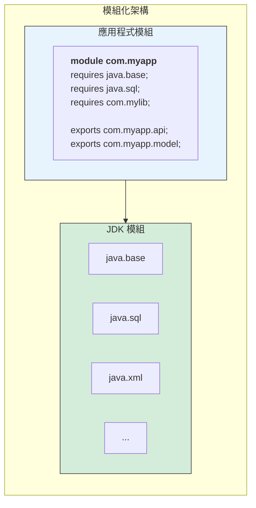

#### module-info.java 詳解

```java
// 檔案位置：src/main/java/module-info.java

module com.tutorial.myapp {
    
    // 1. requires - 宣告依賴的模組
    requires java.base;           // 預設自動包含
    requires java.sql;            // 需要 JDBC
    requires java.logging;        // 需要日誌
    requires transitive com.google.gson;  // 傳遞依賴
    
    // 2. exports - 公開套件給其他模組
    exports com.tutorial.myapp.api;
    exports com.tutorial.myapp.model;
    
    // 3. exports...to - 限定公開對象
    exports com.tutorial.myapp.internal to com.tutorial.test;
    
    // 4. opens - 開放套件供反射存取
    opens com.tutorial.myapp.entity to org.hibernate.orm.core;
    
    // 5. uses - 宣告使用的服務
    uses com.tutorial.myapp.spi.Plugin;
    
    // 6. provides - 提供服務實作
    provides com.tutorial.myapp.spi.Plugin 
        with com.tutorial.myapp.plugin.DefaultPlugin;
}
```

#### 實務範例：建立模組化專案

```
my-modular-app/
├── src/
│   └── main/
│       └── java/
│           ├── module-info.java
│           └── com/
│               └── tutorial/
│                   └── app/
│                       ├── Main.java
│                       └── service/
│                           └── UserService.java
└── pom.xml
```

```java
// module-info.java
module com.tutorial.app {
    requires java.logging;
    requires com.google.gson;
    
    exports com.tutorial.app;
    exports com.tutorial.app.service;
}

// Main.java
package com.tutorial.app;

import java.util.logging.Logger;

public class Main {
    private static final Logger logger = Logger.getLogger(Main.class.getName());
    
    public static void main(String[] args) {
        logger.info("模組化應用程式啟動");
        System.out.println("Hello from modular Java!");
    }
}
```

> **💡 企業實務建議**：
> - 新專案建議採用模組化架構
> - 舊專案升級可先以「未命名模組」方式運行
> - 注意第三方函式庫的模組化支援程度

---

### 3.2 jlink / jdeps 工具

#### jdeps - 分析依賴

```bash
# 分析 JAR 的依賴
jdeps --list-deps myapp.jar

# 分析使用了哪些 JDK 內部 API
jdeps --jdk-internals myapp.jar

# 產生模組依賴圖
jdeps --dot-output deps myapp.jar
```

#### jlink - 建立自訂 JRE

```bash
# 建立只包含必要模組的 JRE
jlink \
  --module-path $JAVA_HOME/jmods:mods \
  --add-modules com.tutorial.app \
  --output custom-jre \
  --compress=2 \
  --strip-debug \
  --no-header-files \
  --no-man-pages

# 結果：從 ~300MB 的完整 JRE 縮減至 ~30MB
```

```
# 大小比較
完整 JRE (Java 17):    約 300 MB
自訂 JRE (基本模組):    約 30-50 MB
減少比例:              80-90%
```

#### 實務應用：Docker 映像優化

```dockerfile
# 多階段建置
FROM eclipse-temurin:21-jdk AS builder
WORKDIR /app
COPY . .
RUN mvn package -DskipTests

# 使用 jlink 建立自訂 JRE
RUN jlink \
    --add-modules java.base,java.logging,java.sql \
    --strip-debug \
    --compress=2 \
    --no-header-files \
    --no-man-pages \
    --output /custom-jre

# 最終映像
FROM debian:bookworm-slim
COPY --from=builder /custom-jre /opt/java
COPY --from=builder /app/target/*.jar /app/app.jar
CMD ["/opt/java/bin/java", "-jar", "/app/app.jar"]

# 結果：Docker 映像從 ~500MB 縮減至 ~100MB
```

---

### 3.3 移除 Java EE 模組的影響

#### Java 11 移除的模組

| 模組 | 功能 | 替代方案 |
|-----|------|---------|
| `java.xml.ws` | JAX-WS (Web Services) | jakarta.xml.ws-api |
| `java.xml.bind` | JAXB (XML 綁定) | jakarta.xml.bind-api |
| `java.activation` | JAF | jakarta.activation-api |
| `java.corba` | CORBA | 無直接替代 |
| `java.transaction` | JTA | jakarta.transaction-api |
| `java.xml.ws.annotation` | 常用註解 | jakarta.annotation-api |

#### 升級方案

```xml
<!-- pom.xml 新增依賴以取代被移除的模組 -->

<!-- JAXB (XML 處理) -->
<dependency>
    <groupId>jakarta.xml.bind</groupId>
    <artifactId>jakarta.xml.bind-api</artifactId>
    <version>4.0.0</version>
</dependency>
<dependency>
    <groupId>org.glassfish.jaxb</groupId>
    <artifactId>jaxb-runtime</artifactId>
    <version>4.0.3</version>
</dependency>

<!-- JAX-WS (Web Services) -->
<dependency>
    <groupId>jakarta.xml.ws</groupId>
    <artifactId>jakarta.xml.ws-api</artifactId>
    <version>4.0.0</version>
</dependency>

<!-- 常用註解 (@PostConstruct, @PreDestroy 等) -->
<dependency>
    <groupId>jakarta.annotation</groupId>
    <artifactId>jakarta.annotation-api</artifactId>
    <version>2.1.1</version>
</dependency>
```

> **⚠️ 注意事項**：
> - `javax.*` 套件已更名為 `jakarta.*`
> - Spring Boot 3.x 已全面採用 Jakarta EE 10
> - 舊專案需要修改 import 語句

---

### 3.4 HTTP Client API

#### 為何出現？

Java 11 引入新的 HTTP Client API，取代過時的 `HttpURLConnection`：

| 特性 | HttpURLConnection | 新 HTTP Client |
|-----|-------------------|----------------|
| 同步/非同步 | 僅同步 | 兩者皆支援 |
| HTTP/2 | 不支援 | 完整支援 |
| WebSocket | 不支援 | 支援 |
| 程式碼風格 | 繁瑣 | 流暢 API |

#### 基本用法

```java
import java.net.http.HttpClient;
import java.net.http.HttpRequest;
import java.net.http.HttpResponse;
import java.net.URI;
import java.time.Duration;

public class HttpClientDemo {
    
    // 建立共用的 HttpClient（執行緒安全，建議重複使用）
    private static final HttpClient client = HttpClient.newBuilder()
        .version(HttpClient.Version.HTTP_2)
        .connectTimeout(Duration.ofSeconds(10))
        .followRedirects(HttpClient.Redirect.NORMAL)
        .build();
    
    // 同步 GET 請求
    public String getSync(String url) throws Exception {
        HttpRequest request = HttpRequest.newBuilder()
            .uri(URI.create(url))
            .header("Accept", "application/json")
            .GET()
            .build();
        
        HttpResponse<String> response = client.send(
            request, 
            HttpResponse.BodyHandlers.ofString()
        );
        
        return response.body();
    }
    
    // 非同步 GET 請求
    public CompletableFuture<String> getAsync(String url) {
        HttpRequest request = HttpRequest.newBuilder()
            .uri(URI.create(url))
            .GET()
            .build();
        
        return client.sendAsync(request, HttpResponse.BodyHandlers.ofString())
            .thenApply(HttpResponse::body);
    }
    
    // POST 請求（JSON）
    public String postJson(String url, String jsonBody) throws Exception {
        HttpRequest request = HttpRequest.newBuilder()
            .uri(URI.create(url))
            .header("Content-Type", "application/json")
            .POST(HttpRequest.BodyPublishers.ofString(jsonBody))
            .build();
        
        HttpResponse<String> response = client.send(
            request,
            HttpResponse.BodyHandlers.ofString()
        );
        
        return response.body();
    }
}
```

#### 進階用法：處理回應

```java
// 1. 儲存檔案
HttpResponse<Path> response = client.send(
    request,
    HttpResponse.BodyHandlers.ofFile(Path.of("downloaded.pdf"))
);

// 2. 串流處理
HttpResponse<Stream<String>> response = client.send(
    request,
    HttpResponse.BodyHandlers.ofLines()
);
response.body().forEach(System.out::println);

// 3. 自訂回應處理
HttpResponse<JsonObject> response = client.send(
    request,
    responseInfo -> HttpResponse.BodySubscribers.mapping(
        HttpResponse.BodySubscribers.ofString(StandardCharsets.UTF_8),
        body -> JsonParser.parseString(body).getAsJsonObject()
    )
);
```

---

### 3.5 var（區域型別推斷）

#### 為何出現？

減少冗長的型別宣告，同時保持靜態型別檢查：

```java
// Java 10 之前
Map<String, List<Employee>> employeesByDept = new HashMap<String, List<Employee>>();

// Java 10+ 使用 var
var employeesByDept = new HashMap<String, List<Employee>>();
```

#### 使用規則

```java
// ✅ 正確使用
var list = new ArrayList<String>();     // 推斷為 ArrayList<String>
var stream = list.stream();             // 推斷為 Stream<String>
var length = "Hello".length();          // 推斷為 int
var now = LocalDateTime.now();          // 推斷為 LocalDateTime

// ✅ for 迴圈中使用
for (var item : items) {
    System.out.println(item);
}

// ✅ try-with-resources
try (var reader = new BufferedReader(new FileReader("file.txt"))) {
    var line = reader.readLine();
}

// ❌ 不可使用的情況
var x;                          // 錯誤：無法推斷型別
var y = null;                   // 錯誤：無法從 null 推斷
var z = () -> "hello";          // 錯誤：Lambda 需要目標型別
var arr = {1, 2, 3};            // 錯誤：陣列初始化需要型別

// ❌ 不可用於
public var field;               // 錯誤：不能用於欄位
public void method(var param) {} // 錯誤：不能用於參數
public var getValue() {}        // 錯誤：不能用於回傳型別
```

#### 使用建議

```java
// ✅ 好的使用：型別顯而易見
var users = new ArrayList<User>();
var response = httpClient.send(request, BodyHandlers.ofString());
var mapper = new ObjectMapper();

// ❌ 不建議：降低可讀性
var result = process(data);  // result 是什麼型別？
var x = getValue();          // x 是什麼型別？

// 💡 建議：當右側能清楚看出型別時使用 var
var config = loadConfig();           // 不清楚
Configuration config = loadConfig(); // 清楚
```

> **💡 企業實務建議**：
> - 在團隊中建立 var 使用規範
> - 型別不明顯時，優先使用明確型別宣告
> - IDE 會顯示推斷型別，可懸停查看

---

### 3.6 TLS / Security 強化

#### TLS 版本演進

| Java 版本 | 預設 TLS 版本 | 建議設定 |
|----------|--------------|---------|
| Java 7 | TLS 1.0 | 需手動啟用 TLS 1.2 |
| Java 8 | TLS 1.2 | 建議停用 TLS 1.0/1.1 |
| Java 11 | TLS 1.2/1.3 | TLS 1.3 可用 |
| Java 17+ | TLS 1.3 | 預設最安全設定 |

#### 安全性設定

```java
// 強制使用 TLS 1.2 以上
System.setProperty("https.protocols", "TLSv1.2,TLSv1.3");
System.setProperty("jdk.tls.client.protocols", "TLSv1.2,TLSv1.3");

// 停用弱加密套件
System.setProperty("jdk.tls.disabledAlgorithms", 
    "SSLv3, TLSv1, TLSv1.1, RC4, DES, MD5withRSA, DH keySize < 1024, " +
    "EC keySize < 224, 3DES_EDE_CBC, anon, NULL");
```

#### 憑證管理

```bash
# 檢視 JDK cacerts 內容
keytool -list -cacerts

# 匯入自簽憑證（Java 11+）
keytool -importcert -cacerts -file mycert.pem -alias myca

# Java 17+ 預設使用系統憑證庫（Windows/macOS）
# 可透過參數切換
-Djavax.net.ssl.trustStoreType=Windows-ROOT
```

---

### 3.7 升版衝擊與因應策略

#### Java 9-11 升版檢查清單

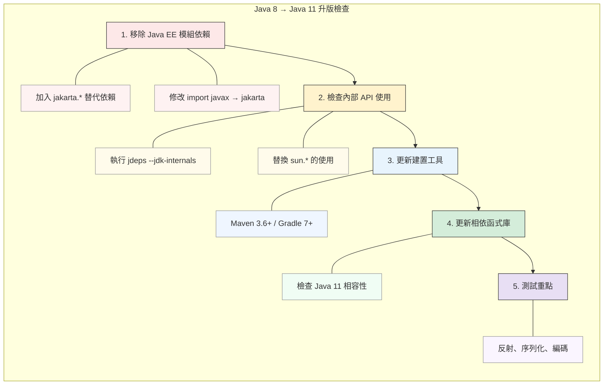

#### 常見問題與解決

```java
// 問題 1：InaccessibleObjectException
// 原因：反射存取私有成員被阻擋

// 解決方案 A：在 module-info.java 中開放
opens com.myapp.entity to org.hibernate.orm.core;

// 解決方案 B：啟動參數（不建議長期使用）
--add-opens java.base/java.lang=ALL-UNNAMED

// 問題 2：NoClassDefFoundError: javax/xml/bind/JAXBException
// 原因：JAXB 已從 JDK 移除

// 解決方案：加入依賴
<dependency>
    <groupId>jakarta.xml.bind</groupId>
    <artifactId>jakarta.xml.bind-api</artifactId>
    <version>4.0.0</version>
</dependency>
```

#### 🎯 OCP 考點提醒

- JPMS 的 `requires`、`exports`、`opens` 關鍵字
- `var` 的使用限制與型別推斷規則
- 模組路徑 vs 類別路徑的差異
- 服務載入機制（ServiceLoader）

#### 📝 練習題

**問題 1**：以下哪些是合法的 `var` 使用？

```java
// A
var list = new ArrayList<>();

// B
var x = null;

// C
for (var i = 0; i < 10; i++) {}

// D
var func = (String s) -> s.length();
```

<details>
<summary>點擊查看答案</summary>

**答案**：A、C

**解析**：
- A：合法，推斷為 `ArrayList<Object>`
- B：非法，無法從 null 推斷型別
- C：合法，推斷為 int
- D：非法，Lambda 需要目標型別
</details>

---

### 第三章小結

#### 關鍵要點回顧

1. **JPMS 模組系統** 提供更好的封裝與依賴管理
2. **jlink / jdeps** 工具協助建立精簡 JRE 與分析依賴
3. **移除 Java EE 模組** 需要加入 jakarta.* 替代依賴
4. **HTTP Client API** 取代過時的 HttpURLConnection
5. **var** 簡化區域變數宣告，但有使用限制

#### 💡 企業升版建議

- 優先處理 Java EE 模組移除的影響
- 使用 jdeps 分析內部 API 使用情況
- 建立團隊 var 使用規範

---

## 第四章：Java 12 ～ Java 16（語言精煉期）

這個階段 Java 引入了許多語法糖和新特性，讓程式碼更簡潔、更具表達力。

### 4.1 Switch Expression

#### 為何出現？

傳統 switch 語句的問題：
- 容易忘記 break 導致 fall-through
- 無法作為表達式使用
- 語法冗長

#### 傳統 vs 新語法對比

```java
// Java 11 之前：傳統 switch 語句
String dayType;
switch (day) {
    case MONDAY:
    case TUESDAY:
    case WEDNESDAY:
    case THURSDAY:
    case FRIDAY:
        dayType = "工作日";
        break;
    case SATURDAY:
    case SUNDAY:
        dayType = "週末";
        break;
    default:
        dayType = "未知";
}

// Java 14+：Switch Expression（箭頭語法）
String dayType = switch (day) {
    case MONDAY, TUESDAY, WEDNESDAY, THURSDAY, FRIDAY -> "工作日";
    case SATURDAY, SUNDAY -> "週末";
};

// 需要多行時使用 yield
String dayType = switch (day) {
    case MONDAY, TUESDAY, WEDNESDAY, THURSDAY, FRIDAY -> {
        logger.info("這是工作日");
        yield "工作日";
    }
    case SATURDAY, SUNDAY -> {
        logger.info("這是週末");
        yield "週末";
    }
};
```

#### 完整性檢查

```java
// enum 必須涵蓋所有值，或提供 default
enum Status { PENDING, APPROVED, REJECTED }

String message = switch (status) {
    case PENDING -> "待處理";
    case APPROVED -> "已核准";
    case REJECTED -> "已拒絕";
    // 不需要 default，因為已涵蓋所有 enum 值
};

// 若 enum 新增值，編譯器會警告未處理
```

#### 實務應用

```java
// 範例：HTTP 狀態碼處理
public String getStatusMessage(int statusCode) {
    return switch (statusCode) {
        case 200 -> "成功";
        case 201 -> "已建立";
        case 400 -> "請求錯誤";
        case 401 -> "未授權";
        case 403 -> "禁止存取";
        case 404 -> "找不到資源";
        case 500 -> "伺服器錯誤";
        default -> "未知狀態：" + statusCode;
    };
}

// 範例：命令處理
public void executeCommand(String command) {
    switch (command.toLowerCase()) {
        case "start", "run", "execute" -> startProcess();
        case "stop", "halt", "terminate" -> stopProcess();
        case "pause", "suspend" -> pauseProcess();
        case "status", "info" -> showStatus();
        default -> throw new IllegalArgumentException("未知命令：" + command);
    }
}
```

---

### 4.2 Text Blocks

#### 為何出現？

處理多行字串時，傳統寫法非常繁瑣：

```java
// Java 14 之前：字串串接
String html = "<html>\n" +
              "    <body>\n" +
              "        <p>Hello, World!</p>\n" +
              "    </body>\n" +
              "</html>";

// Java 14 之前：單行（難以閱讀）
String json = "{\"name\":\"Alice\",\"age\":30,\"email\":\"alice@example.com\"}";
```

#### Text Block 語法

```java
// Java 15+：Text Block
String html = """
    <html>
        <body>
            <p>Hello, World!</p>
        </body>
    </html>
    """;

String json = """
    {
        "name": "Alice",
        "age": 30,
        "email": "alice@example.com"
    }
    """;

String sql = """
    SELECT u.id, u.name, u.email
    FROM users u
    JOIN orders o ON u.id = o.user_id
    WHERE o.status = 'PENDING'
    ORDER BY o.created_at DESC
    """;
```

#### 縮排處理規則

```java
// 結尾 """ 的位置決定基準縮排

// 範例 1：結尾在新行，無額外縮排
String s1 = """
    line1
    line2
    """;
// 結果：每行前面沒有空格

// 範例 2：結尾有縮排
String s2 = """
    line1
    line2
""";
// 結果：每行前面有 4 個空格

// 範例 3：使用 stripIndent()（已自動套用）
String s3 = """
        line1
        line2
    """.stripIndent();
```

#### 跳脫字元與格式化

```java
// 1. 保留行尾空格：使用 \s
String s = """
    line with trailing space\s
    another line
    """;

// 2. 不換行：使用 \
String singleLine = """
    This is a very long line that \
    we want to keep on one line \
    in the output.
    """;
// 結果：一行

// 3. 格式化：使用 formatted()
String template = """
    Hello, %s!
    Your balance is $%.2f.
    """;
String message = template.formatted("Alice", 1234.56);
```

#### 實務應用

```java
// SQL 模板
private static final String FIND_USER_SQL = """
    SELECT 
        u.id,
        u.username,
        u.email,
        u.created_at
    FROM users u
    WHERE u.status = ?
      AND u.department_id = ?
    ORDER BY u.created_at DESC
    LIMIT ?
    """;

// HTML 模板
public String generateEmailBody(String name, String content) {
    return """
        <!DOCTYPE html>
        <html>
        <head>
            <meta charset="UTF-8">
            <title>通知郵件</title>
        </head>
        <body>
            <h1>親愛的 %s，您好！</h1>
            <p>%s</p>
            <p>祝您順心！</p>
        </body>
        </html>
        """.formatted(name, content);
}

// JSON 模板
public String toJson(User user) {
    return """
        {
            "id": %d,
            "name": "%s",
            "email": "%s",
            "active": %b
        }
        """.formatted(
            user.getId(),
            user.getName(),
            user.getEmail(),
            user.isActive()
        );
}
```

---

### 4.3 Records

#### 為何出現？

Java 開發者經常需要建立純資料類別（POJO / DTO），需要大量樣板程式碼：

```java
// Java 15 之前：典型的資料類別
public final class Point {
    private final int x;
    private final int y;
    
    public Point(int x, int y) {
        this.x = x;
        this.y = y;
    }
    
    public int x() { return x; }
    public int y() { return y; }
    
    @Override
    public boolean equals(Object o) {
        if (this == o) return true;
        if (!(o instanceof Point)) return false;
        Point point = (Point) o;
        return x == point.x && y == point.y;
    }
    
    @Override
    public int hashCode() {
        return Objects.hash(x, y);
    }
    
    @Override
    public String toString() {
        return "Point[x=" + x + ", y=" + y + "]";
    }
}
```

#### Record 語法

```java
// Java 16+：Record
public record Point(int x, int y) {}

// 自動生成：
// - 私有 final 欄位
// - 公開建構子
// - 存取方法 x() 和 y()
// - equals()、hashCode()、toString()
```

#### 自訂 Record

```java
// 自訂建構子（驗證）
public record User(String username, String email, int age) {
    
    // 緊湊建構子（Compact Constructor）
    public User {
        // 驗證邏輯
        if (username == null || username.isBlank()) {
            throw new IllegalArgumentException("使用者名稱不可為空");
        }
        if (age < 0 || age > 150) {
            throw new IllegalArgumentException("年齡必須在 0-150 之間");
        }
        // 正規化
        username = username.trim().toLowerCase();
        email = email.trim().toLowerCase();
    }
    
    // 額外的建構子
    public User(String username, String email) {
        this(username, email, 0);
    }
    
    // 額外的方法
    public String displayName() {
        return username + " <" + email + ">";
    }
    
    // 靜態工廠方法
    public static User of(String username, String email) {
        return new User(username, email);
    }
}
```

#### Record 的限制

```java
// ✅ 可以
public record Point(int x, int y) implements Serializable {}
public record Point(int x, int y) {
    public static Point ORIGIN = new Point(0, 0);
}

// ❌ 不可以
public record Point(int x, int y) extends SomeClass {}  // 不能繼承類別
public record Point(int x, int y) {
    private int z;  // 不能額外宣告實例欄位
}
```

#### 實務應用

```java
// DTO 定義
public record UserDTO(
    Long id,
    String username,
    String email,
    LocalDateTime createdAt
) {
    public static UserDTO from(User entity) {
        return new UserDTO(
            entity.getId(),
            entity.getUsername(),
            entity.getEmail(),
            entity.getCreatedAt()
        );
    }
}

// API 回應
public record ApiResponse<T>(
    int code,
    String message,
    T data,
    LocalDateTime timestamp
) {
    public static <T> ApiResponse<T> success(T data) {
        return new ApiResponse<>(200, "success", data, LocalDateTime.now());
    }
    
    public static <T> ApiResponse<T> error(int code, String message) {
        return new ApiResponse<>(code, message, null, LocalDateTime.now());
    }
}

// 組合鍵
public record CacheKey(String prefix, String id, String version) {
    @Override
    public String toString() {
        return prefix + ":" + id + ":" + version;
    }
}
```

---

### 4.4 Pattern Matching for instanceof

#### 為何出現？

傳統 instanceof 檢查後需要強制轉型：

```java
// Java 15 之前
if (obj instanceof String) {
    String s = (String) obj;  // 冗餘的轉型
    System.out.println(s.length());
}

// Java 16+：Pattern Matching
if (obj instanceof String s) {
    System.out.println(s.length());  // 直接使用
}
```

#### 作用域規則

```java
// 變數在條件為真時可用
if (obj instanceof String s) {
    // s 可用
    System.out.println(s.toUpperCase());
}
// s 不可用

// 配合 && 使用
if (obj instanceof String s && s.length() > 5) {
    System.out.println(s);
}

// 配合 || 使用（注意：此時 s 不可用）
if (!(obj instanceof String s) || s.isEmpty()) {
    // 當 obj 不是 String 時，s 不可用
    // 當 obj 是 String 且為空時，s 可用但已經是空的
}

// 在 else 分支中使用
if (!(obj instanceof String s)) {
    System.out.println("不是字串");
} else {
    System.out.println(s.toUpperCase());  // s 可用
}
```

#### 實務應用

```java
// 範例 1：簡化類型檢查
public String format(Object value) {
    if (value instanceof String s) {
        return "字串：" + s;
    } else if (value instanceof Integer i) {
        return "整數：" + i;
    } else if (value instanceof Double d) {
        return "浮點數：" + String.format("%.2f", d);
    } else if (value instanceof List<?> list) {
        return "列表，大小：" + list.size();
    } else if (value instanceof Map<?, ?> map) {
        return "映射，大小：" + map.size();
    }
    return "未知類型：" + value.getClass().getName();
}

// 範例 2：equals 方法
public record Point(int x, int y) {
    @Override
    public boolean equals(Object obj) {
        return obj instanceof Point p 
            && this.x == p.x 
            && this.y == p.y;
    }
}

// 範例 3：配合 Optional
public void process(Optional<Object> opt) {
    opt.filter(o -> o instanceof String s && s.length() > 0)
       .ifPresent(System.out::println);
}
```

---

### 4.5 ZGC / Shenandoah 簡介

#### 新一代低延遲 GC

| GC 類型 | 最大暫停時間 | 適用場景 | Java 版本 |
|--------|------------|---------|----------|
| Serial GC | 數秒 | 小型應用、單核心 | 所有版本 |
| Parallel GC | 數百毫秒 | 吞吐量優先 | 所有版本 |
| G1 GC | 數十～數百毫秒 | 平衡型（Java 9+ 預設） | Java 7+ |
| ZGC | < 10ms | 低延遲、大記憶體 | Java 15+ 正式 |
| Shenandoah | < 10ms | 低延遲 | Java 15+ 正式 |

#### ZGC 特點

```bash
# 啟用 ZGC
java -XX:+UseZGC -Xmx16g -jar myapp.jar

# ZGC 主要特點：
# - 暫停時間 < 10ms（與堆大小無關）
# - 支援 TB 級堆記憶體
# - 並行執行，不影響應用執行緒
# - Java 21 引入 Generational ZGC（分代 ZGC）

# 啟用 Generational ZGC（Java 21+）
java -XX:+UseZGC -XX:+ZGenerational -jar myapp.jar
```

#### 選擇建議

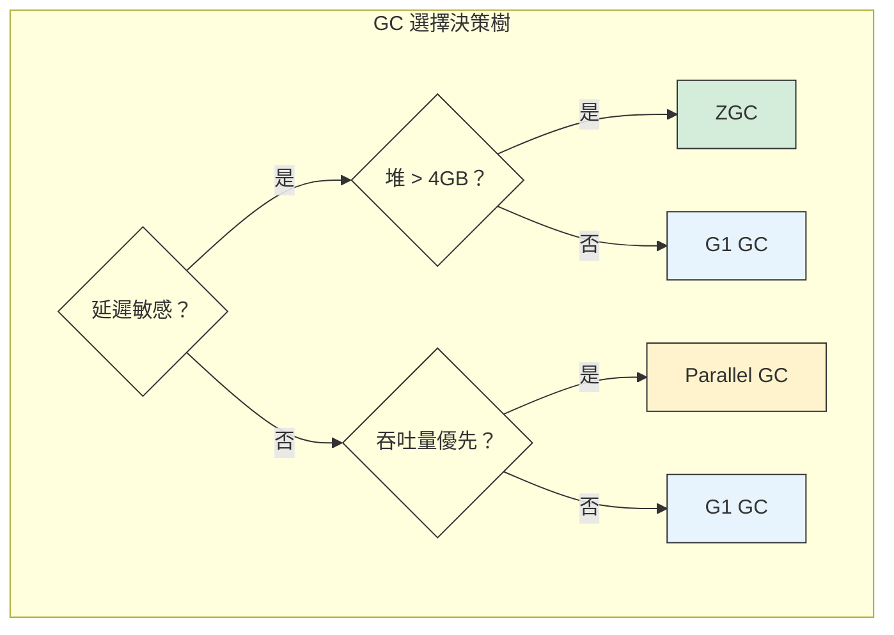

---

### 4.6 Preview Feature 使用與風險

#### 什麼是 Preview Feature？

Preview Feature 是 Java 引入新特性的機制，允許開發者提前試用尚未正式化的功能。

#### 使用方式

```bash
# 編譯時啟用
javac --enable-preview --release 21 MyClass.java

# 執行時啟用
java --enable-preview MyClass

# Maven 設定
<plugin>
    <groupId>org.apache.maven.plugins</groupId>
    <artifactId>maven-compiler-plugin</artifactId>
    <version>3.11.0</version>
    <configuration>
        <release>21</release>
        <compilerArgs>
            <arg>--enable-preview</arg>
        </compilerArgs>
    </configuration>
</plugin>
```

#### 風險與建議

| 層面 | 風險 | 建議 |
|-----|------|------|
| 穩定性 | 語法或行為可能在正式版改變 | 生產環境避免使用 |
| 相容性 | 編譯的 class 可能無法在未來版本執行 | 追蹤 JEP 狀態 |
| 維護 | 升級 Java 版本可能需要修改程式碼 | 封裝使用範圍 |

> **💡 企業實務建議**：
> - 生產環境不要使用 Preview Feature
> - 在開發環境中試用，評估未來遷移成本
> - 關注 JEP（JDK Enhancement Proposal）追蹤特性狀態

---

### 第四章小結

#### 關鍵要點回顧

1. **Switch Expression** 讓 switch 可作為表達式，更簡潔安全
2. **Text Block** 大幅簡化多行字串處理
3. **Record** 消除資料類別的樣板程式碼
4. **Pattern Matching** 簡化型別檢查與轉型

#### 🎯 OCP 考點提醒

- Switch Expression 的 `yield` 關鍵字
- Text Block 的縮排處理規則
- Record 的限制（不能繼承、不能額外定義實例欄位）
- Pattern Matching 的變數作用域

---

## 第五章：Java 17（LTS，企業升版首選）

Java 17 是繼 Java 11 後的重要 LTS 版本，也是目前企業升版的首選目標。

### 5.1 Java 17 作為企業基準版的理由

#### 為什麼選擇 Java 17？

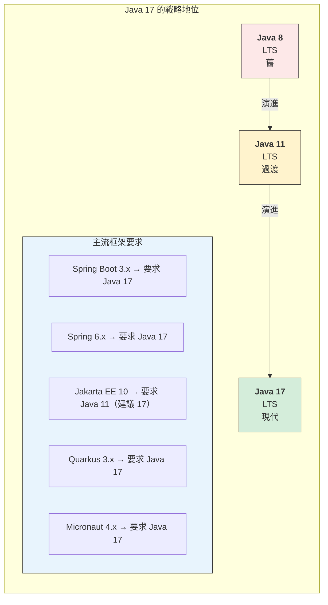

#### Java 17 累積的重要特性

| 版本 | 重要特性 | 狀態 |
|-----|---------|------|
| 14 | Switch Expression | 正式 |
| 15 | Text Block | 正式 |
| 16 | Record, Pattern Matching instanceof | 正式 |
| 17 | Sealed Class | 正式 |

---

### 5.2 Sealed Class

#### 為何出現？

在 Java 17 之前，限制類別繼承的方式有限：
- `final`：完全禁止繼承
- package-private：僅限同套件

Sealed Class 提供更精細的繼承控制。

#### 語法說明

```java
// 定義密封類別，指定允許的子類別
public sealed class Shape 
    permits Circle, Rectangle, Triangle {
    
    // 共通屬性和方法
    public abstract double area();
}

// 子類別必須是 final、sealed 或 non-sealed

// final：不允許再被繼承
public final class Circle extends Shape {
    private final double radius;
    
    public Circle(double radius) {
        this.radius = radius;
    }
    
    @Override
    public double area() {
        return Math.PI * radius * radius;
    }
}

// sealed：繼續限制繼承
public sealed class Rectangle extends Shape 
    permits Square {
    
    protected final double width;
    protected final double height;
    
    public Rectangle(double width, double height) {
        this.width = width;
        this.height = height;
    }
    
    @Override
    public double area() {
        return width * height;
    }
}

// non-sealed：開放繼承
public non-sealed class Triangle extends Shape {
    private final double base;
    private final double height;
    
    public Triangle(double base, double height) {
        this.base = base;
        this.height = height;
    }
    
    @Override
    public double area() {
        return 0.5 * base * height;
    }
}

// Square 繼承自 sealed 的 Rectangle
public final class Square extends Rectangle {
    public Square(double side) {
        super(side, side);
    }
}
```

#### 配合 Pattern Matching 使用

```java
// Java 21+：Switch 的完整模式匹配
public String describe(Shape shape) {
    return switch (shape) {
        case Circle c -> "圓形，半徑 " + c.getRadius();
        case Square s -> "正方形，邊長 " + s.getSide();
        case Rectangle r -> "長方形，" + r.getWidth() + " x " + r.getHeight();
        case Triangle t -> "三角形，面積 " + t.area();
        // 由於是 sealed class，編譯器知道所有可能的子類別
        // 不需要 default 分支（如果 Triangle 是 non-sealed 則需要）
    };
}
```

#### 實務應用

```java
// 範例：訂單狀態機
public sealed interface OrderState 
    permits PendingState, ConfirmedState, ShippedState, 
            DeliveredState, CancelledState {
    
    OrderState next();
    boolean canCancel();
}

public final class PendingState implements OrderState {
    @Override
    public OrderState next() {
        return new ConfirmedState();
    }
    
    @Override
    public boolean canCancel() {
        return true;
    }
}

public final class ConfirmedState implements OrderState {
    @Override
    public OrderState next() {
        return new ShippedState();
    }
    
    @Override
    public boolean canCancel() {
        return true;
    }
}

// ... 其他狀態

// 範例：表達式計算
public sealed interface Expr 
    permits Const, Add, Multiply, Negate {
}

public record Const(int value) implements Expr {}
public record Add(Expr left, Expr right) implements Expr {}
public record Multiply(Expr left, Expr right) implements Expr {}
public record Negate(Expr expr) implements Expr {}

// 計算表達式
public int evaluate(Expr expr) {
    return switch (expr) {
        case Const(int v) -> v;
        case Add(var l, var r) -> evaluate(l) + evaluate(r);
        case Multiply(var l, var r) -> evaluate(l) * evaluate(r);
        case Negate(var e) -> -evaluate(e);
    };
}
```

---

### 5.3 強封裝（Strong Encapsulation）

#### Java 17 的強封裝政策

從 Java 17 開始，JDK 內部 API 預設為強封裝：

```bash
# Java 16 及之前：警告但允許
WARNING: An illegal reflective access operation has occurred

# Java 17+：預設拒絕，拋出異常
java.lang.reflect.InaccessibleObjectException: 
    Unable to make field private final byte[] java.lang.String.value accessible
```

#### 處理方式

```bash
# 方法 1：使用 --add-opens（暫時方案）
java --add-opens java.base/java.lang=ALL-UNNAMED -jar myapp.jar

# 方法 2：在 MANIFEST.MF 中宣告（不建議）
Add-Opens: java.base/java.lang=ALL-UNNAMED

# 方法 3：正確方式 - 修改程式碼，不使用內部 API
```

#### 常見受影響場景

| 場景 | 問題 | 解決方案 |
|-----|------|---------|
| 反射存取私有欄位 | `InaccessibleObjectException` | 使用公開 API 或 MethodHandles |
| Unsafe 操作 | 存取被阻擋 | 使用 VarHandle 或 FFM API |
| 序列化框架 | 無法存取私有建構子 | 更新框架版本、使用 opens |
| ORM 框架 | 無法存取實體欄位 | 在 module-info 中 opens |

```java
// 範例：使用 VarHandle 替代 Unsafe
import java.lang.invoke.MethodHandles;
import java.lang.invoke.VarHandle;

public class VarHandleDemo {
    private int value;
    
    private static final VarHandle VALUE_HANDLE;
    
    static {
        try {
            VALUE_HANDLE = MethodHandles.lookup()
                .findVarHandle(VarHandleDemo.class, "value", int.class);
        } catch (Exception e) {
            throw new ExceptionInInitializerError(e);
        }
    }
    
    public void incrementAtomic() {
        VALUE_HANDLE.getAndAdd(this, 1);
    }
    
    public boolean compareAndSet(int expected, int newValue) {
        return VALUE_HANDLE.compareAndSet(this, expected, newValue);
    }
}
```

---

### 5.4 移除與淘汰 API 清單

#### Java 17 移除的主要 API

| 移除項目 | 替代方案 |
|---------|---------|
| Applet API | 無（已過時） |
| Security Manager | 無（計畫移除） |
| RMI Activation | 無 |
| AOT 和 JIT 編譯器（實驗性） | GraalVM |

#### 已標記淘汰的 API

```java
// 已淘汰，避免使用
@Deprecated(since = "9", forRemoval = true)
public final class Finalization {
    // 使用 Cleaner 替代 finalize()
}

// 替代方案：使用 Cleaner
import java.lang.ref.Cleaner;

public class Resource implements AutoCloseable {
    private static final Cleaner cleaner = Cleaner.create();
    private final Cleaner.Cleanable cleanable;
    private final State state;
    
    private static class State implements Runnable {
        // 清理所需的資源
        @Override
        public void run() {
            // 清理邏輯
            System.out.println("資源已清理");
        }
    }
    
    public Resource() {
        this.state = new State();
        this.cleanable = cleaner.register(this, state);
    }
    
    @Override
    public void close() {
        cleanable.clean();
    }
}
```

---

### 5.5 與 Spring Boot / Jakarta EE 的相容性

#### Spring Boot 版本對照

| Spring Boot | Spring Framework | 最低 Java | 建議 Java |
|------------|-----------------|----------|----------|
| 2.7.x | 5.3.x | 8 | 11/17 |
| 3.0.x | 6.0.x | 17 | 17 |
| 3.1.x | 6.0.x | 17 | 17 |
| 3.2.x | 6.1.x | 17 | 17/21 |
| 3.3.x | 6.1.x | 17 | 21 |
| 3.4.x | 6.2.x | 17 | 21 |

#### javax → jakarta 遷移

```java
// Spring Boot 2.x (Java 8-17)
import javax.persistence.Entity;
import javax.persistence.Id;
import javax.validation.constraints.NotNull;
import javax.servlet.http.HttpServletRequest;

// Spring Boot 3.x (Java 17+)
import jakarta.persistence.Entity;
import jakarta.persistence.Id;
import jakarta.validation.constraints.NotNull;
import jakarta.servlet.http.HttpServletRequest;
```

#### 遷移步驟

```bash
# 1. 使用 OpenRewrite 自動遷移
mvn org.openrewrite.maven:rewrite-maven-plugin:run \
    -Drewrite.recipeArtifactCoordinates=\
        org.openrewrite.recipe:rewrite-spring:LATEST \
    -Drewrite.activeRecipes=\
        org.openrewrite.java.spring.boot3.UpgradeSpringBoot_3_0
```

```xml
<!-- 2. 手動遷移：更新 pom.xml -->
<parent>
    <groupId>org.springframework.boot</groupId>
    <artifactId>spring-boot-starter-parent</artifactId>
    <version>3.2.0</version>
</parent>

<properties>
    <java.version>17</java.version>
</properties>
```

---

### 第五章小結

#### 關鍵要點回顧

1. **Java 17 是企業升版首選**：主流框架已要求 Java 17
2. **Sealed Class** 提供精細的繼承控制，配合 Pattern Matching 更強大
3. **強封裝** 限制內部 API 存取，需檢查並更新程式碼
4. **javax → jakarta** 是升級 Spring Boot 3.x 的必要步驟

#### 🎯 OCP 考點提醒

- Sealed Class 的 `permits`、`sealed`、`non-sealed`、`final` 關鍵字
- 子類別必須在 permits 列表中（或同一編譯單元）
- Sealed Class 配合 Switch Pattern Matching 的完整性檢查

---

## 第六章：Java 18 ～ Java 20（為並行革命鋪路）

這個階段是 Java 21 LTS 前的準備期，許多重要特性以 Preview 形式出現，為後續的並行革命奠定基礎。

### 6.1 Foreign Function & Memory API

#### 為何出現？

Java 一直以來與原生程式碼互動的方式是 JNI（Java Native Interface），但 JNI 有許多問題：
- 需要撰寫 C/C++ 程式碼
- 記憶體管理複雜
- 效能開銷大
- 容易造成 JVM 崩潰

Foreign Function & Memory API（FFM API）提供更安全、更高效的替代方案。

#### 基本概念

```java
// Java 22+ (正式版)
import java.lang.foreign.*;
import java.lang.invoke.MethodHandle;

public class FFMDemo {
    
    public static void main(String[] args) throws Throwable {
        // 1. 配置記憶體區段（Memory Segment）
        try (Arena arena = Arena.ofConfined()) {
            // 配置 100 個整數的記憶體
            MemorySegment segment = arena.allocate(
                ValueLayout.JAVA_INT, 100
            );
            
            // 寫入資料
            for (int i = 0; i < 100; i++) {
                segment.setAtIndex(ValueLayout.JAVA_INT, i, i * 2);
            }
            
            // 讀取資料
            int value = segment.getAtIndex(ValueLayout.JAVA_INT, 50);
            System.out.println("Index 50: " + value);  // 100
        }
        // 離開 try 區塊時，記憶體自動釋放
    }
}
```

#### 呼叫原生函數

```java
// 呼叫 C 標準函式庫的 strlen 函數
public class NativeFunctionDemo {
    
    public static void main(String[] args) throws Throwable {
        // 載入 C 標準函式庫
        Linker linker = Linker.nativeLinker();
        SymbolLookup stdlib = linker.defaultLookup();
        
        // 查找 strlen 函數
        MemorySegment strlenAddr = stdlib.find("strlen").orElseThrow();
        
        // 建立函數描述
        FunctionDescriptor strlenDesc = FunctionDescriptor.of(
            ValueLayout.JAVA_LONG,      // 回傳類型
            ValueLayout.ADDRESS         // 參數類型
        );
        
        // 建立方法控制代碼
        MethodHandle strlen = linker.downcallHandle(strlenAddr, strlenDesc);
        
        // 呼叫原生函數
        try (Arena arena = Arena.ofConfined()) {
            MemorySegment cString = arena.allocateFrom("Hello, World!");
            long length = (long) strlen.invokeExact(cString);
            System.out.println("字串長度: " + length);  // 13
        }
    }
}
```

#### 實務應用場景

| 場景 | 傳統方式 | FFM API 優勢 |
|-----|---------|-------------|
| 呼叫系統 API | JNI + C 封裝 | 純 Java 實作 |
| 高效能運算 | Off-heap 記憶體管理複雜 | 安全的記憶體存取 |
| 硬體互動 | 需要原生驅動 | 直接存取記憶體映射 |
| 大數據處理 | ByteBuffer 限制 2GB | 無大小限制 |

---

### 6.2 Vector API

#### 為何出現？

現代 CPU 支援 SIMD（Single Instruction, Multiple Data）指令，可以同時處理多個資料。Vector API 讓 Java 程式可以利用這些硬體能力。

#### 基本用法

```java
// Java 22+ (孵化中)
import jdk.incubator.vector.*;

public class VectorDemo {
    
    // 選擇適合 CPU 的 Vector 種類
    static final VectorSpecies<Float> SPECIES = FloatVector.SPECIES_PREFERRED;
    
    // 向量化的陣列相加
    public static float[] vectorAdd(float[] a, float[] b) {
        float[] result = new float[a.length];
        int i = 0;
        
        // 向量化處理
        int upperBound = SPECIES.loopBound(a.length);
        for (; i < upperBound; i += SPECIES.length()) {
            FloatVector va = FloatVector.fromArray(SPECIES, a, i);
            FloatVector vb = FloatVector.fromArray(SPECIES, b, i);
            FloatVector vr = va.add(vb);
            vr.intoArray(result, i);
        }
        
        // 處理剩餘元素
        for (; i < a.length; i++) {
            result[i] = a[i] + b[i];
        }
        
        return result;
    }
    
    // 向量化的點積運算
    public static float dotProduct(float[] a, float[] b) {
        float sum = 0;
        int i = 0;
        
        int upperBound = SPECIES.loopBound(a.length);
        FloatVector vsum = FloatVector.zero(SPECIES);
        
        for (; i < upperBound; i += SPECIES.length()) {
            FloatVector va = FloatVector.fromArray(SPECIES, a, i);
            FloatVector vb = FloatVector.fromArray(SPECIES, b, i);
            vsum = va.fma(vb, vsum);  // fused multiply-add
        }
        
        sum = vsum.reduceLanes(VectorOperators.ADD);
        
        for (; i < a.length; i++) {
            sum += a[i] * b[i];
        }
        
        return sum;
    }
}
```

#### 效能比較

```java
// 基準測試結果（示意）

// 傳統迴圈
public static float[] normalAdd(float[] a, float[] b) {
    float[] result = new float[a.length];
    for (int i = 0; i < a.length; i++) {
        result[i] = a[i] + b[i];
    }
    return result;
}

// 效能比較（1000 萬元素陣列）
// 傳統迴圈：~15ms
// Vector API：~3ms
// 加速比：約 5x
```

#### 適用場景

- 科學計算
- 機器學習推論
- 圖像處理
- 音訊/視訊編解碼
- 金融風險計算

> **💡 企業實務建議**：
> - Vector API 仍在孵化階段，生產環境謹慎使用
> - 適合 CPU 密集型運算場景
> - 需要評估是否值得增加程式碼複雜度

---

### 6.3 JVM 效能最佳化重點

#### JIT 編譯最佳化

```bash
# 檢視 JIT 編譯日誌
java -XX:+PrintCompilation -jar myapp.jar

# 輸出範例
#     1    java.lang.Object::<init> (1 bytes)
#     2    java.lang.String::hashCode (55 bytes)
# 編號  類別名稱::方法名稱 (位元組碼大小)

# 分層編譯（Java 8+ 預設開啟）
java -XX:+TieredCompilation -jar myapp.jar

# 查看內聯決策
java -XX:+PrintInlining -jar myapp.jar
```

#### 啟動時間最佳化

```bash
# 1. Class Data Sharing (CDS) - 共享類別資料
# 建立共享存檔
java -Xshare:dump

# 使用共享存檔
java -Xshare:on -jar myapp.jar

# 2. Application CDS (AppCDS) - 應用程式類別共享
# 建立類別列表
java -XX:DumpLoadedClassList=classes.lst -jar myapp.jar

# 建立 AppCDS 存檔
java -Xshare:dump -XX:SharedClassListFile=classes.lst \
     -XX:SharedArchiveFile=app-cds.jsa -jar myapp.jar

# 使用 AppCDS 存檔
java -Xshare:on -XX:SharedArchiveFile=app-cds.jsa -jar myapp.jar

# 效果：啟動時間可減少 20-30%
```

#### 記憶體最佳化

```bash
# G1 GC 調優（Java 9+ 預設）
java -XX:+UseG1GC \
     -XX:MaxGCPauseMillis=200 \
     -XX:G1HeapRegionSize=16m \
     -jar myapp.jar

# 大型堆記憶體建議
java -XX:+UseG1GC \
     -Xms16g -Xmx16g \
     -XX:+AlwaysPreTouch \
     -jar myapp.jar

# 低延遲場景（Java 15+）
java -XX:+UseZGC \
     -Xms8g -Xmx8g \
     -jar myapp.jar
```

---

### 6.4 新 GC 行為觀察

#### G1 GC 改進

Java 18-20 對 G1 GC 進行了多項改進：

| 版本 | 改進 | 效果 |
|-----|------|------|
| Java 18 | 改進 Region Pinning | 減少 JNI 臨界區的影響 |
| Java 19 | 改進 Remembered Set | 降低記憶體開銷 |
| Java 20 | 並行 Full GC | 減少 Full GC 暫停時間 |

#### ZGC 演進

```bash
# Java 15：ZGC 正式支援
java -XX:+UseZGC -jar myapp.jar

# Java 18-20：持續改進
# - 支援 String Deduplication
# - 改進 NUMA 支援
# - 提升吞吐量

# Java 21：Generational ZGC
java -XX:+UseZGC -XX:+ZGenerational -jar myapp.jar
```

#### GC 監控指標

```java
// 使用 JMX 監控 GC
import java.lang.management.*;

public class GCMonitor {
    
    public static void printGCStats() {
        for (GarbageCollectorMXBean gc : 
                ManagementFactory.getGarbageCollectorMXBeans()) {
            System.out.printf("GC: %s%n", gc.getName());
            System.out.printf("  次數: %d%n", gc.getCollectionCount());
            System.out.printf("  總時間: %d ms%n", gc.getCollectionTime());
        }
    }
    
    public static void printMemoryUsage() {
        MemoryMXBean memory = ManagementFactory.getMemoryMXBean();
        
        MemoryUsage heap = memory.getHeapMemoryUsage();
        System.out.printf("Heap: used=%d MB, max=%d MB%n",
            heap.getUsed() / 1024 / 1024,
            heap.getMax() / 1024 / 1024);
        
        MemoryUsage nonHeap = memory.getNonHeapMemoryUsage();
        System.out.printf("Non-Heap: used=%d MB%n",
            nonHeap.getUsed() / 1024 / 1024);
    }
}
```

---

### 第六章小結

#### 關鍵要點回顧

1. **FFM API** 提供安全的原生互動方式，取代 JNI
2. **Vector API** 利用 SIMD 加速數值運算
3. **CDS/AppCDS** 顯著改善啟動時間
4. **GC 持續改進**，ZGC 達到亞毫秒暫停

#### 💡 企業實務建議

- FFM API 和 Vector API 仍在演進中，關注但謹慎採用
- 啟動時間敏感的應用考慮使用 AppCDS
- 監控 GC 指標，選擇適合的 GC 策略

---

## 第七章：Java 21（LTS，Virtual Thread 時代）

Java 21 是繼 Java 17 後的下一個 LTS 版本，最重要的特性是 Virtual Thread，這是 Java 並行程式設計的革命性改變。

### 7.1 Virtual Thread（Project Loom）

#### 為何出現？

傳統 Java 執行緒的問題：

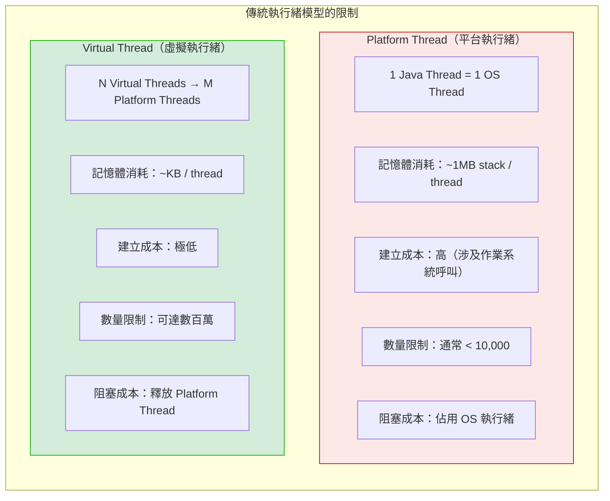

#### 建立 Virtual Thread

```java
// 方法 1：Thread.startVirtualThread()
Thread.startVirtualThread(() -> {
    System.out.println("Hello from virtual thread!");
});

// 方法 2：Thread.ofVirtual()
Thread vThread = Thread.ofVirtual()
    .name("my-virtual-thread")
    .start(() -> {
        System.out.println("Hello!");
    });
vThread.join();

// 方法 3：使用 ExecutorService
try (var executor = Executors.newVirtualThreadPerTaskExecutor()) {
    for (int i = 0; i < 10000; i++) {
        final int taskId = i;
        executor.submit(() -> {
            // 每個任務一個虛擬執行緒
            Thread.sleep(Duration.ofSeconds(1));
            return "Task " + taskId + " completed";
        });
    }
}
// 離開 try 區塊時，會等待所有任務完成
```

#### 實務範例：HTTP 伺服器

```java
// 傳統方式：Thread Pool
ExecutorService executor = Executors.newFixedThreadPool(200);
// 限制同時處理 200 個請求

// Virtual Thread 方式
ExecutorService executor = Executors.newVirtualThreadPerTaskExecutor();
// 可同時處理數萬個請求

// 完整範例：簡單 HTTP 伺服器
public class VirtualThreadHttpServer {
    
    public static void main(String[] args) throws IOException {
        ServerSocket serverSocket = new ServerSocket(8080);
        
        try (var executor = Executors.newVirtualThreadPerTaskExecutor()) {
            while (true) {
                Socket socket = serverSocket.accept();
                executor.submit(() -> handleRequest(socket));
            }
        }
    }
    
    private static void handleRequest(Socket socket) {
        try (socket;
             var reader = new BufferedReader(
                 new InputStreamReader(socket.getInputStream()));
             var writer = new PrintWriter(socket.getOutputStream(), true)) {
            
            // 讀取請求（阻塞操作，但不會佔用 OS 執行緒）
            String requestLine = reader.readLine();
            
            // 模擬資料庫查詢（阻塞操作）
            Thread.sleep(Duration.ofMillis(100));
            
            // 發送回應
            writer.println("HTTP/1.1 200 OK");
            writer.println("Content-Type: text/plain");
            writer.println();
            writer.println("Hello, World!");
            
        } catch (Exception e) {
            e.printStackTrace();
        }
    }
}
```

#### 與傳統 Thread Pool 比較

```java
// 模擬 10,000 個並發請求，每個請求耗時 1 秒

// 方案 1：Fixed Thread Pool（傳統）
var start = System.currentTimeMillis();
try (var executor = Executors.newFixedThreadPool(200)) {
    var futures = new ArrayList<Future<String>>();
    for (int i = 0; i < 10000; i++) {
        futures.add(executor.submit(() -> {
            Thread.sleep(Duration.ofSeconds(1));
            return "done";
        }));
    }
    futures.forEach(f -> {
        try { f.get(); } catch (Exception e) {}
    });
}
var elapsed = System.currentTimeMillis() - start;
System.out.println("Thread Pool: " + elapsed + " ms");
// 預期：約 50 秒（10000 / 200 * 1s）

// 方案 2：Virtual Thread
start = System.currentTimeMillis();
try (var executor = Executors.newVirtualThreadPerTaskExecutor()) {
    var futures = new ArrayList<Future<String>>();
    for (int i = 0; i < 10000; i++) {
        futures.add(executor.submit(() -> {
            Thread.sleep(Duration.ofSeconds(1));
            return "done";
        }));
    }
    futures.forEach(f -> {
        try { f.get(); } catch (Exception e) {}
    });
}
elapsed = System.currentTimeMillis() - start;
System.out.println("Virtual Thread: " + elapsed + " ms");
// 預期：約 1-2 秒
```

---

### 7.2 Structured Concurrency

#### 為何出現？

傳統並行程式設計的問題：
- 子任務的生命週期難以管理
- 錯誤處理複雜
- 取消操作難以協調

#### 基本用法

```java
// Java 21 (Preview) / Java 22+ (Second Preview)
import java.util.concurrent.StructuredTaskScope;

public class StructuredConcurrencyDemo {
    
    record User(String name, String email) {}
    record Order(String id, double amount) {}
    record UserDetails(User user, List<Order> orders) {}
    
    // 並行獲取使用者資訊和訂單
    public UserDetails fetchUserDetails(String userId) throws Exception {
        
        try (var scope = new StructuredTaskScope.ShutdownOnFailure()) {
            
            // 並行啟動兩個子任務
            Subtask<User> userTask = scope.fork(() -> fetchUser(userId));
            Subtask<List<Order>> ordersTask = scope.fork(() -> fetchOrders(userId));
            
            // 等待所有任務完成（或任一失敗）
            scope.join();
            
            // 如果有任務失敗，拋出異常
            scope.throwIfFailed();
            
            // 組合結果
            return new UserDetails(userTask.get(), ordersTask.get());
        }
    }
    
    // 取得最快回應（任一成功即可）
    public String fetchFromFastestServer() throws Exception {
        
        try (var scope = new StructuredTaskScope.ShutdownOnSuccess<String>()) {
            
            scope.fork(() -> fetchFromServer("server1.example.com"));
            scope.fork(() -> fetchFromServer("server2.example.com"));
            scope.fork(() -> fetchFromServer("server3.example.com"));
            
            scope.join();
            
            // 返回最先成功的結果
            return scope.result();
        }
    }
    
    private User fetchUser(String userId) {
        // 模擬資料庫查詢
        return new User("Alice", "alice@example.com");
    }
    
    private List<Order> fetchOrders(String userId) {
        // 模擬資料庫查詢
        return List.of(new Order("ORD-001", 100.0));
    }
    
    private String fetchFromServer(String server) {
        // 模擬網路請求
        return "Response from " + server;
    }
}
```

#### 與 CompletableFuture 比較

```java
// CompletableFuture 方式（傳統）
public UserDetails fetchUserDetailsAsync(String userId) {
    CompletableFuture<User> userFuture = CompletableFuture
        .supplyAsync(() -> fetchUser(userId));
    CompletableFuture<List<Order>> ordersFuture = CompletableFuture
        .supplyAsync(() -> fetchOrders(userId));
    
    return userFuture.thenCombine(ordersFuture, UserDetails::new).join();
    
    // 問題：
    // - 錯誤處理複雜
    // - 取消難以協調
    // - 異常可能被吞掉
}

// Structured Concurrency 方式
public UserDetails fetchUserDetailsStructured(String userId) throws Exception {
    try (var scope = new StructuredTaskScope.ShutdownOnFailure()) {
        var userTask = scope.fork(() -> fetchUser(userId));
        var ordersTask = scope.fork(() -> fetchOrders(userId));
        
        scope.join();
        scope.throwIfFailed();
        
        return new UserDetails(userTask.get(), ordersTask.get());
    }
    // 優點：
    // - 任務生命週期清楚
    // - 錯誤自動傳播
    // - 取消自動處理
}
```

---

### 7.3 Scoped Value

#### 為何出現？

`ThreadLocal` 在 Virtual Thread 環境下的問題：
- 每個 Virtual Thread 都有自己的 ThreadLocal 儲存
- 數百萬 Virtual Thread 會消耗大量記憶體
- 生命週期管理困難

#### 基本用法

```java
// Java 21 (Preview) / Java 22+ (Second Preview)
import java.lang.ScopedValue;

public class ScopedValueDemo {
    
    // 宣告 ScopedValue
    private static final ScopedValue<User> CURRENT_USER = ScopedValue.newInstance();
    private static final ScopedValue<String> TRANSACTION_ID = ScopedValue.newInstance();
    
    public void handleRequest(User user, String transactionId) {
        // 設定 ScopedValue 並執行程式碼
        ScopedValue.where(CURRENT_USER, user)
            .where(TRANSACTION_ID, transactionId)
            .run(() -> {
                processRequest();
            });
    }
    
    private void processRequest() {
        // 在任何深度的呼叫鏈中都可以取得
        User user = CURRENT_USER.get();
        String txId = TRANSACTION_ID.get();
        
        System.out.println("Processing for user: " + user.name());
        System.out.println("Transaction ID: " + txId);
        
        // 呼叫其他方法，仍然可以存取
        doBusinessLogic();
    }
    
    private void doBusinessLogic() {
        // ScopedValue 在整個呼叫鏈中可用
        User user = CURRENT_USER.get();
        logAudit("Business logic executed for " + user.name());
    }
    
    private void logAudit(String message) {
        String txId = TRANSACTION_ID.get();
        System.out.println("[" + txId + "] " + message);
    }
}
```

#### 與 ThreadLocal 比較

| 特性 | ThreadLocal | ScopedValue |
|-----|-------------|-------------|
| 可變性 | 可變 | 不可變 |
| 生命週期 | 手動管理 | 自動（scope-bound） |
| 繼承 | InheritableThreadLocal | 預設繼承 |
| 記憶體使用 | 每個執行緒獨立儲存 | 共享（Virtual Thread 友好） |
| 執行緒安全 | 需要小心處理 | 天生安全 |

```java
// ThreadLocal 問題
ThreadLocal<User> currentUser = new ThreadLocal<>();

public void handleRequest(User user) {
    try {
        currentUser.set(user);
        processRequest();
    } finally {
        currentUser.remove();  // 必須手動清理！
    }
}

// ScopedValue 解決方案
private static final ScopedValue<User> CURRENT_USER = ScopedValue.newInstance();

public void handleRequest(User user) {
    ScopedValue.where(CURRENT_USER, user).run(() -> {
        processRequest();
    });
    // 離開 scope 自動清理，無需手動處理
}
```

---

### 7.4 傳統 Thread Pool vs Virtual Thread

#### 何時使用 Virtual Thread

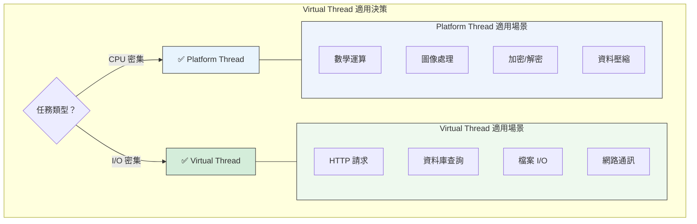

#### 不適合 Virtual Thread 的場景

```java
// ❌ 不適合：CPU 密集型運算
// Virtual Thread 無法提升 CPU 運算效能
for (int i = 0; i < 1000; i++) {
    Thread.startVirtualThread(() -> {
        // CPU 密集運算
        double result = 0;
        for (int j = 0; j < 1000000; j++) {
            result += Math.sin(j) * Math.cos(j);
        }
    });
}

// ❌ 不適合：使用 synchronized 的大量程式碼
// synchronized 會導致 Virtual Thread pinning（釘住 OS 執行緒）
Thread.startVirtualThread(() -> {
    synchronized (lock) {
        // 長時間持有鎖
        Thread.sleep(Duration.ofSeconds(10));
    }
});

// ✅ 建議改用 ReentrantLock
private final ReentrantLock lock = new ReentrantLock();

Thread.startVirtualThread(() -> {
    lock.lock();
    try {
        Thread.sleep(Duration.ofSeconds(10));
    } finally {
        lock.unlock();
    }
});
```

#### 監控 Virtual Thread

```java
// 監控 Virtual Thread 數量
public class VirtualThreadMonitor {
    
    public static void printThreadInfo() {
        // 取得所有執行緒
        Thread[] threads = new Thread[Thread.activeCount()];
        Thread.enumerate(threads);
        
        long virtualCount = Arrays.stream(threads)
            .filter(Objects::nonNull)
            .filter(Thread::isVirtual)
            .count();
        
        long platformCount = Arrays.stream(threads)
            .filter(Objects::nonNull)
            .filter(t -> !t.isVirtual())
            .count();
        
        System.out.println("Virtual Threads: " + virtualCount);
        System.out.println("Platform Threads: " + platformCount);
    }
}

// JFR 監控（推薦）
// java -XX:StartFlightRecording=filename=recording.jfr,duration=60s -jar myapp.jar
```

---

### 7.5 對 Web / Batch / MQ 系統的影響

#### Web 應用

```java
// Spring Boot 3.2+ 支援 Virtual Thread
// application.properties
spring.threads.virtual.enabled=true

// 或 Java 配置
@Configuration
public class VirtualThreadConfig {
    
    @Bean
    public TomcatProtocolHandlerCustomizer<?> protocolHandlerVirtualThreadCustomizer() {
        return protocolHandler -> {
            protocolHandler.setExecutor(Executors.newVirtualThreadPerTaskExecutor());
        };
    }
}
```

#### Batch 系統

```java
// 批次處理：大量並行任務
public class BatchProcessor {
    
    public void processRecords(List<Record> records) {
        try (var executor = Executors.newVirtualThreadPerTaskExecutor()) {
            List<Future<?>> futures = new ArrayList<>();
            
            for (Record record : records) {
                futures.add(executor.submit(() -> {
                    // 每筆記錄一個 Virtual Thread
                    processRecord(record);
                }));
            }
            
            // 等待所有任務完成
            for (Future<?> future : futures) {
                try {
                    future.get();
                } catch (Exception e) {
                    handleError(e);
                }
            }
        }
    }
    
    private void processRecord(Record record) {
        // I/O 操作（資料庫、API 呼叫等）
        // Virtual Thread 會自動讓出 OS 執行緒
    }
}
```

#### MQ 消費者

```java
// Kafka 消費者使用 Virtual Thread
public class KafkaVirtualThreadConsumer {
    
    public void startConsumers(int count) {
        try (var executor = Executors.newVirtualThreadPerTaskExecutor()) {
            for (int i = 0; i < count; i++) {
                executor.submit(this::consumeMessages);
            }
        }
    }
    
    private void consumeMessages() {
        // 每個消費者一個 Virtual Thread
        while (true) {
            ConsumerRecords<String, String> records = consumer.poll(Duration.ofMillis(100));
            for (ConsumerRecord<String, String> record : records) {
                processMessage(record);
            }
        }
    }
}
```

---

### 7.6 實務建議

#### 遷移指南

```java
// 步驟 1：識別 I/O 密集型程式碼
// 找出使用 Thread Pool 處理 I/O 的地方

// 步驟 2：替換 ExecutorService
// Before
ExecutorService executor = Executors.newFixedThreadPool(100);

// After
ExecutorService executor = Executors.newVirtualThreadPerTaskExecutor();

// 步驟 3：移除 synchronized（如果可能）
// Before
synchronized (lock) {
    // ...
}

// After
lock.lock();
try {
    // ...
} finally {
    lock.unlock();
}

// 步驟 4：替換 ThreadLocal（如果適用）
// Before
private static final ThreadLocal<Context> CONTEXT = new ThreadLocal<>();

// After
private static final ScopedValue<Context> CONTEXT = ScopedValue.newInstance();
```

#### 效能調優建議

```bash
# 調整 ForkJoinPool 的 Platform Thread 數量
# （Virtual Thread 底層使用 ForkJoinPool）
java -Djdk.virtualThreadScheduler.parallelism=16 -jar myapp.jar

# 調整最大 Pool 大小
java -Djdk.virtualThreadScheduler.maxPoolSize=256 -jar myapp.jar

# 監控 pinning 情況
java -Djdk.tracePinnedThreads=full -jar myapp.jar
```

---

### 第七章小結

#### 關鍵要點回顧

1. **Virtual Thread** 是輕量級執行緒，適合 I/O 密集型任務
2. **Structured Concurrency** 提供結構化的並行程式設計
3. **Scoped Value** 是 Virtual Thread 友好的 ThreadLocal 替代品
4. **注意事項**：避免 synchronized、不適合 CPU 密集型任務

#### 🎯 OCP 考點提醒

- `Thread.startVirtualThread()` 和 `Executors.newVirtualThreadPerTaskExecutor()` 的使用
- Virtual Thread 與 Platform Thread 的差異
- `Thread.isVirtual()` 判斷執行緒類型

#### 📝 練習題

**問題**：以下程式碼有什麼問題？

```java
try (var executor = Executors.newVirtualThreadPerTaskExecutor()) {
    for (int i = 0; i < 10000; i++) {
        executor.submit(() -> {
            synchronized (sharedResource) {
                Thread.sleep(Duration.ofSeconds(1));
                // 處理共享資源
            }
        });
    }
}
```

<details>
<summary>點擊查看答案</summary>

**答案**：使用 `synchronized` 會導致 Virtual Thread pinning。

**問題詳解**：
- 當 Virtual Thread 持有 synchronized 鎖時，會「釘住」底層的 Platform Thread
- 這違背了 Virtual Thread 的設計目的（輕量級、可大量建立）
- 10,000 個 Virtual Thread 可能會耗盡 Platform Thread pool

**解決方案**：
```java
private final ReentrantLock lock = new ReentrantLock();

try (var executor = Executors.newVirtualThreadPerTaskExecutor()) {
    for (int i = 0; i < 10000; i++) {
        executor.submit(() -> {
            lock.lock();
            try {
                Thread.sleep(Duration.ofSeconds(1));
                // 處理共享資源
            } finally {
                lock.unlock();
            }
        });
    }
}
```
</details>

---

## 第八章：Java 22 ～ Java 25（未來 Java 的樣貌）

這個階段 Java 繼續精進語言特性，並為雲原生、AI 時代做準備。

### 8.1 Pattern Matching 完整體系

#### Pattern Matching 演進歷程

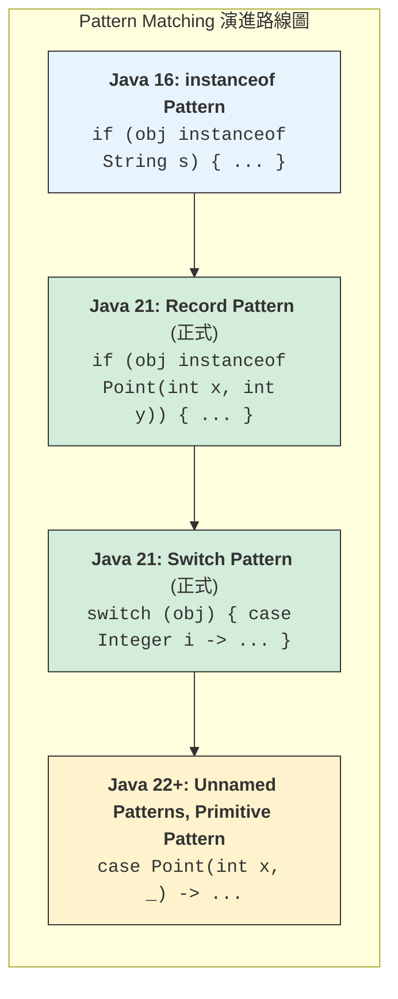

#### Switch Pattern Matching 完整語法

```java
// Java 21+：完整的 Switch Pattern Matching

// 1. Type Pattern
public String describe(Object obj) {
    return switch (obj) {
        case Integer i -> "整數：" + i;
        case Long l -> "長整數：" + l;
        case Double d -> "浮點數：" + d;
        case String s -> "字串：" + s;
        case int[] arr -> "整數陣列，長度：" + arr.length;
        case null -> "null 值";
        default -> "未知類型：" + obj.getClass().getName();
    };
}

// 2. Guarded Pattern（條件守衛）
public String categorize(Object obj) {
    return switch (obj) {
        case Integer i when i < 0 -> "負整數";
        case Integer i when i == 0 -> "零";
        case Integer i when i > 0 -> "正整數";
        case String s when s.isEmpty() -> "空字串";
        case String s when s.length() < 10 -> "短字串";
        case String s -> "長字串";
        case null -> "null";
        default -> "其他";
    };
}

// 3. Null 處理
public String handleNull(String s) {
    return switch (s) {
        case null -> "null 值";
        case String str when str.isEmpty() -> "空字串";
        case String str -> "字串：" + str;
    };
}
```

#### 進階模式匹配

```java
// Java 22+：Unnamed Pattern Variables（_）
public double calculateArea(Shape shape) {
    return switch (shape) {
        case Circle(double radius) -> Math.PI * radius * radius;
        case Rectangle(double w, double h) -> w * h;
        case Square(double side, _) -> side * side;  // 忽略第二個元素
    };
}

// 巢狀模式匹配
sealed interface Expr permits Const, Add, Neg {}
record Const(int value) implements Expr {}
record Add(Expr left, Expr right) implements Expr {}
record Neg(Expr expr) implements Expr {}

public int evaluate(Expr expr) {
    return switch (expr) {
        case Const(int v) -> v;
        case Add(Const(int a), Const(int b)) -> a + b;  // 特化處理
        case Add(var left, var right) -> evaluate(left) + evaluate(right);
        case Neg(Const(int v)) -> -v;  // 特化處理
        case Neg(var e) -> -evaluate(e);
    };
}
```

---

### 8.2 Record Pattern

#### 基本用法

```java
// Record 定義
record Point(int x, int y) {}
record Rectangle(Point topLeft, Point bottomRight) {}

// Record Pattern 解構
public void printPoint(Object obj) {
    if (obj instanceof Point(int x, int y)) {
        System.out.println("x = " + x + ", y = " + y);
    }
}

// 巢狀 Record Pattern
public int calculateWidth(Object obj) {
    if (obj instanceof Rectangle(Point(int x1, int _), Point(int x2, int _))) {
        return Math.abs(x2 - x1);
    }
    return 0;
}

// 在 Switch 中使用
public String describeShape(Object obj) {
    return switch (obj) {
        case Point(int x, int y) when x == 0 && y == 0 -> "原點";
        case Point(int x, int y) when x == y -> "在對角線上";
        case Point(int x, int y) -> "點 (" + x + ", " + y + ")";
        case Rectangle(Point(int x1, int y1), Point(int x2, int y2)) -> 
            "矩形從 (" + x1 + "," + y1 + ") 到 (" + x2 + "," + y2 + ")";
        default -> "未知形狀";
    };
}
```

#### 實務應用：JSON 解析結果處理

```java
// 定義 JSON 值的 Sealed 類型
sealed interface JsonValue permits JsonString, JsonNumber, JsonBool, 
                                   JsonNull, JsonArray, JsonObject {}
                                   
record JsonString(String value) implements JsonValue {}
record JsonNumber(double value) implements JsonValue {}
record JsonBool(boolean value) implements JsonValue {}
record JsonNull() implements JsonValue {}
record JsonArray(List<JsonValue> values) implements JsonValue {}
record JsonObject(Map<String, JsonValue> fields) implements JsonValue {}

// 使用 Pattern Matching 處理 JSON
public String formatJson(JsonValue json) {
    return switch (json) {
        case JsonString(String s) -> "\"" + s + "\"";
        case JsonNumber(double n) -> String.valueOf(n);
        case JsonBool(boolean b) -> String.valueOf(b);
        case JsonNull() -> "null";
        case JsonArray(List<JsonValue> values) -> 
            "[" + values.stream()
                .map(this::formatJson)
                .collect(Collectors.joining(", ")) + "]";
        case JsonObject(Map<String, JsonValue> fields) ->
            "{" + fields.entrySet().stream()
                .map(e -> "\"" + e.getKey() + "\": " + formatJson(e.getValue()))
                .collect(Collectors.joining(", ")) + "}";
    };
}
```

---

### 8.3 Class File API

#### 為何出現？

Java 22 引入 Class File API，提供讀取、產生、轉換 Java class 檔案的標準 API，取代 ASM 等第三方函式庫。

```java
// Java 22+ (Preview)
import java.lang.classfile.*;
import java.lang.constant.*;

public class ClassFileDemo {
    
    // 讀取 class 檔案
    public void analyzeClass(Path classFile) throws IOException {
        ClassModel classModel = ClassFile.of().parse(classFile);
        
        System.out.println("類別名稱：" + classModel.thisClass().asInternalName());
        System.out.println("父類別：" + classModel.superclass()
            .map(ce -> ce.asInternalName()).orElse("java/lang/Object"));
        
        System.out.println("方法：");
        for (MethodModel method : classModel.methods()) {
            System.out.println("  " + method.methodName().stringValue() + 
                              method.methodType().stringValue());
        }
        
        System.out.println("欄位：");
        for (FieldModel field : classModel.fields()) {
            System.out.println("  " + field.fieldName().stringValue() + 
                              ": " + field.fieldType().stringValue());
        }
    }
    
    // 產生 class 檔案
    public byte[] generateHelloWorld() {
        return ClassFile.of().build(
            ClassDesc.of("com.example", "HelloWorld"),
            classBuilder -> classBuilder
                .withFlags(ClassFile.ACC_PUBLIC)
                .withMethod(
                    "main",
                    MethodTypeDesc.of(ConstantDescs.CD_void, 
                                     ConstantDescs.CD_String.arrayType()),
                    ClassFile.ACC_PUBLIC | ClassFile.ACC_STATIC,
                    methodBuilder -> methodBuilder
                        .withCode(codeBuilder -> codeBuilder
                            .getstatic(
                                ClassDesc.of("java.lang", "System"),
                                "out",
                                ClassDesc.of("java.io", "PrintStream"))
                            .ldc("Hello, World!")
                            .invokevirtual(
                                ClassDesc.of("java.io", "PrintStream"),
                                "println",
                                MethodTypeDesc.of(ConstantDescs.CD_void, 
                                                 ConstantDescs.CD_String))
                            .return_()
                        )
                )
        );
    }
}
```

#### 適用場景

| 場景 | 傳統方式 | Class File API 優勢 |
|-----|---------|-------------------|
| 位元組碼分析 | ASM Visitor | 標準 API，無需第三方依賴 |
| 程式碼產生 | ASM / Javassist | 型別安全，IDE 支援佳 |
| 位元組碼轉換 | Java Agent + ASM | 更簡潔的 API |
| 靜態分析工具 | 各種框架 | 一致的 API |

---

### 8.4 最新 GC / JVM 優化

#### Generational ZGC（Java 21+）

```bash
# 啟用 Generational ZGC
java -XX:+UseZGC -XX:+ZGenerational -jar myapp.jar

# Generational ZGC 優勢：
# - 分代收集，更有效率
# - 年輕代頻繁收集，老年代較少收集
# - 進一步降低延遲
```

#### GC 選擇指南（Java 21+）

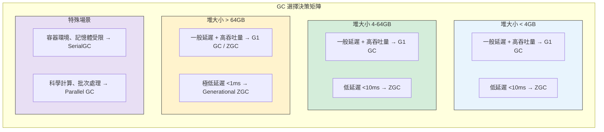

#### 容器環境優化

```bash
# Docker / Kubernetes 環境建議設定
java \
  -XX:+UseContainerSupport \
  -XX:MaxRAMPercentage=75.0 \
  -XX:InitialRAMPercentage=50.0 \
  -XX:+UseG1GC \
  -XX:MaxGCPauseMillis=200 \
  -jar myapp.jar

# 說明：
# -XX:+UseContainerSupport    自動偵測容器記憶體限制
# -XX:MaxRAMPercentage=75.0   使用容器記憶體的 75% 作為最大堆
# -XX:InitialRAMPercentage    初始堆大小
```

---

### 8.5 Java 在 Cloud-Native、AI、High Concurrency 的定位

#### Cloud-Native 架構適配

```java
// 1. GraalVM Native Image 支援
// 編譯為原生執行檔
// native-image -jar myapp.jar

// Spring Boot 3.x 原生支援
@SpringBootApplication
public class CloudNativeApp {
    
    public static void main(String[] args) {
        SpringApplication.run(CloudNativeApp.class, args);
    }
    
    // Native Image 友好的設計
    @Bean
    public RestTemplate restTemplate(RestTemplateBuilder builder) {
        return builder
            .setConnectTimeout(Duration.ofSeconds(5))
            .setReadTimeout(Duration.ofSeconds(10))
            .build();
    }
}

// 2. 健康檢查端點
@Component
public class DatabaseHealthIndicator implements HealthIndicator {
    
    @Override
    public Health health() {
        if (isDatabaseHealthy()) {
            return Health.up().withDetail("database", "connected").build();
        }
        return Health.down().withDetail("database", "unavailable").build();
    }
}
```

#### AI / ML 整合

```java
// 使用 Vector API 進行向量運算（AI 推論）
public class VectorOperations {
    
    static final VectorSpecies<Float> SPECIES = FloatVector.SPECIES_PREFERRED;
    
    // 餘弦相似度計算（用於向量搜尋）
    public static float cosineSimilarity(float[] a, float[] b) {
        float dotProduct = 0, normA = 0, normB = 0;
        int i = 0;
        
        int upperBound = SPECIES.loopBound(a.length);
        FloatVector sumDot = FloatVector.zero(SPECIES);
        FloatVector sumNormA = FloatVector.zero(SPECIES);
        FloatVector sumNormB = FloatVector.zero(SPECIES);
        
        for (; i < upperBound; i += SPECIES.length()) {
            FloatVector va = FloatVector.fromArray(SPECIES, a, i);
            FloatVector vb = FloatVector.fromArray(SPECIES, b, i);
            sumDot = va.fma(vb, sumDot);
            sumNormA = va.fma(va, sumNormA);
            sumNormB = vb.fma(vb, sumNormB);
        }
        
        dotProduct = sumDot.reduceLanes(VectorOperators.ADD);
        normA = sumNormA.reduceLanes(VectorOperators.ADD);
        normB = sumNormB.reduceLanes(VectorOperators.ADD);
        
        // 處理剩餘元素
        for (; i < a.length; i++) {
            dotProduct += a[i] * b[i];
            normA += a[i] * a[i];
            normB += b[i] * b[i];
        }
        
        return (float) (dotProduct / (Math.sqrt(normA) * Math.sqrt(normB)));
    }
}

// 使用 FFM API 呼叫原生 AI 函式庫
public class NativeAILibrary {
    
    // 呼叫 ONNX Runtime 等原生推論引擎
    public float[] runInference(float[] input) {
        // 使用 FFM API 呼叫原生函數
        // ...
        return null;
    }
}
```

#### 高並發系統架構

```java
// Virtual Thread + Structured Concurrency 實現高並發
public class HighConcurrencyService {
    
    // 處理百萬級並發連接
    public void startServer() throws IOException {
        ServerSocket serverSocket = new ServerSocket(8080);
        
        try (var executor = Executors.newVirtualThreadPerTaskExecutor()) {
            while (true) {
                Socket socket = serverSocket.accept();
                executor.submit(() -> handleConnection(socket));
            }
        }
    }
    
    private void handleConnection(Socket socket) {
        try (var scope = new StructuredTaskScope.ShutdownOnFailure()) {
            // 並行處理多個 I/O 操作
            var authTask = scope.fork(() -> authenticate(socket));
            var dataTask = scope.fork(() -> fetchData(socket));
            
            scope.join();
            scope.throwIfFailed();
            
            processRequest(authTask.get(), dataTask.get());
            
        } catch (Exception e) {
            handleError(e);
        }
    }
}
```

---

### 第八章小結

#### 關鍵要點回顧

1. **Pattern Matching** 體系完整，支援 Record、Switch、守衛條件
2. **Class File API** 提供標準的位元組碼操作能力
3. **Generational ZGC** 進一步降低 GC 延遲
4. **Java 定位**：Cloud-Native、AI、High Concurrency 的現代化平台

#### 🎯 OCP 考點提醒

- Switch Pattern Matching 的完整語法
- Record Pattern 的解構語法
- Unnamed Pattern Variables（`_`）
- `when` 守衛條件的使用

#### 📝 練習題

**問題**：以下 Record Pattern 解構是否正確？

```java
record Point(int x, int y) {}
record Line(Point start, Point end) {}

Object obj = new Line(new Point(0, 0), new Point(10, 10));

if (obj instanceof Line(Point(int x1, int y1), Point(int x2, int y2))) {
    System.out.println("Line from (" + x1 + "," + y1 + ") to (" + x2 + "," + y2 + ")");
}
```

<details>
<summary>點擊查看答案</summary>

**答案**：正確

**解析**：Java 21+ 支援巢狀 Record Pattern，可以一次解構多層 Record 結構，直接取得內部元素的值。
</details>

---

## 第九章：舊系統升版實務指南（企業必讀）

這是本手冊最重要的章節之一，提供企業從 Java 1.7 升級至現代 Java 的完整指南。

### 9.1 Java 1.7 → 17 / 21 / 25 升版路線圖

#### 推薦升版路徑

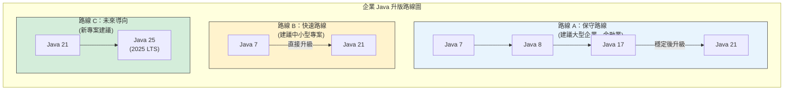

#### 升版時程建議

| 階段 | 時程 | 活動 | 交付物 |
|-----|------|------|-------|
| 評估期 | 2-4 週 | 依賴分析、風險評估 | 評估報告 |
| 準備期 | 2-4 週 | 環境建置、工具更新 | 測試環境 |
| 開發期 | 4-8 週 | 程式碼修改、測試 | 升版程式碼 |
| 驗證期 | 2-4 週 | 整合測試、效能測試 | 測試報告 |
| 上線期 | 1-2 週 | 灰度發布、監控 | 上線完成 |

---

### 9.2 常見升版風險

#### 9.2.1 Unsafe API

```java
// ❌ 問題：使用 sun.misc.Unsafe
import sun.misc.Unsafe;

public class UnsafeExample {
    private static final Unsafe unsafe = getUnsafe();
    
    private static Unsafe getUnsafe() {
        try {
            Field f = Unsafe.class.getDeclaredField("theUnsafe");
            f.setAccessible(true);
            return (Unsafe) f.get(null);
        } catch (Exception e) {
            throw new RuntimeException(e);
        }
    }
    
    // 直接記憶體操作
    public long allocateMemory(long size) {
        return unsafe.allocateMemory(size);
    }
}

// ✅ 解決方案 1：使用 VarHandle（Java 9+）
import java.lang.invoke.VarHandle;
import java.lang.invoke.MethodHandles;

public class VarHandleExample {
    private volatile int counter;
    private static final VarHandle COUNTER;
    
    static {
        try {
            COUNTER = MethodHandles.lookup()
                .findVarHandle(VarHandleExample.class, "counter", int.class);
        } catch (Exception e) {
            throw new ExceptionInInitializerError(e);
        }
    }
    
    public int incrementAndGet() {
        return (int) COUNTER.getAndAdd(this, 1) + 1;
    }
}

// ✅ 解決方案 2：使用 Foreign Memory API（Java 22+）
import java.lang.foreign.*;

public class ForeignMemoryExample {
    public MemorySegment allocateMemory(long size) {
        return Arena.global().allocate(size);
    }
}
```

#### 9.2.2 反射存取

```java
// ❌ 問題：反射存取私有成員
public class ReflectionProblem {
    public void accessPrivateField(Object obj) throws Exception {
        Field field = obj.getClass().getDeclaredField("privateField");
        field.setAccessible(true);  // Java 17+ 可能失敗
        Object value = field.get(obj);
    }
}

// Java 17+ 錯誤訊息：
// java.lang.reflect.InaccessibleObjectException: 
//   Unable to make field private ... accessible

// ✅ 解決方案 1：module-info.java 開放存取
// module com.myapp {
//     opens com.myapp.entity to org.hibernate.orm.core;
// }

// ✅ 解決方案 2：啟動參數（暫時方案）
// java --add-opens java.base/java.lang=ALL-UNNAMED -jar myapp.jar

// ✅ 解決方案 3：使用 MethodHandles（推薦）
public class MethodHandlesSolution {
    public Object accessField(Object obj, String fieldName) throws Exception {
        // 需要在同一模組內，或目標模組已開放
        MethodHandles.Lookup lookup = MethodHandles.privateLookupIn(
            obj.getClass(), MethodHandles.lookup());
        VarHandle handle = lookup.findVarHandle(
            obj.getClass(), fieldName, Object.class);
        return handle.get(obj);
    }
}
```

#### 9.2.3 ClassLoader 問題

```java
// ❌ 問題：自定義 ClassLoader 可能失敗
public class CustomClassLoader extends ClassLoader {
    @Override
    protected Class<?> findClass(String name) throws ClassNotFoundException {
        // 存取 JDK 內部類別可能失敗
        byte[] bytes = loadClassData(name);
        return defineClass(name, bytes, 0, bytes.length);
    }
}

// ✅ 解決方案：使用 MethodHandles.Lookup.defineClass()（Java 9+）
public class ModernClassLoader {
    private static final MethodHandles.Lookup LOOKUP = MethodHandles.lookup();
    
    public Class<?> defineClass(byte[] bytes) throws IllegalAccessException {
        return LOOKUP.defineClass(bytes);
    }
}
```

#### 9.2.4 編碼 / TLS / 加密

```java
// 問題 1：字元編碼
// Java 18+ 預設 UTF-8，舊系統可能依賴系統預設編碼

// ✅ 明確指定編碼
// 讀取檔案
Files.readString(path, StandardCharsets.UTF_8);
new InputStreamReader(is, StandardCharsets.UTF_8);

// 寫入檔案
Files.writeString(path, content, StandardCharsets.UTF_8);
new OutputStreamWriter(os, StandardCharsets.UTF_8);

// 問題 2：TLS 版本
// 舊系統可能使用 TLS 1.0/1.1，Java 17+ 預設停用

// ✅ 設定 TLS 版本
System.setProperty("https.protocols", "TLSv1.2,TLSv1.3");

// 或在 SSLContext 中設定
SSLContext ctx = SSLContext.getInstance("TLSv1.3");
ctx.init(null, null, null);

// 問題 3：加密演算法
// 某些弱加密演算法已被移除或停用

// ✅ 檢查 java.security 設定
// $JAVA_HOME/conf/security/java.security
// jdk.tls.disabledAlgorithms=...
```

---

### 9.3 建議升版策略（分階段）

#### 第一階段：評估與準備

```bash
# 1. 分析專案依賴
mvn dependency:tree > dependencies.txt

# 2. 檢查 JDK 內部 API 使用
jdeps --jdk-internals --multi-release 17 myapp.jar

# 3. 識別不相容的依賴
# 檢查各依賴的 Java 17/21 支援情況
```

```xml
<!-- 更新 Maven 版本（至少 3.6.3+） -->
<prerequisites>
    <maven>3.6.3</maven>
</prerequisites>

<!-- 更新編譯器插件 -->
<plugin>
    <groupId>org.apache.maven.plugins</groupId>
    <artifactId>maven-compiler-plugin</artifactId>
    <version>3.11.0</version>
    <configuration>
        <release>17</release>
    </configuration>
</plugin>
```

#### 第二階段：依賴升級

```xml
<!-- 需要升級的常見依賴 -->

<!-- Spring Boot 2.x → 3.x -->
<parent>
    <groupId>org.springframework.boot</groupId>
    <artifactId>spring-boot-starter-parent</artifactId>
    <version>3.2.0</version>
</parent>

<!-- 資料庫驅動 -->
<dependency>
    <groupId>com.oracle.database.jdbc</groupId>
    <artifactId>ojdbc11</artifactId>  <!-- Java 17+ -->
    <version>23.3.0.23.09</version>
</dependency>

<!-- Hibernate -->
<dependency>
    <groupId>org.hibernate.orm</groupId>
    <artifactId>hibernate-core</artifactId>
    <version>6.4.0.Final</version>
</dependency>

<!-- Jackson -->
<dependency>
    <groupId>com.fasterxml.jackson.core</groupId>
    <artifactId>jackson-databind</artifactId>
    <version>2.16.0</version>
</dependency>

<!-- Log4j2（注意安全版本） -->
<dependency>
    <groupId>org.apache.logging.log4j</groupId>
    <artifactId>log4j-core</artifactId>
    <version>2.22.0</version>
</dependency>
```

#### 第三階段：程式碼修改

```java
// 1. javax → jakarta 命名空間變更
// 使用 IDE 或 OpenRewrite 自動修改

// Before
import javax.persistence.Entity;
import javax.servlet.http.HttpServletRequest;

// After
import jakarta.persistence.Entity;
import jakarta.servlet.http.HttpServletRequest;

// 2. 移除已淘汰 API
// Before
Date date = new Date();
int year = date.getYear();  // 已淘汰

// After
LocalDate date = LocalDate.now();
int year = date.getYear();

// 3. 替換不安全的反射
// Before
field.setAccessible(true);

// After（如果必須使用）
// 在 module-info.java 中開放，或使用啟動參數
```

#### 第四階段：測試與驗證

```java
// 建立升版測試清單
public class UpgradeTestSuite {
    
    @Test
    void testDatabaseConnection() {
        // 測試資料庫連接
    }
    
    @Test
    void testSerialization() {
        // 測試序列化/反序列化
    }
    
    @Test
    void testDateTimeHandling() {
        // 測試日期時間處理
    }
    
    @Test
    void testCharacterEncoding() {
        // 測試字元編碼
    }
    
    @Test
    void testHttpsConnection() {
        // 測試 HTTPS 連接（TLS 版本）
    }
    
    @Test
    void testReflection() {
        // 測試反射操作
    }
}
```

```bash
# 效能測試比較
# 記錄 Java 8 vs Java 17/21 的效能指標

# 1. 啟動時間
time java -jar myapp.jar

# 2. 記憶體使用
java -XX:+PrintFlagsFinal -jar myapp.jar | grep HeapSize

# 3. GC 暫停時間
java -Xlog:gc*:file=gc.log -jar myapp.jar
```

---

### 9.4 升版 Checklist

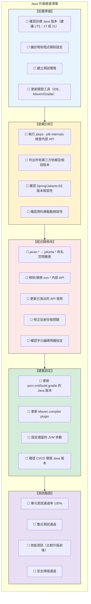

---

### 第九章小結

#### 關鍵要點回顧

1. **選擇適合的升版路徑**：保守路線 vs 快速路線
2. **識別主要風險**：Unsafe、反射、ClassLoader、編碼/TLS
3. **分階段執行**：評估 → 準備 → 修改 → 驗證 → 上線
4. **使用檢查清單**：確保不遺漏重要項目

#### 💡 企業實務建議

- 金融業/大型企業建議選擇保守路線
- 升版前務必進行完整的依賴分析
- 保留詳細的升版文件，供未來參考
- 升版後持續監控至少 2-4 週

---

## 第十章：Java OCP 認證對照與準備建議

### 10.1 Java OCP（新版）考試範圍對照

#### 考試版本

| 考試代碼 | 名稱 | Java 版本 | 建議對象 |
|---------|------|----------|---------|
| 1Z0-829 | Java SE 17 Developer | 17 | 企業開發者首選 |
| 1Z0-830 | Java SE 21 Developer | 21 | 追求最新技術者 |

#### 1Z0-829（Java SE 17）考試範圍

```mermaid
flowchart TB
    subgraph ocp17["Java SE 17 OCP 考試範圍"]
        direction TB
        
        T1["1. Date/Time/Text/Numeric<br/>• LocalDate, LocalDateTime, ZonedDateTime<br/>• Period, Duration<br/>• String, StringBuilder, Text Blocks"]
        
        T2["2. Program Flow<br/>• if/else, switch (expression + pattern matching)<br/>• for, while, do-while<br/>• break, continue, return"]
        
        T3["3. OOP<br/>• 類別、介面、Record<br/>• 封裝、繼承、多型<br/>• Sealed Classes"]
        
        T4["4. Exceptions<br/>• try-catch-finally, try-with-resources<br/>• 自訂例外、例外鏈"]
        
        T5["5. Arrays & Collections<br/>• 陣列、List、Set、Map<br/>• Comparable, Comparator"]
        
        T6["6. Streams & Lambda<br/>• Lambda, Functional Interface<br/>• Stream API, Optional"]
        
        T7["7. Modules & Packaging<br/>• Module System (JPMS)<br/>• JAR 打包"]
        
        T8["8. Concurrency<br/>• Thread, Runnable, ExecutorService<br/>• 同步、鎖、並行集合"]
        
        T9["9. I/O<br/>• 檔案 I/O, NIO.2<br/>• Serialization"]
        
        T10["10. JDBC<br/>• Connection, Statement, ResultSet<br/>• 交易管理"]
        
        T11["11. Localization<br/>• Locale, ResourceBundle<br/>• 數字/日期格式化"]
    end
    
    style T1 fill:#e8f4fd,stroke:#333,color:#333
    style T2 fill:#d4edda,stroke:#333,color:#333
    style T3 fill:#fff3cd,stroke:#333,color:#333
    style T4 fill:#fde8e8,stroke:#333,color:#333
    style T5 fill:#e8dff4,stroke:#333,color:#333
    style T6 fill:#d4edda,stroke:#333,color:#333
    style T7 fill:#e8f4fd,stroke:#333,color:#333
    style T8 fill:#fff3cd,stroke:#333,color:#333
    style T9 fill:#fde8e8,stroke:#333,color:#333
    style T10 fill:#e8dff4,stroke:#333,color:#333
    style T11 fill:#d4edda,stroke:#333,color:#333
```

---

### 10.2 必考語言特性整理

#### Lambda & Functional Interface

```java
// 必考：Predicate、Function、Consumer、Supplier
Predicate<String> isEmpty = String::isEmpty;
Function<String, Integer> length = String::length;
Consumer<String> printer = System.out::println;
Supplier<LocalDate> today = LocalDate::now;

// 必考：方法參考四種類型
// 1. 靜態方法：ClassName::staticMethod
Function<String, Integer> parser = Integer::parseInt;

// 2. 實例方法（特定物件）：instance::method
String prefix = "Hello";
Function<String, String> concat = prefix::concat;

// 3. 實例方法（任意物件）：ClassName::instanceMethod
Function<String, String> upper = String::toUpperCase;

// 4. 建構子：ClassName::new
Supplier<ArrayList<String>> factory = ArrayList::new;
```

#### Stream API

```java
// 必考：中間操作 vs 終端操作
List<String> result = list.stream()
    .filter(s -> s.length() > 3)     // 中間：延遲執行
    .map(String::toUpperCase)         // 中間：延遲執行
    .sorted()                         // 中間：延遲執行
    .collect(Collectors.toList());    // 終端：觸發執行

// 必考：reduce 操作
int sum = numbers.stream()
    .reduce(0, (a, b) -> a + b);

// 必考：Collectors
Map<String, List<Employee>> byDept = employees.stream()
    .collect(Collectors.groupingBy(Employee::getDepartment));
```

#### Record & Sealed Class

```java
// 必考：Record 語法
public record Point(int x, int y) {
    // 緊湊建構子
    public Point {
        if (x < 0 || y < 0) throw new IllegalArgumentException();
    }
}

// 必考：Sealed Class
public sealed class Shape permits Circle, Rectangle {}
public final class Circle extends Shape {}
public non-sealed class Rectangle extends Shape {}
```

#### Pattern Matching

```java
// 必考：instanceof Pattern Matching
if (obj instanceof String s) {
    System.out.println(s.length());
}

// 必考：Switch Pattern Matching（Java 21）
String result = switch (obj) {
    case Integer i -> "Integer: " + i;
    case String s -> "String: " + s;
    case null -> "null";
    default -> "Unknown";
};
```

---

### 10.3 常見陷阱題解析方向

#### 陷阱 1：Stream 的延遲執行

```java
// 問：以下程式碼輸出什麼？
Stream<String> stream = Stream.of("a", "b", "c")
    .filter(s -> {
        System.out.print(s);
        return true;
    });
System.out.println("done");

// 答：只輸出 "done"
// 原因：沒有終端操作，filter 不會執行
```

#### 陷阱 2：Optional 的正確使用

```java
// 問：以下哪個會拋出異常？
Optional<String> opt = Optional.empty();

// A
opt.orElse("default");          // 正確：回傳 "default"

// B  
opt.orElseGet(() -> "default"); // 正確：回傳 "default"

// C
opt.orElseThrow();              // 拋出 NoSuchElementException

// D
opt.get();                       // 拋出 NoSuchElementException
```

#### 陷阱 3：var 的限制

```java
// 問：以下哪些是合法的？

var list = new ArrayList<>();     // ✅ 合法（推斷為 ArrayList<Object>）
var x = null;                     // ❌ 無法推斷
var y = () -> "hello";            // ❌ Lambda 需要目標型別
var z = new int[]{1, 2, 3};       // ✅ 合法
```

#### 陷阱 4：Sealed Class 規則

```java
// 問：以下程式碼是否正確？
public sealed class Animal permits Dog, Cat {}

// A - 在不同檔案
public class Dog extends Animal {}  // ❌ 必須是 final, sealed, 或 non-sealed

// B - 正確寫法
public final class Dog extends Animal {}  // ✅

// C - 未在 permits 列表
public final class Bird extends Animal {} // ❌ 編譯錯誤
```

---

### 10.4 建議學習與實作順序

#### 學習路線圖

```mermaid
flowchart TB
    subgraph roadmap["OCP 認證準備路線圖（建議 8-12 週）"]
        direction TB
        
        subgraph week12["第 1-2 週：基礎複習"]
            W12_1["Java 核心語法"]
            W12_2["物件導向原則"]
            W12_3["例外處理"]
        end
        
        subgraph week34["第 3-4 週：Java 8 特性"]
            W34_1["Lambda Expression"]
            W34_2["Stream API"]
            W34_3["Optional"]
        end
        
        subgraph week56["第 5-6 週：Java 9-11 特性"]
            W56_1["Module System"]
            W56_2["var 關鍵字"]
            W56_3["新 API（HttpClient 等）"]
        end
        
        subgraph week78["第 7-8 週：Java 12-17 特性"]
            W78_1["Switch Expression"]
            W78_2["Text Block"]
            W78_3["Record"]
            W78_4["Sealed Class"]
            W78_5["Pattern Matching"]
        end
        
        subgraph week910["第 9-10 週：進階主題"]
            W910_1["並行程式設計"]
            W910_2["I/O 與 NIO"]
            W910_3["JDBC"]
        end
        
        subgraph week1112["第 11-12 週：模擬考與複習"]
            W1112_1["模擬考試練習"]
            W1112_2["錯題分析"]
            W1112_3["重點複習"]
        end
        
        week12 --> week34
        week34 --> week56
        week56 --> week78
        week78 --> week910
        week910 --> week1112
    end
    
    style week12 fill:#e8f4fd,stroke:#333,color:#333
    style week34 fill:#d4edda,stroke:#333,color:#333
    style week56 fill:#fff3cd,stroke:#333,color:#333
    style week78 fill:#fde8e8,stroke:#333,color:#333
    style week910 fill:#e8dff4,stroke:#333,color:#333
    style week1112 fill:#d4edda,stroke:#333,color:#333
```

#### 推薦學習資源

| 資源類型 | 推薦 | 說明 |
|---------|------|------|
| 官方文件 | Oracle Java Documentation | 最權威的參考 |
| 書籍 | OCP Java SE 17 Developer Study Guide | Sybex 出版 |
| 線上課程 | Udemy Java Certification Courses | 實作導向 |
| 練習題 | Enthuware Mock Tests | 最接近真實考試 |
| 社群 | CodeRanch | Java 認證討論區 |

---

### 第十章小結

#### 關鍵要點回顧

1. **選擇考試版本**：建議考 1Z0-829（Java 17）或 1Z0-830（Java 21）
2. **重點特性**：Lambda、Stream、Record、Sealed Class、Pattern Matching
3. **避免陷阱**：注意延遲執行、Optional 使用、var 限制
4. **充分準備**：建議 8-12 週系統學習

#### 📝 練習題

**問題**：以下哪些是 OCP Java 17 考試的重點？（多選）

- A. Lambda Expression 與方法參考
- B. Virtual Thread
- C. Record 與 Sealed Class
- D. Module System (JPMS)
- E. Structured Concurrency

<details>
<summary>點擊查看答案</summary>

**答案**：A、C、D

**解析**：
- A、C、D 都是 Java 17 的正式特性，在 OCP Java 17 考試範圍內
- B (Virtual Thread) 和 E (Structured Concurrency) 是 Java 21 的特性，不在 Java 17 考試範圍
</details>

---

## 第十一章：總結與學習地圖

### 11.1 Java 現代化能力成熟度模型

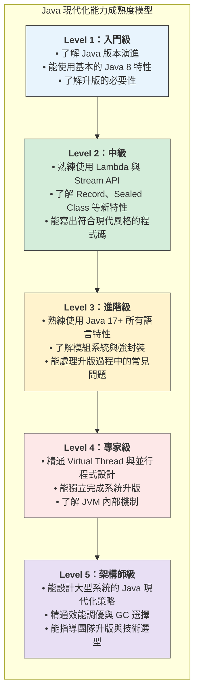

### 11.2 從 Java 7 工程師 → Java 25 架構師

#### 技能發展路徑

| 階段 | 技能重點 | 學習時間 |
|-----|---------|---------|
| Java 8 基礎 | Lambda、Stream、Optional | 4-6 週 |
| Java 11 進階 | 模組系統、var、新 API | 2-4 週 |
| Java 17 精通 | Record、Sealed Class、Pattern Matching | 2-4 週 |
| Java 21 專精 | Virtual Thread、Structured Concurrency | 4-6 週 |
| 架構設計 | 效能調優、系統設計、升版策略 | 持續學習 |

#### 職涯發展建議

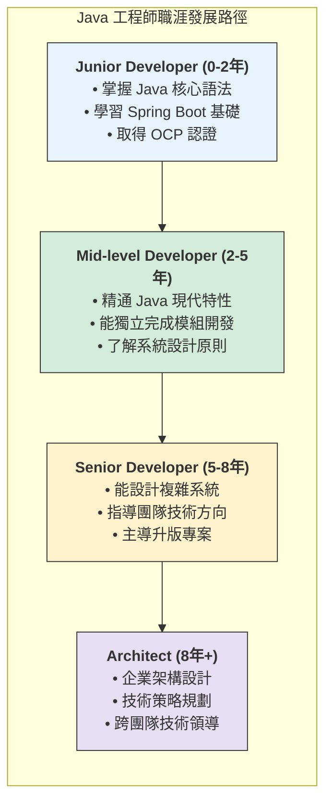

---

### 11.3 持續學習建議與官方資源

#### 官方資源

| 資源 | 網址 | 說明 |
|-----|------|------|
| Oracle Java Documentation | docs.oracle.com/javase | 官方文件 |
| OpenJDK | openjdk.org | 開源 JDK |
| JEP Index | openjdk.org/jeps | 追蹤新特性 |
| Inside Java | inside.java | Oracle Java 部落格 |

#### 社群資源

| 資源 | 網址 | 說明 |
|-----|------|------|
| Stack Overflow | stackoverflow.com | 問答社群 |
| Reddit r/java | reddit.com/r/java | 討論區 |
| Java User Groups | 各地 JUG | 線下社群 |
| JavaOne / Devoxx | 年度研討會 | 技術趨勢 |

#### 推薦閱讀

| 類型 | 書籍 | 適合程度 |
|-----|------|---------|
| 入門 | Effective Java (3rd Edition) | 中級以上 |
| 深入 | Java Concurrency in Practice | 進階 |
| 現代化 | Modern Java in Action | 中級 |
| JVM | Java Performance | 進階 |

---

### 第十一章小結

#### 關鍵要點回顧

1. **能力成熟度模型** 幫助評估自身 Java 現代化程度
2. **職涯發展路徑** 從 Junior 到 Architect 的技能演進
3. **持續學習** 是 Java 開發者的必備態度

#### 💡 結語建議

- 立即開始在現有專案中嘗試新特性
- 訂閱 Inside Java 部落格追蹤最新發展
- 參加本地 Java User Group 交流學習

---

## 附錄：升版檢查清單（Checklist）

### A. 完整升版檢查清單

```markdown
# Java 升版檢查清單

## 1. 前置評估
- [ ] 確認目標 Java 版本
- [ ] 評估升版影響範圍
- [ ] 識別關鍵依賴
- [ ] 評估時程與資源需求
- [ ] 取得管理層支持

## 2. 環境準備
- [ ] 安裝目標版本 JDK
- [ ] 更新 IDE（IntelliJ / Eclipse / VS Code）
- [ ] 更新 Maven（3.6.3+）或 Gradle（7.0+）
- [ ] 建立測試環境
- [ ] 設定 CI/CD 環境

## 3. 依賴分析
- [ ] 執行 jdeps 分析內部 API 使用
- [ ] 列出所有第三方依賴
- [ ] 確認各依賴的相容版本
- [ ] 識別需要替換的依賴
- [ ] 確認授權相容性

## 4. 程式碼修改
- [ ] javax → jakarta 命名空間
- [ ] 移除 sun.* / com.sun.* 使用
- [ ] 更新已淘汰 API
- [ ] 修正反射存取問題
- [ ] 確認編碼設定
- [ ] 更新 TLS/加密設定

## 5. 建置設定
- [ ] 更新 pom.xml / build.gradle
- [ ] 設定編譯器版本
- [ ] 配置 module-info.java（如適用）
- [ ] 更新 JVM 啟動參數
- [ ] 調整 GC 設定

## 6. 測試驗證
- [ ] 單元測試 100% 通過
- [ ] 整合測試通過
- [ ] 效能測試（比較前後）
- [ ] 安全掃描通過
- [ ] 壓力測試
- [ ] 回歸測試

## 7. 部署準備
- [ ] 更新部署腳本
- [ ] 更新容器映像
- [ ] 更新伺服器 JDK
- [ ] 準備回滾計畫
- [ ] 準備監控告警

## 8. 上線執行
- [ ] 灰度發布
- [ ] 監控錯誤日誌
- [ ] 監控效能指標
- [ ] 監控 GC 行為
- [ ] 收集使用者回饋

## 9. 後續維護
- [ ] 更新技術文件
- [ ] 團隊知識分享
- [ ] 收集經驗教訓
- [ ] 規劃下次升版
```

### B. 快速參考卡

#### Java 版本特性速查

| 版本 | 關鍵特性 | 程式碼範例 |
|-----|---------|-----------|
| 8 | Lambda | `list.forEach(x -> ...)` |
| 8 | Stream | `list.stream().filter().map()` |
| 10 | var | `var list = new ArrayList<>()` |
| 14 | Switch Expression | `var x = switch(y) { case A -> 1; }` |
| 15 | Text Block | `"""多行字串"""` |
| 16 | Record | `record Point(int x, int y) {}` |
| 17 | Sealed Class | `sealed class X permits Y {}` |
| 21 | Virtual Thread | `Thread.startVirtualThread(...)` |

#### 常用 JVM 參數

```bash
# 記憶體設定
-Xms2g -Xmx2g          # 堆大小
-XX:MaxMetaspaceSize=256m  # Metaspace 大小

# GC 選擇
-XX:+UseG1GC           # G1 GC（預設）
-XX:+UseZGC            # ZGC（低延遲）
-XX:+UseParallelGC     # Parallel GC（吞吐量）

# 除錯
-XX:+HeapDumpOnOutOfMemoryError
-Xlog:gc*:file=gc.log

# 模組系統
--add-opens java.base/java.lang=ALL-UNNAMED
--add-modules java.se
```

---

## 結語

恭喜您完成本手冊的學習！從 Java 1.7 到 Java 25 的旅程，涵蓋了 Java 近十年的重大演進。

### 關鍵收穫

1. **語言進化**：從冗長的物件導向走向簡潔的函數式與模式匹配
2. **並行革命**：Virtual Thread 開啟高並發程式設計新紀元
3. **平台現代化**：模組系統、新 GC、雲原生適配
4. **實務能力**：掌握升版策略與風險控管

### 下一步行動

1. **立即行動**：在現有專案中開始使用 Java 17+ 特性
2. **持續學習**：關注 JEP 追蹤未來發展
3. **取得認證**：報考 Java OCP 認證
4. **分享知識**：將所學分享給團隊成員

---

> **文件資訊**  
> - 版本：1.0  
> - 建立日期：2025 年 12 月  
> - 維護團隊：Java 技術培訓小組  
> - 聯絡方式：chihhung.cheng@gmail.com

---

*本手冊將持續更新，以反映 Java 最新發展。*

